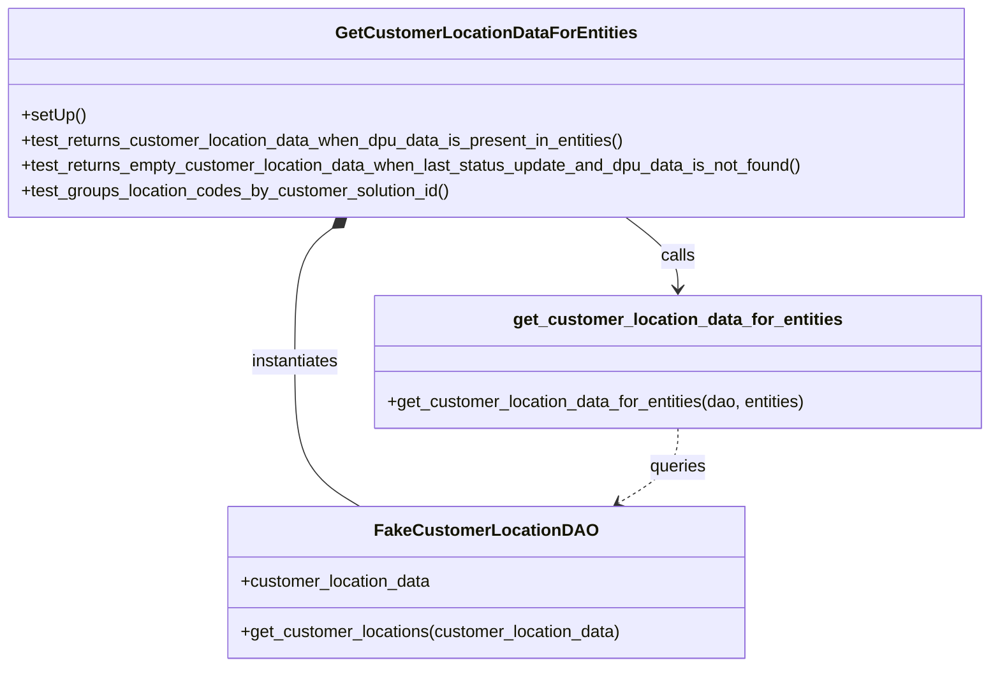

# Diagram: entity_core/entity_service/entity_service_tests/test_entity_exports/test_csv_export.py

> Auto-generated by Obscura crawlers

## Mermaid

### SVG

<svg id="container" width="943.2890625" xmlns="http://www.w3.org/2000/svg" class="classDiagram" height="632" viewBox="0 0 943.2890625 632" role="graphics-document document" aria-roledescription="class"><g><defs><marker id="container_class-aggregationStart" class="marker aggregation class" refX="18" refY="7" markerWidth="190" markerHeight="240" orient="auto"><path d="M 18,7 L9,13 L1,7 L9,1 Z"></path></marker></defs><defs><marker id="container_class-aggregationEnd" class="marker aggregation class" refX="1" refY="7" markerWidth="20" markerHeight="28" orient="auto"><path d="M 18,7 L9,13 L1,7 L9,1 Z"></path></marker></defs><defs><marker id="container_class-extensionStart" class="marker extension class" refX="18" refY="7" markerWidth="190" markerHeight="240" orient="auto"><path d="M 1,7 L18,13 V 1 Z"></path></marker></defs><defs><marker id="container_class-extensionEnd" class="marker extension class" refX="1" refY="7" markerWidth="20" markerHeight="28" orient="auto"><path d="M 1,1 V 13 L18,7 Z"></path></marker></defs><defs><marker id="container_class-compositionStart" class="marker composition class" refX="18" refY="7" markerWidth="190" markerHeight="240" orient="auto"><path d="M 18,7 L9,13 L1,7 L9,1 Z"></path></marker></defs><defs><marker id="container_class-compositionEnd" class="marker composition class" refX="1" refY="7" markerWidth="20" markerHeight="28" orient="auto"><path d="M 18,7 L9,13 L1,7 L9,1 Z"></path></marker></defs><defs><marker id="container_class-dependencyStart" class="marker dependency class" refX="6" refY="7" markerWidth="190" markerHeight="240" orient="auto"><path d="M 5,7 L9,13 L1,7 L9,1 Z"></path></marker></defs><defs><marker id="container_class-dependencyEnd" class="marker dependency class" refX="13" refY="7" markerWidth="20" markerHeight="28" orient="auto"><path d="M 18,7 L9,13 L14,7 L9,1 Z"></path></marker></defs><defs><marker id="container_class-lollipopStart" class="marker lollipop class" refX="13" refY="7" markerWidth="190" markerHeight="240" orient="auto"><circle stroke="black" fill="transparent" cx="7" cy="7" r="6"></circle></marker></defs><defs><marker id="container_class-lollipopEnd" class="marker lollipop class" refX="1" refY="7" markerWidth="190" markerHeight="240" orient="auto"><circle stroke="black" fill="transparent" cx="7" cy="7" r="6"></circle></marker></defs><g class="root"><g class="clusters"></g><g class="edgePaths"><path d="M315.634,216.275L309.627,220.729C303.621,225.183,291.607,234.092,285.6,255.212C279.594,276.333,279.594,309.667,279.594,343C279.594,376.333,279.594,409.667,289.97,432.5C300.346,455.333,321.098,467.667,331.474,473.833L341.85,480" id="id_GetCustomerLocationDataForEntities_FakeCustomerLocationDAO_1" class="edge-thickness-normal edge-pattern-solid relation" style=";;;" data-edge="true" data-et="edge" data-id="id_GetCustomerLocationDataForEntities_FakeCustomerLocationDAO_1" data-points="W3sieCI6MzI5LjQ4OTk3NTg3MzE2MTc3LCJ5IjoyMDZ9LHsieCI6Mjc5LjU5Mzc1LCJ5IjoyNDN9LHsieCI6Mjc5LjU5Mzc1LCJ5IjozNDN9LHsieCI6Mjc5LjU5Mzc1LCJ5Ijo0NDN9LHsieCI6MzQxLjg0OTU5MTQ1NjQyMiwieSI6NDgwfV0=" marker-start="url(#container_class-compositionStart)"></path><path d="M596.502,206L604.818,212.167C613.134,218.333,629.766,230.667,638.082,242C646.398,253.333,646.398,263.667,646.398,268.833L646.398,274" id="id_GetCustomerLocationDataForEntities_get_customer_location_data_for_entities_2" class="edge-thickness-normal edge-pattern-solid relation" style=";;;" data-edge="true" data-et="edge" data-id="id_GetCustomerLocationDataForEntities_get_customer_location_data_for_entities_2" data-points="W3sieCI6NTk2LjUwMjIxMTYyNjgzODMsInkiOjIwNn0seyJ4Ijo2NDYuMzk4NDM3NSwieSI6MjQzfSx7IngiOjY0Ni4zOTg0Mzc1LCJ5IjoyODB9XQ==" marker-end="url(#container_class-dependencyEnd)"></path><path d="M646.398,406L646.398,412.167C646.398,418.333,646.398,430.667,636.882,442.489C627.366,454.312,608.333,465.623,598.817,471.279L589.3,476.935" id="id_get_customer_location_data_for_entities_FakeCustomerLocationDAO_3" class="edge-thickness-normal edge-pattern-dashed relation" style=";;;" data-edge="true" data-et="edge" data-id="id_get_customer_location_data_for_entities_FakeCustomerLocationDAO_3" data-points="W3sieCI6NjQ2LjM5ODQzNzUsInkiOjQwNn0seyJ4Ijo2NDYuMzk4NDM3NSwieSI6NDQzfSx7IngiOjU4NC4xNDI1OTYwNDM1NzgsInkiOjQ4MH1d" marker-end="url(#container_class-dependencyEnd)"></path></g><g class="edgeLabels"><g class="edgeLabel" transform="translate(279.59375, 343)"><g class="label" data-id="id_GetCustomerLocationDataForEntities_FakeCustomerLocationDAO_1" transform="translate(-42.9140625, -12)"><foreignObject width="85.828125" height="24">

instantiates

</foreignObject></g></g><g class="edgeLabel" transform="translate(646.3984375, 243)"><g class="label" data-id="id_GetCustomerLocationDataForEntities_get_customer_location_data_for_entities_2" transform="translate(-16.4453125, -12)"><foreignObject width="32.890625" height="24">

calls

</foreignObject></g></g><g class="edgeLabel" transform="translate(646.3984375, 443)"><g class="label" data-id="id_get_customer_location_data_for_entities_FakeCustomerLocationDAO_3" transform="translate(-27.2421875, -12)"><foreignObject width="54.484375" height="24">

queries

</foreignObject></g></g></g><g class="nodes"><g class="node default" id="classId-GetCustomerLocationDataForEntities-0" transform="translate(462.99609375, 107)"><g class="basic label-container"><path d="M-454.99609375 -99 L454.99609375 -99 L454.99609375 99 L-454.99609375 99" stroke="none" stroke-width="0" fill="#ECECFF" style=""></path><path d="M-454.99609375 -99 C-270.8319740806753 -99, -86.66785441135056 -99, 454.99609375 -99 M-454.99609375 -99 C-237.29740803453748 -99, -19.598722319074966 -99, 454.99609375 -99 M454.99609375 -99 C454.99609375 -55.91601149641479, 454.99609375 -12.832022992829579, 454.99609375 99 M454.99609375 -99 C454.99609375 -30.185445686577367, 454.99609375 38.629108626845266, 454.99609375 99 M454.99609375 99 C225.94748683458306 99, -3.10112008083388 99, -454.99609375 99 M454.99609375 99 C268.9561076993409 99, 82.91612164868184 99, -454.99609375 99 M-454.99609375 99 C-454.99609375 48.51786833701168, -454.99609375 -1.9642633259766455, -454.99609375 -99 M-454.99609375 99 C-454.99609375 30.195244954595267, -454.99609375 -38.609510090809465, -454.99609375 -99" stroke="#9370DB" stroke-width="1.3" fill="none" stroke-dasharray="0 0" style=""></path></g><g class="annotation-group text" transform="translate(0, -75)"></g><g class="label-group text" transform="translate(-135.0234375, -75)"><g class="label" style="font-weight: bolder" transform="translate(0,-12)"><foreignObject width="270.046875" height="24">

GetCustomerLocationDataForEntities

</foreignObject></g></g><g class="members-group text" transform="translate(-442.99609375, -27)"></g><g class="methods-group text" transform="translate(-442.99609375, 3)"><g class="label" style="" transform="translate(0,-12)"><foreignObject width="60.421875" height="24">

+setUp()

</foreignObject></g><g class="label" style="" transform="translate(0,12)"><foreignObject width="581.359375" height="24">

+test_returns_customer_location_data_when_dpu_data_is_present_in_entities()

</foreignObject></g><g class="label" style="" transform="translate(0,36)"><foreignObject width="750.96875" height="24">

+test_returns_empty_customer_location_data_when_last_status_update_and_dpu_data_is_not_found()

</foreignObject></g><g class="label" style="" transform="translate(0,60)"><foreignObject width="411.171875" height="24">

+test_groups_location_codes_by_customer_solution_id()

</foreignObject></g></g><g class="divider" style=""><path d="M-454.99609375 -51 C-96.997179466984 -51, 261.001734816032 -51, 454.99609375 -51 M-454.99609375 -51 C-207.99249078857682 -51, 39.01111217284637 -51, 454.99609375 -51" stroke="#9370DB" stroke-width="1.3" fill="none" stroke-dasharray="0 0" style=""></path></g><g class="divider" style=""><path d="M-454.99609375 -27 C-265.3026621189475 -27, -75.60923048789499 -27, 454.99609375 -27 M-454.99609375 -27 C-208.97219491259392 -27, 37.05170392481216 -27, 454.99609375 -27" stroke="#9370DB" stroke-width="1.3" fill="none" stroke-dasharray="0 0" style=""></path></g></g><g class="node default" id="classId-FakeCustomerLocationDAO-1" transform="translate(462.99609375, 552)"><g class="basic label-container"><path d="M-243.34765625 -72 L243.34765625 -72 L243.34765625 72 L-243.34765625 72" stroke="none" stroke-width="0" fill="#ECECFF" style=""></path><path d="M-243.34765625 -72 C-140.02753588976697 -72, -36.707415529533904 -72, 243.34765625 -72 M-243.34765625 -72 C-128.48912978341136 -72, -13.630603316822715 -72, 243.34765625 -72 M243.34765625 -72 C243.34765625 -42.69415975394301, 243.34765625 -13.388319507886024, 243.34765625 72 M243.34765625 -72 C243.34765625 -25.712852251866906, 243.34765625 20.57429549626619, 243.34765625 72 M243.34765625 72 C83.01515159449673 72, -77.31735306100654 72, -243.34765625 72 M243.34765625 72 C69.63235573015902 72, -104.08294478968196 72, -243.34765625 72 M-243.34765625 72 C-243.34765625 15.993132029290699, -243.34765625 -40.0137359414186, -243.34765625 -72 M-243.34765625 72 C-243.34765625 40.99035134910227, -243.34765625 9.980702698204531, -243.34765625 -72" stroke="#9370DB" stroke-width="1.3" fill="none" stroke-dasharray="0 0" style=""></path></g><g class="annotation-group text" transform="translate(0, -48)"></g><g class="label-group text" transform="translate(-98.0859375, -48)"><g class="label" style="font-weight: bolder" transform="translate(0,-12)"><foreignObject width="196.171875" height="24">

FakeCustomerLocationDAO

</foreignObject></g></g><g class="members-group text" transform="translate(-231.34765625, 0)"><g class="label" style="" transform="translate(0,-12)"><foreignObject width="182.421875" height="24">

+customer_location_data

</foreignObject></g></g><g class="methods-group text" transform="translate(-231.34765625, 48)"><g class="label" style="" transform="translate(0,-12)"><foreignObject width="364.609375" height="24">

+get_customer_locations(customer_location_data)

</foreignObject></g></g><g class="divider" style=""><path d="M-243.34765625 -24 C-97.11122969950748 -24, 49.12519685098505 -24, 243.34765625 -24 M-243.34765625 -24 C-104.03373899912197 -24, 35.28017825175607 -24, 243.34765625 -24" stroke="#9370DB" stroke-width="1.3" fill="none" stroke-dasharray="0 0" style=""></path></g><g class="divider" style=""><path d="M-243.34765625 24 C-71.08284540157993 24, 101.18196544684014 24, 243.34765625 24 M-243.34765625 24 C-104.28946069183286 24, 34.768734866334285 24, 243.34765625 24" stroke="#9370DB" stroke-width="1.3" fill="none" stroke-dasharray="0 0" style=""></path></g></g><g class="node default" id="classId-get_customer_location_data_for_entities-2" transform="translate(646.3984375, 343)"><g class="basic label-container"><path d="M-288.890625 -63 L288.890625 -63 L288.890625 63 L-288.890625 63" stroke="none" stroke-width="0" fill="#ECECFF" style=""></path><path d="M-288.890625 -63 C-139.602125010396 -63, 9.686374979207983 -63, 288.890625 -63 M-288.890625 -63 C-125.13024479210705 -63, 38.6301354157859 -63, 288.890625 -63 M288.890625 -63 C288.890625 -19.969057120850785, 288.890625 23.06188575829843, 288.890625 63 M288.890625 -63 C288.890625 -24.309714563329088, 288.890625 14.380570873341824, 288.890625 63 M288.890625 63 C101.39653031229932 63, -86.09756437540136 63, -288.890625 63 M288.890625 63 C171.53931491970926 63, 54.18800483941851 63, -288.890625 63 M-288.890625 63 C-288.890625 12.765225331742435, -288.890625 -37.46954933651513, -288.890625 -63 M-288.890625 63 C-288.890625 27.42266183616747, -288.890625 -8.154676327665058, -288.890625 -63" stroke="#9370DB" stroke-width="1.3" fill="none" stroke-dasharray="0 0" style=""></path></g><g class="annotation-group text" transform="translate(0, -39)"></g><g class="label-group text" transform="translate(-149.71875, -39)"><g class="label" style="font-weight: bolder" transform="translate(0,-12)"><foreignObject width="299.4375" height="24">

get_customer_location_data_for_entities

</foreignObject></g></g><g class="members-group text" transform="translate(-276.890625, 9)"></g><g class="methods-group text" transform="translate(-276.890625, 39)"><g class="label" style="" transform="translate(0,-12)"><foreignObject width="404.0625" height="24">

+get_customer_location_data_for_entities(dao, entities)

</foreignObject></g></g><g class="divider" style=""><path d="M-288.890625 -15 C-89.02537019762875 -15, 110.83988460474251 -15, 288.890625 -15 M-288.890625 -15 C-61.079844649912076 -15, 166.73093570017585 -15, 288.890625 -15" stroke="#9370DB" stroke-width="1.3" fill="none" stroke-dasharray="0 0" style=""></path></g><g class="divider" style=""><path d="M-288.890625 9 C-74.30138658077894 9, 140.28785183844212 9, 288.890625 9 M-288.890625 9 C-163.83339986871567 9, -38.77617473743132 9, 288.890625 9" stroke="#9370DB" stroke-width="1.3" fill="none" stroke-dasharray="0 0" style=""></path></g></g></g></g></g></svg>
