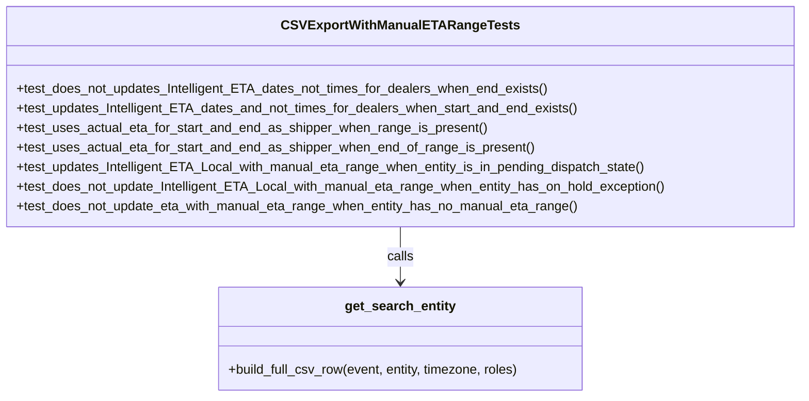

# Diagram: entity_core/entity_service/entity_service_tests/test_entity_exports/test_csv_export_with_manual_eta_range.py


> Auto-generated by Obscura crawlers

## Diagram 1



### SVG

<svg id="container" width="975.5234375" xmlns="http://www.w3.org/2000/svg" class="classDiagram" height="486" viewBox="0 0 975.5234375 486" role="graphics-document document" aria-roledescription="class"><style>#container{font-family:"trebuchet ms",verdana,arial,sans-serif;font-size:16px;fill:#333;}@keyframes edge-animation-frame{from{stroke-dashoffset:0;}}@keyframes dash{to{stroke-dashoffset:0;}}#container .edge-animation-slow{stroke-dasharray:9,5!important;stroke-dashoffset:900;animation:dash 50s linear infinite;stroke-linecap:round;}#container .edge-animation-fast{stroke-dasharray:9,5!important;stroke-dashoffset:900;animation:dash 20s linear infinite;stroke-linecap:round;}#container .error-icon{fill:#552222;}#container .error-text{fill:#552222;stroke:#552222;}#container .edge-thickness-normal{stroke-width:1px;}#container .edge-thickness-thick{stroke-width:3.5px;}#container .edge-pattern-solid{stroke-dasharray:0;}#container .edge-thickness-invisible{stroke-width:0;fill:none;}#container .edge-pattern-dashed{stroke-dasharray:3;}#container .edge-pattern-dotted{stroke-dasharray:2;}#container .marker{fill:#333333;stroke:#333333;}#container .marker.cross{stroke:#333333;}#container svg{font-family:"trebuchet ms",verdana,arial,sans-serif;font-size:16px;}#container p{margin:0;}#container g.classGroup text{fill:#9370DB;stroke:none;font-family:"trebuchet ms",verdana,arial,sans-serif;font-size:10px;}#container g.classGroup text .title{font-weight:bolder;}#container .nodeLabel,#container .edgeLabel{color:#131300;}#container .edgeLabel .label rect{fill:#ECECFF;}#container .label text{fill:#131300;}#container .labelBkg{background:#ECECFF;}#container .edgeLabel .label span{background:#ECECFF;}#container .classTitle{font-weight:bolder;}#container .node rect,#container .node circle,#container .node ellipse,#container .node polygon,#container .node path{fill:#ECECFF;stroke:#9370DB;stroke-width:1px;}#container .divider{stroke:#9370DB;stroke-width:1;}#container g.clickable{cursor:pointer;}#container g.classGroup rect{fill:#ECECFF;stroke:#9370DB;}#container g.classGroup line{stroke:#9370DB;stroke-width:1;}#container .classLabel .box{stroke:none;stroke-width:0;fill:#ECECFF;opacity:0.5;}#container .classLabel .label{fill:#9370DB;font-size:10px;}#container .relation{stroke:#333333;stroke-width:1;fill:none;}#container .dashed-line{stroke-dasharray:3;}#container .dotted-line{stroke-dasharray:1 2;}#container #compositionStart,#container .composition{fill:#333333!important;stroke:#333333!important;stroke-width:1;}#container #compositionEnd,#container .composition{fill:#333333!important;stroke:#333333!important;stroke-width:1;}#container #dependencyStart,#container .dependency{fill:#333333!important;stroke:#333333!important;stroke-width:1;}#container #dependencyStart,#container .dependency{fill:#333333!important;stroke:#333333!important;stroke-width:1;}#container #extensionStart,#container .extension{fill:transparent!important;stroke:#333333!important;stroke-width:1;}#container #extensionEnd,#container .extension{fill:transparent!important;stroke:#333333!important;stroke-width:1;}#container #aggregationStart,#container .aggregation{fill:transparent!important;stroke:#333333!important;stroke-width:1;}#container #aggregationEnd,#container .aggregation{fill:transparent!important;stroke:#333333!important;stroke-width:1;}#container #lollipopStart,#container .lollipop{fill:#ECECFF!important;stroke:#333333!important;stroke-width:1;}#container #lollipopEnd,#container .lollipop{fill:#ECECFF!important;stroke:#333333!important;stroke-width:1;}#container .edgeTerminals{font-size:11px;line-height:initial;}#container .classTitleText{text-anchor:middle;font-size:18px;fill:#333;}#container .label-icon{display:inline-block;height:1em;overflow:visible;vertical-align:-0.125em;}#container .node .label-icon path{fill:currentColor;stroke:revert;stroke-width:revert;}#container :root{--mermaid-font-family:"trebuchet ms",verdana,arial,sans-serif;}</style><g><defs><marker id="container_class-aggregationStart" class="marker aggregation class" refX="18" refY="7" markerWidth="190" markerHeight="240" orient="auto"><path d="M 18,7 L9,13 L1,7 L9,1 Z"></path></marker></defs><defs><marker id="container_class-aggregationEnd" class="marker aggregation class" refX="1" refY="7" markerWidth="20" markerHeight="28" orient="auto"><path d="M 18,7 L9,13 L1,7 L9,1 Z"></path></marker></defs><defs><marker id="container_class-extensionStart" class="marker extension class" refX="18" refY="7" markerWidth="190" markerHeight="240" orient="auto"><path d="M 1,7 L18,13 V 1 Z"></path></marker></defs><defs><marker id="container_class-extensionEnd" class="marker extension class" refX="1" refY="7" markerWidth="20" markerHeight="28" orient="auto"><path d="M 1,1 V 13 L18,7 Z"></path></marker></defs><defs><marker id="container_class-compositionStart" class="marker composition class" refX="18" refY="7" markerWidth="190" markerHeight="240" orient="auto"><path d="M 18,7 L9,13 L1,7 L9,1 Z"></path></marker></defs><defs><marker id="container_class-compositionEnd" class="marker composition class" refX="1" refY="7" markerWidth="20" markerHeight="28" orient="auto"><path d="M 18,7 L9,13 L1,7 L9,1 Z"></path></marker></defs><defs><marker id="container_class-dependencyStart" class="marker dependency class" refX="6" refY="7" markerWidth="190" markerHeight="240" orient="auto"><path d="M 5,7 L9,13 L1,7 L9,1 Z"></path></marker></defs><defs><marker id="container_class-dependencyEnd" class="marker dependency class" refX="13" refY="7" markerWidth="20" markerHeight="28" orient="auto"><path d="M 18,7 L9,13 L14,7 L9,1 Z"></path></marker></defs><defs><marker id="container_class-lollipopStart" class="marker lollipop class" refX="13" refY="7" markerWidth="190" markerHeight="240" orient="auto"><circle stroke="black" fill="transparent" cx="7" cy="7" r="6"></circle></marker></defs><defs><marker id="container_class-lollipopEnd" class="marker lollipop class" refX="1" refY="7" markerWidth="190" markerHeight="240" orient="auto"><circle stroke="black" fill="transparent" cx="7" cy="7" r="6"></circle></marker></defs><g class="root"><g class="clusters"></g><g class="edgePaths"><path d="M487.762,278L487.762,284.167C487.762,290.333,487.762,302.667,487.762,314C487.762,325.333,487.762,335.667,487.762,340.833L487.762,346" id="id_CSVExportWithManualETARangeTests_get_search_entity_1" class="edge-thickness-normal edge-pattern-solid relation" style=";;;" data-edge="true" data-et="edge" data-id="id_CSVExportWithManualETARangeTests_get_search_entity_1" data-points="W3sieCI6NDg3Ljc2MTcxODc1LCJ5IjoyNzh9LHsieCI6NDg3Ljc2MTcxODc1LCJ5IjozMTV9LHsieCI6NDg3Ljc2MTcxODc1LCJ5IjozNTJ9XQ==" marker-end="url(#container_class-dependencyEnd)"></path></g><g class="edgeLabels"><g class="edgeLabel" transform="translate(487.76171875, 315)"><g class="label" data-id="id_CSVExportWithManualETARangeTests_get_search_entity_1" transform="translate(-16.4453125, -12)"><foreignObject width="32.890625" height="24"><div xmlns="http://www.w3.org/1999/xhtml" class="labelBkg" style="display: table-cell; white-space: nowrap; line-height: 1.5; max-width: 200px; text-align: center;"><span class="edgeLabel"><p>calls</p></span></div></foreignObject></g></g></g><g class="nodes"><g class="node default" id="classId-CSVExportWithManualETARangeTests-0" transform="translate(487.76171875, 143)"><g class="basic label-container"><path d="M-479.76171875 -135 L479.76171875 -135 L479.76171875 135 L-479.76171875 135" stroke="none" stroke-width="0" fill="#ECECFF" style=""></path><path d="M-479.76171875 -135 C-226.68738485529065 -135, 26.38694903941871 -135, 479.76171875 -135 M-479.76171875 -135 C-275.965565817339 -135, -72.16941288467791 -135, 479.76171875 -135 M479.76171875 -135 C479.76171875 -79.6106706428753, 479.76171875 -24.221341285750597, 479.76171875 135 M479.76171875 -135 C479.76171875 -74.87358089216681, 479.76171875 -14.747161784333613, 479.76171875 135 M479.76171875 135 C104.41097320220678 135, -270.93977234558645 135, -479.76171875 135 M479.76171875 135 C197.1787407908502 135, -85.40423716829957 135, -479.76171875 135 M-479.76171875 135 C-479.76171875 54.039896970738724, -479.76171875 -26.920206058522552, -479.76171875 -135 M-479.76171875 135 C-479.76171875 74.6428697026421, -479.76171875 14.285739405284204, -479.76171875 -135" stroke="#9370DB" stroke-width="1.3" fill="none" stroke-dasharray="0 0" style=""></path></g><g class="annotation-group text" transform="translate(0, -111)"></g><g class="label-group text" transform="translate(-135.2890625, -111)"><g class="label" style="font-weight: bolder" transform="translate(0,-12)"><foreignObject width="270.578125" height="24"><div xmlns="http://www.w3.org/1999/xhtml" style="display: table-cell; white-space: nowrap; line-height: 1.5; max-width: 316px; text-align: center;"><span class="nodeLabel markdown-node-label" style=""><p>CSVExportWithManualETARangeTests</p></span></div></foreignObject></g></g><g class="members-group text" transform="translate(-467.76171875, -63)"></g><g class="methods-group text" transform="translate(-467.76171875, -33)"><g class="label" style="" transform="translate(0,-12)"><foreignObject width="652.96875" height="24"><div xmlns="http://www.w3.org/1999/xhtml" style="display: table-cell; white-space: nowrap; line-height: 1.5; max-width: 710px; text-align: center;"><span class="nodeLabel markdown-node-label" style=""><p>+test_does_not_updates_Intelligent_ETA_dates_not_times_for_dealers_when_end_exists()</p></span></div></foreignObject></g><g class="label" style="" transform="translate(0,12)"><foreignObject width="690.78125" height="24"><div xmlns="http://www.w3.org/1999/xhtml" style="display: table-cell; white-space: nowrap; line-height: 1.5; max-width: 748px; text-align: center;"><span class="nodeLabel markdown-node-label" style=""><p>+test_updates_Intelligent_ETA_dates_and_not_times_for_dealers_when_start_and_end_exists()</p></span></div></foreignObject></g><g class="label" style="" transform="translate(0,36)"><foreignObject width="576.0625" height="24"><div xmlns="http://www.w3.org/1999/xhtml" style="display: table-cell; white-space: nowrap; line-height: 1.5; max-width: 633px; text-align: center;"><span class="nodeLabel markdown-node-label" style=""><p>+test_uses_actual_eta_for_start_and_end_as_shipper_when_range_is_present()</p></span></div></foreignObject></g><g class="label" style="" transform="translate(0,60)"><foreignObject width="633.9375" height="24"><div xmlns="http://www.w3.org/1999/xhtml" style="display: table-cell; white-space: nowrap; line-height: 1.5; max-width: 691px; text-align: center;"><span class="nodeLabel markdown-node-label" style=""><p>+test_uses_actual_eta_for_start_and_end_as_shipper_when_end_of_range_is_present()</p></span></div></foreignObject></g><g class="label" style="" transform="translate(0,84)"><foreignObject width="776.546875" height="24"><div xmlns="http://www.w3.org/1999/xhtml" style="display: table-cell; white-space: nowrap; line-height: 1.5; max-width: 834px; text-align: center;"><span class="nodeLabel markdown-node-label" style=""><p>+test_updates_Intelligent_ETA_Local_with_manual_eta_range_when_entity_is_in_pending_dispatch_state()</p></span></div></foreignObject></g><g class="label" style="" transform="translate(0,108)"><foreignObject width="800.234375" height="24"><div xmlns="http://www.w3.org/1999/xhtml" style="display: table-cell; white-space: nowrap; line-height: 1.5; max-width: 858px; text-align: center;"><span class="nodeLabel markdown-node-label" style=""><p>+test_does_not_update_Intelligent_ETA_Local_with_manual_eta_range_when_entity_has_on_hold_exception()</p></span></div></foreignObject></g><g class="label" style="" transform="translate(0,132)"><foreignObject width="691.921875" height="24"><div xmlns="http://www.w3.org/1999/xhtml" style="display: table-cell; white-space: nowrap; line-height: 1.5; max-width: 749px; text-align: center;"><span class="nodeLabel markdown-node-label" style=""><p>+test_does_not_update_eta_with_manual_eta_range_when_entity_has_no_manual_eta_range()</p></span></div></foreignObject></g></g><g class="divider" style=""><path d="M-479.76171875 -87 C-177.95160031212015 -87, 123.8585181257597 -87, 479.76171875 -87 M-479.76171875 -87 C-223.19310365022318 -87, 33.37551144955364 -87, 479.76171875 -87" stroke="#9370DB" stroke-width="1.3" fill="none" stroke-dasharray="0 0" style=""></path></g><g class="divider" style=""><path d="M-479.76171875 -63 C-230.62671605677767 -63, 18.508286636444666 -63, 479.76171875 -63 M-479.76171875 -63 C-139.91538348036187 -63, 199.93095178927626 -63, 479.76171875 -63" stroke="#9370DB" stroke-width="1.3" fill="none" stroke-dasharray="0 0" style=""></path></g></g><g class="node default" id="classId-get_search_entity-1" transform="translate(487.76171875, 415)"><g class="basic label-container"><path d="M-225.5078125 -63 L225.5078125 -63 L225.5078125 63 L-225.5078125 63" stroke="none" stroke-width="0" fill="#ECECFF" style=""></path><path d="M-225.5078125 -63 C-48.96003120566087 -63, 127.58775008867826 -63, 225.5078125 -63 M-225.5078125 -63 C-128.64464006410685 -63, -31.781467628213733 -63, 225.5078125 -63 M225.5078125 -63 C225.5078125 -24.240290804344404, 225.5078125 14.519418391311191, 225.5078125 63 M225.5078125 -63 C225.5078125 -28.129415654983653, 225.5078125 6.741168690032694, 225.5078125 63 M225.5078125 63 C71.08203674699416 63, -83.34373900601167 63, -225.5078125 63 M225.5078125 63 C111.99203249257249 63, -1.5237475148550175 63, -225.5078125 63 M-225.5078125 63 C-225.5078125 31.21281667608726, -225.5078125 -0.5743666478254781, -225.5078125 -63 M-225.5078125 63 C-225.5078125 23.218173073323797, -225.5078125 -16.563653853352406, -225.5078125 -63" stroke="#9370DB" stroke-width="1.3" fill="none" stroke-dasharray="0 0" style=""></path></g><g class="annotation-group text" transform="translate(0, -39)"></g><g class="label-group text" transform="translate(-65.46875, -39)"><g class="label" style="font-weight: bolder" transform="translate(0,-12)"><foreignObject width="130.9375" height="24"><div xmlns="http://www.w3.org/1999/xhtml" style="display: table-cell; white-space: nowrap; line-height: 1.5; max-width: 178px; text-align: center;"><span class="nodeLabel markdown-node-label" style=""><p>get_search_entity</p></span></div></foreignObject></g></g><g class="members-group text" transform="translate(-213.5078125, 9)"></g><g class="methods-group text" transform="translate(-213.5078125, 39)"><g class="label" style="" transform="translate(0,-12)"><foreignObject width="361.546875" height="24"><div xmlns="http://www.w3.org/1999/xhtml" style="display: table-cell; white-space: nowrap; line-height: 1.5; max-width: 419px; text-align: center;"><span class="nodeLabel markdown-node-label" style=""><p>+build_full_csv_row(event, entity, timezone, roles)</p></span></div></foreignObject></g></g><g class="divider" style=""><path d="M-225.5078125 -15 C-119.98743471225171 -15, -14.467056924503424 -15, 225.5078125 -15 M-225.5078125 -15 C-102.13379379068824 -15, 21.24022491862351 -15, 225.5078125 -15" stroke="#9370DB" stroke-width="1.3" fill="none" stroke-dasharray="0 0" style=""></path></g><g class="divider" style=""><path d="M-225.5078125 9 C-125.82579396843157 9, -26.143775436863137 9, 225.5078125 9 M-225.5078125 9 C-60.87937799926635 9, 103.7490565014673 9, 225.5078125 9" stroke="#9370DB" stroke-width="1.3" fill="none" stroke-dasharray="0 0" style=""></path></g></g></g></g></g></svg>

## Diagram 2

```mermaid
flowchart TD
Start([Start]) --> Parse[Parse inputs: event, entity, timezone, roles]
Parse --> ManualRangePresent{manualEtaRangeStart AND manualEtaRangeEnd present?}
ManualRangePresent -- "No" --> ReturnLast["Return lastEntityProgressUpdate values unchanged"]
ManualRangePresent -- "Yes" --> ExceptionCheck{destinationEta contains 'TBD - On Hold' or 'On Hold'?}
ExceptionCheck -- "Yes" --> ReturnOnHold["Return 'TBD - On Hold' for Start/End Date & Time"]
ExceptionCheck -- "No" --> PendingDispatchCheck{destinationEta contains 'Pending Dispatch'?}
PendingDispatchCheck -- "Yes" --> PendingFormat["Format: 'Pending Dispatch - <Month> <YYYY>' for Date and Time fields"]
PendingDispatchCheck -- "No" --> RoleCheck{roles contains 'SH' (shipper)?}
RoleCheck -- "Yes" --> UseActual["Use destinationEta for Start/End Local Date AND Local Time (localized)"]
RoleCheck -- "No" --> DealerRangeCheck{destinationEtaStart and/or destinationEtaEnd present?}
DealerRangeCheck -- "start & end" --> UseStartEndDates["Use destinationEtaStart & destinationEtaEnd dates; times = None"]
DealerRangeCheck -- "only end" --> UseEndDate["Use destinationEtaEnd date; times = None"]
DealerRangeCheck -- "neither" --> UseFallback["Use destinationEta date; times = None"]
UseActual --> End([End])
UseStartEndDates --> End
UseEndDate --> End
UseFallback --> End
ReturnLast --> End
ReturnOnHold --> End
PendingFormat --> End
```

> SVG rendering failed for this diagram.
