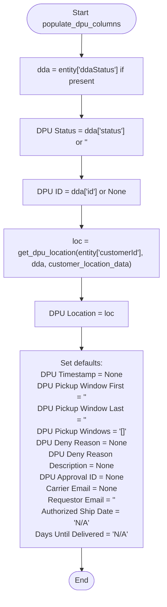

# Diagram: entity_core/entity_service/entity_service_tests/test_entity_exports/test_dpu_csv_export.py


> Auto-generated by Obscura crawlers

## Diagram 1

```mermaid
flowchart TD
    Start([Start]) --> CheckDpuData{dpu_data present?}
    CheckDpuData -- No --> ReturnEmpty["(return empty string)"]
    CheckDpuData -- Yes --> GetCode[/"code = dpu_data.DPULocation.code"/]
    GetCode --> CheckCode{code is not None and not empty?}
    CheckCode -- No --> ReturnEmpty
    CheckCode -- Yes --> BuildKey["key = customer_id + '-' + code"]
    BuildKey --> Lookup["location = customer_location_data[key]"]
    Lookup --> Found{location exists?}
    Found -- Yes --> ReturnName["return \"<location.name> (code)\""]
    Found -- No --> ReturnEmpty
```

> SVG rendering failed for this diagram.

## Diagram 2



### SVG

<svg id="container" width="356.984375" xmlns="http://www.w3.org/2000/svg" class="flowchart" height="1200" viewBox="0 0 356.984375 1200" role="graphics-document document" aria-roledescription="flowchart-v2"><style>#container{font-family:"trebuchet ms",verdana,arial,sans-serif;font-size:16px;fill:#333;}@keyframes edge-animation-frame{from{stroke-dashoffset:0;}}@keyframes dash{to{stroke-dashoffset:0;}}#container .edge-animation-slow{stroke-dasharray:9,5!important;stroke-dashoffset:900;animation:dash 50s linear infinite;stroke-linecap:round;}#container .edge-animation-fast{stroke-dasharray:9,5!important;stroke-dashoffset:900;animation:dash 20s linear infinite;stroke-linecap:round;}#container .error-icon{fill:#552222;}#container .error-text{fill:#552222;stroke:#552222;}#container .edge-thickness-normal{stroke-width:1px;}#container .edge-thickness-thick{stroke-width:3.5px;}#container .edge-pattern-solid{stroke-dasharray:0;}#container .edge-thickness-invisible{stroke-width:0;fill:none;}#container .edge-pattern-dashed{stroke-dasharray:3;}#container .edge-pattern-dotted{stroke-dasharray:2;}#container .marker{fill:#333333;stroke:#333333;}#container .marker.cross{stroke:#333333;}#container svg{font-family:"trebuchet ms",verdana,arial,sans-serif;font-size:16px;}#container p{margin:0;}#container .label{font-family:"trebuchet ms",verdana,arial,sans-serif;color:#333;}#container .cluster-label text{fill:#333;}#container .cluster-label span{color:#333;}#container .cluster-label span p{background-color:transparent;}#container .label text,#container span{fill:#333;color:#333;}#container .node rect,#container .node circle,#container .node ellipse,#container .node polygon,#container .node path{fill:#ECECFF;stroke:#9370DB;stroke-width:1px;}#container .rough-node .label text,#container .node .label text,#container .image-shape .label,#container .icon-shape .label{text-anchor:middle;}#container .node .katex path{fill:#000;stroke:#000;stroke-width:1px;}#container .rough-node .label,#container .node .label,#container .image-shape .label,#container .icon-shape .label{text-align:center;}#container .node.clickable{cursor:pointer;}#container .root .anchor path{fill:#333333!important;stroke-width:0;stroke:#333333;}#container .arrowheadPath{fill:#333333;}#container .edgePath .path{stroke:#333333;stroke-width:2.0px;}#container .flowchart-link{stroke:#333333;fill:none;}#container .edgeLabel{background-color:rgba(232,232,232, 0.8);text-align:center;}#container .edgeLabel p{background-color:rgba(232,232,232, 0.8);}#container .edgeLabel rect{opacity:0.5;background-color:rgba(232,232,232, 0.8);fill:rgba(232,232,232, 0.8);}#container .labelBkg{background-color:rgba(232, 232, 232, 0.5);}#container .cluster rect{fill:#ffffde;stroke:#aaaa33;stroke-width:1px;}#container .cluster text{fill:#333;}#container .cluster span{color:#333;}#container div.mermaidTooltip{position:absolute;text-align:center;max-width:200px;padding:2px;font-family:"trebuchet ms",verdana,arial,sans-serif;font-size:12px;background:hsl(80, 100%, 96.2745098039%);border:1px solid #aaaa33;border-radius:2px;pointer-events:none;z-index:100;}#container .flowchartTitleText{text-anchor:middle;font-size:18px;fill:#333;}#container rect.text{fill:none;stroke-width:0;}#container .icon-shape,#container .image-shape{background-color:rgba(232,232,232, 0.8);text-align:center;}#container .icon-shape p,#container .image-shape p{background-color:rgba(232,232,232, 0.8);padding:2px;}#container .icon-shape rect,#container .image-shape rect{opacity:0.5;background-color:rgba(232,232,232, 0.8);fill:rgba(232,232,232, 0.8);}#container .label-icon{display:inline-block;height:1em;overflow:visible;vertical-align:-0.125em;}#container .node .label-icon path{fill:currentColor;stroke:revert;stroke-width:revert;}#container :root{--mermaid-font-family:"trebuchet ms",verdana,arial,sans-serif;}</style><g><marker id="container_flowchart-v2-pointEnd" class="marker flowchart-v2" viewBox="0 0 10 10" refX="5" refY="5" markerUnits="userSpaceOnUse" markerWidth="8" markerHeight="8" orient="auto"><path d="M 0 0 L 10 5 L 0 10 z" class="arrowMarkerPath" style="stroke-width: 1; stroke-dasharray: 1, 0;"></path></marker><marker id="container_flowchart-v2-pointStart" class="marker flowchart-v2" viewBox="0 0 10 10" refX="4.5" refY="5" markerUnits="userSpaceOnUse" markerWidth="8" markerHeight="8" orient="auto"><path d="M 0 5 L 10 10 L 10 0 z" class="arrowMarkerPath" style="stroke-width: 1; stroke-dasharray: 1, 0;"></path></marker><marker id="container_flowchart-v2-circleEnd" class="marker flowchart-v2" viewBox="0 0 10 10" refX="11" refY="5" markerUnits="userSpaceOnUse" markerWidth="11" markerHeight="11" orient="auto"><circle cx="5" cy="5" r="5" class="arrowMarkerPath" style="stroke-width: 1; stroke-dasharray: 1, 0;"></circle></marker><marker id="container_flowchart-v2-circleStart" class="marker flowchart-v2" viewBox="0 0 10 10" refX="-1" refY="5" markerUnits="userSpaceOnUse" markerWidth="11" markerHeight="11" orient="auto"><circle cx="5" cy="5" r="5" class="arrowMarkerPath" style="stroke-width: 1; stroke-dasharray: 1, 0;"></circle></marker><marker id="container_flowchart-v2-crossEnd" class="marker cross flowchart-v2" viewBox="0 0 11 11" refX="12" refY="5.2" markerUnits="userSpaceOnUse" markerWidth="11" markerHeight="11" orient="auto"><path d="M 1,1 l 9,9 M 10,1 l -9,9" class="arrowMarkerPath" style="stroke-width: 2; stroke-dasharray: 1, 0;"></path></marker><marker id="container_flowchart-v2-crossStart" class="marker cross flowchart-v2" viewBox="0 0 11 11" refX="-1" refY="5.2" markerUnits="userSpaceOnUse" markerWidth="11" markerHeight="11" orient="auto"><path d="M 1,1 l 9,9 M 10,1 l -9,9" class="arrowMarkerPath" style="stroke-width: 2; stroke-dasharray: 1, 0;"></path></marker><g class="root"><g class="clusters"></g><g class="edgePaths"><path d="M178.992,71.5L178.909,75.583C178.826,79.667,178.659,87.833,178.576,95.417C178.492,103,178.492,110,178.492,113.5L178.492,117" id="L_Start2_ExtractDDA_0" class="edge-thickness-normal edge-pattern-solid edge-thickness-normal edge-pattern-solid flowchart-link" style=";" data-edge="true" data-et="edge" data-id="L_Start2_ExtractDDA_0" data-points="W3sieCI6MTc4Ljk5MjE4NzUsInkiOjcxLjQ5OTk5OTk5OTk5OTk5fSx7IngiOjE3OC40OTIxODc1LCJ5Ijo5Nn0seyJ4IjoxNzguNDkyMTg3NSwieSI6MTIxfV0=" marker-end="url(#container_flowchart-v2-pointEnd)"></path><path d="M178.492,199L178.492,203.167C178.492,207.333,178.492,215.667,178.492,223.333C178.492,231,178.492,238,178.492,241.5L178.492,245" id="L_ExtractDDA_SetStatus_0" class="edge-thickness-normal edge-pattern-solid edge-thickness-normal edge-pattern-solid flowchart-link" style=";" data-edge="true" data-et="edge" data-id="L_ExtractDDA_SetStatus_0" data-points="W3sieCI6MTc4LjQ5MjE4NzUsInkiOjE5OX0seyJ4IjoxNzguNDkyMTg3NSwieSI6MjI0fSx7IngiOjE3OC40OTIxODc1LCJ5IjoyNDl9XQ==" marker-end="url(#container_flowchart-v2-pointEnd)"></path><path d="M178.492,327L178.492,331.167C178.492,335.333,178.492,343.667,178.492,351.333C178.492,359,178.492,366,178.492,369.5L178.492,373" id="L_SetStatus_SetID_0" class="edge-thickness-normal edge-pattern-solid edge-thickness-normal edge-pattern-solid flowchart-link" style=";" data-edge="true" data-et="edge" data-id="L_SetStatus_SetID_0" data-points="W3sieCI6MTc4LjQ5MjE4NzUsInkiOjMyN30seyJ4IjoxNzguNDkyMTg3NSwieSI6MzUyfSx7IngiOjE3OC40OTIxODc1LCJ5IjozNzd9XQ==" marker-end="url(#container_flowchart-v2-pointEnd)"></path><path d="M178.492,431L178.492,435.167C178.492,439.333,178.492,447.667,178.492,455.333C178.492,463,178.492,470,178.492,473.5L178.492,477" id="L_SetID_GetLocationCall_0" class="edge-thickness-normal edge-pattern-solid edge-thickness-normal edge-pattern-solid flowchart-link" style=";" data-edge="true" data-et="edge" data-id="L_SetID_GetLocationCall_0" data-points="W3sieCI6MTc4LjQ5MjE4NzUsInkiOjQzMX0seyJ4IjoxNzguNDkyMTg3NSwieSI6NDU2fSx7IngiOjE3OC40OTIxODc1LCJ5Ijo0ODF9XQ==" marker-end="url(#container_flowchart-v2-pointEnd)"></path><path d="M178.492,583L178.492,587.167C178.492,591.333,178.492,599.667,178.492,607.333C178.492,615,178.492,622,178.492,625.5L178.492,629" id="L_GetLocationCall_SetLocation_0" class="edge-thickness-normal edge-pattern-solid edge-thickness-normal edge-pattern-solid flowchart-link" style=";" data-edge="true" data-et="edge" data-id="L_GetLocationCall_SetLocation_0" data-points="W3sieCI6MTc4LjQ5MjE4NzUsInkiOjU4M30seyJ4IjoxNzguNDkyMTg3NSwieSI6NjA4fSx7IngiOjE3OC40OTIxODc1LCJ5Ijo2MzN9XQ==" marker-end="url(#container_flowchart-v2-pointEnd)"></path><path d="M178.492,687L178.492,691.167C178.492,695.333,178.492,703.667,178.492,711.333C178.492,719,178.492,726,178.492,729.5L178.492,733" id="L_SetLocation_SetDefaults_0" class="edge-thickness-normal edge-pattern-solid edge-thickness-normal edge-pattern-solid flowchart-link" style=";" data-edge="true" data-et="edge" data-id="L_SetLocation_SetDefaults_0" data-points="W3sieCI6MTc4LjQ5MjE4NzUsInkiOjY4N30seyJ4IjoxNzguNDkyMTg3NSwieSI6NzEyfSx7IngiOjE3OC40OTIxODc1LCJ5Ijo3Mzd9XQ==" marker-end="url(#container_flowchart-v2-pointEnd)"></path><path d="M178.492,1103L178.492,1107.167C178.492,1111.333,178.492,1119.667,178.562,1127.417C178.633,1135.167,178.773,1142.334,178.844,1145.917L178.914,1149.501" id="L_SetDefaults_End2_0" class="edge-thickness-normal edge-pattern-solid edge-thickness-normal edge-pattern-solid flowchart-link" style=";" data-edge="true" data-et="edge" data-id="L_SetDefaults_End2_0" data-points="W3sieCI6MTc4LjQ5MjE4NzUsInkiOjExMDN9LHsieCI6MTc4LjQ5MjE4NzUsInkiOjExMjh9LHsieCI6MTc4Ljk5MjE4NzUsInkiOjExNTMuNX1d" marker-end="url(#container_flowchart-v2-pointEnd)"></path></g><g class="edgeLabels"><g class="edgeLabel"><g class="label" data-id="L_Start2_ExtractDDA_0" transform="translate(0, 0)"><foreignObject width="0" height="0"><div xmlns="http://www.w3.org/1999/xhtml" class="labelBkg" style="display: table-cell; white-space: nowrap; line-height: 1.5; max-width: 200px; text-align: center;"><span class="edgeLabel"></span></div></foreignObject></g></g><g class="edgeLabel"><g class="label" data-id="L_ExtractDDA_SetStatus_0" transform="translate(0, 0)"><foreignObject width="0" height="0"><div xmlns="http://www.w3.org/1999/xhtml" class="labelBkg" style="display: table-cell; white-space: nowrap; line-height: 1.5; max-width: 200px; text-align: center;"><span class="edgeLabel"></span></div></foreignObject></g></g><g class="edgeLabel"><g class="label" data-id="L_SetStatus_SetID_0" transform="translate(0, 0)"><foreignObject width="0" height="0"><div xmlns="http://www.w3.org/1999/xhtml" class="labelBkg" style="display: table-cell; white-space: nowrap; line-height: 1.5; max-width: 200px; text-align: center;"><span class="edgeLabel"></span></div></foreignObject></g></g><g class="edgeLabel"><g class="label" data-id="L_SetID_GetLocationCall_0" transform="translate(0, 0)"><foreignObject width="0" height="0"><div xmlns="http://www.w3.org/1999/xhtml" class="labelBkg" style="display: table-cell; white-space: nowrap; line-height: 1.5; max-width: 200px; text-align: center;"><span class="edgeLabel"></span></div></foreignObject></g></g><g class="edgeLabel"><g class="label" data-id="L_GetLocationCall_SetLocation_0" transform="translate(0, 0)"><foreignObject width="0" height="0"><div xmlns="http://www.w3.org/1999/xhtml" class="labelBkg" style="display: table-cell; white-space: nowrap; line-height: 1.5; max-width: 200px; text-align: center;"><span class="edgeLabel"></span></div></foreignObject></g></g><g class="edgeLabel"><g class="label" data-id="L_SetLocation_SetDefaults_0" transform="translate(0, 0)"><foreignObject width="0" height="0"><div xmlns="http://www.w3.org/1999/xhtml" class="labelBkg" style="display: table-cell; white-space: nowrap; line-height: 1.5; max-width: 200px; text-align: center;"><span class="edgeLabel"></span></div></foreignObject></g></g><g class="edgeLabel"><g class="label" data-id="L_SetDefaults_End2_0" transform="translate(0, 0)"><foreignObject width="0" height="0"><div xmlns="http://www.w3.org/1999/xhtml" class="labelBkg" style="display: table-cell; white-space: nowrap; line-height: 1.5; max-width: 200px; text-align: center;"><span class="edgeLabel"></span></div></foreignObject></g></g></g><g class="nodes"><g class="node default" id="flowchart-Start2-0" transform="translate(178.4921875, 39.5)"><g class="basic label-container outer-path"><path d="M-83.875 -31.5 C-46.51600699991364 -31.5, -9.157013999827285 -31.5, 83.875 -31.5 C83.875 -31.5, 83.875 -31.5, 83.875 -31.5 C84.57381758259086 -31.47759028029222, 85.27263516518174 -31.455180560584438, 85.89321192939245 -31.435279871635593 C86.66521258373459 -31.360805896977833, 87.43721323807672 -31.286331922320077, 87.90313059306193 -31.241385435432253 C88.37683136769401 -31.16480116779411, 88.85053214232609 -31.08821690015597, 89.89649680409322 -30.91911344521856 C90.32350293782893 -30.821652081668816, 90.75050907156464 -30.724190718119072, 91.86511939314947 -30.469788185729428 C92.33046157938706 -30.331677067485092, 92.79580376562465 -30.193565949240757, 93.80090886774406 -29.895256030836062 C94.34129344609063 -29.696389510744236, 94.88167802443722 -29.49752299065241, 95.69591065370028 -29.197877856399685 C96.18821845893598 -28.97994779481401, 96.68052626417168 -28.762017733228337, 97.54233778220308 -28.380519338926202 C97.99818633469535 -28.142703441075916, 98.45403488718762 -27.904887543225634, 99.33260288812403 -27.44653917988677 C99.73240970745452 -27.20417393648296, 100.13221652678502 -26.961808693079153, 101.05934938813228 -26.399775304092984 C101.40083659839523 -26.161568608956625, 101.74232380865818 -25.923361913820262, 102.7154817104733 -25.244529088840633 C103.1806916023708 -24.87353657980752, 103.64590149426829 -24.50254407077441, 104.29419445219533 -23.985547688627737 C104.70416490748175 -23.61322336836044, 105.1141353627682 -23.24089904809314, 105.78900034400982 -22.62800452807842 C106.19235789846678 -22.211504736830506, 106.59571545292374 -21.795004945582587, 107.19375690787243 -21.177478043231485 C107.48844887727394 -20.83131608752439, 107.78314084667544 -20.485154131817293, 108.50269169774293 -19.63992875855011 C108.93146638482857 -19.06540974003293, 109.36024107191422 -18.490890721515754, 109.7104260198041 -18.02167479384835 C110.1419984847039 -17.35866359432881, 110.57357094960372 -16.695652394809272, 110.8119970346684 -16.329365901781543 C111.08477689837778 -15.845017631809117, 111.35755676208716 -15.360669361836694, 111.8028781507495 -14.56995614258631 C112.09505246951436 -13.963249918142138, 112.38722678827922 -13.356543693697963, 112.67899762499809 -12.750675308355413 C112.90591548160293 -12.190183815383158, 113.13283333820777 -11.629692322410904, 113.43675529456745 -10.878999214271206 C113.60909488567363 -10.359939824444293, 113.78143447677981 -9.84088043461738, 114.07303737065482 -8.962618978877531 C114.26732819958413 -8.221703841992127, 114.46161902851344 -7.480788705106722, 114.58522923372745 -7.009409419623907 C114.69534383671925 -6.443994205990593, 114.80545843971105 -5.878578992357278, 114.97122617755518 -5.027396693551458 C115.0400071443869 -4.493945097142763, 115.10878811121863 -3.960493500734069, 115.22944205789975 -3.024725316091981 C115.27917497673381 -2.250094961561844, 115.32890789556788 -1.475464607031707, 115.35881581032167 -1.0096246935071378 C115.35881581032167 -0.33086763991999224, 115.35881581032167 0.3478894136671533, 115.35881581032167 1.00962469350713 C115.31388086611275 1.7095227203950618, 115.26894592190385 2.4094207472829936, 115.22944205789975 3.02472531609196 C115.14975897463542 3.642731574685577, 115.07007589137108 4.260737833279194, 114.97122617755518 5.027396693551435 C114.86461455566324 5.574824839592337, 114.75800293377128 6.1222529856332395, 114.58522923372745 7.0094094196239 C114.38293994424534 7.780826153151839, 114.18065065476323 8.552242886679778, 114.07303737065482 8.96261897887751 C113.9364000802734 9.374148727310551, 113.799762789892 9.785678475743593, 113.43675529456746 10.878999214271184 C113.20938837314213 11.44059990603213, 112.98202145171679 12.002200597793076, 112.67899762499809 12.750675308355405 C112.33333147591138 13.468458463004731, 111.98766532682467 14.18624161765406, 111.8028781507495 14.569956142586303 C111.59330354021898 14.942077085313773, 111.38372892968846 15.314198028041243, 110.81199703466841 16.329365901781536 C110.52977750504044 16.762930885844924, 110.24755797541246 17.19649586990831, 109.71042601980412 18.021674793848334 C109.2679267284194 18.614583531789105, 108.82542743703468 19.20749226972988, 108.50269169774295 19.639928758550102 C108.23041914690282 19.959755589513954, 107.95814659606268 20.27958242047781, 107.19375690787246 21.177478043231467 C106.74015224902371 21.645862095127885, 106.28654759017496 22.114246147024303, 105.78900034400982 22.628004528078414 C105.29184169761199 23.079510856639967, 104.79468305121415 23.531017185201524, 104.29419445219536 23.985547688627715 C103.74479134534958 24.42368204610653, 103.19538823850382 24.86181640358535, 102.71548171047331 25.24452908884063 C102.24455225973931 25.57302908746531, 101.77362280900532 25.901529086089994, 101.05934938813229 26.399775304092973 C100.63496154457181 26.657041708839134, 100.21057370101133 26.9143081135853, 99.33260288812404 27.446539179886766 C98.91934220850459 27.662137011738135, 98.50608152888515 27.877734843589504, 97.54233778220309 28.3805193389262 C96.95523714375956 28.64041137584349, 96.36813650531603 28.900303412760785, 95.6959106537003 29.197877856399682 C95.23846514252301 29.366222033092875, 94.78101963134573 29.534566209786064, 93.80090886774407 29.895256030836055 C93.3079688606147 30.041558037457154, 92.81502885348533 30.187860044078256, 91.86511939314951 30.46978818572942 C91.38107181545163 30.58026888663332, 90.89702423775375 30.69074958753722, 89.89649680409323 30.919113445218557 C89.33784167597308 31.0094324738978, 88.77918654785292 31.099751502577043, 87.90313059306196 31.24138543543225 C87.24877395514393 31.304510433313204, 86.59441731722589 31.367635431194163, 85.89321192939245 31.435279871635593 C85.36234237594142 31.452303824939868, 84.8314728224904 31.469327778244143, 83.875 31.5 C83.875 31.5, 83.875 31.5, 83.875 31.5 C20.28889133176815 31.5, -43.2972173364637 31.5, -83.875 31.5 C-84.45934696743868 31.481261130116614, -85.04369393487734 31.46252226023323, -85.89321192939244 31.435279871635593 C-86.36293542329956 31.389966211103527, -86.83265891720669 31.344652550571457, -87.90313059306195 31.24138543543225 C-88.5141494336684 31.14260064780488, -89.12516827427484 31.043815860177506, -89.89649680409323 30.919113445218557 C-90.53654321421493 30.773027028801437, -91.17658962433663 30.62694061238432, -91.86511939314947 30.469788185729428 C-92.53823377527864 30.270011370362983, -93.21134815740781 30.07023455499654, -93.80090886774403 29.89525603083607 C-94.36698199100681 29.686935888752775, -94.9330551142696 29.47861574666948, -95.69591065370028 29.197877856399685 C-96.40870368751553 28.882345524583773, -97.12149672133077 28.566813192767857, -97.54233778220308 28.380519338926206 C-98.1411532543703 28.068117690656184, -98.73996872653751 27.755716042386158, -99.33260288812403 27.446539179886773 C-99.75028575581571 27.193337370915092, -100.16796862350739 26.94013556194341, -101.05934938813226 26.399775304092994 C-101.58207071182319 26.035147536927603, -102.10479203551411 25.670519769762215, -102.7154817104733 25.244529088840636 C-103.05684454175469 24.97230131494018, -103.39820737303607 24.700073541039718, -104.29419445219533 23.98554768862774 C-104.83621212281619 23.49330158117158, -105.37822979343704 23.001055473715414, -105.7890003440098 22.628004528078435 C-106.26053871030011 22.141102450863848, -106.7320770765904 21.654200373649257, -107.19375690787244 21.177478043231478 C-107.57916254740225 20.724758648837618, -107.96456818693206 20.272039254443758, -108.50269169774293 19.639928758550113 C-108.87187427106642 19.145257743520972, -109.2410568443899 18.650586728491827, -109.7104260198041 18.021674793848355 C-110.14678914769894 17.351303849495313, -110.58315227559378 16.68093290514227, -110.8119970346684 16.329365901781557 C-111.12870261294997 15.76702307762529, -111.44540819123154 15.204680253469022, -111.8028781507495 14.569956142586314 C-112.04260411227139 14.072160054172235, -112.28233007379328 13.574363965758156, -112.67899762499809 12.750675308355417 C-112.95945664253186 12.057936112740757, -113.23991566006565 11.365196917126099, -113.43675529456745 10.878999214271209 C-113.68418357633084 10.133784651942909, -113.93161185809424 9.388570089614609, -114.07303737065482 8.962618978877522 C-114.2082136924132 8.44713307822436, -114.34339001417158 7.931647177571197, -114.58522923372743 7.009409419623911 C-114.68096730556225 6.517814655000798, -114.77670537739706 6.026219890377684, -114.97122617755518 5.027396693551461 C-115.06489553429782 4.300915659762236, -115.15856489104046 3.5744346259730104, -115.22944205789975 3.024725316091999 C-115.26175840693982 2.5213720945054945, -115.29407475597988 2.01801887291899, -115.35881581032167 1.0096246935071416 C-115.35881581032167 0.3855204636897045, -115.35881581032167 -0.23858376612773258, -115.35881581032167 -1.0096246935071262 C-115.32677847875237 -1.5086319927674738, -115.29474114718309 -2.0076392920278217, -115.22944205789975 -3.024725316091956 C-115.14061102507972 -3.71368126497255, -115.0517799922597 -4.4026372138531435, -114.97122617755518 -5.027396693551446 C-114.87358899373241 -5.528742996855278, -114.77595180990963 -6.0300893001591085, -114.58522923372745 -7.009409419623896 C-114.4594495816126 -7.489061746383851, -114.33366992949776 -7.968714073143807, -114.07303737065482 -8.962618978877506 C-113.83089747587326 -9.691905762206565, -113.5887575810917 -10.421192545535622, -113.43675529456746 -10.878999214271168 C-113.16681211618972 -11.545764083860513, -112.89686893781196 -12.212528953449858, -112.67899762499809 -12.750675308355401 C-112.44167188221923 -13.243487291193151, -112.20434613944035 -13.736299274030904, -111.8028781507495 -14.5699561425863 C-111.47719841440595 -15.148233493113668, -111.15151867806239 -15.726510843641039, -110.8119970346684 -16.329365901781546 C-110.55823211463151 -16.719216964380504, -110.30446719459462 -17.109068026979457, -109.71042601980412 -18.021674793848344 C-109.34339427390347 -18.513463896075283, -108.97636252800282 -19.005252998302222, -108.50269169774295 -19.639928758550102 C-108.04988519102817 -20.171821046757422, -107.59707868431339 -20.70371333496474, -107.19375690787246 -21.177478043231467 C-106.9030444959275 -21.47766247649754, -106.61233208398254 -21.77784690976361, -105.78900034400984 -22.628004528078403 C-105.44662134396023 -22.938944077071522, -105.10424234391063 -23.249883626064644, -104.29419445219536 -23.98554768862771 C-103.74497605432256 -24.42353474561589, -103.19575765644979 -24.861521802604067, -102.71548171047331 -25.244529088840626 C-102.3633728500594 -25.49014498731847, -102.0112639896455 -25.735760885796314, -101.0593493881323 -26.39977530409297 C-100.63316611086978 -26.658130111300444, -100.20698283360726 -26.91648491850792, -99.33260288812404 -27.446539179886763 C-98.74288797450777 -27.754193072589946, -98.15317306089149 -28.061846965293128, -97.54233778220309 -28.3805193389262 C-97.08685123468813 -28.582149721982706, -96.63136468717316 -28.783780105039213, -95.6959106537003 -29.19787785639968 C-95.07538659161987 -29.42623644730682, -94.45486252953947 -29.654595038213966, -93.80090886774407 -29.895256030836055 C-93.32206951064681 -30.037373038543443, -92.84323015354957 -30.179490046250834, -91.86511939314951 -30.469788185729417 C-91.31931607368436 -30.59436423169782, -90.77351275421923 -30.71894027766622, -89.89649680409325 -30.919113445218553 C-89.1201757679278 -31.04462300988623, -88.34385473176236 -31.17013257455391, -87.90313059306196 -31.24138543543225 C-87.50058875073755 -31.28021816283389, -87.09804690841315 -31.31905089023553, -85.89321192939246 -31.435279871635593 C-85.4691459585406 -31.448878841926476, -85.04507998768874 -31.462477812217355, -83.87500000000001 -31.5 C-83.87500000000001 -31.5, -83.875 -31.5, -83.875 -31.5" stroke="none" stroke-width="0" fill="#ECECFF" style=""></path><path d="M-83.875 -31.5 C-29.10791679045819 -31.5, 25.65916641908362 -31.5, 83.875 -31.5 M-83.875 -31.5 C-42.08610566171493 -31.5, -0.29721132342986323 -31.5, 83.875 -31.5 M83.875 -31.5 C83.875 -31.5, 83.875 -31.5, 83.875 -31.5 M83.875 -31.5 C83.875 -31.5, 83.875 -31.5, 83.875 -31.5 M83.875 -31.5 C84.63685906557376 -31.47556866263576, 85.39871813114752 -31.45113732527152, 85.89321192939245 -31.435279871635593 M83.875 -31.5 C84.66027016248695 -31.47481791432469, 85.4455403249739 -31.44963582864938, 85.89321192939245 -31.435279871635593 M85.89321192939245 -31.435279871635593 C86.33875545212713 -31.392298823841863, 86.78429897486181 -31.349317776048128, 87.90313059306193 -31.241385435432253 M85.89321192939245 -31.435279871635593 C86.56074137889001 -31.370884108464182, 87.2282708283876 -31.306488345292774, 87.90313059306193 -31.241385435432253 M87.90313059306193 -31.241385435432253 C88.41342703686068 -31.158884663806898, 88.92372348065943 -31.07638389218154, 89.89649680409322 -30.91911344521856 M87.90313059306193 -31.241385435432253 C88.48864863471401 -31.146723419218176, 89.07416667636608 -31.0520614030041, 89.89649680409322 -30.91911344521856 M89.89649680409322 -30.91911344521856 C90.57795406465765 -30.76357527241894, 91.25941132522209 -30.60803709961932, 91.86511939314947 -30.469788185729428 M89.89649680409322 -30.91911344521856 C90.63778584269515 -30.74991905952072, 91.37907488129709 -30.58072467382288, 91.86511939314947 -30.469788185729428 M91.86511939314947 -30.469788185729428 C92.60930678865014 -30.248917273064183, 93.3534941841508 -30.02804636039894, 93.80090886774406 -29.895256030836062 M91.86511939314947 -30.469788185729428 C92.55541462994046 -30.264912182883503, 93.24570986673145 -30.060036180037578, 93.80090886774406 -29.895256030836062 M93.80090886774406 -29.895256030836062 C94.54453951712188 -29.621593077818652, 95.28817016649971 -29.347930124801245, 95.69591065370028 -29.197877856399685 M93.80090886774406 -29.895256030836062 C94.47021463658085 -29.648945320909416, 95.13952040541766 -29.40263461098277, 95.69591065370028 -29.197877856399685 M95.69591065370028 -29.197877856399685 C96.32985568496713 -28.917249196369053, 96.96380071623396 -28.63662053633842, 97.54233778220308 -28.380519338926202 M95.69591065370028 -29.197877856399685 C96.24093229149571 -28.956612944840103, 96.78595392929114 -28.71534803328052, 97.54233778220308 -28.380519338926202 M97.54233778220308 -28.380519338926202 C98.09763555534826 -28.090820846361556, 98.65293332849346 -27.80112235379691, 99.33260288812403 -27.44653917988677 M97.54233778220308 -28.380519338926202 C98.14836372373539 -28.064355993406938, 98.7543896652677 -27.748192647887674, 99.33260288812403 -27.44653917988677 M99.33260288812403 -27.44653917988677 C99.86248900807041 -27.125319100018785, 100.39237512801681 -26.804099020150797, 101.05934938813228 -26.399775304092984 M99.33260288812403 -27.44653917988677 C99.94636097307296 -27.07447542194787, 100.56011905802188 -26.702411664008974, 101.05934938813228 -26.399775304092984 M101.05934938813228 -26.399775304092984 C101.53377262067363 -26.06883819452287, 102.00819585321499 -25.73790108495275, 102.7154817104733 -25.244529088840633 M101.05934938813228 -26.399775304092984 C101.7126267279977 -25.94407731172311, 102.36590406786313 -25.48837931935324, 102.7154817104733 -25.244529088840633 M102.7154817104733 -25.244529088840633 C103.26424038656334 -24.806908647740478, 103.8129990626534 -24.369288206640324, 104.29419445219533 -23.985547688627737 M102.7154817104733 -25.244529088840633 C103.09443333568896 -24.9423252520574, 103.47338496090464 -24.64012141527417, 104.29419445219533 -23.985547688627737 M104.29419445219533 -23.985547688627737 C104.75218225842173 -23.569615280706245, 105.21017006464812 -23.153682872784753, 105.78900034400982 -22.62800452807842 M104.29419445219533 -23.985547688627737 C104.7050653624365 -23.61240559899528, 105.11593627267766 -23.23926350936282, 105.78900034400982 -22.62800452807842 M105.78900034400982 -22.62800452807842 C106.25652302271945 -22.14524897798495, 106.72404570142909 -21.662493427891476, 107.19375690787243 -21.177478043231485 M105.78900034400982 -22.62800452807842 C106.26959307603948 -22.13175307486068, 106.75018580806915 -21.63550162164294, 107.19375690787243 -21.177478043231485 M107.19375690787243 -21.177478043231485 C107.68502915579022 -20.600401706644437, 108.17630140370801 -20.02332537005739, 108.50269169774293 -19.63992875855011 M107.19375690787243 -21.177478043231485 C107.51356645252588 -20.801811554402935, 107.83337599717933 -20.426145065574385, 108.50269169774293 -19.63992875855011 M108.50269169774293 -19.63992875855011 C108.91095026396043 -19.092899472939187, 109.31920883017791 -18.545870187328266, 109.7104260198041 -18.02167479384835 M108.50269169774293 -19.63992875855011 C108.91469242948708 -19.087885312051768, 109.32669316123122 -18.535841865553426, 109.7104260198041 -18.02167479384835 M109.7104260198041 -18.02167479384835 C109.93293457360674 -17.67984190329475, 110.15544312740937 -17.338009012741146, 110.8119970346684 -16.329365901781543 M109.7104260198041 -18.02167479384835 C110.12166156639667 -17.389906562075954, 110.53289711298922 -16.758138330303552, 110.8119970346684 -16.329365901781543 M110.8119970346684 -16.329365901781543 C111.16094075459978 -15.7097809926602, 111.50988447453116 -15.090196083538856, 111.8028781507495 -14.56995614258631 M110.8119970346684 -16.329365901781543 C111.02639479159443 -15.94868097423231, 111.24079254852047 -15.567996046683078, 111.8028781507495 -14.56995614258631 M111.8028781507495 -14.56995614258631 C112.06430092035943 -14.027106167940092, 112.32572368996937 -13.484256193293872, 112.67899762499809 -12.750675308355413 M111.8028781507495 -14.56995614258631 C112.11678061252834 -13.918130964265822, 112.43068307430718 -13.266305785945336, 112.67899762499809 -12.750675308355413 M112.67899762499809 -12.750675308355413 C112.91479553330204 -12.168249916002239, 113.15059344160599 -11.585824523649064, 113.43675529456745 -10.878999214271206 M112.67899762499809 -12.750675308355413 C112.83188593645457 -12.373038223163498, 112.98477424791105 -11.99540113797158, 113.43675529456745 -10.878999214271206 M113.43675529456745 -10.878999214271206 C113.66772296981227 -10.183361376135359, 113.8986906450571 -9.487723537999514, 114.07303737065482 -8.962618978877531 M113.43675529456745 -10.878999214271206 C113.63640316340621 -10.277691642896944, 113.83605103224497 -9.676384071522682, 114.07303737065482 -8.962618978877531 M114.07303737065482 -8.962618978877531 C114.20547294035609 -8.457584753667579, 114.33790851005736 -7.9525505284576266, 114.58522923372745 -7.009409419623907 M114.07303737065482 -8.962618978877531 C114.24438858896599 -8.309182519369259, 114.41573980727715 -7.655746059860988, 114.58522923372745 -7.009409419623907 M114.58522923372745 -7.009409419623907 C114.73546968015505 -6.237956480547797, 114.88571012658264 -5.466503541471686, 114.97122617755518 -5.027396693551458 M114.58522923372745 -7.009409419623907 C114.72596064602843 -6.286783361052912, 114.8666920583294 -5.564157302481917, 114.97122617755518 -5.027396693551458 M114.97122617755518 -5.027396693551458 C115.0691483120284 -4.267931955489776, 115.16707044650161 -3.5084672174280946, 115.22944205789975 -3.024725316091981 M114.97122617755518 -5.027396693551458 C115.06265819186291 -4.318268045874177, 115.15409020617062 -3.609139398196897, 115.22944205789975 -3.024725316091981 M115.22944205789975 -3.024725316091981 C115.27355848541544 -2.337576347395677, 115.31767491293114 -1.6504273786993724, 115.35881581032167 -1.0096246935071378 M115.22944205789975 -3.024725316091981 C115.26532016442671 -2.4658948466482538, 115.30119827095366 -1.9070643772045262, 115.35881581032167 -1.0096246935071378 M115.35881581032167 -1.0096246935071378 C115.35881581032167 -0.2792279854804979, 115.35881581032167 0.45116872254614204, 115.35881581032167 1.00962469350713 M115.35881581032167 -1.0096246935071378 C115.35881581032167 -0.4265890449750924, 115.35881581032167 0.15644660355695295, 115.35881581032167 1.00962469350713 M115.35881581032167 1.00962469350713 C115.3105411906833 1.7615408609465044, 115.26226657104492 2.513457028385879, 115.22944205789975 3.02472531609196 M115.35881581032167 1.00962469350713 C115.32728655409247 1.500718309234638, 115.29575729786325 1.9918119249621458, 115.22944205789975 3.02472531609196 M115.22944205789975 3.02472531609196 C115.17462460548802 3.4498786520669813, 115.11980715307628 3.8750319880420028, 114.97122617755518 5.027396693551435 M115.22944205789975 3.02472531609196 C115.12954174519645 3.799532413870649, 115.02964143249315 4.574339511649338, 114.97122617755518 5.027396693551435 M114.97122617755518 5.027396693551435 C114.83585184910984 5.722515258743804, 114.7004775206645 6.417633823936171, 114.58522923372745 7.0094094196239 M114.97122617755518 5.027396693551435 C114.88679274829524 5.460944507789663, 114.80235931903529 5.89449232202789, 114.58522923372745 7.0094094196239 M114.58522923372745 7.0094094196239 C114.38787167208974 7.762019337456766, 114.19051411045203 8.514629255289632, 114.07303737065482 8.96261897887751 M114.58522923372745 7.0094094196239 C114.47830170235369 7.417170439437304, 114.37137417097992 7.824931459250708, 114.07303737065482 8.96261897887751 M114.07303737065482 8.96261897887751 C113.83363319179287 9.683666221733851, 113.59422901293091 10.404713464590193, 113.43675529456746 10.878999214271184 M114.07303737065482 8.96261897887751 C113.82891254079483 9.697884070406351, 113.58478771093483 10.433149161935193, 113.43675529456746 10.878999214271184 M113.43675529456746 10.878999214271184 C113.24329531990386 11.356849091984433, 113.04983534524025 11.83469896969768, 112.67899762499809 12.750675308355405 M113.43675529456746 10.878999214271184 C113.17766020097467 11.518969104708223, 112.91856510738188 12.158938995145261, 112.67899762499809 12.750675308355405 M112.67899762499809 12.750675308355405 C112.4931861700442 13.136516770295389, 112.30737471509032 13.522358232235375, 111.8028781507495 14.569956142586303 M112.67899762499809 12.750675308355405 C112.36177976565504 13.409384980656121, 112.044561906312 14.068094652956836, 111.8028781507495 14.569956142586303 M111.8028781507495 14.569956142586303 C111.43032717571825 15.231458123631267, 111.057776200687 15.892960104676229, 110.81199703466841 16.329365901781536 M111.8028781507495 14.569956142586303 C111.4400825730051 15.214136427907386, 111.07728699526068 15.858316713228469, 110.81199703466841 16.329365901781536 M110.81199703466841 16.329365901781536 C110.5494426263695 16.732719978659034, 110.28688821807057 17.136074055536533, 109.71042601980412 18.021674793848334 M110.81199703466841 16.329365901781536 C110.5342078249678 16.75612472472902, 110.2564186152672 17.182883547676504, 109.71042601980412 18.021674793848334 M109.71042601980412 18.021674793848334 C109.25831711892683 18.627459533055717, 108.80620821804953 19.2332442722631, 108.50269169774295 19.639928758550102 M109.71042601980412 18.021674793848334 C109.29339981362688 18.58045191825689, 108.87637360744964 19.139229042665445, 108.50269169774295 19.639928758550102 M108.50269169774295 19.639928758550102 C108.07794064275716 20.138865516756113, 107.65318958777138 20.637802274962123, 107.19375690787246 21.177478043231467 M108.50269169774295 19.639928758550102 C108.06957544041653 20.148691759418913, 107.63645918309012 20.657454760287724, 107.19375690787246 21.177478043231467 M107.19375690787246 21.177478043231467 C106.65682892501141 21.731900268142713, 106.11990094215037 22.286322493053955, 105.78900034400982 22.628004528078414 M107.19375690787246 21.177478043231467 C106.84581363514306 21.536758038998528, 106.49787036241365 21.896038034765592, 105.78900034400982 22.628004528078414 M105.78900034400982 22.628004528078414 C105.41336681568505 22.969144959784433, 105.03773328736028 23.310285391490456, 104.29419445219536 23.985547688627715 M105.78900034400982 22.628004528078414 C105.1997105574794 23.163181920451986, 104.610420770949 23.698359312825556, 104.29419445219536 23.985547688627715 M104.29419445219536 23.985547688627715 C103.77055296769429 24.403137837832205, 103.2469114831932 24.82072798703669, 102.71548171047331 25.24452908884063 M104.29419445219536 23.985547688627715 C103.93778263404636 24.269776629084735, 103.58137081589736 24.554005569541754, 102.71548171047331 25.24452908884063 M102.71548171047331 25.24452908884063 C102.13073511046423 25.652423003734622, 101.54598851045516 26.06031691862862, 101.05934938813229 26.399775304092973 M102.71548171047331 25.24452908884063 C102.19114067831525 25.61028669451665, 101.66679964615717 25.976044300192665, 101.05934938813229 26.399775304092973 M101.05934938813229 26.399775304092973 C100.50093494564513 26.73828942073621, 99.94252050315798 27.07680353737944, 99.33260288812404 27.446539179886766 M101.05934938813229 26.399775304092973 C100.38522469656073 26.808433653720076, 99.71110000498916 27.21709200334718, 99.33260288812404 27.446539179886766 M99.33260288812404 27.446539179886766 C98.829916544365 27.70879032343989, 98.32723020060597 27.971041466993007, 97.54233778220309 28.3805193389262 M99.33260288812404 27.446539179886766 C98.62492914098085 27.815732120484697, 97.91725539383768 28.184925061082627, 97.54233778220309 28.3805193389262 M97.54233778220309 28.3805193389262 C96.85118578560886 28.686471825522936, 96.16003378901462 28.99242431211967, 95.6959106537003 29.197877856399682 M97.54233778220309 28.3805193389262 C97.1136780835067 28.570274271800923, 96.6850183848103 28.760029204675643, 95.6959106537003 29.197877856399682 M95.6959106537003 29.197877856399682 C95.01627114104117 29.447991479577027, 94.33663162838204 29.69810510275437, 93.80090886774407 29.895256030836055 M95.6959106537003 29.197877856399682 C95.16960460942083 29.391563345814266, 94.64329856514138 29.585248835228846, 93.80090886774407 29.895256030836055 M93.80090886774407 29.895256030836055 C93.21280933180232 30.06980088610611, 92.62470979586058 30.24434574137616, 91.86511939314951 30.46978818572942 M93.80090886774407 29.895256030836055 C93.37190379257609 30.022582485252318, 92.94289871740811 30.149908939668585, 91.86511939314951 30.46978818572942 M91.86511939314951 30.46978818572942 C91.43302201208586 30.568411593258272, 91.00092463102222 30.667035000787124, 89.89649680409323 30.919113445218557 M91.86511939314951 30.46978818572942 C91.27968181755718 30.603410492021162, 90.69424424196484 30.7370327983129, 89.89649680409323 30.919113445218557 M89.89649680409323 30.919113445218557 C89.17029924201304 31.03651943530948, 88.44410167993286 31.1539254254004, 87.90313059306196 31.24138543543225 M89.89649680409323 30.919113445218557 C89.46218018196366 30.989330388508755, 89.0278635598341 31.059547331798957, 87.90313059306196 31.24138543543225 M87.90313059306196 31.24138543543225 C87.4697623483632 31.28319194879677, 87.03639410366443 31.32499846216129, 85.89321192939245 31.435279871635593 M87.90313059306196 31.24138543543225 C87.25305496922705 31.30409744903328, 86.60297934539214 31.36680946263431, 85.89321192939245 31.435279871635593 M85.89321192939245 31.435279871635593 C85.08605058687907 31.461163964845753, 84.2788892443657 31.487048058055915, 83.875 31.5 M85.89321192939245 31.435279871635593 C85.33074215715018 31.45331718245041, 84.76827238490792 31.471354493265224, 83.875 31.5 M83.875 31.5 C83.875 31.5, 83.875 31.5, 83.875 31.5 M83.875 31.5 C83.875 31.5, 83.875 31.5, 83.875 31.5 M83.875 31.5 C31.00221902713391 31.5, -21.870561945732177 31.5, -83.875 31.5 M83.875 31.5 C36.92030619269661 31.5, -10.034387614606786 31.5, -83.875 31.5 M-83.875 31.5 C-84.45911411309416 31.48126859730222, -85.0432282261883 31.462537194604437, -85.89321192939244 31.435279871635593 M-83.875 31.5 C-84.36073071539148 31.48442356137488, -84.84646143078297 31.468847122749754, -85.89321192939244 31.435279871635593 M-85.89321192939244 31.435279871635593 C-86.36429604682732 31.389834953388192, -86.83538016426219 31.34439003514079, -87.90313059306195 31.24138543543225 M-85.89321192939244 31.435279871635593 C-86.31845616038309 31.39425707210294, -86.74370039137375 31.353234272570283, -87.90313059306195 31.24138543543225 M-87.90313059306195 31.24138543543225 C-88.54465223987584 31.137669190650055, -89.18617388668973 31.03395294586786, -89.89649680409323 30.919113445218557 M-87.90313059306195 31.24138543543225 C-88.47700658008613 31.14860561632493, -89.05088256711029 31.055825797217608, -89.89649680409323 30.919113445218557 M-89.89649680409323 30.919113445218557 C-90.52863238902682 30.774832623027663, -91.16076797396042 30.63055180083677, -91.86511939314947 30.469788185729428 M-89.89649680409323 30.919113445218557 C-90.66569573338684 30.7435488090994, -91.43489466268043 30.567984172980246, -91.86511939314947 30.469788185729428 M-91.86511939314947 30.469788185729428 C-92.45802256819097 30.293817635589388, -93.05092574323245 30.11784708544935, -93.80090886774403 29.89525603083607 M-91.86511939314947 30.469788185729428 C-92.34210385434277 30.328221701389786, -92.81908831553606 30.18665521705015, -93.80090886774403 29.89525603083607 M-93.80090886774403 29.89525603083607 C-94.47371550203508 29.647656970060613, -95.14652213632614 29.400057909285156, -95.69591065370028 29.197877856399685 M-93.80090886774403 29.89525603083607 C-94.19161563133558 29.751472330180647, -94.58232239492713 29.607688629525224, -95.69591065370028 29.197877856399685 M-95.69591065370028 29.197877856399685 C-96.28741707425263 28.936035510435705, -96.87892349480498 28.67419316447172, -97.54233778220308 28.380519338926206 M-95.69591065370028 29.197877856399685 C-96.26988362784157 28.94379704705067, -96.84385660198286 28.689716237701656, -97.54233778220308 28.380519338926206 M-97.54233778220308 28.380519338926206 C-98.00761994243558 28.13778193396036, -98.47290210266807 27.89504452899451, -99.33260288812403 27.446539179886773 M-97.54233778220308 28.380519338926206 C-98.15154287013125 28.06269743476856, -98.76074795805943 27.744875530610912, -99.33260288812403 27.446539179886773 M-99.33260288812403 27.446539179886773 C-99.81272152088175 27.155488443218776, -100.29284015363947 26.86443770655078, -101.05934938813226 26.399775304092994 M-99.33260288812403 27.446539179886773 C-99.89723008255365 27.104258856505837, -100.46185727698328 26.7619785331249, -101.05934938813226 26.399775304092994 M-101.05934938813226 26.399775304092994 C-101.68949705732494 25.960211568717128, -102.31964472651762 25.520647833341258, -102.7154817104733 25.244529088840636 M-101.05934938813226 26.399775304092994 C-101.43448043955779 26.13810012178003, -101.80961149098333 25.876424939467068, -102.7154817104733 25.244529088840636 M-102.7154817104733 25.244529088840636 C-103.03656452657985 24.988474087368242, -103.35764734268639 24.73241908589585, -104.29419445219533 23.98554768862774 M-102.7154817104733 25.244529088840636 C-103.25458306710671 24.814610103015085, -103.79368442374013 24.384691117189533, -104.29419445219533 23.98554768862774 M-104.29419445219533 23.98554768862774 C-104.72815054440471 23.591440247532194, -105.1621066366141 23.197332806436645, -105.7890003440098 22.628004528078435 M-104.29419445219533 23.98554768862774 C-104.86013069959148 23.471579362595115, -105.42606694698765 22.957611036562493, -105.7890003440098 22.628004528078435 M-105.7890003440098 22.628004528078435 C-106.23892577731011 22.163419578630805, -106.68885121061044 21.698834629183175, -107.19375690787244 21.177478043231478 M-105.7890003440098 22.628004528078435 C-106.33356777180703 22.065693949060492, -106.87813519960426 21.50338337004255, -107.19375690787244 21.177478043231478 M-107.19375690787244 21.177478043231478 C-107.47041052051135 20.85250496778931, -107.74706413315025 20.52753189234714, -108.50269169774293 19.639928758550113 M-107.19375690787244 21.177478043231478 C-107.57168154592688 20.733546258851625, -107.94960618398133 20.289614474471772, -108.50269169774293 19.639928758550113 M-108.50269169774293 19.639928758550113 C-108.89310257905876 19.116813744749884, -109.28351346037458 18.593698730949654, -109.7104260198041 18.021674793848355 M-108.50269169774293 19.639928758550113 C-108.90713858130323 19.098006780448408, -109.31158546486351 18.556084802346703, -109.7104260198041 18.021674793848355 M-109.7104260198041 18.021674793848355 C-110.03756662697849 17.519098971675376, -110.36470723415287 17.016523149502394, -110.8119970346684 16.329365901781557 M-109.7104260198041 18.021674793848355 C-110.022857730475 17.541695786596485, -110.33528944114589 17.06171677934461, -110.8119970346684 16.329365901781557 M-110.8119970346684 16.329365901781557 C-111.19521456677293 15.64892436854696, -111.57843209887747 14.968482835312361, -111.8028781507495 14.569956142586314 M-110.8119970346684 16.329365901781557 C-111.0261093170468 15.949187863199068, -111.24022159942521 15.569009824616579, -111.8028781507495 14.569956142586314 M-111.8028781507495 14.569956142586314 C-112.08893878780208 13.975945109029533, -112.37499942485465 13.381934075472753, -112.67899762499809 12.750675308355417 M-111.8028781507495 14.569956142586314 C-112.0493646246531 14.058121705559858, -112.29585109855667 13.5462872685334, -112.67899762499809 12.750675308355417 M-112.67899762499809 12.750675308355417 C-112.85671308874899 12.311714676995953, -113.03442855249989 11.872754045636489, -113.43675529456745 10.878999214271209 M-112.67899762499809 12.750675308355417 C-112.83535292719188 12.36447468901265, -112.99170822938567 11.978274069669881, -113.43675529456745 10.878999214271209 M-113.43675529456745 10.878999214271209 C-113.62871778017288 10.300838792696227, -113.8206802657783 9.722678371121244, -114.07303737065482 8.962618978877522 M-113.43675529456745 10.878999214271209 C-113.63061742875483 10.295117353835273, -113.8244795629422 9.711235493399338, -114.07303737065482 8.962618978877522 M-114.07303737065482 8.962618978877522 C-114.2033854521128 8.465545251062386, -114.33373353357076 7.968471523247247, -114.58522923372743 7.009409419623911 M-114.07303737065482 8.962618978877522 C-114.24346986452996 8.312686013821503, -114.4139023584051 7.662753048765485, -114.58522923372743 7.009409419623911 M-114.58522923372743 7.009409419623911 C-114.6663466780477 6.592888487217301, -114.74746412236796 6.176367554810691, -114.97122617755518 5.027396693551461 M-114.58522923372743 7.009409419623911 C-114.69324385283693 6.454777179394477, -114.80125847194644 5.900144939165043, -114.97122617755518 5.027396693551461 M-114.97122617755518 5.027396693551461 C-115.06781774948416 4.278251535833619, -115.16440932141313 3.5291063781157765, -115.22944205789975 3.024725316091999 M-114.97122617755518 5.027396693551461 C-115.0678372122461 4.278100586495302, -115.16444824693703 3.5288044794391444, -115.22944205789975 3.024725316091999 M-115.22944205789975 3.024725316091999 C-115.25576038641852 2.6147961056396447, -115.2820787149373 2.2048668951872905, -115.35881581032167 1.0096246935071416 M-115.22944205789975 3.024725316091999 C-115.28013927170969 2.2350752889476997, -115.33083648551963 1.4454252618034005, -115.35881581032167 1.0096246935071416 M-115.35881581032167 1.0096246935071416 C-115.35881581032167 0.557369801797104, -115.35881581032167 0.10511491008706653, -115.35881581032167 -1.0096246935071262 M-115.35881581032167 1.0096246935071416 C-115.35881581032167 0.29667574314720724, -115.35881581032167 -0.4162732072127271, -115.35881581032167 -1.0096246935071262 M-115.35881581032167 -1.0096246935071262 C-115.32155670173464 -1.589965384761273, -115.28429759314761 -2.17030607601542, -115.22944205789975 -3.024725316091956 M-115.35881581032167 -1.0096246935071262 C-115.32516631456049 -1.5337427513716801, -115.29151681879931 -2.0578608092362343, -115.22944205789975 -3.024725316091956 M-115.22944205789975 -3.024725316091956 C-115.17030745594847 -3.483361611378089, -115.11117285399719 -3.9419979066642217, -114.97122617755518 -5.027396693551446 M-115.22944205789975 -3.024725316091956 C-115.1434178568246 -3.6919120322308605, -115.05739365574946 -4.359098748369765, -114.97122617755518 -5.027396693551446 M-114.97122617755518 -5.027396693551446 C-114.8698497181671 -5.547943386586933, -114.76847325877903 -6.068490079622421, -114.58522923372745 -7.009409419623896 M-114.97122617755518 -5.027396693551446 C-114.85845480204488 -5.606453872558184, -114.74568342653458 -6.185511051564923, -114.58522923372745 -7.009409419623896 M-114.58522923372745 -7.009409419623896 C-114.39245407434699 -7.744544651624154, -114.19967891496654 -8.479679883624412, -114.07303737065482 -8.962618978877506 M-114.58522923372745 -7.009409419623896 C-114.45086454161299 -7.521800224682247, -114.31649984949854 -8.034191029740597, -114.07303737065482 -8.962618978877506 M-114.07303737065482 -8.962618978877506 C-113.94400168356998 -9.351253909332291, -113.81496599648513 -9.739888839787074, -113.43675529456746 -10.878999214271168 M-114.07303737065482 -8.962618978877506 C-113.89671920139455 -9.493661212204199, -113.72040103213428 -10.024703445530893, -113.43675529456746 -10.878999214271168 M-113.43675529456746 -10.878999214271168 C-113.18360686327311 -11.504280733860174, -112.93045843197876 -12.129562253449178, -112.67899762499809 -12.750675308355401 M-113.43675529456746 -10.878999214271168 C-113.24059812259958 -11.363511221472752, -113.0444409506317 -11.848023228674336, -112.67899762499809 -12.750675308355401 M-112.67899762499809 -12.750675308355401 C-112.4051963990627 -13.319229412417961, -112.13139517312733 -13.88778351648052, -111.8028781507495 -14.5699561425863 M-112.67899762499809 -12.750675308355401 C-112.33520876741657 -13.464560227026572, -111.99141990983507 -14.178445145697742, -111.8028781507495 -14.5699561425863 M-111.8028781507495 -14.5699561425863 C-111.49764680722326 -15.11192530104222, -111.19241546369703 -15.65389445949814, -110.8119970346684 -16.329365901781546 M-111.8028781507495 -14.5699561425863 C-111.47392664276309 -15.154042854968369, -111.14497513477667 -15.738129567350438, -110.8119970346684 -16.329365901781546 M-110.8119970346684 -16.329365901781546 C-110.45827051264581 -16.87278482847911, -110.10454399062321 -17.416203755176667, -109.71042601980412 -18.021674793848344 M-110.8119970346684 -16.329365901781546 C-110.46405684354315 -16.863895470373382, -110.1161166524179 -17.39842503896522, -109.71042601980412 -18.021674793848344 M-109.71042601980412 -18.021674793848344 C-109.4211696364528 -18.40925199574047, -109.1319132531015 -18.79682919763259, -108.50269169774295 -19.639928758550102 M-109.71042601980412 -18.021674793848344 C-109.32899464437584 -18.532758087809086, -108.94756326894755 -19.043841381769827, -108.50269169774295 -19.639928758550102 M-108.50269169774295 -19.639928758550102 C-108.21772185785224 -19.974670547728966, -107.93275201796155 -20.309412336907833, -107.19375690787246 -21.177478043231467 M-108.50269169774295 -19.639928758550102 C-108.16005707564474 -20.042406882128965, -107.81742245354653 -20.44488500570783, -107.19375690787246 -21.177478043231467 M-107.19375690787246 -21.177478043231467 C-106.79050790402975 -21.59386574705799, -106.38725890018704 -22.010253450884512, -105.78900034400984 -22.628004528078403 M-107.19375690787246 -21.177478043231467 C-106.63563525322643 -21.75378447429352, -106.0775135985804 -22.330090905355576, -105.78900034400984 -22.628004528078403 M-105.78900034400984 -22.628004528078403 C-105.25328389417412 -23.11452803353866, -104.71756744433841 -23.60105153899892, -104.29419445219536 -23.98554768862771 M-105.78900034400984 -22.628004528078403 C-105.4271026752741 -22.95667041553659, -105.06520500653836 -23.28533630299478, -104.29419445219536 -23.98554768862771 M-104.29419445219536 -23.98554768862771 C-103.71007369044578 -24.451368452016716, -103.12595292869621 -24.91718921540572, -102.71548171047331 -25.244529088840626 M-104.29419445219536 -23.98554768862771 C-103.72311003829192 -24.44097231152121, -103.15202562438847 -24.89639693441471, -102.71548171047331 -25.244529088840626 M-102.71548171047331 -25.244529088840626 C-102.25607574794391 -25.564990800937547, -101.79666978541451 -25.885452513034465, -101.0593493881323 -26.39977530409297 M-102.71548171047331 -25.244529088840626 C-102.26867052975403 -25.55620522636612, -101.82185934903477 -25.867881363891616, -101.0593493881323 -26.39977530409297 M-101.0593493881323 -26.39977530409297 C-100.45065339251084 -26.76877039373342, -99.84195739688938 -27.137765483373865, -99.33260288812404 -27.446539179886763 M-101.0593493881323 -26.39977530409297 C-100.64468978485826 -26.651144392408007, -100.23003018158421 -26.902513480723044, -99.33260288812404 -27.446539179886763 M-99.33260288812404 -27.446539179886763 C-98.80659975808551 -27.72095467590678, -98.280596628047 -27.995370171926798, -97.54233778220309 -28.3805193389262 M-99.33260288812404 -27.446539179886763 C-98.94200712844268 -27.650312737524004, -98.55141136876132 -27.854086295161245, -97.54233778220309 -28.3805193389262 M-97.54233778220309 -28.3805193389262 C-96.9578446721074 -28.639257100393483, -96.3733515620117 -28.897994861860766, -95.6959106537003 -29.19787785639968 M-97.54233778220309 -28.3805193389262 C-97.16605592163417 -28.54708815659525, -96.78977406106526 -28.713656974264303, -95.6959106537003 -29.19787785639968 M-95.6959106537003 -29.19787785639968 C-95.13842555131787 -29.403037527412206, -94.58094044893545 -29.608197198424733, -93.80090886774407 -29.895256030836055 M-95.6959106537003 -29.19787785639968 C-95.29887674786889 -29.343990003886827, -94.9018428420375 -29.490102151373975, -93.80090886774407 -29.895256030836055 M-93.80090886774407 -29.895256030836055 C-93.35862074586305 -30.026524823792617, -92.91633262398202 -30.157793616749178, -91.86511939314951 -30.469788185729417 M-93.80090886774407 -29.895256030836055 C-93.26739519607133 -30.053600088118113, -92.7338815243986 -30.211944145400174, -91.86511939314951 -30.469788185729417 M-91.86511939314951 -30.469788185729417 C-91.46739504339855 -30.560566173166137, -91.06967069364761 -30.65134416060286, -89.89649680409325 -30.919113445218553 M-91.86511939314951 -30.469788185729417 C-91.36662093674178 -30.583567205398044, -90.86812248033407 -30.69734622506667, -89.89649680409325 -30.919113445218553 M-89.89649680409325 -30.919113445218553 C-89.4397668325405 -30.992954005025375, -88.98303686098774 -31.066794564832193, -87.90313059306196 -31.24138543543225 M-89.89649680409325 -30.919113445218553 C-89.2717934487561 -31.020110639062587, -88.64709009341895 -31.121107832906624, -87.90313059306196 -31.24138543543225 M-87.90313059306196 -31.24138543543225 C-87.4755041148297 -31.28263804749123, -87.04787763659746 -31.323890659550212, -85.89321192939246 -31.435279871635593 M-87.90313059306196 -31.24138543543225 C-87.49770310412558 -31.28049653769205, -87.09227561518918 -31.31960763995185, -85.89321192939246 -31.435279871635593 M-85.89321192939246 -31.435279871635593 C-85.1448275214208 -31.459279102957364, -84.39644311344914 -31.483278334279134, -83.87500000000001 -31.5 M-85.89321192939246 -31.435279871635593 C-85.26241846785939 -31.45550819018197, -84.63162500632633 -31.475736508728346, -83.87500000000001 -31.5 M-83.87500000000001 -31.5 C-83.87500000000001 -31.5, -83.875 -31.5, -83.875 -31.5 M-83.87500000000001 -31.5 C-83.87500000000001 -31.5, -83.875 -31.5, -83.875 -31.5" stroke="#9370DB" stroke-width="1.3" fill="none" stroke-dasharray="0 0" style=""></path></g><g class="label" style="" transform="translate(-100, -24)"><rect></rect><foreignObject width="200" height="48"><div xmlns="http://www.w3.org/1999/xhtml" style="display: table; white-space: break-spaces; line-height: 1.5; max-width: 200px; text-align: center; width: 200px;"><span class="nodeLabel"><p>Start populate_dpu_columns</p></span></div></foreignObject></g></g><g class="node default" id="flowchart-ExtractDDA-1" transform="translate(178.4921875, 160)"><rect class="basic label-container" style="" x="-130" y="-39" width="260" height="78"></rect><g class="label" style="" transform="translate(-100, -24)"><rect></rect><foreignObject width="200" height="48"><div xmlns="http://www.w3.org/1999/xhtml" style="display: table; white-space: break-spaces; line-height: 1.5; max-width: 200px; text-align: center; width: 200px;"><span class="nodeLabel"><p>dda = entity['ddaStatus'] if present</p></span></div></foreignObject></g></g><g class="node default" id="flowchart-SetStatus-3" transform="translate(178.4921875, 288)"><rect class="basic label-container" style="" x="-130" y="-39" width="260" height="78"></rect><g class="label" style="" transform="translate(-100, -24)"><rect></rect><foreignObject width="200" height="48"><div xmlns="http://www.w3.org/1999/xhtml" style="display: table; white-space: break-spaces; line-height: 1.5; max-width: 200px; text-align: center; width: 200px;"><span class="nodeLabel"><p>DPU Status = dda['status'] or ''</p></span></div></foreignObject></g></g><g class="node default" id="flowchart-SetID-5" transform="translate(178.4921875, 404)"><rect class="basic label-container" style="" x="-123.9296875" y="-27" width="247.859375" height="54"></rect><g class="label" style="" transform="translate(-93.9296875, -12)"><rect></rect><foreignObject width="187.859375" height="24"><div xmlns="http://www.w3.org/1999/xhtml" style="display: table-cell; white-space: nowrap; line-height: 1.5; max-width: 200px; text-align: center;"><span class="nodeLabel"><p>DPU ID = dda['id'] or None</p></span></div></foreignObject></g></g><g class="node default" id="flowchart-GetLocationCall-7" transform="translate(178.4921875, 532)"><rect class="basic label-container" style="" x="-170.4921875" y="-51" width="340.984375" height="102"></rect><g class="label" style="" transform="translate(-140.4921875, -36)"><rect></rect><foreignObject width="280.984375" height="72"><div xmlns="http://www.w3.org/1999/xhtml" style="display: table; white-space: break-spaces; line-height: 1.5; max-width: 200px; text-align: center; width: 200px;"><span class="nodeLabel"><p>loc = get_dpu_location(entity['customerId'], dda, customer_location_data)</p></span></div></foreignObject></g></g><g class="node default" id="flowchart-SetLocation-9" transform="translate(178.4921875, 660)"><rect class="basic label-container" style="" x="-97.3125" y="-27" width="194.625" height="54"></rect><g class="label" style="" transform="translate(-67.3125, -12)"><rect></rect><foreignObject width="134.625" height="24"><div xmlns="http://www.w3.org/1999/xhtml" style="display: table-cell; white-space: nowrap; line-height: 1.5; max-width: 200px; text-align: center;"><span class="nodeLabel"><p>DPU Location = loc</p></span></div></foreignObject></g></g><g class="node default" id="flowchart-SetDefaults-11" transform="translate(178.4921875, 920)"><rect class="basic label-container" style="" x="-130" y="-183" width="260" height="366"></rect><g class="label" style="" transform="translate(-100, -168)"><rect></rect><foreignObject width="200" height="336"><div xmlns="http://www.w3.org/1999/xhtml" style="display: table; white-space: break-spaces; line-height: 1.5; max-width: 200px; text-align: center; width: 200px;"><span class="nodeLabel"><p>Set defaults:\nDPU Timestamp = None\nDPU Pickup Window First = ''\nDPU Pickup Window Last = ''\nDPU Pickup Windows = '[]'\nDPU Deny Reason = None\nDPU Deny Reason Description = None\nDPU Approval ID = None\nCarrier Email = None\nRequestor Email = ''\nAuthorized Ship Date = 'N/A'\nDays Until Delivered = 'N/A'</p></span></div></foreignObject></g></g><g class="node default" id="flowchart-End2-13" transform="translate(178.4921875, 1172.5)"><g class="basic label-container outer-path"><path d="M-6.5546875 -19.5 C-2.641764756541189 -19.5, 1.271157986917622 -19.5, 6.5546875 -19.5 C6.5546875 -19.5, 6.554687499999999 -19.5, 6.554687499999999 -19.5 C6.869150659563893 -19.489915778538194, 7.183613819127786 -19.479831557076388, 7.8040567896239 -19.45993515863156 C8.204691897059167 -19.42128637165149, 8.605327004494436 -19.38263758467142, 9.048292152847864 -19.3399052695533 C9.47189770817513 -19.27142000847813, 9.895503263502393 -19.202934747402967, 10.282280759676757 -19.140403561325776 C10.646846089540613 -19.057193903795458, 11.01141141940447 -18.97398424626514, 11.50095188623539 -18.862249829261074 C11.79138711875876 -18.776050176773783, 12.08182235128213 -18.689850524286495, 12.699297751460602 -18.50658706670804 C13.030472785466854 -18.384711592845285, 13.361647819473106 -18.262836118982527, 13.872394095147794 -18.074876768247425 C14.254358893777924 -17.90579228247704, 14.636323692408055 -17.736707796706657, 15.015420412792382 -17.568892924097174 C15.244265341073843 -17.44950467159491, 15.473110269355303 -17.330116419092644, 16.123679764076783 -16.990714730406097 C16.46933842788253 -16.781174417091272, 16.81499709168828 -16.571634103776443, 17.192618073605697 -16.342718045390892 C17.430705565966836 -16.176638517361194, 17.668793058327974 -16.010558989331493, 18.217842844578712 -15.627565626425154 C18.462590659205294 -15.432385757273332, 18.707338473831875 -15.23720588812151, 19.19514120850187 -14.848196188198123 C19.38178689412281 -14.678689514891413, 19.56843257974375 -14.509182841584703, 20.120497236767985 -14.007812326905688 C20.38956604659601 -13.72997668979813, 20.65863485642403 -13.452141052690573, 20.990108442968648 -13.10986736009568 C21.19238978115157 -12.87225619013181, 21.394671119334493 -12.634645020167941, 21.800401408126582 -12.158051136245305 C21.96204978472032 -11.941457038079754, 22.12369816131406 -11.724862939914203, 22.548046464640635 -11.156274872382312 C22.745727207380973 -10.852584166821165, 22.943407950121312 -10.548893461260018, 23.229971378604247 -10.108655082055241 C23.364175452709688 -9.87036215884492, 23.49837952681513 -9.632069235634598, 23.8433739742735 -9.019496659696287 C24.00666858384622 -8.680411908973607, 24.169963193418944 -8.341327158250925, 24.38573364880834 -7.893275190886684 C24.53972336481873 -7.512917615152402, 24.69371308082912 -7.132560039418119, 24.854821729970325 -6.734618561215508 C24.936785652864206 -6.487756284636781, 25.018749575758086 -6.240894008058054, 25.24871063421488 -5.548287939305138 C25.334654888061532 -5.220545250912621, 25.42059914190818 -4.892802562520105, 25.56578178754556 -4.339158212148133 C25.65399989623607 -3.8861768689262544, 25.742218004926574 -3.4331955257043756, 25.804732276581777 -3.1121979531509023 C25.83831347987975 -2.851748771730469, 25.871894683177725 -2.5912995903100353, 25.964580202509367 -1.872449005199798 C25.99395316796631 -1.4149413587768949, 26.023326133423257 -0.9574337123539918, 26.044668715913414 -0.6250057626472757 C26.044668715913414 -0.12683370125634175, 26.044668715913414 0.3713383601345922, 26.044668715913414 0.625005762647271 C26.019572709182363 1.0158963246154242, 25.994476702451312 1.4067868865835775, 25.964580202509367 1.8724490051997846 C25.921542809328937 2.2062385280126424, 25.87850541614851 2.5400280508255, 25.804732276581777 3.1121979531508885 C25.731544989914177 3.4879992020505144, 25.658357703246573 3.86380045095014, 25.56578178754556 4.339158212148129 C25.45303016817248 4.769129003678639, 25.3402785487994 5.1990997952091496, 25.248710634214884 5.548287939305125 C25.097919505244565 6.002446794460026, 24.947128376274247 6.456605649614927, 24.85482172997033 6.734618561215495 C24.71282572828355 7.085351430687771, 24.57082972659677 7.436084300160047, 24.385733648808344 7.893275190886679 C24.19954174484042 8.279906663344613, 24.013349840872497 8.666538135802549, 23.843373974273504 9.019496659696284 C23.701614666474473 9.271204665379946, 23.559855358675442 9.522912671063608, 23.22997137860425 10.108655082055236 C23.0734483669 10.349116460346687, 22.916925355195747 10.58957783863814, 22.54804646464064 11.156274872382301 C22.38644657574728 11.37280400144667, 22.224846686853912 11.58933313051104, 21.800401408126582 12.158051136245302 C21.624535351604326 12.36463341329845, 21.448669295082066 12.571215690351597, 20.99010844296866 13.10986736009567 C20.786490975883915 13.320119112165614, 20.582873508799175 13.53037086423556, 20.12049723676799 14.007812326905684 C19.781355218805857 14.315812134412816, 19.44221320084372 14.623811941919948, 19.195141208501887 14.848196188198111 C18.992399333123345 15.009877438624612, 18.789657457744802 15.171558689051112, 18.217842844578715 15.627565626425152 C17.841395215750115 15.89015919614078, 17.464947586921514 16.15275276585641, 17.192618073605708 16.34271804539089 C16.923098733514937 16.50610225322536, 16.653579393424167 16.669486461059837, 16.123679764076787 16.990714730406093 C15.748184297669807 17.18661047471429, 15.372688831262828 17.382506219022485, 15.015420412792386 17.56889292409717 C14.673968378984657 17.720043610649146, 14.332516345176929 17.87119429720112, 13.872394095147804 18.07487676824742 C13.524059663739797 18.203067058973755, 13.17572523233179 18.331257349700085, 12.699297751460616 18.506587066708033 C12.281069313710521 18.630715071706394, 11.862840875960424 18.754843076704756, 11.500951886235413 18.86224982926107 C11.087777813841388 18.95655411507221, 10.674603741447363 19.05085840088335, 10.282280759676766 19.140403561325773 C9.84262261125947 19.21148408116202, 9.402964462842174 19.282564600998263, 9.048292152847878 19.3399052695533 C8.592663245682807 19.383859242253582, 8.137034338517736 19.427813214953865, 7.804056789623901 19.45993515863156 C7.401476177822778 19.472845135276398, 6.998895566021654 19.485755111921236, 6.5546875000000036 19.5 C6.554687500000003 19.5, 6.554687500000002 19.5, 6.5546875 19.5 C1.7032598064952493 19.5, -3.1481678870095013 19.5, -6.5546874999999964 19.5 C-6.860637435653944 19.490188781059, -7.166587371307891 19.480377562118, -7.8040567896238935 19.45993515863156 C-8.242120758567243 19.417675654396596, -8.680184727510593 19.375416150161637, -9.048292152847871 19.3399052695533 C-9.536872023101434 19.260915465124185, -10.025451893354996 19.18192566069507, -10.282280759676759 19.140403561325773 C-10.65826086724946 19.054588555271796, -11.034240974822163 18.968773549217822, -11.500951886235388 18.862249829261074 C-11.892636393863828 18.74599992339089, -12.284320901492269 18.629750017520706, -12.699297751460593 18.506587066708043 C-12.96755518003 18.407865853250016, -13.235812608599408 18.309144639791988, -13.872394095147797 18.074876768247425 C-14.226578919661764 17.918089652954613, -14.58076374417573 17.761302537661802, -15.01542041279238 17.568892924097174 C-15.294568378357807 17.423261609264497, -15.573716343923232 17.27763029443182, -16.12367976407678 16.990714730406097 C-16.38197113741647 16.83413698199898, -16.640262510756166 16.677559233591868, -17.192618073605686 16.3427180453909 C-17.53784609908188 16.101901919499067, -17.88307412455807 15.861085793607232, -18.217842844578712 15.627565626425156 C-18.528667387245807 15.379691325036603, -18.839491929912906 15.131817023648049, -19.19514120850187 14.848196188198125 C-19.437084000819866 14.628470145670416, -19.67902679313786 14.408744103142709, -20.120497236767974 14.007812326905697 C-20.37390050145035 13.746152651326199, -20.627303766132723 13.4844929757467, -20.990108442968655 13.109867360095677 C-21.259819357436786 12.793049572975614, -21.529530271904918 12.476231785855552, -21.80040140812658 12.158051136245307 C-22.000189575804445 11.890353192633476, -22.199977743482307 11.622655249021644, -22.548046464640635 11.156274872382316 C-22.7447393259736 10.854101817946196, -22.941432187306564 10.551928763510077, -23.229971378604244 10.108655082055249 C-23.356868479513153 9.88333642966664, -23.48376558042206 9.658017777278031, -23.8433739742735 9.019496659696289 C-24.03177364097324 8.628280720687185, -24.22017330767298 8.23706478167808, -24.38573364880834 7.893275190886686 C-24.57313914263045 7.430379997907347, -24.760544636452554 6.9674848049280085, -24.854821729970325 6.73461856121551 C-24.951016577031325 6.444895008435264, -25.04721142409233 6.155171455655017, -25.24871063421488 5.5482879393051325 C-25.361291970924057 5.118966509373057, -25.473873307633237 4.689645079440981, -25.565781787545557 4.339158212148136 C-25.614511867257256 4.088939551934554, -25.663241946968956 3.838720891720971, -25.804732276581777 3.112197953150904 C-25.854241735379066 2.72821236746758, -25.90375119417636 2.3442267817842555, -25.964580202509364 1.872449005199809 C-25.984944934212727 1.5552518708043563, -26.00530966591609 1.2380547364089034, -26.044668715913414 0.6250057626472781 C-26.044668715913414 0.13293729623977363, -26.044668715913414 -0.3591311701677309, -26.044668715913414 -0.6250057626472687 C-26.018902919808465 -1.026328834758133, -25.993137123703516 -1.4276519068689972, -25.964580202509367 -1.8724490051997822 C-25.91000125709959 -2.2957525279661923, -25.85542231168981 -2.7190560507326027, -25.804732276581777 -3.112197953150895 C-25.73618852912492 -3.4641556096156996, -25.667644781668063 -3.816113266080504, -25.56578178754556 -4.339158212148126 C-25.470686685436696 -4.701797050967192, -25.375591583327832 -5.0644358897862585, -25.248710634214884 -5.548287939305123 C-25.15795271484871 -5.821636332125338, -25.067194795482536 -6.094984724945552, -24.854821729970332 -6.734618561215485 C-24.675196381299106 -7.178296645253283, -24.495571032627875 -7.621974729291081, -24.385733648808344 -7.893275190886676 C-24.259011612562983 -8.156416210567382, -24.132289576317625 -8.419557230248088, -23.843373974273504 -9.019496659696282 C-23.626714072943415 -9.404198253701873, -23.41005417161332 -9.788899847707464, -23.229971378604247 -10.108655082055243 C-23.07230495821082 -10.350873043141492, -22.914638537817396 -10.593091004227741, -22.54804646464064 -11.156274872382308 C-22.29694804472681 -11.492723879530192, -22.04584962481298 -11.829172886678078, -21.800401408126586 -12.158051136245302 C-21.54079026564584 -12.463005156495676, -21.28117912316509 -12.767959176746052, -20.990108442968662 -13.10986736009567 C-20.660555480916962 -13.450157850215422, -20.33100251886526 -13.790448340335177, -20.120497236767996 -14.007812326905677 C-19.835634948340033 -14.266516720212818, -19.55077265991207 -14.525221113519962, -19.195141208501887 -14.848196188198107 C-18.818701911780387 -15.148396509863113, -18.442262615058883 -15.44859683152812, -18.21784284457872 -15.627565626425149 C-17.96980858646415 -15.800583587655892, -17.721774328349586 -15.973601548886633, -17.19261807360571 -16.342718045390885 C-16.934195710882133 -16.49937520033229, -16.675773348158554 -16.656032355273695, -16.12367976407679 -16.99071473040609 C-15.71480151492695 -17.204026251088543, -15.30592326577711 -17.417337771771, -15.01542041279239 -17.56889292409717 C-14.678377264097698 -17.718091927994536, -14.341334115403008 -17.867290931891898, -13.872394095147806 -18.07487676824742 C-13.611743326134718 -18.170798660673533, -13.351092557121628 -18.266720553099645, -12.699297751460618 -18.506587066708033 C-12.23379956426575 -18.644744485217622, -11.768301377070884 -18.782901903727215, -11.500951886235413 -18.862249829261067 C-11.186343706869458 -18.93405709319111, -10.871735527503503 -19.00586435712116, -10.282280759676768 -19.140403561325773 C-9.855049751511183 -19.209474957500035, -9.427818743345599 -19.278546353674294, -9.04829215284788 -19.3399052695533 C-8.72630783389642 -19.370966709559745, -8.40432351494496 -19.402028149566195, -7.804056789623903 -19.45993515863156 C-7.521270918557209 -19.46900355110736, -7.238485047490515 -19.478071943583164, -6.554687500000006 -19.5 C-6.554687500000004 -19.5, -6.554687500000002 -19.5, -6.5546875 -19.5" stroke="none" stroke-width="0" fill="#ECECFF" style=""></path><path d="M-6.5546875 -19.5 C-2.3602090016295163 -19.5, 1.8342694967409674 -19.5, 6.5546875 -19.5 M-6.5546875 -19.5 C-3.4362310803630085 -19.5, -0.317774660726017 -19.5, 6.5546875 -19.5 M6.5546875 -19.5 C6.5546875 -19.5, 6.5546875 -19.5, 6.554687499999999 -19.5 M6.5546875 -19.5 C6.5546875 -19.5, 6.554687499999999 -19.5, 6.554687499999999 -19.5 M6.554687499999999 -19.5 C6.867702009307818 -19.489962233932282, 7.180716518615636 -19.47992446786456, 7.8040567896239 -19.45993515863156 M6.554687499999999 -19.5 C6.895894957933056 -19.489058140944113, 7.2371024158661115 -19.47811628188823, 7.8040567896239 -19.45993515863156 M7.8040567896239 -19.45993515863156 C8.143453134429235 -19.427194001432014, 8.48284947923457 -19.394452844232465, 9.048292152847864 -19.3399052695533 M7.8040567896239 -19.45993515863156 C8.134007185387423 -19.42810524077566, 8.463957581150947 -19.39627532291976, 9.048292152847864 -19.3399052695533 M9.048292152847864 -19.3399052695533 C9.310873619720882 -19.29745313433896, 9.573455086593901 -19.25500099912462, 10.282280759676757 -19.140403561325776 M9.048292152847864 -19.3399052695533 C9.468137001755228 -19.27202801032739, 9.887981850662591 -19.204150751101476, 10.282280759676757 -19.140403561325776 M10.282280759676757 -19.140403561325776 C10.632349319337207 -19.06050269699412, 10.982417878997655 -18.98060183266246, 11.50095188623539 -18.862249829261074 M10.282280759676757 -19.140403561325776 C10.679616710972796 -19.04971422330185, 11.076952662268836 -18.959024885277927, 11.50095188623539 -18.862249829261074 M11.50095188623539 -18.862249829261074 C11.743959514420467 -18.790126440788814, 11.986967142605547 -18.718003052316554, 12.699297751460602 -18.50658706670804 M11.50095188623539 -18.862249829261074 C11.919436306335847 -18.738045850044806, 12.337920726436305 -18.613841870828537, 12.699297751460602 -18.50658706670804 M12.699297751460602 -18.50658706670804 C12.988526811517891 -18.400148099002834, 13.277755871575183 -18.29370913129763, 13.872394095147794 -18.074876768247425 M12.699297751460602 -18.50658706670804 C13.048798062059388 -18.37796772166223, 13.398298372658177 -18.24934837661642, 13.872394095147794 -18.074876768247425 M13.872394095147794 -18.074876768247425 C14.287067034759618 -17.891313358716975, 14.701739974371442 -17.707749949186525, 15.015420412792382 -17.568892924097174 M13.872394095147794 -18.074876768247425 C14.323299216348426 -17.87527444671709, 14.774204337549058 -17.675672125186754, 15.015420412792382 -17.568892924097174 M15.015420412792382 -17.568892924097174 C15.274904119055424 -17.433520440746992, 15.534387825318468 -17.298147957396807, 16.123679764076783 -16.990714730406097 M15.015420412792382 -17.568892924097174 C15.305926699689843 -17.417335980300926, 15.596432986587304 -17.26577903650468, 16.123679764076783 -16.990714730406097 M16.123679764076783 -16.990714730406097 C16.407777834908945 -16.81849281032206, 16.691875905741103 -16.64627089023802, 17.192618073605697 -16.342718045390892 M16.123679764076783 -16.990714730406097 C16.416362536694507 -16.813288713650344, 16.709045309312234 -16.635862696894588, 17.192618073605697 -16.342718045390892 M17.192618073605697 -16.342718045390892 C17.54079004311806 -16.099848351580707, 17.888962012630422 -15.856978657770524, 18.217842844578712 -15.627565626425154 M17.192618073605697 -16.342718045390892 C17.415789971011172 -16.187042990716563, 17.638961868416647 -16.031367936042237, 18.217842844578712 -15.627565626425154 M18.217842844578712 -15.627565626425154 C18.485780495621047 -15.413892479839232, 18.753718146663385 -15.200219333253308, 19.19514120850187 -14.848196188198123 M18.217842844578712 -15.627565626425154 C18.572519950964054 -15.344720072437031, 18.927197057349392 -15.061874518448908, 19.19514120850187 -14.848196188198123 M19.19514120850187 -14.848196188198123 C19.413514875678445 -14.649875001518975, 19.63188854285502 -14.451553814839828, 20.120497236767985 -14.007812326905688 M19.19514120850187 -14.848196188198123 C19.438817720494526 -14.626895627333598, 19.682494232487183 -14.40559506646907, 20.120497236767985 -14.007812326905688 M20.120497236767985 -14.007812326905688 C20.337629133543334 -13.78360581662488, 20.554761030318684 -13.559399306344073, 20.990108442968648 -13.10986736009568 M20.120497236767985 -14.007812326905688 C20.37413845976129 -13.745906939833413, 20.627779682754596 -13.484001552761137, 20.990108442968648 -13.10986736009568 M20.990108442968648 -13.10986736009568 C21.20722431116483 -12.854830707069567, 21.42434017936101 -12.599794054043452, 21.800401408126582 -12.158051136245305 M20.990108442968648 -13.10986736009568 C21.230341582890166 -12.827675844290962, 21.470574722811683 -12.545484328486243, 21.800401408126582 -12.158051136245305 M21.800401408126582 -12.158051136245305 C22.0436049358288 -11.832180565421503, 22.28680846353102 -11.5063099945977, 22.548046464640635 -11.156274872382312 M21.800401408126582 -12.158051136245305 C22.077810036186705 -11.786348847090657, 22.35521866424683 -11.414646557936008, 22.548046464640635 -11.156274872382312 M22.548046464640635 -11.156274872382312 C22.815502916669608 -10.745389939952398, 23.082959368698578 -10.334505007522482, 23.229971378604247 -10.108655082055241 M22.548046464640635 -11.156274872382312 C22.783327481770304 -10.794820048271756, 23.018608498899972 -10.433365224161202, 23.229971378604247 -10.108655082055241 M23.229971378604247 -10.108655082055241 C23.449239893606126 -9.719321630324611, 23.66850840860801 -9.329988178593979, 23.8433739742735 -9.019496659696287 M23.229971378604247 -10.108655082055241 C23.44956737907825 -9.718740146707356, 23.669163379552256 -9.32882521135947, 23.8433739742735 -9.019496659696287 M23.8433739742735 -9.019496659696287 C24.016218634257534 -8.660581024956175, 24.189063294241564 -8.30166539021606, 24.38573364880834 -7.893275190886684 M23.8433739742735 -9.019496659696287 C23.96205236679081 -8.773058438323284, 24.080730759308118 -8.526620216950281, 24.38573364880834 -7.893275190886684 M24.38573364880834 -7.893275190886684 C24.544641980128585 -7.500768540242099, 24.703550311448833 -7.108261889597513, 24.854821729970325 -6.734618561215508 M24.38573364880834 -7.893275190886684 C24.517172540732563 -7.568618586635757, 24.648611432656786 -7.24396198238483, 24.854821729970325 -6.734618561215508 M24.854821729970325 -6.734618561215508 C25.008655099195572 -6.271296963127925, 25.16248846842082 -5.807975365040342, 25.24871063421488 -5.548287939305138 M24.854821729970325 -6.734618561215508 C24.982651021104132 -6.349617103152155, 25.11048031223794 -5.964615645088801, 25.24871063421488 -5.548287939305138 M25.24871063421488 -5.548287939305138 C25.341985617902573 -5.192590000870317, 25.435260601590265 -4.8368920624354965, 25.56578178754556 -4.339158212148133 M25.24871063421488 -5.548287939305138 C25.35545309170171 -5.141232686434149, 25.462195549188536 -4.734177433563161, 25.56578178754556 -4.339158212148133 M25.56578178754556 -4.339158212148133 C25.625460851367496 -4.032718832597106, 25.685139915189428 -3.726279453046079, 25.804732276581777 -3.1121979531509023 M25.56578178754556 -4.339158212148133 C25.640338023107336 -3.956327700004379, 25.714894258669112 -3.5734971878606245, 25.804732276581777 -3.1121979531509023 M25.804732276581777 -3.1121979531509023 C25.848626159649683 -2.7717656639038313, 25.89252004271759 -2.4313333746567602, 25.964580202509367 -1.872449005199798 M25.804732276581777 -3.1121979531509023 C25.843731476333673 -2.80972786113826, 25.88273067608557 -2.5072577691256175, 25.964580202509367 -1.872449005199798 M25.964580202509367 -1.872449005199798 C25.98605114485878 -1.5380217470749629, 26.00752208720819 -1.2035944889501278, 26.044668715913414 -0.6250057626472757 M25.964580202509367 -1.872449005199798 C25.993905386550157 -1.4156855929019523, 26.02323057059095 -0.9589221806041064, 26.044668715913414 -0.6250057626472757 M26.044668715913414 -0.6250057626472757 C26.044668715913414 -0.28379775035202265, 26.044668715913414 0.0574102619432304, 26.044668715913414 0.625005762647271 M26.044668715913414 -0.6250057626472757 C26.044668715913414 -0.3366233154384219, 26.044668715913414 -0.04824086822956808, 26.044668715913414 0.625005762647271 M26.044668715913414 0.625005762647271 C26.01783471561047 1.0429669773808514, 25.99100071530752 1.460928192114432, 25.964580202509367 1.8724490051997846 M26.044668715913414 0.625005762647271 C26.028080434684952 0.8833816326001716, 26.01149215345649 1.1417575025530722, 25.964580202509367 1.8724490051997846 M25.964580202509367 1.8724490051997846 C25.920001042573727 2.218196166509789, 25.875421882638083 2.5639433278197936, 25.804732276581777 3.1121979531508885 M25.964580202509367 1.8724490051997846 C25.921783394928593 2.204372593610732, 25.878986587347814 2.536296182021679, 25.804732276581777 3.1121979531508885 M25.804732276581777 3.1121979531508885 C25.731655603864873 3.487431222791943, 25.65857893114797 3.8626644924329976, 25.56578178754556 4.339158212148129 M25.804732276581777 3.1121979531508885 C25.744140197521705 3.423325472983912, 25.683548118461633 3.734452992816936, 25.56578178754556 4.339158212148129 M25.56578178754556 4.339158212148129 C25.48995726998456 4.628309960162014, 25.41413275242356 4.917461708175899, 25.248710634214884 5.548287939305125 M25.56578178754556 4.339158212148129 C25.468255408104557 4.711068565156905, 25.37072902866355 5.082978918165682, 25.248710634214884 5.548287939305125 M25.248710634214884 5.548287939305125 C25.149015343096256 5.8485542718669254, 25.049320051977627 6.148820604428725, 24.85482172997033 6.734618561215495 M25.248710634214884 5.548287939305125 C25.113211898636962 5.95638854207413, 24.97771316305904 6.364489144843134, 24.85482172997033 6.734618561215495 M24.85482172997033 6.734618561215495 C24.722715155325098 7.0609243546960805, 24.59060858067987 7.387230148176666, 24.385733648808344 7.893275190886679 M24.85482172997033 6.734618561215495 C24.67507228521462 7.178603164981197, 24.495322840458908 7.6225877687469, 24.385733648808344 7.893275190886679 M24.385733648808344 7.893275190886679 C24.236913491487908 8.202303431803823, 24.088093334167475 8.511331672720967, 23.843373974273504 9.019496659696284 M24.385733648808344 7.893275190886679 C24.19050237285866 8.298677112676316, 23.995271096908976 8.704079034465956, 23.843373974273504 9.019496659696284 M23.843373974273504 9.019496659696284 C23.66870118235291 9.329645889289454, 23.494028390432312 9.639795118882624, 23.22997137860425 10.108655082055236 M23.843373974273504 9.019496659696284 C23.627294452686897 9.403167730697493, 23.411214931100293 9.786838801698703, 23.22997137860425 10.108655082055236 M23.22997137860425 10.108655082055236 C23.052138502643302 10.381854134344751, 22.874305626682357 10.655053186634264, 22.54804646464064 11.156274872382301 M23.22997137860425 10.108655082055236 C23.010413433171788 10.445955045802963, 22.790855487739325 10.783255009550691, 22.54804646464064 11.156274872382301 M22.54804646464064 11.156274872382301 C22.2658493695933 11.534393271061502, 21.98365227454596 11.912511669740702, 21.800401408126582 12.158051136245302 M22.54804646464064 11.156274872382301 C22.33498016627406 11.44176430145442, 22.121913867907484 11.72725373052654, 21.800401408126582 12.158051136245302 M21.800401408126582 12.158051136245302 C21.541681609086424 12.46195813377148, 21.282961810046267 12.765865131297659, 20.99010844296866 13.10986736009567 M21.800401408126582 12.158051136245302 C21.58497638328582 12.411101628454427, 21.36955135844506 12.664152120663553, 20.99010844296866 13.10986736009567 M20.99010844296866 13.10986736009567 C20.812754910757256 13.292999443099735, 20.635401378545858 13.476131526103797, 20.12049723676799 14.007812326905684 M20.99010844296866 13.10986736009567 C20.678787299507235 13.431332000660817, 20.367466156045815 13.752796641225965, 20.12049723676799 14.007812326905684 M20.12049723676799 14.007812326905684 C19.856933962447478 14.24717351914147, 19.59337068812697 14.486534711377253, 19.195141208501887 14.848196188198111 M20.12049723676799 14.007812326905684 C19.805671966190715 14.293728307823764, 19.490846695613442 14.579644288741846, 19.195141208501887 14.848196188198111 M19.195141208501887 14.848196188198111 C18.866972247585522 15.1099022015861, 18.53880328666916 15.371608214974092, 18.217842844578715 15.627565626425152 M19.195141208501887 14.848196188198111 C18.82521149498517 15.143205290484584, 18.455281781468454 15.438214392771057, 18.217842844578715 15.627565626425152 M18.217842844578715 15.627565626425152 C17.865432974775587 15.873391496022428, 17.513023104972458 16.119217365619704, 17.192618073605708 16.34271804539089 M18.217842844578715 15.627565626425152 C17.909325203242446 15.842774177507895, 17.600807561906176 16.057982728590638, 17.192618073605708 16.34271804539089 M17.192618073605708 16.34271804539089 C16.951760694525174 16.48872720402458, 16.710903315444636 16.63473636265827, 16.123679764076787 16.990714730406093 M17.192618073605708 16.34271804539089 C16.830818908875443 16.562042825218267, 16.469019744145182 16.781367605045645, 16.123679764076787 16.990714730406093 M16.123679764076787 16.990714730406093 C15.76313726876308 17.178809519272765, 15.402594773449373 17.366904308139436, 15.015420412792386 17.56889292409717 M16.123679764076787 16.990714730406093 C15.895156444060056 17.10993520008265, 15.666633124043326 17.229155669759205, 15.015420412792386 17.56889292409717 M15.015420412792386 17.56889292409717 C14.677777942195487 17.71835723002239, 14.340135471598588 17.86782153594761, 13.872394095147804 18.07487676824742 M15.015420412792386 17.56889292409717 C14.703520941871163 17.706961567704923, 14.391621470949941 17.84503021131267, 13.872394095147804 18.07487676824742 M13.872394095147804 18.07487676824742 C13.466292231019356 18.22432600821117, 13.060190366890907 18.37377524817492, 12.699297751460616 18.506587066708033 M13.872394095147804 18.07487676824742 C13.60235404674192 18.17425400228363, 13.332313998336037 18.273631236319837, 12.699297751460616 18.506587066708033 M12.699297751460616 18.506587066708033 C12.456346635119163 18.57869368276174, 12.21339551877771 18.650800298815454, 11.500951886235413 18.86224982926107 M12.699297751460616 18.506587066708033 C12.317438318744493 18.619920941917115, 11.93557888602837 18.733254817126195, 11.500951886235413 18.86224982926107 M11.500951886235413 18.86224982926107 C11.032792303791368 18.96910419892714, 10.564632721347323 19.07595856859321, 10.282280759676766 19.140403561325773 M11.500951886235413 18.86224982926107 C11.151657701131663 18.941973947653427, 10.802363516027912 19.021698066045783, 10.282280759676766 19.140403561325773 M10.282280759676766 19.140403561325773 C9.90187782195731 19.201904158227414, 9.521474884237854 19.263404755129056, 9.048292152847878 19.3399052695533 M10.282280759676766 19.140403561325773 C10.011117403043643 19.184243149922978, 9.739954046410523 19.228082738520186, 9.048292152847878 19.3399052695533 M9.048292152847878 19.3399052695533 C8.58082347735369 19.385001410464888, 8.1133548018595 19.430097551376473, 7.804056789623901 19.45993515863156 M9.048292152847878 19.3399052695533 C8.71655298517314 19.37190774808416, 8.384813817498403 19.40391022661502, 7.804056789623901 19.45993515863156 M7.804056789623901 19.45993515863156 C7.465595553178314 19.470788951709537, 7.127134316732728 19.481642744787518, 6.5546875000000036 19.5 M7.804056789623901 19.45993515863156 C7.308932940082086 19.475812816786256, 6.813809090540272 19.491690474940953, 6.5546875000000036 19.5 M6.5546875000000036 19.5 C6.554687500000003 19.5, 6.554687500000002 19.5, 6.5546875 19.5 M6.5546875000000036 19.5 C6.554687500000003 19.5, 6.554687500000002 19.5, 6.5546875 19.5 M6.5546875 19.5 C1.5556728268228062 19.5, -3.4433418463543877 19.5, -6.5546874999999964 19.5 M6.5546875 19.5 C2.002321912922338 19.5, -2.550043674155324 19.5, -6.5546874999999964 19.5 M-6.5546874999999964 19.5 C-7.0475056028613885 19.484196282653482, -7.5403237057227805 19.46839256530696, -7.8040567896238935 19.45993515863156 M-6.5546874999999964 19.5 C-6.897568911274439 19.489004460518608, -7.24045032254888 19.478008921037215, -7.8040567896238935 19.45993515863156 M-7.8040567896238935 19.45993515863156 C-8.095964979294012 19.431775126645043, -8.38787316896413 19.40361509465853, -9.048292152847871 19.3399052695533 M-7.8040567896238935 19.45993515863156 C-8.183752503553817 19.423306369759647, -8.563448217483742 19.38667758088773, -9.048292152847871 19.3399052695533 M-9.048292152847871 19.3399052695533 C-9.326237320725092 19.29496925030788, -9.604182488602314 19.25003323106246, -10.282280759676759 19.140403561325773 M-9.048292152847871 19.3399052695533 C-9.528510088939964 19.262267357791643, -10.008728025032056 19.184629446029987, -10.282280759676759 19.140403561325773 M-10.282280759676759 19.140403561325773 C-10.710803918395342 19.042595946723203, -11.139327077113926 18.94478833212063, -11.500951886235388 18.862249829261074 M-10.282280759676759 19.140403561325773 C-10.569539677824107 19.074838587798265, -10.856798595971453 19.00927361427076, -11.500951886235388 18.862249829261074 M-11.500951886235388 18.862249829261074 C-11.830015966844845 18.764585337428795, -12.159080047454303 18.666920845596515, -12.699297751460593 18.506587066708043 M-11.500951886235388 18.862249829261074 C-11.83596856495502 18.76281863755552, -12.170985243674654 18.663387445849967, -12.699297751460593 18.506587066708043 M-12.699297751460593 18.506587066708043 C-13.074043154867951 18.368677294145602, -13.448788558275309 18.230767521583157, -13.872394095147797 18.074876768247425 M-12.699297751460593 18.506587066708043 C-12.950491666219426 18.414145384065698, -13.201685580978259 18.321703701423356, -13.872394095147797 18.074876768247425 M-13.872394095147797 18.074876768247425 C-14.188097336604642 17.9351243082584, -14.503800578061487 17.795371848269372, -15.01542041279238 17.568892924097174 M-13.872394095147797 18.074876768247425 C-14.273865972441818 17.897157077409464, -14.675337849735838 17.719437386571506, -15.01542041279238 17.568892924097174 M-15.01542041279238 17.568892924097174 C-15.386106933452492 17.375506003704842, -15.756793454112605 17.18211908331251, -16.12367976407678 16.990714730406097 M-15.01542041279238 17.568892924097174 C-15.409110782748193 17.363504910261945, -15.802801152704006 17.158116896426712, -16.12367976407678 16.990714730406097 M-16.12367976407678 16.990714730406097 C-16.400336017727945 16.82300408363015, -16.676992271379113 16.655293436854205, -17.192618073605686 16.3427180453909 M-16.12367976407678 16.990714730406097 C-16.470998218800403 16.78016824208284, -16.818316673524023 16.569621753759588, -17.192618073605686 16.3427180453909 M-17.192618073605686 16.3427180453909 C-17.424414359267118 16.181026990812967, -17.65621064492855 16.019335936235034, -18.217842844578712 15.627565626425156 M-17.192618073605686 16.3427180453909 C-17.421462523141454 16.183086063911304, -17.65030697267722 16.023454082431712, -18.217842844578712 15.627565626425156 M-18.217842844578712 15.627565626425156 C-18.548670681304632 15.363739230334701, -18.87949851803055 15.099912834244245, -19.19514120850187 14.848196188198125 M-18.217842844578712 15.627565626425156 C-18.578037255088457 15.34032016921945, -18.938231665598202 15.053074712013741, -19.19514120850187 14.848196188198125 M-19.19514120850187 14.848196188198125 C-19.5032280588466 14.56839986224641, -19.811314909191328 14.288603536294698, -20.120497236767974 14.007812326905697 M-19.19514120850187 14.848196188198125 C-19.3884968814276 14.67259568195774, -19.58185255435333 14.496995175717354, -20.120497236767974 14.007812326905697 M-20.120497236767974 14.007812326905697 C-20.29798186607903 13.824544875382966, -20.47546649539009 13.641277423860236, -20.990108442968655 13.109867360095677 M-20.120497236767974 14.007812326905697 C-20.312818789827716 13.809224533478357, -20.505140342887458 13.610636740051017, -20.990108442968655 13.109867360095677 M-20.990108442968655 13.109867360095677 C-21.256350296679507 12.797124529136266, -21.52259215039036 12.484381698176852, -21.80040140812658 12.158051136245307 M-20.990108442968655 13.109867360095677 C-21.21639288375008 12.844060780004375, -21.442677324531505 12.578254199913074, -21.80040140812658 12.158051136245307 M-21.80040140812658 12.158051136245307 C-21.982077697738287 11.914621459216088, -22.163753987349995 11.67119178218687, -22.548046464640635 11.156274872382316 M-21.80040140812658 12.158051136245307 C-22.004728781956462 11.88427106991996, -22.209056155786346 11.61049100359461, -22.548046464640635 11.156274872382316 M-22.548046464640635 11.156274872382316 C-22.74404829384888 10.855163428857873, -22.940050123057127 10.55405198533343, -23.229971378604244 10.108655082055249 M-22.548046464640635 11.156274872382316 C-22.687380714674468 10.94222004784541, -22.8267149647083 10.728165223308505, -23.229971378604244 10.108655082055249 M-23.229971378604244 10.108655082055249 C-23.45773986742191 9.704229066099005, -23.68550835623958 9.299803050142764, -23.8433739742735 9.019496659696289 M-23.229971378604244 10.108655082055249 C-23.44381922754559 9.72894657181706, -23.657667076486934 9.34923806157887, -23.8433739742735 9.019496659696289 M-23.8433739742735 9.019496659696289 C-23.95731240355319 8.782901073405172, -24.071250832832877 8.546305487114056, -24.38573364880834 7.893275190886686 M-23.8433739742735 9.019496659696289 C-23.983405611155092 8.728717969514612, -24.123437248036687 8.437939279332937, -24.38573364880834 7.893275190886686 M-24.38573364880834 7.893275190886686 C-24.569392016843675 7.439635471046425, -24.753050384879007 6.985995751206165, -24.854821729970325 6.73461856121551 M-24.38573364880834 7.893275190886686 C-24.53051272515689 7.535668073192751, -24.675291801505438 7.178060955498816, -24.854821729970325 6.73461856121551 M-24.854821729970325 6.73461856121551 C-24.937612686759493 6.485265390314135, -25.02040364354866 6.235912219412759, -25.24871063421488 5.5482879393051325 M-24.854821729970325 6.73461856121551 C-25.005288941492104 6.281435293806374, -25.155756153013883 5.828252026397239, -25.24871063421488 5.5482879393051325 M-25.24871063421488 5.5482879393051325 C-25.343121035989984 5.188260159609695, -25.43753143776509 4.828232379914256, -25.565781787545557 4.339158212148136 M-25.24871063421488 5.5482879393051325 C-25.357896245039644 5.131915883887235, -25.46708185586441 4.715543828469337, -25.565781787545557 4.339158212148136 M-25.565781787545557 4.339158212148136 C-25.652739782447362 3.8926472869060964, -25.73969777734917 3.446136361664057, -25.804732276581777 3.112197953150904 M-25.565781787545557 4.339158212148136 C-25.618425290026952 4.068844953114363, -25.671068792508347 3.7985316940805904, -25.804732276581777 3.112197953150904 M-25.804732276581777 3.112197953150904 C-25.84211105797656 2.822295505928248, -25.879489839371338 2.5323930587055923, -25.964580202509364 1.872449005199809 M-25.804732276581777 3.112197953150904 C-25.85113692380094 2.7522926729531414, -25.897541571020103 2.3923873927553787, -25.964580202509364 1.872449005199809 M-25.964580202509364 1.872449005199809 C-25.99562617435519 1.3888829338436088, -26.02667214620102 0.9053168624874086, -26.044668715913414 0.6250057626472781 M-25.964580202509364 1.872449005199809 C-25.990794620892277 1.464138278988292, -26.017009039275187 1.0558275527767749, -26.044668715913414 0.6250057626472781 M-26.044668715913414 0.6250057626472781 C-26.044668715913414 0.3448601436600535, -26.044668715913414 0.0647145246728289, -26.044668715913414 -0.6250057626472687 M-26.044668715913414 0.6250057626472781 C-26.044668715913414 0.29125510919198544, -26.044668715913414 -0.04249554426330726, -26.044668715913414 -0.6250057626472687 M-26.044668715913414 -0.6250057626472687 C-26.01836111009138 -1.0347679584426677, -25.992053504269347 -1.4445301542380666, -25.964580202509367 -1.8724490051997822 M-26.044668715913414 -0.6250057626472687 C-26.028023950562567 -0.8842614183994705, -26.011379185211723 -1.1435170741516723, -25.964580202509367 -1.8724490051997822 M-25.964580202509367 -1.8724490051997822 C-25.920457596295275 -2.2146552260021806, -25.876334990081183 -2.5568614468045787, -25.804732276581777 -3.112197953150895 M-25.964580202509367 -1.8724490051997822 C-25.905765456741833 -2.328604559087574, -25.846950710974298 -2.7847601129753654, -25.804732276581777 -3.112197953150895 M-25.804732276581777 -3.112197953150895 C-25.734957037996576 -3.470479056284007, -25.665181799411375 -3.8287601594171186, -25.56578178754556 -4.339158212148126 M-25.804732276581777 -3.112197953150895 C-25.73313045205061 -3.4798581890674773, -25.661528627519438 -3.8475184249840595, -25.56578178754556 -4.339158212148126 M-25.56578178754556 -4.339158212148126 C-25.476377591257993 -4.680095160616401, -25.386973394970425 -5.0210321090846755, -25.248710634214884 -5.548287939305123 M-25.56578178754556 -4.339158212148126 C-25.45027449078336 -4.779637595881482, -25.33476719402116 -5.220116979614837, -25.248710634214884 -5.548287939305123 M-25.248710634214884 -5.548287939305123 C-25.125321361251423 -5.919916770060223, -25.001932088287962 -6.291545600815323, -24.854821729970332 -6.734618561215485 M-25.248710634214884 -5.548287939305123 C-25.134422210076895 -5.892506463421245, -25.020133785938906 -6.236724987537367, -24.854821729970332 -6.734618561215485 M-24.854821729970332 -6.734618561215485 C-24.670283672590838 -7.190431130743461, -24.485745615211343 -7.646243700271436, -24.385733648808344 -7.893275190886676 M-24.854821729970332 -6.734618561215485 C-24.678833766167436 -7.16931223430445, -24.50284580236454 -7.6040059073934145, -24.385733648808344 -7.893275190886676 M-24.385733648808344 -7.893275190886676 C-24.237156178340484 -8.201799487361786, -24.08857870787262 -8.510323783836895, -23.843373974273504 -9.019496659696282 M-24.385733648808344 -7.893275190886676 C-24.229833559451432 -8.217005062163846, -24.073933470094516 -8.540734933441017, -23.843373974273504 -9.019496659696282 M-23.843373974273504 -9.019496659696282 C-23.69395475059717 -9.284805621670687, -23.54453552692084 -9.550114583645092, -23.229971378604247 -10.108655082055243 M-23.843373974273504 -9.019496659696282 C-23.68189515284867 -9.306218658639837, -23.52041633142384 -9.59294065758339, -23.229971378604247 -10.108655082055243 M-23.229971378604247 -10.108655082055243 C-23.013651894854576 -10.440979899009482, -22.797332411104904 -10.773304715963722, -22.54804646464064 -11.156274872382308 M-23.229971378604247 -10.108655082055243 C-23.015936168087407 -10.437470641910602, -22.80190095757057 -10.766286201765961, -22.54804646464064 -11.156274872382308 M-22.54804646464064 -11.156274872382308 C-22.312022197212833 -11.472525888482465, -22.075997929785025 -11.78877690458262, -21.800401408126586 -12.158051136245302 M-22.54804646464064 -11.156274872382308 C-22.35494598362776 -11.415011925123851, -22.16184550261488 -11.673748977865394, -21.800401408126586 -12.158051136245302 M-21.800401408126586 -12.158051136245302 C-21.599278219406347 -12.394301877949733, -21.39815503068611 -12.630552619654162, -20.990108442968662 -13.10986736009567 M-21.800401408126586 -12.158051136245302 C-21.589502781589054 -12.405784663448093, -21.378604155051526 -12.653518190650884, -20.990108442968662 -13.10986736009567 M-20.990108442968662 -13.10986736009567 C-20.75336461093469 -13.354324803700836, -20.516620778900716 -13.598782247306, -20.120497236767996 -14.007812326905677 M-20.990108442968662 -13.10986736009567 C-20.66897774225063 -13.441461173907895, -20.3478470415326 -13.77305498772012, -20.120497236767996 -14.007812326905677 M-20.120497236767996 -14.007812326905677 C-19.83831796237501 -14.264080077854912, -19.556138687982028 -14.520347828804146, -19.195141208501887 -14.848196188198107 M-20.120497236767996 -14.007812326905677 C-19.911730068067925 -14.197409145842485, -19.702962899367854 -14.387005964779293, -19.195141208501887 -14.848196188198107 M-19.195141208501887 -14.848196188198107 C-18.823433681068714 -15.14462304977334, -18.45172615363554 -15.441049911348573, -18.21784284457872 -15.627565626425149 M-19.195141208501887 -14.848196188198107 C-18.882851613243922 -15.097238830041194, -18.570562017985953 -15.34628147188428, -18.21784284457872 -15.627565626425149 M-18.21784284457872 -15.627565626425149 C-17.81037003886579 -15.911801016477023, -17.40289723315286 -16.196036406528897, -17.19261807360571 -16.342718045390885 M-18.21784284457872 -15.627565626425149 C-17.85146218321796 -15.883136915427206, -17.485081521857207 -16.138708204429264, -17.19261807360571 -16.342718045390885 M-17.19261807360571 -16.342718045390885 C-16.805198373111114 -16.57757414456158, -16.41777867261652 -16.81243024373228, -16.12367976407679 -16.99071473040609 M-17.19261807360571 -16.342718045390885 C-16.923230852811596 -16.50602216173131, -16.653843632017484 -16.66932627807173, -16.12367976407679 -16.99071473040609 M-16.12367976407679 -16.99071473040609 C-15.865520689059311 -17.12539615448393, -15.60736161404183 -17.26007757856177, -15.01542041279239 -17.56889292409717 M-16.12367976407679 -16.99071473040609 C-15.76270217051237 -17.179036509751466, -15.401724576947949 -17.367358289096842, -15.01542041279239 -17.56889292409717 M-15.01542041279239 -17.56889292409717 C-14.759241521984103 -17.682295719781205, -14.503062631175819 -17.79569851546524, -13.872394095147806 -18.07487676824742 M-15.01542041279239 -17.56889292409717 C-14.712782012619229 -17.702861966404658, -14.41014361244607 -17.836831008712142, -13.872394095147806 -18.07487676824742 M-13.872394095147806 -18.07487676824742 C-13.470048113125255 -18.222943808877204, -13.067702131102706 -18.37101084950699, -12.699297751460618 -18.506587066708033 M-13.872394095147806 -18.07487676824742 C-13.617783945574471 -18.16857565688083, -13.363173796001137 -18.262274545514238, -12.699297751460618 -18.506587066708033 M-12.699297751460618 -18.506587066708033 C-12.440521466215873 -18.583390509824234, -12.181745180971129 -18.660193952940432, -11.500951886235413 -18.862249829261067 M-12.699297751460618 -18.506587066708033 C-12.312746541172821 -18.621313436872743, -11.926195330885026 -18.736039807037454, -11.500951886235413 -18.862249829261067 M-11.500951886235413 -18.862249829261067 C-11.058355080137572 -18.963269662038822, -10.615758274039731 -19.064289494816578, -10.282280759676768 -19.140403561325773 M-11.500951886235413 -18.862249829261067 C-11.18641124571158 -18.93404167789113, -10.871870605187747 -19.005833526521194, -10.282280759676768 -19.140403561325773 M-10.282280759676768 -19.140403561325773 C-9.986267413907873 -19.188260703451906, -9.690254068138978 -19.23611784557804, -9.04829215284788 -19.3399052695533 M-10.282280759676768 -19.140403561325773 C-9.944831157442463 -19.194959796054267, -9.607381555208159 -19.249516030782758, -9.04829215284788 -19.3399052695533 M-9.04829215284788 -19.3399052695533 C-8.775799478051415 -19.366192310170526, -8.50330680325495 -19.392479350787752, -7.804056789623903 -19.45993515863156 M-9.04829215284788 -19.3399052695533 C-8.762995694844887 -19.367427475737657, -8.477699236841893 -19.394949681922014, -7.804056789623903 -19.45993515863156 M-7.804056789623903 -19.45993515863156 C-7.423621982371672 -19.472134962428708, -7.0431871751194395 -19.484334766225857, -6.554687500000006 -19.5 M-7.804056789623903 -19.45993515863156 C-7.32531400645014 -19.475287507871645, -6.846571223276376 -19.490639857111727, -6.554687500000006 -19.5 M-6.554687500000006 -19.5 C-6.554687500000004 -19.5, -6.5546875000000036 -19.5, -6.5546875 -19.5 M-6.554687500000006 -19.5 C-6.554687500000004 -19.5, -6.5546875000000036 -19.5, -6.5546875 -19.5" stroke="#9370DB" stroke-width="1.3" fill="none" stroke-dasharray="0 0" style=""></path></g><g class="label" style="" transform="translate(-13.6796875, -12)"><rect></rect><foreignObject width="27.359375" height="24"><div xmlns="http://www.w3.org/1999/xhtml" style="display: table-cell; white-space: nowrap; line-height: 1.5; max-width: 200px; text-align: center;"><span class="nodeLabel"><p>End</p></span></div></foreignObject></g></g></g></g></g></svg>
