# Diagram: entity_core/entity_service/entity_service_tests/test_events/test_search_events.py


> Auto-generated by Obscura crawlers

## Diagram 1

```mermaid
classDiagram
    class AddSearchCriteriaTests {
        +test_add_search_criteria_handles_multiple_code_parameters()
        +test_add_search_criteria_handles_empty_code_parameter()
        +test_add_search_criteria_handles_single_code_parameter()
    }
    class GetSearchEventQueryTests {
        +test_get_search_events_returns_in_clause_lookup()
        +test_get_search_events_returns_ilike_clause_lookup()
        +test_get_search_events_does_not_return_code_lookup_clause()
    }
    class AddCriteriaToQueryTests {
        +test_handles_code_query()
        +test_handles_start_date_query()
        +test_handles_end_date_query()
    }
    class AddWildCriteriaToQueryTest {
        +test_returns_query_string_with_column_name()
    }
    class ProcessEventTests {
        +test_adds_evt_received_time()
        +test_removes_keys_with_null_values()
    }
    class TestSearchEventApi {
        +setUp()
        +test_search_event_api()
        +test_search_event_api_with_empty_code()
    }
    class EntityServiceDB {
        +get_search_events_query(search_shared, entity_id, criteria, solution)
        +add_criteria_to_query(query, values, key, column, op, criteria)
        +add_wild_criteria_to_query(query, values, key, criteria)
        +process_event(event)
    }
    class EventHandler {
        +lambda_handler(event, context)
        +get_search_criteria(event)
    }
    class TestingUtils {
        +FakeLambdaEvent(...)
        +LambdaContext(function_name)
        +integration_test
    }
    class Auth {
        +Privilege
        +Feature
    }

    AddSearchCriteriaTests --> EventHandler : uses
    GetSearchEventQueryTests --> EntityServiceDB : uses get_search_events_query
    AddCriteriaToQueryTests --> EntityServiceDB : uses add_criteria_to_query
    AddWildCriteriaToQueryTest --> EntityServiceDB : uses add_wild_criteria_to_query
    ProcessEventTests --> EntityServiceDB : uses process_event
    TestSearchEventApi --> TestingUtils : uses FakeLambdaEvent/LambdaContext/integration_test
    TestSearchEventApi --> EventHandler : calls lambda_handler and get_search_criteria
    TestSearchEventApi --> Auth : configures Feature/Privilege
```



### SVG

<svg id="container" width="3219.16796875" xmlns="http://www.w3.org/2000/svg" class="classDiagram" height="486" viewBox="0 0 3219.16796875 486" role="graphics-document document" aria-roledescription="class"><style>#container{font-family:"trebuchet ms",verdana,arial,sans-serif;font-size:16px;fill:#333;}@keyframes edge-animation-frame{from{stroke-dashoffset:0;}}@keyframes dash{to{stroke-dashoffset:0;}}#container .edge-animation-slow{stroke-dasharray:9,5!important;stroke-dashoffset:900;animation:dash 50s linear infinite;stroke-linecap:round;}#container .edge-animation-fast{stroke-dasharray:9,5!important;stroke-dashoffset:900;animation:dash 20s linear infinite;stroke-linecap:round;}#container .error-icon{fill:#552222;}#container .error-text{fill:#552222;stroke:#552222;}#container .edge-thickness-normal{stroke-width:1px;}#container .edge-thickness-thick{stroke-width:3.5px;}#container .edge-pattern-solid{stroke-dasharray:0;}#container .edge-thickness-invisible{stroke-width:0;fill:none;}#container .edge-pattern-dashed{stroke-dasharray:3;}#container .edge-pattern-dotted{stroke-dasharray:2;}#container .marker{fill:#333333;stroke:#333333;}#container .marker.cross{stroke:#333333;}#container svg{font-family:"trebuchet ms",verdana,arial,sans-serif;font-size:16px;}#container p{margin:0;}#container g.classGroup text{fill:#9370DB;stroke:none;font-family:"trebuchet ms",verdana,arial,sans-serif;font-size:10px;}#container g.classGroup text .title{font-weight:bolder;}#container .nodeLabel,#container .edgeLabel{color:#131300;}#container .edgeLabel .label rect{fill:#ECECFF;}#container .label text{fill:#131300;}#container .labelBkg{background:#ECECFF;}#container .edgeLabel .label span{background:#ECECFF;}#container .classTitle{font-weight:bolder;}#container .node rect,#container .node circle,#container .node ellipse,#container .node polygon,#container .node path{fill:#ECECFF;stroke:#9370DB;stroke-width:1px;}#container .divider{stroke:#9370DB;stroke-width:1;}#container g.clickable{cursor:pointer;}#container g.classGroup rect{fill:#ECECFF;stroke:#9370DB;}#container g.classGroup line{stroke:#9370DB;stroke-width:1;}#container .classLabel .box{stroke:none;stroke-width:0;fill:#ECECFF;opacity:0.5;}#container .classLabel .label{fill:#9370DB;font-size:10px;}#container .relation{stroke:#333333;stroke-width:1;fill:none;}#container .dashed-line{stroke-dasharray:3;}#container .dotted-line{stroke-dasharray:1 2;}#container #compositionStart,#container .composition{fill:#333333!important;stroke:#333333!important;stroke-width:1;}#container #compositionEnd,#container .composition{fill:#333333!important;stroke:#333333!important;stroke-width:1;}#container #dependencyStart,#container .dependency{fill:#333333!important;stroke:#333333!important;stroke-width:1;}#container #dependencyStart,#container .dependency{fill:#333333!important;stroke:#333333!important;stroke-width:1;}#container #extensionStart,#container .extension{fill:transparent!important;stroke:#333333!important;stroke-width:1;}#container #extensionEnd,#container .extension{fill:transparent!important;stroke:#333333!important;stroke-width:1;}#container #aggregationStart,#container .aggregation{fill:transparent!important;stroke:#333333!important;stroke-width:1;}#container #aggregationEnd,#container .aggregation{fill:transparent!important;stroke:#333333!important;stroke-width:1;}#container #lollipopStart,#container .lollipop{fill:#ECECFF!important;stroke:#333333!important;stroke-width:1;}#container #lollipopEnd,#container .lollipop{fill:#ECECFF!important;stroke:#333333!important;stroke-width:1;}#container .edgeTerminals{font-size:11px;line-height:initial;}#container .classTitleText{text-anchor:middle;font-size:18px;fill:#333;}#container .label-icon{display:inline-block;height:1em;overflow:visible;vertical-align:-0.125em;}#container .node .label-icon path{fill:currentColor;stroke:revert;stroke-width:revert;}#container :root{--mermaid-font-family:"trebuchet ms",verdana,arial,sans-serif;}</style><g><defs><marker id="container_class-aggregationStart" class="marker aggregation class" refX="18" refY="7" markerWidth="190" markerHeight="240" orient="auto"><path d="M 18,7 L9,13 L1,7 L9,1 Z"></path></marker></defs><defs><marker id="container_class-aggregationEnd" class="marker aggregation class" refX="1" refY="7" markerWidth="20" markerHeight="28" orient="auto"><path d="M 18,7 L9,13 L1,7 L9,1 Z"></path></marker></defs><defs><marker id="container_class-extensionStart" class="marker extension class" refX="18" refY="7" markerWidth="190" markerHeight="240" orient="auto"><path d="M 1,7 L18,13 V 1 Z"></path></marker></defs><defs><marker id="container_class-extensionEnd" class="marker extension class" refX="1" refY="7" markerWidth="20" markerHeight="28" orient="auto"><path d="M 1,1 V 13 L18,7 Z"></path></marker></defs><defs><marker id="container_class-compositionStart" class="marker composition class" refX="18" refY="7" markerWidth="190" markerHeight="240" orient="auto"><path d="M 18,7 L9,13 L1,7 L9,1 Z"></path></marker></defs><defs><marker id="container_class-compositionEnd" class="marker composition class" refX="1" refY="7" markerWidth="20" markerHeight="28" orient="auto"><path d="M 18,7 L9,13 L1,7 L9,1 Z"></path></marker></defs><defs><marker id="container_class-dependencyStart" class="marker dependency class" refX="6" refY="7" markerWidth="190" markerHeight="240" orient="auto"><path d="M 5,7 L9,13 L1,7 L9,1 Z"></path></marker></defs><defs><marker id="container_class-dependencyEnd" class="marker dependency class" refX="13" refY="7" markerWidth="20" markerHeight="28" orient="auto"><path d="M 18,7 L9,13 L14,7 L9,1 Z"></path></marker></defs><defs><marker id="container_class-lollipopStart" class="marker lollipop class" refX="13" refY="7" markerWidth="190" markerHeight="240" orient="auto"><circle stroke="black" fill="transparent" cx="7" cy="7" r="6"></circle></marker></defs><defs><marker id="container_class-lollipopEnd" class="marker lollipop class" refX="1" refY="7" markerWidth="190" markerHeight="240" orient="auto"><circle stroke="black" fill="transparent" cx="7" cy="7" r="6"></circle></marker></defs><g class="root"><g class="clusters"></g><g class="edgePaths"><path d="M295.395,182L295.395,190.167C295.395,198.333,295.395,214.667,300.586,234.092C305.778,253.517,316.161,276.034,321.352,287.293L326.544,298.551" id="id_AddSearchCriteriaTests_EventHandler_1" class="edge-thickness-normal edge-pattern-solid relation" style=";;;" data-edge="true" data-et="edge" data-id="id_AddSearchCriteriaTests_EventHandler_1" data-points="W3sieCI6Mjk1LjM5NDUzMTI1LCJ5IjoxODJ9LHsieCI6Mjk1LjM5NDUzMTI1LCJ5IjoyMzF9LHsieCI6MzI5LjA1NjQ1NTg2OTkzMjQ1LCJ5IjozMDR9XQ==" marker-end="url(#container_class-dependencyEnd)"></path><path d="M930.164,182L930.164,190.167C930.164,198.333,930.164,214.667,1057.517,240.537C1184.87,266.408,1439.576,301.816,1566.929,319.52L1694.282,337.224" id="id_GetSearchEventQueryTests_EntityServiceDB_2" class="edge-thickness-normal edge-pattern-solid relation" style=";;;" data-edge="true" data-et="edge" data-id="id_GetSearchEventQueryTests_EntityServiceDB_2" data-points="W3sieCI6OTMwLjE2NDA2MjUsInkiOjE4Mn0seyJ4Ijo5MzAuMTY0MDYyNSwieSI6MjMxfSx7IngiOjE3MDAuMjI0NjA5Mzc1LCJ5IjozMzguMDUwMjEzNjM0MDUzNzZ9XQ==" marker-end="url(#container_class-dependencyEnd)"></path><path d="M1456.844,182L1456.844,190.167C1456.844,198.333,1456.844,214.667,1496.443,233.728C1536.042,252.789,1615.241,274.578,1654.84,285.472L1694.44,296.367" id="id_AddCriteriaToQueryTests_EntityServiceDB_3" class="edge-thickness-normal edge-pattern-solid relation" style=";;;" data-edge="true" data-et="edge" data-id="id_AddCriteriaToQueryTests_EntityServiceDB_3" data-points="W3sieCI6MTQ1Ni44NDM3NSwieSI6MTgyfSx7IngiOjE0NTYuODQzNzUsInkiOjIzMX0seyJ4IjoxNzAwLjIyNDYwOTM3NSwieSI6Mjk3Ljk1ODQzMjQyMDQ2MX1d" marker-end="url(#container_class-dependencyEnd)"></path><path d="M1927.426,158L1927.426,170.167C1927.426,182.333,1927.426,206.667,1930.729,226.09C1934.032,245.513,1940.638,260.026,1943.942,267.283L1947.245,274.539" id="id_AddWildCriteriaToQueryTest_EntityServiceDB_4" class="edge-thickness-normal edge-pattern-solid relation" style=";;;" data-edge="true" data-et="edge" data-id="id_AddWildCriteriaToQueryTest_EntityServiceDB_4" data-points="W3sieCI6MTkyNy40MjU3ODEyNSwieSI6MTU4fSx7IngiOjE5MjcuNDI1NzgxMjUsInkiOjIzMX0seyJ4IjoxOTQ5LjczMDQyOTE1OTYyODMsInkiOjI4MH1d" marker-end="url(#container_class-dependencyEnd)"></path><path d="M2834.957,128.481L2738.962,145.568C2642.966,162.654,2450.975,196.827,2341.274,221.591C2231.573,246.356,2204.162,261.712,2190.456,269.39L2176.751,277.068" id="id_ProcessEventTests_EntityServiceDB_5" class="edge-thickness-normal edge-pattern-solid relation" style=";;;" data-edge="true" data-et="edge" data-id="id_ProcessEventTests_EntityServiceDB_5" data-points="W3sieCI6MjgzNC45NTcwMzEyNSwieSI6MTI4LjQ4MTMxOTQwMDQyMTI2fSx7IngiOjIyNTguOTg0Mzc1LCJ5IjoyMzF9LHsieCI6MjE3MS41MTYyNDUyNDkxNTU0LCJ5IjoyODB9XQ==" marker-end="url(#container_class-dependencyEnd)"></path><path d="M2622.73,182L2626.823,190.167C2630.916,198.333,2639.101,214.667,2643.194,232.5C2647.287,250.333,2647.287,269.667,2647.287,279.333L2647.287,289" id="id_TestSearchEventApi_TestingUtils_6" class="edge-thickness-normal edge-pattern-solid relation" style=";;;" data-edge="true" data-et="edge" data-id="id_TestSearchEventApi_TestingUtils_6" data-points="W3sieCI6MjYyMi43MzAxMDk3MTk2NjksInkiOjE4Mn0seyJ4IjoyNjQ3LjI4NzEwOTM3NSwieSI6MjMxfSx7IngiOjI2NDcuMjg3MTA5Mzc1LCJ5IjoyOTV9XQ==" marker-end="url(#container_class-dependencyEnd)"></path><path d="M2373.301,108.94L2072.922,129.283C1772.542,149.627,1171.784,190.313,855.17,222.242C538.556,254.172,506.087,277.343,489.853,288.929L473.618,300.515" id="id_TestSearchEventApi_EventHandler_7" class="edge-thickness-normal edge-pattern-solid relation" style=";;;" data-edge="true" data-et="edge" data-id="id_TestSearchEventApi_EventHandler_7" data-points="W3sieCI6MjM3My4zMDA3ODEyNSwieSI6MTA4LjkzOTgzMTY3ODA5MzM2fSx7IngiOjU3MS4wMjUzOTA2MjUsInkiOjIzMX0seyJ4Ijo0NjguNzM0MjU2MjI4ODg1MSwieSI6MzA0fV0=" marker-end="url(#container_class-dependencyEnd)"></path><path d="M2784.957,169.493L2813.282,179.744C2841.606,189.995,2898.255,210.498,2926.58,232.415C2954.904,254.333,2954.904,277.667,2954.904,289.333L2954.904,301" id="id_TestSearchEventApi_Auth_8" class="edge-thickness-normal edge-pattern-solid relation" style=";;;" data-edge="true" data-et="edge" data-id="id_TestSearchEventApi_Auth_8" data-points="W3sieCI6Mjc4NC45NTcwMzEyNSwieSI6MTY5LjQ5Mjk3MDI2NDYwOTF9LHsieCI6Mjk1NC45MDQyOTY4NzUsInkiOjIzMX0seyJ4IjoyOTU0LjkwNDI5Njg3NSwieSI6MzA3fV0=" marker-end="url(#container_class-dependencyEnd)"></path></g><g class="edgeLabels"><g class="edgeLabel" transform="translate(295.39453125, 231)"><g class="label" data-id="id_AddSearchCriteriaTests_EventHandler_1" transform="translate(-16.4921875, -12)"><foreignObject width="32.984375" height="24"><div xmlns="http://www.w3.org/1999/xhtml" class="labelBkg" style="display: table-cell; white-space: nowrap; line-height: 1.5; max-width: 200px; text-align: center;"><span class="edgeLabel"><p>uses</p></span></div></foreignObject></g></g><g class="edgeLabel" transform="translate(930.1640625, 231)"><g class="label" data-id="id_GetSearchEventQueryTests_EntityServiceDB_2" transform="translate(-100, -24)"><foreignObject width="200" height="48"><div xmlns="http://www.w3.org/1999/xhtml" class="labelBkg" style="display: table; white-space: break-spaces; line-height: 1.5; max-width: 200px; text-align: center; width: 200px;"><span class="edgeLabel"><p>uses get_search_events_query</p></span></div></foreignObject></g></g><g class="edgeLabel" transform="translate(1456.84375, 231)"><g class="label" data-id="id_AddCriteriaToQueryTests_EntityServiceDB_3" transform="translate(-98.625, -12)"><foreignObject width="197.25" height="24"><div xmlns="http://www.w3.org/1999/xhtml" class="labelBkg" style="display: table-cell; white-space: nowrap; line-height: 1.5; max-width: 200px; text-align: center;"><span class="edgeLabel"><p>uses add_criteria_to_query</p></span></div></foreignObject></g></g><g class="edgeLabel" transform="translate(1927.42578125, 231)"><g class="label" data-id="id_AddWildCriteriaToQueryTest_EntityServiceDB_4" transform="translate(-100, -24)"><foreignObject width="200" height="48"><div xmlns="http://www.w3.org/1999/xhtml" class="labelBkg" style="display: table; white-space: break-spaces; line-height: 1.5; max-width: 200px; text-align: center; width: 200px;"><span class="edgeLabel"><p>uses add_wild_criteria_to_query</p></span></div></foreignObject></g></g><g class="edgeLabel" transform="translate(2497.61738, 188.52517)"><g class="label" data-id="id_ProcessEventTests_EntityServiceDB_5" transform="translate(-70.3046875, -12)"><foreignObject width="140.609375" height="24"><div xmlns="http://www.w3.org/1999/xhtml" class="labelBkg" style="display: table-cell; white-space: nowrap; line-height: 1.5; max-width: 200px; text-align: center;"><span class="edgeLabel"><p>uses process_event</p></span></div></foreignObject></g></g><g class="edgeLabel" transform="translate(2647.287109375, 231)"><g class="label" data-id="id_TestSearchEventApi_TestingUtils_6" transform="translate(-187.6171875, -24)"><foreignObject width="375.234375" height="48"><div xmlns="http://www.w3.org/1999/xhtml" class="labelBkg" style="display: table; white-space: break-spaces; line-height: 1.5; max-width: 200px; text-align: center; width: 200px;"><span class="edgeLabel"><p>uses FakeLambdaEvent/LambdaContext/integration_test</p></span></div></foreignObject></g></g><g class="edgeLabel" transform="translate(1409.47263, 174.21566)"><g class="label" data-id="id_TestSearchEventApi_EventHandler_7" transform="translate(-100, -24)"><foreignObject width="200" height="48"><div xmlns="http://www.w3.org/1999/xhtml" class="labelBkg" style="display: table; white-space: break-spaces; line-height: 1.5; max-width: 200px; text-align: center; width: 200px;"><span class="edgeLabel"><p>calls lambda_handler and get_search_criteria</p></span></div></foreignObject></g></g><g class="edgeLabel" transform="translate(2954.904296875, 231)"><g class="label" data-id="id_TestSearchEventApi_Auth_8" transform="translate(-100, -24)"><foreignObject width="200" height="48"><div xmlns="http://www.w3.org/1999/xhtml" class="labelBkg" style="display: table; white-space: break-spaces; line-height: 1.5; max-width: 200px; text-align: center; width: 200px;"><span class="edgeLabel"><p>configures Feature/Privilege</p></span></div></foreignObject></g></g></g><g class="nodes"><g class="node default" id="classId-AddSearchCriteriaTests-0" transform="translate(295.39453125, 95)"><g class="basic label-container"><path d="M-287.39453125 -87 L287.39453125 -87 L287.39453125 87 L-287.39453125 87" stroke="none" stroke-width="0" fill="#ECECFF" style=""></path><path d="M-287.39453125 -87 C-131.7593099220642 -87, 23.87591140587159 -87, 287.39453125 -87 M-287.39453125 -87 C-167.0830298156681 -87, -46.771528381336225 -87, 287.39453125 -87 M287.39453125 -87 C287.39453125 -34.81490764986951, 287.39453125 17.370184700260978, 287.39453125 87 M287.39453125 -87 C287.39453125 -50.211320035351825, 287.39453125 -13.42264007070365, 287.39453125 87 M287.39453125 87 C90.84342268165068 87, -105.70768588669864 87, -287.39453125 87 M287.39453125 87 C97.37424461516636 87, -92.64604201966728 87, -287.39453125 87 M-287.39453125 87 C-287.39453125 26.37248293930365, -287.39453125 -34.2550341213927, -287.39453125 -87 M-287.39453125 87 C-287.39453125 44.0010099356958, -287.39453125 1.002019871391596, -287.39453125 -87" stroke="#9370DB" stroke-width="1.3" fill="none" stroke-dasharray="0 0" style=""></path></g><g class="annotation-group text" transform="translate(0, -63)"></g><g class="label-group text" transform="translate(-85.3203125, -63)"><g class="label" style="font-weight: bolder" transform="translate(0,-12)"><foreignObject width="170.640625" height="24"><div xmlns="http://www.w3.org/1999/xhtml" style="display: table-cell; white-space: nowrap; line-height: 1.5; max-width: 217px; text-align: center;"><span class="nodeLabel markdown-node-label" style=""><p>AddSearchCriteriaTests</p></span></div></foreignObject></g></g><g class="members-group text" transform="translate(-275.39453125, -15)"></g><g class="methods-group text" transform="translate(-275.39453125, 15)"><g class="label" style="" transform="translate(0,-12)"><foreignObject width="465.46875" height="24"><div xmlns="http://www.w3.org/1999/xhtml" style="display: table-cell; white-space: nowrap; line-height: 1.5; max-width: 523px; text-align: center;"><span class="nodeLabel markdown-node-label" style=""><p>+test_add_search_criteria_handles_multiple_code_parameters()</p></span></div></foreignObject></g><g class="label" style="" transform="translate(0,12)"><foreignObject width="442.421875" height="24"><div xmlns="http://www.w3.org/1999/xhtml" style="display: table-cell; white-space: nowrap; line-height: 1.5; max-width: 500px; text-align: center;"><span class="nodeLabel markdown-node-label" style=""><p>+test_add_search_criteria_handles_empty_code_parameter()</p></span></div></foreignObject></g><g class="label" style="" transform="translate(0,36)"><foreignObject width="440.40625" height="24"><div xmlns="http://www.w3.org/1999/xhtml" style="display: table-cell; white-space: nowrap; line-height: 1.5; max-width: 498px; text-align: center;"><span class="nodeLabel markdown-node-label" style=""><p>+test_add_search_criteria_handles_single_code_parameter()</p></span></div></foreignObject></g></g><g class="divider" style=""><path d="M-287.39453125 -39 C-62.575450779030064 -39, 162.24362969193987 -39, 287.39453125 -39 M-287.39453125 -39 C-118.86026296321998 -39, 49.67400532356004 -39, 287.39453125 -39" stroke="#9370DB" stroke-width="1.3" fill="none" stroke-dasharray="0 0" style=""></path></g><g class="divider" style=""><path d="M-287.39453125 -15 C-79.44211182859661 -15, 128.51030759280678 -15, 287.39453125 -15 M-287.39453125 -15 C-160.97546360871235 -15, -34.55639596742466 -15, 287.39453125 -15" stroke="#9370DB" stroke-width="1.3" fill="none" stroke-dasharray="0 0" style=""></path></g></g><g class="node default" id="classId-GetSearchEventQueryTests-1" transform="translate(930.1640625, 95)"><g class="basic label-container"><path d="M-297.375 -87 L297.375 -87 L297.375 87 L-297.375 87" stroke="none" stroke-width="0" fill="#ECECFF" style=""></path><path d="M-297.375 -87 C-72.89780686215704 -87, 151.57938627568592 -87, 297.375 -87 M-297.375 -87 C-87.630405266033 -87, 122.11418946793401 -87, 297.375 -87 M297.375 -87 C297.375 -43.02174967944609, 297.375 0.956500641107823, 297.375 87 M297.375 -87 C297.375 -37.04447894645342, 297.375 12.911042107093166, 297.375 87 M297.375 87 C178.29443686945592 87, 59.21387373891187 87, -297.375 87 M297.375 87 C135.99897360195845 87, -25.377052796083092 87, -297.375 87 M-297.375 87 C-297.375 52.04695402401115, -297.375 17.0939080480223, -297.375 -87 M-297.375 87 C-297.375 48.11470911242815, -297.375 9.229418224856303, -297.375 -87" stroke="#9370DB" stroke-width="1.3" fill="none" stroke-dasharray="0 0" style=""></path></g><g class="annotation-group text" transform="translate(0, -63)"></g><g class="label-group text" transform="translate(-98.5625, -63)"><g class="label" style="font-weight: bolder" transform="translate(0,-12)"><foreignObject width="197.125" height="24"><div xmlns="http://www.w3.org/1999/xhtml" style="display: table-cell; white-space: nowrap; line-height: 1.5; max-width: 243px; text-align: center;"><span class="nodeLabel markdown-node-label" style=""><p>GetSearchEventQueryTests</p></span></div></foreignObject></g></g><g class="members-group text" transform="translate(-285.375, -15)"></g><g class="methods-group text" transform="translate(-285.375, 15)"><g class="label" style="" transform="translate(0,-12)"><foreignObject width="383.296875" height="24"><div xmlns="http://www.w3.org/1999/xhtml" style="display: table-cell; white-space: nowrap; line-height: 1.5; max-width: 441px; text-align: center;"><span class="nodeLabel markdown-node-label" style=""><p>+test_get_search_events_returns_in_clause_lookup()</p></span></div></foreignObject></g><g class="label" style="" transform="translate(0,12)"><foreignObject width="399.578125" height="24"><div xmlns="http://www.w3.org/1999/xhtml" style="display: table-cell; white-space: nowrap; line-height: 1.5; max-width: 457px; text-align: center;"><span class="nodeLabel markdown-node-label" style=""><p>+test_get_search_events_returns_ilike_clause_lookup()</p></span></div></foreignObject></g><g class="label" style="" transform="translate(0,36)"><foreignObject width="472.1875" height="24"><div xmlns="http://www.w3.org/1999/xhtml" style="display: table-cell; white-space: nowrap; line-height: 1.5; max-width: 530px; text-align: center;"><span class="nodeLabel markdown-node-label" style=""><p>+test_get_search_events_does_not_return_code_lookup_clause()</p></span></div></foreignObject></g></g><g class="divider" style=""><path d="M-297.375 -39 C-156.30595937176878 -39, -15.236918743537558 -39, 297.375 -39 M-297.375 -39 C-175.4130649584522 -39, -53.45112991690439 -39, 297.375 -39" stroke="#9370DB" stroke-width="1.3" fill="none" stroke-dasharray="0 0" style=""></path></g><g class="divider" style=""><path d="M-297.375 -15 C-90.4274849624847 -15, 116.5200300750306 -15, 297.375 -15 M-297.375 -15 C-159.51988061653367 -15, -21.66476123306734 -15, 297.375 -15" stroke="#9370DB" stroke-width="1.3" fill="none" stroke-dasharray="0 0" style=""></path></g></g><g class="node default" id="classId-AddCriteriaToQueryTests-2" transform="translate(1456.84375, 95)"><g class="basic label-container"><path d="M-179.3046875 -87 L179.3046875 -87 L179.3046875 87 L-179.3046875 87" stroke="none" stroke-width="0" fill="#ECECFF" style=""></path><path d="M-179.3046875 -87 C-101.93870887331595 -87, -24.57273024663189 -87, 179.3046875 -87 M-179.3046875 -87 C-75.71629640318218 -87, 27.87209469363563 -87, 179.3046875 -87 M179.3046875 -87 C179.3046875 -28.288332701591386, 179.3046875 30.423334596817227, 179.3046875 87 M179.3046875 -87 C179.3046875 -38.77726005383391, 179.3046875 9.445479892332173, 179.3046875 87 M179.3046875 87 C69.39614798765751 87, -40.51239152468497 87, -179.3046875 87 M179.3046875 87 C91.54880055082724 87, 3.792913601654476 87, -179.3046875 87 M-179.3046875 87 C-179.3046875 20.94961360206588, -179.3046875 -45.10077279586824, -179.3046875 -87 M-179.3046875 87 C-179.3046875 18.476856074947094, -179.3046875 -50.04628785010581, -179.3046875 -87" stroke="#9370DB" stroke-width="1.3" fill="none" stroke-dasharray="0 0" style=""></path></g><g class="annotation-group text" transform="translate(0, -63)"></g><g class="label-group text" transform="translate(-91.03125, -63)"><g class="label" style="font-weight: bolder" transform="translate(0,-12)"><foreignObject width="182.0625" height="24"><div xmlns="http://www.w3.org/1999/xhtml" style="display: table-cell; white-space: nowrap; line-height: 1.5; max-width: 228px; text-align: center;"><span class="nodeLabel markdown-node-label" style=""><p>AddCriteriaToQueryTests</p></span></div></foreignObject></g></g><g class="members-group text" transform="translate(-167.3046875, -15)"></g><g class="methods-group text" transform="translate(-167.3046875, 15)"><g class="label" style="" transform="translate(0,-12)"><foreignObject width="203.890625" height="24"><div xmlns="http://www.w3.org/1999/xhtml" style="display: table-cell; white-space: nowrap; line-height: 1.5; max-width: 261px; text-align: center;"><span class="nodeLabel markdown-node-label" style=""><p>+test_handles_code_query()</p></span></div></foreignObject></g><g class="label" style="" transform="translate(0,12)"><foreignObject width="243.578125" height="24"><div xmlns="http://www.w3.org/1999/xhtml" style="display: table-cell; white-space: nowrap; line-height: 1.5; max-width: 301px; text-align: center;"><span class="nodeLabel markdown-node-label" style=""><p>+test_handles_start_date_query()</p></span></div></foreignObject></g><g class="label" style="" transform="translate(0,36)"><foreignObject width="237.125" height="24"><div xmlns="http://www.w3.org/1999/xhtml" style="display: table-cell; white-space: nowrap; line-height: 1.5; max-width: 294px; text-align: center;"><span class="nodeLabel markdown-node-label" style=""><p>+test_handles_end_date_query()</p></span></div></foreignObject></g></g><g class="divider" style=""><path d="M-179.3046875 -39 C-50.83592534053085 -39, 77.6328368189383 -39, 179.3046875 -39 M-179.3046875 -39 C-67.07076806959716 -39, 45.16315136080567 -39, 179.3046875 -39" stroke="#9370DB" stroke-width="1.3" fill="none" stroke-dasharray="0 0" style=""></path></g><g class="divider" style=""><path d="M-179.3046875 -15 C-76.82894102165466 -15, 25.646805456690686 -15, 179.3046875 -15 M-179.3046875 -15 C-61.97086506710869 -15, 55.36295736578262 -15, 179.3046875 -15" stroke="#9370DB" stroke-width="1.3" fill="none" stroke-dasharray="0 0" style=""></path></g></g><g class="node default" id="classId-AddWildCriteriaToQueryTest-3" transform="translate(1927.42578125, 95)"><g class="basic label-container"><path d="M-241.27734375 -63 L241.27734375 -63 L241.27734375 63 L-241.27734375 63" stroke="none" stroke-width="0" fill="#ECECFF" style=""></path><path d="M-241.27734375 -63 C-141.61567095249202 -63, -41.95399815498405 -63, 241.27734375 -63 M-241.27734375 -63 C-60.036809084168 -63, 121.203725581664 -63, 241.27734375 -63 M241.27734375 -63 C241.27734375 -14.038491463606931, 241.27734375 34.92301707278614, 241.27734375 63 M241.27734375 -63 C241.27734375 -22.68781740544233, 241.27734375 17.624365189115338, 241.27734375 63 M241.27734375 63 C100.414287881983 63, -40.448767986034 63, -241.27734375 63 M241.27734375 63 C89.7508366237112 63, -61.77567050257761 63, -241.27734375 63 M-241.27734375 63 C-241.27734375 23.143788952708476, -241.27734375 -16.712422094583047, -241.27734375 -63 M-241.27734375 63 C-241.27734375 20.759484400062732, -241.27734375 -21.481031199874536, -241.27734375 -63" stroke="#9370DB" stroke-width="1.3" fill="none" stroke-dasharray="0 0" style=""></path></g><g class="annotation-group text" transform="translate(0, -39)"></g><g class="label-group text" transform="translate(-103.3359375, -39)"><g class="label" style="font-weight: bolder" transform="translate(0,-12)"><foreignObject width="206.671875" height="24"><div xmlns="http://www.w3.org/1999/xhtml" style="display: table-cell; white-space: nowrap; line-height: 1.5; max-width: 253px; text-align: center;"><span class="nodeLabel markdown-node-label" style=""><p>AddWildCriteriaToQueryTest</p></span></div></foreignObject></g></g><g class="members-group text" transform="translate(-229.27734375, 9)"></g><g class="methods-group text" transform="translate(-229.27734375, 39)"><g class="label" style="" transform="translate(0,-12)"><foreignObject width="355.21875" height="24"><div xmlns="http://www.w3.org/1999/xhtml" style="display: table-cell; white-space: nowrap; line-height: 1.5; max-width: 413px; text-align: center;"><span class="nodeLabel markdown-node-label" style=""><p>+test_returns_query_string_with_column_name()</p></span></div></foreignObject></g></g><g class="divider" style=""><path d="M-241.27734375 -15 C-92.81207767766375 -15, 55.6531883946725 -15, 241.27734375 -15 M-241.27734375 -15 C-128.3431127280071 -15, -15.40888170601417 -15, 241.27734375 -15" stroke="#9370DB" stroke-width="1.3" fill="none" stroke-dasharray="0 0" style=""></path></g><g class="divider" style=""><path d="M-241.27734375 9 C-58.62983567053129 9, 124.01767240893741 9, 241.27734375 9 M-241.27734375 9 C-80.6171313748784 9, 80.0430810002432 9, 241.27734375 9" stroke="#9370DB" stroke-width="1.3" fill="none" stroke-dasharray="0 0" style=""></path></g></g><g class="node default" id="classId-ProcessEventTests-4" transform="translate(3023.0625, 95)"><g class="basic label-container"><path d="M-188.10546875 -75 L188.10546875 -75 L188.10546875 75 L-188.10546875 75" stroke="none" stroke-width="0" fill="#ECECFF" style=""></path><path d="M-188.10546875 -75 C-99.27102172224026 -75, -10.436574694480527 -75, 188.10546875 -75 M-188.10546875 -75 C-106.10639940048154 -75, -24.10733005096307 -75, 188.10546875 -75 M188.10546875 -75 C188.10546875 -31.343126964484064, 188.10546875 12.313746071031872, 188.10546875 75 M188.10546875 -75 C188.10546875 -29.319679320208714, 188.10546875 16.360641359582573, 188.10546875 75 M188.10546875 75 C93.91167928075615 75, -0.28211018848770664 75, -188.10546875 75 M188.10546875 75 C104.99579032431618 75, 21.88611189863235 75, -188.10546875 75 M-188.10546875 75 C-188.10546875 37.38657892381702, -188.10546875 -0.22684215236596117, -188.10546875 -75 M-188.10546875 75 C-188.10546875 22.425044957498535, -188.10546875 -30.14991008500293, -188.10546875 -75" stroke="#9370DB" stroke-width="1.3" fill="none" stroke-dasharray="0 0" style=""></path></g><g class="annotation-group text" transform="translate(0, -51)"></g><g class="label-group text" transform="translate(-67.3671875, -51)"><g class="label" style="font-weight: bolder" transform="translate(0,-12)"><foreignObject width="134.734375" height="24"><div xmlns="http://www.w3.org/1999/xhtml" style="display: table-cell; white-space: nowrap; line-height: 1.5; max-width: 182px; text-align: center;"><span class="nodeLabel markdown-node-label" style=""><p>ProcessEventTests</p></span></div></foreignObject></g></g><g class="members-group text" transform="translate(-176.10546875, -3)"></g><g class="methods-group text" transform="translate(-176.10546875, 27)"><g class="label" style="" transform="translate(0,-12)"><foreignObject width="229.1875" height="24"><div xmlns="http://www.w3.org/1999/xhtml" style="display: table-cell; white-space: nowrap; line-height: 1.5; max-width: 287px; text-align: center;"><span class="nodeLabel markdown-node-label" style=""><p>+test_adds_evt_received_time()</p></span></div></foreignObject></g><g class="label" style="" transform="translate(0,12)"><foreignObject width="284.84375" height="24"><div xmlns="http://www.w3.org/1999/xhtml" style="display: table-cell; white-space: nowrap; line-height: 1.5; max-width: 342px; text-align: center;"><span class="nodeLabel markdown-node-label" style=""><p>+test_removes_keys_with_null_values()</p></span></div></foreignObject></g></g><g class="divider" style=""><path d="M-188.10546875 -27 C-64.66425473588947 -27, 58.77695927822106 -27, 188.10546875 -27 M-188.10546875 -27 C-78.82613784107434 -27, 30.453193067851316 -27, 188.10546875 -27" stroke="#9370DB" stroke-width="1.3" fill="none" stroke-dasharray="0 0" style=""></path></g><g class="divider" style=""><path d="M-188.10546875 -3 C-53.15626307489353 -3, 81.79294260021294 -3, 188.10546875 -3 M-188.10546875 -3 C-40.73542738566246 -3, 106.63461397867508 -3, 188.10546875 -3" stroke="#9370DB" stroke-width="1.3" fill="none" stroke-dasharray="0 0" style=""></path></g></g><g class="node default" id="classId-TestSearchEventApi-5" transform="translate(2579.12890625, 95)"><g class="basic label-container"><path d="M-205.828125 -87 L205.828125 -87 L205.828125 87 L-205.828125 87" stroke="none" stroke-width="0" fill="#ECECFF" style=""></path><path d="M-205.828125 -87 C-97.34676368998235 -87, 11.134597620035294 -87, 205.828125 -87 M-205.828125 -87 C-67.34913556336525 -87, 71.1298538732695 -87, 205.828125 -87 M205.828125 -87 C205.828125 -41.560363595453985, 205.828125 3.879272809092029, 205.828125 87 M205.828125 -87 C205.828125 -43.375346887985685, 205.828125 0.24930622402862923, 205.828125 87 M205.828125 87 C70.89437592824373 87, -64.03937314351253 87, -205.828125 87 M205.828125 87 C86.24229765751276 87, -33.34352968497447 87, -205.828125 87 M-205.828125 87 C-205.828125 39.35882350564086, -205.828125 -8.282352988718273, -205.828125 -87 M-205.828125 87 C-205.828125 17.952542789952545, -205.828125 -51.09491442009491, -205.828125 -87" stroke="#9370DB" stroke-width="1.3" fill="none" stroke-dasharray="0 0" style=""></path></g><g class="annotation-group text" transform="translate(0, -63)"></g><g class="label-group text" transform="translate(-71.921875, -63)"><g class="label" style="font-weight: bolder" transform="translate(0,-12)"><foreignObject width="143.84375" height="24"><div xmlns="http://www.w3.org/1999/xhtml" style="display: table-cell; white-space: nowrap; line-height: 1.5; max-width: 191px; text-align: center;"><span class="nodeLabel markdown-node-label" style=""><p>TestSearchEventApi</p></span></div></foreignObject></g></g><g class="members-group text" transform="translate(-193.828125, -15)"></g><g class="methods-group text" transform="translate(-193.828125, 15)"><g class="label" style="" transform="translate(0,-12)"><foreignObject width="60.421875" height="24"><div xmlns="http://www.w3.org/1999/xhtml" style="display: table-cell; white-space: nowrap; line-height: 1.5; max-width: 118px; text-align: center;"><span class="nodeLabel markdown-node-label" style=""><p>+setUp()</p></span></div></foreignObject></g><g class="label" style="" transform="translate(0,12)"><foreignObject width="180.609375" height="24"><div xmlns="http://www.w3.org/1999/xhtml" style="display: table-cell; white-space: nowrap; line-height: 1.5; max-width: 238px; text-align: center;"><span class="nodeLabel markdown-node-label" style=""><p>+test_search_event_api()</p></span></div></foreignObject></g><g class="label" style="" transform="translate(0,36)"><foreignObject width="315.734375" height="24"><div xmlns="http://www.w3.org/1999/xhtml" style="display: table-cell; white-space: nowrap; line-height: 1.5; max-width: 373px; text-align: center;"><span class="nodeLabel markdown-node-label" style=""><p>+test_search_event_api_with_empty_code()</p></span></div></foreignObject></g></g><g class="divider" style=""><path d="M-205.828125 -39 C-84.4425163707704 -39, 36.94309225845919 -39, 205.828125 -39 M-205.828125 -39 C-61.08857332391449 -39, 83.65097835217102 -39, 205.828125 -39" stroke="#9370DB" stroke-width="1.3" fill="none" stroke-dasharray="0 0" style=""></path></g><g class="divider" style=""><path d="M-205.828125 -15 C-97.76550525813553 -15, 10.297114483728933 -15, 205.828125 -15 M-205.828125 -15 C-99.4864240656022 -15, 6.855276868795613 -15, 205.828125 -15" stroke="#9370DB" stroke-width="1.3" fill="none" stroke-dasharray="0 0" style=""></path></g></g><g class="node default" id="classId-EntityServiceDB-6" transform="translate(1994.794921875, 379)"><g class="basic label-container"><path d="M-294.5703125 -99 L294.5703125 -99 L294.5703125 99 L-294.5703125 99" stroke="none" stroke-width="0" fill="#ECECFF" style=""></path><path d="M-294.5703125 -99 C-128.02809376871045 -99, 38.5141249625791 -99, 294.5703125 -99 M-294.5703125 -99 C-74.90359799017148 -99, 144.76311651965705 -99, 294.5703125 -99 M294.5703125 -99 C294.5703125 -44.51297056795389, 294.5703125 9.974058864092214, 294.5703125 99 M294.5703125 -99 C294.5703125 -49.47486414026602, 294.5703125 0.05027171946795761, 294.5703125 99 M294.5703125 99 C154.48504678557686 99, 14.399781071153711 99, -294.5703125 99 M294.5703125 99 C74.74923161139634 99, -145.07184927720732 99, -294.5703125 99 M-294.5703125 99 C-294.5703125 27.733464498281393, -294.5703125 -43.533071003437215, -294.5703125 -99 M-294.5703125 99 C-294.5703125 21.32215305073683, -294.5703125 -56.35569389852634, -294.5703125 -99" stroke="#9370DB" stroke-width="1.3" fill="none" stroke-dasharray="0 0" style=""></path></g><g class="annotation-group text" transform="translate(0, -75)"></g><g class="label-group text" transform="translate(-58.078125, -75)"><g class="label" style="font-weight: bolder" transform="translate(0,-12)"><foreignObject width="116.15625" height="24"><div xmlns="http://www.w3.org/1999/xhtml" style="display: table-cell; white-space: nowrap; line-height: 1.5; max-width: 164px; text-align: center;"><span class="nodeLabel markdown-node-label" style=""><p>EntityServiceDB</p></span></div></foreignObject></g></g><g class="members-group text" transform="translate(-282.5703125, -27)"></g><g class="methods-group text" transform="translate(-282.5703125, 3)"><g class="label" style="" transform="translate(0,-12)"><foreignObject width="507.0625" height="24"><div xmlns="http://www.w3.org/1999/xhtml" style="display: table-cell; white-space: nowrap; line-height: 1.5; max-width: 564px; text-align: center;"><span class="nodeLabel markdown-node-label" style=""><p>+get_search_events_query(search_shared, entity_id, criteria, solution)</p></span></div></foreignObject></g><g class="label" style="" transform="translate(0,12)"><foreignObject width="454.28125" height="24"><div xmlns="http://www.w3.org/1999/xhtml" style="display: table-cell; white-space: nowrap; line-height: 1.5; max-width: 512px; text-align: center;"><span class="nodeLabel markdown-node-label" style=""><p>+add_criteria_to_query(query, values, key, column, op, criteria)</p></span></div></foreignObject></g><g class="label" style="" transform="translate(0,36)"><foreignObject width="403.828125" height="24"><div xmlns="http://www.w3.org/1999/xhtml" style="display: table-cell; white-space: nowrap; line-height: 1.5; max-width: 461px; text-align: center;"><span class="nodeLabel markdown-node-label" style=""><p>+add_wild_criteria_to_query(query, values, key, criteria)</p></span></div></foreignObject></g><g class="label" style="" transform="translate(0,60)"><foreignObject width="162.09375" height="24"><div xmlns="http://www.w3.org/1999/xhtml" style="display: table-cell; white-space: nowrap; line-height: 1.5; max-width: 219px; text-align: center;"><span class="nodeLabel markdown-node-label" style=""><p>+process_event(event)</p></span></div></foreignObject></g></g><g class="divider" style=""><path d="M-294.5703125 -51 C-173.7721443773138 -51, -52.97397625462756 -51, 294.5703125 -51 M-294.5703125 -51 C-166.9555558547233 -51, -39.3407992094466 -51, 294.5703125 -51" stroke="#9370DB" stroke-width="1.3" fill="none" stroke-dasharray="0 0" style=""></path></g><g class="divider" style=""><path d="M-294.5703125 -27 C-155.19772207909676 -27, -15.825131658193527 -27, 294.5703125 -27 M-294.5703125 -27 C-99.73131910316272 -27, 95.10767429367456 -27, 294.5703125 -27" stroke="#9370DB" stroke-width="1.3" fill="none" stroke-dasharray="0 0" style=""></path></g></g><g class="node default" id="classId-EventHandler-7" transform="translate(363.640625, 379)"><g class="basic label-container"><path d="M-156.7421875 -75 L156.7421875 -75 L156.7421875 75 L-156.7421875 75" stroke="none" stroke-width="0" fill="#ECECFF" style=""></path><path d="M-156.7421875 -75 C-48.25139310755921 -75, 60.23940128488158 -75, 156.7421875 -75 M-156.7421875 -75 C-65.70446095716288 -75, 25.33326558567424 -75, 156.7421875 -75 M156.7421875 -75 C156.7421875 -30.569965634766938, 156.7421875 13.860068730466125, 156.7421875 75 M156.7421875 -75 C156.7421875 -43.72414398738026, 156.7421875 -12.448287974760518, 156.7421875 75 M156.7421875 75 C37.63908796818765 75, -81.4640115636247 75, -156.7421875 75 M156.7421875 75 C55.13820596372635 75, -46.4657755725473 75, -156.7421875 75 M-156.7421875 75 C-156.7421875 40.585361736286096, -156.7421875 6.170723472572192, -156.7421875 -75 M-156.7421875 75 C-156.7421875 18.882158321876055, -156.7421875 -37.23568335624789, -156.7421875 -75" stroke="#9370DB" stroke-width="1.3" fill="none" stroke-dasharray="0 0" style=""></path></g><g class="annotation-group text" transform="translate(0, -51)"></g><g class="label-group text" transform="translate(-49.296875, -51)"><g class="label" style="font-weight: bolder" transform="translate(0,-12)"><foreignObject width="98.59375" height="24"><div xmlns="http://www.w3.org/1999/xhtml" style="display: table-cell; white-space: nowrap; line-height: 1.5; max-width: 149px; text-align: center;"><span class="nodeLabel markdown-node-label" style=""><p>EventHandler</p></span></div></foreignObject></g></g><g class="members-group text" transform="translate(-144.7421875, -3)"></g><g class="methods-group text" transform="translate(-144.7421875, 27)"><g class="label" style="" transform="translate(0,-12)"><foreignObject width="240.1875" height="24"><div xmlns="http://www.w3.org/1999/xhtml" style="display: table-cell; white-space: nowrap; line-height: 1.5; max-width: 298px; text-align: center;"><span class="nodeLabel markdown-node-label" style=""><p>+lambda_handler(event, context)</p></span></div></foreignObject></g><g class="label" style="" transform="translate(0,12)"><foreignObject width="197.015625" height="24"><div xmlns="http://www.w3.org/1999/xhtml" style="display: table-cell; white-space: nowrap; line-height: 1.5; max-width: 254px; text-align: center;"><span class="nodeLabel markdown-node-label" style=""><p>+get_search_criteria(event)</p></span></div></foreignObject></g></g><g class="divider" style=""><path d="M-156.7421875 -27 C-87.02575673442537 -27, -17.309325968850743 -27, 156.7421875 -27 M-156.7421875 -27 C-52.40514138348418 -27, 51.931904733031644 -27, 156.7421875 -27" stroke="#9370DB" stroke-width="1.3" fill="none" stroke-dasharray="0 0" style=""></path></g><g class="divider" style=""><path d="M-156.7421875 -3 C-54.531907993292975 -3, 47.67837151341405 -3, 156.7421875 -3 M-156.7421875 -3 C-42.39202474576817 -3, 71.95813800846366 -3, 156.7421875 -3" stroke="#9370DB" stroke-width="1.3" fill="none" stroke-dasharray="0 0" style=""></path></g></g><g class="node default" id="classId-TestingUtils-8" transform="translate(2647.287109375, 379)"><g class="basic label-container"><path d="M-154.11328125 -84 L154.11328125 -84 L154.11328125 84 L-154.11328125 84" stroke="none" stroke-width="0" fill="#ECECFF" style=""></path><path d="M-154.11328125 -84 C-75.58092714886943 -84, 2.95142695226113 -84, 154.11328125 -84 M-154.11328125 -84 C-44.48288233244293 -84, 65.14751658511415 -84, 154.11328125 -84 M154.11328125 -84 C154.11328125 -29.853522282551253, 154.11328125 24.292955434897493, 154.11328125 84 M154.11328125 -84 C154.11328125 -50.02489401308724, 154.11328125 -16.049788026174483, 154.11328125 84 M154.11328125 84 C38.51275226783213 84, -77.08777671433575 84, -154.11328125 84 M154.11328125 84 C53.96763705416883 84, -46.178007141662334 84, -154.11328125 84 M-154.11328125 84 C-154.11328125 45.45516096260869, -154.11328125 6.910321925217374, -154.11328125 -84 M-154.11328125 84 C-154.11328125 37.3975132049176, -154.11328125 -9.204973590164798, -154.11328125 -84" stroke="#9370DB" stroke-width="1.3" fill="none" stroke-dasharray="0 0" style=""></path></g><g class="annotation-group text" transform="translate(0, -60)"></g><g class="label-group text" transform="translate(-43.3203125, -60)"><g class="label" style="font-weight: bolder" transform="translate(0,-12)"><foreignObject width="86.640625" height="24"><div xmlns="http://www.w3.org/1999/xhtml" style="display: table-cell; white-space: nowrap; line-height: 1.5; max-width: 135px; text-align: center;"><span class="nodeLabel markdown-node-label" style=""><p>TestingUtils</p></span></div></foreignObject></g></g><g class="members-group text" transform="translate(-142.11328125, -12)"><g class="label" style="" transform="translate(0,-12)"><foreignObject width="123.28125" height="24"><div xmlns="http://www.w3.org/1999/xhtml" style="display: table-cell; white-space: nowrap; line-height: 1.5; max-width: 181px; text-align: center;"><span class="nodeLabel markdown-node-label" style=""><p>+integration_test</p></span></div></foreignObject></g></g><g class="methods-group text" transform="translate(-142.11328125, 36)"><g class="label" style="" transform="translate(0,-12)"><foreignObject width="160.171875" height="24"><div xmlns="http://www.w3.org/1999/xhtml" style="display: table-cell; white-space: nowrap; line-height: 1.5; max-width: 218px; text-align: center;"><span class="nodeLabel markdown-node-label" style=""><p>+FakeLambdaEvent(...)</p></span></div></foreignObject></g><g class="label" style="" transform="translate(0,12)"><foreignObject width="240.90625" height="24"><div xmlns="http://www.w3.org/1999/xhtml" style="display: table-cell; white-space: nowrap; line-height: 1.5; max-width: 298px; text-align: center;"><span class="nodeLabel markdown-node-label" style=""><p>+LambdaContext(function_name)</p></span></div></foreignObject></g></g><g class="divider" style=""><path d="M-154.11328125 -36 C-73.80063746024955 -36, 6.512006329500906 -36, 154.11328125 -36 M-154.11328125 -36 C-43.0837664734466 -36, 67.9457483031068 -36, 154.11328125 -36" stroke="#9370DB" stroke-width="1.3" fill="none" stroke-dasharray="0 0" style=""></path></g><g class="divider" style=""><path d="M-154.11328125 12 C-78.76798675085357 12, -3.422692251707133 12, 154.11328125 12 M-154.11328125 12 C-83.47717322931238 12, -12.84106520862477 12, 154.11328125 12" stroke="#9370DB" stroke-width="1.3" fill="none" stroke-dasharray="0 0" style=""></path></g></g><g class="node default" id="classId-Auth-9" transform="translate(2954.904296875, 379)"><g class="basic label-container"><path d="M-55.58203125 -72 L55.58203125 -72 L55.58203125 72 L-55.58203125 72" stroke="none" stroke-width="0" fill="#ECECFF" style=""></path><path d="M-55.58203125 -72 C-14.995370347586324 -72, 25.591290554827353 -72, 55.58203125 -72 M-55.58203125 -72 C-30.676909491513698 -72, -5.771787733027395 -72, 55.58203125 -72 M55.58203125 -72 C55.58203125 -20.433025834100164, 55.58203125 31.133948331799672, 55.58203125 72 M55.58203125 -72 C55.58203125 -16.026111770243816, 55.58203125 39.94777645951237, 55.58203125 72 M55.58203125 72 C20.043455817521675 72, -15.49511961495665 72, -55.58203125 72 M55.58203125 72 C30.515805173030714 72, 5.449579096061427 72, -55.58203125 72 M-55.58203125 72 C-55.58203125 42.52118969375509, -55.58203125 13.042379387510174, -55.58203125 -72 M-55.58203125 72 C-55.58203125 17.408442221885537, -55.58203125 -37.18311555622893, -55.58203125 -72" stroke="#9370DB" stroke-width="1.3" fill="none" stroke-dasharray="0 0" style=""></path></g><g class="annotation-group text" transform="translate(0, -48)"></g><g class="label-group text" transform="translate(-17.0078125, -48)"><g class="label" style="font-weight: bolder" transform="translate(0,-12)"><foreignObject width="34.015625" height="24"><div xmlns="http://www.w3.org/1999/xhtml" style="display: table-cell; white-space: nowrap; line-height: 1.5; max-width: 84px; text-align: center;"><span class="nodeLabel markdown-node-label" style=""><p>Auth</p></span></div></foreignObject></g></g><g class="members-group text" transform="translate(-43.58203125, 0)"><g class="label" style="" transform="translate(0,-12)"><foreignObject width="70.15625" height="24"><div xmlns="http://www.w3.org/1999/xhtml" style="display: table-cell; white-space: nowrap; line-height: 1.5; max-width: 128px; text-align: center;"><span class="nodeLabel markdown-node-label" style=""><p>+Privilege</p></span></div></foreignObject></g><g class="label" style="" transform="translate(0,12)"><foreignObject width="62.0625" height="24"><div xmlns="http://www.w3.org/1999/xhtml" style="display: table-cell; white-space: nowrap; line-height: 1.5; max-width: 119px; text-align: center;"><span class="nodeLabel markdown-node-label" style=""><p>+Feature</p></span></div></foreignObject></g></g><g class="methods-group text" transform="translate(-43.58203125, 72)"></g><g class="divider" style=""><path d="M-55.58203125 -24 C-28.94051364506618 -24, -2.2989960401323586 -24, 55.58203125 -24 M-55.58203125 -24 C-19.246242765375285 -24, 17.08954571924943 -24, 55.58203125 -24" stroke="#9370DB" stroke-width="1.3" fill="none" stroke-dasharray="0 0" style=""></path></g><g class="divider" style=""><path d="M-55.58203125 48 C-16.50667459487068 48, 22.568682060258638 48, 55.58203125 48 M-55.58203125 48 C-13.14910124163437 48, 29.28382876673126 48, 55.58203125 48" stroke="#9370DB" stroke-width="1.3" fill="none" stroke-dasharray="0 0" style=""></path></g></g></g></g></g></svg>

## Diagram 2

```mermaid
flowchart LR
    subgraph Setup
        FL[FakeLambdaEvent instance]
        FL --> S1[set/update query string parameters]
        S1 --> AWS_EVT[Converted AWS API Gateway event]
    end

    AWS_EVT --> LH[lambda_handler(event, LambdaContext)]
    LH --> GSC[get_search_criteria(event)]
    GSC --> GSQ[get_search_events_query(shared, ENTITY_ID, criteria, solution)]
    GSQ --> DB[(entity_service.db.event)]
    DB --> DB_IN[SQL query built with IN/ILIKE and values]
    DB_IN --> DB_EXEC[execute query]
    DB_EXEC --> RESULTS[query results]
    RESULTS --> FORMAT[format response]
    FORMAT --> RESP[HTTP 200 response]

    %% separate flow for process_event
    EVT_RAW[raw event with statusUpdate/references] --> PE[process_event(event)]
    PE --> UPDATE_TS[apply evt_received_time -> ts]
    PE --> DROP_NULLS[remove keys with null values]
    UPDATE_TS --> PROCESSED[processed event]
    DROP_NULLS --> PROCESSED
```

> SVG rendering failed for this diagram.
