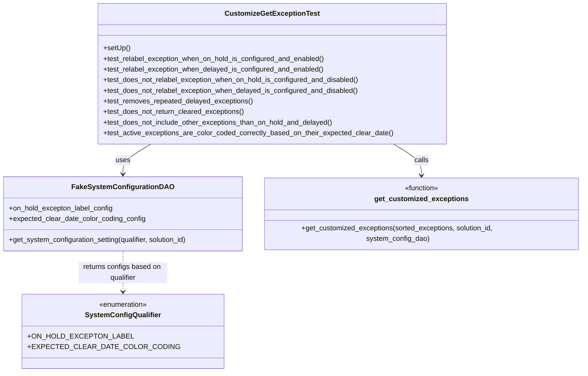

# Diagram: entity_core/entity_service/entity_service_tests/test_exception/test_customize_get_exception.py


> Auto-generated by Obscura crawlers

## Diagram 1



### SVG

<svg id="container" width="1321.265625" xmlns="http://www.w3.org/2000/svg" class="classDiagram" height="842" viewBox="0 0 1321.265625 842" role="graphics-document document" aria-roledescription="class"><style>#container{font-family:"trebuchet ms",verdana,arial,sans-serif;font-size:16px;fill:#333;}@keyframes edge-animation-frame{from{stroke-dashoffset:0;}}@keyframes dash{to{stroke-dashoffset:0;}}#container .edge-animation-slow{stroke-dasharray:9,5!important;stroke-dashoffset:900;animation:dash 50s linear infinite;stroke-linecap:round;}#container .edge-animation-fast{stroke-dasharray:9,5!important;stroke-dashoffset:900;animation:dash 20s linear infinite;stroke-linecap:round;}#container .error-icon{fill:#552222;}#container .error-text{fill:#552222;stroke:#552222;}#container .edge-thickness-normal{stroke-width:1px;}#container .edge-thickness-thick{stroke-width:3.5px;}#container .edge-pattern-solid{stroke-dasharray:0;}#container .edge-thickness-invisible{stroke-width:0;fill:none;}#container .edge-pattern-dashed{stroke-dasharray:3;}#container .edge-pattern-dotted{stroke-dasharray:2;}#container .marker{fill:#333333;stroke:#333333;}#container .marker.cross{stroke:#333333;}#container svg{font-family:"trebuchet ms",verdana,arial,sans-serif;font-size:16px;}#container p{margin:0;}#container g.classGroup text{fill:#9370DB;stroke:none;font-family:"trebuchet ms",verdana,arial,sans-serif;font-size:10px;}#container g.classGroup text .title{font-weight:bolder;}#container .nodeLabel,#container .edgeLabel{color:#131300;}#container .edgeLabel .label rect{fill:#ECECFF;}#container .label text{fill:#131300;}#container .labelBkg{background:#ECECFF;}#container .edgeLabel .label span{background:#ECECFF;}#container .classTitle{font-weight:bolder;}#container .node rect,#container .node circle,#container .node ellipse,#container .node polygon,#container .node path{fill:#ECECFF;stroke:#9370DB;stroke-width:1px;}#container .divider{stroke:#9370DB;stroke-width:1;}#container g.clickable{cursor:pointer;}#container g.classGroup rect{fill:#ECECFF;stroke:#9370DB;}#container g.classGroup line{stroke:#9370DB;stroke-width:1;}#container .classLabel .box{stroke:none;stroke-width:0;fill:#ECECFF;opacity:0.5;}#container .classLabel .label{fill:#9370DB;font-size:10px;}#container .relation{stroke:#333333;stroke-width:1;fill:none;}#container .dashed-line{stroke-dasharray:3;}#container .dotted-line{stroke-dasharray:1 2;}#container #compositionStart,#container .composition{fill:#333333!important;stroke:#333333!important;stroke-width:1;}#container #compositionEnd,#container .composition{fill:#333333!important;stroke:#333333!important;stroke-width:1;}#container #dependencyStart,#container .dependency{fill:#333333!important;stroke:#333333!important;stroke-width:1;}#container #dependencyStart,#container .dependency{fill:#333333!important;stroke:#333333!important;stroke-width:1;}#container #extensionStart,#container .extension{fill:transparent!important;stroke:#333333!important;stroke-width:1;}#container #extensionEnd,#container .extension{fill:transparent!important;stroke:#333333!important;stroke-width:1;}#container #aggregationStart,#container .aggregation{fill:transparent!important;stroke:#333333!important;stroke-width:1;}#container #aggregationEnd,#container .aggregation{fill:transparent!important;stroke:#333333!important;stroke-width:1;}#container #lollipopStart,#container .lollipop{fill:#ECECFF!important;stroke:#333333!important;stroke-width:1;}#container #lollipopEnd,#container .lollipop{fill:#ECECFF!important;stroke:#333333!important;stroke-width:1;}#container .edgeTerminals{font-size:11px;line-height:initial;}#container .classTitleText{text-anchor:middle;font-size:18px;fill:#333;}#container .label-icon{display:inline-block;height:1em;overflow:visible;vertical-align:-0.125em;}#container .node .label-icon path{fill:currentColor;stroke:revert;stroke-width:revert;}#container :root{--mermaid-font-family:"trebuchet ms",verdana,arial,sans-serif;}</style><g><defs><marker id="container_class-aggregationStart" class="marker aggregation class" refX="18" refY="7" markerWidth="190" markerHeight="240" orient="auto"><path d="M 18,7 L9,13 L1,7 L9,1 Z"></path></marker></defs><defs><marker id="container_class-aggregationEnd" class="marker aggregation class" refX="1" refY="7" markerWidth="20" markerHeight="28" orient="auto"><path d="M 18,7 L9,13 L1,7 L9,1 Z"></path></marker></defs><defs><marker id="container_class-extensionStart" class="marker extension class" refX="18" refY="7" markerWidth="190" markerHeight="240" orient="auto"><path d="M 1,7 L18,13 V 1 Z"></path></marker></defs><defs><marker id="container_class-extensionEnd" class="marker extension class" refX="1" refY="7" markerWidth="20" markerHeight="28" orient="auto"><path d="M 1,1 V 13 L18,7 Z"></path></marker></defs><defs><marker id="container_class-compositionStart" class="marker composition class" refX="18" refY="7" markerWidth="190" markerHeight="240" orient="auto"><path d="M 18,7 L9,13 L1,7 L9,1 Z"></path></marker></defs><defs><marker id="container_class-compositionEnd" class="marker composition class" refX="1" refY="7" markerWidth="20" markerHeight="28" orient="auto"><path d="M 18,7 L9,13 L1,7 L9,1 Z"></path></marker></defs><defs><marker id="container_class-dependencyStart" class="marker dependency class" refX="6" refY="7" markerWidth="190" markerHeight="240" orient="auto"><path d="M 5,7 L9,13 L1,7 L9,1 Z"></path></marker></defs><defs><marker id="container_class-dependencyEnd" class="marker dependency class" refX="13" refY="7" markerWidth="20" markerHeight="28" orient="auto"><path d="M 18,7 L9,13 L14,7 L9,1 Z"></path></marker></defs><defs><marker id="container_class-lollipopStart" class="marker lollipop class" refX="13" refY="7" markerWidth="190" markerHeight="240" orient="auto"><circle stroke="black" fill="transparent" cx="7" cy="7" r="6"></circle></marker></defs><defs><marker id="container_class-lollipopEnd" class="marker lollipop class" refX="1" refY="7" markerWidth="190" markerHeight="240" orient="auto"><circle stroke="black" fill="transparent" cx="7" cy="7" r="6"></circle></marker></defs><g class="root"><g class="clusters"></g><g class="edgePaths"><path d="M893.399,326L904.059,332.167C914.719,338.333,936.039,350.667,946.699,363.5C957.359,376.333,957.359,389.667,957.359,396.333L957.359,403" id="id_CustomizeGetExceptionTest_get_customized_exceptions_1" class="edge-thickness-normal edge-pattern-solid relation" style=";;;" data-edge="true" data-et="edge" data-id="id_CustomizeGetExceptionTest_get_customized_exceptions_1" data-points="W3sieCI6ODkzLjM5OTEzNTA0NDY0MjksInkiOjMyNn0seyJ4Ijo5NTcuMzU5Mzc1LCJ5IjozNjN9LHsieCI6OTU3LjM1OTM3NSwieSI6NDA5fV0=" marker-end="url(#container_class-dependencyEnd)"></path><path d="M343.687,326L333.027,332.167C322.367,338.333,301.047,350.667,290.387,362C279.727,373.333,279.727,383.667,279.727,388.833L279.727,394" id="id_CustomizeGetExceptionTest_FakeSystemConfigurationDAO_2" class="edge-thickness-normal edge-pattern-solid relation" style=";;;" data-edge="true" data-et="edge" data-id="id_CustomizeGetExceptionTest_FakeSystemConfigurationDAO_2" data-points="W3sieCI6MzQzLjY4NjgwMjQ1NTM1NzE3LCJ5IjozMjZ9LHsieCI6Mjc5LjcyNjU2MjUsInkiOjM2M30seyJ4IjoyNzkuNzI2NTYyNSwieSI6NDAwfV0=" marker-end="url(#container_class-dependencyEnd)"></path><path d="M279.727,568L279.727,576.167C279.727,584.333,279.727,600.667,279.727,616C279.727,631.333,279.727,645.667,279.727,652.833L279.727,660" id="id_FakeSystemConfigurationDAO_SystemConfigQualifier_3" class="edge-thickness-normal edge-pattern-dashed relation" style=";;;" data-edge="true" data-et="edge" data-id="id_FakeSystemConfigurationDAO_SystemConfigQualifier_3" data-points="W3sieCI6Mjc5LjcyNjU2MjUsInkiOjU2OH0seyJ4IjoyNzkuNzI2NTYyNSwieSI6NjE3fSx7IngiOjI3OS43MjY1NjI1LCJ5Ijo2NjZ9XQ==" marker-end="url(#container_class-dependencyEnd)"></path></g><g class="edgeLabels"><g class="edgeLabel" transform="translate(957.359375, 363)"><g class="label" data-id="id_CustomizeGetExceptionTest_get_customized_exceptions_1" transform="translate(-16.4453125, -12)"><foreignObject width="32.890625" height="24"><div xmlns="http://www.w3.org/1999/xhtml" class="labelBkg" style="display: table-cell; white-space: nowrap; line-height: 1.5; max-width: 200px; text-align: center;"><span class="edgeLabel"><p>calls</p></span></div></foreignObject></g></g><g class="edgeLabel" transform="translate(279.7265625, 363)"><g class="label" data-id="id_CustomizeGetExceptionTest_FakeSystemConfigurationDAO_2" transform="translate(-16.4921875, -12)"><foreignObject width="32.984375" height="24"><div xmlns="http://www.w3.org/1999/xhtml" class="labelBkg" style="display: table-cell; white-space: nowrap; line-height: 1.5; max-width: 200px; text-align: center;"><span class="edgeLabel"><p>uses</p></span></div></foreignObject></g></g><g class="edgeLabel" transform="translate(279.7265625, 617)"><g class="label" data-id="id_FakeSystemConfigurationDAO_SystemConfigQualifier_3" transform="translate(-100, -24)"><foreignObject width="200" height="48"><div xmlns="http://www.w3.org/1999/xhtml" class="labelBkg" style="display: table; white-space: break-spaces; line-height: 1.5; max-width: 200px; text-align: center; width: 200px;"><span class="edgeLabel"><p>returns configs based on qualifier</p></span></div></foreignObject></g></g></g><g class="nodes"><g class="node default" id="classId-CustomizeGetExceptionTest-0" transform="translate(618.54296875, 167)"><g class="basic label-container"><path d="M-390.9765625 -159 L390.9765625 -159 L390.9765625 159 L-390.9765625 159" stroke="none" stroke-width="0" fill="#ECECFF" style=""></path><path d="M-390.9765625 -159 C-223.94648476643422 -159, -56.91640703286845 -159, 390.9765625 -159 M-390.9765625 -159 C-87.71670575665263 -159, 215.54315098669474 -159, 390.9765625 -159 M390.9765625 -159 C390.9765625 -48.050939947182755, 390.9765625 62.89812010563449, 390.9765625 159 M390.9765625 -159 C390.9765625 -49.35538507308114, 390.9765625 60.289229853837725, 390.9765625 159 M390.9765625 159 C216.16303566119458 159, 41.34950882238917 159, -390.9765625 159 M390.9765625 159 C99.69561841597982 159, -191.58532566804035 159, -390.9765625 159 M-390.9765625 159 C-390.9765625 64.98170243152707, -390.9765625 -29.036595136945863, -390.9765625 -159 M-390.9765625 159 C-390.9765625 92.4691696607517, -390.9765625 25.938339321503406, -390.9765625 -159" stroke="#9370DB" stroke-width="1.3" fill="none" stroke-dasharray="0 0" style=""></path></g><g class="annotation-group text" transform="translate(0, -135)"></g><g class="label-group text" transform="translate(-101.171875, -135)"><g class="label" style="font-weight: bolder" transform="translate(0,-12)"><foreignObject width="202.34375" height="24"><div xmlns="http://www.w3.org/1999/xhtml" style="display: table-cell; white-space: nowrap; line-height: 1.5; max-width: 249px; text-align: center;"><span class="nodeLabel markdown-node-label" style=""><p>CustomizeGetExceptionTest</p></span></div></foreignObject></g></g><g class="members-group text" transform="translate(-378.9765625, -87)"></g><g class="methods-group text" transform="translate(-378.9765625, -57)"><g class="label" style="" transform="translate(0,-12)"><foreignObject width="60.421875" height="24"><div xmlns="http://www.w3.org/1999/xhtml" style="display: table-cell; white-space: nowrap; line-height: 1.5; max-width: 118px; text-align: center;"><span class="nodeLabel markdown-node-label" style=""><p>+setUp()</p></span></div></foreignObject></g><g class="label" style="" transform="translate(0,12)"><foreignObject width="505.90625" height="24"><div xmlns="http://www.w3.org/1999/xhtml" style="display: table-cell; white-space: nowrap; line-height: 1.5; max-width: 563px; text-align: center;"><span class="nodeLabel markdown-node-label" style=""><p>+test_relabel_exception_when_on_hold_is_configured_and_enabled()</p></span></div></foreignObject></g><g class="label" style="" transform="translate(0,36)"><foreignObject width="503.4375" height="24"><div xmlns="http://www.w3.org/1999/xhtml" style="display: table-cell; white-space: nowrap; line-height: 1.5; max-width: 561px; text-align: center;"><span class="nodeLabel markdown-node-label" style=""><p>+test_relabel_exception_when_delayed_is_configured_and_enabled()</p></span></div></foreignObject></g><g class="label" style="" transform="translate(0,60)"><foreignObject width="584.8125" height="24"><div xmlns="http://www.w3.org/1999/xhtml" style="display: table-cell; white-space: nowrap; line-height: 1.5; max-width: 642px; text-align: center;"><span class="nodeLabel markdown-node-label" style=""><p>+test_does_not_relabel_exception_when_on_hold_is_configured_and_disabled()</p></span></div></foreignObject></g><g class="label" style="" transform="translate(0,84)"><foreignObject width="582.328125" height="24"><div xmlns="http://www.w3.org/1999/xhtml" style="display: table-cell; white-space: nowrap; line-height: 1.5; max-width: 640px; text-align: center;"><span class="nodeLabel markdown-node-label" style=""><p>+test_does_not_relabel_exception_when_delayed_is_configured_and_disabled()</p></span></div></foreignObject></g><g class="label" style="" transform="translate(0,108)"><foreignObject width="340.203125" height="24"><div xmlns="http://www.w3.org/1999/xhtml" style="display: table-cell; white-space: nowrap; line-height: 1.5; max-width: 398px; text-align: center;"><span class="nodeLabel markdown-node-label" style=""><p>+test_removes_repeated_delayed_exceptions()</p></span></div></foreignObject></g><g class="label" style="" transform="translate(0,132)"><foreignObject width="322.484375" height="24"><div xmlns="http://www.w3.org/1999/xhtml" style="display: table-cell; white-space: nowrap; line-height: 1.5; max-width: 380px; text-align: center;"><span class="nodeLabel markdown-node-label" style=""><p>+test_does_not_return_cleared_exceptions()</p></span></div></foreignObject></g><g class="label" style="" transform="translate(0,156)"><foreignObject width="525.5" height="24"><div xmlns="http://www.w3.org/1999/xhtml" style="display: table-cell; white-space: nowrap; line-height: 1.5; max-width: 583px; text-align: center;"><span class="nodeLabel markdown-node-label" style=""><p>+test_does_not_include_other_exceptions_than_on_hold_and_delayed()</p></span></div></foreignObject></g><g class="label" style="" transform="translate(0,180)"><foreignObject width="656.78125" height="24"><div xmlns="http://www.w3.org/1999/xhtml" style="display: table-cell; white-space: nowrap; line-height: 1.5; max-width: 714px; text-align: center;"><span class="nodeLabel markdown-node-label" style=""><p>+test_active_exceptions_are_color_coded_correctly_based_on_their_expected_clear_date()</p></span></div></foreignObject></g></g><g class="divider" style=""><path d="M-390.9765625 -111 C-103.54011753058984 -111, 183.89632743882032 -111, 390.9765625 -111 M-390.9765625 -111 C-104.82316038759802 -111, 181.33024172480395 -111, 390.9765625 -111" stroke="#9370DB" stroke-width="1.3" fill="none" stroke-dasharray="0 0" style=""></path></g><g class="divider" style=""><path d="M-390.9765625 -87 C-113.62160982549744 -87, 163.7333428490051 -87, 390.9765625 -87 M-390.9765625 -87 C-108.92542544776387 -87, 173.12571160447226 -87, 390.9765625 -87" stroke="#9370DB" stroke-width="1.3" fill="none" stroke-dasharray="0 0" style=""></path></g></g><g class="node default" id="classId-FakeSystemConfigurationDAO-1" transform="translate(279.7265625, 484)"><g class="basic label-container"><path d="M-271.7265625 -84 L271.7265625 -84 L271.7265625 84 L-271.7265625 84" stroke="none" stroke-width="0" fill="#ECECFF" style=""></path><path d="M-271.7265625 -84 C-131.1746235683145 -84, 9.377315363370997 -84, 271.7265625 -84 M-271.7265625 -84 C-84.95222897038266 -84, 101.82210455923467 -84, 271.7265625 -84 M271.7265625 -84 C271.7265625 -30.67263761309143, 271.7265625 22.654724773817136, 271.7265625 84 M271.7265625 -84 C271.7265625 -49.11047439938192, 271.7265625 -14.220948798763843, 271.7265625 84 M271.7265625 84 C85.99952013397893 84, -99.72752223204213 84, -271.7265625 84 M271.7265625 84 C66.2969335714146 84, -139.1326953571708 84, -271.7265625 84 M-271.7265625 84 C-271.7265625 45.3880873625904, -271.7265625 6.776174725180795, -271.7265625 -84 M-271.7265625 84 C-271.7265625 36.976110881977505, -271.7265625 -10.04777823604499, -271.7265625 -84" stroke="#9370DB" stroke-width="1.3" fill="none" stroke-dasharray="0 0" style=""></path></g><g class="annotation-group text" transform="translate(0, -60)"></g><g class="label-group text" transform="translate(-107.75, -60)"><g class="label" style="font-weight: bolder" transform="translate(0,-12)"><foreignObject width="215.5" height="24"><div xmlns="http://www.w3.org/1999/xhtml" style="display: table-cell; white-space: nowrap; line-height: 1.5; max-width: 262px; text-align: center;"><span class="nodeLabel markdown-node-label" style=""><p>FakeSystemConfigurationDAO</p></span></div></foreignObject></g></g><g class="members-group text" transform="translate(-259.7265625, -12)"><g class="label" style="" transform="translate(0,-12)"><foreignObject width="237.875" height="24"><div xmlns="http://www.w3.org/1999/xhtml" style="display: table-cell; white-space: nowrap; line-height: 1.5; max-width: 296px; text-align: center;"><span class="nodeLabel markdown-node-label" style=""><p>+on_hold_excepton_label_config</p></span></div></foreignObject></g><g class="label" style="" transform="translate(0,12)"><foreignObject width="308.25" height="24"><div xmlns="http://www.w3.org/1999/xhtml" style="display: table-cell; white-space: nowrap; line-height: 1.5; max-width: 366px; text-align: center;"><span class="nodeLabel markdown-node-label" style=""><p>+expected_clear_date_color_coding_config</p></span></div></foreignObject></g></g><g class="methods-group text" transform="translate(-259.7265625, 60)"><g class="label" style="" transform="translate(0,-12)"><foreignObject width="411.703125" height="24"><div xmlns="http://www.w3.org/1999/xhtml" style="display: table-cell; white-space: nowrap; line-height: 1.5; max-width: 469px; text-align: center;"><span class="nodeLabel markdown-node-label" style=""><p>+get_system_configuration_setting(qualifier, solution_id)</p></span></div></foreignObject></g></g><g class="divider" style=""><path d="M-271.7265625 -36 C-120.56192860257096 -36, 30.602705294858083 -36, 271.7265625 -36 M-271.7265625 -36 C-80.14282194862764 -36, 111.44091860274472 -36, 271.7265625 -36" stroke="#9370DB" stroke-width="1.3" fill="none" stroke-dasharray="0 0" style=""></path></g><g class="divider" style=""><path d="M-271.7265625 36 C-141.99581452729848 36, -12.265066554596956 36, 271.7265625 36 M-271.7265625 36 C-76.61812321062769 36, 118.49031607874463 36, 271.7265625 36" stroke="#9370DB" stroke-width="1.3" fill="none" stroke-dasharray="0 0" style=""></path></g></g><g class="node default" id="classId-get_customized_exceptions-2" transform="translate(957.359375, 484)"><g class="basic label-container"><path d="M-355.90625 -75 L355.90625 -75 L355.90625 75 L-355.90625 75" stroke="none" stroke-width="0" fill="#ECECFF" style=""></path><path d="M-355.90625 -75 C-90.48030235837945 -75, 174.9456452832411 -75, 355.90625 -75 M-355.90625 -75 C-175.22105422217035 -75, 5.464141555659296 -75, 355.90625 -75 M355.90625 -75 C355.90625 -22.16645745125642, 355.90625 30.66708509748716, 355.90625 75 M355.90625 -75 C355.90625 -43.718804292720094, 355.90625 -12.437608585440188, 355.90625 75 M355.90625 75 C129.86568084190478 75, -96.17488831619045 75, -355.90625 75 M355.90625 75 C107.58312126293893 75, -140.74000747412214 75, -355.90625 75 M-355.90625 75 C-355.90625 21.748698238536754, -355.90625 -31.502603522926492, -355.90625 -75 M-355.90625 75 C-355.90625 33.40579026343278, -355.90625 -8.188419473134445, -355.90625 -75" stroke="#9370DB" stroke-width="1.3" fill="none" stroke-dasharray="0 0" style=""></path></g><g class="annotation-group text" transform="translate(-39.484375, -51)"><g class="label" style="" transform="translate(0,-12)"><foreignObject width="78.96875" height="24"><div xmlns="http://www.w3.org/1999/xhtml" style="display: table-cell; white-space: nowrap; line-height: 1.5; max-width: 129px; text-align: center;"><span class="nodeLabel markdown-node-label" style=""><p>«function»</p></span></div></foreignObject></g></g><g class="label-group text" transform="translate(-101.046875, -27)"><g class="label" style="font-weight: bolder" transform="translate(0,-12)"><foreignObject width="202.09375" height="24"><div xmlns="http://www.w3.org/1999/xhtml" style="display: table-cell; white-space: nowrap; line-height: 1.5; max-width: 249px; text-align: center;"><span class="nodeLabel markdown-node-label" style=""><p>get_customized_exceptions</p></span></div></foreignObject></g></g><g class="members-group text" transform="translate(-343.90625, 21)"></g><g class="methods-group text" transform="translate(-343.90625, 51)"><g class="label" style="" transform="translate(0,-12)"><foreignObject width="586.765625" height="24"><div xmlns="http://www.w3.org/1999/xhtml" style="display: table-cell; white-space: nowrap; line-height: 1.5; max-width: 644px; text-align: center;"><span class="nodeLabel markdown-node-label" style=""><p>+get_customized_exceptions(sorted_exceptions, solution_id, system_config_dao)</p></span></div></foreignObject></g></g><g class="divider" style=""><path d="M-355.90625 -3 C-200.85616508471747 -3, -45.80608016943495 -3, 355.90625 -3 M-355.90625 -3 C-201.24987521754676 -3, -46.59350043509352 -3, 355.90625 -3" stroke="#9370DB" stroke-width="1.3" fill="none" stroke-dasharray="0 0" style=""></path></g><g class="divider" style=""><path d="M-355.90625 21 C-204.88647915666726 21, -53.86670831333453 21, 355.90625 21 M-355.90625 21 C-125.54467282391133 21, 104.81690435217735 21, 355.90625 21" stroke="#9370DB" stroke-width="1.3" fill="none" stroke-dasharray="0 0" style=""></path></g></g><g class="node default" id="classId-SystemConfigQualifier-3" transform="translate(279.7265625, 750)"><g class="basic label-container"><path d="M-198.80078125 -84 L198.80078125 -84 L198.80078125 84 L-198.80078125 84" stroke="none" stroke-width="0" fill="#ECECFF" style=""></path><path d="M-198.80078125 -84 C-104.42082786697691 -84, -10.040874483953814 -84, 198.80078125 -84 M-198.80078125 -84 C-72.71442806089422 -84, 53.37192512821156 -84, 198.80078125 -84 M198.80078125 -84 C198.80078125 -35.535078693068385, 198.80078125 12.92984261386323, 198.80078125 84 M198.80078125 -84 C198.80078125 -41.63934430428792, 198.80078125 0.721311391424166, 198.80078125 84 M198.80078125 84 C100.07879060704141 84, 1.3567999640828248 84, -198.80078125 84 M198.80078125 84 C102.17754765213427 84, 5.554314054268531 84, -198.80078125 84 M-198.80078125 84 C-198.80078125 46.9033345254786, -198.80078125 9.806669050957197, -198.80078125 -84 M-198.80078125 84 C-198.80078125 34.00955444662573, -198.80078125 -15.980891106748544, -198.80078125 -84" stroke="#9370DB" stroke-width="1.3" fill="none" stroke-dasharray="0 0" style=""></path></g><g class="annotation-group text" transform="translate(-55.5546875, -60)"><g class="label" style="" transform="translate(0,-12)"><foreignObject width="111.109375" height="24"><div xmlns="http://www.w3.org/1999/xhtml" style="display: table-cell; white-space: nowrap; line-height: 1.5; max-width: 161px; text-align: center;"><span class="nodeLabel markdown-node-label" style=""><p>«enumeration»</p></span></div></foreignObject></g></g><g class="label-group text" transform="translate(-80.9296875, -36)"><g class="label" style="font-weight: bolder" transform="translate(0,-12)"><foreignObject width="161.859375" height="24"><div xmlns="http://www.w3.org/1999/xhtml" style="display: table-cell; white-space: nowrap; line-height: 1.5; max-width: 210px; text-align: center;"><span class="nodeLabel markdown-node-label" style=""><p>SystemConfigQualifier</p></span></div></foreignObject></g></g><g class="members-group text" transform="translate(-186.80078125, 12)"><g class="label" style="" transform="translate(0,-12)"><foreignObject width="211.03125" height="24"><div xmlns="http://www.w3.org/1999/xhtml" style="display: table-cell; white-space: nowrap; line-height: 1.5; max-width: 268px; text-align: center;"><span class="nodeLabel markdown-node-label" style=""><p>+ON_HOLD_EXCEPTON_LABEL</p></span></div></foreignObject></g><g class="label" style="" transform="translate(0,12)"><foreignObject width="292.671875" height="24"><div xmlns="http://www.w3.org/1999/xhtml" style="display: table-cell; white-space: nowrap; line-height: 1.5; max-width: 350px; text-align: center;"><span class="nodeLabel markdown-node-label" style=""><p>+EXPECTED_CLEAR_DATE_COLOR_CODING</p></span></div></foreignObject></g></g><g class="methods-group text" transform="translate(-186.80078125, 84)"></g><g class="divider" style=""><path d="M-198.80078125 -12 C-55.73014089641603 -12, 87.34049945716794 -12, 198.80078125 -12 M-198.80078125 -12 C-58.375720471854834 -12, 82.04934030629033 -12, 198.80078125 -12" stroke="#9370DB" stroke-width="1.3" fill="none" stroke-dasharray="0 0" style=""></path></g><g class="divider" style=""><path d="M-198.80078125 60 C-100.82782593033967 60, -2.854870610679342 60, 198.80078125 60 M-198.80078125 60 C-91.70355150572766 60, 15.39367823854468 60, 198.80078125 60" stroke="#9370DB" stroke-width="1.3" fill="none" stroke-dasharray="0 0" style=""></path></g></g></g></g></g></svg>

## Diagram 2

```mermaid
flowchart TD
    A[Input: exceptions list] --> B[Filter: status == "ACTIVE"]
    B --> C{Is type On Hold or Delayed?}
    C -->|Yes| D[Apply type-specific filters\n(apply_vin_exception_filter, apply_last_milestone_filter)]
    C -->|No| E[Discard exception]
    D --> F{Relabel enabled? (relabel_vin_exception or relabel_last_milestone)}
    F -->|Yes| G[Relabel type and typeName to configured vin_exception_label/last_milestone_desc]
    F -->|No| H[Keep original type/typeName]
    G --> I[Remove duplicates: keep first ACTIVE per type]
    H --> I
    I --> J[Color code by expectedClearDate using config\n(future -> GREEN, missing -> YELLOW, past -> RED)]
    J --> K[Format expectedClearDate as ISO string or None]
    K --> L[Output: customized exceptions list]
```

> SVG rendering failed for this diagram.
