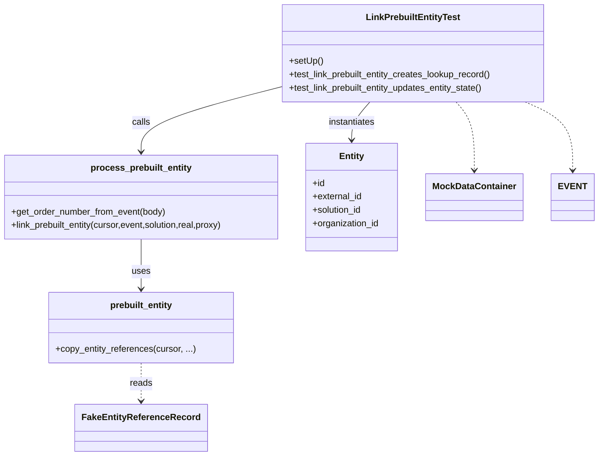
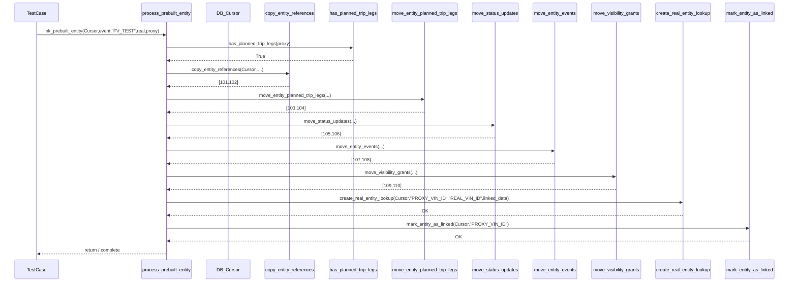

# Diagram: entity_core/entity_service/entity_service_tests/test_process_prebuilt_entity/test_link_prebuilt_entity.py

> Auto-generated by Obscura crawlers

## Diagram 1

### SVG

<svg id="container" width="1068.2421875" xmlns="http://www.w3.org/2000/svg" class="classDiagram" height="814" viewBox="0 0 1068.2421875 814" role="graphics-document document" aria-roledescription="class"><g><defs><marker id="container_class-aggregationStart" class="marker aggregation class" refX="18" refY="7" markerWidth="190" markerHeight="240" orient="auto"><path d="M 18,7 L9,13 L1,7 L9,1 Z"></path></marker></defs><defs><marker id="container_class-aggregationEnd" class="marker aggregation class" refX="1" refY="7" markerWidth="20" markerHeight="28" orient="auto"><path d="M 18,7 L9,13 L1,7 L9,1 Z"></path></marker></defs><defs><marker id="container_class-extensionStart" class="marker extension class" refX="18" refY="7" markerWidth="190" markerHeight="240" orient="auto"><path d="M 1,7 L18,13 V 1 Z"></path></marker></defs><defs><marker id="container_class-extensionEnd" class="marker extension class" refX="1" refY="7" markerWidth="20" markerHeight="28" orient="auto"><path d="M 1,1 V 13 L18,7 Z"></path></marker></defs><defs><marker id="container_class-compositionStart" class="marker composition class" refX="18" refY="7" markerWidth="190" markerHeight="240" orient="auto"><path d="M 18,7 L9,13 L1,7 L9,1 Z"></path></marker></defs><defs><marker id="container_class-compositionEnd" class="marker composition class" refX="1" refY="7" markerWidth="20" markerHeight="28" orient="auto"><path d="M 18,7 L9,13 L1,7 L9,1 Z"></path></marker></defs><defs><marker id="container_class-dependencyStart" class="marker dependency class" refX="6" refY="7" markerWidth="190" markerHeight="240" orient="auto"><path d="M 5,7 L9,13 L1,7 L9,1 Z"></path></marker></defs><defs><marker id="container_class-dependencyEnd" class="marker dependency class" refX="13" refY="7" markerWidth="20" markerHeight="28" orient="auto"><path d="M 18,7 L9,13 L14,7 L9,1 Z"></path></marker></defs><defs><marker id="container_class-lollipopStart" class="marker lollipop class" refX="13" refY="7" markerWidth="190" markerHeight="240" orient="auto"><circle stroke="black" fill="transparent" cx="7" cy="7" r="6"></circle></marker></defs><defs><marker id="container_class-lollipopEnd" class="marker lollipop class" refX="1" refY="7" markerWidth="190" markerHeight="240" orient="auto"><circle stroke="black" fill="transparent" cx="7" cy="7" r="6"></circle></marker></defs><g class="root"><g class="clusters"></g><g class="edgePaths"><path d="M511.996,154.827L469.63,165.523C427.264,176.218,342.533,197.609,300.167,216.971C257.801,236.333,257.801,253.667,257.801,262.333L257.801,271" id="id_LinkPrebuiltEntityTest_process_prebuilt_entity_1" class="edge-thickness-normal edge-pattern-solid relation" style=";;;" data-edge="true" data-et="edge" data-id="id_LinkPrebuiltEntityTest_process_prebuilt_entity_1" data-points="W3sieCI6NTExLjk5NjA5Mzc1LCJ5IjoxNTQuODI3MDA5NDg3NzU2NTh9LHsieCI6MjU3LjgwMDc4MTI1LCJ5IjoyMTl9LHsieCI6MjU3LjgwMDc4MTI1LCJ5IjoyNzd9XQ==" marker-end="url(#container_class-dependencyEnd)"></path><path d="M257.801,427L257.801,436.667C257.801,446.333,257.801,465.667,257.801,480.5C257.801,495.333,257.801,505.667,257.801,510.833L257.801,516" id="id_process_prebuilt_entity_prebuilt_entity_2" class="edge-thickness-normal edge-pattern-solid relation" style=";;;" data-edge="true" data-et="edge" data-id="id_process_prebuilt_entity_prebuilt_entity_2" data-points="W3sieCI6MjU3LjgwMDc4MTI1LCJ5Ijo0Mjd9LHsieCI6MjU3LjgwMDc4MTI1LCJ5Ijo0ODV9LHsieCI6MjU3LjgwMDc4MTI1LCJ5Ijo1MjJ9XQ==" marker-end="url(#container_class-dependencyEnd)"></path><path d="M672.95,182L667.561,188.167C662.173,194.333,651.395,206.667,646.006,218C640.617,229.333,640.617,239.667,640.617,244.833L640.617,250" id="id_LinkPrebuiltEntityTest_Entity_3" class="edge-thickness-normal edge-pattern-solid relation" style=";;;" data-edge="true" data-et="edge" data-id="id_LinkPrebuiltEntityTest_Entity_3" data-points="W3sieCI6NjcyLjk1MDIyNjgxNDUxNjEsInkiOjE4Mn0seyJ4Ijo2NDAuNjE3MTg3NSwieSI6MjE5fSx7IngiOjY0MC42MTcxODc1LCJ5IjoyNTZ9XQ==" marker-end="url(#container_class-dependencyEnd)"></path><path d="M257.801,648L257.801,654.167C257.801,660.333,257.801,672.667,257.801,684C257.801,695.333,257.801,705.667,257.801,710.833L257.801,716" id="id_prebuilt_entity_FakeEntityReferenceRecord_4" class="edge-thickness-normal edge-pattern-dashed relation" style=";;;" data-edge="true" data-et="edge" data-id="id_prebuilt_entity_FakeEntityReferenceRecord_4" data-points="W3sieCI6MjU3LjgwMDc4MTI1LCJ5Ijo2NDh9LHsieCI6MjU3LjgwMDc4MTI1LCJ5Ijo2ODV9LHsieCI6MjU3LjgwMDc4MTI1LCJ5Ijo3MjJ9XQ==" marker-end="url(#container_class-dependencyEnd)"></path><path d="M825.003,182L830.392,188.167C835.781,194.333,846.558,206.667,851.947,227C857.336,247.333,857.336,275.667,857.336,289.833L857.336,304" id="id_LinkPrebuiltEntityTest_MockDataContainer_5" class="edge-thickness-normal edge-pattern-dashed relation" style=";;;" data-edge="true" data-et="edge" data-id="id_LinkPrebuiltEntityTest_MockDataContainer_5" data-points="W3sieCI6ODI1LjAwMjg5ODE4NTQ4MzksInkiOjE4Mn0seyJ4Ijo4NTcuMzM1OTM3NSwieSI6MjE5fSx7IngiOjg1Ny4zMzU5Mzc1LCJ5IjozMTB9XQ==" marker-end="url(#container_class-dependencyEnd)"></path><path d="M943.088,182L956.846,188.167C970.605,194.333,998.123,206.667,1011.882,227C1025.641,247.333,1025.641,275.667,1025.641,289.833L1025.641,304" id="id_LinkPrebuiltEntityTest_EVENT_6" class="edge-thickness-normal edge-pattern-dashed relation" style=";;;" data-edge="true" data-et="edge" data-id="id_LinkPrebuiltEntityTest_EVENT_6" data-points="W3sieCI6OTQzLjA4NzYzODYwODg3MSwieSI6MTgyfSx7IngiOjEwMjUuNjQwNjI1LCJ5IjoyMTl9LHsieCI6MTAyNS42NDA2MjUsInkiOjMxMH1d" marker-end="url(#container_class-dependencyEnd)"></path></g><g class="edgeLabels"><g class="edgeLabel" transform="translate(257.80078125, 219)"><g class="label" data-id="id_LinkPrebuiltEntityTest_process_prebuilt_entity_1" transform="translate(-16.4453125, -12)"><foreignObject width="32.890625" height="24">

calls

</foreignObject></g></g><g class="edgeLabel" transform="translate(257.80078125, 485)"><g class="label" data-id="id_process_prebuilt_entity_prebuilt_entity_2" transform="translate(-16.4921875, -12)"><foreignObject width="32.984375" height="24">

uses

</foreignObject></g></g><g class="edgeLabel" transform="translate(640.6171875, 219)"><g class="label" data-id="id_LinkPrebuiltEntityTest_Entity_3" transform="translate(-42.9140625, -12)"><foreignObject width="85.828125" height="24">

instantiates

</foreignObject></g></g><g class="edgeLabel" transform="translate(257.80078125, 685)"><g class="label" data-id="id_prebuilt_entity_FakeEntityReferenceRecord_4" transform="translate(-20.0078125, -12)"><foreignObject width="40.015625" height="24">

reads

</foreignObject></g></g><g class="edgeLabel"><g class="label" data-id="id_LinkPrebuiltEntityTest_MockDataContainer_5" transform="translate(0, 0)"><foreignObject width="0" height="0">

</foreignObject></g></g><g class="edgeLabel"><g class="label" data-id="id_LinkPrebuiltEntityTest_EVENT_6" transform="translate(0, 0)"><foreignObject width="0" height="0">

</foreignObject></g></g></g><g class="nodes"><g class="node default" id="classId-LinkPrebuiltEntityTest-0" transform="translate(748.9765625, 95)"><g class="basic label-container"><path d="M-236.98046875 -87 L236.98046875 -87 L236.98046875 87 L-236.98046875 87" stroke="none" stroke-width="0" fill="#ECECFF" style=""></path><path d="M-236.98046875 -87 C-71.11046181777314 -87, 94.75954511445372 -87, 236.98046875 -87 M-236.98046875 -87 C-70.79033236682048 -87, 95.39980401635904 -87, 236.98046875 -87 M236.98046875 -87 C236.98046875 -40.20150407660828, 236.98046875 6.596991846783439, 236.98046875 87 M236.98046875 -87 C236.98046875 -51.57848603373064, 236.98046875 -16.156972067461282, 236.98046875 87 M236.98046875 87 C72.99302810113801 87, -90.99441254772398 87, -236.98046875 87 M236.98046875 87 C92.06745194620558 87, -52.84556485758884 87, -236.98046875 87 M-236.98046875 87 C-236.98046875 35.150167499434914, -236.98046875 -16.69966500113017, -236.98046875 -87 M-236.98046875 87 C-236.98046875 36.91062898518691, -236.98046875 -13.178742029626179, -236.98046875 -87" stroke="#9370DB" stroke-width="1.3" fill="none" stroke-dasharray="0 0" style=""></path></g><g class="annotation-group text" transform="translate(0, -63)"></g><g class="label-group text" transform="translate(-81.0234375, -63)"><g class="label" style="font-weight: bolder" transform="translate(0,-12)"><foreignObject width="162.046875" height="24">

LinkPrebuiltEntityTest

</foreignObject></g></g><g class="members-group text" transform="translate(-224.98046875, -15)"></g><g class="methods-group text" transform="translate(-224.98046875, 15)"><g class="label" style="" transform="translate(0,-12)"><foreignObject width="60.421875" height="24">

+setUp()

</foreignObject></g><g class="label" style="" transform="translate(0,12)"><foreignObject width="368.9375" height="24">

+test_link_prebuilt_entity_creates_lookup_record()

</foreignObject></g><g class="label" style="" transform="translate(0,36)"><foreignObject width="356.59375" height="24">

+test_link_prebuilt_entity_updates_entity_state()

</foreignObject></g></g><g class="divider" style=""><path d="M-236.98046875 -39 C-82.04957765415784 -39, 72.88131344168431 -39, 236.98046875 -39 M-236.98046875 -39 C-95.76845920135267 -39, 45.44355034729466 -39, 236.98046875 -39" stroke="#9370DB" stroke-width="1.3" fill="none" stroke-dasharray="0 0" style=""></path></g><g class="divider" style=""><path d="M-236.98046875 -15 C-112.75208818970343 -15, 11.476292370593143 -15, 236.98046875 -15 M-236.98046875 -15 C-65.77351251606896 -15, 105.43344371786208 -15, 236.98046875 -15" stroke="#9370DB" stroke-width="1.3" fill="none" stroke-dasharray="0 0" style=""></path></g></g><g class="node default" id="classId-process_prebuilt_entity-1" transform="translate(257.80078125, 352)"><g class="basic label-container"><path d="M-249.80078125 -75 L249.80078125 -75 L249.80078125 75 L-249.80078125 75" stroke="none" stroke-width="0" fill="#ECECFF" style=""></path><path d="M-249.80078125 -75 C-133.1803350939819 -75, -16.559888937963848 -75, 249.80078125 -75 M-249.80078125 -75 C-130.53987221931573 -75, -11.27896318863148 -75, 249.80078125 -75 M249.80078125 -75 C249.80078125 -36.15283792528281, 249.80078125 2.6943241494343795, 249.80078125 75 M249.80078125 -75 C249.80078125 -42.4749476905663, 249.80078125 -9.949895381132606, 249.80078125 75 M249.80078125 75 C97.65420878148996 75, -54.49236368702009 75, -249.80078125 75 M249.80078125 75 C148.95429398521566 75, 48.107806720431284 75, -249.80078125 75 M-249.80078125 75 C-249.80078125 35.21834487554767, -249.80078125 -4.563310248904656, -249.80078125 -75 M-249.80078125 75 C-249.80078125 23.576125617806582, -249.80078125 -27.847748764386836, -249.80078125 -75" stroke="#9370DB" stroke-width="1.3" fill="none" stroke-dasharray="0 0" style=""></path></g><g class="annotation-group text" transform="translate(0, -51)"></g><g class="label-group text" transform="translate(-86.9765625, -51)"><g class="label" style="font-weight: bolder" transform="translate(0,-12)"><foreignObject width="173.953125" height="24">

process_prebuilt_entity

</foreignObject></g></g><g class="members-group text" transform="translate(-237.80078125, -3)"></g><g class="methods-group text" transform="translate(-237.80078125, 27)"><g class="label" style="" transform="translate(0,-12)"><foreignObject width="277.71875" height="24">

+get_order_number_from_event(body)

</foreignObject></g><g class="label" style="" transform="translate(0,12)"><foreignObject width="388.625" height="24">

+link_prebuilt_entity(cursor,event,solution,real,proxy)

</foreignObject></g></g><g class="divider" style=""><path d="M-249.80078125 -27 C-126.76286019316457 -27, -3.724939136329141 -27, 249.80078125 -27 M-249.80078125 -27 C-89.70051028708667 -27, 70.39976067582666 -27, 249.80078125 -27" stroke="#9370DB" stroke-width="1.3" fill="none" stroke-dasharray="0 0" style=""></path></g><g class="divider" style=""><path d="M-249.80078125 -3 C-55.18386306412947 -3, 139.43305512174106 -3, 249.80078125 -3 M-249.80078125 -3 C-98.23946129453466 -3, 53.32185866093067 -3, 249.80078125 -3" stroke="#9370DB" stroke-width="1.3" fill="none" stroke-dasharray="0 0" style=""></path></g></g><g class="node default" id="classId-prebuilt_entity-2" transform="translate(257.80078125, 585)"><g class="basic label-container"><path d="M-164.08203125 -63 L164.08203125 -63 L164.08203125 63 L-164.08203125 63" stroke="none" stroke-width="0" fill="#ECECFF" style=""></path><path d="M-164.08203125 -63 C-98.4385665901486 -63, -32.79510193029719 -63, 164.08203125 -63 M-164.08203125 -63 C-46.453044062103416 -63, 71.17594312579317 -63, 164.08203125 -63 M164.08203125 -63 C164.08203125 -33.04841140772563, 164.08203125 -3.0968228154512616, 164.08203125 63 M164.08203125 -63 C164.08203125 -36.18320599236621, 164.08203125 -9.366411984732423, 164.08203125 63 M164.08203125 63 C84.6129472607312 63, 5.143863271462408 63, -164.08203125 63 M164.08203125 63 C60.08488790598837 63, -43.912255438023266 63, -164.08203125 63 M-164.08203125 63 C-164.08203125 19.559326568874667, -164.08203125 -23.881346862250666, -164.08203125 -63 M-164.08203125 63 C-164.08203125 30.82882718942144, -164.08203125 -1.342345621157122, -164.08203125 -63" stroke="#9370DB" stroke-width="1.3" fill="none" stroke-dasharray="0 0" style=""></path></g><g class="annotation-group text" transform="translate(0, -39)"></g><g class="label-group text" transform="translate(-54.8046875, -39)"><g class="label" style="font-weight: bolder" transform="translate(0,-12)"><foreignObject width="109.609375" height="24">

prebuilt_entity

</foreignObject></g></g><g class="members-group text" transform="translate(-152.08203125, 9)"></g><g class="methods-group text" transform="translate(-152.08203125, 39)"><g class="label" style="" transform="translate(0,-12)"><foreignObject width="249.359375" height="24">

+copy_entity_references(cursor, ...)

</foreignObject></g></g><g class="divider" style=""><path d="M-164.08203125 -15 C-70.69438612149364 -15, 22.693259007012728 -15, 164.08203125 -15 M-164.08203125 -15 C-35.28217306800198 -15, 93.51768511399604 -15, 164.08203125 -15" stroke="#9370DB" stroke-width="1.3" fill="none" stroke-dasharray="0 0" style=""></path></g><g class="divider" style=""><path d="M-164.08203125 9 C-58.911460515969324 9, 46.25911021806135 9, 164.08203125 9 M-164.08203125 9 C-91.83689452325038 9, -19.591757796500758 9, 164.08203125 9" stroke="#9370DB" stroke-width="1.3" fill="none" stroke-dasharray="0 0" style=""></path></g></g><g class="node default" id="classId-Entity-3" transform="translate(640.6171875, 352)"><g class="basic label-container"><path d="M-83.015625 -96 L83.015625 -96 L83.015625 96 L-83.015625 96" stroke="none" stroke-width="0" fill="#ECECFF" style=""></path><path d="M-83.015625 -96 C-21.635768334701027 -96, 39.74408833059795 -96, 83.015625 -96 M-83.015625 -96 C-48.7552646154092 -96, -14.494904230818406 -96, 83.015625 -96 M83.015625 -96 C83.015625 -26.80818341457396, 83.015625 42.38363317085208, 83.015625 96 M83.015625 -96 C83.015625 -40.49432005506789, 83.015625 15.011359889864224, 83.015625 96 M83.015625 96 C46.18276966411626 96, 9.349914328232515 96, -83.015625 96 M83.015625 96 C45.61650170273951 96, 8.217378405479025 96, -83.015625 96 M-83.015625 96 C-83.015625 23.294998466928874, -83.015625 -49.41000306614225, -83.015625 -96 M-83.015625 96 C-83.015625 34.7221936139682, -83.015625 -26.555612772063597, -83.015625 -96" stroke="#9370DB" stroke-width="1.3" fill="none" stroke-dasharray="0 0" style=""></path></g><g class="annotation-group text" transform="translate(0, -72)"></g><g class="label-group text" transform="translate(-21.28125, -72)"><g class="label" style="font-weight: bolder" transform="translate(0,-12)"><foreignObject width="42.5625" height="24">

Entity

</foreignObject></g></g><g class="members-group text" transform="translate(-71.015625, -24)"><g class="label" style="" transform="translate(0,-12)"><foreignObject width="22.078125" height="24">

+id

</foreignObject></g><g class="label" style="" transform="translate(0,12)"><foreignObject width="89.765625" height="24">

+external_id

</foreignObject></g><g class="label" style="" transform="translate(0,36)"><foreignObject width="90.21875" height="24">

+solution_id

</foreignObject></g><g class="label" style="" transform="translate(0,60)"><foreignObject width="120.75" height="24">

+organization_id

</foreignObject></g></g><g class="methods-group text" transform="translate(-71.015625, 96)"></g><g class="divider" style=""><path d="M-83.015625 -48 C-23.3910321708222 -48, 36.2335606583556 -48, 83.015625 -48 M-83.015625 -48 C-41.017481054100124 -48, 0.9806628917997529 -48, 83.015625 -48" stroke="#9370DB" stroke-width="1.3" fill="none" stroke-dasharray="0 0" style=""></path></g><g class="divider" style=""><path d="M-83.015625 72 C-35.70066983801163 72, 11.614285323976745 72, 83.015625 72 M-83.015625 72 C-45.096960572715886 72, -7.178296145431773 72, 83.015625 72" stroke="#9370DB" stroke-width="1.3" fill="none" stroke-dasharray="0 0" style=""></path></g></g><g class="node default" id="classId-FakeEntityReferenceRecord-4" transform="translate(257.80078125, 764)"><g class="basic label-container"><path d="M-111.65625 -42 L111.65625 -42 L111.65625 42 L-111.65625 42" stroke="none" stroke-width="0" fill="#ECECFF" style=""></path><path d="M-111.65625 -42 C-47.9814564375977 -42, 15.6933371248046 -42, 111.65625 -42 M-111.65625 -42 C-55.53358606156063 -42, 0.589077876878747 -42, 111.65625 -42 M111.65625 -42 C111.65625 -10.182970685094094, 111.65625 21.63405862981181, 111.65625 42 M111.65625 -42 C111.65625 -21.374187986469842, 111.65625 -0.7483759729396837, 111.65625 42 M111.65625 42 C60.14604301381444 42, 8.635836027628883 42, -111.65625 42 M111.65625 42 C40.29843769542671 42, -31.059374609146573 42, -111.65625 42 M-111.65625 42 C-111.65625 8.722955875901981, -111.65625 -24.554088248196038, -111.65625 -42 M-111.65625 42 C-111.65625 21.16187712237966, -111.65625 0.32375424475932135, -111.65625 -42" stroke="#9370DB" stroke-width="1.3" fill="none" stroke-dasharray="0 0" style=""></path></g><g class="annotation-group text" transform="translate(0, -18)"></g><g class="label-group text" transform="translate(-99.65625, -18)"><g class="label" style="font-weight: bolder" transform="translate(0,-12)"><foreignObject width="199.3125" height="24">

FakeEntityReferenceRecord

</foreignObject></g></g><g class="members-group text" transform="translate(-99.65625, 30)"></g><g class="methods-group text" transform="translate(-99.65625, 60)"></g><g class="divider" style=""><path d="M-111.65625 6 C-56.779421521311406 6, -1.9025930426228115 6, 111.65625 6 M-111.65625 6 C-33.04862747443342 6, 45.55899505113317 6, 111.65625 6" stroke="#9370DB" stroke-width="1.3" fill="none" stroke-dasharray="0 0" style=""></path></g><g class="divider" style=""><path d="M-111.65625 24 C-23.39463186998148 24, 64.86698626003704 24, 111.65625 24 M-111.65625 24 C-45.829719825972546 24, 19.996810348054908 24, 111.65625 24" stroke="#9370DB" stroke-width="1.3" fill="none" stroke-dasharray="0 0" style=""></path></g></g><g class="node default" id="classId-MockDataContainer-5" transform="translate(857.3359375, 352)"><g class="basic label-container"><path d="M-83.703125 -42 L83.703125 -42 L83.703125 42 L-83.703125 42" stroke="none" stroke-width="0" fill="#ECECFF" style=""></path><path d="M-83.703125 -42 C-35.35089166331162 -42, 13.001341673376757 -42, 83.703125 -42 M-83.703125 -42 C-23.961408851751266 -42, 35.78030729649747 -42, 83.703125 -42 M83.703125 -42 C83.703125 -22.65920012771514, 83.703125 -3.3184002554302765, 83.703125 42 M83.703125 -42 C83.703125 -14.60319795551285, 83.703125 12.793604088974298, 83.703125 42 M83.703125 42 C24.250756980953327 42, -35.20161103809335 42, -83.703125 42 M83.703125 42 C43.906321439694246 42, 4.109517879388491 42, -83.703125 42 M-83.703125 42 C-83.703125 14.936176218403194, -83.703125 -12.127647563193612, -83.703125 -42 M-83.703125 42 C-83.703125 21.18544162235528, -83.703125 0.3708832447105621, -83.703125 -42" stroke="#9370DB" stroke-width="1.3" fill="none" stroke-dasharray="0 0" style=""></path></g><g class="annotation-group text" transform="translate(0, -18)"></g><g class="label-group text" transform="translate(-71.703125, -18)"><g class="label" style="font-weight: bolder" transform="translate(0,-12)"><foreignObject width="143.40625" height="24">

MockDataContainer

</foreignObject></g></g><g class="members-group text" transform="translate(-71.703125, 30)"></g><g class="methods-group text" transform="translate(-71.703125, 60)"></g><g class="divider" style=""><path d="M-83.703125 6 C-47.42050140632961 6, -11.137877812659227 6, 83.703125 6 M-83.703125 6 C-26.01412737861415 6, 31.674870242771703 6, 83.703125 6" stroke="#9370DB" stroke-width="1.3" fill="none" stroke-dasharray="0 0" style=""></path></g><g class="divider" style=""><path d="M-83.703125 24 C-23.03537777799294 24, 37.63236944401412 24, 83.703125 24 M-83.703125 24 C-47.05895051846788 24, -10.414776036935763 24, 83.703125 24" stroke="#9370DB" stroke-width="1.3" fill="none" stroke-dasharray="0 0" style=""></path></g></g><g class="node default" id="classId-EVENT-6" transform="translate(1025.640625, 352)"><g class="basic label-container"><path d="M-34.6015625 -42 L34.6015625 -42 L34.6015625 42 L-34.6015625 42" stroke="none" stroke-width="0" fill="#ECECFF" style=""></path><path d="M-34.6015625 -42 C-9.847624731711104 -42, 14.906313036577792 -42, 34.6015625 -42 M-34.6015625 -42 C-19.61989868564835 -42, -4.6382348712967065 -42, 34.6015625 -42 M34.6015625 -42 C34.6015625 -11.333160964642133, 34.6015625 19.333678070715735, 34.6015625 42 M34.6015625 -42 C34.6015625 -10.590476603381084, 34.6015625 20.81904679323783, 34.6015625 42 M34.6015625 42 C11.547495883568804 42, -11.506570732862393 42, -34.6015625 42 M34.6015625 42 C9.109090285837972 42, -16.383381928324056 42, -34.6015625 42 M-34.6015625 42 C-34.6015625 14.849333731733878, -34.6015625 -12.301332536532243, -34.6015625 -42 M-34.6015625 42 C-34.6015625 23.80468607412337, -34.6015625 5.609372148246742, -34.6015625 -42" stroke="#9370DB" stroke-width="1.3" fill="none" stroke-dasharray="0 0" style=""></path></g><g class="annotation-group text" transform="translate(0, -18)"></g><g class="label-group text" transform="translate(-22.6015625, -18)"><g class="label" style="font-weight: bolder" transform="translate(0,-12)"><foreignObject width="45.203125" height="24">

EVENT

</foreignObject></g></g><g class="members-group text" transform="translate(-22.6015625, 30)"></g><g class="methods-group text" transform="translate(-22.6015625, 60)"></g><g class="divider" style=""><path d="M-34.6015625 6 C-18.575450668838716 6, -2.549338837677432 6, 34.6015625 6 M-34.6015625 6 C-10.717746161674256 6, 13.166070176651488 6, 34.6015625 6" stroke="#9370DB" stroke-width="1.3" fill="none" stroke-dasharray="0 0" style=""></path></g><g class="divider" style=""><path d="M-34.6015625 24 C-14.159678386159314 24, 6.282205727681372 24, 34.6015625 24 M-34.6015625 24 C-11.788879496335959 24, 11.023803507328083 24, 34.6015625 24" stroke="#9370DB" stroke-width="1.3" fill="none" stroke-dasharray="0 0" style=""></path></g></g></g></g></g></svg>

## Diagram 2

### SVG

<svg id="container" width="2861.5" xmlns="http://www.w3.org/2000/svg" height="1035" viewBox="-50 -10 2861.5 1035" role="graphics-document document" aria-roledescription="sequence"><g><rect x="2578.5" y="949" fill="#eaeaea" stroke="#666" width="183" height="65" name="MarkLinked" rx="3" ry="3" class="actor actor-bottom"></rect><text x="2670" y="981.5" dominant-baseline="central" alignment-baseline="central" class="actor actor-box" style="text-anchor: middle; font-size: 16px; font-weight: 400;"><tspan x="2670" dy="0">mark_entity_as_linked</tspan></text></g><g><rect x="2320.5" y="949" fill="#eaeaea" stroke="#666" width="208" height="65" name="CreateLookup" rx="3" ry="3" class="actor actor-bottom"></rect><text x="2424.5" y="981.5" dominant-baseline="central" alignment-baseline="central" class="actor actor-box" style="text-anchor: middle; font-size: 16px; font-weight: 400;"><tspan x="2424.5" dy="0">create_real_entity_lookup</tspan></text></g><g><rect x="2089.5" y="949" fill="#eaeaea" stroke="#666" width="181" height="65" name="MoveVisibility" rx="3" ry="3" class="actor actor-bottom"></rect><text x="2180" y="981.5" dominant-baseline="central" alignment-baseline="central" class="actor actor-box" style="text-anchor: middle; font-size: 16px; font-weight: 400;"><tspan x="2180" dy="0">move_visibility_grants</tspan></text></g><g><rect x="1875.5" y="949" fill="#eaeaea" stroke="#666" width="164" height="65" name="MoveEvents" rx="3" ry="3" class="actor actor-bottom"></rect><text x="1957.5" y="981.5" dominant-baseline="central" alignment-baseline="central" class="actor actor-box" style="text-anchor: middle; font-size: 16px; font-weight: 400;"><tspan x="1957.5" dy="0">move_entity_events</tspan></text></g><g><rect x="1647.5" y="949" fill="#eaeaea" stroke="#666" width="178" height="65" name="MoveStatus" rx="3" ry="3" class="actor actor-bottom"></rect><text x="1736.5" y="981.5" dominant-baseline="central" alignment-baseline="central" class="actor actor-box" style="text-anchor: middle; font-size: 16px; font-weight: 400;"><tspan x="1736.5" dy="0">move_status_updates</tspan></text></g><g><rect x="1349.5" y="949" fill="#eaeaea" stroke="#666" width="248" height="65" name="MovePlanned" rx="3" ry="3" class="actor actor-bottom"></rect><text x="1473.5" y="981.5" dominant-baseline="central" alignment-baseline="central" class="actor actor-box" style="text-anchor: middle; font-size: 16px; font-weight: 400;"><tspan x="1473.5" dy="0">move_entity_planned_trip_legs</tspan></text></g><g><rect x="1115.5" y="949" fill="#eaeaea" stroke="#666" width="184" height="65" name="HasPlanned" rx="3" ry="3" class="actor actor-bottom"></rect><text x="1207.5" y="981.5" dominant-baseline="central" alignment-baseline="central" class="actor actor-box" style="text-anchor: middle; font-size: 16px; font-weight: 400;"><tspan x="1207.5" dy="0">has_planned_trip_legs</tspan></text></g><g><rect x="878.5" y="949" fill="#eaeaea" stroke="#666" width="187" height="65" name="CopyRefs" rx="3" ry="3" class="actor actor-bottom"></rect><text x="972" y="981.5" dominant-baseline="central" alignment-baseline="central" class="actor actor-box" style="text-anchor: middle; font-size: 16px; font-weight: 400;"><tspan x="972" dy="0">copy_entity_references</tspan></text></g><g><rect x="678.5" y="949" fill="#eaeaea" stroke="#666" width="150" height="65" name="Cursor" rx="3" ry="3" class="actor actor-bottom"></rect><text x="753.5" y="981.5" dominant-baseline="central" alignment-baseline="central" class="actor actor-box" style="text-anchor: middle; font-size: 16px; font-weight: 400;"><tspan x="753.5" dy="0">DB_Cursor</tspan></text></g><g><rect x="437.5" y="949" fill="#eaeaea" stroke="#666" width="191" height="65" name="Process" rx="3" ry="3" class="actor actor-bottom"></rect><text x="533" y="981.5" dominant-baseline="central" alignment-baseline="central" class="actor actor-box" style="text-anchor: middle; font-size: 16px; font-weight: 400;"><tspan x="533" dy="0">process_prebuilt_entity</tspan></text></g><g><rect x="0" y="949" fill="#eaeaea" stroke="#666" width="150" height="65" name="Test" rx="3" ry="3" class="actor actor-bottom"></rect><text x="75" y="981.5" dominant-baseline="central" alignment-baseline="central" class="actor actor-box" style="text-anchor: middle; font-size: 16px; font-weight: 400;"><tspan x="75" dy="0">TestCase</tspan></text></g><g><line id="actor10" x1="2670" y1="65" x2="2670" y2="949" class="actor-line 200" stroke-width="0.5px" stroke="#999" name="MarkLinked"></line><g id="root-10"><rect x="2578.5" y="0" fill="#eaeaea" stroke="#666" width="183" height="65" name="MarkLinked" rx="3" ry="3" class="actor actor-top"></rect><text x="2670" y="32.5" dominant-baseline="central" alignment-baseline="central" class="actor actor-box" style="text-anchor: middle; font-size: 16px; font-weight: 400;"><tspan x="2670" dy="0">mark_entity_as_linked</tspan></text></g></g><g><line id="actor9" x1="2424.5" y1="65" x2="2424.5" y2="949" class="actor-line 200" stroke-width="0.5px" stroke="#999" name="CreateLookup"></line><g id="root-9"><rect x="2320.5" y="0" fill="#eaeaea" stroke="#666" width="208" height="65" name="CreateLookup" rx="3" ry="3" class="actor actor-top"></rect><text x="2424.5" y="32.5" dominant-baseline="central" alignment-baseline="central" class="actor actor-box" style="text-anchor: middle; font-size: 16px; font-weight: 400;"><tspan x="2424.5" dy="0">create_real_entity_lookup</tspan></text></g></g><g><line id="actor8" x1="2180" y1="65" x2="2180" y2="949" class="actor-line 200" stroke-width="0.5px" stroke="#999" name="MoveVisibility"></line><g id="root-8"><rect x="2089.5" y="0" fill="#eaeaea" stroke="#666" width="181" height="65" name="MoveVisibility" rx="3" ry="3" class="actor actor-top"></rect><text x="2180" y="32.5" dominant-baseline="central" alignment-baseline="central" class="actor actor-box" style="text-anchor: middle; font-size: 16px; font-weight: 400;"><tspan x="2180" dy="0">move_visibility_grants</tspan></text></g></g><g><line id="actor7" x1="1957.5" y1="65" x2="1957.5" y2="949" class="actor-line 200" stroke-width="0.5px" stroke="#999" name="MoveEvents"></line><g id="root-7"><rect x="1875.5" y="0" fill="#eaeaea" stroke="#666" width="164" height="65" name="MoveEvents" rx="3" ry="3" class="actor actor-top"></rect><text x="1957.5" y="32.5" dominant-baseline="central" alignment-baseline="central" class="actor actor-box" style="text-anchor: middle; font-size: 16px; font-weight: 400;"><tspan x="1957.5" dy="0">move_entity_events</tspan></text></g></g><g><line id="actor6" x1="1736.5" y1="65" x2="1736.5" y2="949" class="actor-line 200" stroke-width="0.5px" stroke="#999" name="MoveStatus"></line><g id="root-6"><rect x="1647.5" y="0" fill="#eaeaea" stroke="#666" width="178" height="65" name="MoveStatus" rx="3" ry="3" class="actor actor-top"></rect><text x="1736.5" y="32.5" dominant-baseline="central" alignment-baseline="central" class="actor actor-box" style="text-anchor: middle; font-size: 16px; font-weight: 400;"><tspan x="1736.5" dy="0">move_status_updates</tspan></text></g></g><g><line id="actor5" x1="1473.5" y1="65" x2="1473.5" y2="949" class="actor-line 200" stroke-width="0.5px" stroke="#999" name="MovePlanned"></line><g id="root-5"><rect x="1349.5" y="0" fill="#eaeaea" stroke="#666" width="248" height="65" name="MovePlanned" rx="3" ry="3" class="actor actor-top"></rect><text x="1473.5" y="32.5" dominant-baseline="central" alignment-baseline="central" class="actor actor-box" style="text-anchor: middle; font-size: 16px; font-weight: 400;"><tspan x="1473.5" dy="0">move_entity_planned_trip_legs</tspan></text></g></g><g><line id="actor4" x1="1207.5" y1="65" x2="1207.5" y2="949" class="actor-line 200" stroke-width="0.5px" stroke="#999" name="HasPlanned"></line><g id="root-4"><rect x="1115.5" y="0" fill="#eaeaea" stroke="#666" width="184" height="65" name="HasPlanned" rx="3" ry="3" class="actor actor-top"></rect><text x="1207.5" y="32.5" dominant-baseline="central" alignment-baseline="central" class="actor actor-box" style="text-anchor: middle; font-size: 16px; font-weight: 400;"><tspan x="1207.5" dy="0">has_planned_trip_legs</tspan></text></g></g><g><line id="actor3" x1="972" y1="65" x2="972" y2="949" class="actor-line 200" stroke-width="0.5px" stroke="#999" name="CopyRefs"></line><g id="root-3"><rect x="878.5" y="0" fill="#eaeaea" stroke="#666" width="187" height="65" name="CopyRefs" rx="3" ry="3" class="actor actor-top"></rect><text x="972" y="32.5" dominant-baseline="central" alignment-baseline="central" class="actor actor-box" style="text-anchor: middle; font-size: 16px; font-weight: 400;"><tspan x="972" dy="0">copy_entity_references</tspan></text></g></g><g><line id="actor2" x1="753.5" y1="65" x2="753.5" y2="949" class="actor-line 200" stroke-width="0.5px" stroke="#999" name="Cursor"></line><g id="root-2"><rect x="678.5" y="0" fill="#eaeaea" stroke="#666" width="150" height="65" name="Cursor" rx="3" ry="3" class="actor actor-top"></rect><text x="753.5" y="32.5" dominant-baseline="central" alignment-baseline="central" class="actor actor-box" style="text-anchor: middle; font-size: 16px; font-weight: 400;"><tspan x="753.5" dy="0">DB_Cursor</tspan></text></g></g><g><line id="actor1" x1="533" y1="65" x2="533" y2="949" class="actor-line 200" stroke-width="0.5px" stroke="#999" name="Process"></line><g id="root-1"><rect x="437.5" y="0" fill="#eaeaea" stroke="#666" width="191" height="65" name="Process" rx="3" ry="3" class="actor actor-top"></rect><text x="533" y="32.5" dominant-baseline="central" alignment-baseline="central" class="actor actor-box" style="text-anchor: middle; font-size: 16px; font-weight: 400;"><tspan x="533" dy="0">process_prebuilt_entity</tspan></text></g></g><g><line id="actor0" x1="75" y1="65" x2="75" y2="949" class="actor-line 200" stroke-width="0.5px" stroke="#999" name="Test"></line><g id="root-0"><rect x="0" y="0" fill="#eaeaea" stroke="#666" width="150" height="65" name="Test" rx="3" ry="3" class="actor actor-top"></rect><text x="75" y="32.5" dominant-baseline="central" alignment-baseline="central" class="actor actor-box" style="text-anchor: middle; font-size: 16px; font-weight: 400;"><tspan x="75" dy="0">TestCase</tspan></text></g></g><g></g><defs><symbol id="computer" width="24" height="24"><path transform="scale(.5)" d="M2 2v13h20v-13h-20zm18 11h-16v-9h16v9zm-10.228 6l.466-1h3.524l.467 1h-4.457zm14.228 3h-24l2-6h2.104l-1.33 4h18.45l-1.297-4h2.073l2 6zm-5-10h-14v-7h14v7z"></path></symbol></defs><defs><symbol id="database" fill-rule="evenodd" clip-rule="evenodd"><path transform="scale(.5)" d="M12.258.001l.256.004.255.005.253.008.251.01.249.012.247.015.246.016.242.019.241.02.239.023.236.024.233.027.231.028.229.031.225.032.223.034.22.036.217.038.214.04.211.041.208.043.205.045.201.046.198.048.194.05.191.051.187.053.183.054.18.056.175.057.172.059.168.06.163.061.16.063.155.064.15.066.074.033.073.033.071.034.07.034.069.035.068.035.067.035.066.035.064.036.064.036.062.036.06.036.06.037.058.037.058.037.055.038.055.038.053.038.052.038.051.039.05.039.048.039.047.039.045.04.044.04.043.04.041.04.04.041.039.041.037.041.036.041.034.041.033.042.032.042.03.042.029.042.027.042.026.043.024.043.023.043.021.043.02.043.018.044.017.043.015.044.013.044.012.044.011.045.009.044.007.045.006.045.004.045.002.045.001.045v17l-.001.045-.002.045-.004.045-.006.045-.007.045-.009.044-.011.045-.012.044-.013.044-.015.044-.017.043-.018.044-.02.043-.021.043-.023.043-.024.043-.026.043-.027.042-.029.042-.03.042-.032.042-.033.042-.034.041-.036.041-.037.041-.039.041-.04.041-.041.04-.043.04-.044.04-.045.04-.047.039-.048.039-.05.039-.051.039-.052.038-.053.038-.055.038-.055.038-.058.037-.058.037-.06.037-.06.036-.062.036-.064.036-.064.036-.066.035-.067.035-.068.035-.069.035-.07.034-.071.034-.073.033-.074.033-.15.066-.155.064-.16.063-.163.061-.168.06-.172.059-.175.057-.18.056-.183.054-.187.053-.191.051-.194.05-.198.048-.201.046-.205.045-.208.043-.211.041-.214.04-.217.038-.22.036-.223.034-.225.032-.229.031-.231.028-.233.027-.236.024-.239.023-.241.02-.242.019-.246.016-.247.015-.249.012-.251.01-.253.008-.255.005-.256.004-.258.001-.258-.001-.256-.004-.255-.005-.253-.008-.251-.01-.249-.012-.247-.015-.245-.016-.243-.019-.241-.02-.238-.023-.236-.024-.234-.027-.231-.028-.228-.031-.226-.032-.223-.034-.22-.036-.217-.038-.214-.04-.211-.041-.208-.043-.204-.045-.201-.046-.198-.048-.195-.05-.19-.051-.187-.053-.184-.054-.179-.056-.176-.057-.172-.059-.167-.06-.164-.061-.159-.063-.155-.064-.151-.066-.074-.033-.072-.033-.072-.034-.07-.034-.069-.035-.068-.035-.067-.035-.066-.035-.064-.036-.063-.036-.062-.036-.061-.036-.06-.037-.058-.037-.057-.037-.056-.038-.055-.038-.053-.038-.052-.038-.051-.039-.049-.039-.049-.039-.046-.039-.046-.04-.044-.04-.043-.04-.041-.04-.04-.041-.039-.041-.037-.041-.036-.041-.034-.041-.033-.042-.032-.042-.03-.042-.029-.042-.027-.042-.026-.043-.024-.043-.023-.043-.021-.043-.02-.043-.018-.044-.017-.043-.015-.044-.013-.044-.012-.044-.011-.045-.009-.044-.007-.045-.006-.045-.004-.045-.002-.045-.001-.045v-17l.001-.045.002-.045.004-.045.006-.045.007-.045.009-.044.011-.045.012-.044.013-.044.015-.044.017-.043.018-.044.02-.043.021-.043.023-.043.024-.043.026-.043.027-.042.029-.042.03-.042.032-.042.033-.042.034-.041.036-.041.037-.041.039-.041.04-.041.041-.04.043-.04.044-.04.046-.04.046-.039.049-.039.049-.039.051-.039.052-.038.053-.038.055-.038.056-.038.057-.037.058-.037.06-.037.061-.036.062-.036.063-.036.064-.036.066-.035.067-.035.068-.035.069-.035.07-.034.072-.034.072-.033.074-.033.151-.066.155-.064.159-.063.164-.061.167-.06.172-.059.176-.057.179-.056.184-.054.187-.053.19-.051.195-.05.198-.048.201-.046.204-.045.208-.043.211-.041.214-.04.217-.038.22-.036.223-.034.226-.032.228-.031.231-.028.234-.027.236-.024.238-.023.241-.02.243-.019.245-.016.247-.015.249-.012.251-.01.253-.008.255-.005.256-.004.258-.001.258.001zm-9.258 20.499v.01l.001.021.003.021.004.022.005.021.006.022.007.022.009.023.01.022.011.023.012.023.013.023.015.023.016.024.017.023.018.024.019.024.021.024.022.025.023.024.024.025.052.049.056.05.061.051.066.051.07.051.075.051.079.052.084.052.088.052.092.052.097.052.102.051.105.052.11.052.114.051.119.051.123.051.127.05.131.05.135.05.139.048.144.049.147.047.152.047.155.047.16.045.163.045.167.043.171.043.176.041.178.041.183.039.187.039.19.037.194.035.197.035.202.033.204.031.209.03.212.029.216.027.219.025.222.024.226.021.23.02.233.018.236.016.24.015.243.012.246.01.249.008.253.005.256.004.259.001.26-.001.257-.004.254-.005.25-.008.247-.011.244-.012.241-.014.237-.016.233-.018.231-.021.226-.021.224-.024.22-.026.216-.027.212-.028.21-.031.205-.031.202-.034.198-.034.194-.036.191-.037.187-.039.183-.04.179-.04.175-.042.172-.043.168-.044.163-.045.16-.046.155-.046.152-.047.148-.048.143-.049.139-.049.136-.05.131-.05.126-.05.123-.051.118-.052.114-.051.11-.052.106-.052.101-.052.096-.052.092-.052.088-.053.083-.051.079-.052.074-.052.07-.051.065-.051.06-.051.056-.05.051-.05.023-.024.023-.025.021-.024.02-.024.019-.024.018-.024.017-.024.015-.023.014-.024.013-.023.012-.023.01-.023.01-.022.008-.022.006-.022.006-.022.004-.022.004-.021.001-.021.001-.021v-4.127l-.077.055-.08.053-.083.054-.085.053-.087.052-.09.052-.093.051-.095.05-.097.05-.1.049-.102.049-.105.048-.106.047-.109.047-.111.046-.114.045-.115.045-.118.044-.12.043-.122.042-.124.042-.126.041-.128.04-.13.04-.132.038-.134.038-.135.037-.138.037-.139.035-.142.035-.143.034-.144.033-.147.032-.148.031-.15.03-.151.03-.153.029-.154.027-.156.027-.158.026-.159.025-.161.024-.162.023-.163.022-.165.021-.166.02-.167.019-.169.018-.169.017-.171.016-.173.015-.173.014-.175.013-.175.012-.177.011-.178.01-.179.008-.179.008-.181.006-.182.005-.182.004-.184.003-.184.002h-.37l-.184-.002-.184-.003-.182-.004-.182-.005-.181-.006-.179-.008-.179-.008-.178-.01-.176-.011-.176-.012-.175-.013-.173-.014-.172-.015-.171-.016-.17-.017-.169-.018-.167-.019-.166-.02-.165-.021-.163-.022-.162-.023-.161-.024-.159-.025-.157-.026-.156-.027-.155-.027-.153-.029-.151-.03-.15-.03-.148-.031-.146-.032-.145-.033-.143-.034-.141-.035-.14-.035-.137-.037-.136-.037-.134-.038-.132-.038-.13-.04-.128-.04-.126-.041-.124-.042-.122-.042-.12-.044-.117-.043-.116-.045-.113-.045-.112-.046-.109-.047-.106-.047-.105-.048-.102-.049-.1-.049-.097-.05-.095-.05-.093-.052-.09-.051-.087-.052-.085-.053-.083-.054-.08-.054-.077-.054v4.127zm0-5.654v.011l.001.021.003.021.004.021.005.022.006.022.007.022.009.022.01.022.011.023.012.023.013.023.015.024.016.023.017.024.018.024.019.024.021.024.022.024.023.025.024.024.052.05.056.05.061.05.066.051.07.051.075.052.079.051.084.052.088.052.092.052.097.052.102.052.105.052.11.051.114.051.119.052.123.05.127.051.131.05.135.049.139.049.144.048.147.048.152.047.155.046.16.045.163.045.167.044.171.042.176.042.178.04.183.04.187.038.19.037.194.036.197.034.202.033.204.032.209.03.212.028.216.027.219.025.222.024.226.022.23.02.233.018.236.016.24.014.243.012.246.01.249.008.253.006.256.003.259.001.26-.001.257-.003.254-.006.25-.008.247-.01.244-.012.241-.015.237-.016.233-.018.231-.02.226-.022.224-.024.22-.025.216-.027.212-.029.21-.03.205-.032.202-.033.198-.035.194-.036.191-.037.187-.039.183-.039.179-.041.175-.042.172-.043.168-.044.163-.045.16-.045.155-.047.152-.047.148-.048.143-.048.139-.05.136-.049.131-.05.126-.051.123-.051.118-.051.114-.052.11-.052.106-.052.101-.052.096-.052.092-.052.088-.052.083-.052.079-.052.074-.051.07-.052.065-.051.06-.05.056-.051.051-.049.023-.025.023-.024.021-.025.02-.024.019-.024.018-.024.017-.024.015-.023.014-.023.013-.024.012-.022.01-.023.01-.023.008-.022.006-.022.006-.022.004-.021.004-.022.001-.021.001-.021v-4.139l-.077.054-.08.054-.083.054-.085.052-.087.053-.09.051-.093.051-.095.051-.097.05-.1.049-.102.049-.105.048-.106.047-.109.047-.111.046-.114.045-.115.044-.118.044-.12.044-.122.042-.124.042-.126.041-.128.04-.13.039-.132.039-.134.038-.135.037-.138.036-.139.036-.142.035-.143.033-.144.033-.147.033-.148.031-.15.03-.151.03-.153.028-.154.028-.156.027-.158.026-.159.025-.161.024-.162.023-.163.022-.165.021-.166.02-.167.019-.169.018-.169.017-.171.016-.173.015-.173.014-.175.013-.175.012-.177.011-.178.009-.179.009-.179.007-.181.007-.182.005-.182.004-.184.003-.184.002h-.37l-.184-.002-.184-.003-.182-.004-.182-.005-.181-.007-.179-.007-.179-.009-.178-.009-.176-.011-.176-.012-.175-.013-.173-.014-.172-.015-.171-.016-.17-.017-.169-.018-.167-.019-.166-.02-.165-.021-.163-.022-.162-.023-.161-.024-.159-.025-.157-.026-.156-.027-.155-.028-.153-.028-.151-.03-.15-.03-.148-.031-.146-.033-.145-.033-.143-.033-.141-.035-.14-.036-.137-.036-.136-.037-.134-.038-.132-.039-.13-.039-.128-.04-.126-.041-.124-.042-.122-.043-.12-.043-.117-.044-.116-.044-.113-.046-.112-.046-.109-.046-.106-.047-.105-.048-.102-.049-.1-.049-.097-.05-.095-.051-.093-.051-.09-.051-.087-.053-.085-.052-.083-.054-.08-.054-.077-.054v4.139zm0-5.666v.011l.001.02.003.022.004.021.005.022.006.021.007.022.009.023.01.022.011.023.012.023.013.023.015.023.016.024.017.024.018.023.019.024.021.025.022.024.023.024.024.025.052.05.056.05.061.05.066.051.07.051.075.052.079.051.084.052.088.052.092.052.097.052.102.052.105.051.11.052.114.051.119.051.123.051.127.05.131.05.135.05.139.049.144.048.147.048.152.047.155.046.16.045.163.045.167.043.171.043.176.042.178.04.183.04.187.038.19.037.194.036.197.034.202.033.204.032.209.03.212.028.216.027.219.025.222.024.226.021.23.02.233.018.236.017.24.014.243.012.246.01.249.008.253.006.256.003.259.001.26-.001.257-.003.254-.006.25-.008.247-.01.244-.013.241-.014.237-.016.233-.018.231-.02.226-.022.224-.024.22-.025.216-.027.212-.029.21-.03.205-.032.202-.033.198-.035.194-.036.191-.037.187-.039.183-.039.179-.041.175-.042.172-.043.168-.044.163-.045.16-.045.155-.047.152-.047.148-.048.143-.049.139-.049.136-.049.131-.051.126-.05.123-.051.118-.052.114-.051.11-.052.106-.052.101-.052.096-.052.092-.052.088-.052.083-.052.079-.052.074-.052.07-.051.065-.051.06-.051.056-.05.051-.049.023-.025.023-.025.021-.024.02-.024.019-.024.018-.024.017-.024.015-.023.014-.024.013-.023.012-.023.01-.022.01-.023.008-.022.006-.022.006-.022.004-.022.004-.021.001-.021.001-.021v-4.153l-.077.054-.08.054-.083.053-.085.053-.087.053-.09.051-.093.051-.095.051-.097.05-.1.049-.102.048-.105.048-.106.048-.109.046-.111.046-.114.046-.115.044-.118.044-.12.043-.122.043-.124.042-.126.041-.128.04-.13.039-.132.039-.134.038-.135.037-.138.036-.139.036-.142.034-.143.034-.144.033-.147.032-.148.032-.15.03-.151.03-.153.028-.154.028-.156.027-.158.026-.159.024-.161.024-.162.023-.163.023-.165.021-.166.02-.167.019-.169.018-.169.017-.171.016-.173.015-.173.014-.175.013-.175.012-.177.01-.178.01-.179.009-.179.007-.181.006-.182.006-.182.004-.184.003-.184.001-.185.001-.185-.001-.184-.001-.184-.003-.182-.004-.182-.006-.181-.006-.179-.007-.179-.009-.178-.01-.176-.01-.176-.012-.175-.013-.173-.014-.172-.015-.171-.016-.17-.017-.169-.018-.167-.019-.166-.02-.165-.021-.163-.023-.162-.023-.161-.024-.159-.024-.157-.026-.156-.027-.155-.028-.153-.028-.151-.03-.15-.03-.148-.032-.146-.032-.145-.033-.143-.034-.141-.034-.14-.036-.137-.036-.136-.037-.134-.038-.132-.039-.13-.039-.128-.041-.126-.041-.124-.041-.122-.043-.12-.043-.117-.044-.116-.044-.113-.046-.112-.046-.109-.046-.106-.048-.105-.048-.102-.048-.1-.05-.097-.049-.095-.051-.093-.051-.09-.052-.087-.052-.085-.053-.083-.053-.08-.054-.077-.054v4.153zm8.74-8.179l-.257.004-.254.005-.25.008-.247.011-.244.012-.241.014-.237.016-.233.018-.231.021-.226.022-.224.023-.22.026-.216.027-.212.028-.21.031-.205.032-.202.033-.198.034-.194.036-.191.038-.187.038-.183.04-.179.041-.175.042-.172.043-.168.043-.163.045-.16.046-.155.046-.152.048-.148.048-.143.048-.139.049-.136.05-.131.05-.126.051-.123.051-.118.051-.114.052-.11.052-.106.052-.101.052-.096.052-.092.052-.088.052-.083.052-.079.052-.074.051-.07.052-.065.051-.06.05-.056.05-.051.05-.023.025-.023.024-.021.024-.02.025-.019.024-.018.024-.017.023-.015.024-.014.023-.013.023-.012.023-.01.023-.01.022-.008.022-.006.023-.006.021-.004.022-.004.021-.001.021-.001.021.001.021.001.021.004.021.004.022.006.021.006.023.008.022.01.022.01.023.012.023.013.023.014.023.015.024.017.023.018.024.019.024.02.025.021.024.023.024.023.025.051.05.056.05.06.05.065.051.07.052.074.051.079.052.083.052.088.052.092.052.096.052.101.052.106.052.11.052.114.052.118.051.123.051.126.051.131.05.136.05.139.049.143.048.148.048.152.048.155.046.16.046.163.045.168.043.172.043.175.042.179.041.183.04.187.038.191.038.194.036.198.034.202.033.205.032.21.031.212.028.216.027.22.026.224.023.226.022.231.021.233.018.237.016.241.014.244.012.247.011.25.008.254.005.257.004.26.001.26-.001.257-.004.254-.005.25-.008.247-.011.244-.012.241-.014.237-.016.233-.018.231-.021.226-.022.224-.023.22-.026.216-.027.212-.028.21-.031.205-.032.202-.033.198-.034.194-.036.191-.038.187-.038.183-.04.179-.041.175-.042.172-.043.168-.043.163-.045.16-.046.155-.046.152-.048.148-.048.143-.048.139-.049.136-.05.131-.05.126-.051.123-.051.118-.051.114-.052.11-.052.106-.052.101-.052.096-.052.092-.052.088-.052.083-.052.079-.052.074-.051.07-.052.065-.051.06-.05.056-.05.051-.05.023-.025.023-.024.021-.024.02-.025.019-.024.018-.024.017-.023.015-.024.014-.023.013-.023.012-.023.01-.023.01-.022.008-.022.006-.023.006-.021.004-.022.004-.021.001-.021.001-.021-.001-.021-.001-.021-.004-.021-.004-.022-.006-.021-.006-.023-.008-.022-.01-.022-.01-.023-.012-.023-.013-.023-.014-.023-.015-.024-.017-.023-.018-.024-.019-.024-.02-.025-.021-.024-.023-.024-.023-.025-.051-.05-.056-.05-.06-.05-.065-.051-.07-.052-.074-.051-.079-.052-.083-.052-.088-.052-.092-.052-.096-.052-.101-.052-.106-.052-.11-.052-.114-.052-.118-.051-.123-.051-.126-.051-.131-.05-.136-.05-.139-.049-.143-.048-.148-.048-.152-.048-.155-.046-.16-.046-.163-.045-.168-.043-.172-.043-.175-.042-.179-.041-.183-.04-.187-.038-.191-.038-.194-.036-.198-.034-.202-.033-.205-.032-.21-.031-.212-.028-.216-.027-.22-.026-.224-.023-.226-.022-.231-.021-.233-.018-.237-.016-.241-.014-.244-.012-.247-.011-.25-.008-.254-.005-.257-.004-.26-.001-.26.001z"></path></symbol></defs><defs><symbol id="clock" width="24" height="24"><path transform="scale(.5)" d="M12 2c5.514 0 10 4.486 10 10s-4.486 10-10 10-10-4.486-10-10 4.486-10 10-10zm0-2c-6.627 0-12 5.373-12 12s5.373 12 12 12 12-5.373 12-12-5.373-12-12-12zm5.848 12.459c.202.038.202.333.001.372-1.907.361-6.045 1.111-6.547 1.111-.719 0-1.301-.582-1.301-1.301 0-.512.77-5.447 1.125-7.445.034-.192.312-.181.343.014l.985 6.238 5.394 1.011z"></path></symbol></defs><defs><marker id="arrowhead" refX="7.9" refY="5" markerUnits="userSpaceOnUse" markerWidth="12" markerHeight="12" orient="auto-start-reverse"><path d="M -1 0 L 10 5 L 0 10 z"></path></marker></defs><defs><marker id="crosshead" markerWidth="15" markerHeight="8" orient="auto" refX="4" refY="4.5"><path fill="none" stroke="#000000" stroke-width="1pt" d="M 1,2 L 6,7 M 6,2 L 1,7" style="stroke-dasharray: 0, 0;"></path></marker></defs><defs><marker id="filled-head" refX="15.5" refY="7" markerWidth="20" markerHeight="28" orient="auto"><path d="M 18,7 L9,13 L14,7 L9,1 Z"></path></marker></defs><defs><marker id="sequencenumber" refX="15" refY="15" markerWidth="60" markerHeight="40" orient="auto"><circle cx="15" cy="15" r="6"></circle></marker></defs><text x="303" y="80" text-anchor="middle" dominant-baseline="middle" alignment-baseline="middle" class="messageText" dy="1em" style="font-size: 16px; font-weight: 400;">link_prebuilt_entity(Cursor,event,"FV_TEST",real,proxy)</text><line x1="76" y1="113" x2="529" y2="113" class="messageLine0" stroke-width="2" stroke="none" marker-end="url(#arrowhead)" style="fill: none;"></line><text x="869" y="128" text-anchor="middle" dominant-baseline="middle" alignment-baseline="middle" class="messageText" dy="1em" style="font-size: 16px; font-weight: 400;">has_planned_trip_legs(proxy)</text><line x1="534" y1="161" x2="1203.5" y2="161" class="messageLine0" stroke-width="2" stroke="none" marker-end="url(#arrowhead)" style="fill: none;"></line><text x="872" y="176" text-anchor="middle" dominant-baseline="middle" alignment-baseline="middle" class="messageText" dy="1em" style="font-size: 16px; font-weight: 400;">True</text><line x1="1206.5" y1="209" x2="537" y2="209" class="messageLine1" stroke-width="2" stroke="none" marker-end="url(#arrowhead)" style="stroke-dasharray: 3, 3; fill: none;"></line><text x="751" y="224" text-anchor="middle" dominant-baseline="middle" alignment-baseline="middle" class="messageText" dy="1em" style="font-size: 16px; font-weight: 400;">copy_entity_references(Cursor, ...)</text><line x1="534" y1="257" x2="968" y2="257" class="messageLine0" stroke-width="2" stroke="none" marker-end="url(#arrowhead)" style="fill: none;"></line><text x="754" y="272" text-anchor="middle" dominant-baseline="middle" alignment-baseline="middle" class="messageText" dy="1em" style="font-size: 16px; font-weight: 400;">[101,102]</text><line x1="971" y1="305" x2="537" y2="305" class="messageLine1" stroke-width="2" stroke="none" marker-end="url(#arrowhead)" style="stroke-dasharray: 3, 3; fill: none;"></line><text x="1002" y="320" text-anchor="middle" dominant-baseline="middle" alignment-baseline="middle" class="messageText" dy="1em" style="font-size: 16px; font-weight: 400;">move_entity_planned_trip_legs(...)</text><line x1="534" y1="353" x2="1469.5" y2="353" class="messageLine0" stroke-width="2" stroke="none" marker-end="url(#arrowhead)" style="fill: none;"></line><text x="1005" y="368" text-anchor="middle" dominant-baseline="middle" alignment-baseline="middle" class="messageText" dy="1em" style="font-size: 16px; font-weight: 400;">[103,104]</text><line x1="1472.5" y1="401" x2="537" y2="401" class="messageLine1" stroke-width="2" stroke="none" marker-end="url(#arrowhead)" style="stroke-dasharray: 3, 3; fill: none;"></line><text x="1133" y="416" text-anchor="middle" dominant-baseline="middle" alignment-baseline="middle" class="messageText" dy="1em" style="font-size: 16px; font-weight: 400;">move_status_updates(...)</text><line x1="534" y1="449" x2="1732.5" y2="449" class="messageLine0" stroke-width="2" stroke="none" marker-end="url(#arrowhead)" style="fill: none;"></line><text x="1136" y="464" text-anchor="middle" dominant-baseline="middle" alignment-baseline="middle" class="messageText" dy="1em" style="font-size: 16px; font-weight: 400;">[105,106]</text><line x1="1735.5" y1="497" x2="537" y2="497" class="messageLine1" stroke-width="2" stroke="none" marker-end="url(#arrowhead)" style="stroke-dasharray: 3, 3; fill: none;"></line><text x="1244" y="512" text-anchor="middle" dominant-baseline="middle" alignment-baseline="middle" class="messageText" dy="1em" style="font-size: 16px; font-weight: 400;">move_entity_events(...)</text><line x1="534" y1="545" x2="1953.5" y2="545" class="messageLine0" stroke-width="2" stroke="none" marker-end="url(#arrowhead)" style="fill: none;"></line><text x="1247" y="560" text-anchor="middle" dominant-baseline="middle" alignment-baseline="middle" class="messageText" dy="1em" style="font-size: 16px; font-weight: 400;">[107,108]</text><line x1="1956.5" y1="593" x2="537" y2="593" class="messageLine1" stroke-width="2" stroke="none" marker-end="url(#arrowhead)" style="stroke-dasharray: 3, 3; fill: none;"></line><text x="1355" y="608" text-anchor="middle" dominant-baseline="middle" alignment-baseline="middle" class="messageText" dy="1em" style="font-size: 16px; font-weight: 400;">move_visibility_grants(...)</text><line x1="534" y1="641" x2="2176" y2="641" class="messageLine0" stroke-width="2" stroke="none" marker-end="url(#arrowhead)" style="fill: none;"></line><text x="1358" y="656" text-anchor="middle" dominant-baseline="middle" alignment-baseline="middle" class="messageText" dy="1em" style="font-size: 16px; font-weight: 400;">[109,110]</text><line x1="2179" y1="689" x2="537" y2="689" class="messageLine1" stroke-width="2" stroke="none" marker-end="url(#arrowhead)" style="stroke-dasharray: 3, 3; fill: none;"></line><text x="1477" y="704" text-anchor="middle" dominant-baseline="middle" alignment-baseline="middle" class="messageText" dy="1em" style="font-size: 16px; font-weight: 400;">create_real_entity_lookup(Cursor,"PROXY_VIN_ID","REAL_VIN_ID",linked_data)</text><line x1="534" y1="737" x2="2420.5" y2="737" class="messageLine0" stroke-width="2" stroke="none" marker-end="url(#arrowhead)" style="fill: none;"></line><text x="1480" y="752" text-anchor="middle" dominant-baseline="middle" alignment-baseline="middle" class="messageText" dy="1em" style="font-size: 16px; font-weight: 400;">OK</text><line x1="2423.5" y1="785" x2="537" y2="785" class="messageLine1" stroke-width="2" stroke="none" marker-end="url(#arrowhead)" style="stroke-dasharray: 3, 3; fill: none;"></line><text x="1600" y="800" text-anchor="middle" dominant-baseline="middle" alignment-baseline="middle" class="messageText" dy="1em" style="font-size: 16px; font-weight: 400;">mark_entity_as_linked(Cursor,"PROXY_VIN_ID")</text><line x1="534" y1="833" x2="2666" y2="833" class="messageLine0" stroke-width="2" stroke="none" marker-end="url(#arrowhead)" style="fill: none;"></line><text x="1603" y="848" text-anchor="middle" dominant-baseline="middle" alignment-baseline="middle" class="messageText" dy="1em" style="font-size: 16px; font-weight: 400;">OK</text><line x1="2669" y1="881" x2="537" y2="881" class="messageLine1" stroke-width="2" stroke="none" marker-end="url(#arrowhead)" style="stroke-dasharray: 3, 3; fill: none;"></line><text x="306" y="896" text-anchor="middle" dominant-baseline="middle" alignment-baseline="middle" class="messageText" dy="1em" style="font-size: 16px; font-weight: 400;">return / complete</text><line x1="532" y1="929" x2="79" y2="929" class="messageLine1" stroke-width="2" stroke="none" marker-end="url(#arrowhead)" style="stroke-dasharray: 3, 3; fill: none;"></line></svg>
