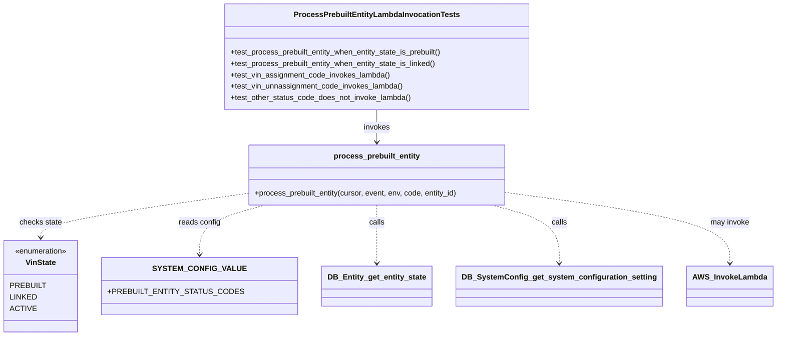
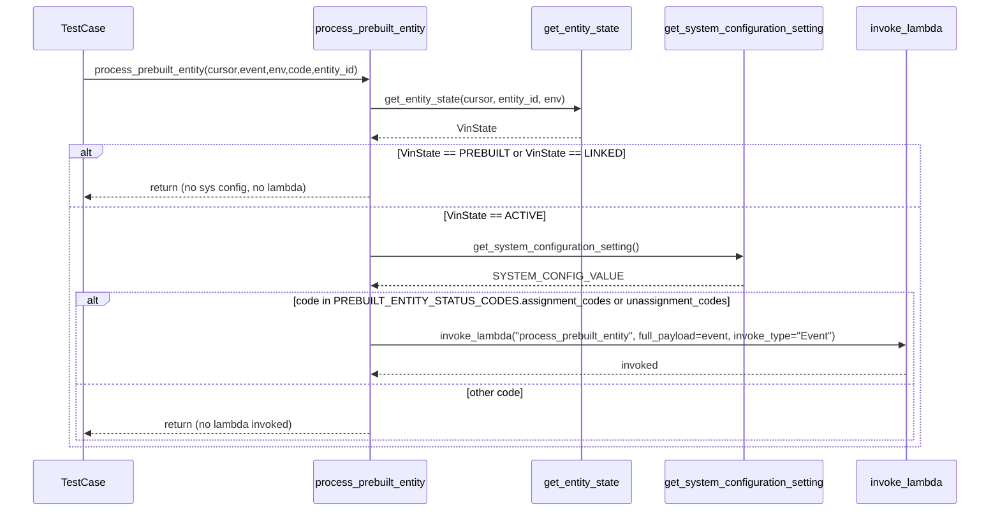

# Diagram: entity_core/entity_service/entity_service_tests/test_process_prebuilt_entity/test_process_prebuilt_entity_lambda_invocation.py

> Auto-generated by Obscura crawlers

## Diagram 1

### SVG

<svg id="container" width="1518.640625" xmlns="http://www.w3.org/2000/svg" class="classDiagram" height="704" viewBox="0 0 1518.640625 704" role="graphics-document document" aria-roledescription="class"><g><defs><marker id="container_class-aggregationStart" class="marker aggregation class" refX="18" refY="7" markerWidth="190" markerHeight="240" orient="auto"><path d="M 18,7 L9,13 L1,7 L9,1 Z"></path></marker></defs><defs><marker id="container_class-aggregationEnd" class="marker aggregation class" refX="1" refY="7" markerWidth="20" markerHeight="28" orient="auto"><path d="M 18,7 L9,13 L1,7 L9,1 Z"></path></marker></defs><defs><marker id="container_class-extensionStart" class="marker extension class" refX="18" refY="7" markerWidth="190" markerHeight="240" orient="auto"><path d="M 1,7 L18,13 V 1 Z"></path></marker></defs><defs><marker id="container_class-extensionEnd" class="marker extension class" refX="1" refY="7" markerWidth="20" markerHeight="28" orient="auto"><path d="M 1,1 V 13 L18,7 Z"></path></marker></defs><defs><marker id="container_class-compositionStart" class="marker composition class" refX="18" refY="7" markerWidth="190" markerHeight="240" orient="auto"><path d="M 18,7 L9,13 L1,7 L9,1 Z"></path></marker></defs><defs><marker id="container_class-compositionEnd" class="marker composition class" refX="1" refY="7" markerWidth="20" markerHeight="28" orient="auto"><path d="M 18,7 L9,13 L1,7 L9,1 Z"></path></marker></defs><defs><marker id="container_class-dependencyStart" class="marker dependency class" refX="6" refY="7" markerWidth="190" markerHeight="240" orient="auto"><path d="M 5,7 L9,13 L1,7 L9,1 Z"></path></marker></defs><defs><marker id="container_class-dependencyEnd" class="marker dependency class" refX="13" refY="7" markerWidth="20" markerHeight="28" orient="auto"><path d="M 18,7 L9,13 L14,7 L9,1 Z"></path></marker></defs><defs><marker id="container_class-lollipopStart" class="marker lollipop class" refX="13" refY="7" markerWidth="190" markerHeight="240" orient="auto"><circle stroke="black" fill="transparent" cx="7" cy="7" r="6"></circle></marker></defs><defs><marker id="container_class-lollipopEnd" class="marker lollipop class" refX="1" refY="7" markerWidth="190" markerHeight="240" orient="auto"><circle stroke="black" fill="transparent" cx="7" cy="7" r="6"></circle></marker></defs><g class="root"><g class="clusters"></g><g class="edgePaths"><path d="M720.594,230L720.594,236.167C720.594,242.333,720.594,254.667,720.594,266C720.594,277.333,720.594,287.667,720.594,292.833L720.594,298" id="id_ProcessPrebuiltEntityLambdaInvocationTests_process_prebuilt_entity_1" class="edge-thickness-normal edge-pattern-solid relation" style=";;;" data-edge="true" data-et="edge" data-id="id_ProcessPrebuiltEntityLambdaInvocationTests_process_prebuilt_entity_1" data-points="W3sieCI6NzIwLjU5Mzc1LCJ5IjoyMzB9LHsieCI6NzIwLjU5Mzc1LCJ5IjoyNjd9LHsieCI6NzIwLjU5Mzc1LCJ5IjozMDR9XQ==" marker-end="url(#container_class-dependencyEnd)"></path><path d="M449.879,409.361L388.487,418.967C327.095,428.574,204.311,447.787,142.919,462.56C81.527,477.333,81.527,487.667,81.527,492.833L81.527,498" id="id_process_prebuilt_entity_VinState_2" class="edge-thickness-normal edge-pattern-dashed relation" style=";;;" data-edge="true" data-et="edge" data-id="id_process_prebuilt_entity_VinState_2" data-points="W3sieCI6NDQ5Ljg3ODkwNjI1LCJ5Ijo0MDkuMzYwOTg4MDEzNTIwN30seyJ4Ijo4MS41MjczNDM3NSwieSI6NDY3fSx7IngiOjgxLjUyNzM0Mzc1LCJ5Ijo1MDR9XQ==" marker-end="url(#container_class-dependencyEnd)"></path><path d="M507.39,430L486.521,436.167C465.652,442.333,423.914,454.667,403.045,472C382.176,489.333,382.176,511.667,382.176,522.833L382.176,534" id="id_process_prebuilt_entity_SYSTEM_CONFIG_VALUE_3" class="edge-thickness-normal edge-pattern-dashed relation" style=";;;" data-edge="true" data-et="edge" data-id="id_process_prebuilt_entity_SYSTEM_CONFIG_VALUE_3" data-points="W3sieCI6NTA3LjM5MDQyOTY4NzUsInkiOjQzMH0seyJ4IjozODIuMTc1NzgxMjUsInkiOjQ2N30seyJ4IjozODIuMTc1NzgxMjUsInkiOjU0MH1d" marker-end="url(#container_class-dependencyEnd)"></path><path d="M720.594,430L720.594,436.167C720.594,442.333,720.594,454.667,720.594,475C720.594,495.333,720.594,523.667,720.594,537.833L720.594,552" id="id_process_prebuilt_entity_DB_Entity_get_entity_state_4" class="edge-thickness-normal edge-pattern-dashed relation" style=";;;" data-edge="true" data-et="edge" data-id="id_process_prebuilt_entity_DB_Entity_get_entity_state_4" data-points="W3sieCI6NzIwLjU5Mzc1LCJ5Ijo0MzB9LHsieCI6NzIwLjU5Mzc1LCJ5Ijo0Njd9LHsieCI6NzIwLjU5Mzc1LCJ5Ijo1NTh9XQ==" marker-end="url(#container_class-dependencyEnd)"></path><path d="M950.716,430L973.241,436.167C995.766,442.333,1040.817,454.667,1063.342,475C1085.867,495.333,1085.867,523.667,1085.867,537.833L1085.867,552" id="id_process_prebuilt_entity_DB_SystemConfig_get_system_configuration_setting_5" class="edge-thickness-normal edge-pattern-dashed relation" style=";;;" data-edge="true" data-et="edge" data-id="id_process_prebuilt_entity_DB_SystemConfig_get_system_configuration_setting_5" data-points="W3sieCI6OTUwLjcxNjAxNTYyNSwieSI6NDMwfSx7IngiOjEwODUuODY3MTg3NSwieSI6NDY3fSx7IngiOjEwODUuODY3MTg3NSwieSI6NTU4fV0=" marker-end="url(#container_class-dependencyEnd)"></path><path d="M991.309,405.418L1063.631,415.682C1135.953,425.946,1280.598,446.473,1352.92,470.903C1425.242,495.333,1425.242,523.667,1425.242,537.833L1425.242,552" id="id_process_prebuilt_entity_AWS_InvokeLambda_6" class="edge-thickness-normal edge-pattern-dashed relation" style=";;;" data-edge="true" data-et="edge" data-id="id_process_prebuilt_entity_AWS_InvokeLambda_6" data-points="W3sieCI6OTkxLjMwODU5Mzc1LCJ5Ijo0MDUuNDE4NDI2NzQyMDU4ODR9LHsieCI6MTQyNS4yNDIxODc1LCJ5Ijo0Njd9LHsieCI6MTQyNS4yNDIxODc1LCJ5Ijo1NTh9XQ==" marker-end="url(#container_class-dependencyEnd)"></path></g><g class="edgeLabels"><g class="edgeLabel" transform="translate(720.59375, 267)"><g class="label" data-id="id_ProcessPrebuiltEntityLambdaInvocationTests_process_prebuilt_entity_1" transform="translate(-27.5859375, -12)"><foreignObject width="55.171875" height="24">

invokes

</foreignObject></g></g><g class="edgeLabel" transform="translate(81.52734375, 467)"><g class="label" data-id="id_process_prebuilt_entity_VinState_2" transform="translate(-44.65625, -12)"><foreignObject width="89.3125" height="24">

checks state

</foreignObject></g></g><g class="edgeLabel" transform="translate(382.17578125, 467)"><g class="label" data-id="id_process_prebuilt_entity_SYSTEM_CONFIG_VALUE_3" transform="translate(-43.90625, -12)"><foreignObject width="87.8125" height="24">

reads config

</foreignObject></g></g><g class="edgeLabel" transform="translate(720.59375, 467)"><g class="label" data-id="id_process_prebuilt_entity_DB_Entity_get_entity_state_4" transform="translate(-16.4453125, -12)"><foreignObject width="32.890625" height="24">

calls

</foreignObject></g></g><g class="edgeLabel" transform="translate(1085.8671875, 467)"><g class="label" data-id="id_process_prebuilt_entity_DB_SystemConfig_get_system_configuration_setting_5" transform="translate(-16.4453125, -12)"><foreignObject width="32.890625" height="24">

calls

</foreignObject></g></g><g class="edgeLabel" transform="translate(1425.2421875, 467)"><g class="label" data-id="id_process_prebuilt_entity_AWS_InvokeLambda_6" transform="translate(-40.9921875, -12)"><foreignObject width="81.984375" height="24">

may invoke

</foreignObject></g></g></g><g class="nodes"><g class="node default" id="classId-ProcessPrebuiltEntityLambdaInvocationTests-0" transform="translate(720.59375, 119)"><g class="basic label-container"><path d="M-320.12109375 -111 L320.12109375 -111 L320.12109375 111 L-320.12109375 111" stroke="none" stroke-width="0" fill="#ECECFF" style=""></path><path d="M-320.12109375 -111 C-133.631230279294 -111, 52.858633191412025 -111, 320.12109375 -111 M-320.12109375 -111 C-104.12636912753845 -111, 111.8683554949231 -111, 320.12109375 -111 M320.12109375 -111 C320.12109375 -66.49080952317895, 320.12109375 -21.981619046357906, 320.12109375 111 M320.12109375 -111 C320.12109375 -29.932209760637008, 320.12109375 51.135580478725984, 320.12109375 111 M320.12109375 111 C165.68830371029043 111, 11.255513670580854 111, -320.12109375 111 M320.12109375 111 C164.83296404053638 111, 9.544834331072764 111, -320.12109375 111 M-320.12109375 111 C-320.12109375 29.919514007447077, -320.12109375 -51.160971985105846, -320.12109375 -111 M-320.12109375 111 C-320.12109375 35.02900282704954, -320.12109375 -40.94199434590092, -320.12109375 -111" stroke="#9370DB" stroke-width="1.3" fill="none" stroke-dasharray="0 0" style=""></path></g><g class="annotation-group text" transform="translate(0, -87)"></g><g class="label-group text" transform="translate(-165.0546875, -87)"><g class="label" style="font-weight: bolder" transform="translate(0,-12)"><foreignObject width="330.109375" height="24">

ProcessPrebuiltEntityLambdaInvocationTests

</foreignObject></g></g><g class="members-group text" transform="translate(-308.12109375, -39)"></g><g class="methods-group text" transform="translate(-308.12109375, -9)"><g class="label" style="" transform="translate(0,-12)"><foreignObject width="451.1875" height="24">

+test_process_prebuilt_entity_when_entity_state_is_prebuilt()

</foreignObject></g><g class="label" style="" transform="translate(0,12)"><foreignObject width="438.234375" height="24">

+test_process_prebuilt_entity_when_entity_state_is_linked()

</foreignObject></g><g class="label" style="" transform="translate(0,36)"><foreignObject width="335.265625" height="24">

+test_vin_assignment_code_invokes_lambda()

</foreignObject></g><g class="label" style="" transform="translate(0,60)"><foreignObject width="363.34375" height="24">

+test_vin_unnassignment_code_invokes_lambda()

</foreignObject></g><g class="label" style="" transform="translate(0,84)"><foreignObject width="381.1875" height="24">

+test_other_status_code_does_not_invoke_lambda()

</foreignObject></g></g><g class="divider" style=""><path d="M-320.12109375 -63 C-160.53164825515614 -63, -0.9422027603122842 -63, 320.12109375 -63 M-320.12109375 -63 C-99.24270085810298 -63, 121.63569203379404 -63, 320.12109375 -63" stroke="#9370DB" stroke-width="1.3" fill="none" stroke-dasharray="0 0" style=""></path></g><g class="divider" style=""><path d="M-320.12109375 -39 C-66.15080089604442 -39, 187.81949195791117 -39, 320.12109375 -39 M-320.12109375 -39 C-72.34004299837554 -39, 175.44100775324893 -39, 320.12109375 -39" stroke="#9370DB" stroke-width="1.3" fill="none" stroke-dasharray="0 0" style=""></path></g></g><g class="node default" id="classId-process_prebuilt_entity-1" transform="translate(720.59375, 367)"><g class="basic label-container"><path d="M-270.71484375 -63 L270.71484375 -63 L270.71484375 63 L-270.71484375 63" stroke="none" stroke-width="0" fill="#ECECFF" style=""></path><path d="M-270.71484375 -63 C-82.60972565421096 -63, 105.49539244157808 -63, 270.71484375 -63 M-270.71484375 -63 C-140.2214242238881 -63, -9.728004697776214 -63, 270.71484375 -63 M270.71484375 -63 C270.71484375 -20.570452015810112, 270.71484375 21.859095968379776, 270.71484375 63 M270.71484375 -63 C270.71484375 -21.303545126501973, 270.71484375 20.392909746996054, 270.71484375 63 M270.71484375 63 C114.54147265588571 63, -41.631898438228575 63, -270.71484375 63 M270.71484375 63 C85.53562958372589 63, -99.64358458254821 63, -270.71484375 63 M-270.71484375 63 C-270.71484375 29.144092681297302, -270.71484375 -4.711814637405396, -270.71484375 -63 M-270.71484375 63 C-270.71484375 24.562577440997984, -270.71484375 -13.874845118004032, -270.71484375 -63" stroke="#9370DB" stroke-width="1.3" fill="none" stroke-dasharray="0 0" style=""></path></g><g class="annotation-group text" transform="translate(0, -39)"></g><g class="label-group text" transform="translate(-86.9765625, -39)"><g class="label" style="font-weight: bolder" transform="translate(0,-12)"><foreignObject width="173.953125" height="24">

process_prebuilt_entity

</foreignObject></g></g><g class="members-group text" transform="translate(-258.71484375, 9)"></g><g class="methods-group text" transform="translate(-258.71484375, 39)"><g class="label" style="" transform="translate(0,-12)"><foreignObject width="430.453125" height="24">

+process_prebuilt_entity(cursor, event, env, code, entity_id)

</foreignObject></g></g><g class="divider" style=""><path d="M-270.71484375 -15 C-117.7310404110313 -15, 35.2527629279374 -15, 270.71484375 -15 M-270.71484375 -15 C-78.04026088995082 -15, 114.63432197009837 -15, 270.71484375 -15" stroke="#9370DB" stroke-width="1.3" fill="none" stroke-dasharray="0 0" style=""></path></g><g class="divider" style=""><path d="M-270.71484375 9 C-159.03156936228748 9, -47.348294974575 9, 270.71484375 9 M-270.71484375 9 C-87.91836034628022 9, 94.87812305743955 9, 270.71484375 9" stroke="#9370DB" stroke-width="1.3" fill="none" stroke-dasharray="0 0" style=""></path></g></g><g class="node default" id="classId-VinState-2" transform="translate(81.52734375, 600)"><g class="basic label-container"><path d="M-73.52734375 -96 L73.52734375 -96 L73.52734375 96 L-73.52734375 96" stroke="none" stroke-width="0" fill="#ECECFF" style=""></path><path d="M-73.52734375 -96 C-33.75298773017123 -96, 6.021368289657545 -96, 73.52734375 -96 M-73.52734375 -96 C-33.44856024126056 -96, 6.630223267478883 -96, 73.52734375 -96 M73.52734375 -96 C73.52734375 -27.15648656447175, 73.52734375 41.6870268710565, 73.52734375 96 M73.52734375 -96 C73.52734375 -20.467038995847005, 73.52734375 55.06592200830599, 73.52734375 96 M73.52734375 96 C20.843303644784328 96, -31.840736460431344 96, -73.52734375 96 M73.52734375 96 C29.863550700607433 96, -13.800242348785133 96, -73.52734375 96 M-73.52734375 96 C-73.52734375 21.001561866798696, -73.52734375 -53.99687626640261, -73.52734375 -96 M-73.52734375 96 C-73.52734375 42.77923717207586, -73.52734375 -10.441525655848281, -73.52734375 -96" stroke="#9370DB" stroke-width="1.3" fill="none" stroke-dasharray="0 0" style=""></path></g><g class="annotation-group text" transform="translate(-55.5546875, -72)"><g class="label" style="" transform="translate(0,-12)"><foreignObject width="111.109375" height="24">

«enumeration»

</foreignObject></g></g><g class="label-group text" transform="translate(-30.75, -48)"><g class="label" style="font-weight: bolder" transform="translate(0,-12)"><foreignObject width="61.5" height="24">

VinState

</foreignObject></g></g><g class="members-group text" transform="translate(-61.52734375, 0)"><g class="label" style="" transform="translate(0,-12)"><foreignObject width="67.5" height="24">

PREBUILT

</foreignObject></g><g class="label" style="" transform="translate(0,12)"><foreignObject width="51.90625" height="24">

LINKED

</foreignObject></g><g class="label" style="" transform="translate(0,36)"><foreignObject width="48.265625" height="24">

ACTIVE

</foreignObject></g></g><g class="methods-group text" transform="translate(-61.52734375, 96)"></g><g class="divider" style=""><path d="M-73.52734375 -24 C-39.60061569980173 -24, -5.673887649603458 -24, 73.52734375 -24 M-73.52734375 -24 C-38.96724975558089 -24, -4.407155761161775 -24, 73.52734375 -24" stroke="#9370DB" stroke-width="1.3" fill="none" stroke-dasharray="0 0" style=""></path></g><g class="divider" style=""><path d="M-73.52734375 72 C-30.275422480231107 72, 12.976498789537786 72, 73.52734375 72 M-73.52734375 72 C-43.77589085267218 72, -14.024437955344354 72, 73.52734375 72" stroke="#9370DB" stroke-width="1.3" fill="none" stroke-dasharray="0 0" style=""></path></g></g><g class="node default" id="classId-SYSTEM_CONFIG_VALUE-3" transform="translate(382.17578125, 600)"><g class="basic label-container"><path d="M-177.12109375 -60 L177.12109375 -60 L177.12109375 60 L-177.12109375 60" stroke="none" stroke-width="0" fill="#ECECFF" style=""></path><path d="M-177.12109375 -60 C-84.46370059375805 -60, 8.193692562483903 -60, 177.12109375 -60 M-177.12109375 -60 C-91.48774562477037 -60, -5.854397499540738 -60, 177.12109375 -60 M177.12109375 -60 C177.12109375 -29.34702695316615, 177.12109375 1.3059460936676999, 177.12109375 60 M177.12109375 -60 C177.12109375 -18.942433107377248, 177.12109375 22.115133785245504, 177.12109375 60 M177.12109375 60 C38.28505651806296 60, -100.55098071387408 60, -177.12109375 60 M177.12109375 60 C64.91816359113328 60, -47.28476656773344 60, -177.12109375 60 M-177.12109375 60 C-177.12109375 13.971744407718361, -177.12109375 -32.05651118456328, -177.12109375 -60 M-177.12109375 60 C-177.12109375 33.83218706395714, -177.12109375 7.664374127914286, -177.12109375 -60" stroke="#9370DB" stroke-width="1.3" fill="none" stroke-dasharray="0 0" style=""></path></g><g class="annotation-group text" transform="translate(0, -36)"></g><g class="label-group text" transform="translate(-84.9609375, -36)"><g class="label" style="font-weight: bolder" transform="translate(0,-12)"><foreignObject width="169.921875" height="24">

SYSTEM_CONFIG_VALUE

</foreignObject></g></g><g class="members-group text" transform="translate(-165.12109375, 12)"><g class="label" style="" transform="translate(0,-12)"><foreignObject width="245.28125" height="24">

+PREBUILT_ENTITY_STATUS_CODES

</foreignObject></g></g><g class="methods-group text" transform="translate(-165.12109375, 60)"></g><g class="divider" style=""><path d="M-177.12109375 -12 C-90.95688947333977 -12, -4.7926851966795425 -12, 177.12109375 -12 M-177.12109375 -12 C-83.94606953192641 -12, 9.228954686147176 -12, 177.12109375 -12" stroke="#9370DB" stroke-width="1.3" fill="none" stroke-dasharray="0 0" style=""></path></g><g class="divider" style=""><path d="M-177.12109375 36 C-91.59326862151056 36, -6.065443493021121 36, 177.12109375 36 M-177.12109375 36 C-79.81459243335347 36, 17.491908883293064 36, 177.12109375 36" stroke="#9370DB" stroke-width="1.3" fill="none" stroke-dasharray="0 0" style=""></path></g></g><g class="node default" id="classId-DB_Entity_get_entity_state-4" transform="translate(720.59375, 600)"><g class="basic label-container"><path d="M-111.296875 -42 L111.296875 -42 L111.296875 42 L-111.296875 42" stroke="none" stroke-width="0" fill="#ECECFF" style=""></path><path d="M-111.296875 -42 C-27.475955692764543 -42, 56.34496361447091 -42, 111.296875 -42 M-111.296875 -42 C-28.312774845376765 -42, 54.67132530924647 -42, 111.296875 -42 M111.296875 -42 C111.296875 -23.904919585246873, 111.296875 -5.8098391704937455, 111.296875 42 M111.296875 -42 C111.296875 -25.04640531336776, 111.296875 -8.09281062673552, 111.296875 42 M111.296875 42 C38.260411707276745 42, -34.77605158544651 42, -111.296875 42 M111.296875 42 C49.460907106089685 42, -12.37506078782063 42, -111.296875 42 M-111.296875 42 C-111.296875 15.515931171958204, -111.296875 -10.968137656083591, -111.296875 -42 M-111.296875 42 C-111.296875 9.496172899969274, -111.296875 -23.007654200061452, -111.296875 -42" stroke="#9370DB" stroke-width="1.3" fill="none" stroke-dasharray="0 0" style=""></path></g><g class="annotation-group text" transform="translate(0, -18)"></g><g class="label-group text" transform="translate(-99.296875, -18)"><g class="label" style="font-weight: bolder" transform="translate(0,-12)"><foreignObject width="198.59375" height="24">

DB_Entity_get_entity_state

</foreignObject></g></g><g class="members-group text" transform="translate(-99.296875, 30)"></g><g class="methods-group text" transform="translate(-99.296875, 60)"></g><g class="divider" style=""><path d="M-111.296875 6 C-61.68707815460204 6, -12.077281309204082 6, 111.296875 6 M-111.296875 6 C-34.388280006517434 6, 42.52031498696513 6, 111.296875 6" stroke="#9370DB" stroke-width="1.3" fill="none" stroke-dasharray="0 0" style=""></path></g><g class="divider" style=""><path d="M-111.296875 24 C-45.20121564162824 24, 20.894443716743524 24, 111.296875 24 M-111.296875 24 C-45.26674921650748 24, 20.763376566985045 24, 111.296875 24" stroke="#9370DB" stroke-width="1.3" fill="none" stroke-dasharray="0 0" style=""></path></g></g><g class="node default" id="classId-DB_SystemConfig_get_system_configuration_setting-5" transform="translate(1085.8671875, 600)"><g class="basic label-container"><path d="M-203.9765625 -42 L203.9765625 -42 L203.9765625 42 L-203.9765625 42" stroke="none" stroke-width="0" fill="#ECECFF" style=""></path><path d="M-203.9765625 -42 C-88.99260521194189 -42, 25.991352076116215 -42, 203.9765625 -42 M-203.9765625 -42 C-87.3610035462097 -42, 29.254555407580597 -42, 203.9765625 -42 M203.9765625 -42 C203.9765625 -20.75180791753641, 203.9765625 0.4963841649271785, 203.9765625 42 M203.9765625 -42 C203.9765625 -21.888707773036366, 203.9765625 -1.7774155460727314, 203.9765625 42 M203.9765625 42 C119.17656061928875 42, 34.3765587385775 42, -203.9765625 42 M203.9765625 42 C75.23700573017933 42, -53.50255103964133 42, -203.9765625 42 M-203.9765625 42 C-203.9765625 16.479222000926203, -203.9765625 -9.041555998147594, -203.9765625 -42 M-203.9765625 42 C-203.9765625 22.662480466368567, -203.9765625 3.3249609327371346, -203.9765625 -42" stroke="#9370DB" stroke-width="1.3" fill="none" stroke-dasharray="0 0" style=""></path></g><g class="annotation-group text" transform="translate(0, -18)"></g><g class="label-group text" transform="translate(-191.9765625, -18)"><g class="label" style="font-weight: bolder" transform="translate(0,-12)"><foreignObject width="383.953125" height="24">

DB_SystemConfig_get_system_configuration_setting

</foreignObject></g></g><g class="members-group text" transform="translate(-191.9765625, 30)"></g><g class="methods-group text" transform="translate(-191.9765625, 60)"></g><g class="divider" style=""><path d="M-203.9765625 6 C-117.99506452846039 6, -32.01356655692078 6, 203.9765625 6 M-203.9765625 6 C-54.149186406895666 6, 95.67818968620867 6, 203.9765625 6" stroke="#9370DB" stroke-width="1.3" fill="none" stroke-dasharray="0 0" style=""></path></g><g class="divider" style=""><path d="M-203.9765625 24 C-93.36656056833085 24, 17.24344136333829 24, 203.9765625 24 M-203.9765625 24 C-41.04150069757529 24, 121.89356110484943 24, 203.9765625 24" stroke="#9370DB" stroke-width="1.3" fill="none" stroke-dasharray="0 0" style=""></path></g></g><g class="node default" id="classId-AWS_InvokeLambda-6" transform="translate(1425.2421875, 600)"><g class="basic label-container"><path d="M-85.3984375 -42 L85.3984375 -42 L85.3984375 42 L-85.3984375 42" stroke="none" stroke-width="0" fill="#ECECFF" style=""></path><path d="M-85.3984375 -42 C-44.1692775565219 -42, -2.940117613043796 -42, 85.3984375 -42 M-85.3984375 -42 C-25.649400545217418 -42, 34.099636409565164 -42, 85.3984375 -42 M85.3984375 -42 C85.3984375 -10.680722477831416, 85.3984375 20.638555044337167, 85.3984375 42 M85.3984375 -42 C85.3984375 -18.071910466525615, 85.3984375 5.856179066948769, 85.3984375 42 M85.3984375 42 C40.56809361086124 42, -4.26225027827752 42, -85.3984375 42 M85.3984375 42 C43.23793642668709 42, 1.0774353533741845 42, -85.3984375 42 M-85.3984375 42 C-85.3984375 13.00232455318509, -85.3984375 -15.99535089362982, -85.3984375 -42 M-85.3984375 42 C-85.3984375 10.424831030643915, -85.3984375 -21.15033793871217, -85.3984375 -42" stroke="#9370DB" stroke-width="1.3" fill="none" stroke-dasharray="0 0" style=""></path></g><g class="annotation-group text" transform="translate(0, -18)"></g><g class="label-group text" transform="translate(-73.3984375, -18)"><g class="label" style="font-weight: bolder" transform="translate(0,-12)"><foreignObject width="146.796875" height="24">

AWS_InvokeLambda

</foreignObject></g></g><g class="members-group text" transform="translate(-73.3984375, 30)"></g><g class="methods-group text" transform="translate(-73.3984375, 60)"></g><g class="divider" style=""><path d="M-85.3984375 6 C-42.1145656352163 6, 1.1693062295673968 6, 85.3984375 6 M-85.3984375 6 C-19.01004902971424 6, 47.37833944057152 6, 85.3984375 6" stroke="#9370DB" stroke-width="1.3" fill="none" stroke-dasharray="0 0" style=""></path></g><g class="divider" style=""><path d="M-85.3984375 24 C-22.099054251189237 24, 41.200328997621526 24, 85.3984375 24 M-85.3984375 24 C-41.48972763523955 24, 2.418982229520907 24, 85.3984375 24" stroke="#9370DB" stroke-width="1.3" fill="none" stroke-dasharray="0 0" style=""></path></g></g></g></g></g></svg>

## Diagram 2

### SVG

<svg id="container" width="1586" xmlns="http://www.w3.org/2000/svg" height="803" viewBox="-50 -10 1586 803" role="graphics-document document" aria-roledescription="sequence"><g><rect x="1336" y="717" fill="#eaeaea" stroke="#666" width="150" height="65" name="Lambda" rx="3" ry="3" class="actor actor-bottom"></rect><text x="1411" y="749.5" dominant-baseline="central" alignment-baseline="central" class="actor actor-box" style="text-anchor: middle; font-size: 16px; font-weight: 400;"><tspan x="1411" dy="0">invoke_lambda</tspan></text></g><g><rect x="1022" y="717" fill="#eaeaea" stroke="#666" width="264" height="65" name="SysConfig" rx="3" ry="3" class="actor actor-bottom"></rect><text x="1154" y="749.5" dominant-baseline="central" alignment-baseline="central" class="actor actor-box" style="text-anchor: middle; font-size: 16px; font-weight: 400;"><tspan x="1154" dy="0">get_system_configuration_setting</tspan></text></g><g><rect x="822" y="717" fill="#eaeaea" stroke="#666" width="150" height="65" name="EntityDB" rx="3" ry="3" class="actor actor-bottom"></rect><text x="897" y="749.5" dominant-baseline="central" alignment-baseline="central" class="actor actor-box" style="text-anchor: middle; font-size: 16px; font-weight: 400;"><tspan x="897" dy="0">get_entity_state</tspan></text></g><g><rect x="454.5" y="717" fill="#eaeaea" stroke="#666" width="191" height="65" name="Handler" rx="3" ry="3" class="actor actor-bottom"></rect><text x="550" y="749.5" dominant-baseline="central" alignment-baseline="central" class="actor actor-box" style="text-anchor: middle; font-size: 16px; font-weight: 400;"><tspan x="550" dy="0">process_prebuilt_entity</tspan></text></g><g><rect x="0" y="717" fill="#eaeaea" stroke="#666" width="150" height="65" name="Test" rx="3" ry="3" class="actor actor-bottom"></rect><text x="75" y="749.5" dominant-baseline="central" alignment-baseline="central" class="actor actor-box" style="text-anchor: middle; font-size: 16px; font-weight: 400;"><tspan x="75" dy="0">TestCase</tspan></text></g><g><line id="actor4" x1="1411" y1="65" x2="1411" y2="717" class="actor-line 200" stroke-width="0.5px" stroke="#999" name="Lambda"></line><g id="root-4"><rect x="1336" y="0" fill="#eaeaea" stroke="#666" width="150" height="65" name="Lambda" rx="3" ry="3" class="actor actor-top"></rect><text x="1411" y="32.5" dominant-baseline="central" alignment-baseline="central" class="actor actor-box" style="text-anchor: middle; font-size: 16px; font-weight: 400;"><tspan x="1411" dy="0">invoke_lambda</tspan></text></g></g><g><line id="actor3" x1="1154" y1="65" x2="1154" y2="717" class="actor-line 200" stroke-width="0.5px" stroke="#999" name="SysConfig"></line><g id="root-3"><rect x="1022" y="0" fill="#eaeaea" stroke="#666" width="264" height="65" name="SysConfig" rx="3" ry="3" class="actor actor-top"></rect><text x="1154" y="32.5" dominant-baseline="central" alignment-baseline="central" class="actor actor-box" style="text-anchor: middle; font-size: 16px; font-weight: 400;"><tspan x="1154" dy="0">get_system_configuration_setting</tspan></text></g></g><g><line id="actor2" x1="897" y1="65" x2="897" y2="717" class="actor-line 200" stroke-width="0.5px" stroke="#999" name="EntityDB"></line><g id="root-2"><rect x="822" y="0" fill="#eaeaea" stroke="#666" width="150" height="65" name="EntityDB" rx="3" ry="3" class="actor actor-top"></rect><text x="897" y="32.5" dominant-baseline="central" alignment-baseline="central" class="actor actor-box" style="text-anchor: middle; font-size: 16px; font-weight: 400;"><tspan x="897" dy="0">get_entity_state</tspan></text></g></g><g><line id="actor1" x1="550" y1="65" x2="550" y2="717" class="actor-line 200" stroke-width="0.5px" stroke="#999" name="Handler"></line><g id="root-1"><rect x="454.5" y="0" fill="#eaeaea" stroke="#666" width="191" height="65" name="Handler" rx="3" ry="3" class="actor actor-top"></rect><text x="550" y="32.5" dominant-baseline="central" alignment-baseline="central" class="actor actor-box" style="text-anchor: middle; font-size: 16px; font-weight: 400;"><tspan x="550" dy="0">process_prebuilt_entity</tspan></text></g></g><g><line id="actor0" x1="75" y1="65" x2="75" y2="717" class="actor-line 200" stroke-width="0.5px" stroke="#999" name="Test"></line><g id="root-0"><rect x="0" y="0" fill="#eaeaea" stroke="#666" width="150" height="65" name="Test" rx="3" ry="3" class="actor actor-top"></rect><text x="75" y="32.5" dominant-baseline="central" alignment-baseline="central" class="actor actor-box" style="text-anchor: middle; font-size: 16px; font-weight: 400;"><tspan x="75" dy="0">TestCase</tspan></text></g></g><g></g><defs><symbol id="computer" width="24" height="24"><path transform="scale(.5)" d="M2 2v13h20v-13h-20zm18 11h-16v-9h16v9zm-10.228 6l.466-1h3.524l.467 1h-4.457zm14.228 3h-24l2-6h2.104l-1.33 4h18.45l-1.297-4h2.073l2 6zm-5-10h-14v-7h14v7z"></path></symbol></defs><defs><symbol id="database" fill-rule="evenodd" clip-rule="evenodd"><path transform="scale(.5)" d="M12.258.001l.256.004.255.005.253.008.251.01.249.012.247.015.246.016.242.019.241.02.239.023.236.024.233.027.231.028.229.031.225.032.223.034.22.036.217.038.214.04.211.041.208.043.205.045.201.046.198.048.194.05.191.051.187.053.183.054.18.056.175.057.172.059.168.06.163.061.16.063.155.064.15.066.074.033.073.033.071.034.07.034.069.035.068.035.067.035.066.035.064.036.064.036.062.036.06.036.06.037.058.037.058.037.055.038.055.038.053.038.052.038.051.039.05.039.048.039.047.039.045.04.044.04.043.04.041.04.04.041.039.041.037.041.036.041.034.041.033.042.032.042.03.042.029.042.027.042.026.043.024.043.023.043.021.043.02.043.018.044.017.043.015.044.013.044.012.044.011.045.009.044.007.045.006.045.004.045.002.045.001.045v17l-.001.045-.002.045-.004.045-.006.045-.007.045-.009.044-.011.045-.012.044-.013.044-.015.044-.017.043-.018.044-.02.043-.021.043-.023.043-.024.043-.026.043-.027.042-.029.042-.03.042-.032.042-.033.042-.034.041-.036.041-.037.041-.039.041-.04.041-.041.04-.043.04-.044.04-.045.04-.047.039-.048.039-.05.039-.051.039-.052.038-.053.038-.055.038-.055.038-.058.037-.058.037-.06.037-.06.036-.062.036-.064.036-.064.036-.066.035-.067.035-.068.035-.069.035-.07.034-.071.034-.073.033-.074.033-.15.066-.155.064-.16.063-.163.061-.168.06-.172.059-.175.057-.18.056-.183.054-.187.053-.191.051-.194.05-.198.048-.201.046-.205.045-.208.043-.211.041-.214.04-.217.038-.22.036-.223.034-.225.032-.229.031-.231.028-.233.027-.236.024-.239.023-.241.02-.242.019-.246.016-.247.015-.249.012-.251.01-.253.008-.255.005-.256.004-.258.001-.258-.001-.256-.004-.255-.005-.253-.008-.251-.01-.249-.012-.247-.015-.245-.016-.243-.019-.241-.02-.238-.023-.236-.024-.234-.027-.231-.028-.228-.031-.226-.032-.223-.034-.22-.036-.217-.038-.214-.04-.211-.041-.208-.043-.204-.045-.201-.046-.198-.048-.195-.05-.19-.051-.187-.053-.184-.054-.179-.056-.176-.057-.172-.059-.167-.06-.164-.061-.159-.063-.155-.064-.151-.066-.074-.033-.072-.033-.072-.034-.07-.034-.069-.035-.068-.035-.067-.035-.066-.035-.064-.036-.063-.036-.062-.036-.061-.036-.06-.037-.058-.037-.057-.037-.056-.038-.055-.038-.053-.038-.052-.038-.051-.039-.049-.039-.049-.039-.046-.039-.046-.04-.044-.04-.043-.04-.041-.04-.04-.041-.039-.041-.037-.041-.036-.041-.034-.041-.033-.042-.032-.042-.03-.042-.029-.042-.027-.042-.026-.043-.024-.043-.023-.043-.021-.043-.02-.043-.018-.044-.017-.043-.015-.044-.013-.044-.012-.044-.011-.045-.009-.044-.007-.045-.006-.045-.004-.045-.002-.045-.001-.045v-17l.001-.045.002-.045.004-.045.006-.045.007-.045.009-.044.011-.045.012-.044.013-.044.015-.044.017-.043.018-.044.02-.043.021-.043.023-.043.024-.043.026-.043.027-.042.029-.042.03-.042.032-.042.033-.042.034-.041.036-.041.037-.041.039-.041.04-.041.041-.04.043-.04.044-.04.046-.04.046-.039.049-.039.049-.039.051-.039.052-.038.053-.038.055-.038.056-.038.057-.037.058-.037.06-.037.061-.036.062-.036.063-.036.064-.036.066-.035.067-.035.068-.035.069-.035.07-.034.072-.034.072-.033.074-.033.151-.066.155-.064.159-.063.164-.061.167-.06.172-.059.176-.057.179-.056.184-.054.187-.053.19-.051.195-.05.198-.048.201-.046.204-.045.208-.043.211-.041.214-.04.217-.038.22-.036.223-.034.226-.032.228-.031.231-.028.234-.027.236-.024.238-.023.241-.02.243-.019.245-.016.247-.015.249-.012.251-.01.253-.008.255-.005.256-.004.258-.001.258.001zm-9.258 20.499v.01l.001.021.003.021.004.022.005.021.006.022.007.022.009.023.01.022.011.023.012.023.013.023.015.023.016.024.017.023.018.024.019.024.021.024.022.025.023.024.024.025.052.049.056.05.061.051.066.051.07.051.075.051.079.052.084.052.088.052.092.052.097.052.102.051.105.052.11.052.114.051.119.051.123.051.127.05.131.05.135.05.139.048.144.049.147.047.152.047.155.047.16.045.163.045.167.043.171.043.176.041.178.041.183.039.187.039.19.037.194.035.197.035.202.033.204.031.209.03.212.029.216.027.219.025.222.024.226.021.23.02.233.018.236.016.24.015.243.012.246.01.249.008.253.005.256.004.259.001.26-.001.257-.004.254-.005.25-.008.247-.011.244-.012.241-.014.237-.016.233-.018.231-.021.226-.021.224-.024.22-.026.216-.027.212-.028.21-.031.205-.031.202-.034.198-.034.194-.036.191-.037.187-.039.183-.04.179-.04.175-.042.172-.043.168-.044.163-.045.16-.046.155-.046.152-.047.148-.048.143-.049.139-.049.136-.05.131-.05.126-.05.123-.051.118-.052.114-.051.11-.052.106-.052.101-.052.096-.052.092-.052.088-.053.083-.051.079-.052.074-.052.07-.051.065-.051.06-.051.056-.05.051-.05.023-.024.023-.025.021-.024.02-.024.019-.024.018-.024.017-.024.015-.023.014-.024.013-.023.012-.023.01-.023.01-.022.008-.022.006-.022.006-.022.004-.022.004-.021.001-.021.001-.021v-4.127l-.077.055-.08.053-.083.054-.085.053-.087.052-.09.052-.093.051-.095.05-.097.05-.1.049-.102.049-.105.048-.106.047-.109.047-.111.046-.114.045-.115.045-.118.044-.12.043-.122.042-.124.042-.126.041-.128.04-.13.04-.132.038-.134.038-.135.037-.138.037-.139.035-.142.035-.143.034-.144.033-.147.032-.148.031-.15.03-.151.03-.153.029-.154.027-.156.027-.158.026-.159.025-.161.024-.162.023-.163.022-.165.021-.166.02-.167.019-.169.018-.169.017-.171.016-.173.015-.173.014-.175.013-.175.012-.177.011-.178.01-.179.008-.179.008-.181.006-.182.005-.182.004-.184.003-.184.002h-.37l-.184-.002-.184-.003-.182-.004-.182-.005-.181-.006-.179-.008-.179-.008-.178-.01-.176-.011-.176-.012-.175-.013-.173-.014-.172-.015-.171-.016-.17-.017-.169-.018-.167-.019-.166-.02-.165-.021-.163-.022-.162-.023-.161-.024-.159-.025-.157-.026-.156-.027-.155-.027-.153-.029-.151-.03-.15-.03-.148-.031-.146-.032-.145-.033-.143-.034-.141-.035-.14-.035-.137-.037-.136-.037-.134-.038-.132-.038-.13-.04-.128-.04-.126-.041-.124-.042-.122-.042-.12-.044-.117-.043-.116-.045-.113-.045-.112-.046-.109-.047-.106-.047-.105-.048-.102-.049-.1-.049-.097-.05-.095-.05-.093-.052-.09-.051-.087-.052-.085-.053-.083-.054-.08-.054-.077-.054v4.127zm0-5.654v.011l.001.021.003.021.004.021.005.022.006.022.007.022.009.022.01.022.011.023.012.023.013.023.015.024.016.023.017.024.018.024.019.024.021.024.022.024.023.025.024.024.052.05.056.05.061.05.066.051.07.051.075.052.079.051.084.052.088.052.092.052.097.052.102.052.105.052.11.051.114.051.119.052.123.05.127.051.131.05.135.049.139.049.144.048.147.048.152.047.155.046.16.045.163.045.167.044.171.042.176.042.178.04.183.04.187.038.19.037.194.036.197.034.202.033.204.032.209.03.212.028.216.027.219.025.222.024.226.022.23.02.233.018.236.016.24.014.243.012.246.01.249.008.253.006.256.003.259.001.26-.001.257-.003.254-.006.25-.008.247-.01.244-.012.241-.015.237-.016.233-.018.231-.02.226-.022.224-.024.22-.025.216-.027.212-.029.21-.03.205-.032.202-.033.198-.035.194-.036.191-.037.187-.039.183-.039.179-.041.175-.042.172-.043.168-.044.163-.045.16-.045.155-.047.152-.047.148-.048.143-.048.139-.05.136-.049.131-.05.126-.051.123-.051.118-.051.114-.052.11-.052.106-.052.101-.052.096-.052.092-.052.088-.052.083-.052.079-.052.074-.051.07-.052.065-.051.06-.05.056-.051.051-.049.023-.025.023-.024.021-.025.02-.024.019-.024.018-.024.017-.024.015-.023.014-.023.013-.024.012-.022.01-.023.01-.023.008-.022.006-.022.006-.022.004-.021.004-.022.001-.021.001-.021v-4.139l-.077.054-.08.054-.083.054-.085.052-.087.053-.09.051-.093.051-.095.051-.097.05-.1.049-.102.049-.105.048-.106.047-.109.047-.111.046-.114.045-.115.044-.118.044-.12.044-.122.042-.124.042-.126.041-.128.04-.13.039-.132.039-.134.038-.135.037-.138.036-.139.036-.142.035-.143.033-.144.033-.147.033-.148.031-.15.03-.151.03-.153.028-.154.028-.156.027-.158.026-.159.025-.161.024-.162.023-.163.022-.165.021-.166.02-.167.019-.169.018-.169.017-.171.016-.173.015-.173.014-.175.013-.175.012-.177.011-.178.009-.179.009-.179.007-.181.007-.182.005-.182.004-.184.003-.184.002h-.37l-.184-.002-.184-.003-.182-.004-.182-.005-.181-.007-.179-.007-.179-.009-.178-.009-.176-.011-.176-.012-.175-.013-.173-.014-.172-.015-.171-.016-.17-.017-.169-.018-.167-.019-.166-.02-.165-.021-.163-.022-.162-.023-.161-.024-.159-.025-.157-.026-.156-.027-.155-.028-.153-.028-.151-.03-.15-.03-.148-.031-.146-.033-.145-.033-.143-.033-.141-.035-.14-.036-.137-.036-.136-.037-.134-.038-.132-.039-.13-.039-.128-.04-.126-.041-.124-.042-.122-.043-.12-.043-.117-.044-.116-.044-.113-.046-.112-.046-.109-.046-.106-.047-.105-.048-.102-.049-.1-.049-.097-.05-.095-.051-.093-.051-.09-.051-.087-.053-.085-.052-.083-.054-.08-.054-.077-.054v4.139zm0-5.666v.011l.001.02.003.022.004.021.005.022.006.021.007.022.009.023.01.022.011.023.012.023.013.023.015.023.016.024.017.024.018.023.019.024.021.025.022.024.023.024.024.025.052.05.056.05.061.05.066.051.07.051.075.052.079.051.084.052.088.052.092.052.097.052.102.052.105.051.11.052.114.051.119.051.123.051.127.05.131.05.135.05.139.049.144.048.147.048.152.047.155.046.16.045.163.045.167.043.171.043.176.042.178.04.183.04.187.038.19.037.194.036.197.034.202.033.204.032.209.03.212.028.216.027.219.025.222.024.226.021.23.02.233.018.236.017.24.014.243.012.246.01.249.008.253.006.256.003.259.001.26-.001.257-.003.254-.006.25-.008.247-.01.244-.013.241-.014.237-.016.233-.018.231-.02.226-.022.224-.024.22-.025.216-.027.212-.029.21-.03.205-.032.202-.033.198-.035.194-.036.191-.037.187-.039.183-.039.179-.041.175-.042.172-.043.168-.044.163-.045.16-.045.155-.047.152-.047.148-.048.143-.049.139-.049.136-.049.131-.051.126-.05.123-.051.118-.052.114-.051.11-.052.106-.052.101-.052.096-.052.092-.052.088-.052.083-.052.079-.052.074-.052.07-.051.065-.051.06-.051.056-.05.051-.049.023-.025.023-.025.021-.024.02-.024.019-.024.018-.024.017-.024.015-.023.014-.024.013-.023.012-.023.01-.022.01-.023.008-.022.006-.022.006-.022.004-.022.004-.021.001-.021.001-.021v-4.153l-.077.054-.08.054-.083.053-.085.053-.087.053-.09.051-.093.051-.095.051-.097.05-.1.049-.102.048-.105.048-.106.048-.109.046-.111.046-.114.046-.115.044-.118.044-.12.043-.122.043-.124.042-.126.041-.128.04-.13.039-.132.039-.134.038-.135.037-.138.036-.139.036-.142.034-.143.034-.144.033-.147.032-.148.032-.15.03-.151.03-.153.028-.154.028-.156.027-.158.026-.159.024-.161.024-.162.023-.163.023-.165.021-.166.02-.167.019-.169.018-.169.017-.171.016-.173.015-.173.014-.175.013-.175.012-.177.01-.178.01-.179.009-.179.007-.181.006-.182.006-.182.004-.184.003-.184.001-.185.001-.185-.001-.184-.001-.184-.003-.182-.004-.182-.006-.181-.006-.179-.007-.179-.009-.178-.01-.176-.01-.176-.012-.175-.013-.173-.014-.172-.015-.171-.016-.17-.017-.169-.018-.167-.019-.166-.02-.165-.021-.163-.023-.162-.023-.161-.024-.159-.024-.157-.026-.156-.027-.155-.028-.153-.028-.151-.03-.15-.03-.148-.032-.146-.032-.145-.033-.143-.034-.141-.034-.14-.036-.137-.036-.136-.037-.134-.038-.132-.039-.13-.039-.128-.041-.126-.041-.124-.041-.122-.043-.12-.043-.117-.044-.116-.044-.113-.046-.112-.046-.109-.046-.106-.048-.105-.048-.102-.048-.1-.05-.097-.049-.095-.051-.093-.051-.09-.052-.087-.052-.085-.053-.083-.053-.08-.054-.077-.054v4.153zm8.74-8.179l-.257.004-.254.005-.25.008-.247.011-.244.012-.241.014-.237.016-.233.018-.231.021-.226.022-.224.023-.22.026-.216.027-.212.028-.21.031-.205.032-.202.033-.198.034-.194.036-.191.038-.187.038-.183.04-.179.041-.175.042-.172.043-.168.043-.163.045-.16.046-.155.046-.152.048-.148.048-.143.048-.139.049-.136.05-.131.05-.126.051-.123.051-.118.051-.114.052-.11.052-.106.052-.101.052-.096.052-.092.052-.088.052-.083.052-.079.052-.074.051-.07.052-.065.051-.06.05-.056.05-.051.05-.023.025-.023.024-.021.024-.02.025-.019.024-.018.024-.017.023-.015.024-.014.023-.013.023-.012.023-.01.023-.01.022-.008.022-.006.023-.006.021-.004.022-.004.021-.001.021-.001.021.001.021.001.021.004.021.004.022.006.021.006.023.008.022.01.022.01.023.012.023.013.023.014.023.015.024.017.023.018.024.019.024.02.025.021.024.023.024.023.025.051.05.056.05.06.05.065.051.07.052.074.051.079.052.083.052.088.052.092.052.096.052.101.052.106.052.11.052.114.052.118.051.123.051.126.051.131.05.136.05.139.049.143.048.148.048.152.048.155.046.16.046.163.045.168.043.172.043.175.042.179.041.183.04.187.038.191.038.194.036.198.034.202.033.205.032.21.031.212.028.216.027.22.026.224.023.226.022.231.021.233.018.237.016.241.014.244.012.247.011.25.008.254.005.257.004.26.001.26-.001.257-.004.254-.005.25-.008.247-.011.244-.012.241-.014.237-.016.233-.018.231-.021.226-.022.224-.023.22-.026.216-.027.212-.028.21-.031.205-.032.202-.033.198-.034.194-.036.191-.038.187-.038.183-.04.179-.041.175-.042.172-.043.168-.043.163-.045.16-.046.155-.046.152-.048.148-.048.143-.048.139-.049.136-.05.131-.05.126-.051.123-.051.118-.051.114-.052.11-.052.106-.052.101-.052.096-.052.092-.052.088-.052.083-.052.079-.052.074-.051.07-.052.065-.051.06-.05.056-.05.051-.05.023-.025.023-.024.021-.024.02-.025.019-.024.018-.024.017-.023.015-.024.014-.023.013-.023.012-.023.01-.023.01-.022.008-.022.006-.023.006-.021.004-.022.004-.021.001-.021.001-.021-.001-.021-.001-.021-.004-.021-.004-.022-.006-.021-.006-.023-.008-.022-.01-.022-.01-.023-.012-.023-.013-.023-.014-.023-.015-.024-.017-.023-.018-.024-.019-.024-.02-.025-.021-.024-.023-.024-.023-.025-.051-.05-.056-.05-.06-.05-.065-.051-.07-.052-.074-.051-.079-.052-.083-.052-.088-.052-.092-.052-.096-.052-.101-.052-.106-.052-.11-.052-.114-.052-.118-.051-.123-.051-.126-.051-.131-.05-.136-.05-.139-.049-.143-.048-.148-.048-.152-.048-.155-.046-.16-.046-.163-.045-.168-.043-.172-.043-.175-.042-.179-.041-.183-.04-.187-.038-.191-.038-.194-.036-.198-.034-.202-.033-.205-.032-.21-.031-.212-.028-.216-.027-.22-.026-.224-.023-.226-.022-.231-.021-.233-.018-.237-.016-.241-.014-.244-.012-.247-.011-.25-.008-.254-.005-.257-.004-.26-.001-.26.001z"></path></symbol></defs><defs><symbol id="clock" width="24" height="24"><path transform="scale(.5)" d="M12 2c5.514 0 10 4.486 10 10s-4.486 10-10 10-10-4.486-10-10 4.486-10 10-10zm0-2c-6.627 0-12 5.373-12 12s5.373 12 12 12 12-5.373 12-12-5.373-12-12-12zm5.848 12.459c.202.038.202.333.001.372-1.907.361-6.045 1.111-6.547 1.111-.719 0-1.301-.582-1.301-1.301 0-.512.77-5.447 1.125-7.445.034-.192.312-.181.343.014l.985 6.238 5.394 1.011z"></path></symbol></defs><defs><marker id="arrowhead" refX="7.9" refY="5" markerUnits="userSpaceOnUse" markerWidth="12" markerHeight="12" orient="auto-start-reverse"><path d="M -1 0 L 10 5 L 0 10 z"></path></marker></defs><defs><marker id="crosshead" markerWidth="15" markerHeight="8" orient="auto" refX="4" refY="4.5"><path fill="none" stroke="#000000" stroke-width="1pt" d="M 1,2 L 6,7 M 6,2 L 1,7" style="stroke-dasharray: 0, 0;"></path></marker></defs><defs><marker id="filled-head" refX="15.5" refY="7" markerWidth="20" markerHeight="28" orient="auto"><path d="M 18,7 L9,13 L14,7 L9,1 Z"></path></marker></defs><defs><marker id="sequencenumber" refX="15" refY="15" markerWidth="60" markerHeight="40" orient="auto"><circle cx="15" cy="15" r="6"></circle></marker></defs><g><line x1="64" y1="453" x2="1422" y2="453" class="loopLine"></line><line x1="1422" y1="453" x2="1422" y2="687" class="loopLine"></line><line x1="64" y1="687" x2="1422" y2="687" class="loopLine"></line><line x1="64" y1="453" x2="64" y2="687" class="loopLine"></line><line x1="64" y1="599" x2="1422" y2="599" class="loopLine" style="stroke-dasharray: 3, 3;"></line><polygon points="64,453 114,453 114,466 105.6,473 64,473" class="labelBox"></polygon><text x="89" y="466" text-anchor="middle" dominant-baseline="middle" alignment-baseline="middle" class="labelText" style="font-size: 16px; font-weight: 400;">alt</text><text x="768" y="471" text-anchor="middle" class="loopText" style="font-size: 16px; font-weight: 400;"><tspan x="768">[code in PREBUILT_ENTITY_STATUS_CODES.assignment_codes or unassignment_codes]</tspan></text><text x="743" y="617" text-anchor="middle" class="loopText" style="font-size: 16px; font-weight: 400;">[other code]</text></g><g><line x1="54" y1="219" x2="1432" y2="219" class="loopLine"></line><line x1="1432" y1="219" x2="1432" y2="697" class="loopLine"></line><line x1="54" y1="697" x2="1432" y2="697" class="loopLine"></line><line x1="54" y1="219" x2="54" y2="697" class="loopLine"></line><line x1="54" y1="317" x2="1432" y2="317" class="loopLine" style="stroke-dasharray: 3, 3;"></line><polygon points="54,219 104,219 104,232 95.6,239 54,239" class="labelBox"></polygon><text x="79" y="232" text-anchor="middle" dominant-baseline="middle" alignment-baseline="middle" class="labelText" style="font-size: 16px; font-weight: 400;">alt</text><text x="768" y="237" text-anchor="middle" class="loopText" style="font-size: 16px; font-weight: 400;"><tspan x="768">[VinState == PREBUILT or VinState == LINKED]</tspan></text><text x="743" y="335" text-anchor="middle" class="loopText" style="font-size: 16px; font-weight: 400;">[VinState == ACTIVE]</text></g><text x="311" y="80" text-anchor="middle" dominant-baseline="middle" alignment-baseline="middle" class="messageText" dy="1em" style="font-size: 16px; font-weight: 400;">process_prebuilt_entity(cursor,event,env,code,entity_id)</text><line x1="76" y1="113" x2="546" y2="113" class="messageLine0" stroke-width="2" stroke="none" marker-end="url(#arrowhead)" style="fill: none;"></line><text x="722" y="128" text-anchor="middle" dominant-baseline="middle" alignment-baseline="middle" class="messageText" dy="1em" style="font-size: 16px; font-weight: 400;">get_entity_state(cursor, entity_id, env)</text><line x1="551" y1="161" x2="893" y2="161" class="messageLine0" stroke-width="2" stroke="none" marker-end="url(#arrowhead)" style="fill: none;"></line><text x="725" y="176" text-anchor="middle" dominant-baseline="middle" alignment-baseline="middle" class="messageText" dy="1em" style="font-size: 16px; font-weight: 400;">VinState</text><line x1="896" y1="209" x2="554" y2="209" class="messageLine1" stroke-width="2" stroke="none" marker-end="url(#arrowhead)" style="stroke-dasharray: 3, 3; fill: none;"></line><text x="314" y="269" text-anchor="middle" dominant-baseline="middle" alignment-baseline="middle" class="messageText" dy="1em" style="font-size: 16px; font-weight: 400;">return (no sys config, no lambda)</text><line x1="549" y1="302" x2="79" y2="302" class="messageLine1" stroke-width="2" stroke="none" marker-end="url(#arrowhead)" style="stroke-dasharray: 3, 3; fill: none;"></line><text x="851" y="362" text-anchor="middle" dominant-baseline="middle" alignment-baseline="middle" class="messageText" dy="1em" style="font-size: 16px; font-weight: 400;">get_system_configuration_setting()</text><line x1="551" y1="395" x2="1150" y2="395" class="messageLine0" stroke-width="2" stroke="none" marker-end="url(#arrowhead)" style="fill: none;"></line><text x="854" y="410" text-anchor="middle" dominant-baseline="middle" alignment-baseline="middle" class="messageText" dy="1em" style="font-size: 16px; font-weight: 400;">SYSTEM_CONFIG_VALUE</text><line x1="1153" y1="443" x2="554" y2="443" class="messageLine1" stroke-width="2" stroke="none" marker-end="url(#arrowhead)" style="stroke-dasharray: 3, 3; fill: none;"></line><text x="979" y="503" text-anchor="middle" dominant-baseline="middle" alignment-baseline="middle" class="messageText" dy="1em" style="font-size: 16px; font-weight: 400;">invoke_lambda("process_prebuilt_entity", full_payload=event, invoke_type="Event")</text><line x1="551" y1="536" x2="1407" y2="536" class="messageLine0" stroke-width="2" stroke="none" marker-end="url(#arrowhead)" style="fill: none;"></line><text x="982" y="551" text-anchor="middle" dominant-baseline="middle" alignment-baseline="middle" class="messageText" dy="1em" style="font-size: 16px; font-weight: 400;">invoked</text><line x1="1410" y1="584" x2="554" y2="584" class="messageLine1" stroke-width="2" stroke="none" marker-end="url(#arrowhead)" style="stroke-dasharray: 3, 3; fill: none;"></line><text x="314" y="644" text-anchor="middle" dominant-baseline="middle" alignment-baseline="middle" class="messageText" dy="1em" style="font-size: 16px; font-weight: 400;">return (no lambda invoked)</text><line x1="549" y1="677" x2="79" y2="677" class="messageLine1" stroke-width="2" stroke="none" marker-end="url(#arrowhead)" style="stroke-dasharray: 3, 3; fill: none;"></line></svg>
