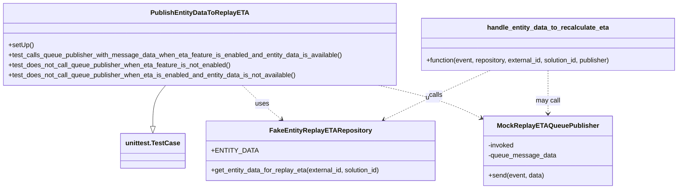
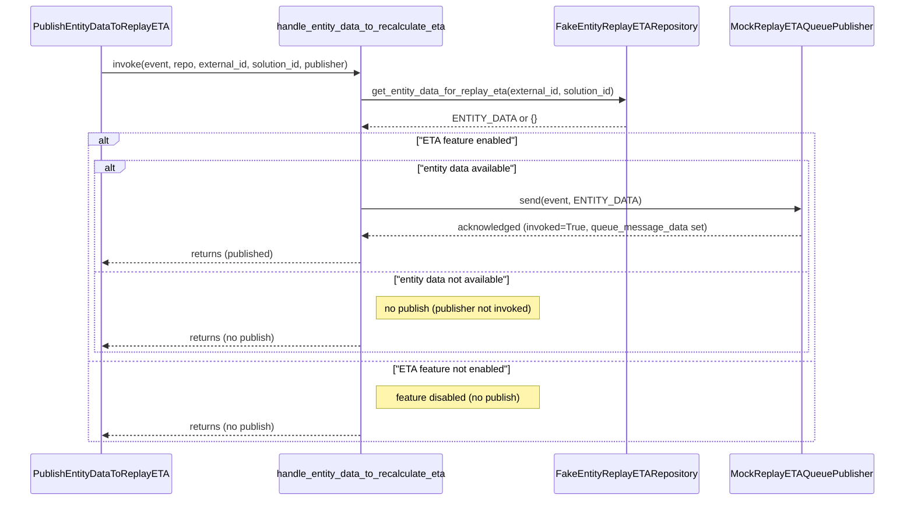

# Diagram: entity_core/entity_service/entity_service_tests/test_process_prebuilt_entity/test_publish_entity_data_for_replay_eta.py

> Auto-generated by Obscura crawlers

## Diagram 1

### SVG

<svg id="container" width="1639.974609375" xmlns="http://www.w3.org/2000/svg" class="classDiagram" height="456" viewBox="0 0 1639.974609375 456" role="graphics-document document" aria-roledescription="class"><g><defs><marker id="container_class-aggregationStart" class="marker aggregation class" refX="18" refY="7" markerWidth="190" markerHeight="240" orient="auto"><path d="M 18,7 L9,13 L1,7 L9,1 Z"></path></marker></defs><defs><marker id="container_class-aggregationEnd" class="marker aggregation class" refX="1" refY="7" markerWidth="20" markerHeight="28" orient="auto"><path d="M 18,7 L9,13 L1,7 L9,1 Z"></path></marker></defs><defs><marker id="container_class-extensionStart" class="marker extension class" refX="18" refY="7" markerWidth="190" markerHeight="240" orient="auto"><path d="M 1,7 L18,13 V 1 Z"></path></marker></defs><defs><marker id="container_class-extensionEnd" class="marker extension class" refX="1" refY="7" markerWidth="20" markerHeight="28" orient="auto"><path d="M 1,1 V 13 L18,7 Z"></path></marker></defs><defs><marker id="container_class-compositionStart" class="marker composition class" refX="18" refY="7" markerWidth="190" markerHeight="240" orient="auto"><path d="M 18,7 L9,13 L1,7 L9,1 Z"></path></marker></defs><defs><marker id="container_class-compositionEnd" class="marker composition class" refX="1" refY="7" markerWidth="20" markerHeight="28" orient="auto"><path d="M 18,7 L9,13 L1,7 L9,1 Z"></path></marker></defs><defs><marker id="container_class-dependencyStart" class="marker dependency class" refX="6" refY="7" markerWidth="190" markerHeight="240" orient="auto"><path d="M 5,7 L9,13 L1,7 L9,1 Z"></path></marker></defs><defs><marker id="container_class-dependencyEnd" class="marker dependency class" refX="13" refY="7" markerWidth="20" markerHeight="28" orient="auto"><path d="M 18,7 L9,13 L14,7 L9,1 Z"></path></marker></defs><defs><marker id="container_class-lollipopStart" class="marker lollipop class" refX="13" refY="7" markerWidth="190" markerHeight="240" orient="auto"><circle stroke="black" fill="transparent" cx="7" cy="7" r="6"></circle></marker></defs><defs><marker id="container_class-lollipopEnd" class="marker lollipop class" refX="1" refY="7" markerWidth="190" markerHeight="240" orient="auto"><circle stroke="black" fill="transparent" cx="7" cy="7" r="6"></circle></marker></defs><g class="root"><g class="clusters"></g><g class="edgePaths"><path d="M396.67,206L391.431,212.167C386.192,218.333,375.714,230.667,370.475,247.125C365.236,263.583,365.236,284.167,365.236,294.458L365.236,304.75" id="id_PublishEntityDataToReplayETA_unittest.TestCase_1" class="edge-thickness-normal edge-pattern-solid relation" style=";;;" data-edge="true" data-et="edge" data-id="id_PublishEntityDataToReplayETA_unittest.TestCase_1" data-points="W3sieCI6Mzk2LjY3MDI4MDkwNTMzMDg2LCJ5IjoyMDZ9LHsieCI6MzY1LjIzNjMyODEyNSwieSI6MjQzfSx7IngiOjM2NS4yMzYzMjgxMjUsInkiOjMyMn1d" marker-end="url(#container_class-extensionEnd)"></path><path d="M583.487,206L589.884,212.167C596.282,218.333,609.078,230.667,624.776,244.37C640.475,258.074,659.077,273.148,668.378,280.685L677.679,288.222" id="id_PublishEntityDataToReplayETA_FakeEntityReplayETARepository_2" class="edge-thickness-normal edge-pattern-dashed relation" style=";;;" data-edge="true" data-et="edge" data-id="id_PublishEntityDataToReplayETA_FakeEntityReplayETARepository_2" data-points="W3sieCI6NTgzLjQ4NjcxNTg3Nzc1NzMsInkiOjIwNn0seyJ4Ijo2MjEuODczMDQ2ODc1LCJ5IjoyNDN9LHsieCI6NjgyLjM0MDgxMjI0MTczNTUsInkiOjI5Mn1d" marker-end="url(#container_class-dependencyEnd)"></path><path d="M912.698,206L939.602,212.167C966.506,218.333,1020.315,230.667,1062.098,244.166C1103.881,257.666,1133.639,272.332,1148.518,279.666L1163.397,286.999" id="id_PublishEntityDataToReplayETA_MockReplayETAQueuePublisher_3" class="edge-thickness-normal edge-pattern-dashed relation" style=";;;" data-edge="true" data-et="edge" data-id="id_PublishEntityDataToReplayETA_MockReplayETAQueuePublisher_3" data-points="W3sieCI6OTEyLjY5ODExMjkzNjU4MDksInkiOjIwNn0seyJ4IjoxMDc0LjEyMzA0Njg3NSwieSI6MjQzfSx7IngiOjExNjguNzc5Mjk2ODc1LCJ5IjoyODkuNjUxMTU5MDkwNTQ3NX1d" marker-end="url(#container_class-dependencyEnd)"></path><path d="M1181.383,170L1154.683,182.167C1127.984,194.333,1074.585,218.667,1031.912,238.564C989.24,258.462,957.294,273.924,941.322,281.655L925.349,289.386" id="id_handle_entity_data_to_recalculate_eta_FakeEntityReplayETARepository_4" class="edge-thickness-normal edge-pattern-dashed relation" style=";;;" data-edge="true" data-et="edge" data-id="id_handle_entity_data_to_recalculate_eta_FakeEntityReplayETARepository_4" data-points="W3sieCI6MTE4MS4zODI1NTM5OTgxNjE3LCJ5IjoxNzB9LHsieCI6MTAyMS4xODU1NDY4NzUsInkiOjI0M30seyJ4Ijo5MTkuOTQ4MjUwMjU4MjY0NSwieSI6MjkyfV0=" marker-end="url(#container_class-dependencyEnd)"></path><path d="M1319.635,170L1319.635,182.167C1319.635,194.333,1319.635,218.667,1319.635,236C1319.635,253.333,1319.635,263.667,1319.635,268.833L1319.635,274" id="id_handle_entity_data_to_recalculate_eta_MockReplayETAQueuePublisher_5" class="edge-thickness-normal edge-pattern-dashed relation" style=";;;" data-edge="true" data-et="edge" data-id="id_handle_entity_data_to_recalculate_eta_MockReplayETAQueuePublisher_5" data-points="W3sieCI6MTMxOS42MzQ3NjU2MjUsInkiOjE3MH0seyJ4IjoxMzE5LjYzNDc2NTYyNSwieSI6MjQzfSx7IngiOjEzMTkuNjM0NzY1NjI1LCJ5IjoyODB9XQ==" marker-end="url(#container_class-dependencyEnd)"></path></g><g class="edgeLabels"><g class="edgeLabel"><g class="label" data-id="id_PublishEntityDataToReplayETA_unittest.TestCase_1" transform="translate(0, 0)"><foreignObject width="0" height="0">

</foreignObject></g></g><g class="edgeLabel" transform="translate(631.39581, 250.71676)"><g class="label" data-id="id_PublishEntityDataToReplayETA_FakeEntityReplayETARepository_2" transform="translate(-16.4921875, -12)"><foreignObject width="32.984375" height="24">

uses

</foreignObject></g></g><g class="edgeLabel" transform="translate(1044.84083, 236.28826)"><g class="label" data-id="id_PublishEntityDataToReplayETA_MockReplayETAQueuePublisher_3" transform="translate(-16.4921875, -12)"><foreignObject width="32.984375" height="24">

uses

</foreignObject></g></g><g class="edgeLabel" transform="translate(1050.11067, 229.81914)"><g class="label" data-id="id_handle_entity_data_to_recalculate_eta_FakeEntityReplayETARepository_4" transform="translate(-16.4453125, -12)"><foreignObject width="32.890625" height="24">

calls

</foreignObject></g></g><g class="edgeLabel" transform="translate(1319.634765625, 243)"><g class="label" data-id="id_handle_entity_data_to_recalculate_eta_MockReplayETAQueuePublisher_5" transform="translate(-29.8515625, -12)"><foreignObject width="59.703125" height="24">

may call

</foreignObject></g></g></g><g class="nodes"><g class="node default" id="classId-FakeEntityReplayETARepository-0" transform="translate(771.19140625, 364)"><g class="basic label-container"><path d="M-276.76171875 -72 L276.76171875 -72 L276.76171875 72 L-276.76171875 72" stroke="none" stroke-width="0" fill="#ECECFF" style=""></path><path d="M-276.76171875 -72 C-138.46015768427674 -72, -0.1585966185534744 -72, 276.76171875 -72 M-276.76171875 -72 C-150.34601033273557 -72, -23.930301915471148 -72, 276.76171875 -72 M276.76171875 -72 C276.76171875 -24.238231157405153, 276.76171875 23.523537685189694, 276.76171875 72 M276.76171875 -72 C276.76171875 -17.465525149417303, 276.76171875 37.068949701165394, 276.76171875 72 M276.76171875 72 C118.08761870550188 72, -40.586481338996236 72, -276.76171875 72 M276.76171875 72 C128.1728624090111 72, -20.415993931977823 72, -276.76171875 72 M-276.76171875 72 C-276.76171875 25.410724540384464, -276.76171875 -21.17855091923107, -276.76171875 -72 M-276.76171875 72 C-276.76171875 16.026232964463112, -276.76171875 -39.947534071073775, -276.76171875 -72" stroke="#9370DB" stroke-width="1.3" fill="none" stroke-dasharray="0 0" style=""></path></g><g class="annotation-group text" transform="translate(0, -48)"></g><g class="label-group text" transform="translate(-115.1796875, -48)"><g class="label" style="font-weight: bolder" transform="translate(0,-12)"><foreignObject width="230.359375" height="24">

FakeEntityReplayETARepository

</foreignObject></g></g><g class="members-group text" transform="translate(-264.76171875, 0)"><g class="label" style="" transform="translate(0,-12)"><foreignObject width="99.734375" height="24">

+ENTITY_DATA

</foreignObject></g></g><g class="methods-group text" transform="translate(-264.76171875, 48)"><g class="label" style="" transform="translate(0,-12)"><foreignObject width="414.34375" height="24">

+get_entity_data_for_replay_eta(external_id, solution_id)

</foreignObject></g></g><g class="divider" style=""><path d="M-276.76171875 -24 C-108.42116212745415 -24, 59.919394495091694 -24, 276.76171875 -24 M-276.76171875 -24 C-60.09920062990901 -24, 156.563317490182 -24, 276.76171875 -24" stroke="#9370DB" stroke-width="1.3" fill="none" stroke-dasharray="0 0" style=""></path></g><g class="divider" style=""><path d="M-276.76171875 24 C-150.12962159521155 24, -23.497524440423092 24, 276.76171875 24 M-276.76171875 24 C-144.37186616733592 24, -11.982013584671847 24, 276.76171875 24" stroke="#9370DB" stroke-width="1.3" fill="none" stroke-dasharray="0 0" style=""></path></g></g><g class="node default" id="classId-MockReplayETAQueuePublisher-1" transform="translate(1319.634765625, 364)"><g class="basic label-container"><path d="M-150.85546875 -84 L150.85546875 -84 L150.85546875 84 L-150.85546875 84" stroke="none" stroke-width="0" fill="#ECECFF" style=""></path><path d="M-150.85546875 -84 C-43.57784913978054 -84, 63.69977047043892 -84, 150.85546875 -84 M-150.85546875 -84 C-50.45895378342104 -84, 49.937561183157925 -84, 150.85546875 -84 M150.85546875 -84 C150.85546875 -29.498272481594753, 150.85546875 25.003455036810493, 150.85546875 84 M150.85546875 -84 C150.85546875 -45.03998786352476, 150.85546875 -6.079975727049515, 150.85546875 84 M150.85546875 84 C87.21488731231003 84, 23.574305874620038 84, -150.85546875 84 M150.85546875 84 C43.2278808959436 84, -64.3997069581128 84, -150.85546875 84 M-150.85546875 84 C-150.85546875 33.27941343640157, -150.85546875 -17.441173127196862, -150.85546875 -84 M-150.85546875 84 C-150.85546875 36.02842621225657, -150.85546875 -11.943147575486861, -150.85546875 -84" stroke="#9370DB" stroke-width="1.3" fill="none" stroke-dasharray="0 0" style=""></path></g><g class="annotation-group text" transform="translate(0, -60)"></g><g class="label-group text" transform="translate(-114.9140625, -60)"><g class="label" style="font-weight: bolder" transform="translate(0,-12)"><foreignObject width="229.828125" height="24">

MockReplayETAQueuePublisher

</foreignObject></g></g><g class="members-group text" transform="translate(-138.85546875, -12)"><g class="label" style="" transform="translate(0,-12)"><foreignObject width="63.71875" height="24">

-invoked

</foreignObject></g><g class="label" style="" transform="translate(0,12)"><foreignObject width="162.796875" height="24">

-queue_message_data

</foreignObject></g></g><g class="methods-group text" transform="translate(-138.85546875, 60)"><g class="label" style="" transform="translate(0,-12)"><foreignObject width="134.609375" height="24">

+send(event, data)

</foreignObject></g></g><g class="divider" style=""><path d="M-150.85546875 -36 C-36.19823881396118 -36, 78.45899112207763 -36, 150.85546875 -36 M-150.85546875 -36 C-88.05949353516903 -36, -25.263518320338036 -36, 150.85546875 -36" stroke="#9370DB" stroke-width="1.3" fill="none" stroke-dasharray="0 0" style=""></path></g><g class="divider" style=""><path d="M-150.85546875 36 C-49.047970595107344 36, 52.75952755978531 36, 150.85546875 36 M-150.85546875 36 C-32.99631061003899 36, 84.86284752992202 36, 150.85546875 36" stroke="#9370DB" stroke-width="1.3" fill="none" stroke-dasharray="0 0" style=""></path></g></g><g class="node default" id="classId-PublishEntityDataToReplayETA-2" transform="translate(480.77734375, 107)"><g class="basic label-container"><path d="M-472.77734375 -99 L472.77734375 -99 L472.77734375 99 L-472.77734375 99" stroke="none" stroke-width="0" fill="#ECECFF" style=""></path><path d="M-472.77734375 -99 C-273.5896169549376 -99, -74.40189015987522 -99, 472.77734375 -99 M-472.77734375 -99 C-155.20305328247315 -99, 162.3712371850537 -99, 472.77734375 -99 M472.77734375 -99 C472.77734375 -49.06913142528674, 472.77734375 0.8617371494265171, 472.77734375 99 M472.77734375 -99 C472.77734375 -22.952775417350153, 472.77734375 53.09444916529969, 472.77734375 99 M472.77734375 99 C281.5925633937822 99, 90.4077830375644 99, -472.77734375 99 M472.77734375 99 C154.790378080195 99, -163.19658758960998 99, -472.77734375 99 M-472.77734375 99 C-472.77734375 43.65481487812467, -472.77734375 -11.690370243750664, -472.77734375 -99 M-472.77734375 99 C-472.77734375 45.1636353081038, -472.77734375 -8.6727293837924, -472.77734375 -99" stroke="#9370DB" stroke-width="1.3" fill="none" stroke-dasharray="0 0" style=""></path></g><g class="annotation-group text" transform="translate(0, -75)"></g><g class="label-group text" transform="translate(-111.3828125, -75)"><g class="label" style="font-weight: bolder" transform="translate(0,-12)"><foreignObject width="222.765625" height="24">

PublishEntityDataToReplayETA

</foreignObject></g></g><g class="members-group text" transform="translate(-460.77734375, -27)"></g><g class="methods-group text" transform="translate(-460.77734375, 3)"><g class="label" style="" transform="translate(0,-12)"><foreignObject width="60.421875" height="24">

+setUp()

</foreignObject></g><g class="label" style="" transform="translate(0,12)"><foreignObject width="810.171875" height="24">

+test_calls_queue_publisher_with_message_data_when_eta_feature_is_enabled_and_entity_data_is_available()

</foreignObject></g><g class="label" style="" transform="translate(0,36)"><foreignObject width="542.09375" height="24">

+test_does_not_call_queue_publisher_when_eta_feature_is_not_enabled()

</foreignObject></g><g class="label" style="" transform="translate(0,60)"><foreignObject width="701.625" height="24">

+test_does_not_call_queue_publisher_when_eta_is_enabled_and_entity_data_is_not_available()

</foreignObject></g></g><g class="divider" style=""><path d="M-472.77734375 -51 C-144.99602011311327 -51, 182.78530352377345 -51, 472.77734375 -51 M-472.77734375 -51 C-220.42785859389227 -51, 31.921626562215465 -51, 472.77734375 -51" stroke="#9370DB" stroke-width="1.3" fill="none" stroke-dasharray="0 0" style=""></path></g><g class="divider" style=""><path d="M-472.77734375 -27 C-273.8098485765296 -27, -74.84235340305918 -27, 472.77734375 -27 M-472.77734375 -27 C-117.37885322009771 -27, 238.01963730980458 -27, 472.77734375 -27" stroke="#9370DB" stroke-width="1.3" fill="none" stroke-dasharray="0 0" style=""></path></g></g><g class="node default" id="classId-handle_entity_data_to_recalculate_eta-3" transform="translate(1319.634765625, 107)"><g class="basic label-container"><path d="M-312.33984375 -63 L312.33984375 -63 L312.33984375 63 L-312.33984375 63" stroke="none" stroke-width="0" fill="#ECECFF" style=""></path><path d="M-312.33984375 -63 C-89.62369878113458 -63, 133.09244618773084 -63, 312.33984375 -63 M-312.33984375 -63 C-165.84216520965063 -63, -19.34448666930126 -63, 312.33984375 -63 M312.33984375 -63 C312.33984375 -25.833754446022375, 312.33984375 11.33249110795525, 312.33984375 63 M312.33984375 -63 C312.33984375 -20.080774113615156, 312.33984375 22.838451772769687, 312.33984375 63 M312.33984375 63 C147.59453594572216 63, -17.150771858555686 63, -312.33984375 63 M312.33984375 63 C131.17856258227494 63, -49.98271858545013 63, -312.33984375 63 M-312.33984375 63 C-312.33984375 22.9157754949874, -312.33984375 -17.1684490100252, -312.33984375 -63 M-312.33984375 63 C-312.33984375 20.576494729878497, -312.33984375 -21.847010540243005, -312.33984375 -63" stroke="#9370DB" stroke-width="1.3" fill="none" stroke-dasharray="0 0" style=""></path></g><g class="annotation-group text" transform="translate(0, -39)"></g><g class="label-group text" transform="translate(-142.3359375, -39)"><g class="label" style="font-weight: bolder" transform="translate(0,-12)"><foreignObject width="284.671875" height="24">

handle_entity_data_to_recalculate_eta

</foreignObject></g></g><g class="members-group text" transform="translate(-300.33984375, 9)"></g><g class="methods-group text" transform="translate(-300.33984375, 39)"><g class="label" style="" transform="translate(0,-12)"><foreignObject width="458.34375" height="24">

+function(event, repository, external_id, solution_id, publisher)

</foreignObject></g></g><g class="divider" style=""><path d="M-312.33984375 -15 C-92.82299356948181 -15, 126.69385661103638 -15, 312.33984375 -15 M-312.33984375 -15 C-103.77734331610853 -15, 104.78515711778294 -15, 312.33984375 -15" stroke="#9370DB" stroke-width="1.3" fill="none" stroke-dasharray="0 0" style=""></path></g><g class="divider" style=""><path d="M-312.33984375 9 C-185.59536276040598 9, -58.85088177081198 9, 312.33984375 9 M-312.33984375 9 C-163.57072685109068 9, -14.801609952181366 9, 312.33984375 9" stroke="#9370DB" stroke-width="1.3" fill="none" stroke-dasharray="0 0" style=""></path></g></g><g class="node default" id="classId-unittest.TestCase-4" transform="translate(365.236328125, 364)"><g class="basic label-container"><path d="M-74.7109375 -42 L74.7109375 -42 L74.7109375 42 L-74.7109375 42" stroke="none" stroke-width="0" fill="#ECECFF" style=""></path><path d="M-74.7109375 -42 C-23.055418989749292 -42, 28.600099520501416 -42, 74.7109375 -42 M-74.7109375 -42 C-22.638090316444547 -42, 29.434756867110906 -42, 74.7109375 -42 M74.7109375 -42 C74.7109375 -8.760827508549049, 74.7109375 24.478344982901902, 74.7109375 42 M74.7109375 -42 C74.7109375 -13.538023800107862, 74.7109375 14.923952399784277, 74.7109375 42 M74.7109375 42 C28.104508242138714 42, -18.501921015722573 42, -74.7109375 42 M74.7109375 42 C25.40343073088546 42, -23.90407603822908 42, -74.7109375 42 M-74.7109375 42 C-74.7109375 24.382219155884915, -74.7109375 6.76443831176983, -74.7109375 -42 M-74.7109375 42 C-74.7109375 22.902714395072262, -74.7109375 3.805428790144525, -74.7109375 -42" stroke="#9370DB" stroke-width="1.3" fill="none" stroke-dasharray="0 0" style=""></path></g><g class="annotation-group text" transform="translate(0, -18)"></g><g class="label-group text" transform="translate(-62.7109375, -18)"><g class="label" style="font-weight: bolder" transform="translate(0,-12)"><foreignObject width="125.421875" height="24">

unittest.TestCase

</foreignObject></g></g><g class="members-group text" transform="translate(-62.7109375, 30)"></g><g class="methods-group text" transform="translate(-62.7109375, 60)"></g><g class="divider" style=""><path d="M-74.7109375 6 C-34.391804862944255 6, 5.92732777411149 6, 74.7109375 6 M-74.7109375 6 C-31.834960285491334 6, 11.041016929017331 6, 74.7109375 6" stroke="#9370DB" stroke-width="1.3" fill="none" stroke-dasharray="0 0" style=""></path></g><g class="divider" style=""><path d="M-74.7109375 24 C-39.23096732331071 24, -3.7509971466214154 24, 74.7109375 24 M-74.7109375 24 C-28.884805405188843 24, 16.941326689622315 24, 74.7109375 24" stroke="#9370DB" stroke-width="1.3" fill="none" stroke-dasharray="0 0" style=""></path></g></g></g></g></g></svg>

## Diagram 2

### SVG

<svg id="container" width="1584" xmlns="http://www.w3.org/2000/svg" height="853" viewBox="-50 -10 1584 853" role="graphics-document document" aria-roledescription="sequence"><g><rect x="1236" y="767" fill="#eaeaea" stroke="#666" width="248" height="65" name="Pub" rx="3" ry="3" class="actor actor-bottom"></rect><text x="1360" y="799.5" dominant-baseline="central" alignment-baseline="central" class="actor actor-box" style="text-anchor: middle; font-size: 16px; font-weight: 400;"><tspan x="1360" dy="0">MockReplayETAQueuePublisher</tspan></text></g><g><rect x="940" y="767" fill="#eaeaea" stroke="#666" width="246" height="65" name="Repo" rx="3" ry="3" class="actor actor-bottom"></rect><text x="1063" y="799.5" dominant-baseline="central" alignment-baseline="central" class="actor actor-box" style="text-anchor: middle; font-size: 16px; font-weight: 400;"><tspan x="1063" dy="0">FakeEntityReplayETARepository</tspan></text></g><g><rect x="436.5" y="767" fill="#eaeaea" stroke="#666" width="301" height="65" name="Func" rx="3" ry="3" class="actor actor-bottom"></rect><text x="587" y="799.5" dominant-baseline="central" alignment-baseline="central" class="actor actor-box" style="text-anchor: middle; font-size: 16px; font-weight: 400;"><tspan x="587" dy="0">handle_entity_data_to_recalculate_eta</tspan></text></g><g><rect x="0" y="767" fill="#eaeaea" stroke="#666" width="240" height="65" name="TestCase" rx="3" ry="3" class="actor actor-bottom"></rect><text x="120" y="799.5" dominant-baseline="central" alignment-baseline="central" class="actor actor-box" style="text-anchor: middle; font-size: 16px; font-weight: 400;"><tspan x="120" dy="0">PublishEntityDataToReplayETA</tspan></text></g><g><line id="actor3" x1="1360" y1="65" x2="1360" y2="767" class="actor-line 200" stroke-width="0.5px" stroke="#999" name="Pub"></line><g id="root-3"><rect x="1236" y="0" fill="#eaeaea" stroke="#666" width="248" height="65" name="Pub" rx="3" ry="3" class="actor actor-top"></rect><text x="1360" y="32.5" dominant-baseline="central" alignment-baseline="central" class="actor actor-box" style="text-anchor: middle; font-size: 16px; font-weight: 400;"><tspan x="1360" dy="0">MockReplayETAQueuePublisher</tspan></text></g></g><g><line id="actor2" x1="1063" y1="65" x2="1063" y2="767" class="actor-line 200" stroke-width="0.5px" stroke="#999" name="Repo"></line><g id="root-2"><rect x="940" y="0" fill="#eaeaea" stroke="#666" width="246" height="65" name="Repo" rx="3" ry="3" class="actor actor-top"></rect><text x="1063" y="32.5" dominant-baseline="central" alignment-baseline="central" class="actor actor-box" style="text-anchor: middle; font-size: 16px; font-weight: 400;"><tspan x="1063" dy="0">FakeEntityReplayETARepository</tspan></text></g></g><g><line id="actor1" x1="587" y1="65" x2="587" y2="767" class="actor-line 200" stroke-width="0.5px" stroke="#999" name="Func"></line><g id="root-1"><rect x="436.5" y="0" fill="#eaeaea" stroke="#666" width="301" height="65" name="Func" rx="3" ry="3" class="actor actor-top"></rect><text x="587" y="32.5" dominant-baseline="central" alignment-baseline="central" class="actor actor-box" style="text-anchor: middle; font-size: 16px; font-weight: 400;"><tspan x="587" dy="0">handle_entity_data_to_recalculate_eta</tspan></text></g></g><g><line id="actor0" x1="120" y1="65" x2="120" y2="767" class="actor-line 200" stroke-width="0.5px" stroke="#999" name="TestCase"></line><g id="root-0"><rect x="0" y="0" fill="#eaeaea" stroke="#666" width="240" height="65" name="TestCase" rx="3" ry="3" class="actor actor-top"></rect><text x="120" y="32.5" dominant-baseline="central" alignment-baseline="central" class="actor actor-box" style="text-anchor: middle; font-size: 16px; font-weight: 400;"><tspan x="120" dy="0">PublishEntityDataToReplayETA</tspan></text></g></g><g></g><defs><symbol id="computer" width="24" height="24"><path transform="scale(.5)" d="M2 2v13h20v-13h-20zm18 11h-16v-9h16v9zm-10.228 6l.466-1h3.524l.467 1h-4.457zm14.228 3h-24l2-6h2.104l-1.33 4h18.45l-1.297-4h2.073l2 6zm-5-10h-14v-7h14v7z"></path></symbol></defs><defs><symbol id="database" fill-rule="evenodd" clip-rule="evenodd"><path transform="scale(.5)" d="M12.258.001l.256.004.255.005.253.008.251.01.249.012.247.015.246.016.242.019.241.02.239.023.236.024.233.027.231.028.229.031.225.032.223.034.22.036.217.038.214.04.211.041.208.043.205.045.201.046.198.048.194.05.191.051.187.053.183.054.18.056.175.057.172.059.168.06.163.061.16.063.155.064.15.066.074.033.073.033.071.034.07.034.069.035.068.035.067.035.066.035.064.036.064.036.062.036.06.036.06.037.058.037.058.037.055.038.055.038.053.038.052.038.051.039.05.039.048.039.047.039.045.04.044.04.043.04.041.04.04.041.039.041.037.041.036.041.034.041.033.042.032.042.03.042.029.042.027.042.026.043.024.043.023.043.021.043.02.043.018.044.017.043.015.044.013.044.012.044.011.045.009.044.007.045.006.045.004.045.002.045.001.045v17l-.001.045-.002.045-.004.045-.006.045-.007.045-.009.044-.011.045-.012.044-.013.044-.015.044-.017.043-.018.044-.02.043-.021.043-.023.043-.024.043-.026.043-.027.042-.029.042-.03.042-.032.042-.033.042-.034.041-.036.041-.037.041-.039.041-.04.041-.041.04-.043.04-.044.04-.045.04-.047.039-.048.039-.05.039-.051.039-.052.038-.053.038-.055.038-.055.038-.058.037-.058.037-.06.037-.06.036-.062.036-.064.036-.064.036-.066.035-.067.035-.068.035-.069.035-.07.034-.071.034-.073.033-.074.033-.15.066-.155.064-.16.063-.163.061-.168.06-.172.059-.175.057-.18.056-.183.054-.187.053-.191.051-.194.05-.198.048-.201.046-.205.045-.208.043-.211.041-.214.04-.217.038-.22.036-.223.034-.225.032-.229.031-.231.028-.233.027-.236.024-.239.023-.241.02-.242.019-.246.016-.247.015-.249.012-.251.01-.253.008-.255.005-.256.004-.258.001-.258-.001-.256-.004-.255-.005-.253-.008-.251-.01-.249-.012-.247-.015-.245-.016-.243-.019-.241-.02-.238-.023-.236-.024-.234-.027-.231-.028-.228-.031-.226-.032-.223-.034-.22-.036-.217-.038-.214-.04-.211-.041-.208-.043-.204-.045-.201-.046-.198-.048-.195-.05-.19-.051-.187-.053-.184-.054-.179-.056-.176-.057-.172-.059-.167-.06-.164-.061-.159-.063-.155-.064-.151-.066-.074-.033-.072-.033-.072-.034-.07-.034-.069-.035-.068-.035-.067-.035-.066-.035-.064-.036-.063-.036-.062-.036-.061-.036-.06-.037-.058-.037-.057-.037-.056-.038-.055-.038-.053-.038-.052-.038-.051-.039-.049-.039-.049-.039-.046-.039-.046-.04-.044-.04-.043-.04-.041-.04-.04-.041-.039-.041-.037-.041-.036-.041-.034-.041-.033-.042-.032-.042-.03-.042-.029-.042-.027-.042-.026-.043-.024-.043-.023-.043-.021-.043-.02-.043-.018-.044-.017-.043-.015-.044-.013-.044-.012-.044-.011-.045-.009-.044-.007-.045-.006-.045-.004-.045-.002-.045-.001-.045v-17l.001-.045.002-.045.004-.045.006-.045.007-.045.009-.044.011-.045.012-.044.013-.044.015-.044.017-.043.018-.044.02-.043.021-.043.023-.043.024-.043.026-.043.027-.042.029-.042.03-.042.032-.042.033-.042.034-.041.036-.041.037-.041.039-.041.04-.041.041-.04.043-.04.044-.04.046-.04.046-.039.049-.039.049-.039.051-.039.052-.038.053-.038.055-.038.056-.038.057-.037.058-.037.06-.037.061-.036.062-.036.063-.036.064-.036.066-.035.067-.035.068-.035.069-.035.07-.034.072-.034.072-.033.074-.033.151-.066.155-.064.159-.063.164-.061.167-.06.172-.059.176-.057.179-.056.184-.054.187-.053.19-.051.195-.05.198-.048.201-.046.204-.045.208-.043.211-.041.214-.04.217-.038.22-.036.223-.034.226-.032.228-.031.231-.028.234-.027.236-.024.238-.023.241-.02.243-.019.245-.016.247-.015.249-.012.251-.01.253-.008.255-.005.256-.004.258-.001.258.001zm-9.258 20.499v.01l.001.021.003.021.004.022.005.021.006.022.007.022.009.023.01.022.011.023.012.023.013.023.015.023.016.024.017.023.018.024.019.024.021.024.022.025.023.024.024.025.052.049.056.05.061.051.066.051.07.051.075.051.079.052.084.052.088.052.092.052.097.052.102.051.105.052.11.052.114.051.119.051.123.051.127.05.131.05.135.05.139.048.144.049.147.047.152.047.155.047.16.045.163.045.167.043.171.043.176.041.178.041.183.039.187.039.19.037.194.035.197.035.202.033.204.031.209.03.212.029.216.027.219.025.222.024.226.021.23.02.233.018.236.016.24.015.243.012.246.01.249.008.253.005.256.004.259.001.26-.001.257-.004.254-.005.25-.008.247-.011.244-.012.241-.014.237-.016.233-.018.231-.021.226-.021.224-.024.22-.026.216-.027.212-.028.21-.031.205-.031.202-.034.198-.034.194-.036.191-.037.187-.039.183-.04.179-.04.175-.042.172-.043.168-.044.163-.045.16-.046.155-.046.152-.047.148-.048.143-.049.139-.049.136-.05.131-.05.126-.05.123-.051.118-.052.114-.051.11-.052.106-.052.101-.052.096-.052.092-.052.088-.053.083-.051.079-.052.074-.052.07-.051.065-.051.06-.051.056-.05.051-.05.023-.024.023-.025.021-.024.02-.024.019-.024.018-.024.017-.024.015-.023.014-.024.013-.023.012-.023.01-.023.01-.022.008-.022.006-.022.006-.022.004-.022.004-.021.001-.021.001-.021v-4.127l-.077.055-.08.053-.083.054-.085.053-.087.052-.09.052-.093.051-.095.05-.097.05-.1.049-.102.049-.105.048-.106.047-.109.047-.111.046-.114.045-.115.045-.118.044-.12.043-.122.042-.124.042-.126.041-.128.04-.13.04-.132.038-.134.038-.135.037-.138.037-.139.035-.142.035-.143.034-.144.033-.147.032-.148.031-.15.03-.151.03-.153.029-.154.027-.156.027-.158.026-.159.025-.161.024-.162.023-.163.022-.165.021-.166.02-.167.019-.169.018-.169.017-.171.016-.173.015-.173.014-.175.013-.175.012-.177.011-.178.01-.179.008-.179.008-.181.006-.182.005-.182.004-.184.003-.184.002h-.37l-.184-.002-.184-.003-.182-.004-.182-.005-.181-.006-.179-.008-.179-.008-.178-.01-.176-.011-.176-.012-.175-.013-.173-.014-.172-.015-.171-.016-.17-.017-.169-.018-.167-.019-.166-.02-.165-.021-.163-.022-.162-.023-.161-.024-.159-.025-.157-.026-.156-.027-.155-.027-.153-.029-.151-.03-.15-.03-.148-.031-.146-.032-.145-.033-.143-.034-.141-.035-.14-.035-.137-.037-.136-.037-.134-.038-.132-.038-.13-.04-.128-.04-.126-.041-.124-.042-.122-.042-.12-.044-.117-.043-.116-.045-.113-.045-.112-.046-.109-.047-.106-.047-.105-.048-.102-.049-.1-.049-.097-.05-.095-.05-.093-.052-.09-.051-.087-.052-.085-.053-.083-.054-.08-.054-.077-.054v4.127zm0-5.654v.011l.001.021.003.021.004.021.005.022.006.022.007.022.009.022.01.022.011.023.012.023.013.023.015.024.016.023.017.024.018.024.019.024.021.024.022.024.023.025.024.024.052.05.056.05.061.05.066.051.07.051.075.052.079.051.084.052.088.052.092.052.097.052.102.052.105.052.11.051.114.051.119.052.123.05.127.051.131.05.135.049.139.049.144.048.147.048.152.047.155.046.16.045.163.045.167.044.171.042.176.042.178.04.183.04.187.038.19.037.194.036.197.034.202.033.204.032.209.03.212.028.216.027.219.025.222.024.226.022.23.02.233.018.236.016.24.014.243.012.246.01.249.008.253.006.256.003.259.001.26-.001.257-.003.254-.006.25-.008.247-.01.244-.012.241-.015.237-.016.233-.018.231-.02.226-.022.224-.024.22-.025.216-.027.212-.029.21-.03.205-.032.202-.033.198-.035.194-.036.191-.037.187-.039.183-.039.179-.041.175-.042.172-.043.168-.044.163-.045.16-.045.155-.047.152-.047.148-.048.143-.048.139-.05.136-.049.131-.05.126-.051.123-.051.118-.051.114-.052.11-.052.106-.052.101-.052.096-.052.092-.052.088-.052.083-.052.079-.052.074-.051.07-.052.065-.051.06-.05.056-.051.051-.049.023-.025.023-.024.021-.025.02-.024.019-.024.018-.024.017-.024.015-.023.014-.023.013-.024.012-.022.01-.023.01-.023.008-.022.006-.022.006-.022.004-.021.004-.022.001-.021.001-.021v-4.139l-.077.054-.08.054-.083.054-.085.052-.087.053-.09.051-.093.051-.095.051-.097.05-.1.049-.102.049-.105.048-.106.047-.109.047-.111.046-.114.045-.115.044-.118.044-.12.044-.122.042-.124.042-.126.041-.128.04-.13.039-.132.039-.134.038-.135.037-.138.036-.139.036-.142.035-.143.033-.144.033-.147.033-.148.031-.15.03-.151.03-.153.028-.154.028-.156.027-.158.026-.159.025-.161.024-.162.023-.163.022-.165.021-.166.02-.167.019-.169.018-.169.017-.171.016-.173.015-.173.014-.175.013-.175.012-.177.011-.178.009-.179.009-.179.007-.181.007-.182.005-.182.004-.184.003-.184.002h-.37l-.184-.002-.184-.003-.182-.004-.182-.005-.181-.007-.179-.007-.179-.009-.178-.009-.176-.011-.176-.012-.175-.013-.173-.014-.172-.015-.171-.016-.17-.017-.169-.018-.167-.019-.166-.02-.165-.021-.163-.022-.162-.023-.161-.024-.159-.025-.157-.026-.156-.027-.155-.028-.153-.028-.151-.03-.15-.03-.148-.031-.146-.033-.145-.033-.143-.033-.141-.035-.14-.036-.137-.036-.136-.037-.134-.038-.132-.039-.13-.039-.128-.04-.126-.041-.124-.042-.122-.043-.12-.043-.117-.044-.116-.044-.113-.046-.112-.046-.109-.046-.106-.047-.105-.048-.102-.049-.1-.049-.097-.05-.095-.051-.093-.051-.09-.051-.087-.053-.085-.052-.083-.054-.08-.054-.077-.054v4.139zm0-5.666v.011l.001.02.003.022.004.021.005.022.006.021.007.022.009.023.01.022.011.023.012.023.013.023.015.023.016.024.017.024.018.023.019.024.021.025.022.024.023.024.024.025.052.05.056.05.061.05.066.051.07.051.075.052.079.051.084.052.088.052.092.052.097.052.102.052.105.051.11.052.114.051.119.051.123.051.127.05.131.05.135.05.139.049.144.048.147.048.152.047.155.046.16.045.163.045.167.043.171.043.176.042.178.04.183.04.187.038.19.037.194.036.197.034.202.033.204.032.209.03.212.028.216.027.219.025.222.024.226.021.23.02.233.018.236.017.24.014.243.012.246.01.249.008.253.006.256.003.259.001.26-.001.257-.003.254-.006.25-.008.247-.01.244-.013.241-.014.237-.016.233-.018.231-.02.226-.022.224-.024.22-.025.216-.027.212-.029.21-.03.205-.032.202-.033.198-.035.194-.036.191-.037.187-.039.183-.039.179-.041.175-.042.172-.043.168-.044.163-.045.16-.045.155-.047.152-.047.148-.048.143-.049.139-.049.136-.049.131-.051.126-.05.123-.051.118-.052.114-.051.11-.052.106-.052.101-.052.096-.052.092-.052.088-.052.083-.052.079-.052.074-.052.07-.051.065-.051.06-.051.056-.05.051-.049.023-.025.023-.025.021-.024.02-.024.019-.024.018-.024.017-.024.015-.023.014-.024.013-.023.012-.023.01-.022.01-.023.008-.022.006-.022.006-.022.004-.022.004-.021.001-.021.001-.021v-4.153l-.077.054-.08.054-.083.053-.085.053-.087.053-.09.051-.093.051-.095.051-.097.05-.1.049-.102.048-.105.048-.106.048-.109.046-.111.046-.114.046-.115.044-.118.044-.12.043-.122.043-.124.042-.126.041-.128.04-.13.039-.132.039-.134.038-.135.037-.138.036-.139.036-.142.034-.143.034-.144.033-.147.032-.148.032-.15.03-.151.03-.153.028-.154.028-.156.027-.158.026-.159.024-.161.024-.162.023-.163.023-.165.021-.166.02-.167.019-.169.018-.169.017-.171.016-.173.015-.173.014-.175.013-.175.012-.177.01-.178.01-.179.009-.179.007-.181.006-.182.006-.182.004-.184.003-.184.001-.185.001-.185-.001-.184-.001-.184-.003-.182-.004-.182-.006-.181-.006-.179-.007-.179-.009-.178-.01-.176-.01-.176-.012-.175-.013-.173-.014-.172-.015-.171-.016-.17-.017-.169-.018-.167-.019-.166-.02-.165-.021-.163-.023-.162-.023-.161-.024-.159-.024-.157-.026-.156-.027-.155-.028-.153-.028-.151-.03-.15-.03-.148-.032-.146-.032-.145-.033-.143-.034-.141-.034-.14-.036-.137-.036-.136-.037-.134-.038-.132-.039-.13-.039-.128-.041-.126-.041-.124-.041-.122-.043-.12-.043-.117-.044-.116-.044-.113-.046-.112-.046-.109-.046-.106-.048-.105-.048-.102-.048-.1-.05-.097-.049-.095-.051-.093-.051-.09-.052-.087-.052-.085-.053-.083-.053-.08-.054-.077-.054v4.153zm8.74-8.179l-.257.004-.254.005-.25.008-.247.011-.244.012-.241.014-.237.016-.233.018-.231.021-.226.022-.224.023-.22.026-.216.027-.212.028-.21.031-.205.032-.202.033-.198.034-.194.036-.191.038-.187.038-.183.04-.179.041-.175.042-.172.043-.168.043-.163.045-.16.046-.155.046-.152.048-.148.048-.143.048-.139.049-.136.05-.131.05-.126.051-.123.051-.118.051-.114.052-.11.052-.106.052-.101.052-.096.052-.092.052-.088.052-.083.052-.079.052-.074.051-.07.052-.065.051-.06.05-.056.05-.051.05-.023.025-.023.024-.021.024-.02.025-.019.024-.018.024-.017.023-.015.024-.014.023-.013.023-.012.023-.01.023-.01.022-.008.022-.006.023-.006.021-.004.022-.004.021-.001.021-.001.021.001.021.001.021.004.021.004.022.006.021.006.023.008.022.01.022.01.023.012.023.013.023.014.023.015.024.017.023.018.024.019.024.02.025.021.024.023.024.023.025.051.05.056.05.06.05.065.051.07.052.074.051.079.052.083.052.088.052.092.052.096.052.101.052.106.052.11.052.114.052.118.051.123.051.126.051.131.05.136.05.139.049.143.048.148.048.152.048.155.046.16.046.163.045.168.043.172.043.175.042.179.041.183.04.187.038.191.038.194.036.198.034.202.033.205.032.21.031.212.028.216.027.22.026.224.023.226.022.231.021.233.018.237.016.241.014.244.012.247.011.25.008.254.005.257.004.26.001.26-.001.257-.004.254-.005.25-.008.247-.011.244-.012.241-.014.237-.016.233-.018.231-.021.226-.022.224-.023.22-.026.216-.027.212-.028.21-.031.205-.032.202-.033.198-.034.194-.036.191-.038.187-.038.183-.04.179-.041.175-.042.172-.043.168-.043.163-.045.16-.046.155-.046.152-.048.148-.048.143-.048.139-.049.136-.05.131-.05.126-.051.123-.051.118-.051.114-.052.11-.052.106-.052.101-.052.096-.052.092-.052.088-.052.083-.052.079-.052.074-.051.07-.052.065-.051.06-.05.056-.05.051-.05.023-.025.023-.024.021-.024.02-.025.019-.024.018-.024.017-.023.015-.024.014-.023.013-.023.012-.023.01-.023.01-.022.008-.022.006-.023.006-.021.004-.022.004-.021.001-.021.001-.021-.001-.021-.001-.021-.004-.021-.004-.022-.006-.021-.006-.023-.008-.022-.01-.022-.01-.023-.012-.023-.013-.023-.014-.023-.015-.024-.017-.023-.018-.024-.019-.024-.02-.025-.021-.024-.023-.024-.023-.025-.051-.05-.056-.05-.06-.05-.065-.051-.07-.052-.074-.051-.079-.052-.083-.052-.088-.052-.092-.052-.096-.052-.101-.052-.106-.052-.11-.052-.114-.052-.118-.051-.123-.051-.126-.051-.131-.05-.136-.05-.139-.049-.143-.048-.148-.048-.152-.048-.155-.046-.16-.046-.163-.045-.168-.043-.172-.043-.175-.042-.179-.041-.183-.04-.187-.038-.191-.038-.194-.036-.198-.034-.202-.033-.205-.032-.21-.031-.212-.028-.216-.027-.22-.026-.224-.023-.226-.022-.231-.021-.233-.018-.237-.016-.241-.014-.244-.012-.247-.011-.25-.008-.254-.005-.257-.004-.26-.001-.26.001z"></path></symbol></defs><defs><symbol id="clock" width="24" height="24"><path transform="scale(.5)" d="M12 2c5.514 0 10 4.486 10 10s-4.486 10-10 10-10-4.486-10-10 4.486-10 10-10zm0-2c-6.627 0-12 5.373-12 12s5.373 12 12 12 12-5.373 12-12-5.373-12-12-12zm5.848 12.459c.202.038.202.333.001.372-1.907.361-6.045 1.111-6.547 1.111-.719 0-1.301-.582-1.301-1.301 0-.512.77-5.447 1.125-7.445.034-.192.312-.181.343.014l.985 6.238 5.394 1.011z"></path></symbol></defs><defs><marker id="arrowhead" refX="7.9" refY="5" markerUnits="userSpaceOnUse" markerWidth="12" markerHeight="12" orient="auto-start-reverse"><path d="M -1 0 L 10 5 L 0 10 z"></path></marker></defs><defs><marker id="crosshead" markerWidth="15" markerHeight="8" orient="auto" refX="4" refY="4.5"><path fill="none" stroke="#000000" stroke-width="1pt" d="M 1,2 L 6,7 M 6,2 L 1,7" style="stroke-dasharray: 0, 0;"></path></marker></defs><defs><marker id="filled-head" refX="15.5" refY="7" markerWidth="20" markerHeight="28" orient="auto"><path d="M 18,7 L9,13 L14,7 L9,1 Z"></path></marker></defs><defs><marker id="sequencenumber" refX="15" refY="15" markerWidth="60" markerHeight="40" orient="auto"><circle cx="15" cy="15" r="6"></circle></marker></defs><g><rect x="612" y="498" fill="#EDF2AE" stroke="#666" width="301" height="39" class="note"></rect><text x="763" y="503" text-anchor="middle" dominant-baseline="middle" alignment-baseline="middle" class="noteText" dy="1em" style="font-size: 16px; font-weight: 400;"><tspan x="763">no publish (publisher not invoked)</tspan></text></g><g><line x1="109" y1="264" x2="1371" y2="264" class="loopLine"></line><line x1="1371" y1="264" x2="1371" y2="595" class="loopLine"></line><line x1="109" y1="595" x2="1371" y2="595" class="loopLine"></line><line x1="109" y1="264" x2="109" y2="595" class="loopLine"></line><line x1="109" y1="458" x2="1371" y2="458" class="loopLine" style="stroke-dasharray: 3, 3;"></line><polygon points="109,264 159,264 159,277 150.6,284 109,284" class="labelBox"></polygon><text x="134" y="277" text-anchor="middle" dominant-baseline="middle" alignment-baseline="middle" class="labelText" style="font-size: 16px; font-weight: 400;">alt</text><text x="765" y="282" text-anchor="middle" class="loopText" style="font-size: 16px; font-weight: 400;"><tspan x="765">["entity data available"]</tspan></text><text x="740" y="476" text-anchor="middle" class="loopText" style="font-size: 16px; font-weight: 400;">["entity data not available"]</text></g><g><rect x="612" y="650" fill="#EDF2AE" stroke="#666" width="301" height="39" class="note"></rect><text x="763" y="655" text-anchor="middle" dominant-baseline="middle" alignment-baseline="middle" class="noteText" dy="1em" style="font-size: 16px; font-weight: 400;"><tspan x="763">feature disabled (no publish)</tspan></text></g><g><line x1="99" y1="219" x2="1381" y2="219" class="loopLine"></line><line x1="1381" y1="219" x2="1381" y2="747" class="loopLine"></line><line x1="99" y1="747" x2="1381" y2="747" class="loopLine"></line><line x1="99" y1="219" x2="99" y2="747" class="loopLine"></line><line x1="99" y1="610" x2="1381" y2="610" class="loopLine" style="stroke-dasharray: 3, 3;"></line><polygon points="99,219 149,219 149,232 140.6,239 99,239" class="labelBox"></polygon><text x="124" y="232" text-anchor="middle" dominant-baseline="middle" alignment-baseline="middle" class="labelText" style="font-size: 16px; font-weight: 400;">alt</text><text x="765" y="237" text-anchor="middle" class="loopText" style="font-size: 16px; font-weight: 400;"><tspan x="765">["ETA feature enabled"]</tspan></text><text x="740" y="628" text-anchor="middle" class="loopText" style="font-size: 16px; font-weight: 400;">["ETA feature not enabled"]</text></g><text x="352" y="80" text-anchor="middle" dominant-baseline="middle" alignment-baseline="middle" class="messageText" dy="1em" style="font-size: 16px; font-weight: 400;">invoke(event, repo, external_id, solution_id, publisher)</text><line x1="121" y1="113" x2="583" y2="113" class="messageLine0" stroke-width="2" stroke="none" marker-end="url(#arrowhead)" style="fill: none;"></line><text x="824" y="128" text-anchor="middle" dominant-baseline="middle" alignment-baseline="middle" class="messageText" dy="1em" style="font-size: 16px; font-weight: 400;">get_entity_data_for_replay_eta(external_id, solution_id)</text><line x1="588" y1="161" x2="1059" y2="161" class="messageLine0" stroke-width="2" stroke="none" marker-end="url(#arrowhead)" style="fill: none;"></line><text x="827" y="176" text-anchor="middle" dominant-baseline="middle" alignment-baseline="middle" class="messageText" dy="1em" style="font-size: 16px; font-weight: 400;">ENTITY_DATA or {}</text><line x1="1062" y1="209" x2="591" y2="209" class="messageLine1" stroke-width="2" stroke="none" marker-end="url(#arrowhead)" style="stroke-dasharray: 3, 3; fill: none;"></line><text x="972" y="314" text-anchor="middle" dominant-baseline="middle" alignment-baseline="middle" class="messageText" dy="1em" style="font-size: 16px; font-weight: 400;">send(event, ENTITY_DATA)</text><line x1="588" y1="347" x2="1356" y2="347" class="messageLine0" stroke-width="2" stroke="none" marker-end="url(#arrowhead)" style="fill: none;"></line><text x="975" y="362" text-anchor="middle" dominant-baseline="middle" alignment-baseline="middle" class="messageText" dy="1em" style="font-size: 16px; font-weight: 400;">acknowledged (invoked=True, queue_message_data set)</text><line x1="1359" y1="395" x2="591" y2="395" class="messageLine1" stroke-width="2" stroke="none" marker-end="url(#arrowhead)" style="stroke-dasharray: 3, 3; fill: none;"></line><text x="355" y="410" text-anchor="middle" dominant-baseline="middle" alignment-baseline="middle" class="messageText" dy="1em" style="font-size: 16px; font-weight: 400;">returns (published)</text><line x1="586" y1="443" x2="124" y2="443" class="messageLine1" stroke-width="2" stroke="none" marker-end="url(#arrowhead)" style="stroke-dasharray: 3, 3; fill: none;"></line><text x="355" y="552" text-anchor="middle" dominant-baseline="middle" alignment-baseline="middle" class="messageText" dy="1em" style="font-size: 16px; font-weight: 400;">returns (no publish)</text><line x1="586" y1="585" x2="124" y2="585" class="messageLine1" stroke-width="2" stroke="none" marker-end="url(#arrowhead)" style="stroke-dasharray: 3, 3; fill: none;"></line><text x="355" y="704" text-anchor="middle" dominant-baseline="middle" alignment-baseline="middle" class="messageText" dy="1em" style="font-size: 16px; font-weight: 400;">returns (no publish)</text><line x1="586" y1="737" x2="124" y2="737" class="messageLine1" stroke-width="2" stroke="none" marker-end="url(#arrowhead)" style="stroke-dasharray: 3, 3; fill: none;"></line></svg>
