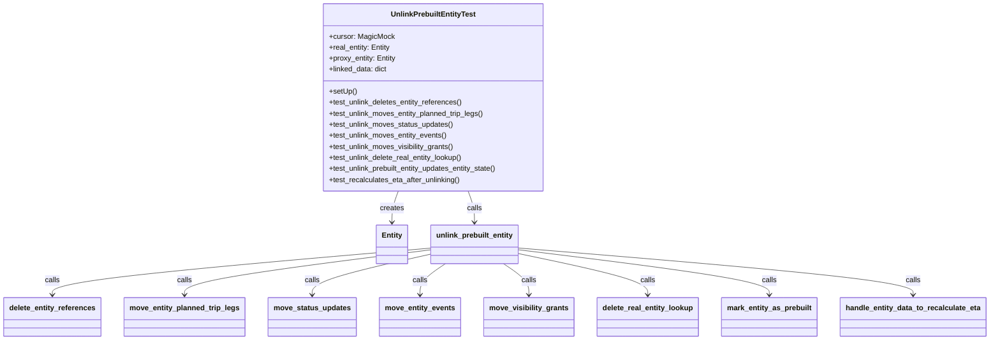
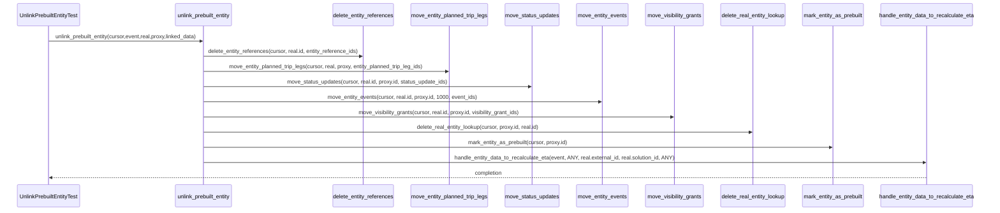

# Diagram: entity_core/entity_service/entity_service_tests/test_process_prebuilt_entity/test_unlink_prebuilt_entity.py

> Auto-generated by Obscura crawlers

## Diagram 1

### SVG

<svg id="container" width="2098.484375" xmlns="http://www.w3.org/2000/svg" class="classDiagram" height="740" viewBox="0 0 2098.484375 740" role="graphics-document document" aria-roledescription="class"><g><defs><marker id="container_class-aggregationStart" class="marker aggregation class" refX="18" refY="7" markerWidth="190" markerHeight="240" orient="auto"><path d="M 18,7 L9,13 L1,7 L9,1 Z"></path></marker></defs><defs><marker id="container_class-aggregationEnd" class="marker aggregation class" refX="1" refY="7" markerWidth="20" markerHeight="28" orient="auto"><path d="M 18,7 L9,13 L1,7 L9,1 Z"></path></marker></defs><defs><marker id="container_class-extensionStart" class="marker extension class" refX="18" refY="7" markerWidth="190" markerHeight="240" orient="auto"><path d="M 1,7 L18,13 V 1 Z"></path></marker></defs><defs><marker id="container_class-extensionEnd" class="marker extension class" refX="1" refY="7" markerWidth="20" markerHeight="28" orient="auto"><path d="M 1,1 V 13 L18,7 Z"></path></marker></defs><defs><marker id="container_class-compositionStart" class="marker composition class" refX="18" refY="7" markerWidth="190" markerHeight="240" orient="auto"><path d="M 18,7 L9,13 L1,7 L9,1 Z"></path></marker></defs><defs><marker id="container_class-compositionEnd" class="marker composition class" refX="1" refY="7" markerWidth="20" markerHeight="28" orient="auto"><path d="M 18,7 L9,13 L1,7 L9,1 Z"></path></marker></defs><defs><marker id="container_class-dependencyStart" class="marker dependency class" refX="6" refY="7" markerWidth="190" markerHeight="240" orient="auto"><path d="M 5,7 L9,13 L1,7 L9,1 Z"></path></marker></defs><defs><marker id="container_class-dependencyEnd" class="marker dependency class" refX="13" refY="7" markerWidth="20" markerHeight="28" orient="auto"><path d="M 18,7 L9,13 L14,7 L9,1 Z"></path></marker></defs><defs><marker id="container_class-lollipopStart" class="marker lollipop class" refX="13" refY="7" markerWidth="190" markerHeight="240" orient="auto"><circle stroke="black" fill="transparent" cx="7" cy="7" r="6"></circle></marker></defs><defs><marker id="container_class-lollipopEnd" class="marker lollipop class" refX="1" refY="7" markerWidth="190" markerHeight="240" orient="auto"><circle stroke="black" fill="transparent" cx="7" cy="7" r="6"></circle></marker></defs><g class="root"><g class="clusters"></g><g class="edgePaths"><path d="M840.029,416L837.763,422.167C835.497,428.333,830.965,440.667,828.699,452C826.434,463.333,826.434,473.667,826.434,478.833L826.434,484" id="id_UnlinkPrebuiltEntityTest_Entity_1" class="edge-thickness-normal edge-pattern-solid relation" style=";;;" data-edge="true" data-et="edge" data-id="id_UnlinkPrebuiltEntityTest_Entity_1" data-points="W3sieCI6ODQwLjAyODUyNjk3MDk1NDMsInkiOjQxNn0seyJ4Ijo4MjYuNDMzNTkzNzUsInkiOjQ1M30seyJ4Ijo4MjYuNDMzNTkzNzUsInkiOjQ5MH1d" marker-end="url(#container_class-dependencyEnd)"></path><path d="M989.94,416L992.206,422.167C994.472,428.333,999.004,440.667,1001.269,452C1003.535,463.333,1003.535,473.667,1003.535,478.833L1003.535,484" id="id_UnlinkPrebuiltEntityTest_unlink_prebuilt_entity_2" class="edge-thickness-normal edge-pattern-solid relation" style=";;;" data-edge="true" data-et="edge" data-id="id_UnlinkPrebuiltEntityTest_unlink_prebuilt_entity_2" data-points="W3sieCI6OTg5Ljk0MDIyMzAyOTA0NTcsInkiOjQxNn0seyJ4IjoxMDAzLjUzNTE1NjI1LCJ5Ijo0NTN9LHsieCI6MTAwMy41MzUxNTYyNSwieSI6NDkwfV0=" marker-end="url(#container_class-dependencyEnd)"></path><path d="M909.715,540.306L776.626,552.088C643.536,563.871,377.358,587.435,244.269,604.384C111.18,621.333,111.18,631.667,111.18,636.833L111.18,642" id="id_unlink_prebuilt_entity_delete_entity_references_3" class="edge-thickness-normal edge-pattern-solid relation" style=";;;" data-edge="true" data-et="edge" data-id="id_unlink_prebuilt_entity_delete_entity_references_3" data-points="W3sieCI6OTA5LjcxNDg0Mzc1LCJ5Ijo1NDAuMzA1ODg4MTIwODg4fSx7IngiOjExMS4xNzk2ODc1LCJ5Ijo2MTF9LHsieCI6MTExLjE3OTY4NzUsInkiOjY0OH1d" marker-end="url(#container_class-dependencyEnd)"></path><path d="M909.715,544.113L823.372,555.261C737.029,566.409,564.342,588.704,477.999,605.019C391.656,621.333,391.656,631.667,391.656,636.833L391.656,642" id="id_unlink_prebuilt_entity_move_entity_planned_trip_legs_4" class="edge-thickness-normal edge-pattern-solid relation" style=";;;" data-edge="true" data-et="edge" data-id="id_unlink_prebuilt_entity_move_entity_planned_trip_legs_4" data-points="W3sieCI6OTA5LjcxNDg0Mzc1LCJ5Ijo1NDQuMTEzMTg4NzU2NDU1OX0seyJ4IjozOTEuNjU2MjUsInkiOjYxMX0seyJ4IjozOTEuNjU2MjUsInkiOjY0OH1d" marker-end="url(#container_class-dependencyEnd)"></path><path d="M909.715,553.647L868.287,563.206C826.859,572.765,744.004,591.882,702.576,606.608C661.148,621.333,661.148,631.667,661.148,636.833L661.148,642" id="id_unlink_prebuilt_entity_move_status_updates_5" class="edge-thickness-normal edge-pattern-solid relation" style=";;;" data-edge="true" data-et="edge" data-id="id_unlink_prebuilt_entity_move_status_updates_5" data-points="W3sieCI6OTA5LjcxNDg0Mzc1LCJ5Ijo1NTMuNjQ3NDY1NTE2NjUxMn0seyJ4Ijo2NjEuMTQ4NDM3NSwieSI6NjExfSx7IngiOjY2MS4xNDg0Mzc1LCJ5Ijo2NDh9XQ==" marker-end="url(#container_class-dependencyEnd)"></path><path d="M942.494,574L933.531,580.167C924.569,586.333,906.644,598.667,897.681,610C888.719,621.333,888.719,631.667,888.719,636.833L888.719,642" id="id_unlink_prebuilt_entity_move_entity_events_6" class="edge-thickness-normal edge-pattern-solid relation" style=";;;" data-edge="true" data-et="edge" data-id="id_unlink_prebuilt_entity_move_entity_events_6" data-points="W3sieCI6OTQyLjQ5MzUyMjU0NzQ2ODQsInkiOjU3NH0seyJ4Ijo4ODguNzE4NzUsInkiOjYxMX0seyJ4Ijo4ODguNzE4NzUsInkiOjY0OH1d" marker-end="url(#container_class-dependencyEnd)"></path><path d="M1064.577,574L1073.539,580.167C1082.502,586.333,1100.427,598.667,1109.389,610C1118.352,621.333,1118.352,631.667,1118.352,636.833L1118.352,642" id="id_unlink_prebuilt_entity_move_visibility_grants_7" class="edge-thickness-normal edge-pattern-solid relation" style=";;;" data-edge="true" data-et="edge" data-id="id_unlink_prebuilt_entity_move_visibility_grants_7" data-points="W3sieCI6MTA2NC41NzY3ODk5NTI1MzE3LCJ5Ijo1NzR9LHsieCI6MTExOC4zNTE1NjI1LCJ5Ijo2MTF9LHsieCI6MTExOC4zNTE1NjI1LCJ5Ijo2NDh9XQ==" marker-end="url(#container_class-dependencyEnd)"></path><path d="M1097.355,552.186L1142.915,561.988C1188.474,571.791,1279.592,591.395,1325.152,606.364C1370.711,621.333,1370.711,631.667,1370.711,636.833L1370.711,642" id="id_unlink_prebuilt_entity_delete_real_entity_lookup_8" class="edge-thickness-normal edge-pattern-solid relation" style=";;;" data-edge="true" data-et="edge" data-id="id_unlink_prebuilt_entity_delete_real_entity_lookup_8" data-points="W3sieCI6MTA5Ny4zNTU0Njg3NSwieSI6NTUyLjE4NTk4NDY1OTA4NDl9LHsieCI6MTM3MC43MTA5Mzc1LCJ5Ijo2MTF9LHsieCI6MTM3MC43MTA5Mzc1LCJ5Ijo2NDh9XQ==" marker-end="url(#container_class-dependencyEnd)"></path><path d="M1097.355,543.825L1186.182,555.021C1275.008,566.217,1452.66,588.608,1541.486,604.971C1630.313,621.333,1630.313,631.667,1630.313,636.833L1630.313,642" id="id_unlink_prebuilt_entity_mark_entity_as_prebuilt_9" class="edge-thickness-normal edge-pattern-solid relation" style=";;;" data-edge="true" data-et="edge" data-id="id_unlink_prebuilt_entity_mark_entity_as_prebuilt_9" data-points="W3sieCI6MTA5Ny4zNTU0Njg3NSwieSI6NTQzLjgyNTI1OTQxODUyODV9LHsieCI6MTYzMC4zMTI1LCJ5Ijo2MTF9LHsieCI6MTYzMC4zMTI1LCJ5Ijo2NDh9XQ==" marker-end="url(#container_class-dependencyEnd)"></path><path d="M1097.355,539.947L1237.154,551.789C1376.953,563.632,1656.551,587.316,1796.35,604.325C1936.148,621.333,1936.148,631.667,1936.148,636.833L1936.148,642" id="id_unlink_prebuilt_entity_handle_entity_data_to_recalculate_eta_10" class="edge-thickness-normal edge-pattern-solid relation" style=";;;" data-edge="true" data-et="edge" data-id="id_unlink_prebuilt_entity_handle_entity_data_to_recalculate_eta_10" data-points="W3sieCI6MTA5Ny4zNTU0Njg3NSwieSI6NTM5Ljk0NzM1MDU2NDgxOTF9LHsieCI6MTkzNi4xNDg0Mzc1LCJ5Ijo2MTF9LHsieCI6MTkzNi4xNDg0Mzc1LCJ5Ijo2NDh9XQ==" marker-end="url(#container_class-dependencyEnd)"></path></g><g class="edgeLabels"><g class="edgeLabel" transform="translate(826.43359375, 453)"><g class="label" data-id="id_UnlinkPrebuiltEntityTest_Entity_1" transform="translate(-26.171875, -12)"><foreignObject width="52.34375" height="24">

creates

</foreignObject></g></g><g class="edgeLabel" transform="translate(1003.53515625, 453)"><g class="label" data-id="id_UnlinkPrebuiltEntityTest_unlink_prebuilt_entity_2" transform="translate(-16.4453125, -12)"><foreignObject width="32.890625" height="24">

calls

</foreignObject></g></g><g class="edgeLabel" transform="translate(111.1796875, 611)"><g class="label" data-id="id_unlink_prebuilt_entity_delete_entity_references_3" transform="translate(-16.4453125, -12)"><foreignObject width="32.890625" height="24">

calls

</foreignObject></g></g><g class="edgeLabel" transform="translate(391.65625, 611)"><g class="label" data-id="id_unlink_prebuilt_entity_move_entity_planned_trip_legs_4" transform="translate(-16.4453125, -12)"><foreignObject width="32.890625" height="24">

calls

</foreignObject></g></g><g class="edgeLabel" transform="translate(661.1484375, 611)"><g class="label" data-id="id_unlink_prebuilt_entity_move_status_updates_5" transform="translate(-16.4453125, -12)"><foreignObject width="32.890625" height="24">

calls

</foreignObject></g></g><g class="edgeLabel" transform="translate(888.71875, 611)"><g class="label" data-id="id_unlink_prebuilt_entity_move_entity_events_6" transform="translate(-16.4453125, -12)"><foreignObject width="32.890625" height="24">

calls

</foreignObject></g></g><g class="edgeLabel" transform="translate(1118.3515625, 611)"><g class="label" data-id="id_unlink_prebuilt_entity_move_visibility_grants_7" transform="translate(-16.4453125, -12)"><foreignObject width="32.890625" height="24">

calls

</foreignObject></g></g><g class="edgeLabel" transform="translate(1370.7109375, 611)"><g class="label" data-id="id_unlink_prebuilt_entity_delete_real_entity_lookup_8" transform="translate(-16.4453125, -12)"><foreignObject width="32.890625" height="24">

calls

</foreignObject></g></g><g class="edgeLabel" transform="translate(1630.3125, 611)"><g class="label" data-id="id_unlink_prebuilt_entity_mark_entity_as_prebuilt_9" transform="translate(-16.4453125, -12)"><foreignObject width="32.890625" height="24">

calls

</foreignObject></g></g><g class="edgeLabel" transform="translate(1936.1484375, 611)"><g class="label" data-id="id_unlink_prebuilt_entity_handle_entity_data_to_recalculate_eta_10" transform="translate(-16.4453125, -12)"><foreignObject width="32.890625" height="24">

calls

</foreignObject></g></g></g><g class="nodes"><g class="node default" id="classId-UnlinkPrebuiltEntityTest-0" transform="translate(914.984375, 212)"><g class="basic label-container"><path d="M-244.12109375 -204 L244.12109375 -204 L244.12109375 204 L-244.12109375 204" stroke="none" stroke-width="0" fill="#ECECFF" style=""></path><path d="M-244.12109375 -204 C-146.1936757056422 -204, -48.26625766128436 -204, 244.12109375 -204 M-244.12109375 -204 C-88.94696116361976 -204, 66.22717142276048 -204, 244.12109375 -204 M244.12109375 -204 C244.12109375 -63.143385932132475, 244.12109375 77.71322813573505, 244.12109375 204 M244.12109375 -204 C244.12109375 -80.52781804984382, 244.12109375 42.94436390031237, 244.12109375 204 M244.12109375 204 C123.36990441638282 204, 2.6187150827656467 204, -244.12109375 204 M244.12109375 204 C79.54002590709635 204, -85.0410419358073 204, -244.12109375 204 M-244.12109375 204 C-244.12109375 80.57583911456462, -244.12109375 -42.84832177087077, -244.12109375 -204 M-244.12109375 204 C-244.12109375 119.44589819290516, -244.12109375 34.89179638581032, -244.12109375 -204" stroke="#9370DB" stroke-width="1.3" fill="none" stroke-dasharray="0 0" style=""></path></g><g class="annotation-group text" transform="translate(0, -180)"></g><g class="label-group text" transform="translate(-89.1171875, -180)"><g class="label" style="font-weight: bolder" transform="translate(0,-12)"><foreignObject width="178.234375" height="24">

UnlinkPrebuiltEntityTest

</foreignObject></g></g><g class="members-group text" transform="translate(-232.12109375, -132)"><g class="label" style="" transform="translate(0,-12)"><foreignObject width="141.0625" height="24">

+cursor: MagicMock

</foreignObject></g><g class="label" style="" transform="translate(0,12)"><foreignObject width="135.203125" height="24">

+real_entity: Entity

</foreignObject></g><g class="label" style="" transform="translate(0,36)"><foreignObject width="147.265625" height="24">

+proxy_entity: Entity

</foreignObject></g><g class="label" style="" transform="translate(0,60)"><foreignObject width="129.125" height="24">

+linked_data: dict

</foreignObject></g></g><g class="methods-group text" transform="translate(-232.12109375, -12)"><g class="label" style="" transform="translate(0,-12)"><foreignObject width="60.421875" height="24">

+setUp()

</foreignObject></g><g class="label" style="" transform="translate(0,12)"><foreignObject width="293.703125" height="24">

+test_unlink_deletes_entity_references()

</foreignObject></g><g class="label" style="" transform="translate(0,36)"><foreignObject width="342.703125" height="24">

+test_unlink_moves_entity_planned_trip_legs()

</foreignObject></g><g class="label" style="" transform="translate(0,60)"><foreignObject width="273.453125" height="24">

+test_unlink_moves_status_updates()

</foreignObject></g><g class="label" style="" transform="translate(0,84)"><foreignObject width="259.515625" height="24">

+test_unlink_moves_entity_events()

</foreignObject></g><g class="label" style="" transform="translate(0,108)"><foreignObject width="276.46875" height="24">

+test_unlink_moves_visibility_grants()

</foreignObject></g><g class="label" style="" transform="translate(0,132)"><foreignObject width="296.421875" height="24">

+test_unlink_delete_real_entity_lookup()

</foreignObject></g><g class="label" style="" transform="translate(0,156)"><foreignObject width="375.125" height="24">

+test_unlink_prebuilt_entity_updates_entity_state()

</foreignObject></g><g class="label" style="" transform="translate(0,180)"><foreignObject width="288.640625" height="24">

+test_recalculates_eta_after_unlinking()

</foreignObject></g></g><g class="divider" style=""><path d="M-244.12109375 -156 C-105.80813595662025 -156, 32.504821836759504 -156, 244.12109375 -156 M-244.12109375 -156 C-113.56171586449037 -156, 16.997662021019266 -156, 244.12109375 -156" stroke="#9370DB" stroke-width="1.3" fill="none" stroke-dasharray="0 0" style=""></path></g><g class="divider" style=""><path d="M-244.12109375 -36 C-57.95821060559223 -36, 128.20467253881554 -36, 244.12109375 -36 M-244.12109375 -36 C-90.39439637498671 -36, 63.332301000026575 -36, 244.12109375 -36" stroke="#9370DB" stroke-width="1.3" fill="none" stroke-dasharray="0 0" style=""></path></g></g><g class="node default" id="classId-Entity-1" transform="translate(826.43359375, 532)"><g class="basic label-container"><path d="M-33.28125 -42 L33.28125 -42 L33.28125 42 L-33.28125 42" stroke="none" stroke-width="0" fill="#ECECFF" style=""></path><path d="M-33.28125 -42 C-10.750371003754804 -42, 11.780507992490392 -42, 33.28125 -42 M-33.28125 -42 C-10.42082878359895 -42, 12.439592432802101 -42, 33.28125 -42 M33.28125 -42 C33.28125 -9.045566893047656, 33.28125 23.908866213904687, 33.28125 42 M33.28125 -42 C33.28125 -16.68051247052445, 33.28125 8.638975058951097, 33.28125 42 M33.28125 42 C10.035473727890516 42, -13.210302544218969 42, -33.28125 42 M33.28125 42 C15.541615786928944 42, -2.198018426142113 42, -33.28125 42 M-33.28125 42 C-33.28125 11.575561783566233, -33.28125 -18.848876432867534, -33.28125 -42 M-33.28125 42 C-33.28125 24.1797913991267, -33.28125 6.359582798253399, -33.28125 -42" stroke="#9370DB" stroke-width="1.3" fill="none" stroke-dasharray="0 0" style=""></path></g><g class="annotation-group text" transform="translate(0, -18)"></g><g class="label-group text" transform="translate(-21.28125, -18)"><g class="label" style="font-weight: bolder" transform="translate(0,-12)"><foreignObject width="42.5625" height="24">

Entity

</foreignObject></g></g><g class="members-group text" transform="translate(-21.28125, 30)"></g><g class="methods-group text" transform="translate(-21.28125, 60)"></g><g class="divider" style=""><path d="M-33.28125 6 C-9.368814885191874 6, 14.543620229616252 6, 33.28125 6 M-33.28125 6 C-14.866163850996141 6, 3.5489222980077173 6, 33.28125 6" stroke="#9370DB" stroke-width="1.3" fill="none" stroke-dasharray="0 0" style=""></path></g><g class="divider" style=""><path d="M-33.28125 24 C-7.369099009662925 24, 18.54305198067415 24, 33.28125 24 M-33.28125 24 C-9.250719109141322 24, 14.779811781717356 24, 33.28125 24" stroke="#9370DB" stroke-width="1.3" fill="none" stroke-dasharray="0 0" style=""></path></g></g><g class="node default" id="classId-unlink_prebuilt_entity-2" transform="translate(1003.53515625, 532)"><g class="basic label-container"><path d="M-93.8203125 -42 L93.8203125 -42 L93.8203125 42 L-93.8203125 42" stroke="none" stroke-width="0" fill="#ECECFF" style=""></path><path d="M-93.8203125 -42 C-42.11877856168158 -42, 9.58275537663684 -42, 93.8203125 -42 M-93.8203125 -42 C-49.13379090536564 -42, -4.447269310731286 -42, 93.8203125 -42 M93.8203125 -42 C93.8203125 -9.7397388951686, 93.8203125 22.5205222096628, 93.8203125 42 M93.8203125 -42 C93.8203125 -23.358073624370604, 93.8203125 -4.716147248741208, 93.8203125 42 M93.8203125 42 C38.19629297869347 42, -17.42772654261306 42, -93.8203125 42 M93.8203125 42 C24.570180384537366 42, -44.67995173092527 42, -93.8203125 42 M-93.8203125 42 C-93.8203125 20.57008506528479, -93.8203125 -0.8598298694304205, -93.8203125 -42 M-93.8203125 42 C-93.8203125 23.35179606158902, -93.8203125 4.703592123178041, -93.8203125 -42" stroke="#9370DB" stroke-width="1.3" fill="none" stroke-dasharray="0 0" style=""></path></g><g class="annotation-group text" transform="translate(0, -18)"></g><g class="label-group text" transform="translate(-81.8203125, -18)"><g class="label" style="font-weight: bolder" transform="translate(0,-12)"><foreignObject width="163.640625" height="24">

unlink_prebuilt_entity

</foreignObject></g></g><g class="members-group text" transform="translate(-81.8203125, 30)"></g><g class="methods-group text" transform="translate(-81.8203125, 60)"></g><g class="divider" style=""><path d="M-93.8203125 6 C-27.76211855677083 6, 38.29607538645834 6, 93.8203125 6 M-93.8203125 6 C-36.30230455420567 6, 21.21570339158866 6, 93.8203125 6" stroke="#9370DB" stroke-width="1.3" fill="none" stroke-dasharray="0 0" style=""></path></g><g class="divider" style=""><path d="M-93.8203125 24 C-33.631103758062515 24, 26.55810498387497 24, 93.8203125 24 M-93.8203125 24 C-56.1924448617154 24, -18.564577223430803 24, 93.8203125 24" stroke="#9370DB" stroke-width="1.3" fill="none" stroke-dasharray="0 0" style=""></path></g></g><g class="node default" id="classId-delete_entity_references-3" transform="translate(111.1796875, 690)"><g class="basic label-container"><path d="M-103.1796875 -42 L103.1796875 -42 L103.1796875 42 L-103.1796875 42" stroke="none" stroke-width="0" fill="#ECECFF" style=""></path><path d="M-103.1796875 -42 C-60.90394068683069 -42, -18.628193873661374 -42, 103.1796875 -42 M-103.1796875 -42 C-42.44749858176355 -42, 18.284690336472906 -42, 103.1796875 -42 M103.1796875 -42 C103.1796875 -19.54281230902663, 103.1796875 2.9143753819467406, 103.1796875 42 M103.1796875 -42 C103.1796875 -13.208029600367805, 103.1796875 15.58394079926439, 103.1796875 42 M103.1796875 42 C33.159925358568316 42, -36.85983678286337 42, -103.1796875 42 M103.1796875 42 C22.828606016890006 42, -57.52247546621999 42, -103.1796875 42 M-103.1796875 42 C-103.1796875 11.676031895093821, -103.1796875 -18.647936209812357, -103.1796875 -42 M-103.1796875 42 C-103.1796875 18.612157825477585, -103.1796875 -4.77568434904483, -103.1796875 -42" stroke="#9370DB" stroke-width="1.3" fill="none" stroke-dasharray="0 0" style=""></path></g><g class="annotation-group text" transform="translate(0, -18)"></g><g class="label-group text" transform="translate(-91.1796875, -18)"><g class="label" style="font-weight: bolder" transform="translate(0,-12)"><foreignObject width="182.359375" height="24">

delete_entity_references

</foreignObject></g></g><g class="members-group text" transform="translate(-91.1796875, 30)"></g><g class="methods-group text" transform="translate(-91.1796875, 60)"></g><g class="divider" style=""><path d="M-103.1796875 6 C-28.096530046400446 6, 46.98662740719911 6, 103.1796875 6 M-103.1796875 6 C-44.982105041717645 6, 13.21547741656471 6, 103.1796875 6" stroke="#9370DB" stroke-width="1.3" fill="none" stroke-dasharray="0 0" style=""></path></g><g class="divider" style=""><path d="M-103.1796875 24 C-41.15807772933522 24, 20.863532041329563 24, 103.1796875 24 M-103.1796875 24 C-47.132576557842384 24, 8.914534384315232 24, 103.1796875 24" stroke="#9370DB" stroke-width="1.3" fill="none" stroke-dasharray="0 0" style=""></path></g></g><g class="node default" id="classId-move_entity_planned_trip_legs-4" transform="translate(391.65625, 690)"><g class="basic label-container"><path d="M-127.296875 -42 L127.296875 -42 L127.296875 42 L-127.296875 42" stroke="none" stroke-width="0" fill="#ECECFF" style=""></path><path d="M-127.296875 -42 C-66.42335515942517 -42, -5.549835318850327 -42, 127.296875 -42 M-127.296875 -42 C-48.73150587810747 -42, 29.83386324378506 -42, 127.296875 -42 M127.296875 -42 C127.296875 -13.158237472369073, 127.296875 15.683525055261853, 127.296875 42 M127.296875 -42 C127.296875 -19.703354614153913, 127.296875 2.5932907716921747, 127.296875 42 M127.296875 42 C26.411735875220714 42, -74.47340324955857 42, -127.296875 42 M127.296875 42 C43.3648893829415 42, -40.567096234117 42, -127.296875 42 M-127.296875 42 C-127.296875 13.407895832711482, -127.296875 -15.184208334577036, -127.296875 -42 M-127.296875 42 C-127.296875 22.773227567002756, -127.296875 3.5464551340055124, -127.296875 -42" stroke="#9370DB" stroke-width="1.3" fill="none" stroke-dasharray="0 0" style=""></path></g><g class="annotation-group text" transform="translate(0, -18)"></g><g class="label-group text" transform="translate(-115.296875, -18)"><g class="label" style="font-weight: bolder" transform="translate(0,-12)"><foreignObject width="230.59375" height="24">

move_entity_planned_trip_legs

</foreignObject></g></g><g class="members-group text" transform="translate(-115.296875, 30)"></g><g class="methods-group text" transform="translate(-115.296875, 60)"></g><g class="divider" style=""><path d="M-127.296875 6 C-70.80736879919263 6, -14.317862598385247 6, 127.296875 6 M-127.296875 6 C-52.51220612094302 6, 22.27246275811396 6, 127.296875 6" stroke="#9370DB" stroke-width="1.3" fill="none" stroke-dasharray="0 0" style=""></path></g><g class="divider" style=""><path d="M-127.296875 24 C-47.13964251351118 24, 33.017589972977646 24, 127.296875 24 M-127.296875 24 C-34.558822537175885 24, 58.17922992564823 24, 127.296875 24" stroke="#9370DB" stroke-width="1.3" fill="none" stroke-dasharray="0 0" style=""></path></g></g><g class="node default" id="classId-move_status_updates-5" transform="translate(661.1484375, 690)"><g class="basic label-container"><path d="M-92.1953125 -42 L92.1953125 -42 L92.1953125 42 L-92.1953125 42" stroke="none" stroke-width="0" fill="#ECECFF" style=""></path><path d="M-92.1953125 -42 C-22.527386647094275 -42, 47.14053920581145 -42, 92.1953125 -42 M-92.1953125 -42 C-25.216102825200608 -42, 41.763106849598785 -42, 92.1953125 -42 M92.1953125 -42 C92.1953125 -24.89349543940289, 92.1953125 -7.786990878805781, 92.1953125 42 M92.1953125 -42 C92.1953125 -21.637273298733028, 92.1953125 -1.2745465974660561, 92.1953125 42 M92.1953125 42 C19.657917359551874 42, -52.87947778089625 42, -92.1953125 42 M92.1953125 42 C50.32852142665897 42, 8.461730353317947 42, -92.1953125 42 M-92.1953125 42 C-92.1953125 12.72853482393166, -92.1953125 -16.54293035213668, -92.1953125 -42 M-92.1953125 42 C-92.1953125 22.392787939886137, -92.1953125 2.7855758797722743, -92.1953125 -42" stroke="#9370DB" stroke-width="1.3" fill="none" stroke-dasharray="0 0" style=""></path></g><g class="annotation-group text" transform="translate(0, -18)"></g><g class="label-group text" transform="translate(-80.1953125, -18)"><g class="label" style="font-weight: bolder" transform="translate(0,-12)"><foreignObject width="160.390625" height="24">

move_status_updates

</foreignObject></g></g><g class="members-group text" transform="translate(-80.1953125, 30)"></g><g class="methods-group text" transform="translate(-80.1953125, 60)"></g><g class="divider" style=""><path d="M-92.1953125 6 C-45.81548766961319 6, 0.5643371607736185 6, 92.1953125 6 M-92.1953125 6 C-41.96376820540174 6, 8.267776089196516 6, 92.1953125 6" stroke="#9370DB" stroke-width="1.3" fill="none" stroke-dasharray="0 0" style=""></path></g><g class="divider" style=""><path d="M-92.1953125 24 C-46.453714783247875 24, -0.7121170664957504 24, 92.1953125 24 M-92.1953125 24 C-52.61731438972842 24, -13.039316279456841 24, 92.1953125 24" stroke="#9370DB" stroke-width="1.3" fill="none" stroke-dasharray="0 0" style=""></path></g></g><g class="node default" id="classId-move_entity_events-6" transform="translate(888.71875, 690)"><g class="basic label-container"><path d="M-85.375 -42 L85.375 -42 L85.375 42 L-85.375 42" stroke="none" stroke-width="0" fill="#ECECFF" style=""></path><path d="M-85.375 -42 C-38.271814301754695 -42, 8.83137139649061 -42, 85.375 -42 M-85.375 -42 C-43.1220105422243 -42, -0.8690210844486046 -42, 85.375 -42 M85.375 -42 C85.375 -20.34820645096018, 85.375 1.303587098079639, 85.375 42 M85.375 -42 C85.375 -19.549955417024464, 85.375 2.900089165951073, 85.375 42 M85.375 42 C47.67329080987619 42, 9.971581619752385 42, -85.375 42 M85.375 42 C30.2378835340889 42, -24.899232931822198 42, -85.375 42 M-85.375 42 C-85.375 11.491239856166146, -85.375 -19.017520287667708, -85.375 -42 M-85.375 42 C-85.375 19.638054141331946, -85.375 -2.723891717336109, -85.375 -42" stroke="#9370DB" stroke-width="1.3" fill="none" stroke-dasharray="0 0" style=""></path></g><g class="annotation-group text" transform="translate(0, -18)"></g><g class="label-group text" transform="translate(-73.375, -18)"><g class="label" style="font-weight: bolder" transform="translate(0,-12)"><foreignObject width="146.75" height="24">

move_entity_events

</foreignObject></g></g><g class="members-group text" transform="translate(-73.375, 30)"></g><g class="methods-group text" transform="translate(-73.375, 60)"></g><g class="divider" style=""><path d="M-85.375 6 C-23.1295211855483 6, 39.1159576289034 6, 85.375 6 M-85.375 6 C-20.949556317673498 6, 43.475887364653005 6, 85.375 6" stroke="#9370DB" stroke-width="1.3" fill="none" stroke-dasharray="0 0" style=""></path></g><g class="divider" style=""><path d="M-85.375 24 C-43.009329008407356 24, -0.6436580168147117 24, 85.375 24 M-85.375 24 C-33.34452020953674 24, 18.68595958092652 24, 85.375 24" stroke="#9370DB" stroke-width="1.3" fill="none" stroke-dasharray="0 0" style=""></path></g></g><g class="node default" id="classId-move_visibility_grants-7" transform="translate(1118.3515625, 690)"><g class="basic label-container"><path d="M-94.2578125 -42 L94.2578125 -42 L94.2578125 42 L-94.2578125 42" stroke="none" stroke-width="0" fill="#ECECFF" style=""></path><path d="M-94.2578125 -42 C-23.51879220384083 -42, 47.22022809231834 -42, 94.2578125 -42 M-94.2578125 -42 C-42.89368606419061 -42, 8.470440371618778 -42, 94.2578125 -42 M94.2578125 -42 C94.2578125 -12.145181523119877, 94.2578125 17.709636953760246, 94.2578125 42 M94.2578125 -42 C94.2578125 -14.100680942412929, 94.2578125 13.798638115174143, 94.2578125 42 M94.2578125 42 C23.516215463403896 42, -47.22538157319221 42, -94.2578125 42 M94.2578125 42 C38.600799482699294 42, -17.05621353460141 42, -94.2578125 42 M-94.2578125 42 C-94.2578125 16.82637549311056, -94.2578125 -8.347249013778878, -94.2578125 -42 M-94.2578125 42 C-94.2578125 17.621339088532196, -94.2578125 -6.757321822935609, -94.2578125 -42" stroke="#9370DB" stroke-width="1.3" fill="none" stroke-dasharray="0 0" style=""></path></g><g class="annotation-group text" transform="translate(0, -18)"></g><g class="label-group text" transform="translate(-82.2578125, -18)"><g class="label" style="font-weight: bolder" transform="translate(0,-12)"><foreignObject width="164.515625" height="24">

move_visibility_grants

</foreignObject></g></g><g class="members-group text" transform="translate(-82.2578125, 30)"></g><g class="methods-group text" transform="translate(-82.2578125, 60)"></g><g class="divider" style=""><path d="M-94.2578125 6 C-56.17396302906303 6, -18.090113558126063 6, 94.2578125 6 M-94.2578125 6 C-19.39590829311682 6, 55.46599591376636 6, 94.2578125 6" stroke="#9370DB" stroke-width="1.3" fill="none" stroke-dasharray="0 0" style=""></path></g><g class="divider" style=""><path d="M-94.2578125 24 C-41.275215613697746 24, 11.707381272604508 24, 94.2578125 24 M-94.2578125 24 C-53.91491657364457 24, -13.572020647289136 24, 94.2578125 24" stroke="#9370DB" stroke-width="1.3" fill="none" stroke-dasharray="0 0" style=""></path></g></g><g class="node default" id="classId-delete_real_entity_lookup-8" transform="translate(1370.7109375, 690)"><g class="basic label-container"><path d="M-108.1015625 -42 L108.1015625 -42 L108.1015625 42 L-108.1015625 42" stroke="none" stroke-width="0" fill="#ECECFF" style=""></path><path d="M-108.1015625 -42 C-33.36010918357971 -42, 41.38134413284058 -42, 108.1015625 -42 M-108.1015625 -42 C-57.89080778673083 -42, -7.680053073461664 -42, 108.1015625 -42 M108.1015625 -42 C108.1015625 -22.68366899556396, 108.1015625 -3.3673379911279184, 108.1015625 42 M108.1015625 -42 C108.1015625 -22.08497333050818, 108.1015625 -2.169946661016361, 108.1015625 42 M108.1015625 42 C52.28715437661775 42, -3.527253746764501 42, -108.1015625 42 M108.1015625 42 C59.729044506681184 42, 11.356526513362368 42, -108.1015625 42 M-108.1015625 42 C-108.1015625 13.798807903842942, -108.1015625 -14.402384192314116, -108.1015625 -42 M-108.1015625 42 C-108.1015625 21.978562322152, -108.1015625 1.9571246443040025, -108.1015625 -42" stroke="#9370DB" stroke-width="1.3" fill="none" stroke-dasharray="0 0" style=""></path></g><g class="annotation-group text" transform="translate(0, -18)"></g><g class="label-group text" transform="translate(-96.1015625, -18)"><g class="label" style="font-weight: bolder" transform="translate(0,-12)"><foreignObject width="192.203125" height="24">

delete_real_entity_lookup

</foreignObject></g></g><g class="members-group text" transform="translate(-96.1015625, 30)"></g><g class="methods-group text" transform="translate(-96.1015625, 60)"></g><g class="divider" style=""><path d="M-108.1015625 6 C-32.023419674090306 6, 44.05472315181939 6, 108.1015625 6 M-108.1015625 6 C-25.10741420685207 6, 57.88673408629586 6, 108.1015625 6" stroke="#9370DB" stroke-width="1.3" fill="none" stroke-dasharray="0 0" style=""></path></g><g class="divider" style=""><path d="M-108.1015625 24 C-60.04435379156443 24, -11.987145083128866 24, 108.1015625 24 M-108.1015625 24 C-29.194395729053298 24, 49.712771041893404 24, 108.1015625 24" stroke="#9370DB" stroke-width="1.3" fill="none" stroke-dasharray="0 0" style=""></path></g></g><g class="node default" id="classId-mark_entity_as_prebuilt-9" transform="translate(1630.3125, 690)"><g class="basic label-container"><path d="M-101.5 -42 L101.5 -42 L101.5 42 L-101.5 42" stroke="none" stroke-width="0" fill="#ECECFF" style=""></path><path d="M-101.5 -42 C-48.87609924289668 -42, 3.7478015142066425 -42, 101.5 -42 M-101.5 -42 C-24.72933347875751 -42, 52.04133304248498 -42, 101.5 -42 M101.5 -42 C101.5 -18.153153546350516, 101.5 5.693692907298967, 101.5 42 M101.5 -42 C101.5 -9.154665503280306, 101.5 23.690668993439388, 101.5 42 M101.5 42 C26.907399864657933 42, -47.685200270684135 42, -101.5 42 M101.5 42 C42.8196742177277 42, -15.860651564544597 42, -101.5 42 M-101.5 42 C-101.5 13.784078637095217, -101.5 -14.431842725809567, -101.5 -42 M-101.5 42 C-101.5 11.99836183192022, -101.5 -18.00327633615956, -101.5 -42" stroke="#9370DB" stroke-width="1.3" fill="none" stroke-dasharray="0 0" style=""></path></g><g class="annotation-group text" transform="translate(0, -18)"></g><g class="label-group text" transform="translate(-89.5, -18)"><g class="label" style="font-weight: bolder" transform="translate(0,-12)"><foreignObject width="179" height="24">

mark_entity_as_prebuilt

</foreignObject></g></g><g class="members-group text" transform="translate(-89.5, 30)"></g><g class="methods-group text" transform="translate(-89.5, 60)"></g><g class="divider" style=""><path d="M-101.5 6 C-33.360433678861526 6, 34.77913264227695 6, 101.5 6 M-101.5 6 C-36.736085842038236 6, 28.02782831592353 6, 101.5 6" stroke="#9370DB" stroke-width="1.3" fill="none" stroke-dasharray="0 0" style=""></path></g><g class="divider" style=""><path d="M-101.5 24 C-24.337052728003783 24, 52.82589454399243 24, 101.5 24 M-101.5 24 C-60.036893761335854 24, -18.573787522671708 24, 101.5 24" stroke="#9370DB" stroke-width="1.3" fill="none" stroke-dasharray="0 0" style=""></path></g></g><g class="node default" id="classId-handle_entity_data_to_recalculate_eta-10" transform="translate(1936.1484375, 690)"><g class="basic label-container"><path d="M-154.3359375 -42 L154.3359375 -42 L154.3359375 42 L-154.3359375 42" stroke="none" stroke-width="0" fill="#ECECFF" style=""></path><path d="M-154.3359375 -42 C-57.82363876864159 -42, 38.68865996271683 -42, 154.3359375 -42 M-154.3359375 -42 C-66.3066992044704 -42, 21.72253909105919 -42, 154.3359375 -42 M154.3359375 -42 C154.3359375 -24.17758874126574, 154.3359375 -6.355177482531481, 154.3359375 42 M154.3359375 -42 C154.3359375 -21.89704408567014, 154.3359375 -1.7940881713402774, 154.3359375 42 M154.3359375 42 C37.579821476679285 42, -79.17629454664143 42, -154.3359375 42 M154.3359375 42 C88.192091763048 42, 22.048246026095995 42, -154.3359375 42 M-154.3359375 42 C-154.3359375 14.358433641077958, -154.3359375 -13.283132717844083, -154.3359375 -42 M-154.3359375 42 C-154.3359375 23.999323340427914, -154.3359375 5.998646680855828, -154.3359375 -42" stroke="#9370DB" stroke-width="1.3" fill="none" stroke-dasharray="0 0" style=""></path></g><g class="annotation-group text" transform="translate(0, -18)"></g><g class="label-group text" transform="translate(-142.3359375, -18)"><g class="label" style="font-weight: bolder" transform="translate(0,-12)"><foreignObject width="284.671875" height="24">

handle_entity_data_to_recalculate_eta

</foreignObject></g></g><g class="members-group text" transform="translate(-142.3359375, 30)"></g><g class="methods-group text" transform="translate(-142.3359375, 60)"></g><g class="divider" style=""><path d="M-154.3359375 6 C-72.13562351602006 6, 10.064690467959878 6, 154.3359375 6 M-154.3359375 6 C-39.844125142114976 6, 74.64768721577005 6, 154.3359375 6" stroke="#9370DB" stroke-width="1.3" fill="none" stroke-dasharray="0 0" style=""></path></g><g class="divider" style=""><path d="M-154.3359375 24 C-46.6052138570533 24, 61.1255097858934 24, 154.3359375 24 M-154.3359375 24 C-62.074021178143994 24, 30.187895143712012 24, 154.3359375 24" stroke="#9370DB" stroke-width="1.3" fill="none" stroke-dasharray="0 0" style=""></path></g></g></g></g></g></svg>

## Diagram 2

### SVG

<svg id="container" width="3131" xmlns="http://www.w3.org/2000/svg" height="651" viewBox="-50 -10 3131 651" role="graphics-document document" aria-roledescription="sequence"><g><rect x="2730" y="565" fill="#eaeaea" stroke="#666" width="301" height="65" name="Recalc" rx="3" ry="3" class="actor actor-bottom"></rect><text x="2880.5" y="597.5" dominant-baseline="central" alignment-baseline="central" class="actor actor-box" style="text-anchor: middle; font-size: 16px; font-weight: 400;"><tspan x="2880.5" dy="0">handle_entity_data_to_recalculate_eta</tspan></text></g><g><rect x="2484" y="565" fill="#eaeaea" stroke="#666" width="196" height="65" name="MarkPre" rx="3" ry="3" class="actor actor-bottom"></rect><text x="2582" y="597.5" dominant-baseline="central" alignment-baseline="central" class="actor actor-box" style="text-anchor: middle; font-size: 16px; font-weight: 400;"><tspan x="2582" dy="0">mark_entity_as_prebuilt</tspan></text></g><g><rect x="2225" y="565" fill="#eaeaea" stroke="#666" width="209" height="65" name="DeleteLookup" rx="3" ry="3" class="actor actor-bottom"></rect><text x="2329.5" y="597.5" dominant-baseline="central" alignment-baseline="central" class="actor actor-box" style="text-anchor: middle; font-size: 16px; font-weight: 400;"><tspan x="2329.5" dy="0">delete_real_entity_lookup</tspan></text></g><g><rect x="1994" y="565" fill="#eaeaea" stroke="#666" width="181" height="65" name="MoveVis" rx="3" ry="3" class="actor actor-bottom"></rect><text x="2084.5" y="597.5" dominant-baseline="central" alignment-baseline="central" class="actor actor-box" style="text-anchor: middle; font-size: 16px; font-weight: 400;"><tspan x="2084.5" dy="0">move_visibility_grants</tspan></text></g><g><rect x="1780" y="565" fill="#eaeaea" stroke="#666" width="164" height="65" name="MoveEvents" rx="3" ry="3" class="actor actor-bottom"></rect><text x="1862" y="597.5" dominant-baseline="central" alignment-baseline="central" class="actor actor-box" style="text-anchor: middle; font-size: 16px; font-weight: 400;"><tspan x="1862" dy="0">move_entity_events</tspan></text></g><g><rect x="1552" y="565" fill="#eaeaea" stroke="#666" width="178" height="65" name="MoveStatus" rx="3" ry="3" class="actor actor-bottom"></rect><text x="1641" y="597.5" dominant-baseline="central" alignment-baseline="central" class="actor actor-box" style="text-anchor: middle; font-size: 16px; font-weight: 400;"><tspan x="1641" dy="0">move_status_updates</tspan></text></g><g><rect x="1254" y="565" fill="#eaeaea" stroke="#666" width="248" height="65" name="MoveLegs" rx="3" ry="3" class="actor actor-bottom"></rect><text x="1378" y="597.5" dominant-baseline="central" alignment-baseline="central" class="actor actor-box" style="text-anchor: middle; font-size: 16px; font-weight: 400;"><tspan x="1378" dy="0">move_entity_planned_trip_legs</tspan></text></g><g><rect x="1005" y="565" fill="#eaeaea" stroke="#666" width="199" height="65" name="DeleteRefs" rx="3" ry="3" class="actor actor-bottom"></rect><text x="1104.5" y="597.5" dominant-baseline="central" alignment-baseline="central" class="actor actor-box" style="text-anchor: middle; font-size: 16px; font-weight: 400;"><tspan x="1104.5" dy="0">delete_entity_references</tspan></text></g><g><rect x="500.5" y="565" fill="#eaeaea" stroke="#666" width="182" height="65" name="Unlink" rx="3" ry="3" class="actor actor-bottom"></rect><text x="591.5" y="597.5" dominant-baseline="central" alignment-baseline="central" class="actor actor-box" style="text-anchor: middle; font-size: 16px; font-weight: 400;"><tspan x="591.5" dy="0">unlink_prebuilt_entity</tspan></text></g><g><rect x="0" y="565" fill="#eaeaea" stroke="#666" width="195" height="65" name="Test" rx="3" ry="3" class="actor actor-bottom"></rect><text x="97.5" y="597.5" dominant-baseline="central" alignment-baseline="central" class="actor actor-box" style="text-anchor: middle; font-size: 16px; font-weight: 400;"><tspan x="97.5" dy="0">UnlinkPrebuiltEntityTest</tspan></text></g><g><line id="actor9" x1="2880.5" y1="65" x2="2880.5" y2="565" class="actor-line 200" stroke-width="0.5px" stroke="#999" name="Recalc"></line><g id="root-9"><rect x="2730" y="0" fill="#eaeaea" stroke="#666" width="301" height="65" name="Recalc" rx="3" ry="3" class="actor actor-top"></rect><text x="2880.5" y="32.5" dominant-baseline="central" alignment-baseline="central" class="actor actor-box" style="text-anchor: middle; font-size: 16px; font-weight: 400;"><tspan x="2880.5" dy="0">handle_entity_data_to_recalculate_eta</tspan></text></g></g><g><line id="actor8" x1="2582" y1="65" x2="2582" y2="565" class="actor-line 200" stroke-width="0.5px" stroke="#999" name="MarkPre"></line><g id="root-8"><rect x="2484" y="0" fill="#eaeaea" stroke="#666" width="196" height="65" name="MarkPre" rx="3" ry="3" class="actor actor-top"></rect><text x="2582" y="32.5" dominant-baseline="central" alignment-baseline="central" class="actor actor-box" style="text-anchor: middle; font-size: 16px; font-weight: 400;"><tspan x="2582" dy="0">mark_entity_as_prebuilt</tspan></text></g></g><g><line id="actor7" x1="2329.5" y1="65" x2="2329.5" y2="565" class="actor-line 200" stroke-width="0.5px" stroke="#999" name="DeleteLookup"></line><g id="root-7"><rect x="2225" y="0" fill="#eaeaea" stroke="#666" width="209" height="65" name="DeleteLookup" rx="3" ry="3" class="actor actor-top"></rect><text x="2329.5" y="32.5" dominant-baseline="central" alignment-baseline="central" class="actor actor-box" style="text-anchor: middle; font-size: 16px; font-weight: 400;"><tspan x="2329.5" dy="0">delete_real_entity_lookup</tspan></text></g></g><g><line id="actor6" x1="2084.5" y1="65" x2="2084.5" y2="565" class="actor-line 200" stroke-width="0.5px" stroke="#999" name="MoveVis"></line><g id="root-6"><rect x="1994" y="0" fill="#eaeaea" stroke="#666" width="181" height="65" name="MoveVis" rx="3" ry="3" class="actor actor-top"></rect><text x="2084.5" y="32.5" dominant-baseline="central" alignment-baseline="central" class="actor actor-box" style="text-anchor: middle; font-size: 16px; font-weight: 400;"><tspan x="2084.5" dy="0">move_visibility_grants</tspan></text></g></g><g><line id="actor5" x1="1862" y1="65" x2="1862" y2="565" class="actor-line 200" stroke-width="0.5px" stroke="#999" name="MoveEvents"></line><g id="root-5"><rect x="1780" y="0" fill="#eaeaea" stroke="#666" width="164" height="65" name="MoveEvents" rx="3" ry="3" class="actor actor-top"></rect><text x="1862" y="32.5" dominant-baseline="central" alignment-baseline="central" class="actor actor-box" style="text-anchor: middle; font-size: 16px; font-weight: 400;"><tspan x="1862" dy="0">move_entity_events</tspan></text></g></g><g><line id="actor4" x1="1641" y1="65" x2="1641" y2="565" class="actor-line 200" stroke-width="0.5px" stroke="#999" name="MoveStatus"></line><g id="root-4"><rect x="1552" y="0" fill="#eaeaea" stroke="#666" width="178" height="65" name="MoveStatus" rx="3" ry="3" class="actor actor-top"></rect><text x="1641" y="32.5" dominant-baseline="central" alignment-baseline="central" class="actor actor-box" style="text-anchor: middle; font-size: 16px; font-weight: 400;"><tspan x="1641" dy="0">move_status_updates</tspan></text></g></g><g><line id="actor3" x1="1378" y1="65" x2="1378" y2="565" class="actor-line 200" stroke-width="0.5px" stroke="#999" name="MoveLegs"></line><g id="root-3"><rect x="1254" y="0" fill="#eaeaea" stroke="#666" width="248" height="65" name="MoveLegs" rx="3" ry="3" class="actor actor-top"></rect><text x="1378" y="32.5" dominant-baseline="central" alignment-baseline="central" class="actor actor-box" style="text-anchor: middle; font-size: 16px; font-weight: 400;"><tspan x="1378" dy="0">move_entity_planned_trip_legs</tspan></text></g></g><g><line id="actor2" x1="1104.5" y1="65" x2="1104.5" y2="565" class="actor-line 200" stroke-width="0.5px" stroke="#999" name="DeleteRefs"></line><g id="root-2"><rect x="1005" y="0" fill="#eaeaea" stroke="#666" width="199" height="65" name="DeleteRefs" rx="3" ry="3" class="actor actor-top"></rect><text x="1104.5" y="32.5" dominant-baseline="central" alignment-baseline="central" class="actor actor-box" style="text-anchor: middle; font-size: 16px; font-weight: 400;"><tspan x="1104.5" dy="0">delete_entity_references</tspan></text></g></g><g><line id="actor1" x1="591.5" y1="65" x2="591.5" y2="565" class="actor-line 200" stroke-width="0.5px" stroke="#999" name="Unlink"></line><g id="root-1"><rect x="500.5" y="0" fill="#eaeaea" stroke="#666" width="182" height="65" name="Unlink" rx="3" ry="3" class="actor actor-top"></rect><text x="591.5" y="32.5" dominant-baseline="central" alignment-baseline="central" class="actor actor-box" style="text-anchor: middle; font-size: 16px; font-weight: 400;"><tspan x="591.5" dy="0">unlink_prebuilt_entity</tspan></text></g></g><g><line id="actor0" x1="97.5" y1="65" x2="97.5" y2="565" class="actor-line 200" stroke-width="0.5px" stroke="#999" name="Test"></line><g id="root-0"><rect x="0" y="0" fill="#eaeaea" stroke="#666" width="195" height="65" name="Test" rx="3" ry="3" class="actor actor-top"></rect><text x="97.5" y="32.5" dominant-baseline="central" alignment-baseline="central" class="actor actor-box" style="text-anchor: middle; font-size: 16px; font-weight: 400;"><tspan x="97.5" dy="0">UnlinkPrebuiltEntityTest</tspan></text></g></g><g></g><defs><symbol id="computer" width="24" height="24"><path transform="scale(.5)" d="M2 2v13h20v-13h-20zm18 11h-16v-9h16v9zm-10.228 6l.466-1h3.524l.467 1h-4.457zm14.228 3h-24l2-6h2.104l-1.33 4h18.45l-1.297-4h2.073l2 6zm-5-10h-14v-7h14v7z"></path></symbol></defs><defs><symbol id="database" fill-rule="evenodd" clip-rule="evenodd"><path transform="scale(.5)" d="M12.258.001l.256.004.255.005.253.008.251.01.249.012.247.015.246.016.242.019.241.02.239.023.236.024.233.027.231.028.229.031.225.032.223.034.22.036.217.038.214.04.211.041.208.043.205.045.201.046.198.048.194.05.191.051.187.053.183.054.18.056.175.057.172.059.168.06.163.061.16.063.155.064.15.066.074.033.073.033.071.034.07.034.069.035.068.035.067.035.066.035.064.036.064.036.062.036.06.036.06.037.058.037.058.037.055.038.055.038.053.038.052.038.051.039.05.039.048.039.047.039.045.04.044.04.043.04.041.04.04.041.039.041.037.041.036.041.034.041.033.042.032.042.03.042.029.042.027.042.026.043.024.043.023.043.021.043.02.043.018.044.017.043.015.044.013.044.012.044.011.045.009.044.007.045.006.045.004.045.002.045.001.045v17l-.001.045-.002.045-.004.045-.006.045-.007.045-.009.044-.011.045-.012.044-.013.044-.015.044-.017.043-.018.044-.02.043-.021.043-.023.043-.024.043-.026.043-.027.042-.029.042-.03.042-.032.042-.033.042-.034.041-.036.041-.037.041-.039.041-.04.041-.041.04-.043.04-.044.04-.045.04-.047.039-.048.039-.05.039-.051.039-.052.038-.053.038-.055.038-.055.038-.058.037-.058.037-.06.037-.06.036-.062.036-.064.036-.064.036-.066.035-.067.035-.068.035-.069.035-.07.034-.071.034-.073.033-.074.033-.15.066-.155.064-.16.063-.163.061-.168.06-.172.059-.175.057-.18.056-.183.054-.187.053-.191.051-.194.05-.198.048-.201.046-.205.045-.208.043-.211.041-.214.04-.217.038-.22.036-.223.034-.225.032-.229.031-.231.028-.233.027-.236.024-.239.023-.241.02-.242.019-.246.016-.247.015-.249.012-.251.01-.253.008-.255.005-.256.004-.258.001-.258-.001-.256-.004-.255-.005-.253-.008-.251-.01-.249-.012-.247-.015-.245-.016-.243-.019-.241-.02-.238-.023-.236-.024-.234-.027-.231-.028-.228-.031-.226-.032-.223-.034-.22-.036-.217-.038-.214-.04-.211-.041-.208-.043-.204-.045-.201-.046-.198-.048-.195-.05-.19-.051-.187-.053-.184-.054-.179-.056-.176-.057-.172-.059-.167-.06-.164-.061-.159-.063-.155-.064-.151-.066-.074-.033-.072-.033-.072-.034-.07-.034-.069-.035-.068-.035-.067-.035-.066-.035-.064-.036-.063-.036-.062-.036-.061-.036-.06-.037-.058-.037-.057-.037-.056-.038-.055-.038-.053-.038-.052-.038-.051-.039-.049-.039-.049-.039-.046-.039-.046-.04-.044-.04-.043-.04-.041-.04-.04-.041-.039-.041-.037-.041-.036-.041-.034-.041-.033-.042-.032-.042-.03-.042-.029-.042-.027-.042-.026-.043-.024-.043-.023-.043-.021-.043-.02-.043-.018-.044-.017-.043-.015-.044-.013-.044-.012-.044-.011-.045-.009-.044-.007-.045-.006-.045-.004-.045-.002-.045-.001-.045v-17l.001-.045.002-.045.004-.045.006-.045.007-.045.009-.044.011-.045.012-.044.013-.044.015-.044.017-.043.018-.044.02-.043.021-.043.023-.043.024-.043.026-.043.027-.042.029-.042.03-.042.032-.042.033-.042.034-.041.036-.041.037-.041.039-.041.04-.041.041-.04.043-.04.044-.04.046-.04.046-.039.049-.039.049-.039.051-.039.052-.038.053-.038.055-.038.056-.038.057-.037.058-.037.06-.037.061-.036.062-.036.063-.036.064-.036.066-.035.067-.035.068-.035.069-.035.07-.034.072-.034.072-.033.074-.033.151-.066.155-.064.159-.063.164-.061.167-.06.172-.059.176-.057.179-.056.184-.054.187-.053.19-.051.195-.05.198-.048.201-.046.204-.045.208-.043.211-.041.214-.04.217-.038.22-.036.223-.034.226-.032.228-.031.231-.028.234-.027.236-.024.238-.023.241-.02.243-.019.245-.016.247-.015.249-.012.251-.01.253-.008.255-.005.256-.004.258-.001.258.001zm-9.258 20.499v.01l.001.021.003.021.004.022.005.021.006.022.007.022.009.023.01.022.011.023.012.023.013.023.015.023.016.024.017.023.018.024.019.024.021.024.022.025.023.024.024.025.052.049.056.05.061.051.066.051.07.051.075.051.079.052.084.052.088.052.092.052.097.052.102.051.105.052.11.052.114.051.119.051.123.051.127.05.131.05.135.05.139.048.144.049.147.047.152.047.155.047.16.045.163.045.167.043.171.043.176.041.178.041.183.039.187.039.19.037.194.035.197.035.202.033.204.031.209.03.212.029.216.027.219.025.222.024.226.021.23.02.233.018.236.016.24.015.243.012.246.01.249.008.253.005.256.004.259.001.26-.001.257-.004.254-.005.25-.008.247-.011.244-.012.241-.014.237-.016.233-.018.231-.021.226-.021.224-.024.22-.026.216-.027.212-.028.21-.031.205-.031.202-.034.198-.034.194-.036.191-.037.187-.039.183-.04.179-.04.175-.042.172-.043.168-.044.163-.045.16-.046.155-.046.152-.047.148-.048.143-.049.139-.049.136-.05.131-.05.126-.05.123-.051.118-.052.114-.051.11-.052.106-.052.101-.052.096-.052.092-.052.088-.053.083-.051.079-.052.074-.052.07-.051.065-.051.06-.051.056-.05.051-.05.023-.024.023-.025.021-.024.02-.024.019-.024.018-.024.017-.024.015-.023.014-.024.013-.023.012-.023.01-.023.01-.022.008-.022.006-.022.006-.022.004-.022.004-.021.001-.021.001-.021v-4.127l-.077.055-.08.053-.083.054-.085.053-.087.052-.09.052-.093.051-.095.05-.097.05-.1.049-.102.049-.105.048-.106.047-.109.047-.111.046-.114.045-.115.045-.118.044-.12.043-.122.042-.124.042-.126.041-.128.04-.13.04-.132.038-.134.038-.135.037-.138.037-.139.035-.142.035-.143.034-.144.033-.147.032-.148.031-.15.03-.151.03-.153.029-.154.027-.156.027-.158.026-.159.025-.161.024-.162.023-.163.022-.165.021-.166.02-.167.019-.169.018-.169.017-.171.016-.173.015-.173.014-.175.013-.175.012-.177.011-.178.01-.179.008-.179.008-.181.006-.182.005-.182.004-.184.003-.184.002h-.37l-.184-.002-.184-.003-.182-.004-.182-.005-.181-.006-.179-.008-.179-.008-.178-.01-.176-.011-.176-.012-.175-.013-.173-.014-.172-.015-.171-.016-.17-.017-.169-.018-.167-.019-.166-.02-.165-.021-.163-.022-.162-.023-.161-.024-.159-.025-.157-.026-.156-.027-.155-.027-.153-.029-.151-.03-.15-.03-.148-.031-.146-.032-.145-.033-.143-.034-.141-.035-.14-.035-.137-.037-.136-.037-.134-.038-.132-.038-.13-.04-.128-.04-.126-.041-.124-.042-.122-.042-.12-.044-.117-.043-.116-.045-.113-.045-.112-.046-.109-.047-.106-.047-.105-.048-.102-.049-.1-.049-.097-.05-.095-.05-.093-.052-.09-.051-.087-.052-.085-.053-.083-.054-.08-.054-.077-.054v4.127zm0-5.654v.011l.001.021.003.021.004.021.005.022.006.022.007.022.009.022.01.022.011.023.012.023.013.023.015.024.016.023.017.024.018.024.019.024.021.024.022.024.023.025.024.024.052.05.056.05.061.05.066.051.07.051.075.052.079.051.084.052.088.052.092.052.097.052.102.052.105.052.11.051.114.051.119.052.123.05.127.051.131.05.135.049.139.049.144.048.147.048.152.047.155.046.16.045.163.045.167.044.171.042.176.042.178.04.183.04.187.038.19.037.194.036.197.034.202.033.204.032.209.03.212.028.216.027.219.025.222.024.226.022.23.02.233.018.236.016.24.014.243.012.246.01.249.008.253.006.256.003.259.001.26-.001.257-.003.254-.006.25-.008.247-.01.244-.012.241-.015.237-.016.233-.018.231-.02.226-.022.224-.024.22-.025.216-.027.212-.029.21-.03.205-.032.202-.033.198-.035.194-.036.191-.037.187-.039.183-.039.179-.041.175-.042.172-.043.168-.044.163-.045.16-.045.155-.047.152-.047.148-.048.143-.048.139-.05.136-.049.131-.05.126-.051.123-.051.118-.051.114-.052.11-.052.106-.052.101-.052.096-.052.092-.052.088-.052.083-.052.079-.052.074-.051.07-.052.065-.051.06-.05.056-.051.051-.049.023-.025.023-.024.021-.025.02-.024.019-.024.018-.024.017-.024.015-.023.014-.023.013-.024.012-.022.01-.023.01-.023.008-.022.006-.022.006-.022.004-.021.004-.022.001-.021.001-.021v-4.139l-.077.054-.08.054-.083.054-.085.052-.087.053-.09.051-.093.051-.095.051-.097.05-.1.049-.102.049-.105.048-.106.047-.109.047-.111.046-.114.045-.115.044-.118.044-.12.044-.122.042-.124.042-.126.041-.128.04-.13.039-.132.039-.134.038-.135.037-.138.036-.139.036-.142.035-.143.033-.144.033-.147.033-.148.031-.15.03-.151.03-.153.028-.154.028-.156.027-.158.026-.159.025-.161.024-.162.023-.163.022-.165.021-.166.02-.167.019-.169.018-.169.017-.171.016-.173.015-.173.014-.175.013-.175.012-.177.011-.178.009-.179.009-.179.007-.181.007-.182.005-.182.004-.184.003-.184.002h-.37l-.184-.002-.184-.003-.182-.004-.182-.005-.181-.007-.179-.007-.179-.009-.178-.009-.176-.011-.176-.012-.175-.013-.173-.014-.172-.015-.171-.016-.17-.017-.169-.018-.167-.019-.166-.02-.165-.021-.163-.022-.162-.023-.161-.024-.159-.025-.157-.026-.156-.027-.155-.028-.153-.028-.151-.03-.15-.03-.148-.031-.146-.033-.145-.033-.143-.033-.141-.035-.14-.036-.137-.036-.136-.037-.134-.038-.132-.039-.13-.039-.128-.04-.126-.041-.124-.042-.122-.043-.12-.043-.117-.044-.116-.044-.113-.046-.112-.046-.109-.046-.106-.047-.105-.048-.102-.049-.1-.049-.097-.05-.095-.051-.093-.051-.09-.051-.087-.053-.085-.052-.083-.054-.08-.054-.077-.054v4.139zm0-5.666v.011l.001.02.003.022.004.021.005.022.006.021.007.022.009.023.01.022.011.023.012.023.013.023.015.023.016.024.017.024.018.023.019.024.021.025.022.024.023.024.024.025.052.05.056.05.061.05.066.051.07.051.075.052.079.051.084.052.088.052.092.052.097.052.102.052.105.051.11.052.114.051.119.051.123.051.127.05.131.05.135.05.139.049.144.048.147.048.152.047.155.046.16.045.163.045.167.043.171.043.176.042.178.04.183.04.187.038.19.037.194.036.197.034.202.033.204.032.209.03.212.028.216.027.219.025.222.024.226.021.23.02.233.018.236.017.24.014.243.012.246.01.249.008.253.006.256.003.259.001.26-.001.257-.003.254-.006.25-.008.247-.01.244-.013.241-.014.237-.016.233-.018.231-.02.226-.022.224-.024.22-.025.216-.027.212-.029.21-.03.205-.032.202-.033.198-.035.194-.036.191-.037.187-.039.183-.039.179-.041.175-.042.172-.043.168-.044.163-.045.16-.045.155-.047.152-.047.148-.048.143-.049.139-.049.136-.049.131-.051.126-.05.123-.051.118-.052.114-.051.11-.052.106-.052.101-.052.096-.052.092-.052.088-.052.083-.052.079-.052.074-.052.07-.051.065-.051.06-.051.056-.05.051-.049.023-.025.023-.025.021-.024.02-.024.019-.024.018-.024.017-.024.015-.023.014-.024.013-.023.012-.023.01-.022.01-.023.008-.022.006-.022.006-.022.004-.022.004-.021.001-.021.001-.021v-4.153l-.077.054-.08.054-.083.053-.085.053-.087.053-.09.051-.093.051-.095.051-.097.05-.1.049-.102.048-.105.048-.106.048-.109.046-.111.046-.114.046-.115.044-.118.044-.12.043-.122.043-.124.042-.126.041-.128.04-.13.039-.132.039-.134.038-.135.037-.138.036-.139.036-.142.034-.143.034-.144.033-.147.032-.148.032-.15.03-.151.03-.153.028-.154.028-.156.027-.158.026-.159.024-.161.024-.162.023-.163.023-.165.021-.166.02-.167.019-.169.018-.169.017-.171.016-.173.015-.173.014-.175.013-.175.012-.177.01-.178.01-.179.009-.179.007-.181.006-.182.006-.182.004-.184.003-.184.001-.185.001-.185-.001-.184-.001-.184-.003-.182-.004-.182-.006-.181-.006-.179-.007-.179-.009-.178-.01-.176-.01-.176-.012-.175-.013-.173-.014-.172-.015-.171-.016-.17-.017-.169-.018-.167-.019-.166-.02-.165-.021-.163-.023-.162-.023-.161-.024-.159-.024-.157-.026-.156-.027-.155-.028-.153-.028-.151-.03-.15-.03-.148-.032-.146-.032-.145-.033-.143-.034-.141-.034-.14-.036-.137-.036-.136-.037-.134-.038-.132-.039-.13-.039-.128-.041-.126-.041-.124-.041-.122-.043-.12-.043-.117-.044-.116-.044-.113-.046-.112-.046-.109-.046-.106-.048-.105-.048-.102-.048-.1-.05-.097-.049-.095-.051-.093-.051-.09-.052-.087-.052-.085-.053-.083-.053-.08-.054-.077-.054v4.153zm8.74-8.179l-.257.004-.254.005-.25.008-.247.011-.244.012-.241.014-.237.016-.233.018-.231.021-.226.022-.224.023-.22.026-.216.027-.212.028-.21.031-.205.032-.202.033-.198.034-.194.036-.191.038-.187.038-.183.04-.179.041-.175.042-.172.043-.168.043-.163.045-.16.046-.155.046-.152.048-.148.048-.143.048-.139.049-.136.05-.131.05-.126.051-.123.051-.118.051-.114.052-.11.052-.106.052-.101.052-.096.052-.092.052-.088.052-.083.052-.079.052-.074.051-.07.052-.065.051-.06.05-.056.05-.051.05-.023.025-.023.024-.021.024-.02.025-.019.024-.018.024-.017.023-.015.024-.014.023-.013.023-.012.023-.01.023-.01.022-.008.022-.006.023-.006.021-.004.022-.004.021-.001.021-.001.021.001.021.001.021.004.021.004.022.006.021.006.023.008.022.01.022.01.023.012.023.013.023.014.023.015.024.017.023.018.024.019.024.02.025.021.024.023.024.023.025.051.05.056.05.06.05.065.051.07.052.074.051.079.052.083.052.088.052.092.052.096.052.101.052.106.052.11.052.114.052.118.051.123.051.126.051.131.05.136.05.139.049.143.048.148.048.152.048.155.046.16.046.163.045.168.043.172.043.175.042.179.041.183.04.187.038.191.038.194.036.198.034.202.033.205.032.21.031.212.028.216.027.22.026.224.023.226.022.231.021.233.018.237.016.241.014.244.012.247.011.25.008.254.005.257.004.26.001.26-.001.257-.004.254-.005.25-.008.247-.011.244-.012.241-.014.237-.016.233-.018.231-.021.226-.022.224-.023.22-.026.216-.027.212-.028.21-.031.205-.032.202-.033.198-.034.194-.036.191-.038.187-.038.183-.04.179-.041.175-.042.172-.043.168-.043.163-.045.16-.046.155-.046.152-.048.148-.048.143-.048.139-.049.136-.05.131-.05.126-.051.123-.051.118-.051.114-.052.11-.052.106-.052.101-.052.096-.052.092-.052.088-.052.083-.052.079-.052.074-.051.07-.052.065-.051.06-.05.056-.05.051-.05.023-.025.023-.024.021-.024.02-.025.019-.024.018-.024.017-.023.015-.024.014-.023.013-.023.012-.023.01-.023.01-.022.008-.022.006-.023.006-.021.004-.022.004-.021.001-.021.001-.021-.001-.021-.001-.021-.004-.021-.004-.022-.006-.021-.006-.023-.008-.022-.01-.022-.01-.023-.012-.023-.013-.023-.014-.023-.015-.024-.017-.023-.018-.024-.019-.024-.02-.025-.021-.024-.023-.024-.023-.025-.051-.05-.056-.05-.06-.05-.065-.051-.07-.052-.074-.051-.079-.052-.083-.052-.088-.052-.092-.052-.096-.052-.101-.052-.106-.052-.11-.052-.114-.052-.118-.051-.123-.051-.126-.051-.131-.05-.136-.05-.139-.049-.143-.048-.148-.048-.152-.048-.155-.046-.16-.046-.163-.045-.168-.043-.172-.043-.175-.042-.179-.041-.183-.04-.187-.038-.191-.038-.194-.036-.198-.034-.202-.033-.205-.032-.21-.031-.212-.028-.216-.027-.22-.026-.224-.023-.226-.022-.231-.021-.233-.018-.237-.016-.241-.014-.244-.012-.247-.011-.25-.008-.254-.005-.257-.004-.26-.001-.26.001z"></path></symbol></defs><defs><symbol id="clock" width="24" height="24"><path transform="scale(.5)" d="M12 2c5.514 0 10 4.486 10 10s-4.486 10-10 10-10-4.486-10-10 4.486-10 10-10zm0-2c-6.627 0-12 5.373-12 12s5.373 12 12 12 12-5.373 12-12-5.373-12-12-12zm5.848 12.459c.202.038.202.333.001.372-1.907.361-6.045 1.111-6.547 1.111-.719 0-1.301-.582-1.301-1.301 0-.512.77-5.447 1.125-7.445.034-.192.312-.181.343.014l.985 6.238 5.394 1.011z"></path></symbol></defs><defs><marker id="arrowhead" refX="7.9" refY="5" markerUnits="userSpaceOnUse" markerWidth="12" markerHeight="12" orient="auto-start-reverse"><path d="M -1 0 L 10 5 L 0 10 z"></path></marker></defs><defs><marker id="crosshead" markerWidth="15" markerHeight="8" orient="auto" refX="4" refY="4.5"><path fill="none" stroke="#000000" stroke-width="1pt" d="M 1,2 L 6,7 M 6,2 L 1,7" style="stroke-dasharray: 0, 0;"></path></marker></defs><defs><marker id="filled-head" refX="15.5" refY="7" markerWidth="20" markerHeight="28" orient="auto"><path d="M 18,7 L9,13 L14,7 L9,1 Z"></path></marker></defs><defs><marker id="sequencenumber" refX="15" refY="15" markerWidth="60" markerHeight="40" orient="auto"><circle cx="15" cy="15" r="6"></circle></marker></defs><text x="343" y="80" text-anchor="middle" dominant-baseline="middle" alignment-baseline="middle" class="messageText" dy="1em" style="font-size: 16px; font-weight: 400;">unlink_prebuilt_entity(cursor,event,real,proxy,linked_data)</text><line x1="98.5" y1="113" x2="587.5" y2="113" class="messageLine0" stroke-width="2" stroke="none" marker-end="url(#arrowhead)" style="fill: none;"></line><text x="847" y="128" text-anchor="middle" dominant-baseline="middle" alignment-baseline="middle" class="messageText" dy="1em" style="font-size: 16px; font-weight: 400;">delete_entity_references(cursor, real.id, entity_reference_ids)</text><line x1="592.5" y1="161" x2="1100.5" y2="161" class="messageLine0" stroke-width="2" stroke="none" marker-end="url(#arrowhead)" style="fill: none;"></line><text x="983" y="176" text-anchor="middle" dominant-baseline="middle" alignment-baseline="middle" class="messageText" dy="1em" style="font-size: 16px; font-weight: 400;">move_entity_planned_trip_legs(cursor, real, proxy, entity_planned_trip_leg_ids)</text><line x1="592.5" y1="209" x2="1374" y2="209" class="messageLine0" stroke-width="2" stroke="none" marker-end="url(#arrowhead)" style="fill: none;"></line><text x="1115" y="224" text-anchor="middle" dominant-baseline="middle" alignment-baseline="middle" class="messageText" dy="1em" style="font-size: 16px; font-weight: 400;">move_status_updates(cursor, real.id, proxy.id, status_update_ids)</text><line x1="592.5" y1="257" x2="1637" y2="257" class="messageLine0" stroke-width="2" stroke="none" marker-end="url(#arrowhead)" style="fill: none;"></line><text x="1225" y="272" text-anchor="middle" dominant-baseline="middle" alignment-baseline="middle" class="messageText" dy="1em" style="font-size: 16px; font-weight: 400;">move_entity_events(cursor, real.id, proxy.id, 1000, event_ids)</text><line x1="592.5" y1="305" x2="1858" y2="305" class="messageLine0" stroke-width="2" stroke="none" marker-end="url(#arrowhead)" style="fill: none;"></line><text x="1337" y="320" text-anchor="middle" dominant-baseline="middle" alignment-baseline="middle" class="messageText" dy="1em" style="font-size: 16px; font-weight: 400;">move_visibility_grants(cursor, real.id, proxy.id, visibility_grant_ids)</text><line x1="592.5" y1="353" x2="2080.5" y2="353" class="messageLine0" stroke-width="2" stroke="none" marker-end="url(#arrowhead)" style="fill: none;"></line><text x="1459" y="368" text-anchor="middle" dominant-baseline="middle" alignment-baseline="middle" class="messageText" dy="1em" style="font-size: 16px; font-weight: 400;">delete_real_entity_lookup(cursor, proxy.id, real.id)</text><line x1="592.5" y1="401" x2="2325.5" y2="401" class="messageLine0" stroke-width="2" stroke="none" marker-end="url(#arrowhead)" style="fill: none;"></line><text x="1585" y="416" text-anchor="middle" dominant-baseline="middle" alignment-baseline="middle" class="messageText" dy="1em" style="font-size: 16px; font-weight: 400;">mark_entity_as_prebuilt(cursor, proxy.id)</text><line x1="592.5" y1="449" x2="2578" y2="449" class="messageLine0" stroke-width="2" stroke="none" marker-end="url(#arrowhead)" style="fill: none;"></line><text x="1735" y="464" text-anchor="middle" dominant-baseline="middle" alignment-baseline="middle" class="messageText" dy="1em" style="font-size: 16px; font-weight: 400;">handle_entity_data_to_recalculate_eta(event, ANY, real.external_id, real.solution_id, ANY)</text><line x1="592.5" y1="497" x2="2876.5" y2="497" class="messageLine0" stroke-width="2" stroke="none" marker-end="url(#arrowhead)" style="fill: none;"></line><text x="1491" y="512" text-anchor="middle" dominant-baseline="middle" alignment-baseline="middle" class="messageText" dy="1em" style="font-size: 16px; font-weight: 400;">completion</text><line x1="2879.5" y1="545" x2="101.5" y2="545" class="messageLine1" stroke-width="2" stroke="none" marker-end="url(#arrowhead)" style="stroke-dasharray: 3, 3; fill: none;"></line></svg>
