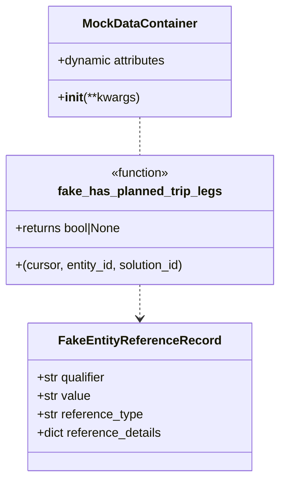

# Diagram: entity_core/entity_service/entity_service_tests/test_process_prebuilt_entity/utils.py


> Auto-generated by Obscura crawlers

## Diagram 1



> SVG rendering failed for this diagram.

## Diagram 2

```mermaid
flowchart TB
EVENT[EVENT]
EVENT --> BODY[body]
BODY --> REFERENCES[references (list)]
REFERENCES --> REF0[references[0]]
REF0 --> QUALIFIER[qualifier: 'OrderNumber']
REF0 --> VALUE[value: 'TEST_ORDER']
EVENT --> REQUEST[requestContext]
REQUEST --> AUTH[authorizer]
AUTH --> ORG_ID[organization_id: 101]
AUTH --> AUTH_PRIVS[privileges: '["MANAGE_ENTITY"]']
REQUEST --> REQ_PRIVS[privileges: '["MANAGE_ENTITY"]']
EVENT --> PATH[pathParameters]
PATH --> PATH_ENTITY[entity_id: 'REAL_VIN_EXTERNAL_ID']
PATH --> PATH_SOLUTION[solution_id: 'FV_TEST']

SYSTEM[SYSTEM_CONFIG_VALUE]
SYSTEM --> PREBUILT[PREBUILT_ENTITY_STATUS_CODES: '{"assignment_codes": ["ASGN", "3800"], "unassignment_codes": ["UNASGN"]}']
SYSTEM --> SYS_METADATA[metadata: None]
SYSTEM --> SYS_ORG_TYPE[org_type: None]

subgraph FunctionBehavior["fake_has_planned_trip_legs(cursor, entity_id, solution_id)"]
    F_START((start))
    DEC1{entity_id == 'REAL_VIN_ID'?}
    DEC2{entity_id == 'PROXY_VIN_ID'?}
    RET_FALSE[/"returns False"/]
    RET_TRUE[/"returns True"/]
    RET_NONE[/"returns None"/]
    F_START --> DEC1
    DEC1 -->|yes| RET_FALSE
    DEC1 -->|no| DEC2
    DEC2 -->|yes| RET_TRUE
    DEC2 -->|no| RET_NONE
end
```

> SVG rendering failed for this diagram.
