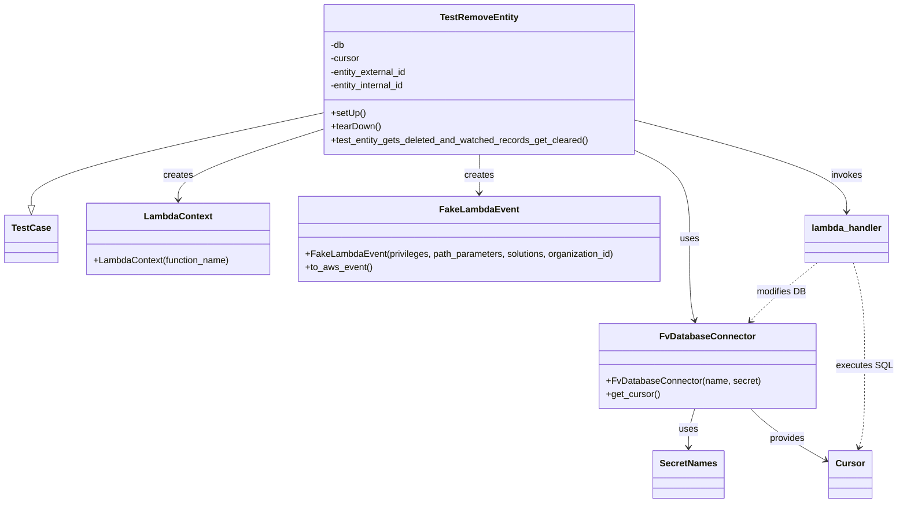

# Diagram: entity_core/entity_service/entity_service_tests/test_remove_entity.py


> Auto-generated by Obscura crawlers

## Diagram 1



### SVG

<svg id="container" width="1562.87890625" xmlns="http://www.w3.org/2000/svg" class="classDiagram" height="886" viewBox="0 0 1562.87890625 886" role="graphics-document document" aria-roledescription="class"><style>#container{font-family:"trebuchet ms",verdana,arial,sans-serif;font-size:16px;fill:#333;}@keyframes edge-animation-frame{from{stroke-dashoffset:0;}}@keyframes dash{to{stroke-dashoffset:0;}}#container .edge-animation-slow{stroke-dasharray:9,5!important;stroke-dashoffset:900;animation:dash 50s linear infinite;stroke-linecap:round;}#container .edge-animation-fast{stroke-dasharray:9,5!important;stroke-dashoffset:900;animation:dash 20s linear infinite;stroke-linecap:round;}#container .error-icon{fill:#552222;}#container .error-text{fill:#552222;stroke:#552222;}#container .edge-thickness-normal{stroke-width:1px;}#container .edge-thickness-thick{stroke-width:3.5px;}#container .edge-pattern-solid{stroke-dasharray:0;}#container .edge-thickness-invisible{stroke-width:0;fill:none;}#container .edge-pattern-dashed{stroke-dasharray:3;}#container .edge-pattern-dotted{stroke-dasharray:2;}#container .marker{fill:#333333;stroke:#333333;}#container .marker.cross{stroke:#333333;}#container svg{font-family:"trebuchet ms",verdana,arial,sans-serif;font-size:16px;}#container p{margin:0;}#container g.classGroup text{fill:#9370DB;stroke:none;font-family:"trebuchet ms",verdana,arial,sans-serif;font-size:10px;}#container g.classGroup text .title{font-weight:bolder;}#container .nodeLabel,#container .edgeLabel{color:#131300;}#container .edgeLabel .label rect{fill:#ECECFF;}#container .label text{fill:#131300;}#container .labelBkg{background:#ECECFF;}#container .edgeLabel .label span{background:#ECECFF;}#container .classTitle{font-weight:bolder;}#container .node rect,#container .node circle,#container .node ellipse,#container .node polygon,#container .node path{fill:#ECECFF;stroke:#9370DB;stroke-width:1px;}#container .divider{stroke:#9370DB;stroke-width:1;}#container g.clickable{cursor:pointer;}#container g.classGroup rect{fill:#ECECFF;stroke:#9370DB;}#container g.classGroup line{stroke:#9370DB;stroke-width:1;}#container .classLabel .box{stroke:none;stroke-width:0;fill:#ECECFF;opacity:0.5;}#container .classLabel .label{fill:#9370DB;font-size:10px;}#container .relation{stroke:#333333;stroke-width:1;fill:none;}#container .dashed-line{stroke-dasharray:3;}#container .dotted-line{stroke-dasharray:1 2;}#container #compositionStart,#container .composition{fill:#333333!important;stroke:#333333!important;stroke-width:1;}#container #compositionEnd,#container .composition{fill:#333333!important;stroke:#333333!important;stroke-width:1;}#container #dependencyStart,#container .dependency{fill:#333333!important;stroke:#333333!important;stroke-width:1;}#container #dependencyStart,#container .dependency{fill:#333333!important;stroke:#333333!important;stroke-width:1;}#container #extensionStart,#container .extension{fill:transparent!important;stroke:#333333!important;stroke-width:1;}#container #extensionEnd,#container .extension{fill:transparent!important;stroke:#333333!important;stroke-width:1;}#container #aggregationStart,#container .aggregation{fill:transparent!important;stroke:#333333!important;stroke-width:1;}#container #aggregationEnd,#container .aggregation{fill:transparent!important;stroke:#333333!important;stroke-width:1;}#container #lollipopStart,#container .lollipop{fill:#ECECFF!important;stroke:#333333!important;stroke-width:1;}#container #lollipopEnd,#container .lollipop{fill:#ECECFF!important;stroke:#333333!important;stroke-width:1;}#container .edgeTerminals{font-size:11px;line-height:initial;}#container .classTitleText{text-anchor:middle;font-size:18px;fill:#333;}#container .label-icon{display:inline-block;height:1em;overflow:visible;vertical-align:-0.125em;}#container .node .label-icon path{fill:currentColor;stroke:revert;stroke-width:revert;}#container :root{--mermaid-font-family:"trebuchet ms",verdana,arial,sans-serif;}</style><g><defs><marker id="container_class-aggregationStart" class="marker aggregation class" refX="18" refY="7" markerWidth="190" markerHeight="240" orient="auto"><path d="M 18,7 L9,13 L1,7 L9,1 Z"></path></marker></defs><defs><marker id="container_class-aggregationEnd" class="marker aggregation class" refX="1" refY="7" markerWidth="20" markerHeight="28" orient="auto"><path d="M 18,7 L9,13 L1,7 L9,1 Z"></path></marker></defs><defs><marker id="container_class-extensionStart" class="marker extension class" refX="18" refY="7" markerWidth="190" markerHeight="240" orient="auto"><path d="M 1,7 L18,13 V 1 Z"></path></marker></defs><defs><marker id="container_class-extensionEnd" class="marker extension class" refX="1" refY="7" markerWidth="20" markerHeight="28" orient="auto"><path d="M 1,1 V 13 L18,7 Z"></path></marker></defs><defs><marker id="container_class-compositionStart" class="marker composition class" refX="18" refY="7" markerWidth="190" markerHeight="240" orient="auto"><path d="M 18,7 L9,13 L1,7 L9,1 Z"></path></marker></defs><defs><marker id="container_class-compositionEnd" class="marker composition class" refX="1" refY="7" markerWidth="20" markerHeight="28" orient="auto"><path d="M 18,7 L9,13 L1,7 L9,1 Z"></path></marker></defs><defs><marker id="container_class-dependencyStart" class="marker dependency class" refX="6" refY="7" markerWidth="190" markerHeight="240" orient="auto"><path d="M 5,7 L9,13 L1,7 L9,1 Z"></path></marker></defs><defs><marker id="container_class-dependencyEnd" class="marker dependency class" refX="13" refY="7" markerWidth="20" markerHeight="28" orient="auto"><path d="M 18,7 L9,13 L14,7 L9,1 Z"></path></marker></defs><defs><marker id="container_class-lollipopStart" class="marker lollipop class" refX="13" refY="7" markerWidth="190" markerHeight="240" orient="auto"><circle stroke="black" fill="transparent" cx="7" cy="7" r="6"></circle></marker></defs><defs><marker id="container_class-lollipopEnd" class="marker lollipop class" refX="1" refY="7" markerWidth="190" markerHeight="240" orient="auto"><circle stroke="black" fill="transparent" cx="7" cy="7" r="6"></circle></marker></defs><g class="root"><g class="clusters"></g><g class="edgePaths"><path d="M564.75,198.694L479.352,217.078C393.953,235.463,223.156,272.231,137.758,299.407C52.359,326.583,52.359,344.167,52.359,352.958L52.359,361.75" id="id_TestRemoveEntity_TestCase_1" class="edge-thickness-normal edge-pattern-solid relation" style=";;;" data-edge="true" data-et="edge" data-id="id_TestRemoveEntity_TestCase_1" data-points="W3sieCI6NTY0Ljc1LCJ5IjoxOTguNjk0MDkyMTIzNjYwODh9LHsieCI6NTIuMzU5Mzc1LCJ5IjozMDl9LHsieCI6NTIuMzU5Mzc1LCJ5IjozNzl9XQ==" marker-end="url(#container_class-extensionEnd)"></path><path d="M1110.039,264.544L1126.259,271.953C1142.479,279.363,1174.919,294.181,1191.139,320.257C1207.359,346.333,1207.359,383.667,1207.359,421C1207.359,458.333,1207.359,495.667,1208.833,519.538C1210.306,543.409,1213.252,553.818,1214.725,559.022L1216.199,564.227" id="id_TestRemoveEntity_FvDatabaseConnector_2" class="edge-thickness-normal edge-pattern-solid relation" style=";;;" data-edge="true" data-et="edge" data-id="id_TestRemoveEntity_FvDatabaseConnector_2" data-points="W3sieCI6MTExMC4wMzkwNjI1LCJ5IjoyNjQuNTQ0MDY1NjMxMjM2MX0seyJ4IjoxMjA3LjM1OTM3NSwieSI6MzA5fSx7IngiOjEyMDcuMzU5Mzc1LCJ5Ijo0MjF9LHsieCI6MTIwNy4zNTkzNzUsInkiOjUzM30seyJ4IjoxMjE3LjgzMjcyODc5NDY0MywieSI6NTcwfV0=" marker-end="url(#container_class-dependencyEnd)"></path><path d="M837.395,272L837.395,278.167C837.395,284.333,837.395,296.667,837.395,308C837.395,319.333,837.395,329.667,837.395,334.833L837.395,340" id="id_TestRemoveEntity_FakeLambdaEvent_3" class="edge-thickness-normal edge-pattern-solid relation" style=";;;" data-edge="true" data-et="edge" data-id="id_TestRemoveEntity_FakeLambdaEvent_3" data-points="W3sieCI6ODM3LjM5NDUzMTI1LCJ5IjoyNzJ9LHsieCI6ODM3LjM5NDUzMTI1LCJ5IjozMDl9LHsieCI6ODM3LjM5NDUzMTI1LCJ5IjozNDZ9XQ==" marker-end="url(#container_class-dependencyEnd)"></path><path d="M564.75,227.007L521.928,240.673C479.107,254.338,393.464,281.669,350.642,302.501C307.82,323.333,307.82,337.667,307.82,344.833L307.82,352" id="id_TestRemoveEntity_LambdaContext_4" class="edge-thickness-normal edge-pattern-solid relation" style=";;;" data-edge="true" data-et="edge" data-id="id_TestRemoveEntity_LambdaContext_4" data-points="W3sieCI6NTY0Ljc1LCJ5IjoyMjcuMDA3NDk0MjI4MTE2NjN9LHsieCI6MzA3LjgyMDMxMjUsInkiOjMwOX0seyJ4IjozMDcuODIwMzEyNSwieSI6MzU4fV0=" marker-end="url(#container_class-dependencyEnd)"></path><path d="M1110.039,212.214L1170.942,228.345C1231.845,244.476,1353.651,276.738,1414.554,303.536C1475.457,330.333,1475.457,351.667,1475.457,362.333L1475.457,373" id="id_TestRemoveEntity_lambda_handler_5" class="edge-thickness-normal edge-pattern-solid relation" style=";;;" data-edge="true" data-et="edge" data-id="id_TestRemoveEntity_lambda_handler_5" data-points="W3sieCI6MTExMC4wMzkwNjI1LCJ5IjoyMTIuMjEzODEyNTY3MzQyNTN9LHsieCI6MTQ3NS40NTcwMzEyNSwieSI6MzA5fSx7IngiOjE0NzUuNDU3MDMxMjUsInkiOjM3OX1d" marker-end="url(#container_class-dependencyEnd)"></path><path d="M1216.36,720L1214.493,726.167C1212.627,732.333,1208.893,744.667,1207.027,756C1205.16,767.333,1205.16,777.667,1205.16,782.833L1205.16,788" id="id_FvDatabaseConnector_SecretNames_6" class="edge-thickness-normal edge-pattern-solid relation" style=";;;" data-edge="true" data-et="edge" data-id="id_FvDatabaseConnector_SecretNames_6" data-points="W3sieCI6MTIxNi4zNjAwMzc2Njc0MTA4LCJ5Ijo3MjB9LHsieCI6MTIwNS4xNjAxNTYyNSwieSI6NzU3fSx7IngiOjEyMDUuMTYwMTU2MjUsInkiOjc5NH1d" marker-end="url(#container_class-dependencyEnd)"></path><path d="M1311.647,720L1317.615,726.167C1323.583,732.333,1335.519,744.667,1356.983,759.965C1378.446,775.264,1409.437,793.528,1424.933,802.661L1440.429,811.793" id="id_FvDatabaseConnector_Cursor_7" class="edge-thickness-normal edge-pattern-solid relation" style=";;;" data-edge="true" data-et="edge" data-id="id_FvDatabaseConnector_Cursor_7" data-points="W3sieCI6MTMxMS42NDY4MTU3MDg3MDU0LCJ5Ijo3MjB9LHsieCI6MTM0Ny40NTUwNzgxMjUsInkiOjc1N30seyJ4IjoxNDQ1LjU5NzY1NjI1LCJ5Ijo4MTQuODM5MTAwNzI0MTQxNH1d" marker-end="url(#container_class-dependencyEnd)"></path><path d="M1425.189,463L1411.225,474.667C1397.262,486.333,1369.335,509.667,1350.411,526.762C1331.487,543.857,1321.566,554.714,1316.606,560.142L1311.645,565.571" id="id_lambda_handler_FvDatabaseConnector_8" class="edge-thickness-normal edge-pattern-dashed relation" style=";;;" data-edge="true" data-et="edge" data-id="id_lambda_handler_FvDatabaseConnector_8" data-points="W3sieCI6MTQyNS4xODg3MjA3MDMxMjUsInkiOjQ2M30seyJ4IjoxMzQxLjQwODIwMzEyNSwieSI6NTMzfSx7IngiOjEzMDcuNTk3NTY5MDU2OTE5NiwieSI6NTcwfV0=" marker-end="url(#container_class-dependencyEnd)"></path><path d="M1487.346,463L1490.648,474.667C1493.951,486.333,1500.555,509.667,1503.858,540C1507.16,570.333,1507.16,607.667,1507.16,645C1507.16,682.333,1507.16,719.667,1505.466,743.549C1503.773,767.431,1500.385,777.862,1498.691,783.078L1496.997,788.293" id="id_lambda_handler_Cursor_9" class="edge-thickness-normal edge-pattern-dashed relation" style=";;;" data-edge="true" data-et="edge" data-id="id_lambda_handler_Cursor_9" data-points="W3sieCI6MTQ4Ny4zNDU3MDMxMjUsInkiOjQ2M30seyJ4IjoxNTA3LjE2MDE1NjI1LCJ5Ijo1MzN9LHsieCI6MTUwNy4xNjAxNTYyNSwieSI6NjQ1fSx7IngiOjE1MDcuMTYwMTU2MjUsInkiOjc1N30seyJ4IjoxNDk1LjE0MzkzNzg5NTU2OTcsInkiOjc5NH1d" marker-end="url(#container_class-dependencyEnd)"></path></g><g class="edgeLabels"><g class="edgeLabel"><g class="label" data-id="id_TestRemoveEntity_TestCase_1" transform="translate(0, 0)"><foreignObject width="0" height="0"><div xmlns="http://www.w3.org/1999/xhtml" class="labelBkg" style="display: table-cell; white-space: nowrap; line-height: 1.5; max-width: 200px; text-align: center;"><span class="edgeLabel"></span></div></foreignObject></g></g><g class="edgeLabel" transform="translate(1207.359375, 421)"><g class="label" data-id="id_TestRemoveEntity_FvDatabaseConnector_2" transform="translate(-16.4921875, -12)"><foreignObject width="32.984375" height="24"><div xmlns="http://www.w3.org/1999/xhtml" class="labelBkg" style="display: table-cell; white-space: nowrap; line-height: 1.5; max-width: 200px; text-align: center;"><span class="edgeLabel"><p>uses</p></span></div></foreignObject></g></g><g class="edgeLabel" transform="translate(837.39453125, 309)"><g class="label" data-id="id_TestRemoveEntity_FakeLambdaEvent_3" transform="translate(-26.171875, -12)"><foreignObject width="52.34375" height="24"><div xmlns="http://www.w3.org/1999/xhtml" class="labelBkg" style="display: table-cell; white-space: nowrap; line-height: 1.5; max-width: 200px; text-align: center;"><span class="edgeLabel"><p>creates</p></span></div></foreignObject></g></g><g class="edgeLabel" transform="translate(307.8203125, 309)"><g class="label" data-id="id_TestRemoveEntity_LambdaContext_4" transform="translate(-26.171875, -12)"><foreignObject width="52.34375" height="24"><div xmlns="http://www.w3.org/1999/xhtml" class="labelBkg" style="display: table-cell; white-space: nowrap; line-height: 1.5; max-width: 200px; text-align: center;"><span class="edgeLabel"><p>creates</p></span></div></foreignObject></g></g><g class="edgeLabel" transform="translate(1475.45703125, 309)"><g class="label" data-id="id_TestRemoveEntity_lambda_handler_5" transform="translate(-27.5859375, -12)"><foreignObject width="55.171875" height="24"><div xmlns="http://www.w3.org/1999/xhtml" class="labelBkg" style="display: table-cell; white-space: nowrap; line-height: 1.5; max-width: 200px; text-align: center;"><span class="edgeLabel"><p>invokes</p></span></div></foreignObject></g></g><g class="edgeLabel" transform="translate(1205.16015625, 757)"><g class="label" data-id="id_FvDatabaseConnector_SecretNames_6" transform="translate(-16.4921875, -12)"><foreignObject width="32.984375" height="24"><div xmlns="http://www.w3.org/1999/xhtml" class="labelBkg" style="display: table-cell; white-space: nowrap; line-height: 1.5; max-width: 200px; text-align: center;"><span class="edgeLabel"><p>uses</p></span></div></foreignObject></g></g><g class="edgeLabel" transform="translate(1374.34651, 772.84813)"><g class="label" data-id="id_FvDatabaseConnector_Cursor_7" transform="translate(-31.3125, -12)"><foreignObject width="62.625" height="24"><div xmlns="http://www.w3.org/1999/xhtml" class="labelBkg" style="display: table-cell; white-space: nowrap; line-height: 1.5; max-width: 200px; text-align: center;"><span class="edgeLabel"><p>provides</p></span></div></foreignObject></g></g><g class="edgeLabel" transform="translate(1364.06695, 514.06825)"><g class="label" data-id="id_lambda_handler_FvDatabaseConnector_8" transform="translate(-43.40625, -12)"><foreignObject width="86.8125" height="24"><div xmlns="http://www.w3.org/1999/xhtml" class="labelBkg" style="display: table-cell; white-space: nowrap; line-height: 1.5; max-width: 200px; text-align: center;"><span class="edgeLabel"><p>modifies DB</p></span></div></foreignObject></g></g><g class="edgeLabel" transform="translate(1507.16015625, 645)"><g class="label" data-id="id_lambda_handler_Cursor_9" transform="translate(-47.71875, -12)"><foreignObject width="95.4375" height="24"><div xmlns="http://www.w3.org/1999/xhtml" class="labelBkg" style="display: table-cell; white-space: nowrap; line-height: 1.5; max-width: 200px; text-align: center;"><span class="edgeLabel"><p>executes SQL</p></span></div></foreignObject></g></g></g><g class="nodes"><g class="node default" id="classId-TestRemoveEntity-0" transform="translate(837.39453125, 140)"><g class="basic label-container"><path d="M-272.64453125 -132 L272.64453125 -132 L272.64453125 132 L-272.64453125 132" stroke="none" stroke-width="0" fill="#ECECFF" style=""></path><path d="M-272.64453125 -132 C-58.004251011938834 -132, 156.63602922612233 -132, 272.64453125 -132 M-272.64453125 -132 C-133.58467906372633 -132, 5.475173122547346 -132, 272.64453125 -132 M272.64453125 -132 C272.64453125 -52.41229550756435, 272.64453125 27.175408984871297, 272.64453125 132 M272.64453125 -132 C272.64453125 -64.83311690459385, 272.64453125 2.333766190812298, 272.64453125 132 M272.64453125 132 C84.99960320535357 132, -102.64532483929287 132, -272.64453125 132 M272.64453125 132 C149.95201219076176 132, 27.259493131523556 132, -272.64453125 132 M-272.64453125 132 C-272.64453125 27.25080834380546, -272.64453125 -77.49838331238908, -272.64453125 -132 M-272.64453125 132 C-272.64453125 47.630422577598225, -272.64453125 -36.73915484480355, -272.64453125 -132" stroke="#9370DB" stroke-width="1.3" fill="none" stroke-dasharray="0 0" style=""></path></g><g class="annotation-group text" transform="translate(0, -108)"></g><g class="label-group text" transform="translate(-65.5859375, -108)"><g class="label" style="font-weight: bolder" transform="translate(0,-12)"><foreignObject width="131.171875" height="24"><div xmlns="http://www.w3.org/1999/xhtml" style="display: table-cell; white-space: nowrap; line-height: 1.5; max-width: 179px; text-align: center;"><span class="nodeLabel markdown-node-label" style=""><p>TestRemoveEntity</p></span></div></foreignObject></g></g><g class="members-group text" transform="translate(-260.64453125, -60)"><g class="label" style="" transform="translate(0,-12)"><foreignObject width="25.53125" height="24"><div xmlns="http://www.w3.org/1999/xhtml" style="display: table-cell; white-space: nowrap; line-height: 1.5; max-width: 83px; text-align: center;"><span class="nodeLabel markdown-node-label" style=""><p>-db</p></span></div></foreignObject></g><g class="label" style="" transform="translate(0,12)"><foreignObject width="52.1875" height="24"><div xmlns="http://www.w3.org/1999/xhtml" style="display: table-cell; white-space: nowrap; line-height: 1.5; max-width: 110px; text-align: center;"><span class="nodeLabel markdown-node-label" style=""><p>-cursor</p></span></div></foreignObject></g><g class="label" style="" transform="translate(0,36)"><foreignObject width="137.703125" height="24"><div xmlns="http://www.w3.org/1999/xhtml" style="display: table-cell; white-space: nowrap; line-height: 1.5; max-width: 195px; text-align: center;"><span class="nodeLabel markdown-node-label" style=""><p>-entity_external_id</p></span></div></foreignObject></g><g class="label" style="" transform="translate(0,60)"><foreignObject width="135.578125" height="24"><div xmlns="http://www.w3.org/1999/xhtml" style="display: table-cell; white-space: nowrap; line-height: 1.5; max-width: 193px; text-align: center;"><span class="nodeLabel markdown-node-label" style=""><p>-entity_internal_id</p></span></div></foreignObject></g></g><g class="methods-group text" transform="translate(-260.64453125, 60)"><g class="label" style="" transform="translate(0,-12)"><foreignObject width="60.421875" height="24"><div xmlns="http://www.w3.org/1999/xhtml" style="display: table-cell; white-space: nowrap; line-height: 1.5; max-width: 118px; text-align: center;"><span class="nodeLabel markdown-node-label" style=""><p>+setUp()</p></span></div></foreignObject></g><g class="label" style="" transform="translate(0,12)"><foreignObject width="87.75" height="24"><div xmlns="http://www.w3.org/1999/xhtml" style="display: table-cell; white-space: nowrap; line-height: 1.5; max-width: 145px; text-align: center;"><span class="nodeLabel markdown-node-label" style=""><p>+tearDown()</p></span></div></foreignObject></g><g class="label" style="" transform="translate(0,36)"><foreignObject width="455.703125" height="24"><div xmlns="http://www.w3.org/1999/xhtml" style="display: table-cell; white-space: nowrap; line-height: 1.5; max-width: 513px; text-align: center;"><span class="nodeLabel markdown-node-label" style=""><p>+test_entity_gets_deleted_and_watched_records_get_cleared()</p></span></div></foreignObject></g></g><g class="divider" style=""><path d="M-272.64453125 -84 C-101.21483962376414 -84, 70.21485200247173 -84, 272.64453125 -84 M-272.64453125 -84 C-96.66663605075237 -84, 79.31125914849525 -84, 272.64453125 -84" stroke="#9370DB" stroke-width="1.3" fill="none" stroke-dasharray="0 0" style=""></path></g><g class="divider" style=""><path d="M-272.64453125 36 C-140.01537717892654 36, -7.386223107853084 36, 272.64453125 36 M-272.64453125 36 C-147.40326430089976 36, -22.161997351799528 36, 272.64453125 36" stroke="#9370DB" stroke-width="1.3" fill="none" stroke-dasharray="0 0" style=""></path></g></g><g class="node default" id="classId-TestCase-1" transform="translate(52.359375, 421)"><g class="basic label-container"><path d="M-44.359375 -42 L44.359375 -42 L44.359375 42 L-44.359375 42" stroke="none" stroke-width="0" fill="#ECECFF" style=""></path><path d="M-44.359375 -42 C-11.79721295799419 -42, 20.76494908401162 -42, 44.359375 -42 M-44.359375 -42 C-25.226478614764392 -42, -6.093582229528785 -42, 44.359375 -42 M44.359375 -42 C44.359375 -18.339947495070234, 44.359375 5.320105009859532, 44.359375 42 M44.359375 -42 C44.359375 -13.153688359749477, 44.359375 15.692623280501046, 44.359375 42 M44.359375 42 C11.552051682942832 42, -21.255271634114337 42, -44.359375 42 M44.359375 42 C19.856490989596317 42, -4.646393020807366 42, -44.359375 42 M-44.359375 42 C-44.359375 15.153241974277861, -44.359375 -11.693516051444277, -44.359375 -42 M-44.359375 42 C-44.359375 15.38227025619842, -44.359375 -11.235459487603158, -44.359375 -42" stroke="#9370DB" stroke-width="1.3" fill="none" stroke-dasharray="0 0" style=""></path></g><g class="annotation-group text" transform="translate(0, -18)"></g><g class="label-group text" transform="translate(-32.359375, -18)"><g class="label" style="font-weight: bolder" transform="translate(0,-12)"><foreignObject width="64.71875" height="24"><div xmlns="http://www.w3.org/1999/xhtml" style="display: table-cell; white-space: nowrap; line-height: 1.5; max-width: 113px; text-align: center;"><span class="nodeLabel markdown-node-label" style=""><p>TestCase</p></span></div></foreignObject></g></g><g class="members-group text" transform="translate(-32.359375, 30)"></g><g class="methods-group text" transform="translate(-32.359375, 60)"></g><g class="divider" style=""><path d="M-44.359375 6 C-22.94250462740736 6, -1.5256342548147188 6, 44.359375 6 M-44.359375 6 C-9.736992036152174 6, 24.885390927695653 6, 44.359375 6" stroke="#9370DB" stroke-width="1.3" fill="none" stroke-dasharray="0 0" style=""></path></g><g class="divider" style=""><path d="M-44.359375 24 C-23.35056792722582 24, -2.3417608544516426 24, 44.359375 24 M-44.359375 24 C-17.833647526734403 24, 8.692079946531194 24, 44.359375 24" stroke="#9370DB" stroke-width="1.3" fill="none" stroke-dasharray="0 0" style=""></path></g></g><g class="node default" id="classId-FvDatabaseConnector-2" transform="translate(1239.0625, 645)"><g class="basic label-container"><path d="M-185.37890625 -75 L185.37890625 -75 L185.37890625 75 L-185.37890625 75" stroke="none" stroke-width="0" fill="#ECECFF" style=""></path><path d="M-185.37890625 -75 C-108.32582453923284 -75, -31.27274282846568 -75, 185.37890625 -75 M-185.37890625 -75 C-79.44730745575349 -75, 26.484291338493023 -75, 185.37890625 -75 M185.37890625 -75 C185.37890625 -31.18683901730961, 185.37890625 12.626321965380782, 185.37890625 75 M185.37890625 -75 C185.37890625 -28.483636113692135, 185.37890625 18.03272777261573, 185.37890625 75 M185.37890625 75 C70.62007009765522 75, -44.13876605468957 75, -185.37890625 75 M185.37890625 75 C90.56881952123541 75, -4.241267207529177 75, -185.37890625 75 M-185.37890625 75 C-185.37890625 37.39584304353896, -185.37890625 -0.20831391292207968, -185.37890625 -75 M-185.37890625 75 C-185.37890625 21.471486397751967, -185.37890625 -32.057027204496066, -185.37890625 -75" stroke="#9370DB" stroke-width="1.3" fill="none" stroke-dasharray="0 0" style=""></path></g><g class="annotation-group text" transform="translate(0, -51)"></g><g class="label-group text" transform="translate(-79.3046875, -51)"><g class="label" style="font-weight: bolder" transform="translate(0,-12)"><foreignObject width="158.609375" height="24"><div xmlns="http://www.w3.org/1999/xhtml" style="display: table-cell; white-space: nowrap; line-height: 1.5; max-width: 207px; text-align: center;"><span class="nodeLabel markdown-node-label" style=""><p>FvDatabaseConnector</p></span></div></foreignObject></g></g><g class="members-group text" transform="translate(-173.37890625, -3)"></g><g class="methods-group text" transform="translate(-173.37890625, 27)"><g class="label" style="" transform="translate(0,-12)"><foreignObject width="267.453125" height="24"><div xmlns="http://www.w3.org/1999/xhtml" style="display: table-cell; white-space: nowrap; line-height: 1.5; max-width: 325px; text-align: center;"><span class="nodeLabel markdown-node-label" style=""><p>+FvDatabaseConnector(name, secret)</p></span></div></foreignObject></g><g class="label" style="" transform="translate(0,12)"><foreignObject width="94.640625" height="24"><div xmlns="http://www.w3.org/1999/xhtml" style="display: table-cell; white-space: nowrap; line-height: 1.5; max-width: 152px; text-align: center;"><span class="nodeLabel markdown-node-label" style=""><p>+get_cursor()</p></span></div></foreignObject></g></g><g class="divider" style=""><path d="M-185.37890625 -27 C-72.40270479013411 -27, 40.57349666973178 -27, 185.37890625 -27 M-185.37890625 -27 C-108.49667576627903 -27, -31.61444528255805 -27, 185.37890625 -27" stroke="#9370DB" stroke-width="1.3" fill="none" stroke-dasharray="0 0" style=""></path></g><g class="divider" style=""><path d="M-185.37890625 -3 C-99.71073974995927 -3, -14.042573249918547 -3, 185.37890625 -3 M-185.37890625 -3 C-47.05740168268619 -3, 91.26410288462762 -3, 185.37890625 -3" stroke="#9370DB" stroke-width="1.3" fill="none" stroke-dasharray="0 0" style=""></path></g></g><g class="node default" id="classId-Cursor-3" transform="translate(1481.50390625, 836)"><g class="basic label-container"><path d="M-35.90625 -42 L35.90625 -42 L35.90625 42 L-35.90625 42" stroke="none" stroke-width="0" fill="#ECECFF" style=""></path><path d="M-35.90625 -42 C-7.257416058719507 -42, 21.391417882560987 -42, 35.90625 -42 M-35.90625 -42 C-11.484112858853202 -42, 12.938024282293597 -42, 35.90625 -42 M35.90625 -42 C35.90625 -13.966937801711303, 35.90625 14.066124396577393, 35.90625 42 M35.90625 -42 C35.90625 -18.105021759554365, 35.90625 5.78995648089127, 35.90625 42 M35.90625 42 C12.81369285267606 42, -10.278864294647882 42, -35.90625 42 M35.90625 42 C7.636881655696929 42, -20.632486688606143 42, -35.90625 42 M-35.90625 42 C-35.90625 9.252529328688468, -35.90625 -23.494941342623065, -35.90625 -42 M-35.90625 42 C-35.90625 19.273543675669817, -35.90625 -3.452912648660366, -35.90625 -42" stroke="#9370DB" stroke-width="1.3" fill="none" stroke-dasharray="0 0" style=""></path></g><g class="annotation-group text" transform="translate(0, -18)"></g><g class="label-group text" transform="translate(-23.90625, -18)"><g class="label" style="font-weight: bolder" transform="translate(0,-12)"><foreignObject width="47.8125" height="24"><div xmlns="http://www.w3.org/1999/xhtml" style="display: table-cell; white-space: nowrap; line-height: 1.5; max-width: 98px; text-align: center;"><span class="nodeLabel markdown-node-label" style=""><p>Cursor</p></span></div></foreignObject></g></g><g class="members-group text" transform="translate(-23.90625, 30)"></g><g class="methods-group text" transform="translate(-23.90625, 60)"></g><g class="divider" style=""><path d="M-35.90625 6 C-18.65485985146646 6, -1.4034697029329166 6, 35.90625 6 M-35.90625 6 C-14.660610072764896 6, 6.585029854470207 6, 35.90625 6" stroke="#9370DB" stroke-width="1.3" fill="none" stroke-dasharray="0 0" style=""></path></g><g class="divider" style=""><path d="M-35.90625 24 C-9.965671077585093 24, 15.974907844829815 24, 35.90625 24 M-35.90625 24 C-12.486567776075027 24, 10.933114447849945 24, 35.90625 24" stroke="#9370DB" stroke-width="1.3" fill="none" stroke-dasharray="0 0" style=""></path></g></g><g class="node default" id="classId-LambdaContext-4" transform="translate(307.8203125, 421)"><g class="basic label-container"><path d="M-161.1015625 -63 L161.1015625 -63 L161.1015625 63 L-161.1015625 63" stroke="none" stroke-width="0" fill="#ECECFF" style=""></path><path d="M-161.1015625 -63 C-43.62874134938883 -63, 73.84407980122234 -63, 161.1015625 -63 M-161.1015625 -63 C-84.70173011431164 -63, -8.301897728623288 -63, 161.1015625 -63 M161.1015625 -63 C161.1015625 -32.48322321803232, 161.1015625 -1.9664464360646434, 161.1015625 63 M161.1015625 -63 C161.1015625 -26.22497193446243, 161.1015625 10.550056131075138, 161.1015625 63 M161.1015625 63 C59.69810442728489 63, -41.70535364543022 63, -161.1015625 63 M161.1015625 63 C88.48141528928292 63, 15.861268078565843 63, -161.1015625 63 M-161.1015625 63 C-161.1015625 14.679413051587204, -161.1015625 -33.64117389682559, -161.1015625 -63 M-161.1015625 63 C-161.1015625 29.78832123329972, -161.1015625 -3.423357533400562, -161.1015625 -63" stroke="#9370DB" stroke-width="1.3" fill="none" stroke-dasharray="0 0" style=""></path></g><g class="annotation-group text" transform="translate(0, -39)"></g><g class="label-group text" transform="translate(-57.296875, -39)"><g class="label" style="font-weight: bolder" transform="translate(0,-12)"><foreignObject width="114.59375" height="24"><div xmlns="http://www.w3.org/1999/xhtml" style="display: table-cell; white-space: nowrap; line-height: 1.5; max-width: 163px; text-align: center;"><span class="nodeLabel markdown-node-label" style=""><p>LambdaContext</p></span></div></foreignObject></g></g><g class="members-group text" transform="translate(-149.1015625, 9)"></g><g class="methods-group text" transform="translate(-149.1015625, 39)"><g class="label" style="" transform="translate(0,-12)"><foreignObject width="240.90625" height="24"><div xmlns="http://www.w3.org/1999/xhtml" style="display: table-cell; white-space: nowrap; line-height: 1.5; max-width: 298px; text-align: center;"><span class="nodeLabel markdown-node-label" style=""><p>+LambdaContext(function_name)</p></span></div></foreignObject></g></g><g class="divider" style=""><path d="M-161.1015625 -15 C-53.757361047085865 -15, 53.58684040582827 -15, 161.1015625 -15 M-161.1015625 -15 C-95.73976607931519 -15, -30.377969658630377 -15, 161.1015625 -15" stroke="#9370DB" stroke-width="1.3" fill="none" stroke-dasharray="0 0" style=""></path></g><g class="divider" style=""><path d="M-161.1015625 9 C-70.49441674946713 9, 20.11272900106573 9, 161.1015625 9 M-161.1015625 9 C-52.92892675237164 9, 55.243708995256725 9, 161.1015625 9" stroke="#9370DB" stroke-width="1.3" fill="none" stroke-dasharray="0 0" style=""></path></g></g><g class="node default" id="classId-FakeLambdaEvent-5" transform="translate(837.39453125, 421)"><g class="basic label-container"><path d="M-318.47265625 -75 L318.47265625 -75 L318.47265625 75 L-318.47265625 75" stroke="none" stroke-width="0" fill="#ECECFF" style=""></path><path d="M-318.47265625 -75 C-170.7887035414694 -75, -23.104750832938805 -75, 318.47265625 -75 M-318.47265625 -75 C-176.689429181558 -75, -34.906202113116024 -75, 318.47265625 -75 M318.47265625 -75 C318.47265625 -33.83205191975808, 318.47265625 7.335896160483841, 318.47265625 75 M318.47265625 -75 C318.47265625 -32.332469578537854, 318.47265625 10.335060842924293, 318.47265625 75 M318.47265625 75 C141.7869939176992 75, -34.898668414601616 75, -318.47265625 75 M318.47265625 75 C182.25665106746942 75, 46.04064588493884 75, -318.47265625 75 M-318.47265625 75 C-318.47265625 33.691016075857846, -318.47265625 -7.617967848284309, -318.47265625 -75 M-318.47265625 75 C-318.47265625 34.139515369919565, -318.47265625 -6.720969260160871, -318.47265625 -75" stroke="#9370DB" stroke-width="1.3" fill="none" stroke-dasharray="0 0" style=""></path></g><g class="annotation-group text" transform="translate(0, -51)"></g><g class="label-group text" transform="translate(-65.8671875, -51)"><g class="label" style="font-weight: bolder" transform="translate(0,-12)"><foreignObject width="131.734375" height="24"><div xmlns="http://www.w3.org/1999/xhtml" style="display: table-cell; white-space: nowrap; line-height: 1.5; max-width: 181px; text-align: center;"><span class="nodeLabel markdown-node-label" style=""><p>FakeLambdaEvent</p></span></div></foreignObject></g></g><g class="members-group text" transform="translate(-306.47265625, -3)"></g><g class="methods-group text" transform="translate(-306.47265625, 27)"><g class="label" style="" transform="translate(0,-12)"><foreignObject width="547.078125" height="24"><div xmlns="http://www.w3.org/1999/xhtml" style="display: table-cell; white-space: nowrap; line-height: 1.5; max-width: 604px; text-align: center;"><span class="nodeLabel markdown-node-label" style=""><p>+FakeLambdaEvent(privileges, path_parameters, solutions, organization_id)</p></span></div></foreignObject></g><g class="label" style="" transform="translate(0,12)"><foreignObject width="116.421875" height="24"><div xmlns="http://www.w3.org/1999/xhtml" style="display: table-cell; white-space: nowrap; line-height: 1.5; max-width: 174px; text-align: center;"><span class="nodeLabel markdown-node-label" style=""><p>+to_aws_event()</p></span></div></foreignObject></g></g><g class="divider" style=""><path d="M-318.47265625 -27 C-141.04797460687908 -27, 36.37670703624184 -27, 318.47265625 -27 M-318.47265625 -27 C-155.26024477144594 -27, 7.95216670710812 -27, 318.47265625 -27" stroke="#9370DB" stroke-width="1.3" fill="none" stroke-dasharray="0 0" style=""></path></g><g class="divider" style=""><path d="M-318.47265625 -3 C-163.53271286941708 -3, -8.592769488834165 -3, 318.47265625 -3 M-318.47265625 -3 C-94.459313011846 -3, 129.554030226308 -3, 318.47265625 -3" stroke="#9370DB" stroke-width="1.3" fill="none" stroke-dasharray="0 0" style=""></path></g></g><g class="node default" id="classId-SecretNames-6" transform="translate(1205.16015625, 836)"><g class="basic label-container"><path d="M-60.03125 -42 L60.03125 -42 L60.03125 42 L-60.03125 42" stroke="none" stroke-width="0" fill="#ECECFF" style=""></path><path d="M-60.03125 -42 C-24.30923492691197 -42, 11.412780146176061 -42, 60.03125 -42 M-60.03125 -42 C-35.87204253795959 -42, -11.71283507591918 -42, 60.03125 -42 M60.03125 -42 C60.03125 -15.972868064729212, 60.03125 10.054263870541575, 60.03125 42 M60.03125 -42 C60.03125 -9.875367485259844, 60.03125 22.249265029480313, 60.03125 42 M60.03125 42 C31.646471081009487 42, 3.2616921620189743 42, -60.03125 42 M60.03125 42 C34.495028328287624 42, 8.958806656575248 42, -60.03125 42 M-60.03125 42 C-60.03125 18.577083171486265, -60.03125 -4.84583365702747, -60.03125 -42 M-60.03125 42 C-60.03125 19.608285036096344, -60.03125 -2.783429927807312, -60.03125 -42" stroke="#9370DB" stroke-width="1.3" fill="none" stroke-dasharray="0 0" style=""></path></g><g class="annotation-group text" transform="translate(0, -18)"></g><g class="label-group text" transform="translate(-48.03125, -18)"><g class="label" style="font-weight: bolder" transform="translate(0,-12)"><foreignObject width="96.0625" height="24"><div xmlns="http://www.w3.org/1999/xhtml" style="display: table-cell; white-space: nowrap; line-height: 1.5; max-width: 145px; text-align: center;"><span class="nodeLabel markdown-node-label" style=""><p>SecretNames</p></span></div></foreignObject></g></g><g class="members-group text" transform="translate(-48.03125, 30)"></g><g class="methods-group text" transform="translate(-48.03125, 60)"></g><g class="divider" style=""><path d="M-60.03125 6 C-27.24424400751338 6, 5.5427619849732395 6, 60.03125 6 M-60.03125 6 C-32.60454982207756 6, -5.17784964415511 6, 60.03125 6" stroke="#9370DB" stroke-width="1.3" fill="none" stroke-dasharray="0 0" style=""></path></g><g class="divider" style=""><path d="M-60.03125 24 C-17.60699543400296 24, 24.817259131994078 24, 60.03125 24 M-60.03125 24 C-19.543811341368333 24, 20.943627317263335 24, 60.03125 24" stroke="#9370DB" stroke-width="1.3" fill="none" stroke-dasharray="0 0" style=""></path></g></g><g class="node default" id="classId-lambda_handler-7" transform="translate(1475.45703125, 421)"><g class="basic label-container"><path d="M-71.9765625 -42 L71.9765625 -42 L71.9765625 42 L-71.9765625 42" stroke="none" stroke-width="0" fill="#ECECFF" style=""></path><path d="M-71.9765625 -42 C-38.56641240275852 -42, -5.156262305517046 -42, 71.9765625 -42 M-71.9765625 -42 C-39.78052060994207 -42, -7.584478719884146 -42, 71.9765625 -42 M71.9765625 -42 C71.9765625 -9.507061280883725, 71.9765625 22.98587743823255, 71.9765625 42 M71.9765625 -42 C71.9765625 -18.44749937697927, 71.9765625 5.105001246041461, 71.9765625 42 M71.9765625 42 C42.22305509213824 42, 12.469547684276485 42, -71.9765625 42 M71.9765625 42 C29.990991698069294 42, -11.994579103861412 42, -71.9765625 42 M-71.9765625 42 C-71.9765625 20.266841570697693, -71.9765625 -1.466316858604614, -71.9765625 -42 M-71.9765625 42 C-71.9765625 17.407212773824348, -71.9765625 -7.185574452351304, -71.9765625 -42" stroke="#9370DB" stroke-width="1.3" fill="none" stroke-dasharray="0 0" style=""></path></g><g class="annotation-group text" transform="translate(0, -18)"></g><g class="label-group text" transform="translate(-59.9765625, -18)"><g class="label" style="font-weight: bolder" transform="translate(0,-12)"><foreignObject width="119.953125" height="24"><div xmlns="http://www.w3.org/1999/xhtml" style="display: table-cell; white-space: nowrap; line-height: 1.5; max-width: 170px; text-align: center;"><span class="nodeLabel markdown-node-label" style=""><p>lambda_handler</p></span></div></foreignObject></g></g><g class="members-group text" transform="translate(-59.9765625, 30)"></g><g class="methods-group text" transform="translate(-59.9765625, 60)"></g><g class="divider" style=""><path d="M-71.9765625 6 C-34.34215673213435 6, 3.2922490357313023 6, 71.9765625 6 M-71.9765625 6 C-20.06493685446135 6, 31.846688791077298 6, 71.9765625 6" stroke="#9370DB" stroke-width="1.3" fill="none" stroke-dasharray="0 0" style=""></path></g><g class="divider" style=""><path d="M-71.9765625 24 C-32.53340082411802 24, 6.909760851763963 24, 71.9765625 24 M-71.9765625 24 C-30.2723265915619 24, 11.431909316876201 24, 71.9765625 24" stroke="#9370DB" stroke-width="1.3" fill="none" stroke-dasharray="0 0" style=""></path></g></g></g></g></g></svg>

## Diagram 2

```mermaid
sequenceDiagram
participant Test as TestRemoveEntity
participant DB as FvDatabaseConnector
participant Cursor as Cursor
participant Event as FakeLambdaEvent
participant Context as LambdaContext
participant Lambda as lambda_handler

Test->>DB: instantiate FvDatabaseConnector("RemoveEntityTests", SecretNames.ENTITY_DATABASE)
DB-->>Cursor: get_cursor()
Test->>Cursor: execute(INSERT entity; INSERT entity_user_watch)  -- in setUp
Cursor-->>Test: return entity_internal_id
Test->>Event: create FakeLambdaEvent(privileges=["MANAGE_ENTITY"], path_parameters, solutions, organization_id)
Test->>Context: create LambdaContext("remove_entity")
Test->>Lambda: lambda_handler(event.to_aws_event(), context)
Lambda-->>Test: return result(statusCode "200")
Test->>Cursor: execute(SELECT id FROM entity WHERE external_id = ... AND state = 'Deleted')
Cursor-->>Test: row exists
Test->>Cursor: execute(SELECT id FROM entity_user_watch WHERE entity_id = ...)
Cursor-->>Test: no rows
Test->>Cursor: execute(DELETE FROM entity_user_watch; DELETE FROM entity)  -- in tearDown
```

> SVG rendering failed for this diagram.
