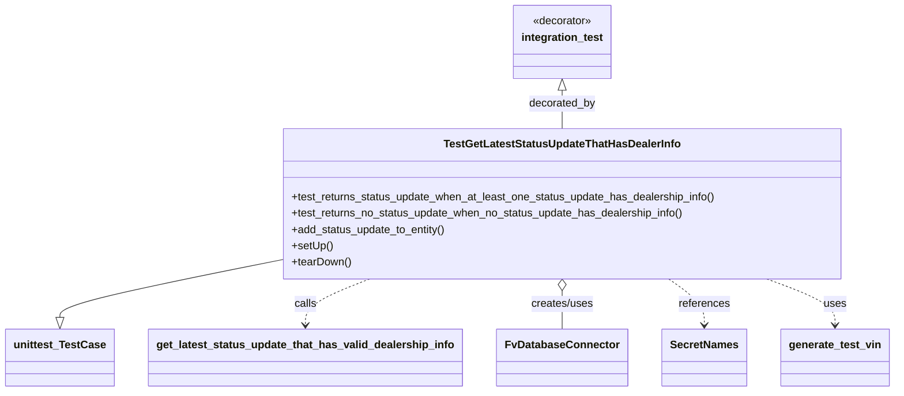

# Diagram: entity_core/entity_service/entity_service_tests/trip_leg_tests/db/test_get_latest_status_update_that_has_dealer_info.py

> Auto-generated by Obscura crawlers

## Mermaid

> SVG rendering failed for this diagram.
