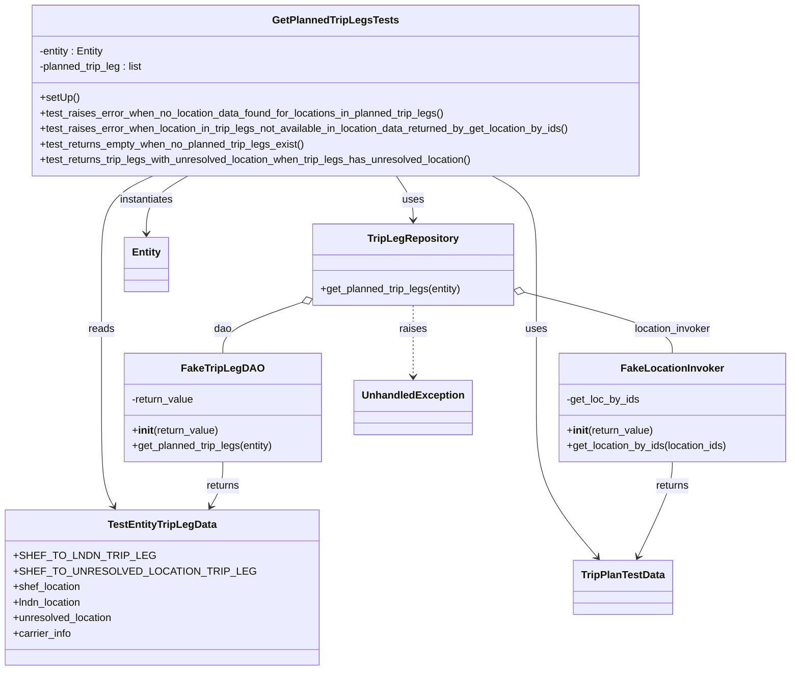

# Diagram: entity_core/entity_service/entity_service_tests/trip_leg_tests/test_augmented_trip_plan/test_augment_trip_leg_repository.py

> Auto-generated by Obscura crawlers

## Mermaid

### SVG

<svg id="container" width="1189.890625" xmlns="http://www.w3.org/2000/svg" class="classDiagram" height="1036" viewBox="0 0 1189.890625 1036" role="graphics-document document" aria-roledescription="class"><g><defs><marker id="container_class-aggregationStart" class="marker aggregation class" refX="18" refY="7" markerWidth="190" markerHeight="240" orient="auto"><path d="M 18,7 L9,13 L1,7 L9,1 Z"></path></marker></defs><defs><marker id="container_class-aggregationEnd" class="marker aggregation class" refX="1" refY="7" markerWidth="20" markerHeight="28" orient="auto"><path d="M 18,7 L9,13 L1,7 L9,1 Z"></path></marker></defs><defs><marker id="container_class-extensionStart" class="marker extension class" refX="18" refY="7" markerWidth="190" markerHeight="240" orient="auto"><path d="M 1,7 L18,13 V 1 Z"></path></marker></defs><defs><marker id="container_class-extensionEnd" class="marker extension class" refX="1" refY="7" markerWidth="20" markerHeight="28" orient="auto"><path d="M 1,1 V 13 L18,7 Z"></path></marker></defs><defs><marker id="container_class-compositionStart" class="marker composition class" refX="18" refY="7" markerWidth="190" markerHeight="240" orient="auto"><path d="M 18,7 L9,13 L1,7 L9,1 Z"></path></marker></defs><defs><marker id="container_class-compositionEnd" class="marker composition class" refX="1" refY="7" markerWidth="20" markerHeight="28" orient="auto"><path d="M 18,7 L9,13 L1,7 L9,1 Z"></path></marker></defs><defs><marker id="container_class-dependencyStart" class="marker dependency class" refX="6" refY="7" markerWidth="190" markerHeight="240" orient="auto"><path d="M 5,7 L9,13 L1,7 L9,1 Z"></path></marker></defs><defs><marker id="container_class-dependencyEnd" class="marker dependency class" refX="13" refY="7" markerWidth="20" markerHeight="28" orient="auto"><path d="M 18,7 L9,13 L14,7 L9,1 Z"></path></marker></defs><defs><marker id="container_class-lollipopStart" class="marker lollipop class" refX="13" refY="7" markerWidth="190" markerHeight="240" orient="auto"><circle stroke="black" fill="transparent" cx="7" cy="7" r="6"></circle></marker></defs><defs><marker id="container_class-lollipopEnd" class="marker lollipop class" refX="1" refY="7" markerWidth="190" markerHeight="240" orient="auto"><circle stroke="black" fill="transparent" cx="7" cy="7" r="6"></circle></marker></defs><g class="root"><g class="clusters"></g><g class="edgePaths"><path d="M577.601,272L581.973,278.167C586.345,284.333,595.088,296.667,599.46,308C603.832,319.333,603.832,329.667,603.832,334.833L603.832,340" id="id_GetPlannedTripLegsTests_TripLegRepository_1" class="edge-thickness-normal edge-pattern-solid relation" style=";;;" data-edge="true" data-et="edge" data-id="id_GetPlannedTripLegsTests_TripLegRepository_1" data-points="W3sieCI6NTc3LjYwMTMxOTgwMzk5NDEsInkiOjI3Mn0seyJ4Ijo2MDMuODMyMDMxMjUsInkiOjMwOX0seyJ4Ijo2MDMuODMyMDMxMjUsInkiOjM0Nn1d" marker-end="url(#container_class-dependencyEnd)"></path><path d="M204.856,272L191.815,278.167C178.773,284.333,152.689,296.667,139.647,319.5C126.605,342.333,126.605,375.667,126.605,409C126.605,442.333,126.605,475.667,126.605,512.5C126.605,549.333,126.605,589.667,126.605,630C126.605,670.333,126.605,710.667,129.773,736.141C132.94,761.616,139.275,772.232,142.442,777.54L145.609,782.848" id="id_GetPlannedTripLegsTests_TestEntityTripLegData_2" class="edge-thickness-normal edge-pattern-solid relation" style=";;;" data-edge="true" data-et="edge" data-id="id_GetPlannedTripLegsTests_TestEntityTripLegData_2" data-points="W3sieCI6MjA0Ljg1NjMxMjQwNzU0NDM1LCJ5IjoyNzJ9LHsieCI6MTI2LjYwNTQ2ODc1LCJ5IjozMDl9LHsieCI6MTI2LjYwNTQ2ODc1LCJ5Ijo0MDl9LHsieCI6MTI2LjYwNTQ2ODc1LCJ5Ijo1MDl9LHsieCI6MTI2LjYwNTQ2ODc1LCJ5Ijo2MzB9LHsieCI6MTI2LjYwNTQ2ODc1LCJ5Ijo3NTF9LHsieCI6MTQ4LjY4Mzc2NzkxNDAxMjcyLCJ5Ijo3ODh9XQ==" marker-end="url(#container_class-dependencyEnd)"></path><path d="M727.05,272L738.404,278.167C749.757,284.333,772.465,296.667,783.818,319.5C795.172,342.333,795.172,375.667,795.172,409C795.172,442.333,795.172,475.667,795.172,512.5C795.172,549.333,795.172,589.667,795.172,630C795.172,670.333,795.172,710.667,810.556,749.233C825.941,787.799,856.71,824.598,872.094,842.998L887.479,861.397" id="id_GetPlannedTripLegsTests_TripPlanTestData_3" class="edge-thickness-normal edge-pattern-solid relation" style=";;;" data-edge="true" data-et="edge" data-id="id_GetPlannedTripLegsTests_TripPlanTestData_3" data-points="W3sieCI6NzI3LjA1MDE5MTg0NTQxNDIsInkiOjI3Mn0seyJ4Ijo3OTUuMTcxODc1LCJ5IjozMDl9LHsieCI6Nzk1LjE3MTg3NSwieSI6NDA5fSx7IngiOjc5NS4xNzE4NzUsInkiOjUwOX0seyJ4Ijo3OTUuMTcxODc1LCJ5Ijo2MzB9LHsieCI6Nzk1LjE3MTg3NSwieSI6NzUxfSx7IngiOjg5MS4zMjc1Nzc2MjczODg2LCJ5Ijo4NjZ9XQ==" marker-end="url(#container_class-dependencyEnd)"></path><path d="M258.188,272L247.638,278.167C237.088,284.333,215.987,296.667,205.437,311.5C194.887,326.333,194.887,343.667,194.887,352.333L194.887,361" id="id_GetPlannedTripLegsTests_Entity_4" class="edge-thickness-normal edge-pattern-solid relation" style=";;;" data-edge="true" data-et="edge" data-id="id_GetPlannedTripLegsTests_Entity_4" data-points="W3sieCI6MjU4LjE4ODQxMjk5OTI2MDMsInkiOjI3Mn0seyJ4IjoxOTQuODg2NzE4NzUsInkiOjMwOX0seyJ4IjoxOTQuODg2NzE4NzUsInkiOjM2N31d" marker-end="url(#container_class-dependencyEnd)"></path><path d="M431.185,468.562L411.65,475.302C392.114,482.041,353.044,495.521,333.508,508.427C313.973,521.333,313.973,533.667,313.973,539.833L313.973,546" id="id_TripLegRepository_FakeTripLegDAO_5" class="edge-thickness-normal edge-pattern-solid relation" style=";;;" data-edge="true" data-et="edge" data-id="id_TripLegRepository_FakeTripLegDAO_5" data-points="W3sieCI6NDQ3LjQ5MjE4NzUsInkiOjQ2Mi45MzY0NDU0NzQ2Mzc1fSx7IngiOjMxMy45NzI2NTYyNSwieSI6NTA5fSx7IngiOjMxMy45NzI2NTYyNSwieSI6NTQ2fV0=" marker-start="url(#container_class-aggregationStart)"></path><path d="M776.912,452.033L815.099,461.528C853.285,471.022,929.658,490.011,967.845,505.672C1006.031,521.333,1006.031,533.667,1006.031,539.833L1006.031,546" id="id_TripLegRepository_FakeLocationInvoker_6" class="edge-thickness-normal edge-pattern-solid relation" style=";;;" data-edge="true" data-et="edge" data-id="id_TripLegRepository_FakeLocationInvoker_6" data-points="W3sieCI6NzYwLjE3MTg3NSwieSI6NDQ3Ljg3MTI0NTAxMDM0MzV9LHsieCI6MTAwNi4wMzEyNSwieSI6NTA5fSx7IngiOjEwMDYuMDMxMjUsInkiOjU0Nn1d" marker-start="url(#container_class-aggregationStart)"></path><path d="M603.832,472L603.832,478.167C603.832,484.333,603.832,496.667,603.832,515C603.832,533.333,603.832,557.667,603.832,569.833L603.832,582" id="id_TripLegRepository_UnhandledException_7" class="edge-thickness-normal edge-pattern-dashed relation" style=";;;" data-edge="true" data-et="edge" data-id="id_TripLegRepository_UnhandledException_7" data-points="W3sieCI6NjAzLjgzMjAzMTI1LCJ5Ijo0NzJ9LHsieCI6NjAzLjgzMjAzMTI1LCJ5Ijo1MDl9LHsieCI6NjAzLjgzMjAzMTI1LCJ5Ijo1ODh9XQ==" marker-end="url(#container_class-dependencyEnd)"></path><path d="M313.973,714L313.973,720.167C313.973,726.333,313.973,738.667,310.805,750.141C307.638,761.616,301.303,772.232,298.136,777.54L294.969,782.848" id="id_FakeTripLegDAO_TestEntityTripLegData_8" class="edge-thickness-normal edge-pattern-solid relation" style=";;;" data-edge="true" data-et="edge" data-id="id_FakeTripLegDAO_TestEntityTripLegData_8" data-points="W3sieCI6MzEzLjk3MjY1NjI1LCJ5Ijo3MTR9LHsieCI6MzEzLjk3MjY1NjI1LCJ5Ijo3NTF9LHsieCI6MjkxLjg5NDM1NzA4NTk4NzMsInkiOjc4OH1d" marker-end="url(#container_class-dependencyEnd)"></path><path d="M1006.031,714L1006.031,720.167C1006.031,726.333,1006.031,738.667,996.767,763.108C987.504,787.549,968.976,824.099,959.712,842.374L950.449,860.648" id="id_FakeLocationInvoker_TripPlanTestData_9" class="edge-thickness-normal edge-pattern-solid relation" style=";;;" data-edge="true" data-et="edge" data-id="id_FakeLocationInvoker_TripPlanTestData_9" data-points="W3sieCI6MTAwNi4wMzEyNSwieSI6NzE0fSx7IngiOjEwMDYuMDMxMjUsInkiOjc1MX0seyJ4Ijo5NDcuNzM1ODE4MDczMjQ4NCwieSI6ODY2fV0=" marker-end="url(#container_class-dependencyEnd)"></path></g><g class="edgeLabels"><g class="edgeLabel" transform="translate(603.83203125, 309)"><g class="label" data-id="id_GetPlannedTripLegsTests_TripLegRepository_1" transform="translate(-16.4921875, -12)"><foreignObject width="32.984375" height="24">

uses

</foreignObject></g></g><g class="edgeLabel" transform="translate(126.60546875, 509)"><g class="label" data-id="id_GetPlannedTripLegsTests_TestEntityTripLegData_2" transform="translate(-20.0078125, -12)"><foreignObject width="40.015625" height="24">

reads

</foreignObject></g></g><g class="edgeLabel" transform="translate(795.171875, 509)"><g class="label" data-id="id_GetPlannedTripLegsTests_TripPlanTestData_3" transform="translate(-16.4921875, -12)"><foreignObject width="32.984375" height="24">

uses

</foreignObject></g></g><g class="edgeLabel" transform="translate(194.88671875, 309)"><g class="label" data-id="id_GetPlannedTripLegsTests_Entity_4" transform="translate(-42.9140625, -12)"><foreignObject width="85.828125" height="24">

instantiates

</foreignObject></g></g><g class="edgeLabel" transform="translate(313.97265625, 509)"><g class="label" data-id="id_TripLegRepository_FakeTripLegDAO_5" transform="translate(-13.8125, -12)"><foreignObject width="27.625" height="24">

dao

</foreignObject></g></g><g class="edgeLabel" transform="translate(1006.03125, 509)"><g class="label" data-id="id_TripLegRepository_FakeLocationInvoker_6" transform="translate(-60.6796875, -12)"><foreignObject width="121.359375" height="24">

location_invoker

</foreignObject></g></g><g class="edgeLabel" transform="translate(603.83203125, 509)"><g class="label" data-id="id_TripLegRepository_UnhandledException_7" transform="translate(-21.25, -12)"><foreignObject width="42.5" height="24">

raises

</foreignObject></g></g><g class="edgeLabel" transform="translate(313.97265625, 751)"><g class="label" data-id="id_FakeTripLegDAO_TestEntityTripLegData_8" transform="translate(-26.265625, -12)"><foreignObject width="52.53125" height="24">

returns

</foreignObject></g></g><g class="edgeLabel" transform="translate(1006.03125, 751)"><g class="label" data-id="id_FakeLocationInvoker_TripPlanTestData_9" transform="translate(-26.265625, -12)"><foreignObject width="52.53125" height="24">

returns

</foreignObject></g></g></g><g class="nodes"><g class="node default" id="classId-GetPlannedTripLegsTests-0" transform="translate(484.021484375, 140)"><g class="basic label-container"><path d="M-474.42578125 -132 L474.42578125 -132 L474.42578125 132 L-474.42578125 132" stroke="none" stroke-width="0" fill="#ECECFF" style=""></path><path d="M-474.42578125 -132 C-142.14558485957082 -132, 190.13461153085836 -132, 474.42578125 -132 M-474.42578125 -132 C-138.5835117649761 -132, 197.2587577200478 -132, 474.42578125 -132 M474.42578125 -132 C474.42578125 -61.23535961109884, 474.42578125 9.529280777802313, 474.42578125 132 M474.42578125 -132 C474.42578125 -53.28028854768894, 474.42578125 25.43942290462212, 474.42578125 132 M474.42578125 132 C236.95159230876683 132, -0.5225966324663318 132, -474.42578125 132 M474.42578125 132 C128.424472293689 132, -217.576836662622 132, -474.42578125 132 M-474.42578125 132 C-474.42578125 32.5160484385287, -474.42578125 -66.9679031229426, -474.42578125 -132 M-474.42578125 132 C-474.42578125 78.9833335664887, -474.42578125 25.966667132977392, -474.42578125 -132" stroke="#9370DB" stroke-width="1.3" fill="none" stroke-dasharray="0 0" style=""></path></g><g class="annotation-group text" transform="translate(0, -108)"></g><g class="label-group text" transform="translate(-92.5078125, -108)"><g class="label" style="font-weight: bolder" transform="translate(0,-12)"><foreignObject width="185.015625" height="24">

GetPlannedTripLegsTests

</foreignObject></g></g><g class="members-group text" transform="translate(-462.42578125, -60)"><g class="label" style="" transform="translate(0,-12)"><foreignObject width="102.359375" height="24">

-entity : Entity

</foreignObject></g><g class="label" style="" transform="translate(0,12)"><foreignObject width="164.53125" height="24">

-planned_trip_leg : list

</foreignObject></g></g><g class="methods-group text" transform="translate(-462.42578125, 12)"><g class="label" style="" transform="translate(0,-12)"><foreignObject width="60.421875" height="24">

+setUp()

</foreignObject></g><g class="label" style="" transform="translate(0,12)"><foreignObject width="634.640625" height="24">

+test_raises_error_when_no_location_data_found_for_locations_in_planned_trip_legs()

</foreignObject></g><g class="label" style="" transform="translate(0,36)"><foreignObject width="832.34375" height="24">

+test_raises_error_when_location_in_trip_legs_not_available_in_location_data_returned_by_get_location_by_ids()

</foreignObject></g><g class="label" style="" transform="translate(0,60)"><foreignObject width="413.765625" height="24">

+test_returns_empty_when_no_planned_trip_legs_exist()

</foreignObject></g><g class="label" style="" transform="translate(0,84)"><foreignObject width="678.484375" height="24">

+test_returns_trip_legs_with_unresolved_location_when_trip_legs_has_unresolved_location()

</foreignObject></g></g><g class="divider" style=""><path d="M-474.42578125 -84 C-215.68462809261428 -84, 43.05652506477145 -84, 474.42578125 -84 M-474.42578125 -84 C-141.10165499062242 -84, 192.22247126875516 -84, 474.42578125 -84" stroke="#9370DB" stroke-width="1.3" fill="none" stroke-dasharray="0 0" style=""></path></g><g class="divider" style=""><path d="M-474.42578125 -12 C-231.8405805814795 -12, 10.744620087041028 -12, 474.42578125 -12 M-474.42578125 -12 C-145.9551217711484 -12, 182.51553770770317 -12, 474.42578125 -12" stroke="#9370DB" stroke-width="1.3" fill="none" stroke-dasharray="0 0" style=""></path></g></g><g class="node default" id="classId-FakeLocationInvoker-1" transform="translate(1006.03125, 630)"><g class="basic label-container"><path d="M-175.859375 -84 L175.859375 -84 L175.859375 84 L-175.859375 84" stroke="none" stroke-width="0" fill="#ECECFF" style=""></path><path d="M-175.859375 -84 C-69.98426181593547 -84, 35.89085136812906 -84, 175.859375 -84 M-175.859375 -84 C-85.57234935567746 -84, 4.71467628864508 -84, 175.859375 -84 M175.859375 -84 C175.859375 -29.202758434222254, 175.859375 25.594483131555492, 175.859375 84 M175.859375 -84 C175.859375 -25.526264315217205, 175.859375 32.94747136956559, 175.859375 84 M175.859375 84 C75.33772259711841 84, -25.18392980576317 84, -175.859375 84 M175.859375 84 C40.136441012829124 84, -95.58649297434175 84, -175.859375 84 M-175.859375 84 C-175.859375 45.31263326903961, -175.859375 6.625266538079217, -175.859375 -84 M-175.859375 84 C-175.859375 18.619518890461222, -175.859375 -46.760962219077555, -175.859375 -84" stroke="#9370DB" stroke-width="1.3" fill="none" stroke-dasharray="0 0" style=""></path></g><g class="annotation-group text" transform="translate(0, -60)"></g><g class="label-group text" transform="translate(-75.4375, -60)"><g class="label" style="font-weight: bolder" transform="translate(0,-12)"><foreignObject width="150.875" height="24">

FakeLocationInvoker

</foreignObject></g></g><g class="members-group text" transform="translate(-163.859375, -12)"><g class="label" style="" transform="translate(0,-12)"><foreignObject width="113.796875" height="24">

-get_loc_by_ids

</foreignObject></g></g><g class="methods-group text" transform="translate(-163.859375, 36)"><g class="label" style="" transform="translate(0,-12)"><foreignObject width="134.578125" height="24">

+<strong>init</strong>(return_value)

</foreignObject></g><g class="label" style="" transform="translate(0,12)"><foreignObject width="252.28125" height="24">

+get_location_by_ids(location_ids)

</foreignObject></g></g><g class="divider" style=""><path d="M-175.859375 -36 C-93.92676556246396 -36, -11.994156124927912 -36, 175.859375 -36 M-175.859375 -36 C-83.79006265598935 -36, 8.27924968802131 -36, 175.859375 -36" stroke="#9370DB" stroke-width="1.3" fill="none" stroke-dasharray="0 0" style=""></path></g><g class="divider" style=""><path d="M-175.859375 12 C-42.10277547959052 12, 91.65382404081896 12, 175.859375 12 M-175.859375 12 C-65.83107876413483 12, 44.19721747173034 12, 175.859375 12" stroke="#9370DB" stroke-width="1.3" fill="none" stroke-dasharray="0 0" style=""></path></g></g><g class="node default" id="classId-FakeTripLegDAO-2" transform="translate(313.97265625, 630)"><g class="basic label-container"><path d="M-152.3671875 -84 L152.3671875 -84 L152.3671875 84 L-152.3671875 84" stroke="none" stroke-width="0" fill="#ECECFF" style=""></path><path d="M-152.3671875 -84 C-86.88585722196025 -84, -21.4045269439205 -84, 152.3671875 -84 M-152.3671875 -84 C-90.01254014601587 -84, -27.65789279203173 -84, 152.3671875 -84 M152.3671875 -84 C152.3671875 -36.705309906595176, 152.3671875 10.589380186809649, 152.3671875 84 M152.3671875 -84 C152.3671875 -42.83649606920154, 152.3671875 -1.6729921384030746, 152.3671875 84 M152.3671875 84 C41.03740599597988 84, -70.29237550804024 84, -152.3671875 84 M152.3671875 84 C31.449523054007884 84, -89.46814139198423 84, -152.3671875 84 M-152.3671875 84 C-152.3671875 21.394711702806518, -152.3671875 -41.210576594386964, -152.3671875 -84 M-152.3671875 84 C-152.3671875 35.27192407399185, -152.3671875 -13.456151852016305, -152.3671875 -84" stroke="#9370DB" stroke-width="1.3" fill="none" stroke-dasharray="0 0" style=""></path></g><g class="annotation-group text" transform="translate(0, -60)"></g><g class="label-group text" transform="translate(-58.875, -60)"><g class="label" style="font-weight: bolder" transform="translate(0,-12)"><foreignObject width="117.75" height="24">

FakeTripLegDAO

</foreignObject></g></g><g class="members-group text" transform="translate(-140.3671875, -12)"><g class="label" style="" transform="translate(0,-12)"><foreignObject width="98.234375" height="24">

-return_value

</foreignObject></g></g><g class="methods-group text" transform="translate(-140.3671875, 36)"><g class="label" style="" transform="translate(0,-12)"><foreignObject width="134.578125" height="24">

+<strong>init</strong>(return_value)

</foreignObject></g><g class="label" style="" transform="translate(0,12)"><foreignObject width="221.859375" height="24">

+get_planned_trip_legs(entity)

</foreignObject></g></g><g class="divider" style=""><path d="M-152.3671875 -36 C-31.555343154473064 -36, 89.25650119105387 -36, 152.3671875 -36 M-152.3671875 -36 C-53.713316495767 -36, 44.94055450846599 -36, 152.3671875 -36" stroke="#9370DB" stroke-width="1.3" fill="none" stroke-dasharray="0 0" style=""></path></g><g class="divider" style=""><path d="M-152.3671875 12 C-46.647076440247346 12, 59.07303461950531 12, 152.3671875 12 M-152.3671875 12 C-84.50445662489668 12, -16.641725749793352 12, 152.3671875 12" stroke="#9370DB" stroke-width="1.3" fill="none" stroke-dasharray="0 0" style=""></path></g></g><g class="node default" id="classId-TestEntityTripLegData-3" transform="translate(220.2890625, 908)"><g class="basic label-container"><path d="M-212.2890625 -120 L212.2890625 -120 L212.2890625 120 L-212.2890625 120" stroke="none" stroke-width="0" fill="#ECECFF" style=""></path><path d="M-212.2890625 -120 C-74.40682873137197 -120, 63.47540503725605 -120, 212.2890625 -120 M-212.2890625 -120 C-76.17206012981407 -120, 59.94494224037186 -120, 212.2890625 -120 M212.2890625 -120 C212.2890625 -51.43295387248949, 212.2890625 17.134092255021017, 212.2890625 120 M212.2890625 -120 C212.2890625 -67.50651147884736, 212.2890625 -15.013022957694702, 212.2890625 120 M212.2890625 120 C78.62118370240907 120, -55.04669509518186 120, -212.2890625 120 M212.2890625 120 C55.539101906220225 120, -101.21085868755955 120, -212.2890625 120 M-212.2890625 120 C-212.2890625 60.19348645715568, -212.2890625 0.3869729143113574, -212.2890625 -120 M-212.2890625 120 C-212.2890625 69.37025879511523, -212.2890625 18.740517590230453, -212.2890625 -120" stroke="#9370DB" stroke-width="1.3" fill="none" stroke-dasharray="0 0" style=""></path></g><g class="annotation-group text" transform="translate(0, -96)"></g><g class="label-group text" transform="translate(-80.46875, -96)"><g class="label" style="font-weight: bolder" transform="translate(0,-12)"><foreignObject width="160.9375" height="24">

TestEntityTripLegData

</foreignObject></g></g><g class="members-group text" transform="translate(-200.2890625, -48)"><g class="label" style="" transform="translate(0,-12)"><foreignObject width="188.515625" height="24">

+SHEF_TO_LNDN_TRIP_LEG

</foreignObject></g><g class="label" style="" transform="translate(0,12)"><foreignObject width="320.109375" height="24">

+SHEF_TO_UNRESOLVED_LOCATION_TRIP_LEG

</foreignObject></g><g class="label" style="" transform="translate(0,36)"><foreignObject width="105.75" height="24">

+shef_location

</foreignObject></g><g class="label" style="" transform="translate(0,60)"><foreignObject width="108.3125" height="24">

+lndn_location

</foreignObject></g><g class="label" style="" transform="translate(0,84)"><foreignObject width="155.84375" height="24">

+unresolved_location

</foreignObject></g><g class="label" style="" transform="translate(0,108)"><foreignObject width="91.421875" height="24">

+carrier_info

</foreignObject></g></g><g class="methods-group text" transform="translate(-200.2890625, 120)"></g><g class="divider" style=""><path d="M-212.2890625 -72 C-109.64043673478291 -72, -6.991810969565819 -72, 212.2890625 -72 M-212.2890625 -72 C-72.38768134049468 -72, 67.51369981901064 -72, 212.2890625 -72" stroke="#9370DB" stroke-width="1.3" fill="none" stroke-dasharray="0 0" style=""></path></g><g class="divider" style=""><path d="M-212.2890625 96 C-95.13265241829232 96, 22.023757663415353 96, 212.2890625 96 M-212.2890625 96 C-68.05719796732242 96, 76.17466656535515 96, 212.2890625 96" stroke="#9370DB" stroke-width="1.3" fill="none" stroke-dasharray="0 0" style=""></path></g></g><g class="node default" id="classId-TripLegRepository-4" transform="translate(603.83203125, 409)"><g class="basic label-container"><path d="M-156.33984375 -63 L156.33984375 -63 L156.33984375 63 L-156.33984375 63" stroke="none" stroke-width="0" fill="#ECECFF" style=""></path><path d="M-156.33984375 -63 C-32.69381563289778 -63, 90.95221248420444 -63, 156.33984375 -63 M-156.33984375 -63 C-31.84070272279972 -63, 92.65843830440056 -63, 156.33984375 -63 M156.33984375 -63 C156.33984375 -17.44671150831291, 156.33984375 28.106576983374183, 156.33984375 63 M156.33984375 -63 C156.33984375 -19.126910976285465, 156.33984375 24.74617804742907, 156.33984375 63 M156.33984375 63 C53.8002557397389 63, -48.7393322705222 63, -156.33984375 63 M156.33984375 63 C80.90770089246857 63, 5.475558034937137 63, -156.33984375 63 M-156.33984375 63 C-156.33984375 16.148198954114214, -156.33984375 -30.70360209177157, -156.33984375 -63 M-156.33984375 63 C-156.33984375 21.19922920389616, -156.33984375 -20.60154159220768, -156.33984375 -63" stroke="#9370DB" stroke-width="1.3" fill="none" stroke-dasharray="0 0" style=""></path></g><g class="annotation-group text" transform="translate(0, -39)"></g><g class="label-group text" transform="translate(-66.8203125, -39)"><g class="label" style="font-weight: bolder" transform="translate(0,-12)"><foreignObject width="133.640625" height="24">

TripLegRepository

</foreignObject></g></g><g class="members-group text" transform="translate(-144.33984375, 9)"></g><g class="methods-group text" transform="translate(-144.33984375, 39)"><g class="label" style="" transform="translate(0,-12)"><foreignObject width="221.859375" height="24">

+get_planned_trip_legs(entity)

</foreignObject></g></g><g class="divider" style=""><path d="M-156.33984375 -15 C-82.15238107992657 -15, -7.964918409853141 -15, 156.33984375 -15 M-156.33984375 -15 C-38.79386137240573 -15, 78.75212100518854 -15, 156.33984375 -15" stroke="#9370DB" stroke-width="1.3" fill="none" stroke-dasharray="0 0" style=""></path></g><g class="divider" style=""><path d="M-156.33984375 9 C-73.34511125017372 9, 9.649621249652569 9, 156.33984375 9 M-156.33984375 9 C-42.60615468018439 9, 71.12753438963122 9, 156.33984375 9" stroke="#9370DB" stroke-width="1.3" fill="none" stroke-dasharray="0 0" style=""></path></g></g><g class="node default" id="classId-Entity-5" transform="translate(194.88671875, 409)"><g class="basic label-container"><path d="M-33.28125 -42 L33.28125 -42 L33.28125 42 L-33.28125 42" stroke="none" stroke-width="0" fill="#ECECFF" style=""></path><path d="M-33.28125 -42 C-7.777805310343698 -42, 17.725639379312604 -42, 33.28125 -42 M-33.28125 -42 C-17.32127579890871 -42, -1.3613015978174232 -42, 33.28125 -42 M33.28125 -42 C33.28125 -23.091923596804495, 33.28125 -4.18384719360899, 33.28125 42 M33.28125 -42 C33.28125 -16.220422143456407, 33.28125 9.559155713087186, 33.28125 42 M33.28125 42 C7.5594008046702825 42, -18.162448390659435 42, -33.28125 42 M33.28125 42 C13.100531248106819 42, -7.080187503786362 42, -33.28125 42 M-33.28125 42 C-33.28125 8.503274698571495, -33.28125 -24.99345060285701, -33.28125 -42 M-33.28125 42 C-33.28125 19.440124345966257, -33.28125 -3.1197513080674852, -33.28125 -42" stroke="#9370DB" stroke-width="1.3" fill="none" stroke-dasharray="0 0" style=""></path></g><g class="annotation-group text" transform="translate(0, -18)"></g><g class="label-group text" transform="translate(-21.28125, -18)"><g class="label" style="font-weight: bolder" transform="translate(0,-12)"><foreignObject width="42.5625" height="24">

Entity

</foreignObject></g></g><g class="members-group text" transform="translate(-21.28125, 30)"></g><g class="methods-group text" transform="translate(-21.28125, 60)"></g><g class="divider" style=""><path d="M-33.28125 6 C-19.6639020743331 6, -6.0465541486662 6, 33.28125 6 M-33.28125 6 C-13.78613789547234 6, 5.70897420905532 6, 33.28125 6" stroke="#9370DB" stroke-width="1.3" fill="none" stroke-dasharray="0 0" style=""></path></g><g class="divider" style=""><path d="M-33.28125 24 C-9.118058429671361 24, 15.045133140657278 24, 33.28125 24 M-33.28125 24 C-10.023119099031927 24, 13.235011801936146 24, 33.28125 24" stroke="#9370DB" stroke-width="1.3" fill="none" stroke-dasharray="0 0" style=""></path></g></g><g class="node default" id="classId-UnhandledException-6" transform="translate(603.83203125, 630)"><g class="basic label-container"><path d="M-87.4921875 -42 L87.4921875 -42 L87.4921875 42 L-87.4921875 42" stroke="none" stroke-width="0" fill="#ECECFF" style=""></path><path d="M-87.4921875 -42 C-36.67683196619799 -42, 14.138523567604025 -42, 87.4921875 -42 M-87.4921875 -42 C-20.83043205554472 -42, 45.83132338891056 -42, 87.4921875 -42 M87.4921875 -42 C87.4921875 -21.946882951555427, 87.4921875 -1.8937659031108538, 87.4921875 42 M87.4921875 -42 C87.4921875 -18.703701928689288, 87.4921875 4.592596142621424, 87.4921875 42 M87.4921875 42 C40.835511675297006 42, -5.821164149405988 42, -87.4921875 42 M87.4921875 42 C49.82634555605466 42, 12.160503612109324 42, -87.4921875 42 M-87.4921875 42 C-87.4921875 16.128550095501826, -87.4921875 -9.742899808996349, -87.4921875 -42 M-87.4921875 42 C-87.4921875 18.805348450553282, -87.4921875 -4.389303098893436, -87.4921875 -42" stroke="#9370DB" stroke-width="1.3" fill="none" stroke-dasharray="0 0" style=""></path></g><g class="annotation-group text" transform="translate(0, -18)"></g><g class="label-group text" transform="translate(-75.4921875, -18)"><g class="label" style="font-weight: bolder" transform="translate(0,-12)"><foreignObject width="150.984375" height="24">

UnhandledException

</foreignObject></g></g><g class="members-group text" transform="translate(-75.4921875, 30)"></g><g class="methods-group text" transform="translate(-75.4921875, 60)"></g><g class="divider" style=""><path d="M-87.4921875 6 C-48.776898198264895 6, -10.06160889652979 6, 87.4921875 6 M-87.4921875 6 C-36.02641023349014 6, 15.439367033019721 6, 87.4921875 6" stroke="#9370DB" stroke-width="1.3" fill="none" stroke-dasharray="0 0" style=""></path></g><g class="divider" style=""><path d="M-87.4921875 24 C-24.153463647514016 24, 39.18526020497197 24, 87.4921875 24 M-87.4921875 24 C-27.237279898570897 24, 33.017627702858206 24, 87.4921875 24" stroke="#9370DB" stroke-width="1.3" fill="none" stroke-dasharray="0 0" style=""></path></g></g><g class="node default" id="classId-TripPlanTestData-7" transform="translate(926.4453125, 908)"><g class="basic label-container"><path d="M-74.515625 -42 L74.515625 -42 L74.515625 42 L-74.515625 42" stroke="none" stroke-width="0" fill="#ECECFF" style=""></path><path d="M-74.515625 -42 C-32.33246149120412 -42, 9.850702017591757 -42, 74.515625 -42 M-74.515625 -42 C-34.01308969067526 -42, 6.4894456186494835 -42, 74.515625 -42 M74.515625 -42 C74.515625 -14.568894076168018, 74.515625 12.862211847663964, 74.515625 42 M74.515625 -42 C74.515625 -13.636454718071683, 74.515625 14.727090563856635, 74.515625 42 M74.515625 42 C42.23638734356106 42, 9.957149687122126 42, -74.515625 42 M74.515625 42 C38.81159034176231 42, 3.107555683524623 42, -74.515625 42 M-74.515625 42 C-74.515625 17.2591779744785, -74.515625 -7.4816440510429985, -74.515625 -42 M-74.515625 42 C-74.515625 20.96066112942308, -74.515625 -0.07867774115383952, -74.515625 -42" stroke="#9370DB" stroke-width="1.3" fill="none" stroke-dasharray="0 0" style=""></path></g><g class="annotation-group text" transform="translate(0, -18)"></g><g class="label-group text" transform="translate(-62.515625, -18)"><g class="label" style="font-weight: bolder" transform="translate(0,-12)"><foreignObject width="125.03125" height="24">

TripPlanTestData

</foreignObject></g></g><g class="members-group text" transform="translate(-62.515625, 30)"></g><g class="methods-group text" transform="translate(-62.515625, 60)"></g><g class="divider" style=""><path d="M-74.515625 6 C-23.66707778599943 6, 27.181469428001137 6, 74.515625 6 M-74.515625 6 C-15.510821944816797 6, 43.493981110366406 6, 74.515625 6" stroke="#9370DB" stroke-width="1.3" fill="none" stroke-dasharray="0 0" style=""></path></g><g class="divider" style=""><path d="M-74.515625 24 C-28.834365479164568 24, 16.846894041670865 24, 74.515625 24 M-74.515625 24 C-41.580188559235246 24, -8.644752118470493 24, 74.515625 24" stroke="#9370DB" stroke-width="1.3" fill="none" stroke-dasharray="0 0" style=""></path></g></g></g></g></g></svg>
