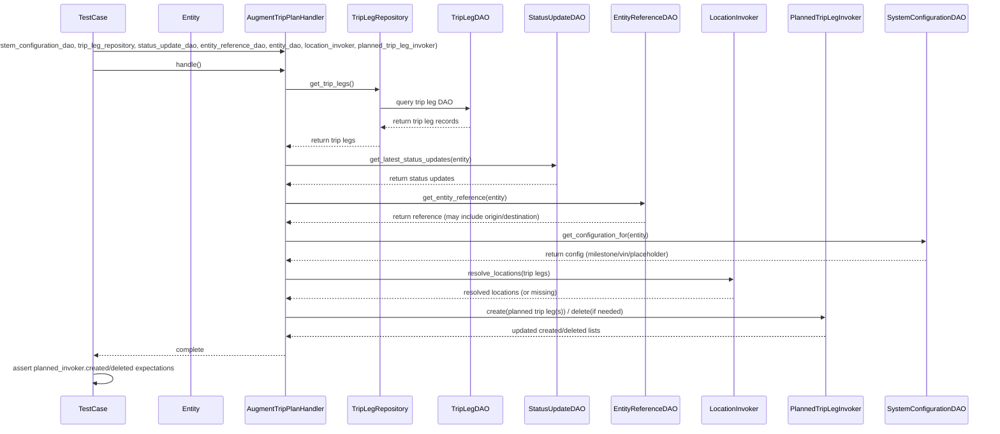

# Diagram: entity_core/entity_service/entity_service_tests/trip_leg_tests/test_augmented_trip_plan/test_augment_trip_plan_handler.py

> Auto-generated by Obscura crawlers

## Diagram 1

```mermaid
classDiagram
    class AugmentTripPlanHandler {
        -entity
        -system_configuration_dao
        -trip_leg_repository
        -status_update_dao
        -entity_reference_dao
        -entity_dao
        -location_invoker
        -planned_trip_leg_invoker
        +handle()
    }
    class Entity {
        +id
        +type
    }
    class TripLegRepository {
        +trip_leg_dao
        +location_invoker
        +get_trip_legs()
    }
    class TripPlanTestData
    class FakeTripLegRepository
    class FakeTripLegDAO
    class FakeStatusUpdateDAO
    class FakeStatusUpdateWithoutOriginDAO
    class FakeEntityReferenceDAO
    class FakeEntityReferenceWithoutOriginDAO
    class FakeEntityReferenceWithoutDestinationDAO
    class FakeLocationInvoker
    class FakePlannedTripLegInvoker {
        +created
        +deleted
        +create()
        +delete()
    }
    class FakeMilestoneSystemConfigurationDAO
    class FakeVINReferenceSystemConfigurationDAO
    class FakeEntityDAO
    class FakeFVPlaceholderSystemConfigurationDAO

    AugmentTripPlanHandler --> Entity : uses
    AugmentTripPlanHandler --> TripLegRepository : uses
    AugmentTripPlanHandler --> FakeMilestoneSystemConfigurationDAO : uses
    AugmentTripPlanHandler --> FakeVINReferenceSystemConfigurationDAO : uses
    AugmentTripPlanHandler --> FakeFVPlaceholderSystemConfigurationDAO : uses
    AugmentTripPlanHandler --> FakeStatusUpdateDAO : uses
    AugmentTripPlanHandler --> FakeStatusUpdateWithoutOriginDAO : uses
    AugmentTripPlanHandler --> FakeEntityReferenceDAO : uses
    AugmentTripPlanHandler --> FakeEntityReferenceWithoutOriginDAO : uses
    AugmentTripPlanHandler --> FakeEntityReferenceWithoutDestinationDAO : uses
    AugmentTripPlanHandler --> FakeEntityDAO : uses
    AugmentTripPlanHandler --> FakeLocationInvoker : uses
    AugmentTripPlanHandler --> FakePlannedTripLegInvoker : uses

    TripLegRepository o-- FakeTripLegDAO : contains
    TripLegRepository --> FakeLocationInvoker : uses
```

### SVG

<svg id="container" width="3605.4609375" xmlns="http://www.w3.org/2000/svg" class="classDiagram" height="752" viewBox="0 0 3605.4609375 752" role="graphics-document document" aria-roledescription="class"><g><defs><marker id="container_class-aggregationStart" class="marker aggregation class" refX="18" refY="7" markerWidth="190" markerHeight="240" orient="auto"><path d="M 18,7 L9,13 L1,7 L9,1 Z"></path></marker></defs><defs><marker id="container_class-aggregationEnd" class="marker aggregation class" refX="1" refY="7" markerWidth="20" markerHeight="28" orient="auto"><path d="M 18,7 L9,13 L1,7 L9,1 Z"></path></marker></defs><defs><marker id="container_class-extensionStart" class="marker extension class" refX="18" refY="7" markerWidth="190" markerHeight="240" orient="auto"><path d="M 1,7 L18,13 V 1 Z"></path></marker></defs><defs><marker id="container_class-extensionEnd" class="marker extension class" refX="1" refY="7" markerWidth="20" markerHeight="28" orient="auto"><path d="M 1,1 V 13 L18,7 Z"></path></marker></defs><defs><marker id="container_class-compositionStart" class="marker composition class" refX="18" refY="7" markerWidth="190" markerHeight="240" orient="auto"><path d="M 18,7 L9,13 L1,7 L9,1 Z"></path></marker></defs><defs><marker id="container_class-compositionEnd" class="marker composition class" refX="1" refY="7" markerWidth="20" markerHeight="28" orient="auto"><path d="M 18,7 L9,13 L1,7 L9,1 Z"></path></marker></defs><defs><marker id="container_class-dependencyStart" class="marker dependency class" refX="6" refY="7" markerWidth="190" markerHeight="240" orient="auto"><path d="M 5,7 L9,13 L1,7 L9,1 Z"></path></marker></defs><defs><marker id="container_class-dependencyEnd" class="marker dependency class" refX="13" refY="7" markerWidth="20" markerHeight="28" orient="auto"><path d="M 18,7 L9,13 L14,7 L9,1 Z"></path></marker></defs><defs><marker id="container_class-lollipopStart" class="marker lollipop class" refX="13" refY="7" markerWidth="190" markerHeight="240" orient="auto"><circle stroke="black" fill="transparent" cx="7" cy="7" r="6"></circle></marker></defs><defs><marker id="container_class-lollipopEnd" class="marker lollipop class" refX="1" refY="7" markerWidth="190" markerHeight="240" orient="auto"><circle stroke="black" fill="transparent" cx="7" cy="7" r="6"></circle></marker></defs><g class="root"><g class="clusters"></g><g class="edgePaths"><path d="M1781.309,179.984L1492.839,209.486C1204.37,238.989,627.431,297.995,338.962,336.664C50.492,375.333,50.492,393.667,50.492,402.833L50.492,412" id="id_AugmentTripPlanHandler_Entity_1" class="edge-thickness-normal edge-pattern-solid relation" style=";;;" data-edge="true" data-et="edge" data-id="id_AugmentTripPlanHandler_Entity_1" data-points="W3sieCI6MTc4MS4zMDg1OTM3NSwieSI6MTc5Ljk4Mzc5MDAzODQ2MDF9LHsieCI6NTAuNDkyMTg3NSwieSI6MzU3fSx7IngiOjUwLjQ5MjE4NzUsInkiOjQxOH1d" marker-end="url(#container_class-dependencyEnd)"></path><path d="M1781.309,181.906L1526.602,211.088C1271.895,240.271,762.48,298.635,507.773,334.984C253.066,371.333,253.066,385.667,253.066,392.833L253.066,400" id="id_AugmentTripPlanHandler_TripLegRepository_2" class="edge-thickness-normal edge-pattern-solid relation" style=";;;" data-edge="true" data-et="edge" data-id="id_AugmentTripPlanHandler_TripLegRepository_2" data-points="W3sieCI6MTc4MS4zMDg1OTM3NSwieSI6MTgxLjkwNTkzMzgzMjUxNTE2fSx7IngiOjI1My4wNjY0MDYyNSwieSI6MzU3fSx7IngiOjI1My4wNjY0MDYyNSwieSI6NDA2fV0=" marker-end="url(#container_class-dependencyEnd)"></path><path d="M1781.309,186.035L1579.208,214.529C1377.107,243.023,972.905,300.012,770.804,342.672C568.703,385.333,568.703,413.667,568.703,427.833L568.703,442" id="id_AugmentTripPlanHandler_FakeMilestoneSystemConfigurationDAO_3" class="edge-thickness-normal edge-pattern-solid relation" style=";;;" data-edge="true" data-et="edge" data-id="id_AugmentTripPlanHandler_FakeMilestoneSystemConfigurationDAO_3" data-points="W3sieCI6MTc4MS4zMDg1OTM3NSwieSI6MTg2LjAzNDY1NjgyNzQ5NDl9LHsieCI6NTY4LjcwMzEyNSwieSI6MzU3fSx7IngiOjU2OC43MDMxMjUsInkiOjQ0OH1d" marker-end="url(#container_class-dependencyEnd)"></path><path d="M1781.309,194.318L1641.544,221.432C1501.779,248.546,1222.249,302.773,1082.484,344.053C942.719,385.333,942.719,413.667,942.719,427.833L942.719,442" id="id_AugmentTripPlanHandler_FakeVINReferenceSystemConfigurationDAO_4" class="edge-thickness-normal edge-pattern-solid relation" style=";;;" data-edge="true" data-et="edge" data-id="id_AugmentTripPlanHandler_FakeVINReferenceSystemConfigurationDAO_4" data-points="W3sieCI6MTc4MS4zMDg1OTM3NSwieSI6MTk0LjMxODQxNzA0MzU5ODQzfSx7IngiOjk0Mi43MTg3NSwieSI6MzU3fSx7IngiOjk0Mi43MTg3NSwieSI6NDQ4fV0=" marker-end="url(#container_class-dependencyEnd)"></path><path d="M1781.309,213.887L1706.584,237.739C1631.859,261.591,1482.41,309.296,1407.686,347.314C1332.961,385.333,1332.961,413.667,1332.961,427.833L1332.961,442" id="id_AugmentTripPlanHandler_FakeFVPlaceholderSystemConfigurationDAO_5" class="edge-thickness-normal edge-pattern-solid relation" style=";;;" data-edge="true" data-et="edge" data-id="id_AugmentTripPlanHandler_FakeFVPlaceholderSystemConfigurationDAO_5" data-points="W3sieCI6MTc4MS4zMDg1OTM3NSwieSI6MjEzLjg4NjUzMzY2NTgzNTR9LHsieCI6MTMzMi45NjA5Mzc1LCJ5IjozNTd9LHsieCI6MTMzMi45NjA5Mzc1LCJ5Ijo0NDh9XQ==" marker-end="url(#container_class-dependencyEnd)"></path><path d="M1781.309,268.365L1759.187,283.137C1737.065,297.91,1692.822,327.455,1670.7,356.394C1648.578,385.333,1648.578,413.667,1648.578,427.833L1648.578,442" id="id_AugmentTripPlanHandler_FakeStatusUpdateDAO_6" class="edge-thickness-normal edge-pattern-solid relation" style=";;;" data-edge="true" data-et="edge" data-id="id_AugmentTripPlanHandler_FakeStatusUpdateDAO_6" data-points="W3sieCI6MTc4MS4zMDg1OTM3NSwieSI6MjY4LjM2NDcyMTMwNjE1Nzh9LHsieCI6MTY0OC41NzgxMjUsInkiOjM1N30seyJ4IjoxNjQ4LjU3ODEyNSwieSI6NDQ4fV0=" marker-end="url(#container_class-dependencyEnd)"></path><path d="M1937.594,320L1937.594,326.167C1937.594,332.333,1937.594,344.667,1937.594,365C1937.594,385.333,1937.594,413.667,1937.594,427.833L1937.594,442" id="id_AugmentTripPlanHandler_FakeStatusUpdateWithoutOriginDAO_7" class="edge-thickness-normal edge-pattern-solid relation" style=";;;" data-edge="true" data-et="edge" data-id="id_AugmentTripPlanHandler_FakeStatusUpdateWithoutOriginDAO_7" data-points="W3sieCI6MTkzNy41OTM3NSwieSI6MzIwfSx7IngiOjE5MzcuNTkzNzUsInkiOjM1N30seyJ4IjoxOTM3LjU5Mzc1LCJ5Ijo0NDh9XQ==" marker-end="url(#container_class-dependencyEnd)"></path><path d="M2093.879,265.631L2117.296,280.859C2140.714,296.087,2187.548,326.544,2210.965,355.939C2234.383,385.333,2234.383,413.667,2234.383,427.833L2234.383,442" id="id_AugmentTripPlanHandler_FakeEntityReferenceDAO_8" class="edge-thickness-normal edge-pattern-solid relation" style=";;;" data-edge="true" data-et="edge" data-id="id_AugmentTripPlanHandler_FakeEntityReferenceDAO_8" data-points="W3sieCI6MjA5My44Nzg5MDYyNSwieSI6MjY1LjYzMTIyMjE5NTg5ODgzfSx7IngiOjIyMzQuMzgyODEyNSwieSI6MzU3fSx7IngiOjIyMzQuMzgyODEyNSwieSI6NDQ4fV0=" marker-end="url(#container_class-dependencyEnd)"></path><path d="M2093.879,214.159L2168.057,237.966C2242.234,261.772,2390.59,309.386,2464.768,347.36C2538.945,385.333,2538.945,413.667,2538.945,427.833L2538.945,442" id="id_AugmentTripPlanHandler_FakeEntityReferenceWithoutOriginDAO_9" class="edge-thickness-normal edge-pattern-solid relation" style=";;;" data-edge="true" data-et="edge" data-id="id_AugmentTripPlanHandler_FakeEntityReferenceWithoutOriginDAO_9" data-points="W3sieCI6MjA5My44Nzg5MDYyNSwieSI6MjE0LjE1ODczNzQ3OTM3NTg3fSx7IngiOjI1MzguOTQ1MzEyNSwieSI6MzU3fSx7IngiOjI1MzguOTQ1MzEyNSwieSI6NDQ4fV0=" marker-end="url(#container_class-dependencyEnd)"></path><path d="M2093.879,194.859L2230.74,221.882C2367.602,248.906,2641.324,302.953,2778.186,344.143C2915.047,385.333,2915.047,413.667,2915.047,427.833L2915.047,442" id="id_AugmentTripPlanHandler_FakeEntityReferenceWithoutDestinationDAO_10" class="edge-thickness-normal edge-pattern-solid relation" style=";;;" data-edge="true" data-et="edge" data-id="id_AugmentTripPlanHandler_FakeEntityReferenceWithoutDestinationDAO_10" data-points="W3sieCI6MjA5My44Nzg5MDYyNSwieSI6MTk0Ljg1ODgwNDc3MDA0OTcyfSx7IngiOjI5MTUuMDQ2ODc1LCJ5IjozNTd9LHsieCI6MjkxNS4wNDY4NzUsInkiOjQ0OH1d" marker-end="url(#container_class-dependencyEnd)"></path><path d="M2093.879,187.831L2278.783,216.026C2463.688,244.221,2833.496,300.61,3018.4,342.972C3203.305,385.333,3203.305,413.667,3203.305,427.833L3203.305,442" id="id_AugmentTripPlanHandler_FakeEntityDAO_11" class="edge-thickness-normal edge-pattern-solid relation" style=";;;" data-edge="true" data-et="edge" data-id="id_AugmentTripPlanHandler_FakeEntityDAO_11" data-points="W3sieCI6MjA5My44Nzg5MDYyNSwieSI6MTg3LjgzMDkwMzQ1NzE3MjY3fSx7IngiOjMyMDMuMzA0Njg3NSwieSI6MzU3fSx7IngiOjMyMDMuMzA0Njg3NSwieSI6NDQ4fV0=" marker-end="url(#container_class-dependencyEnd)"></path><path d="M2093.879,185.821L2298.217,214.351C2502.555,242.88,2911.23,299.94,3115.568,350.637C3319.906,401.333,3319.906,445.667,3319.906,490C3319.906,534.333,3319.906,578.667,3317.477,606.092C3315.048,633.518,3310.189,644.035,3307.76,649.294L3305.331,654.553" id="id_AugmentTripPlanHandler_FakeLocationInvoker_12" class="edge-thickness-normal edge-pattern-solid relation" style=";;;" data-edge="true" data-et="edge" data-id="id_AugmentTripPlanHandler_FakeLocationInvoker_12" data-points="W3sieCI6MjA5My44Nzg5MDYyNSwieSI6MTg1LjgyMDcwNjM1NzEwMDg3fSx7IngiOjMzMTkuOTA2MjUsInkiOjM1N30seyJ4IjozMzE5LjkwNjI1LCJ5Ijo0OTB9LHsieCI6MzMxOS45MDYyNSwieSI6NjIzfSx7IngiOjMzMDIuODE0OTcyMzEwMTI2NCwieSI6NjYwfV0=" marker-end="url(#container_class-dependencyEnd)"></path><path d="M2093.879,183.5L2325.637,212.417C2557.396,241.333,3020.913,299.167,3252.671,333.25C3484.43,367.333,3484.43,377.667,3484.43,382.833L3484.43,388" id="id_AugmentTripPlanHandler_FakePlannedTripLegInvoker_13" class="edge-thickness-normal edge-pattern-solid relation" style=";;;" data-edge="true" data-et="edge" data-id="id_AugmentTripPlanHandler_FakePlannedTripLegInvoker_13" data-points="W3sieCI6MjA5My44Nzg5MDYyNSwieSI6MTgzLjQ5OTgyODI3ODQ5MTl9LHsieCI6MzQ4NC40Mjk2ODc1LCJ5IjozNTd9LHsieCI6MzQ4NC40Mjk2ODc1LCJ5IjozOTR9XQ==" marker-end="url(#container_class-dependencyEnd)"></path><path d="M227.552,590.722L226.189,596.102C224.826,601.481,222.101,612.241,220.738,623.787C219.375,635.333,219.375,647.667,219.375,653.833L219.375,660" id="id_TripLegRepository_FakeTripLegDAO_14" class="edge-thickness-normal edge-pattern-solid relation" style=";;;" data-edge="true" data-et="edge" data-id="id_TripLegRepository_FakeTripLegDAO_14" data-points="W3sieCI6MjMxLjc4NzYyMzM1NTI2MzE1LCJ5Ijo1NzR9LHsieCI6MjE5LjM3NSwieSI6NjIzfSx7IngiOjIxOS4zNzUsInkiOjY2MH1d" marker-start="url(#container_class-aggregationStart)"></path><path d="M363.148,499.663L597.33,520.219C831.512,540.775,1299.876,581.888,1771.016,614.799C2242.155,647.71,2716.07,672.419,2953.027,684.774L3189.985,697.129" id="id_TripLegRepository_FakeLocationInvoker_15" class="edge-thickness-normal edge-pattern-solid relation" style=";;;" data-edge="true" data-et="edge" data-id="id_TripLegRepository_FakeLocationInvoker_15" data-points="W3sieCI6MzYzLjE0ODQzNzUsInkiOjQ5OS42NjI4NTg0MDI0MzY4fSx7IngiOjE3NjguMjQwMjM0Mzc1LCJ5Ijo2MjN9LHsieCI6MzE5NS45NzY1NjI1LCJ5Ijo2OTcuNDQxMDc1ODg3MjgwOX1d" marker-end="url(#container_class-dependencyEnd)"></path></g><g class="edgeLabels"><g class="edgeLabel" transform="translate(50.4921875, 357)"><g class="label" data-id="id_AugmentTripPlanHandler_Entity_1" transform="translate(-16.4921875, -12)"><foreignObject width="32.984375" height="24">

uses

</foreignObject></g></g><g class="edgeLabel" transform="translate(253.06640625, 357)"><g class="label" data-id="id_AugmentTripPlanHandler_TripLegRepository_2" transform="translate(-16.4921875, -12)"><foreignObject width="32.984375" height="24">

uses

</foreignObject></g></g><g class="edgeLabel" transform="translate(568.703125, 357)"><g class="label" data-id="id_AugmentTripPlanHandler_FakeMilestoneSystemConfigurationDAO_3" transform="translate(-16.4921875, -12)"><foreignObject width="32.984375" height="24">

uses

</foreignObject></g></g><g class="edgeLabel" transform="translate(942.71875, 357)"><g class="label" data-id="id_AugmentTripPlanHandler_FakeVINReferenceSystemConfigurationDAO_4" transform="translate(-16.4921875, -12)"><foreignObject width="32.984375" height="24">

uses

</foreignObject></g></g><g class="edgeLabel" transform="translate(1332.9609375, 357)"><g class="label" data-id="id_AugmentTripPlanHandler_FakeFVPlaceholderSystemConfigurationDAO_5" transform="translate(-16.4921875, -12)"><foreignObject width="32.984375" height="24">

uses

</foreignObject></g></g><g class="edgeLabel" transform="translate(1648.578125, 357)"><g class="label" data-id="id_AugmentTripPlanHandler_FakeStatusUpdateDAO_6" transform="translate(-16.4921875, -12)"><foreignObject width="32.984375" height="24">

uses

</foreignObject></g></g><g class="edgeLabel" transform="translate(1937.59375, 357)"><g class="label" data-id="id_AugmentTripPlanHandler_FakeStatusUpdateWithoutOriginDAO_7" transform="translate(-16.4921875, -12)"><foreignObject width="32.984375" height="24">

uses

</foreignObject></g></g><g class="edgeLabel" transform="translate(2234.3828125, 357)"><g class="label" data-id="id_AugmentTripPlanHandler_FakeEntityReferenceDAO_8" transform="translate(-16.4921875, -12)"><foreignObject width="32.984375" height="24">

uses

</foreignObject></g></g><g class="edgeLabel" transform="translate(2538.9453125, 357)"><g class="label" data-id="id_AugmentTripPlanHandler_FakeEntityReferenceWithoutOriginDAO_9" transform="translate(-16.4921875, -12)"><foreignObject width="32.984375" height="24">

uses

</foreignObject></g></g><g class="edgeLabel" transform="translate(2915.046875, 357)"><g class="label" data-id="id_AugmentTripPlanHandler_FakeEntityReferenceWithoutDestinationDAO_10" transform="translate(-16.4921875, -12)"><foreignObject width="32.984375" height="24">

uses

</foreignObject></g></g><g class="edgeLabel" transform="translate(3203.3046875, 357)"><g class="label" data-id="id_AugmentTripPlanHandler_FakeEntityDAO_11" transform="translate(-16.4921875, -12)"><foreignObject width="32.984375" height="24">

uses

</foreignObject></g></g><g class="edgeLabel" transform="translate(3319.90625, 490)"><g class="label" data-id="id_AugmentTripPlanHandler_FakeLocationInvoker_12" transform="translate(-16.4921875, -12)"><foreignObject width="32.984375" height="24">

uses

</foreignObject></g></g><g class="edgeLabel" transform="translate(3484.4296875, 357)"><g class="label" data-id="id_AugmentTripPlanHandler_FakePlannedTripLegInvoker_13" transform="translate(-16.4921875, -12)"><foreignObject width="32.984375" height="24">

uses

</foreignObject></g></g><g class="edgeLabel" transform="translate(219.375, 623)"><g class="label" data-id="id_TripLegRepository_FakeTripLegDAO_14" transform="translate(-30.890625, -12)"><foreignObject width="61.78125" height="24">

contains

</foreignObject></g></g><g class="edgeLabel" transform="translate(1777.81776, 623.49936)"><g class="label" data-id="id_TripLegRepository_FakeLocationInvoker_15" transform="translate(-16.4921875, -12)"><foreignObject width="32.984375" height="24">

uses

</foreignObject></g></g></g><g class="nodes"><g class="node default" id="classId-AugmentTripPlanHandler-0" transform="translate(1937.59375, 164)"><g class="basic label-container"><path d="M-156.28515625 -156 L156.28515625 -156 L156.28515625 156 L-156.28515625 156" stroke="none" stroke-width="0" fill="#ECECFF" style=""></path><path d="M-156.28515625 -156 C-57.64943803290572 -156, 40.98628018418856 -156, 156.28515625 -156 M-156.28515625 -156 C-45.323403389280784 -156, 65.63834947143843 -156, 156.28515625 -156 M156.28515625 -156 C156.28515625 -46.88446076727408, 156.28515625 62.231078465451844, 156.28515625 156 M156.28515625 -156 C156.28515625 -50.63559889066025, 156.28515625 54.728802218679505, 156.28515625 156 M156.28515625 156 C60.06559636504235 156, -36.153963519915294 156, -156.28515625 156 M156.28515625 156 C38.9581011369073 156, -78.3689539761854 156, -156.28515625 156 M-156.28515625 156 C-156.28515625 73.1918371309396, -156.28515625 -9.616325738120793, -156.28515625 -156 M-156.28515625 156 C-156.28515625 51.50516237457697, -156.28515625 -52.98967525084606, -156.28515625 -156" stroke="#9370DB" stroke-width="1.3" fill="none" stroke-dasharray="0 0" style=""></path></g><g class="annotation-group text" transform="translate(0, -132)"></g><g class="label-group text" transform="translate(-92.0546875, -132)"><g class="label" style="font-weight: bolder" transform="translate(0,-12)"><foreignObject width="184.109375" height="24">

AugmentTripPlanHandler

</foreignObject></g></g><g class="members-group text" transform="translate(-144.28515625, -84)"><g class="label" style="" transform="translate(0,-12)"><foreignObject width="48.40625" height="24">

-entity

</foreignObject></g><g class="label" style="" transform="translate(0,12)"><foreignObject width="196.515625" height="24">

-system_configuration_dao

</foreignObject></g><g class="label" style="" transform="translate(0,36)"><foreignObject width="144.390625" height="24">

-trip_leg_repository

</foreignObject></g><g class="label" style="" transform="translate(0,60)"><foreignObject width="145.171875" height="24">

-status_update_dao

</foreignObject></g><g class="label" style="" transform="translate(0,84)"><foreignObject width="159.71875" height="24">

-entity_reference_dao

</foreignObject></g><g class="label" style="" transform="translate(0,108)"><foreignObject width="83.546875" height="24">

-entity_dao

</foreignObject></g><g class="label" style="" transform="translate(0,132)"><foreignObject width="127.796875" height="24">

-location_invoker

</foreignObject></g><g class="label" style="" transform="translate(0,156)"><foreignObject width="192.03125" height="24">

-planned_trip_leg_invoker

</foreignObject></g></g><g class="methods-group text" transform="translate(-144.28515625, 132)"><g class="label" style="" transform="translate(0,-12)"><foreignObject width="68.71875" height="24">

+handle()

</foreignObject></g></g><g class="divider" style=""><path d="M-156.28515625 -108 C-63.08394852000502 -108, 30.117259209989953 -108, 156.28515625 -108 M-156.28515625 -108 C-40.999243281142455 -108, 74.28666968771509 -108, 156.28515625 -108" stroke="#9370DB" stroke-width="1.3" fill="none" stroke-dasharray="0 0" style=""></path></g><g class="divider" style=""><path d="M-156.28515625 108 C-33.29611383495023 108, 89.69292858009953 108, 156.28515625 108 M-156.28515625 108 C-52.102764070693 108, 52.079628108614 108, 156.28515625 108" stroke="#9370DB" stroke-width="1.3" fill="none" stroke-dasharray="0 0" style=""></path></g></g><g class="node default" id="classId-Entity-1" transform="translate(50.4921875, 490)"><g class="basic label-container"><path d="M-42.4921875 -72 L42.4921875 -72 L42.4921875 72 L-42.4921875 72" stroke="none" stroke-width="0" fill="#ECECFF" style=""></path><path d="M-42.4921875 -72 C-22.54877399717581 -72, -2.605360494351622 -72, 42.4921875 -72 M-42.4921875 -72 C-18.3223305450164 -72, 5.847526409967202 -72, 42.4921875 -72 M42.4921875 -72 C42.4921875 -42.33263781883775, 42.4921875 -12.665275637675514, 42.4921875 72 M42.4921875 -72 C42.4921875 -33.55908455343062, 42.4921875 4.881830893138755, 42.4921875 72 M42.4921875 72 C18.337103998296026 72, -5.817979503407948 72, -42.4921875 72 M42.4921875 72 C12.637123171922298 72, -17.217941156155405 72, -42.4921875 72 M-42.4921875 72 C-42.4921875 24.41091488777068, -42.4921875 -23.17817022445864, -42.4921875 -72 M-42.4921875 72 C-42.4921875 21.9442866470731, -42.4921875 -28.111426705853802, -42.4921875 -72" stroke="#9370DB" stroke-width="1.3" fill="none" stroke-dasharray="0 0" style=""></path></g><g class="annotation-group text" transform="translate(0, -48)"></g><g class="label-group text" transform="translate(-21.28125, -48)"><g class="label" style="font-weight: bolder" transform="translate(0,-12)"><foreignObject width="42.5625" height="24">

Entity

</foreignObject></g></g><g class="members-group text" transform="translate(-30.4921875, 0)"><g class="label" style="" transform="translate(0,-12)"><foreignObject width="22.078125" height="24">

+id

</foreignObject></g><g class="label" style="" transform="translate(0,12)"><foreignObject width="39.703125" height="24">

+type

</foreignObject></g></g><g class="methods-group text" transform="translate(-30.4921875, 72)"></g><g class="divider" style=""><path d="M-42.4921875 -24 C-13.318963235658078 -24, 15.854261028683844 -24, 42.4921875 -24 M-42.4921875 -24 C-9.41951001479832 -24, 23.65316747040336 -24, 42.4921875 -24" stroke="#9370DB" stroke-width="1.3" fill="none" stroke-dasharray="0 0" style=""></path></g><g class="divider" style=""><path d="M-42.4921875 48 C-19.029077517058525 48, 4.43403246588295 48, 42.4921875 48 M-42.4921875 48 C-21.812937819665837 48, -1.1336881393316744 48, 42.4921875 48" stroke="#9370DB" stroke-width="1.3" fill="none" stroke-dasharray="0 0" style=""></path></g></g><g class="node default" id="classId-TripLegRepository-2" transform="translate(253.06640625, 490)"><g class="basic label-container"><path d="M-110.08203125 -84 L110.08203125 -84 L110.08203125 84 L-110.08203125 84" stroke="none" stroke-width="0" fill="#ECECFF" style=""></path><path d="M-110.08203125 -84 C-33.281293799513094 -84, 43.51944365097381 -84, 110.08203125 -84 M-110.08203125 -84 C-43.68398335573177 -84, 22.714064538536462 -84, 110.08203125 -84 M110.08203125 -84 C110.08203125 -18.34447320228547, 110.08203125 47.31105359542906, 110.08203125 84 M110.08203125 -84 C110.08203125 -43.69609085548724, 110.08203125 -3.3921817109744836, 110.08203125 84 M110.08203125 84 C26.206275404614374 84, -57.66948044077125 84, -110.08203125 84 M110.08203125 84 C36.90356023513564 84, -36.274910779728714 84, -110.08203125 84 M-110.08203125 84 C-110.08203125 40.601790345756704, -110.08203125 -2.796419308486591, -110.08203125 -84 M-110.08203125 84 C-110.08203125 38.24812110183942, -110.08203125 -7.503757796321153, -110.08203125 -84" stroke="#9370DB" stroke-width="1.3" fill="none" stroke-dasharray="0 0" style=""></path></g><g class="annotation-group text" transform="translate(0, -60)"></g><g class="label-group text" transform="translate(-66.8203125, -60)"><g class="label" style="font-weight: bolder" transform="translate(0,-12)"><foreignObject width="133.640625" height="24">

TripLegRepository

</foreignObject></g></g><g class="members-group text" transform="translate(-98.08203125, -12)"><g class="label" style="" transform="translate(0,-12)"><foreignObject width="99.046875" height="24">

+trip_leg_dao

</foreignObject></g><g class="label" style="" transform="translate(0,12)"><foreignObject width="129.34375" height="24">

+location_invoker

</foreignObject></g></g><g class="methods-group text" transform="translate(-98.08203125, 60)"><g class="label" style="" transform="translate(0,-12)"><foreignObject width="111.734375" height="24">

+get_trip_legs()

</foreignObject></g></g><g class="divider" style=""><path d="M-110.08203125 -36 C-45.86945807460425 -36, 18.343115100791493 -36, 110.08203125 -36 M-110.08203125 -36 C-64.22666946489844 -36, -18.371307679796857 -36, 110.08203125 -36" stroke="#9370DB" stroke-width="1.3" fill="none" stroke-dasharray="0 0" style=""></path></g><g class="divider" style=""><path d="M-110.08203125 36 C-50.62100181336076 36, 8.840027623278473 36, 110.08203125 36 M-110.08203125 36 C-48.18008160259925 36, 13.721868044801496 36, 110.08203125 36" stroke="#9370DB" stroke-width="1.3" fill="none" stroke-dasharray="0 0" style=""></path></g></g><g class="node default" id="classId-TripPlanTestData-3" transform="translate(2218.39453125, 164)"><g class="basic label-container"><path d="M-74.515625 -42 L74.515625 -42 L74.515625 42 L-74.515625 42" stroke="none" stroke-width="0" fill="#ECECFF" style=""></path><path d="M-74.515625 -42 C-16.46221801365779 -42, 41.59118897268442 -42, 74.515625 -42 M-74.515625 -42 C-18.80576739164217 -42, 36.90409021671566 -42, 74.515625 -42 M74.515625 -42 C74.515625 -23.92205249016356, 74.515625 -5.844104980327117, 74.515625 42 M74.515625 -42 C74.515625 -16.41632067934791, 74.515625 9.167358641304183, 74.515625 42 M74.515625 42 C29.050220669052457 42, -16.415183661895085 42, -74.515625 42 M74.515625 42 C16.847222105509516 42, -40.82118078898097 42, -74.515625 42 M-74.515625 42 C-74.515625 12.29686636721165, -74.515625 -17.4062672655767, -74.515625 -42 M-74.515625 42 C-74.515625 14.350938945568338, -74.515625 -13.298122108863325, -74.515625 -42" stroke="#9370DB" stroke-width="1.3" fill="none" stroke-dasharray="0 0" style=""></path></g><g class="annotation-group text" transform="translate(0, -18)"></g><g class="label-group text" transform="translate(-62.515625, -18)"><g class="label" style="font-weight: bolder" transform="translate(0,-12)"><foreignObject width="125.03125" height="24">

TripPlanTestData

</foreignObject></g></g><g class="members-group text" transform="translate(-62.515625, 30)"></g><g class="methods-group text" transform="translate(-62.515625, 60)"></g><g class="divider" style=""><path d="M-74.515625 6 C-35.26265040185088 6, 3.9903241962982463 6, 74.515625 6 M-74.515625 6 C-35.585005016880494 6, 3.345614966239012 6, 74.515625 6" stroke="#9370DB" stroke-width="1.3" fill="none" stroke-dasharray="0 0" style=""></path></g><g class="divider" style=""><path d="M-74.515625 24 C-19.235198344942745 24, 36.04522831011451 24, 74.515625 24 M-74.515625 24 C-37.006998900114105 24, 0.5016271997717894 24, 74.515625 24" stroke="#9370DB" stroke-width="1.3" fill="none" stroke-dasharray="0 0" style=""></path></g></g><g class="node default" id="classId-FakeTripLegRepository-4" transform="translate(2438.26171875, 164)"><g class="basic label-container"><path d="M-95.3515625 -42 L95.3515625 -42 L95.3515625 42 L-95.3515625 42" stroke="none" stroke-width="0" fill="#ECECFF" style=""></path><path d="M-95.3515625 -42 C-55.579360298360605 -42, -15.80715809672121 -42, 95.3515625 -42 M-95.3515625 -42 C-30.330998738212955 -42, 34.68956502357409 -42, 95.3515625 -42 M95.3515625 -42 C95.3515625 -12.224327510278368, 95.3515625 17.551344979443265, 95.3515625 42 M95.3515625 -42 C95.3515625 -14.793193362874977, 95.3515625 12.413613274250046, 95.3515625 42 M95.3515625 42 C31.15239077651428 42, -33.04678094697144 42, -95.3515625 42 M95.3515625 42 C35.74137169305136 42, -23.868819113897274 42, -95.3515625 42 M-95.3515625 42 C-95.3515625 19.027370883151015, -95.3515625 -3.9452582336979702, -95.3515625 -42 M-95.3515625 42 C-95.3515625 18.94099758547813, -95.3515625 -4.118004829043741, -95.3515625 -42" stroke="#9370DB" stroke-width="1.3" fill="none" stroke-dasharray="0 0" style=""></path></g><g class="annotation-group text" transform="translate(0, -18)"></g><g class="label-group text" transform="translate(-83.3515625, -18)"><g class="label" style="font-weight: bolder" transform="translate(0,-12)"><foreignObject width="166.703125" height="24">

FakeTripLegRepository

</foreignObject></g></g><g class="members-group text" transform="translate(-83.3515625, 30)"></g><g class="methods-group text" transform="translate(-83.3515625, 60)"></g><g class="divider" style=""><path d="M-95.3515625 6 C-27.518077551925984 6, 40.31540739614803 6, 95.3515625 6 M-95.3515625 6 C-23.111685635659455 6, 49.12819122868109 6, 95.3515625 6" stroke="#9370DB" stroke-width="1.3" fill="none" stroke-dasharray="0 0" style=""></path></g><g class="divider" style=""><path d="M-95.3515625 24 C-37.487731072727165 24, 20.37610035454567 24, 95.3515625 24 M-95.3515625 24 C-30.786429742564366 24, 33.77870301487127 24, 95.3515625 24" stroke="#9370DB" stroke-width="1.3" fill="none" stroke-dasharray="0 0" style=""></path></g></g><g class="node default" id="classId-FakeTripLegDAO-5" transform="translate(219.375, 702)"><g class="basic label-container"><path d="M-70.875 -42 L70.875 -42 L70.875 42 L-70.875 42" stroke="none" stroke-width="0" fill="#ECECFF" style=""></path><path d="M-70.875 -42 C-30.32666384125225 -42, 10.221672317495504 -42, 70.875 -42 M-70.875 -42 C-25.470563509231212 -42, 19.933872981537576 -42, 70.875 -42 M70.875 -42 C70.875 -15.223479184673561, 70.875 11.553041630652878, 70.875 42 M70.875 -42 C70.875 -24.00845118835855, 70.875 -6.016902376717098, 70.875 42 M70.875 42 C35.659863660723815 42, 0.4447273214476297 42, -70.875 42 M70.875 42 C26.72769592508915 42, -17.4196081498217 42, -70.875 42 M-70.875 42 C-70.875 9.701586419240726, -70.875 -22.596827161518547, -70.875 -42 M-70.875 42 C-70.875 22.513427140687007, -70.875 3.026854281374014, -70.875 -42" stroke="#9370DB" stroke-width="1.3" fill="none" stroke-dasharray="0 0" style=""></path></g><g class="annotation-group text" transform="translate(0, -18)"></g><g class="label-group text" transform="translate(-58.875, -18)"><g class="label" style="font-weight: bolder" transform="translate(0,-12)"><foreignObject width="117.75" height="24">

FakeTripLegDAO

</foreignObject></g></g><g class="members-group text" transform="translate(-58.875, 30)"></g><g class="methods-group text" transform="translate(-58.875, 60)"></g><g class="divider" style=""><path d="M-70.875 6 C-32.908282038591636 6, 5.058435922816727 6, 70.875 6 M-70.875 6 C-38.26071394128429 6, -5.646427882568574 6, 70.875 6" stroke="#9370DB" stroke-width="1.3" fill="none" stroke-dasharray="0 0" style=""></path></g><g class="divider" style=""><path d="M-70.875 24 C-41.03584486226 24, -11.196689724519999 24, 70.875 24 M-70.875 24 C-15.175264242741349 24, 40.5244715145173 24, 70.875 24" stroke="#9370DB" stroke-width="1.3" fill="none" stroke-dasharray="0 0" style=""></path></g></g><g class="node default" id="classId-FakeStatusUpdateDAO-6" transform="translate(1648.578125, 490)"><g class="basic label-container"><path d="M-93.8359375 -42 L93.8359375 -42 L93.8359375 42 L-93.8359375 42" stroke="none" stroke-width="0" fill="#ECECFF" style=""></path><path d="M-93.8359375 -42 C-33.56621769603203 -42, 26.703502107935947 -42, 93.8359375 -42 M-93.8359375 -42 C-33.41693207299481 -42, 27.002073354010378 -42, 93.8359375 -42 M93.8359375 -42 C93.8359375 -18.865882282720637, 93.8359375 4.268235434558726, 93.8359375 42 M93.8359375 -42 C93.8359375 -20.96146615388496, 93.8359375 0.07706769223008081, 93.8359375 42 M93.8359375 42 C22.926704438925853 42, -47.982528622148294 42, -93.8359375 42 M93.8359375 42 C45.688130477643 42, -2.459676544714 42, -93.8359375 42 M-93.8359375 42 C-93.8359375 25.173070470123708, -93.8359375 8.346140940247416, -93.8359375 -42 M-93.8359375 42 C-93.8359375 18.246745280159292, -93.8359375 -5.506509439681416, -93.8359375 -42" stroke="#9370DB" stroke-width="1.3" fill="none" stroke-dasharray="0 0" style=""></path></g><g class="annotation-group text" transform="translate(0, -18)"></g><g class="label-group text" transform="translate(-81.8359375, -18)"><g class="label" style="font-weight: bolder" transform="translate(0,-12)"><foreignObject width="163.671875" height="24">

FakeStatusUpdateDAO

</foreignObject></g></g><g class="members-group text" transform="translate(-81.8359375, 30)"></g><g class="methods-group text" transform="translate(-81.8359375, 60)"></g><g class="divider" style=""><path d="M-93.8359375 6 C-30.55648823163947 6, 32.72296103672106 6, 93.8359375 6 M-93.8359375 6 C-29.856791963303756 6, 34.12235357339249 6, 93.8359375 6" stroke="#9370DB" stroke-width="1.3" fill="none" stroke-dasharray="0 0" style=""></path></g><g class="divider" style=""><path d="M-93.8359375 24 C-44.88976464513742 24, 4.056408209725163 24, 93.8359375 24 M-93.8359375 24 C-26.643182632169797 24, 40.549572235660406 24, 93.8359375 24" stroke="#9370DB" stroke-width="1.3" fill="none" stroke-dasharray="0 0" style=""></path></g></g><g class="node default" id="classId-FakeStatusUpdateWithoutOriginDAO-7" transform="translate(1937.59375, 490)"><g class="basic label-container"><path d="M-145.1796875 -42 L145.1796875 -42 L145.1796875 42 L-145.1796875 42" stroke="none" stroke-width="0" fill="#ECECFF" style=""></path><path d="M-145.1796875 -42 C-36.49601929801179 -42, 72.18764890397642 -42, 145.1796875 -42 M-145.1796875 -42 C-66.05364707362341 -42, 13.072393352753181 -42, 145.1796875 -42 M145.1796875 -42 C145.1796875 -9.77367755505071, 145.1796875 22.45264488989858, 145.1796875 42 M145.1796875 -42 C145.1796875 -9.790625451187076, 145.1796875 22.41874909762585, 145.1796875 42 M145.1796875 42 C52.633680649051925 42, -39.91232620189615 42, -145.1796875 42 M145.1796875 42 C78.99016748299363 42, 12.800647465987254 42, -145.1796875 42 M-145.1796875 42 C-145.1796875 14.258295859002942, -145.1796875 -13.483408281994116, -145.1796875 -42 M-145.1796875 42 C-145.1796875 20.852086643853653, -145.1796875 -0.2958267122926941, -145.1796875 -42" stroke="#9370DB" stroke-width="1.3" fill="none" stroke-dasharray="0 0" style=""></path></g><g class="annotation-group text" transform="translate(0, -18)"></g><g class="label-group text" transform="translate(-133.1796875, -18)"><g class="label" style="font-weight: bolder" transform="translate(0,-12)"><foreignObject width="266.359375" height="24">

FakeStatusUpdateWithoutOriginDAO

</foreignObject></g></g><g class="members-group text" transform="translate(-133.1796875, 30)"></g><g class="methods-group text" transform="translate(-133.1796875, 60)"></g><g class="divider" style=""><path d="M-145.1796875 6 C-68.98096101104524 6, 7.2177654779095235 6, 145.1796875 6 M-145.1796875 6 C-34.63572780032467 6, 75.90823189935065 6, 145.1796875 6" stroke="#9370DB" stroke-width="1.3" fill="none" stroke-dasharray="0 0" style=""></path></g><g class="divider" style=""><path d="M-145.1796875 24 C-56.84804145610178 24, 31.483604587796435 24, 145.1796875 24 M-145.1796875 24 C-75.81915764626953 24, -6.458627792539062 24, 145.1796875 24" stroke="#9370DB" stroke-width="1.3" fill="none" stroke-dasharray="0 0" style=""></path></g></g><g class="node default" id="classId-FakeEntityReferenceDAO-8" transform="translate(2234.3828125, 490)"><g class="basic label-container"><path d="M-101.609375 -42 L101.609375 -42 L101.609375 42 L-101.609375 42" stroke="none" stroke-width="0" fill="#ECECFF" style=""></path><path d="M-101.609375 -42 C-49.26833448541123 -42, 3.0727060291775388 -42, 101.609375 -42 M-101.609375 -42 C-23.583081071846664 -42, 54.44321285630667 -42, 101.609375 -42 M101.609375 -42 C101.609375 -25.11175194839938, 101.609375 -8.22350389679876, 101.609375 42 M101.609375 -42 C101.609375 -14.95363008933193, 101.609375 12.092739821336139, 101.609375 42 M101.609375 42 C40.763030495600745 42, -20.08331400879851 42, -101.609375 42 M101.609375 42 C26.83845640694321 42, -47.93246218611358 42, -101.609375 42 M-101.609375 42 C-101.609375 25.16523833726269, -101.609375 8.330476674525379, -101.609375 -42 M-101.609375 42 C-101.609375 14.273465149514166, -101.609375 -13.453069700971668, -101.609375 -42" stroke="#9370DB" stroke-width="1.3" fill="none" stroke-dasharray="0 0" style=""></path></g><g class="annotation-group text" transform="translate(0, -18)"></g><g class="label-group text" transform="translate(-89.609375, -18)"><g class="label" style="font-weight: bolder" transform="translate(0,-12)"><foreignObject width="179.21875" height="24">

FakeEntityReferenceDAO

</foreignObject></g></g><g class="members-group text" transform="translate(-89.609375, 30)"></g><g class="methods-group text" transform="translate(-89.609375, 60)"></g><g class="divider" style=""><path d="M-101.609375 6 C-50.963625068593906 6, -0.31787513718781213 6, 101.609375 6 M-101.609375 6 C-40.116284235277426 6, 21.376806529445147 6, 101.609375 6" stroke="#9370DB" stroke-width="1.3" fill="none" stroke-dasharray="0 0" style=""></path></g><g class="divider" style=""><path d="M-101.609375 24 C-43.021266528702874 24, 15.566841942594252 24, 101.609375 24 M-101.609375 24 C-22.011804931110248 24, 57.585765137779504 24, 101.609375 24" stroke="#9370DB" stroke-width="1.3" fill="none" stroke-dasharray="0 0" style=""></path></g></g><g class="node default" id="classId-FakeEntityReferenceWithoutOriginDAO-9" transform="translate(2538.9453125, 490)"><g class="basic label-container"><path d="M-152.953125 -42 L152.953125 -42 L152.953125 42 L-152.953125 42" stroke="none" stroke-width="0" fill="#ECECFF" style=""></path><path d="M-152.953125 -42 C-83.37763834818179 -42, -13.80215169636358 -42, 152.953125 -42 M-152.953125 -42 C-63.86589571248756 -42, 25.221333575024886 -42, 152.953125 -42 M152.953125 -42 C152.953125 -21.64052368520234, 152.953125 -1.2810473704046785, 152.953125 42 M152.953125 -42 C152.953125 -20.23470089396514, 152.953125 1.5305982120697195, 152.953125 42 M152.953125 42 C35.80998932669685 42, -81.3331463466063 42, -152.953125 42 M152.953125 42 C35.353103782165704 42, -82.24691743566859 42, -152.953125 42 M-152.953125 42 C-152.953125 24.407067773285704, -152.953125 6.814135546571407, -152.953125 -42 M-152.953125 42 C-152.953125 9.735008869897761, -152.953125 -22.529982260204477, -152.953125 -42" stroke="#9370DB" stroke-width="1.3" fill="none" stroke-dasharray="0 0" style=""></path></g><g class="annotation-group text" transform="translate(0, -18)"></g><g class="label-group text" transform="translate(-140.953125, -18)"><g class="label" style="font-weight: bolder" transform="translate(0,-12)"><foreignObject width="281.90625" height="24">

FakeEntityReferenceWithoutOriginDAO

</foreignObject></g></g><g class="members-group text" transform="translate(-140.953125, 30)"></g><g class="methods-group text" transform="translate(-140.953125, 60)"></g><g class="divider" style=""><path d="M-152.953125 6 C-82.8449679064243 6, -12.736810812848603 6, 152.953125 6 M-152.953125 6 C-46.33227732895595 6, 60.28857034208809 6, 152.953125 6" stroke="#9370DB" stroke-width="1.3" fill="none" stroke-dasharray="0 0" style=""></path></g><g class="divider" style=""><path d="M-152.953125 24 C-83.33286739296534 24, -13.712609785930681 24, 152.953125 24 M-152.953125 24 C-41.71971202234771 24, 69.51370095530459 24, 152.953125 24" stroke="#9370DB" stroke-width="1.3" fill="none" stroke-dasharray="0 0" style=""></path></g></g><g class="node default" id="classId-FakeEntityReferenceWithoutDestinationDAO-10" transform="translate(2915.046875, 490)"><g class="basic label-container"><path d="M-173.1484375 -42 L173.1484375 -42 L173.1484375 42 L-173.1484375 42" stroke="none" stroke-width="0" fill="#ECECFF" style=""></path><path d="M-173.1484375 -42 C-94.6511845563092 -42, -16.153931612618408 -42, 173.1484375 -42 M-173.1484375 -42 C-83.82126691205752 -42, 5.5059036758849516 -42, 173.1484375 -42 M173.1484375 -42 C173.1484375 -10.69512956964703, 173.1484375 20.60974086070594, 173.1484375 42 M173.1484375 -42 C173.1484375 -18.89425769225085, 173.1484375 4.2114846154983, 173.1484375 42 M173.1484375 42 C69.83185094029251 42, -33.48473561941498 42, -173.1484375 42 M173.1484375 42 C72.57929316566485 42, -27.9898511686703 42, -173.1484375 42 M-173.1484375 42 C-173.1484375 10.796171892933984, -173.1484375 -20.407656214132032, -173.1484375 -42 M-173.1484375 42 C-173.1484375 18.623362741174148, -173.1484375 -4.753274517651704, -173.1484375 -42" stroke="#9370DB" stroke-width="1.3" fill="none" stroke-dasharray="0 0" style=""></path></g><g class="annotation-group text" transform="translate(0, -18)"></g><g class="label-group text" transform="translate(-161.1484375, -18)"><g class="label" style="font-weight: bolder" transform="translate(0,-12)"><foreignObject width="322.296875" height="24">

FakeEntityReferenceWithoutDestinationDAO

</foreignObject></g></g><g class="members-group text" transform="translate(-161.1484375, 30)"></g><g class="methods-group text" transform="translate(-161.1484375, 60)"></g><g class="divider" style=""><path d="M-173.1484375 6 C-42.834730494640354 6, 87.47897651071929 6, 173.1484375 6 M-173.1484375 6 C-40.10926851053864 6, 92.92990047892272 6, 173.1484375 6" stroke="#9370DB" stroke-width="1.3" fill="none" stroke-dasharray="0 0" style=""></path></g><g class="divider" style=""><path d="M-173.1484375 24 C-37.778875610252896 24, 97.59068627949421 24, 173.1484375 24 M-173.1484375 24 C-90.53146357913273 24, -7.914489658265467 24, 173.1484375 24" stroke="#9370DB" stroke-width="1.3" fill="none" stroke-dasharray="0 0" style=""></path></g></g><g class="node default" id="classId-FakeLocationInvoker-11" transform="translate(3283.4140625, 702)"><g class="basic label-container"><path d="M-87.4375 -42 L87.4375 -42 L87.4375 42 L-87.4375 42" stroke="none" stroke-width="0" fill="#ECECFF" style=""></path><path d="M-87.4375 -42 C-47.11257682024424 -42, -6.787653640488486 -42, 87.4375 -42 M-87.4375 -42 C-42.556440473831394 -42, 2.324619052337212 -42, 87.4375 -42 M87.4375 -42 C87.4375 -24.273901877505796, 87.4375 -6.547803755011593, 87.4375 42 M87.4375 -42 C87.4375 -23.19918567554199, 87.4375 -4.398371351083981, 87.4375 42 M87.4375 42 C43.40311599221838 42, -0.6312680155632364 42, -87.4375 42 M87.4375 42 C36.074991499566366 42, -15.287517000867268 42, -87.4375 42 M-87.4375 42 C-87.4375 9.607700381664138, -87.4375 -22.784599236671724, -87.4375 -42 M-87.4375 42 C-87.4375 14.722085741025932, -87.4375 -12.555828517948136, -87.4375 -42" stroke="#9370DB" stroke-width="1.3" fill="none" stroke-dasharray="0 0" style=""></path></g><g class="annotation-group text" transform="translate(0, -18)"></g><g class="label-group text" transform="translate(-75.4375, -18)"><g class="label" style="font-weight: bolder" transform="translate(0,-12)"><foreignObject width="150.875" height="24">

FakeLocationInvoker

</foreignObject></g></g><g class="members-group text" transform="translate(-75.4375, 30)"></g><g class="methods-group text" transform="translate(-75.4375, 60)"></g><g class="divider" style=""><path d="M-87.4375 6 C-22.678638099679105 6, 42.08022380064179 6, 87.4375 6 M-87.4375 6 C-52.1848278194506 6, -16.932155638901193 6, 87.4375 6" stroke="#9370DB" stroke-width="1.3" fill="none" stroke-dasharray="0 0" style=""></path></g><g class="divider" style=""><path d="M-87.4375 24 C-26.33645745787878 24, 34.76458508424244 24, 87.4375 24 M-87.4375 24 C-48.28596909718655 24, -9.134438194373104 24, 87.4375 24" stroke="#9370DB" stroke-width="1.3" fill="none" stroke-dasharray="0 0" style=""></path></g></g><g class="node default" id="classId-FakePlannedTripLegInvoker-12" transform="translate(3484.4296875, 490)"><g class="basic label-container"><path d="M-113.03125 -96 L113.03125 -96 L113.03125 96 L-113.03125 96" stroke="none" stroke-width="0" fill="#ECECFF" style=""></path><path d="M-113.03125 -96 C-48.871692960928684 -96, 15.287864078142633 -96, 113.03125 -96 M-113.03125 -96 C-43.608778442101524 -96, 25.81369311579695 -96, 113.03125 -96 M113.03125 -96 C113.03125 -36.98552438496623, 113.03125 22.028951230067534, 113.03125 96 M113.03125 -96 C113.03125 -44.04128543548678, 113.03125 7.917429129026445, 113.03125 96 M113.03125 96 C45.15305022873646 96, -22.725149542527078 96, -113.03125 96 M113.03125 96 C31.008694930485788 96, -51.013860139028424 96, -113.03125 96 M-113.03125 96 C-113.03125 20.005346139124512, -113.03125 -55.989307721750976, -113.03125 -96 M-113.03125 96 C-113.03125 55.52659156913809, -113.03125 15.053183138276182, -113.03125 -96" stroke="#9370DB" stroke-width="1.3" fill="none" stroke-dasharray="0 0" style=""></path></g><g class="annotation-group text" transform="translate(0, -72)"></g><g class="label-group text" transform="translate(-101.03125, -72)"><g class="label" style="font-weight: bolder" transform="translate(0,-12)"><foreignObject width="202.0625" height="24">

FakePlannedTripLegInvoker

</foreignObject></g></g><g class="members-group text" transform="translate(-101.03125, -24)"><g class="label" style="" transform="translate(0,-12)"><foreignObject width="62.421875" height="24">

+created

</foreignObject></g><g class="label" style="" transform="translate(0,12)"><foreignObject width="63.4375" height="24">

+deleted

</foreignObject></g></g><g class="methods-group text" transform="translate(-101.03125, 48)"><g class="label" style="" transform="translate(0,-12)"><foreignObject width="63.21875" height="24">

+create()

</foreignObject></g><g class="label" style="" transform="translate(0,12)"><foreignObject width="64.234375" height="24">

+delete()

</foreignObject></g></g><g class="divider" style=""><path d="M-113.03125 -48 C-24.342871810587866 -48, 64.34550637882427 -48, 113.03125 -48 M-113.03125 -48 C-24.763110044519493 -48, 63.505029910961014 -48, 113.03125 -48" stroke="#9370DB" stroke-width="1.3" fill="none" stroke-dasharray="0 0" style=""></path></g><g class="divider" style=""><path d="M-113.03125 24 C-62.7091723978094 24, -12.387094795618793 24, 113.03125 24 M-113.03125 24 C-57.86443961599894 24, -2.6976292319978796 24, 113.03125 24" stroke="#9370DB" stroke-width="1.3" fill="none" stroke-dasharray="0 0" style=""></path></g></g><g class="node default" id="classId-FakeMilestoneSystemConfigurationDAO-13" transform="translate(568.703125, 490)"><g class="basic label-container"><path d="M-155.5546875 -42 L155.5546875 -42 L155.5546875 42 L-155.5546875 42" stroke="none" stroke-width="0" fill="#ECECFF" style=""></path><path d="M-155.5546875 -42 C-83.61611189383909 -42, -11.67753628767818 -42, 155.5546875 -42 M-155.5546875 -42 C-46.80780288107596 -42, 61.939081737848085 -42, 155.5546875 -42 M155.5546875 -42 C155.5546875 -19.14382419810727, 155.5546875 3.712351603785457, 155.5546875 42 M155.5546875 -42 C155.5546875 -23.383375666150975, 155.5546875 -4.766751332301951, 155.5546875 42 M155.5546875 42 C69.73156413613644 42, -16.091559227727117 42, -155.5546875 42 M155.5546875 42 C83.57991492033824 42, 11.60514234067648 42, -155.5546875 42 M-155.5546875 42 C-155.5546875 12.007553185319502, -155.5546875 -17.984893629360997, -155.5546875 -42 M-155.5546875 42 C-155.5546875 16.23966035515794, -155.5546875 -9.520679289684118, -155.5546875 -42" stroke="#9370DB" stroke-width="1.3" fill="none" stroke-dasharray="0 0" style=""></path></g><g class="annotation-group text" transform="translate(0, -18)"></g><g class="label-group text" transform="translate(-143.5546875, -18)"><g class="label" style="font-weight: bolder" transform="translate(0,-12)"><foreignObject width="287.109375" height="24">

FakeMilestoneSystemConfigurationDAO

</foreignObject></g></g><g class="members-group text" transform="translate(-143.5546875, 30)"></g><g class="methods-group text" transform="translate(-143.5546875, 60)"></g><g class="divider" style=""><path d="M-155.5546875 6 C-49.56498818326595 6, 56.424711133468094 6, 155.5546875 6 M-155.5546875 6 C-91.61402887092521 6, -27.67337024185042 6, 155.5546875 6" stroke="#9370DB" stroke-width="1.3" fill="none" stroke-dasharray="0 0" style=""></path></g><g class="divider" style=""><path d="M-155.5546875 24 C-43.01819272452826 24, 69.51830205094348 24, 155.5546875 24 M-155.5546875 24 C-79.65792687298129 24, -3.7611662459625848 24, 155.5546875 24" stroke="#9370DB" stroke-width="1.3" fill="none" stroke-dasharray="0 0" style=""></path></g></g><g class="node default" id="classId-FakeVINReferenceSystemConfigurationDAO-14" transform="translate(942.71875, 490)"><g class="basic label-container"><path d="M-168.4609375 -42 L168.4609375 -42 L168.4609375 42 L-168.4609375 42" stroke="none" stroke-width="0" fill="#ECECFF" style=""></path><path d="M-168.4609375 -42 C-42.2226881060251 -42, 84.0155612879498 -42, 168.4609375 -42 M-168.4609375 -42 C-68.93831926679094 -42, 30.584298966418118 -42, 168.4609375 -42 M168.4609375 -42 C168.4609375 -20.877222015263673, 168.4609375 0.24555596947265457, 168.4609375 42 M168.4609375 -42 C168.4609375 -23.139753649383852, 168.4609375 -4.2795072987677045, 168.4609375 42 M168.4609375 42 C86.78797287672923 42, 5.115008253458456 42, -168.4609375 42 M168.4609375 42 C50.25805181051891 42, -67.94483387896219 42, -168.4609375 42 M-168.4609375 42 C-168.4609375 15.83480868732326, -168.4609375 -10.33038262535348, -168.4609375 -42 M-168.4609375 42 C-168.4609375 9.205691184907153, -168.4609375 -23.588617630185695, -168.4609375 -42" stroke="#9370DB" stroke-width="1.3" fill="none" stroke-dasharray="0 0" style=""></path></g><g class="annotation-group text" transform="translate(0, -18)"></g><g class="label-group text" transform="translate(-156.4609375, -18)"><g class="label" style="font-weight: bolder" transform="translate(0,-12)"><foreignObject width="312.921875" height="24">

FakeVINReferenceSystemConfigurationDAO

</foreignObject></g></g><g class="members-group text" transform="translate(-156.4609375, 30)"></g><g class="methods-group text" transform="translate(-156.4609375, 60)"></g><g class="divider" style=""><path d="M-168.4609375 6 C-57.3873645697974 6, 53.6862083604052 6, 168.4609375 6 M-168.4609375 6 C-50.19777514345593 6, 68.06538721308814 6, 168.4609375 6" stroke="#9370DB" stroke-width="1.3" fill="none" stroke-dasharray="0 0" style=""></path></g><g class="divider" style=""><path d="M-168.4609375 24 C-42.59889568737857 24, 83.26314612524286 24, 168.4609375 24 M-168.4609375 24 C-33.73978284276828 24, 100.98137181446344 24, 168.4609375 24" stroke="#9370DB" stroke-width="1.3" fill="none" stroke-dasharray="0 0" style=""></path></g></g><g class="node default" id="classId-FakeEntityDAO-15" transform="translate(3203.3046875, 490)"><g class="basic label-container"><path d="M-65.109375 -42 L65.109375 -42 L65.109375 42 L-65.109375 42" stroke="none" stroke-width="0" fill="#ECECFF" style=""></path><path d="M-65.109375 -42 C-34.78875245905269 -42, -4.468129918105383 -42, 65.109375 -42 M-65.109375 -42 C-34.6828911001481 -42, -4.256407200296188 -42, 65.109375 -42 M65.109375 -42 C65.109375 -16.7027821448049, 65.109375 8.5944357103902, 65.109375 42 M65.109375 -42 C65.109375 -13.460769574897743, 65.109375 15.078460850204515, 65.109375 42 M65.109375 42 C32.714571235617846 42, 0.3197674712356928 42, -65.109375 42 M65.109375 42 C29.85342577384931 42, -5.402523452301381 42, -65.109375 42 M-65.109375 42 C-65.109375 17.94991142715292, -65.109375 -6.100177145694161, -65.109375 -42 M-65.109375 42 C-65.109375 23.470922520770866, -65.109375 4.9418450415417325, -65.109375 -42" stroke="#9370DB" stroke-width="1.3" fill="none" stroke-dasharray="0 0" style=""></path></g><g class="annotation-group text" transform="translate(0, -18)"></g><g class="label-group text" transform="translate(-53.109375, -18)"><g class="label" style="font-weight: bolder" transform="translate(0,-12)"><foreignObject width="106.21875" height="24">

FakeEntityDAO

</foreignObject></g></g><g class="members-group text" transform="translate(-53.109375, 30)"></g><g class="methods-group text" transform="translate(-53.109375, 60)"></g><g class="divider" style=""><path d="M-65.109375 6 C-34.23292507078247 6, -3.3564751415649496 6, 65.109375 6 M-65.109375 6 C-38.37426228803028 6, -11.639149576060554 6, 65.109375 6" stroke="#9370DB" stroke-width="1.3" fill="none" stroke-dasharray="0 0" style=""></path></g><g class="divider" style=""><path d="M-65.109375 24 C-18.691614558276285 24, 27.72614588344743 24, 65.109375 24 M-65.109375 24 C-13.126738591903923 24, 38.855897816192154 24, 65.109375 24" stroke="#9370DB" stroke-width="1.3" fill="none" stroke-dasharray="0 0" style=""></path></g></g><g class="node default" id="classId-FakeFVPlaceholderSystemConfigurationDAO-16" transform="translate(1332.9609375, 490)"><g class="basic label-container"><path d="M-171.78125 -42 L171.78125 -42 L171.78125 42 L-171.78125 42" stroke="none" stroke-width="0" fill="#ECECFF" style=""></path><path d="M-171.78125 -42 C-52.00383600788889 -42, 67.77357798422221 -42, 171.78125 -42 M-171.78125 -42 C-68.93433721126661 -42, 33.91257557746678 -42, 171.78125 -42 M171.78125 -42 C171.78125 -9.971278823518347, 171.78125 22.057442352963307, 171.78125 42 M171.78125 -42 C171.78125 -11.546951060057072, 171.78125 18.906097879885856, 171.78125 42 M171.78125 42 C46.38736864155986 42, -79.00651271688028 42, -171.78125 42 M171.78125 42 C42.51948737385794 42, -86.74227525228412 42, -171.78125 42 M-171.78125 42 C-171.78125 14.048285406453196, -171.78125 -13.903429187093607, -171.78125 -42 M-171.78125 42 C-171.78125 21.131279070102863, -171.78125 0.26255814020572643, -171.78125 -42" stroke="#9370DB" stroke-width="1.3" fill="none" stroke-dasharray="0 0" style=""></path></g><g class="annotation-group text" transform="translate(0, -18)"></g><g class="label-group text" transform="translate(-159.78125, -18)"><g class="label" style="font-weight: bolder" transform="translate(0,-12)"><foreignObject width="319.5625" height="24">

FakeFVPlaceholderSystemConfigurationDAO

</foreignObject></g></g><g class="members-group text" transform="translate(-159.78125, 30)"></g><g class="methods-group text" transform="translate(-159.78125, 60)"></g><g class="divider" style=""><path d="M-171.78125 6 C-61.554796766776064 6, 48.67165646644787 6, 171.78125 6 M-171.78125 6 C-63.36664931561462 6, 45.047951368770754 6, 171.78125 6" stroke="#9370DB" stroke-width="1.3" fill="none" stroke-dasharray="0 0" style=""></path></g><g class="divider" style=""><path d="M-171.78125 24 C-41.47940151072751 24, 88.82244697854497 24, 171.78125 24 M-171.78125 24 C-38.97936600754099 24, 93.82251798491802 24, 171.78125 24" stroke="#9370DB" stroke-width="1.3" fill="none" stroke-dasharray="0 0" style=""></path></g></g></g></g></g></svg>

## Diagram 2

### SVG

<svg id="container" width="2403.5" xmlns="http://www.w3.org/2000/svg" height="1065" viewBox="-167.5 -10 2403.5 1065" role="graphics-document document" aria-roledescription="sequence"><g><rect x="1987" y="979" fill="#eaeaea" stroke="#666" width="199" height="65" name="SystemConfig" rx="3" ry="3" class="actor actor-bottom"></rect><text x="2086.5" y="1011.5" dominant-baseline="central" alignment-baseline="central" class="actor actor-box" style="text-anchor: middle; font-size: 16px; font-weight: 400;"><tspan x="2086.5" dy="0">SystemConfigurationDAO</tspan></text></g><g><rect x="1750" y="979" fill="#eaeaea" stroke="#666" width="187" height="65" name="PlannedInvoker" rx="3" ry="3" class="actor actor-bottom"></rect><text x="1843.5" y="1011.5" dominant-baseline="central" alignment-baseline="central" class="actor actor-box" style="text-anchor: middle; font-size: 16px; font-weight: 400;"><tspan x="1843.5" dy="0">PlannedTripLegInvoker</tspan></text></g><g><rect x="1550" y="979" fill="#eaeaea" stroke="#666" width="150" height="65" name="LocationInvoker" rx="3" ry="3" class="actor actor-bottom"></rect><text x="1625" y="1011.5" dominant-baseline="central" alignment-baseline="central" class="actor actor-box" style="text-anchor: middle; font-size: 16px; font-weight: 400;"><tspan x="1625" dy="0">LocationInvoker</tspan></text></g><g><rect x="1336" y="979" fill="#eaeaea" stroke="#666" width="164" height="65" name="EntityRefDAO" rx="3" ry="3" class="actor actor-bottom"></rect><text x="1418" y="1011.5" dominant-baseline="central" alignment-baseline="central" class="actor actor-box" style="text-anchor: middle; font-size: 16px; font-weight: 400;"><tspan x="1418" dy="0">EntityReferenceDAO</tspan></text></g><g><rect x="1136" y="979" fill="#eaeaea" stroke="#666" width="150" height="65" name="StatusDAO" rx="3" ry="3" class="actor actor-bottom"></rect><text x="1211" y="1011.5" dominant-baseline="central" alignment-baseline="central" class="actor actor-box" style="text-anchor: middle; font-size: 16px; font-weight: 400;"><tspan x="1211" dy="0">StatusUpdateDAO</tspan></text></g><g><rect x="936" y="979" fill="#eaeaea" stroke="#666" width="150" height="65" name="TripLegDAO" rx="3" ry="3" class="actor actor-bottom"></rect><text x="1011" y="1011.5" dominant-baseline="central" alignment-baseline="central" class="actor actor-box" style="text-anchor: middle; font-size: 16px; font-weight: 400;"><tspan x="1011" dy="0">TripLegDAO</tspan></text></g><g><rect x="706.5" y="979" fill="#eaeaea" stroke="#666" width="151" height="65" name="Repo" rx="3" ry="3" class="actor actor-bottom"></rect><text x="782" y="1011.5" dominant-baseline="central" alignment-baseline="central" class="actor actor-box" style="text-anchor: middle; font-size: 16px; font-weight: 400;"><tspan x="782" dy="0">TripLegRepository</tspan></text></g><g><rect x="453.5" y="979" fill="#eaeaea" stroke="#666" width="203" height="65" name="Handler" rx="3" ry="3" class="actor actor-bottom"></rect><text x="555" y="1011.5" dominant-baseline="central" alignment-baseline="central" class="actor actor-box" style="text-anchor: middle; font-size: 16px; font-weight: 400;"><tspan x="555" dy="0">AugmentTripPlanHandler</tspan></text></g><g><rect x="253.5" y="979" fill="#eaeaea" stroke="#666" width="150" height="65" name="Entity" rx="3" ry="3" class="actor actor-bottom"></rect><text x="328.5" y="1011.5" dominant-baseline="central" alignment-baseline="central" class="actor actor-box" style="text-anchor: middle; font-size: 16px; font-weight: 400;"><tspan x="328.5" dy="0">Entity</tspan></text></g><g><rect x="0" y="979" fill="#eaeaea" stroke="#666" width="150" height="65" name="TestCase" rx="3" ry="3" class="actor actor-bottom"></rect><text x="75" y="1011.5" dominant-baseline="central" alignment-baseline="central" class="actor actor-box" style="text-anchor: middle; font-size: 16px; font-weight: 400;"><tspan x="75" dy="0">TestCase</tspan></text></g><g><line id="actor9" x1="2086.5" y1="65" x2="2086.5" y2="979" class="actor-line 200" stroke-width="0.5px" stroke="#999" name="SystemConfig"></line><g id="root-9"><rect x="1987" y="0" fill="#eaeaea" stroke="#666" width="199" height="65" name="SystemConfig" rx="3" ry="3" class="actor actor-top"></rect><text x="2086.5" y="32.5" dominant-baseline="central" alignment-baseline="central" class="actor actor-box" style="text-anchor: middle; font-size: 16px; font-weight: 400;"><tspan x="2086.5" dy="0">SystemConfigurationDAO</tspan></text></g></g><g><line id="actor8" x1="1843.5" y1="65" x2="1843.5" y2="979" class="actor-line 200" stroke-width="0.5px" stroke="#999" name="PlannedInvoker"></line><g id="root-8"><rect x="1750" y="0" fill="#eaeaea" stroke="#666" width="187" height="65" name="PlannedInvoker" rx="3" ry="3" class="actor actor-top"></rect><text x="1843.5" y="32.5" dominant-baseline="central" alignment-baseline="central" class="actor actor-box" style="text-anchor: middle; font-size: 16px; font-weight: 400;"><tspan x="1843.5" dy="0">PlannedTripLegInvoker</tspan></text></g></g><g><line id="actor7" x1="1625" y1="65" x2="1625" y2="979" class="actor-line 200" stroke-width="0.5px" stroke="#999" name="LocationInvoker"></line><g id="root-7"><rect x="1550" y="0" fill="#eaeaea" stroke="#666" width="150" height="65" name="LocationInvoker" rx="3" ry="3" class="actor actor-top"></rect><text x="1625" y="32.5" dominant-baseline="central" alignment-baseline="central" class="actor actor-box" style="text-anchor: middle; font-size: 16px; font-weight: 400;"><tspan x="1625" dy="0">LocationInvoker</tspan></text></g></g><g><line id="actor6" x1="1418" y1="65" x2="1418" y2="979" class="actor-line 200" stroke-width="0.5px" stroke="#999" name="EntityRefDAO"></line><g id="root-6"><rect x="1336" y="0" fill="#eaeaea" stroke="#666" width="164" height="65" name="EntityRefDAO" rx="3" ry="3" class="actor actor-top"></rect><text x="1418" y="32.5" dominant-baseline="central" alignment-baseline="central" class="actor actor-box" style="text-anchor: middle; font-size: 16px; font-weight: 400;"><tspan x="1418" dy="0">EntityReferenceDAO</tspan></text></g></g><g><line id="actor5" x1="1211" y1="65" x2="1211" y2="979" class="actor-line 200" stroke-width="0.5px" stroke="#999" name="StatusDAO"></line><g id="root-5"><rect x="1136" y="0" fill="#eaeaea" stroke="#666" width="150" height="65" name="StatusDAO" rx="3" ry="3" class="actor actor-top"></rect><text x="1211" y="32.5" dominant-baseline="central" alignment-baseline="central" class="actor actor-box" style="text-anchor: middle; font-size: 16px; font-weight: 400;"><tspan x="1211" dy="0">StatusUpdateDAO</tspan></text></g></g><g><line id="actor4" x1="1011" y1="65" x2="1011" y2="979" class="actor-line 200" stroke-width="0.5px" stroke="#999" name="TripLegDAO"></line><g id="root-4"><rect x="936" y="0" fill="#eaeaea" stroke="#666" width="150" height="65" name="TripLegDAO" rx="3" ry="3" class="actor actor-top"></rect><text x="1011" y="32.5" dominant-baseline="central" alignment-baseline="central" class="actor actor-box" style="text-anchor: middle; font-size: 16px; font-weight: 400;"><tspan x="1011" dy="0">TripLegDAO</tspan></text></g></g><g><line id="actor3" x1="782" y1="65" x2="782" y2="979" class="actor-line 200" stroke-width="0.5px" stroke="#999" name="Repo"></line><g id="root-3"><rect x="706.5" y="0" fill="#eaeaea" stroke="#666" width="151" height="65" name="Repo" rx="3" ry="3" class="actor actor-top"></rect><text x="782" y="32.5" dominant-baseline="central" alignment-baseline="central" class="actor actor-box" style="text-anchor: middle; font-size: 16px; font-weight: 400;"><tspan x="782" dy="0">TripLegRepository</tspan></text></g></g><g><line id="actor2" x1="555" y1="65" x2="555" y2="979" class="actor-line 200" stroke-width="0.5px" stroke="#999" name="Handler"></line><g id="root-2"><rect x="453.5" y="0" fill="#eaeaea" stroke="#666" width="203" height="65" name="Handler" rx="3" ry="3" class="actor actor-top"></rect><text x="555" y="32.5" dominant-baseline="central" alignment-baseline="central" class="actor actor-box" style="text-anchor: middle; font-size: 16px; font-weight: 400;"><tspan x="555" dy="0">AugmentTripPlanHandler</tspan></text></g></g><g><line id="actor1" x1="328.5" y1="65" x2="328.5" y2="979" class="actor-line 200" stroke-width="0.5px" stroke="#999" name="Entity"></line><g id="root-1"><rect x="253.5" y="0" fill="#eaeaea" stroke="#666" width="150" height="65" name="Entity" rx="3" ry="3" class="actor actor-top"></rect><text x="328.5" y="32.5" dominant-baseline="central" alignment-baseline="central" class="actor actor-box" style="text-anchor: middle; font-size: 16px; font-weight: 400;"><tspan x="328.5" dy="0">Entity</tspan></text></g></g><g><line id="actor0" x1="75" y1="65" x2="75" y2="979" class="actor-line 200" stroke-width="0.5px" stroke="#999" name="TestCase"></line><g id="root-0"><rect x="0" y="0" fill="#eaeaea" stroke="#666" width="150" height="65" name="TestCase" rx="3" ry="3" class="actor actor-top"></rect><text x="75" y="32.5" dominant-baseline="central" alignment-baseline="central" class="actor actor-box" style="text-anchor: middle; font-size: 16px; font-weight: 400;"><tspan x="75" dy="0">TestCase</tspan></text></g></g><g></g><defs><symbol id="computer" width="24" height="24"><path transform="scale(.5)" d="M2 2v13h20v-13h-20zm18 11h-16v-9h16v9zm-10.228 6l.466-1h3.524l.467 1h-4.457zm14.228 3h-24l2-6h2.104l-1.33 4h18.45l-1.297-4h2.073l2 6zm-5-10h-14v-7h14v7z"></path></symbol></defs><defs><symbol id="database" fill-rule="evenodd" clip-rule="evenodd"><path transform="scale(.5)" d="M12.258.001l.256.004.255.005.253.008.251.01.249.012.247.015.246.016.242.019.241.02.239.023.236.024.233.027.231.028.229.031.225.032.223.034.22.036.217.038.214.04.211.041.208.043.205.045.201.046.198.048.194.05.191.051.187.053.183.054.18.056.175.057.172.059.168.06.163.061.16.063.155.064.15.066.074.033.073.033.071.034.07.034.069.035.068.035.067.035.066.035.064.036.064.036.062.036.06.036.06.037.058.037.058.037.055.038.055.038.053.038.052.038.051.039.05.039.048.039.047.039.045.04.044.04.043.04.041.04.04.041.039.041.037.041.036.041.034.041.033.042.032.042.03.042.029.042.027.042.026.043.024.043.023.043.021.043.02.043.018.044.017.043.015.044.013.044.012.044.011.045.009.044.007.045.006.045.004.045.002.045.001.045v17l-.001.045-.002.045-.004.045-.006.045-.007.045-.009.044-.011.045-.012.044-.013.044-.015.044-.017.043-.018.044-.02.043-.021.043-.023.043-.024.043-.026.043-.027.042-.029.042-.03.042-.032.042-.033.042-.034.041-.036.041-.037.041-.039.041-.04.041-.041.04-.043.04-.044.04-.045.04-.047.039-.048.039-.05.039-.051.039-.052.038-.053.038-.055.038-.055.038-.058.037-.058.037-.06.037-.06.036-.062.036-.064.036-.064.036-.066.035-.067.035-.068.035-.069.035-.07.034-.071.034-.073.033-.074.033-.15.066-.155.064-.16.063-.163.061-.168.06-.172.059-.175.057-.18.056-.183.054-.187.053-.191.051-.194.05-.198.048-.201.046-.205.045-.208.043-.211.041-.214.04-.217.038-.22.036-.223.034-.225.032-.229.031-.231.028-.233.027-.236.024-.239.023-.241.02-.242.019-.246.016-.247.015-.249.012-.251.01-.253.008-.255.005-.256.004-.258.001-.258-.001-.256-.004-.255-.005-.253-.008-.251-.01-.249-.012-.247-.015-.245-.016-.243-.019-.241-.02-.238-.023-.236-.024-.234-.027-.231-.028-.228-.031-.226-.032-.223-.034-.22-.036-.217-.038-.214-.04-.211-.041-.208-.043-.204-.045-.201-.046-.198-.048-.195-.05-.19-.051-.187-.053-.184-.054-.179-.056-.176-.057-.172-.059-.167-.06-.164-.061-.159-.063-.155-.064-.151-.066-.074-.033-.072-.033-.072-.034-.07-.034-.069-.035-.068-.035-.067-.035-.066-.035-.064-.036-.063-.036-.062-.036-.061-.036-.06-.037-.058-.037-.057-.037-.056-.038-.055-.038-.053-.038-.052-.038-.051-.039-.049-.039-.049-.039-.046-.039-.046-.04-.044-.04-.043-.04-.041-.04-.04-.041-.039-.041-.037-.041-.036-.041-.034-.041-.033-.042-.032-.042-.03-.042-.029-.042-.027-.042-.026-.043-.024-.043-.023-.043-.021-.043-.02-.043-.018-.044-.017-.043-.015-.044-.013-.044-.012-.044-.011-.045-.009-.044-.007-.045-.006-.045-.004-.045-.002-.045-.001-.045v-17l.001-.045.002-.045.004-.045.006-.045.007-.045.009-.044.011-.045.012-.044.013-.044.015-.044.017-.043.018-.044.02-.043.021-.043.023-.043.024-.043.026-.043.027-.042.029-.042.03-.042.032-.042.033-.042.034-.041.036-.041.037-.041.039-.041.04-.041.041-.04.043-.04.044-.04.046-.04.046-.039.049-.039.049-.039.051-.039.052-.038.053-.038.055-.038.056-.038.057-.037.058-.037.06-.037.061-.036.062-.036.063-.036.064-.036.066-.035.067-.035.068-.035.069-.035.07-.034.072-.034.072-.033.074-.033.151-.066.155-.064.159-.063.164-.061.167-.06.172-.059.176-.057.179-.056.184-.054.187-.053.19-.051.195-.05.198-.048.201-.046.204-.045.208-.043.211-.041.214-.04.217-.038.22-.036.223-.034.226-.032.228-.031.231-.028.234-.027.236-.024.238-.023.241-.02.243-.019.245-.016.247-.015.249-.012.251-.01.253-.008.255-.005.256-.004.258-.001.258.001zm-9.258 20.499v.01l.001.021.003.021.004.022.005.021.006.022.007.022.009.023.01.022.011.023.012.023.013.023.015.023.016.024.017.023.018.024.019.024.021.024.022.025.023.024.024.025.052.049.056.05.061.051.066.051.07.051.075.051.079.052.084.052.088.052.092.052.097.052.102.051.105.052.11.052.114.051.119.051.123.051.127.05.131.05.135.05.139.048.144.049.147.047.152.047.155.047.16.045.163.045.167.043.171.043.176.041.178.041.183.039.187.039.19.037.194.035.197.035.202.033.204.031.209.03.212.029.216.027.219.025.222.024.226.021.23.02.233.018.236.016.24.015.243.012.246.01.249.008.253.005.256.004.259.001.26-.001.257-.004.254-.005.25-.008.247-.011.244-.012.241-.014.237-.016.233-.018.231-.021.226-.021.224-.024.22-.026.216-.027.212-.028.21-.031.205-.031.202-.034.198-.034.194-.036.191-.037.187-.039.183-.04.179-.04.175-.042.172-.043.168-.044.163-.045.16-.046.155-.046.152-.047.148-.048.143-.049.139-.049.136-.05.131-.05.126-.05.123-.051.118-.052.114-.051.11-.052.106-.052.101-.052.096-.052.092-.052.088-.053.083-.051.079-.052.074-.052.07-.051.065-.051.06-.051.056-.05.051-.05.023-.024.023-.025.021-.024.02-.024.019-.024.018-.024.017-.024.015-.023.014-.024.013-.023.012-.023.01-.023.01-.022.008-.022.006-.022.006-.022.004-.022.004-.021.001-.021.001-.021v-4.127l-.077.055-.08.053-.083.054-.085.053-.087.052-.09.052-.093.051-.095.05-.097.05-.1.049-.102.049-.105.048-.106.047-.109.047-.111.046-.114.045-.115.045-.118.044-.12.043-.122.042-.124.042-.126.041-.128.04-.13.04-.132.038-.134.038-.135.037-.138.037-.139.035-.142.035-.143.034-.144.033-.147.032-.148.031-.15.03-.151.03-.153.029-.154.027-.156.027-.158.026-.159.025-.161.024-.162.023-.163.022-.165.021-.166.02-.167.019-.169.018-.169.017-.171.016-.173.015-.173.014-.175.013-.175.012-.177.011-.178.01-.179.008-.179.008-.181.006-.182.005-.182.004-.184.003-.184.002h-.37l-.184-.002-.184-.003-.182-.004-.182-.005-.181-.006-.179-.008-.179-.008-.178-.01-.176-.011-.176-.012-.175-.013-.173-.014-.172-.015-.171-.016-.17-.017-.169-.018-.167-.019-.166-.02-.165-.021-.163-.022-.162-.023-.161-.024-.159-.025-.157-.026-.156-.027-.155-.027-.153-.029-.151-.03-.15-.03-.148-.031-.146-.032-.145-.033-.143-.034-.141-.035-.14-.035-.137-.037-.136-.037-.134-.038-.132-.038-.13-.04-.128-.04-.126-.041-.124-.042-.122-.042-.12-.044-.117-.043-.116-.045-.113-.045-.112-.046-.109-.047-.106-.047-.105-.048-.102-.049-.1-.049-.097-.05-.095-.05-.093-.052-.09-.051-.087-.052-.085-.053-.083-.054-.08-.054-.077-.054v4.127zm0-5.654v.011l.001.021.003.021.004.021.005.022.006.022.007.022.009.022.01.022.011.023.012.023.013.023.015.024.016.023.017.024.018.024.019.024.021.024.022.024.023.025.024.024.052.05.056.05.061.05.066.051.07.051.075.052.079.051.084.052.088.052.092.052.097.052.102.052.105.052.11.051.114.051.119.052.123.05.127.051.131.05.135.049.139.049.144.048.147.048.152.047.155.046.16.045.163.045.167.044.171.042.176.042.178.04.183.04.187.038.19.037.194.036.197.034.202.033.204.032.209.03.212.028.216.027.219.025.222.024.226.022.23.02.233.018.236.016.24.014.243.012.246.01.249.008.253.006.256.003.259.001.26-.001.257-.003.254-.006.25-.008.247-.01.244-.012.241-.015.237-.016.233-.018.231-.02.226-.022.224-.024.22-.025.216-.027.212-.029.21-.03.205-.032.202-.033.198-.035.194-.036.191-.037.187-.039.183-.039.179-.041.175-.042.172-.043.168-.044.163-.045.16-.045.155-.047.152-.047.148-.048.143-.048.139-.05.136-.049.131-.05.126-.051.123-.051.118-.051.114-.052.11-.052.106-.052.101-.052.096-.052.092-.052.088-.052.083-.052.079-.052.074-.051.07-.052.065-.051.06-.05.056-.051.051-.049.023-.025.023-.024.021-.025.02-.024.019-.024.018-.024.017-.024.015-.023.014-.023.013-.024.012-.022.01-.023.01-.023.008-.022.006-.022.006-.022.004-.021.004-.022.001-.021.001-.021v-4.139l-.077.054-.08.054-.083.054-.085.052-.087.053-.09.051-.093.051-.095.051-.097.05-.1.049-.102.049-.105.048-.106.047-.109.047-.111.046-.114.045-.115.044-.118.044-.12.044-.122.042-.124.042-.126.041-.128.04-.13.039-.132.039-.134.038-.135.037-.138.036-.139.036-.142.035-.143.033-.144.033-.147.033-.148.031-.15.03-.151.03-.153.028-.154.028-.156.027-.158.026-.159.025-.161.024-.162.023-.163.022-.165.021-.166.02-.167.019-.169.018-.169.017-.171.016-.173.015-.173.014-.175.013-.175.012-.177.011-.178.009-.179.009-.179.007-.181.007-.182.005-.182.004-.184.003-.184.002h-.37l-.184-.002-.184-.003-.182-.004-.182-.005-.181-.007-.179-.007-.179-.009-.178-.009-.176-.011-.176-.012-.175-.013-.173-.014-.172-.015-.171-.016-.17-.017-.169-.018-.167-.019-.166-.02-.165-.021-.163-.022-.162-.023-.161-.024-.159-.025-.157-.026-.156-.027-.155-.028-.153-.028-.151-.03-.15-.03-.148-.031-.146-.033-.145-.033-.143-.033-.141-.035-.14-.036-.137-.036-.136-.037-.134-.038-.132-.039-.13-.039-.128-.04-.126-.041-.124-.042-.122-.043-.12-.043-.117-.044-.116-.044-.113-.046-.112-.046-.109-.046-.106-.047-.105-.048-.102-.049-.1-.049-.097-.05-.095-.051-.093-.051-.09-.051-.087-.053-.085-.052-.083-.054-.08-.054-.077-.054v4.139zm0-5.666v.011l.001.02.003.022.004.021.005.022.006.021.007.022.009.023.01.022.011.023.012.023.013.023.015.023.016.024.017.024.018.023.019.024.021.025.022.024.023.024.024.025.052.05.056.05.061.05.066.051.07.051.075.052.079.051.084.052.088.052.092.052.097.052.102.052.105.051.11.052.114.051.119.051.123.051.127.05.131.05.135.05.139.049.144.048.147.048.152.047.155.046.16.045.163.045.167.043.171.043.176.042.178.04.183.04.187.038.19.037.194.036.197.034.202.033.204.032.209.03.212.028.216.027.219.025.222.024.226.021.23.02.233.018.236.017.24.014.243.012.246.01.249.008.253.006.256.003.259.001.26-.001.257-.003.254-.006.25-.008.247-.01.244-.013.241-.014.237-.016.233-.018.231-.02.226-.022.224-.024.22-.025.216-.027.212-.029.21-.03.205-.032.202-.033.198-.035.194-.036.191-.037.187-.039.183-.039.179-.041.175-.042.172-.043.168-.044.163-.045.16-.045.155-.047.152-.047.148-.048.143-.049.139-.049.136-.049.131-.051.126-.05.123-.051.118-.052.114-.051.11-.052.106-.052.101-.052.096-.052.092-.052.088-.052.083-.052.079-.052.074-.052.07-.051.065-.051.06-.051.056-.05.051-.049.023-.025.023-.025.021-.024.02-.024.019-.024.018-.024.017-.024.015-.023.014-.024.013-.023.012-.023.01-.022.01-.023.008-.022.006-.022.006-.022.004-.022.004-.021.001-.021.001-.021v-4.153l-.077.054-.08.054-.083.053-.085.053-.087.053-.09.051-.093.051-.095.051-.097.05-.1.049-.102.048-.105.048-.106.048-.109.046-.111.046-.114.046-.115.044-.118.044-.12.043-.122.043-.124.042-.126.041-.128.04-.13.039-.132.039-.134.038-.135.037-.138.036-.139.036-.142.034-.143.034-.144.033-.147.032-.148.032-.15.03-.151.03-.153.028-.154.028-.156.027-.158.026-.159.024-.161.024-.162.023-.163.023-.165.021-.166.02-.167.019-.169.018-.169.017-.171.016-.173.015-.173.014-.175.013-.175.012-.177.01-.178.01-.179.009-.179.007-.181.006-.182.006-.182.004-.184.003-.184.001-.185.001-.185-.001-.184-.001-.184-.003-.182-.004-.182-.006-.181-.006-.179-.007-.179-.009-.178-.01-.176-.01-.176-.012-.175-.013-.173-.014-.172-.015-.171-.016-.17-.017-.169-.018-.167-.019-.166-.02-.165-.021-.163-.023-.162-.023-.161-.024-.159-.024-.157-.026-.156-.027-.155-.028-.153-.028-.151-.03-.15-.03-.148-.032-.146-.032-.145-.033-.143-.034-.141-.034-.14-.036-.137-.036-.136-.037-.134-.038-.132-.039-.13-.039-.128-.041-.126-.041-.124-.041-.122-.043-.12-.043-.117-.044-.116-.044-.113-.046-.112-.046-.109-.046-.106-.048-.105-.048-.102-.048-.1-.05-.097-.049-.095-.051-.093-.051-.09-.052-.087-.052-.085-.053-.083-.053-.08-.054-.077-.054v4.153zm8.74-8.179l-.257.004-.254.005-.25.008-.247.011-.244.012-.241.014-.237.016-.233.018-.231.021-.226.022-.224.023-.22.026-.216.027-.212.028-.21.031-.205.032-.202.033-.198.034-.194.036-.191.038-.187.038-.183.04-.179.041-.175.042-.172.043-.168.043-.163.045-.16.046-.155.046-.152.048-.148.048-.143.048-.139.049-.136.05-.131.05-.126.051-.123.051-.118.051-.114.052-.11.052-.106.052-.101.052-.096.052-.092.052-.088.052-.083.052-.079.052-.074.051-.07.052-.065.051-.06.05-.056.05-.051.05-.023.025-.023.024-.021.024-.02.025-.019.024-.018.024-.017.023-.015.024-.014.023-.013.023-.012.023-.01.023-.01.022-.008.022-.006.023-.006.021-.004.022-.004.021-.001.021-.001.021.001.021.001.021.004.021.004.022.006.021.006.023.008.022.01.022.01.023.012.023.013.023.014.023.015.024.017.023.018.024.019.024.02.025.021.024.023.024.023.025.051.05.056.05.06.05.065.051.07.052.074.051.079.052.083.052.088.052.092.052.096.052.101.052.106.052.11.052.114.052.118.051.123.051.126.051.131.05.136.05.139.049.143.048.148.048.152.048.155.046.16.046.163.045.168.043.172.043.175.042.179.041.183.04.187.038.191.038.194.036.198.034.202.033.205.032.21.031.212.028.216.027.22.026.224.023.226.022.231.021.233.018.237.016.241.014.244.012.247.011.25.008.254.005.257.004.26.001.26-.001.257-.004.254-.005.25-.008.247-.011.244-.012.241-.014.237-.016.233-.018.231-.021.226-.022.224-.023.22-.026.216-.027.212-.028.21-.031.205-.032.202-.033.198-.034.194-.036.191-.038.187-.038.183-.04.179-.041.175-.042.172-.043.168-.043.163-.045.16-.046.155-.046.152-.048.148-.048.143-.048.139-.049.136-.05.131-.05.126-.051.123-.051.118-.051.114-.052.11-.052.106-.052.101-.052.096-.052.092-.052.088-.052.083-.052.079-.052.074-.051.07-.052.065-.051.06-.05.056-.05.051-.05.023-.025.023-.024.021-.024.02-.025.019-.024.018-.024.017-.023.015-.024.014-.023.013-.023.012-.023.01-.023.01-.022.008-.022.006-.023.006-.021.004-.022.004-.021.001-.021.001-.021-.001-.021-.001-.021-.004-.021-.004-.022-.006-.021-.006-.023-.008-.022-.01-.022-.01-.023-.012-.023-.013-.023-.014-.023-.015-.024-.017-.023-.018-.024-.019-.024-.02-.025-.021-.024-.023-.024-.023-.025-.051-.05-.056-.05-.06-.05-.065-.051-.07-.052-.074-.051-.079-.052-.083-.052-.088-.052-.092-.052-.096-.052-.101-.052-.106-.052-.11-.052-.114-.052-.118-.051-.123-.051-.126-.051-.131-.05-.136-.05-.139-.049-.143-.048-.148-.048-.152-.048-.155-.046-.16-.046-.163-.045-.168-.043-.172-.043-.175-.042-.179-.041-.183-.04-.187-.038-.191-.038-.194-.036-.198-.034-.202-.033-.205-.032-.21-.031-.212-.028-.216-.027-.22-.026-.224-.023-.226-.022-.231-.021-.233-.018-.237-.016-.241-.014-.244-.012-.247-.011-.25-.008-.254-.005-.257-.004-.26-.001-.26.001z"></path></symbol></defs><defs><symbol id="clock" width="24" height="24"><path transform="scale(.5)" d="M12 2c5.514 0 10 4.486 10 10s-4.486 10-10 10-10-4.486-10-10 4.486-10 10-10zm0-2c-6.627 0-12 5.373-12 12s5.373 12 12 12 12-5.373 12-12-5.373-12-12-12zm5.848 12.459c.202.038.202.333.001.372-1.907.361-6.045 1.111-6.547 1.111-.719 0-1.301-.582-1.301-1.301 0-.512.77-5.447 1.125-7.445.034-.192.312-.181.343.014l.985 6.238 5.394 1.011z"></path></symbol></defs><defs><marker id="arrowhead" refX="7.9" refY="5" markerUnits="userSpaceOnUse" markerWidth="12" markerHeight="12" orient="auto-start-reverse"><path d="M -1 0 L 10 5 L 0 10 z"></path></marker></defs><defs><marker id="crosshead" markerWidth="15" markerHeight="8" orient="auto" refX="4" refY="4.5"><path fill="none" stroke="#000000" stroke-width="1pt" d="M 1,2 L 6,7 M 6,2 L 1,7" style="stroke-dasharray: 0, 0;"></path></marker></defs><defs><marker id="filled-head" refX="15.5" refY="7" markerWidth="20" markerHeight="28" orient="auto"><path d="M 18,7 L9,13 L14,7 L9,1 Z"></path></marker></defs><defs><marker id="sequencenumber" refX="15" refY="15" markerWidth="60" markerHeight="40" orient="auto"><circle cx="15" cy="15" r="6"></circle></marker></defs><text x="314" y="80" text-anchor="middle" dominant-baseline="middle" alignment-baseline="middle" class="messageText" dy="1em" style="font-size: 16px; font-weight: 400;">instantiate(entity, system_configuration_dao, trip_leg_repository, status_update_dao, entity_reference_dao, entity_dao, location_invoker, planned_trip_leg_invoker)</text><line x1="76" y1="113" x2="551" y2="113" class="messageLine0" stroke-width="2" stroke="none" marker-end="url(#arrowhead)" style="fill: none;"></line><text x="314" y="128" text-anchor="middle" dominant-baseline="middle" alignment-baseline="middle" class="messageText" dy="1em" style="font-size: 16px; font-weight: 400;">handle()</text><line x1="76" y1="161" x2="551" y2="161" class="messageLine0" stroke-width="2" stroke="none" marker-end="url(#arrowhead)" style="fill: none;"></line><text x="667" y="176" text-anchor="middle" dominant-baseline="middle" alignment-baseline="middle" class="messageText" dy="1em" style="font-size: 16px; font-weight: 400;">get_trip_legs()</text><line x1="556" y1="209" x2="778" y2="209" class="messageLine0" stroke-width="2" stroke="none" marker-end="url(#arrowhead)" style="fill: none;"></line><text x="895" y="224" text-anchor="middle" dominant-baseline="middle" alignment-baseline="middle" class="messageText" dy="1em" style="font-size: 16px; font-weight: 400;">query trip leg DAO</text><line x1="783" y1="257" x2="1007" y2="257" class="messageLine0" stroke-width="2" stroke="none" marker-end="url(#arrowhead)" style="fill: none;"></line><text x="898" y="272" text-anchor="middle" dominant-baseline="middle" alignment-baseline="middle" class="messageText" dy="1em" style="font-size: 16px; font-weight: 400;">return trip leg records</text><line x1="1010" y1="305" x2="786" y2="305" class="messageLine1" stroke-width="2" stroke="none" marker-end="url(#arrowhead)" style="stroke-dasharray: 3, 3; fill: none;"></line><text x="670" y="320" text-anchor="middle" dominant-baseline="middle" alignment-baseline="middle" class="messageText" dy="1em" style="font-size: 16px; font-weight: 400;">return trip legs</text><line x1="781" y1="353" x2="559" y2="353" class="messageLine1" stroke-width="2" stroke="none" marker-end="url(#arrowhead)" style="stroke-dasharray: 3, 3; fill: none;"></line><text x="882" y="368" text-anchor="middle" dominant-baseline="middle" alignment-baseline="middle" class="messageText" dy="1em" style="font-size: 16px; font-weight: 400;">get_latest_status_updates(entity)</text><line x1="556" y1="401" x2="1207" y2="401" class="messageLine0" stroke-width="2" stroke="none" marker-end="url(#arrowhead)" style="fill: none;"></line><text x="885" y="416" text-anchor="middle" dominant-baseline="middle" alignment-baseline="middle" class="messageText" dy="1em" style="font-size: 16px; font-weight: 400;">return status updates</text><line x1="1210" y1="449" x2="559" y2="449" class="messageLine1" stroke-width="2" stroke="none" marker-end="url(#arrowhead)" style="stroke-dasharray: 3, 3; fill: none;"></line><text x="985" y="464" text-anchor="middle" dominant-baseline="middle" alignment-baseline="middle" class="messageText" dy="1em" style="font-size: 16px; font-weight: 400;">get_entity_reference(entity)</text><line x1="556" y1="497" x2="1414" y2="497" class="messageLine0" stroke-width="2" stroke="none" marker-end="url(#arrowhead)" style="fill: none;"></line><text x="988" y="512" text-anchor="middle" dominant-baseline="middle" alignment-baseline="middle" class="messageText" dy="1em" style="font-size: 16px; font-weight: 400;">return reference (may include origin/destination)</text><line x1="1417" y1="545" x2="559" y2="545" class="messageLine1" stroke-width="2" stroke="none" marker-end="url(#arrowhead)" style="stroke-dasharray: 3, 3; fill: none;"></line><text x="1319" y="560" text-anchor="middle" dominant-baseline="middle" alignment-baseline="middle" class="messageText" dy="1em" style="font-size: 16px; font-weight: 400;">get_configuration_for(entity)</text><line x1="556" y1="593" x2="2082.5" y2="593" class="messageLine0" stroke-width="2" stroke="none" marker-end="url(#arrowhead)" style="fill: none;"></line><text x="1322" y="608" text-anchor="middle" dominant-baseline="middle" alignment-baseline="middle" class="messageText" dy="1em" style="font-size: 16px; font-weight: 400;">return config (milestone/vin/placeholder)</text><line x1="2085.5" y1="641" x2="559" y2="641" class="messageLine1" stroke-width="2" stroke="none" marker-end="url(#arrowhead)" style="stroke-dasharray: 3, 3; fill: none;"></line><text x="1089" y="656" text-anchor="middle" dominant-baseline="middle" alignment-baseline="middle" class="messageText" dy="1em" style="font-size: 16px; font-weight: 400;">resolve_locations(trip legs)</text><line x1="556" y1="689" x2="1621" y2="689" class="messageLine0" stroke-width="2" stroke="none" marker-end="url(#arrowhead)" style="fill: none;"></line><text x="1092" y="704" text-anchor="middle" dominant-baseline="middle" alignment-baseline="middle" class="messageText" dy="1em" style="font-size: 16px; font-weight: 400;">resolved locations (or missing)</text><line x1="1624" y1="737" x2="559" y2="737" class="messageLine1" stroke-width="2" stroke="none" marker-end="url(#arrowhead)" style="stroke-dasharray: 3, 3; fill: none;"></line><text x="1198" y="752" text-anchor="middle" dominant-baseline="middle" alignment-baseline="middle" class="messageText" dy="1em" style="font-size: 16px; font-weight: 400;">create(planned trip leg(s)) / delete(if needed)</text><line x1="556" y1="785" x2="1839.5" y2="785" class="messageLine0" stroke-width="2" stroke="none" marker-end="url(#arrowhead)" style="fill: none;"></line><text x="1201" y="800" text-anchor="middle" dominant-baseline="middle" alignment-baseline="middle" class="messageText" dy="1em" style="font-size: 16px; font-weight: 400;">updated created/deleted lists</text><line x1="1842.5" y1="833" x2="559" y2="833" class="messageLine1" stroke-width="2" stroke="none" marker-end="url(#arrowhead)" style="stroke-dasharray: 3, 3; fill: none;"></line><text x="317" y="848" text-anchor="middle" dominant-baseline="middle" alignment-baseline="middle" class="messageText" dy="1em" style="font-size: 16px; font-weight: 400;">complete</text><line x1="554" y1="881" x2="79" y2="881" class="messageLine1" stroke-width="2" stroke="none" marker-end="url(#arrowhead)" style="stroke-dasharray: 3, 3; fill: none;"></line><text x="76" y="896" text-anchor="middle" dominant-baseline="middle" alignment-baseline="middle" class="messageText" dy="1em" style="font-size: 16px; font-weight: 400;">assert planned_invoker.created/deleted expectations</text><path d="M 76,929 C 136,919 136,959 76,949" class="messageLine0" stroke-width="2" stroke="none" marker-end="url(#arrowhead)" style="fill: none;"></path></svg>
