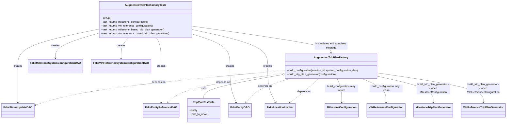

# Diagram: entity_core/entity_service/entity_service_tests/trip_leg_tests/test_augmented_trip_plan/test_augmented_trip_plan_factory.py

> Auto-generated by Obscura crawlers

## Mermaid

### SVG

<svg id="container" width="2950.083984375" xmlns="http://www.w3.org/2000/svg" class="classDiagram" height="752" viewBox="0 0 2950.083984375 752" role="graphics-document document" aria-roledescription="class"><g><defs><marker id="container_class-aggregationStart" class="marker aggregation class" refX="18" refY="7" markerWidth="190" markerHeight="240" orient="auto"><path d="M 18,7 L9,13 L1,7 L9,1 Z"></path></marker></defs><defs><marker id="container_class-aggregationEnd" class="marker aggregation class" refX="1" refY="7" markerWidth="20" markerHeight="28" orient="auto"><path d="M 18,7 L9,13 L1,7 L9,1 Z"></path></marker></defs><defs><marker id="container_class-extensionStart" class="marker extension class" refX="18" refY="7" markerWidth="190" markerHeight="240" orient="auto"><path d="M 1,7 L18,13 V 1 Z"></path></marker></defs><defs><marker id="container_class-extensionEnd" class="marker extension class" refX="1" refY="7" markerWidth="20" markerHeight="28" orient="auto"><path d="M 1,1 V 13 L18,7 Z"></path></marker></defs><defs><marker id="container_class-compositionStart" class="marker composition class" refX="18" refY="7" markerWidth="190" markerHeight="240" orient="auto"><path d="M 18,7 L9,13 L1,7 L9,1 Z"></path></marker></defs><defs><marker id="container_class-compositionEnd" class="marker composition class" refX="1" refY="7" markerWidth="20" markerHeight="28" orient="auto"><path d="M 18,7 L9,13 L1,7 L9,1 Z"></path></marker></defs><defs><marker id="container_class-dependencyStart" class="marker dependency class" refX="6" refY="7" markerWidth="190" markerHeight="240" orient="auto"><path d="M 5,7 L9,13 L1,7 L9,1 Z"></path></marker></defs><defs><marker id="container_class-dependencyEnd" class="marker dependency class" refX="13" refY="7" markerWidth="20" markerHeight="28" orient="auto"><path d="M 18,7 L9,13 L14,7 L9,1 Z"></path></marker></defs><defs><marker id="container_class-lollipopStart" class="marker lollipop class" refX="13" refY="7" markerWidth="190" markerHeight="240" orient="auto"><circle stroke="black" fill="transparent" cx="7" cy="7" r="6"></circle></marker></defs><defs><marker id="container_class-lollipopEnd" class="marker lollipop class" refX="1" refY="7" markerWidth="190" markerHeight="240" orient="auto"><circle stroke="black" fill="transparent" cx="7" cy="7" r="6"></circle></marker></defs><g class="root"><g class="clusters"></g><g class="edgePaths"><path d="M1631.826,456.52L1555.171,470.266C1478.517,484.013,1325.207,511.507,1248.553,535.42C1171.898,559.333,1171.898,579.667,1171.898,589.833L1171.898,600" id="id_AugmentedTripPlanFactory_TripPlanTestData_1" class="edge-thickness-normal edge-pattern-solid relation" style=";;;" data-edge="true" data-et="edge" data-id="id_AugmentedTripPlanFactory_TripPlanTestData_1" data-points="W3sieCI6MTY0OC44MDQ2ODc1LCJ5Ijo0NTMuNDc0Njk2MjI1OTM4OX0seyJ4IjoxMTcxLjg5ODQzNzUsInkiOjUzOX0seyJ4IjoxMTcxLjg5ODQzNzUsInkiOjYwMH1d" marker-start="url(#container_class-aggregationStart)"></path><path d="M1648.805,429.99L1459.341,448.158C1269.878,466.327,890.951,502.663,649.713,537.619C408.475,572.575,304.927,606.149,253.153,622.937L201.379,639.724" id="id_AugmentedTripPlanFactory_FakeStatusUpdateDAO_2" class="edge-thickness-normal edge-pattern-dashed relation" style=";;;" data-edge="true" data-et="edge" data-id="id_AugmentedTripPlanFactory_FakeStatusUpdateDAO_2" data-points="W3sieCI6MTY0OC44MDQ2ODc1LCJ5Ijo0MjkuOTg5OTMzMDQzMDMwMzZ9LHsieCI6NTEyLjAyMzQzNzUsInkiOjUzOX0seyJ4IjoxOTUuNjcxODc1LCJ5Ijo2NDEuNTc0NDUxNDcwMzY0MX1d" marker-end="url(#container_class-dependencyEnd)"></path><path d="M1648.805,445.939L1547.139,461.449C1445.473,476.959,1242.141,507.98,1127.838,537.905C1013.535,567.829,988.261,596.659,975.624,611.074L962.987,625.488" id="id_AugmentedTripPlanFactory_FakeEntityReferenceDAO_3" class="edge-thickness-normal edge-pattern-dashed relation" style=";;;" data-edge="true" data-et="edge" data-id="id_AugmentedTripPlanFactory_FakeEntityReferenceDAO_3" data-points="W3sieCI6MTY0OC44MDQ2ODc1LCJ5Ijo0NDUuOTM5MDU2NjY2NjA4Mn0seyJ4IjoxMDM4LjgwODU5Mzc1LCJ5Ijo1Mzl9LHsieCI6OTU5LjAzMTI1LCJ5Ijo2MzB9XQ==" marker-end="url(#container_class-dependencyEnd)"></path><path d="M1685.463,478L1652.279,488.167C1619.095,498.333,1552.727,518.667,1508.6,543.204C1464.474,567.742,1442.588,596.484,1431.645,610.855L1420.702,625.226" id="id_AugmentedTripPlanFactory_FakeEntityDAO_4" class="edge-thickness-normal edge-pattern-dashed relation" style=";;;" data-edge="true" data-et="edge" data-id="id_AugmentedTripPlanFactory_FakeEntityDAO_4" data-points="W3sieCI6MTY4NS40NjI2MzIxMjMxNjE3LCJ5Ijo0Nzh9LHsieCI6MTQ4Ni4zNTkzNzUsInkiOjUzOX0seyJ4IjoxNDE3LjA2NzAyMzAyNjMxNTgsInkiOjYzMH1d" marker-end="url(#container_class-dependencyEnd)"></path><path d="M1853.143,478L1842.689,488.167C1832.235,498.333,1811.328,518.667,1782.128,543.387C1752.928,568.107,1715.436,597.214,1696.69,611.767L1677.944,626.321" id="id_AugmentedTripPlanFactory_FakeLocationInvoker_5" class="edge-thickness-normal edge-pattern-dashed relation" style=";;;" data-edge="true" data-et="edge" data-id="id_AugmentedTripPlanFactory_FakeLocationInvoker_5" data-points="W3sieCI6MTg1My4xNDMwODA3Njc0NjMzLCJ5Ijo0Nzh9LHsieCI6MTc5MC40MTk5MjE4NzUsInkiOjUzOX0seyJ4IjoxNjczLjIwNDc2OTczNjg0MiwieSI6NjMwfV0=" marker-end="url(#container_class-dependencyEnd)"></path><path d="M1962.765,478L1967.171,488.167C1971.577,498.333,1980.389,518.667,1984.795,543C1989.201,567.333,1989.201,595.667,1989.201,609.833L1989.201,624" id="id_AugmentedTripPlanFactory_MilestoneConfiguration_6" class="edge-thickness-normal edge-pattern-solid relation" style=";;;" data-edge="true" data-et="edge" data-id="id_AugmentedTripPlanFactory_MilestoneConfiguration_6" data-points="W3sieCI6MTk2Mi43NjUwOTM2MzUxMTA0LCJ5Ijo0Nzh9LHsieCI6MTk4OS4yMDExNzE4NzUsInkiOjUzOX0seyJ4IjoxOTg5LjIwMTE3MTg3NSwieSI6NjMwfV0=" marker-end="url(#container_class-dependencyEnd)"></path><path d="M2104.64,478L2128.277,488.167C2151.915,498.333,2199.191,518.667,2222.829,543C2246.467,567.333,2246.467,595.667,2246.467,609.833L2246.467,624" id="id_AugmentedTripPlanFactory_VINReferenceConfiguration_7" class="edge-thickness-normal edge-pattern-solid relation" style=";;;" data-edge="true" data-et="edge" data-id="id_AugmentedTripPlanFactory_VINReferenceConfiguration_7" data-points="W3sieCI6MjEwNC42Mzk1MTkxODY1ODEsInkiOjQ3OH0seyJ4IjoyMjQ2LjQ2Njc5Njg3NSwieSI6NTM5fSx7IngiOjIyNDYuNDY2Nzk2ODc1LCJ5Ijo2MzB9XQ==" marker-end="url(#container_class-dependencyEnd)"></path><path d="M2211.719,467.744L2263.346,479.62C2314.973,491.496,2418.228,515.248,2469.855,541.291C2521.482,567.333,2521.482,595.667,2521.482,609.833L2521.482,624" id="id_AugmentedTripPlanFactory_MilestoneTripPlanGenerator_8" class="edge-thickness-normal edge-pattern-solid relation" style=";;;" data-edge="true" data-et="edge" data-id="id_AugmentedTripPlanFactory_MilestoneTripPlanGenerator_8" data-points="W3sieCI6MjIxMS43MTg3NSwieSI6NDY3Ljc0NDI3NTc4MDA0OTg2fSx7IngiOjI1MjEuNDgyNDIxODc1LCJ5Ijo1Mzl9LHsieCI6MjUyMS40ODI0MjE4NzUsInkiOjYzMH1d" marker-end="url(#container_class-dependencyEnd)"></path><path d="M2211.719,446.302L2312.14,461.751C2412.562,477.201,2613.405,508.101,2713.826,537.717C2814.248,567.333,2814.248,595.667,2814.248,609.833L2814.248,624" id="id_AugmentedTripPlanFactory_VINReferenceTripPlanGenerator_9" class="edge-thickness-normal edge-pattern-solid relation" style=";;;" data-edge="true" data-et="edge" data-id="id_AugmentedTripPlanFactory_VINReferenceTripPlanGenerator_9" data-points="W3sieCI6MjIxMS43MTg3NSwieSI6NDQ2LjMwMTc1MTQzMjI3N30seyJ4IjoyODE0LjI0ODA0Njg3NSwieSI6NTM5fSx7IngiOjI4MTQuMjQ4MDQ2ODc1LCJ5Ijo2MzB9XQ==" marker-end="url(#container_class-dependencyEnd)"></path><path d="M541.354,208.01L504.222,219.842C467.09,231.673,392.826,255.337,355.694,279.835C318.563,304.333,318.563,329.667,318.563,342.333L318.563,355" id="id_AugmentedTripPlanFactoryTests_FakeMilestoneSystemConfigurationDAO_10" class="edge-thickness-normal edge-pattern-solid relation" style=";;;" data-edge="true" data-et="edge" data-id="id_AugmentedTripPlanFactoryTests_FakeMilestoneSystemConfigurationDAO_10" data-points="W3sieCI6NTQxLjM1MzUxNTYyNSwieSI6MjA4LjAwOTk2OTE1NTEzMDY1fSx7IngiOjMxOC41NjI1LCJ5IjoyNzl9LHsieCI6MzE4LjU2MjUsInkiOjM2MX1d" marker-end="url(#container_class-dependencyEnd)"></path><path d="M731.815,230L725.275,238.167C718.736,246.333,705.657,262.667,699.118,283.5C692.578,304.333,692.578,329.667,692.578,342.333L692.578,355" id="id_AugmentedTripPlanFactoryTests_FakeVINReferenceSystemConfigurationDAO_11" class="edge-thickness-normal edge-pattern-solid relation" style=";;;" data-edge="true" data-et="edge" data-id="id_AugmentedTripPlanFactoryTests_FakeVINReferenceSystemConfigurationDAO_11" data-points="W3sieCI6NzMxLjgxNDYxMTgxNjQwNjIsInkiOjIzMH0seyJ4Ijo2OTIuNTc4MTI1LCJ5IjoyNzl9LHsieCI6NjkyLjU3ODEyNSwieSI6MzYxfV0=" marker-end="url(#container_class-dependencyEnd)"></path><path d="M541.354,181.175L468.101,197.479C394.848,213.783,248.342,246.392,175.089,283.362C101.836,320.333,101.836,361.667,101.836,405C101.836,448.333,101.836,493.667,101.836,530.5C101.836,567.333,101.836,595.667,101.836,609.833L101.836,624" id="id_AugmentedTripPlanFactoryTests_FakeStatusUpdateDAO_12" class="edge-thickness-normal edge-pattern-solid relation" style=";;;" data-edge="true" data-et="edge" data-id="id_AugmentedTripPlanFactoryTests_FakeStatusUpdateDAO_12" data-points="W3sieCI6NTQxLjM1MzUxNTYyNSwieSI6MTgxLjE3NDcxNzUwMjk5NTQ2fSx7IngiOjEwMS44MzU5Mzc1LCJ5IjoyNzl9LHsieCI6MTAxLjgzNTkzNzUsInkiOjQwM30seyJ4IjoxMDEuODM1OTM3NSwieSI6NTM5fSx7IngiOjEwMS44MzU5Mzc1LCJ5Ijo2MzB9XQ==" marker-end="url(#container_class-dependencyEnd)"></path><path d="M891.122,230L896.304,238.167C901.485,246.333,911.848,262.667,917.03,291.5C922.211,320.333,922.211,361.667,922.211,405C922.211,448.333,922.211,493.667,922.211,530.5C922.211,567.333,922.211,595.667,922.211,609.833L922.211,624" id="id_AugmentedTripPlanFactoryTests_FakeEntityReferenceDAO_13" class="edge-thickness-normal edge-pattern-solid relation" style=";;;" data-edge="true" data-et="edge" data-id="id_AugmentedTripPlanFactoryTests_FakeEntityReferenceDAO_13" data-points="W3sieCI6ODkxLjEyMjM3NTQ4ODI4MTIsInkiOjIzMH0seyJ4Ijo5MjIuMjEwOTM3NSwieSI6Mjc5fSx7IngiOjkyMi4yMTA5Mzc1LCJ5Ijo0MDN9LHsieCI6OTIyLjIxMDkzNzUsInkiOjUzOX0seyJ4Ijo5MjIuMjEwOTM3NSwieSI6NjMwfV0=" marker-end="url(#container_class-dependencyEnd)"></path><path d="M1100.041,207.067L1138.069,219.055C1176.098,231.044,1252.154,255.022,1290.183,287.678C1328.211,320.333,1328.211,361.667,1328.211,405C1328.211,448.333,1328.211,493.667,1334.303,530.581C1340.396,567.494,1352.581,595.989,1358.674,610.236L1364.766,624.483" id="id_AugmentedTripPlanFactoryTests_FakeEntityDAO_14" class="edge-thickness-normal edge-pattern-solid relation" style=";;;" data-edge="true" data-et="edge" data-id="id_AugmentedTripPlanFactoryTests_FakeEntityDAO_14" data-points="W3sieCI6MTEwMC4wNDEwMTU2MjUsInkiOjIwNy4wNjY1OTMwMzM1OTI4Mn0seyJ4IjoxMzI4LjIxMDkzNzUsInkiOjI3OX0seyJ4IjoxMzI4LjIxMDkzNzUsInkiOjQwM30seyJ4IjoxMzI4LjIxMDkzNzUsInkiOjUzOX0seyJ4IjoxMzY3LjEyNTQxMTE4NDIxMDYsInkiOjYzMH1d" marker-end="url(#container_class-dependencyEnd)"></path><path d="M1100.041,180.343L1174.918,196.786C1249.796,213.229,1399.55,246.114,1474.427,283.224C1549.305,320.333,1549.305,361.667,1549.305,405C1549.305,448.333,1549.305,493.667,1556.8,530.615C1564.295,567.562,1579.285,596.125,1586.78,610.406L1594.275,624.687" id="id_AugmentedTripPlanFactoryTests_FakeLocationInvoker_15" class="edge-thickness-normal edge-pattern-solid relation" style=";;;" data-edge="true" data-et="edge" data-id="id_AugmentedTripPlanFactoryTests_FakeLocationInvoker_15" data-points="W3sieCI6MTEwMC4wNDEwMTU2MjUsInkiOjE4MC4zNDMwNDc5MjY5MzY4M30seyJ4IjoxNTQ5LjMwNDY4NzUsInkiOjI3OX0seyJ4IjoxNTQ5LjMwNDY4NzUsInkiOjQwM30seyJ4IjoxNTQ5LjMwNDY4NzUsInkiOjUzOX0seyJ4IjoxNTk3LjA2MzExNjc3NjMxNTgsInkiOjYzMH1d" marker-end="url(#container_class-dependencyEnd)"></path><path d="M1100.041,159.282L1238.411,179.235C1376.781,199.188,1653.521,239.094,1791.892,266.214C1930.262,293.333,1930.262,307.667,1930.262,314.833L1930.262,322" id="id_AugmentedTripPlanFactoryTests_AugmentedTripPlanFactory_16" class="edge-thickness-normal edge-pattern-solid relation" style=";;;" data-edge="true" data-et="edge" data-id="id_AugmentedTripPlanFactoryTests_AugmentedTripPlanFactory_16" data-points="W3sieCI6MTEwMC4wNDEwMTU2MjUsInkiOjE1OS4yODE1NzE2MzMwMTMzOX0seyJ4IjoxOTMwLjI2MTcxODc1LCJ5IjoyNzl9LHsieCI6MTkzMC4yNjE3MTg3NSwieSI6MzI4fV0=" marker-end="url(#container_class-dependencyEnd)"></path></g><g class="edgeLabels"><g class="edgeLabel" transform="translate(1171.8984375, 539)"><g class="label" data-id="id_AugmentedTripPlanFactory_TripPlanTestData_1" transform="translate(-16.4921875, -12)"><foreignObject width="32.984375" height="24">

uses

</foreignObject></g></g><g class="edgeLabel" transform="translate(914.8906, 500.36761)"><g class="label" data-id="id_AugmentedTripPlanFactory_FakeStatusUpdateDAO_2" transform="translate(-42.9453125, -12)"><foreignObject width="85.890625" height="24">

depends on

</foreignObject></g></g><g class="edgeLabel" transform="translate(1283.9896, 501.59521)"><g class="label" data-id="id_AugmentedTripPlanFactory_FakeEntityReferenceDAO_3" transform="translate(-42.9453125, -12)"><foreignObject width="85.890625" height="24">

depends on

</foreignObject></g></g><g class="edgeLabel" transform="translate(1531.23052, 525.25266)"><g class="label" data-id="id_AugmentedTripPlanFactory_FakeEntityDAO_4" transform="translate(-42.9453125, -12)"><foreignObject width="85.890625" height="24">

depends on

</foreignObject></g></g><g class="edgeLabel" transform="translate(1766.36802, 557.6727)"><g class="label" data-id="id_AugmentedTripPlanFactory_FakeLocationInvoker_5" transform="translate(-42.9453125, -12)"><foreignObject width="85.890625" height="24">

depends on

</foreignObject></g></g><g class="edgeLabel" transform="translate(1989.201171875, 539)"><g class="label" data-id="id_AugmentedTripPlanFactory_MilestoneConfiguration_6" transform="translate(-100, -24)"><foreignObject width="200" height="48">

build_configuration may return

</foreignObject></g></g><g class="edgeLabel" transform="translate(2246.466796875, 539)"><g class="label" data-id="id_AugmentedTripPlanFactory_VINReferenceConfiguration_7" transform="translate(-100, -24)"><foreignObject width="200" height="48">

build_configuration may return

</foreignObject></g></g><g class="edgeLabel" transform="translate(2521.482421875, 539)"><g class="label" data-id="id_AugmentedTripPlanFactory_MilestoneTripPlanGenerator_8" transform="translate(-100, -36)"><foreignObject width="200" height="72">

build_trip_plan_generator -&gt; when MilestoneConfiguration

</foreignObject></g></g><g class="edgeLabel" transform="translate(2814.248046875, 539)"><g class="label" data-id="id_AugmentedTripPlanFactory_VINReferenceTripPlanGenerator_9" transform="translate(-100, -36)"><foreignObject width="200" height="72">

build_trip_plan_generator -&gt; when VINReferenceConfiguration

</foreignObject></g></g><g class="edgeLabel" transform="translate(318.5625, 279)"><g class="label" data-id="id_AugmentedTripPlanFactoryTests_FakeMilestoneSystemConfigurationDAO_10" transform="translate(-26.171875, -12)"><foreignObject width="52.34375" height="24">

creates

</foreignObject></g></g><g class="edgeLabel" transform="translate(692.578125, 279)"><g class="label" data-id="id_AugmentedTripPlanFactoryTests_FakeVINReferenceSystemConfigurationDAO_11" transform="translate(-26.171875, -12)"><foreignObject width="52.34375" height="24">

creates

</foreignObject></g></g><g class="edgeLabel" transform="translate(101.8359375, 403)"><g class="label" data-id="id_AugmentedTripPlanFactoryTests_FakeStatusUpdateDAO_12" transform="translate(-26.171875, -12)"><foreignObject width="52.34375" height="24">

creates

</foreignObject></g></g><g class="edgeLabel" transform="translate(922.2109375, 403)"><g class="label" data-id="id_AugmentedTripPlanFactoryTests_FakeEntityReferenceDAO_13" transform="translate(-26.171875, -12)"><foreignObject width="52.34375" height="24">

creates

</foreignObject></g></g><g class="edgeLabel" transform="translate(1328.2109375, 403)"><g class="label" data-id="id_AugmentedTripPlanFactoryTests_FakeEntityDAO_14" transform="translate(-26.171875, -12)"><foreignObject width="52.34375" height="24">

creates

</foreignObject></g></g><g class="edgeLabel" transform="translate(1549.3046875, 403)"><g class="label" data-id="id_AugmentedTripPlanFactoryTests_FakeLocationInvoker_15" transform="translate(-26.171875, -12)"><foreignObject width="52.34375" height="24">

creates

</foreignObject></g></g><g class="edgeLabel" transform="translate(1930.26171875, 279)"><g class="label" data-id="id_AugmentedTripPlanFactoryTests_AugmentedTripPlanFactory_16" transform="translate(-100, -24)"><foreignObject width="200" height="48">

instantiates and exercises methods

</foreignObject></g></g></g><g class="nodes"><g class="node default" id="classId-AugmentedTripPlanFactory-0" transform="translate(1930.26171875, 403)"><g class="basic label-container"><path d="M-281.45703125 -75 L281.45703125 -75 L281.45703125 75 L-281.45703125 75" stroke="none" stroke-width="0" fill="#ECECFF" style=""></path><path d="M-281.45703125 -75 C-146.36092162756574 -75, -11.264812005131489 -75, 281.45703125 -75 M-281.45703125 -75 C-85.82247190317983 -75, 109.81208744364034 -75, 281.45703125 -75 M281.45703125 -75 C281.45703125 -23.304530000425487, 281.45703125 28.390939999149026, 281.45703125 75 M281.45703125 -75 C281.45703125 -31.079284761995368, 281.45703125 12.841430476009265, 281.45703125 75 M281.45703125 75 C92.96054519819094 75, -95.53594085361811 75, -281.45703125 75 M281.45703125 75 C69.96878130727612 75, -141.51946863544777 75, -281.45703125 75 M-281.45703125 75 C-281.45703125 40.095343040887975, -281.45703125 5.190686081775951, -281.45703125 -75 M-281.45703125 75 C-281.45703125 29.95321799564416, -281.45703125 -15.093564008711681, -281.45703125 -75" stroke="#9370DB" stroke-width="1.3" fill="none" stroke-dasharray="0 0" style=""></path></g><g class="annotation-group text" transform="translate(0, -51)"></g><g class="label-group text" transform="translate(-98.6328125, -51)"><g class="label" style="font-weight: bolder" transform="translate(0,-12)"><foreignObject width="197.265625" height="24">

AugmentedTripPlanFactory

</foreignObject></g></g><g class="members-group text" transform="translate(-269.45703125, -3)"></g><g class="methods-group text" transform="translate(-269.45703125, 27)"><g class="label" style="" transform="translate(0,-12)"><foreignObject width="440.28125" height="24">

+build_configuration(solution_id, system_configuration_dao)

</foreignObject></g><g class="label" style="" transform="translate(0,12)"><foreignObject width="304.796875" height="24">

+build_trip_plan_generator(configuration)

</foreignObject></g></g><g class="divider" style=""><path d="M-281.45703125 -27 C-151.18057466048387 -27, -20.90411807096774 -27, 281.45703125 -27 M-281.45703125 -27 C-155.6640307009086 -27, -29.871030151817223 -27, 281.45703125 -27" stroke="#9370DB" stroke-width="1.3" fill="none" stroke-dasharray="0 0" style=""></path></g><g class="divider" style=""><path d="M-281.45703125 -3 C-128.52660708046142 -3, 24.403817089077165 -3, 281.45703125 -3 M-281.45703125 -3 C-139.18391473618533 -3, 3.0892017776293414 -3, 281.45703125 -3" stroke="#9370DB" stroke-width="1.3" fill="none" stroke-dasharray="0 0" style=""></path></g></g><g class="node default" id="classId-MilestoneConfiguration-1" transform="translate(1989.201171875, 672)"><g class="basic label-container"><path d="M-97.1796875 -42 L97.1796875 -42 L97.1796875 42 L-97.1796875 42" stroke="none" stroke-width="0" fill="#ECECFF" style=""></path><path d="M-97.1796875 -42 C-19.72232446926448 -42, 57.73503856147104 -42, 97.1796875 -42 M-97.1796875 -42 C-24.64263533801548 -42, 47.89441682396904 -42, 97.1796875 -42 M97.1796875 -42 C97.1796875 -24.562944814842602, 97.1796875 -7.125889629685204, 97.1796875 42 M97.1796875 -42 C97.1796875 -11.417984222993208, 97.1796875 19.164031554013583, 97.1796875 42 M97.1796875 42 C40.83485637883421 42, -15.509974742331579 42, -97.1796875 42 M97.1796875 42 C45.621820422715494 42, -5.936046654569012 42, -97.1796875 42 M-97.1796875 42 C-97.1796875 17.737962049820695, -97.1796875 -6.524075900358611, -97.1796875 -42 M-97.1796875 42 C-97.1796875 20.33563421295072, -97.1796875 -1.328731574098562, -97.1796875 -42" stroke="#9370DB" stroke-width="1.3" fill="none" stroke-dasharray="0 0" style=""></path></g><g class="annotation-group text" transform="translate(0, -18)"></g><g class="label-group text" transform="translate(-85.1796875, -18)"><g class="label" style="font-weight: bolder" transform="translate(0,-12)"><foreignObject width="170.359375" height="24">

MilestoneConfiguration

</foreignObject></g></g><g class="members-group text" transform="translate(-85.1796875, 30)"></g><g class="methods-group text" transform="translate(-85.1796875, 60)"></g><g class="divider" style=""><path d="M-97.1796875 6 C-31.784812696162476 6, 33.61006210767505 6, 97.1796875 6 M-97.1796875 6 C-36.70281233459217 6, 23.774062830815666 6, 97.1796875 6" stroke="#9370DB" stroke-width="1.3" fill="none" stroke-dasharray="0 0" style=""></path></g><g class="divider" style=""><path d="M-97.1796875 24 C-37.492569144214116 24, 22.19454921157177 24, 97.1796875 24 M-97.1796875 24 C-20.054262110999332 24, 57.071163278001336 24, 97.1796875 24" stroke="#9370DB" stroke-width="1.3" fill="none" stroke-dasharray="0 0" style=""></path></g></g><g class="node default" id="classId-VINReferenceConfiguration-2" transform="translate(2246.466796875, 672)"><g class="basic label-container"><path d="M-110.0859375 -42 L110.0859375 -42 L110.0859375 42 L-110.0859375 42" stroke="none" stroke-width="0" fill="#ECECFF" style=""></path><path d="M-110.0859375 -42 C-66.04688821875689 -42, -22.007838937513768 -42, 110.0859375 -42 M-110.0859375 -42 C-63.952198876016034 -42, -17.818460252032068 -42, 110.0859375 -42 M110.0859375 -42 C110.0859375 -11.810908190269473, 110.0859375 18.378183619461055, 110.0859375 42 M110.0859375 -42 C110.0859375 -13.612759725324281, 110.0859375 14.774480549351438, 110.0859375 42 M110.0859375 42 C49.551130235913504 42, -10.983677028172991 42, -110.0859375 42 M110.0859375 42 C56.28468973158389 42, 2.4834419631677775 42, -110.0859375 42 M-110.0859375 42 C-110.0859375 13.800998775382258, -110.0859375 -14.398002449235484, -110.0859375 -42 M-110.0859375 42 C-110.0859375 12.153862680841033, -110.0859375 -17.692274638317933, -110.0859375 -42" stroke="#9370DB" stroke-width="1.3" fill="none" stroke-dasharray="0 0" style=""></path></g><g class="annotation-group text" transform="translate(0, -18)"></g><g class="label-group text" transform="translate(-98.0859375, -18)"><g class="label" style="font-weight: bolder" transform="translate(0,-12)"><foreignObject width="196.171875" height="24">

VINReferenceConfiguration

</foreignObject></g></g><g class="members-group text" transform="translate(-98.0859375, 30)"></g><g class="methods-group text" transform="translate(-98.0859375, 60)"></g><g class="divider" style=""><path d="M-110.0859375 6 C-33.35057236504592 6, 43.38479276990816 6, 110.0859375 6 M-110.0859375 6 C-28.35474662116397 6, 53.37644425767206 6, 110.0859375 6" stroke="#9370DB" stroke-width="1.3" fill="none" stroke-dasharray="0 0" style=""></path></g><g class="divider" style=""><path d="M-110.0859375 24 C-33.64854196413552 24, 42.788853571728964 24, 110.0859375 24 M-110.0859375 24 C-23.317139156754266 24, 63.45165918649147 24, 110.0859375 24" stroke="#9370DB" stroke-width="1.3" fill="none" stroke-dasharray="0 0" style=""></path></g></g><g class="node default" id="classId-MilestoneTripPlanGenerator-3" transform="translate(2521.482421875, 672)"><g class="basic label-container"><path d="M-114.9296875 -42 L114.9296875 -42 L114.9296875 42 L-114.9296875 42" stroke="none" stroke-width="0" fill="#ECECFF" style=""></path><path d="M-114.9296875 -42 C-64.81760998423795 -42, -14.705532468475894 -42, 114.9296875 -42 M-114.9296875 -42 C-52.70982947465905 -42, 9.510028550681895 -42, 114.9296875 -42 M114.9296875 -42 C114.9296875 -23.83947847285103, 114.9296875 -5.678956945702062, 114.9296875 42 M114.9296875 -42 C114.9296875 -9.295994114215524, 114.9296875 23.40801177156895, 114.9296875 42 M114.9296875 42 C56.82729594382303 42, -1.2750956123539368 42, -114.9296875 42 M114.9296875 42 C59.36634338229932 42, 3.8029992645986397 42, -114.9296875 42 M-114.9296875 42 C-114.9296875 24.173151747770238, -114.9296875 6.346303495540475, -114.9296875 -42 M-114.9296875 42 C-114.9296875 24.878054848532877, -114.9296875 7.756109697065753, -114.9296875 -42" stroke="#9370DB" stroke-width="1.3" fill="none" stroke-dasharray="0 0" style=""></path></g><g class="annotation-group text" transform="translate(0, -18)"></g><g class="label-group text" transform="translate(-102.9296875, -18)"><g class="label" style="font-weight: bolder" transform="translate(0,-12)"><foreignObject width="205.859375" height="24">

MilestoneTripPlanGenerator

</foreignObject></g></g><g class="members-group text" transform="translate(-102.9296875, 30)"></g><g class="methods-group text" transform="translate(-102.9296875, 60)"></g><g class="divider" style=""><path d="M-114.9296875 6 C-60.5492819898849 6, -6.168876479769807 6, 114.9296875 6 M-114.9296875 6 C-46.578204097930865 6, 21.77327930413827 6, 114.9296875 6" stroke="#9370DB" stroke-width="1.3" fill="none" stroke-dasharray="0 0" style=""></path></g><g class="divider" style=""><path d="M-114.9296875 24 C-28.822260880930315 24, 57.28516573813937 24, 114.9296875 24 M-114.9296875 24 C-27.554399420362174 24, 59.82088865927565 24, 114.9296875 24" stroke="#9370DB" stroke-width="1.3" fill="none" stroke-dasharray="0 0" style=""></path></g></g><g class="node default" id="classId-VINReferenceTripPlanGenerator-4" transform="translate(2814.248046875, 672)"><g class="basic label-container"><path d="M-127.8359375 -42 L127.8359375 -42 L127.8359375 42 L-127.8359375 42" stroke="none" stroke-width="0" fill="#ECECFF" style=""></path><path d="M-127.8359375 -42 C-31.7354930727184 -42, 64.3649513545632 -42, 127.8359375 -42 M-127.8359375 -42 C-43.414557532790454 -42, 41.00682243441909 -42, 127.8359375 -42 M127.8359375 -42 C127.8359375 -22.975671545740294, 127.8359375 -3.951343091480588, 127.8359375 42 M127.8359375 -42 C127.8359375 -10.331901603404713, 127.8359375 21.336196793190574, 127.8359375 42 M127.8359375 42 C69.05017541307251 42, 10.264413326145032 42, -127.8359375 42 M127.8359375 42 C70.10245188142294 42, 12.368966262845873 42, -127.8359375 42 M-127.8359375 42 C-127.8359375 9.804640024318942, -127.8359375 -22.390719951362115, -127.8359375 -42 M-127.8359375 42 C-127.8359375 9.141334689491508, -127.8359375 -23.717330621016984, -127.8359375 -42" stroke="#9370DB" stroke-width="1.3" fill="none" stroke-dasharray="0 0" style=""></path></g><g class="annotation-group text" transform="translate(0, -18)"></g><g class="label-group text" transform="translate(-115.8359375, -18)"><g class="label" style="font-weight: bolder" transform="translate(0,-12)"><foreignObject width="231.671875" height="24">

VINReferenceTripPlanGenerator

</foreignObject></g></g><g class="members-group text" transform="translate(-115.8359375, 30)"></g><g class="methods-group text" transform="translate(-115.8359375, 60)"></g><g class="divider" style=""><path d="M-127.8359375 6 C-54.99009340058788 6, 17.855750698824238 6, 127.8359375 6 M-127.8359375 6 C-74.81559259473886 6, -21.795247689477733 6, 127.8359375 6" stroke="#9370DB" stroke-width="1.3" fill="none" stroke-dasharray="0 0" style=""></path></g><g class="divider" style=""><path d="M-127.8359375 24 C-63.559885197029004 24, 0.7161671059419916 24, 127.8359375 24 M-127.8359375 24 C-72.66403332007943 24, -17.492129140158838 24, 127.8359375 24" stroke="#9370DB" stroke-width="1.3" fill="none" stroke-dasharray="0 0" style=""></path></g></g><g class="node default" id="classId-TripPlanTestData-5" transform="translate(1171.8984375, 672)"><g class="basic label-container"><path d="M-98.078125 -72 L98.078125 -72 L98.078125 72 L-98.078125 72" stroke="none" stroke-width="0" fill="#ECECFF" style=""></path><path d="M-98.078125 -72 C-40.34851369070682 -72, 17.381097618586367 -72, 98.078125 -72 M-98.078125 -72 C-36.222034303824714 -72, 25.634056392350573 -72, 98.078125 -72 M98.078125 -72 C98.078125 -33.105694563168974, 98.078125 5.788610873662051, 98.078125 72 M98.078125 -72 C98.078125 -41.82366751261705, 98.078125 -11.647335025234092, 98.078125 72 M98.078125 72 C48.64402702938053 72, -0.7900709412389375 72, -98.078125 72 M98.078125 72 C48.56891378497923 72, -0.9402974300415394 72, -98.078125 72 M-98.078125 72 C-98.078125 40.97477045554551, -98.078125 9.94954091109102, -98.078125 -72 M-98.078125 72 C-98.078125 37.80391164467272, -98.078125 3.607823289345447, -98.078125 -72" stroke="#9370DB" stroke-width="1.3" fill="none" stroke-dasharray="0 0" style=""></path></g><g class="annotation-group text" transform="translate(0, -48)"></g><g class="label-group text" transform="translate(-62.515625, -48)"><g class="label" style="font-weight: bolder" transform="translate(0,-12)"><foreignObject width="125.03125" height="24">

TripPlanTestData

</foreignObject></g></g><g class="members-group text" transform="translate(-86.078125, 0)"><g class="label" style="" transform="translate(0,-12)"><foreignObject width="49.9375" height="24">

+entity

</foreignObject></g><g class="label" style="" transform="translate(0,12)"><foreignObject width="109.640625" height="24">

+lndn_to_newk

</foreignObject></g></g><g class="methods-group text" transform="translate(-86.078125, 72)"></g><g class="divider" style=""><path d="M-98.078125 -24 C-58.591098040468665 -24, -19.10407108093733 -24, 98.078125 -24 M-98.078125 -24 C-54.05965895228831 -24, -10.041192904576619 -24, 98.078125 -24" stroke="#9370DB" stroke-width="1.3" fill="none" stroke-dasharray="0 0" style=""></path></g><g class="divider" style=""><path d="M-98.078125 48 C-49.99842000582525 48, -1.9187150116505052 48, 98.078125 48 M-98.078125 48 C-49.14053133815538 48, -0.20293767631075355 48, 98.078125 48" stroke="#9370DB" stroke-width="1.3" fill="none" stroke-dasharray="0 0" style=""></path></g></g><g class="node default" id="classId-FakeMilestoneSystemConfigurationDAO-6" transform="translate(318.5625, 403)"><g class="basic label-container"><path d="M-155.5546875 -42 L155.5546875 -42 L155.5546875 42 L-155.5546875 42" stroke="none" stroke-width="0" fill="#ECECFF" style=""></path><path d="M-155.5546875 -42 C-67.28023211473374 -42, 20.99422327053253 -42, 155.5546875 -42 M-155.5546875 -42 C-74.45036505951452 -42, 6.653957380970951 -42, 155.5546875 -42 M155.5546875 -42 C155.5546875 -17.857797159362402, 155.5546875 6.284405681275196, 155.5546875 42 M155.5546875 -42 C155.5546875 -12.982379564126195, 155.5546875 16.03524087174761, 155.5546875 42 M155.5546875 42 C66.13596697100591 42, -23.282753557988173 42, -155.5546875 42 M155.5546875 42 C89.75522790973005 42, 23.955768319460105 42, -155.5546875 42 M-155.5546875 42 C-155.5546875 24.436680245740174, -155.5546875 6.873360491480348, -155.5546875 -42 M-155.5546875 42 C-155.5546875 9.865906342455979, -155.5546875 -22.268187315088042, -155.5546875 -42" stroke="#9370DB" stroke-width="1.3" fill="none" stroke-dasharray="0 0" style=""></path></g><g class="annotation-group text" transform="translate(0, -18)"></g><g class="label-group text" transform="translate(-143.5546875, -18)"><g class="label" style="font-weight: bolder" transform="translate(0,-12)"><foreignObject width="287.109375" height="24">

FakeMilestoneSystemConfigurationDAO

</foreignObject></g></g><g class="members-group text" transform="translate(-143.5546875, 30)"></g><g class="methods-group text" transform="translate(-143.5546875, 60)"></g><g class="divider" style=""><path d="M-155.5546875 6 C-35.603534174349676 6, 84.34761915130065 6, 155.5546875 6 M-155.5546875 6 C-82.52856178238534 6, -9.502436064770677 6, 155.5546875 6" stroke="#9370DB" stroke-width="1.3" fill="none" stroke-dasharray="0 0" style=""></path></g><g class="divider" style=""><path d="M-155.5546875 24 C-86.16600343506246 24, -16.77731937012493 24, 155.5546875 24 M-155.5546875 24 C-36.46795145645051 24, 82.61878458709899 24, 155.5546875 24" stroke="#9370DB" stroke-width="1.3" fill="none" stroke-dasharray="0 0" style=""></path></g></g><g class="node default" id="classId-FakeVINReferenceSystemConfigurationDAO-7" transform="translate(692.578125, 403)"><g class="basic label-container"><path d="M-168.4609375 -42 L168.4609375 -42 L168.4609375 42 L-168.4609375 42" stroke="none" stroke-width="0" fill="#ECECFF" style=""></path><path d="M-168.4609375 -42 C-35.64520103073008 -42, 97.17053543853984 -42, 168.4609375 -42 M-168.4609375 -42 C-41.2554149746492 -42, 85.9501075507016 -42, 168.4609375 -42 M168.4609375 -42 C168.4609375 -21.020837960769747, 168.4609375 -0.04167592153949329, 168.4609375 42 M168.4609375 -42 C168.4609375 -10.658364168362041, 168.4609375 20.683271663275917, 168.4609375 42 M168.4609375 42 C79.8208034793478 42, -8.819330541304396 42, -168.4609375 42 M168.4609375 42 C74.93145364083159 42, -18.598030218336817 42, -168.4609375 42 M-168.4609375 42 C-168.4609375 17.356688902437185, -168.4609375 -7.286622195125631, -168.4609375 -42 M-168.4609375 42 C-168.4609375 12.841327511371464, -168.4609375 -16.317344977257072, -168.4609375 -42" stroke="#9370DB" stroke-width="1.3" fill="none" stroke-dasharray="0 0" style=""></path></g><g class="annotation-group text" transform="translate(0, -18)"></g><g class="label-group text" transform="translate(-156.4609375, -18)"><g class="label" style="font-weight: bolder" transform="translate(0,-12)"><foreignObject width="312.921875" height="24">

FakeVINReferenceSystemConfigurationDAO

</foreignObject></g></g><g class="members-group text" transform="translate(-156.4609375, 30)"></g><g class="methods-group text" transform="translate(-156.4609375, 60)"></g><g class="divider" style=""><path d="M-168.4609375 6 C-58.80909027947729 6, 50.84275694104542 6, 168.4609375 6 M-168.4609375 6 C-77.61531801990982 6, 13.230301460180357 6, 168.4609375 6" stroke="#9370DB" stroke-width="1.3" fill="none" stroke-dasharray="0 0" style=""></path></g><g class="divider" style=""><path d="M-168.4609375 24 C-45.4505659713092 24, 77.5598055573816 24, 168.4609375 24 M-168.4609375 24 C-92.56363967761334 24, -16.666341855226676 24, 168.4609375 24" stroke="#9370DB" stroke-width="1.3" fill="none" stroke-dasharray="0 0" style=""></path></g></g><g class="node default" id="classId-FakeStatusUpdateDAO-8" transform="translate(101.8359375, 672)"><g class="basic label-container"><path d="M-93.8359375 -42 L93.8359375 -42 L93.8359375 42 L-93.8359375 42" stroke="none" stroke-width="0" fill="#ECECFF" style=""></path><path d="M-93.8359375 -42 C-34.398313582743896 -42, 25.03931033451221 -42, 93.8359375 -42 M-93.8359375 -42 C-37.084857674022686 -42, 19.666222151954628 -42, 93.8359375 -42 M93.8359375 -42 C93.8359375 -20.59935427051951, 93.8359375 0.8012914589609821, 93.8359375 42 M93.8359375 -42 C93.8359375 -23.630891089877824, 93.8359375 -5.261782179755649, 93.8359375 42 M93.8359375 42 C33.39228447622261 42, -27.051368547554773 42, -93.8359375 42 M93.8359375 42 C21.47567584173116 42, -50.88458581653768 42, -93.8359375 42 M-93.8359375 42 C-93.8359375 12.90074771540646, -93.8359375 -16.19850456918708, -93.8359375 -42 M-93.8359375 42 C-93.8359375 10.336965461329704, -93.8359375 -21.32606907734059, -93.8359375 -42" stroke="#9370DB" stroke-width="1.3" fill="none" stroke-dasharray="0 0" style=""></path></g><g class="annotation-group text" transform="translate(0, -18)"></g><g class="label-group text" transform="translate(-81.8359375, -18)"><g class="label" style="font-weight: bolder" transform="translate(0,-12)"><foreignObject width="163.671875" height="24">

FakeStatusUpdateDAO

</foreignObject></g></g><g class="members-group text" transform="translate(-81.8359375, 30)"></g><g class="methods-group text" transform="translate(-81.8359375, 60)"></g><g class="divider" style=""><path d="M-93.8359375 6 C-40.388456348004524 6, 13.059024803990951 6, 93.8359375 6 M-93.8359375 6 C-32.67887042945352 6, 28.478196641092964 6, 93.8359375 6" stroke="#9370DB" stroke-width="1.3" fill="none" stroke-dasharray="0 0" style=""></path></g><g class="divider" style=""><path d="M-93.8359375 24 C-37.93736886865657 24, 17.96119976268686 24, 93.8359375 24 M-93.8359375 24 C-54.66536895416483 24, -15.494800408329667 24, 93.8359375 24" stroke="#9370DB" stroke-width="1.3" fill="none" stroke-dasharray="0 0" style=""></path></g></g><g class="node default" id="classId-FakeEntityReferenceDAO-9" transform="translate(922.2109375, 672)"><g class="basic label-container"><path d="M-101.609375 -42 L101.609375 -42 L101.609375 42 L-101.609375 42" stroke="none" stroke-width="0" fill="#ECECFF" style=""></path><path d="M-101.609375 -42 C-45.081506292609824 -42, 11.446362414780353 -42, 101.609375 -42 M-101.609375 -42 C-21.998179653514143 -42, 57.613015692971715 -42, 101.609375 -42 M101.609375 -42 C101.609375 -16.152351407512256, 101.609375 9.695297184975487, 101.609375 42 M101.609375 -42 C101.609375 -19.898036244261213, 101.609375 2.2039275114775734, 101.609375 42 M101.609375 42 C60.707000282056704 42, 19.804625564113408 42, -101.609375 42 M101.609375 42 C27.75781018580959 42, -46.09375462838082 42, -101.609375 42 M-101.609375 42 C-101.609375 18.387821452083305, -101.609375 -5.2243570958333905, -101.609375 -42 M-101.609375 42 C-101.609375 18.501159730766414, -101.609375 -4.997680538467172, -101.609375 -42" stroke="#9370DB" stroke-width="1.3" fill="none" stroke-dasharray="0 0" style=""></path></g><g class="annotation-group text" transform="translate(0, -18)"></g><g class="label-group text" transform="translate(-89.609375, -18)"><g class="label" style="font-weight: bolder" transform="translate(0,-12)"><foreignObject width="179.21875" height="24">

FakeEntityReferenceDAO

</foreignObject></g></g><g class="members-group text" transform="translate(-89.609375, 30)"></g><g class="methods-group text" transform="translate(-89.609375, 60)"></g><g class="divider" style=""><path d="M-101.609375 6 C-54.72871325678028 6, -7.848051513560563 6, 101.609375 6 M-101.609375 6 C-51.13468290303039 6, -0.659990806060776 6, 101.609375 6" stroke="#9370DB" stroke-width="1.3" fill="none" stroke-dasharray="0 0" style=""></path></g><g class="divider" style=""><path d="M-101.609375 24 C-52.40002569868561 24, -3.19067639737122 24, 101.609375 24 M-101.609375 24 C-29.659176718165384 24, 42.29102156366923 24, 101.609375 24" stroke="#9370DB" stroke-width="1.3" fill="none" stroke-dasharray="0 0" style=""></path></g></g><g class="node default" id="classId-FakeEntityDAO-10" transform="translate(1385.0859375, 672)"><g class="basic label-container"><path d="M-65.109375 -42 L65.109375 -42 L65.109375 42 L-65.109375 42" stroke="none" stroke-width="0" fill="#ECECFF" style=""></path><path d="M-65.109375 -42 C-28.295536885806932 -42, 8.518301228386136 -42, 65.109375 -42 M-65.109375 -42 C-14.197865415212775 -42, 36.71364416957445 -42, 65.109375 -42 M65.109375 -42 C65.109375 -20.340028052096972, 65.109375 1.3199438958060554, 65.109375 42 M65.109375 -42 C65.109375 -11.066433491995944, 65.109375 19.86713301600811, 65.109375 42 M65.109375 42 C15.04909536003018 42, -35.01118427993964 42, -65.109375 42 M65.109375 42 C36.750560048396835 42, 8.391745096793677 42, -65.109375 42 M-65.109375 42 C-65.109375 17.81723826729123, -65.109375 -6.365523465417539, -65.109375 -42 M-65.109375 42 C-65.109375 14.225636303120506, -65.109375 -13.548727393758988, -65.109375 -42" stroke="#9370DB" stroke-width="1.3" fill="none" stroke-dasharray="0 0" style=""></path></g><g class="annotation-group text" transform="translate(0, -18)"></g><g class="label-group text" transform="translate(-53.109375, -18)"><g class="label" style="font-weight: bolder" transform="translate(0,-12)"><foreignObject width="106.21875" height="24">

FakeEntityDAO

</foreignObject></g></g><g class="members-group text" transform="translate(-53.109375, 30)"></g><g class="methods-group text" transform="translate(-53.109375, 60)"></g><g class="divider" style=""><path d="M-65.109375 6 C-38.21527487159561 6, -11.321174743191229 6, 65.109375 6 M-65.109375 6 C-22.21412076780792 6, 20.68113346438416 6, 65.109375 6" stroke="#9370DB" stroke-width="1.3" fill="none" stroke-dasharray="0 0" style=""></path></g><g class="divider" style=""><path d="M-65.109375 24 C-27.313067123108958 24, 10.483240753782084 24, 65.109375 24 M-65.109375 24 C-17.96293931029728 24, 29.18349637940544 24, 65.109375 24" stroke="#9370DB" stroke-width="1.3" fill="none" stroke-dasharray="0 0" style=""></path></g></g><g class="node default" id="classId-FakeLocationInvoker-11" transform="translate(1619.10546875, 672)"><g class="basic label-container"><path d="M-87.4375 -42 L87.4375 -42 L87.4375 42 L-87.4375 42" stroke="none" stroke-width="0" fill="#ECECFF" style=""></path><path d="M-87.4375 -42 C-40.08424418810474 -42, 7.269011623790519 -42, 87.4375 -42 M-87.4375 -42 C-47.508780040094855 -42, -7.5800600801897104 -42, 87.4375 -42 M87.4375 -42 C87.4375 -16.550245469125567, 87.4375 8.899509061748866, 87.4375 42 M87.4375 -42 C87.4375 -8.66186153703896, 87.4375 24.67627692592208, 87.4375 42 M87.4375 42 C39.35091361137496 42, -8.735672777250073 42, -87.4375 42 M87.4375 42 C24.036126216194596 42, -39.36524756761081 42, -87.4375 42 M-87.4375 42 C-87.4375 20.584204843402482, -87.4375 -0.8315903131950364, -87.4375 -42 M-87.4375 42 C-87.4375 12.4350448753144, -87.4375 -17.1299102493712, -87.4375 -42" stroke="#9370DB" stroke-width="1.3" fill="none" stroke-dasharray="0 0" style=""></path></g><g class="annotation-group text" transform="translate(0, -18)"></g><g class="label-group text" transform="translate(-75.4375, -18)"><g class="label" style="font-weight: bolder" transform="translate(0,-12)"><foreignObject width="150.875" height="24">

FakeLocationInvoker

</foreignObject></g></g><g class="members-group text" transform="translate(-75.4375, 30)"></g><g class="methods-group text" transform="translate(-75.4375, 60)"></g><g class="divider" style=""><path d="M-87.4375 6 C-45.302960527648 6, -3.168421055295994 6, 87.4375 6 M-87.4375 6 C-23.27673329731573 6, 40.88403340536854 6, 87.4375 6" stroke="#9370DB" stroke-width="1.3" fill="none" stroke-dasharray="0 0" style=""></path></g><g class="divider" style=""><path d="M-87.4375 24 C-22.981689981059418 24, 41.474120037881164 24, 87.4375 24 M-87.4375 24 C-50.91369507735832 24, -14.389890154716639 24, 87.4375 24" stroke="#9370DB" stroke-width="1.3" fill="none" stroke-dasharray="0 0" style=""></path></g></g><g class="node default" id="classId-AugmentedTripPlanFactoryTests-12" transform="translate(820.697265625, 119)"><g class="basic label-container"><path d="M-279.34375 -111 L279.34375 -111 L279.34375 111 L-279.34375 111" stroke="none" stroke-width="0" fill="#ECECFF" style=""></path><path d="M-279.34375 -111 C-108.00350231561609 -111, 63.33674536876782 -111, 279.34375 -111 M-279.34375 -111 C-55.99102908765312 -111, 167.36169182469376 -111, 279.34375 -111 M279.34375 -111 C279.34375 -61.15294930699931, 279.34375 -11.305898613998622, 279.34375 111 M279.34375 -111 C279.34375 -32.408516456479276, 279.34375 46.18296708704145, 279.34375 111 M279.34375 111 C132.7659251435103 111, -13.811899712979425 111, -279.34375 111 M279.34375 111 C143.36829039000702 111, 7.392830780014037 111, -279.34375 111 M-279.34375 111 C-279.34375 38.164035915655305, -279.34375 -34.67192816868939, -279.34375 -111 M-279.34375 111 C-279.34375 42.65368120994053, -279.34375 -25.69263758011894, -279.34375 -111" stroke="#9370DB" stroke-width="1.3" fill="none" stroke-dasharray="0 0" style=""></path></g><g class="annotation-group text" transform="translate(0, -87)"></g><g class="label-group text" transform="translate(-117.75, -87)"><g class="label" style="font-weight: bolder" transform="translate(0,-12)"><foreignObject width="235.5" height="24">

AugmentedTripPlanFactoryTests

</foreignObject></g></g><g class="members-group text" transform="translate(-267.34375, -39)"></g><g class="methods-group text" transform="translate(-267.34375, -9)"><g class="label" style="" transform="translate(0,-12)"><foreignObject width="60.421875" height="24">

+setUp()

</foreignObject></g><g class="label" style="" transform="translate(0,12)"><foreignObject width="290.359375" height="24">

+test_returns_milestone_configuration()

</foreignObject></g><g class="label" style="" transform="translate(0,36)"><foreignObject width="316.140625" height="24">

+test_returns_vin_reference_configuration()

</foreignObject></g><g class="label" style="" transform="translate(0,60)"><foreignObject width="391.15625" height="24">

+test_returns_milestone_based_trip_plan_generator()

</foreignObject></g><g class="label" style="" transform="translate(0,84)"><foreignObject width="416.9375" height="24">

+test_returns_vin_reference_based_trip_plan_generator()

</foreignObject></g></g><g class="divider" style=""><path d="M-279.34375 -63 C-122.95953745029428 -63, 33.424675099411445 -63, 279.34375 -63 M-279.34375 -63 C-92.64138311843718 -63, 94.06098376312565 -63, 279.34375 -63" stroke="#9370DB" stroke-width="1.3" fill="none" stroke-dasharray="0 0" style=""></path></g><g class="divider" style=""><path d="M-279.34375 -39 C-154.5403804507265 -39, -29.737010901453033 -39, 279.34375 -39 M-279.34375 -39 C-105.05167476260308 -39, 69.24040047479383 -39, 279.34375 -39" stroke="#9370DB" stroke-width="1.3" fill="none" stroke-dasharray="0 0" style=""></path></g></g></g></g></g></svg>
