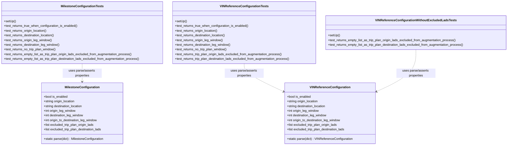
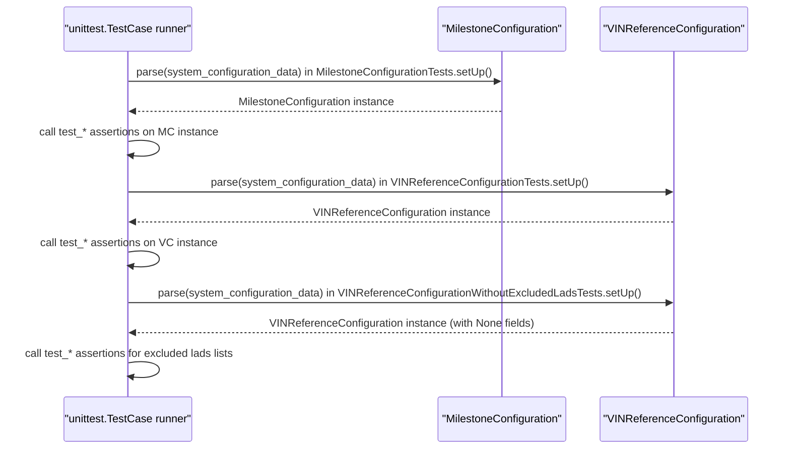

# Diagram: entity_core/entity_service/entity_service_tests/trip_leg_tests/test_augmented_trip_plan/test_configuration.py

> Auto-generated by Obscura crawlers

## Diagram 1

### SVG

<svg id="container" width="2616.96875" xmlns="http://www.w3.org/2000/svg" class="classDiagram" height="744" viewBox="0 0 2616.96875 744" role="graphics-document document" aria-roledescription="class"><g><defs><marker id="container_class-aggregationStart" class="marker aggregation class" refX="18" refY="7" markerWidth="190" markerHeight="240" orient="auto"><path d="M 18,7 L9,13 L1,7 L9,1 Z"></path></marker></defs><defs><marker id="container_class-aggregationEnd" class="marker aggregation class" refX="1" refY="7" markerWidth="20" markerHeight="28" orient="auto"><path d="M 18,7 L9,13 L1,7 L9,1 Z"></path></marker></defs><defs><marker id="container_class-extensionStart" class="marker extension class" refX="18" refY="7" markerWidth="190" markerHeight="240" orient="auto"><path d="M 1,7 L18,13 V 1 Z"></path></marker></defs><defs><marker id="container_class-extensionEnd" class="marker extension class" refX="1" refY="7" markerWidth="20" markerHeight="28" orient="auto"><path d="M 1,1 V 13 L18,7 Z"></path></marker></defs><defs><marker id="container_class-compositionStart" class="marker composition class" refX="18" refY="7" markerWidth="190" markerHeight="240" orient="auto"><path d="M 18,7 L9,13 L1,7 L9,1 Z"></path></marker></defs><defs><marker id="container_class-compositionEnd" class="marker composition class" refX="1" refY="7" markerWidth="20" markerHeight="28" orient="auto"><path d="M 18,7 L9,13 L1,7 L9,1 Z"></path></marker></defs><defs><marker id="container_class-dependencyStart" class="marker dependency class" refX="6" refY="7" markerWidth="190" markerHeight="240" orient="auto"><path d="M 5,7 L9,13 L1,7 L9,1 Z"></path></marker></defs><defs><marker id="container_class-dependencyEnd" class="marker dependency class" refX="13" refY="7" markerWidth="20" markerHeight="28" orient="auto"><path d="M 18,7 L9,13 L14,7 L9,1 Z"></path></marker></defs><defs><marker id="container_class-lollipopStart" class="marker lollipop class" refX="13" refY="7" markerWidth="190" markerHeight="240" orient="auto"><circle stroke="black" fill="transparent" cx="7" cy="7" r="6"></circle></marker></defs><defs><marker id="container_class-lollipopEnd" class="marker lollipop class" refX="1" refY="7" markerWidth="190" markerHeight="240" orient="auto"><circle stroke="black" fill="transparent" cx="7" cy="7" r="6"></circle></marker></defs><g class="root"><g class="clusters"></g><g class="edgePaths"><path d="M425.223,326L425.223,334.167C425.223,342.333,425.223,358.667,425.223,374C425.223,389.333,425.223,403.667,425.223,410.833L425.223,418" id="id_MilestoneConfigurationTests_MilestoneConfiguration_1" class="edge-thickness-normal edge-pattern-dashed relation" style=";;;" data-edge="true" data-et="edge" data-id="id_MilestoneConfigurationTests_MilestoneConfiguration_1" data-points="W3sieCI6NDI1LjIyMjY1NjI1LCJ5IjozMjZ9LHsieCI6NDI1LjIyMjY1NjI1LCJ5IjozNzV9LHsieCI6NDI1LjIyMjY1NjI1LCJ5Ijo0MjR9XQ==" marker-end="url(#container_class-dependencyEnd)"></path><path d="M1262.457,326L1262.457,334.167C1262.457,342.333,1262.457,358.667,1296.964,382.851C1331.472,407.036,1400.486,439.072,1434.994,455.09L1469.501,471.107" id="id_VINReferenceConfigurationTests_VINReferenceConfiguration_2" class="edge-thickness-normal edge-pattern-dashed relation" style=";;;" data-edge="true" data-et="edge" data-id="id_VINReferenceConfigurationTests_VINReferenceConfiguration_2" data-points="W3sieCI6MTI2Mi40NTcwMzEyNSwieSI6MzI2fSx7IngiOjEyNjIuNDU3MDMxMjUsInkiOjM3NX0seyJ4IjoxNDc0Ljk0MzM1OTM3NSwieSI6NDczLjYzMzcyNjIwMTI2OTI3fV0=" marker-end="url(#container_class-dependencyEnd)"></path><path d="M2145.719,254L2145.719,274.167C2145.719,294.333,2145.719,334.667,2111.211,370.851C2076.704,407.036,2007.689,439.072,1973.182,455.09L1938.675,471.107" id="id_VINReferenceConfigurationWithoutExcludedLadsTests_VINReferenceConfiguration_3" class="edge-thickness-normal edge-pattern-dashed relation" style=";;;" data-edge="true" data-et="edge" data-id="id_VINReferenceConfigurationWithoutExcludedLadsTests_VINReferenceConfiguration_3" data-points="W3sieCI6MjE0NS43MTg3NSwieSI6MjU0fSx7IngiOjIxNDUuNzE4NzUsInkiOjM3NX0seyJ4IjoxOTMzLjIzMjQyMTg3NSwieSI6NDczLjYzMzcyNjIwMTI2OTI3fV0=" marker-end="url(#container_class-dependencyEnd)"></path></g><g class="edgeLabels"><g class="edgeLabel" transform="translate(425.22265625, 375)"><g class="label" data-id="id_MilestoneConfigurationTests_MilestoneConfiguration_1" transform="translate(-100, -24)"><foreignObject width="200" height="48">

uses parse/asserts properties

</foreignObject></g></g><g class="edgeLabel" transform="translate(1262.45703125, 375)"><g class="label" data-id="id_VINReferenceConfigurationTests_VINReferenceConfiguration_2" transform="translate(-100, -24)"><foreignObject width="200" height="48">

uses parse/asserts properties

</foreignObject></g></g><g class="edgeLabel" transform="translate(2145.71875, 375)"><g class="label" data-id="id_VINReferenceConfigurationWithoutExcludedLadsTests_VINReferenceConfiguration_3" transform="translate(-100, -24)"><foreignObject width="200" height="48">

uses parse/asserts properties

</foreignObject></g></g></g><g class="nodes"><g class="node default" id="classId-MilestoneConfiguration-0" transform="translate(425.22265625, 580)"><g class="basic label-container"><path d="M-209.82421875 -156 L209.82421875 -156 L209.82421875 156 L-209.82421875 156" stroke="none" stroke-width="0" fill="#ECECFF" style=""></path><path d="M-209.82421875 -156 C-96.9288550350714 -156, 15.966508679857213 -156, 209.82421875 -156 M-209.82421875 -156 C-104.32595120787333 -156, 1.1723163342533383 -156, 209.82421875 -156 M209.82421875 -156 C209.82421875 -86.16136217347906, 209.82421875 -16.322724346958125, 209.82421875 156 M209.82421875 -156 C209.82421875 -69.35690141843803, 209.82421875 17.286197163123944, 209.82421875 156 M209.82421875 156 C103.01355698531293 156, -3.7971047793741377 156, -209.82421875 156 M209.82421875 156 C59.50961978692834 156, -90.80497917614332 156, -209.82421875 156 M-209.82421875 156 C-209.82421875 72.66252817551053, -209.82421875 -10.674943648978939, -209.82421875 -156 M-209.82421875 156 C-209.82421875 91.59119954558916, -209.82421875 27.182399091178326, -209.82421875 -156" stroke="#9370DB" stroke-width="1.3" fill="none" stroke-dasharray="0 0" style=""></path></g><g class="annotation-group text" transform="translate(0, -132)"></g><g class="label-group text" transform="translate(-85.1796875, -132)"><g class="label" style="font-weight: bolder" transform="translate(0,-12)"><foreignObject width="170.359375" height="24">

MilestoneConfiguration

</foreignObject></g></g><g class="members-group text" transform="translate(-197.82421875, -84)"><g class="label" style="" transform="translate(0,-12)"><foreignObject width="123.96875" height="24">

+bool is_enabled

</foreignObject></g><g class="label" style="" transform="translate(0,12)"><foreignObject width="163.421875" height="24">

+string origin_location

</foreignObject></g><g class="label" style="" transform="translate(0,36)"><foreignObject width="204.3125" height="24">

+string destination_location

</foreignObject></g><g class="label" style="" transform="translate(0,60)"><foreignObject width="167.75" height="24">

+int origin_leg_window

</foreignObject></g><g class="label" style="" transform="translate(0,84)"><foreignObject width="208.640625" height="24">

+int destination_leg_window

</foreignObject></g><g class="label" style="" transform="translate(0,108)"><foreignObject width="281.453125" height="24">

+int origin_to_destination_leg_window

</foreignObject></g><g class="label" style="" transform="translate(0,132)"><foreignObject width="263.28125" height="24">

+list excluded_trip_plan_origin_lads

</foreignObject></g><g class="label" style="" transform="translate(0,156)"><foreignObject width="304.1875" height="24">

+list excluded_trip_plan_destination_lads

</foreignObject></g></g><g class="methods-group text" transform="translate(-197.82421875, 132)"><g class="label" style="" transform="translate(0,-12)"><foreignObject width="310.46875" height="24">

+static parse(dict) : MilestoneConfiguration

</foreignObject></g></g><g class="divider" style=""><path d="M-209.82421875 -108 C-120.47101048891632 -108, -31.11780222783264 -108, 209.82421875 -108 M-209.82421875 -108 C-106.16771876152806 -108, -2.511218773056129 -108, 209.82421875 -108" stroke="#9370DB" stroke-width="1.3" fill="none" stroke-dasharray="0 0" style=""></path></g><g class="divider" style=""><path d="M-209.82421875 108 C-114.60945580779554 108, -19.394692865591082 108, 209.82421875 108 M-209.82421875 108 C-61.50837108901493 108, 86.80747657197014 108, 209.82421875 108" stroke="#9370DB" stroke-width="1.3" fill="none" stroke-dasharray="0 0" style=""></path></g></g><g class="node default" id="classId-VINReferenceConfiguration-1" transform="translate(1704.087890625, 580)"><g class="basic label-container"><path d="M-229.14453125 -156 L229.14453125 -156 L229.14453125 156 L-229.14453125 156" stroke="none" stroke-width="0" fill="#ECECFF" style=""></path><path d="M-229.14453125 -156 C-62.6332957730817 -156, 103.8779397038366 -156, 229.14453125 -156 M-229.14453125 -156 C-117.93851889201325 -156, -6.7325065340264985 -156, 229.14453125 -156 M229.14453125 -156 C229.14453125 -62.160050013169055, 229.14453125 31.67989997366189, 229.14453125 156 M229.14453125 -156 C229.14453125 -55.60757662211195, 229.14453125 44.7848467557761, 229.14453125 156 M229.14453125 156 C91.56365586520937 156, -46.01721951958126 156, -229.14453125 156 M229.14453125 156 C100.55728147329529 156, -28.02996830340942 156, -229.14453125 156 M-229.14453125 156 C-229.14453125 47.8069712259783, -229.14453125 -60.3860575480434, -229.14453125 -156 M-229.14453125 156 C-229.14453125 32.15263879327081, -229.14453125 -91.69472241345838, -229.14453125 -156" stroke="#9370DB" stroke-width="1.3" fill="none" stroke-dasharray="0 0" style=""></path></g><g class="annotation-group text" transform="translate(0, -132)"></g><g class="label-group text" transform="translate(-98.0859375, -132)"><g class="label" style="font-weight: bolder" transform="translate(0,-12)"><foreignObject width="196.171875" height="24">

VINReferenceConfiguration

</foreignObject></g></g><g class="members-group text" transform="translate(-217.14453125, -84)"><g class="label" style="" transform="translate(0,-12)"><foreignObject width="123.96875" height="24">

+bool is_enabled

</foreignObject></g><g class="label" style="" transform="translate(0,12)"><foreignObject width="163.421875" height="24">

+string origin_location

</foreignObject></g><g class="label" style="" transform="translate(0,36)"><foreignObject width="204.3125" height="24">

+string destination_location

</foreignObject></g><g class="label" style="" transform="translate(0,60)"><foreignObject width="167.75" height="24">

+int origin_leg_window

</foreignObject></g><g class="label" style="" transform="translate(0,84)"><foreignObject width="208.640625" height="24">

+int destination_leg_window

</foreignObject></g><g class="label" style="" transform="translate(0,108)"><foreignObject width="281.453125" height="24">

+int origin_to_destination_leg_window

</foreignObject></g><g class="label" style="" transform="translate(0,132)"><foreignObject width="263.28125" height="24">

+list excluded_trip_plan_origin_lads

</foreignObject></g><g class="label" style="" transform="translate(0,156)"><foreignObject width="304.1875" height="24">

+list excluded_trip_plan_destination_lads

</foreignObject></g></g><g class="methods-group text" transform="translate(-217.14453125, 132)"><g class="label" style="" transform="translate(0,-12)"><foreignObject width="336.203125" height="24">

+static parse(dict) : VINReferenceConfiguration

</foreignObject></g></g><g class="divider" style=""><path d="M-229.14453125 -108 C-96.82968001298582 -108, 35.48517122402836 -108, 229.14453125 -108 M-229.14453125 -108 C-135.84859915706568 -108, -42.552667064131356 -108, 229.14453125 -108" stroke="#9370DB" stroke-width="1.3" fill="none" stroke-dasharray="0 0" style=""></path></g><g class="divider" style=""><path d="M-229.14453125 108 C-77.39711327535909 108, 74.35030469928182 108, 229.14453125 108 M-229.14453125 108 C-54.16803652722561 108, 120.80845819554878 108, 229.14453125 108" stroke="#9370DB" stroke-width="1.3" fill="none" stroke-dasharray="0 0" style=""></path></g></g><g class="node default" id="classId-MilestoneConfigurationTests-2" transform="translate(425.22265625, 167)"><g class="basic label-container"><path d="M-417.22265625 -159 L417.22265625 -159 L417.22265625 159 L-417.22265625 159" stroke="none" stroke-width="0" fill="#ECECFF" style=""></path><path d="M-417.22265625 -159 C-235.0201330593978 -159, -52.817609868795614 -159, 417.22265625 -159 M-417.22265625 -159 C-125.40330324950168 -159, 166.41604975099665 -159, 417.22265625 -159 M417.22265625 -159 C417.22265625 -72.94416196483505, 417.22265625 13.111676070329906, 417.22265625 159 M417.22265625 -159 C417.22265625 -79.57464743502331, 417.22265625 -0.14929487004661723, 417.22265625 159 M417.22265625 159 C135.98674653850674 159, -145.24916317298653 159, -417.22265625 159 M417.22265625 159 C197.4073764893087 159, -22.407903271382622 159, -417.22265625 159 M-417.22265625 159 C-417.22265625 82.69077666649227, -417.22265625 6.381553332984538, -417.22265625 -159 M-417.22265625 159 C-417.22265625 45.72613551884666, -417.22265625 -67.54772896230668, -417.22265625 -159" stroke="#9370DB" stroke-width="1.3" fill="none" stroke-dasharray="0 0" style=""></path></g><g class="annotation-group text" transform="translate(0, -135)"></g><g class="label-group text" transform="translate(-104.2890625, -135)"><g class="label" style="font-weight: bolder" transform="translate(0,-12)"><foreignObject width="208.578125" height="24">

MilestoneConfigurationTests

</foreignObject></g></g><g class="members-group text" transform="translate(-405.22265625, -87)"></g><g class="methods-group text" transform="translate(-405.22265625, -57)"><g class="label" style="" transform="translate(0,-12)"><foreignObject width="60.421875" height="24">

+setUp()

</foreignObject></g><g class="label" style="" transform="translate(0,12)"><foreignObject width="382.15625" height="24">

+test_returns_true_when_configuration_is_enabled()

</foreignObject></g><g class="label" style="" transform="translate(0,36)"><foreignObject width="223.859375" height="24">

+test_returns_origin_location()

</foreignObject></g><g class="label" style="" transform="translate(0,60)"><foreignObject width="264.765625" height="24">

+test_returns_destination_location()

</foreignObject></g><g class="label" style="" transform="translate(0,84)"><foreignObject width="250.171875" height="24">

+test_returns_origin_leg_window()

</foreignObject></g><g class="label" style="" transform="translate(0,108)"><foreignObject width="291.0625" height="24">

+test_returns_destination_leg_window()

</foreignObject></g><g class="label" style="" transform="translate(0,132)"><foreignObject width="270.9375" height="24">

+test_returns_no_trip_plan_window()

</foreignObject></g><g class="label" style="" transform="translate(0,156)"><foreignObject width="665.25" height="24">

+test_returns_empty_list_as_trip_plan_origin_lads_excluded_from_augmentation_process()

</foreignObject></g><g class="label" style="" transform="translate(0,180)"><foreignObject width="706.15625" height="24">

+test_returns_empty_list_as_trip_plan_destination_lads_excluded_from_augmentation_process()

</foreignObject></g></g><g class="divider" style=""><path d="M-417.22265625 -111 C-147.95279796962495 -111, 121.3170603107501 -111, 417.22265625 -111 M-417.22265625 -111 C-116.19554166402492 -111, 184.83157292195017 -111, 417.22265625 -111" stroke="#9370DB" stroke-width="1.3" fill="none" stroke-dasharray="0 0" style=""></path></g><g class="divider" style=""><path d="M-417.22265625 -87 C-136.5636535261297 -87, 144.09534919774057 -87, 417.22265625 -87 M-417.22265625 -87 C-90.14648203390686 -87, 236.92969218218627 -87, 417.22265625 -87" stroke="#9370DB" stroke-width="1.3" fill="none" stroke-dasharray="0 0" style=""></path></g></g><g class="node default" id="classId-VINReferenceConfigurationTests-3" transform="translate(1262.45703125, 167)"><g class="basic label-container"><path d="M-370.01171875 -159 L370.01171875 -159 L370.01171875 159 L-370.01171875 159" stroke="none" stroke-width="0" fill="#ECECFF" style=""></path><path d="M-370.01171875 -159 C-131.1353691918056 -159, 107.74098036638878 -159, 370.01171875 -159 M-370.01171875 -159 C-162.7846157708784 -159, 44.44248720824322 -159, 370.01171875 -159 M370.01171875 -159 C370.01171875 -77.58926014334097, 370.01171875 3.8214797133180696, 370.01171875 159 M370.01171875 -159 C370.01171875 -42.334013844720104, 370.01171875 74.33197231055979, 370.01171875 159 M370.01171875 159 C124.7387240749365 159, -120.534270600127 159, -370.01171875 159 M370.01171875 159 C118.27677937680323 159, -133.45815999639353 159, -370.01171875 159 M-370.01171875 159 C-370.01171875 44.126918564236334, -370.01171875 -70.74616287152733, -370.01171875 -159 M-370.01171875 159 C-370.01171875 34.03493725290153, -370.01171875 -90.93012549419694, -370.01171875 -159" stroke="#9370DB" stroke-width="1.3" fill="none" stroke-dasharray="0 0" style=""></path></g><g class="annotation-group text" transform="translate(0, -135)"></g><g class="label-group text" transform="translate(-117.1953125, -135)"><g class="label" style="font-weight: bolder" transform="translate(0,-12)"><foreignObject width="234.390625" height="24">

VINReferenceConfigurationTests

</foreignObject></g></g><g class="members-group text" transform="translate(-358.01171875, -87)"></g><g class="methods-group text" transform="translate(-358.01171875, -57)"><g class="label" style="" transform="translate(0,-12)"><foreignObject width="60.421875" height="24">

+setUp()

</foreignObject></g><g class="label" style="" transform="translate(0,12)"><foreignObject width="382.15625" height="24">

+test_returns_true_when_configuration_is_enabled()

</foreignObject></g><g class="label" style="" transform="translate(0,36)"><foreignObject width="223.859375" height="24">

+test_returns_origin_location()

</foreignObject></g><g class="label" style="" transform="translate(0,60)"><foreignObject width="264.765625" height="24">

+test_returns_destination_location()

</foreignObject></g><g class="label" style="" transform="translate(0,84)"><foreignObject width="250.171875" height="24">

+test_returns_origin_leg_window()

</foreignObject></g><g class="label" style="" transform="translate(0,108)"><foreignObject width="291.0625" height="24">

+test_returns_destination_leg_window()

</foreignObject></g><g class="label" style="" transform="translate(0,132)"><foreignObject width="270.9375" height="24">

+test_returns_no_trip_plan_window()

</foreignObject></g><g class="label" style="" transform="translate(0,156)"><foreignObject width="557.921875" height="24">

+test_returns_trip_plan_origin_lads_excluded_from_augmentation_process()

</foreignObject></g><g class="label" style="" transform="translate(0,180)"><foreignObject width="598.828125" height="24">

+test_returns_trip_plan_destination_lads_excluded_from_augmentation_process()

</foreignObject></g></g><g class="divider" style=""><path d="M-370.01171875 -111 C-171.82845093203957 -111, 26.354816885920854 -111, 370.01171875 -111 M-370.01171875 -111 C-146.638203148336 -111, 76.73531245332799 -111, 370.01171875 -111" stroke="#9370DB" stroke-width="1.3" fill="none" stroke-dasharray="0 0" style=""></path></g><g class="divider" style=""><path d="M-370.01171875 -87 C-92.07786208096542 -87, 185.85599458806917 -87, 370.01171875 -87 M-370.01171875 -87 C-202.46319875055144 -87, -34.91467875110288 -87, 370.01171875 -87" stroke="#9370DB" stroke-width="1.3" fill="none" stroke-dasharray="0 0" style=""></path></g></g><g class="node default" id="classId-VINReferenceConfigurationWithoutExcludedLadsTests-4" transform="translate(2145.71875, 167)"><g class="basic label-container"><path d="M-463.25 -87 L463.25 -87 L463.25 87 L-463.25 87" stroke="none" stroke-width="0" fill="#ECECFF" style=""></path><path d="M-463.25 -87 C-136.6120677046835 -87, 190.02586459063298 -87, 463.25 -87 M-463.25 -87 C-151.86866078799943 -87, 159.51267842400114 -87, 463.25 -87 M463.25 -87 C463.25 -24.231328637575828, 463.25 38.537342724848344, 463.25 87 M463.25 -87 C463.25 -38.329874021282805, 463.25 10.34025195743439, 463.25 87 M463.25 87 C134.08520208518274 87, -195.0795958296345 87, -463.25 87 M463.25 87 C214.81828645266006 87, -33.61342709467988 87, -463.25 87 M-463.25 87 C-463.25 18.60619879869475, -463.25 -49.7876024026105, -463.25 -87 M-463.25 87 C-463.25 48.42776197288162, -463.25 9.855523945763238, -463.25 -87" stroke="#9370DB" stroke-width="1.3" fill="none" stroke-dasharray="0 0" style=""></path></g><g class="annotation-group text" transform="translate(0, -63)"></g><g class="label-group text" transform="translate(-196.34375, -63)"><g class="label" style="font-weight: bolder" transform="translate(0,-12)"><foreignObject width="392.6875" height="24">

VINReferenceConfigurationWithoutExcludedLadsTests

</foreignObject></g></g><g class="members-group text" transform="translate(-451.25, -15)"></g><g class="methods-group text" transform="translate(-451.25, 15)"><g class="label" style="" transform="translate(0,-12)"><foreignObject width="60.421875" height="24">

+setUp()

</foreignObject></g><g class="label" style="" transform="translate(0,12)"><foreignObject width="665.25" height="24">

+test_returns_empty_list_as_trip_plan_origin_lads_excluded_from_augmentation_process()

</foreignObject></g><g class="label" style="" transform="translate(0,36)"><foreignObject width="706.15625" height="24">

+test_returns_empty_list_as_trip_plan_destination_lads_excluded_from_augmentation_process()

</foreignObject></g></g><g class="divider" style=""><path d="M-463.25 -39 C-116.58657759329941 -39, 230.07684481340118 -39, 463.25 -39 M-463.25 -39 C-213.9814089756043 -39, 35.28718204879141 -39, 463.25 -39" stroke="#9370DB" stroke-width="1.3" fill="none" stroke-dasharray="0 0" style=""></path></g><g class="divider" style=""><path d="M-463.25 -15 C-176.35072524762313 -15, 110.54854950475374 -15, 463.25 -15 M-463.25 -15 C-211.35777417018215 -15, 40.53445165963569 -15, 463.25 -15" stroke="#9370DB" stroke-width="1.3" fill="none" stroke-dasharray="0 0" style=""></path></g></g></g></g></g></svg>

## Diagram 2

### SVG

<svg id="container" width="1232.5" xmlns="http://www.w3.org/2000/svg" height="693" viewBox="-101.5 -10 1232.5 693" role="graphics-document document" aria-roledescription="sequence"><g><rect x="854" y="607" fill="#eaeaea" stroke="#666" width="227" height="65" name="VC" rx="3" ry="3" class="actor actor-bottom"></rect><text x="967.5" y="639.5" dominant-baseline="central" alignment-baseline="central" class="actor actor-box" style="text-anchor: middle; font-size: 16px; font-weight: 400;"><tspan x="967.5" dy="0">"VINReferenceConfiguration"</tspan></text></g><g><rect x="603" y="607" fill="#eaeaea" stroke="#666" width="201" height="65" name="MC" rx="3" ry="3" class="actor actor-bottom"></rect><text x="703.5" y="639.5" dominant-baseline="central" alignment-baseline="central" class="actor actor-box" style="text-anchor: middle; font-size: 16px; font-weight: 400;"><tspan x="703.5" dy="0">"MilestoneConfiguration"</tspan></text></g><g><rect x="0" y="607" fill="#eaeaea" stroke="#666" width="209" height="65" name="TestRunner" rx="3" ry="3" class="actor actor-bottom"></rect><text x="104.5" y="639.5" dominant-baseline="central" alignment-baseline="central" class="actor actor-box" style="text-anchor: middle; font-size: 16px; font-weight: 400;"><tspan x="104.5" dy="0">"unittest.TestCase runner"</tspan></text></g><g><line id="actor2" x1="967.5" y1="65" x2="967.5" y2="607" class="actor-line 200" stroke-width="0.5px" stroke="#999" name="VC"></line><g id="root-2"><rect x="854" y="0" fill="#eaeaea" stroke="#666" width="227" height="65" name="VC" rx="3" ry="3" class="actor actor-top"></rect><text x="967.5" y="32.5" dominant-baseline="central" alignment-baseline="central" class="actor actor-box" style="text-anchor: middle; font-size: 16px; font-weight: 400;"><tspan x="967.5" dy="0">"VINReferenceConfiguration"</tspan></text></g></g><g><line id="actor1" x1="703.5" y1="65" x2="703.5" y2="607" class="actor-line 200" stroke-width="0.5px" stroke="#999" name="MC"></line><g id="root-1"><rect x="603" y="0" fill="#eaeaea" stroke="#666" width="201" height="65" name="MC" rx="3" ry="3" class="actor actor-top"></rect><text x="703.5" y="32.5" dominant-baseline="central" alignment-baseline="central" class="actor actor-box" style="text-anchor: middle; font-size: 16px; font-weight: 400;"><tspan x="703.5" dy="0">"MilestoneConfiguration"</tspan></text></g></g><g><line id="actor0" x1="104.5" y1="65" x2="104.5" y2="607" class="actor-line 200" stroke-width="0.5px" stroke="#999" name="TestRunner"></line><g id="root-0"><rect x="0" y="0" fill="#eaeaea" stroke="#666" width="209" height="65" name="TestRunner" rx="3" ry="3" class="actor actor-top"></rect><text x="104.5" y="32.5" dominant-baseline="central" alignment-baseline="central" class="actor actor-box" style="text-anchor: middle; font-size: 16px; font-weight: 400;"><tspan x="104.5" dy="0">"unittest.TestCase runner"</tspan></text></g></g><g></g><defs><symbol id="computer" width="24" height="24"><path transform="scale(.5)" d="M2 2v13h20v-13h-20zm18 11h-16v-9h16v9zm-10.228 6l.466-1h3.524l.467 1h-4.457zm14.228 3h-24l2-6h2.104l-1.33 4h18.45l-1.297-4h2.073l2 6zm-5-10h-14v-7h14v7z"></path></symbol></defs><defs><symbol id="database" fill-rule="evenodd" clip-rule="evenodd"><path transform="scale(.5)" d="M12.258.001l.256.004.255.005.253.008.251.01.249.012.247.015.246.016.242.019.241.02.239.023.236.024.233.027.231.028.229.031.225.032.223.034.22.036.217.038.214.04.211.041.208.043.205.045.201.046.198.048.194.05.191.051.187.053.183.054.18.056.175.057.172.059.168.06.163.061.16.063.155.064.15.066.074.033.073.033.071.034.07.034.069.035.068.035.067.035.066.035.064.036.064.036.062.036.06.036.06.037.058.037.058.037.055.038.055.038.053.038.052.038.051.039.05.039.048.039.047.039.045.04.044.04.043.04.041.04.04.041.039.041.037.041.036.041.034.041.033.042.032.042.03.042.029.042.027.042.026.043.024.043.023.043.021.043.02.043.018.044.017.043.015.044.013.044.012.044.011.045.009.044.007.045.006.045.004.045.002.045.001.045v17l-.001.045-.002.045-.004.045-.006.045-.007.045-.009.044-.011.045-.012.044-.013.044-.015.044-.017.043-.018.044-.02.043-.021.043-.023.043-.024.043-.026.043-.027.042-.029.042-.03.042-.032.042-.033.042-.034.041-.036.041-.037.041-.039.041-.04.041-.041.04-.043.04-.044.04-.045.04-.047.039-.048.039-.05.039-.051.039-.052.038-.053.038-.055.038-.055.038-.058.037-.058.037-.06.037-.06.036-.062.036-.064.036-.064.036-.066.035-.067.035-.068.035-.069.035-.07.034-.071.034-.073.033-.074.033-.15.066-.155.064-.16.063-.163.061-.168.06-.172.059-.175.057-.18.056-.183.054-.187.053-.191.051-.194.05-.198.048-.201.046-.205.045-.208.043-.211.041-.214.04-.217.038-.22.036-.223.034-.225.032-.229.031-.231.028-.233.027-.236.024-.239.023-.241.02-.242.019-.246.016-.247.015-.249.012-.251.01-.253.008-.255.005-.256.004-.258.001-.258-.001-.256-.004-.255-.005-.253-.008-.251-.01-.249-.012-.247-.015-.245-.016-.243-.019-.241-.02-.238-.023-.236-.024-.234-.027-.231-.028-.228-.031-.226-.032-.223-.034-.22-.036-.217-.038-.214-.04-.211-.041-.208-.043-.204-.045-.201-.046-.198-.048-.195-.05-.19-.051-.187-.053-.184-.054-.179-.056-.176-.057-.172-.059-.167-.06-.164-.061-.159-.063-.155-.064-.151-.066-.074-.033-.072-.033-.072-.034-.07-.034-.069-.035-.068-.035-.067-.035-.066-.035-.064-.036-.063-.036-.062-.036-.061-.036-.06-.037-.058-.037-.057-.037-.056-.038-.055-.038-.053-.038-.052-.038-.051-.039-.049-.039-.049-.039-.046-.039-.046-.04-.044-.04-.043-.04-.041-.04-.04-.041-.039-.041-.037-.041-.036-.041-.034-.041-.033-.042-.032-.042-.03-.042-.029-.042-.027-.042-.026-.043-.024-.043-.023-.043-.021-.043-.02-.043-.018-.044-.017-.043-.015-.044-.013-.044-.012-.044-.011-.045-.009-.044-.007-.045-.006-.045-.004-.045-.002-.045-.001-.045v-17l.001-.045.002-.045.004-.045.006-.045.007-.045.009-.044.011-.045.012-.044.013-.044.015-.044.017-.043.018-.044.02-.043.021-.043.023-.043.024-.043.026-.043.027-.042.029-.042.03-.042.032-.042.033-.042.034-.041.036-.041.037-.041.039-.041.04-.041.041-.04.043-.04.044-.04.046-.04.046-.039.049-.039.049-.039.051-.039.052-.038.053-.038.055-.038.056-.038.057-.037.058-.037.06-.037.061-.036.062-.036.063-.036.064-.036.066-.035.067-.035.068-.035.069-.035.07-.034.072-.034.072-.033.074-.033.151-.066.155-.064.159-.063.164-.061.167-.06.172-.059.176-.057.179-.056.184-.054.187-.053.19-.051.195-.05.198-.048.201-.046.204-.045.208-.043.211-.041.214-.04.217-.038.22-.036.223-.034.226-.032.228-.031.231-.028.234-.027.236-.024.238-.023.241-.02.243-.019.245-.016.247-.015.249-.012.251-.01.253-.008.255-.005.256-.004.258-.001.258.001zm-9.258 20.499v.01l.001.021.003.021.004.022.005.021.006.022.007.022.009.023.01.022.011.023.012.023.013.023.015.023.016.024.017.023.018.024.019.024.021.024.022.025.023.024.024.025.052.049.056.05.061.051.066.051.07.051.075.051.079.052.084.052.088.052.092.052.097.052.102.051.105.052.11.052.114.051.119.051.123.051.127.05.131.05.135.05.139.048.144.049.147.047.152.047.155.047.16.045.163.045.167.043.171.043.176.041.178.041.183.039.187.039.19.037.194.035.197.035.202.033.204.031.209.03.212.029.216.027.219.025.222.024.226.021.23.02.233.018.236.016.24.015.243.012.246.01.249.008.253.005.256.004.259.001.26-.001.257-.004.254-.005.25-.008.247-.011.244-.012.241-.014.237-.016.233-.018.231-.021.226-.021.224-.024.22-.026.216-.027.212-.028.21-.031.205-.031.202-.034.198-.034.194-.036.191-.037.187-.039.183-.04.179-.04.175-.042.172-.043.168-.044.163-.045.16-.046.155-.046.152-.047.148-.048.143-.049.139-.049.136-.05.131-.05.126-.05.123-.051.118-.052.114-.051.11-.052.106-.052.101-.052.096-.052.092-.052.088-.053.083-.051.079-.052.074-.052.07-.051.065-.051.06-.051.056-.05.051-.05.023-.024.023-.025.021-.024.02-.024.019-.024.018-.024.017-.024.015-.023.014-.024.013-.023.012-.023.01-.023.01-.022.008-.022.006-.022.006-.022.004-.022.004-.021.001-.021.001-.021v-4.127l-.077.055-.08.053-.083.054-.085.053-.087.052-.09.052-.093.051-.095.05-.097.05-.1.049-.102.049-.105.048-.106.047-.109.047-.111.046-.114.045-.115.045-.118.044-.12.043-.122.042-.124.042-.126.041-.128.04-.13.04-.132.038-.134.038-.135.037-.138.037-.139.035-.142.035-.143.034-.144.033-.147.032-.148.031-.15.03-.151.03-.153.029-.154.027-.156.027-.158.026-.159.025-.161.024-.162.023-.163.022-.165.021-.166.02-.167.019-.169.018-.169.017-.171.016-.173.015-.173.014-.175.013-.175.012-.177.011-.178.01-.179.008-.179.008-.181.006-.182.005-.182.004-.184.003-.184.002h-.37l-.184-.002-.184-.003-.182-.004-.182-.005-.181-.006-.179-.008-.179-.008-.178-.01-.176-.011-.176-.012-.175-.013-.173-.014-.172-.015-.171-.016-.17-.017-.169-.018-.167-.019-.166-.02-.165-.021-.163-.022-.162-.023-.161-.024-.159-.025-.157-.026-.156-.027-.155-.027-.153-.029-.151-.03-.15-.03-.148-.031-.146-.032-.145-.033-.143-.034-.141-.035-.14-.035-.137-.037-.136-.037-.134-.038-.132-.038-.13-.04-.128-.04-.126-.041-.124-.042-.122-.042-.12-.044-.117-.043-.116-.045-.113-.045-.112-.046-.109-.047-.106-.047-.105-.048-.102-.049-.1-.049-.097-.05-.095-.05-.093-.052-.09-.051-.087-.052-.085-.053-.083-.054-.08-.054-.077-.054v4.127zm0-5.654v.011l.001.021.003.021.004.021.005.022.006.022.007.022.009.022.01.022.011.023.012.023.013.023.015.024.016.023.017.024.018.024.019.024.021.024.022.024.023.025.024.024.052.05.056.05.061.05.066.051.07.051.075.052.079.051.084.052.088.052.092.052.097.052.102.052.105.052.11.051.114.051.119.052.123.05.127.051.131.05.135.049.139.049.144.048.147.048.152.047.155.046.16.045.163.045.167.044.171.042.176.042.178.04.183.04.187.038.19.037.194.036.197.034.202.033.204.032.209.03.212.028.216.027.219.025.222.024.226.022.23.02.233.018.236.016.24.014.243.012.246.01.249.008.253.006.256.003.259.001.26-.001.257-.003.254-.006.25-.008.247-.01.244-.012.241-.015.237-.016.233-.018.231-.02.226-.022.224-.024.22-.025.216-.027.212-.029.21-.03.205-.032.202-.033.198-.035.194-.036.191-.037.187-.039.183-.039.179-.041.175-.042.172-.043.168-.044.163-.045.16-.045.155-.047.152-.047.148-.048.143-.048.139-.05.136-.049.131-.05.126-.051.123-.051.118-.051.114-.052.11-.052.106-.052.101-.052.096-.052.092-.052.088-.052.083-.052.079-.052.074-.051.07-.052.065-.051.06-.05.056-.051.051-.049.023-.025.023-.024.021-.025.02-.024.019-.024.018-.024.017-.024.015-.023.014-.023.013-.024.012-.022.01-.023.01-.023.008-.022.006-.022.006-.022.004-.021.004-.022.001-.021.001-.021v-4.139l-.077.054-.08.054-.083.054-.085.052-.087.053-.09.051-.093.051-.095.051-.097.05-.1.049-.102.049-.105.048-.106.047-.109.047-.111.046-.114.045-.115.044-.118.044-.12.044-.122.042-.124.042-.126.041-.128.04-.13.039-.132.039-.134.038-.135.037-.138.036-.139.036-.142.035-.143.033-.144.033-.147.033-.148.031-.15.03-.151.03-.153.028-.154.028-.156.027-.158.026-.159.025-.161.024-.162.023-.163.022-.165.021-.166.02-.167.019-.169.018-.169.017-.171.016-.173.015-.173.014-.175.013-.175.012-.177.011-.178.009-.179.009-.179.007-.181.007-.182.005-.182.004-.184.003-.184.002h-.37l-.184-.002-.184-.003-.182-.004-.182-.005-.181-.007-.179-.007-.179-.009-.178-.009-.176-.011-.176-.012-.175-.013-.173-.014-.172-.015-.171-.016-.17-.017-.169-.018-.167-.019-.166-.02-.165-.021-.163-.022-.162-.023-.161-.024-.159-.025-.157-.026-.156-.027-.155-.028-.153-.028-.151-.03-.15-.03-.148-.031-.146-.033-.145-.033-.143-.033-.141-.035-.14-.036-.137-.036-.136-.037-.134-.038-.132-.039-.13-.039-.128-.04-.126-.041-.124-.042-.122-.043-.12-.043-.117-.044-.116-.044-.113-.046-.112-.046-.109-.046-.106-.047-.105-.048-.102-.049-.1-.049-.097-.05-.095-.051-.093-.051-.09-.051-.087-.053-.085-.052-.083-.054-.08-.054-.077-.054v4.139zm0-5.666v.011l.001.02.003.022.004.021.005.022.006.021.007.022.009.023.01.022.011.023.012.023.013.023.015.023.016.024.017.024.018.023.019.024.021.025.022.024.023.024.024.025.052.05.056.05.061.05.066.051.07.051.075.052.079.051.084.052.088.052.092.052.097.052.102.052.105.051.11.052.114.051.119.051.123.051.127.05.131.05.135.05.139.049.144.048.147.048.152.047.155.046.16.045.163.045.167.043.171.043.176.042.178.04.183.04.187.038.19.037.194.036.197.034.202.033.204.032.209.03.212.028.216.027.219.025.222.024.226.021.23.02.233.018.236.017.24.014.243.012.246.01.249.008.253.006.256.003.259.001.26-.001.257-.003.254-.006.25-.008.247-.01.244-.013.241-.014.237-.016.233-.018.231-.02.226-.022.224-.024.22-.025.216-.027.212-.029.21-.03.205-.032.202-.033.198-.035.194-.036.191-.037.187-.039.183-.039.179-.041.175-.042.172-.043.168-.044.163-.045.16-.045.155-.047.152-.047.148-.048.143-.049.139-.049.136-.049.131-.051.126-.05.123-.051.118-.052.114-.051.11-.052.106-.052.101-.052.096-.052.092-.052.088-.052.083-.052.079-.052.074-.052.07-.051.065-.051.06-.051.056-.05.051-.049.023-.025.023-.025.021-.024.02-.024.019-.024.018-.024.017-.024.015-.023.014-.024.013-.023.012-.023.01-.022.01-.023.008-.022.006-.022.006-.022.004-.022.004-.021.001-.021.001-.021v-4.153l-.077.054-.08.054-.083.053-.085.053-.087.053-.09.051-.093.051-.095.051-.097.05-.1.049-.102.048-.105.048-.106.048-.109.046-.111.046-.114.046-.115.044-.118.044-.12.043-.122.043-.124.042-.126.041-.128.04-.13.039-.132.039-.134.038-.135.037-.138.036-.139.036-.142.034-.143.034-.144.033-.147.032-.148.032-.15.03-.151.03-.153.028-.154.028-.156.027-.158.026-.159.024-.161.024-.162.023-.163.023-.165.021-.166.02-.167.019-.169.018-.169.017-.171.016-.173.015-.173.014-.175.013-.175.012-.177.01-.178.01-.179.009-.179.007-.181.006-.182.006-.182.004-.184.003-.184.001-.185.001-.185-.001-.184-.001-.184-.003-.182-.004-.182-.006-.181-.006-.179-.007-.179-.009-.178-.01-.176-.01-.176-.012-.175-.013-.173-.014-.172-.015-.171-.016-.17-.017-.169-.018-.167-.019-.166-.02-.165-.021-.163-.023-.162-.023-.161-.024-.159-.024-.157-.026-.156-.027-.155-.028-.153-.028-.151-.03-.15-.03-.148-.032-.146-.032-.145-.033-.143-.034-.141-.034-.14-.036-.137-.036-.136-.037-.134-.038-.132-.039-.13-.039-.128-.041-.126-.041-.124-.041-.122-.043-.12-.043-.117-.044-.116-.044-.113-.046-.112-.046-.109-.046-.106-.048-.105-.048-.102-.048-.1-.05-.097-.049-.095-.051-.093-.051-.09-.052-.087-.052-.085-.053-.083-.053-.08-.054-.077-.054v4.153zm8.74-8.179l-.257.004-.254.005-.25.008-.247.011-.244.012-.241.014-.237.016-.233.018-.231.021-.226.022-.224.023-.22.026-.216.027-.212.028-.21.031-.205.032-.202.033-.198.034-.194.036-.191.038-.187.038-.183.04-.179.041-.175.042-.172.043-.168.043-.163.045-.16.046-.155.046-.152.048-.148.048-.143.048-.139.049-.136.05-.131.05-.126.051-.123.051-.118.051-.114.052-.11.052-.106.052-.101.052-.096.052-.092.052-.088.052-.083.052-.079.052-.074.051-.07.052-.065.051-.06.05-.056.05-.051.05-.023.025-.023.024-.021.024-.02.025-.019.024-.018.024-.017.023-.015.024-.014.023-.013.023-.012.023-.01.023-.01.022-.008.022-.006.023-.006.021-.004.022-.004.021-.001.021-.001.021.001.021.001.021.004.021.004.022.006.021.006.023.008.022.01.022.01.023.012.023.013.023.014.023.015.024.017.023.018.024.019.024.02.025.021.024.023.024.023.025.051.05.056.05.06.05.065.051.07.052.074.051.079.052.083.052.088.052.092.052.096.052.101.052.106.052.11.052.114.052.118.051.123.051.126.051.131.05.136.05.139.049.143.048.148.048.152.048.155.046.16.046.163.045.168.043.172.043.175.042.179.041.183.04.187.038.191.038.194.036.198.034.202.033.205.032.21.031.212.028.216.027.22.026.224.023.226.022.231.021.233.018.237.016.241.014.244.012.247.011.25.008.254.005.257.004.26.001.26-.001.257-.004.254-.005.25-.008.247-.011.244-.012.241-.014.237-.016.233-.018.231-.021.226-.022.224-.023.22-.026.216-.027.212-.028.21-.031.205-.032.202-.033.198-.034.194-.036.191-.038.187-.038.183-.04.179-.041.175-.042.172-.043.168-.043.163-.045.16-.046.155-.046.152-.048.148-.048.143-.048.139-.049.136-.05.131-.05.126-.051.123-.051.118-.051.114-.052.11-.052.106-.052.101-.052.096-.052.092-.052.088-.052.083-.052.079-.052.074-.051.07-.052.065-.051.06-.05.056-.05.051-.05.023-.025.023-.024.021-.024.02-.025.019-.024.018-.024.017-.023.015-.024.014-.023.013-.023.012-.023.01-.023.01-.022.008-.022.006-.023.006-.021.004-.022.004-.021.001-.021.001-.021-.001-.021-.001-.021-.004-.021-.004-.022-.006-.021-.006-.023-.008-.022-.01-.022-.01-.023-.012-.023-.013-.023-.014-.023-.015-.024-.017-.023-.018-.024-.019-.024-.02-.025-.021-.024-.023-.024-.023-.025-.051-.05-.056-.05-.06-.05-.065-.051-.07-.052-.074-.051-.079-.052-.083-.052-.088-.052-.092-.052-.096-.052-.101-.052-.106-.052-.11-.052-.114-.052-.118-.051-.123-.051-.126-.051-.131-.05-.136-.05-.139-.049-.143-.048-.148-.048-.152-.048-.155-.046-.16-.046-.163-.045-.168-.043-.172-.043-.175-.042-.179-.041-.183-.04-.187-.038-.191-.038-.194-.036-.198-.034-.202-.033-.205-.032-.21-.031-.212-.028-.216-.027-.22-.026-.224-.023-.226-.022-.231-.021-.233-.018-.237-.016-.241-.014-.244-.012-.247-.011-.25-.008-.254-.005-.257-.004-.26-.001-.26.001z"></path></symbol></defs><defs><symbol id="clock" width="24" height="24"><path transform="scale(.5)" d="M12 2c5.514 0 10 4.486 10 10s-4.486 10-10 10-10-4.486-10-10 4.486-10 10-10zm0-2c-6.627 0-12 5.373-12 12s5.373 12 12 12 12-5.373 12-12-5.373-12-12-12zm5.848 12.459c.202.038.202.333.001.372-1.907.361-6.045 1.111-6.547 1.111-.719 0-1.301-.582-1.301-1.301 0-.512.77-5.447 1.125-7.445.034-.192.312-.181.343.014l.985 6.238 5.394 1.011z"></path></symbol></defs><defs><marker id="arrowhead" refX="7.9" refY="5" markerUnits="userSpaceOnUse" markerWidth="12" markerHeight="12" orient="auto-start-reverse"><path d="M -1 0 L 10 5 L 0 10 z"></path></marker></defs><defs><marker id="crosshead" markerWidth="15" markerHeight="8" orient="auto" refX="4" refY="4.5"><path fill="none" stroke="#000000" stroke-width="1pt" d="M 1,2 L 6,7 M 6,2 L 1,7" style="stroke-dasharray: 0, 0;"></path></marker></defs><defs><marker id="filled-head" refX="15.5" refY="7" markerWidth="20" markerHeight="28" orient="auto"><path d="M 18,7 L9,13 L14,7 L9,1 Z"></path></marker></defs><defs><marker id="sequencenumber" refX="15" refY="15" markerWidth="60" markerHeight="40" orient="auto"><circle cx="15" cy="15" r="6"></circle></marker></defs><text x="403" y="80" text-anchor="middle" dominant-baseline="middle" alignment-baseline="middle" class="messageText" dy="1em" style="font-size: 16px; font-weight: 400;">parse(system_configuration_data) in MilestoneConfigurationTests.setUp()</text><line x1="105.5" y1="113" x2="699.5" y2="113" class="messageLine0" stroke-width="2" stroke="none" marker-end="url(#arrowhead)" style="fill: none;"></line><text x="406" y="128" text-anchor="middle" dominant-baseline="middle" alignment-baseline="middle" class="messageText" dy="1em" style="font-size: 16px; font-weight: 400;">MilestoneConfiguration instance</text><line x1="702.5" y1="161" x2="108.5" y2="161" class="messageLine1" stroke-width="2" stroke="none" marker-end="url(#arrowhead)" style="stroke-dasharray: 3, 3; fill: none;"></line><text x="106" y="176" text-anchor="middle" dominant-baseline="middle" alignment-baseline="middle" class="messageText" dy="1em" style="font-size: 16px; font-weight: 400;">call test_* assertions on MC instance</text><path d="M 105.5,209 C 165.5,199 165.5,239 105.5,229" class="messageLine0" stroke-width="2" stroke="none" marker-end="url(#arrowhead)" style="fill: none;"></path><text x="535" y="254" text-anchor="middle" dominant-baseline="middle" alignment-baseline="middle" class="messageText" dy="1em" style="font-size: 16px; font-weight: 400;">parse(system_configuration_data) in VINReferenceConfigurationTests.setUp()</text><line x1="105.5" y1="287" x2="963.5" y2="287" class="messageLine0" stroke-width="2" stroke="none" marker-end="url(#arrowhead)" style="fill: none;"></line><text x="538" y="302" text-anchor="middle" dominant-baseline="middle" alignment-baseline="middle" class="messageText" dy="1em" style="font-size: 16px; font-weight: 400;">VINReferenceConfiguration instance</text><line x1="966.5" y1="335" x2="108.5" y2="335" class="messageLine1" stroke-width="2" stroke="none" marker-end="url(#arrowhead)" style="stroke-dasharray: 3, 3; fill: none;"></line><text x="106" y="350" text-anchor="middle" dominant-baseline="middle" alignment-baseline="middle" class="messageText" dy="1em" style="font-size: 16px; font-weight: 400;">call test_* assertions on VC instance</text><path d="M 105.5,383 C 165.5,373 165.5,413 105.5,403" class="messageLine0" stroke-width="2" stroke="none" marker-end="url(#arrowhead)" style="fill: none;"></path><text x="535" y="428" text-anchor="middle" dominant-baseline="middle" alignment-baseline="middle" class="messageText" dy="1em" style="font-size: 16px; font-weight: 400;">parse(system_configuration_data) in VINReferenceConfigurationWithoutExcludedLadsTests.setUp()</text><line x1="105.5" y1="461" x2="963.5" y2="461" class="messageLine0" stroke-width="2" stroke="none" marker-end="url(#arrowhead)" style="fill: none;"></line><text x="538" y="476" text-anchor="middle" dominant-baseline="middle" alignment-baseline="middle" class="messageText" dy="1em" style="font-size: 16px; font-weight: 400;">VINReferenceConfiguration instance (with None fields)</text><line x1="966.5" y1="509" x2="108.5" y2="509" class="messageLine1" stroke-width="2" stroke="none" marker-end="url(#arrowhead)" style="stroke-dasharray: 3, 3; fill: none;"></line><text x="106" y="524" text-anchor="middle" dominant-baseline="middle" alignment-baseline="middle" class="messageText" dy="1em" style="font-size: 16px; font-weight: 400;">call test_* assertions for excluded lads lists</text><path d="M 105.5,557 C 165.5,547 165.5,587 105.5,577" class="messageLine0" stroke-width="2" stroke="none" marker-end="url(#arrowhead)" style="fill: none;"></path></svg>
