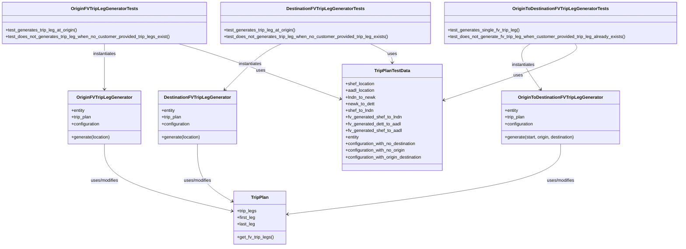
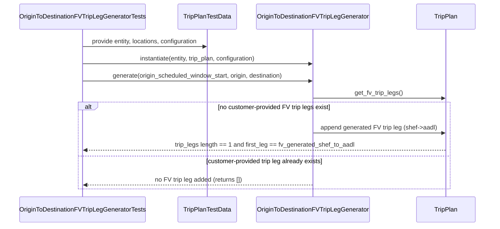

# Diagram: entity_core/entity_service/entity_service_tests/trip_leg_tests/test_augmented_trip_plan/test_fv_trip_leg_generators.py

> Auto-generated by Obscura crawlers

## Diagram 1

### SVG

<svg id="container" width="2442.078125" xmlns="http://www.w3.org/2000/svg" class="classDiagram" height="890" viewBox="0 0 2442.078125 890" role="graphics-document document" aria-roledescription="class"><g><defs><marker id="container_class-aggregationStart" class="marker aggregation class" refX="18" refY="7" markerWidth="190" markerHeight="240" orient="auto"><path d="M 18,7 L9,13 L1,7 L9,1 Z"></path></marker></defs><defs><marker id="container_class-aggregationEnd" class="marker aggregation class" refX="1" refY="7" markerWidth="20" markerHeight="28" orient="auto"><path d="M 18,7 L9,13 L1,7 L9,1 Z"></path></marker></defs><defs><marker id="container_class-extensionStart" class="marker extension class" refX="18" refY="7" markerWidth="190" markerHeight="240" orient="auto"><path d="M 1,7 L18,13 V 1 Z"></path></marker></defs><defs><marker id="container_class-extensionEnd" class="marker extension class" refX="1" refY="7" markerWidth="20" markerHeight="28" orient="auto"><path d="M 1,1 V 13 L18,7 Z"></path></marker></defs><defs><marker id="container_class-compositionStart" class="marker composition class" refX="18" refY="7" markerWidth="190" markerHeight="240" orient="auto"><path d="M 18,7 L9,13 L1,7 L9,1 Z"></path></marker></defs><defs><marker id="container_class-compositionEnd" class="marker composition class" refX="1" refY="7" markerWidth="20" markerHeight="28" orient="auto"><path d="M 18,7 L9,13 L1,7 L9,1 Z"></path></marker></defs><defs><marker id="container_class-dependencyStart" class="marker dependency class" refX="6" refY="7" markerWidth="190" markerHeight="240" orient="auto"><path d="M 5,7 L9,13 L1,7 L9,1 Z"></path></marker></defs><defs><marker id="container_class-dependencyEnd" class="marker dependency class" refX="13" refY="7" markerWidth="20" markerHeight="28" orient="auto"><path d="M 18,7 L9,13 L14,7 L9,1 Z"></path></marker></defs><defs><marker id="container_class-lollipopStart" class="marker lollipop class" refX="13" refY="7" markerWidth="190" markerHeight="240" orient="auto"><circle stroke="black" fill="transparent" cx="7" cy="7" r="6"></circle></marker></defs><defs><marker id="container_class-lollipopEnd" class="marker lollipop class" refX="1" refY="7" markerWidth="190" markerHeight="240" orient="auto"><circle stroke="black" fill="transparent" cx="7" cy="7" r="6"></circle></marker></defs><g class="root"><g class="clusters"></g><g class="edgePaths"><path d="M375.691,520L375.691,542.167C375.691,564.333,375.691,608.667,452.09,649.054C528.488,689.441,681.285,725.883,757.683,744.104L834.082,762.324" id="id_OriginFVTripLegGenerator_TripPlan_1" class="edge-thickness-normal edge-pattern-solid relation" style=";;;" data-edge="true" data-et="edge" data-id="id_OriginFVTripLegGenerator_TripPlan_1" data-points="W3sieCI6Mzc1LjY5MTQwNjI1LCJ5Ijo1MjB9LHsieCI6Mzc1LjY5MTQwNjI1LCJ5Ijo2NTN9LHsieCI6ODM5LjkxNzk2ODc1LCJ5Ijo3NjMuNzE2NDE0MTQ2NzIwN31d" marker-end="url(#container_class-dependencyEnd)"></path><path d="M705.961,520L705.961,542.167C705.961,564.333,705.961,608.667,727.424,643.387C748.887,678.107,791.813,703.214,813.276,715.768L834.739,728.322" id="id_DestinationFVTripLegGenerator_TripPlan_2" class="edge-thickness-normal edge-pattern-solid relation" style=";;;" data-edge="true" data-et="edge" data-id="id_DestinationFVTripLegGenerator_TripPlan_2" data-points="W3sieCI6NzA1Ljk2MDkzNzUsInkiOjUyMH0seyJ4Ijo3MDUuOTYwOTM3NSwieSI6NjUzfSx7IngiOjgzOS45MTc5Njg3NSwieSI6NzMxLjM1MTAxMDEwMTAxMDJ9XQ==" marker-end="url(#container_class-dependencyEnd)"></path><path d="M2016.77,520L2016.77,542.167C2016.77,564.333,2016.77,608.667,1852.765,650.967C1688.76,693.266,1360.75,733.533,1196.745,753.666L1032.74,773.799" id="id_OriginToDestinationFVTripLegGenerator_TripPlan_3" class="edge-thickness-normal edge-pattern-solid relation" style=";;;" data-edge="true" data-et="edge" data-id="id_OriginToDestinationFVTripLegGenerator_TripPlan_3" data-points="W3sieCI6MjAxNi43Njk1MzEyNSwieSI6NTIwfSx7IngiOjIwMTYuNzY5NTMxMjUsInkiOjY1M30seyJ4IjoxMDI2Ljc4NTE1NjI1LCJ5Ijo3NzQuNTMwMTI1NjUxMjQxMn1d" marker-end="url(#container_class-dependencyEnd)"></path><path d="M375.691,158L375.691,164.167C375.691,170.333,375.691,182.667,375.691,210C375.691,237.333,375.691,279.667,375.691,300.833L375.691,322" id="id_OriginFVTripLegGeneratorTests_OriginFVTripLegGenerator_4" class="edge-thickness-normal edge-pattern-solid relation" style=";;;" data-edge="true" data-et="edge" data-id="id_OriginFVTripLegGeneratorTests_OriginFVTripLegGenerator_4" data-points="W3sieCI6Mzc1LjY5MTQwNjI1LCJ5IjoxNTh9LHsieCI6Mzc1LjY5MTQwNjI1LCJ5IjoxOTV9LHsieCI6Mzc1LjY5MTQwNjI1LCJ5IjozMjh9XQ==" marker-end="url(#container_class-dependencyEnd)"></path><path d="M1012,158L998.892,164.167C985.784,170.333,959.568,182.667,925.153,210.29C890.739,237.914,848.126,280.828,826.82,302.285L805.514,323.742" id="id_DestinationFVTripLegGeneratorTests_DestinationFVTripLegGenerator_5" class="edge-thickness-normal edge-pattern-solid relation" style=";;;" data-edge="true" data-et="edge" data-id="id_DestinationFVTripLegGeneratorTests_DestinationFVTripLegGenerator_5" data-points="W3sieCI6MTAxMS45OTk3OTA3MzY2MDcxLCJ5IjoxNTh9LHsieCI6OTMzLjM1MTU2MjUsInkiOjE5NX0seyJ4Ijo4MDEuMjg2MjY1MDEwOTE3MSwieSI6MzI4fV0=" marker-end="url(#container_class-dependencyEnd)"></path><path d="M1910.618,158L1901.89,164.167C1893.162,170.333,1875.706,182.667,1881.753,210.178C1887.8,237.689,1917.351,280.378,1932.126,301.722L1946.901,323.067" id="id_OriginToDestinationFVTripLegGeneratorTests_OriginToDestinationFVTripLegGenerator_6" class="edge-thickness-normal edge-pattern-solid relation" style=";;;" data-edge="true" data-et="edge" data-id="id_OriginToDestinationFVTripLegGeneratorTests_OriginToDestinationFVTripLegGenerator_6" data-points="W3sieCI6MTkxMC42MTgwNTk0MzA4MDM3LCJ5IjoxNTh9LHsieCI6MTg1OC4yNSwieSI6MTk1fSx7IngiOjE5NTAuMzE1OTI4NjI5OTEyNiwieSI6MzI4fV0=" marker-end="url(#container_class-dependencyEnd)"></path><path d="M642.119,158L664.025,164.167C685.932,170.333,729.744,182.667,825.753,215.524C921.762,248.381,1069.966,301.761,1144.069,328.452L1218.171,355.142" id="id_OriginFVTripLegGeneratorTests_TripPlanTestData_7" class="edge-thickness-normal edge-pattern-solid relation" style=";;;" data-edge="true" data-et="edge" data-id="id_OriginFVTripLegGeneratorTests_TripPlanTestData_7" data-points="W3sieCI6NjQyLjExOTAxODU1NDY4NzUsInkiOjE1OH0seyJ4Ijo3NzMuNTU2NjQwNjI1LCJ5IjoxOTV9LHsieCI6MTIyMy44MTY0MDYyNSwieSI6MzU3LjE3NTEyMzI2MjQyMjIzfV0=" marker-end="url(#container_class-dependencyEnd)"></path><path d="M1330.747,158L1343.847,164.167C1356.947,170.333,1383.147,182.667,1396.248,194C1409.348,205.333,1409.348,215.667,1409.348,220.833L1409.348,226" id="id_DestinationFVTripLegGeneratorTests_TripPlanTestData_8" class="edge-thickness-normal edge-pattern-solid relation" style=";;;" data-edge="true" data-et="edge" data-id="id_DestinationFVTripLegGeneratorTests_TripPlanTestData_8" data-points="W3sieCI6MTMzMC43NDcxNzQ5NDQxOTYzLCJ5IjoxNTh9LHsieCI6MTQwOS4zNDc2NTYyNSwieSI6MTk1fSx7IngiOjE0MDkuMzQ3NjU2MjUsInkiOjIzMn1d" marker-end="url(#container_class-dependencyEnd)"></path><path d="M2069.943,158L2074.315,164.167C2078.688,170.333,2087.432,182.667,2009.203,216.374C1930.974,250.081,1765.773,305.162,1683.172,332.702L1600.571,360.243" id="id_OriginToDestinationFVTripLegGeneratorTests_TripPlanTestData_9" class="edge-thickness-normal edge-pattern-solid relation" style=";;;" data-edge="true" data-et="edge" data-id="id_OriginToDestinationFVTripLegGeneratorTests_TripPlanTestData_9" data-points="W3sieCI6MjA2OS45NDMzNTkzNzUsInkiOjE1OH0seyJ4IjoyMDk2LjE3NTc4MTI1LCJ5IjoxOTV9LHsieCI6MTU5NC44Nzg5MDYyNSwieSI6MzYyLjE0MDc3MzkzODE2NjgzfV0=" marker-end="url(#container_class-dependencyEnd)"></path></g><g class="edgeLabels"><g class="edgeLabel" transform="translate(375.69140625, 653)"><g class="label" data-id="id_OriginFVTripLegGenerator_TripPlan_1" transform="translate(-51.6796875, -12)"><foreignObject width="103.359375" height="24">

uses/modifies

</foreignObject></g></g><g class="edgeLabel" transform="translate(705.9609375, 653)"><g class="label" data-id="id_DestinationFVTripLegGenerator_TripPlan_2" transform="translate(-51.6796875, -12)"><foreignObject width="103.359375" height="24">

uses/modifies

</foreignObject></g></g><g class="edgeLabel" transform="translate(2016.76953125, 653)"><g class="label" data-id="id_OriginToDestinationFVTripLegGenerator_TripPlan_3" transform="translate(-51.6796875, -12)"><foreignObject width="103.359375" height="24">

uses/modifies

</foreignObject></g></g><g class="edgeLabel" transform="translate(375.69140625, 195)"><g class="label" data-id="id_OriginFVTripLegGeneratorTests_OriginFVTripLegGenerator_4" transform="translate(-42.9140625, -12)"><foreignObject width="85.828125" height="24">

instantiates

</foreignObject></g></g><g class="edgeLabel" transform="translate(897.94012, 230.66207)"><g class="label" data-id="id_DestinationFVTripLegGeneratorTests_DestinationFVTripLegGenerator_5" transform="translate(-42.9140625, -12)"><foreignObject width="85.828125" height="24">

instantiates

</foreignObject></g></g><g class="edgeLabel" transform="translate(1886.03548, 235.13937)"><g class="label" data-id="id_OriginToDestinationFVTripLegGeneratorTests_OriginToDestinationFVTripLegGenerator_6" transform="translate(-42.9140625, -12)"><foreignObject width="85.828125" height="24">

instantiates

</foreignObject></g></g><g class="edgeLabel" transform="translate(934.45296, 252.95184)"><g class="label" data-id="id_OriginFVTripLegGeneratorTests_TripPlanTestData_7" transform="translate(-16.4921875, -12)"><foreignObject width="32.984375" height="24">

uses

</foreignObject></g></g><g class="edgeLabel" transform="translate(1409.34765625, 195)"><g class="label" data-id="id_DestinationFVTripLegGeneratorTests_TripPlanTestData_8" transform="translate(-16.4921875, -12)"><foreignObject width="32.984375" height="24">

uses

</foreignObject></g></g><g class="edgeLabel" transform="translate(1867.04091, 271.39741)"><g class="label" data-id="id_OriginToDestinationFVTripLegGeneratorTests_TripPlanTestData_9" transform="translate(-16.4921875, -12)"><foreignObject width="32.984375" height="24">

uses

</foreignObject></g></g></g><g class="nodes"><g class="node default" id="classId-TripPlan-0" transform="translate(933.3515625, 786)"><g class="basic label-container"><path d="M-93.43359375 -96 L93.43359375 -96 L93.43359375 96 L-93.43359375 96" stroke="none" stroke-width="0" fill="#ECECFF" style=""></path><path d="M-93.43359375 -96 C-33.78699937116644 -96, 25.859595007667124 -96, 93.43359375 -96 M-93.43359375 -96 C-26.600983858448828 -96, 40.231626033102344 -96, 93.43359375 -96 M93.43359375 -96 C93.43359375 -34.31270563021167, 93.43359375 27.374588739576666, 93.43359375 96 M93.43359375 -96 C93.43359375 -36.377434784577474, 93.43359375 23.24513043084505, 93.43359375 96 M93.43359375 96 C46.624400296203156 96, -0.1847931575936883 96, -93.43359375 96 M93.43359375 96 C20.96049051805643 96, -51.51261271388714 96, -93.43359375 96 M-93.43359375 96 C-93.43359375 56.331597562338025, -93.43359375 16.66319512467605, -93.43359375 -96 M-93.43359375 96 C-93.43359375 28.060856976523354, -93.43359375 -39.87828604695329, -93.43359375 -96" stroke="#9370DB" stroke-width="1.3" fill="none" stroke-dasharray="0 0" style=""></path></g><g class="annotation-group text" transform="translate(0, -72)"></g><g class="label-group text" transform="translate(-30.3828125, -72)"><g class="label" style="font-weight: bolder" transform="translate(0,-12)"><foreignObject width="60.765625" height="24">

TripPlan

</foreignObject></g></g><g class="members-group text" transform="translate(-81.43359375, -24)"><g class="label" style="" transform="translate(0,-12)"><foreignObject width="70.734375" height="24">

+trip_legs

</foreignObject></g><g class="label" style="" transform="translate(0,12)"><foreignObject width="65.9375" height="24">

+first_leg

</foreignObject></g><g class="label" style="" transform="translate(0,36)"><foreignObject width="64.203125" height="24">

+last_leg

</foreignObject></g></g><g class="methods-group text" transform="translate(-81.43359375, 72)"><g class="label" style="" transform="translate(0,-12)"><foreignObject width="132.484375" height="24">

+get_fv_trip_legs()

</foreignObject></g></g><g class="divider" style=""><path d="M-93.43359375 -48 C-54.73899982247983 -48, -16.044405894959667 -48, 93.43359375 -48 M-93.43359375 -48 C-30.009292876881027 -48, 33.41500799623795 -48, 93.43359375 -48" stroke="#9370DB" stroke-width="1.3" fill="none" stroke-dasharray="0 0" style=""></path></g><g class="divider" style=""><path d="M-93.43359375 48 C-49.17708141395255 48, -4.9205690779051 48, 93.43359375 48 M-93.43359375 48 C-37.23938539269669 48, 18.95482296460662 48, 93.43359375 48" stroke="#9370DB" stroke-width="1.3" fill="none" stroke-dasharray="0 0" style=""></path></g></g><g class="node default" id="classId-OriginFVTripLegGenerator-1" transform="translate(375.69140625, 424)"><g class="basic label-container"><path d="M-129.74609375 -96 L129.74609375 -96 L129.74609375 96 L-129.74609375 96" stroke="none" stroke-width="0" fill="#ECECFF" style=""></path><path d="M-129.74609375 -96 C-69.47267716686507 -96, -9.199260583730137 -96, 129.74609375 -96 M-129.74609375 -96 C-39.884346397595735 -96, 49.97740095480853 -96, 129.74609375 -96 M129.74609375 -96 C129.74609375 -49.6139709321955, 129.74609375 -3.227941864390999, 129.74609375 96 M129.74609375 -96 C129.74609375 -20.949193006019215, 129.74609375 54.10161398796157, 129.74609375 96 M129.74609375 96 C62.41560097119897 96, -4.914891807602061 96, -129.74609375 96 M129.74609375 96 C43.99265758789359 96, -41.76077857421282 96, -129.74609375 96 M-129.74609375 96 C-129.74609375 34.85749146828757, -129.74609375 -26.28501706342486, -129.74609375 -96 M-129.74609375 96 C-129.74609375 48.20400134254696, -129.74609375 0.4080026850939191, -129.74609375 -96" stroke="#9370DB" stroke-width="1.3" fill="none" stroke-dasharray="0 0" style=""></path></g><g class="annotation-group text" transform="translate(0, -72)"></g><g class="label-group text" transform="translate(-94.5234375, -72)"><g class="label" style="font-weight: bolder" transform="translate(0,-12)"><foreignObject width="189.046875" height="24">

OriginFVTripLegGenerator

</foreignObject></g></g><g class="members-group text" transform="translate(-117.74609375, -24)"><g class="label" style="" transform="translate(0,-12)"><foreignObject width="49.9375" height="24">

+entity

</foreignObject></g><g class="label" style="" transform="translate(0,12)"><foreignObject width="74.078125" height="24">

+trip_plan

</foreignObject></g><g class="label" style="" transform="translate(0,36)"><foreignObject width="104.046875" height="24">

+configuration

</foreignObject></g></g><g class="methods-group text" transform="translate(-117.74609375, 72)"><g class="label" style="" transform="translate(0,-12)"><foreignObject width="140.96875" height="24">

+generate(location)

</foreignObject></g></g><g class="divider" style=""><path d="M-129.74609375 -48 C-70.92174357462149 -48, -12.097393399242975 -48, 129.74609375 -48 M-129.74609375 -48 C-68.1056625137162 -48, -6.465231277432409 -48, 129.74609375 -48" stroke="#9370DB" stroke-width="1.3" fill="none" stroke-dasharray="0 0" style=""></path></g><g class="divider" style=""><path d="M-129.74609375 48 C-39.00147608522727 48, 51.743141579545465 48, 129.74609375 48 M-129.74609375 48 C-59.7281543240301 48, 10.289785101939799 48, 129.74609375 48" stroke="#9370DB" stroke-width="1.3" fill="none" stroke-dasharray="0 0" style=""></path></g></g><g class="node default" id="classId-DestinationFVTripLegGenerator-2" transform="translate(705.9609375, 424)"><g class="basic label-container"><path d="M-139.84375 -96 L139.84375 -96 L139.84375 96 L-139.84375 96" stroke="none" stroke-width="0" fill="#ECECFF" style=""></path><path d="M-139.84375 -96 C-49.93129809893061 -96, 39.98115380213878 -96, 139.84375 -96 M-139.84375 -96 C-50.06967614651748 -96, 39.70439770696504 -96, 139.84375 -96 M139.84375 -96 C139.84375 -23.0319403173889, 139.84375 49.9361193652222, 139.84375 96 M139.84375 -96 C139.84375 -45.95580852658773, 139.84375 4.088382946824538, 139.84375 96 M139.84375 96 C65.75092272981294 96, -8.341904540374117 96, -139.84375 96 M139.84375 96 C50.99065082146926 96, -37.86244835706148 96, -139.84375 96 M-139.84375 96 C-139.84375 45.25688077450708, -139.84375 -5.486238450985837, -139.84375 -96 M-139.84375 96 C-139.84375 26.678451321788017, -139.84375 -42.643097356423965, -139.84375 -96" stroke="#9370DB" stroke-width="1.3" fill="none" stroke-dasharray="0 0" style=""></path></g><g class="annotation-group text" transform="translate(0, -72)"></g><g class="label-group text" transform="translate(-114.71875, -72)"><g class="label" style="font-weight: bolder" transform="translate(0,-12)"><foreignObject width="229.4375" height="24">

DestinationFVTripLegGenerator

</foreignObject></g></g><g class="members-group text" transform="translate(-127.84375, -24)"><g class="label" style="" transform="translate(0,-12)"><foreignObject width="49.9375" height="24">

+entity

</foreignObject></g><g class="label" style="" transform="translate(0,12)"><foreignObject width="74.078125" height="24">

+trip_plan

</foreignObject></g><g class="label" style="" transform="translate(0,36)"><foreignObject width="104.046875" height="24">

+configuration

</foreignObject></g></g><g class="methods-group text" transform="translate(-127.84375, 72)"><g class="label" style="" transform="translate(0,-12)"><foreignObject width="140.96875" height="24">

+generate(location)

</foreignObject></g></g><g class="divider" style=""><path d="M-139.84375 -48 C-73.618386991993 -48, -7.393023983986012 -48, 139.84375 -48 M-139.84375 -48 C-29.081038131557435 -48, 81.68167373688513 -48, 139.84375 -48" stroke="#9370DB" stroke-width="1.3" fill="none" stroke-dasharray="0 0" style=""></path></g><g class="divider" style=""><path d="M-139.84375 48 C-76.83380198276389 48, -13.823853965527775 48, 139.84375 48 M-139.84375 48 C-37.2980116866984 48, 65.2477266266032 48, 139.84375 48" stroke="#9370DB" stroke-width="1.3" fill="none" stroke-dasharray="0 0" style=""></path></g></g><g class="node default" id="classId-OriginToDestinationFVTripLegGenerator-3" transform="translate(2016.76953125, 424)"><g class="basic label-container"><path d="M-213.37109375 -96 L213.37109375 -96 L213.37109375 96 L-213.37109375 96" stroke="none" stroke-width="0" fill="#ECECFF" style=""></path><path d="M-213.37109375 -96 C-64.5803482999525 -96, 84.21039715009499 -96, 213.37109375 -96 M-213.37109375 -96 C-120.65961844989116 -96, -27.94814314978231 -96, 213.37109375 -96 M213.37109375 -96 C213.37109375 -23.24828207580387, 213.37109375 49.50343584839226, 213.37109375 96 M213.37109375 -96 C213.37109375 -28.534504283869467, 213.37109375 38.93099143226107, 213.37109375 96 M213.37109375 96 C114.15916619362315 96, 14.9472386372463 96, -213.37109375 96 M213.37109375 96 C110.30546863408357 96, 7.239843518167135 96, -213.37109375 96 M-213.37109375 96 C-213.37109375 37.72818847392885, -213.37109375 -20.543623052142294, -213.37109375 -96 M-213.37109375 96 C-213.37109375 47.434061707893065, -213.37109375 -1.1318765842138703, -213.37109375 -96" stroke="#9370DB" stroke-width="1.3" fill="none" stroke-dasharray="0 0" style=""></path></g><g class="annotation-group text" transform="translate(0, -72)"></g><g class="label-group text" transform="translate(-145.5390625, -72)"><g class="label" style="font-weight: bolder" transform="translate(0,-12)"><foreignObject width="291.078125" height="24">

OriginToDestinationFVTripLegGenerator

</foreignObject></g></g><g class="members-group text" transform="translate(-201.37109375, -24)"><g class="label" style="" transform="translate(0,-12)"><foreignObject width="49.9375" height="24">

+entity

</foreignObject></g><g class="label" style="" transform="translate(0,12)"><foreignObject width="74.078125" height="24">

+trip_plan

</foreignObject></g><g class="label" style="" transform="translate(0,36)"><foreignObject width="104.046875" height="24">

+configuration

</foreignObject></g></g><g class="methods-group text" transform="translate(-201.37109375, 72)"><g class="label" style="" transform="translate(0,-12)"><foreignObject width="257.203125" height="24">

+generate(start, origin, destination)

</foreignObject></g></g><g class="divider" style=""><path d="M-213.37109375 -48 C-101.85815833561698 -48, 9.654777078766045 -48, 213.37109375 -48 M-213.37109375 -48 C-60.922907488945725 -48, 91.52527877210855 -48, 213.37109375 -48" stroke="#9370DB" stroke-width="1.3" fill="none" stroke-dasharray="0 0" style=""></path></g><g class="divider" style=""><path d="M-213.37109375 48 C-74.37967969410144 48, 64.61173436179712 48, 213.37109375 48 M-213.37109375 48 C-106.6575478567588 48, 0.05599803648240709 48, 213.37109375 48" stroke="#9370DB" stroke-width="1.3" fill="none" stroke-dasharray="0 0" style=""></path></g></g><g class="node default" id="classId-TripPlanTestData-4" transform="translate(1409.34765625, 424)"><g class="basic label-container"><path d="M-185.53125 -192 L185.53125 -192 L185.53125 192 L-185.53125 192" stroke="none" stroke-width="0" fill="#ECECFF" style=""></path><path d="M-185.53125 -192 C-41.46284542410035 -192, 102.6055591517993 -192, 185.53125 -192 M-185.53125 -192 C-85.25851991794238 -192, 15.01421016411524 -192, 185.53125 -192 M185.53125 -192 C185.53125 -75.22117732576653, 185.53125 41.557645348466934, 185.53125 192 M185.53125 -192 C185.53125 -103.16381437072762, 185.53125 -14.327628741455243, 185.53125 192 M185.53125 192 C87.22854097905467 192, -11.074168041890658 192, -185.53125 192 M185.53125 192 C76.91129284143683 192, -31.708664317126335 192, -185.53125 192 M-185.53125 192 C-185.53125 114.1593293226631, -185.53125 36.318658645326195, -185.53125 -192 M-185.53125 192 C-185.53125 66.33724344827169, -185.53125 -59.325513103456615, -185.53125 -192" stroke="#9370DB" stroke-width="1.3" fill="none" stroke-dasharray="0 0" style=""></path></g><g class="annotation-group text" transform="translate(0, -168)"></g><g class="label-group text" transform="translate(-62.515625, -168)"><g class="label" style="font-weight: bolder" transform="translate(0,-12)"><foreignObject width="125.03125" height="24">

TripPlanTestData

</foreignObject></g></g><g class="members-group text" transform="translate(-173.53125, -120)"><g class="label" style="" transform="translate(0,-12)"><foreignObject width="105.75" height="24">

+shef_location

</foreignObject></g><g class="label" style="" transform="translate(0,12)"><foreignObject width="106.640625" height="24">

+aadl_location

</foreignObject></g><g class="label" style="" transform="translate(0,36)"><foreignObject width="109.640625" height="24">

+lndn_to_newk

</foreignObject></g><g class="label" style="" transform="translate(0,60)"><foreignObject width="106.15625" height="24">

+newk_to_dett

</foreignObject></g><g class="label" style="" transform="translate(0,84)"><foreignObject width="102.171875" height="24">

+shef_to_lndn

</foreignObject></g><g class="label" style="" transform="translate(0,108)"><foreignObject width="204.484375" height="24">

+fv_generated_shef_to_lndn

</foreignObject></g><g class="label" style="" transform="translate(0,132)"><foreignObject width="201.96875" height="24">

+fv_generated_dett_to_aadl

</foreignObject></g><g class="label" style="" transform="translate(0,156)"><foreignObject width="202.90625" height="24">

+fv_generated_shef_to_aadl

</foreignObject></g><g class="label" style="" transform="translate(0,180)"><foreignObject width="49.9375" height="24">

+entity

</foreignObject></g><g class="label" style="" transform="translate(0,204)"><foreignObject width="261.03125" height="24">

+configuration_with_no_destination

</foreignObject></g><g class="label" style="" transform="translate(0,228)"><foreignObject width="220.140625" height="24">

+configuration_with_no_origin

</foreignObject></g><g class="label" style="" transform="translate(0,252)"><foreignObject width="284.546875" height="24">

+configuration_with_origin_destination

</foreignObject></g></g><g class="methods-group text" transform="translate(-173.53125, 192)"></g><g class="divider" style=""><path d="M-185.53125 -144 C-73.67588606905113 -144, 38.17947786189774 -144, 185.53125 -144 M-185.53125 -144 C-49.73234525334556 -144, 86.06655949330889 -144, 185.53125 -144" stroke="#9370DB" stroke-width="1.3" fill="none" stroke-dasharray="0 0" style=""></path></g><g class="divider" style=""><path d="M-185.53125 168 C-105.05560367106654 168, -24.57995734213307 168, 185.53125 168 M-185.53125 168 C-77.3693770262638 168, 30.79249594747239 168, 185.53125 168" stroke="#9370DB" stroke-width="1.3" fill="none" stroke-dasharray="0 0" style=""></path></g></g><g class="node default" id="classId-OriginFVTripLegGeneratorTests-5" transform="translate(375.69140625, 83)"><g class="basic label-container"><path d="M-367.69140625 -75 L367.69140625 -75 L367.69140625 75 L-367.69140625 75" stroke="none" stroke-width="0" fill="#ECECFF" style=""></path><path d="M-367.69140625 -75 C-83.2444297496902 -75, 201.2025467506196 -75, 367.69140625 -75 M-367.69140625 -75 C-83.24856139490112 -75, 201.19428346019777 -75, 367.69140625 -75 M367.69140625 -75 C367.69140625 -24.86505139008058, 367.69140625 25.26989721983884, 367.69140625 75 M367.69140625 -75 C367.69140625 -40.73090833772415, 367.69140625 -6.461816675448304, 367.69140625 75 M367.69140625 75 C184.87770668820357 75, 2.064007126407148 75, -367.69140625 75 M367.69140625 75 C210.11609000359502 75, 52.54077375719004 75, -367.69140625 75 M-367.69140625 75 C-367.69140625 35.280195350457255, -367.69140625 -4.43960929908549, -367.69140625 -75 M-367.69140625 75 C-367.69140625 35.93313960295745, -367.69140625 -3.133720794085093, -367.69140625 -75" stroke="#9370DB" stroke-width="1.3" fill="none" stroke-dasharray="0 0" style=""></path></g><g class="annotation-group text" transform="translate(0, -51)"></g><g class="label-group text" transform="translate(-113.6328125, -51)"><g class="label" style="font-weight: bolder" transform="translate(0,-12)"><foreignObject width="227.265625" height="24">

OriginFVTripLegGeneratorTests

</foreignObject></g></g><g class="members-group text" transform="translate(-355.69140625, -3)"></g><g class="methods-group text" transform="translate(-355.69140625, 27)"><g class="label" style="" transform="translate(0,-12)"><foreignObject width="261.09375" height="24">

+test_generates_trip_leg_at_origin()

</foreignObject></g><g class="label" style="" transform="translate(0,12)"><foreignObject width="597.75" height="24">

+test_does_not_generates_trip_leg_when_no_customer_provided_trip_legs_exist()

</foreignObject></g></g><g class="divider" style=""><path d="M-367.69140625 -27 C-179.4299285903062 -27, 8.83154906938762 -27, 367.69140625 -27 M-367.69140625 -27 C-220.37857970175827 -27, -73.06575315351654 -27, 367.69140625 -27" stroke="#9370DB" stroke-width="1.3" fill="none" stroke-dasharray="0 0" style=""></path></g><g class="divider" style=""><path d="M-367.69140625 -3 C-124.69372584493777 -3, 118.30395456012445 -3, 367.69140625 -3 M-367.69140625 -3 C-106.49328686708901 -3, 154.70483251582198 -3, 367.69140625 -3" stroke="#9370DB" stroke-width="1.3" fill="none" stroke-dasharray="0 0" style=""></path></g></g><g class="node default" id="classId-DestinationFVTripLegGeneratorTests-6" transform="translate(1171.421875, 83)"><g class="basic label-container"><path d="M-378.0390625 -75 L378.0390625 -75 L378.0390625 75 L-378.0390625 75" stroke="none" stroke-width="0" fill="#ECECFF" style=""></path><path d="M-378.0390625 -75 C-220.87824970298772 -75, -63.71743690597543 -75, 378.0390625 -75 M-378.0390625 -75 C-96.06743133820817 -75, 185.90419982358367 -75, 378.0390625 -75 M378.0390625 -75 C378.0390625 -16.563739548938443, 378.0390625 41.872520902123114, 378.0390625 75 M378.0390625 -75 C378.0390625 -15.478405799295047, 378.0390625 44.04318840140991, 378.0390625 75 M378.0390625 75 C102.95325648943594 75, -172.1325495211281 75, -378.0390625 75 M378.0390625 75 C166.14746398463703 75, -45.744134530725944 75, -378.0390625 75 M-378.0390625 75 C-378.0390625 15.885239461202232, -378.0390625 -43.229521077595535, -378.0390625 -75 M-378.0390625 75 C-378.0390625 35.716081560811716, -378.0390625 -3.5678368783765677, -378.0390625 -75" stroke="#9370DB" stroke-width="1.3" fill="none" stroke-dasharray="0 0" style=""></path></g><g class="annotation-group text" transform="translate(0, -51)"></g><g class="label-group text" transform="translate(-133.828125, -51)"><g class="label" style="font-weight: bolder" transform="translate(0,-12)"><foreignObject width="267.65625" height="24">

DestinationFVTripLegGeneratorTests

</foreignObject></g></g><g class="members-group text" transform="translate(-366.0390625, -3)"></g><g class="methods-group text" transform="translate(-366.0390625, 27)"><g class="label" style="" transform="translate(0,-12)"><foreignObject width="261.09375" height="24">

+test_generates_trip_leg_at_origin()

</foreignObject></g><g class="label" style="" transform="translate(0,12)"><foreignObject width="598.25" height="24">

+test_does_not_generates_trip_leg_when_no_customer_provided_trip_leg_exists()

</foreignObject></g></g><g class="divider" style=""><path d="M-378.0390625 -27 C-133.62238436426372 -27, 110.79429377147255 -27, 378.0390625 -27 M-378.0390625 -27 C-185.67703735855847 -27, 6.68498778288307 -27, 378.0390625 -27" stroke="#9370DB" stroke-width="1.3" fill="none" stroke-dasharray="0 0" style=""></path></g><g class="divider" style=""><path d="M-378.0390625 -3 C-149.74689676881388 -3, 78.54526896237223 -3, 378.0390625 -3 M-378.0390625 -3 C-104.46724373111402 -3, 169.10457503777195 -3, 378.0390625 -3" stroke="#9370DB" stroke-width="1.3" fill="none" stroke-dasharray="0 0" style=""></path></g></g><g class="node default" id="classId-OriginToDestinationFVTripLegGeneratorTests-7" transform="translate(2016.76953125, 83)"><g class="basic label-container"><path d="M-417.30859375 -75 L417.30859375 -75 L417.30859375 75 L-417.30859375 75" stroke="none" stroke-width="0" fill="#ECECFF" style=""></path><path d="M-417.30859375 -75 C-92.13849683846774 -75, 233.0316000730645 -75, 417.30859375 -75 M-417.30859375 -75 C-128.42680824150148 -75, 160.45497726699705 -75, 417.30859375 -75 M417.30859375 -75 C417.30859375 -16.79233146729087, 417.30859375 41.41533706541826, 417.30859375 75 M417.30859375 -75 C417.30859375 -22.054644038047165, 417.30859375 30.89071192390567, 417.30859375 75 M417.30859375 75 C130.9885882506489 75, -155.33141724870222 75, -417.30859375 75 M417.30859375 75 C126.50125525491183 75, -164.30608324017635 75, -417.30859375 75 M-417.30859375 75 C-417.30859375 30.820778064187692, -417.30859375 -13.358443871624615, -417.30859375 -75 M-417.30859375 75 C-417.30859375 40.61260882057762, -417.30859375 6.22521764115524, -417.30859375 -75" stroke="#9370DB" stroke-width="1.3" fill="none" stroke-dasharray="0 0" style=""></path></g><g class="annotation-group text" transform="translate(0, -51)"></g><g class="label-group text" transform="translate(-164.6484375, -51)"><g class="label" style="font-weight: bolder" transform="translate(0,-12)"><foreignObject width="329.296875" height="24">

OriginToDestinationFVTripLegGeneratorTests

</foreignObject></g></g><g class="members-group text" transform="translate(-405.30859375, -3)"></g><g class="methods-group text" transform="translate(-405.30859375, 27)"><g class="label" style="" transform="translate(0,-12)"><foreignObject width="260.078125" height="24">

+test_generates_single_fv_trip_leg()

</foreignObject></g><g class="label" style="" transform="translate(0,12)"><foreignObject width="645.96875" height="24">

+test_does_not_generate_fv_trip_leg_when_customer_provided_trip_leg_already_exists()

</foreignObject></g></g><g class="divider" style=""><path d="M-417.30859375 -27 C-104.39395366824908 -27, 208.52068641350183 -27, 417.30859375 -27 M-417.30859375 -27 C-186.71397933393789 -27, 43.88063508212423 -27, 417.30859375 -27" stroke="#9370DB" stroke-width="1.3" fill="none" stroke-dasharray="0 0" style=""></path></g><g class="divider" style=""><path d="M-417.30859375 -3 C-204.27107135272325 -3, 8.766451044553492 -3, 417.30859375 -3 M-417.30859375 -3 C-231.02296263223693 -3, -44.73733151447385 -3, 417.30859375 -3" stroke="#9370DB" stroke-width="1.3" fill="none" stroke-dasharray="0 0" style=""></path></g></g></g></g></g></svg>

## Diagram 2

### SVG

<svg id="container" width="1346" xmlns="http://www.w3.org/2000/svg" height="607" viewBox="-50 -10 1346 607" role="graphics-document document" aria-roledescription="sequence"><g><rect x="1096" y="521" fill="#eaeaea" stroke="#666" width="150" height="65" name="TripPlan" rx="3" ry="3" class="actor actor-bottom"></rect><text x="1171" y="553.5" dominant-baseline="central" alignment-baseline="central" class="actor actor-box" style="text-anchor: middle; font-size: 16px; font-weight: 400;"><tspan x="1171" dy="0">TripPlan</tspan></text></g><g><rect x="646.5" y="521" fill="#eaeaea" stroke="#666" width="307" height="65" name="Generator" rx="3" ry="3" class="actor actor-bottom"></rect><text x="800" y="553.5" dominant-baseline="central" alignment-baseline="central" class="actor actor-box" style="text-anchor: middle; font-size: 16px; font-weight: 400;"><tspan x="800" dy="0">OriginToDestinationFVTripLegGenerator</tspan></text></g><g><rect x="446.5" y="521" fill="#eaeaea" stroke="#666" width="150" height="65" name="Data" rx="3" ry="3" class="actor actor-bottom"></rect><text x="521.5" y="553.5" dominant-baseline="central" alignment-baseline="central" class="actor actor-box" style="text-anchor: middle; font-size: 16px; font-weight: 400;"><tspan x="521.5" dy="0">TripPlanTestData</tspan></text></g><g><rect x="0" y="521" fill="#eaeaea" stroke="#666" width="343" height="65" name="Test" rx="3" ry="3" class="actor actor-bottom"></rect><text x="171.5" y="553.5" dominant-baseline="central" alignment-baseline="central" class="actor actor-box" style="text-anchor: middle; font-size: 16px; font-weight: 400;"><tspan x="171.5" dy="0">OriginToDestinationFVTripLegGeneratorTests</tspan></text></g><g><line id="actor3" x1="1171" y1="65" x2="1171" y2="521" class="actor-line 200" stroke-width="0.5px" stroke="#999" name="TripPlan"></line><g id="root-3"><rect x="1096" y="0" fill="#eaeaea" stroke="#666" width="150" height="65" name="TripPlan" rx="3" ry="3" class="actor actor-top"></rect><text x="1171" y="32.5" dominant-baseline="central" alignment-baseline="central" class="actor actor-box" style="text-anchor: middle; font-size: 16px; font-weight: 400;"><tspan x="1171" dy="0">TripPlan</tspan></text></g></g><g><line id="actor2" x1="800" y1="65" x2="800" y2="521" class="actor-line 200" stroke-width="0.5px" stroke="#999" name="Generator"></line><g id="root-2"><rect x="646.5" y="0" fill="#eaeaea" stroke="#666" width="307" height="65" name="Generator" rx="3" ry="3" class="actor actor-top"></rect><text x="800" y="32.5" dominant-baseline="central" alignment-baseline="central" class="actor actor-box" style="text-anchor: middle; font-size: 16px; font-weight: 400;"><tspan x="800" dy="0">OriginToDestinationFVTripLegGenerator</tspan></text></g></g><g><line id="actor1" x1="521.5" y1="65" x2="521.5" y2="521" class="actor-line 200" stroke-width="0.5px" stroke="#999" name="Data"></line><g id="root-1"><rect x="446.5" y="0" fill="#eaeaea" stroke="#666" width="150" height="65" name="Data" rx="3" ry="3" class="actor actor-top"></rect><text x="521.5" y="32.5" dominant-baseline="central" alignment-baseline="central" class="actor actor-box" style="text-anchor: middle; font-size: 16px; font-weight: 400;"><tspan x="521.5" dy="0">TripPlanTestData</tspan></text></g></g><g><line id="actor0" x1="171.5" y1="65" x2="171.5" y2="521" class="actor-line 200" stroke-width="0.5px" stroke="#999" name="Test"></line><g id="root-0"><rect x="0" y="0" fill="#eaeaea" stroke="#666" width="343" height="65" name="Test" rx="3" ry="3" class="actor actor-top"></rect><text x="171.5" y="32.5" dominant-baseline="central" alignment-baseline="central" class="actor actor-box" style="text-anchor: middle; font-size: 16px; font-weight: 400;"><tspan x="171.5" dy="0">OriginToDestinationFVTripLegGeneratorTests</tspan></text></g></g><g></g><defs><symbol id="computer" width="24" height="24"><path transform="scale(.5)" d="M2 2v13h20v-13h-20zm18 11h-16v-9h16v9zm-10.228 6l.466-1h3.524l.467 1h-4.457zm14.228 3h-24l2-6h2.104l-1.33 4h18.45l-1.297-4h2.073l2 6zm-5-10h-14v-7h14v7z"></path></symbol></defs><defs><symbol id="database" fill-rule="evenodd" clip-rule="evenodd"><path transform="scale(.5)" d="M12.258.001l.256.004.255.005.253.008.251.01.249.012.247.015.246.016.242.019.241.02.239.023.236.024.233.027.231.028.229.031.225.032.223.034.22.036.217.038.214.04.211.041.208.043.205.045.201.046.198.048.194.05.191.051.187.053.183.054.18.056.175.057.172.059.168.06.163.061.16.063.155.064.15.066.074.033.073.033.071.034.07.034.069.035.068.035.067.035.066.035.064.036.064.036.062.036.06.036.06.037.058.037.058.037.055.038.055.038.053.038.052.038.051.039.05.039.048.039.047.039.045.04.044.04.043.04.041.04.04.041.039.041.037.041.036.041.034.041.033.042.032.042.03.042.029.042.027.042.026.043.024.043.023.043.021.043.02.043.018.044.017.043.015.044.013.044.012.044.011.045.009.044.007.045.006.045.004.045.002.045.001.045v17l-.001.045-.002.045-.004.045-.006.045-.007.045-.009.044-.011.045-.012.044-.013.044-.015.044-.017.043-.018.044-.02.043-.021.043-.023.043-.024.043-.026.043-.027.042-.029.042-.03.042-.032.042-.033.042-.034.041-.036.041-.037.041-.039.041-.04.041-.041.04-.043.04-.044.04-.045.04-.047.039-.048.039-.05.039-.051.039-.052.038-.053.038-.055.038-.055.038-.058.037-.058.037-.06.037-.06.036-.062.036-.064.036-.064.036-.066.035-.067.035-.068.035-.069.035-.07.034-.071.034-.073.033-.074.033-.15.066-.155.064-.16.063-.163.061-.168.06-.172.059-.175.057-.18.056-.183.054-.187.053-.191.051-.194.05-.198.048-.201.046-.205.045-.208.043-.211.041-.214.04-.217.038-.22.036-.223.034-.225.032-.229.031-.231.028-.233.027-.236.024-.239.023-.241.02-.242.019-.246.016-.247.015-.249.012-.251.01-.253.008-.255.005-.256.004-.258.001-.258-.001-.256-.004-.255-.005-.253-.008-.251-.01-.249-.012-.247-.015-.245-.016-.243-.019-.241-.02-.238-.023-.236-.024-.234-.027-.231-.028-.228-.031-.226-.032-.223-.034-.22-.036-.217-.038-.214-.04-.211-.041-.208-.043-.204-.045-.201-.046-.198-.048-.195-.05-.19-.051-.187-.053-.184-.054-.179-.056-.176-.057-.172-.059-.167-.06-.164-.061-.159-.063-.155-.064-.151-.066-.074-.033-.072-.033-.072-.034-.07-.034-.069-.035-.068-.035-.067-.035-.066-.035-.064-.036-.063-.036-.062-.036-.061-.036-.06-.037-.058-.037-.057-.037-.056-.038-.055-.038-.053-.038-.052-.038-.051-.039-.049-.039-.049-.039-.046-.039-.046-.04-.044-.04-.043-.04-.041-.04-.04-.041-.039-.041-.037-.041-.036-.041-.034-.041-.033-.042-.032-.042-.03-.042-.029-.042-.027-.042-.026-.043-.024-.043-.023-.043-.021-.043-.02-.043-.018-.044-.017-.043-.015-.044-.013-.044-.012-.044-.011-.045-.009-.044-.007-.045-.006-.045-.004-.045-.002-.045-.001-.045v-17l.001-.045.002-.045.004-.045.006-.045.007-.045.009-.044.011-.045.012-.044.013-.044.015-.044.017-.043.018-.044.02-.043.021-.043.023-.043.024-.043.026-.043.027-.042.029-.042.03-.042.032-.042.033-.042.034-.041.036-.041.037-.041.039-.041.04-.041.041-.04.043-.04.044-.04.046-.04.046-.039.049-.039.049-.039.051-.039.052-.038.053-.038.055-.038.056-.038.057-.037.058-.037.06-.037.061-.036.062-.036.063-.036.064-.036.066-.035.067-.035.068-.035.069-.035.07-.034.072-.034.072-.033.074-.033.151-.066.155-.064.159-.063.164-.061.167-.06.172-.059.176-.057.179-.056.184-.054.187-.053.19-.051.195-.05.198-.048.201-.046.204-.045.208-.043.211-.041.214-.04.217-.038.22-.036.223-.034.226-.032.228-.031.231-.028.234-.027.236-.024.238-.023.241-.02.243-.019.245-.016.247-.015.249-.012.251-.01.253-.008.255-.005.256-.004.258-.001.258.001zm-9.258 20.499v.01l.001.021.003.021.004.022.005.021.006.022.007.022.009.023.01.022.011.023.012.023.013.023.015.023.016.024.017.023.018.024.019.024.021.024.022.025.023.024.024.025.052.049.056.05.061.051.066.051.07.051.075.051.079.052.084.052.088.052.092.052.097.052.102.051.105.052.11.052.114.051.119.051.123.051.127.05.131.05.135.05.139.048.144.049.147.047.152.047.155.047.16.045.163.045.167.043.171.043.176.041.178.041.183.039.187.039.19.037.194.035.197.035.202.033.204.031.209.03.212.029.216.027.219.025.222.024.226.021.23.02.233.018.236.016.24.015.243.012.246.01.249.008.253.005.256.004.259.001.26-.001.257-.004.254-.005.25-.008.247-.011.244-.012.241-.014.237-.016.233-.018.231-.021.226-.021.224-.024.22-.026.216-.027.212-.028.21-.031.205-.031.202-.034.198-.034.194-.036.191-.037.187-.039.183-.04.179-.04.175-.042.172-.043.168-.044.163-.045.16-.046.155-.046.152-.047.148-.048.143-.049.139-.049.136-.05.131-.05.126-.05.123-.051.118-.052.114-.051.11-.052.106-.052.101-.052.096-.052.092-.052.088-.053.083-.051.079-.052.074-.052.07-.051.065-.051.06-.051.056-.05.051-.05.023-.024.023-.025.021-.024.02-.024.019-.024.018-.024.017-.024.015-.023.014-.024.013-.023.012-.023.01-.023.01-.022.008-.022.006-.022.006-.022.004-.022.004-.021.001-.021.001-.021v-4.127l-.077.055-.08.053-.083.054-.085.053-.087.052-.09.052-.093.051-.095.05-.097.05-.1.049-.102.049-.105.048-.106.047-.109.047-.111.046-.114.045-.115.045-.118.044-.12.043-.122.042-.124.042-.126.041-.128.04-.13.04-.132.038-.134.038-.135.037-.138.037-.139.035-.142.035-.143.034-.144.033-.147.032-.148.031-.15.03-.151.03-.153.029-.154.027-.156.027-.158.026-.159.025-.161.024-.162.023-.163.022-.165.021-.166.02-.167.019-.169.018-.169.017-.171.016-.173.015-.173.014-.175.013-.175.012-.177.011-.178.01-.179.008-.179.008-.181.006-.182.005-.182.004-.184.003-.184.002h-.37l-.184-.002-.184-.003-.182-.004-.182-.005-.181-.006-.179-.008-.179-.008-.178-.01-.176-.011-.176-.012-.175-.013-.173-.014-.172-.015-.171-.016-.17-.017-.169-.018-.167-.019-.166-.02-.165-.021-.163-.022-.162-.023-.161-.024-.159-.025-.157-.026-.156-.027-.155-.027-.153-.029-.151-.03-.15-.03-.148-.031-.146-.032-.145-.033-.143-.034-.141-.035-.14-.035-.137-.037-.136-.037-.134-.038-.132-.038-.13-.04-.128-.04-.126-.041-.124-.042-.122-.042-.12-.044-.117-.043-.116-.045-.113-.045-.112-.046-.109-.047-.106-.047-.105-.048-.102-.049-.1-.049-.097-.05-.095-.05-.093-.052-.09-.051-.087-.052-.085-.053-.083-.054-.08-.054-.077-.054v4.127zm0-5.654v.011l.001.021.003.021.004.021.005.022.006.022.007.022.009.022.01.022.011.023.012.023.013.023.015.024.016.023.017.024.018.024.019.024.021.024.022.024.023.025.024.024.052.05.056.05.061.05.066.051.07.051.075.052.079.051.084.052.088.052.092.052.097.052.102.052.105.052.11.051.114.051.119.052.123.05.127.051.131.05.135.049.139.049.144.048.147.048.152.047.155.046.16.045.163.045.167.044.171.042.176.042.178.04.183.04.187.038.19.037.194.036.197.034.202.033.204.032.209.03.212.028.216.027.219.025.222.024.226.022.23.02.233.018.236.016.24.014.243.012.246.01.249.008.253.006.256.003.259.001.26-.001.257-.003.254-.006.25-.008.247-.01.244-.012.241-.015.237-.016.233-.018.231-.02.226-.022.224-.024.22-.025.216-.027.212-.029.21-.03.205-.032.202-.033.198-.035.194-.036.191-.037.187-.039.183-.039.179-.041.175-.042.172-.043.168-.044.163-.045.16-.045.155-.047.152-.047.148-.048.143-.048.139-.05.136-.049.131-.05.126-.051.123-.051.118-.051.114-.052.11-.052.106-.052.101-.052.096-.052.092-.052.088-.052.083-.052.079-.052.074-.051.07-.052.065-.051.06-.05.056-.051.051-.049.023-.025.023-.024.021-.025.02-.024.019-.024.018-.024.017-.024.015-.023.014-.023.013-.024.012-.022.01-.023.01-.023.008-.022.006-.022.006-.022.004-.021.004-.022.001-.021.001-.021v-4.139l-.077.054-.08.054-.083.054-.085.052-.087.053-.09.051-.093.051-.095.051-.097.05-.1.049-.102.049-.105.048-.106.047-.109.047-.111.046-.114.045-.115.044-.118.044-.12.044-.122.042-.124.042-.126.041-.128.04-.13.039-.132.039-.134.038-.135.037-.138.036-.139.036-.142.035-.143.033-.144.033-.147.033-.148.031-.15.03-.151.03-.153.028-.154.028-.156.027-.158.026-.159.025-.161.024-.162.023-.163.022-.165.021-.166.02-.167.019-.169.018-.169.017-.171.016-.173.015-.173.014-.175.013-.175.012-.177.011-.178.009-.179.009-.179.007-.181.007-.182.005-.182.004-.184.003-.184.002h-.37l-.184-.002-.184-.003-.182-.004-.182-.005-.181-.007-.179-.007-.179-.009-.178-.009-.176-.011-.176-.012-.175-.013-.173-.014-.172-.015-.171-.016-.17-.017-.169-.018-.167-.019-.166-.02-.165-.021-.163-.022-.162-.023-.161-.024-.159-.025-.157-.026-.156-.027-.155-.028-.153-.028-.151-.03-.15-.03-.148-.031-.146-.033-.145-.033-.143-.033-.141-.035-.14-.036-.137-.036-.136-.037-.134-.038-.132-.039-.13-.039-.128-.04-.126-.041-.124-.042-.122-.043-.12-.043-.117-.044-.116-.044-.113-.046-.112-.046-.109-.046-.106-.047-.105-.048-.102-.049-.1-.049-.097-.05-.095-.051-.093-.051-.09-.051-.087-.053-.085-.052-.083-.054-.08-.054-.077-.054v4.139zm0-5.666v.011l.001.02.003.022.004.021.005.022.006.021.007.022.009.023.01.022.011.023.012.023.013.023.015.023.016.024.017.024.018.023.019.024.021.025.022.024.023.024.024.025.052.05.056.05.061.05.066.051.07.051.075.052.079.051.084.052.088.052.092.052.097.052.102.052.105.051.11.052.114.051.119.051.123.051.127.05.131.05.135.05.139.049.144.048.147.048.152.047.155.046.16.045.163.045.167.043.171.043.176.042.178.04.183.04.187.038.19.037.194.036.197.034.202.033.204.032.209.03.212.028.216.027.219.025.222.024.226.021.23.02.233.018.236.017.24.014.243.012.246.01.249.008.253.006.256.003.259.001.26-.001.257-.003.254-.006.25-.008.247-.01.244-.013.241-.014.237-.016.233-.018.231-.02.226-.022.224-.024.22-.025.216-.027.212-.029.21-.03.205-.032.202-.033.198-.035.194-.036.191-.037.187-.039.183-.039.179-.041.175-.042.172-.043.168-.044.163-.045.16-.045.155-.047.152-.047.148-.048.143-.049.139-.049.136-.049.131-.051.126-.05.123-.051.118-.052.114-.051.11-.052.106-.052.101-.052.096-.052.092-.052.088-.052.083-.052.079-.052.074-.052.07-.051.065-.051.06-.051.056-.05.051-.049.023-.025.023-.025.021-.024.02-.024.019-.024.018-.024.017-.024.015-.023.014-.024.013-.023.012-.023.01-.022.01-.023.008-.022.006-.022.006-.022.004-.022.004-.021.001-.021.001-.021v-4.153l-.077.054-.08.054-.083.053-.085.053-.087.053-.09.051-.093.051-.095.051-.097.05-.1.049-.102.048-.105.048-.106.048-.109.046-.111.046-.114.046-.115.044-.118.044-.12.043-.122.043-.124.042-.126.041-.128.04-.13.039-.132.039-.134.038-.135.037-.138.036-.139.036-.142.034-.143.034-.144.033-.147.032-.148.032-.15.03-.151.03-.153.028-.154.028-.156.027-.158.026-.159.024-.161.024-.162.023-.163.023-.165.021-.166.02-.167.019-.169.018-.169.017-.171.016-.173.015-.173.014-.175.013-.175.012-.177.01-.178.01-.179.009-.179.007-.181.006-.182.006-.182.004-.184.003-.184.001-.185.001-.185-.001-.184-.001-.184-.003-.182-.004-.182-.006-.181-.006-.179-.007-.179-.009-.178-.01-.176-.01-.176-.012-.175-.013-.173-.014-.172-.015-.171-.016-.17-.017-.169-.018-.167-.019-.166-.02-.165-.021-.163-.023-.162-.023-.161-.024-.159-.024-.157-.026-.156-.027-.155-.028-.153-.028-.151-.03-.15-.03-.148-.032-.146-.032-.145-.033-.143-.034-.141-.034-.14-.036-.137-.036-.136-.037-.134-.038-.132-.039-.13-.039-.128-.041-.126-.041-.124-.041-.122-.043-.12-.043-.117-.044-.116-.044-.113-.046-.112-.046-.109-.046-.106-.048-.105-.048-.102-.048-.1-.05-.097-.049-.095-.051-.093-.051-.09-.052-.087-.052-.085-.053-.083-.053-.08-.054-.077-.054v4.153zm8.74-8.179l-.257.004-.254.005-.25.008-.247.011-.244.012-.241.014-.237.016-.233.018-.231.021-.226.022-.224.023-.22.026-.216.027-.212.028-.21.031-.205.032-.202.033-.198.034-.194.036-.191.038-.187.038-.183.04-.179.041-.175.042-.172.043-.168.043-.163.045-.16.046-.155.046-.152.048-.148.048-.143.048-.139.049-.136.05-.131.05-.126.051-.123.051-.118.051-.114.052-.11.052-.106.052-.101.052-.096.052-.092.052-.088.052-.083.052-.079.052-.074.051-.07.052-.065.051-.06.05-.056.05-.051.05-.023.025-.023.024-.021.024-.02.025-.019.024-.018.024-.017.023-.015.024-.014.023-.013.023-.012.023-.01.023-.01.022-.008.022-.006.023-.006.021-.004.022-.004.021-.001.021-.001.021.001.021.001.021.004.021.004.022.006.021.006.023.008.022.01.022.01.023.012.023.013.023.014.023.015.024.017.023.018.024.019.024.02.025.021.024.023.024.023.025.051.05.056.05.06.05.065.051.07.052.074.051.079.052.083.052.088.052.092.052.096.052.101.052.106.052.11.052.114.052.118.051.123.051.126.051.131.05.136.05.139.049.143.048.148.048.152.048.155.046.16.046.163.045.168.043.172.043.175.042.179.041.183.04.187.038.191.038.194.036.198.034.202.033.205.032.21.031.212.028.216.027.22.026.224.023.226.022.231.021.233.018.237.016.241.014.244.012.247.011.25.008.254.005.257.004.26.001.26-.001.257-.004.254-.005.25-.008.247-.011.244-.012.241-.014.237-.016.233-.018.231-.021.226-.022.224-.023.22-.026.216-.027.212-.028.21-.031.205-.032.202-.033.198-.034.194-.036.191-.038.187-.038.183-.04.179-.041.175-.042.172-.043.168-.043.163-.045.16-.046.155-.046.152-.048.148-.048.143-.048.139-.049.136-.05.131-.05.126-.051.123-.051.118-.051.114-.052.11-.052.106-.052.101-.052.096-.052.092-.052.088-.052.083-.052.079-.052.074-.051.07-.052.065-.051.06-.05.056-.05.051-.05.023-.025.023-.024.021-.024.02-.025.019-.024.018-.024.017-.023.015-.024.014-.023.013-.023.012-.023.01-.023.01-.022.008-.022.006-.023.006-.021.004-.022.004-.021.001-.021.001-.021-.001-.021-.001-.021-.004-.021-.004-.022-.006-.021-.006-.023-.008-.022-.01-.022-.01-.023-.012-.023-.013-.023-.014-.023-.015-.024-.017-.023-.018-.024-.019-.024-.02-.025-.021-.024-.023-.024-.023-.025-.051-.05-.056-.05-.06-.05-.065-.051-.07-.052-.074-.051-.079-.052-.083-.052-.088-.052-.092-.052-.096-.052-.101-.052-.106-.052-.11-.052-.114-.052-.118-.051-.123-.051-.126-.051-.131-.05-.136-.05-.139-.049-.143-.048-.148-.048-.152-.048-.155-.046-.16-.046-.163-.045-.168-.043-.172-.043-.175-.042-.179-.041-.183-.04-.187-.038-.191-.038-.194-.036-.198-.034-.202-.033-.205-.032-.21-.031-.212-.028-.216-.027-.22-.026-.224-.023-.226-.022-.231-.021-.233-.018-.237-.016-.241-.014-.244-.012-.247-.011-.25-.008-.254-.005-.257-.004-.26-.001-.26.001z"></path></symbol></defs><defs><symbol id="clock" width="24" height="24"><path transform="scale(.5)" d="M12 2c5.514 0 10 4.486 10 10s-4.486 10-10 10-10-4.486-10-10 4.486-10 10-10zm0-2c-6.627 0-12 5.373-12 12s5.373 12 12 12 12-5.373 12-12-5.373-12-12-12zm5.848 12.459c.202.038.202.333.001.372-1.907.361-6.045 1.111-6.547 1.111-.719 0-1.301-.582-1.301-1.301 0-.512.77-5.447 1.125-7.445.034-.192.312-.181.343.014l.985 6.238 5.394 1.011z"></path></symbol></defs><defs><marker id="arrowhead" refX="7.9" refY="5" markerUnits="userSpaceOnUse" markerWidth="12" markerHeight="12" orient="auto-start-reverse"><path d="M -1 0 L 10 5 L 0 10 z"></path></marker></defs><defs><marker id="crosshead" markerWidth="15" markerHeight="8" orient="auto" refX="4" refY="4.5"><path fill="none" stroke="#000000" stroke-width="1pt" d="M 1,2 L 6,7 M 6,2 L 1,7" style="stroke-dasharray: 0, 0;"></path></marker></defs><defs><marker id="filled-head" refX="15.5" refY="7" markerWidth="20" markerHeight="28" orient="auto"><path d="M 18,7 L9,13 L14,7 L9,1 Z"></path></marker></defs><defs><marker id="sequencenumber" refX="15" refY="15" markerWidth="60" markerHeight="40" orient="auto"><circle cx="15" cy="15" r="6"></circle></marker></defs><g><line x1="160.5" y1="267" x2="1182" y2="267" class="loopLine"></line><line x1="1182" y1="267" x2="1182" y2="501" class="loopLine"></line><line x1="160.5" y1="501" x2="1182" y2="501" class="loopLine"></line><line x1="160.5" y1="267" x2="160.5" y2="501" class="loopLine"></line><line x1="160.5" y1="413" x2="1182" y2="413" class="loopLine" style="stroke-dasharray: 3, 3;"></line><polygon points="160.5,267 210.5,267 210.5,280 202.1,287 160.5,287" class="labelBox"></polygon><text x="186" y="280" text-anchor="middle" dominant-baseline="middle" alignment-baseline="middle" class="labelText" style="font-size: 16px; font-weight: 400;">alt</text><text x="696.25" y="285" text-anchor="middle" class="loopText" style="font-size: 16px; font-weight: 400;"><tspan x="696.25">[no customer-provided FV trip legs exist]</tspan></text><text x="671.25" y="431" text-anchor="middle" class="loopText" style="font-size: 16px; font-weight: 400;">[customer-provided trip leg already exists]</text></g><text x="345" y="80" text-anchor="middle" dominant-baseline="middle" alignment-baseline="middle" class="messageText" dy="1em" style="font-size: 16px; font-weight: 400;">provide entity, locations, configuration</text><line x1="172.5" y1="113" x2="517.5" y2="113" class="messageLine0" stroke-width="2" stroke="none" marker-end="url(#arrowhead)" style="fill: none;"></line><text x="484" y="128" text-anchor="middle" dominant-baseline="middle" alignment-baseline="middle" class="messageText" dy="1em" style="font-size: 16px; font-weight: 400;">instantiate(entity, trip_plan, configuration)</text><line x1="172.5" y1="161" x2="796" y2="161" class="messageLine0" stroke-width="2" stroke="none" marker-end="url(#arrowhead)" style="fill: none;"></line><text x="484" y="176" text-anchor="middle" dominant-baseline="middle" alignment-baseline="middle" class="messageText" dy="1em" style="font-size: 16px; font-weight: 400;">generate(origin_scheduled_window_start, origin, destination)</text><line x1="172.5" y1="209" x2="796" y2="209" class="messageLine0" stroke-width="2" stroke="none" marker-end="url(#arrowhead)" style="fill: none;"></line><text x="984" y="224" text-anchor="middle" dominant-baseline="middle" alignment-baseline="middle" class="messageText" dy="1em" style="font-size: 16px; font-weight: 400;">get_fv_trip_legs()</text><line x1="801" y1="257" x2="1167" y2="257" class="messageLine0" stroke-width="2" stroke="none" marker-end="url(#arrowhead)" style="fill: none;"></line><text x="984" y="317" text-anchor="middle" dominant-baseline="middle" alignment-baseline="middle" class="messageText" dy="1em" style="font-size: 16px; font-weight: 400;">append generated FV trip leg (shef-&gt;aadl)</text><line x1="801" y1="350" x2="1167" y2="350" class="messageLine0" stroke-width="2" stroke="none" marker-end="url(#arrowhead)" style="fill: none;"></line><text x="673" y="365" text-anchor="middle" dominant-baseline="middle" alignment-baseline="middle" class="messageText" dy="1em" style="font-size: 16px; font-weight: 400;">trip_legs length == 1 and first_leg == fv_generated_shef_to_aadl</text><line x1="1170" y1="398" x2="175.5" y2="398" class="messageLine1" stroke-width="2" stroke="none" marker-end="url(#arrowhead)" style="stroke-dasharray: 3, 3; fill: none;"></line><text x="487" y="458" text-anchor="middle" dominant-baseline="middle" alignment-baseline="middle" class="messageText" dy="1em" style="font-size: 16px; font-weight: 400;">no FV trip leg added (returns [])</text><line x1="799" y1="491" x2="175.5" y2="491" class="messageLine1" stroke-width="2" stroke="none" marker-end="url(#arrowhead)" style="stroke-dasharray: 3, 3; fill: none;"></line></svg>
