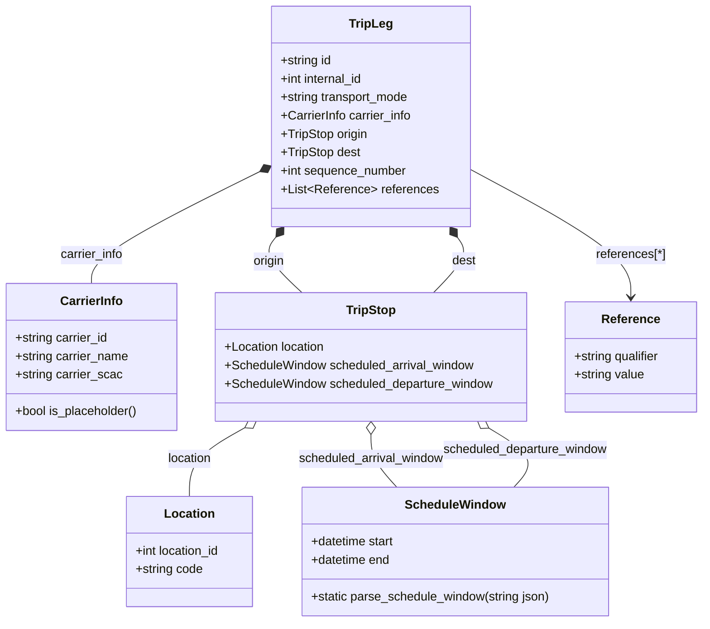
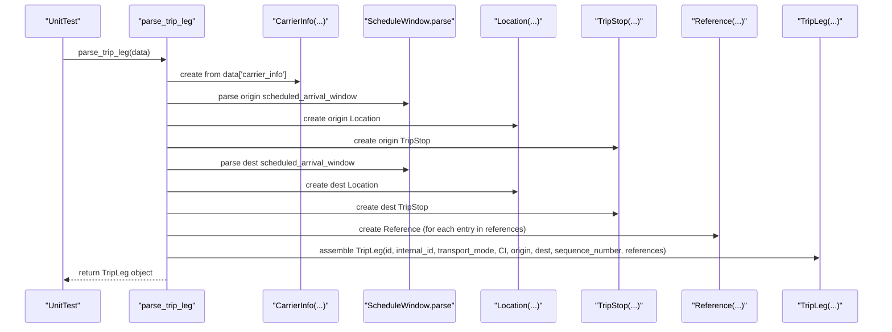

# Diagram: entity_core/entity_service/entity_service_tests/trip_leg_tests/test_augmented_trip_plan/test_models.py

> Auto-generated by Obscura crawlers

## Diagram 1

### SVG

<svg id="container" width="926.2890625" xmlns="http://www.w3.org/2000/svg" class="classDiagram" height="812" viewBox="0 0 926.2890625 812" role="graphics-document document" aria-roledescription="class"><g><defs><marker id="container_class-aggregationStart" class="marker aggregation class" refX="18" refY="7" markerWidth="190" markerHeight="240" orient="auto"><path d="M 18,7 L9,13 L1,7 L9,1 Z"></path></marker></defs><defs><marker id="container_class-aggregationEnd" class="marker aggregation class" refX="1" refY="7" markerWidth="20" markerHeight="28" orient="auto"><path d="M 18,7 L9,13 L1,7 L9,1 Z"></path></marker></defs><defs><marker id="container_class-extensionStart" class="marker extension class" refX="18" refY="7" markerWidth="190" markerHeight="240" orient="auto"><path d="M 1,7 L18,13 V 1 Z"></path></marker></defs><defs><marker id="container_class-extensionEnd" class="marker extension class" refX="1" refY="7" markerWidth="20" markerHeight="28" orient="auto"><path d="M 1,1 V 13 L18,7 Z"></path></marker></defs><defs><marker id="container_class-compositionStart" class="marker composition class" refX="18" refY="7" markerWidth="190" markerHeight="240" orient="auto"><path d="M 18,7 L9,13 L1,7 L9,1 Z"></path></marker></defs><defs><marker id="container_class-compositionEnd" class="marker composition class" refX="1" refY="7" markerWidth="20" markerHeight="28" orient="auto"><path d="M 18,7 L9,13 L1,7 L9,1 Z"></path></marker></defs><defs><marker id="container_class-dependencyStart" class="marker dependency class" refX="6" refY="7" markerWidth="190" markerHeight="240" orient="auto"><path d="M 5,7 L9,13 L1,7 L9,1 Z"></path></marker></defs><defs><marker id="container_class-dependencyEnd" class="marker dependency class" refX="13" refY="7" markerWidth="20" markerHeight="28" orient="auto"><path d="M 18,7 L9,13 L14,7 L9,1 Z"></path></marker></defs><defs><marker id="container_class-lollipopStart" class="marker lollipop class" refX="13" refY="7" markerWidth="190" markerHeight="240" orient="auto"><circle stroke="black" fill="transparent" cx="7" cy="7" r="6"></circle></marker></defs><defs><marker id="container_class-lollipopEnd" class="marker lollipop class" refX="1" refY="7" markerWidth="190" markerHeight="240" orient="auto"><circle stroke="black" fill="transparent" cx="7" cy="7" r="6"></circle></marker></defs><g class="root"><g class="clusters"></g><g class="edgePaths"><path d="M346.696,221.804L309.057,240.337C271.419,258.869,196.141,295.935,158.502,320.634C120.863,345.333,120.863,357.667,120.863,363.833L120.863,370" id="id_TripLeg_CarrierInfo_1" class="edge-thickness-normal edge-pattern-solid relation" style=";;;" data-edge="true" data-et="edge" data-id="id_TripLeg_CarrierInfo_1" data-points="W3sieCI6MzYyLjE3MTg3NSwieSI6MjE0LjE4NDI0OTY3NTg5NzM4fSx7IngiOjEyMC44NjMyODEyNSwieSI6MzMzfSx7IngiOjEyMC44NjMyODEyNSwieSI6MzcwfV0=" marker-start="url(#container_class-compositionStart)"></path><path d="M364.526,309.558L361.453,313.465C358.379,317.372,352.233,325.186,357.902,337.26C363.571,349.333,381.056,365.667,389.799,373.833L398.541,382" id="id_TripLeg_TripStop_2" class="edge-thickness-normal edge-pattern-solid relation" style=";;;" data-edge="true" data-et="edge" data-id="id_TripLeg_TripStop_2" data-points="W3sieCI6Mzc1LjE5MTAxNzc4MzE0OTE2LCJ5IjoyOTZ9LHsieCI6MzQ2LjA4NTkzNzUsInkiOjMzM30seyJ4IjozOTguNTQxMzI0MDEzMTU3OSwieSI6MzgyfV0=" marker-start="url(#container_class-compositionStart)"></path><path d="M601.96,310.01L604.712,313.842C607.464,317.674,612.968,325.337,607.738,337.335C602.507,349.333,586.541,365.667,578.558,373.833L570.575,382" id="id_TripLeg_TripStop_3" class="edge-thickness-normal edge-pattern-solid relation" style=";;;" data-edge="true" data-et="edge" data-id="id_TripLeg_TripStop_3" data-points="W3sieCI6NTkxLjg5NjQ3MzU4NDI1NDIsInkiOjI5Nn0seyJ4Ijo2MTguNDcyNjU2MjUsInkiOjMzM30seyJ4Ijo1NzAuNTc1MDQxMTE4NDIxLCJ5IjozODJ9XQ==" marker-start="url(#container_class-compositionStart)"></path><path d="M321.193,558.336L308.916,565.114C296.639,571.891,272.084,585.445,259.807,600.389C247.529,615.333,247.529,631.667,247.529,639.833L247.529,648" id="id_TripStop_Location_4" class="edge-thickness-normal edge-pattern-solid relation" style=";;;" data-edge="true" data-et="edge" data-id="id_TripStop_Location_4" data-points="W3sieCI6MzM2LjI5NTAyNDY3MTA1MjYsInkiOjU1MH0seyJ4IjoyNDcuNTI5Mjk2ODc1LCJ5Ijo1OTl9LHsieCI6MjQ3LjUyOTI5Njg3NSwieSI6NjQ4fV0=" marker-start="url(#container_class-aggregationStart)"></path><path d="M488.465,567.25L488.465,572.542C488.465,577.833,488.465,588.417,494.219,599.875C499.972,611.333,511.48,623.667,517.234,629.833L522.988,636" id="id_TripStop_ScheduleWindow_5" class="edge-thickness-normal edge-pattern-solid relation" style=";;;" data-edge="true" data-et="edge" data-id="id_TripStop_ScheduleWindow_5" data-points="W3sieCI6NDg4LjQ2NDg0Mzc1LCJ5Ijo1NTB9LHsieCI6NDg4LjQ2NDg0Mzc1LCJ5Ijo1OTl9LHsieCI6NTIyLjk4NzUwNjQ1NjYxMTUsInkiOjYzNn1d" marker-start="url(#container_class-aggregationStart)"></path><path d="M645.937,558.755L657.324,565.462C668.712,572.17,691.487,585.585,697.12,598.459C702.754,611.333,691.247,623.667,685.493,629.833L679.739,636" id="id_TripStop_ScheduleWindow_6" class="edge-thickness-normal edge-pattern-solid relation" style=";;;" data-edge="true" data-et="edge" data-id="id_TripStop_ScheduleWindow_6" data-points="W3sieCI6NjMxLjA3MzM5NjM4MTU3OSwieSI6NTUwfSx7IngiOjcxNC4yNjE3MTg3NSwieSI6NTk5fSx7IngiOjY3OS43MzkwNTYwNDMzODg1LCJ5Ijo2MzZ9XQ==" marker-start="url(#container_class-aggregationStart)"></path><path d="M614.758,218.784L650.756,237.82C686.754,256.856,758.75,294.928,794.748,323.131C830.746,351.333,830.746,369.667,830.746,378.833L830.746,388" id="id_TripLeg_Reference_7" class="edge-thickness-normal edge-pattern-solid relation" style=";;;" data-edge="true" data-et="edge" data-id="id_TripLeg_Reference_7" data-points="W3sieCI6NjE0Ljc1NzgxMjUsInkiOjIxOC43ODQzMzk5MDY4NzQ4M30seyJ4Ijo4MzAuNzQ2MDkzNzUsInkiOjMzM30seyJ4Ijo4MzAuNzQ2MDkzNzUsInkiOjM5NH1d" marker-end="url(#container_class-dependencyEnd)"></path></g><g class="edgeLabels"><g class="edgeLabel" transform="translate(120.86328125, 333)"><g class="label" data-id="id_TripLeg_CarrierInfo_1" transform="translate(-41.71875, -12)"><foreignObject width="83.4375" height="24">

carrier_info

</foreignObject></g></g><g class="edgeLabel" transform="translate(355.11304, 341.43246)"><g class="label" data-id="id_TripLeg_TripStop_2" transform="translate(-21.125, -12)"><foreignObject width="42.25" height="24">

origin

</foreignObject></g></g><g class="edgeLabel" transform="translate(610.44584, 341.21155)"><g class="label" data-id="id_TripLeg_TripStop_3" transform="translate(-15.7734375, -12)"><foreignObject width="31.546875" height="24">

dest

</foreignObject></g></g><g class="edgeLabel" transform="translate(247.529296875, 599)"><g class="label" data-id="id_TripStop_Location_4" transform="translate(-29.578125, -12)"><foreignObject width="59.15625" height="24">

location

</foreignObject></g></g><g class="edgeLabel" transform="translate(488.46484375, 599)"><g class="label" data-id="id_TripStop_ScheduleWindow_5" transform="translate(-96.578125, -12)"><foreignObject width="193.15625" height="24">

scheduled_arrival_window

</foreignObject></g></g><g class="edgeLabel" transform="translate(694.4689, 587.34154)"><g class="label" data-id="id_TripStop_ScheduleWindow_6" transform="translate(-109.21875, -12)"><foreignObject width="218.4375" height="24">

scheduled_departure_window

</foreignObject></g></g><g class="edgeLabel" transform="translate(830.74609375, 333)"><g class="label" data-id="id_TripLeg_Reference_7" transform="translate(-46.4921875, -12)"><foreignObject width="92.984375" height="24">

references[*]

</foreignObject></g></g></g><g class="nodes"><g class="node default" id="classId-CarrierInfo-0" transform="translate(120.86328125, 466)"><g class="basic label-container"><path d="M-112.86328125 -96 L112.86328125 -96 L112.86328125 96 L-112.86328125 96" stroke="none" stroke-width="0" fill="#ECECFF" style=""></path><path d="M-112.86328125 -96 C-57.88858715175035 -96, -2.9138930535007006 -96, 112.86328125 -96 M-112.86328125 -96 C-52.07384918733818 -96, 8.715582875323634 -96, 112.86328125 -96 M112.86328125 -96 C112.86328125 -27.78935860017623, 112.86328125 40.42128279964754, 112.86328125 96 M112.86328125 -96 C112.86328125 -23.479019710976644, 112.86328125 49.04196057804671, 112.86328125 96 M112.86328125 96 C66.47763428372659 96, 20.09198731745316 96, -112.86328125 96 M112.86328125 96 C40.40580172023843 96, -32.05167780952314 96, -112.86328125 96 M-112.86328125 96 C-112.86328125 20.95531367901887, -112.86328125 -54.08937264196226, -112.86328125 -96 M-112.86328125 96 C-112.86328125 37.598244528013225, -112.86328125 -20.80351094397355, -112.86328125 -96" stroke="#9370DB" stroke-width="1.3" fill="none" stroke-dasharray="0 0" style=""></path></g><g class="annotation-group text" transform="translate(0, -72)"></g><g class="label-group text" transform="translate(-39.6015625, -72)"><g class="label" style="font-weight: bolder" transform="translate(0,-12)"><foreignObject width="79.203125" height="24">

CarrierInfo

</foreignObject></g></g><g class="members-group text" transform="translate(-100.86328125, -24)"><g class="label" style="" transform="translate(0,-12)"><foreignObject width="122.9375" height="24">

+string carrier_id

</foreignObject></g><g class="label" style="" transform="translate(0,12)"><foreignObject width="149.375" height="24">

+string carrier_name

</foreignObject></g><g class="label" style="" transform="translate(0,36)"><foreignObject width="140.171875" height="24">

+string carrier_scac

</foreignObject></g></g><g class="methods-group text" transform="translate(-100.86328125, 72)"><g class="label" style="" transform="translate(0,-12)"><foreignObject width="162.125" height="24">

+bool is_placeholder()

</foreignObject></g></g><g class="divider" style=""><path d="M-112.86328125 -48 C-35.973214601217904 -48, 40.91685204756419 -48, 112.86328125 -48 M-112.86328125 -48 C-52.36664766492579 -48, 8.129985920148414 -48, 112.86328125 -48" stroke="#9370DB" stroke-width="1.3" fill="none" stroke-dasharray="0 0" style=""></path></g><g class="divider" style=""><path d="M-112.86328125 48 C-52.9693491603688 48, 6.9245829292623995 48, 112.86328125 48 M-112.86328125 48 C-61.93700955494136 48, -11.010737859882724 48, 112.86328125 48" stroke="#9370DB" stroke-width="1.3" fill="none" stroke-dasharray="0 0" style=""></path></g></g><g class="node default" id="classId-ScheduleWindow-1" transform="translate(601.36328125, 720)"><g class="basic label-container"><path d="M-201.3125 -84 L201.3125 -84 L201.3125 84 L-201.3125 84" stroke="none" stroke-width="0" fill="#ECECFF" style=""></path><path d="M-201.3125 -84 C-65.13856066932362 -84, 71.03537866135275 -84, 201.3125 -84 M-201.3125 -84 C-85.43593532861583 -84, 30.440629342768347 -84, 201.3125 -84 M201.3125 -84 C201.3125 -23.46981235291456, 201.3125 37.06037529417088, 201.3125 84 M201.3125 -84 C201.3125 -36.18949847249631, 201.3125 11.621003055007378, 201.3125 84 M201.3125 84 C42.54391225883927 84, -116.22467548232146 84, -201.3125 84 M201.3125 84 C48.889640495247534 84, -103.53321900950493 84, -201.3125 84 M-201.3125 84 C-201.3125 30.311486028839127, -201.3125 -23.377027942321746, -201.3125 -84 M-201.3125 84 C-201.3125 25.27682273017274, -201.3125 -33.44635453965452, -201.3125 -84" stroke="#9370DB" stroke-width="1.3" fill="none" stroke-dasharray="0 0" style=""></path></g><g class="annotation-group text" transform="translate(0, -60)"></g><g class="label-group text" transform="translate(-62.6875, -60)"><g class="label" style="font-weight: bolder" transform="translate(0,-12)"><foreignObject width="125.375" height="24">

ScheduleWindow

</foreignObject></g></g><g class="members-group text" transform="translate(-189.3125, -12)"><g class="label" style="" transform="translate(0,-12)"><foreignObject width="111.265625" height="24">

+datetime start

</foreignObject></g><g class="label" style="" transform="translate(0,12)"><foreignObject width="105.140625" height="24">

+datetime end

</foreignObject></g></g><g class="methods-group text" transform="translate(-189.3125, 60)"><g class="label" style="" transform="translate(0,-12)"><foreignObject width="315.9375" height="24">

+static parse_schedule_window(string json)

</foreignObject></g></g><g class="divider" style=""><path d="M-201.3125 -36 C-63.11353554310497 -36, 75.08542891379005 -36, 201.3125 -36 M-201.3125 -36 C-96.10049740967088 -36, 9.111505180658241 -36, 201.3125 -36" stroke="#9370DB" stroke-width="1.3" fill="none" stroke-dasharray="0 0" style=""></path></g><g class="divider" style=""><path d="M-201.3125 36 C-79.68247676939971 36, 41.947546461200574 36, 201.3125 36 M-201.3125 36 C-44.729540542717444 36, 111.85341891456511 36, 201.3125 36" stroke="#9370DB" stroke-width="1.3" fill="none" stroke-dasharray="0 0" style=""></path></g></g><g class="node default" id="classId-Location-2" transform="translate(247.529296875, 720)"><g class="basic label-container"><path d="M-84.40234375 -72 L84.40234375 -72 L84.40234375 72 L-84.40234375 72" stroke="none" stroke-width="0" fill="#ECECFF" style=""></path><path d="M-84.40234375 -72 C-39.619312501712464 -72, 5.163718746575071 -72, 84.40234375 -72 M-84.40234375 -72 C-22.199589893415684 -72, 40.00316396316863 -72, 84.40234375 -72 M84.40234375 -72 C84.40234375 -20.468807312457614, 84.40234375 31.062385375084773, 84.40234375 72 M84.40234375 -72 C84.40234375 -31.613435606065735, 84.40234375 8.77312878786853, 84.40234375 72 M84.40234375 72 C23.640888662599927 72, -37.120566424800145 72, -84.40234375 72 M84.40234375 72 C24.46532242463151 72, -35.47169890073698 72, -84.40234375 72 M-84.40234375 72 C-84.40234375 41.9404918766341, -84.40234375 11.880983753268204, -84.40234375 -72 M-84.40234375 72 C-84.40234375 27.460377985904792, -84.40234375 -17.079244028190416, -84.40234375 -72" stroke="#9370DB" stroke-width="1.3" fill="none" stroke-dasharray="0 0" style=""></path></g><g class="annotation-group text" transform="translate(0, -48)"></g><g class="label-group text" transform="translate(-31.3515625, -48)"><g class="label" style="font-weight: bolder" transform="translate(0,-12)"><foreignObject width="62.703125" height="24">

Location

</foreignObject></g></g><g class="members-group text" transform="translate(-72.40234375, 0)"><g class="label" style="" transform="translate(0,-12)"><foreignObject width="113.453125" height="24">

+int location_id

</foreignObject></g><g class="label" style="" transform="translate(0,12)"><foreignObject width="88.828125" height="24">

+string code

</foreignObject></g></g><g class="methods-group text" transform="translate(-72.40234375, 72)"></g><g class="divider" style=""><path d="M-84.40234375 -24 C-30.986467056604496 -24, 22.429409636791007 -24, 84.40234375 -24 M-84.40234375 -24 C-42.50476362163221 -24, -0.6071834932644151 -24, 84.40234375 -24" stroke="#9370DB" stroke-width="1.3" fill="none" stroke-dasharray="0 0" style=""></path></g><g class="divider" style=""><path d="M-84.40234375 48 C-41.76324372980219 48, 0.8758562903956175 48, 84.40234375 48 M-84.40234375 48 C-36.84182011594482 48, 10.71870351811036 48, 84.40234375 48" stroke="#9370DB" stroke-width="1.3" fill="none" stroke-dasharray="0 0" style=""></path></g></g><g class="node default" id="classId-TripStop-3" transform="translate(488.46484375, 466)"><g class="basic label-container"><path d="M-204.73828125 -84 L204.73828125 -84 L204.73828125 84 L-204.73828125 84" stroke="none" stroke-width="0" fill="#ECECFF" style=""></path><path d="M-204.73828125 -84 C-82.54590263124659 -84, 39.64647598750682 -84, 204.73828125 -84 M-204.73828125 -84 C-48.87312930212542 -84, 106.99202264574916 -84, 204.73828125 -84 M204.73828125 -84 C204.73828125 -47.26409150933808, 204.73828125 -10.52818301867616, 204.73828125 84 M204.73828125 -84 C204.73828125 -33.70906493330692, 204.73828125 16.58187013338616, 204.73828125 84 M204.73828125 84 C70.65698983877456 84, -63.42430157245087 84, -204.73828125 84 M204.73828125 84 C82.16842230629229 84, -40.40143663741543 84, -204.73828125 84 M-204.73828125 84 C-204.73828125 41.715009115759756, -204.73828125 -0.5699817684804884, -204.73828125 -84 M-204.73828125 84 C-204.73828125 19.95662063833771, -204.73828125 -44.08675872332458, -204.73828125 -84" stroke="#9370DB" stroke-width="1.3" fill="none" stroke-dasharray="0 0" style=""></path></g><g class="annotation-group text" transform="translate(0, -60)"></g><g class="label-group text" transform="translate(-31.2890625, -60)"><g class="label" style="font-weight: bolder" transform="translate(0,-12)"><foreignObject width="62.578125" height="24">

TripStop

</foreignObject></g></g><g class="members-group text" transform="translate(-192.73828125, -12)"><g class="label" style="" transform="translate(0,-12)"><foreignObject width="133.5" height="24">

+Location location

</foreignObject></g><g class="label" style="" transform="translate(0,12)"><foreignObject width="328.90625" height="24">

+ScheduleWindow scheduled_arrival_window

</foreignObject></g><g class="label" style="" transform="translate(0,36)"><foreignObject width="354.1875" height="24">

+ScheduleWindow scheduled_departure_window

</foreignObject></g></g><g class="methods-group text" transform="translate(-192.73828125, 84)"></g><g class="divider" style=""><path d="M-204.73828125 -36 C-50.400389630022744 -36, 103.93750198995451 -36, 204.73828125 -36 M-204.73828125 -36 C-74.42496095757218 -36, 55.888359334855636 -36, 204.73828125 -36" stroke="#9370DB" stroke-width="1.3" fill="none" stroke-dasharray="0 0" style=""></path></g><g class="divider" style=""><path d="M-204.73828125 60 C-67.19181191452938 60, 70.35465742094124 60, 204.73828125 60 M-204.73828125 60 C-61.080603409258345 60, 82.57707443148331 60, 204.73828125 60" stroke="#9370DB" stroke-width="1.3" fill="none" stroke-dasharray="0 0" style=""></path></g></g><g class="node default" id="classId-Reference-4" transform="translate(830.74609375, 466)"><g class="basic label-container"><path d="M-87.54296875 -72 L87.54296875 -72 L87.54296875 72 L-87.54296875 72" stroke="none" stroke-width="0" fill="#ECECFF" style=""></path><path d="M-87.54296875 -72 C-20.499192092803995 -72, 46.54458456439201 -72, 87.54296875 -72 M-87.54296875 -72 C-20.36583001006737 -72, 46.81130872986526 -72, 87.54296875 -72 M87.54296875 -72 C87.54296875 -32.307864564443726, 87.54296875 7.384270871112548, 87.54296875 72 M87.54296875 -72 C87.54296875 -31.219197736443007, 87.54296875 9.561604527113985, 87.54296875 72 M87.54296875 72 C42.643505682669705 72, -2.25595738466059 72, -87.54296875 72 M87.54296875 72 C29.354629699691394 72, -28.833709350617212 72, -87.54296875 72 M-87.54296875 72 C-87.54296875 22.784687471719927, -87.54296875 -26.430625056560146, -87.54296875 -72 M-87.54296875 72 C-87.54296875 41.538009862848654, -87.54296875 11.0760197256973, -87.54296875 -72" stroke="#9370DB" stroke-width="1.3" fill="none" stroke-dasharray="0 0" style=""></path></g><g class="annotation-group text" transform="translate(0, -48)"></g><g class="label-group text" transform="translate(-36.5078125, -48)"><g class="label" style="font-weight: bolder" transform="translate(0,-12)"><foreignObject width="73.015625" height="24">

Reference

</foreignObject></g></g><g class="members-group text" transform="translate(-75.54296875, 0)"><g class="label" style="" transform="translate(0,-12)"><foreignObject width="114.578125" height="24">

+string qualifier

</foreignObject></g><g class="label" style="" transform="translate(0,12)"><foreignObject width="92.75" height="24">

+string value

</foreignObject></g></g><g class="methods-group text" transform="translate(-75.54296875, 72)"></g><g class="divider" style=""><path d="M-87.54296875 -24 C-43.05499689702141 -24, 1.432974955957178 -24, 87.54296875 -24 M-87.54296875 -24 C-46.58626293592129 -24, -5.629557121842581 -24, 87.54296875 -24" stroke="#9370DB" stroke-width="1.3" fill="none" stroke-dasharray="0 0" style=""></path></g><g class="divider" style=""><path d="M-87.54296875 48 C-43.19998865495225 48, 1.1429914400955 48, 87.54296875 48 M-87.54296875 48 C-30.930467910876203 48, 25.682032928247594 48, 87.54296875 48" stroke="#9370DB" stroke-width="1.3" fill="none" stroke-dasharray="0 0" style=""></path></g></g><g class="node default" id="classId-TripLeg-5" transform="translate(488.46484375, 152)"><g class="basic label-container"><path d="M-126.29296875 -144 L126.29296875 -144 L126.29296875 144 L-126.29296875 144" stroke="none" stroke-width="0" fill="#ECECFF" style=""></path><path d="M-126.29296875 -144 C-25.676956079589317 -144, 74.93905659082137 -144, 126.29296875 -144 M-126.29296875 -144 C-68.72274038843341 -144, -11.152512026866802 -144, 126.29296875 -144 M126.29296875 -144 C126.29296875 -36.32487098625593, 126.29296875 71.35025802748814, 126.29296875 144 M126.29296875 -144 C126.29296875 -85.51608579541629, 126.29296875 -27.032171590832576, 126.29296875 144 M126.29296875 144 C27.629584700441185 144, -71.03379934911763 144, -126.29296875 144 M126.29296875 144 C45.16824200368532 144, -35.95648474262936 144, -126.29296875 144 M-126.29296875 144 C-126.29296875 54.239671178440574, -126.29296875 -35.52065764311885, -126.29296875 -144 M-126.29296875 144 C-126.29296875 36.65647810700722, -126.29296875 -70.68704378598557, -126.29296875 -144" stroke="#9370DB" stroke-width="1.3" fill="none" stroke-dasharray="0 0" style=""></path></g><g class="annotation-group text" transform="translate(0, -120)"></g><g class="label-group text" transform="translate(-27.0546875, -120)"><g class="label" style="font-weight: bolder" transform="translate(0,-12)"><foreignObject width="54.109375" height="24">

TripLeg

</foreignObject></g></g><g class="members-group text" transform="translate(-114.29296875, -72)"><g class="label" style="" transform="translate(0,-12)"><foreignObject width="67.9375" height="24">

+string id

</foreignObject></g><g class="label" style="" transform="translate(0,12)"><foreignObject width="111.21875" height="24">

+int internal_id

</foreignObject></g><g class="label" style="" transform="translate(0,36)"><foreignObject width="171.265625" height="24">

+string transport_mode

</foreignObject></g><g class="label" style="" transform="translate(0,60)"><foreignObject width="173.5625" height="24">

+CarrierInfo carrier_info

</foreignObject></g><g class="label" style="" transform="translate(0,84)"><foreignObject width="114.765625" height="24">

+TripStop origin

</foreignObject></g><g class="label" style="" transform="translate(0,108)"><foreignObject width="104.0625" height="24">

+TripStop dest

</foreignObject></g><g class="label" style="" transform="translate(0,132)"><foreignObject width="165.90625" height="24">

+int sequence_number

</foreignObject></g><g class="label" style="" transform="translate(0,156)"><foreignObject width="201.53125" height="24">

+List&lt;Reference&gt; references

</foreignObject></g></g><g class="methods-group text" transform="translate(-114.29296875, 144)"></g><g class="divider" style=""><path d="M-126.29296875 -96 C-65.31021213301173 -96, -4.327455516023463 -96, 126.29296875 -96 M-126.29296875 -96 C-75.77298010075475 -96, -25.252991451509516 -96, 126.29296875 -96" stroke="#9370DB" stroke-width="1.3" fill="none" stroke-dasharray="0 0" style=""></path></g><g class="divider" style=""><path d="M-126.29296875 120 C-70.48462123361264 120, -14.676273717225271 120, 126.29296875 120 M-126.29296875 120 C-39.135649029886636 120, 48.02167069022673 120, 126.29296875 120" stroke="#9370DB" stroke-width="1.3" fill="none" stroke-dasharray="0 0" style=""></path></g></g></g></g></g></svg>

## Diagram 2

### SVG

<svg id="container" width="1813" xmlns="http://www.w3.org/2000/svg" height="699" viewBox="-50 -10 1813 699" role="graphics-document document" aria-roledescription="sequence"><g><rect x="1563" y="613" fill="#eaeaea" stroke="#666" width="150" height="65" name="TL" rx="3" ry="3" class="actor actor-bottom"></rect><text x="1638" y="645.5" dominant-baseline="central" alignment-baseline="central" class="actor actor-box" style="text-anchor: middle; font-size: 16px; font-weight: 400;"><tspan x="1638" dy="0">"TripLeg(...)"</tspan></text></g><g><rect x="1363" y="613" fill="#eaeaea" stroke="#666" width="150" height="65" name="Ref" rx="3" ry="3" class="actor actor-bottom"></rect><text x="1438" y="645.5" dominant-baseline="central" alignment-baseline="central" class="actor actor-box" style="text-anchor: middle; font-size: 16px; font-weight: 400;"><tspan x="1438" dy="0">"Reference(...)"</tspan></text></g><g><rect x="1163" y="613" fill="#eaeaea" stroke="#666" width="150" height="65" name="TS" rx="3" ry="3" class="actor actor-bottom"></rect><text x="1238" y="645.5" dominant-baseline="central" alignment-baseline="central" class="actor actor-box" style="text-anchor: middle; font-size: 16px; font-weight: 400;"><tspan x="1238" dy="0">"TripStop(...)"</tspan></text></g><g><rect x="963" y="613" fill="#eaeaea" stroke="#666" width="150" height="65" name="Loc" rx="3" ry="3" class="actor actor-bottom"></rect><text x="1038" y="645.5" dominant-baseline="central" alignment-baseline="central" class="actor actor-box" style="text-anchor: middle; font-size: 16px; font-weight: 400;"><tspan x="1038" dy="0">"Location(...)"</tspan></text></g><g><rect x="713" y="613" fill="#eaeaea" stroke="#666" width="200" height="65" name="SW" rx="3" ry="3" class="actor actor-bottom"></rect><text x="813" y="645.5" dominant-baseline="central" alignment-baseline="central" class="actor actor-box" style="text-anchor: middle; font-size: 16px; font-weight: 400;"><tspan x="813" dy="0">"ScheduleWindow.parse"</tspan></text></g><g><rect x="513" y="613" fill="#eaeaea" stroke="#666" width="150" height="65" name="CI" rx="3" ry="3" class="actor actor-bottom"></rect><text x="588" y="645.5" dominant-baseline="central" alignment-baseline="central" class="actor actor-box" style="text-anchor: middle; font-size: 16px; font-weight: 400;"><tspan x="588" dy="0">"CarrierInfo(...)"</tspan></text></g><g><rect x="222" y="613" fill="#eaeaea" stroke="#666" width="150" height="65" name="Parser" rx="3" ry="3" class="actor actor-bottom"></rect><text x="297" y="645.5" dominant-baseline="central" alignment-baseline="central" class="actor actor-box" style="text-anchor: middle; font-size: 16px; font-weight: 400;"><tspan x="297" dy="0">"parse_trip_leg"</tspan></text></g><g><rect x="0" y="613" fill="#eaeaea" stroke="#666" width="150" height="65" name="Test" rx="3" ry="3" class="actor actor-bottom"></rect><text x="75" y="645.5" dominant-baseline="central" alignment-baseline="central" class="actor actor-box" style="text-anchor: middle; font-size: 16px; font-weight: 400;"><tspan x="75" dy="0">"UnitTest"</tspan></text></g><g><line id="actor7" x1="1638" y1="65" x2="1638" y2="613" class="actor-line 200" stroke-width="0.5px" stroke="#999" name="TL"></line><g id="root-7"><rect x="1563" y="0" fill="#eaeaea" stroke="#666" width="150" height="65" name="TL" rx="3" ry="3" class="actor actor-top"></rect><text x="1638" y="32.5" dominant-baseline="central" alignment-baseline="central" class="actor actor-box" style="text-anchor: middle; font-size: 16px; font-weight: 400;"><tspan x="1638" dy="0">"TripLeg(...)"</tspan></text></g></g><g><line id="actor6" x1="1438" y1="65" x2="1438" y2="613" class="actor-line 200" stroke-width="0.5px" stroke="#999" name="Ref"></line><g id="root-6"><rect x="1363" y="0" fill="#eaeaea" stroke="#666" width="150" height="65" name="Ref" rx="3" ry="3" class="actor actor-top"></rect><text x="1438" y="32.5" dominant-baseline="central" alignment-baseline="central" class="actor actor-box" style="text-anchor: middle; font-size: 16px; font-weight: 400;"><tspan x="1438" dy="0">"Reference(...)"</tspan></text></g></g><g><line id="actor5" x1="1238" y1="65" x2="1238" y2="613" class="actor-line 200" stroke-width="0.5px" stroke="#999" name="TS"></line><g id="root-5"><rect x="1163" y="0" fill="#eaeaea" stroke="#666" width="150" height="65" name="TS" rx="3" ry="3" class="actor actor-top"></rect><text x="1238" y="32.5" dominant-baseline="central" alignment-baseline="central" class="actor actor-box" style="text-anchor: middle; font-size: 16px; font-weight: 400;"><tspan x="1238" dy="0">"TripStop(...)"</tspan></text></g></g><g><line id="actor4" x1="1038" y1="65" x2="1038" y2="613" class="actor-line 200" stroke-width="0.5px" stroke="#999" name="Loc"></line><g id="root-4"><rect x="963" y="0" fill="#eaeaea" stroke="#666" width="150" height="65" name="Loc" rx="3" ry="3" class="actor actor-top"></rect><text x="1038" y="32.5" dominant-baseline="central" alignment-baseline="central" class="actor actor-box" style="text-anchor: middle; font-size: 16px; font-weight: 400;"><tspan x="1038" dy="0">"Location(...)"</tspan></text></g></g><g><line id="actor3" x1="813" y1="65" x2="813" y2="613" class="actor-line 200" stroke-width="0.5px" stroke="#999" name="SW"></line><g id="root-3"><rect x="713" y="0" fill="#eaeaea" stroke="#666" width="200" height="65" name="SW" rx="3" ry="3" class="actor actor-top"></rect><text x="813" y="32.5" dominant-baseline="central" alignment-baseline="central" class="actor actor-box" style="text-anchor: middle; font-size: 16px; font-weight: 400;"><tspan x="813" dy="0">"ScheduleWindow.parse"</tspan></text></g></g><g><line id="actor2" x1="588" y1="65" x2="588" y2="613" class="actor-line 200" stroke-width="0.5px" stroke="#999" name="CI"></line><g id="root-2"><rect x="513" y="0" fill="#eaeaea" stroke="#666" width="150" height="65" name="CI" rx="3" ry="3" class="actor actor-top"></rect><text x="588" y="32.5" dominant-baseline="central" alignment-baseline="central" class="actor actor-box" style="text-anchor: middle; font-size: 16px; font-weight: 400;"><tspan x="588" dy="0">"CarrierInfo(...)"</tspan></text></g></g><g><line id="actor1" x1="297" y1="65" x2="297" y2="613" class="actor-line 200" stroke-width="0.5px" stroke="#999" name="Parser"></line><g id="root-1"><rect x="222" y="0" fill="#eaeaea" stroke="#666" width="150" height="65" name="Parser" rx="3" ry="3" class="actor actor-top"></rect><text x="297" y="32.5" dominant-baseline="central" alignment-baseline="central" class="actor actor-box" style="text-anchor: middle; font-size: 16px; font-weight: 400;"><tspan x="297" dy="0">"parse_trip_leg"</tspan></text></g></g><g><line id="actor0" x1="75" y1="65" x2="75" y2="613" class="actor-line 200" stroke-width="0.5px" stroke="#999" name="Test"></line><g id="root-0"><rect x="0" y="0" fill="#eaeaea" stroke="#666" width="150" height="65" name="Test" rx="3" ry="3" class="actor actor-top"></rect><text x="75" y="32.5" dominant-baseline="central" alignment-baseline="central" class="actor actor-box" style="text-anchor: middle; font-size: 16px; font-weight: 400;"><tspan x="75" dy="0">"UnitTest"</tspan></text></g></g><g></g><defs><symbol id="computer" width="24" height="24"><path transform="scale(.5)" d="M2 2v13h20v-13h-20zm18 11h-16v-9h16v9zm-10.228 6l.466-1h3.524l.467 1h-4.457zm14.228 3h-24l2-6h2.104l-1.33 4h18.45l-1.297-4h2.073l2 6zm-5-10h-14v-7h14v7z"></path></symbol></defs><defs><symbol id="database" fill-rule="evenodd" clip-rule="evenodd"><path transform="scale(.5)" d="M12.258.001l.256.004.255.005.253.008.251.01.249.012.247.015.246.016.242.019.241.02.239.023.236.024.233.027.231.028.229.031.225.032.223.034.22.036.217.038.214.04.211.041.208.043.205.045.201.046.198.048.194.05.191.051.187.053.183.054.18.056.175.057.172.059.168.06.163.061.16.063.155.064.15.066.074.033.073.033.071.034.07.034.069.035.068.035.067.035.066.035.064.036.064.036.062.036.06.036.06.037.058.037.058.037.055.038.055.038.053.038.052.038.051.039.05.039.048.039.047.039.045.04.044.04.043.04.041.04.04.041.039.041.037.041.036.041.034.041.033.042.032.042.03.042.029.042.027.042.026.043.024.043.023.043.021.043.02.043.018.044.017.043.015.044.013.044.012.044.011.045.009.044.007.045.006.045.004.045.002.045.001.045v17l-.001.045-.002.045-.004.045-.006.045-.007.045-.009.044-.011.045-.012.044-.013.044-.015.044-.017.043-.018.044-.02.043-.021.043-.023.043-.024.043-.026.043-.027.042-.029.042-.03.042-.032.042-.033.042-.034.041-.036.041-.037.041-.039.041-.04.041-.041.04-.043.04-.044.04-.045.04-.047.039-.048.039-.05.039-.051.039-.052.038-.053.038-.055.038-.055.038-.058.037-.058.037-.06.037-.06.036-.062.036-.064.036-.064.036-.066.035-.067.035-.068.035-.069.035-.07.034-.071.034-.073.033-.074.033-.15.066-.155.064-.16.063-.163.061-.168.06-.172.059-.175.057-.18.056-.183.054-.187.053-.191.051-.194.05-.198.048-.201.046-.205.045-.208.043-.211.041-.214.04-.217.038-.22.036-.223.034-.225.032-.229.031-.231.028-.233.027-.236.024-.239.023-.241.02-.242.019-.246.016-.247.015-.249.012-.251.01-.253.008-.255.005-.256.004-.258.001-.258-.001-.256-.004-.255-.005-.253-.008-.251-.01-.249-.012-.247-.015-.245-.016-.243-.019-.241-.02-.238-.023-.236-.024-.234-.027-.231-.028-.228-.031-.226-.032-.223-.034-.22-.036-.217-.038-.214-.04-.211-.041-.208-.043-.204-.045-.201-.046-.198-.048-.195-.05-.19-.051-.187-.053-.184-.054-.179-.056-.176-.057-.172-.059-.167-.06-.164-.061-.159-.063-.155-.064-.151-.066-.074-.033-.072-.033-.072-.034-.07-.034-.069-.035-.068-.035-.067-.035-.066-.035-.064-.036-.063-.036-.062-.036-.061-.036-.06-.037-.058-.037-.057-.037-.056-.038-.055-.038-.053-.038-.052-.038-.051-.039-.049-.039-.049-.039-.046-.039-.046-.04-.044-.04-.043-.04-.041-.04-.04-.041-.039-.041-.037-.041-.036-.041-.034-.041-.033-.042-.032-.042-.03-.042-.029-.042-.027-.042-.026-.043-.024-.043-.023-.043-.021-.043-.02-.043-.018-.044-.017-.043-.015-.044-.013-.044-.012-.044-.011-.045-.009-.044-.007-.045-.006-.045-.004-.045-.002-.045-.001-.045v-17l.001-.045.002-.045.004-.045.006-.045.007-.045.009-.044.011-.045.012-.044.013-.044.015-.044.017-.043.018-.044.02-.043.021-.043.023-.043.024-.043.026-.043.027-.042.029-.042.03-.042.032-.042.033-.042.034-.041.036-.041.037-.041.039-.041.04-.041.041-.04.043-.04.044-.04.046-.04.046-.039.049-.039.049-.039.051-.039.052-.038.053-.038.055-.038.056-.038.057-.037.058-.037.06-.037.061-.036.062-.036.063-.036.064-.036.066-.035.067-.035.068-.035.069-.035.07-.034.072-.034.072-.033.074-.033.151-.066.155-.064.159-.063.164-.061.167-.06.172-.059.176-.057.179-.056.184-.054.187-.053.19-.051.195-.05.198-.048.201-.046.204-.045.208-.043.211-.041.214-.04.217-.038.22-.036.223-.034.226-.032.228-.031.231-.028.234-.027.236-.024.238-.023.241-.02.243-.019.245-.016.247-.015.249-.012.251-.01.253-.008.255-.005.256-.004.258-.001.258.001zm-9.258 20.499v.01l.001.021.003.021.004.022.005.021.006.022.007.022.009.023.01.022.011.023.012.023.013.023.015.023.016.024.017.023.018.024.019.024.021.024.022.025.023.024.024.025.052.049.056.05.061.051.066.051.07.051.075.051.079.052.084.052.088.052.092.052.097.052.102.051.105.052.11.052.114.051.119.051.123.051.127.05.131.05.135.05.139.048.144.049.147.047.152.047.155.047.16.045.163.045.167.043.171.043.176.041.178.041.183.039.187.039.19.037.194.035.197.035.202.033.204.031.209.03.212.029.216.027.219.025.222.024.226.021.23.02.233.018.236.016.24.015.243.012.246.01.249.008.253.005.256.004.259.001.26-.001.257-.004.254-.005.25-.008.247-.011.244-.012.241-.014.237-.016.233-.018.231-.021.226-.021.224-.024.22-.026.216-.027.212-.028.21-.031.205-.031.202-.034.198-.034.194-.036.191-.037.187-.039.183-.04.179-.04.175-.042.172-.043.168-.044.163-.045.16-.046.155-.046.152-.047.148-.048.143-.049.139-.049.136-.05.131-.05.126-.05.123-.051.118-.052.114-.051.11-.052.106-.052.101-.052.096-.052.092-.052.088-.053.083-.051.079-.052.074-.052.07-.051.065-.051.06-.051.056-.05.051-.05.023-.024.023-.025.021-.024.02-.024.019-.024.018-.024.017-.024.015-.023.014-.024.013-.023.012-.023.01-.023.01-.022.008-.022.006-.022.006-.022.004-.022.004-.021.001-.021.001-.021v-4.127l-.077.055-.08.053-.083.054-.085.053-.087.052-.09.052-.093.051-.095.05-.097.05-.1.049-.102.049-.105.048-.106.047-.109.047-.111.046-.114.045-.115.045-.118.044-.12.043-.122.042-.124.042-.126.041-.128.04-.13.04-.132.038-.134.038-.135.037-.138.037-.139.035-.142.035-.143.034-.144.033-.147.032-.148.031-.15.03-.151.03-.153.029-.154.027-.156.027-.158.026-.159.025-.161.024-.162.023-.163.022-.165.021-.166.02-.167.019-.169.018-.169.017-.171.016-.173.015-.173.014-.175.013-.175.012-.177.011-.178.01-.179.008-.179.008-.181.006-.182.005-.182.004-.184.003-.184.002h-.37l-.184-.002-.184-.003-.182-.004-.182-.005-.181-.006-.179-.008-.179-.008-.178-.01-.176-.011-.176-.012-.175-.013-.173-.014-.172-.015-.171-.016-.17-.017-.169-.018-.167-.019-.166-.02-.165-.021-.163-.022-.162-.023-.161-.024-.159-.025-.157-.026-.156-.027-.155-.027-.153-.029-.151-.03-.15-.03-.148-.031-.146-.032-.145-.033-.143-.034-.141-.035-.14-.035-.137-.037-.136-.037-.134-.038-.132-.038-.13-.04-.128-.04-.126-.041-.124-.042-.122-.042-.12-.044-.117-.043-.116-.045-.113-.045-.112-.046-.109-.047-.106-.047-.105-.048-.102-.049-.1-.049-.097-.05-.095-.05-.093-.052-.09-.051-.087-.052-.085-.053-.083-.054-.08-.054-.077-.054v4.127zm0-5.654v.011l.001.021.003.021.004.021.005.022.006.022.007.022.009.022.01.022.011.023.012.023.013.023.015.024.016.023.017.024.018.024.019.024.021.024.022.024.023.025.024.024.052.05.056.05.061.05.066.051.07.051.075.052.079.051.084.052.088.052.092.052.097.052.102.052.105.052.11.051.114.051.119.052.123.05.127.051.131.05.135.049.139.049.144.048.147.048.152.047.155.046.16.045.163.045.167.044.171.042.176.042.178.04.183.04.187.038.19.037.194.036.197.034.202.033.204.032.209.03.212.028.216.027.219.025.222.024.226.022.23.02.233.018.236.016.24.014.243.012.246.01.249.008.253.006.256.003.259.001.26-.001.257-.003.254-.006.25-.008.247-.01.244-.012.241-.015.237-.016.233-.018.231-.02.226-.022.224-.024.22-.025.216-.027.212-.029.21-.03.205-.032.202-.033.198-.035.194-.036.191-.037.187-.039.183-.039.179-.041.175-.042.172-.043.168-.044.163-.045.16-.045.155-.047.152-.047.148-.048.143-.048.139-.05.136-.049.131-.05.126-.051.123-.051.118-.051.114-.052.11-.052.106-.052.101-.052.096-.052.092-.052.088-.052.083-.052.079-.052.074-.051.07-.052.065-.051.06-.05.056-.051.051-.049.023-.025.023-.024.021-.025.02-.024.019-.024.018-.024.017-.024.015-.023.014-.023.013-.024.012-.022.01-.023.01-.023.008-.022.006-.022.006-.022.004-.021.004-.022.001-.021.001-.021v-4.139l-.077.054-.08.054-.083.054-.085.052-.087.053-.09.051-.093.051-.095.051-.097.05-.1.049-.102.049-.105.048-.106.047-.109.047-.111.046-.114.045-.115.044-.118.044-.12.044-.122.042-.124.042-.126.041-.128.04-.13.039-.132.039-.134.038-.135.037-.138.036-.139.036-.142.035-.143.033-.144.033-.147.033-.148.031-.15.03-.151.03-.153.028-.154.028-.156.027-.158.026-.159.025-.161.024-.162.023-.163.022-.165.021-.166.02-.167.019-.169.018-.169.017-.171.016-.173.015-.173.014-.175.013-.175.012-.177.011-.178.009-.179.009-.179.007-.181.007-.182.005-.182.004-.184.003-.184.002h-.37l-.184-.002-.184-.003-.182-.004-.182-.005-.181-.007-.179-.007-.179-.009-.178-.009-.176-.011-.176-.012-.175-.013-.173-.014-.172-.015-.171-.016-.17-.017-.169-.018-.167-.019-.166-.02-.165-.021-.163-.022-.162-.023-.161-.024-.159-.025-.157-.026-.156-.027-.155-.028-.153-.028-.151-.03-.15-.03-.148-.031-.146-.033-.145-.033-.143-.033-.141-.035-.14-.036-.137-.036-.136-.037-.134-.038-.132-.039-.13-.039-.128-.04-.126-.041-.124-.042-.122-.043-.12-.043-.117-.044-.116-.044-.113-.046-.112-.046-.109-.046-.106-.047-.105-.048-.102-.049-.1-.049-.097-.05-.095-.051-.093-.051-.09-.051-.087-.053-.085-.052-.083-.054-.08-.054-.077-.054v4.139zm0-5.666v.011l.001.02.003.022.004.021.005.022.006.021.007.022.009.023.01.022.011.023.012.023.013.023.015.023.016.024.017.024.018.023.019.024.021.025.022.024.023.024.024.025.052.05.056.05.061.05.066.051.07.051.075.052.079.051.084.052.088.052.092.052.097.052.102.052.105.051.11.052.114.051.119.051.123.051.127.05.131.05.135.05.139.049.144.048.147.048.152.047.155.046.16.045.163.045.167.043.171.043.176.042.178.04.183.04.187.038.19.037.194.036.197.034.202.033.204.032.209.03.212.028.216.027.219.025.222.024.226.021.23.02.233.018.236.017.24.014.243.012.246.01.249.008.253.006.256.003.259.001.26-.001.257-.003.254-.006.25-.008.247-.01.244-.013.241-.014.237-.016.233-.018.231-.02.226-.022.224-.024.22-.025.216-.027.212-.029.21-.03.205-.032.202-.033.198-.035.194-.036.191-.037.187-.039.183-.039.179-.041.175-.042.172-.043.168-.044.163-.045.16-.045.155-.047.152-.047.148-.048.143-.049.139-.049.136-.049.131-.051.126-.05.123-.051.118-.052.114-.051.11-.052.106-.052.101-.052.096-.052.092-.052.088-.052.083-.052.079-.052.074-.052.07-.051.065-.051.06-.051.056-.05.051-.049.023-.025.023-.025.021-.024.02-.024.019-.024.018-.024.017-.024.015-.023.014-.024.013-.023.012-.023.01-.022.01-.023.008-.022.006-.022.006-.022.004-.022.004-.021.001-.021.001-.021v-4.153l-.077.054-.08.054-.083.053-.085.053-.087.053-.09.051-.093.051-.095.051-.097.05-.1.049-.102.048-.105.048-.106.048-.109.046-.111.046-.114.046-.115.044-.118.044-.12.043-.122.043-.124.042-.126.041-.128.04-.13.039-.132.039-.134.038-.135.037-.138.036-.139.036-.142.034-.143.034-.144.033-.147.032-.148.032-.15.03-.151.03-.153.028-.154.028-.156.027-.158.026-.159.024-.161.024-.162.023-.163.023-.165.021-.166.02-.167.019-.169.018-.169.017-.171.016-.173.015-.173.014-.175.013-.175.012-.177.01-.178.01-.179.009-.179.007-.181.006-.182.006-.182.004-.184.003-.184.001-.185.001-.185-.001-.184-.001-.184-.003-.182-.004-.182-.006-.181-.006-.179-.007-.179-.009-.178-.01-.176-.01-.176-.012-.175-.013-.173-.014-.172-.015-.171-.016-.17-.017-.169-.018-.167-.019-.166-.02-.165-.021-.163-.023-.162-.023-.161-.024-.159-.024-.157-.026-.156-.027-.155-.028-.153-.028-.151-.03-.15-.03-.148-.032-.146-.032-.145-.033-.143-.034-.141-.034-.14-.036-.137-.036-.136-.037-.134-.038-.132-.039-.13-.039-.128-.041-.126-.041-.124-.041-.122-.043-.12-.043-.117-.044-.116-.044-.113-.046-.112-.046-.109-.046-.106-.048-.105-.048-.102-.048-.1-.05-.097-.049-.095-.051-.093-.051-.09-.052-.087-.052-.085-.053-.083-.053-.08-.054-.077-.054v4.153zm8.74-8.179l-.257.004-.254.005-.25.008-.247.011-.244.012-.241.014-.237.016-.233.018-.231.021-.226.022-.224.023-.22.026-.216.027-.212.028-.21.031-.205.032-.202.033-.198.034-.194.036-.191.038-.187.038-.183.04-.179.041-.175.042-.172.043-.168.043-.163.045-.16.046-.155.046-.152.048-.148.048-.143.048-.139.049-.136.05-.131.05-.126.051-.123.051-.118.051-.114.052-.11.052-.106.052-.101.052-.096.052-.092.052-.088.052-.083.052-.079.052-.074.051-.07.052-.065.051-.06.05-.056.05-.051.05-.023.025-.023.024-.021.024-.02.025-.019.024-.018.024-.017.023-.015.024-.014.023-.013.023-.012.023-.01.023-.01.022-.008.022-.006.023-.006.021-.004.022-.004.021-.001.021-.001.021.001.021.001.021.004.021.004.022.006.021.006.023.008.022.01.022.01.023.012.023.013.023.014.023.015.024.017.023.018.024.019.024.02.025.021.024.023.024.023.025.051.05.056.05.06.05.065.051.07.052.074.051.079.052.083.052.088.052.092.052.096.052.101.052.106.052.11.052.114.052.118.051.123.051.126.051.131.05.136.05.139.049.143.048.148.048.152.048.155.046.16.046.163.045.168.043.172.043.175.042.179.041.183.04.187.038.191.038.194.036.198.034.202.033.205.032.21.031.212.028.216.027.22.026.224.023.226.022.231.021.233.018.237.016.241.014.244.012.247.011.25.008.254.005.257.004.26.001.26-.001.257-.004.254-.005.25-.008.247-.011.244-.012.241-.014.237-.016.233-.018.231-.021.226-.022.224-.023.22-.026.216-.027.212-.028.21-.031.205-.032.202-.033.198-.034.194-.036.191-.038.187-.038.183-.04.179-.041.175-.042.172-.043.168-.043.163-.045.16-.046.155-.046.152-.048.148-.048.143-.048.139-.049.136-.05.131-.05.126-.051.123-.051.118-.051.114-.052.11-.052.106-.052.101-.052.096-.052.092-.052.088-.052.083-.052.079-.052.074-.051.07-.052.065-.051.06-.05.056-.05.051-.05.023-.025.023-.024.021-.024.02-.025.019-.024.018-.024.017-.023.015-.024.014-.023.013-.023.012-.023.01-.023.01-.022.008-.022.006-.023.006-.021.004-.022.004-.021.001-.021.001-.021-.001-.021-.001-.021-.004-.021-.004-.022-.006-.021-.006-.023-.008-.022-.01-.022-.01-.023-.012-.023-.013-.023-.014-.023-.015-.024-.017-.023-.018-.024-.019-.024-.02-.025-.021-.024-.023-.024-.023-.025-.051-.05-.056-.05-.06-.05-.065-.051-.07-.052-.074-.051-.079-.052-.083-.052-.088-.052-.092-.052-.096-.052-.101-.052-.106-.052-.11-.052-.114-.052-.118-.051-.123-.051-.126-.051-.131-.05-.136-.05-.139-.049-.143-.048-.148-.048-.152-.048-.155-.046-.16-.046-.163-.045-.168-.043-.172-.043-.175-.042-.179-.041-.183-.04-.187-.038-.191-.038-.194-.036-.198-.034-.202-.033-.205-.032-.21-.031-.212-.028-.216-.027-.22-.026-.224-.023-.226-.022-.231-.021-.233-.018-.237-.016-.241-.014-.244-.012-.247-.011-.25-.008-.254-.005-.257-.004-.26-.001-.26.001z"></path></symbol></defs><defs><symbol id="clock" width="24" height="24"><path transform="scale(.5)" d="M12 2c5.514 0 10 4.486 10 10s-4.486 10-10 10-10-4.486-10-10 4.486-10 10-10zm0-2c-6.627 0-12 5.373-12 12s5.373 12 12 12 12-5.373 12-12-5.373-12-12-12zm5.848 12.459c.202.038.202.333.001.372-1.907.361-6.045 1.111-6.547 1.111-.719 0-1.301-.582-1.301-1.301 0-.512.77-5.447 1.125-7.445.034-.192.312-.181.343.014l.985 6.238 5.394 1.011z"></path></symbol></defs><defs><marker id="arrowhead" refX="7.9" refY="5" markerUnits="userSpaceOnUse" markerWidth="12" markerHeight="12" orient="auto-start-reverse"><path d="M -1 0 L 10 5 L 0 10 z"></path></marker></defs><defs><marker id="crosshead" markerWidth="15" markerHeight="8" orient="auto" refX="4" refY="4.5"><path fill="none" stroke="#000000" stroke-width="1pt" d="M 1,2 L 6,7 M 6,2 L 1,7" style="stroke-dasharray: 0, 0;"></path></marker></defs><defs><marker id="filled-head" refX="15.5" refY="7" markerWidth="20" markerHeight="28" orient="auto"><path d="M 18,7 L9,13 L14,7 L9,1 Z"></path></marker></defs><defs><marker id="sequencenumber" refX="15" refY="15" markerWidth="60" markerHeight="40" orient="auto"><circle cx="15" cy="15" r="6"></circle></marker></defs><text x="185" y="80" text-anchor="middle" dominant-baseline="middle" alignment-baseline="middle" class="messageText" dy="1em" style="font-size: 16px; font-weight: 400;">parse_trip_leg(data)</text><line x1="76" y1="113" x2="293" y2="113" class="messageLine0" stroke-width="2" stroke="none" marker-end="url(#arrowhead)" style="fill: none;"></line><text x="441" y="128" text-anchor="middle" dominant-baseline="middle" alignment-baseline="middle" class="messageText" dy="1em" style="font-size: 16px; font-weight: 400;">create from data['carrier_info']</text><line x1="298" y1="161" x2="584" y2="161" class="messageLine0" stroke-width="2" stroke="none" marker-end="url(#arrowhead)" style="fill: none;"></line><text x="554" y="176" text-anchor="middle" dominant-baseline="middle" alignment-baseline="middle" class="messageText" dy="1em" style="font-size: 16px; font-weight: 400;">parse origin scheduled_arrival_window</text><line x1="298" y1="209" x2="809" y2="209" class="messageLine0" stroke-width="2" stroke="none" marker-end="url(#arrowhead)" style="fill: none;"></line><text x="666" y="224" text-anchor="middle" dominant-baseline="middle" alignment-baseline="middle" class="messageText" dy="1em" style="font-size: 16px; font-weight: 400;">create origin Location</text><line x1="298" y1="257" x2="1034" y2="257" class="messageLine0" stroke-width="2" stroke="none" marker-end="url(#arrowhead)" style="fill: none;"></line><text x="766" y="272" text-anchor="middle" dominant-baseline="middle" alignment-baseline="middle" class="messageText" dy="1em" style="font-size: 16px; font-weight: 400;">create origin TripStop</text><line x1="298" y1="305" x2="1234" y2="305" class="messageLine0" stroke-width="2" stroke="none" marker-end="url(#arrowhead)" style="fill: none;"></line><text x="554" y="320" text-anchor="middle" dominant-baseline="middle" alignment-baseline="middle" class="messageText" dy="1em" style="font-size: 16px; font-weight: 400;">parse dest scheduled_arrival_window</text><line x1="298" y1="353" x2="809" y2="353" class="messageLine0" stroke-width="2" stroke="none" marker-end="url(#arrowhead)" style="fill: none;"></line><text x="666" y="368" text-anchor="middle" dominant-baseline="middle" alignment-baseline="middle" class="messageText" dy="1em" style="font-size: 16px; font-weight: 400;">create dest Location</text><line x1="298" y1="401" x2="1034" y2="401" class="messageLine0" stroke-width="2" stroke="none" marker-end="url(#arrowhead)" style="fill: none;"></line><text x="766" y="416" text-anchor="middle" dominant-baseline="middle" alignment-baseline="middle" class="messageText" dy="1em" style="font-size: 16px; font-weight: 400;">create dest TripStop</text><line x1="298" y1="449" x2="1234" y2="449" class="messageLine0" stroke-width="2" stroke="none" marker-end="url(#arrowhead)" style="fill: none;"></line><text x="866" y="464" text-anchor="middle" dominant-baseline="middle" alignment-baseline="middle" class="messageText" dy="1em" style="font-size: 16px; font-weight: 400;">create Reference (for each entry in references)</text><line x1="298" y1="497" x2="1434" y2="497" class="messageLine0" stroke-width="2" stroke="none" marker-end="url(#arrowhead)" style="fill: none;"></line><text x="966" y="512" text-anchor="middle" dominant-baseline="middle" alignment-baseline="middle" class="messageText" dy="1em" style="font-size: 16px; font-weight: 400;">assemble TripLeg(id, internal_id, transport_mode, CI, origin, dest, sequence_number, references)</text><line x1="298" y1="545" x2="1634" y2="545" class="messageLine0" stroke-width="2" stroke="none" marker-end="url(#arrowhead)" style="fill: none;"></line><text x="188" y="560" text-anchor="middle" dominant-baseline="middle" alignment-baseline="middle" class="messageText" dy="1em" style="font-size: 16px; font-weight: 400;">return TripLeg object</text><line x1="296" y1="593" x2="79" y2="593" class="messageLine1" stroke-width="2" stroke="none" marker-end="url(#arrowhead)" style="stroke-dasharray: 3, 3; fill: none;"></line></svg>
