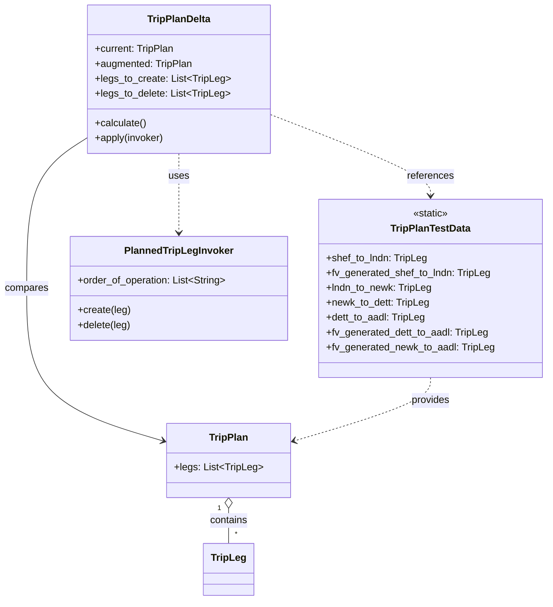
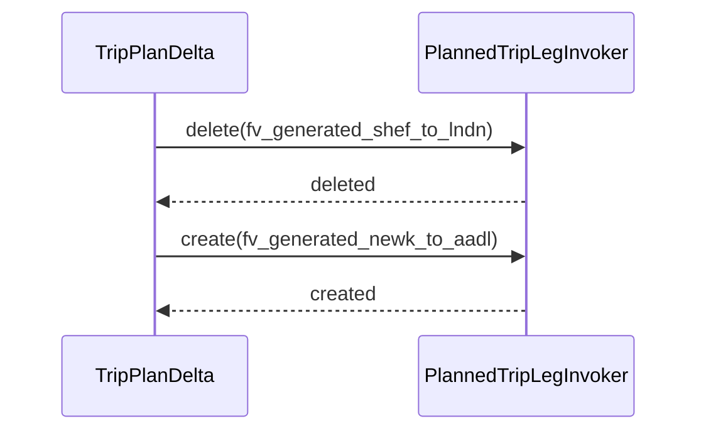

# Diagram: entity_core/entity_service/entity_service_tests/trip_leg_tests/test_augmented_trip_plan/test_trip_plan_delta.py

> Auto-generated by Obscura crawlers

## Diagram 1

### SVG

<svg id="container" width="877.421875" xmlns="http://www.w3.org/2000/svg" class="classDiagram" height="970" viewBox="0 0 877.421875 970" role="graphics-document document" aria-roledescription="class"><g><defs><marker id="container_class-aggregationStart" class="marker aggregation class" refX="18" refY="7" markerWidth="190" markerHeight="240" orient="auto"><path d="M 18,7 L9,13 L1,7 L9,1 Z"></path></marker></defs><defs><marker id="container_class-aggregationEnd" class="marker aggregation class" refX="1" refY="7" markerWidth="20" markerHeight="28" orient="auto"><path d="M 18,7 L9,13 L1,7 L9,1 Z"></path></marker></defs><defs><marker id="container_class-extensionStart" class="marker extension class" refX="18" refY="7" markerWidth="190" markerHeight="240" orient="auto"><path d="M 1,7 L18,13 V 1 Z"></path></marker></defs><defs><marker id="container_class-extensionEnd" class="marker extension class" refX="1" refY="7" markerWidth="20" markerHeight="28" orient="auto"><path d="M 1,1 V 13 L18,7 Z"></path></marker></defs><defs><marker id="container_class-compositionStart" class="marker composition class" refX="18" refY="7" markerWidth="190" markerHeight="240" orient="auto"><path d="M 18,7 L9,13 L1,7 L9,1 Z"></path></marker></defs><defs><marker id="container_class-compositionEnd" class="marker composition class" refX="1" refY="7" markerWidth="20" markerHeight="28" orient="auto"><path d="M 18,7 L9,13 L1,7 L9,1 Z"></path></marker></defs><defs><marker id="container_class-dependencyStart" class="marker dependency class" refX="6" refY="7" markerWidth="190" markerHeight="240" orient="auto"><path d="M 5,7 L9,13 L1,7 L9,1 Z"></path></marker></defs><defs><marker id="container_class-dependencyEnd" class="marker dependency class" refX="13" refY="7" markerWidth="20" markerHeight="28" orient="auto"><path d="M 18,7 L9,13 L14,7 L9,1 Z"></path></marker></defs><defs><marker id="container_class-lollipopStart" class="marker lollipop class" refX="13" refY="7" markerWidth="190" markerHeight="240" orient="auto"><circle stroke="black" fill="transparent" cx="7" cy="7" r="6"></circle></marker></defs><defs><marker id="container_class-lollipopEnd" class="marker lollipop class" refX="1" refY="7" markerWidth="190" markerHeight="240" orient="auto"><circle stroke="black" fill="transparent" cx="7" cy="7" r="6"></circle></marker></defs><g class="root"><g class="clusters"></g><g class="edgePaths"><path d="M142.957,220.902L126.325,231.585C109.693,242.268,76.428,263.634,59.796,304.484C43.164,345.333,43.164,405.667,43.164,466C43.164,526.333,43.164,586.667,80.013,627.874C116.863,669.082,190.562,691.164,227.411,702.205L264.26,713.246" id="id_TripPlanDelta_TripPlan_1" class="edge-thickness-normal edge-pattern-solid relation" style=";;;" data-edge="true" data-et="edge" data-id="id_TripPlanDelta_TripPlan_1" data-points="W3sieCI6MTQyLjk1NzAzMTI1LCJ5IjoyMjAuOTAxODI4MjM1MzY5MzJ9LHsieCI6NDMuMTY0MDYyNSwieSI6Mjg1fSx7IngiOjQzLjE2NDA2MjUsInkiOjQ2Nn0seyJ4Ijo0My4xNjQwNjI1LCJ5Ijo2NDd9LHsieCI6MjcwLjAwNzgxMjUsInkiOjcxNC45NjgwMDA3NzIyMjg3fV0=" marker-end="url(#container_class-dependencyEnd)"></path><path d="M366.902,821.25L366.902,824.542C366.902,827.833,366.902,834.417,366.902,843.875C366.902,853.333,366.902,865.667,366.902,871.833L366.902,878" id="id_TripPlan_TripLeg_2" class="edge-thickness-normal edge-pattern-solid relation" style=";;;" data-edge="true" data-et="edge" data-id="id_TripPlan_TripLeg_2" data-points="W3sieCI6MzY2LjkwMjM0Mzc1LCJ5Ijo4MDR9LHsieCI6MzY2LjkwMjM0Mzc1LCJ5Ijo4NDF9LHsieCI6MzY2LjkwMjM0Mzc1LCJ5Ijo4Nzh9XQ==" marker-start="url(#container_class-aggregationStart)"></path><path d="M690.641,610L690.641,616.167C690.641,622.333,690.641,634.667,653.791,651.874C616.942,669.082,543.243,691.164,506.394,702.205L469.544,713.246" id="id_TripPlanTestData_TripPlan_3" class="edge-thickness-normal edge-pattern-dashed relation" style=";;;" data-edge="true" data-et="edge" data-id="id_TripPlanTestData_TripPlan_3" data-points="W3sieCI6NjkwLjY0MDYyNSwieSI6NjEwfSx7IngiOjY5MC42NDA2MjUsInkiOjY0N30seyJ4Ijo0NjMuNzk2ODc1LCJ5Ijo3MTQuOTY4MDAwNzcyMjI4N31d" marker-end="url(#container_class-dependencyEnd)"></path><path d="M432.23,184.341L475.299,201.117C518.367,217.894,604.504,251.447,647.572,273.39C690.641,295.333,690.641,305.667,690.641,310.833L690.641,316" id="id_TripPlanDelta_TripPlanTestData_4" class="edge-thickness-normal edge-pattern-dashed relation" style=";;;" data-edge="true" data-et="edge" data-id="id_TripPlanDelta_TripPlanTestData_4" data-points="W3sieCI6NDMyLjIzMDQ2ODc1LCJ5IjoxODQuMzQwNzU0MDIyMDk3MzF9LHsieCI6NjkwLjY0MDYyNSwieSI6Mjg1fSx7IngiOjY5MC42NDA2MjUsInkiOjMyMn1d" marker-end="url(#container_class-dependencyEnd)"></path><path d="M287.594,248L287.594,254.167C287.594,260.333,287.594,272.667,287.594,294C287.594,315.333,287.594,345.667,287.594,360.833L287.594,376" id="id_TripPlanDelta_PlannedTripLegInvoker_5" class="edge-thickness-normal edge-pattern-dashed relation" style=";;;" data-edge="true" data-et="edge" data-id="id_TripPlanDelta_PlannedTripLegInvoker_5" data-points="W3sieCI6Mjg3LjU5Mzc1LCJ5IjoyNDh9LHsieCI6Mjg3LjU5Mzc1LCJ5IjoyODV9LHsieCI6Mjg3LjU5Mzc1LCJ5IjozODJ9XQ==" marker-end="url(#container_class-dependencyEnd)"></path></g><g class="edgeLabels"><g class="edgeLabel" transform="translate(43.1640625, 466)"><g class="label" data-id="id_TripPlanDelta_TripPlan_1" transform="translate(-35.1640625, -12)"><foreignObject width="70.328125" height="24">

compares

</foreignObject></g></g><g class="edgeLabel" transform="translate(366.90234375, 841)"><g class="label" data-id="id_TripPlan_TripLeg_2" transform="translate(-30.890625, -12)"><foreignObject width="61.78125" height="24">

contains

</foreignObject></g></g><g class="edgeLabel" transform="translate(690.640625, 647)"><g class="label" data-id="id_TripPlanTestData_TripPlan_3" transform="translate(-31.3125, -12)"><foreignObject width="62.625" height="24">

provides

</foreignObject></g></g><g class="edgeLabel" transform="translate(690.640625, 285)"><g class="label" data-id="id_TripPlanDelta_TripPlanTestData_4" transform="translate(-37.828125, -12)"><foreignObject width="75.65625" height="24">

references

</foreignObject></g></g><g class="edgeLabel" transform="translate(287.59375, 285)"><g class="label" data-id="id_TripPlanDelta_PlannedTripLegInvoker_5" transform="translate(-16.4921875, -12)"><foreignObject width="32.984375" height="24">

uses

</foreignObject></g></g><g class="edgeTerminals" transform="translate(351.9023418750001, 821.4999983928572)"><g class="inner" transform="translate(0, 0)"><foreignObject style="width: 9px; height: 12px;">
1
</foreignObject></g></g><g class="edgeTerminals" transform="translate(376.9023418749999, 855.4999983928572)"><g class="inner" transform="translate(0, 0)"></g><foreignObject style="width: 9px; height: 12px;">
*
</foreignObject></g></g><g class="nodes"><g class="node default" id="classId-TripPlan-0" transform="translate(366.90234375, 744)"><g class="basic label-container"><path d="M-96.89453125 -60 L96.89453125 -60 L96.89453125 60 L-96.89453125 60" stroke="none" stroke-width="0" fill="#ECECFF" style=""></path><path d="M-96.89453125 -60 C-37.43018520672311 -60, 22.03416083655378 -60, 96.89453125 -60 M-96.89453125 -60 C-56.30151003309559 -60, -15.708488816191178 -60, 96.89453125 -60 M96.89453125 -60 C96.89453125 -33.46757473959485, 96.89453125 -6.935149479189711, 96.89453125 60 M96.89453125 -60 C96.89453125 -35.21497309719409, 96.89453125 -10.429946194388172, 96.89453125 60 M96.89453125 60 C53.57439696512188 60, 10.254262680243755 60, -96.89453125 60 M96.89453125 60 C24.65456892960748 60, -47.58539339078504 60, -96.89453125 60 M-96.89453125 60 C-96.89453125 16.5501746936894, -96.89453125 -26.8996506126212, -96.89453125 -60 M-96.89453125 60 C-96.89453125 18.519209433052332, -96.89453125 -22.961581133895336, -96.89453125 -60" stroke="#9370DB" stroke-width="1.3" fill="none" stroke-dasharray="0 0" style=""></path></g><g class="annotation-group text" transform="translate(0, -36)"></g><g class="label-group text" transform="translate(-30.3828125, -36)"><g class="label" style="font-weight: bolder" transform="translate(0,-12)"><foreignObject width="60.765625" height="24">

TripPlan

</foreignObject></g></g><g class="members-group text" transform="translate(-84.89453125, 12)"><g class="label" style="" transform="translate(0,-12)"><foreignObject width="139.40625" height="24">

+legs: List&lt;TripLeg&gt;

</foreignObject></g></g><g class="methods-group text" transform="translate(-84.89453125, 60)"></g><g class="divider" style=""><path d="M-96.89453125 -12 C-19.437780753901762 -12, 58.018969742196475 -12, 96.89453125 -12 M-96.89453125 -12 C-29.217088607746547 -12, 38.460354034506906 -12, 96.89453125 -12" stroke="#9370DB" stroke-width="1.3" fill="none" stroke-dasharray="0 0" style=""></path></g><g class="divider" style=""><path d="M-96.89453125 36 C-36.86723555852733 36, 23.160060132945347 36, 96.89453125 36 M-96.89453125 36 C-34.37688371320554 36, 28.140763823588927 36, 96.89453125 36" stroke="#9370DB" stroke-width="1.3" fill="none" stroke-dasharray="0 0" style=""></path></g></g><g class="node default" id="classId-TripLeg-1" transform="translate(366.90234375, 920)"><g class="basic label-container"><path d="M-39.0546875 -42 L39.0546875 -42 L39.0546875 42 L-39.0546875 42" stroke="none" stroke-width="0" fill="#ECECFF" style=""></path><path d="M-39.0546875 -42 C-18.248177940475994 -42, 2.558331619048012 -42, 39.0546875 -42 M-39.0546875 -42 C-9.62675936654557 -42, 19.80116876690886 -42, 39.0546875 -42 M39.0546875 -42 C39.0546875 -11.631900038247778, 39.0546875 18.736199923504444, 39.0546875 42 M39.0546875 -42 C39.0546875 -16.192365826675836, 39.0546875 9.615268346648328, 39.0546875 42 M39.0546875 42 C10.274478421754736 42, -18.505730656490528 42, -39.0546875 42 M39.0546875 42 C8.216019797951624 42, -22.622647904096752 42, -39.0546875 42 M-39.0546875 42 C-39.0546875 20.18330565789754, -39.0546875 -1.6333886842049168, -39.0546875 -42 M-39.0546875 42 C-39.0546875 18.400814047917006, -39.0546875 -5.198371904165988, -39.0546875 -42" stroke="#9370DB" stroke-width="1.3" fill="none" stroke-dasharray="0 0" style=""></path></g><g class="annotation-group text" transform="translate(0, -18)"></g><g class="label-group text" transform="translate(-27.0546875, -18)"><g class="label" style="font-weight: bolder" transform="translate(0,-12)"><foreignObject width="54.109375" height="24">

TripLeg

</foreignObject></g></g><g class="members-group text" transform="translate(-27.0546875, 30)"></g><g class="methods-group text" transform="translate(-27.0546875, 60)"></g><g class="divider" style=""><path d="M-39.0546875 6 C-20.01923629188409 6, -0.9837850837681827 6, 39.0546875 6 M-39.0546875 6 C-17.917486868423598 6, 3.2197137631528037 6, 39.0546875 6" stroke="#9370DB" stroke-width="1.3" fill="none" stroke-dasharray="0 0" style=""></path></g><g class="divider" style=""><path d="M-39.0546875 24 C-10.470126912752338 24, 18.114433674495324 24, 39.0546875 24 M-39.0546875 24 C-18.383621671300244 24, 2.287444157399513 24, 39.0546875 24" stroke="#9370DB" stroke-width="1.3" fill="none" stroke-dasharray="0 0" style=""></path></g></g><g class="node default" id="classId-TripPlanDelta-2" transform="translate(287.59375, 128)"><g class="basic label-container"><path d="M-144.63671875 -120 L144.63671875 -120 L144.63671875 120 L-144.63671875 120" stroke="none" stroke-width="0" fill="#ECECFF" style=""></path><path d="M-144.63671875 -120 C-61.55012525374309 -120, 21.53646824251382 -120, 144.63671875 -120 M-144.63671875 -120 C-58.74542004367271 -120, 27.14587866265458 -120, 144.63671875 -120 M144.63671875 -120 C144.63671875 -48.680436354033304, 144.63671875 22.63912729193339, 144.63671875 120 M144.63671875 -120 C144.63671875 -61.52638677781709, 144.63671875 -3.0527735556341753, 144.63671875 120 M144.63671875 120 C57.88627486969442 120, -28.864169010611164 120, -144.63671875 120 M144.63671875 120 C31.74530479465062 120, -81.14610916069876 120, -144.63671875 120 M-144.63671875 120 C-144.63671875 63.1494404694201, -144.63671875 6.298880938840199, -144.63671875 -120 M-144.63671875 120 C-144.63671875 53.65357610203921, -144.63671875 -12.69284779592158, -144.63671875 -120" stroke="#9370DB" stroke-width="1.3" fill="none" stroke-dasharray="0 0" style=""></path></g><g class="annotation-group text" transform="translate(0, -96)"></g><g class="label-group text" transform="translate(-49.7578125, -96)"><g class="label" style="font-weight: bolder" transform="translate(0,-12)"><foreignObject width="99.515625" height="24">

TripPlanDelta

</foreignObject></g></g><g class="members-group text" transform="translate(-132.63671875, -48)"><g class="label" style="" transform="translate(0,-12)"><foreignObject width="128.484375" height="24">

+current: TripPlan

</foreignObject></g><g class="label" style="" transform="translate(0,12)"><foreignObject width="157.609375" height="24">

+augmented: TripPlan

</foreignObject></g><g class="label" style="" transform="translate(0,36)"><foreignObject width="214.5" height="24">

+legs_to_create: List&lt;TripLeg&gt;

</foreignObject></g><g class="label" style="" transform="translate(0,60)"><foreignObject width="215.515625" height="24">

+legs_to_delete: List&lt;TripLeg&gt;

</foreignObject></g></g><g class="methods-group text" transform="translate(-132.63671875, 72)"><g class="label" style="" transform="translate(0,-12)"><foreignObject width="83.375" height="24">

+calculate()

</foreignObject></g><g class="label" style="" transform="translate(0,12)"><foreignObject width="112.109375" height="24">

+apply(invoker)

</foreignObject></g></g><g class="divider" style=""><path d="M-144.63671875 -72 C-36.64243146706862 -72, 71.35185581586276 -72, 144.63671875 -72 M-144.63671875 -72 C-61.12392939729472 -72, 22.388859955410567 -72, 144.63671875 -72" stroke="#9370DB" stroke-width="1.3" fill="none" stroke-dasharray="0 0" style=""></path></g><g class="divider" style=""><path d="M-144.63671875 48 C-59.52868876407811 48, 25.579341221843777 48, 144.63671875 48 M-144.63671875 48 C-80.97214922346592 48, -17.307579696931853 48, 144.63671875 48" stroke="#9370DB" stroke-width="1.3" fill="none" stroke-dasharray="0 0" style=""></path></g></g><g class="node default" id="classId-TripPlanTestData-3" transform="translate(690.640625, 466)"><g class="basic label-container"><path d="M-178.78125 -144 L178.78125 -144 L178.78125 144 L-178.78125 144" stroke="none" stroke-width="0" fill="#ECECFF" style=""></path><path d="M-178.78125 -144 C-64.05071410118727 -144, 50.679821797625465 -144, 178.78125 -144 M-178.78125 -144 C-103.4640234605222 -144, -28.1467969210444 -144, 178.78125 -144 M178.78125 -144 C178.78125 -84.51971851709774, 178.78125 -25.0394370341955, 178.78125 144 M178.78125 -144 C178.78125 -56.02627934104811, 178.78125 31.94744131790378, 178.78125 144 M178.78125 144 C100.06127002932534 144, 21.341290058650685 144, -178.78125 144 M178.78125 144 C44.5154292173126 144, -89.7503915653748 144, -178.78125 144 M-178.78125 144 C-178.78125 34.21628052245025, -178.78125 -75.5674389550995, -178.78125 -144 M-178.78125 144 C-178.78125 56.979117521809655, -178.78125 -30.04176495638069, -178.78125 -144" stroke="#9370DB" stroke-width="1.3" fill="none" stroke-dasharray="0 0" style=""></path></g><g class="annotation-group text" transform="translate(-29.0234375, -120)"><g class="label" style="" transform="translate(0,-12)"><foreignObject width="58.046875" height="24">

«static»

</foreignObject></g></g><g class="label-group text" transform="translate(-62.515625, -96)"><g class="label" style="font-weight: bolder" transform="translate(0,-12)"><foreignObject width="125.03125" height="24">

TripPlanTestData

</foreignObject></g></g><g class="members-group text" transform="translate(-166.78125, -48)"><g class="label" style="" transform="translate(0,-12)"><foreignObject width="162.84375" height="24">

+shef_to_lndn: TripLeg

</foreignObject></g><g class="label" style="" transform="translate(0,12)"><foreignObject width="265.15625" height="24">

+fv_generated_shef_to_lndn: TripLeg

</foreignObject></g><g class="label" style="" transform="translate(0,36)"><foreignObject width="170.375" height="24">

+lndn_to_newk: TripLeg

</foreignObject></g><g class="label" style="" transform="translate(0,60)"><foreignObject width="166.890625" height="24">

+newk_to_dett: TripLeg

</foreignObject></g><g class="label" style="" transform="translate(0,84)"><foreignObject width="160.8125" height="24">

+dett_to_aadl: TripLeg

</foreignObject></g><g class="label" style="" transform="translate(0,108)"><foreignObject width="262.8125" height="24">

+fv_generated_dett_to_aadl: TripLeg

</foreignObject></g><g class="label" style="" transform="translate(0,132)"><foreignObject width="271.046875" height="24">

+fv_generated_newk_to_aadl: TripLeg

</foreignObject></g></g><g class="methods-group text" transform="translate(-166.78125, 144)"></g><g class="divider" style=""><path d="M-178.78125 -72 C-46.56172475346537 -72, 85.65780049306926 -72, 178.78125 -72 M-178.78125 -72 C-86.62639609922896 -72, 5.528457801542089 -72, 178.78125 -72" stroke="#9370DB" stroke-width="1.3" fill="none" stroke-dasharray="0 0" style=""></path></g><g class="divider" style=""><path d="M-178.78125 120 C-38.32689185151031 120, 102.12746629697938 120, 178.78125 120 M-178.78125 120 C-90.46346819045867 120, -2.14568638091734 120, 178.78125 120" stroke="#9370DB" stroke-width="1.3" fill="none" stroke-dasharray="0 0" style=""></path></g></g><g class="node default" id="classId-PlannedTripLegInvoker-4" transform="translate(287.59375, 466)"><g class="basic label-container"><path d="M-174.265625 -84 L174.265625 -84 L174.265625 84 L-174.265625 84" stroke="none" stroke-width="0" fill="#ECECFF" style=""></path><path d="M-174.265625 -84 C-39.142849075579335 -84, 95.97992684884133 -84, 174.265625 -84 M-174.265625 -84 C-77.93557107175374 -84, 18.394482856492516 -84, 174.265625 -84 M174.265625 -84 C174.265625 -19.15273415120521, 174.265625 45.69453169758958, 174.265625 84 M174.265625 -84 C174.265625 -17.410381048779513, 174.265625 49.179237902440974, 174.265625 84 M174.265625 84 C53.28116121871817 84, -67.70330256256366 84, -174.265625 84 M174.265625 84 C45.62548558354089 84, -83.01465383291821 84, -174.265625 84 M-174.265625 84 C-174.265625 48.0867242719784, -174.265625 12.173448543956795, -174.265625 -84 M-174.265625 84 C-174.265625 38.194020945745216, -174.265625 -7.611958108509569, -174.265625 -84" stroke="#9370DB" stroke-width="1.3" fill="none" stroke-dasharray="0 0" style=""></path></g><g class="annotation-group text" transform="translate(0, -60)"></g><g class="label-group text" transform="translate(-84.5, -60)"><g class="label" style="font-weight: bolder" transform="translate(0,-12)"><foreignObject width="169" height="24">

PlannedTripLegInvoker

</foreignObject></g></g><g class="members-group text" transform="translate(-162.265625, -12)"><g class="label" style="" transform="translate(0,-12)"><foreignObject width="240.03125" height="24">

+order_of_operation: List&lt;String&gt;

</foreignObject></g></g><g class="methods-group text" transform="translate(-162.265625, 36)"><g class="label" style="" transform="translate(0,-12)"><foreignObject width="84.875" height="24">

+create(leg)

</foreignObject></g><g class="label" style="" transform="translate(0,12)"><foreignObject width="85.875" height="24">

+delete(leg)

</foreignObject></g></g><g class="divider" style=""><path d="M-174.265625 -36 C-91.81435902343979 -36, -9.363093046879584 -36, 174.265625 -36 M-174.265625 -36 C-95.58684679829989 -36, -16.908068596599776 -36, 174.265625 -36" stroke="#9370DB" stroke-width="1.3" fill="none" stroke-dasharray="0 0" style=""></path></g><g class="divider" style=""><path d="M-174.265625 12 C-85.1982639576359 12, 3.869097084728196 12, 174.265625 12 M-174.265625 12 C-84.23305425442622 12, 5.799516491147557 12, 174.265625 12" stroke="#9370DB" stroke-width="1.3" fill="none" stroke-dasharray="0 0" style=""></path></g></g></g></g></g></svg>

## Diagram 2

### SVG

<svg id="container" width="596.5" xmlns="http://www.w3.org/2000/svg" height="363" viewBox="-50 -10 596.5 363" role="graphics-document document" aria-roledescription="sequence"><g><rect x="309.5" y="277" fill="#eaeaea" stroke="#666" width="187" height="65" name="Invoker" rx="3" ry="3" class="actor actor-bottom"></rect><text x="403" y="309.5" dominant-baseline="central" alignment-baseline="central" class="actor actor-box" style="text-anchor: middle; font-size: 16px; font-weight: 400;"><tspan x="403" dy="0">PlannedTripLegInvoker</tspan></text></g><g><rect x="0" y="277" fill="#eaeaea" stroke="#666" width="150" height="65" name="Delta" rx="3" ry="3" class="actor actor-bottom"></rect><text x="75" y="309.5" dominant-baseline="central" alignment-baseline="central" class="actor actor-box" style="text-anchor: middle; font-size: 16px; font-weight: 400;"><tspan x="75" dy="0">TripPlanDelta</tspan></text></g><g><line id="actor1" x1="403" y1="65" x2="403" y2="277" class="actor-line 200" stroke-width="0.5px" stroke="#999" name="Invoker"></line><g id="root-1"><rect x="309.5" y="0" fill="#eaeaea" stroke="#666" width="187" height="65" name="Invoker" rx="3" ry="3" class="actor actor-top"></rect><text x="403" y="32.5" dominant-baseline="central" alignment-baseline="central" class="actor actor-box" style="text-anchor: middle; font-size: 16px; font-weight: 400;"><tspan x="403" dy="0">PlannedTripLegInvoker</tspan></text></g></g><g><line id="actor0" x1="75" y1="65" x2="75" y2="277" class="actor-line 200" stroke-width="0.5px" stroke="#999" name="Delta"></line><g id="root-0"><rect x="0" y="0" fill="#eaeaea" stroke="#666" width="150" height="65" name="Delta" rx="3" ry="3" class="actor actor-top"></rect><text x="75" y="32.5" dominant-baseline="central" alignment-baseline="central" class="actor actor-box" style="text-anchor: middle; font-size: 16px; font-weight: 400;"><tspan x="75" dy="0">TripPlanDelta</tspan></text></g></g><g></g><defs><symbol id="computer" width="24" height="24"><path transform="scale(.5)" d="M2 2v13h20v-13h-20zm18 11h-16v-9h16v9zm-10.228 6l.466-1h3.524l.467 1h-4.457zm14.228 3h-24l2-6h2.104l-1.33 4h18.45l-1.297-4h2.073l2 6zm-5-10h-14v-7h14v7z"></path></symbol></defs><defs><symbol id="database" fill-rule="evenodd" clip-rule="evenodd"><path transform="scale(.5)" d="M12.258.001l.256.004.255.005.253.008.251.01.249.012.247.015.246.016.242.019.241.02.239.023.236.024.233.027.231.028.229.031.225.032.223.034.22.036.217.038.214.04.211.041.208.043.205.045.201.046.198.048.194.05.191.051.187.053.183.054.18.056.175.057.172.059.168.06.163.061.16.063.155.064.15.066.074.033.073.033.071.034.07.034.069.035.068.035.067.035.066.035.064.036.064.036.062.036.06.036.06.037.058.037.058.037.055.038.055.038.053.038.052.038.051.039.05.039.048.039.047.039.045.04.044.04.043.04.041.04.04.041.039.041.037.041.036.041.034.041.033.042.032.042.03.042.029.042.027.042.026.043.024.043.023.043.021.043.02.043.018.044.017.043.015.044.013.044.012.044.011.045.009.044.007.045.006.045.004.045.002.045.001.045v17l-.001.045-.002.045-.004.045-.006.045-.007.045-.009.044-.011.045-.012.044-.013.044-.015.044-.017.043-.018.044-.02.043-.021.043-.023.043-.024.043-.026.043-.027.042-.029.042-.03.042-.032.042-.033.042-.034.041-.036.041-.037.041-.039.041-.04.041-.041.04-.043.04-.044.04-.045.04-.047.039-.048.039-.05.039-.051.039-.052.038-.053.038-.055.038-.055.038-.058.037-.058.037-.06.037-.06.036-.062.036-.064.036-.064.036-.066.035-.067.035-.068.035-.069.035-.07.034-.071.034-.073.033-.074.033-.15.066-.155.064-.16.063-.163.061-.168.06-.172.059-.175.057-.18.056-.183.054-.187.053-.191.051-.194.05-.198.048-.201.046-.205.045-.208.043-.211.041-.214.04-.217.038-.22.036-.223.034-.225.032-.229.031-.231.028-.233.027-.236.024-.239.023-.241.02-.242.019-.246.016-.247.015-.249.012-.251.01-.253.008-.255.005-.256.004-.258.001-.258-.001-.256-.004-.255-.005-.253-.008-.251-.01-.249-.012-.247-.015-.245-.016-.243-.019-.241-.02-.238-.023-.236-.024-.234-.027-.231-.028-.228-.031-.226-.032-.223-.034-.22-.036-.217-.038-.214-.04-.211-.041-.208-.043-.204-.045-.201-.046-.198-.048-.195-.05-.19-.051-.187-.053-.184-.054-.179-.056-.176-.057-.172-.059-.167-.06-.164-.061-.159-.063-.155-.064-.151-.066-.074-.033-.072-.033-.072-.034-.07-.034-.069-.035-.068-.035-.067-.035-.066-.035-.064-.036-.063-.036-.062-.036-.061-.036-.06-.037-.058-.037-.057-.037-.056-.038-.055-.038-.053-.038-.052-.038-.051-.039-.049-.039-.049-.039-.046-.039-.046-.04-.044-.04-.043-.04-.041-.04-.04-.041-.039-.041-.037-.041-.036-.041-.034-.041-.033-.042-.032-.042-.03-.042-.029-.042-.027-.042-.026-.043-.024-.043-.023-.043-.021-.043-.02-.043-.018-.044-.017-.043-.015-.044-.013-.044-.012-.044-.011-.045-.009-.044-.007-.045-.006-.045-.004-.045-.002-.045-.001-.045v-17l.001-.045.002-.045.004-.045.006-.045.007-.045.009-.044.011-.045.012-.044.013-.044.015-.044.017-.043.018-.044.02-.043.021-.043.023-.043.024-.043.026-.043.027-.042.029-.042.03-.042.032-.042.033-.042.034-.041.036-.041.037-.041.039-.041.04-.041.041-.04.043-.04.044-.04.046-.04.046-.039.049-.039.049-.039.051-.039.052-.038.053-.038.055-.038.056-.038.057-.037.058-.037.06-.037.061-.036.062-.036.063-.036.064-.036.066-.035.067-.035.068-.035.069-.035.07-.034.072-.034.072-.033.074-.033.151-.066.155-.064.159-.063.164-.061.167-.06.172-.059.176-.057.179-.056.184-.054.187-.053.19-.051.195-.05.198-.048.201-.046.204-.045.208-.043.211-.041.214-.04.217-.038.22-.036.223-.034.226-.032.228-.031.231-.028.234-.027.236-.024.238-.023.241-.02.243-.019.245-.016.247-.015.249-.012.251-.01.253-.008.255-.005.256-.004.258-.001.258.001zm-9.258 20.499v.01l.001.021.003.021.004.022.005.021.006.022.007.022.009.023.01.022.011.023.012.023.013.023.015.023.016.024.017.023.018.024.019.024.021.024.022.025.023.024.024.025.052.049.056.05.061.051.066.051.07.051.075.051.079.052.084.052.088.052.092.052.097.052.102.051.105.052.11.052.114.051.119.051.123.051.127.05.131.05.135.05.139.048.144.049.147.047.152.047.155.047.16.045.163.045.167.043.171.043.176.041.178.041.183.039.187.039.19.037.194.035.197.035.202.033.204.031.209.03.212.029.216.027.219.025.222.024.226.021.23.02.233.018.236.016.24.015.243.012.246.01.249.008.253.005.256.004.259.001.26-.001.257-.004.254-.005.25-.008.247-.011.244-.012.241-.014.237-.016.233-.018.231-.021.226-.021.224-.024.22-.026.216-.027.212-.028.21-.031.205-.031.202-.034.198-.034.194-.036.191-.037.187-.039.183-.04.179-.04.175-.042.172-.043.168-.044.163-.045.16-.046.155-.046.152-.047.148-.048.143-.049.139-.049.136-.05.131-.05.126-.05.123-.051.118-.052.114-.051.11-.052.106-.052.101-.052.096-.052.092-.052.088-.053.083-.051.079-.052.074-.052.07-.051.065-.051.06-.051.056-.05.051-.05.023-.024.023-.025.021-.024.02-.024.019-.024.018-.024.017-.024.015-.023.014-.024.013-.023.012-.023.01-.023.01-.022.008-.022.006-.022.006-.022.004-.022.004-.021.001-.021.001-.021v-4.127l-.077.055-.08.053-.083.054-.085.053-.087.052-.09.052-.093.051-.095.05-.097.05-.1.049-.102.049-.105.048-.106.047-.109.047-.111.046-.114.045-.115.045-.118.044-.12.043-.122.042-.124.042-.126.041-.128.04-.13.04-.132.038-.134.038-.135.037-.138.037-.139.035-.142.035-.143.034-.144.033-.147.032-.148.031-.15.03-.151.03-.153.029-.154.027-.156.027-.158.026-.159.025-.161.024-.162.023-.163.022-.165.021-.166.02-.167.019-.169.018-.169.017-.171.016-.173.015-.173.014-.175.013-.175.012-.177.011-.178.01-.179.008-.179.008-.181.006-.182.005-.182.004-.184.003-.184.002h-.37l-.184-.002-.184-.003-.182-.004-.182-.005-.181-.006-.179-.008-.179-.008-.178-.01-.176-.011-.176-.012-.175-.013-.173-.014-.172-.015-.171-.016-.17-.017-.169-.018-.167-.019-.166-.02-.165-.021-.163-.022-.162-.023-.161-.024-.159-.025-.157-.026-.156-.027-.155-.027-.153-.029-.151-.03-.15-.03-.148-.031-.146-.032-.145-.033-.143-.034-.141-.035-.14-.035-.137-.037-.136-.037-.134-.038-.132-.038-.13-.04-.128-.04-.126-.041-.124-.042-.122-.042-.12-.044-.117-.043-.116-.045-.113-.045-.112-.046-.109-.047-.106-.047-.105-.048-.102-.049-.1-.049-.097-.05-.095-.05-.093-.052-.09-.051-.087-.052-.085-.053-.083-.054-.08-.054-.077-.054v4.127zm0-5.654v.011l.001.021.003.021.004.021.005.022.006.022.007.022.009.022.01.022.011.023.012.023.013.023.015.024.016.023.017.024.018.024.019.024.021.024.022.024.023.025.024.024.052.05.056.05.061.05.066.051.07.051.075.052.079.051.084.052.088.052.092.052.097.052.102.052.105.052.11.051.114.051.119.052.123.05.127.051.131.05.135.049.139.049.144.048.147.048.152.047.155.046.16.045.163.045.167.044.171.042.176.042.178.04.183.04.187.038.19.037.194.036.197.034.202.033.204.032.209.03.212.028.216.027.219.025.222.024.226.022.23.02.233.018.236.016.24.014.243.012.246.01.249.008.253.006.256.003.259.001.26-.001.257-.003.254-.006.25-.008.247-.01.244-.012.241-.015.237-.016.233-.018.231-.02.226-.022.224-.024.22-.025.216-.027.212-.029.21-.03.205-.032.202-.033.198-.035.194-.036.191-.037.187-.039.183-.039.179-.041.175-.042.172-.043.168-.044.163-.045.16-.045.155-.047.152-.047.148-.048.143-.048.139-.05.136-.049.131-.05.126-.051.123-.051.118-.051.114-.052.11-.052.106-.052.101-.052.096-.052.092-.052.088-.052.083-.052.079-.052.074-.051.07-.052.065-.051.06-.05.056-.051.051-.049.023-.025.023-.024.021-.025.02-.024.019-.024.018-.024.017-.024.015-.023.014-.023.013-.024.012-.022.01-.023.01-.023.008-.022.006-.022.006-.022.004-.021.004-.022.001-.021.001-.021v-4.139l-.077.054-.08.054-.083.054-.085.052-.087.053-.09.051-.093.051-.095.051-.097.05-.1.049-.102.049-.105.048-.106.047-.109.047-.111.046-.114.045-.115.044-.118.044-.12.044-.122.042-.124.042-.126.041-.128.04-.13.039-.132.039-.134.038-.135.037-.138.036-.139.036-.142.035-.143.033-.144.033-.147.033-.148.031-.15.03-.151.03-.153.028-.154.028-.156.027-.158.026-.159.025-.161.024-.162.023-.163.022-.165.021-.166.02-.167.019-.169.018-.169.017-.171.016-.173.015-.173.014-.175.013-.175.012-.177.011-.178.009-.179.009-.179.007-.181.007-.182.005-.182.004-.184.003-.184.002h-.37l-.184-.002-.184-.003-.182-.004-.182-.005-.181-.007-.179-.007-.179-.009-.178-.009-.176-.011-.176-.012-.175-.013-.173-.014-.172-.015-.171-.016-.17-.017-.169-.018-.167-.019-.166-.02-.165-.021-.163-.022-.162-.023-.161-.024-.159-.025-.157-.026-.156-.027-.155-.028-.153-.028-.151-.03-.15-.03-.148-.031-.146-.033-.145-.033-.143-.033-.141-.035-.14-.036-.137-.036-.136-.037-.134-.038-.132-.039-.13-.039-.128-.04-.126-.041-.124-.042-.122-.043-.12-.043-.117-.044-.116-.044-.113-.046-.112-.046-.109-.046-.106-.047-.105-.048-.102-.049-.1-.049-.097-.05-.095-.051-.093-.051-.09-.051-.087-.053-.085-.052-.083-.054-.08-.054-.077-.054v4.139zm0-5.666v.011l.001.02.003.022.004.021.005.022.006.021.007.022.009.023.01.022.011.023.012.023.013.023.015.023.016.024.017.024.018.023.019.024.021.025.022.024.023.024.024.025.052.05.056.05.061.05.066.051.07.051.075.052.079.051.084.052.088.052.092.052.097.052.102.052.105.051.11.052.114.051.119.051.123.051.127.05.131.05.135.05.139.049.144.048.147.048.152.047.155.046.16.045.163.045.167.043.171.043.176.042.178.04.183.04.187.038.19.037.194.036.197.034.202.033.204.032.209.03.212.028.216.027.219.025.222.024.226.021.23.02.233.018.236.017.24.014.243.012.246.01.249.008.253.006.256.003.259.001.26-.001.257-.003.254-.006.25-.008.247-.01.244-.013.241-.014.237-.016.233-.018.231-.02.226-.022.224-.024.22-.025.216-.027.212-.029.21-.03.205-.032.202-.033.198-.035.194-.036.191-.037.187-.039.183-.039.179-.041.175-.042.172-.043.168-.044.163-.045.16-.045.155-.047.152-.047.148-.048.143-.049.139-.049.136-.049.131-.051.126-.05.123-.051.118-.052.114-.051.11-.052.106-.052.101-.052.096-.052.092-.052.088-.052.083-.052.079-.052.074-.052.07-.051.065-.051.06-.051.056-.05.051-.049.023-.025.023-.025.021-.024.02-.024.019-.024.018-.024.017-.024.015-.023.014-.024.013-.023.012-.023.01-.022.01-.023.008-.022.006-.022.006-.022.004-.022.004-.021.001-.021.001-.021v-4.153l-.077.054-.08.054-.083.053-.085.053-.087.053-.09.051-.093.051-.095.051-.097.05-.1.049-.102.048-.105.048-.106.048-.109.046-.111.046-.114.046-.115.044-.118.044-.12.043-.122.043-.124.042-.126.041-.128.04-.13.039-.132.039-.134.038-.135.037-.138.036-.139.036-.142.034-.143.034-.144.033-.147.032-.148.032-.15.03-.151.03-.153.028-.154.028-.156.027-.158.026-.159.024-.161.024-.162.023-.163.023-.165.021-.166.02-.167.019-.169.018-.169.017-.171.016-.173.015-.173.014-.175.013-.175.012-.177.01-.178.01-.179.009-.179.007-.181.006-.182.006-.182.004-.184.003-.184.001-.185.001-.185-.001-.184-.001-.184-.003-.182-.004-.182-.006-.181-.006-.179-.007-.179-.009-.178-.01-.176-.01-.176-.012-.175-.013-.173-.014-.172-.015-.171-.016-.17-.017-.169-.018-.167-.019-.166-.02-.165-.021-.163-.023-.162-.023-.161-.024-.159-.024-.157-.026-.156-.027-.155-.028-.153-.028-.151-.03-.15-.03-.148-.032-.146-.032-.145-.033-.143-.034-.141-.034-.14-.036-.137-.036-.136-.037-.134-.038-.132-.039-.13-.039-.128-.041-.126-.041-.124-.041-.122-.043-.12-.043-.117-.044-.116-.044-.113-.046-.112-.046-.109-.046-.106-.048-.105-.048-.102-.048-.1-.05-.097-.049-.095-.051-.093-.051-.09-.052-.087-.052-.085-.053-.083-.053-.08-.054-.077-.054v4.153zm8.74-8.179l-.257.004-.254.005-.25.008-.247.011-.244.012-.241.014-.237.016-.233.018-.231.021-.226.022-.224.023-.22.026-.216.027-.212.028-.21.031-.205.032-.202.033-.198.034-.194.036-.191.038-.187.038-.183.04-.179.041-.175.042-.172.043-.168.043-.163.045-.16.046-.155.046-.152.048-.148.048-.143.048-.139.049-.136.05-.131.05-.126.051-.123.051-.118.051-.114.052-.11.052-.106.052-.101.052-.096.052-.092.052-.088.052-.083.052-.079.052-.074.051-.07.052-.065.051-.06.05-.056.05-.051.05-.023.025-.023.024-.021.024-.02.025-.019.024-.018.024-.017.023-.015.024-.014.023-.013.023-.012.023-.01.023-.01.022-.008.022-.006.023-.006.021-.004.022-.004.021-.001.021-.001.021.001.021.001.021.004.021.004.022.006.021.006.023.008.022.01.022.01.023.012.023.013.023.014.023.015.024.017.023.018.024.019.024.02.025.021.024.023.024.023.025.051.05.056.05.06.05.065.051.07.052.074.051.079.052.083.052.088.052.092.052.096.052.101.052.106.052.11.052.114.052.118.051.123.051.126.051.131.05.136.05.139.049.143.048.148.048.152.048.155.046.16.046.163.045.168.043.172.043.175.042.179.041.183.04.187.038.191.038.194.036.198.034.202.033.205.032.21.031.212.028.216.027.22.026.224.023.226.022.231.021.233.018.237.016.241.014.244.012.247.011.25.008.254.005.257.004.26.001.26-.001.257-.004.254-.005.25-.008.247-.011.244-.012.241-.014.237-.016.233-.018.231-.021.226-.022.224-.023.22-.026.216-.027.212-.028.21-.031.205-.032.202-.033.198-.034.194-.036.191-.038.187-.038.183-.04.179-.041.175-.042.172-.043.168-.043.163-.045.16-.046.155-.046.152-.048.148-.048.143-.048.139-.049.136-.05.131-.05.126-.051.123-.051.118-.051.114-.052.11-.052.106-.052.101-.052.096-.052.092-.052.088-.052.083-.052.079-.052.074-.051.07-.052.065-.051.06-.05.056-.05.051-.05.023-.025.023-.024.021-.024.02-.025.019-.024.018-.024.017-.023.015-.024.014-.023.013-.023.012-.023.01-.023.01-.022.008-.022.006-.023.006-.021.004-.022.004-.021.001-.021.001-.021-.001-.021-.001-.021-.004-.021-.004-.022-.006-.021-.006-.023-.008-.022-.01-.022-.01-.023-.012-.023-.013-.023-.014-.023-.015-.024-.017-.023-.018-.024-.019-.024-.02-.025-.021-.024-.023-.024-.023-.025-.051-.05-.056-.05-.06-.05-.065-.051-.07-.052-.074-.051-.079-.052-.083-.052-.088-.052-.092-.052-.096-.052-.101-.052-.106-.052-.11-.052-.114-.052-.118-.051-.123-.051-.126-.051-.131-.05-.136-.05-.139-.049-.143-.048-.148-.048-.152-.048-.155-.046-.16-.046-.163-.045-.168-.043-.172-.043-.175-.042-.179-.041-.183-.04-.187-.038-.191-.038-.194-.036-.198-.034-.202-.033-.205-.032-.21-.031-.212-.028-.216-.027-.22-.026-.224-.023-.226-.022-.231-.021-.233-.018-.237-.016-.241-.014-.244-.012-.247-.011-.25-.008-.254-.005-.257-.004-.26-.001-.26.001z"></path></symbol></defs><defs><symbol id="clock" width="24" height="24"><path transform="scale(.5)" d="M12 2c5.514 0 10 4.486 10 10s-4.486 10-10 10-10-4.486-10-10 4.486-10 10-10zm0-2c-6.627 0-12 5.373-12 12s5.373 12 12 12 12-5.373 12-12-5.373-12-12-12zm5.848 12.459c.202.038.202.333.001.372-1.907.361-6.045 1.111-6.547 1.111-.719 0-1.301-.582-1.301-1.301 0-.512.77-5.447 1.125-7.445.034-.192.312-.181.343.014l.985 6.238 5.394 1.011z"></path></symbol></defs><defs><marker id="arrowhead" refX="7.9" refY="5" markerUnits="userSpaceOnUse" markerWidth="12" markerHeight="12" orient="auto-start-reverse"><path d="M -1 0 L 10 5 L 0 10 z"></path></marker></defs><defs><marker id="crosshead" markerWidth="15" markerHeight="8" orient="auto" refX="4" refY="4.5"><path fill="none" stroke="#000000" stroke-width="1pt" d="M 1,2 L 6,7 M 6,2 L 1,7" style="stroke-dasharray: 0, 0;"></path></marker></defs><defs><marker id="filled-head" refX="15.5" refY="7" markerWidth="20" markerHeight="28" orient="auto"><path d="M 18,7 L9,13 L14,7 L9,1 Z"></path></marker></defs><defs><marker id="sequencenumber" refX="15" refY="15" markerWidth="60" markerHeight="40" orient="auto"><circle cx="15" cy="15" r="6"></circle></marker></defs><text x="238" y="80" text-anchor="middle" dominant-baseline="middle" alignment-baseline="middle" class="messageText" dy="1em" style="font-size: 16px; font-weight: 400;">delete(fv_generated_shef_to_lndn)</text><line x1="76" y1="113" x2="399" y2="113" class="messageLine0" stroke-width="2" stroke="none" marker-end="url(#arrowhead)" style="fill: none;"></line><text x="241" y="128" text-anchor="middle" dominant-baseline="middle" alignment-baseline="middle" class="messageText" dy="1em" style="font-size: 16px; font-weight: 400;">deleted</text><line x1="402" y1="161" x2="79" y2="161" class="messageLine1" stroke-width="2" stroke="none" marker-end="url(#arrowhead)" style="stroke-dasharray: 3, 3; fill: none;"></line><text x="238" y="176" text-anchor="middle" dominant-baseline="middle" alignment-baseline="middle" class="messageText" dy="1em" style="font-size: 16px; font-weight: 400;">create(fv_generated_newk_to_aadl)</text><line x1="76" y1="209" x2="399" y2="209" class="messageLine0" stroke-width="2" stroke="none" marker-end="url(#arrowhead)" style="fill: none;"></line><text x="241" y="224" text-anchor="middle" dominant-baseline="middle" alignment-baseline="middle" class="messageText" dy="1em" style="font-size: 16px; font-weight: 400;">created</text><line x1="402" y1="257" x2="79" y2="257" class="messageLine1" stroke-width="2" stroke="none" marker-end="url(#arrowhead)" style="stroke-dasharray: 3, 3; fill: none;"></line></svg>
