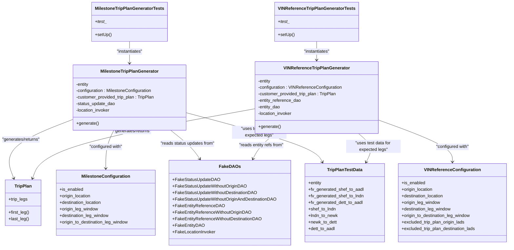
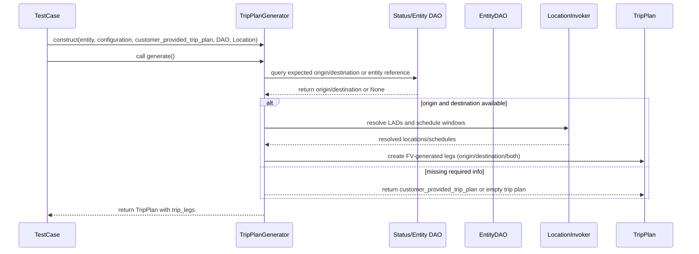

# Diagram: entity_core/entity_service/entity_service_tests/trip_leg_tests/test_augmented_trip_plan/test_trip_plan_generator.py

> Auto-generated by Obscura crawlers

## Diagram 1

### SVG

<svg id="container" width="1876.457763671875" xmlns="http://www.w3.org/2000/svg" class="classDiagram" height="908" viewBox="74.921142578125 0 1876.457763671875 908" role="graphics-document document" aria-roledescription="class"><g><defs><marker id="container_class-aggregationStart" class="marker aggregation class" refX="18" refY="7" markerWidth="190" markerHeight="240" orient="auto"><path d="M 18,7 L9,13 L1,7 L9,1 Z"></path></marker></defs><defs><marker id="container_class-aggregationEnd" class="marker aggregation class" refX="1" refY="7" markerWidth="20" markerHeight="28" orient="auto"><path d="M 18,7 L9,13 L1,7 L9,1 Z"></path></marker></defs><defs><marker id="container_class-extensionStart" class="marker extension class" refX="18" refY="7" markerWidth="190" markerHeight="240" orient="auto"><path d="M 1,7 L18,13 V 1 Z"></path></marker></defs><defs><marker id="container_class-extensionEnd" class="marker extension class" refX="1" refY="7" markerWidth="20" markerHeight="28" orient="auto"><path d="M 1,1 V 13 L18,7 Z"></path></marker></defs><defs><marker id="container_class-compositionStart" class="marker composition class" refX="18" refY="7" markerWidth="190" markerHeight="240" orient="auto"><path d="M 18,7 L9,13 L1,7 L9,1 Z"></path></marker></defs><defs><marker id="container_class-compositionEnd" class="marker composition class" refX="1" refY="7" markerWidth="20" markerHeight="28" orient="auto"><path d="M 18,7 L9,13 L1,7 L9,1 Z"></path></marker></defs><defs><marker id="container_class-dependencyStart" class="marker dependency class" refX="6" refY="7" markerWidth="190" markerHeight="240" orient="auto"><path d="M 5,7 L9,13 L1,7 L9,1 Z"></path></marker></defs><defs><marker id="container_class-dependencyEnd" class="marker dependency class" refX="13" refY="7" markerWidth="20" markerHeight="28" orient="auto"><path d="M 18,7 L9,13 L14,7 L9,1 Z"></path></marker></defs><defs><marker id="container_class-lollipopStart" class="marker lollipop class" refX="13" refY="7" markerWidth="190" markerHeight="240" orient="auto"><circle stroke="black" fill="transparent" cx="7" cy="7" r="6"></circle></marker></defs><defs><marker id="container_class-lollipopEnd" class="marker lollipop class" refX="1" refY="7" markerWidth="190" markerHeight="240" orient="auto"><circle stroke="black" fill="transparent" cx="7" cy="7" r="6"></circle></marker></defs><g class="root"><g class="clusters"></g><g class="edgePaths"><path d="M351.723,436.805L306.421,453.837C261.12,470.87,170.517,504.935,132.903,541.206C95.288,577.476,110.663,615.952,118.35,635.19L126.037,654.428" id="id_MilestoneTripPlanGenerator_TripPlan_1" class="edge-thickness-normal edge-pattern-solid relation" style=";;;" data-edge="true" data-et="edge" data-id="id_MilestoneTripPlanGenerator_TripPlan_1" data-points="W3sieCI6MzUxLjcyMjY1NjI1LCJ5Ijo0MzYuODA0OTA5MTIwNDE1NDZ9LHsieCI6NzkuOTE0MDYyNSwieSI6NTM5fSx7IngiOjEyOC4yNjMzMzg0MTQ2MzQxNSwieSI6NjYwfV0=" marker-end="url(#container_class-dependencyEnd)"></path><path d="M1018.428,398.631L889.313,422.026C760.199,445.421,501.971,492.21,365.169,534.843C228.368,577.476,212.994,615.952,205.306,635.19L197.619,654.428" id="id_VINReferenceTripPlanGenerator_TripPlan_2" class="edge-thickness-normal edge-pattern-solid relation" style=";;;" data-edge="true" data-et="edge" data-id="id_VINReferenceTripPlanGenerator_TripPlan_2" data-points="W3sieCI6MTAxOC40Mjc3MzQzNzUsInkiOjM5OC42MzA4NTQ2ODkzMjM5fSx7IngiOjI0My43NDIxODc1LCJ5Ijo1Mzl9LHsieCI6MTk1LjM5MjkxMTU4NTM2NTg1LCJ5Ijo2NjB9XQ==" marker-end="url(#container_class-dependencyEnd)"></path><path d="M500.901,478L495.782,488.167C490.663,498.333,480.425,518.667,475.306,542C470.188,565.333,470.188,591.667,470.188,604.833L470.188,618" id="id_MilestoneTripPlanGenerator_MilestoneConfiguration_3" class="edge-thickness-normal edge-pattern-solid relation" style=";;;" data-edge="true" data-et="edge" data-id="id_MilestoneTripPlanGenerator_MilestoneConfiguration_3" data-points="W3sieCI6NTAwLjkwMDc2ODMwMTEwNDk2LCJ5Ijo0Nzh9LHsieCI6NDcwLjE4NzUsInkiOjUzOX0seyJ4Ijo0NzAuMTg3NSwieSI6NjI0fV0=" marker-end="url(#container_class-dependencyEnd)"></path><path d="M1466.904,439.025L1513.018,455.688C1559.132,472.35,1651.359,505.675,1697.472,531.504C1743.586,557.333,1743.586,575.667,1743.586,584.833L1743.586,594" id="id_VINReferenceTripPlanGenerator_VINReferenceConfiguration_4" class="edge-thickness-normal edge-pattern-solid relation" style=";;;" data-edge="true" data-et="edge" data-id="id_VINReferenceTripPlanGenerator_VINReferenceConfiguration_4" data-points="W3sieCI6MTQ2Ni45MDQyOTY4NzUsInkiOjQzOS4wMjUxODQxMzM4Nzg2N30seyJ4IjoxNzQzLjU4NTkzNzUsInkiOjUzOX0seyJ4IjoxNzQzLjU4NTkzNzUsInkiOjYwMH1d" marker-end="url(#container_class-dependencyEnd)"></path><path d="M711.908,478L724.666,488.167C737.424,498.333,762.941,518.667,780.564,536.167C798.187,553.667,807.918,568.334,812.783,575.667L817.648,583" id="id_MilestoneTripPlanGenerator_FakeDAOs_5" class="edge-thickness-normal edge-pattern-solid relation" style=";;;" data-edge="true" data-et="edge" data-id="id_MilestoneTripPlanGenerator_FakeDAOs_5" data-points="W3sieCI6NzExLjkwODE5MjMzNDI1NDIsInkiOjQ3OH0seyJ4Ijo3ODguNDU3MDMxMjUsInkiOjUzOX0seyJ4Ijo4MjAuOTY1MjgyMDEyMTk1MSwieSI6NTg4fV0=" marker-end="url(#container_class-dependencyEnd)"></path><path d="M1087.956,490L1078.384,498.167C1068.812,506.333,1049.669,522.667,1036.331,538.112C1022.994,553.557,1015.462,568.114,1011.696,575.393L1007.931,582.671" id="id_VINReferenceTripPlanGenerator_FakeDAOs_6" class="edge-thickness-normal edge-pattern-solid relation" style=";;;" data-edge="true" data-et="edge" data-id="id_VINReferenceTripPlanGenerator_FakeDAOs_6" data-points="W3sieCI6MTA4Ny45NTU3MjU1Njk3NTE0LCJ5Ijo0OTB9LHsieCI6MTAzMC41MjUzOTA2MjUsInkiOjUzOX0seyJ4IjoxMDA1LjE3MzM5OTM5MDI0NCwieSI6NTg4fV0=" marker-end="url(#container_class-dependencyEnd)"></path><path d="M561.32,152L561.32,158.167C561.32,164.333,561.32,176.667,561.32,190C561.32,203.333,561.32,217.667,561.32,224.833L561.32,232" id="id_MilestoneTripPlanGeneratorTests_MilestoneTripPlanGenerator_7" class="edge-thickness-normal edge-pattern-solid relation" style=";;;" data-edge="true" data-et="edge" data-id="id_MilestoneTripPlanGeneratorTests_MilestoneTripPlanGenerator_7" data-points="W3sieCI6NTYxLjMyMDMxMjUsInkiOjE1Mn0seyJ4Ijo1NjEuMzIwMzEyNSwieSI6MTg5fSx7IngiOjU2MS4zMjAzMTI1LCJ5IjoyMzh9XQ==" marker-end="url(#container_class-dependencyEnd)"></path><path d="M1242.666,152L1242.666,158.167C1242.666,164.333,1242.666,176.667,1242.666,188C1242.666,199.333,1242.666,209.667,1242.666,214.833L1242.666,220" id="id_VINReferenceTripPlanGeneratorTests_VINReferenceTripPlanGenerator_8" class="edge-thickness-normal edge-pattern-solid relation" style=";;;" data-edge="true" data-et="edge" data-id="id_VINReferenceTripPlanGeneratorTests_VINReferenceTripPlanGenerator_8" data-points="W3sieCI6MTI0Mi42NjYwMTU2MjUsInkiOjE1Mn0seyJ4IjoxMjQyLjY2NjAxNTYyNSwieSI6MTg5fSx7IngiOjEyNDIuNjY2MDE1NjI1LCJ5IjoyMjZ9XQ==" marker-end="url(#container_class-dependencyEnd)"></path><path d="M770.918,414.33L848.233,435.108C925.548,455.886,1080.177,497.443,1162.636,527.513C1245.094,557.584,1255.382,576.167,1260.526,585.459L1265.67,594.751" id="id_MilestoneTripPlanGenerator_TripPlanTestData_9" class="edge-thickness-normal edge-pattern-solid relation" style=";;;" data-edge="true" data-et="edge" data-id="id_MilestoneTripPlanGenerator_TripPlanTestData_9" data-points="W3sieCI6NzcwLjkxNzk2ODc1LCJ5Ijo0MTQuMzI5NTQxMDcxNTU4fSx7IngiOjEyMzQuODA2NjQwNjI1LCJ5Ijo1Mzl9LHsieCI6MTI2OC41NzU3NDMxNDAyNDQsInkiOjYwMH1d" marker-end="url(#container_class-dependencyEnd)"></path><path d="M1397.376,490L1406.948,498.167C1416.52,506.333,1435.663,522.667,1440.414,540.113C1445.164,557.559,1435.521,576.117,1430.7,585.396L1425.879,594.676" id="id_VINReferenceTripPlanGenerator_TripPlanTestData_10" class="edge-thickness-normal edge-pattern-solid relation" style=";;;" data-edge="true" data-et="edge" data-id="id_VINReferenceTripPlanGenerator_TripPlanTestData_10" data-points="W3sieCI6MTM5Ny4zNzYzMDU2ODAyNDg2LCJ5Ijo0OTB9LHsieCI6MTQ1NC44MDY2NDA2MjUsInkiOjUzOX0seyJ4IjoxNDIzLjExMjMyODUwNjA5NzYsInkiOjYwMH1d" marker-end="url(#container_class-dependencyEnd)"></path></g><g class="edgeLabels"><g class="edgeLabel" transform="translate(154.83521, 510.83101)"><g class="label" data-id="id_MilestoneTripPlanGenerator_TripPlan_1" transform="translate(-71.9140625, -12)"><foreignObject width="143.828125" height="24">

"generates/returns"

</foreignObject></g></g><g class="edgeLabel" transform="translate(566.97775, 480.43133)"><g class="label" data-id="id_VINReferenceTripPlanGenerator_TripPlan_2" transform="translate(-71.9140625, -12)"><foreignObject width="143.828125" height="24">

"generates/returns"

</foreignObject></g></g><g class="edgeLabel" transform="translate(470.1875, 539)"><g class="label" data-id="id_MilestoneTripPlanGenerator_MilestoneConfiguration_3" transform="translate(-62.265625, -12)"><foreignObject width="124.53125" height="24">

"configured with"

</foreignObject></g></g><g class="edgeLabel" transform="translate(1743.5859375, 539)"><g class="label" data-id="id_VINReferenceTripPlanGenerator_VINReferenceConfiguration_4" transform="translate(-62.265625, -12)"><foreignObject width="124.53125" height="24">

"configured with"

</foreignObject></g></g><g class="edgeLabel" transform="translate(773.17629, 526.82313)"><g class="label" data-id="id_MilestoneTripPlanGenerator_FakeDAOs_5" transform="translate(-100, -24)"><foreignObject width="200" height="48">

"reads status updates from"

</foreignObject></g></g><g class="edgeLabel" transform="translate(1038.25573, 532.40441)"><g class="label" data-id="id_VINReferenceTripPlanGenerator_FakeDAOs_6" transform="translate(-84.28125, -12)"><foreignObject width="168.5625" height="24">

"reads entity refs from"

</foreignObject></g></g><g class="edgeLabel" transform="translate(561.3203125, 189)"><g class="label" data-id="id_MilestoneTripPlanGeneratorTests_MilestoneTripPlanGenerator_7" transform="translate(-49.1796875, -12)"><foreignObject width="98.359375" height="24">

"instantiates"

</foreignObject></g></g><g class="edgeLabel" transform="translate(1242.666015625, 189)"><g class="label" data-id="id_VINReferenceTripPlanGeneratorTests_VINReferenceTripPlanGenerator_8" transform="translate(-49.1796875, -12)"><foreignObject width="98.359375" height="24">

"instantiates"

</foreignObject></g></g><g class="edgeLabel" transform="translate(1036.52936, 485.71282)"><g class="label" data-id="id_MilestoneTripPlanGenerator_TripPlanTestData_9" transform="translate(-100, -24)"><foreignObject width="200" height="48">

"uses test data for expected legs"

</foreignObject></g></g><g class="edgeLabel" transform="translate(1452.23884, 536.80913)"><g class="label" data-id="id_VINReferenceTripPlanGenerator_TripPlanTestData_10" transform="translate(-100, -24)"><foreignObject width="200" height="48">

"uses test data for expected legs"

</foreignObject></g></g></g><g class="nodes"><g class="node default" id="classId-MilestoneTripPlanGenerator-0" transform="translate(561.3203125, 358)"><g class="basic label-container"><path d="M-209.59765625 -120 L209.59765625 -120 L209.59765625 120 L-209.59765625 120" stroke="none" stroke-width="0" fill="#ECECFF" style=""></path><path d="M-209.59765625 -120 C-77.27729830349418 -120, 55.043059643011645 -120, 209.59765625 -120 M-209.59765625 -120 C-119.17554353753066 -120, -28.753430825061315 -120, 209.59765625 -120 M209.59765625 -120 C209.59765625 -28.252148438821393, 209.59765625 63.49570312235721, 209.59765625 120 M209.59765625 -120 C209.59765625 -59.07208077902925, 209.59765625 1.8558384419415006, 209.59765625 120 M209.59765625 120 C84.12061420882091 120, -41.35642783235818 120, -209.59765625 120 M209.59765625 120 C123.86447039909345 120, 38.1312845481869 120, -209.59765625 120 M-209.59765625 120 C-209.59765625 46.07059654172599, -209.59765625 -27.85880691654802, -209.59765625 -120 M-209.59765625 120 C-209.59765625 59.14626215067935, -209.59765625 -1.7074756986413036, -209.59765625 -120" stroke="#9370DB" stroke-width="1.3" fill="none" stroke-dasharray="0 0" style=""></path></g><g class="annotation-group text" transform="translate(0, -96)"></g><g class="label-group text" transform="translate(-102.9296875, -96)"><g class="label" style="font-weight: bolder" transform="translate(0,-12)"><foreignObject width="205.859375" height="24">

MilestoneTripPlanGenerator

</foreignObject></g></g><g class="members-group text" transform="translate(-197.59765625, -48)"><g class="label" style="" transform="translate(0,-12)"><foreignObject width="48.40625" height="24">

-entity

</foreignObject></g><g class="label" style="" transform="translate(0,12)"><foreignObject width="282.921875" height="24">

-configuration : MilestoneConfiguration

</foreignObject></g><g class="label" style="" transform="translate(0,36)"><foreignObject width="292.265625" height="24">

-customer_provided_trip_plan : TripPlan

</foreignObject></g><g class="label" style="" transform="translate(0,60)"><foreignObject width="145.171875" height="24">

-status_update_dao

</foreignObject></g><g class="label" style="" transform="translate(0,84)"><foreignObject width="127.796875" height="24">

-location_invoker

</foreignObject></g></g><g class="methods-group text" transform="translate(-197.59765625, 96)"><g class="label" style="" transform="translate(0,-12)"><foreignObject width="81.8125" height="24">

+generate()

</foreignObject></g></g><g class="divider" style=""><path d="M-209.59765625 -72 C-80.20600459492482 -72, 49.18564706015036 -72, 209.59765625 -72 M-209.59765625 -72 C-103.7213204564653 -72, 2.1550153370693863 -72, 209.59765625 -72" stroke="#9370DB" stroke-width="1.3" fill="none" stroke-dasharray="0 0" style=""></path></g><g class="divider" style=""><path d="M-209.59765625 72 C-119.25075159109791 72, -28.90384693219582 72, 209.59765625 72 M-209.59765625 72 C-84.54878524794505 72, 40.500085754109904 72, 209.59765625 72" stroke="#9370DB" stroke-width="1.3" fill="none" stroke-dasharray="0 0" style=""></path></g></g><g class="node default" id="classId-VINReferenceTripPlanGenerator-1" transform="translate(1242.666015625, 358)"><g class="basic label-container"><path d="M-224.23828125 -132 L224.23828125 -132 L224.23828125 132 L-224.23828125 132" stroke="none" stroke-width="0" fill="#ECECFF" style=""></path><path d="M-224.23828125 -132 C-92.63890301913273 -132, 38.96047521173455 -132, 224.23828125 -132 M-224.23828125 -132 C-131.99485541195665 -132, -39.7514295739133 -132, 224.23828125 -132 M224.23828125 -132 C224.23828125 -28.934842976169847, 224.23828125 74.1303140476603, 224.23828125 132 M224.23828125 -132 C224.23828125 -38.66377378859087, 224.23828125 54.67245242281825, 224.23828125 132 M224.23828125 132 C103.19108223524346 132, -17.856116779513087 132, -224.23828125 132 M224.23828125 132 C61.890224208883296 132, -100.45783283223341 132, -224.23828125 132 M-224.23828125 132 C-224.23828125 52.67389484782693, -224.23828125 -26.65221030434614, -224.23828125 -132 M-224.23828125 132 C-224.23828125 48.77655605437967, -224.23828125 -34.446887891240664, -224.23828125 -132" stroke="#9370DB" stroke-width="1.3" fill="none" stroke-dasharray="0 0" style=""></path></g><g class="annotation-group text" transform="translate(0, -108)"></g><g class="label-group text" transform="translate(-115.8359375, -108)"><g class="label" style="font-weight: bolder" transform="translate(0,-12)"><foreignObject width="231.671875" height="24">

VINReferenceTripPlanGenerator

</foreignObject></g></g><g class="members-group text" transform="translate(-212.23828125, -60)"><g class="label" style="" transform="translate(0,-12)"><foreignObject width="48.40625" height="24">

-entity

</foreignObject></g><g class="label" style="" transform="translate(0,12)"><foreignObject width="308.640625" height="24">

-configuration : VINReferenceConfiguration

</foreignObject></g><g class="label" style="" transform="translate(0,36)"><foreignObject width="292.265625" height="24">

-customer_provided_trip_plan : TripPlan

</foreignObject></g><g class="label" style="" transform="translate(0,60)"><foreignObject width="159.71875" height="24">

-entity_reference_dao

</foreignObject></g><g class="label" style="" transform="translate(0,84)"><foreignObject width="83.546875" height="24">

-entity_dao

</foreignObject></g><g class="label" style="" transform="translate(0,108)"><foreignObject width="127.796875" height="24">

-location_invoker

</foreignObject></g></g><g class="methods-group text" transform="translate(-212.23828125, 108)"><g class="label" style="" transform="translate(0,-12)"><foreignObject width="81.8125" height="24">

+generate()

</foreignObject></g></g><g class="divider" style=""><path d="M-224.23828125 -84 C-94.46408386047025 -84, 35.31011352905949 -84, 224.23828125 -84 M-224.23828125 -84 C-44.875826678386034 -84, 134.48662789322793 -84, 224.23828125 -84" stroke="#9370DB" stroke-width="1.3" fill="none" stroke-dasharray="0 0" style=""></path></g><g class="divider" style=""><path d="M-224.23828125 84 C-99.19265376359522 84, 25.852973722809566 84, 224.23828125 84 M-224.23828125 84 C-96.16042860913797 84, 31.917424031724067 84, 224.23828125 84" stroke="#9370DB" stroke-width="1.3" fill="none" stroke-dasharray="0 0" style=""></path></g></g><g class="node default" id="classId-TripPlan-2" transform="translate(161.828125, 744)"><g class="basic label-container"><path d="M-65.34765625 -84 L65.34765625 -84 L65.34765625 84 L-65.34765625 84" stroke="none" stroke-width="0" fill="#ECECFF" style=""></path><path d="M-65.34765625 -84 C-37.92183380990451 -84, -10.496011369809025 -84, 65.34765625 -84 M-65.34765625 -84 C-38.84529702652351 -84, -12.342937803047015 -84, 65.34765625 -84 M65.34765625 -84 C65.34765625 -49.97640988527588, 65.34765625 -15.952819770551756, 65.34765625 84 M65.34765625 -84 C65.34765625 -20.712561411421028, 65.34765625 42.574877177157944, 65.34765625 84 M65.34765625 84 C30.46777799317028 84, -4.41210026365944 84, -65.34765625 84 M65.34765625 84 C22.765953513009997 84, -19.815749223980006 84, -65.34765625 84 M-65.34765625 84 C-65.34765625 48.22859949411281, -65.34765625 12.457198988225613, -65.34765625 -84 M-65.34765625 84 C-65.34765625 31.08507956859537, -65.34765625 -21.829840862809263, -65.34765625 -84" stroke="#9370DB" stroke-width="1.3" fill="none" stroke-dasharray="0 0" style=""></path></g><g class="annotation-group text" transform="translate(0, -60)"></g><g class="label-group text" transform="translate(-30.3828125, -60)"><g class="label" style="font-weight: bolder" transform="translate(0,-12)"><foreignObject width="60.765625" height="24">

TripPlan

</foreignObject></g></g><g class="members-group text" transform="translate(-53.34765625, -12)"><g class="label" style="" transform="translate(0,-12)"><foreignObject width="70.734375" height="24">

+trip_legs

</foreignObject></g></g><g class="methods-group text" transform="translate(-53.34765625, 36)"><g class="label" style="" transform="translate(0,-12)"><foreignObject width="76.3125" height="24">

+first_leg()

</foreignObject></g><g class="label" style="" transform="translate(0,12)"><foreignObject width="74.5625" height="24">

+last_leg()

</foreignObject></g></g><g class="divider" style=""><path d="M-65.34765625 -36 C-20.133928493661607 -36, 25.079799262676786 -36, 65.34765625 -36 M-65.34765625 -36 C-19.572059052745793 -36, 26.203538144508414 -36, 65.34765625 -36" stroke="#9370DB" stroke-width="1.3" fill="none" stroke-dasharray="0 0" style=""></path></g><g class="divider" style=""><path d="M-65.34765625 12 C-18.0348802688465 12, 29.277895712307 12, 65.34765625 12 M-65.34765625 12 C-35.789782599336874 12, -6.231908948673741 12, 65.34765625 12" stroke="#9370DB" stroke-width="1.3" fill="none" stroke-dasharray="0 0" style=""></path></g></g><g class="node default" id="classId-MilestoneConfiguration-3" transform="translate(470.1875, 744)"><g class="basic label-container"><path d="M-183.36328125 -120 L183.36328125 -120 L183.36328125 120 L-183.36328125 120" stroke="none" stroke-width="0" fill="#ECECFF" style=""></path><path d="M-183.36328125 -120 C-87.34118380480439 -120, 8.680913640391225 -120, 183.36328125 -120 M-183.36328125 -120 C-87.68045506170125 -120, 8.002371126597495 -120, 183.36328125 -120 M183.36328125 -120 C183.36328125 -47.955709519954254, 183.36328125 24.08858096009149, 183.36328125 120 M183.36328125 -120 C183.36328125 -50.89280061930502, 183.36328125 18.21439876138996, 183.36328125 120 M183.36328125 120 C73.02757228217348 120, -37.30813668565304 120, -183.36328125 120 M183.36328125 120 C92.63030892629577 120, 1.8973366025915368 120, -183.36328125 120 M-183.36328125 120 C-183.36328125 33.697859597453856, -183.36328125 -52.60428080509229, -183.36328125 -120 M-183.36328125 120 C-183.36328125 69.9731921272305, -183.36328125 19.946384254460995, -183.36328125 -120" stroke="#9370DB" stroke-width="1.3" fill="none" stroke-dasharray="0 0" style=""></path></g><g class="annotation-group text" transform="translate(0, -96)"></g><g class="label-group text" transform="translate(-85.1796875, -96)"><g class="label" style="font-weight: bolder" transform="translate(0,-12)"><foreignObject width="170.359375" height="24">

MilestoneConfiguration

</foreignObject></g></g><g class="members-group text" transform="translate(-171.36328125, -48)"><g class="label" style="" transform="translate(0,-12)"><foreignObject width="86.859375" height="24">

+is_enabled

</foreignObject></g><g class="label" style="" transform="translate(0,12)"><foreignObject width="117.546875" height="24">

+origin_location

</foreignObject></g><g class="label" style="" transform="translate(0,36)"><foreignObject width="158.4375" height="24">

+destination_location

</foreignObject></g><g class="label" style="" transform="translate(0,60)"><foreignObject width="143.84375" height="24">

+origin_leg_window

</foreignObject></g><g class="label" style="" transform="translate(0,84)"><foreignObject width="184.75" height="24">

+destination_leg_window

</foreignObject></g><g class="label" style="" transform="translate(0,108)"><foreignObject width="257.546875" height="24">

+origin_to_destination_leg_window

</foreignObject></g></g><g class="methods-group text" transform="translate(-171.36328125, 120)"></g><g class="divider" style=""><path d="M-183.36328125 -72 C-76.59328908720603 -72, 30.176703075587938 -72, 183.36328125 -72 M-183.36328125 -72 C-67.1620927279547 -72, 49.0390957940906 -72, 183.36328125 -72" stroke="#9370DB" stroke-width="1.3" fill="none" stroke-dasharray="0 0" style=""></path></g><g class="divider" style=""><path d="M-183.36328125 96 C-91.18389501295505 96, 0.9954912240899034 96, 183.36328125 96 M-183.36328125 96 C-79.56581233171421 96, 24.231656586571575 96, 183.36328125 96" stroke="#9370DB" stroke-width="1.3" fill="none" stroke-dasharray="0 0" style=""></path></g></g><g class="node default" id="classId-VINReferenceConfiguration-4" transform="translate(1743.5859375, 744)"><g class="basic label-container"><path d="M-199.79296875 -144 L199.79296875 -144 L199.79296875 144 L-199.79296875 144" stroke="none" stroke-width="0" fill="#ECECFF" style=""></path><path d="M-199.79296875 -144 C-46.25084560573242 -144, 107.29127753853516 -144, 199.79296875 -144 M-199.79296875 -144 C-96.17566708431426 -144, 7.441634581371488 -144, 199.79296875 -144 M199.79296875 -144 C199.79296875 -82.98683099096702, 199.79296875 -21.973661981934043, 199.79296875 144 M199.79296875 -144 C199.79296875 -35.103749583582186, 199.79296875 73.79250083283563, 199.79296875 144 M199.79296875 144 C87.05758698559534 144, -25.67779477880933 144, -199.79296875 144 M199.79296875 144 C101.80758721842366 144, 3.822205686847326 144, -199.79296875 144 M-199.79296875 144 C-199.79296875 83.85812648546545, -199.79296875 23.71625297093088, -199.79296875 -144 M-199.79296875 144 C-199.79296875 63.74900951357161, -199.79296875 -16.501980972856785, -199.79296875 -144" stroke="#9370DB" stroke-width="1.3" fill="none" stroke-dasharray="0 0" style=""></path></g><g class="annotation-group text" transform="translate(0, -120)"></g><g class="label-group text" transform="translate(-98.0859375, -120)"><g class="label" style="font-weight: bolder" transform="translate(0,-12)"><foreignObject width="196.171875" height="24">

VINReferenceConfiguration

</foreignObject></g></g><g class="members-group text" transform="translate(-187.79296875, -72)"><g class="label" style="" transform="translate(0,-12)"><foreignObject width="86.859375" height="24">

+is_enabled

</foreignObject></g><g class="label" style="" transform="translate(0,12)"><foreignObject width="117.546875" height="24">

+origin_location

</foreignObject></g><g class="label" style="" transform="translate(0,36)"><foreignObject width="158.4375" height="24">

+destination_location

</foreignObject></g><g class="label" style="" transform="translate(0,60)"><foreignObject width="143.84375" height="24">

+origin_leg_window

</foreignObject></g><g class="label" style="" transform="translate(0,84)"><foreignObject width="184.75" height="24">

+destination_leg_window

</foreignObject></g><g class="label" style="" transform="translate(0,108)"><foreignObject width="257.546875" height="24">

+origin_to_destination_leg_window

</foreignObject></g><g class="label" style="" transform="translate(0,132)"><foreignObject width="236.59375" height="24">

+excluded_trip_plan_origin_lads

</foreignObject></g><g class="label" style="" transform="translate(0,156)"><foreignObject width="277.5" height="24">

+excluded_trip_plan_destination_lads

</foreignObject></g></g><g class="methods-group text" transform="translate(-187.79296875, 144)"></g><g class="divider" style=""><path d="M-199.79296875 -96 C-46.497053911061556 -96, 106.79886092787689 -96, 199.79296875 -96 M-199.79296875 -96 C-109.08215130054224 -96, -18.371333851084472 -96, 199.79296875 -96" stroke="#9370DB" stroke-width="1.3" fill="none" stroke-dasharray="0 0" style=""></path></g><g class="divider" style=""><path d="M-199.79296875 120 C-110.13983612364896 120, -20.486703497297924 120, 199.79296875 120 M-199.79296875 120 C-105.34610833764236 120, -10.899247925284726 120, 199.79296875 120" stroke="#9370DB" stroke-width="1.3" fill="none" stroke-dasharray="0 0" style=""></path></g></g><g class="node default" id="classId-TripPlanTestData-5" transform="translate(1348.29296875, 744)"><g class="basic label-container"><path d="M-145.5 -144 L145.5 -144 L145.5 144 L-145.5 144" stroke="none" stroke-width="0" fill="#ECECFF" style=""></path><path d="M-145.5 -144 C-81.07215903208053 -144, -16.64431806416107 -144, 145.5 -144 M-145.5 -144 C-37.499658596501035 -144, 70.50068280699793 -144, 145.5 -144 M145.5 -144 C145.5 -44.23327861444045, 145.5 55.5334427711191, 145.5 144 M145.5 -144 C145.5 -47.01016740128071, 145.5 49.97966519743858, 145.5 144 M145.5 144 C43.009998213450245 144, -59.48000357309951 144, -145.5 144 M145.5 144 C43.38665873793025 144, -58.726682524139505 144, -145.5 144 M-145.5 144 C-145.5 28.934612869371165, -145.5 -86.13077426125767, -145.5 -144 M-145.5 144 C-145.5 58.75637785545625, -145.5 -26.4872442890875, -145.5 -144" stroke="#9370DB" stroke-width="1.3" fill="none" stroke-dasharray="0 0" style=""></path></g><g class="annotation-group text" transform="translate(0, -120)"></g><g class="label-group text" transform="translate(-62.515625, -120)"><g class="label" style="font-weight: bolder" transform="translate(0,-12)"><foreignObject width="125.03125" height="24">

TripPlanTestData

</foreignObject></g></g><g class="members-group text" transform="translate(-133.5, -72)"><g class="label" style="" transform="translate(0,-12)"><foreignObject width="49.9375" height="24">

+entity

</foreignObject></g><g class="label" style="" transform="translate(0,12)"><foreignObject width="202.90625" height="24">

+fv_generated_shef_to_aadl

</foreignObject></g><g class="label" style="" transform="translate(0,36)"><foreignObject width="204.484375" height="24">

+fv_generated_shef_to_lndn

</foreignObject></g><g class="label" style="" transform="translate(0,60)"><foreignObject width="201.96875" height="24">

+fv_generated_dett_to_aadl

</foreignObject></g><g class="label" style="" transform="translate(0,84)"><foreignObject width="102.171875" height="24">

+shef_to_lndn

</foreignObject></g><g class="label" style="" transform="translate(0,108)"><foreignObject width="109.640625" height="24">

+lndn_to_newk

</foreignObject></g><g class="label" style="" transform="translate(0,132)"><foreignObject width="106.15625" height="24">

+newk_to_dett

</foreignObject></g><g class="label" style="" transform="translate(0,156)"><foreignObject width="99.96875" height="24">

+dett_to_aadl

</foreignObject></g></g><g class="methods-group text" transform="translate(-133.5, 144)"></g><g class="divider" style=""><path d="M-145.5 -96 C-33.59903845219583 -96, 78.30192309560834 -96, 145.5 -96 M-145.5 -96 C-48.79468893142756 -96, 47.910622137144884 -96, 145.5 -96" stroke="#9370DB" stroke-width="1.3" fill="none" stroke-dasharray="0 0" style=""></path></g><g class="divider" style=""><path d="M-145.5 120 C-34.27167635336892 120, 76.95664729326217 120, 145.5 120 M-145.5 120 C-58.48422684300256 120, 28.53154631399488 120, 145.5 120" stroke="#9370DB" stroke-width="1.3" fill="none" stroke-dasharray="0 0" style=""></path></g></g><g class="node default" id="classId-FakeDAOs-6" transform="translate(924.4609375, 744)"><g class="basic label-container"><path d="M-220.91015625 -156 L220.91015625 -156 L220.91015625 156 L-220.91015625 156" stroke="none" stroke-width="0" fill="#ECECFF" style=""></path><path d="M-220.91015625 -156 C-47.19221830941507 -156, 126.52571963116986 -156, 220.91015625 -156 M-220.91015625 -156 C-112.82703630204985 -156, -4.743916354099696 -156, 220.91015625 -156 M220.91015625 -156 C220.91015625 -54.467589838031216, 220.91015625 47.06482032393757, 220.91015625 156 M220.91015625 -156 C220.91015625 -58.22719564231558, 220.91015625 39.54560871536884, 220.91015625 156 M220.91015625 156 C61.13822961359733 156, -98.63369702280534 156, -220.91015625 156 M220.91015625 156 C45.461036690728974 156, -129.98808286854205 156, -220.91015625 156 M-220.91015625 156 C-220.91015625 40.714146448678704, -220.91015625 -74.57170710264259, -220.91015625 -156 M-220.91015625 156 C-220.91015625 63.97126692357914, -220.91015625 -28.057466152841727, -220.91015625 -156" stroke="#9370DB" stroke-width="1.3" fill="none" stroke-dasharray="0 0" style=""></path></g><g class="annotation-group text" transform="translate(0, -132)"></g><g class="label-group text" transform="translate(-35.6953125, -132)"><g class="label" style="font-weight: bolder" transform="translate(0,-12)"><foreignObject width="71.390625" height="24">

FakeDAOs

</foreignObject></g></g><g class="members-group text" transform="translate(-208.91015625, -84)"><g class="label" style="" transform="translate(0,-12)"><foreignObject width="168.859375" height="24">

+FakeStatusUpdateDAO

</foreignObject></g><g class="label" style="" transform="translate(0,12)"><foreignObject width="270.140625" height="24">

+FakeStatusUpdateWithoutOriginDAO

</foreignObject></g><g class="label" style="" transform="translate(0,36)"><foreignObject width="310.046875" height="24">

+FakeStatusUpdateWithoutDestinationDAO

</foreignObject></g><g class="label" style="" transform="translate(0,60)"><foreignObject width="382.125" height="24">

+FakeStatusUpdateWithoutOriginAndDestinationDAO

</foreignObject></g><g class="label" style="" transform="translate(0,84)"><foreignObject width="184.140625" height="24">

+FakeEntityReferenceDAO

</foreignObject></g><g class="label" style="" transform="translate(0,108)"><foreignObject width="285.421875" height="24">

+FakeEntityReferenceWithoutOriginDAO

</foreignObject></g><g class="label" style="" transform="translate(0,132)"><foreignObject width="325.328125" height="24">

+FakeEntityReferenceWithoutDestinationDAO

</foreignObject></g><g class="label" style="" transform="translate(0,156)"><foreignObject width="112.21875" height="24">

+FakeEntityDAO

</foreignObject></g><g class="label" style="" transform="translate(0,180)"><foreignObject width="156.546875" height="24">

+FakeLocationInvoker

</foreignObject></g></g><g class="methods-group text" transform="translate(-208.91015625, 156)"></g><g class="divider" style=""><path d="M-220.91015625 -108 C-61.12123987249683 -108, 98.66767650500634 -108, 220.91015625 -108 M-220.91015625 -108 C-123.61622373013056 -108, -26.322291210261113 -108, 220.91015625 -108" stroke="#9370DB" stroke-width="1.3" fill="none" stroke-dasharray="0 0" style=""></path></g><g class="divider" style=""><path d="M-220.91015625 132 C-115.02980158802234 132, -9.149446926044675 132, 220.91015625 132 M-220.91015625 132 C-127.42527528225078 132, -33.94039431450156 132, 220.91015625 132" stroke="#9370DB" stroke-width="1.3" fill="none" stroke-dasharray="0 0" style=""></path></g></g><g class="node default" id="classId-MilestoneTripPlanGeneratorTests-7" transform="translate(561.3203125, 80)"><g class="basic label-container"><path d="M-134.046875 -72 L134.046875 -72 L134.046875 72 L-134.046875 72" stroke="none" stroke-width="0" fill="#ECECFF" style=""></path><path d="M-134.046875 -72 C-71.95719893357656 -72, -9.867522867153127 -72, 134.046875 -72 M-134.046875 -72 C-44.03437383112757 -72, 45.978127337744866 -72, 134.046875 -72 M134.046875 -72 C134.046875 -18.611790355841755, 134.046875 34.77641928831649, 134.046875 72 M134.046875 -72 C134.046875 -29.94001785456411, 134.046875 12.119964290871778, 134.046875 72 M134.046875 72 C65.07269768831493 72, -3.901479623370136 72, -134.046875 72 M134.046875 72 C42.403394574547335 72, -49.24008585090533 72, -134.046875 72 M-134.046875 72 C-134.046875 18.456036743933133, -134.046875 -35.087926512133734, -134.046875 -72 M-134.046875 72 C-134.046875 15.701845934089242, -134.046875 -40.596308131821516, -134.046875 -72" stroke="#9370DB" stroke-width="1.3" fill="none" stroke-dasharray="0 0" style=""></path></g><g class="annotation-group text" transform="translate(0, -48)"></g><g class="label-group text" transform="translate(-122.046875, -48)"><g class="label" style="font-weight: bolder" transform="translate(0,-12)"><foreignObject width="244.09375" height="24">

MilestoneTripPlanGeneratorTests

</foreignObject></g></g><g class="members-group text" transform="translate(-122.046875, 0)"><g class="label" style="font-style:italic;" transform="translate(0,-12)"><foreignObject width="42.734375" height="24">

+test_

</foreignObject></g></g><g class="methods-group text" transform="translate(-122.046875, 48)"><g class="label" style="" transform="translate(0,-12)"><foreignObject width="60.421875" height="24">

+setUp()

</foreignObject></g></g><g class="divider" style=""><path d="M-134.046875 -24 C-50.38803734312002 -24, 33.27080031375996 -24, 134.046875 -24 M-134.046875 -24 C-33.83037133822239 -24, 66.38613232355522 -24, 134.046875 -24" stroke="#9370DB" stroke-width="1.3" fill="none" stroke-dasharray="0 0" style=""></path></g><g class="divider" style=""><path d="M-134.046875 24 C-70.5191579897747 24, -6.991440979549381 24, 134.046875 24 M-134.046875 24 C-58.041533909972216 24, 17.963807180055568 24, 134.046875 24" stroke="#9370DB" stroke-width="1.3" fill="none" stroke-dasharray="0 0" style=""></path></g></g><g class="node default" id="classId-VINReferenceTripPlanGeneratorTests-8" transform="translate(1242.666015625, 80)"><g class="basic label-container"><path d="M-146.9453125 -72 L146.9453125 -72 L146.9453125 72 L-146.9453125 72" stroke="none" stroke-width="0" fill="#ECECFF" style=""></path><path d="M-146.9453125 -72 C-58.403221415497754 -72, 30.138869669004492 -72, 146.9453125 -72 M-146.9453125 -72 C-35.798025886023396 -72, 75.34926072795321 -72, 146.9453125 -72 M146.9453125 -72 C146.9453125 -31.450576376716427, 146.9453125 9.098847246567146, 146.9453125 72 M146.9453125 -72 C146.9453125 -25.63604788782215, 146.9453125 20.727904224355697, 146.9453125 72 M146.9453125 72 C62.32827826495223 72, -22.288755970095536 72, -146.9453125 72 M146.9453125 72 C76.47298207837986 72, 6.000651656759715 72, -146.9453125 72 M-146.9453125 72 C-146.9453125 20.35579647625223, -146.9453125 -31.28840704749554, -146.9453125 -72 M-146.9453125 72 C-146.9453125 20.17732699843276, -146.9453125 -31.645346003134478, -146.9453125 -72" stroke="#9370DB" stroke-width="1.3" fill="none" stroke-dasharray="0 0" style=""></path></g><g class="annotation-group text" transform="translate(0, -48)"></g><g class="label-group text" transform="translate(-134.9453125, -48)"><g class="label" style="font-weight: bolder" transform="translate(0,-12)"><foreignObject width="269.890625" height="24">

VINReferenceTripPlanGeneratorTests

</foreignObject></g></g><g class="members-group text" transform="translate(-134.9453125, 0)"><g class="label" style="font-style:italic;" transform="translate(0,-12)"><foreignObject width="42.734375" height="24">

+test_

</foreignObject></g></g><g class="methods-group text" transform="translate(-134.9453125, 48)"><g class="label" style="" transform="translate(0,-12)"><foreignObject width="60.421875" height="24">

+setUp()

</foreignObject></g></g><g class="divider" style=""><path d="M-146.9453125 -24 C-54.63881336792703 -24, 37.66768576414594 -24, 146.9453125 -24 M-146.9453125 -24 C-52.744042712121384 -24, 41.45722707575723 -24, 146.9453125 -24" stroke="#9370DB" stroke-width="1.3" fill="none" stroke-dasharray="0 0" style=""></path></g><g class="divider" style=""><path d="M-146.9453125 24 C-51.72086376173006 24, 43.503584976539884 24, 146.9453125 24 M-146.9453125 24 C-69.15374258844722 24, 8.637827323105569 24, 146.9453125 24" stroke="#9370DB" stroke-width="1.3" fill="none" stroke-dasharray="0 0" style=""></path></g></g></g></g></g></svg>

## Diagram 2

### SVG

<svg id="container" width="1931" xmlns="http://www.w3.org/2000/svg" height="703" viewBox="-50 -10 1931 703" role="graphics-document document" aria-roledescription="sequence"><g><rect x="1681" y="617" fill="#eaeaea" stroke="#666" width="150" height="65" name="TripPlan" rx="3" ry="3" class="actor actor-bottom"></rect><text x="1756" y="649.5" dominant-baseline="central" alignment-baseline="central" class="actor actor-box" style="text-anchor: middle; font-size: 16px; font-weight: 400;"><tspan x="1756" dy="0">TripPlan</tspan></text></g><g><rect x="1481" y="617" fill="#eaeaea" stroke="#666" width="150" height="65" name="Location" rx="3" ry="3" class="actor actor-bottom"></rect><text x="1556" y="649.5" dominant-baseline="central" alignment-baseline="central" class="actor actor-box" style="text-anchor: middle; font-size: 16px; font-weight: 400;"><tspan x="1556" dy="0">LocationInvoker</tspan></text></g><g><rect x="1281" y="617" fill="#eaeaea" stroke="#666" width="150" height="65" name="EntityDAO" rx="3" ry="3" class="actor actor-bottom"></rect><text x="1356" y="649.5" dominant-baseline="central" alignment-baseline="central" class="actor actor-box" style="text-anchor: middle; font-size: 16px; font-weight: 400;"><tspan x="1356" dy="0">EntityDAO</tspan></text></g><g><rect x="1081" y="617" fill="#eaeaea" stroke="#666" width="150" height="65" name="DAO" rx="3" ry="3" class="actor actor-bottom"></rect><text x="1156" y="649.5" dominant-baseline="central" alignment-baseline="central" class="actor actor-box" style="text-anchor: middle; font-size: 16px; font-weight: 400;"><tspan x="1156" dy="0">Status/Entity DAO</tspan></text></g><g><rect x="622.5" y="617" fill="#eaeaea" stroke="#666" width="153" height="65" name="Generator" rx="3" ry="3" class="actor actor-bottom"></rect><text x="699" y="649.5" dominant-baseline="central" alignment-baseline="central" class="actor actor-box" style="text-anchor: middle; font-size: 16px; font-weight: 400;"><tspan x="699" dy="0">TripPlanGenerator</tspan></text></g><g><rect x="0" y="617" fill="#eaeaea" stroke="#666" width="150" height="65" name="Test" rx="3" ry="3" class="actor actor-bottom"></rect><text x="75" y="649.5" dominant-baseline="central" alignment-baseline="central" class="actor actor-box" style="text-anchor: middle; font-size: 16px; font-weight: 400;"><tspan x="75" dy="0">TestCase</tspan></text></g><g><line id="actor5" x1="1756" y1="65" x2="1756" y2="617" class="actor-line 200" stroke-width="0.5px" stroke="#999" name="TripPlan"></line><g id="root-5"><rect x="1681" y="0" fill="#eaeaea" stroke="#666" width="150" height="65" name="TripPlan" rx="3" ry="3" class="actor actor-top"></rect><text x="1756" y="32.5" dominant-baseline="central" alignment-baseline="central" class="actor actor-box" style="text-anchor: middle; font-size: 16px; font-weight: 400;"><tspan x="1756" dy="0">TripPlan</tspan></text></g></g><g><line id="actor4" x1="1556" y1="65" x2="1556" y2="617" class="actor-line 200" stroke-width="0.5px" stroke="#999" name="Location"></line><g id="root-4"><rect x="1481" y="0" fill="#eaeaea" stroke="#666" width="150" height="65" name="Location" rx="3" ry="3" class="actor actor-top"></rect><text x="1556" y="32.5" dominant-baseline="central" alignment-baseline="central" class="actor actor-box" style="text-anchor: middle; font-size: 16px; font-weight: 400;"><tspan x="1556" dy="0">LocationInvoker</tspan></text></g></g><g><line id="actor3" x1="1356" y1="65" x2="1356" y2="617" class="actor-line 200" stroke-width="0.5px" stroke="#999" name="EntityDAO"></line><g id="root-3"><rect x="1281" y="0" fill="#eaeaea" stroke="#666" width="150" height="65" name="EntityDAO" rx="3" ry="3" class="actor actor-top"></rect><text x="1356" y="32.5" dominant-baseline="central" alignment-baseline="central" class="actor actor-box" style="text-anchor: middle; font-size: 16px; font-weight: 400;"><tspan x="1356" dy="0">EntityDAO</tspan></text></g></g><g><line id="actor2" x1="1156" y1="65" x2="1156" y2="617" class="actor-line 200" stroke-width="0.5px" stroke="#999" name="DAO"></line><g id="root-2"><rect x="1081" y="0" fill="#eaeaea" stroke="#666" width="150" height="65" name="DAO" rx="3" ry="3" class="actor actor-top"></rect><text x="1156" y="32.5" dominant-baseline="central" alignment-baseline="central" class="actor actor-box" style="text-anchor: middle; font-size: 16px; font-weight: 400;"><tspan x="1156" dy="0">Status/Entity DAO</tspan></text></g></g><g><line id="actor1" x1="699" y1="65" x2="699" y2="617" class="actor-line 200" stroke-width="0.5px" stroke="#999" name="Generator"></line><g id="root-1"><rect x="622.5" y="0" fill="#eaeaea" stroke="#666" width="153" height="65" name="Generator" rx="3" ry="3" class="actor actor-top"></rect><text x="699" y="32.5" dominant-baseline="central" alignment-baseline="central" class="actor actor-box" style="text-anchor: middle; font-size: 16px; font-weight: 400;"><tspan x="699" dy="0">TripPlanGenerator</tspan></text></g></g><g><line id="actor0" x1="75" y1="65" x2="75" y2="617" class="actor-line 200" stroke-width="0.5px" stroke="#999" name="Test"></line><g id="root-0"><rect x="0" y="0" fill="#eaeaea" stroke="#666" width="150" height="65" name="Test" rx="3" ry="3" class="actor actor-top"></rect><text x="75" y="32.5" dominant-baseline="central" alignment-baseline="central" class="actor actor-box" style="text-anchor: middle; font-size: 16px; font-weight: 400;"><tspan x="75" dy="0">TestCase</tspan></text></g></g><g></g><defs><symbol id="computer" width="24" height="24"><path transform="scale(.5)" d="M2 2v13h20v-13h-20zm18 11h-16v-9h16v9zm-10.228 6l.466-1h3.524l.467 1h-4.457zm14.228 3h-24l2-6h2.104l-1.33 4h18.45l-1.297-4h2.073l2 6zm-5-10h-14v-7h14v7z"></path></symbol></defs><defs><symbol id="database" fill-rule="evenodd" clip-rule="evenodd"><path transform="scale(.5)" d="M12.258.001l.256.004.255.005.253.008.251.01.249.012.247.015.246.016.242.019.241.02.239.023.236.024.233.027.231.028.229.031.225.032.223.034.22.036.217.038.214.04.211.041.208.043.205.045.201.046.198.048.194.05.191.051.187.053.183.054.18.056.175.057.172.059.168.06.163.061.16.063.155.064.15.066.074.033.073.033.071.034.07.034.069.035.068.035.067.035.066.035.064.036.064.036.062.036.06.036.06.037.058.037.058.037.055.038.055.038.053.038.052.038.051.039.05.039.048.039.047.039.045.04.044.04.043.04.041.04.04.041.039.041.037.041.036.041.034.041.033.042.032.042.03.042.029.042.027.042.026.043.024.043.023.043.021.043.02.043.018.044.017.043.015.044.013.044.012.044.011.045.009.044.007.045.006.045.004.045.002.045.001.045v17l-.001.045-.002.045-.004.045-.006.045-.007.045-.009.044-.011.045-.012.044-.013.044-.015.044-.017.043-.018.044-.02.043-.021.043-.023.043-.024.043-.026.043-.027.042-.029.042-.03.042-.032.042-.033.042-.034.041-.036.041-.037.041-.039.041-.04.041-.041.04-.043.04-.044.04-.045.04-.047.039-.048.039-.05.039-.051.039-.052.038-.053.038-.055.038-.055.038-.058.037-.058.037-.06.037-.06.036-.062.036-.064.036-.064.036-.066.035-.067.035-.068.035-.069.035-.07.034-.071.034-.073.033-.074.033-.15.066-.155.064-.16.063-.163.061-.168.06-.172.059-.175.057-.18.056-.183.054-.187.053-.191.051-.194.05-.198.048-.201.046-.205.045-.208.043-.211.041-.214.04-.217.038-.22.036-.223.034-.225.032-.229.031-.231.028-.233.027-.236.024-.239.023-.241.02-.242.019-.246.016-.247.015-.249.012-.251.01-.253.008-.255.005-.256.004-.258.001-.258-.001-.256-.004-.255-.005-.253-.008-.251-.01-.249-.012-.247-.015-.245-.016-.243-.019-.241-.02-.238-.023-.236-.024-.234-.027-.231-.028-.228-.031-.226-.032-.223-.034-.22-.036-.217-.038-.214-.04-.211-.041-.208-.043-.204-.045-.201-.046-.198-.048-.195-.05-.19-.051-.187-.053-.184-.054-.179-.056-.176-.057-.172-.059-.167-.06-.164-.061-.159-.063-.155-.064-.151-.066-.074-.033-.072-.033-.072-.034-.07-.034-.069-.035-.068-.035-.067-.035-.066-.035-.064-.036-.063-.036-.062-.036-.061-.036-.06-.037-.058-.037-.057-.037-.056-.038-.055-.038-.053-.038-.052-.038-.051-.039-.049-.039-.049-.039-.046-.039-.046-.04-.044-.04-.043-.04-.041-.04-.04-.041-.039-.041-.037-.041-.036-.041-.034-.041-.033-.042-.032-.042-.03-.042-.029-.042-.027-.042-.026-.043-.024-.043-.023-.043-.021-.043-.02-.043-.018-.044-.017-.043-.015-.044-.013-.044-.012-.044-.011-.045-.009-.044-.007-.045-.006-.045-.004-.045-.002-.045-.001-.045v-17l.001-.045.002-.045.004-.045.006-.045.007-.045.009-.044.011-.045.012-.044.013-.044.015-.044.017-.043.018-.044.02-.043.021-.043.023-.043.024-.043.026-.043.027-.042.029-.042.03-.042.032-.042.033-.042.034-.041.036-.041.037-.041.039-.041.04-.041.041-.04.043-.04.044-.04.046-.04.046-.039.049-.039.049-.039.051-.039.052-.038.053-.038.055-.038.056-.038.057-.037.058-.037.06-.037.061-.036.062-.036.063-.036.064-.036.066-.035.067-.035.068-.035.069-.035.07-.034.072-.034.072-.033.074-.033.151-.066.155-.064.159-.063.164-.061.167-.06.172-.059.176-.057.179-.056.184-.054.187-.053.19-.051.195-.05.198-.048.201-.046.204-.045.208-.043.211-.041.214-.04.217-.038.22-.036.223-.034.226-.032.228-.031.231-.028.234-.027.236-.024.238-.023.241-.02.243-.019.245-.016.247-.015.249-.012.251-.01.253-.008.255-.005.256-.004.258-.001.258.001zm-9.258 20.499v.01l.001.021.003.021.004.022.005.021.006.022.007.022.009.023.01.022.011.023.012.023.013.023.015.023.016.024.017.023.018.024.019.024.021.024.022.025.023.024.024.025.052.049.056.05.061.051.066.051.07.051.075.051.079.052.084.052.088.052.092.052.097.052.102.051.105.052.11.052.114.051.119.051.123.051.127.05.131.05.135.05.139.048.144.049.147.047.152.047.155.047.16.045.163.045.167.043.171.043.176.041.178.041.183.039.187.039.19.037.194.035.197.035.202.033.204.031.209.03.212.029.216.027.219.025.222.024.226.021.23.02.233.018.236.016.24.015.243.012.246.01.249.008.253.005.256.004.259.001.26-.001.257-.004.254-.005.25-.008.247-.011.244-.012.241-.014.237-.016.233-.018.231-.021.226-.021.224-.024.22-.026.216-.027.212-.028.21-.031.205-.031.202-.034.198-.034.194-.036.191-.037.187-.039.183-.04.179-.04.175-.042.172-.043.168-.044.163-.045.16-.046.155-.046.152-.047.148-.048.143-.049.139-.049.136-.05.131-.05.126-.05.123-.051.118-.052.114-.051.11-.052.106-.052.101-.052.096-.052.092-.052.088-.053.083-.051.079-.052.074-.052.07-.051.065-.051.06-.051.056-.05.051-.05.023-.024.023-.025.021-.024.02-.024.019-.024.018-.024.017-.024.015-.023.014-.024.013-.023.012-.023.01-.023.01-.022.008-.022.006-.022.006-.022.004-.022.004-.021.001-.021.001-.021v-4.127l-.077.055-.08.053-.083.054-.085.053-.087.052-.09.052-.093.051-.095.05-.097.05-.1.049-.102.049-.105.048-.106.047-.109.047-.111.046-.114.045-.115.045-.118.044-.12.043-.122.042-.124.042-.126.041-.128.04-.13.04-.132.038-.134.038-.135.037-.138.037-.139.035-.142.035-.143.034-.144.033-.147.032-.148.031-.15.03-.151.03-.153.029-.154.027-.156.027-.158.026-.159.025-.161.024-.162.023-.163.022-.165.021-.166.02-.167.019-.169.018-.169.017-.171.016-.173.015-.173.014-.175.013-.175.012-.177.011-.178.01-.179.008-.179.008-.181.006-.182.005-.182.004-.184.003-.184.002h-.37l-.184-.002-.184-.003-.182-.004-.182-.005-.181-.006-.179-.008-.179-.008-.178-.01-.176-.011-.176-.012-.175-.013-.173-.014-.172-.015-.171-.016-.17-.017-.169-.018-.167-.019-.166-.02-.165-.021-.163-.022-.162-.023-.161-.024-.159-.025-.157-.026-.156-.027-.155-.027-.153-.029-.151-.03-.15-.03-.148-.031-.146-.032-.145-.033-.143-.034-.141-.035-.14-.035-.137-.037-.136-.037-.134-.038-.132-.038-.13-.04-.128-.04-.126-.041-.124-.042-.122-.042-.12-.044-.117-.043-.116-.045-.113-.045-.112-.046-.109-.047-.106-.047-.105-.048-.102-.049-.1-.049-.097-.05-.095-.05-.093-.052-.09-.051-.087-.052-.085-.053-.083-.054-.08-.054-.077-.054v4.127zm0-5.654v.011l.001.021.003.021.004.021.005.022.006.022.007.022.009.022.01.022.011.023.012.023.013.023.015.024.016.023.017.024.018.024.019.024.021.024.022.024.023.025.024.024.052.05.056.05.061.05.066.051.07.051.075.052.079.051.084.052.088.052.092.052.097.052.102.052.105.052.11.051.114.051.119.052.123.05.127.051.131.05.135.049.139.049.144.048.147.048.152.047.155.046.16.045.163.045.167.044.171.042.176.042.178.04.183.04.187.038.19.037.194.036.197.034.202.033.204.032.209.03.212.028.216.027.219.025.222.024.226.022.23.02.233.018.236.016.24.014.243.012.246.01.249.008.253.006.256.003.259.001.26-.001.257-.003.254-.006.25-.008.247-.01.244-.012.241-.015.237-.016.233-.018.231-.02.226-.022.224-.024.22-.025.216-.027.212-.029.21-.03.205-.032.202-.033.198-.035.194-.036.191-.037.187-.039.183-.039.179-.041.175-.042.172-.043.168-.044.163-.045.16-.045.155-.047.152-.047.148-.048.143-.048.139-.05.136-.049.131-.05.126-.051.123-.051.118-.051.114-.052.11-.052.106-.052.101-.052.096-.052.092-.052.088-.052.083-.052.079-.052.074-.051.07-.052.065-.051.06-.05.056-.051.051-.049.023-.025.023-.024.021-.025.02-.024.019-.024.018-.024.017-.024.015-.023.014-.023.013-.024.012-.022.01-.023.01-.023.008-.022.006-.022.006-.022.004-.021.004-.022.001-.021.001-.021v-4.139l-.077.054-.08.054-.083.054-.085.052-.087.053-.09.051-.093.051-.095.051-.097.05-.1.049-.102.049-.105.048-.106.047-.109.047-.111.046-.114.045-.115.044-.118.044-.12.044-.122.042-.124.042-.126.041-.128.04-.13.039-.132.039-.134.038-.135.037-.138.036-.139.036-.142.035-.143.033-.144.033-.147.033-.148.031-.15.03-.151.03-.153.028-.154.028-.156.027-.158.026-.159.025-.161.024-.162.023-.163.022-.165.021-.166.02-.167.019-.169.018-.169.017-.171.016-.173.015-.173.014-.175.013-.175.012-.177.011-.178.009-.179.009-.179.007-.181.007-.182.005-.182.004-.184.003-.184.002h-.37l-.184-.002-.184-.003-.182-.004-.182-.005-.181-.007-.179-.007-.179-.009-.178-.009-.176-.011-.176-.012-.175-.013-.173-.014-.172-.015-.171-.016-.17-.017-.169-.018-.167-.019-.166-.02-.165-.021-.163-.022-.162-.023-.161-.024-.159-.025-.157-.026-.156-.027-.155-.028-.153-.028-.151-.03-.15-.03-.148-.031-.146-.033-.145-.033-.143-.033-.141-.035-.14-.036-.137-.036-.136-.037-.134-.038-.132-.039-.13-.039-.128-.04-.126-.041-.124-.042-.122-.043-.12-.043-.117-.044-.116-.044-.113-.046-.112-.046-.109-.046-.106-.047-.105-.048-.102-.049-.1-.049-.097-.05-.095-.051-.093-.051-.09-.051-.087-.053-.085-.052-.083-.054-.08-.054-.077-.054v4.139zm0-5.666v.011l.001.02.003.022.004.021.005.022.006.021.007.022.009.023.01.022.011.023.012.023.013.023.015.023.016.024.017.024.018.023.019.024.021.025.022.024.023.024.024.025.052.05.056.05.061.05.066.051.07.051.075.052.079.051.084.052.088.052.092.052.097.052.102.052.105.051.11.052.114.051.119.051.123.051.127.05.131.05.135.05.139.049.144.048.147.048.152.047.155.046.16.045.163.045.167.043.171.043.176.042.178.04.183.04.187.038.19.037.194.036.197.034.202.033.204.032.209.03.212.028.216.027.219.025.222.024.226.021.23.02.233.018.236.017.24.014.243.012.246.01.249.008.253.006.256.003.259.001.26-.001.257-.003.254-.006.25-.008.247-.01.244-.013.241-.014.237-.016.233-.018.231-.02.226-.022.224-.024.22-.025.216-.027.212-.029.21-.03.205-.032.202-.033.198-.035.194-.036.191-.037.187-.039.183-.039.179-.041.175-.042.172-.043.168-.044.163-.045.16-.045.155-.047.152-.047.148-.048.143-.049.139-.049.136-.049.131-.051.126-.05.123-.051.118-.052.114-.051.11-.052.106-.052.101-.052.096-.052.092-.052.088-.052.083-.052.079-.052.074-.052.07-.051.065-.051.06-.051.056-.05.051-.049.023-.025.023-.025.021-.024.02-.024.019-.024.018-.024.017-.024.015-.023.014-.024.013-.023.012-.023.01-.022.01-.023.008-.022.006-.022.006-.022.004-.022.004-.021.001-.021.001-.021v-4.153l-.077.054-.08.054-.083.053-.085.053-.087.053-.09.051-.093.051-.095.051-.097.05-.1.049-.102.048-.105.048-.106.048-.109.046-.111.046-.114.046-.115.044-.118.044-.12.043-.122.043-.124.042-.126.041-.128.04-.13.039-.132.039-.134.038-.135.037-.138.036-.139.036-.142.034-.143.034-.144.033-.147.032-.148.032-.15.03-.151.03-.153.028-.154.028-.156.027-.158.026-.159.024-.161.024-.162.023-.163.023-.165.021-.166.02-.167.019-.169.018-.169.017-.171.016-.173.015-.173.014-.175.013-.175.012-.177.01-.178.01-.179.009-.179.007-.181.006-.182.006-.182.004-.184.003-.184.001-.185.001-.185-.001-.184-.001-.184-.003-.182-.004-.182-.006-.181-.006-.179-.007-.179-.009-.178-.01-.176-.01-.176-.012-.175-.013-.173-.014-.172-.015-.171-.016-.17-.017-.169-.018-.167-.019-.166-.02-.165-.021-.163-.023-.162-.023-.161-.024-.159-.024-.157-.026-.156-.027-.155-.028-.153-.028-.151-.03-.15-.03-.148-.032-.146-.032-.145-.033-.143-.034-.141-.034-.14-.036-.137-.036-.136-.037-.134-.038-.132-.039-.13-.039-.128-.041-.126-.041-.124-.041-.122-.043-.12-.043-.117-.044-.116-.044-.113-.046-.112-.046-.109-.046-.106-.048-.105-.048-.102-.048-.1-.05-.097-.049-.095-.051-.093-.051-.09-.052-.087-.052-.085-.053-.083-.053-.08-.054-.077-.054v4.153zm8.74-8.179l-.257.004-.254.005-.25.008-.247.011-.244.012-.241.014-.237.016-.233.018-.231.021-.226.022-.224.023-.22.026-.216.027-.212.028-.21.031-.205.032-.202.033-.198.034-.194.036-.191.038-.187.038-.183.04-.179.041-.175.042-.172.043-.168.043-.163.045-.16.046-.155.046-.152.048-.148.048-.143.048-.139.049-.136.05-.131.05-.126.051-.123.051-.118.051-.114.052-.11.052-.106.052-.101.052-.096.052-.092.052-.088.052-.083.052-.079.052-.074.051-.07.052-.065.051-.06.05-.056.05-.051.05-.023.025-.023.024-.021.024-.02.025-.019.024-.018.024-.017.023-.015.024-.014.023-.013.023-.012.023-.01.023-.01.022-.008.022-.006.023-.006.021-.004.022-.004.021-.001.021-.001.021.001.021.001.021.004.021.004.022.006.021.006.023.008.022.01.022.01.023.012.023.013.023.014.023.015.024.017.023.018.024.019.024.02.025.021.024.023.024.023.025.051.05.056.05.06.05.065.051.07.052.074.051.079.052.083.052.088.052.092.052.096.052.101.052.106.052.11.052.114.052.118.051.123.051.126.051.131.05.136.05.139.049.143.048.148.048.152.048.155.046.16.046.163.045.168.043.172.043.175.042.179.041.183.04.187.038.191.038.194.036.198.034.202.033.205.032.21.031.212.028.216.027.22.026.224.023.226.022.231.021.233.018.237.016.241.014.244.012.247.011.25.008.254.005.257.004.26.001.26-.001.257-.004.254-.005.25-.008.247-.011.244-.012.241-.014.237-.016.233-.018.231-.021.226-.022.224-.023.22-.026.216-.027.212-.028.21-.031.205-.032.202-.033.198-.034.194-.036.191-.038.187-.038.183-.04.179-.041.175-.042.172-.043.168-.043.163-.045.16-.046.155-.046.152-.048.148-.048.143-.048.139-.049.136-.05.131-.05.126-.051.123-.051.118-.051.114-.052.11-.052.106-.052.101-.052.096-.052.092-.052.088-.052.083-.052.079-.052.074-.051.07-.052.065-.051.06-.05.056-.05.051-.05.023-.025.023-.024.021-.024.02-.025.019-.024.018-.024.017-.023.015-.024.014-.023.013-.023.012-.023.01-.023.01-.022.008-.022.006-.023.006-.021.004-.022.004-.021.001-.021.001-.021-.001-.021-.001-.021-.004-.021-.004-.022-.006-.021-.006-.023-.008-.022-.01-.022-.01-.023-.012-.023-.013-.023-.014-.023-.015-.024-.017-.023-.018-.024-.019-.024-.02-.025-.021-.024-.023-.024-.023-.025-.051-.05-.056-.05-.06-.05-.065-.051-.07-.052-.074-.051-.079-.052-.083-.052-.088-.052-.092-.052-.096-.052-.101-.052-.106-.052-.11-.052-.114-.052-.118-.051-.123-.051-.126-.051-.131-.05-.136-.05-.139-.049-.143-.048-.148-.048-.152-.048-.155-.046-.16-.046-.163-.045-.168-.043-.172-.043-.175-.042-.179-.041-.183-.04-.187-.038-.191-.038-.194-.036-.198-.034-.202-.033-.205-.032-.21-.031-.212-.028-.216-.027-.22-.026-.224-.023-.226-.022-.231-.021-.233-.018-.237-.016-.241-.014-.244-.012-.247-.011-.25-.008-.254-.005-.257-.004-.26-.001-.26.001z"></path></symbol></defs><defs><symbol id="clock" width="24" height="24"><path transform="scale(.5)" d="M12 2c5.514 0 10 4.486 10 10s-4.486 10-10 10-10-4.486-10-10 4.486-10 10-10zm0-2c-6.627 0-12 5.373-12 12s5.373 12 12 12 12-5.373 12-12-5.373-12-12-12zm5.848 12.459c.202.038.202.333.001.372-1.907.361-6.045 1.111-6.547 1.111-.719 0-1.301-.582-1.301-1.301 0-.512.77-5.447 1.125-7.445.034-.192.312-.181.343.014l.985 6.238 5.394 1.011z"></path></symbol></defs><defs><marker id="arrowhead" refX="7.9" refY="5" markerUnits="userSpaceOnUse" markerWidth="12" markerHeight="12" orient="auto-start-reverse"><path d="M -1 0 L 10 5 L 0 10 z"></path></marker></defs><defs><marker id="crosshead" markerWidth="15" markerHeight="8" orient="auto" refX="4" refY="4.5"><path fill="none" stroke="#000000" stroke-width="1pt" d="M 1,2 L 6,7 M 6,2 L 1,7" style="stroke-dasharray: 0, 0;"></path></marker></defs><defs><marker id="filled-head" refX="15.5" refY="7" markerWidth="20" markerHeight="28" orient="auto"><path d="M 18,7 L9,13 L14,7 L9,1 Z"></path></marker></defs><defs><marker id="sequencenumber" refX="15" refY="15" markerWidth="60" markerHeight="40" orient="auto"><circle cx="15" cy="15" r="6"></circle></marker></defs><g><line x1="688" y1="267" x2="1767" y2="267" class="loopLine"></line><line x1="1767" y1="267" x2="1767" y2="549" class="loopLine"></line><line x1="688" y1="549" x2="1767" y2="549" class="loopLine"></line><line x1="688" y1="267" x2="688" y2="549" class="loopLine"></line><line x1="688" y1="461" x2="1767" y2="461" class="loopLine" style="stroke-dasharray: 3, 3;"></line><polygon points="688,267 738,267 738,280 729.6,287 688,287" class="labelBox"></polygon><text x="713" y="280" text-anchor="middle" dominant-baseline="middle" alignment-baseline="middle" class="labelText" style="font-size: 16px; font-weight: 400;">alt</text><text x="1252.5" y="285" text-anchor="middle" class="loopText" style="font-size: 16px; font-weight: 400;"><tspan x="1252.5">[origin and destination available]</tspan></text><text x="1227.5" y="479" text-anchor="middle" class="loopText" style="font-size: 16px; font-weight: 400;">[missing required info]</text></g><text x="386" y="80" text-anchor="middle" dominant-baseline="middle" alignment-baseline="middle" class="messageText" dy="1em" style="font-size: 16px; font-weight: 400;">construct(entity, configuration, customer_provided_trip_plan, DAO, Location)</text><line x1="76" y1="113" x2="695" y2="113" class="messageLine0" stroke-width="2" stroke="none" marker-end="url(#arrowhead)" style="fill: none;"></line><text x="386" y="128" text-anchor="middle" dominant-baseline="middle" alignment-baseline="middle" class="messageText" dy="1em" style="font-size: 16px; font-weight: 400;">call generate()</text><line x1="76" y1="161" x2="695" y2="161" class="messageLine0" stroke-width="2" stroke="none" marker-end="url(#arrowhead)" style="fill: none;"></line><text x="926" y="176" text-anchor="middle" dominant-baseline="middle" alignment-baseline="middle" class="messageText" dy="1em" style="font-size: 16px; font-weight: 400;">query expected origin/destination or entity reference</text><line x1="700" y1="209" x2="1152" y2="209" class="messageLine0" stroke-width="2" stroke="none" marker-end="url(#arrowhead)" style="fill: none;"></line><text x="929" y="224" text-anchor="middle" dominant-baseline="middle" alignment-baseline="middle" class="messageText" dy="1em" style="font-size: 16px; font-weight: 400;">return origin/destination or None</text><line x1="1155" y1="257" x2="703" y2="257" class="messageLine1" stroke-width="2" stroke="none" marker-end="url(#arrowhead)" style="stroke-dasharray: 3, 3; fill: none;"></line><text x="1126" y="317" text-anchor="middle" dominant-baseline="middle" alignment-baseline="middle" class="messageText" dy="1em" style="font-size: 16px; font-weight: 400;">resolve LADs and schedule windows</text><line x1="700" y1="350" x2="1552" y2="350" class="messageLine0" stroke-width="2" stroke="none" marker-end="url(#arrowhead)" style="fill: none;"></line><text x="1129" y="365" text-anchor="middle" dominant-baseline="middle" alignment-baseline="middle" class="messageText" dy="1em" style="font-size: 16px; font-weight: 400;">resolved locations/schedules</text><line x1="1555" y1="398" x2="703" y2="398" class="messageLine1" stroke-width="2" stroke="none" marker-end="url(#arrowhead)" style="stroke-dasharray: 3, 3; fill: none;"></line><text x="1226" y="413" text-anchor="middle" dominant-baseline="middle" alignment-baseline="middle" class="messageText" dy="1em" style="font-size: 16px; font-weight: 400;">create FV-generated legs (origin/destination/both)</text><line x1="700" y1="446" x2="1752" y2="446" class="messageLine0" stroke-width="2" stroke="none" marker-end="url(#arrowhead)" style="fill: none;"></line><text x="1226" y="506" text-anchor="middle" dominant-baseline="middle" alignment-baseline="middle" class="messageText" dy="1em" style="font-size: 16px; font-weight: 400;">return customer_provided_trip_plan or empty trip plan</text><line x1="700" y1="539" x2="1752" y2="539" class="messageLine1" stroke-width="2" stroke="none" marker-end="url(#arrowhead)" style="stroke-dasharray: 3, 3; fill: none;"></line><text x="389" y="564" text-anchor="middle" dominant-baseline="middle" alignment-baseline="middle" class="messageText" dy="1em" style="font-size: 16px; font-weight: 400;">return TripPlan with trip_legs</text><line x1="698" y1="597" x2="79" y2="597" class="messageLine1" stroke-width="2" stroke="none" marker-end="url(#arrowhead)" style="stroke-dasharray: 3, 3; fill: none;"></line></svg>
