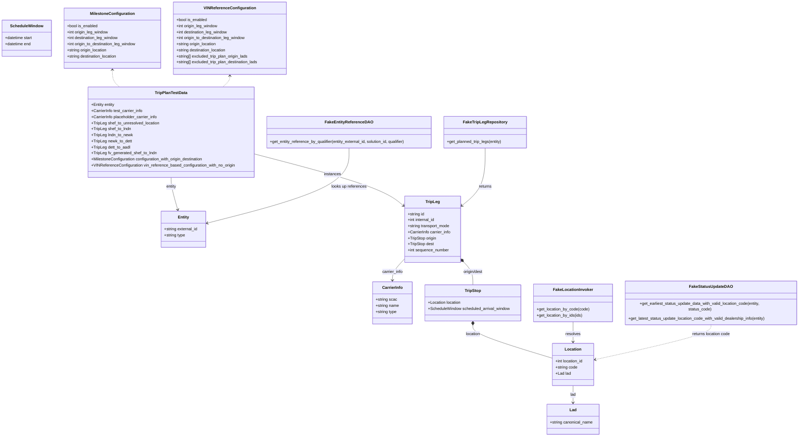
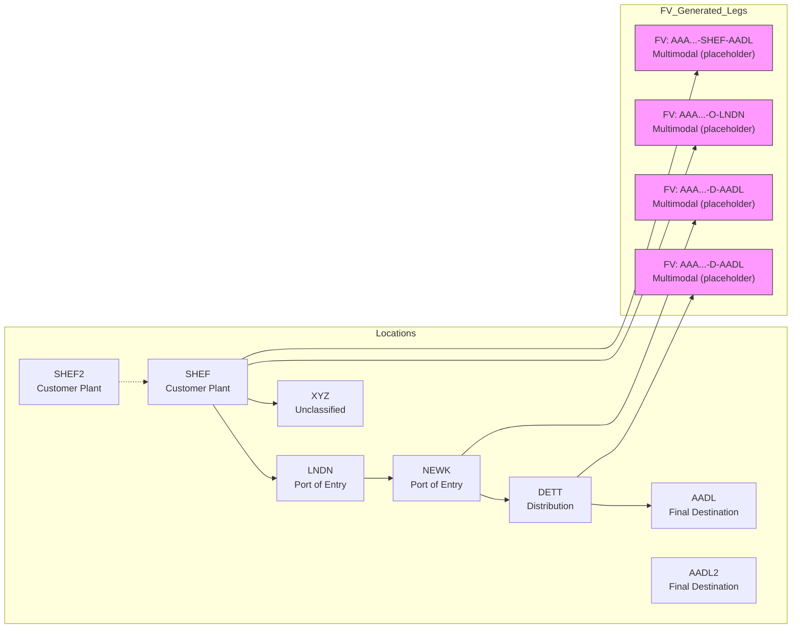

# Diagram: entity_core/entity_service/entity_service_tests/trip_leg_tests/test_augmented_trip_plan/trip_plan_test_data.py

> Auto-generated by Obscura crawlers

## Diagram 1

### SVG

<svg id="container" width="3198.611328125" xmlns="http://www.w3.org/2000/svg" class="classDiagram" height="1730" viewBox="0 0 3198.611328125 1730" role="graphics-document document" aria-roledescription="class"><g><defs><marker id="container_class-aggregationStart" class="marker aggregation class" refX="18" refY="7" markerWidth="190" markerHeight="240" orient="auto"><path d="M 18,7 L9,13 L1,7 L9,1 Z"></path></marker></defs><defs><marker id="container_class-aggregationEnd" class="marker aggregation class" refX="1" refY="7" markerWidth="20" markerHeight="28" orient="auto"><path d="M 18,7 L9,13 L1,7 L9,1 Z"></path></marker></defs><defs><marker id="container_class-extensionStart" class="marker extension class" refX="18" refY="7" markerWidth="190" markerHeight="240" orient="auto"><path d="M 1,7 L18,13 V 1 Z"></path></marker></defs><defs><marker id="container_class-extensionEnd" class="marker extension class" refX="1" refY="7" markerWidth="20" markerHeight="28" orient="auto"><path d="M 1,1 V 13 L18,7 Z"></path></marker></defs><defs><marker id="container_class-compositionStart" class="marker composition class" refX="18" refY="7" markerWidth="190" markerHeight="240" orient="auto"><path d="M 18,7 L9,13 L1,7 L9,1 Z"></path></marker></defs><defs><marker id="container_class-compositionEnd" class="marker composition class" refX="1" refY="7" markerWidth="20" markerHeight="28" orient="auto"><path d="M 18,7 L9,13 L1,7 L9,1 Z"></path></marker></defs><defs><marker id="container_class-dependencyStart" class="marker dependency class" refX="6" refY="7" markerWidth="190" markerHeight="240" orient="auto"><path d="M 5,7 L9,13 L1,7 L9,1 Z"></path></marker></defs><defs><marker id="container_class-dependencyEnd" class="marker dependency class" refX="13" refY="7" markerWidth="20" markerHeight="28" orient="auto"><path d="M 18,7 L9,13 L14,7 L9,1 Z"></path></marker></defs><defs><marker id="container_class-lollipopStart" class="marker lollipop class" refX="13" refY="7" markerWidth="190" markerHeight="240" orient="auto"><circle stroke="black" fill="transparent" cx="7" cy="7" r="6"></circle></marker></defs><defs><marker id="container_class-lollipopEnd" class="marker lollipop class" refX="1" refY="7" markerWidth="190" markerHeight="240" orient="auto"><circle stroke="black" fill="transparent" cx="7" cy="7" r="6"></circle></marker></defs><g class="root"><g class="clusters"></g><g class="edgePaths"><path d="M1861.387,1042.731L1867.445,1049.109C1873.504,1055.488,1885.622,1068.244,1891.681,1082.789C1897.74,1097.333,1897.74,1113.667,1897.74,1121.833L1897.74,1130" id="id_TripLeg_TripStop_1" class="edge-thickness-normal edge-pattern-solid relation" style=";;;" data-edge="true" data-et="edge" data-id="id_TripLeg_TripStop_1" data-points="W3sieCI6MTg0OS41MDU4NTkzNzUsInkiOjEwMzAuMjI0NzQ5OTkzOTE3Mn0seyJ4IjoxODk3Ljc0MDIzNDM3NSwieSI6MTA4MX0seyJ4IjoxODk3Ljc0MDIzNDM3NSwieSI6MTEzMH1d" marker-start="url(#container_class-compositionStart)"></path><path d="M1897.74,1291.25L1897.74,1296.542C1897.74,1301.833,1897.74,1312.417,1949.917,1333.593C2002.094,1354.768,2106.449,1386.537,2158.626,1402.421L2210.803,1418.305" id="id_TripStop_Location_2" class="edge-thickness-normal edge-pattern-solid relation" style=";;;" data-edge="true" data-et="edge" data-id="id_TripStop_Location_2" data-points="W3sieCI6MTg5Ny43NDAyMzQzNzUsInkiOjEyNzR9LHsieCI6MTg5Ny43NDAyMzQzNzUsInkiOjEzMjN9LHsieCI6MjIxMC44MDI3MzQzNzUsInkiOjE0MTguMzA1NDQxNzE1NTYwNn1d" marker-start="url(#container_class-compositionStart)"></path><path d="M2295.205,1528L2295.205,1534.167C2295.205,1540.333,2295.205,1552.667,2295.205,1564C2295.205,1575.333,2295.205,1585.667,2295.205,1590.833L2295.205,1596" id="id_Location_Lad_3" class="edge-thickness-normal edge-pattern-solid relation" style=";;;" data-edge="true" data-et="edge" data-id="id_Location_Lad_3" data-points="W3sieCI6MjI5NS4yMDUwNzgxMjUsInkiOjE1Mjh9LHsieCI6MjI5NS4yMDUwNzgxMjUsInkiOjE1NjV9LHsieCI6MjI5NS4yMDUwNzgxMjUsInkiOjE2MDJ9XQ==" marker-end="url(#container_class-dependencyEnd)"></path><path d="M1624.889,1030.225L1616.85,1038.687C1608.811,1047.15,1592.732,1064.075,1584.693,1077.704C1576.654,1091.333,1576.654,1101.667,1576.654,1106.833L1576.654,1112" id="id_TripLeg_CarrierInfo_4" class="edge-thickness-normal edge-pattern-solid relation" style=";;;" data-edge="true" data-et="edge" data-id="id_TripLeg_CarrierInfo_4" data-points="W3sieCI6MTYyNC44ODg2NzE4NzUsInkiOjEwMzAuMjI0NzQ5OTkzOTE3Mn0seyJ4IjoxNTc2LjY1NDI5Njg3NSwieSI6MTA4MX0seyJ4IjoxNTc2LjY1NDI5Njg3NSwieSI6MTExOH1d" marker-end="url(#container_class-dependencyEnd)"></path><path d="M1018.977,611.686L1103.548,633.571C1188.12,655.457,1357.263,699.229,1457.468,733.648C1557.673,768.068,1588.94,793.136,1604.574,805.67L1620.207,818.204" id="id_TripPlanTestData_TripLeg_5" class="edge-thickness-normal edge-pattern-solid relation" style=";;;" data-edge="true" data-et="edge" data-id="id_TripPlanTestData_TripLeg_5" data-points="W3sieCI6MTAxOC45NzY1NjI1LCJ5Ijo2MTEuNjg1NjEzOTMwNDc4fSx7IngiOjE1MjYuNDA2MjUsInkiOjc0M30seyJ4IjoxNjI0Ljg4ODY3MTg3NSwieSI6ODIxLjk1NzQ4ODk5Njk4ODd9XQ==" marker-end="url(#container_class-dependencyEnd)"></path><path d="M687.867,706L687.867,712.167C687.867,718.333,687.867,730.667,692.389,752.041C696.911,773.416,705.954,803.833,710.476,819.041L714.998,834.249" id="id_TripPlanTestData_Entity_6" class="edge-thickness-normal edge-pattern-solid relation" style=";;;" data-edge="true" data-et="edge" data-id="id_TripPlanTestData_Entity_6" data-points="W3sieCI6Njg3Ljg2NzE4NzUsInkiOjcwNn0seyJ4Ijo2ODcuODY3MTg3NSwieSI6NzQzfSx7IngiOjcxNi43MDc3ODI0NTE5MjMxLCJ5Ijo4NDB9XQ==" marker-end="url(#container_class-dependencyEnd)"></path><path d="M1947.988,589L1947.988,614.667C1947.988,640.333,1947.988,691.667,1932.355,729.867C1916.721,768.068,1885.454,793.136,1869.821,805.67L1854.187,818.204" id="id_FakeTripLegRepository_TripLeg_7" class="edge-thickness-normal edge-pattern-solid relation" style=";;;" data-edge="true" data-et="edge" data-id="id_FakeTripLegRepository_TripLeg_7" data-points="W3sieCI6MTk0Ny45ODgyODEyNSwieSI6NTg5fSx7IngiOjE5NDcuOTg4MjgxMjUsInkiOjc0M30seyJ4IjoxODQ5LjUwNTg1OTM3NSwieSI6ODIxLjk1NzQ4ODk5Njk4ODd9XQ==" marker-end="url(#container_class-dependencyEnd)"></path><path d="M2295.205,1277L2295.205,1284.667C2295.205,1292.333,2295.205,1307.667,2295.205,1320.5C2295.205,1333.333,2295.205,1343.667,2295.205,1348.833L2295.205,1354" id="id_FakeLocationInvoker_Location_8" class="edge-thickness-normal edge-pattern-solid relation" style=";;;" data-edge="true" data-et="edge" data-id="id_FakeLocationInvoker_Location_8" data-points="W3sieCI6MjI5NS4yMDUwNzgxMjUsInkiOjEyNzd9LHsieCI6MjI5NS4yMDUwNzgxMjUsInkiOjEzMjN9LHsieCI6MjI5NS4yMDUwNzgxMjUsInkiOjEzNjB9XQ==" marker-end="url(#container_class-dependencyEnd)"></path><path d="M1401.18,589L1401.18,614.667C1401.18,640.333,1401.18,691.667,1306.715,741.41C1212.25,791.154,1023.32,839.308,928.855,863.385L834.39,887.462" id="id_FakeEntityReferenceDAO_Entity_9" class="edge-thickness-normal edge-pattern-solid relation" style=";;;" data-edge="true" data-et="edge" data-id="id_FakeEntityReferenceDAO_Entity_9" data-points="W3sieCI6MTQwMS4xNzk2ODc1LCJ5Ijo1ODl9LHsieCI6MTQwMS4xNzk2ODc1LCJ5Ijo3NDN9LHsieCI6ODI4LjU3NjE3MTg3NSwieSI6ODg4Ljk0MzU3MTA3Mjk5NX1d" marker-end="url(#container_class-dependencyEnd)"></path><path d="M2845.592,1277L2845.592,1284.667C2845.592,1292.333,2845.592,1307.667,2768.904,1332.193C2692.217,1356.719,2538.842,1390.437,2462.155,1407.297L2385.467,1424.156" id="id_FakeStatusUpdateDAO_Location_10" class="edge-thickness-normal edge-pattern-dashed relation" style=";;;" data-edge="true" data-et="edge" data-id="id_FakeStatusUpdateDAO_Location_10" data-points="W3sieCI6Mjg0NS41OTE3OTY4NzUsInkiOjEyNzd9LHsieCI6Mjg0NS41OTE3OTY4NzUsInkiOjEzMjN9LHsieCI6MjM3OS42MDc0MjE4NzUsInkiOjE0MjUuNDQ0NTMxMTg5MDA3Nn1d" marker-end="url(#container_class-dependencyEnd)"></path><path d="M451.27,278L451.27,285.167C451.27,292.333,451.27,306.667,456.078,318C460.887,329.333,470.505,337.667,475.314,341.833L480.123,346" id="id_MilestoneConfiguration_TripPlanTestData_11" class="edge-thickness-normal edge-pattern-dashed relation" style=";;;" data-edge="true" data-et="edge" data-id="id_MilestoneConfiguration_TripPlanTestData_11" data-points="W3sieCI6NDUxLjI2OTUzMTI1LCJ5IjoyNzJ9LHsieCI6NDUxLjI2OTUzMTI1LCJ5IjozMjF9LHsieCI6NDgwLjEyMjkwMzk2MzQxNDYsInkiOjM0Nn1d" marker-start="url(#container_class-dependencyStart)"></path><path d="M924.465,302L924.465,305.167C924.465,308.333,924.465,314.667,919.656,322C914.847,329.333,905.229,337.667,900.42,341.833L895.611,346" id="id_VINReferenceConfiguration_TripPlanTestData_12" class="edge-thickness-normal edge-pattern-dashed relation" style=";;;" data-edge="true" data-et="edge" data-id="id_VINReferenceConfiguration_TripPlanTestData_12" data-points="W3sieCI6OTI0LjQ2NDg0Mzc1LCJ5IjoyOTZ9LHsieCI6OTI0LjQ2NDg0Mzc1LCJ5IjozMjF9LHsieCI6ODk1LjYxMTQ3MTAzNjU4NTQsInkiOjM0Nn1d" marker-start="url(#container_class-dependencyStart)"></path></g><g class="edgeLabels"><g class="edgeLabel" transform="translate(1897.740234375, 1081)"><g class="label" data-id="id_TripLeg_TripStop_1" transform="translate(-40.6484375, -12)"><foreignObject width="81.296875" height="24">

origin/dest

</foreignObject></g></g><g class="edgeLabel" transform="translate(1897.740234375, 1323)"><g class="label" data-id="id_TripStop_Location_2" transform="translate(-29.578125, -12)"><foreignObject width="59.15625" height="24">

location

</foreignObject></g></g><g class="edgeLabel" transform="translate(2295.205078125, 1565)"><g class="label" data-id="id_Location_Lad_3" transform="translate(-11.4453125, -12)"><foreignObject width="22.890625" height="24">

lad

</foreignObject></g></g><g class="edgeLabel" transform="translate(1576.654296875, 1081)"><g class="label" data-id="id_TripLeg_CarrierInfo_4" transform="translate(-41.71875, -12)"><foreignObject width="83.4375" height="24">

carrier_info

</foreignObject></g></g><g class="edgeLabel" transform="translate(1333.79178, 693.15457)"><g class="label" data-id="id_TripPlanTestData_TripLeg_5" transform="translate(-34.3125, -12)"><foreignObject width="68.625" height="24">

instances

</foreignObject></g></g><g class="edgeLabel" transform="translate(687.8671875, 743)"><g class="label" data-id="id_TripPlanTestData_Entity_6" transform="translate(-20.9765625, -12)"><foreignObject width="41.953125" height="24">

entity

</foreignObject></g></g><g class="edgeLabel" transform="translate(1947.98828125, 743)"><g class="label" data-id="id_FakeTripLegRepository_TripLeg_7" transform="translate(-26.265625, -12)"><foreignObject width="52.53125" height="24">

returns

</foreignObject></g></g><g class="edgeLabel" transform="translate(2295.205078125, 1323)"><g class="label" data-id="id_FakeLocationInvoker_Location_8" transform="translate(-29.8828125, -12)"><foreignObject width="59.765625" height="24">

resolves

</foreignObject></g></g><g class="edgeLabel" transform="translate(1401.1796875, 743)"><g class="label" data-id="id_FakeEntityReferenceDAO_Entity_9" transform="translate(-70.9140625, -12)"><foreignObject width="141.828125" height="24">

looks up references

</foreignObject></g></g><g class="edgeLabel" transform="translate(2845.591796875, 1323)"><g class="label" data-id="id_FakeStatusUpdateDAO_Location_10" transform="translate(-77.5625, -12)"><foreignObject width="155.125" height="24">

returns location code

</foreignObject></g></g><g class="edgeLabel"><g class="label" data-id="id_MilestoneConfiguration_TripPlanTestData_11" transform="translate(0, 0)"><foreignObject width="0" height="0">

</foreignObject></g></g><g class="edgeLabel"><g class="label" data-id="id_VINReferenceConfiguration_TripPlanTestData_12" transform="translate(0, 0)"><foreignObject width="0" height="0">

</foreignObject></g></g></g><g class="nodes"><g class="node default" id="classId-Entity-0" transform="translate(738.115234375, 912)"><g class="basic label-container"><path d="M-90.4609375 -72 L90.4609375 -72 L90.4609375 72 L-90.4609375 72" stroke="none" stroke-width="0" fill="#ECECFF" style=""></path><path d="M-90.4609375 -72 C-50.25699600123928 -72, -10.05305450247856 -72, 90.4609375 -72 M-90.4609375 -72 C-28.38765376559916 -72, 33.68562996880168 -72, 90.4609375 -72 M90.4609375 -72 C90.4609375 -18.300167609251922, 90.4609375 35.399664781496156, 90.4609375 72 M90.4609375 -72 C90.4609375 -23.06045820055992, 90.4609375 25.879083598880158, 90.4609375 72 M90.4609375 72 C35.28015127557095 72, -19.900634948858098 72, -90.4609375 72 M90.4609375 72 C49.018630280147235 72, 7.57632306029447 72, -90.4609375 72 M-90.4609375 72 C-90.4609375 21.86985002641174, -90.4609375 -28.26029994717652, -90.4609375 -72 M-90.4609375 72 C-90.4609375 25.063163446301232, -90.4609375 -21.873673107397536, -90.4609375 -72" stroke="#9370DB" stroke-width="1.3" fill="none" stroke-dasharray="0 0" style=""></path></g><g class="annotation-group text" transform="translate(0, -48)"></g><g class="label-group text" transform="translate(-21.28125, -48)"><g class="label" style="font-weight: bolder" transform="translate(0,-12)"><foreignObject width="42.5625" height="24">

Entity

</foreignObject></g></g><g class="members-group text" transform="translate(-78.4609375, 0)"><g class="label" style="" transform="translate(0,-12)"><foreignObject width="135.640625" height="24">

+string external_id

</foreignObject></g><g class="label" style="" transform="translate(0,12)"><foreignObject width="85.65625" height="24">

+string type

</foreignObject></g></g><g class="methods-group text" transform="translate(-78.4609375, 72)"></g><g class="divider" style=""><path d="M-90.4609375 -24 C-22.523972218981925 -24, 45.41299306203615 -24, 90.4609375 -24 M-90.4609375 -24 C-48.56359109843806 -24, -6.66624469687612 -24, 90.4609375 -24" stroke="#9370DB" stroke-width="1.3" fill="none" stroke-dasharray="0 0" style=""></path></g><g class="divider" style=""><path d="M-90.4609375 48 C-34.84810518216596 48, 20.764727135668082 48, 90.4609375 48 M-90.4609375 48 C-37.62096858516689 48, 15.219000329666216 48, 90.4609375 48" stroke="#9370DB" stroke-width="1.3" fill="none" stroke-dasharray="0 0" style=""></path></g></g><g class="node default" id="classId-CarrierInfo-1" transform="translate(1576.654296875, 1202)"><g class="basic label-container"><path d="M-78.98828125 -84 L78.98828125 -84 L78.98828125 84 L-78.98828125 84" stroke="none" stroke-width="0" fill="#ECECFF" style=""></path><path d="M-78.98828125 -84 C-37.33339805260741 -84, 4.321485144785186 -84, 78.98828125 -84 M-78.98828125 -84 C-19.31220809178356 -84, 40.36386506643288 -84, 78.98828125 -84 M78.98828125 -84 C78.98828125 -23.522640539131665, 78.98828125 36.95471892173667, 78.98828125 84 M78.98828125 -84 C78.98828125 -37.445663110765935, 78.98828125 9.10867377846813, 78.98828125 84 M78.98828125 84 C40.56789532114138 84, 2.147509392282757 84, -78.98828125 84 M78.98828125 84 C33.92677869096218 84, -11.134723868075639 84, -78.98828125 84 M-78.98828125 84 C-78.98828125 43.52444562459928, -78.98828125 3.0488912491985616, -78.98828125 -84 M-78.98828125 84 C-78.98828125 33.462242528819274, -78.98828125 -17.07551494236145, -78.98828125 -84" stroke="#9370DB" stroke-width="1.3" fill="none" stroke-dasharray="0 0" style=""></path></g><g class="annotation-group text" transform="translate(0, -60)"></g><g class="label-group text" transform="translate(-39.6015625, -60)"><g class="label" style="font-weight: bolder" transform="translate(0,-12)"><foreignObject width="79.203125" height="24">

CarrierInfo

</foreignObject></g></g><g class="members-group text" transform="translate(-66.98828125, -12)"><g class="label" style="" transform="translate(0,-12)"><foreignObject width="85.171875" height="24">

+string scac

</foreignObject></g><g class="label" style="" transform="translate(0,12)"><foreignObject width="94.375" height="24">

+string name

</foreignObject></g><g class="label" style="" transform="translate(0,36)"><foreignObject width="85.65625" height="24">

+string type

</foreignObject></g></g><g class="methods-group text" transform="translate(-66.98828125, 84)"></g><g class="divider" style=""><path d="M-78.98828125 -36 C-20.054119513771234 -36, 38.88004222245753 -36, 78.98828125 -36 M-78.98828125 -36 C-20.485619150632516 -36, 38.01704294873497 -36, 78.98828125 -36" stroke="#9370DB" stroke-width="1.3" fill="none" stroke-dasharray="0 0" style=""></path></g><g class="divider" style=""><path d="M-78.98828125 60 C-21.850323905157417 60, 35.287633439685166 60, 78.98828125 60 M-78.98828125 60 C-16.60840265530411 60, 45.77147593939178 60, 78.98828125 60" stroke="#9370DB" stroke-width="1.3" fill="none" stroke-dasharray="0 0" style=""></path></g></g><g class="node default" id="classId-Lad-2" transform="translate(2295.205078125, 1662)"><g class="basic label-container"><path d="M-104.71484375 -60 L104.71484375 -60 L104.71484375 60 L-104.71484375 60" stroke="none" stroke-width="0" fill="#ECECFF" style=""></path><path d="M-104.71484375 -60 C-54.28086871359815 -60, -3.846893677196306 -60, 104.71484375 -60 M-104.71484375 -60 C-27.51840957637657 -60, 49.67802459724686 -60, 104.71484375 -60 M104.71484375 -60 C104.71484375 -19.928902374180538, 104.71484375 20.142195251638924, 104.71484375 60 M104.71484375 -60 C104.71484375 -32.2031173633918, 104.71484375 -4.4062347267835875, 104.71484375 60 M104.71484375 60 C44.99150685146042 60, -14.731830047079157 60, -104.71484375 60 M104.71484375 60 C48.10668605603645 60, -8.501471637927096 60, -104.71484375 60 M-104.71484375 60 C-104.71484375 29.021298878206238, -104.71484375 -1.9574022435875236, -104.71484375 -60 M-104.71484375 60 C-104.71484375 26.714299403755142, -104.71484375 -6.571401192489716, -104.71484375 -60" stroke="#9370DB" stroke-width="1.3" fill="none" stroke-dasharray="0 0" style=""></path></g><g class="annotation-group text" transform="translate(0, -36)"></g><g class="label-group text" transform="translate(-13.2109375, -36)"><g class="label" style="font-weight: bolder" transform="translate(0,-12)"><foreignObject width="26.421875" height="24">

Lad

</foreignObject></g></g><g class="members-group text" transform="translate(-92.71484375, 12)"><g class="label" style="" transform="translate(0,-12)"><foreignObject width="172.21875" height="24">

+string canonical_name

</foreignObject></g></g><g class="methods-group text" transform="translate(-92.71484375, 60)"></g><g class="divider" style=""><path d="M-104.71484375 -12 C-24.36141602890116 -12, 55.99201169219768 -12, 104.71484375 -12 M-104.71484375 -12 C-31.95310340266964 -12, 40.80863694466072 -12, 104.71484375 -12" stroke="#9370DB" stroke-width="1.3" fill="none" stroke-dasharray="0 0" style=""></path></g><g class="divider" style=""><path d="M-104.71484375 36 C-33.38043957550816 36, 37.953964598983674 36, 104.71484375 36 M-104.71484375 36 C-22.685165532774448 36, 59.344512684451104 36, 104.71484375 36" stroke="#9370DB" stroke-width="1.3" fill="none" stroke-dasharray="0 0" style=""></path></g></g><g class="node default" id="classId-Location-3" transform="translate(2295.205078125, 1444)"><g class="basic label-container"><path d="M-84.40234375 -84 L84.40234375 -84 L84.40234375 84 L-84.40234375 84" stroke="none" stroke-width="0" fill="#ECECFF" style=""></path><path d="M-84.40234375 -84 C-44.0902535878773 -84, -3.778163425754599 -84, 84.40234375 -84 M-84.40234375 -84 C-40.62027756080344 -84, 3.1617886283931256 -84, 84.40234375 -84 M84.40234375 -84 C84.40234375 -25.87574162316548, 84.40234375 32.24851675366904, 84.40234375 84 M84.40234375 -84 C84.40234375 -27.575846175631384, 84.40234375 28.848307648737233, 84.40234375 84 M84.40234375 84 C49.84906297538698 84, 15.295782200773957 84, -84.40234375 84 M84.40234375 84 C41.052556674162965 84, -2.2972304016740708 84, -84.40234375 84 M-84.40234375 84 C-84.40234375 28.467353990656676, -84.40234375 -27.065292018686648, -84.40234375 -84 M-84.40234375 84 C-84.40234375 47.22969846419684, -84.40234375 10.459396928393673, -84.40234375 -84" stroke="#9370DB" stroke-width="1.3" fill="none" stroke-dasharray="0 0" style=""></path></g><g class="annotation-group text" transform="translate(0, -60)"></g><g class="label-group text" transform="translate(-31.3515625, -60)"><g class="label" style="font-weight: bolder" transform="translate(0,-12)"><foreignObject width="62.703125" height="24">

Location

</foreignObject></g></g><g class="members-group text" transform="translate(-72.40234375, -12)"><g class="label" style="" transform="translate(0,-12)"><foreignObject width="113.453125" height="24">

+int location_id

</foreignObject></g><g class="label" style="" transform="translate(0,12)"><foreignObject width="88.828125" height="24">

+string code

</foreignObject></g><g class="label" style="" transform="translate(0,36)"><foreignObject width="61.1875" height="24">

+Lad lad

</foreignObject></g></g><g class="methods-group text" transform="translate(-72.40234375, 84)"></g><g class="divider" style=""><path d="M-84.40234375 -36 C-33.56264377309664 -36, 17.277056203806723 -36, 84.40234375 -36 M-84.40234375 -36 C-41.856330352490424 -36, 0.6896830450191516 -36, 84.40234375 -36" stroke="#9370DB" stroke-width="1.3" fill="none" stroke-dasharray="0 0" style=""></path></g><g class="divider" style=""><path d="M-84.40234375 60 C-22.828842661475413 60, 38.744658427049174 60, 84.40234375 60 M-84.40234375 60 C-48.44119657682105 60, -12.480049403642099 60, 84.40234375 60" stroke="#9370DB" stroke-width="1.3" fill="none" stroke-dasharray="0 0" style=""></path></g></g><g class="node default" id="classId-ScheduleWindow-4" transform="translate(106.9765625, 152)"><g class="basic label-container"><path d="M-98.9765625 -72 L98.9765625 -72 L98.9765625 72 L-98.9765625 72" stroke="none" stroke-width="0" fill="#ECECFF" style=""></path><path d="M-98.9765625 -72 C-30.12667478740927 -72, 38.72321292518146 -72, 98.9765625 -72 M-98.9765625 -72 C-40.59700974934567 -72, 17.782543001308653 -72, 98.9765625 -72 M98.9765625 -72 C98.9765625 -31.3957932633946, 98.9765625 9.208413473210797, 98.9765625 72 M98.9765625 -72 C98.9765625 -30.208264476348575, 98.9765625 11.58347104730285, 98.9765625 72 M98.9765625 72 C48.028720847981255 72, -2.9191208040374903 72, -98.9765625 72 M98.9765625 72 C58.01423496388803 72, 17.051907427776058 72, -98.9765625 72 M-98.9765625 72 C-98.9765625 17.482024662574105, -98.9765625 -37.03595067485179, -98.9765625 -72 M-98.9765625 72 C-98.9765625 39.426121968666294, -98.9765625 6.852243937332588, -98.9765625 -72" stroke="#9370DB" stroke-width="1.3" fill="none" stroke-dasharray="0 0" style=""></path></g><g class="annotation-group text" transform="translate(0, -48)"></g><g class="label-group text" transform="translate(-62.6875, -48)"><g class="label" style="font-weight: bolder" transform="translate(0,-12)"><foreignObject width="125.375" height="24">

ScheduleWindow

</foreignObject></g></g><g class="members-group text" transform="translate(-86.9765625, 0)"><g class="label" style="" transform="translate(0,-12)"><foreignObject width="111.265625" height="24">

+datetime start

</foreignObject></g><g class="label" style="" transform="translate(0,12)"><foreignObject width="105.140625" height="24">

+datetime end

</foreignObject></g></g><g class="methods-group text" transform="translate(-86.9765625, 72)"></g><g class="divider" style=""><path d="M-98.9765625 -24 C-46.204344946194944 -24, 6.567872607610113 -24, 98.9765625 -24 M-98.9765625 -24 C-44.03002164180516 -24, 10.916519216389673 -24, 98.9765625 -24" stroke="#9370DB" stroke-width="1.3" fill="none" stroke-dasharray="0 0" style=""></path></g><g class="divider" style=""><path d="M-98.9765625 48 C-28.835541862539742 48, 41.305478774920516 48, 98.9765625 48 M-98.9765625 48 C-45.31147154083481 48, 8.353619418330382 48, 98.9765625 48" stroke="#9370DB" stroke-width="1.3" fill="none" stroke-dasharray="0 0" style=""></path></g></g><g class="node default" id="classId-TripStop-5" transform="translate(1897.740234375, 1202)"><g class="basic label-container"><path d="M-192.09765625 -72 L192.09765625 -72 L192.09765625 72 L-192.09765625 72" stroke="none" stroke-width="0" fill="#ECECFF" style=""></path><path d="M-192.09765625 -72 C-57.81518198134549 -72, 76.46729228730902 -72, 192.09765625 -72 M-192.09765625 -72 C-41.89491427897468 -72, 108.30782769205064 -72, 192.09765625 -72 M192.09765625 -72 C192.09765625 -32.447195045056034, 192.09765625 7.1056099098879315, 192.09765625 72 M192.09765625 -72 C192.09765625 -29.87450002016768, 192.09765625 12.25099995966464, 192.09765625 72 M192.09765625 72 C104.13331889661566 72, 16.168981543231325 72, -192.09765625 72 M192.09765625 72 C49.71989070718996 72, -92.65787483562008 72, -192.09765625 72 M-192.09765625 72 C-192.09765625 18.826508561854567, -192.09765625 -34.346982876290866, -192.09765625 -72 M-192.09765625 72 C-192.09765625 41.71211642125691, -192.09765625 11.424232842513824, -192.09765625 -72" stroke="#9370DB" stroke-width="1.3" fill="none" stroke-dasharray="0 0" style=""></path></g><g class="annotation-group text" transform="translate(0, -48)"></g><g class="label-group text" transform="translate(-31.2890625, -48)"><g class="label" style="font-weight: bolder" transform="translate(0,-12)"><foreignObject width="62.578125" height="24">

TripStop

</foreignObject></g></g><g class="members-group text" transform="translate(-180.09765625, 0)"><g class="label" style="" transform="translate(0,-12)"><foreignObject width="133.5" height="24">

+Location location

</foreignObject></g><g class="label" style="" transform="translate(0,12)"><foreignObject width="328.90625" height="24">

+ScheduleWindow scheduled_arrival_window

</foreignObject></g></g><g class="methods-group text" transform="translate(-180.09765625, 72)"></g><g class="divider" style=""><path d="M-192.09765625 -24 C-96.70077718491748 -24, -1.3038981198349688 -24, 192.09765625 -24 M-192.09765625 -24 C-66.76532549616134 -24, 58.56700525767732 -24, 192.09765625 -24" stroke="#9370DB" stroke-width="1.3" fill="none" stroke-dasharray="0 0" style=""></path></g><g class="divider" style=""><path d="M-192.09765625 48 C-75.35448202436868 48, 41.38869220126264 48, 192.09765625 48 M-192.09765625 48 C-70.25149300916708 48, 51.594670231665845 48, 192.09765625 48" stroke="#9370DB" stroke-width="1.3" fill="none" stroke-dasharray="0 0" style=""></path></g></g><g class="node default" id="classId-TripLeg-6" transform="translate(1737.197265625, 912)"><g class="basic label-container"><path d="M-112.30859375 -132 L112.30859375 -132 L112.30859375 132 L-112.30859375 132" stroke="none" stroke-width="0" fill="#ECECFF" style=""></path><path d="M-112.30859375 -132 C-56.82052205132453 -132, -1.3324503526490616 -132, 112.30859375 -132 M-112.30859375 -132 C-60.33557243776966 -132, -8.362551125539326 -132, 112.30859375 -132 M112.30859375 -132 C112.30859375 -32.72321875320189, 112.30859375 66.55356249359622, 112.30859375 132 M112.30859375 -132 C112.30859375 -70.28400007164291, 112.30859375 -8.568000143285815, 112.30859375 132 M112.30859375 132 C25.144790397449498 132, -62.019012955101005 132, -112.30859375 132 M112.30859375 132 C39.863030101549214 132, -32.58253354690157 132, -112.30859375 132 M-112.30859375 132 C-112.30859375 66.12039989347747, -112.30859375 0.24079978695493764, -112.30859375 -132 M-112.30859375 132 C-112.30859375 46.40567702017556, -112.30859375 -39.18864595964888, -112.30859375 -132" stroke="#9370DB" stroke-width="1.3" fill="none" stroke-dasharray="0 0" style=""></path></g><g class="annotation-group text" transform="translate(0, -108)"></g><g class="label-group text" transform="translate(-27.0546875, -108)"><g class="label" style="font-weight: bolder" transform="translate(0,-12)"><foreignObject width="54.109375" height="24">

TripLeg

</foreignObject></g></g><g class="members-group text" transform="translate(-100.30859375, -60)"><g class="label" style="" transform="translate(0,-12)"><foreignObject width="67.9375" height="24">

+string id

</foreignObject></g><g class="label" style="" transform="translate(0,12)"><foreignObject width="111.21875" height="24">

+int internal_id

</foreignObject></g><g class="label" style="" transform="translate(0,36)"><foreignObject width="171.265625" height="24">

+string transport_mode

</foreignObject></g><g class="label" style="" transform="translate(0,60)"><foreignObject width="173.5625" height="24">

+CarrierInfo carrier_info

</foreignObject></g><g class="label" style="" transform="translate(0,84)"><foreignObject width="114.765625" height="24">

+TripStop origin

</foreignObject></g><g class="label" style="" transform="translate(0,108)"><foreignObject width="104.0625" height="24">

+TripStop dest

</foreignObject></g><g class="label" style="" transform="translate(0,132)"><foreignObject width="165.90625" height="24">

+int sequence_number

</foreignObject></g></g><g class="methods-group text" transform="translate(-100.30859375, 132)"></g><g class="divider" style=""><path d="M-112.30859375 -84 C-34.719338708396336 -84, 42.86991633320733 -84, 112.30859375 -84 M-112.30859375 -84 C-63.372665765113005 -84, -14.43673778022601 -84, 112.30859375 -84" stroke="#9370DB" stroke-width="1.3" fill="none" stroke-dasharray="0 0" style=""></path></g><g class="divider" style=""><path d="M-112.30859375 108 C-62.444203437111796 108, -12.579813124223591 108, 112.30859375 108 M-112.30859375 108 C-65.66213170786813 108, -19.01566966573627 108, 112.30859375 108" stroke="#9370DB" stroke-width="1.3" fill="none" stroke-dasharray="0 0" style=""></path></g></g><g class="node default" id="classId-MilestoneConfiguration-7" transform="translate(451.26953125, 152)"><g class="basic label-container"><path d="M-195.31640625 -120 L195.31640625 -120 L195.31640625 120 L-195.31640625 120" stroke="none" stroke-width="0" fill="#ECECFF" style=""></path><path d="M-195.31640625 -120 C-80.57118486001951 -120, 34.17403652996097 -120, 195.31640625 -120 M-195.31640625 -120 C-68.53250836008623 -120, 58.25138952982755 -120, 195.31640625 -120 M195.31640625 -120 C195.31640625 -37.7431603329527, 195.31640625 44.513679334094604, 195.31640625 120 M195.31640625 -120 C195.31640625 -46.8936707805736, 195.31640625 26.2126584388528, 195.31640625 120 M195.31640625 120 C82.86478094043042 120, -29.586844369139158 120, -195.31640625 120 M195.31640625 120 C65.13131382166804 120, -65.05377860666391 120, -195.31640625 120 M-195.31640625 120 C-195.31640625 67.51274920867067, -195.31640625 15.025498417341325, -195.31640625 -120 M-195.31640625 120 C-195.31640625 25.516941881349467, -195.31640625 -68.96611623730107, -195.31640625 -120" stroke="#9370DB" stroke-width="1.3" fill="none" stroke-dasharray="0 0" style=""></path></g><g class="annotation-group text" transform="translate(0, -96)"></g><g class="label-group text" transform="translate(-85.1796875, -96)"><g class="label" style="font-weight: bolder" transform="translate(0,-12)"><foreignObject width="170.359375" height="24">

MilestoneConfiguration

</foreignObject></g></g><g class="members-group text" transform="translate(-183.31640625, -48)"><g class="label" style="" transform="translate(0,-12)"><foreignObject width="123.96875" height="24">

+bool is_enabled

</foreignObject></g><g class="label" style="" transform="translate(0,12)"><foreignObject width="167.75" height="24">

+int origin_leg_window

</foreignObject></g><g class="label" style="" transform="translate(0,36)"><foreignObject width="208.640625" height="24">

+int destination_leg_window

</foreignObject></g><g class="label" style="" transform="translate(0,60)"><foreignObject width="281.453125" height="24">

+int origin_to_destination_leg_window

</foreignObject></g><g class="label" style="" transform="translate(0,84)"><foreignObject width="163.421875" height="24">

+string origin_location

</foreignObject></g><g class="label" style="" transform="translate(0,108)"><foreignObject width="204.3125" height="24">

+string destination_location

</foreignObject></g></g><g class="methods-group text" transform="translate(-183.31640625, 120)"></g><g class="divider" style=""><path d="M-195.31640625 -72 C-88.32995583289093 -72, 18.656494584218137 -72, 195.31640625 -72 M-195.31640625 -72 C-75.75965353442677 -72, 43.79709918114645 -72, 195.31640625 -72" stroke="#9370DB" stroke-width="1.3" fill="none" stroke-dasharray="0 0" style=""></path></g><g class="divider" style=""><path d="M-195.31640625 96 C-69.74249493710829 96, 55.83141637578342 96, 195.31640625 96 M-195.31640625 96 C-113.61938228331611 96, -31.922358316632227 96, 195.31640625 96" stroke="#9370DB" stroke-width="1.3" fill="none" stroke-dasharray="0 0" style=""></path></g></g><g class="node default" id="classId-VINReferenceConfiguration-8" transform="translate(924.46484375, 152)"><g class="basic label-container"><path d="M-227.87890625 -144 L227.87890625 -144 L227.87890625 144 L-227.87890625 144" stroke="none" stroke-width="0" fill="#ECECFF" style=""></path><path d="M-227.87890625 -144 C-48.4913151523827 -144, 130.8962759452346 -144, 227.87890625 -144 M-227.87890625 -144 C-106.00185251484068 -144, 15.875201220318644 -144, 227.87890625 -144 M227.87890625 -144 C227.87890625 -72.30055048649484, 227.87890625 -0.6011009729896841, 227.87890625 144 M227.87890625 -144 C227.87890625 -46.86593998653552, 227.87890625 50.268120026928955, 227.87890625 144 M227.87890625 144 C57.11257178720223 144, -113.65376267559554 144, -227.87890625 144 M227.87890625 144 C82.47145800510674 144, -62.93599023978652 144, -227.87890625 144 M-227.87890625 144 C-227.87890625 66.76549876172184, -227.87890625 -10.469002476556312, -227.87890625 -144 M-227.87890625 144 C-227.87890625 69.27226025693577, -227.87890625 -5.455479486128468, -227.87890625 -144" stroke="#9370DB" stroke-width="1.3" fill="none" stroke-dasharray="0 0" style=""></path></g><g class="annotation-group text" transform="translate(0, -120)"></g><g class="label-group text" transform="translate(-98.0859375, -120)"><g class="label" style="font-weight: bolder" transform="translate(0,-12)"><foreignObject width="196.171875" height="24">

VINReferenceConfiguration

</foreignObject></g></g><g class="members-group text" transform="translate(-215.87890625, -72)"><g class="label" style="" transform="translate(0,-12)"><foreignObject width="123.96875" height="24">

+bool is_enabled

</foreignObject></g><g class="label" style="" transform="translate(0,12)"><foreignObject width="167.75" height="24">

+int origin_leg_window

</foreignObject></g><g class="label" style="" transform="translate(0,36)"><foreignObject width="208.640625" height="24">

+int destination_leg_window

</foreignObject></g><g class="label" style="" transform="translate(0,60)"><foreignObject width="281.453125" height="24">

+int origin_to_destination_leg_window

</foreignObject></g><g class="label" style="" transform="translate(0,84)"><foreignObject width="163.421875" height="24">

+string origin_location

</foreignObject></g><g class="label" style="" transform="translate(0,108)"><foreignObject width="204.3125" height="24">

+string destination_location

</foreignObject></g><g class="label" style="" transform="translate(0,132)"><foreignObject width="292.78125" height="24">

+string[] excluded_trip_plan_origin_lads

</foreignObject></g><g class="label" style="" transform="translate(0,156)"><foreignObject width="333.671875" height="24">

+string[] excluded_trip_plan_destination_lads

</foreignObject></g></g><g class="methods-group text" transform="translate(-215.87890625, 144)"></g><g class="divider" style=""><path d="M-227.87890625 -96 C-74.17781489414938 -96, 79.52327646170124 -96, 227.87890625 -96 M-227.87890625 -96 C-125.90558000845516 -96, -23.93225376691032 -96, 227.87890625 -96" stroke="#9370DB" stroke-width="1.3" fill="none" stroke-dasharray="0 0" style=""></path></g><g class="divider" style=""><path d="M-227.87890625 120 C-108.31349763697325 120, 11.251910976053495 120, 227.87890625 120 M-227.87890625 120 C-47.71456881455953 120, 132.44976862088095 120, 227.87890625 120" stroke="#9370DB" stroke-width="1.3" fill="none" stroke-dasharray="0 0" style=""></path></g></g><g class="node default" id="classId-TripPlanTestData-9" transform="translate(687.8671875, 526)"><g class="basic label-container"><path d="M-331.109375 -180 L331.109375 -180 L331.109375 180 L-331.109375 180" stroke="none" stroke-width="0" fill="#ECECFF" style=""></path><path d="M-331.109375 -180 C-152.34104338863526 -180, 26.427288222729487 -180, 331.109375 -180 M-331.109375 -180 C-119.74460575178927 -180, 91.62016349642147 -180, 331.109375 -180 M331.109375 -180 C331.109375 -64.37391406465477, 331.109375 51.25217187069046, 331.109375 180 M331.109375 -180 C331.109375 -104.64086971910145, 331.109375 -29.28173943820289, 331.109375 180 M331.109375 180 C80.56930172905217 180, -169.97077154189566 180, -331.109375 180 M331.109375 180 C180.18284351830079 180, 29.25631203660157 180, -331.109375 180 M-331.109375 180 C-331.109375 78.18667789320317, -331.109375 -23.626644213593664, -331.109375 -180 M-331.109375 180 C-331.109375 70.5997133217343, -331.109375 -38.8005733565314, -331.109375 -180" stroke="#9370DB" stroke-width="1.3" fill="none" stroke-dasharray="0 0" style=""></path></g><g class="annotation-group text" transform="translate(0, -156)"></g><g class="label-group text" transform="translate(-62.515625, -156)"><g class="label" style="font-weight: bolder" transform="translate(0,-12)"><foreignObject width="125.03125" height="24">

TripPlanTestData

</foreignObject></g></g><g class="members-group text" transform="translate(-319.109375, -108)"><g class="label" style="" transform="translate(0,-12)"><foreignObject width="95.8125" height="24">

+Entity entity

</foreignObject></g><g class="label" style="" transform="translate(0,12)"><foreignObject width="209.0625" height="24">

+CarrierInfo test_carrier_info

</foreignObject></g><g class="label" style="" transform="translate(0,36)"><foreignObject width="266.9375" height="24">

+CarrierInfo placeholder_carrier_info

</foreignObject></g><g class="label" style="" transform="translate(0,60)"><foreignObject width="272.890625" height="24">

+TripLeg shef_to_unresolved_location

</foreignObject></g><g class="label" style="" transform="translate(0,84)"><foreignObject width="158.203125" height="24">

+TripLeg shef_to_lndn

</foreignObject></g><g class="label" style="" transform="translate(0,108)"><foreignObject width="165.671875" height="24">

+TripLeg lndn_to_newk

</foreignObject></g><g class="label" style="" transform="translate(0,132)"><foreignObject width="162.1875" height="24">

+TripLeg newk_to_dett

</foreignObject></g><g class="label" style="" transform="translate(0,156)"><foreignObject width="156.015625" height="24">

+TripLeg dett_to_aadl

</foreignObject></g><g class="label" style="" transform="translate(0,180)"><foreignObject width="260.765625" height="24">

+TripLeg fv_generated_shef_to_lndn

</foreignObject></g><g class="label" style="" transform="translate(0,204)"><foreignObject width="456.890625" height="24">

+MilestoneConfiguration configuration_with_origin_destination

</foreignObject></g><g class="label" style="" transform="translate(0,228)"><foreignObject width="575.703125" height="24">

+VINReferenceConfiguration vin_reference_based_configuration_with_no_origin

</foreignObject></g></g><g class="methods-group text" transform="translate(-319.109375, 180)"></g><g class="divider" style=""><path d="M-331.109375 -132 C-148.34034772726653 -132, 34.428679545466935 -132, 331.109375 -132 M-331.109375 -132 C-91.83149542674573 -132, 147.44638414650854 -132, 331.109375 -132" stroke="#9370DB" stroke-width="1.3" fill="none" stroke-dasharray="0 0" style=""></path></g><g class="divider" style=""><path d="M-331.109375 156 C-195.77637505319223 156, -60.44337510638445 156, 331.109375 156 M-331.109375 156 C-72.14346891596051 156, 186.82243716807898 156, 331.109375 156" stroke="#9370DB" stroke-width="1.3" fill="none" stroke-dasharray="0 0" style=""></path></g></g><g class="node default" id="classId-FakeTripLegRepository-10" transform="translate(1947.98828125, 526)"><g class="basic label-container"><path d="M-164.60546875 -63 L164.60546875 -63 L164.60546875 63 L-164.60546875 63" stroke="none" stroke-width="0" fill="#ECECFF" style=""></path><path d="M-164.60546875 -63 C-85.3956664710615 -63, -6.185864192123006 -63, 164.60546875 -63 M-164.60546875 -63 C-49.69892560741877 -63, 65.20761753516246 -63, 164.60546875 -63 M164.60546875 -63 C164.60546875 -33.311283920638296, 164.60546875 -3.6225678412765916, 164.60546875 63 M164.60546875 -63 C164.60546875 -16.79579939133003, 164.60546875 29.408401217339943, 164.60546875 63 M164.60546875 63 C68.97306966974949 63, -26.659329410501016 63, -164.60546875 63 M164.60546875 63 C48.62881211458976 63, -67.34784452082047 63, -164.60546875 63 M-164.60546875 63 C-164.60546875 24.14830518563145, -164.60546875 -14.7033896287371, -164.60546875 -63 M-164.60546875 63 C-164.60546875 21.537286448912305, -164.60546875 -19.92542710217539, -164.60546875 -63" stroke="#9370DB" stroke-width="1.3" fill="none" stroke-dasharray="0 0" style=""></path></g><g class="annotation-group text" transform="translate(0, -39)"></g><g class="label-group text" transform="translate(-83.3515625, -39)"><g class="label" style="font-weight: bolder" transform="translate(0,-12)"><foreignObject width="166.703125" height="24">

FakeTripLegRepository

</foreignObject></g></g><g class="members-group text" transform="translate(-152.60546875, 9)"></g><g class="methods-group text" transform="translate(-152.60546875, 39)"><g class="label" style="" transform="translate(0,-12)"><foreignObject width="221.859375" height="24">

+get_planned_trip_legs(entity)

</foreignObject></g></g><g class="divider" style=""><path d="M-164.60546875 -15 C-63.43324339539011 -15, 37.738981959219785 -15, 164.60546875 -15 M-164.60546875 -15 C-43.442471540893735 -15, 77.72052566821253 -15, 164.60546875 -15" stroke="#9370DB" stroke-width="1.3" fill="none" stroke-dasharray="0 0" style=""></path></g><g class="divider" style=""><path d="M-164.60546875 9 C-75.39202885684202 9, 13.821411036315965 9, 164.60546875 9 M-164.60546875 9 C-40.060214176241345 9, 84.48504039751731 9, 164.60546875 9" stroke="#9370DB" stroke-width="1.3" fill="none" stroke-dasharray="0 0" style=""></path></g></g><g class="node default" id="classId-FakeLocationInvoker-11" transform="translate(2295.205078125, 1202)"><g class="basic label-container"><path d="M-155.3671875 -75 L155.3671875 -75 L155.3671875 75 L-155.3671875 75" stroke="none" stroke-width="0" fill="#ECECFF" style=""></path><path d="M-155.3671875 -75 C-84.63991584051323 -75, -13.912644181026451 -75, 155.3671875 -75 M-155.3671875 -75 C-31.614815637617497 -75, 92.137556224765 -75, 155.3671875 -75 M155.3671875 -75 C155.3671875 -22.15319161892922, 155.3671875 30.69361676214156, 155.3671875 75 M155.3671875 -75 C155.3671875 -16.83135353990547, 155.3671875 41.33729292018906, 155.3671875 75 M155.3671875 75 C65.10819459450379 75, -25.15079831099243 75, -155.3671875 75 M155.3671875 75 C58.60200478122867 75, -38.163177937542656 75, -155.3671875 75 M-155.3671875 75 C-155.3671875 44.902736764201265, -155.3671875 14.80547352840253, -155.3671875 -75 M-155.3671875 75 C-155.3671875 41.46401769355727, -155.3671875 7.928035387114534, -155.3671875 -75" stroke="#9370DB" stroke-width="1.3" fill="none" stroke-dasharray="0 0" style=""></path></g><g class="annotation-group text" transform="translate(0, -51)"></g><g class="label-group text" transform="translate(-75.4375, -51)"><g class="label" style="font-weight: bolder" transform="translate(0,-12)"><foreignObject width="150.875" height="24">

FakeLocationInvoker

</foreignObject></g></g><g class="members-group text" transform="translate(-143.3671875, -3)"></g><g class="methods-group text" transform="translate(-143.3671875, 27)"><g class="label" style="" transform="translate(0,-12)"><foreignObject width="211.296875" height="24">

+get_location_by_code(code)

</foreignObject></g><g class="label" style="" transform="translate(0,12)"><foreignObject width="184.8125" height="24">

+get_location_by_ids(ids)

</foreignObject></g></g><g class="divider" style=""><path d="M-155.3671875 -27 C-56.923452324975656 -27, 41.52028285004869 -27, 155.3671875 -27 M-155.3671875 -27 C-54.18964655405691 -27, 46.987894391886186 -27, 155.3671875 -27" stroke="#9370DB" stroke-width="1.3" fill="none" stroke-dasharray="0 0" style=""></path></g><g class="divider" style=""><path d="M-155.3671875 -3 C-33.56149815787157 -3, 88.24419118425686 -3, 155.3671875 -3 M-155.3671875 -3 C-79.3088519868995 -3, -3.2505164737989958 -3, 155.3671875 -3" stroke="#9370DB" stroke-width="1.3" fill="none" stroke-dasharray="0 0" style=""></path></g></g><g class="node default" id="classId-FakeEntityReferenceDAO-12" transform="translate(1401.1796875, 526)"><g class="basic label-container"><path d="M-332.203125 -63 L332.203125 -63 L332.203125 63 L-332.203125 63" stroke="none" stroke-width="0" fill="#ECECFF" style=""></path><path d="M-332.203125 -63 C-68.02157318395166 -63, 196.15997863209668 -63, 332.203125 -63 M-332.203125 -63 C-127.92914353369645 -63, 76.3448379326071 -63, 332.203125 -63 M332.203125 -63 C332.203125 -28.015072016870306, 332.203125 6.969855966259388, 332.203125 63 M332.203125 -63 C332.203125 -22.037360418734245, 332.203125 18.92527916253151, 332.203125 63 M332.203125 63 C101.97459367260507 63, -128.25393765478987 63, -332.203125 63 M332.203125 63 C176.18834086066315 63, 20.173556721326293 63, -332.203125 63 M-332.203125 63 C-332.203125 30.63193774299077, -332.203125 -1.7361245140184565, -332.203125 -63 M-332.203125 63 C-332.203125 35.10127455344907, -332.203125 7.202549106898147, -332.203125 -63" stroke="#9370DB" stroke-width="1.3" fill="none" stroke-dasharray="0 0" style=""></path></g><g class="annotation-group text" transform="translate(0, -39)"></g><g class="label-group text" transform="translate(-89.609375, -39)"><g class="label" style="font-weight: bolder" transform="translate(0,-12)"><foreignObject width="179.21875" height="24">

FakeEntityReferenceDAO

</foreignObject></g></g><g class="members-group text" transform="translate(-320.203125, 9)"></g><g class="methods-group text" transform="translate(-320.203125, 39)"><g class="label" style="" transform="translate(0,-12)"><foreignObject width="550.796875" height="24">

+get_entity_reference_by_qualifier(entity_external_id, solution_id, qualifier)

</foreignObject></g></g><g class="divider" style=""><path d="M-332.203125 -15 C-165.82127528865303 -15, 0.5605744226939464 -15, 332.203125 -15 M-332.203125 -15 C-125.40240531109637 -15, 81.39831437780725 -15, 332.203125 -15" stroke="#9370DB" stroke-width="1.3" fill="none" stroke-dasharray="0 0" style=""></path></g><g class="divider" style=""><path d="M-332.203125 9 C-177.23084456773847 9, -22.258564135476945 9, 332.203125 9 M-332.203125 9 C-92.55672262345678 9, 147.08967975308644 9, 332.203125 9" stroke="#9370DB" stroke-width="1.3" fill="none" stroke-dasharray="0 0" style=""></path></g></g><g class="node default" id="classId-FakeStatusUpdateDAO-13" transform="translate(2845.591796875, 1202)"><g class="basic label-container"><path d="M-345.01953125 -75 L345.01953125 -75 L345.01953125 75 L-345.01953125 75" stroke="none" stroke-width="0" fill="#ECECFF" style=""></path><path d="M-345.01953125 -75 C-126.30825738170543 -75, 92.40301648658914 -75, 345.01953125 -75 M-345.01953125 -75 C-131.14392097803105 -75, 82.7316892939379 -75, 345.01953125 -75 M345.01953125 -75 C345.01953125 -38.91964132171364, 345.01953125 -2.839282643427282, 345.01953125 75 M345.01953125 -75 C345.01953125 -27.223302329931542, 345.01953125 20.553395340136916, 345.01953125 75 M345.01953125 75 C72.28605969118922 75, -200.44741186762155 75, -345.01953125 75 M345.01953125 75 C206.26599587872303 75, 67.51246050744606 75, -345.01953125 75 M-345.01953125 75 C-345.01953125 44.21317413314469, -345.01953125 13.426348266289374, -345.01953125 -75 M-345.01953125 75 C-345.01953125 35.205317760277616, -345.01953125 -4.589364479444768, -345.01953125 -75" stroke="#9370DB" stroke-width="1.3" fill="none" stroke-dasharray="0 0" style=""></path></g><g class="annotation-group text" transform="translate(0, -51)"></g><g class="label-group text" transform="translate(-81.8359375, -51)"><g class="label" style="font-weight: bolder" transform="translate(0,-12)"><foreignObject width="163.671875" height="24">

FakeStatusUpdateDAO

</foreignObject></g></g><g class="members-group text" transform="translate(-333.01953125, -3)"></g><g class="methods-group text" transform="translate(-333.01953125, 27)"><g class="label" style="" transform="translate(0,-12)"><foreignObject width="584.203125" height="24">

+get_earliest_status_update_data_with_valid_location_code(entity, status_code)

</foreignObject></g><g class="label" style="" transform="translate(0,12)"><foreignObject width="556.359375" height="24">

+get_latest_status_update_location_code_with_valid_dealership_info(entity)

</foreignObject></g></g><g class="divider" style=""><path d="M-345.01953125 -27 C-198.49139643152273 -27, -51.96326161304546 -27, 345.01953125 -27 M-345.01953125 -27 C-77.04316666777589 -27, 190.93319791444821 -27, 345.01953125 -27" stroke="#9370DB" stroke-width="1.3" fill="none" stroke-dasharray="0 0" style=""></path></g><g class="divider" style=""><path d="M-345.01953125 -3 C-126.7670282392173 -3, 91.4854747715654 -3, 345.01953125 -3 M-345.01953125 -3 C-76.51772369796487 -3, 191.98408385407026 -3, 345.01953125 -3" stroke="#9370DB" stroke-width="1.3" fill="none" stroke-dasharray="0 0" style=""></path></g></g></g></g></g></svg>

## Diagram 2

### SVG

<svg id="container" width="1675.8125" xmlns="http://www.w3.org/2000/svg" class="flowchart" height="1088" viewBox="0 0 1675.8125 1088" role="graphics-document document" aria-roledescription="flowchart-v2"><g><marker id="container_flowchart-v2-pointEnd" class="marker flowchart-v2" viewBox="0 0 10 10" refX="5" refY="5" markerUnits="userSpaceOnUse" markerWidth="8" markerHeight="8" orient="auto"><path d="M 0 0 L 10 5 L 0 10 z" class="arrowMarkerPath" style="stroke-width: 1; stroke-dasharray: 1, 0;"></path></marker><marker id="container_flowchart-v2-pointStart" class="marker flowchart-v2" viewBox="0 0 10 10" refX="4.5" refY="5" markerUnits="userSpaceOnUse" markerWidth="8" markerHeight="8" orient="auto"><path d="M 0 5 L 10 10 L 10 0 z" class="arrowMarkerPath" style="stroke-width: 1; stroke-dasharray: 1, 0;"></path></marker><marker id="container_flowchart-v2-circleEnd" class="marker flowchart-v2" viewBox="0 0 10 10" refX="11" refY="5" markerUnits="userSpaceOnUse" markerWidth="11" markerHeight="11" orient="auto"><circle cx="5" cy="5" r="5" class="arrowMarkerPath" style="stroke-width: 1; stroke-dasharray: 1, 0;"></circle></marker><marker id="container_flowchart-v2-circleStart" class="marker flowchart-v2" viewBox="0 0 10 10" refX="-1" refY="5" markerUnits="userSpaceOnUse" markerWidth="11" markerHeight="11" orient="auto"><circle cx="5" cy="5" r="5" class="arrowMarkerPath" style="stroke-width: 1; stroke-dasharray: 1, 0;"></circle></marker><marker id="container_flowchart-v2-crossEnd" class="marker cross flowchart-v2" viewBox="0 0 11 11" refX="12" refY="5.2" markerUnits="userSpaceOnUse" markerWidth="11" markerHeight="11" orient="auto"><path d="M 1,1 l 9,9 M 10,1 l -9,9" class="arrowMarkerPath" style="stroke-width: 2; stroke-dasharray: 1, 0;"></path></marker><marker id="container_flowchart-v2-crossStart" class="marker cross flowchart-v2" viewBox="0 0 11 11" refX="-1" refY="5.2" markerUnits="userSpaceOnUse" markerWidth="11" markerHeight="11" orient="auto"><path d="M 1,1 l 9,9 M 10,1 l -9,9" class="arrowMarkerPath" style="stroke-width: 2; stroke-dasharray: 1, 0;"></path></marker><g class="root"><g class="clusters"><g class="cluster" id="FV_Generated_Legs" data-look="classic"><rect style="" x="1357.8125" y="8" width="310" height="628"></rect><g class="cluster-label" transform="translate(1443.3203125, 8)"><foreignObject width="138.984375" height="24">

FV_Generated_Legs

</foreignObject></g></g><g class="cluster" id="Locations" data-look="classic"><rect style="" x="8" y="656" width="1659.8125" height="424"></rect><g class="cluster-label" transform="translate(803.109375, 656)"><foreignObject width="69.59375" height="24">

Locations

</foreignObject></g></g></g><g class="edgePaths"><path d="M454.663,765L472.964,783C491.265,801,527.867,837,549.668,855C571.469,873,578.469,873,581.969,873L585.469,873" id="L_SHEF_LNDN_0" class="edge-thickness-normal edge-pattern-solid edge-thickness-normal edge-pattern-solid flowchart-link" style=";" data-edge="true" data-et="edge" data-id="L_SHEF_LNDN_0" data-points="W3sieCI6NDU0LjY2MjUsInkiOjc2NX0seyJ4Ijo1NjQuNDY4NzUsInkiOjg3M30seyJ4Ijo1ODkuNDY4NzUsInkiOjg3M31d" marker-end="url(#container_flowchart-v2-pointEnd)"></path><path d="M798.203,873L802.37,873C806.536,873,814.87,873,822.536,873C830.203,873,837.203,873,840.703,873L844.203,873" id="L_LNDN_NEWK_0" class="edge-thickness-normal edge-pattern-solid edge-thickness-normal edge-pattern-solid flowchart-link" style=";" data-edge="true" data-et="edge" data-id="L_LNDN_NEWK_0" data-points="W3sieCI6Nzk4LjIwMzEyNSwieSI6ODczfSx7IngiOjgyMy4yMDMxMjUsInkiOjg3M30seyJ4Ijo4NDguMjAzMTI1LCJ5Ijo4NzN9XQ==" marker-end="url(#container_flowchart-v2-pointEnd)"></path><path d="M1058.609,898.048L1062.776,899.04C1066.943,900.032,1075.276,902.016,1082.943,903.008C1090.609,904,1097.609,904,1101.109,904L1104.609,904" id="L_NEWK_DETT_0" class="edge-thickness-normal edge-pattern-solid edge-thickness-normal edge-pattern-solid flowchart-link" style=";" data-edge="true" data-et="edge" data-id="L_NEWK_DETT_0" data-points="W3sieCI6MTA1OC42MDkzNzUsInkiOjg5OC4wNDc3NjE5MTA0NzY0fSx7IngiOjEwODMuNjA5Mzc1LCJ5Ijo5MDR9LHsieCI6MTEwOC42MDkzNzUsInkiOjkwNH1d" marker-end="url(#container_flowchart-v2-pointEnd)"></path><path d="M1307.813,911.994L1311.979,912.328C1316.146,912.662,1324.479,913.331,1332.813,913.666C1341.146,914,1349.479,914,1359.221,914C1368.964,914,1380.115,914,1385.69,914L1391.266,914" id="L_DETT_AADL_0" class="edge-thickness-normal edge-pattern-solid edge-thickness-normal edge-pattern-solid flowchart-link" style=";" data-edge="true" data-et="edge" data-id="L_DETT_AADL_0" data-points="W3sieCI6MTMwNy44MTI1LCJ5Ijo5MTEuOTkzNjA0NjE0NzA5NH0seyJ4IjoxMzMyLjgxMjUsInkiOjkxNH0seyJ4IjoxMzU3LjgxMjUsInkiOjkxNH0seyJ4IjoxMzk1LjI2NTYyNSwieSI6OTE0fV0=" marker-end="url(#container_flowchart-v2-pointEnd)"></path><path d="M539.469,763.354L543.635,764.295C547.802,765.236,556.135,767.118,565.349,768.059C574.563,769,584.656,769,589.703,769L594.75,769" id="L_SHEF_XYZ_0" class="edge-thickness-normal edge-pattern-solid edge-thickness-normal edge-pattern-solid flowchart-link" style=";" data-edge="true" data-et="edge" data-id="L_SHEF_XYZ_0" data-points="W3sieCI6NTM5LjQ2ODc1LCJ5Ijo3NjMuMzUzNjkxMTYwNTY2OX0seyJ4Ijo1NjQuNDY4NzUsInkiOjc2OX0seyJ4Ijo1OTguNzUsInkiOjc2OX1d" marker-end="url(#container_flowchart-v2-pointEnd)"></path><path d="M264.953,738L269.12,738C273.286,738,281.62,738,289.286,738C296.953,738,303.953,738,307.453,738L310.953,738" id="L_SHEF2_SHEF_0" class="edge-thickness-normal edge-pattern-dotted edge-thickness-normal edge-pattern-solid flowchart-link" style=";" data-edge="true" data-et="edge" data-id="L_SHEF2_SHEF_0" data-points="W3sieCI6MjY0Ljk1MzEyNSwieSI6NzM4fSx7IngiOjI4OS45NTMxMjUsInkiOjczOH0seyJ4IjozMTQuOTUzMTI1LCJ5Ijo3Mzh9XQ==" marker-end="url(#container_flowchart-v2-pointEnd)"></path><path d="M539.469,712.646L543.635,711.705C547.802,710.764,556.135,708.882,581.863,707.941C607.591,707,650.714,707,693.836,707C736.958,707,780.081,707,823.342,707C866.604,707,910.005,707,953.406,707C996.807,707,1040.208,707,1082.676,707C1125.143,707,1166.677,707,1208.211,707C1249.745,707,1291.279,707,1316.212,707C1341.146,707,1349.479,707,1376.409,639.299C1403.338,571.597,1448.864,436.194,1471.627,368.493L1494.39,300.791" id="L_SHEF_FV_SHEF_LNDN_0" class="edge-thickness-normal edge-pattern-solid edge-thickness-normal edge-pattern-solid flowchart-link" style=";" data-edge="true" data-et="edge" data-id="L_SHEF_FV_SHEF_LNDN_0" data-points="W3sieCI6NTM5LjQ2ODc1LCJ5Ijo3MTIuNjQ2MzA4ODM5NDMzMX0seyJ4Ijo1NjQuNDY4NzUsInkiOjcwN30seyJ4Ijo2OTMuODM1OTM3NSwieSI6NzA3fSx7IngiOjgyMy4yMDMxMjUsInkiOjcwN30seyJ4Ijo5NTMuNDA2MjUsInkiOjcwN30seyJ4IjoxMDgzLjYwOTM3NSwieSI6NzA3fSx7IngiOjEyMDguMjEwOTM3NSwieSI6NzA3fSx7IngiOjEzMzIuODEyNSwieSI6NzA3fSx7IngiOjEzNTcuODEyNSwieSI6NzA3fSx7IngiOjE0OTUuNjY0OTk0NTc3MDA2NiwieSI6Mjk3fV0=" marker-end="url(#container_flowchart-v2-pointEnd)"></path><path d="M1001.564,846L1015.238,838.333C1028.912,830.667,1056.261,815.333,1090.702,807.667C1125.143,800,1166.677,800,1208.211,800C1249.745,800,1291.279,800,1316.212,800C1341.146,800,1349.479,800,1375.962,742.122C1402.445,684.244,1447.077,568.488,1469.393,510.61L1491.709,452.732" id="L_NEWK_FV_NEWK_AADL_0" class="edge-thickness-normal edge-pattern-solid edge-thickness-normal edge-pattern-solid flowchart-link" style=";" data-edge="true" data-et="edge" data-id="L_NEWK_FV_NEWK_AADL_0" data-points="W3sieCI6MTAwMS41NjM1NzAyMDU0Nzk0LCJ5Ijo4NDZ9LHsieCI6MTA4My42MDkzNzUsInkiOjgwMH0seyJ4IjoxMjA4LjIxMDkzNzUsInkiOjgwMH0seyJ4IjoxMzMyLjgxMjUsInkiOjgwMH0seyJ4IjoxMzU3LjgxMjUsInkiOjgwMH0seyJ4IjoxNDkzLjE0ODMyMDg5NTUyMjQsInkiOjQ0OX1d" marker-end="url(#container_flowchart-v2-pointEnd)"></path><path d="M1261.612,877L1273.478,871C1285.345,865,1309.079,853,1325.112,847C1341.146,841,1349.479,841,1374.638,801.588C1399.797,762.177,1441.782,683.354,1462.775,643.942L1483.767,604.53" id="L_DETT_FV_DETT_AADL_0" class="edge-thickness-normal edge-pattern-solid edge-thickness-normal edge-pattern-solid flowchart-link" style=";" data-edge="true" data-et="edge" data-id="L_DETT_FV_DETT_AADL_0" data-points="W3sieCI6MTI2MS42MTE2MDcxNDI4NTcsInkiOjg3N30seyJ4IjoxMzMyLjgxMjUsInkiOjg0MX0seyJ4IjoxMzU3LjgxMjUsInkiOjg0MX0seyJ4IjoxNDg1LjY0NzU1MTU0NjM5MTcsInkiOjYwMX1d" marker-end="url(#container_flowchart-v2-pointEnd)"></path><path d="M499.877,711L510.642,707C521.407,703,542.938,695,575.265,691C607.591,687,650.714,687,693.836,687C736.958,687,780.081,687,823.342,687C866.604,687,910.005,687,953.406,687C996.807,687,1040.208,687,1082.676,687C1125.143,687,1166.677,687,1208.211,687C1249.745,687,1291.279,687,1316.212,687C1341.146,687,1349.479,687,1377.089,597.312C1404.698,507.623,1451.584,328.247,1475.027,238.558L1498.47,148.87" id="L_SHEF_FV_SHEF_AADL_0" class="edge-thickness-normal edge-pattern-solid edge-thickness-normal edge-pattern-solid flowchart-link" style=";" data-edge="true" data-et="edge" data-id="L_SHEF_FV_SHEF_AADL_0" data-points="W3sieCI6NDk5Ljg3NjgzODIzNTI5NDE0LCJ5Ijo3MTF9LHsieCI6NTY0LjQ2ODc1LCJ5Ijo2ODd9LHsieCI6NjkzLjgzNTkzNzUsInkiOjY4N30seyJ4Ijo4MjMuMjAzMTI1LCJ5Ijo2ODd9LHsieCI6OTUzLjQwNjI1LCJ5Ijo2ODd9LHsieCI6MTA4My42MDkzNzUsInkiOjY4N30seyJ4IjoxMjA4LjIxMDkzNzUsInkiOjY4N30seyJ4IjoxMzMyLjgxMjUsInkiOjY4N30seyJ4IjoxMzU3LjgxMjUsInkiOjY4N30seyJ4IjoxNDk5LjQ4MTk3NzIzNDQwMTMsInkiOjE0NX1d" marker-end="url(#container_flowchart-v2-pointEnd)"></path></g><g class="edgeLabels"><g class="edgeLabel"><g class="label" data-id="L_SHEF_LNDN_0" transform="translate(0, 0)"><foreignObject width="0" height="0">

</foreignObject></g></g><g class="edgeLabel"><g class="label" data-id="L_LNDN_NEWK_0" transform="translate(0, 0)"><foreignObject width="0" height="0">

</foreignObject></g></g><g class="edgeLabel"><g class="label" data-id="L_NEWK_DETT_0" transform="translate(0, 0)"><foreignObject width="0" height="0">

</foreignObject></g></g><g class="edgeLabel"><g class="label" data-id="L_DETT_AADL_0" transform="translate(0, 0)"><foreignObject width="0" height="0">

</foreignObject></g></g><g class="edgeLabel"><g class="label" data-id="L_SHEF_XYZ_0" transform="translate(0, 0)"><foreignObject width="0" height="0">

</foreignObject></g></g><g class="edgeLabel"><g class="label" data-id="L_SHEF2_SHEF_0" transform="translate(0, 0)"><foreignObject width="0" height="0">

</foreignObject></g></g><g class="edgeLabel"><g class="label" data-id="L_SHEF_FV_SHEF_LNDN_0" transform="translate(0, 0)"><foreignObject width="0" height="0">

</foreignObject></g></g><g class="edgeLabel"><g class="label" data-id="L_NEWK_FV_NEWK_AADL_0" transform="translate(0, 0)"><foreignObject width="0" height="0">

</foreignObject></g></g><g class="edgeLabel"><g class="label" data-id="L_DETT_FV_DETT_AADL_0" transform="translate(0, 0)"><foreignObject width="0" height="0">

</foreignObject></g></g><g class="edgeLabel"><g class="label" data-id="L_SHEF_FV_SHEF_AADL_0" transform="translate(0, 0)"><foreignObject width="0" height="0">

</foreignObject></g></g></g><g class="nodes"><g class="node default" id="flowchart-SHEF-0" transform="translate(427.2109375, 738)"><rect class="basic label-container" style="" x="-112.2578125" y="-27" width="224.515625" height="54"></rect><g class="label" style="" transform="translate(-82.2578125, -12)"><rect></rect><foreignObject width="164.515625" height="24">

SHEF\nCustomer Plant

</foreignObject></g></g><g class="node default" id="flowchart-SHEF2-1" transform="translate(148.9765625, 738)"><rect class="basic label-container" style="" x="-115.9765625" y="-27" width="231.953125" height="54"></rect><g class="label" style="" transform="translate(-85.9765625, -12)"><rect></rect><foreignObject width="171.953125" height="24">

SHEF2\nCustomer Plant

</foreignObject></g></g><g class="node default" id="flowchart-LNDN-2" transform="translate(693.8359375, 873)"><rect class="basic label-container" style="" x="-104.3671875" y="-27" width="208.734375" height="54"></rect><g class="label" style="" transform="translate(-74.3671875, -12)"><rect></rect><foreignObject width="148.734375" height="24">

LNDN\nPort of Entry

</foreignObject></g></g><g class="node default" id="flowchart-NEWK-3" transform="translate(953.40625, 873)"><rect class="basic label-container" style="" x="-105.203125" y="-27" width="210.40625" height="54"></rect><g class="label" style="" transform="translate(-75.203125, -12)"><rect></rect><foreignObject width="150.40625" height="24">

NEWK\nPort of Entry

</foreignObject></g></g><g class="node default" id="flowchart-DETT-4" transform="translate(1208.2109375, 904)"><rect class="basic label-container" style="" x="-99.6015625" y="-27" width="199.203125" height="54"></rect><g class="label" style="" transform="translate(-69.6015625, -12)"><rect></rect><foreignObject width="139.203125" height="24">

DETT\nDistribution

</foreignObject></g></g><g class="node default" id="flowchart-AADL-5" transform="translate(1512.8125, 914)"><rect class="basic label-container" style="" x="-117.546875" y="-27" width="235.09375" height="54"></rect><g class="label" style="" transform="translate(-87.546875, -12)"><rect></rect><foreignObject width="175.09375" height="24">

AADL\nFinal Destination

</foreignObject></g></g><g class="node default" id="flowchart-AADL2-6" transform="translate(1512.8125, 1018)"><rect class="basic label-container" style="" x="-122.1015625" y="-27" width="244.203125" height="54"></rect><g class="label" style="" transform="translate(-92.1015625, -12)"><rect></rect><foreignObject width="184.203125" height="24">

AADL2\nFinal Destination

</foreignObject></g></g><g class="node default" id="flowchart-XYZ-7" transform="translate(693.8359375, 769)"><rect class="basic label-container" style="" x="-95.0859375" y="-27" width="190.171875" height="54"></rect><g class="label" style="" transform="translate(-65.0859375, -12)"><rect></rect><foreignObject width="130.171875" height="24">

XYZ\nUnclassified

</foreignObject></g></g><g class="node default placeholder" id="flowchart-FV_SHEF_LNDN-17" transform="translate(1512.8125, 246)"><rect class="basic label-container" style="fill:#f9f !important;stroke:#333 !important;stroke-width:1px !important" x="-130" y="-51" width="260" height="102"></rect><g class="label" style="" transform="translate(-100, -36)"><rect></rect><foreignObject width="200" height="72">

FV: AAA...-O-LNDN\nMultimodal (placeholder)

</foreignObject></g></g><g class="node default placeholder" id="flowchart-FV_NEWK_AADL-18" transform="translate(1512.8125, 398)"><rect class="basic label-container" style="fill:#f9f !important;stroke:#333 !important;stroke-width:1px !important" x="-130" y="-51" width="260" height="102"></rect><g class="label" style="" transform="translate(-100, -36)"><rect></rect><foreignObject width="200" height="72">

FV: AAA...-D-AADL\nMultimodal (placeholder)

</foreignObject></g></g><g class="node default placeholder" id="flowchart-FV_DETT_AADL-19" transform="translate(1512.8125, 550)"><rect class="basic label-container" style="fill:#f9f !important;stroke:#333 !important;stroke-width:1px !important" x="-130" y="-51" width="260" height="102"></rect><g class="label" style="" transform="translate(-100, -36)"><rect></rect><foreignObject width="200" height="72">

FV: AAA...-D-AADL\nMultimodal (placeholder)

</foreignObject></g></g><g class="node default placeholder" id="flowchart-FV_SHEF_AADL-20" transform="translate(1512.8125, 94)"><rect class="basic label-container" style="fill:#f9f !important;stroke:#333 !important;stroke-width:1px !important" x="-130" y="-51" width="260" height="102"></rect><g class="label" style="" transform="translate(-100, -36)"><rect></rect><foreignObject width="200" height="72">

FV: AAA...-SHEF-AADL\nMultimodal (placeholder)

</foreignObject></g></g></g></g></g></svg>
