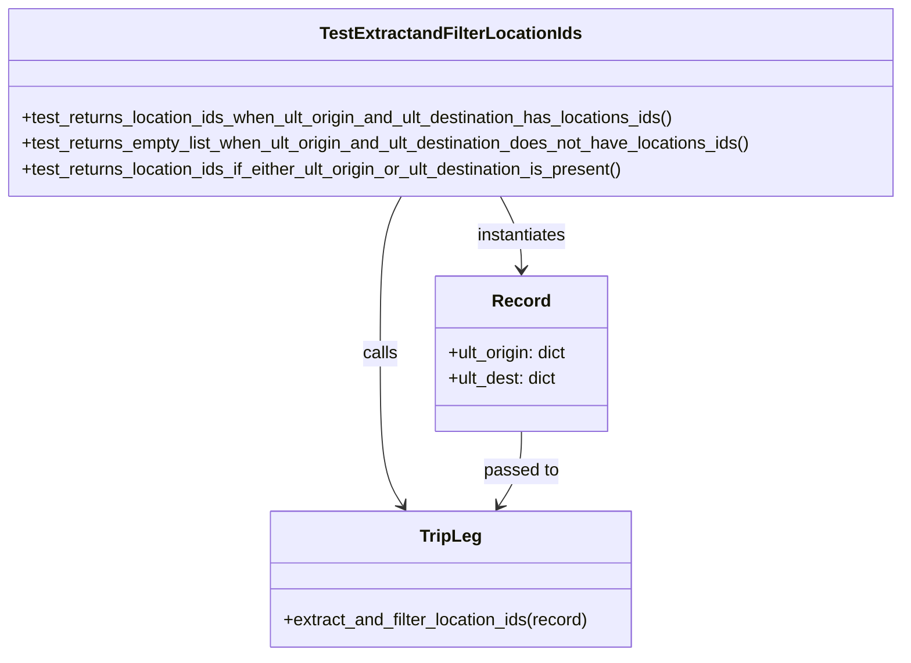

# Diagram: entity_core/entity_service/entity_service_tests/trip_leg_tests/test_extract_and_filter_location_ids.py


> Auto-generated by Obscura crawlers

## Diagram 1



### SVG

<svg id="container" width="847.5625" xmlns="http://www.w3.org/2000/svg" class="classDiagram" height="608" viewBox="0 0 847.5625 608" role="graphics-document document" aria-roledescription="class"><style>#container{font-family:"trebuchet ms",verdana,arial,sans-serif;font-size:16px;fill:#333;}@keyframes edge-animation-frame{from{stroke-dashoffset:0;}}@keyframes dash{to{stroke-dashoffset:0;}}#container .edge-animation-slow{stroke-dasharray:9,5!important;stroke-dashoffset:900;animation:dash 50s linear infinite;stroke-linecap:round;}#container .edge-animation-fast{stroke-dasharray:9,5!important;stroke-dashoffset:900;animation:dash 20s linear infinite;stroke-linecap:round;}#container .error-icon{fill:#552222;}#container .error-text{fill:#552222;stroke:#552222;}#container .edge-thickness-normal{stroke-width:1px;}#container .edge-thickness-thick{stroke-width:3.5px;}#container .edge-pattern-solid{stroke-dasharray:0;}#container .edge-thickness-invisible{stroke-width:0;fill:none;}#container .edge-pattern-dashed{stroke-dasharray:3;}#container .edge-pattern-dotted{stroke-dasharray:2;}#container .marker{fill:#333333;stroke:#333333;}#container .marker.cross{stroke:#333333;}#container svg{font-family:"trebuchet ms",verdana,arial,sans-serif;font-size:16px;}#container p{margin:0;}#container g.classGroup text{fill:#9370DB;stroke:none;font-family:"trebuchet ms",verdana,arial,sans-serif;font-size:10px;}#container g.classGroup text .title{font-weight:bolder;}#container .nodeLabel,#container .edgeLabel{color:#131300;}#container .edgeLabel .label rect{fill:#ECECFF;}#container .label text{fill:#131300;}#container .labelBkg{background:#ECECFF;}#container .edgeLabel .label span{background:#ECECFF;}#container .classTitle{font-weight:bolder;}#container .node rect,#container .node circle,#container .node ellipse,#container .node polygon,#container .node path{fill:#ECECFF;stroke:#9370DB;stroke-width:1px;}#container .divider{stroke:#9370DB;stroke-width:1;}#container g.clickable{cursor:pointer;}#container g.classGroup rect{fill:#ECECFF;stroke:#9370DB;}#container g.classGroup line{stroke:#9370DB;stroke-width:1;}#container .classLabel .box{stroke:none;stroke-width:0;fill:#ECECFF;opacity:0.5;}#container .classLabel .label{fill:#9370DB;font-size:10px;}#container .relation{stroke:#333333;stroke-width:1;fill:none;}#container .dashed-line{stroke-dasharray:3;}#container .dotted-line{stroke-dasharray:1 2;}#container #compositionStart,#container .composition{fill:#333333!important;stroke:#333333!important;stroke-width:1;}#container #compositionEnd,#container .composition{fill:#333333!important;stroke:#333333!important;stroke-width:1;}#container #dependencyStart,#container .dependency{fill:#333333!important;stroke:#333333!important;stroke-width:1;}#container #dependencyStart,#container .dependency{fill:#333333!important;stroke:#333333!important;stroke-width:1;}#container #extensionStart,#container .extension{fill:transparent!important;stroke:#333333!important;stroke-width:1;}#container #extensionEnd,#container .extension{fill:transparent!important;stroke:#333333!important;stroke-width:1;}#container #aggregationStart,#container .aggregation{fill:transparent!important;stroke:#333333!important;stroke-width:1;}#container #aggregationEnd,#container .aggregation{fill:transparent!important;stroke:#333333!important;stroke-width:1;}#container #lollipopStart,#container .lollipop{fill:#ECECFF!important;stroke:#333333!important;stroke-width:1;}#container #lollipopEnd,#container .lollipop{fill:#ECECFF!important;stroke:#333333!important;stroke-width:1;}#container .edgeTerminals{font-size:11px;line-height:initial;}#container .classTitleText{text-anchor:middle;font-size:18px;fill:#333;}#container .label-icon{display:inline-block;height:1em;overflow:visible;vertical-align:-0.125em;}#container .node .label-icon path{fill:currentColor;stroke:revert;stroke-width:revert;}#container :root{--mermaid-font-family:"trebuchet ms",verdana,arial,sans-serif;}</style><g><defs><marker id="container_class-aggregationStart" class="marker aggregation class" refX="18" refY="7" markerWidth="190" markerHeight="240" orient="auto"><path d="M 18,7 L9,13 L1,7 L9,1 Z"></path></marker></defs><defs><marker id="container_class-aggregationEnd" class="marker aggregation class" refX="1" refY="7" markerWidth="20" markerHeight="28" orient="auto"><path d="M 18,7 L9,13 L1,7 L9,1 Z"></path></marker></defs><defs><marker id="container_class-extensionStart" class="marker extension class" refX="18" refY="7" markerWidth="190" markerHeight="240" orient="auto"><path d="M 1,7 L18,13 V 1 Z"></path></marker></defs><defs><marker id="container_class-extensionEnd" class="marker extension class" refX="1" refY="7" markerWidth="20" markerHeight="28" orient="auto"><path d="M 1,1 V 13 L18,7 Z"></path></marker></defs><defs><marker id="container_class-compositionStart" class="marker composition class" refX="18" refY="7" markerWidth="190" markerHeight="240" orient="auto"><path d="M 18,7 L9,13 L1,7 L9,1 Z"></path></marker></defs><defs><marker id="container_class-compositionEnd" class="marker composition class" refX="1" refY="7" markerWidth="20" markerHeight="28" orient="auto"><path d="M 18,7 L9,13 L1,7 L9,1 Z"></path></marker></defs><defs><marker id="container_class-dependencyStart" class="marker dependency class" refX="6" refY="7" markerWidth="190" markerHeight="240" orient="auto"><path d="M 5,7 L9,13 L1,7 L9,1 Z"></path></marker></defs><defs><marker id="container_class-dependencyEnd" class="marker dependency class" refX="13" refY="7" markerWidth="20" markerHeight="28" orient="auto"><path d="M 18,7 L9,13 L14,7 L9,1 Z"></path></marker></defs><defs><marker id="container_class-lollipopStart" class="marker lollipop class" refX="13" refY="7" markerWidth="190" markerHeight="240" orient="auto"><circle stroke="black" fill="transparent" cx="7" cy="7" r="6"></circle></marker></defs><defs><marker id="container_class-lollipopEnd" class="marker lollipop class" refX="1" refY="7" markerWidth="190" markerHeight="240" orient="auto"><circle stroke="black" fill="transparent" cx="7" cy="7" r="6"></circle></marker></defs><g class="root"><g class="clusters"></g><g class="edgePaths"><path d="M377.153,182L373.848,188.167C370.543,194.333,363.932,206.667,360.627,231C357.322,255.333,357.322,291.667,357.322,328C357.322,364.333,357.322,400.667,360.867,424.167C364.412,447.668,371.501,458.335,375.046,463.669L378.591,469.003" id="id_TestExtractandFilterLocationIds_TripLeg_1" class="edge-thickness-normal edge-pattern-solid relation" style=";;;" data-edge="true" data-et="edge" data-id="id_TestExtractandFilterLocationIds_TripLeg_1" data-points="W3sieCI6Mzc3LjE1Mjc2OTAyNzIxNzc0LCJ5IjoxODJ9LHsieCI6MzU3LjMyMjI2NTYyNSwieSI6MjE5fSx7IngiOjM1Ny4zMjIyNjU2MjUsInkiOjMyOH0seyJ4IjozNTcuMzIyMjY1NjI1LCJ5Ijo0Mzd9LHsieCI6MzgxLjkxMjA4OTg0Mzc1LCJ5Ijo0NzR9XQ==" marker-end="url(#container_class-dependencyEnd)"></path><path d="M470.41,182L473.715,188.167C477.02,194.333,483.63,206.667,486.935,218C490.24,229.333,490.24,239.667,490.24,244.833L490.24,250" id="id_TestExtractandFilterLocationIds_Record_2" class="edge-thickness-normal edge-pattern-solid relation" style=";;;" data-edge="true" data-et="edge" data-id="id_TestExtractandFilterLocationIds_Record_2" data-points="W3sieCI6NDcwLjQwOTczMDk3Mjc4MjI2LCJ5IjoxODJ9LHsieCI6NDkwLjI0MDIzNDM3NSwieSI6MjE5fSx7IngiOjQ5MC4yNDAyMzQzNzUsInkiOjI1Nn1d" marker-end="url(#container_class-dependencyEnd)"></path><path d="M490.24,400L490.24,406.167C490.24,412.333,490.24,424.667,486.695,436.167C483.151,447.668,476.061,458.335,472.516,463.669L468.971,469.003" id="id_Record_TripLeg_3" class="edge-thickness-normal edge-pattern-solid relation" style=";;;" data-edge="true" data-et="edge" data-id="id_Record_TripLeg_3" data-points="W3sieCI6NDkwLjI0MDIzNDM3NSwieSI6NDAwfSx7IngiOjQ5MC4yNDAyMzQzNzUsInkiOjQzN30seyJ4Ijo0NjUuNjUwNDEwMTU2MjUsInkiOjQ3NH1d" marker-end="url(#container_class-dependencyEnd)"></path></g><g class="edgeLabels"><g class="edgeLabel" transform="translate(357.322265625, 328)"><g class="label" data-id="id_TestExtractandFilterLocationIds_TripLeg_1" transform="translate(-16.4453125, -12)"><foreignObject width="32.890625" height="24"><div xmlns="http://www.w3.org/1999/xhtml" class="labelBkg" style="display: table-cell; white-space: nowrap; line-height: 1.5; max-width: 200px; text-align: center;"><span class="edgeLabel"><p>calls</p></span></div></foreignObject></g></g><g class="edgeLabel" transform="translate(490.240234375, 219)"><g class="label" data-id="id_TestExtractandFilterLocationIds_Record_2" transform="translate(-42.9140625, -12)"><foreignObject width="85.828125" height="24"><div xmlns="http://www.w3.org/1999/xhtml" class="labelBkg" style="display: table-cell; white-space: nowrap; line-height: 1.5; max-width: 200px; text-align: center;"><span class="edgeLabel"><p>instantiates</p></span></div></foreignObject></g></g><g class="edgeLabel" transform="translate(490.240234375, 437)"><g class="label" data-id="id_Record_TripLeg_3" transform="translate(-35.046875, -12)"><foreignObject width="70.09375" height="24"><div xmlns="http://www.w3.org/1999/xhtml" class="labelBkg" style="display: table-cell; white-space: nowrap; line-height: 1.5; max-width: 200px; text-align: center;"><span class="edgeLabel"><p>passed to</p></span></div></foreignObject></g></g></g><g class="nodes"><g class="node default" id="classId-Record-0" transform="translate(490.240234375, 328)"><g class="basic label-container"><path d="M-81.47265625 -72 L81.47265625 -72 L81.47265625 72 L-81.47265625 72" stroke="none" stroke-width="0" fill="#ECECFF" style=""></path><path d="M-81.47265625 -72 C-23.855713701806586 -72, 33.76122884638683 -72, 81.47265625 -72 M-81.47265625 -72 C-26.125023534798046 -72, 29.222609180403907 -72, 81.47265625 -72 M81.47265625 -72 C81.47265625 -22.40212222061937, 81.47265625 27.195755558761263, 81.47265625 72 M81.47265625 -72 C81.47265625 -41.809251173633896, 81.47265625 -11.618502347267793, 81.47265625 72 M81.47265625 72 C45.85442801248276 72, 10.236199774965513 72, -81.47265625 72 M81.47265625 72 C34.970734278070516 72, -11.531187693858968 72, -81.47265625 72 M-81.47265625 72 C-81.47265625 27.836251946948217, -81.47265625 -16.327496106103567, -81.47265625 -72 M-81.47265625 72 C-81.47265625 17.411692768763757, -81.47265625 -37.176614462472486, -81.47265625 -72" stroke="#9370DB" stroke-width="1.3" fill="none" stroke-dasharray="0 0" style=""></path></g><g class="annotation-group text" transform="translate(0, -48)"></g><g class="label-group text" transform="translate(-25.3515625, -48)"><g class="label" style="font-weight: bolder" transform="translate(0,-12)"><foreignObject width="50.703125" height="24"><div xmlns="http://www.w3.org/1999/xhtml" style="display: table-cell; white-space: nowrap; line-height: 1.5; max-width: 100px; text-align: center;"><span class="nodeLabel markdown-node-label" style=""><p>Record</p></span></div></foreignObject></g></g><g class="members-group text" transform="translate(-69.47265625, 0)"><g class="label" style="" transform="translate(0,-12)"><foreignObject width="113.59375" height="24"><div xmlns="http://www.w3.org/1999/xhtml" style="display: table-cell; white-space: nowrap; line-height: 1.5; max-width: 171px; text-align: center;"><span class="nodeLabel markdown-node-label" style=""><p>+ult_origin: dict</p></span></div></foreignObject></g><g class="label" style="" transform="translate(0,12)"><foreignObject width="102.953125" height="24"><div xmlns="http://www.w3.org/1999/xhtml" style="display: table-cell; white-space: nowrap; line-height: 1.5; max-width: 161px; text-align: center;"><span class="nodeLabel markdown-node-label" style=""><p>+ult_dest: dict</p></span></div></foreignObject></g></g><g class="methods-group text" transform="translate(-69.47265625, 72)"></g><g class="divider" style=""><path d="M-81.47265625 -24 C-31.331521618515765 -24, 18.80961301296847 -24, 81.47265625 -24 M-81.47265625 -24 C-26.99136523124696 -24, 27.48992578750608 -24, 81.47265625 -24" stroke="#9370DB" stroke-width="1.3" fill="none" stroke-dasharray="0 0" style=""></path></g><g class="divider" style=""><path d="M-81.47265625 48 C-31.93384657509587 48, 17.60496309980826 48, 81.47265625 48 M-81.47265625 48 C-17.779374633643265 48, 45.91390698271347 48, 81.47265625 48" stroke="#9370DB" stroke-width="1.3" fill="none" stroke-dasharray="0 0" style=""></path></g></g><g class="node default" id="classId-TripLeg-1" transform="translate(423.78125, 537)"><g class="basic label-container"><path d="M-169.74609375 -63 L169.74609375 -63 L169.74609375 63 L-169.74609375 63" stroke="none" stroke-width="0" fill="#ECECFF" style=""></path><path d="M-169.74609375 -63 C-98.75662663726615 -63, -27.767159524532303 -63, 169.74609375 -63 M-169.74609375 -63 C-35.05115263122684 -63, 99.64378848754632 -63, 169.74609375 -63 M169.74609375 -63 C169.74609375 -24.726465627801133, 169.74609375 13.547068744397734, 169.74609375 63 M169.74609375 -63 C169.74609375 -26.509947085344344, 169.74609375 9.980105829311313, 169.74609375 63 M169.74609375 63 C64.26478254620508 63, -41.21652865758983 63, -169.74609375 63 M169.74609375 63 C89.62381102186161 63, 9.501528293723226 63, -169.74609375 63 M-169.74609375 63 C-169.74609375 34.596065535095626, -169.74609375 6.192131070191252, -169.74609375 -63 M-169.74609375 63 C-169.74609375 20.41712383736911, -169.74609375 -22.165752325261778, -169.74609375 -63" stroke="#9370DB" stroke-width="1.3" fill="none" stroke-dasharray="0 0" style=""></path></g><g class="annotation-group text" transform="translate(0, -39)"></g><g class="label-group text" transform="translate(-27.0546875, -39)"><g class="label" style="font-weight: bolder" transform="translate(0,-12)"><foreignObject width="54.109375" height="24"><div xmlns="http://www.w3.org/1999/xhtml" style="display: table-cell; white-space: nowrap; line-height: 1.5; max-width: 103px; text-align: center;"><span class="nodeLabel markdown-node-label" style=""><p>TripLeg</p></span></div></foreignObject></g></g><g class="members-group text" transform="translate(-157.74609375, 9)"></g><g class="methods-group text" transform="translate(-157.74609375, 39)"><g class="label" style="" transform="translate(0,-12)"><foreignObject width="288.4375" height="24"><div xmlns="http://www.w3.org/1999/xhtml" style="display: table-cell; white-space: nowrap; line-height: 1.5; max-width: 346px; text-align: center;"><span class="nodeLabel markdown-node-label" style=""><p>+extract_and_filter_location_ids(record)</p></span></div></foreignObject></g></g><g class="divider" style=""><path d="M-169.74609375 -15 C-45.717386765165415 -15, 78.31132021966917 -15, 169.74609375 -15 M-169.74609375 -15 C-53.243746149419536 -15, 63.25860145116093 -15, 169.74609375 -15" stroke="#9370DB" stroke-width="1.3" fill="none" stroke-dasharray="0 0" style=""></path></g><g class="divider" style=""><path d="M-169.74609375 9 C-98.88147274244515 9, -28.01685173489031 9, 169.74609375 9 M-169.74609375 9 C-50.41924163170869 9, 68.90761048658263 9, 169.74609375 9" stroke="#9370DB" stroke-width="1.3" fill="none" stroke-dasharray="0 0" style=""></path></g></g><g class="node default" id="classId-TestExtractandFilterLocationIds-2" transform="translate(423.78125, 95)"><g class="basic label-container"><path d="M-415.78125 -87 L415.78125 -87 L415.78125 87 L-415.78125 87" stroke="none" stroke-width="0" fill="#ECECFF" style=""></path><path d="M-415.78125 -87 C-237.40891818947497 -87, -59.03658637894995 -87, 415.78125 -87 M-415.78125 -87 C-98.41235815056507 -87, 218.95653369886986 -87, 415.78125 -87 M415.78125 -87 C415.78125 -33.31740873651748, 415.78125 20.365182526965043, 415.78125 87 M415.78125 -87 C415.78125 -19.6990227342328, 415.78125 47.6019545315344, 415.78125 87 M415.78125 87 C216.05425406147006 87, 16.327258122940123 87, -415.78125 87 M415.78125 87 C97.0286081251366 87, -221.7240337497268 87, -415.78125 87 M-415.78125 87 C-415.78125 28.638685174992965, -415.78125 -29.72262965001407, -415.78125 -87 M-415.78125 87 C-415.78125 21.89921741623577, -415.78125 -43.20156516752846, -415.78125 -87" stroke="#9370DB" stroke-width="1.3" fill="none" stroke-dasharray="0 0" style=""></path></g><g class="annotation-group text" transform="translate(0, -63)"></g><g class="label-group text" transform="translate(-115.796875, -63)"><g class="label" style="font-weight: bolder" transform="translate(0,-12)"><foreignObject width="231.59375" height="24"><div xmlns="http://www.w3.org/1999/xhtml" style="display: table-cell; white-space: nowrap; line-height: 1.5; max-width: 278px; text-align: center;"><span class="nodeLabel markdown-node-label" style=""><p>TestExtractandFilterLocationIds</p></span></div></foreignObject></g></g><g class="members-group text" transform="translate(-403.78125, -15)"></g><g class="methods-group text" transform="translate(-403.78125, 15)"><g class="label" style="" transform="translate(0,-12)"><foreignObject width="620.421875" height="24"><div xmlns="http://www.w3.org/1999/xhtml" style="display: table-cell; white-space: nowrap; line-height: 1.5; max-width: 678px; text-align: center;"><span class="nodeLabel markdown-node-label" style=""><p>+test_returns_location_ids_when_ult_origin_and_ult_destination_has_locations_ids()</p></span></div></foreignObject></g><g class="label" style="" transform="translate(0,12)"><foreignObject width="691.765625" height="24"><div xmlns="http://www.w3.org/1999/xhtml" style="display: table-cell; white-space: nowrap; line-height: 1.5; max-width: 749px; text-align: center;"><span class="nodeLabel markdown-node-label" style=""><p>+test_returns_empty_list_when_ult_origin_and_ult_destination_does_not_have_locations_ids()</p></span></div></foreignObject></g><g class="label" style="" transform="translate(0,36)"><foreignObject width="573.625" height="24"><div xmlns="http://www.w3.org/1999/xhtml" style="display: table-cell; white-space: nowrap; line-height: 1.5; max-width: 631px; text-align: center;"><span class="nodeLabel markdown-node-label" style=""><p>+test_returns_location_ids_if_either_ult_origin_or_ult_destination_is_present()</p></span></div></foreignObject></g></g><g class="divider" style=""><path d="M-415.78125 -39 C-188.2063008108307 -39, 39.368648378338605 -39, 415.78125 -39 M-415.78125 -39 C-211.16668836157316 -39, -6.55212672314633 -39, 415.78125 -39" stroke="#9370DB" stroke-width="1.3" fill="none" stroke-dasharray="0 0" style=""></path></g><g class="divider" style=""><path d="M-415.78125 -15 C-207.40212448232586 -15, 0.9770010353482803 -15, 415.78125 -15 M-415.78125 -15 C-99.59163320662185 -15, 216.5979835867563 -15, 415.78125 -15" stroke="#9370DB" stroke-width="1.3" fill="none" stroke-dasharray="0 0" style=""></path></g></g></g></g></g></svg>

## Diagram 2

```mermaid
flowchart TD
    Record[Record {ult_origin, ult_dest}] --> CheckOrigin{ult_origin has location_id?}
    CheckOrigin -- yes --> AddOrigin[append ult_origin.location_id]
    CheckOrigin -- no --> SkipOrigin[no-op]
    Record --> CheckDest{ult_dest has location_id?}
    CheckDest -- yes --> AddDest[append ult_dest.location_id]
    CheckDest -- no --> SkipDest[no-op]
    AddOrigin --> BuildList[collect location_ids]
    AddDest --> BuildList
    SkipOrigin --> BuildList
    SkipDest --> BuildList
    BuildList --> Return[return list of location_ids]
```

> SVG rendering failed for this diagram.
