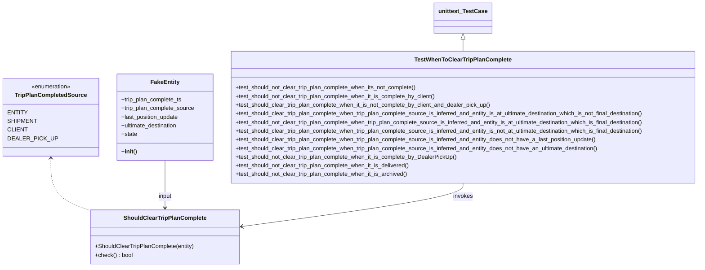

# Diagram: entity_core/entity_service/entity_service_tests/trip_leg_tests/test_when_to_clear_trip_plan_complete.py


> Auto-generated by Obscura crawlers

## Diagram 1



> SVG rendering failed for this diagram.

## Diagram 2

```mermaid
flowchart TD
A[Has trip_plan_complete_ts?] -->|No| D[Do NOT clear trip plan complete]
A -->|Yes| B{trip_plan_complete_source == CLIENT?}
B -->|Yes| D
B -->|No| C{trip_plan_complete_source == DEALER_PICK_UP?}
C -->|Yes| D
C -->|No| E{trip_plan_complete_source in [ENTITY, SHIPMENT]?}
E -->|No| F[Clear trip plan complete]
E -->|Yes| G{state in [Delivered, Archived]?}
G -->|Yes| D
G -->|No| H{ultimate_destination present?}
H -->|No| F
H -->|Yes| I{last_position_update present?}
I -->|No| F
I -->|Yes| J{ultimate_destination.ladCanonicalName == "Final Destination" AND last_position_update.locationCode == ultimate_destination.code?}
J -->|Yes| D
J -->|No| F
```

> SVG rendering failed for this diagram.
