# Diagram: entity_core/entity_service/entity_service_tests/update_current_planned_trip_leg/test_current_planned_trip_leg_recalcution.py

> Auto-generated by Obscura crawlers

## Mermaid

```mermaid
classDiagram
class UpdateCurrentPlannedTripLegTests {
  +setUp()
  +test_service_is_instance_of_recalculation()
  +test_recalcuates_current_planned_trip_leg()
  +test_recalculates_current_planned_trip_leg_for_deleted_trip_leg()
  +test_recalculates_current_planned_trip_leg_with_between_intermediate_fv_generated_dest_trip_leg()
  +test_returns_none_if_current_planned_trip_leg_same_as_previous_after_calculation()
}
class UpdateCurrentPlannedTripLegOverrideTests {
  +setUp()
  +test_service_is_instance_of_override()
}
class FakeDAOContainer {
  +__init__()
  +entity_dao
  +system_config_dao
  +trip_leg_dao
  +status_update_dao
}
class FakeInvokers {
  +__init__()
  +solution_invoker
  +status_update_invoker
}
class FakeEntityDao {
  +__init__()
  +get_entity_id(entity_external_id, solution_id)
  +update_current_planned_trip_leg(entity_id, trip_leg_id, event_ts)
  +updated_entity_id
  +updated_trip_leg_id
  +updated_event_ts
}
class FakeTripLegDao {
  +__init__()
  +get_planned_trip_leg_id_for_entity_and_location_codes(entity_id, origin_code, destination_code)
  +get_planned_trip_legs(entity)
}
class FakeSystemConfigDao {
  +__init__()
  +get_system_configuration_setting(qualifier, solution_id)
}
class FakeStatusUpdateInvoker {
  +__init__()
  +send_override_milestone(status_update_body, solution_id, entity_external_id, customer_org_id)
  +sent_status_update
}
class FakeSolutionInvoker {
  +get_customer_id(solution_id)
}
class FakeStatusUpdateDao {
  +get_ordered_status_updates(entity)
}
class PlannedTripServiceFactory {
  +create_service(update, dao_container, invokers)
}
class PlannedTripLegRecalculation {
  +deduplicate_status_updates(status_updates)
  +replay_current_planned_trip_leg(deduped_status_updates, trip_legs)
}
class PlannedTripLegOverride {
  +apply_override()
}
class CurrentPlannedTripLegEvent {
  +__init__(solution_id, entity_external_id, override=False)
  +solution_id
  +entity_external_id
  +override
}
class TestData {
  +planned_trip_leg_* (static fixtures)
  +status_update_* (static fixtures)
}
class StatusUpdate {
  +attributes...
}
class TripLeg {
  +internal_id
  +active
}
class parse_trip_leg {
  +parse(data)
}

FakeDAOContainer o-- FakeEntityDao
FakeDAOContainer o-- FakeSystemConfigDao
FakeDAOContainer o-- FakeTripLegDao
FakeDAOContainer o-- FakeStatusUpdateDao

FakeInvokers o-- FakeSolutionInvoker
FakeInvokers o-- FakeStatusUpdateInvoker

UpdateCurrentPlannedTripLegTests --> FakeDAOContainer
UpdateCurrentPlannedTripLegTests --> FakeInvokers
UpdateCurrentPlannedTripLegTests --> CurrentPlannedTripLegEvent
UpdateCurrentPlannedTripLegTests --> PlannedTripServiceFactory
UpdateCurrentPlannedTripLegTests --> TestData
UpdateCurrentPlannedTripLegTests --> StatusUpdate
UpdateCurrentPlannedTripLegTests --> TripLeg

UpdateCurrentPlannedTripLegOverrideTests --> FakeDAOContainer
UpdateCurrentPlannedTripLegOverrideTests --> FakeInvokers
UpdateCurrentPlannedTripLegOverrideTests --> CurrentPlannedTripLegEvent
UpdateCurrentPlannedTripLegOverrideTests --> PlannedTripServiceFactory

PlannedTripServiceFactory --> PlannedTripLegRecalculation : creates
PlannedTripServiceFactory --> PlannedTripLegOverride : creates

PlannedTripLegRecalculation ..> TestData : uses
PlannedTripLegRecalculation ..> StatusUpdate : consumes
PlannedTripLegRecalculation ..> TripLeg : consumes

PlannedTripLegOverride ..> parse_trip_leg : may use

FakeEntityDao --> UpdateCurrentPlannedTripLegTests : returns ids
FakeTripLegDao --> PlannedTripLegRecalculation : provides trip legs
FakeSystemConfigDao --> PlannedTripLegOverride : provides config
FakeStatusUpdateInvoker --> PlannedTripLegOverride : sends override milestone

TestData --|> TripLeg
TestData --|> StatusUpdate
```

### SVG

<svg id="container" width="5156.189453125" xmlns="http://www.w3.org/2000/svg" class="classDiagram" height="1460" viewBox="0 0 5156.189453125 1460" role="graphics-document document" aria-roledescription="class"><g><defs><marker id="container_class-aggregationStart" class="marker aggregation class" refX="18" refY="7" markerWidth="190" markerHeight="240" orient="auto"><path d="M 18,7 L9,13 L1,7 L9,1 Z"></path></marker></defs><defs><marker id="container_class-aggregationEnd" class="marker aggregation class" refX="1" refY="7" markerWidth="20" markerHeight="28" orient="auto"><path d="M 18,7 L9,13 L1,7 L9,1 Z"></path></marker></defs><defs><marker id="container_class-extensionStart" class="marker extension class" refX="18" refY="7" markerWidth="190" markerHeight="240" orient="auto"><path d="M 1,7 L18,13 V 1 Z"></path></marker></defs><defs><marker id="container_class-extensionEnd" class="marker extension class" refX="1" refY="7" markerWidth="20" markerHeight="28" orient="auto"><path d="M 1,1 V 13 L18,7 Z"></path></marker></defs><defs><marker id="container_class-compositionStart" class="marker composition class" refX="18" refY="7" markerWidth="190" markerHeight="240" orient="auto"><path d="M 18,7 L9,13 L1,7 L9,1 Z"></path></marker></defs><defs><marker id="container_class-compositionEnd" class="marker composition class" refX="1" refY="7" markerWidth="20" markerHeight="28" orient="auto"><path d="M 18,7 L9,13 L1,7 L9,1 Z"></path></marker></defs><defs><marker id="container_class-dependencyStart" class="marker dependency class" refX="6" refY="7" markerWidth="190" markerHeight="240" orient="auto"><path d="M 5,7 L9,13 L1,7 L9,1 Z"></path></marker></defs><defs><marker id="container_class-dependencyEnd" class="marker dependency class" refX="13" refY="7" markerWidth="20" markerHeight="28" orient="auto"><path d="M 18,7 L9,13 L14,7 L9,1 Z"></path></marker></defs><defs><marker id="container_class-lollipopStart" class="marker lollipop class" refX="13" refY="7" markerWidth="190" markerHeight="240" orient="auto"><circle stroke="black" fill="transparent" cx="7" cy="7" r="6"></circle></marker></defs><defs><marker id="container_class-lollipopEnd" class="marker lollipop class" refX="1" refY="7" markerWidth="190" markerHeight="240" orient="auto"><circle stroke="black" fill="transparent" cx="7" cy="7" r="6"></circle></marker></defs><g class="root"><g class="clusters"></g><g class="edgePaths"><path d="M2900.792,419.585L2525.208,440.488C2149.623,461.39,1398.454,503.195,1009.17,529.604C619.885,556.013,592.486,567.027,578.786,572.533L565.086,578.04" id="id_FakeDAOContainer_FakeEntityDao_1" class="edge-thickness-normal edge-pattern-solid relation" style=";;;" data-edge="true" data-et="edge" data-id="id_FakeDAOContainer_FakeEntityDao_1" data-points="W3sieCI6MjkxOC4wMTU2MjUsInkiOjQxOC42MjY4NDc0NDc2NTM2M30seyJ4Ijo2NDcuMjg1MTU2MjUsInkiOjU0NX0seyJ4Ijo1NjUuMDg1OTM3NSwieSI6NTc4LjAzOTkwMjU0NDY2N31d" marker-start="url(#container_class-aggregationStart)"></path><path d="M2900.857,426.066L2708.867,445.888C2516.877,465.71,2132.898,505.355,1940.908,536.844C1748.918,568.333,1748.918,591.667,1748.918,603.333L1748.918,615" id="id_FakeDAOContainer_FakeSystemConfigDao_2" class="edge-thickness-normal edge-pattern-solid relation" style=";;;" data-edge="true" data-et="edge" data-id="id_FakeDAOContainer_FakeSystemConfigDao_2" data-points="W3sieCI6MjkxOC4wMTU2MjUsInkiOjQyNC4yOTQwNjY4MDk3OTU5fSx7IngiOjE3NDguOTE3OTY4NzUsInkiOjU0NX0seyJ4IjoxNzQ4LjkxNzk2ODc1LCJ5Ijo2MTV9XQ==" marker-start="url(#container_class-aggregationStart)"></path><path d="M3173.339,424.776L3387.02,444.814C3600.7,464.851,4028.062,504.925,4241.743,534.629C4455.424,564.333,4455.424,583.667,4455.424,593.333L4455.424,603" id="id_FakeDAOContainer_FakeTripLegDao_3" class="edge-thickness-normal edge-pattern-solid relation" style=";;;" data-edge="true" data-et="edge" data-id="id_FakeDAOContainer_FakeTripLegDao_3" data-points="W3sieCI6MzE1Ni4xNjQwNjI1LCJ5Ijo0MjMuMTY1ODI2NDMzMTM2NH0seyJ4Ijo0NDU1LjQyMzgyODEyNSwieSI6NTQ1fSx7IngiOjQ0NTUuNDIzODI4MTI1LCJ5Ijo2MDN9XQ==" marker-start="url(#container_class-aggregationStart)"></path><path d="M3173.171,435.11L3281.014,453.425C3388.858,471.74,3604.545,508.37,3712.389,540.352C3820.232,572.333,3820.232,599.667,3820.232,613.333L3820.232,627" id="id_FakeDAOContainer_FakeStatusUpdateDao_4" class="edge-thickness-normal edge-pattern-solid relation" style=";;;" data-edge="true" data-et="edge" data-id="id_FakeDAOContainer_FakeStatusUpdateDao_4" data-points="W3sieCI6MzE1Ni4xNjQwNjI1LCJ5Ijo0MzIuMjIyMjA2NzA0MjU4OTV9LHsieCI6MzgyMC4yMzI0MjE4NzUsInkiOjU0NX0seyJ4IjozODIwLjIzMjQyMTg3NSwieSI6NjI3fV0=" marker-start="url(#container_class-aggregationStart)"></path><path d="M2884.944,439.315L2974.902,456.929C3064.859,474.543,3244.774,509.772,3334.732,541.052C3424.689,572.333,3424.689,599.667,3424.689,613.333L3424.689,627" id="id_FakeInvokers_FakeSolutionInvoker_5" class="edge-thickness-normal edge-pattern-solid relation" style=";;;" data-edge="true" data-et="edge" data-id="id_FakeInvokers_FakeSolutionInvoker_5" data-points="W3sieCI6Mjg2OC4wMTU2MjUsInkiOjQzNS45OTk5ODg0OTgyNDQ1M30seyJ4IjozNDI0LjY4OTQ1MzEyNSwieSI6NTQ1fSx7IngiOjM0MjQuNjg5NDUzMTI1LCJ5Ijo2Mjd9XQ==" marker-start="url(#container_class-aggregationStart)"></path><path d="M2605.676,422.824L2342.735,443.187C2079.793,463.549,1553.91,504.275,1290.969,534.804C1028.027,565.333,1028.027,585.667,1028.027,595.833L1028.027,606" id="id_FakeInvokers_FakeStatusUpdateInvoker_6" class="edge-thickness-normal edge-pattern-solid relation" style=";;;" data-edge="true" data-et="edge" data-id="id_FakeInvokers_FakeStatusUpdateInvoker_6" data-points="W3sieCI6MjYyMi44NzUsInkiOjQyMS40OTIwNjk5OTA2MDYzNX0seyJ4IjoxMDI4LjAyNzM0Mzc1LCJ5Ijo1NDV9LHsieCI6MTAyOC4wMjczNDM3NSwieSI6NjA2fV0=" marker-start="url(#container_class-aggregationStart)"></path><path d="M3107.086,254L3106.593,258.167C3106.1,262.333,3105.113,270.667,3102.97,278.107C3100.827,285.547,3097.527,292.095,3095.877,295.368L3094.227,298.642" id="id_UpdateCurrentPlannedTripLegTests_FakeDAOContainer_7" class="edge-thickness-normal edge-pattern-solid relation" style=";;;" data-edge="true" data-et="edge" data-id="id_UpdateCurrentPlannedTripLegTests_FakeDAOContainer_7" data-points="W3sieCI6MzEwNy4wODYwMDM0ODM5NTI1LCJ5IjoyNTR9LHsieCI6MzEwNC4xMjY5NTMxMjUsInkiOjI3OX0seyJ4IjozMDkxLjUyNTk5MjcxNjE2NTUsInkiOjMwNH1d" marker-end="url(#container_class-dependencyEnd)"></path><path d="M2921.872,254L2915.104,258.167C2908.337,262.333,2894.802,270.667,2880.409,282.3C2866.017,293.934,2850.766,308.868,2843.14,316.335L2835.515,323.802" id="id_UpdateCurrentPlannedTripLegTests_FakeInvokers_8" class="edge-thickness-normal edge-pattern-solid relation" style=";;;" data-edge="true" data-et="edge" data-id="id_UpdateCurrentPlannedTripLegTests_FakeInvokers_8" data-points="W3sieCI6MjkyMS44NzE3OTMxNzk4OTg4LCJ5IjoyNTR9LHsieCI6Mjg4MS4yNjc1NzgxMjUsInkiOjI3OX0seyJ4IjoyODMxLjIyNzc5NjA1MjYzMTcsInkiOjMyOH1d" marker-end="url(#container_class-dependencyEnd)"></path><path d="M2669.84,242.625L2645.302,248.688C2620.764,254.75,2571.688,266.875,2538.581,278.556C2505.475,290.237,2488.338,301.473,2479.77,307.092L2471.201,312.71" id="id_UpdateCurrentPlannedTripLegTests_CurrentPlannedTripLegEvent_9" class="edge-thickness-normal edge-pattern-solid relation" style=";;;" data-edge="true" data-et="edge" data-id="id_UpdateCurrentPlannedTripLegTests_CurrentPlannedTripLegEvent_9" data-points="W3sieCI6MjY2OS44Mzk4NDM3NSwieSI6MjQyLjYyNTAyMDc4NTQ0NTMyfSx7IngiOjI1MjIuNjExMzI4MTI1LCJ5IjoyNzl9LHsieCI6MjQ2Ni4xODM4Mjg3MTI0MDYsInkiOjMxNn1d" marker-end="url(#container_class-dependencyEnd)"></path><path d="M3179.421,254L3181.378,258.167C3183.335,262.333,3187.25,270.667,3189.207,297C3191.164,323.333,3191.164,367.667,3191.164,412C3191.164,456.333,3191.164,500.667,3158.354,536.125C3125.544,571.582,3059.924,598.165,3027.114,611.456L2994.304,624.747" id="id_UpdateCurrentPlannedTripLegTests_PlannedTripServiceFactory_10" class="edge-thickness-normal edge-pattern-solid relation" style=";;;" data-edge="true" data-et="edge" data-id="id_UpdateCurrentPlannedTripLegTests_PlannedTripServiceFactory_10" data-points="W3sieCI6MzE3OS40MjA4OTg0Mzc1LCJ5IjoyNTR9LHsieCI6MzE5MS4xNjQwNjI1LCJ5IjoyNzl9LHsieCI6MzE5MS4xNjQwNjI1LCJ5Ijo0MTJ9LHsieCI6MzE5MS4xNjQwNjI1LCJ5Ijo1NDV9LHsieCI6Mjk4OC43NDMxMzAzODc5MzEsInkiOjYyN31d" marker-end="url(#container_class-dependencyEnd)"></path><path d="M3573.449,168.823L3792.799,187.186C4012.149,205.549,4450.849,242.274,4670.199,282.804C4889.549,323.333,4889.549,367.667,4889.549,412C4889.549,456.333,4889.549,500.667,4889.549,547C4889.549,593.333,4889.549,641.667,4889.549,692C4889.549,742.333,4889.549,794.667,4889.549,839.5C4889.549,884.333,4889.549,921.667,4889.549,959C4889.549,996.333,4889.549,1033.667,4883.185,1057.845C4876.821,1082.024,4864.094,1093.048,4857.73,1098.56L4851.367,1104.072" id="id_UpdateCurrentPlannedTripLegTests_TestData_11" class="edge-thickness-normal edge-pattern-solid relation" style=";;;" data-edge="true" data-et="edge" data-id="id_UpdateCurrentPlannedTripLegTests_TestData_11" data-points="W3sieCI6MzU3My40NDkyMTg3NSwieSI6MTY4LjgyMjgwMTc1OTIzMzM5fSx7IngiOjQ4ODkuNTQ4ODI4MTI1LCJ5IjoyNzl9LHsieCI6NDg4OS41NDg4MjgxMjUsInkiOjQxMn0seyJ4Ijo0ODg5LjU0ODgyODEyNSwieSI6NTQ1fSx7IngiOjQ4ODkuNTQ4ODI4MTI1LCJ5Ijo2OTB9LHsieCI6NDg4OS41NDg4MjgxMjUsInkiOjg0N30seyJ4Ijo0ODg5LjU0ODgyODEyNSwieSI6OTU5fSx7IngiOjQ4ODkuNTQ4ODI4MTI1LCJ5IjoxMDcxfSx7IngiOjQ4NDYuODMxNDU1Nzc1NjY5LCJ5IjoxMTA4fV0=" marker-end="url(#container_class-dependencyEnd)"></path><path d="M3573.449,166.704L3810.282,185.42C4047.114,204.136,4520.779,241.568,4757.611,282.451C4994.443,323.333,4994.443,367.667,4994.443,412C4994.443,456.333,4994.443,500.667,4994.443,547C4994.443,593.333,4994.443,641.667,4994.443,692C4994.443,742.333,4994.443,794.667,4994.443,839.5C4994.443,884.333,4994.443,921.667,4994.443,959C4994.443,996.333,4994.443,1033.667,4994.443,1071C4994.443,1108.333,4994.443,1145.667,4994.443,1181C4994.443,1216.333,4994.443,1249.667,4715.396,1281.689C4436.349,1313.712,3878.254,1344.424,3599.206,1359.78L3320.159,1375.136" id="id_UpdateCurrentPlannedTripLegTests_StatusUpdate_12" class="edge-thickness-normal edge-pattern-solid relation" style=";;;" data-edge="true" data-et="edge" data-id="id_UpdateCurrentPlannedTripLegTests_StatusUpdate_12" data-points="W3sieCI6MzU3My40NDkyMTg3NSwieSI6MTY2LjcwNDM2NTQzNzM0MTU1fSx7IngiOjQ5OTQuNDQzMzU5Mzc1LCJ5IjoyNzl9LHsieCI6NDk5NC40NDMzNTkzNzUsInkiOjQxMn0seyJ4Ijo0OTk0LjQ0MzM1OTM3NSwieSI6NTQ1fSx7IngiOjQ5OTQuNDQzMzU5Mzc1LCJ5Ijo2OTB9LHsieCI6NDk5NC40NDMzNTkzNzUsInkiOjg0N30seyJ4Ijo0OTk0LjQ0MzM1OTM3NSwieSI6OTU5fSx7IngiOjQ5OTQuNDQzMzU5Mzc1LCJ5IjoxMDcxfSx7IngiOjQ5OTQuNDQzMzU5Mzc1LCJ5IjoxMTgzfSx7IngiOjQ5OTQuNDQzMzU5Mzc1LCJ5IjoxMjgzfSx7IngiOjMzMTQuMTY3OTY4NzUsInkiOjEzNzUuNDY2MDIxMDQxOTAxfV0=" marker-end="url(#container_class-dependencyEnd)"></path><path d="M3573.449,164.677L3829.073,183.731C4084.697,202.785,4595.945,240.892,4851.569,282.113C5107.193,323.333,5107.193,367.667,5107.193,412C5107.193,456.333,5107.193,500.667,5107.193,547C5107.193,593.333,5107.193,641.667,5107.193,692C5107.193,742.333,5107.193,794.667,5107.193,839.5C5107.193,884.333,5107.193,921.667,5107.193,959C5107.193,996.333,5107.193,1033.667,5107.193,1071C5107.193,1108.333,5107.193,1145.667,5107.193,1181C5107.193,1216.333,5107.193,1249.667,5106.262,1269.54C5105.33,1289.413,5103.466,1295.826,5102.535,1299.032L5101.603,1302.238" id="id_UpdateCurrentPlannedTripLegTests_TripLeg_13" class="edge-thickness-normal edge-pattern-solid relation" style=";;;" data-edge="true" data-et="edge" data-id="id_UpdateCurrentPlannedTripLegTests_TripLeg_13" data-points="W3sieCI6MzU3My40NDkyMTg3NSwieSI6MTY0LjY3Njg4MjA4MDU4MDN9LHsieCI6NTEwNy4xOTMzNTkzNzUsInkiOjI3OX0seyJ4Ijo1MTA3LjE5MzM1OTM3NSwieSI6NDEyfSx7IngiOjUxMDcuMTkzMzU5Mzc1LCJ5Ijo1NDV9LHsieCI6NTEwNy4xOTMzNTkzNzUsInkiOjY5MH0seyJ4Ijo1MTA3LjE5MzM1OTM3NSwieSI6ODQ3fSx7IngiOjUxMDcuMTkzMzU5Mzc1LCJ5Ijo5NTl9LHsieCI6NTEwNy4xOTMzNTkzNzUsInkiOjEwNzF9LHsieCI6NTEwNy4xOTMzNTkzNzUsInkiOjExODN9LHsieCI6NTEwNy4xOTMzNTkzNzUsInkiOjEyODN9LHsieCI6NTA5OS45Mjg1Mzk3ODczNzEsInkiOjEzMDh9XQ==" marker-end="url(#container_class-dependencyEnd)"></path><path d="M2430.023,180.296L2508.564,196.746C2587.105,213.197,2744.186,246.099,2826.267,266.016C2908.349,285.934,2915.43,292.868,2918.971,296.335L2922.511,299.802" id="id_UpdateCurrentPlannedTripLegOverrideTests_FakeDAOContainer_14" class="edge-thickness-normal edge-pattern-solid relation" style=";;;" data-edge="true" data-et="edge" data-id="id_UpdateCurrentPlannedTripLegOverrideTests_FakeDAOContainer_14" data-points="W3sieCI6MjQzMC4wMjM0Mzc1LCJ5IjoxODAuMjk1NTYwNTI0ODUzN30seyJ4IjoyOTAxLjI2NzU3ODEyNSwieSI6Mjc5fSx7IngiOjI5MjYuNzk4MDc5MTgyMzMwNiwieSI6MzA0fV0=" marker-end="url(#container_class-dependencyEnd)"></path><path d="M2370.993,206L2399.596,218.167C2428.199,230.333,2485.405,254.667,2526.549,275.057C2567.693,295.447,2592.775,311.893,2605.316,320.116L2617.857,328.34" id="id_UpdateCurrentPlannedTripLegOverrideTests_FakeInvokers_15" class="edge-thickness-normal edge-pattern-solid relation" style=";;;" data-edge="true" data-et="edge" data-id="id_UpdateCurrentPlannedTripLegOverrideTests_FakeInvokers_15" data-points="W3sieCI6MjM3MC45OTI1NDM4MTMzNDQ2LCJ5IjoyMDZ9LHsieCI6MjU0Mi42MTEzMjgxMjUsInkiOjI3OX0seyJ4IjoyNjIyLjg3NSwieSI6MzMxLjYyOTU4NDY5MzQ1NTA2fV0=" marker-end="url(#container_class-dependencyEnd)"></path><path d="M2190.14,206L2189.405,218.167C2188.669,230.333,2187.199,254.667,2191.969,272.296C2196.739,289.925,2207.75,300.849,2213.256,306.312L2218.761,311.774" id="id_UpdateCurrentPlannedTripLegOverrideTests_CurrentPlannedTripLegEvent_16" class="edge-thickness-normal edge-pattern-solid relation" style=";;;" data-edge="true" data-et="edge" data-id="id_UpdateCurrentPlannedTripLegOverrideTests_CurrentPlannedTripLegEvent_16" data-points="W3sieCI6MjE5MC4xMzk3NjcyMDg2MTUsInkiOjIwNn0seyJ4IjoyMTg1LjcyODUxNTYyNSwieSI6Mjc5fSx7IngiOjIyMjMuMDIwMjk0ODc3ODE5NywieSI6MzE2fV0=" marker-end="url(#container_class-dependencyEnd)"></path><path d="M2112.074,206L2098.675,218.167C2085.276,230.333,2058.478,254.667,2045.079,289C2031.68,323.333,2031.68,367.667,2031.68,412C2031.68,456.333,2031.68,500.667,2124.691,539.659C2217.702,578.652,2403.724,612.303,2496.735,629.129L2589.746,645.955" id="id_UpdateCurrentPlannedTripLegOverrideTests_PlannedTripServiceFactory_17" class="edge-thickness-normal edge-pattern-solid relation" style=";;;" data-edge="true" data-et="edge" data-id="id_UpdateCurrentPlannedTripLegOverrideTests_PlannedTripServiceFactory_17" data-points="W3sieCI6MjExMi4wNzQ0ODI2ODU4MTEsInkiOjIwNn0seyJ4IjoyMDMxLjY3OTY4NzUsInkiOjI3OX0seyJ4IjoyMDMxLjY3OTY4NzUsInkiOjQxMn0seyJ4IjoyMDMxLjY3OTY4NzUsInkiOjU0NX0seyJ4IjoyNTk1LjY1MDM5MDYyNSwieSI6NjQ3LjAyMjY2ODYyNTc3Mzl9XQ==" marker-end="url(#container_class-dependencyEnd)"></path><path d="M3070.799,710.593L3333.081,733.327C3595.363,756.062,4119.926,801.531,4372.394,829.932C4624.862,858.333,4605.233,869.667,4595.419,875.333L4585.605,881" id="id_PlannedTripServiceFactory_PlannedTripLegRecalculation_18" class="edge-thickness-normal edge-pattern-solid relation" style=";;;" data-edge="true" data-et="edge" data-id="id_PlannedTripServiceFactory_PlannedTripLegRecalculation_18" data-points="W3sieCI6MzA3MC43OTg4MjgxMjUsInkiOjcxMC41OTI4NjcxMjUwMjQ4fSx7IngiOjQ2NDQuNDkwMjM0Mzc1LCJ5Ijo4NDd9LHsieCI6NDU4MC40MDg2OTE0MDYyNSwieSI6ODg0fV0=" marker-end="url(#container_class-dependencyEnd)"></path><path d="M2720.337,753L2692.265,768.667C2664.192,784.333,2608.047,815.667,2528.503,844.604C2448.959,873.541,2346.015,900.082,2294.543,913.353L2243.072,926.624" id="id_PlannedTripServiceFactory_PlannedTripLegOverride_19" class="edge-thickness-normal edge-pattern-solid relation" style=";;;" data-edge="true" data-et="edge" data-id="id_PlannedTripServiceFactory_PlannedTripLegOverride_19" data-points="W3sieCI6MjcyMC4zMzczMzA4MTIxMDE4LCJ5Ijo3NTN9LHsieCI6MjU1MS45MDIzNDM3NSwieSI6ODQ3fSx7IngiOjIyMzcuMjYxNzE4NzUsInkiOjkyOC4xMjE2NDU5MjQ3NTM2fV0=" marker-end="url(#container_class-dependencyEnd)"></path><path d="M4450.514,1034L4450.514,1040.167C4450.514,1046.333,4450.514,1058.667,4475.397,1073.831C4500.279,1088.996,4550.045,1106.991,4574.928,1115.989L4599.811,1124.987" id="id_PlannedTripLegRecalculation_TestData_20" class="edge-thickness-normal edge-pattern-dashed relation" style=";;;" data-edge="true" data-et="edge" data-id="id_PlannedTripLegRecalculation_TestData_20" data-points="W3sieCI6NDQ1MC41MTM2NzE4NzUsInkiOjEwMzR9LHsieCI6NDQ1MC41MTM2NzE4NzUsInkiOjEwNzF9LHsieCI6NDYwNS40NTMxMjUsInkiOjExMjcuMDI3MTkxMTUxNTI1MX1d" marker-end="url(#container_class-dependencyEnd)"></path><path d="M4130.393,974.177L3790.02,990.314C3449.648,1006.451,2768.903,1038.726,2428.531,1073.53C2088.158,1108.333,2088.158,1145.667,2088.158,1181C2088.158,1216.333,2088.158,1249.667,2264.033,1281.251C2439.908,1312.835,2791.658,1342.67,2967.533,1357.587L3143.408,1372.505" id="id_PlannedTripLegRecalculation_StatusUpdate_21" class="edge-thickness-normal edge-pattern-dashed relation" style=";;;" data-edge="true" data-et="edge" data-id="id_PlannedTripLegRecalculation_StatusUpdate_21" data-points="W3sieCI6NDEzMC4zOTI1NzgxMjUsInkiOjk3NC4xNzcwMzk2MDA2MzY5fSx7IngiOjIwODguMTU4MjAzMTI1LCJ5IjoxMDcxfSx7IngiOjIwODguMTU4MjAzMTI1LCJ5IjoxMTgzfSx7IngiOjIwODguMTU4MjAzMTI1LCJ5IjoxMjgzfSx7IngiOjMxNDkuMzg2NzE4NzUsInkiOjEzNzMuMDExNzU1MTAxNzYyfV0=" marker-end="url(#container_class-dependencyEnd)"></path><path d="M4770.635,1018.726L4817.332,1027.438C4864.029,1036.15,4957.424,1053.575,5004.121,1080.954C5050.818,1108.333,5050.818,1145.667,5050.818,1181C5050.818,1216.333,5050.818,1249.667,5051.75,1269.54C5052.682,1289.413,5054.545,1295.826,5055.477,1299.032L5056.409,1302.238" id="id_PlannedTripLegRecalculation_TripLeg_22" class="edge-thickness-normal edge-pattern-dashed relation" style=";;;" data-edge="true" data-et="edge" data-id="id_PlannedTripLegRecalculation_TripLeg_22" data-points="W3sieCI6NDc3MC42MzQ3NjU2MjUsInkiOjEwMTguNzI1NjA4MDg5NjQyfSx7IngiOjUwNTAuODE4MzU5Mzc1LCJ5IjoxMDcxfSx7IngiOjUwNTAuODE4MzU5Mzc1LCJ5IjoxMTgzfSx7IngiOjUwNTAuODE4MzU5Mzc1LCJ5IjoxMjgzfSx7IngiOjUwNTguMDgzMTc4OTYyNjI5LCJ5IjoxMzA4fV0=" marker-end="url(#container_class-dependencyEnd)"></path><path d="M2188.363,1022L2197.55,1030.167C2206.736,1038.333,2225.109,1054.667,2234.296,1070C2243.482,1085.333,2243.482,1099.667,2243.482,1106.833L2243.482,1114" id="id_PlannedTripLegOverride_parse_trip_leg_23" class="edge-thickness-normal edge-pattern-dashed relation" style=";;;" data-edge="true" data-et="edge" data-id="id_PlannedTripLegOverride_parse_trip_leg_23" data-points="W3sieCI6MjE4OC4zNjM0MDMzMjAzMTI1LCJ5IjoxMDIyfSx7IngiOjIyNDMuNDgyNDIxODc1LCJ5IjoxMDcxfSx7IngiOjIyNDMuNDgyNDIxODc1LCJ5IjoxMTIwfV0=" marker-end="url(#container_class-dependencyEnd)"></path><path d="M278.267,570L277.98,565.833C277.692,561.667,277.118,553.333,276.83,527C276.543,500.667,276.543,456.333,276.543,412C276.543,367.667,276.543,323.333,674.427,280.469C1072.311,237.605,1868.08,196.209,2265.964,175.512L2663.848,154.814" id="id_FakeEntityDao_UpdateCurrentPlannedTripLegTests_24" class="edge-thickness-normal edge-pattern-solid relation" style=";;;" data-edge="true" data-et="edge" data-id="id_FakeEntityDao_UpdateCurrentPlannedTripLegTests_24" data-points="W3sieCI6Mjc4LjI2NzEwNjY4MTAzNDUsInkiOjU3MH0seyJ4IjoyNzYuNTQyOTY4NzUsInkiOjU0NX0seyJ4IjoyNzYuNTQyOTY4NzUsInkiOjQxMn0seyJ4IjoyNzYuNTQyOTY4NzUsInkiOjI3OX0seyJ4IjoyNjY5LjgzOTg0Mzc1LCJ5IjoxNTQuNTAyNTMzMTM2NzIzNDl9XQ==" marker-end="url(#container_class-dependencyEnd)"></path><path d="M4422.442,777L4418.019,788.667C4413.596,800.333,4404.75,823.667,4402.896,840.601C4401.041,857.536,4406.178,868.071,4408.747,873.339L4411.315,878.607" id="id_FakeTripLegDao_PlannedTripLegRecalculation_25" class="edge-thickness-normal edge-pattern-solid relation" style=";;;" data-edge="true" data-et="edge" data-id="id_FakeTripLegDao_PlannedTripLegRecalculation_25" data-points="W3sieCI6NDQyMi40NDE2Njc0OTYwMTksInkiOjc3N30seyJ4Ijo0Mzk1LjkwNDI5Njg3NSwieSI6ODQ3fSx7IngiOjQ0MTMuOTQ0ODkzOTczMjE1LCJ5Ijo4ODR9XQ==" marker-end="url(#container_class-dependencyEnd)"></path><path d="M1748.918,765L1748.918,778.667C1748.918,792.333,1748.918,819.667,1789.43,845.644C1829.942,871.621,1910.966,896.242,1951.478,908.552L1991.99,920.862" id="id_FakeSystemConfigDao_PlannedTripLegOverride_26" class="edge-thickness-normal edge-pattern-solid relation" style=";;;" data-edge="true" data-et="edge" data-id="id_FakeSystemConfigDao_PlannedTripLegOverride_26" data-points="W3sieCI6MTc0OC45MTc5Njg3NSwieSI6NzY1fSx7IngiOjE3NDguOTE3OTY4NzUsInkiOjg0N30seyJ4IjoxOTk3LjczMDQ2ODc1LCJ5Ijo5MjIuNjA2NzY1ODY1NDQ1N31d" marker-end="url(#container_class-dependencyEnd)"></path><path d="M1028.027,774L1028.027,786.167C1028.027,798.333,1028.027,822.667,1188.65,851.346C1349.272,880.025,1670.517,913.049,1831.139,929.562L1991.762,946.074" id="id_FakeStatusUpdateInvoker_PlannedTripLegOverride_27" class="edge-thickness-normal edge-pattern-solid relation" style=";;;" data-edge="true" data-et="edge" data-id="id_FakeStatusUpdateInvoker_PlannedTripLegOverride_27" data-points="W3sieCI6MTAyOC4wMjczNDM3NSwieSI6Nzc0fSx7IngiOjEwMjguMDI3MzQzNzUsInkiOjg0N30seyJ4IjoxOTk3LjczMDQ2ODc1LCJ5Ijo5NDYuNjg3ODA2NTU3MDk0OX1d" marker-end="url(#container_class-dependencyEnd)"></path><path d="M4915.031,1241.992L4932.965,1248.827C4950.898,1255.662,4986.764,1269.331,5005.675,1277.846C5024.585,1286.362,5026.539,1289.724,5027.516,1291.405L5028.493,1293.086" id="id_TestData_TripLeg_28" class="edge-thickness-normal edge-pattern-solid relation" style=";;;" data-edge="true" data-et="edge" data-id="id_TestData_TripLeg_28" data-points="W3sieCI6NDkxNS4wMzEyNSwieSI6MTI0MS45OTIyODA5NTI0ODc0fSx7IngiOjUwMjIuNjMwODU5Mzc1LCJ5IjoxMjgzfSx7IngiOjUwMzcuMTYwNDk4NTUwMjU4LCJ5IjoxMzA4fV0=" marker-end="url(#container_class-extensionEnd)"></path><path d="M4605.453,1188.75L4182.571,1204.458C3759.688,1220.167,2913.923,1251.583,2668.38,1282.075C2422.838,1312.566,2777.517,1342.133,2954.857,1356.916L3132.196,1371.699" id="id_TestData_StatusUpdate_29" class="edge-thickness-normal edge-pattern-solid relation" style=";;;" data-edge="true" data-et="edge" data-id="id_TestData_StatusUpdate_29" data-points="W3sieCI6NDYwNS40NTMxMjUsInkiOjExODguNzQ5Nzg1Nzk0MTQzMn0seyJ4IjoyMDY4LjE1ODIwMzEyNSwieSI6MTI4M30seyJ4IjozMTQ5LjM4NjcxODc1LCJ5IjoxMzczLjEzMTg2NzMzODczNDh9XQ==" marker-end="url(#container_class-extensionEnd)"></path></g><g class="edgeLabels"><g class="edgeLabel"><g class="label" data-id="id_FakeDAOContainer_FakeEntityDao_1" transform="translate(0, 0)"><foreignObject width="0" height="0">

</foreignObject></g></g><g class="edgeLabel"><g class="label" data-id="id_FakeDAOContainer_FakeSystemConfigDao_2" transform="translate(0, 0)"><foreignObject width="0" height="0">

</foreignObject></g></g><g class="edgeLabel"><g class="label" data-id="id_FakeDAOContainer_FakeTripLegDao_3" transform="translate(0, 0)"><foreignObject width="0" height="0">

</foreignObject></g></g><g class="edgeLabel"><g class="label" data-id="id_FakeDAOContainer_FakeStatusUpdateDao_4" transform="translate(0, 0)"><foreignObject width="0" height="0">

</foreignObject></g></g><g class="edgeLabel"><g class="label" data-id="id_FakeInvokers_FakeSolutionInvoker_5" transform="translate(0, 0)"><foreignObject width="0" height="0">

</foreignObject></g></g><g class="edgeLabel"><g class="label" data-id="id_FakeInvokers_FakeStatusUpdateInvoker_6" transform="translate(0, 0)"><foreignObject width="0" height="0">

</foreignObject></g></g><g class="edgeLabel"><g class="label" data-id="id_UpdateCurrentPlannedTripLegTests_FakeDAOContainer_7" transform="translate(0, 0)"><foreignObject width="0" height="0">

</foreignObject></g></g><g class="edgeLabel"><g class="label" data-id="id_UpdateCurrentPlannedTripLegTests_FakeInvokers_8" transform="translate(0, 0)"><foreignObject width="0" height="0">

</foreignObject></g></g><g class="edgeLabel"><g class="label" data-id="id_UpdateCurrentPlannedTripLegTests_CurrentPlannedTripLegEvent_9" transform="translate(0, 0)"><foreignObject width="0" height="0">

</foreignObject></g></g><g class="edgeLabel"><g class="label" data-id="id_UpdateCurrentPlannedTripLegTests_PlannedTripServiceFactory_10" transform="translate(0, 0)"><foreignObject width="0" height="0">

</foreignObject></g></g><g class="edgeLabel"><g class="label" data-id="id_UpdateCurrentPlannedTripLegTests_TestData_11" transform="translate(0, 0)"><foreignObject width="0" height="0">

</foreignObject></g></g><g class="edgeLabel"><g class="label" data-id="id_UpdateCurrentPlannedTripLegTests_StatusUpdate_12" transform="translate(0, 0)"><foreignObject width="0" height="0">

</foreignObject></g></g><g class="edgeLabel"><g class="label" data-id="id_UpdateCurrentPlannedTripLegTests_TripLeg_13" transform="translate(0, 0)"><foreignObject width="0" height="0">

</foreignObject></g></g><g class="edgeLabel"><g class="label" data-id="id_UpdateCurrentPlannedTripLegOverrideTests_FakeDAOContainer_14" transform="translate(0, 0)"><foreignObject width="0" height="0">

</foreignObject></g></g><g class="edgeLabel"><g class="label" data-id="id_UpdateCurrentPlannedTripLegOverrideTests_FakeInvokers_15" transform="translate(0, 0)"><foreignObject width="0" height="0">

</foreignObject></g></g><g class="edgeLabel"><g class="label" data-id="id_UpdateCurrentPlannedTripLegOverrideTests_CurrentPlannedTripLegEvent_16" transform="translate(0, 0)"><foreignObject width="0" height="0">

</foreignObject></g></g><g class="edgeLabel"><g class="label" data-id="id_UpdateCurrentPlannedTripLegOverrideTests_PlannedTripServiceFactory_17" transform="translate(0, 0)"><foreignObject width="0" height="0">

</foreignObject></g></g><g class="edgeLabel" transform="translate(3894.50444, 781.99144)"><g class="label" data-id="id_PlannedTripServiceFactory_PlannedTripLegRecalculation_18" transform="translate(-26.171875, -12)"><foreignObject width="52.34375" height="24">

creates

</foreignObject></g></g><g class="edgeLabel" transform="translate(2487.97273, 863.48254)"><g class="label" data-id="id_PlannedTripServiceFactory_PlannedTripLegOverride_19" transform="translate(-26.171875, -12)"><foreignObject width="52.34375" height="24">

creates

</foreignObject></g></g><g class="edgeLabel" transform="translate(4450.513671875, 1071)"><g class="label" data-id="id_PlannedTripLegRecalculation_TestData_20" transform="translate(-16.4921875, -12)"><foreignObject width="32.984375" height="24">

uses

</foreignObject></g></g><g class="edgeLabel" transform="translate(2088.158203125, 1183)"><g class="label" data-id="id_PlannedTripLegRecalculation_StatusUpdate_21" transform="translate(-36.375, -12)"><foreignObject width="72.75" height="24">

consumes

</foreignObject></g></g><g class="edgeLabel" transform="translate(5050.818359375, 1183)"><g class="label" data-id="id_PlannedTripLegRecalculation_TripLeg_22" transform="translate(-36.375, -12)"><foreignObject width="72.75" height="24">

consumes

</foreignObject></g></g><g class="edgeLabel" transform="translate(2243.482421875, 1071)"><g class="label" data-id="id_PlannedTripLegOverride_parse_trip_leg_23" transform="translate(-29.8984375, -12)"><foreignObject width="59.796875" height="24">

may use

</foreignObject></g></g><g class="edgeLabel" transform="translate(276.54296875, 412)"><g class="label" data-id="id_FakeEntityDao_UpdateCurrentPlannedTripLegTests_24" transform="translate(-39.1640625, -12)"><foreignObject width="78.328125" height="24">

returns ids

</foreignObject></g></g><g class="edgeLabel" transform="translate(4401.87696, 831.24536)"><g class="label" data-id="id_FakeTripLegDao_PlannedTripLegRecalculation_25" transform="translate(-63.046875, -12)"><foreignObject width="126.09375" height="24">

provides trip legs

</foreignObject></g></g><g class="edgeLabel" transform="translate(1748.91796875, 847)"><g class="label" data-id="id_FakeSystemConfigDao_PlannedTripLegOverride_26" transform="translate(-55.21875, -12)"><foreignObject width="110.4375" height="24">

provides config

</foreignObject></g></g><g class="edgeLabel" transform="translate(1028.02734375, 847)"><g class="label" data-id="id_FakeStatusUpdateInvoker_PlannedTripLegOverride_27" transform="translate(-92.03125, -12)"><foreignObject width="184.0625" height="24">

sends override milestone

</foreignObject></g></g><g class="edgeLabel"><g class="label" data-id="id_TestData_TripLeg_28" transform="translate(0, 0)"><foreignObject width="0" height="0">

</foreignObject></g></g><g class="edgeLabel"><g class="label" data-id="id_TestData_StatusUpdate_29" transform="translate(0, 0)"><foreignObject width="0" height="0">

</foreignObject></g></g></g><g class="nodes"><g class="node default" id="classId-UpdateCurrentPlannedTripLegTests-0" transform="translate(3121.64453125, 131)"><g class="basic label-container"><path d="M-451.8046875 -123 L451.8046875 -123 L451.8046875 123 L-451.8046875 123" stroke="none" stroke-width="0" fill="#ECECFF" style=""></path><path d="M-451.8046875 -123 C-161.2434367900742 -123, 129.31781391985157 -123, 451.8046875 -123 M-451.8046875 -123 C-229.65863695666377 -123, -7.51258641332754 -123, 451.8046875 -123 M451.8046875 -123 C451.8046875 -61.664351708414095, 451.8046875 -0.3287034168281906, 451.8046875 123 M451.8046875 -123 C451.8046875 -28.290896660214955, 451.8046875 66.41820667957009, 451.8046875 123 M451.8046875 123 C212.53559277181418 123, -26.73350195637164 123, -451.8046875 123 M451.8046875 123 C247.43676400397553 123, 43.06884050795105 123, -451.8046875 123 M-451.8046875 123 C-451.8046875 37.0852436527946, -451.8046875 -48.829512694410795, -451.8046875 -123 M-451.8046875 123 C-451.8046875 73.11991978261702, -451.8046875 23.23983956523405, -451.8046875 -123" stroke="#9370DB" stroke-width="1.3" fill="none" stroke-dasharray="0 0" style=""></path></g><g class="annotation-group text" transform="translate(0, -99)"></g><g class="label-group text" transform="translate(-129.921875, -99)"><g class="label" style="font-weight: bolder" transform="translate(0,-12)"><foreignObject width="259.84375" height="24">

UpdateCurrentPlannedTripLegTests

</foreignObject></g></g><g class="members-group text" transform="translate(-439.8046875, -51)"></g><g class="methods-group text" transform="translate(-439.8046875, -21)"><g class="label" style="" transform="translate(0,-12)"><foreignObject width="60.421875" height="24">

+setUp()

</foreignObject></g><g class="label" style="" transform="translate(0,12)"><foreignObject width="318.4375" height="24">

+test_service_is_instance_of_recalculation()

</foreignObject></g><g class="label" style="" transform="translate(0,36)"><foreignObject width="328.25" height="24">

+test_recalcuates_current_planned_trip_leg()

</foreignObject></g><g class="label" style="" transform="translate(0,60)"><foreignObject width="487.25" height="24">

+test_recalculates_current_planned_trip_leg_for_deleted_trip_leg()

</foreignObject></g><g class="label" style="" transform="translate(0,84)"><foreignObject width="749.6875" height="24">

+test_recalculates_current_planned_trip_leg_with_between_intermediate_fv_generated_dest_trip_leg()

</foreignObject></g><g class="label" style="" transform="translate(0,108)"><foreignObject width="630.5625" height="24">

+test_returns_none_if_current_planned_trip_leg_same_as_previous_after_calculation()

</foreignObject></g></g><g class="divider" style=""><path d="M-451.8046875 -75 C-104.59074555885172 -75, 242.62319638229656 -75, 451.8046875 -75 M-451.8046875 -75 C-155.53867292180212 -75, 140.72734165639577 -75, 451.8046875 -75" stroke="#9370DB" stroke-width="1.3" fill="none" stroke-dasharray="0 0" style=""></path></g><g class="divider" style=""><path d="M-451.8046875 -51 C-181.45777454976263 -51, 88.88913840047474 -51, 451.8046875 -51 M-451.8046875 -51 C-270.0043605963273 -51, -88.20403369265449 -51, 451.8046875 -51" stroke="#9370DB" stroke-width="1.3" fill="none" stroke-dasharray="0 0" style=""></path></g></g><g class="node default" id="classId-UpdateCurrentPlannedTripLegOverrideTests-1" transform="translate(2194.671875, 131)"><g class="basic label-container"><path d="M-235.3515625 -75 L235.3515625 -75 L235.3515625 75 L-235.3515625 75" stroke="none" stroke-width="0" fill="#ECECFF" style=""></path><path d="M-235.3515625 -75 C-49.894669148995575 -75, 135.56222420200885 -75, 235.3515625 -75 M-235.3515625 -75 C-105.83219805146177 -75, 23.687166397076453 -75, 235.3515625 -75 M235.3515625 -75 C235.3515625 -44.60048734382151, 235.3515625 -14.200974687643033, 235.3515625 75 M235.3515625 -75 C235.3515625 -16.427999298914493, 235.3515625 42.144001402171014, 235.3515625 75 M235.3515625 75 C91.00408562176435 75, -53.34339125647131 75, -235.3515625 75 M235.3515625 75 C126.59027999290582 75, 17.82899748581164 75, -235.3515625 75 M-235.3515625 75 C-235.3515625 33.80688798496246, -235.3515625 -7.386224030075084, -235.3515625 -75 M-235.3515625 75 C-235.3515625 42.06662330974843, -235.3515625 9.133246619496859, -235.3515625 -75" stroke="#9370DB" stroke-width="1.3" fill="none" stroke-dasharray="0 0" style=""></path></g><g class="annotation-group text" transform="translate(0, -51)"></g><g class="label-group text" transform="translate(-161.796875, -51)"><g class="label" style="font-weight: bolder" transform="translate(0,-12)"><foreignObject width="323.59375" height="24">

UpdateCurrentPlannedTripLegOverrideTests

</foreignObject></g></g><g class="members-group text" transform="translate(-223.3515625, -3)"></g><g class="methods-group text" transform="translate(-223.3515625, 27)"><g class="label" style="" transform="translate(0,-12)"><foreignObject width="60.421875" height="24">

+setUp()

</foreignObject></g><g class="label" style="" transform="translate(0,12)"><foreignObject width="284.90625" height="24">

+test_service_is_instance_of_override()

</foreignObject></g></g><g class="divider" style=""><path d="M-235.3515625 -27 C-129.1289190711501 -27, -22.906275642300244 -27, 235.3515625 -27 M-235.3515625 -27 C-121.62634037793632 -27, -7.901118255872632 -27, 235.3515625 -27" stroke="#9370DB" stroke-width="1.3" fill="none" stroke-dasharray="0 0" style=""></path></g><g class="divider" style=""><path d="M-235.3515625 -3 C-88.50900551151855 -3, 58.333551476962896 -3, 235.3515625 -3 M-235.3515625 -3 C-76.34389922683005 -3, 82.6637640463399 -3, 235.3515625 -3" stroke="#9370DB" stroke-width="1.3" fill="none" stroke-dasharray="0 0" style=""></path></g></g><g class="node default" id="classId-FakeDAOContainer-2" transform="translate(3037.08984375, 412)"><g class="basic label-container"><path d="M-119.07421875 -108 L119.07421875 -108 L119.07421875 108 L-119.07421875 108" stroke="none" stroke-width="0" fill="#ECECFF" style=""></path><path d="M-119.07421875 -108 C-53.06895363217906 -108, 12.93631148564188 -108, 119.07421875 -108 M-119.07421875 -108 C-62.35583349112017 -108, -5.637448232240345 -108, 119.07421875 -108 M119.07421875 -108 C119.07421875 -40.191434487865465, 119.07421875 27.61713102426907, 119.07421875 108 M119.07421875 -108 C119.07421875 -54.26983685807529, 119.07421875 -0.539673716150574, 119.07421875 108 M119.07421875 108 C28.376936775830202 108, -62.320345198339595 108, -119.07421875 108 M119.07421875 108 C52.093740727656154 108, -14.886737294687691 108, -119.07421875 108 M-119.07421875 108 C-119.07421875 37.24667643930647, -119.07421875 -33.50664712138706, -119.07421875 -108 M-119.07421875 108 C-119.07421875 38.63071359445851, -119.07421875 -30.738572811082975, -119.07421875 -108" stroke="#9370DB" stroke-width="1.3" fill="none" stroke-dasharray="0 0" style=""></path></g><g class="annotation-group text" transform="translate(0, -84)"></g><g class="label-group text" transform="translate(-67.4296875, -84)"><g class="label" style="font-weight: bolder" transform="translate(0,-12)"><foreignObject width="134.859375" height="24">

FakeDAOContainer

</foreignObject></g></g><g class="members-group text" transform="translate(-107.07421875, -36)"><g class="label" style="" transform="translate(0,-12)"><foreignObject width="85.078125" height="24">

+entity_dao

</foreignObject></g><g class="label" style="" transform="translate(0,12)"><foreignObject width="145.640625" height="24">

+system_config_dao

</foreignObject></g><g class="label" style="" transform="translate(0,36)"><foreignObject width="99.046875" height="24">

+trip_leg_dao

</foreignObject></g><g class="label" style="" transform="translate(0,60)"><foreignObject width="146.71875" height="24">

+status_update_dao

</foreignObject></g></g><g class="methods-group text" transform="translate(-107.07421875, 84)"><g class="label" style="" transform="translate(0,-12)"><foreignObject width="42.796875" height="24">

+<strong>init</strong>()

</foreignObject></g></g><g class="divider" style=""><path d="M-119.07421875 -60 C-33.50038268523441 -60, 52.07345337953117 -60, 119.07421875 -60 M-119.07421875 -60 C-28.649780092559496 -60, 61.77465856488101 -60, 119.07421875 -60" stroke="#9370DB" stroke-width="1.3" fill="none" stroke-dasharray="0 0" style=""></path></g><g class="divider" style=""><path d="M-119.07421875 60 C-45.72033120746717 60, 27.633556335065663 60, 119.07421875 60 M-119.07421875 60 C-27.264744380834088 60, 64.54472998833182 60, 119.07421875 60" stroke="#9370DB" stroke-width="1.3" fill="none" stroke-dasharray="0 0" style=""></path></g></g><g class="node default" id="classId-FakeInvokers-3" transform="translate(2745.4453125, 412)"><g class="basic label-container"><path d="M-122.5703125 -84 L122.5703125 -84 L122.5703125 84 L-122.5703125 84" stroke="none" stroke-width="0" fill="#ECECFF" style=""></path><path d="M-122.5703125 -84 C-31.54169826407623 -84, 59.48691597184754 -84, 122.5703125 -84 M-122.5703125 -84 C-42.896293545790925 -84, 36.77772540841815 -84, 122.5703125 -84 M122.5703125 -84 C122.5703125 -28.08506028569385, 122.5703125 27.8298794286123, 122.5703125 84 M122.5703125 -84 C122.5703125 -23.131749637371854, 122.5703125 37.73650072525629, 122.5703125 84 M122.5703125 84 C47.56308004550297 84, -27.444152408994057 84, -122.5703125 84 M122.5703125 84 C57.943329276557236 84, -6.683653946885528 84, -122.5703125 84 M-122.5703125 84 C-122.5703125 16.97651250304365, -122.5703125 -50.0469749939127, -122.5703125 -84 M-122.5703125 84 C-122.5703125 42.42839326378299, -122.5703125 0.8567865275659869, -122.5703125 -84" stroke="#9370DB" stroke-width="1.3" fill="none" stroke-dasharray="0 0" style=""></path></g><g class="annotation-group text" transform="translate(0, -60)"></g><g class="label-group text" transform="translate(-47.859375, -60)"><g class="label" style="font-weight: bolder" transform="translate(0,-12)"><foreignObject width="95.71875" height="24">

FakeInvokers

</foreignObject></g></g><g class="members-group text" transform="translate(-110.5703125, -12)"><g class="label" style="" transform="translate(0,-12)"><foreignObject width="130.015625" height="24">

+solution_invoker

</foreignObject></g><g class="label" style="" transform="translate(0,12)"><foreignObject width="173.28125" height="24">

+status_update_invoker

</foreignObject></g></g><g class="methods-group text" transform="translate(-110.5703125, 60)"><g class="label" style="" transform="translate(0,-12)"><foreignObject width="42.796875" height="24">

+<strong>init</strong>()

</foreignObject></g></g><g class="divider" style=""><path d="M-122.5703125 -36 C-69.13398509026582 -36, -15.697657680531648 -36, 122.5703125 -36 M-122.5703125 -36 C-56.9094021523876 -36, 8.751508195224801 -36, 122.5703125 -36" stroke="#9370DB" stroke-width="1.3" fill="none" stroke-dasharray="0 0" style=""></path></g><g class="divider" style=""><path d="M-122.5703125 36 C-69.13707826873556 36, -15.703844037471143 36, 122.5703125 36 M-122.5703125 36 C-29.997787989369 36, 62.574736521262 36, 122.5703125 36" stroke="#9370DB" stroke-width="1.3" fill="none" stroke-dasharray="0 0" style=""></path></g></g><g class="node default" id="classId-FakeEntityDao-4" transform="translate(286.54296875, 690)"><g class="basic label-container"><path d="M-278.54296875 -120 L278.54296875 -120 L278.54296875 120 L-278.54296875 120" stroke="none" stroke-width="0" fill="#ECECFF" style=""></path><path d="M-278.54296875 -120 C-142.46142946612673 -120, -6.379890182253462 -120, 278.54296875 -120 M-278.54296875 -120 C-132.1467382533865 -120, 14.249492243226996 -120, 278.54296875 -120 M278.54296875 -120 C278.54296875 -30.92351841715498, 278.54296875 58.15296316569004, 278.54296875 120 M278.54296875 -120 C278.54296875 -54.249997186576536, 278.54296875 11.500005626846928, 278.54296875 120 M278.54296875 120 C161.07096228154384 120, 43.598955813087684 120, -278.54296875 120 M278.54296875 120 C133.37165695599188 120, -11.799654838016238 120, -278.54296875 120 M-278.54296875 120 C-278.54296875 53.00211581650683, -278.54296875 -13.99576836698634, -278.54296875 -120 M-278.54296875 120 C-278.54296875 40.47640756196486, -278.54296875 -39.047184876070276, -278.54296875 -120" stroke="#9370DB" stroke-width="1.3" fill="none" stroke-dasharray="0 0" style=""></path></g><g class="annotation-group text" transform="translate(0, -96)"></g><g class="label-group text" transform="translate(-51.9921875, -96)"><g class="label" style="font-weight: bolder" transform="translate(0,-12)"><foreignObject width="103.984375" height="24">

FakeEntityDao

</foreignObject></g></g><g class="members-group text" transform="translate(-266.54296875, -48)"><g class="label" style="" transform="translate(0,-12)"><foreignObject width="140.78125" height="24">

+updated_entity_id

</foreignObject></g><g class="label" style="" transform="translate(0,12)"><foreignObject width="154.828125" height="24">

+updated_trip_leg_id

</foreignObject></g><g class="label" style="" transform="translate(0,36)"><foreignObject width="138.484375" height="24">

+updated_event_ts

</foreignObject></g></g><g class="methods-group text" transform="translate(-266.54296875, 48)"><g class="label" style="" transform="translate(0,-12)"><foreignObject width="42.796875" height="24">

+<strong>init</strong>()

</foreignObject></g><g class="label" style="" transform="translate(0,12)"><foreignObject width="334.34375" height="24">

+get_entity_id(entity_external_id, solution_id)

</foreignObject></g><g class="label" style="" transform="translate(0,36)"><foreignObject width="481.09375" height="24">

+update_current_planned_trip_leg(entity_id, trip_leg_id, event_ts)

</foreignObject></g></g><g class="divider" style=""><path d="M-278.54296875 -72 C-134.40340672250275 -72, 9.736155304994497 -72, 278.54296875 -72 M-278.54296875 -72 C-107.77493685270247 -72, 62.993095044595066 -72, 278.54296875 -72" stroke="#9370DB" stroke-width="1.3" fill="none" stroke-dasharray="0 0" style=""></path></g><g class="divider" style=""><path d="M-278.54296875 24 C-129.0114550823735 24, 20.520058585253025 24, 278.54296875 24 M-278.54296875 24 C-148.29204874047505 24, -18.041128730950106 24, 278.54296875 24" stroke="#9370DB" stroke-width="1.3" fill="none" stroke-dasharray="0 0" style=""></path></g></g><g class="node default" id="classId-FakeTripLegDao-5" transform="translate(4455.423828125, 690)"><g class="basic label-container"><path d="M-399.125 -87 L399.125 -87 L399.125 87 L-399.125 87" stroke="none" stroke-width="0" fill="#ECECFF" style=""></path><path d="M-399.125 -87 C-190.65116518598902 -87, 17.82266962802197 -87, 399.125 -87 M-399.125 -87 C-152.51874272291724 -87, 94.08751455416552 -87, 399.125 -87 M399.125 -87 C399.125 -18.852245438084765, 399.125 49.29550912383047, 399.125 87 M399.125 -87 C399.125 -25.74205267303546, 399.125 35.51589465392908, 399.125 87 M399.125 87 C225.20529141464962 87, 51.285582829299244 87, -399.125 87 M399.125 87 C122.49957514075123 87, -154.12584971849753 87, -399.125 87 M-399.125 87 C-399.125 35.40889534685705, -399.125 -16.1822093062859, -399.125 -87 M-399.125 87 C-399.125 51.895413414268866, -399.125 16.790826828537732, -399.125 -87" stroke="#9370DB" stroke-width="1.3" fill="none" stroke-dasharray="0 0" style=""></path></g><g class="annotation-group text" transform="translate(0, -63)"></g><g class="label-group text" transform="translate(-57.765625, -63)"><g class="label" style="font-weight: bolder" transform="translate(0,-12)"><foreignObject width="115.53125" height="24">

FakeTripLegDao

</foreignObject></g></g><g class="members-group text" transform="translate(-387.125, -15)"></g><g class="methods-group text" transform="translate(-387.125, 15)"><g class="label" style="" transform="translate(0,-12)"><foreignObject width="42.796875" height="24">

+<strong>init</strong>()

</foreignObject></g><g class="label" style="" transform="translate(0,12)"><foreignObject width="716.484375" height="24">

+get_planned_trip_leg_id_for_entity_and_location_codes(entity_id, origin_code, destination_code)

</foreignObject></g><g class="label" style="" transform="translate(0,36)"><foreignObject width="221.859375" height="24">

+get_planned_trip_legs(entity)

</foreignObject></g></g><g class="divider" style=""><path d="M-399.125 -39 C-109.40791302004692 -39, 180.30917395990616 -39, 399.125 -39 M-399.125 -39 C-171.44808438512067 -39, 56.22883122975867 -39, 399.125 -39" stroke="#9370DB" stroke-width="1.3" fill="none" stroke-dasharray="0 0" style=""></path></g><g class="divider" style=""><path d="M-399.125 -15 C-210.5892239028239 -15, -22.053447805647806 -15, 399.125 -15 M-399.125 -15 C-232.92750810431548 -15, -66.73001620863096 -15, 399.125 -15" stroke="#9370DB" stroke-width="1.3" fill="none" stroke-dasharray="0 0" style=""></path></g></g><g class="node default" id="classId-FakeSystemConfigDao-6" transform="translate(1748.91796875, 690)"><g class="basic label-container"><path d="M-257.94921875 -75 L257.94921875 -75 L257.94921875 75 L-257.94921875 75" stroke="none" stroke-width="0" fill="#ECECFF" style=""></path><path d="M-257.94921875 -75 C-141.43598744804925 -75, -24.922756146098493 -75, 257.94921875 -75 M-257.94921875 -75 C-57.9879009333674 -75, 141.9734168832652 -75, 257.94921875 -75 M257.94921875 -75 C257.94921875 -18.035432044883343, 257.94921875 38.92913591023331, 257.94921875 75 M257.94921875 -75 C257.94921875 -43.29876663353458, 257.94921875 -11.597533267069174, 257.94921875 75 M257.94921875 75 C140.5935504436996 75, 23.237882137399225 75, -257.94921875 75 M257.94921875 75 C141.69013662743893 75, 25.431054504877864 75, -257.94921875 75 M-257.94921875 75 C-257.94921875 30.56624112733941, -257.94921875 -13.86751774532118, -257.94921875 -75 M-257.94921875 75 C-257.94921875 16.09782659286641, -257.94921875 -42.80434681426718, -257.94921875 -75" stroke="#9370DB" stroke-width="1.3" fill="none" stroke-dasharray="0 0" style=""></path></g><g class="annotation-group text" transform="translate(0, -51)"></g><g class="label-group text" transform="translate(-80.1953125, -51)"><g class="label" style="font-weight: bolder" transform="translate(0,-12)"><foreignObject width="160.390625" height="24">

FakeSystemConfigDao

</foreignObject></g></g><g class="members-group text" transform="translate(-245.94921875, -3)"></g><g class="methods-group text" transform="translate(-245.94921875, 27)"><g class="label" style="" transform="translate(0,-12)"><foreignObject width="42.796875" height="24">

+<strong>init</strong>()

</foreignObject></g><g class="label" style="" transform="translate(0,12)"><foreignObject width="411.703125" height="24">

+get_system_configuration_setting(qualifier, solution_id)

</foreignObject></g></g><g class="divider" style=""><path d="M-257.94921875 -27 C-151.41784242027086 -27, -44.88646609054172 -27, 257.94921875 -27 M-257.94921875 -27 C-57.798295390340655 -27, 142.3526279693187 -27, 257.94921875 -27" stroke="#9370DB" stroke-width="1.3" fill="none" stroke-dasharray="0 0" style=""></path></g><g class="divider" style=""><path d="M-257.94921875 -3 C-129.5116618091675 -3, -1.0741048683349845 -3, 257.94921875 -3 M-257.94921875 -3 C-96.191378011854 -3, 65.566462726292 -3, 257.94921875 -3" stroke="#9370DB" stroke-width="1.3" fill="none" stroke-dasharray="0 0" style=""></path></g></g><g class="node default" id="classId-FakeStatusUpdateInvoker-7" transform="translate(1028.02734375, 690)"><g class="basic label-container"><path d="M-412.94140625 -84 L412.94140625 -84 L412.94140625 84 L-412.94140625 84" stroke="none" stroke-width="0" fill="#ECECFF" style=""></path><path d="M-412.94140625 -84 C-242.93810811663982 -84, -72.93480998327965 -84, 412.94140625 -84 M-412.94140625 -84 C-165.35281275214552 -84, 82.23578074570895 -84, 412.94140625 -84 M412.94140625 -84 C412.94140625 -36.00130261770609, 412.94140625 11.997394764587824, 412.94140625 84 M412.94140625 -84 C412.94140625 -42.514679031144034, 412.94140625 -1.0293580622880683, 412.94140625 84 M412.94140625 84 C222.73948134325963 84, 32.53755643651925 84, -412.94140625 84 M412.94140625 84 C89.89595755938205 84, -233.1494911312359 84, -412.94140625 84 M-412.94140625 84 C-412.94140625 23.855455664174507, -412.94140625 -36.28908867165099, -412.94140625 -84 M-412.94140625 84 C-412.94140625 35.635397090785496, -412.94140625 -12.729205818429008, -412.94140625 -84" stroke="#9370DB" stroke-width="1.3" fill="none" stroke-dasharray="0 0" style=""></path></g><g class="annotation-group text" transform="translate(0, -60)"></g><g class="label-group text" transform="translate(-94.1015625, -60)"><g class="label" style="font-weight: bolder" transform="translate(0,-12)"><foreignObject width="188.203125" height="24">

FakeStatusUpdateInvoker

</foreignObject></g></g><g class="members-group text" transform="translate(-400.94140625, -12)"><g class="label" style="" transform="translate(0,-12)"><foreignObject width="151.078125" height="24">

+sent_status_update

</foreignObject></g></g><g class="methods-group text" transform="translate(-400.94140625, 36)"><g class="label" style="" transform="translate(0,-12)"><foreignObject width="42.796875" height="24">

+<strong>init</strong>()

</foreignObject></g><g class="label" style="" transform="translate(0,12)"><foreignObject width="707.78125" height="24">

+send_override_milestone(status_update_body, solution_id, entity_external_id, customer_org_id)

</foreignObject></g></g><g class="divider" style=""><path d="M-412.94140625 -36 C-227.59287921232118 -36, -42.24435217464236 -36, 412.94140625 -36 M-412.94140625 -36 C-130.36505295378362 -36, 152.21130034243276 -36, 412.94140625 -36" stroke="#9370DB" stroke-width="1.3" fill="none" stroke-dasharray="0 0" style=""></path></g><g class="divider" style=""><path d="M-412.94140625 12 C-185.80828667543432 12, 41.324832899131366 12, 412.94140625 12 M-412.94140625 12 C-162.07494978009888 12, 88.79150668980225 12, 412.94140625 12" stroke="#9370DB" stroke-width="1.3" fill="none" stroke-dasharray="0 0" style=""></path></g></g><g class="node default" id="classId-FakeSolutionInvoker-8" transform="translate(3424.689453125, 690)"><g class="basic label-container"><path d="M-159.4765625 -63 L159.4765625 -63 L159.4765625 63 L-159.4765625 63" stroke="none" stroke-width="0" fill="#ECECFF" style=""></path><path d="M-159.4765625 -63 C-64.96616319270147 -63, 29.544236114597055 -63, 159.4765625 -63 M-159.4765625 -63 C-58.1367206578568 -63, 43.2031211842864 -63, 159.4765625 -63 M159.4765625 -63 C159.4765625 -16.78054940263823, 159.4765625 29.43890119472354, 159.4765625 63 M159.4765625 -63 C159.4765625 -26.275638713792105, 159.4765625 10.44872257241579, 159.4765625 63 M159.4765625 63 C63.77431697249058 63, -31.927928555018838 63, -159.4765625 63 M159.4765625 63 C73.57396094383137 63, -12.328640612337267 63, -159.4765625 63 M-159.4765625 63 C-159.4765625 24.782782331778122, -159.4765625 -13.434435336443755, -159.4765625 -63 M-159.4765625 63 C-159.4765625 13.847040148032434, -159.4765625 -35.30591970393513, -159.4765625 -63" stroke="#9370DB" stroke-width="1.3" fill="none" stroke-dasharray="0 0" style=""></path></g><g class="annotation-group text" transform="translate(0, -39)"></g><g class="label-group text" transform="translate(-74.921875, -39)"><g class="label" style="font-weight: bolder" transform="translate(0,-12)"><foreignObject width="149.84375" height="24">

FakeSolutionInvoker

</foreignObject></g></g><g class="members-group text" transform="translate(-147.4765625, 9)"></g><g class="methods-group text" transform="translate(-147.4765625, 39)"><g class="label" style="" transform="translate(0,-12)"><foreignObject width="220.03125" height="24">

+get_customer_id(solution_id)

</foreignObject></g></g><g class="divider" style=""><path d="M-159.4765625 -15 C-67.9441241699804 -15, 23.588314160039204 -15, 159.4765625 -15 M-159.4765625 -15 C-82.19889774305031 -15, -4.92123298610062 -15, 159.4765625 -15" stroke="#9370DB" stroke-width="1.3" fill="none" stroke-dasharray="0 0" style=""></path></g><g class="divider" style=""><path d="M-159.4765625 9 C-53.15562558169273 9, 53.165311336614536 9, 159.4765625 9 M-159.4765625 9 C-87.55533493019693 9, -15.63410736039387 9, 159.4765625 9" stroke="#9370DB" stroke-width="1.3" fill="none" stroke-dasharray="0 0" style=""></path></g></g><g class="node default" id="classId-FakeStatusUpdateDao-9" transform="translate(3820.232421875, 690)"><g class="basic label-container"><path d="M-186.06640625 -63 L186.06640625 -63 L186.06640625 63 L-186.06640625 63" stroke="none" stroke-width="0" fill="#ECECFF" style=""></path><path d="M-186.06640625 -63 C-56.44073132129583 -63, 73.18494360740834 -63, 186.06640625 -63 M-186.06640625 -63 C-91.70019076987927 -63, 2.6660247102414587 -63, 186.06640625 -63 M186.06640625 -63 C186.06640625 -36.28268880673784, 186.06640625 -9.565377613475668, 186.06640625 63 M186.06640625 -63 C186.06640625 -19.741527482345703, 186.06640625 23.516945035308595, 186.06640625 63 M186.06640625 63 C46.266727627364645 63, -93.53295099527071 63, -186.06640625 63 M186.06640625 63 C68.04595566477325 63, -49.97449492045351 63, -186.06640625 63 M-186.06640625 63 C-186.06640625 25.254113269907748, -186.06640625 -12.491773460184504, -186.06640625 -63 M-186.06640625 63 C-186.06640625 29.383500938586664, -186.06640625 -4.232998122826672, -186.06640625 -63" stroke="#9370DB" stroke-width="1.3" fill="none" stroke-dasharray="0 0" style=""></path></g><g class="annotation-group text" transform="translate(0, -39)"></g><g class="label-group text" transform="translate(-80.7265625, -39)"><g class="label" style="font-weight: bolder" transform="translate(0,-12)"><foreignObject width="161.453125" height="24">

FakeStatusUpdateDao

</foreignObject></g></g><g class="members-group text" transform="translate(-174.06640625, 9)"></g><g class="methods-group text" transform="translate(-174.06640625, 39)"><g class="label" style="" transform="translate(0,-12)"><foreignObject width="267.40625" height="24">

+get_ordered_status_updates(entity)

</foreignObject></g></g><g class="divider" style=""><path d="M-186.06640625 -15 C-90.95284213793349 -15, 4.1607219741330255 -15, 186.06640625 -15 M-186.06640625 -15 C-91.66002917286455 -15, 2.746347904270891 -15, 186.06640625 -15" stroke="#9370DB" stroke-width="1.3" fill="none" stroke-dasharray="0 0" style=""></path></g><g class="divider" style=""><path d="M-186.06640625 9 C-80.37781701749797 9, 25.31077221500405 9, 186.06640625 9 M-186.06640625 9 C-44.769289781377466 9, 96.52782668724507 9, 186.06640625 9" stroke="#9370DB" stroke-width="1.3" fill="none" stroke-dasharray="0 0" style=""></path></g></g><g class="node default" id="classId-PlannedTripServiceFactory-10" transform="translate(2833.224609375, 690)"><g class="basic label-container"><path d="M-237.57421875 -63 L237.57421875 -63 L237.57421875 63 L-237.57421875 63" stroke="none" stroke-width="0" fill="#ECECFF" style=""></path><path d="M-237.57421875 -63 C-98.28677242427065 -63, 41.0006739014587 -63, 237.57421875 -63 M-237.57421875 -63 C-49.224554436409846 -63, 139.1251098771803 -63, 237.57421875 -63 M237.57421875 -63 C237.57421875 -15.436726411032318, 237.57421875 32.126547177935365, 237.57421875 63 M237.57421875 -63 C237.57421875 -23.1705945629355, 237.57421875 16.658810874129003, 237.57421875 63 M237.57421875 63 C116.79614180851412 63, -3.9819351329717563 63, -237.57421875 63 M237.57421875 63 C89.62512589742701 63, -58.32396695514598 63, -237.57421875 63 M-237.57421875 63 C-237.57421875 24.628495742446503, -237.57421875 -13.743008515106993, -237.57421875 -63 M-237.57421875 63 C-237.57421875 14.540528714076032, -237.57421875 -33.918942571847936, -237.57421875 -63" stroke="#9370DB" stroke-width="1.3" fill="none" stroke-dasharray="0 0" style=""></path></g><g class="annotation-group text" transform="translate(0, -39)"></g><g class="label-group text" transform="translate(-97.4609375, -39)"><g class="label" style="font-weight: bolder" transform="translate(0,-12)"><foreignObject width="194.921875" height="24">

PlannedTripServiceFactory

</foreignObject></g></g><g class="members-group text" transform="translate(-225.57421875, 9)"></g><g class="methods-group text" transform="translate(-225.57421875, 39)"><g class="label" style="" transform="translate(0,-12)"><foreignObject width="353.6875" height="24">

+create_service(update, dao_container, invokers)

</foreignObject></g></g><g class="divider" style=""><path d="M-237.57421875 -15 C-93.7069821429211 -15, 50.16025446415779 -15, 237.57421875 -15 M-237.57421875 -15 C-74.26467575497958 -15, 89.04486724004084 -15, 237.57421875 -15" stroke="#9370DB" stroke-width="1.3" fill="none" stroke-dasharray="0 0" style=""></path></g><g class="divider" style=""><path d="M-237.57421875 9 C-139.41071581120147 9, -41.24721287240294 9, 237.57421875 9 M-237.57421875 9 C-51.70078816799452 9, 134.17264241401097 9, 237.57421875 9" stroke="#9370DB" stroke-width="1.3" fill="none" stroke-dasharray="0 0" style=""></path></g></g><g class="node default" id="classId-PlannedTripLegRecalculation-11" transform="translate(4450.513671875, 959)"><g class="basic label-container"><path d="M-320.12109375 -75 L320.12109375 -75 L320.12109375 75 L-320.12109375 75" stroke="none" stroke-width="0" fill="#ECECFF" style=""></path><path d="M-320.12109375 -75 C-83.08815170472153 -75, 153.94479034055695 -75, 320.12109375 -75 M-320.12109375 -75 C-136.82066972535688 -75, 46.47975429928624 -75, 320.12109375 -75 M320.12109375 -75 C320.12109375 -40.673287951006806, 320.12109375 -6.346575902013612, 320.12109375 75 M320.12109375 -75 C320.12109375 -34.66556835995588, 320.12109375 5.668863280088246, 320.12109375 75 M320.12109375 75 C96.31271660012223 75, -127.49566054975554 75, -320.12109375 75 M320.12109375 75 C72.38837865386085 75, -175.3443364422783 75, -320.12109375 75 M-320.12109375 75 C-320.12109375 23.021689886389133, -320.12109375 -28.956620227221734, -320.12109375 -75 M-320.12109375 75 C-320.12109375 42.260952807959725, -320.12109375 9.52190561591945, -320.12109375 -75" stroke="#9370DB" stroke-width="1.3" fill="none" stroke-dasharray="0 0" style=""></path></g><g class="annotation-group text" transform="translate(0, -51)"></g><g class="label-group text" transform="translate(-106.2421875, -51)"><g class="label" style="font-weight: bolder" transform="translate(0,-12)"><foreignObject width="212.484375" height="24">

PlannedTripLegRecalculation

</foreignObject></g></g><g class="members-group text" transform="translate(-308.12109375, -3)"></g><g class="methods-group text" transform="translate(-308.12109375, 27)"><g class="label" style="" transform="translate(0,-12)"><foreignObject width="334.46875" height="24">

+deduplicate_status_updates(status_updates)

</foreignObject></g><g class="label" style="" transform="translate(0,12)"><foreignObject width="510" height="24">

+replay_current_planned_trip_leg(deduped_status_updates, trip_legs)

</foreignObject></g></g><g class="divider" style=""><path d="M-320.12109375 -27 C-174.7247239518703 -27, -29.328354153740577 -27, 320.12109375 -27 M-320.12109375 -27 C-124.19889057274068 -27, 71.72331260451864 -27, 320.12109375 -27" stroke="#9370DB" stroke-width="1.3" fill="none" stroke-dasharray="0 0" style=""></path></g><g class="divider" style=""><path d="M-320.12109375 -3 C-76.16172267239781 -3, 167.79764840520437 -3, 320.12109375 -3 M-320.12109375 -3 C-172.32048281530442 -3, -24.519871880608832 -3, 320.12109375 -3" stroke="#9370DB" stroke-width="1.3" fill="none" stroke-dasharray="0 0" style=""></path></g></g><g class="node default" id="classId-PlannedTripLegOverride-12" transform="translate(2117.49609375, 959)"><g class="basic label-container"><path d="M-119.765625 -63 L119.765625 -63 L119.765625 63 L-119.765625 63" stroke="none" stroke-width="0" fill="#ECECFF" style=""></path><path d="M-119.765625 -63 C-41.78961530028468 -63, 36.18639439943064 -63, 119.765625 -63 M-119.765625 -63 C-45.570225684716235 -63, 28.62517363056753 -63, 119.765625 -63 M119.765625 -63 C119.765625 -34.79558956547951, 119.765625 -6.59117913095902, 119.765625 63 M119.765625 -63 C119.765625 -16.463623258879473, 119.765625 30.072753482241055, 119.765625 63 M119.765625 63 C47.77262741523441 63, -24.22037016953118 63, -119.765625 63 M119.765625 63 C30.314582664350908 63, -59.136459671298184 63, -119.765625 63 M-119.765625 63 C-119.765625 29.532107183350455, -119.765625 -3.9357856332990906, -119.765625 -63 M-119.765625 63 C-119.765625 20.862738520950373, -119.765625 -21.274522958099254, -119.765625 -63" stroke="#9370DB" stroke-width="1.3" fill="none" stroke-dasharray="0 0" style=""></path></g><g class="annotation-group text" transform="translate(0, -39)"></g><g class="label-group text" transform="translate(-88.8125, -39)"><g class="label" style="font-weight: bolder" transform="translate(0,-12)"><foreignObject width="177.625" height="24">

PlannedTripLegOverride

</foreignObject></g></g><g class="members-group text" transform="translate(-107.765625, 9)"></g><g class="methods-group text" transform="translate(-107.765625, 39)"><g class="label" style="" transform="translate(0,-12)"><foreignObject width="126.71875" height="24">

+apply_override()

</foreignObject></g></g><g class="divider" style=""><path d="M-119.765625 -15 C-55.80965764224571 -15, 8.146309715508579 -15, 119.765625 -15 M-119.765625 -15 C-32.497306798035765 -15, 54.77101140392847 -15, 119.765625 -15" stroke="#9370DB" stroke-width="1.3" fill="none" stroke-dasharray="0 0" style=""></path></g><g class="divider" style=""><path d="M-119.765625 9 C-62.9624904981836 9, -6.159355996367196 9, 119.765625 9 M-119.765625 9 C-68.21145251782158 9, -16.657280035643154 9, 119.765625 9" stroke="#9370DB" stroke-width="1.3" fill="none" stroke-dasharray="0 0" style=""></path></g></g><g class="node default" id="classId-CurrentPlannedTripLegEvent-13" transform="translate(2319.77734375, 412)"><g class="basic label-container"><path d="M-253.09765625 -96 L253.09765625 -96 L253.09765625 96 L-253.09765625 96" stroke="none" stroke-width="0" fill="#ECECFF" style=""></path><path d="M-253.09765625 -96 C-114.24940461120175 -96, 24.59884702759649 -96, 253.09765625 -96 M-253.09765625 -96 C-142.393942294006 -96, -31.69022833801199 -96, 253.09765625 -96 M253.09765625 -96 C253.09765625 -51.40131598069489, 253.09765625 -6.802631961389778, 253.09765625 96 M253.09765625 -96 C253.09765625 -26.737478993657703, 253.09765625 42.525042012684594, 253.09765625 96 M253.09765625 96 C98.63145876020741 96, -55.83473872958518 96, -253.09765625 96 M253.09765625 96 C102.1187719002011 96, -48.86011244959781 96, -253.09765625 96 M-253.09765625 96 C-253.09765625 30.28934126619535, -253.09765625 -35.4213174676093, -253.09765625 -96 M-253.09765625 96 C-253.09765625 37.260761548017896, -253.09765625 -21.478476903964207, -253.09765625 -96" stroke="#9370DB" stroke-width="1.3" fill="none" stroke-dasharray="0 0" style=""></path></g><g class="annotation-group text" transform="translate(0, -72)"></g><g class="label-group text" transform="translate(-104.4921875, -72)"><g class="label" style="font-weight: bolder" transform="translate(0,-12)"><foreignObject width="208.984375" height="24">

CurrentPlannedTripLegEvent

</foreignObject></g></g><g class="members-group text" transform="translate(-241.09765625, -24)"><g class="label" style="" transform="translate(0,-12)"><foreignObject width="90.21875" height="24">

+solution_id

</foreignObject></g><g class="label" style="" transform="translate(0,12)"><foreignObject width="139.234375" height="24">

+entity_external_id

</foreignObject></g><g class="label" style="" transform="translate(0,36)"><foreignObject width="68.953125" height="24">

+override

</foreignObject></g></g><g class="methods-group text" transform="translate(-241.09765625, 72)"><g class="label" style="" transform="translate(0,-12)"><foreignObject width="377.703125" height="24">

+<strong>init</strong>(solution_id, entity_external_id, override=False)

</foreignObject></g></g><g class="divider" style=""><path d="M-253.09765625 -48 C-150.36919619293394 -48, -47.640736135867854 -48, 253.09765625 -48 M-253.09765625 -48 C-53.73328626237853 -48, 145.63108372524295 -48, 253.09765625 -48" stroke="#9370DB" stroke-width="1.3" fill="none" stroke-dasharray="0 0" style=""></path></g><g class="divider" style=""><path d="M-253.09765625 48 C-62.52250923948765 48, 128.0526377710247 48, 253.09765625 48 M-253.09765625 48 C-83.10711909243648 48, 86.88341806512705 48, 253.09765625 48" stroke="#9370DB" stroke-width="1.3" fill="none" stroke-dasharray="0 0" style=""></path></g></g><g class="node default" id="classId-TestData-14" transform="translate(4760.2421875, 1183)"><g class="basic label-container"><path d="M-154.7890625 -75 L154.7890625 -75 L154.7890625 75 L-154.7890625 75" stroke="none" stroke-width="0" fill="#ECECFF" style=""></path><path d="M-154.7890625 -75 C-64.61159153659825 -75, 25.56587942680349 -75, 154.7890625 -75 M-154.7890625 -75 C-52.790632234892925 -75, 49.20779803021415 -75, 154.7890625 -75 M154.7890625 -75 C154.7890625 -22.443162301816812, 154.7890625 30.113675396366375, 154.7890625 75 M154.7890625 -75 C154.7890625 -32.34160712781619, 154.7890625 10.316785744367621, 154.7890625 75 M154.7890625 75 C80.39530622751236 75, 6.001549955024728 75, -154.7890625 75 M154.7890625 75 C65.81057497458286 75, -23.167912550834274 75, -154.7890625 75 M-154.7890625 75 C-154.7890625 24.81512607733459, -154.7890625 -25.36974784533082, -154.7890625 -75 M-154.7890625 75 C-154.7890625 24.661240068859605, -154.7890625 -25.67751986228079, -154.7890625 -75" stroke="#9370DB" stroke-width="1.3" fill="none" stroke-dasharray="0 0" style=""></path></g><g class="annotation-group text" transform="translate(0, -51)"></g><g class="label-group text" transform="translate(-32.140625, -51)"><g class="label" style="font-weight: bolder" transform="translate(0,-12)"><foreignObject width="64.28125" height="24">

TestData

</foreignObject></g></g><g class="members-group text" transform="translate(-142.7890625, -3)"></g><g class="methods-group text" transform="translate(-142.7890625, 27)"><g class="label" style="" transform="translate(0,-12)"><foreignObject width="253.4375" height="24">

+planned_trip_leg_*(static fixtures)

</foreignObject></g><g class="label" style="" transform="translate(0,12)"><foreignObject width="233.15625" height="24">

+status_update_*(static fixtures)

</foreignObject></g></g><g class="divider" style=""><path d="M-154.7890625 -27 C-91.0022321618855 -27, -27.215401823771018 -27, 154.7890625 -27 M-154.7890625 -27 C-37.6567375667215 -27, 79.475587366557 -27, 154.7890625 -27" stroke="#9370DB" stroke-width="1.3" fill="none" stroke-dasharray="0 0" style=""></path></g><g class="divider" style=""><path d="M-154.7890625 -3 C-39.00446944568921 -3, 76.78012360862158 -3, 154.7890625 -3 M-154.7890625 -3 C-57.12758271364952 -3, 40.53389707270097 -3, 154.7890625 -3" stroke="#9370DB" stroke-width="1.3" fill="none" stroke-dasharray="0 0" style=""></path></g></g><g class="node default" id="classId-StatusUpdate-15" transform="translate(3231.77734375, 1380)"><g class="basic label-container"><path d="M-82.390625 -60 L82.390625 -60 L82.390625 60 L-82.390625 60" stroke="none" stroke-width="0" fill="#ECECFF" style=""></path><path d="M-82.390625 -60 C-18.560577905646355 -60, 45.26946918870729 -60, 82.390625 -60 M-82.390625 -60 C-23.298508139901905 -60, 35.79360872019619 -60, 82.390625 -60 M82.390625 -60 C82.390625 -19.5590430026109, 82.390625 20.881913994778202, 82.390625 60 M82.390625 -60 C82.390625 -30.180295337133487, 82.390625 -0.3605906742669731, 82.390625 60 M82.390625 60 C36.72422881211711 60, -8.942167375765777 60, -82.390625 60 M82.390625 60 C26.157058016055842 60, -30.076508967888316 60, -82.390625 60 M-82.390625 60 C-82.390625 26.520680565060253, -82.390625 -6.958638869879493, -82.390625 -60 M-82.390625 60 C-82.390625 22.966860914798993, -82.390625 -14.066278170402015, -82.390625 -60" stroke="#9370DB" stroke-width="1.3" fill="none" stroke-dasharray="0 0" style=""></path></g><g class="annotation-group text" transform="translate(0, -36)"></g><g class="label-group text" transform="translate(-50.015625, -36)"><g class="label" style="font-weight: bolder" transform="translate(0,-12)"><foreignObject width="100.03125" height="24">

StatusUpdate

</foreignObject></g></g><g class="members-group text" transform="translate(-70.390625, 12)"><g class="label" style="" transform="translate(0,-12)"><foreignObject width="90.765625" height="24">

+attributes...

</foreignObject></g></g><g class="methods-group text" transform="translate(-70.390625, 60)"></g><g class="divider" style=""><path d="M-82.390625 -12 C-37.48102459574501 -12, 7.428575808509976 -12, 82.390625 -12 M-82.390625 -12 C-40.75224755456827 -12, 0.8861298908634581 -12, 82.390625 -12" stroke="#9370DB" stroke-width="1.3" fill="none" stroke-dasharray="0 0" style=""></path></g><g class="divider" style=""><path d="M-82.390625 36 C-34.514334632126264 36, 13.361955735747472 36, 82.390625 36 M-82.390625 36 C-38.585839553355534 36, 5.218945893288932 36, 82.390625 36" stroke="#9370DB" stroke-width="1.3" fill="none" stroke-dasharray="0 0" style=""></path></g></g><g class="node default" id="classId-TripLeg-16" transform="translate(5079.005859375, 1380)"><g class="basic label-container"><path d="M-69.18359375 -72 L69.18359375 -72 L69.18359375 72 L-69.18359375 72" stroke="none" stroke-width="0" fill="#ECECFF" style=""></path><path d="M-69.18359375 -72 C-37.88950726151364 -72, -6.5954207730272785 -72, 69.18359375 -72 M-69.18359375 -72 C-28.811559688873153 -72, 11.560474372253694 -72, 69.18359375 -72 M69.18359375 -72 C69.18359375 -16.96682129495573, 69.18359375 38.06635741008854, 69.18359375 72 M69.18359375 -72 C69.18359375 -33.254584054014046, 69.18359375 5.490831891971908, 69.18359375 72 M69.18359375 72 C24.0217705812557 72, -21.140052587488597 72, -69.18359375 72 M69.18359375 72 C32.60039611948721 72, -3.9828015110255848 72, -69.18359375 72 M-69.18359375 72 C-69.18359375 19.283582504292113, -69.18359375 -33.432834991415774, -69.18359375 -72 M-69.18359375 72 C-69.18359375 33.215845783019844, -69.18359375 -5.568308433960311, -69.18359375 -72" stroke="#9370DB" stroke-width="1.3" fill="none" stroke-dasharray="0 0" style=""></path></g><g class="annotation-group text" transform="translate(0, -48)"></g><g class="label-group text" transform="translate(-27.0546875, -48)"><g class="label" style="font-weight: bolder" transform="translate(0,-12)"><foreignObject width="54.109375" height="24">

TripLeg

</foreignObject></g></g><g class="members-group text" transform="translate(-57.18359375, 0)"><g class="label" style="" transform="translate(0,-12)"><foreignObject width="87.3125" height="24">

+internal_id

</foreignObject></g><g class="label" style="" transform="translate(0,12)"><foreignObject width="50.921875" height="24">

+active

</foreignObject></g></g><g class="methods-group text" transform="translate(-57.18359375, 72)"></g><g class="divider" style=""><path d="M-69.18359375 -24 C-18.462677911296034 -24, 32.25823792740793 -24, 69.18359375 -24 M-69.18359375 -24 C-27.300066394131733 -24, 14.583460961736535 -24, 69.18359375 -24" stroke="#9370DB" stroke-width="1.3" fill="none" stroke-dasharray="0 0" style=""></path></g><g class="divider" style=""><path d="M-69.18359375 48 C-26.624068767742344 48, 15.935456214515312 48, 69.18359375 48 M-69.18359375 48 C-34.63381174240735 48, -0.0840297348147061 48, 69.18359375 48" stroke="#9370DB" stroke-width="1.3" fill="none" stroke-dasharray="0 0" style=""></path></g></g><g class="node default" id="classId-parse_trip_leg-17" transform="translate(2243.482421875, 1183)"><g class="basic label-container"><path d="M-83.94921875 -63 L83.94921875 -63 L83.94921875 63 L-83.94921875 63" stroke="none" stroke-width="0" fill="#ECECFF" style=""></path><path d="M-83.94921875 -63 C-25.48104672878393 -63, 32.98712529243214 -63, 83.94921875 -63 M-83.94921875 -63 C-47.04008928728458 -63, -10.13095982456916 -63, 83.94921875 -63 M83.94921875 -63 C83.94921875 -22.25221496441369, 83.94921875 18.495570071172622, 83.94921875 63 M83.94921875 -63 C83.94921875 -28.444174110916542, 83.94921875 6.111651778166916, 83.94921875 63 M83.94921875 63 C37.568000205342976 63, -8.813218339314048 63, -83.94921875 63 M83.94921875 63 C45.17811838715231 63, 6.4070180243046195 63, -83.94921875 63 M-83.94921875 63 C-83.94921875 15.93502879150023, -83.94921875 -31.12994241699954, -83.94921875 -63 M-83.94921875 63 C-83.94921875 36.83656392600301, -83.94921875 10.673127852006019, -83.94921875 -63" stroke="#9370DB" stroke-width="1.3" fill="none" stroke-dasharray="0 0" style=""></path></g><g class="annotation-group text" transform="translate(0, -39)"></g><g class="label-group text" transform="translate(-52.7265625, -39)"><g class="label" style="font-weight: bolder" transform="translate(0,-12)"><foreignObject width="105.453125" height="24">

parse_trip_leg

</foreignObject></g></g><g class="members-group text" transform="translate(-71.94921875, 9)"></g><g class="methods-group text" transform="translate(-71.94921875, 39)"><g class="label" style="" transform="translate(0,-12)"><foreignObject width="91.171875" height="24">

+parse(data)

</foreignObject></g></g><g class="divider" style=""><path d="M-83.94921875 -15 C-31.317385075893988 -15, 21.314448598212024 -15, 83.94921875 -15 M-83.94921875 -15 C-47.91747432463445 -15, -11.885729899268895 -15, 83.94921875 -15" stroke="#9370DB" stroke-width="1.3" fill="none" stroke-dasharray="0 0" style=""></path></g><g class="divider" style=""><path d="M-83.94921875 9 C-42.02888109196135 9, -0.10854343392270493 9, 83.94921875 9 M-83.94921875 9 C-37.65190796699942 9, 8.645402816001166 9, 83.94921875 9" stroke="#9370DB" stroke-width="1.3" fill="none" stroke-dasharray="0 0" style=""></path></g></g></g></g></g></svg>
