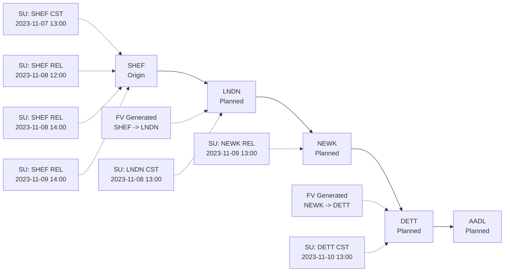

# Diagram: entity_core/entity_service/entity_service_tests/update_current_planned_trip_leg/test_data.py

> Auto-generated by Obscura crawlers

## Diagram 1

```mermaid
classDiagram
class TestData {
  +solution_id: FV_TEST
  +entity_external_id: AAA00011122233344
}
class StatusUpdate {
  +id: int
  +code: string
  +source_id: string
  +shipper_location_code: string
  +ts: datetime
}
class TripLeg {
  +id: string
  +internal_id: int
  +transport_mode: string
  +origin_code: string
  +dest_code: string
  +active: bool
}
TestData *-- StatusUpdate : contains
TestData *-- TripLeg : contains
class status_update_shef {
  id: 1111
  code: CST
  source: TEST_PARTNER
  location: SHEF
  ts: 2023-11-07 13:00
}
class status_update_shef2 {
  id: 1212
  code: REL
  source: TEST_PARTNER
  location: SHEF
  ts: 2023-11-08 12:00
}
class status_update_shef3 {
  id: 1212
  code: REL
  source: TEST_PARTNER
  location: SHEF
  ts: 2023-11-08 14:00
}
class status_update_shef4 {
  id: 1212
  code: REL
  source: TEST_PARTNER
  location: SHEF
  ts: 2023-11-09 14:00
}
class status_update_lndn {
  id: 33333
  code: CST
  source: FV3221778A
  location: LNDN
  ts: 2023-11-08 13:00
}
class status_update_newk {
  id: 22222
  code: REL
  source: FV3221778A
  location: NEWK
  ts: 2023-11-09 13:00
}
class status_update_dett {
  id: 44444
  code: CST
  source: FV3221778A
  location: DETT
  ts: 2023-11-10 13:00
}
TestData o-- status_update_shef
TestData o-- status_update_shef2
TestData o-- status_update_shef3
TestData o-- status_update_shef4
TestData o-- status_update_lndn
TestData o-- status_update_newk
TestData o-- status_update_dett
class planned_trip_leg_shef_to_lndn {
  id: AF7EU97Z2N-1P
  internal_id: 27599381
  transport_mode: Truck
  origin: SHEF
  dest: LNDN
  active: false
}
class planned_trip_leg_lndn_to_newk {
  id: AF7EU97Z2N-2P
  internal_id: 27599382
  transport_mode: Ocean
  origin: LNDN
  dest: NEWK
  active: false
}
class planned_trip_leg_newk_to_dett {
  id: AF7EU97Z2N-3P
  internal_id: 27599383
  transport_mode: Rail
  origin: NEWK
  dest: DETT
  active: false
}
class planned_trip_leg_dett_to_aadl {
  id: AF7EU97Z2N-4P
  internal_id: 27599384
  transport_mode: True
  origin: DETT
  dest: AADL
  active: true
}
class fv_generated_shef_to_lndn {
  id: AAA00011122233344-O-LNDN
  internal_id: 27599387
  transport_mode: Multimodal
  origin: SHEF
  dest: LNDN
  active: false
}
TestData o-- planned_trip_leg_shef_to_lndn
TestData o-- planned_trip_leg_lndn_to_newk
TestData o-- planned_trip_leg_newk_to_dett
TestData o-- planned_trip_leg_dett_to_aadl
TestData o-- fv_generated_shef_to_lndn
```

### SVG

<svg id="container" width="4485.21875" xmlns="http://www.w3.org/2000/svg" class="classDiagram" height="474" viewBox="0 0 4485.21875 474" role="graphics-document document" aria-roledescription="class"><g><defs><marker id="container_class-aggregationStart" class="marker aggregation class" refX="18" refY="7" markerWidth="190" markerHeight="240" orient="auto"><path d="M 18,7 L9,13 L1,7 L9,1 Z"></path></marker></defs><defs><marker id="container_class-aggregationEnd" class="marker aggregation class" refX="1" refY="7" markerWidth="20" markerHeight="28" orient="auto"><path d="M 18,7 L9,13 L1,7 L9,1 Z"></path></marker></defs><defs><marker id="container_class-extensionStart" class="marker extension class" refX="18" refY="7" markerWidth="190" markerHeight="240" orient="auto"><path d="M 1,7 L18,13 V 1 Z"></path></marker></defs><defs><marker id="container_class-extensionEnd" class="marker extension class" refX="1" refY="7" markerWidth="20" markerHeight="28" orient="auto"><path d="M 1,1 V 13 L18,7 Z"></path></marker></defs><defs><marker id="container_class-compositionStart" class="marker composition class" refX="18" refY="7" markerWidth="190" markerHeight="240" orient="auto"><path d="M 18,7 L9,13 L1,7 L9,1 Z"></path></marker></defs><defs><marker id="container_class-compositionEnd" class="marker composition class" refX="1" refY="7" markerWidth="20" markerHeight="28" orient="auto"><path d="M 18,7 L9,13 L1,7 L9,1 Z"></path></marker></defs><defs><marker id="container_class-dependencyStart" class="marker dependency class" refX="6" refY="7" markerWidth="190" markerHeight="240" orient="auto"><path d="M 5,7 L9,13 L1,7 L9,1 Z"></path></marker></defs><defs><marker id="container_class-dependencyEnd" class="marker dependency class" refX="13" refY="7" markerWidth="20" markerHeight="28" orient="auto"><path d="M 18,7 L9,13 L14,7 L9,1 Z"></path></marker></defs><defs><marker id="container_class-lollipopStart" class="marker lollipop class" refX="13" refY="7" markerWidth="190" markerHeight="240" orient="auto"><circle stroke="black" fill="transparent" cx="7" cy="7" r="6"></circle></marker></defs><defs><marker id="container_class-lollipopEnd" class="marker lollipop class" refX="1" refY="7" markerWidth="190" markerHeight="240" orient="auto"><circle stroke="black" fill="transparent" cx="7" cy="7" r="6"></circle></marker></defs><g class="root"><g class="clusters"></g><g class="edgePaths"><path d="M1944.495,90.386L1646.41,106.821C1348.325,123.257,752.155,156.129,454.069,180.731C155.984,205.333,155.984,221.667,155.984,229.833L155.984,238" id="id_TestData_StatusUpdate_1" class="edge-thickness-normal edge-pattern-solid relation" style=";;;" data-edge="true" data-et="edge" data-id="id_TestData_StatusUpdate_1" data-points="W3sieCI6MTk2MS43MTg3NSwieSI6ODkuNDM1ODc3NDczNDMyOTV9LHsieCI6MTU1Ljk4NDM3NSwieSI6MTg5fSx7IngiOjE1NS45ODQzNzUsInkiOjIzOH1d" marker-start="url(#container_class-compositionStart)"></path><path d="M1944.506,92.324L1698.257,108.437C1452.008,124.549,959.51,156.775,713.261,179.054C467.012,201.333,467.012,213.667,467.012,219.833L467.012,226" id="id_TestData_TripLeg_2" class="edge-thickness-normal edge-pattern-solid relation" style=";;;" data-edge="true" data-et="edge" data-id="id_TestData_TripLeg_2" data-points="W3sieCI6MTk2MS43MTg3NSwieSI6OTEuMTk3NjQxMDE3MjIzMzl9LHsieCI6NDY3LjAxMTcxODc1LCJ5IjoxODl9LHsieCI6NDY3LjAxMTcxODc1LCJ5IjoyMjZ9XQ==" marker-start="url(#container_class-compositionStart)"></path><path d="M1944.523,94.939L1746.89,110.616C1549.257,126.293,1153.992,157.646,956.359,181.49C758.727,205.333,758.727,221.667,758.727,229.833L758.727,238" id="id_TestData_status_update_shef_3" class="edge-thickness-normal edge-pattern-solid relation" style=";;;" data-edge="true" data-et="edge" data-id="id_TestData_status_update_shef_3" data-points="W3sieCI6MTk2MS43MTg3NSwieSI6OTMuNTc0ODAzMjgzOTA3OTR9LHsieCI6NzU4LjcyNjU2MjUsInkiOjE4OX0seyJ4Ijo3NTguNzI2NTYyNSwieSI6MjM4fV0=" marker-start="url(#container_class-aggregationStart)"></path><path d="M1944.558,99.278L1798.502,114.232C1652.445,129.185,1360.332,159.093,1214.275,182.213C1068.219,205.333,1068.219,221.667,1068.219,229.833L1068.219,238" id="id_TestData_status_update_shef2_4" class="edge-thickness-normal edge-pattern-solid relation" style=";;;" data-edge="true" data-et="edge" data-id="id_TestData_status_update_shef2_4" data-points="W3sieCI6MTk2MS43MTg3NSwieSI6OTcuNTIxMDQyMzE5NDYxNjd9LHsieCI6MTA2OC4yMTg3NSwieSI6MTg5fSx7IngiOjEwNjguMjE4NzUsInkiOjIzOH1d" marker-start="url(#container_class-aggregationStart)"></path><path d="M1944.647,107.245L1850.523,120.871C1756.399,134.497,1568.15,161.748,1474.026,183.541C1379.902,205.333,1379.902,221.667,1379.902,229.833L1379.902,238" id="id_TestData_status_update_shef3_5" class="edge-thickness-normal edge-pattern-solid relation" style=";;;" data-edge="true" data-et="edge" data-id="id_TestData_status_update_shef3_5" data-points="W3sieCI6MTk2MS43MTg3NSwieSI6MTA0Ljc3Mzg4Mzk0NTk0MTc1fSx7IngiOjEzNzkuOTAyMzQzNzUsInkiOjE4OX0seyJ4IjoxMzc5LjkwMjM0Mzc1LCJ5IjoyMzh9XQ==" marker-start="url(#container_class-aggregationStart)"></path><path d="M1944.972,126.418L1902.755,136.848C1860.538,147.279,1776.103,168.139,1733.885,186.736C1691.668,205.333,1691.668,221.667,1691.668,229.833L1691.668,238" id="id_TestData_status_update_shef4_6" class="edge-thickness-normal edge-pattern-solid relation" style=";;;" data-edge="true" data-et="edge" data-id="id_TestData_status_update_shef4_6" data-points="W3sieCI6MTk2MS43MTg3NSwieSI6MTIyLjI4MDUzMDg4NzI2MTcyfSx7IngiOjE2OTEuNjY3OTY4NzUsInkiOjE4OX0seyJ4IjoxNjkxLjY2Nzk2ODc1LCJ5IjoyMzh9XQ==" marker-start="url(#container_class-aggregationStart)"></path><path d="M2024.704,162.459L2018.902,166.883C2013.101,171.306,2001.498,180.153,1995.696,192.743C1989.895,205.333,1989.895,221.667,1989.895,229.833L1989.895,238" id="id_TestData_status_update_lndn_7" class="edge-thickness-normal edge-pattern-solid relation" style=";;;" data-edge="true" data-et="edge" data-id="id_TestData_status_update_lndn_7" data-points="W3sieCI6MjAzOC40MjEyMjk5MzExOTI2LCJ5IjoxNTJ9LHsieCI6MTk4OS44OTQ1MzEyNSwieSI6MTg5fSx7IngiOjE5ODkuODk0NTMxMjUsInkiOjIzOH1d" marker-start="url(#container_class-aggregationStart)"></path><path d="M2240.999,162.459L2246.801,166.883C2252.602,171.306,2264.206,180.153,2270.007,192.743C2275.809,205.333,2275.809,221.667,2275.809,229.833L2275.809,238" id="id_TestData_status_update_newk_8" class="edge-thickness-normal edge-pattern-solid relation" style=";;;" data-edge="true" data-et="edge" data-id="id_TestData_status_update_newk_8" data-points="W3sieCI6MjIyNy4yODE4OTUwNjg4MDc0LCJ5IjoxNTJ9LHsieCI6MjI3NS44MDg1OTM3NSwieSI6MTg5fSx7IngiOjIyNzUuODA4NTkzNzUsInkiOjIzOH1d" marker-start="url(#container_class-aggregationStart)"></path><path d="M2320.698,127.971L2360.528,138.143C2400.357,148.314,2480.017,168.657,2519.846,186.995C2559.676,205.333,2559.676,221.667,2559.676,229.833L2559.676,238" id="id_TestData_status_update_dett_9" class="edge-thickness-normal edge-pattern-solid relation" style=";;;" data-edge="true" data-et="edge" data-id="id_TestData_status_update_dett_9" data-points="W3sieCI6MjMwMy45ODQzNzUsInkiOjEyMy43MDI5NDc4MjUwNTI0fSx7IngiOjI1NTkuNjc1NzgxMjUsInkiOjE4OX0seyJ4IjoyNTU5LjY3NTc4MTI1LCJ5IjoyMzh9XQ==" marker-start="url(#container_class-aggregationStart)"></path><path d="M2321.052,107.594L2413.589,121.162C2506.126,134.729,2691.2,161.865,2783.737,181.599C2876.273,201.333,2876.273,213.667,2876.273,219.833L2876.273,226" id="id_TestData_planned_trip_leg_shef_to_lndn_10" class="edge-thickness-normal edge-pattern-solid relation" style=";;;" data-edge="true" data-et="edge" data-id="id_TestData_planned_trip_leg_shef_to_lndn_10" data-points="W3sieCI6MjMwMy45ODQzNzUsInkiOjEwNS4wOTEzNzQzNDU4MjQ4NX0seyJ4IjoyODc2LjI3MzQzNzUsInkiOjE4OX0seyJ4IjoyODc2LjI3MzQzNzUsInkiOjIyNn1d" marker-start="url(#container_class-aggregationStart)"></path><path d="M2321.15,98.642L2473.265,113.702C2625.38,128.761,2929.61,158.881,3081.725,180.107C3233.84,201.333,3233.84,213.667,3233.84,219.833L3233.84,226" id="id_TestData_planned_trip_leg_lndn_to_newk_11" class="edge-thickness-normal edge-pattern-solid relation" style=";;;" data-edge="true" data-et="edge" data-id="id_TestData_planned_trip_leg_lndn_to_newk_11" data-points="W3sieCI6MjMwMy45ODQzNzUsInkiOjk2Ljk0MjQ4NDIwMjc1ODE4fSx7IngiOjMyMzMuODM5ODQzNzUsInkiOjE4OX0seyJ4IjozMjMzLjgzOTg0Mzc1LCJ5IjoyMjZ9XQ==" marker-start="url(#container_class-aggregationStart)"></path><path d="M2321.186,94.117L2532.152,109.931C2743.118,125.745,3165.049,157.372,3376.015,179.353C3586.98,201.333,3586.98,213.667,3586.98,219.833L3586.98,226" id="id_TestData_planned_trip_leg_newk_to_dett_12" class="edge-thickness-normal edge-pattern-solid relation" style=";;;" data-edge="true" data-et="edge" data-id="id_TestData_planned_trip_leg_newk_to_dett_12" data-points="W3sieCI6MjMwMy45ODQzNzUsInkiOjkyLjgyNzkzODc2MjczNjV9LHsieCI6MzU4Ni45ODA0Njg3NSwieSI6MTg5fSx7IngiOjM1ODYuOTgwNDY4NzUsInkiOjIyNn1d" marker-start="url(#container_class-aggregationStart)"></path><path d="M2321.203,91.416L2589.537,107.68C2857.872,123.944,3394.542,156.472,3662.876,178.903C3931.211,201.333,3931.211,213.667,3931.211,219.833L3931.211,226" id="id_TestData_planned_trip_leg_dett_to_aadl_13" class="edge-thickness-normal edge-pattern-solid relation" style=";;;" data-edge="true" data-et="edge" data-id="id_TestData_planned_trip_leg_dett_to_aadl_13" data-points="W3sieCI6MjMwMy45ODQzNzUsInkiOjkwLjM3MjQ5NjYzMzIxNjA0fSx7IngiOjM5MzEuMjEwOTM3NSwieSI6MTg5fSx7IngiOjM5MzEuMjEwOTM3NSwieSI6MjI2fV0=" marker-start="url(#container_class-aggregationStart)"></path><path d="M2321.213,89.461L2651.491,106.051C2981.769,122.641,3642.326,155.82,3972.604,178.577C4302.883,201.333,4302.883,213.667,4302.883,219.833L4302.883,226" id="id_TestData_fv_generated_shef_to_lndn_14" class="edge-thickness-normal edge-pattern-solid relation" style=";;;" data-edge="true" data-et="edge" data-id="id_TestData_fv_generated_shef_to_lndn_14" data-points="W3sieCI6MjMwMy45ODQzNzUsInkiOjg4LjU5NTk0ODM1OTAzODZ9LHsieCI6NDMwMi44ODI4MTI1LCJ5IjoxODl9LHsieCI6NDMwMi44ODI4MTI1LCJ5IjoyMjZ9XQ==" marker-start="url(#container_class-aggregationStart)"></path></g><g class="edgeLabels"><g class="edgeLabel" transform="translate(155.984375, 189)"><g class="label" data-id="id_TestData_StatusUpdate_1" transform="translate(-30.890625, -12)"><foreignObject width="61.78125" height="24">

contains

</foreignObject></g></g><g class="edgeLabel" transform="translate(467.01171875, 189)"><g class="label" data-id="id_TestData_TripLeg_2" transform="translate(-30.890625, -12)"><foreignObject width="61.78125" height="24">

contains

</foreignObject></g></g><g class="edgeLabel"><g class="label" data-id="id_TestData_status_update_shef_3" transform="translate(0, 0)"><foreignObject width="0" height="0">

</foreignObject></g></g><g class="edgeLabel"><g class="label" data-id="id_TestData_status_update_shef2_4" transform="translate(0, 0)"><foreignObject width="0" height="0">

</foreignObject></g></g><g class="edgeLabel"><g class="label" data-id="id_TestData_status_update_shef3_5" transform="translate(0, 0)"><foreignObject width="0" height="0">

</foreignObject></g></g><g class="edgeLabel"><g class="label" data-id="id_TestData_status_update_shef4_6" transform="translate(0, 0)"><foreignObject width="0" height="0">

</foreignObject></g></g><g class="edgeLabel"><g class="label" data-id="id_TestData_status_update_lndn_7" transform="translate(0, 0)"><foreignObject width="0" height="0">

</foreignObject></g></g><g class="edgeLabel"><g class="label" data-id="id_TestData_status_update_newk_8" transform="translate(0, 0)"><foreignObject width="0" height="0">

</foreignObject></g></g><g class="edgeLabel"><g class="label" data-id="id_TestData_status_update_dett_9" transform="translate(0, 0)"><foreignObject width="0" height="0">

</foreignObject></g></g><g class="edgeLabel"><g class="label" data-id="id_TestData_planned_trip_leg_shef_to_lndn_10" transform="translate(0, 0)"><foreignObject width="0" height="0">

</foreignObject></g></g><g class="edgeLabel"><g class="label" data-id="id_TestData_planned_trip_leg_lndn_to_newk_11" transform="translate(0, 0)"><foreignObject width="0" height="0">

</foreignObject></g></g><g class="edgeLabel"><g class="label" data-id="id_TestData_planned_trip_leg_newk_to_dett_12" transform="translate(0, 0)"><foreignObject width="0" height="0">

</foreignObject></g></g><g class="edgeLabel"><g class="label" data-id="id_TestData_planned_trip_leg_dett_to_aadl_13" transform="translate(0, 0)"><foreignObject width="0" height="0">

</foreignObject></g></g><g class="edgeLabel"><g class="label" data-id="id_TestData_fv_generated_shef_to_lndn_14" transform="translate(0, 0)"><foreignObject width="0" height="0">

</foreignObject></g></g></g><g class="nodes"><g class="node default" id="classId-TestData-0" transform="translate(2132.8515625, 80)"><g class="basic label-container"><path d="M-171.1328125 -72 L171.1328125 -72 L171.1328125 72 L-171.1328125 72" stroke="none" stroke-width="0" fill="#ECECFF" style=""></path><path d="M-171.1328125 -72 C-99.1750398445263 -72, -27.217267189052592 -72, 171.1328125 -72 M-171.1328125 -72 C-70.0681064660213 -72, 30.99659956795739 -72, 171.1328125 -72 M171.1328125 -72 C171.1328125 -36.20692393254737, 171.1328125 -0.4138478650947377, 171.1328125 72 M171.1328125 -72 C171.1328125 -38.58885091156205, 171.1328125 -5.177701823124096, 171.1328125 72 M171.1328125 72 C78.21017740745543 72, -14.712457685089134 72, -171.1328125 72 M171.1328125 72 C42.33796706599546 72, -86.45687836800909 72, -171.1328125 72 M-171.1328125 72 C-171.1328125 32.45807804214073, -171.1328125 -7.083843915718546, -171.1328125 -72 M-171.1328125 72 C-171.1328125 25.48652024816218, -171.1328125 -21.02695950367564, -171.1328125 -72" stroke="#9370DB" stroke-width="1.3" fill="none" stroke-dasharray="0 0" style=""></path></g><g class="annotation-group text" transform="translate(0, -48)"></g><g class="label-group text" transform="translate(-32.140625, -48)"><g class="label" style="font-weight: bolder" transform="translate(0,-12)"><foreignObject width="64.28125" height="24">

TestData

</foreignObject></g></g><g class="members-group text" transform="translate(-159.1328125, 0)"><g class="label" style="" transform="translate(0,-12)"><foreignObject width="155.078125" height="24">

+solution_id: FV_TEST

</foreignObject></g><g class="label" style="" transform="translate(0,12)"><foreignObject width="286.125" height="24">

+entity_external_id: AAA00011122233344

</foreignObject></g></g><g class="methods-group text" transform="translate(-159.1328125, 72)"></g><g class="divider" style=""><path d="M-171.1328125 -24 C-70.36166893750188 -24, 30.40947462499625 -24, 171.1328125 -24 M-171.1328125 -24 C-97.93443277807259 -24, -24.73605305614518 -24, 171.1328125 -24" stroke="#9370DB" stroke-width="1.3" fill="none" stroke-dasharray="0 0" style=""></path></g><g class="divider" style=""><path d="M-171.1328125 48 C-101.09424815912007 48, -31.05568381824014 48, 171.1328125 48 M-171.1328125 48 C-85.40055781693688 48, 0.3316968661262365 48, 171.1328125 48" stroke="#9370DB" stroke-width="1.3" fill="none" stroke-dasharray="0 0" style=""></path></g></g><g class="node default" id="classId-StatusUpdate-1" transform="translate(155.984375, 346)"><g class="basic label-container"><path d="M-147.984375 -108 L147.984375 -108 L147.984375 108 L-147.984375 108" stroke="none" stroke-width="0" fill="#ECECFF" style=""></path><path d="M-147.984375 -108 C-45.61014100900046 -108, 56.764092981999084 -108, 147.984375 -108 M-147.984375 -108 C-66.41462628445764 -108, 15.15512243108472 -108, 147.984375 -108 M147.984375 -108 C147.984375 -44.573273569521305, 147.984375 18.85345286095739, 147.984375 108 M147.984375 -108 C147.984375 -59.672021338506575, 147.984375 -11.34404267701315, 147.984375 108 M147.984375 108 C44.900822749501714 108, -58.18272950099657 108, -147.984375 108 M147.984375 108 C86.69715860164783 108, 25.409942203295643 108, -147.984375 108 M-147.984375 108 C-147.984375 50.285126407361325, -147.984375 -7.42974718527735, -147.984375 -108 M-147.984375 108 C-147.984375 39.97480487123981, -147.984375 -28.050390257520377, -147.984375 -108" stroke="#9370DB" stroke-width="1.3" fill="none" stroke-dasharray="0 0" style=""></path></g><g class="annotation-group text" transform="translate(0, -84)"></g><g class="label-group text" transform="translate(-50.015625, -84)"><g class="label" style="font-weight: bolder" transform="translate(0,-12)"><foreignObject width="100.03125" height="24">

StatusUpdate

</foreignObject></g></g><g class="members-group text" transform="translate(-135.984375, -36)"><g class="label" style="" transform="translate(0,-12)"><foreignObject width="49.8125" height="24">

+id: int

</foreignObject></g><g class="label" style="" transform="translate(0,12)"><foreignObject width="92.65625" height="24">

+code: string

</foreignObject></g><g class="label" style="" transform="translate(0,36)"><foreignObject width="127.65625" height="24">

+source_id: string

</foreignObject></g><g class="label" style="" transform="translate(0,60)"><foreignObject width="221.953125" height="24">

+shipper_location_code: string

</foreignObject></g><g class="label" style="" transform="translate(0,84)"><foreignObject width="94.484375" height="24">

+ts: datetime

</foreignObject></g></g><g class="methods-group text" transform="translate(-135.984375, 108)"></g><g class="divider" style=""><path d="M-147.984375 -60 C-84.68195984891082 -60, -21.37954469782163 -60, 147.984375 -60 M-147.984375 -60 C-48.80557002679777 -60, 50.373234946404466 -60, 147.984375 -60" stroke="#9370DB" stroke-width="1.3" fill="none" stroke-dasharray="0 0" style=""></path></g><g class="divider" style=""><path d="M-147.984375 84 C-31.739172191720087 84, 84.50603061655983 84, 147.984375 84 M-147.984375 84 C-76.94764285998035 84, -5.910910719960697 84, 147.984375 84" stroke="#9370DB" stroke-width="1.3" fill="none" stroke-dasharray="0 0" style=""></path></g></g><g class="node default" id="classId-TripLeg-2" transform="translate(467.01171875, 346)"><g class="basic label-container"><path d="M-113.04296875 -120 L113.04296875 -120 L113.04296875 120 L-113.04296875 120" stroke="none" stroke-width="0" fill="#ECECFF" style=""></path><path d="M-113.04296875 -120 C-49.04457201739739 -120, 14.953824715205215 -120, 113.04296875 -120 M-113.04296875 -120 C-25.21443194125439 -120, 62.61410486749122 -120, 113.04296875 -120 M113.04296875 -120 C113.04296875 -54.412181696940976, 113.04296875 11.175636606118047, 113.04296875 120 M113.04296875 -120 C113.04296875 -43.51605500555432, 113.04296875 32.96788998889136, 113.04296875 120 M113.04296875 120 C59.89601523712206 120, 6.749061724244115 120, -113.04296875 120 M113.04296875 120 C55.1104826422252 120, -2.8220034655495994 120, -113.04296875 120 M-113.04296875 120 C-113.04296875 46.90987601070664, -113.04296875 -26.18024797858672, -113.04296875 -120 M-113.04296875 120 C-113.04296875 38.75496496922389, -113.04296875 -42.49007006155222, -113.04296875 -120" stroke="#9370DB" stroke-width="1.3" fill="none" stroke-dasharray="0 0" style=""></path></g><g class="annotation-group text" transform="translate(0, -96)"></g><g class="label-group text" transform="translate(-27.0546875, -96)"><g class="label" style="font-weight: bolder" transform="translate(0,-12)"><foreignObject width="54.109375" height="24">

TripLeg

</foreignObject></g></g><g class="members-group text" transform="translate(-101.04296875, -48)"><g class="label" style="" transform="translate(0,-12)"><foreignObject width="71.78125" height="24">

+id: string

</foreignObject></g><g class="label" style="" transform="translate(0,12)"><foreignObject width="115.0625" height="24">

+internal_id: int

</foreignObject></g><g class="label" style="" transform="translate(0,36)"><foreignObject width="175.03125" height="24">

+transport_mode: string

</foreignObject></g><g class="label" style="" transform="translate(0,60)"><foreignObject width="142.90625" height="24">

+origin_code: string

</foreignObject></g><g class="label" style="" transform="translate(0,84)"><foreignObject width="132.203125" height="24">

+dest_code: string

</foreignObject></g><g class="label" style="" transform="translate(0,108)"><foreignObject width="91.875" height="24">

+active: bool

</foreignObject></g></g><g class="methods-group text" transform="translate(-101.04296875, 120)"></g><g class="divider" style=""><path d="M-113.04296875 -72 C-28.658562241957426 -72, 55.72584426608515 -72, 113.04296875 -72 M-113.04296875 -72 C-27.8071389611231 -72, 57.4286908277538 -72, 113.04296875 -72" stroke="#9370DB" stroke-width="1.3" fill="none" stroke-dasharray="0 0" style=""></path></g><g class="divider" style=""><path d="M-113.04296875 96 C-36.534678936647055 96, 39.97361087670589 96, 113.04296875 96 M-113.04296875 96 C-54.394691057816374 96, 4.253586634367252 96, 113.04296875 96" stroke="#9370DB" stroke-width="1.3" fill="none" stroke-dasharray="0 0" style=""></path></g></g><g class="node default" id="classId-status_update_shef-3" transform="translate(758.7265625, 346)"><g class="basic label-container"><path d="M-128.671875 -108 L128.671875 -108 L128.671875 108 L-128.671875 108" stroke="none" stroke-width="0" fill="#ECECFF" style=""></path><path d="M-128.671875 -108 C-28.935315461332365 -108, 70.80124407733527 -108, 128.671875 -108 M-128.671875 -108 C-54.67286288169021 -108, 19.326149236619585 -108, 128.671875 -108 M128.671875 -108 C128.671875 -42.34865943068641, 128.671875 23.30268113862718, 128.671875 108 M128.671875 -108 C128.671875 -24.681293674065543, 128.671875 58.637412651868914, 128.671875 108 M128.671875 108 C50.430180302624905 108, -27.81151439475019 108, -128.671875 108 M128.671875 108 C61.64144743164144 108, -5.388980136717123 108, -128.671875 108 M-128.671875 108 C-128.671875 61.59507455669931, -128.671875 15.190149113398618, -128.671875 -108 M-128.671875 108 C-128.671875 52.88612147005997, -128.671875 -2.2277570598800622, -128.671875 -108" stroke="#9370DB" stroke-width="1.3" fill="none" stroke-dasharray="0 0" style=""></path></g><g class="annotation-group text" transform="translate(0, -84)"></g><g class="label-group text" transform="translate(-72.25, -84)"><g class="label" style="font-weight: bolder" transform="translate(0,-12)"><foreignObject width="144.5" height="24">

status_update_shef

</foreignObject></g></g><g class="members-group text" transform="translate(-116.671875, -36)"><g class="label" style="" transform="translate(0,-12)"><foreignObject width="49.203125" height="24">

id: 1111

</foreignObject></g><g class="label" style="" transform="translate(0,12)"><foreignObject width="68.484375" height="24">

code: CST

</foreignObject></g><g class="label" style="" transform="translate(0,36)"><foreignObject width="161.09375" height="24">

source: TEST_PARTNER

</foreignObject></g><g class="label" style="" transform="translate(0,60)"><foreignObject width="103.25" height="24">

location: SHEF

</foreignObject></g><g class="label" style="" transform="translate(0,84)"><foreignObject width="135.78125" height="24">

ts: 2023-11-07 13:00

</foreignObject></g></g><g class="methods-group text" transform="translate(-116.671875, 108)"></g><g class="divider" style=""><path d="M-128.671875 -60 C-38.21228543487523 -60, 52.247304130249546 -60, 128.671875 -60 M-128.671875 -60 C-55.78501485251215 -60, 17.101845294975703 -60, 128.671875 -60" stroke="#9370DB" stroke-width="1.3" fill="none" stroke-dasharray="0 0" style=""></path></g><g class="divider" style=""><path d="M-128.671875 84 C-40.375308124194476 84, 47.92125875161105 84, 128.671875 84 M-128.671875 84 C-45.329301145917015 84, 38.01327270816597 84, 128.671875 84" stroke="#9370DB" stroke-width="1.3" fill="none" stroke-dasharray="0 0" style=""></path></g></g><g class="node default" id="classId-status_update_shef2-4" transform="translate(1068.21875, 346)"><g class="basic label-container"><path d="M-130.8203125 -108 L130.8203125 -108 L130.8203125 108 L-130.8203125 108" stroke="none" stroke-width="0" fill="#ECECFF" style=""></path><path d="M-130.8203125 -108 C-65.94437013156973 -108, -1.0684277631394536 -108, 130.8203125 -108 M-130.8203125 -108 C-35.08823779843327 -108, 60.64383690313346 -108, 130.8203125 -108 M130.8203125 -108 C130.8203125 -56.68000307305637, 130.8203125 -5.360006146112738, 130.8203125 108 M130.8203125 -108 C130.8203125 -38.750380534432466, 130.8203125 30.499238931135068, 130.8203125 108 M130.8203125 108 C67.32205125192733 108, 3.8237900038546684 108, -130.8203125 108 M130.8203125 108 C34.351820348445955 108, -62.11667180310809 108, -130.8203125 108 M-130.8203125 108 C-130.8203125 59.36015489950318, -130.8203125 10.720309799006358, -130.8203125 -108 M-130.8203125 108 C-130.8203125 47.904415242978, -130.8203125 -12.191169514044006, -130.8203125 -108" stroke="#9370DB" stroke-width="1.3" fill="none" stroke-dasharray="0 0" style=""></path></g><g class="annotation-group text" transform="translate(0, -84)"></g><g class="label-group text" transform="translate(-76.546875, -84)"><g class="label" style="font-weight: bolder" transform="translate(0,-12)"><foreignObject width="153.09375" height="24">

status_update_shef2

</foreignObject></g></g><g class="members-group text" transform="translate(-118.8203125, -36)"><g class="label" style="" transform="translate(0,-12)"><foreignObject width="51.46875" height="24">

id: 1212

</foreignObject></g><g class="label" style="" transform="translate(0,12)"><foreignObject width="69.25" height="24">

code: REL

</foreignObject></g><g class="label" style="" transform="translate(0,36)"><foreignObject width="161.09375" height="24">

source: TEST_PARTNER

</foreignObject></g><g class="label" style="" transform="translate(0,60)"><foreignObject width="103.25" height="24">

location: SHEF

</foreignObject></g><g class="label" style="" transform="translate(0,84)"><foreignObject width="137.75" height="24">

ts: 2023-11-08 12:00

</foreignObject></g></g><g class="methods-group text" transform="translate(-118.8203125, 108)"></g><g class="divider" style=""><path d="M-130.8203125 -60 C-44.91659338769104 -60, 40.987125724617925 -60, 130.8203125 -60 M-130.8203125 -60 C-73.70346562718328 -60, -16.58661875436657 -60, 130.8203125 -60" stroke="#9370DB" stroke-width="1.3" fill="none" stroke-dasharray="0 0" style=""></path></g><g class="divider" style=""><path d="M-130.8203125 84 C-39.533762327614696 84, 51.75278784477061 84, 130.8203125 84 M-130.8203125 84 C-60.19344706844625 84, 10.433418363107506 84, 130.8203125 84" stroke="#9370DB" stroke-width="1.3" fill="none" stroke-dasharray="0 0" style=""></path></g></g><g class="node default" id="classId-status_update_shef3-5" transform="translate(1379.90234375, 346)"><g class="basic label-container"><path d="M-130.86328125 -108 L130.86328125 -108 L130.86328125 108 L-130.86328125 108" stroke="none" stroke-width="0" fill="#ECECFF" style=""></path><path d="M-130.86328125 -108 C-67.2622067164824 -108, -3.661132182964792 -108, 130.86328125 -108 M-130.86328125 -108 C-47.927747523406765 -108, 35.00778620318647 -108, 130.86328125 -108 M130.86328125 -108 C130.86328125 -59.3185283914833, 130.86328125 -10.637056782966596, 130.86328125 108 M130.86328125 -108 C130.86328125 -52.83994751907909, 130.86328125 2.320104961841821, 130.86328125 108 M130.86328125 108 C61.51649496456642 108, -7.830291320867161 108, -130.86328125 108 M130.86328125 108 C36.72423262349028 108, -57.41481600301944 108, -130.86328125 108 M-130.86328125 108 C-130.86328125 57.54358692208149, -130.86328125 7.087173844162976, -130.86328125 -108 M-130.86328125 108 C-130.86328125 60.44745563104599, -130.86328125 12.89491126209198, -130.86328125 -108" stroke="#9370DB" stroke-width="1.3" fill="none" stroke-dasharray="0 0" style=""></path></g><g class="annotation-group text" transform="translate(0, -84)"></g><g class="label-group text" transform="translate(-76.6328125, -84)"><g class="label" style="font-weight: bolder" transform="translate(0,-12)"><foreignObject width="153.265625" height="24">

status_update_shef3

</foreignObject></g></g><g class="members-group text" transform="translate(-118.86328125, -36)"><g class="label" style="" transform="translate(0,-12)"><foreignObject width="51.46875" height="24">

id: 1212

</foreignObject></g><g class="label" style="" transform="translate(0,12)"><foreignObject width="69.25" height="24">

code: REL

</foreignObject></g><g class="label" style="" transform="translate(0,36)"><foreignObject width="161.09375" height="24">

source: TEST_PARTNER

</foreignObject></g><g class="label" style="" transform="translate(0,60)"><foreignObject width="103.25" height="24">

location: SHEF

</foreignObject></g><g class="label" style="" transform="translate(0,84)"><foreignObject width="138.34375" height="24">

ts: 2023-11-08 14:00

</foreignObject></g></g><g class="methods-group text" transform="translate(-118.86328125, 108)"></g><g class="divider" style=""><path d="M-130.86328125 -60 C-46.947911575707025 -60, 36.96745809858595 -60, 130.86328125 -60 M-130.86328125 -60 C-60.201825151108224 -60, 10.459630947783552 -60, 130.86328125 -60" stroke="#9370DB" stroke-width="1.3" fill="none" stroke-dasharray="0 0" style=""></path></g><g class="divider" style=""><path d="M-130.86328125 84 C-28.51465727426502 84, 73.83396670146996 84, 130.86328125 84 M-130.86328125 84 C-76.81929513560699 84, -22.775309021213985 84, 130.86328125 84" stroke="#9370DB" stroke-width="1.3" fill="none" stroke-dasharray="0 0" style=""></path></g></g><g class="node default" id="classId-status_update_shef4-6" transform="translate(1691.66796875, 346)"><g class="basic label-container"><path d="M-130.90234375 -108 L130.90234375 -108 L130.90234375 108 L-130.90234375 108" stroke="none" stroke-width="0" fill="#ECECFF" style=""></path><path d="M-130.90234375 -108 C-74.93615684259987 -108, -18.969969935199728 -108, 130.90234375 -108 M-130.90234375 -108 C-63.51748352196198 -108, 3.867376706076044 -108, 130.90234375 -108 M130.90234375 -108 C130.90234375 -56.50179787276543, 130.90234375 -5.003595745530859, 130.90234375 108 M130.90234375 -108 C130.90234375 -60.33809620840805, 130.90234375 -12.676192416816093, 130.90234375 108 M130.90234375 108 C67.06816371058682 108, 3.2339836711736325 108, -130.90234375 108 M130.90234375 108 C35.15948088026188 108, -60.58338198947624 108, -130.90234375 108 M-130.90234375 108 C-130.90234375 23.787645218210983, -130.90234375 -60.424709563578034, -130.90234375 -108 M-130.90234375 108 C-130.90234375 45.02806703527483, -130.90234375 -17.94386592945034, -130.90234375 -108" stroke="#9370DB" stroke-width="1.3" fill="none" stroke-dasharray="0 0" style=""></path></g><g class="annotation-group text" transform="translate(0, -84)"></g><g class="label-group text" transform="translate(-76.7109375, -84)"><g class="label" style="font-weight: bolder" transform="translate(0,-12)"><foreignObject width="153.421875" height="24">

status_update_shef4

</foreignObject></g></g><g class="members-group text" transform="translate(-118.90234375, -36)"><g class="label" style="" transform="translate(0,-12)"><foreignObject width="51.46875" height="24">

id: 1212

</foreignObject></g><g class="label" style="" transform="translate(0,12)"><foreignObject width="69.25" height="24">

code: REL

</foreignObject></g><g class="label" style="" transform="translate(0,36)"><foreignObject width="161.09375" height="24">

source: TEST_PARTNER

</foreignObject></g><g class="label" style="" transform="translate(0,60)"><foreignObject width="103.25" height="24">

location: SHEF

</foreignObject></g><g class="label" style="" transform="translate(0,84)"><foreignObject width="137.765625" height="24">

ts: 2023-11-09 14:00

</foreignObject></g></g><g class="methods-group text" transform="translate(-118.90234375, 108)"></g><g class="divider" style=""><path d="M-130.90234375 -60 C-52.25841175899792 -60, 26.385520232004154 -60, 130.90234375 -60 M-130.90234375 -60 C-70.73285334752953 -60, -10.563362945059055 -60, 130.90234375 -60" stroke="#9370DB" stroke-width="1.3" fill="none" stroke-dasharray="0 0" style=""></path></g><g class="divider" style=""><path d="M-130.90234375 84 C-55.11980359847118 84, 20.66273655305764 84, 130.90234375 84 M-130.90234375 84 C-75.14161048030309 84, -19.380877210606172 84, 130.90234375 84" stroke="#9370DB" stroke-width="1.3" fill="none" stroke-dasharray="0 0" style=""></path></g></g><g class="node default" id="classId-status_update_lndn-7" transform="translate(1989.89453125, 346)"><g class="basic label-container"><path d="M-117.32421875 -108 L117.32421875 -108 L117.32421875 108 L-117.32421875 108" stroke="none" stroke-width="0" fill="#ECECFF" style=""></path><path d="M-117.32421875 -108 C-41.99446693035182 -108, 33.33528488929636 -108, 117.32421875 -108 M-117.32421875 -108 C-46.011074416110944 -108, 25.302069917778113 -108, 117.32421875 -108 M117.32421875 -108 C117.32421875 -41.262577910952444, 117.32421875 25.47484417809511, 117.32421875 108 M117.32421875 -108 C117.32421875 -63.41966544576097, 117.32421875 -18.83933089152194, 117.32421875 108 M117.32421875 108 C38.570793824460495 108, -40.18263110107901 108, -117.32421875 108 M117.32421875 108 C44.97586441088731 108, -27.372489928225377 108, -117.32421875 108 M-117.32421875 108 C-117.32421875 63.5217506850419, -117.32421875 19.043501370083803, -117.32421875 -108 M-117.32421875 108 C-117.32421875 46.321658599367254, -117.32421875 -15.356682801265492, -117.32421875 -108" stroke="#9370DB" stroke-width="1.3" fill="none" stroke-dasharray="0 0" style=""></path></g><g class="annotation-group text" transform="translate(0, -84)"></g><g class="label-group text" transform="translate(-72.8359375, -84)"><g class="label" style="font-weight: bolder" transform="translate(0,-12)"><foreignObject width="145.671875" height="24">

status_update_lndn

</foreignObject></g></g><g class="members-group text" transform="translate(-105.32421875, -36)"><g class="label" style="" transform="translate(0,-12)"><foreignObject width="62.09375" height="24">

id: 33333

</foreignObject></g><g class="label" style="" transform="translate(0,12)"><foreignObject width="68.484375" height="24">

code: CST

</foreignObject></g><g class="label" style="" transform="translate(0,36)"><foreignObject width="134.78125" height="24">

source: FV3221778A

</foreignObject></g><g class="label" style="" transform="translate(0,60)"><foreignObject width="107.375" height="24">

location: LNDN

</foreignObject></g><g class="label" style="" transform="translate(0,84)"><foreignObject width="137.8125" height="24">

ts: 2023-11-08 13:00

</foreignObject></g></g><g class="methods-group text" transform="translate(-105.32421875, 108)"></g><g class="divider" style=""><path d="M-117.32421875 -60 C-56.18739114102782 -60, 4.949436467944366 -60, 117.32421875 -60 M-117.32421875 -60 C-69.1479559724155 -60, -20.97169319483102 -60, 117.32421875 -60" stroke="#9370DB" stroke-width="1.3" fill="none" stroke-dasharray="0 0" style=""></path></g><g class="divider" style=""><path d="M-117.32421875 84 C-63.525954773687424 84, -9.727690797374848 84, 117.32421875 84 M-117.32421875 84 C-35.4600245510226 84, 46.4041696479548 84, 117.32421875 84" stroke="#9370DB" stroke-width="1.3" fill="none" stroke-dasharray="0 0" style=""></path></g></g><g class="node default" id="classId-status_update_newk-8" transform="translate(2275.80859375, 346)"><g class="basic label-container"><path d="M-118.58984375 -108 L118.58984375 -108 L118.58984375 108 L-118.58984375 108" stroke="none" stroke-width="0" fill="#ECECFF" style=""></path><path d="M-118.58984375 -108 C-41.624118141061786 -108, 35.34160746787643 -108, 118.58984375 -108 M-118.58984375 -108 C-34.523788232044154 -108, 49.54226728591169 -108, 118.58984375 -108 M118.58984375 -108 C118.58984375 -35.094956453072925, 118.58984375 37.81008709385415, 118.58984375 108 M118.58984375 -108 C118.58984375 -22.32962352132911, 118.58984375 63.34075295734178, 118.58984375 108 M118.58984375 108 C54.09095224479408 108, -10.407939260411837 108, -118.58984375 108 M118.58984375 108 C29.67105786119133 108, -59.24772802761734 108, -118.58984375 108 M-118.58984375 108 C-118.58984375 45.95076587228205, -118.58984375 -16.098468255435904, -118.58984375 -108 M-118.58984375 108 C-118.58984375 37.99219538132394, -118.58984375 -32.01560923735212, -118.58984375 -108" stroke="#9370DB" stroke-width="1.3" fill="none" stroke-dasharray="0 0" style=""></path></g><g class="annotation-group text" transform="translate(0, -84)"></g><g class="label-group text" transform="translate(-75.9453125, -84)"><g class="label" style="font-weight: bolder" transform="translate(0,-12)"><foreignObject width="151.890625" height="24">

status_update_newk

</foreignObject></g></g><g class="members-group text" transform="translate(-106.58984375, -36)"><g class="label" style="" transform="translate(0,-12)"><foreignObject width="61.765625" height="24">

id: 22222

</foreignObject></g><g class="label" style="" transform="translate(0,12)"><foreignObject width="69.25" height="24">

code: REL

</foreignObject></g><g class="label" style="" transform="translate(0,36)"><foreignObject width="134.78125" height="24">

source: FV3221778A

</foreignObject></g><g class="label" style="" transform="translate(0,60)"><foreignObject width="109.375" height="24">

location: NEWK

</foreignObject></g><g class="label" style="" transform="translate(0,84)"><foreignObject width="137.234375" height="24">

ts: 2023-11-09 13:00

</foreignObject></g></g><g class="methods-group text" transform="translate(-106.58984375, 108)"></g><g class="divider" style=""><path d="M-118.58984375 -60 C-70.48259544432537 -60, -22.375347138650724 -60, 118.58984375 -60 M-118.58984375 -60 C-64.123574052092 -60, -9.657304354183992 -60, 118.58984375 -60" stroke="#9370DB" stroke-width="1.3" fill="none" stroke-dasharray="0 0" style=""></path></g><g class="divider" style=""><path d="M-118.58984375 84 C-41.28211144022322 84, 36.02562086955356 84, 118.58984375 84 M-118.58984375 84 C-51.97978399617487 84, 14.630275757650253 84, 118.58984375 84" stroke="#9370DB" stroke-width="1.3" fill="none" stroke-dasharray="0 0" style=""></path></g></g><g class="node default" id="classId-status_update_dett-9" transform="translate(2559.67578125, 346)"><g class="basic label-container"><path d="M-115.27734375 -108 L115.27734375 -108 L115.27734375 108 L-115.27734375 108" stroke="none" stroke-width="0" fill="#ECECFF" style=""></path><path d="M-115.27734375 -108 C-36.973656267138 -108, 41.330031215724006 -108, 115.27734375 -108 M-115.27734375 -108 C-41.368609160861055 -108, 32.54012542827789 -108, 115.27734375 -108 M115.27734375 -108 C115.27734375 -50.946045372183136, 115.27734375 6.107909255633729, 115.27734375 108 M115.27734375 -108 C115.27734375 -52.63894665182967, 115.27734375 2.72210669634066, 115.27734375 108 M115.27734375 108 C46.76495027028429 108, -21.747443209431424 108, -115.27734375 108 M115.27734375 108 C26.369082992646483 108, -62.539177764707034 108, -115.27734375 108 M-115.27734375 108 C-115.27734375 25.067540722597897, -115.27734375 -57.864918554804206, -115.27734375 -108 M-115.27734375 108 C-115.27734375 63.00369996444891, -115.27734375 18.007399928897826, -115.27734375 -108" stroke="#9370DB" stroke-width="1.3" fill="none" stroke-dasharray="0 0" style=""></path></g><g class="annotation-group text" transform="translate(0, -84)"></g><g class="label-group text" transform="translate(-71.7421875, -84)"><g class="label" style="font-weight: bolder" transform="translate(0,-12)"><foreignObject width="143.484375" height="24">

status_update_dett

</foreignObject></g></g><g class="members-group text" transform="translate(-103.27734375, -36)"><g class="label" style="" transform="translate(0,-12)"><foreignObject width="64.734375" height="24">

id: 44444

</foreignObject></g><g class="label" style="" transform="translate(0,12)"><foreignObject width="68.484375" height="24">

code: CST

</foreignObject></g><g class="label" style="" transform="translate(0,36)"><foreignObject width="134.78125" height="24">

source: FV3221778A

</foreignObject></g><g class="label" style="" transform="translate(0,60)"><foreignObject width="102.640625" height="24">

location: DETT

</foreignObject></g><g class="label" style="" transform="translate(0,84)"><foreignObject width="134.8125" height="24">

ts: 2023-11-10 13:00

</foreignObject></g></g><g class="methods-group text" transform="translate(-103.27734375, 108)"></g><g class="divider" style=""><path d="M-115.27734375 -60 C-39.868884890388316 -60, 35.53957396922337 -60, 115.27734375 -60 M-115.27734375 -60 C-31.813932390729576 -60, 51.64947896854085 -60, 115.27734375 -60" stroke="#9370DB" stroke-width="1.3" fill="none" stroke-dasharray="0 0" style=""></path></g><g class="divider" style=""><path d="M-115.27734375 84 C-49.094098273871566 84, 17.089147202256868 84, 115.27734375 84 M-115.27734375 84 C-44.47856270897569 84, 26.320218332048626 84, 115.27734375 84" stroke="#9370DB" stroke-width="1.3" fill="none" stroke-dasharray="0 0" style=""></path></g></g><g class="node default" id="classId-planned_trip_leg_shef_to_lndn-10" transform="translate(2876.2734375, 346)"><g class="basic label-container"><path d="M-151.3203125 -120 L151.3203125 -120 L151.3203125 120 L-151.3203125 120" stroke="none" stroke-width="0" fill="#ECECFF" style=""></path><path d="M-151.3203125 -120 C-63.476763674287724 -120, 24.36678515142455 -120, 151.3203125 -120 M-151.3203125 -120 C-40.47346527666623 -120, 70.37338194666754 -120, 151.3203125 -120 M151.3203125 -120 C151.3203125 -39.97543557654154, 151.3203125 40.049128846916915, 151.3203125 120 M151.3203125 -120 C151.3203125 -29.882187894569867, 151.3203125 60.235624210860266, 151.3203125 120 M151.3203125 120 C87.59022313287238 120, 23.86013376574475 120, -151.3203125 120 M151.3203125 120 C47.685933351907465 120, -55.94844579618507 120, -151.3203125 120 M-151.3203125 120 C-151.3203125 62.71434703768584, -151.3203125 5.428694075371681, -151.3203125 -120 M-151.3203125 120 C-151.3203125 38.81858017786794, -151.3203125 -42.36283964426411, -151.3203125 -120" stroke="#9370DB" stroke-width="1.3" fill="none" stroke-dasharray="0 0" style=""></path></g><g class="annotation-group text" transform="translate(0, -96)"></g><g class="label-group text" transform="translate(-114.03125, -96)"><g class="label" style="font-weight: bolder" transform="translate(0,-12)"><foreignObject width="228.0625" height="24">

planned_trip_leg_shef_to_lndn

</foreignObject></g></g><g class="members-group text" transform="translate(-139.3203125, -48)"><g class="label" style="" transform="translate(0,-12)"><foreignObject width="129.0625" height="24">

id: AF7EU97Z2N-1P

</foreignObject></g><g class="label" style="" transform="translate(0,12)"><foreignObject width="149.546875" height="24">

internal_id: 27599381

</foreignObject></g><g class="label" style="" transform="translate(0,36)"><foreignObject width="164.609375" height="24">

transport_mode: Truck

</foreignObject></g><g class="label" style="" transform="translate(0,60)"><foreignObject width="86.34375" height="24">

origin: SHEF

</foreignObject></g><g class="label" style="" transform="translate(0,84)"><foreignObject width="79.8125" height="24">

dest: LNDN

</foreignObject></g><g class="label" style="" transform="translate(0,108)"><foreignObject width="85.6875" height="24">

active: false

</foreignObject></g></g><g class="methods-group text" transform="translate(-139.3203125, 120)"></g><g class="divider" style=""><path d="M-151.3203125 -72 C-76.1931237435424 -72, -1.0659349870848018 -72, 151.3203125 -72 M-151.3203125 -72 C-48.94650184665201 -72, 53.427308806695976 -72, 151.3203125 -72" stroke="#9370DB" stroke-width="1.3" fill="none" stroke-dasharray="0 0" style=""></path></g><g class="divider" style=""><path d="M-151.3203125 96 C-68.18728876755804 96, 14.945734964883911 96, 151.3203125 96 M-151.3203125 96 C-82.9834976967362 96, -14.646682893472388 96, 151.3203125 96" stroke="#9370DB" stroke-width="1.3" fill="none" stroke-dasharray="0 0" style=""></path></g></g><g class="node default" id="classId-planned_trip_leg_lndn_to_newk-11" transform="translate(3233.83984375, 346)"><g class="basic label-container"><path d="M-156.24609375 -120 L156.24609375 -120 L156.24609375 120 L-156.24609375 120" stroke="none" stroke-width="0" fill="#ECECFF" style=""></path><path d="M-156.24609375 -120 C-56.39679610888129 -120, 43.45250153223742 -120, 156.24609375 -120 M-156.24609375 -120 C-39.25084709694518 -120, 77.74439955610964 -120, 156.24609375 -120 M156.24609375 -120 C156.24609375 -50.642236726471495, 156.24609375 18.71552654705701, 156.24609375 120 M156.24609375 -120 C156.24609375 -50.28258298281173, 156.24609375 19.434834034376536, 156.24609375 120 M156.24609375 120 C60.95958209775118 120, -34.32692955449764 120, -156.24609375 120 M156.24609375 120 C48.27737470954665 120, -59.6913443309067 120, -156.24609375 120 M-156.24609375 120 C-156.24609375 31.23589535621187, -156.24609375 -57.52820928757626, -156.24609375 -120 M-156.24609375 120 C-156.24609375 47.00524874475488, -156.24609375 -25.98950251049024, -156.24609375 -120" stroke="#9370DB" stroke-width="1.3" fill="none" stroke-dasharray="0 0" style=""></path></g><g class="annotation-group text" transform="translate(0, -96)"></g><g class="label-group text" transform="translate(-117.9609375, -96)"><g class="label" style="font-weight: bolder" transform="translate(0,-12)"><foreignObject width="235.921875" height="24">

planned_trip_leg_lndn_to_newk

</foreignObject></g></g><g class="members-group text" transform="translate(-144.24609375, -48)"><g class="label" style="" transform="translate(0,-12)"><foreignObject width="130.203125" height="24">

id: AF7EU97Z2N-2P

</foreignObject></g><g class="label" style="" transform="translate(0,12)"><foreignObject width="150.859375" height="24">

internal_id: 27599382

</foreignObject></g><g class="label" style="" transform="translate(0,36)"><foreignObject width="170.53125" height="24">

transport_mode: Ocean

</foreignObject></g><g class="label" style="" transform="translate(0,60)"><foreignObject width="90.453125" height="24">

origin: LNDN

</foreignObject></g><g class="label" style="" transform="translate(0,84)"><foreignObject width="81.8125" height="24">

dest: NEWK

</foreignObject></g><g class="label" style="" transform="translate(0,108)"><foreignObject width="85.6875" height="24">

active: false

</foreignObject></g></g><g class="methods-group text" transform="translate(-144.24609375, 120)"></g><g class="divider" style=""><path d="M-156.24609375 -72 C-77.23431696339179 -72, 1.777459823216418 -72, 156.24609375 -72 M-156.24609375 -72 C-63.08652530127489 -72, 30.07304314745022 -72, 156.24609375 -72" stroke="#9370DB" stroke-width="1.3" fill="none" stroke-dasharray="0 0" style=""></path></g><g class="divider" style=""><path d="M-156.24609375 96 C-37.439749696611116 96, 81.36659435677777 96, 156.24609375 96 M-156.24609375 96 C-68.202150648508 96, 19.84179245298401 96, 156.24609375 96" stroke="#9370DB" stroke-width="1.3" fill="none" stroke-dasharray="0 0" style=""></path></g></g><g class="node default" id="classId-planned_trip_leg_newk_to_dett-12" transform="translate(3586.98046875, 346)"><g class="basic label-container"><path d="M-146.89453125 -120 L146.89453125 -120 L146.89453125 120 L-146.89453125 120" stroke="none" stroke-width="0" fill="#ECECFF" style=""></path><path d="M-146.89453125 -120 C-64.3364015408918 -120, 18.2217281682164 -120, 146.89453125 -120 M-146.89453125 -120 C-64.7798842463683 -120, 17.334762757263405 -120, 146.89453125 -120 M146.89453125 -120 C146.89453125 -41.49927203629093, 146.89453125 37.001455927418135, 146.89453125 120 M146.89453125 -120 C146.89453125 -30.16451118500848, 146.89453125 59.67097762998304, 146.89453125 120 M146.89453125 120 C47.330843680154175 120, -52.23284388969165 120, -146.89453125 120 M146.89453125 120 C39.836312037397164 120, -67.22190717520567 120, -146.89453125 120 M-146.89453125 120 C-146.89453125 46.318555113957956, -146.89453125 -27.36288977208409, -146.89453125 -120 M-146.89453125 120 C-146.89453125 30.09882530383649, -146.89453125 -59.80234939232702, -146.89453125 -120" stroke="#9370DB" stroke-width="1.3" fill="none" stroke-dasharray="0 0" style=""></path></g><g class="annotation-group text" transform="translate(0, -96)"></g><g class="label-group text" transform="translate(-116.8671875, -96)"><g class="label" style="font-weight: bolder" transform="translate(0,-12)"><foreignObject width="233.734375" height="24">

planned_trip_leg_newk_to_dett

</foreignObject></g></g><g class="members-group text" transform="translate(-134.89453125, -48)"><g class="label" style="" transform="translate(0,-12)"><foreignObject width="130.28125" height="24">

id: AF7EU97Z2N-3P

</foreignObject></g><g class="label" style="" transform="translate(0,12)"><foreignObject width="151.078125" height="24">

internal_id: 27599383

</foreignObject></g><g class="label" style="" transform="translate(0,36)"><foreignObject width="152.921875" height="24">

transport_mode: Rail

</foreignObject></g><g class="label" style="" transform="translate(0,60)"><foreignObject width="92.453125" height="24">

origin: NEWK

</foreignObject></g><g class="label" style="" transform="translate(0,84)"><foreignObject width="75.09375" height="24">

dest: DETT

</foreignObject></g><g class="label" style="" transform="translate(0,108)"><foreignObject width="85.6875" height="24">

active: false

</foreignObject></g></g><g class="methods-group text" transform="translate(-134.89453125, 120)"></g><g class="divider" style=""><path d="M-146.89453125 -72 C-36.85656093433548 -72, 73.18140938132905 -72, 146.89453125 -72 M-146.89453125 -72 C-47.29802412313168 -72, 52.298483003736635 -72, 146.89453125 -72" stroke="#9370DB" stroke-width="1.3" fill="none" stroke-dasharray="0 0" style=""></path></g><g class="divider" style=""><path d="M-146.89453125 96 C-74.81294594342947 96, -2.7313606368589376 96, 146.89453125 96 M-146.89453125 96 C-83.48894141666135 96, -20.083351583322695 96, 146.89453125 96" stroke="#9370DB" stroke-width="1.3" fill="none" stroke-dasharray="0 0" style=""></path></g></g><g class="node default" id="classId-planned_trip_leg_dett_to_aadl-13" transform="translate(3931.2109375, 346)"><g class="basic label-container"><path d="M-147.3359375 -120 L147.3359375 -120 L147.3359375 120 L-147.3359375 120" stroke="none" stroke-width="0" fill="#ECECFF" style=""></path><path d="M-147.3359375 -120 C-75.19660787259073 -120, -3.0572782451814646 -120, 147.3359375 -120 M-147.3359375 -120 C-82.56487796445877 -120, -17.793818428917547 -120, 147.3359375 -120 M147.3359375 -120 C147.3359375 -33.599521867316426, 147.3359375 52.80095626536715, 147.3359375 120 M147.3359375 -120 C147.3359375 -64.21303800659456, 147.3359375 -8.426076013189117, 147.3359375 120 M147.3359375 120 C79.19867274142206 120, 11.061407982844116 120, -147.3359375 120 M147.3359375 120 C57.4401493728801 120, -32.4556387542398 120, -147.3359375 120 M-147.3359375 120 C-147.3359375 45.21948212769459, -147.3359375 -29.56103574461082, -147.3359375 -120 M-147.3359375 120 C-147.3359375 45.89516891053621, -147.3359375 -28.209662178927573, -147.3359375 -120" stroke="#9370DB" stroke-width="1.3" fill="none" stroke-dasharray="0 0" style=""></path></g><g class="annotation-group text" transform="translate(0, -96)"></g><g class="label-group text" transform="translate(-113.171875, -96)"><g class="label" style="font-weight: bolder" transform="translate(0,-12)"><foreignObject width="226.34375" height="24">

planned_trip_leg_dett_to_aadl

</foreignObject></g></g><g class="members-group text" transform="translate(-135.3359375, -48)"><g class="label" style="" transform="translate(0,-12)"><foreignObject width="131.609375" height="24">

id: AF7EU97Z2N-4P

</foreignObject></g><g class="label" style="" transform="translate(0,12)"><foreignObject width="151.609375" height="24">

internal_id: 27599384

</foreignObject></g><g class="label" style="" transform="translate(0,36)"><foreignObject width="157.5" height="24">

transport_mode: True

</foreignObject></g><g class="label" style="" transform="translate(0,60)"><foreignObject width="85.734375" height="24">

origin: DETT

</foreignObject></g><g class="label" style="" transform="translate(0,84)"><foreignObject width="76.296875" height="24">

dest: AADL

</foreignObject></g><g class="label" style="" transform="translate(0,108)"><foreignObject width="81.234375" height="24">

active: true

</foreignObject></g></g><g class="methods-group text" transform="translate(-135.3359375, 120)"></g><g class="divider" style=""><path d="M-147.3359375 -72 C-51.36603855971681 -72, 44.603860380566374 -72, 147.3359375 -72 M-147.3359375 -72 C-36.043497771770575 -72, 75.24894195645885 -72, 147.3359375 -72" stroke="#9370DB" stroke-width="1.3" fill="none" stroke-dasharray="0 0" style=""></path></g><g class="divider" style=""><path d="M-147.3359375 96 C-76.25009299384782 96, -5.16424848769563 96, 147.3359375 96 M-147.3359375 96 C-75.94051033409482 96, -4.545083168189649 96, 147.3359375 96" stroke="#9370DB" stroke-width="1.3" fill="none" stroke-dasharray="0 0" style=""></path></g></g><g class="node default" id="classId-fv_generated_shef_to_lndn-14" transform="translate(4302.8828125, 346)"><g class="basic label-container"><path d="M-174.3359375 -120 L174.3359375 -120 L174.3359375 120 L-174.3359375 120" stroke="none" stroke-width="0" fill="#ECECFF" style=""></path><path d="M-174.3359375 -120 C-75.90731510265728 -120, 22.521307294685442 -120, 174.3359375 -120 M-174.3359375 -120 C-35.37794294210093 -120, 103.58005161579814 -120, 174.3359375 -120 M174.3359375 -120 C174.3359375 -36.21067765846918, 174.3359375 47.57864468306164, 174.3359375 120 M174.3359375 -120 C174.3359375 -42.8008026684296, 174.3359375 34.398394663140806, 174.3359375 120 M174.3359375 120 C60.886810818287074 120, -52.56231586342585 120, -174.3359375 120 M174.3359375 120 C37.229383906631 120, -99.877169686738 120, -174.3359375 120 M-174.3359375 120 C-174.3359375 70.74505047986159, -174.3359375 21.49010095972318, -174.3359375 -120 M-174.3359375 120 C-174.3359375 70.40898343863238, -174.3359375 20.81796687726475, -174.3359375 -120" stroke="#9370DB" stroke-width="1.3" fill="none" stroke-dasharray="0 0" style=""></path></g><g class="annotation-group text" transform="translate(0, -96)"></g><g class="label-group text" transform="translate(-99.765625, -96)"><g class="label" style="font-weight: bolder" transform="translate(0,-12)"><foreignObject width="199.53125" height="24">

fv_generated_shef_to_lndn

</foreignObject></g></g><g class="members-group text" transform="translate(-162.3359375, -48)"><g class="label" style="" transform="translate(0,-12)"><foreignObject width="224.90625" height="24">

id: AAA00011122233344-O-LNDN

</foreignObject></g><g class="label" style="" transform="translate(0,12)"><foreignObject width="149.953125" height="24">

internal_id: 27599387

</foreignObject></g><g class="label" style="" transform="translate(0,36)"><foreignObject width="208.09375" height="24">

transport_mode: Multimodal

</foreignObject></g><g class="label" style="" transform="translate(0,60)"><foreignObject width="86.34375" height="24">

origin: SHEF

</foreignObject></g><g class="label" style="" transform="translate(0,84)"><foreignObject width="79.8125" height="24">

dest: LNDN

</foreignObject></g><g class="label" style="" transform="translate(0,108)"><foreignObject width="85.6875" height="24">

active: false

</foreignObject></g></g><g class="methods-group text" transform="translate(-162.3359375, 120)"></g><g class="divider" style=""><path d="M-174.3359375 -72 C-68.80200334398974 -72, 36.73193081202052 -72, 174.3359375 -72 M-174.3359375 -72 C-40.934522906502565 -72, 92.46689168699487 -72, 174.3359375 -72" stroke="#9370DB" stroke-width="1.3" fill="none" stroke-dasharray="0 0" style=""></path></g><g class="divider" style=""><path d="M-174.3359375 96 C-42.63509404896641 96, 89.06574940206718 96, 174.3359375 96 M-174.3359375 96 C-92.04775250156278 96, -9.759567503125567 96, 174.3359375 96" stroke="#9370DB" stroke-width="1.3" fill="none" stroke-dasharray="0 0" style=""></path></g></g></g></g></g></svg>

## Diagram 2

### SVG

<svg id="container" width="1650.1875" xmlns="http://www.w3.org/2000/svg" class="flowchart" height="652" viewBox="0 0 1650.1875 652" role="graphics-document document" aria-roledescription="flowchart-v2"><g><marker id="container_flowchart-v2-pointEnd" class="marker flowchart-v2" viewBox="0 0 10 10" refX="5" refY="5" markerUnits="userSpaceOnUse" markerWidth="8" markerHeight="8" orient="auto"><path d="M 0 0 L 10 5 L 0 10 z" class="arrowMarkerPath" style="stroke-width: 1; stroke-dasharray: 1, 0;"></path></marker><marker id="container_flowchart-v2-pointStart" class="marker flowchart-v2" viewBox="0 0 10 10" refX="4.5" refY="5" markerUnits="userSpaceOnUse" markerWidth="8" markerHeight="8" orient="auto"><path d="M 0 5 L 10 10 L 10 0 z" class="arrowMarkerPath" style="stroke-width: 1; stroke-dasharray: 1, 0;"></path></marker><marker id="container_flowchart-v2-circleEnd" class="marker flowchart-v2" viewBox="0 0 10 10" refX="11" refY="5" markerUnits="userSpaceOnUse" markerWidth="11" markerHeight="11" orient="auto"><circle cx="5" cy="5" r="5" class="arrowMarkerPath" style="stroke-width: 1; stroke-dasharray: 1, 0;"></circle></marker><marker id="container_flowchart-v2-circleStart" class="marker flowchart-v2" viewBox="0 0 10 10" refX="-1" refY="5" markerUnits="userSpaceOnUse" markerWidth="11" markerHeight="11" orient="auto"><circle cx="5" cy="5" r="5" class="arrowMarkerPath" style="stroke-width: 1; stroke-dasharray: 1, 0;"></circle></marker><marker id="container_flowchart-v2-crossEnd" class="marker cross flowchart-v2" viewBox="0 0 11 11" refX="12" refY="5.2" markerUnits="userSpaceOnUse" markerWidth="11" markerHeight="11" orient="auto"><path d="M 1,1 l 9,9 M 10,1 l -9,9" class="arrowMarkerPath" style="stroke-width: 2; stroke-dasharray: 1, 0;"></path></marker><marker id="container_flowchart-v2-crossStart" class="marker cross flowchart-v2" viewBox="0 0 11 11" refX="-1" refY="5.2" markerUnits="userSpaceOnUse" markerWidth="11" markerHeight="11" orient="auto"><path d="M 1,1 l 9,9 M 10,1 l -9,9" class="arrowMarkerPath" style="stroke-width: 2; stroke-dasharray: 1, 0;"></path></marker><g class="root"><g class="clusters"></g><g class="edgePaths"><path d="M526.844,175L539.536,175C552.229,175,577.615,175,605.569,181.892C633.523,188.785,664.046,202.569,679.307,209.461L694.569,216.354" id="L_SHEF_LNDN_0" class="edge-thickness-normal edge-pattern-solid edge-thickness-normal edge-pattern-solid flowchart-link" style=";" data-edge="true" data-et="edge" data-id="L_SHEF_LNDN_0" data-points="W3sieCI6NTI2Ljg0Mzc1LCJ5IjoxNzV9LHsieCI6NjAzLCJ5IjoxNzV9LHsieCI6Njk4LjIxNDI4NTcxNDI4NTcsInkiOjIxOH1d" marker-end="url(#container_flowchart-v2-pointEnd)"></path><path d="M846.656,245L857.714,245C868.771,245,890.885,245,921.229,259.434C951.573,273.868,990.147,302.736,1009.433,317.169L1028.72,331.603" id="L_LNDN_NEWK_0" class="edge-thickness-normal edge-pattern-solid edge-thickness-normal edge-pattern-solid flowchart-link" style=";" data-edge="true" data-et="edge" data-id="L_LNDN_NEWK_0" data-points="W3sieCI6ODQ2LjY1NjI1LCJ5IjoyNDV9LHsieCI6OTEzLCJ5IjoyNDV9LHsieCI6MTAzMS45MjI0MTM3OTMxMDM1LCJ5IjozMzR9XQ==" marker-end="url(#container_flowchart-v2-pointEnd)"></path><path d="M1157.5,361L1168.417,361C1179.333,361,1201.167,361,1227.251,383.944C1253.336,406.888,1283.672,452.775,1298.839,475.719L1314.007,498.663" id="L_NEWK_DETT_0" class="edge-thickness-normal edge-pattern-solid edge-thickness-normal edge-pattern-solid flowchart-link" style=";" data-edge="true" data-et="edge" data-id="L_NEWK_DETT_0" data-points="W3sieCI6MTE1Ny41LCJ5IjozNjF9LHsieCI6MTIyMywieSI6MzYxfSx7IngiOjEzMTYuMjEzMTY5NjQyODU3LCJ5Ijo1MDJ9XQ==" marker-end="url(#container_flowchart-v2-pointEnd)"></path><path d="M1420.125,529L1424.292,529C1428.458,529,1436.792,529,1444.458,529C1452.125,529,1459.125,529,1462.625,529L1466.125,529" id="L_DETT_AADL_0" class="edge-thickness-normal edge-pattern-solid edge-thickness-normal edge-pattern-solid flowchart-link" style=";" data-edge="true" data-et="edge" data-id="L_DETT_AADL_0" data-points="W3sieCI6MTQyMC4xMjUsInkiOjUyOX0seyJ4IjoxNDQ1LjEyNSwieSI6NTI5fSx7IngiOjE0NzAuMTI1LCJ5Ijo1Mjl9XQ==" marker-end="url(#container_flowchart-v2-pointEnd)"></path><path d="M578,291L582.167,291C586.333,291,594.667,291,609.252,287.908C623.836,284.816,644.673,278.633,655.091,275.541L665.509,272.449" id="L_FV_SHEF_O_LNDN_LNDN_0" class="edge-thickness-normal edge-pattern-dotted edge-thickness-normal edge-pattern-solid flowchart-link" style=";" data-edge="true" data-et="edge" data-id="L_FV_SHEF_O_LNDN_LNDN_0" data-points="W3sieCI6NTc4LCJ5IjoyOTF9LHsieCI6NjAzLCJ5IjoyOTF9LHsieCI6NjY5LjM0Mzc1LCJ5IjoyNzEuMzEwODg3MDk2Nzc0Mn1d" marker-end="url(#container_flowchart-v2-pointEnd)"></path><path d="M1198,477L1202.167,477C1206.333,477,1214.667,477,1227.129,480.884C1239.591,484.768,1256.182,492.536,1264.477,496.42L1272.773,500.304" id="L_FV_NEWK_6P_DETT_0" class="edge-thickness-normal edge-pattern-dotted edge-thickness-normal edge-pattern-solid flowchart-link" style=";" data-edge="true" data-et="edge" data-id="L_FV_NEWK_6P_DETT_0" data-points="W3sieCI6MTE5OCwieSI6NDc3fSx7IngiOjEyMjMsInkiOjQ3N30seyJ4IjoxMjc2LjM5NTQzMjY5MjMwNzYsInkiOjUwMn1d" marker-end="url(#container_flowchart-v2-pointEnd)"></path><path d="M268,47L272.167,47C276.333,47,284.667,47,308.703,63.409C332.74,79.818,372.48,112.635,392.35,129.044L412.22,145.453" id="L_SU_SHEF1_SHEF_0" class="edge-thickness-normal edge-pattern-dotted edge-thickness-normal edge-pattern-solid flowchart-link" style=";" data-edge="true" data-et="edge" data-id="L_SU_SHEF1_SHEF_0" data-points="W3sieCI6MjY4LCJ5Ijo0N30seyJ4IjoyOTMsInkiOjQ3fSx7IngiOjQxNS4zMDQ2ODc1LCJ5IjoxNDh9XQ==" marker-end="url(#container_flowchart-v2-pointEnd)"></path><path d="M268,175L272.167,175C276.333,175,284.667,175,300.859,175C317.052,175,341.104,175,353.13,175L365.156,175" id="L_SU_SHEF2_SHEF_0" class="edge-thickness-normal edge-pattern-dotted edge-thickness-normal edge-pattern-solid flowchart-link" style=";" data-edge="true" data-et="edge" data-id="L_SU_SHEF2_SHEF_0" data-points="W3sieCI6MjY4LCJ5IjoxNzV9LHsieCI6MjkzLCJ5IjoxNzV9LHsieCI6MzY5LjE1NjI1LCJ5IjoxNzV9XQ==" marker-end="url(#container_flowchart-v2-pointEnd)"></path><path d="M268,303L272.167,303C276.333,303,284.667,303,308.703,286.591C332.74,270.182,372.48,237.365,392.35,220.956L412.22,204.547" id="L_SU_SHEF3_SHEF_0" class="edge-thickness-normal edge-pattern-dotted edge-thickness-normal edge-pattern-solid flowchart-link" style=";" data-edge="true" data-et="edge" data-id="L_SU_SHEF3_SHEF_0" data-points="W3sieCI6MjY4LCJ5IjozMDN9LHsieCI6MjkzLCJ5IjozMDN9LHsieCI6NDE1LjMwNDY4NzUsInkiOjIwMn1d" marker-end="url(#container_flowchart-v2-pointEnd)"></path><path d="M268,431L272.167,431C276.333,431,284.667,431,311.597,393.404C338.527,355.807,384.054,280.614,406.817,243.018L429.581,205.422" id="L_SU_SHEF4_SHEF_0" class="edge-thickness-normal edge-pattern-dotted edge-thickness-normal edge-pattern-solid flowchart-link" style=";" data-edge="true" data-et="edge" data-id="L_SU_SHEF4_SHEF_0" data-points="W3sieCI6MjY4LCJ5Ijo0MzF9LHsieCI6MjkzLCJ5Ijo0MzF9LHsieCI6NDMxLjY1MjM0Mzc1LCJ5IjoyMDJ9XQ==" marker-end="url(#container_flowchart-v2-pointEnd)"></path><path d="M578,419L582.167,419C586.333,419,594.667,419,620.215,394.998C645.763,370.996,688.525,322.991,709.906,298.989L731.288,274.987" id="L_SU_LNDN_LNDN_0" class="edge-thickness-normal edge-pattern-dotted edge-thickness-normal edge-pattern-solid flowchart-link" style=";" data-edge="true" data-et="edge" data-id="L_SU_LNDN_LNDN_0" data-points="W3sieCI6NTc4LCJ5Ijo0MTl9LHsieCI6NjAzLCJ5Ijo0MTl9LHsieCI6NzMzLjk0ODI3NTg2MjA2OSwieSI6MjcyfV0=" marker-end="url(#container_flowchart-v2-pointEnd)"></path><path d="M888,361L892.167,361C896.333,361,904.667,361,919.083,361C933.5,361,954,361,964.25,361L974.5,361" id="L_SU_NEWK_NEWK_0" class="edge-thickness-normal edge-pattern-dotted edge-thickness-normal edge-pattern-solid flowchart-link" style=";" data-edge="true" data-et="edge" data-id="L_SU_NEWK_NEWK_0" data-points="W3sieCI6ODg4LCJ5IjozNjF9LHsieCI6OTEzLCJ5IjozNjF9LHsieCI6OTc4LjUsInkiOjM2MX1d" marker-end="url(#container_flowchart-v2-pointEnd)"></path><path d="M1198,605L1202.167,605C1206.333,605,1214.667,605,1230.217,597.21C1245.768,589.42,1268.537,573.839,1279.921,566.049L1291.305,558.259" id="L_SU_DETT_DETT_0" class="edge-thickness-normal edge-pattern-dotted edge-thickness-normal edge-pattern-solid flowchart-link" style=";" data-edge="true" data-et="edge" data-id="L_SU_DETT_DETT_0" data-points="W3sieCI6MTE5OCwieSI6NjA1fSx7IngiOjEyMjMsInkiOjYwNX0seyJ4IjoxMjk0LjYwNjA4NTUyNjMxNTgsInkiOjU1Nn1d" marker-end="url(#container_flowchart-v2-pointEnd)"></path></g><g class="edgeLabels"><g class="edgeLabel"><g class="label" data-id="L_SHEF_LNDN_0" transform="translate(0, 0)"><foreignObject width="0" height="0">

</foreignObject></g></g><g class="edgeLabel"><g class="label" data-id="L_LNDN_NEWK_0" transform="translate(0, 0)"><foreignObject width="0" height="0">

</foreignObject></g></g><g class="edgeLabel"><g class="label" data-id="L_NEWK_DETT_0" transform="translate(0, 0)"><foreignObject width="0" height="0">

</foreignObject></g></g><g class="edgeLabel"><g class="label" data-id="L_DETT_AADL_0" transform="translate(0, 0)"><foreignObject width="0" height="0">

</foreignObject></g></g><g class="edgeLabel"><g class="label" data-id="L_FV_SHEF_O_LNDN_LNDN_0" transform="translate(0, 0)"><foreignObject width="0" height="0">

</foreignObject></g></g><g class="edgeLabel"><g class="label" data-id="L_FV_NEWK_6P_DETT_0" transform="translate(0, 0)"><foreignObject width="0" height="0">

</foreignObject></g></g><g class="edgeLabel"><g class="label" data-id="L_SU_SHEF1_SHEF_0" transform="translate(0, 0)"><foreignObject width="0" height="0">

</foreignObject></g></g><g class="edgeLabel"><g class="label" data-id="L_SU_SHEF2_SHEF_0" transform="translate(0, 0)"><foreignObject width="0" height="0">

</foreignObject></g></g><g class="edgeLabel"><g class="label" data-id="L_SU_SHEF3_SHEF_0" transform="translate(0, 0)"><foreignObject width="0" height="0">

</foreignObject></g></g><g class="edgeLabel"><g class="label" data-id="L_SU_SHEF4_SHEF_0" transform="translate(0, 0)"><foreignObject width="0" height="0">

</foreignObject></g></g><g class="edgeLabel"><g class="label" data-id="L_SU_LNDN_LNDN_0" transform="translate(0, 0)"><foreignObject width="0" height="0">

</foreignObject></g></g><g class="edgeLabel"><g class="label" data-id="L_SU_NEWK_NEWK_0" transform="translate(0, 0)"><foreignObject width="0" height="0">

</foreignObject></g></g><g class="edgeLabel"><g class="label" data-id="L_SU_DETT_DETT_0" transform="translate(0, 0)"><foreignObject width="0" height="0">

</foreignObject></g></g></g><g class="nodes"><g class="node default" id="flowchart-SHEF-0" transform="translate(448, 175)"><rect class="basic label-container" style="" x="-78.84375" y="-27" width="157.6875" height="54"></rect><g class="label" style="" transform="translate(-48.84375, -12)"><rect></rect><foreignObject width="97.6875" height="24">

SHEF\nOrigin

</foreignObject></g></g><g class="node default" id="flowchart-LNDN-1" transform="translate(758, 245)"><rect class="basic label-container" style="" x="-88.65625" y="-27" width="177.3125" height="54"></rect><g class="label" style="" transform="translate(-58.65625, -12)"><rect></rect><foreignObject width="117.3125" height="24">

LNDN\nPlanned

</foreignObject></g></g><g class="node default" id="flowchart-NEWK-2" transform="translate(1068, 361)"><rect class="basic label-container" style="" x="-89.5" y="-27" width="179" height="54"></rect><g class="label" style="" transform="translate(-59.5, -12)"><rect></rect><foreignObject width="119" height="24">

NEWK\nPlanned

</foreignObject></g></g><g class="node default" id="flowchart-DETT-3" transform="translate(1334.0625, 529)"><rect class="basic label-container" style="" x="-86.0625" y="-27" width="172.125" height="54"></rect><g class="label" style="" transform="translate(-56.0625, -12)"><rect></rect><foreignObject width="112.125" height="24">

DETT\nPlanned

</foreignObject></g></g><g class="node default" id="flowchart-AADL-4" transform="translate(1556.15625, 529)"><rect class="basic label-container" style="" x="-86.03125" y="-27" width="172.0625" height="54"></rect><g class="label" style="" transform="translate(-56.03125, -12)"><rect></rect><foreignObject width="112.0625" height="24">

AADL\nPlanned

</foreignObject></g></g><g class="node default" id="flowchart-FV_SHEF_O_LNDN-10" transform="translate(448, 291)"><rect class="basic label-container" style="" x="-130" y="-39" width="260" height="78"></rect><g class="label" style="" transform="translate(-100, -24)"><rect></rect><foreignObject width="200" height="48">

FV Generated\nSHEF -&gt; LNDN

</foreignObject></g></g><g class="node default" id="flowchart-FV_NEWK_6P-12" transform="translate(1068, 477)"><rect class="basic label-container" style="" x="-130" y="-39" width="260" height="78"></rect><g class="label" style="" transform="translate(-100, -24)"><rect></rect><foreignObject width="200" height="48">

FV Generated\nNEWK -&gt; DETT

</foreignObject></g></g><g class="node default" id="flowchart-SU_SHEF1-14" transform="translate(138, 47)"><rect class="basic label-container" style="" x="-130" y="-39" width="260" height="78"></rect><g class="label" style="" transform="translate(-100, -24)"><rect></rect><foreignObject width="200" height="48">

SU: SHEF CST\n2023-11-07 13:00

</foreignObject></g></g><g class="node default" id="flowchart-SU_SHEF2-16" transform="translate(138, 175)"><rect class="basic label-container" style="" x="-130" y="-39" width="260" height="78"></rect><g class="label" style="" transform="translate(-100, -24)"><rect></rect><foreignObject width="200" height="48">

SU: SHEF REL\n2023-11-08 12:00

</foreignObject></g></g><g class="node default" id="flowchart-SU_SHEF3-18" transform="translate(138, 303)"><rect class="basic label-container" style="" x="-130" y="-39" width="260" height="78"></rect><g class="label" style="" transform="translate(-100, -24)"><rect></rect><foreignObject width="200" height="48">

SU: SHEF REL\n2023-11-08 14:00

</foreignObject></g></g><g class="node default" id="flowchart-SU_SHEF4-20" transform="translate(138, 431)"><rect class="basic label-container" style="" x="-130" y="-39" width="260" height="78"></rect><g class="label" style="" transform="translate(-100, -24)"><rect></rect><foreignObject width="200" height="48">

SU: SHEF REL\n2023-11-09 14:00

</foreignObject></g></g><g class="node default" id="flowchart-SU_LNDN-22" transform="translate(448, 419)"><rect class="basic label-container" style="" x="-130" y="-39" width="260" height="78"></rect><g class="label" style="" transform="translate(-100, -24)"><rect></rect><foreignObject width="200" height="48">

SU: LNDN CST\n2023-11-08 13:00

</foreignObject></g></g><g class="node default" id="flowchart-SU_NEWK-24" transform="translate(758, 361)"><rect class="basic label-container" style="" x="-130" y="-39" width="260" height="78"></rect><g class="label" style="" transform="translate(-100, -24)"><rect></rect><foreignObject width="200" height="48">

SU: NEWK REL\n2023-11-09 13:00

</foreignObject></g></g><g class="node default" id="flowchart-SU_DETT-26" transform="translate(1068, 605)"><rect class="basic label-container" style="" x="-130" y="-39" width="260" height="78"></rect><g class="label" style="" transform="translate(-100, -24)"><rect></rect><foreignObject width="200" height="48">

SU: DETT CST\n2023-11-10 13:00

</foreignObject></g></g></g></g></g></svg>
