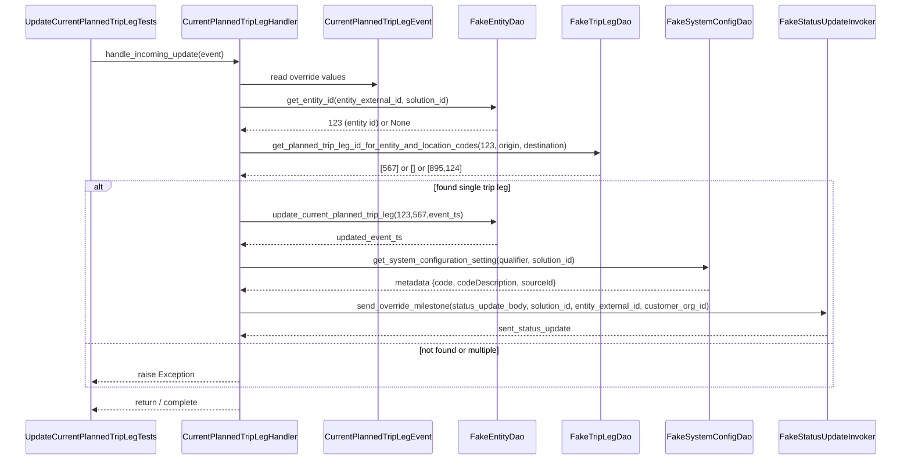

# Diagram: entity_core/entity_service/entity_service_tests/update_current_planned_trip_leg/test_update_current_planned_trip_leg.py

> Auto-generated by Obscura crawlers

## Diagram 1

```mermaid
classDiagram
class UpdateCurrentPlannedTripLegTests {
  +setUp()
  +test_updates_entity_and_sends_status_update_on_override()
  +test_throws_error_when_entity_does_not_exist()
  +test_throws_error_when_trip_leg_does_not_exist()
  +test_throws_error_when_more_than_one_trip_leg_exists()
}
class FakeDAOContainer {
  +entity_dao
  +system_config_dao
  +trip_leg_dao
  +status_update_dao
}
class FakeInvokers {
  +solution_invoker
  +status_update_invoker
}
class CurrentPlannedTripLegHandler {
  +handle_incoming_update(event)
}
class CurrentPlannedTripLegEvent {
  +set_override_values(origin,destination)
  +entity_external_id
  +override_flag
}
class FakeEntityDao {
  +get_entity_id(external_id,solution_id)
  +update_current_planned_trip_leg(entity_id,trip_leg_id,event_ts)
}
class FakeTripLegDao {
  +get_planned_trip_leg_id_for_entity_and_location_codes(entity_id,origin,destination)
  +get_planned_trip_legs(entity)
}
class FakeSystemConfigDao {
  +get_system_configuration_setting(qualifier,solution_id)
}
class FakeStatusUpdateInvoker {
  +send_override_milestone(status_update_body,solution_id,entity_external_id,customer_org_id)
}
class FakeSolutionInvoker {
  +get_customer_id(solution_id)
}
class FakeStatusUpdateDao {
  +get_ordered_status_updates(entity)
}
UpdateCurrentPlannedTripLegTests --> FakeDAOContainer : uses
UpdateCurrentPlannedTripLegTests --> FakeInvokers : uses
FakeDAOContainer o-- FakeEntityDao
FakeDAOContainer o-- FakeSystemConfigDao
FakeDAOContainer o-- FakeTripLegDao
FakeDAOContainer o-- FakeStatusUpdateDao
FakeInvokers o-- FakeSolutionInvoker
FakeInvokers o-- FakeStatusUpdateInvoker
CurrentPlannedTripLegHandler --> FakeDAOContainer : depends on
CurrentPlannedTripLegHandler --> FakeInvokers : depends on
CurrentPlannedTripLegHandler --> CurrentPlannedTripLegEvent : consumes
CurrentPlannedTripLegHandler --> FakeEntityDao : updates
CurrentPlannedTripLegHandler --> FakeTripLegDao : queries
CurrentPlannedTripLegHandler --> FakeSystemConfigDao : reads
CurrentPlannedTripLegHandler --> FakeStatusUpdateInvoker : sends
```

### SVG

<svg id="container" width="3671.1484375" xmlns="http://www.w3.org/2000/svg" class="classDiagram" height="704" viewBox="0 0 3671.1484375 704" role="graphics-document document" aria-roledescription="class"><g><defs><marker id="container_class-aggregationStart" class="marker aggregation class" refX="18" refY="7" markerWidth="190" markerHeight="240" orient="auto"><path d="M 18,7 L9,13 L1,7 L9,1 Z"></path></marker></defs><defs><marker id="container_class-aggregationEnd" class="marker aggregation class" refX="1" refY="7" markerWidth="20" markerHeight="28" orient="auto"><path d="M 18,7 L9,13 L1,7 L9,1 Z"></path></marker></defs><defs><marker id="container_class-extensionStart" class="marker extension class" refX="18" refY="7" markerWidth="190" markerHeight="240" orient="auto"><path d="M 1,7 L18,13 V 1 Z"></path></marker></defs><defs><marker id="container_class-extensionEnd" class="marker extension class" refX="1" refY="7" markerWidth="20" markerHeight="28" orient="auto"><path d="M 1,1 V 13 L18,7 Z"></path></marker></defs><defs><marker id="container_class-compositionStart" class="marker composition class" refX="18" refY="7" markerWidth="190" markerHeight="240" orient="auto"><path d="M 18,7 L9,13 L1,7 L9,1 Z"></path></marker></defs><defs><marker id="container_class-compositionEnd" class="marker composition class" refX="1" refY="7" markerWidth="20" markerHeight="28" orient="auto"><path d="M 18,7 L9,13 L1,7 L9,1 Z"></path></marker></defs><defs><marker id="container_class-dependencyStart" class="marker dependency class" refX="6" refY="7" markerWidth="190" markerHeight="240" orient="auto"><path d="M 5,7 L9,13 L1,7 L9,1 Z"></path></marker></defs><defs><marker id="container_class-dependencyEnd" class="marker dependency class" refX="13" refY="7" markerWidth="20" markerHeight="28" orient="auto"><path d="M 18,7 L9,13 L14,7 L9,1 Z"></path></marker></defs><defs><marker id="container_class-lollipopStart" class="marker lollipop class" refX="13" refY="7" markerWidth="190" markerHeight="240" orient="auto"><circle stroke="black" fill="transparent" cx="7" cy="7" r="6"></circle></marker></defs><defs><marker id="container_class-lollipopEnd" class="marker lollipop class" refX="1" refY="7" markerWidth="190" markerHeight="240" orient="auto"><circle stroke="black" fill="transparent" cx="7" cy="7" r="6"></circle></marker></defs><g class="root"><g class="clusters"></g><g class="edgePaths"><path d="M613.267,230L609.416,236.167C605.564,242.333,597.862,254.667,596.935,266.125C596.008,277.583,601.857,288.166,604.781,293.457L607.705,298.749" id="id_UpdateCurrentPlannedTripLegTests_FakeDAOContainer_1" class="edge-thickness-normal edge-pattern-solid relation" style=";;;" data-edge="true" data-et="edge" data-id="id_UpdateCurrentPlannedTripLegTests_FakeDAOContainer_1" data-points="W3sieCI6NjEzLjI2NjYwMTU2MjUsInkiOjIzMH0seyJ4Ijo1OTAuMTYwMTU2MjUsInkiOjI2N30seyJ4Ijo2MTAuNjA2OTgxMzIwNDg4NywieSI6MzA0fV0=" marker-end="url(#container_class-dependencyEnd)"></path><path d="M987.102,149.561L1182.131,169.134C1377.16,188.707,1767.219,227.854,2024.766,263.942C2282.314,300.03,2407.35,333.06,2469.868,349.574L2532.386,366.089" id="id_UpdateCurrentPlannedTripLegTests_FakeInvokers_2" class="edge-thickness-normal edge-pattern-solid relation" style=";;;" data-edge="true" data-et="edge" data-id="id_UpdateCurrentPlannedTripLegTests_FakeInvokers_2" data-points="W3sieCI6OTg3LjEwMTU2MjUsInkiOjE0OS41NjExODIwMjY5NjAxfSx7IngiOjIxNTcuMjc3MzQzNzUsInkiOjI2N30seyJ4IjoyNTM4LjE4NzUsInkiOjM2Ny42MjE2ODAzMzQ1NDYyfV0=" marker-end="url(#container_class-dependencyEnd)"></path><path d="M528.103,441.878L485.417,455.065C442.731,468.252,357.36,494.626,315.091,511.98C272.822,529.333,273.655,537.667,274.072,541.833L274.488,546" id="id_FakeDAOContainer_FakeEntityDao_3" class="edge-thickness-normal edge-pattern-solid relation" style=";;;" data-edge="true" data-et="edge" data-id="id_FakeDAOContainer_FakeEntityDao_3" data-points="W3sieCI6NTQ0LjU4Mzk4NDM3NSwieSI6NDM2Ljc4NjAyNzM3Njc2NzE1fSx7IngiOjI3MS45ODgyODEyNSwieSI6NTIxfSx7IngiOjI3NC40ODgyODEyNSwieSI6NTQ2fV0=" marker-start="url(#container_class-aggregationStart)"></path><path d="M663.658,513.25L663.658,514.542C663.658,515.833,663.658,518.417,684.374,525.875C705.091,533.333,746.523,545.667,767.24,551.833L787.956,558" id="id_FakeDAOContainer_FakeSystemConfigDao_4" class="edge-thickness-normal edge-pattern-solid relation" style=";;;" data-edge="true" data-et="edge" data-id="id_FakeDAOContainer_FakeSystemConfigDao_4" data-points="W3sieCI6NjYzLjY1ODIwMzEyNSwieSI6NDk2fSx7IngiOjY2My42NTgyMDMxMjUsInkiOjUyMX0seyJ4Ijo3ODcuOTU1ODAwNzgxMjUsInkiOjU1OH1d" marker-start="url(#container_class-aggregationStart)"></path><path d="M799.704,424.762L887.828,440.802C975.953,456.841,1152.202,488.921,1254.029,509.127C1355.856,529.333,1383.26,537.667,1396.962,541.833L1410.665,546" id="id_FakeDAOContainer_FakeTripLegDao_5" class="edge-thickness-normal edge-pattern-solid relation" style=";;;" data-edge="true" data-et="edge" data-id="id_FakeDAOContainer_FakeTripLegDao_5" data-points="W3sieCI6NzgyLjczMjQyMTg3NSwieSI6NDIxLjY3Mjg4MzM1NzcxODI2fSx7IngiOjEzMjguNDUxMTcxODc1LCJ5Ijo1MjF9LHsieCI6MTQxMC42NjQ1NTA3ODEyNSwieSI6NTQ2fV0=" marker-start="url(#container_class-aggregationStart)"></path><path d="M799.932,410.426L1040.813,428.855C1281.693,447.284,1763.454,484.142,2004.334,508.738C2245.215,533.333,2245.215,545.667,2245.215,551.833L2245.215,558" id="id_FakeDAOContainer_FakeStatusUpdateDao_6" class="edge-thickness-normal edge-pattern-solid relation" style=";;;" data-edge="true" data-et="edge" data-id="id_FakeDAOContainer_FakeStatusUpdateDao_6" data-points="W3sieCI6NzgyLjczMjQyMTg3NSwieSI6NDA5LjEwOTk5OTY2NjU2NjY0fSx7IngiOjIyNDUuMjE0ODQzNzUsInkiOjUyMX0seyJ4IjoyMjQ1LjIxNDg0Mzc1LCJ5Ijo1NTh9XQ==" marker-start="url(#container_class-aggregationStart)"></path><path d="M2646.044,489.019L2645.163,494.349C2644.282,499.679,2642.52,510.34,2641.639,521.837C2640.758,533.333,2640.758,545.667,2640.758,551.833L2640.758,558" id="id_FakeInvokers_FakeSolutionInvoker_7" class="edge-thickness-normal edge-pattern-solid relation" style=";;;" data-edge="true" data-et="edge" data-id="id_FakeInvokers_FakeSolutionInvoker_7" data-points="W3sieCI6MjY0OC44NTY5ODYwNTM3MTksInkiOjQ3Mn0seyJ4IjoyNjQwLjc1NzgxMjUsInkiOjUyMX0seyJ4IjoyNjQwLjc1NzgxMjUsInkiOjU1OH1d" marker-start="url(#container_class-aggregationStart)"></path><path d="M2799.231,458.185L2824.147,468.654C2849.062,479.123,2898.893,500.062,2942.8,516.697C2986.707,533.333,3024.69,545.667,3043.681,551.833L3062.672,558" id="id_FakeInvokers_FakeStatusUpdateInvoker_8" class="edge-thickness-normal edge-pattern-solid relation" style=";;;" data-edge="true" data-et="edge" data-id="id_FakeInvokers_FakeStatusUpdateInvoker_8" data-points="W3sieCI6Mjc4My4zMjgxMjUsInkiOjQ1MS41MDI0OTI1NTYyNDM2fSx7IngiOjI5NDguNzI0NjA5Mzc1LCJ5Ijo1MjF9LHsieCI6MzA2Mi42NzIzMjQyMTg3NSwieSI6NTU4fV0=" marker-start="url(#container_class-aggregationStart)"></path><path d="M1118.295,174.758L1065.865,190.132C1013.434,205.505,908.574,236.253,850.375,257.104C792.176,277.956,780.638,288.912,774.87,294.39L769.101,299.868" id="id_CurrentPlannedTripLegHandler_FakeDAOContainer_9" class="edge-thickness-normal edge-pattern-solid relation" style=";;;" data-edge="true" data-et="edge" data-id="id_CurrentPlannedTripLegHandler_FakeDAOContainer_9" data-points="W3sieCI6MTExOC4yOTQ5MjE4NzUsInkiOjE3NC43NTc4NTcxODE1NTI5NH0seyJ4Ijo4MDMuNzEyODkwNjI1LCJ5IjoyNjd9LHsieCI6NzY0Ljc1MDMwODM4ODE1NzksInkiOjMwNH1d" marker-end="url(#container_class-dependencyEnd)"></path><path d="M1498.607,136.385L1736.715,158.154C1974.822,179.923,2451.037,223.462,2666.052,256.756C2881.067,290.05,2834.882,313.099,2811.789,324.624L2788.697,336.149" id="id_CurrentPlannedTripLegHandler_FakeInvokers_10" class="edge-thickness-normal edge-pattern-solid relation" style=";;;" data-edge="true" data-et="edge" data-id="id_CurrentPlannedTripLegHandler_FakeInvokers_10" data-points="W3sieCI6MTQ5OC42MDc0MjE4NzUsInkiOjEzNi4zODUxNjg5MDE1NTQ3Mn0seyJ4IjoyOTI3LjI1MTk1MzEyNSwieSI6MjY3fSx7IngiOjI3ODMuMzI4MTI1LCJ5IjozMzguODI4NDgwMzQwMDYzOH1d" marker-end="url(#container_class-dependencyEnd)"></path><path d="M1195.492,182L1170.092,196.167C1144.691,210.333,1093.889,238.667,1068.489,260C1043.088,281.333,1043.088,295.667,1043.088,302.833L1043.088,310" id="id_CurrentPlannedTripLegHandler_CurrentPlannedTripLegEvent_11" class="edge-thickness-normal edge-pattern-solid relation" style=";;;" data-edge="true" data-et="edge" data-id="id_CurrentPlannedTripLegHandler_CurrentPlannedTripLegEvent_11" data-points="W3sieCI6MTE5NS40OTI0Nzc4MjkzOTE5LCJ5IjoxODJ9LHsieCI6MTA0My4wODc4OTA2MjUsInkiOjI2N30seyJ4IjoxMDQzLjA4Nzg5MDYyNSwieSI6MzE2fV0=" marker-end="url(#container_class-dependencyEnd)"></path><path d="M1118.295,152.978L1011.941,171.981C905.587,190.985,692.878,228.993,586.524,270.163C480.17,311.333,480.17,355.667,480.17,398C480.17,440.333,480.17,480.667,472.805,504.55C465.44,528.432,450.711,535.865,443.346,539.581L435.981,543.297" id="id_CurrentPlannedTripLegHandler_FakeEntityDao_12" class="edge-thickness-normal edge-pattern-solid relation" style=";;;" data-edge="true" data-et="edge" data-id="id_CurrentPlannedTripLegHandler_FakeEntityDao_12" data-points="W3sieCI6MTExOC4yOTQ5MjE4NzUsInkiOjE1Mi45Nzc3NDAwNDkwNDczNn0seyJ4Ijo0ODAuMTY5OTIxODc1LCJ5IjoyNjd9LHsieCI6NDgwLjE2OTkyMTg3NSwieSI6NDAwfSx7IngiOjQ4MC4xNjk5MjE4NzUsInkiOjUyMX0seyJ4Ijo0MzAuNjI0NTExNzE4NzUsInkiOjU0Nn1d" marker-end="url(#container_class-dependencyEnd)"></path><path d="M1498.607,164.187L1570.716,181.323C1642.825,198.458,1787.042,232.729,1859.151,272.031C1931.26,311.333,1931.26,355.667,1931.26,398C1931.26,440.333,1931.26,480.667,1920.784,504.657C1910.309,528.648,1889.358,536.295,1878.883,540.119L1868.407,543.943" id="id_CurrentPlannedTripLegHandler_FakeTripLegDao_13" class="edge-thickness-normal edge-pattern-solid relation" style=";;;" data-edge="true" data-et="edge" data-id="id_CurrentPlannedTripLegHandler_FakeTripLegDao_13" data-points="W3sieCI6MTQ5OC42MDc0MjE4NzUsInkiOjE2NC4xODc0Mzg0NTYwODY2NX0seyJ4IjoxOTMxLjI1OTc2NTYyNSwieSI6MjY3fSx7IngiOjE5MzEuMjU5NzY1NjI1LCJ5Ijo0MDB9LHsieCI6MTkzMS4yNTk3NjU2MjUsInkiOjUyMX0seyJ4IjoxODYyLjc3MDk5NjA5Mzc1LCJ5Ijo1NDZ9XQ==" marker-end="url(#container_class-dependencyEnd)"></path><path d="M1308.451,182L1308.451,196.167C1308.451,210.333,1308.451,238.667,1308.451,275C1308.451,311.333,1308.451,355.667,1308.451,398C1308.451,440.333,1308.451,480.667,1290.357,506.692C1272.262,532.717,1236.073,544.435,1217.978,550.293L1199.884,556.152" id="id_CurrentPlannedTripLegHandler_FakeSystemConfigDao_14" class="edge-thickness-normal edge-pattern-solid relation" style=";;;" data-edge="true" data-et="edge" data-id="id_CurrentPlannedTripLegHandler_FakeSystemConfigDao_14" data-points="W3sieCI6MTMwOC40NTExNzE4NzUsInkiOjE4Mn0seyJ4IjoxMzA4LjQ1MTE3MTg3NSwieSI6MjY3fSx7IngiOjEzMDguNDUxMTcxODc1LCJ5Ijo0MDB9LHsieCI6MTMwOC40NTExNzE4NzUsInkiOjUyMX0seyJ4IjoxMTk0LjE3NTM3MTA5Mzc1LCJ5Ijo1NTh9XQ==" marker-end="url(#container_class-dependencyEnd)"></path><path d="M1498.607,133.445L1791.621,155.705C2084.635,177.964,2670.663,222.482,2963.677,266.908C3256.691,311.333,3256.691,355.667,3256.691,398C3256.691,440.333,3256.691,480.667,3256.691,506C3256.691,531.333,3256.691,541.667,3256.691,546.833L3256.691,552" id="id_CurrentPlannedTripLegHandler_FakeStatusUpdateInvoker_15" class="edge-thickness-normal edge-pattern-solid relation" style=";;;" data-edge="true" data-et="edge" data-id="id_CurrentPlannedTripLegHandler_FakeStatusUpdateInvoker_15" data-points="W3sieCI6MTQ5OC42MDc0MjE4NzUsInkiOjEzMy40NDU0MDc5NjUzMjEyN30seyJ4IjozMjU2LjY5MTQwNjI1LCJ5IjoyNjd9LHsieCI6MzI1Ni42OTE0MDYyNSwieSI6NDAwfSx7IngiOjMyNTYuNjkxNDA2MjUsInkiOjUyMX0seyJ4IjozMjU2LjY5MTQwNjI1LCJ5Ijo1NTh9XQ==" marker-end="url(#container_class-dependencyEnd)"></path></g><g class="edgeLabels"><g class="edgeLabel" transform="translate(590.51731, 266.42809)"><g class="label" data-id="id_UpdateCurrentPlannedTripLegTests_FakeDAOContainer_1" transform="translate(-16.4921875, -12)"><foreignObject width="32.984375" height="24">

uses

</foreignObject></g></g><g class="edgeLabel" transform="translate(1768.19296, 227.9515)"><g class="label" data-id="id_UpdateCurrentPlannedTripLegTests_FakeInvokers_2" transform="translate(-16.4921875, -12)"><foreignObject width="32.984375" height="24">

uses

</foreignObject></g></g><g class="edgeLabel"><g class="label" data-id="id_FakeDAOContainer_FakeEntityDao_3" transform="translate(0, 0)"><foreignObject width="0" height="0">

</foreignObject></g></g><g class="edgeLabel"><g class="label" data-id="id_FakeDAOContainer_FakeSystemConfigDao_4" transform="translate(0, 0)"><foreignObject width="0" height="0">

</foreignObject></g></g><g class="edgeLabel"><g class="label" data-id="id_FakeDAOContainer_FakeTripLegDao_5" transform="translate(0, 0)"><foreignObject width="0" height="0">

</foreignObject></g></g><g class="edgeLabel"><g class="label" data-id="id_FakeDAOContainer_FakeStatusUpdateDao_6" transform="translate(0, 0)"><foreignObject width="0" height="0">

</foreignObject></g></g><g class="edgeLabel"><g class="label" data-id="id_FakeInvokers_FakeSolutionInvoker_7" transform="translate(0, 0)"><foreignObject width="0" height="0">

</foreignObject></g></g><g class="edgeLabel"><g class="label" data-id="id_FakeInvokers_FakeStatusUpdateInvoker_8" transform="translate(0, 0)"><foreignObject width="0" height="0">

</foreignObject></g></g><g class="edgeLabel" transform="translate(935.22355, 228.43828)"><g class="label" data-id="id_CurrentPlannedTripLegHandler_FakeDAOContainer_9" transform="translate(-42.9453125, -12)"><foreignObject width="85.890625" height="24">

depends on

</foreignObject></g></g><g class="edgeLabel" transform="translate(2293.0217, 209.01505)"><g class="label" data-id="id_CurrentPlannedTripLegHandler_FakeInvokers_10" transform="translate(-42.9453125, -12)"><foreignObject width="85.890625" height="24">

depends on

</foreignObject></g></g><g class="edgeLabel" transform="translate(1043.087890625, 267)"><g class="label" data-id="id_CurrentPlannedTripLegHandler_CurrentPlannedTripLegEvent_11" transform="translate(-36.375, -12)"><foreignObject width="72.75" height="24">

consumes

</foreignObject></g></g><g class="edgeLabel" transform="translate(480.169921875, 400)"><g class="label" data-id="id_CurrentPlannedTripLegHandler_FakeEntityDao_12" transform="translate(-29.4140625, -12)"><foreignObject width="58.828125" height="24">

updates

</foreignObject></g></g><g class="edgeLabel" transform="translate(1931.259765625, 400)"><g class="label" data-id="id_CurrentPlannedTripLegHandler_FakeTripLegDao_13" transform="translate(-27.2421875, -12)"><foreignObject width="54.484375" height="24">

queries

</foreignObject></g></g><g class="edgeLabel" transform="translate(1308.451171875, 400)"><g class="label" data-id="id_CurrentPlannedTripLegHandler_FakeSystemConfigDao_14" transform="translate(-20.0078125, -12)"><foreignObject width="40.015625" height="24">

reads

</foreignObject></g></g><g class="edgeLabel" transform="translate(3256.69140625, 400)"><g class="label" data-id="id_CurrentPlannedTripLegHandler_FakeStatusUpdateInvoker_15" transform="translate(-21.3046875, -12)"><foreignObject width="42.609375" height="24">

sends

</foreignObject></g></g></g><g class="nodes"><g class="node default" id="classId-UpdateCurrentPlannedTripLegTests-0" transform="translate(682.5859375, 119)"><g class="basic label-container"><path d="M-304.515625 -111 L304.515625 -111 L304.515625 111 L-304.515625 111" stroke="none" stroke-width="0" fill="#ECECFF" style=""></path><path d="M-304.515625 -111 C-104.37338976308186 -111, 95.76884547383628 -111, 304.515625 -111 M-304.515625 -111 C-142.89352225981378 -111, 18.728580480372443 -111, 304.515625 -111 M304.515625 -111 C304.515625 -29.029983508853817, 304.515625 52.940032982292365, 304.515625 111 M304.515625 -111 C304.515625 -36.499584031508405, 304.515625 38.00083193698319, 304.515625 111 M304.515625 111 C93.95200450485797 111, -116.61161599028406 111, -304.515625 111 M304.515625 111 C150.09526445845572 111, -4.325096083088567 111, -304.515625 111 M-304.515625 111 C-304.515625 53.783749247629075, -304.515625 -3.4325015047418503, -304.515625 -111 M-304.515625 111 C-304.515625 54.79923168801314, -304.515625 -1.4015366239737261, -304.515625 -111" stroke="#9370DB" stroke-width="1.3" fill="none" stroke-dasharray="0 0" style=""></path></g><g class="annotation-group text" transform="translate(0, -87)"></g><g class="label-group text" transform="translate(-129.921875, -87)"><g class="label" style="font-weight: bolder" transform="translate(0,-12)"><foreignObject width="259.84375" height="24">

UpdateCurrentPlannedTripLegTests

</foreignObject></g></g><g class="members-group text" transform="translate(-292.515625, -39)"></g><g class="methods-group text" transform="translate(-292.515625, -9)"><g class="label" style="" transform="translate(0,-12)"><foreignObject width="60.421875" height="24">

+setUp()

</foreignObject></g><g class="label" style="" transform="translate(0,12)"><foreignObject width="455.109375" height="24">

+test_updates_entity_and_sends_status_update_on_override()

</foreignObject></g><g class="label" style="" transform="translate(0,36)"><foreignObject width="359.546875" height="24">

+test_throws_error_when_entity_does_not_exist()

</foreignObject></g><g class="label" style="" transform="translate(0,60)"><foreignObject width="373.59375" height="24">

+test_throws_error_when_trip_leg_does_not_exist()

</foreignObject></g><g class="label" style="" transform="translate(0,84)"><foreignObject width="427.28125" height="24">

+test_throws_error_when_more_than_one_trip_leg_exists()

</foreignObject></g></g><g class="divider" style=""><path d="M-304.515625 -63 C-101.24128501779867 -63, 102.03305496440265 -63, 304.515625 -63 M-304.515625 -63 C-173.80469778592462 -63, -43.093770571849234 -63, 304.515625 -63" stroke="#9370DB" stroke-width="1.3" fill="none" stroke-dasharray="0 0" style=""></path></g><g class="divider" style=""><path d="M-304.515625 -39 C-119.78274738168832 -39, 64.95013023662335 -39, 304.515625 -39 M-304.515625 -39 C-143.10735966315812 -39, 18.300905673683758 -39, 304.515625 -39" stroke="#9370DB" stroke-width="1.3" fill="none" stroke-dasharray="0 0" style=""></path></g></g><g class="node default" id="classId-FakeDAOContainer-1" transform="translate(663.658203125, 400)"><g class="basic label-container"><path d="M-119.07421875 -96 L119.07421875 -96 L119.07421875 96 L-119.07421875 96" stroke="none" stroke-width="0" fill="#ECECFF" style=""></path><path d="M-119.07421875 -96 C-32.49506225925664 -96, 54.084094231486716 -96, 119.07421875 -96 M-119.07421875 -96 C-63.12259704222204 -96, -7.17097533444408 -96, 119.07421875 -96 M119.07421875 -96 C119.07421875 -54.98053296932093, 119.07421875 -13.961065938641866, 119.07421875 96 M119.07421875 -96 C119.07421875 -41.88517979418383, 119.07421875 12.229640411632346, 119.07421875 96 M119.07421875 96 C33.61201507007053 96, -51.85018860985895 96, -119.07421875 96 M119.07421875 96 C54.40156099413183 96, -10.271096761736345 96, -119.07421875 96 M-119.07421875 96 C-119.07421875 20.68377326771582, -119.07421875 -54.63245346456836, -119.07421875 -96 M-119.07421875 96 C-119.07421875 38.45324139765244, -119.07421875 -19.093517204695118, -119.07421875 -96" stroke="#9370DB" stroke-width="1.3" fill="none" stroke-dasharray="0 0" style=""></path></g><g class="annotation-group text" transform="translate(0, -72)"></g><g class="label-group text" transform="translate(-67.4296875, -72)"><g class="label" style="font-weight: bolder" transform="translate(0,-12)"><foreignObject width="134.859375" height="24">

FakeDAOContainer

</foreignObject></g></g><g class="members-group text" transform="translate(-107.07421875, -24)"><g class="label" style="" transform="translate(0,-12)"><foreignObject width="85.078125" height="24">

+entity_dao

</foreignObject></g><g class="label" style="" transform="translate(0,12)"><foreignObject width="145.640625" height="24">

+system_config_dao

</foreignObject></g><g class="label" style="" transform="translate(0,36)"><foreignObject width="99.046875" height="24">

+trip_leg_dao

</foreignObject></g><g class="label" style="" transform="translate(0,60)"><foreignObject width="146.71875" height="24">

+status_update_dao

</foreignObject></g></g><g class="methods-group text" transform="translate(-107.07421875, 96)"></g><g class="divider" style=""><path d="M-119.07421875 -48 C-34.26974686305047 -48, 50.53472502389906 -48, 119.07421875 -48 M-119.07421875 -48 C-37.73265701288962 -48, 43.608904724220764 -48, 119.07421875 -48" stroke="#9370DB" stroke-width="1.3" fill="none" stroke-dasharray="0 0" style=""></path></g><g class="divider" style=""><path d="M-119.07421875 72 C-38.87815794958654 72, 41.317902850826925 72, 119.07421875 72 M-119.07421875 72 C-46.383889529341985 72, 26.30643969131603 72, 119.07421875 72" stroke="#9370DB" stroke-width="1.3" fill="none" stroke-dasharray="0 0" style=""></path></g></g><g class="node default" id="classId-FakeInvokers-2" transform="translate(2660.7578125, 400)"><g class="basic label-container"><path d="M-122.5703125 -72 L122.5703125 -72 L122.5703125 72 L-122.5703125 72" stroke="none" stroke-width="0" fill="#ECECFF" style=""></path><path d="M-122.5703125 -72 C-35.33283468455218 -72, 51.904643130895636 -72, 122.5703125 -72 M-122.5703125 -72 C-40.247546748022245 -72, 42.07521900395551 -72, 122.5703125 -72 M122.5703125 -72 C122.5703125 -15.72195291181577, 122.5703125 40.55609417636846, 122.5703125 72 M122.5703125 -72 C122.5703125 -27.15710088484009, 122.5703125 17.68579823031982, 122.5703125 72 M122.5703125 72 C43.056113535167256 72, -36.45808542966549 72, -122.5703125 72 M122.5703125 72 C60.25740859841328 72, -2.055495303173444 72, -122.5703125 72 M-122.5703125 72 C-122.5703125 38.835873580946355, -122.5703125 5.671747161892711, -122.5703125 -72 M-122.5703125 72 C-122.5703125 37.42821976310978, -122.5703125 2.8564395262195603, -122.5703125 -72" stroke="#9370DB" stroke-width="1.3" fill="none" stroke-dasharray="0 0" style=""></path></g><g class="annotation-group text" transform="translate(0, -48)"></g><g class="label-group text" transform="translate(-47.859375, -48)"><g class="label" style="font-weight: bolder" transform="translate(0,-12)"><foreignObject width="95.71875" height="24">

FakeInvokers

</foreignObject></g></g><g class="members-group text" transform="translate(-110.5703125, 0)"><g class="label" style="" transform="translate(0,-12)"><foreignObject width="130.015625" height="24">

+solution_invoker

</foreignObject></g><g class="label" style="" transform="translate(0,12)"><foreignObject width="173.28125" height="24">

+status_update_invoker

</foreignObject></g></g><g class="methods-group text" transform="translate(-110.5703125, 72)"></g><g class="divider" style=""><path d="M-122.5703125 -24 C-71.66676564567487 -24, -20.763218791349757 -24, 122.5703125 -24 M-122.5703125 -24 C-53.70202289338694 -24, 15.166266713226122 -24, 122.5703125 -24" stroke="#9370DB" stroke-width="1.3" fill="none" stroke-dasharray="0 0" style=""></path></g><g class="divider" style=""><path d="M-122.5703125 48 C-27.15065462194498 48, 68.26900325611004 48, 122.5703125 48 M-122.5703125 48 C-25.37652089102137 48, 71.81727071795726 48, 122.5703125 48" stroke="#9370DB" stroke-width="1.3" fill="none" stroke-dasharray="0 0" style=""></path></g></g><g class="node default" id="classId-CurrentPlannedTripLegHandler-3" transform="translate(1308.451171875, 119)"><g class="basic label-container"><path d="M-190.15625 -63 L190.15625 -63 L190.15625 63 L-190.15625 63" stroke="none" stroke-width="0" fill="#ECECFF" style=""></path><path d="M-190.15625 -63 C-45.53753356302067 -63, 99.08118287395865 -63, 190.15625 -63 M-190.15625 -63 C-106.98991693859733 -63, -23.823583877194665 -63, 190.15625 -63 M190.15625 -63 C190.15625 -32.91985015489935, 190.15625 -2.839700309798701, 190.15625 63 M190.15625 -63 C190.15625 -21.168048090335994, 190.15625 20.663903819328013, 190.15625 63 M190.15625 63 C66.2318680316797 63, -57.69251393664061 63, -190.15625 63 M190.15625 63 C111.59764994665505 63, 33.03904989331011 63, -190.15625 63 M-190.15625 63 C-190.15625 33.959546045243385, -190.15625 4.919092090486764, -190.15625 -63 M-190.15625 63 C-190.15625 14.00757343751961, -190.15625 -34.98485312496078, -190.15625 -63" stroke="#9370DB" stroke-width="1.3" fill="none" stroke-dasharray="0 0" style=""></path></g><g class="annotation-group text" transform="translate(0, -39)"></g><g class="label-group text" transform="translate(-113.375, -39)"><g class="label" style="font-weight: bolder" transform="translate(0,-12)"><foreignObject width="226.75" height="24">

CurrentPlannedTripLegHandler

</foreignObject></g></g><g class="members-group text" transform="translate(-178.15625, 9)"></g><g class="methods-group text" transform="translate(-178.15625, 39)"><g class="label" style="" transform="translate(0,-12)"><foreignObject width="242.9375" height="24">

+handle_incoming_update(event)

</foreignObject></g></g><g class="divider" style=""><path d="M-190.15625 -15 C-39.84367467454081 -15, 110.46890065091839 -15, 190.15625 -15 M-190.15625 -15 C-93.4574869848969 -15, 3.241276030206194 -15, 190.15625 -15" stroke="#9370DB" stroke-width="1.3" fill="none" stroke-dasharray="0 0" style=""></path></g><g class="divider" style=""><path d="M-190.15625 9 C-69.33912117910734 9, 51.478007641785325 9, 190.15625 9 M-190.15625 9 C-69.00417022616203 9, 52.14790954767594 9, 190.15625 9" stroke="#9370DB" stroke-width="1.3" fill="none" stroke-dasharray="0 0" style=""></path></g></g><g class="node default" id="classId-CurrentPlannedTripLegEvent-4" transform="translate(1043.087890625, 400)"><g class="basic label-container"><path d="M-210.35546875 -84 L210.35546875 -84 L210.35546875 84 L-210.35546875 84" stroke="none" stroke-width="0" fill="#ECECFF" style=""></path><path d="M-210.35546875 -84 C-115.3766491569803 -84, -20.397829563960613 -84, 210.35546875 -84 M-210.35546875 -84 C-44.046565128185506 -84, 122.26233849362899 -84, 210.35546875 -84 M210.35546875 -84 C210.35546875 -30.565320822144926, 210.35546875 22.869358355710148, 210.35546875 84 M210.35546875 -84 C210.35546875 -18.947197852764333, 210.35546875 46.105604294471334, 210.35546875 84 M210.35546875 84 C73.42680951386714 84, -63.50184972226572 84, -210.35546875 84 M210.35546875 84 C77.64153131297735 84, -55.0724061240453 84, -210.35546875 84 M-210.35546875 84 C-210.35546875 38.52205333611707, -210.35546875 -6.955893327765864, -210.35546875 -84 M-210.35546875 84 C-210.35546875 19.78101845525532, -210.35546875 -44.43796308948936, -210.35546875 -84" stroke="#9370DB" stroke-width="1.3" fill="none" stroke-dasharray="0 0" style=""></path></g><g class="annotation-group text" transform="translate(0, -60)"></g><g class="label-group text" transform="translate(-104.4921875, -60)"><g class="label" style="font-weight: bolder" transform="translate(0,-12)"><foreignObject width="208.984375" height="24">

CurrentPlannedTripLegEvent

</foreignObject></g></g><g class="members-group text" transform="translate(-198.35546875, -12)"><g class="label" style="" transform="translate(0,-12)"><foreignObject width="139.234375" height="24">

+entity_external_id

</foreignObject></g><g class="label" style="" transform="translate(0,12)"><foreignObject width="102.890625" height="24">

+override_flag

</foreignObject></g></g><g class="methods-group text" transform="translate(-198.35546875, 60)"><g class="label" style="" transform="translate(0,-12)"><foreignObject width="292.21875" height="24">

+set_override_values(origin,destination)

</foreignObject></g></g><g class="divider" style=""><path d="M-210.35546875 -36 C-122.72552179726621 -36, -35.09557484453242 -36, 210.35546875 -36 M-210.35546875 -36 C-91.4258674115365 -36, 27.503733926926998 -36, 210.35546875 -36" stroke="#9370DB" stroke-width="1.3" fill="none" stroke-dasharray="0 0" style=""></path></g><g class="divider" style=""><path d="M-210.35546875 36 C-76.78968530104805 36, 56.776098147903895 36, 210.35546875 36 M-210.35546875 36 C-122.27480595487657 36, -34.19414315975314 36, 210.35546875 36" stroke="#9370DB" stroke-width="1.3" fill="none" stroke-dasharray="0 0" style=""></path></g></g><g class="node default" id="classId-FakeEntityDao-5" transform="translate(281.98828125, 621)"><g class="basic label-container"><path d="M-273.98828125 -75 L273.98828125 -75 L273.98828125 75 L-273.98828125 75" stroke="none" stroke-width="0" fill="#ECECFF" style=""></path><path d="M-273.98828125 -75 C-146.55291351535834 -75, -19.117545780716654 -75, 273.98828125 -75 M-273.98828125 -75 C-112.461538579127 -75, 49.06520409174601 -75, 273.98828125 -75 M273.98828125 -75 C273.98828125 -43.75047601750915, 273.98828125 -12.500952035018301, 273.98828125 75 M273.98828125 -75 C273.98828125 -42.31830314214105, 273.98828125 -9.636606284282095, 273.98828125 75 M273.98828125 75 C149.91870297985508 75, 25.84912470971014 75, -273.98828125 75 M273.98828125 75 C157.50686725325636 75, 41.02545325651269 75, -273.98828125 75 M-273.98828125 75 C-273.98828125 26.65946070932189, -273.98828125 -21.681078581356218, -273.98828125 -75 M-273.98828125 75 C-273.98828125 29.52678034559967, -273.98828125 -15.946439308800663, -273.98828125 -75" stroke="#9370DB" stroke-width="1.3" fill="none" stroke-dasharray="0 0" style=""></path></g><g class="annotation-group text" transform="translate(0, -51)"></g><g class="label-group text" transform="translate(-51.9921875, -51)"><g class="label" style="font-weight: bolder" transform="translate(0,-12)"><foreignObject width="103.984375" height="24">

FakeEntityDao

</foreignObject></g></g><g class="members-group text" transform="translate(-261.98828125, -3)"></g><g class="methods-group text" transform="translate(-261.98828125, 27)"><g class="label" style="" transform="translate(0,-12)"><foreignObject width="280.703125" height="24">

+get_entity_id(external_id,solution_id)

</foreignObject></g><g class="label" style="" transform="translate(0,12)"><foreignObject width="471.984375" height="24">

+update_current_planned_trip_leg(entity_id,trip_leg_id,event_ts)

</foreignObject></g></g><g class="divider" style=""><path d="M-273.98828125 -27 C-93.36714343322501 -27, 87.25399438354998 -27, 273.98828125 -27 M-273.98828125 -27 C-112.68527255854588 -27, 48.61773613290825 -27, 273.98828125 -27" stroke="#9370DB" stroke-width="1.3" fill="none" stroke-dasharray="0 0" style=""></path></g><g class="divider" style=""><path d="M-273.98828125 -3 C-160.95252012618442 -3, -47.91675900236882 -3, 273.98828125 -3 M-273.98828125 -3 C-96.49849282068473 -3, 80.99129560863054 -3, 273.98828125 -3" stroke="#9370DB" stroke-width="1.3" fill="none" stroke-dasharray="0 0" style=""></path></g></g><g class="node default" id="classId-FakeTripLegDao-6" transform="translate(1657.3046875, 621)"><g class="basic label-container"><path d="M-351.84375 -75 L351.84375 -75 L351.84375 75 L-351.84375 75" stroke="none" stroke-width="0" fill="#ECECFF" style=""></path><path d="M-351.84375 -75 C-100.83766133463578 -75, 150.16842733072843 -75, 351.84375 -75 M-351.84375 -75 C-155.42097754106297 -75, 41.001794917874065 -75, 351.84375 -75 M351.84375 -75 C351.84375 -23.202177365300734, 351.84375 28.59564526939853, 351.84375 75 M351.84375 -75 C351.84375 -38.508352641525555, 351.84375 -2.0167052830511096, 351.84375 75 M351.84375 75 C191.11345727655052 75, 30.38316455310104 75, -351.84375 75 M351.84375 75 C160.364564464184 75, -31.114621071631973 75, -351.84375 75 M-351.84375 75 C-351.84375 32.835615450898935, -351.84375 -9.32876909820213, -351.84375 -75 M-351.84375 75 C-351.84375 23.886579600257747, -351.84375 -27.226840799484506, -351.84375 -75" stroke="#9370DB" stroke-width="1.3" fill="none" stroke-dasharray="0 0" style=""></path></g><g class="annotation-group text" transform="translate(0, -51)"></g><g class="label-group text" transform="translate(-57.765625, -51)"><g class="label" style="font-weight: bolder" transform="translate(0,-12)"><foreignObject width="115.53125" height="24">

FakeTripLegDao

</foreignObject></g></g><g class="members-group text" transform="translate(-339.84375, -3)"></g><g class="methods-group text" transform="translate(-339.84375, 27)"><g class="label" style="" transform="translate(0,-12)"><foreignObject width="621.921875" height="24">

+get_planned_trip_leg_id_for_entity_and_location_codes(entity_id,origin,destination)

</foreignObject></g><g class="label" style="" transform="translate(0,12)"><foreignObject width="221.859375" height="24">

+get_planned_trip_legs(entity)

</foreignObject></g></g><g class="divider" style=""><path d="M-351.84375 -27 C-103.93942307083523 -27, 143.96490385832954 -27, 351.84375 -27 M-351.84375 -27 C-71.6289817155344 -27, 208.5857865689312 -27, 351.84375 -27" stroke="#9370DB" stroke-width="1.3" fill="none" stroke-dasharray="0 0" style=""></path></g><g class="divider" style=""><path d="M-351.84375 -3 C-136.72797253716772 -3, 78.38780492566457 -3, 351.84375 -3 M-351.84375 -3 C-140.01828412140932 -3, 71.80718175718135 -3, 351.84375 -3" stroke="#9370DB" stroke-width="1.3" fill="none" stroke-dasharray="0 0" style=""></path></g></g><g class="node default" id="classId-FakeSystemConfigDao-7" transform="translate(999.59765625, 621)"><g class="basic label-container"><path d="M-255.86328125 -63 L255.86328125 -63 L255.86328125 63 L-255.86328125 63" stroke="none" stroke-width="0" fill="#ECECFF" style=""></path><path d="M-255.86328125 -63 C-150.86258703443036 -63, -45.861892818860724 -63, 255.86328125 -63 M-255.86328125 -63 C-72.77219201522132 -63, 110.31889721955736 -63, 255.86328125 -63 M255.86328125 -63 C255.86328125 -28.840331024862657, 255.86328125 5.3193379502746865, 255.86328125 63 M255.86328125 -63 C255.86328125 -30.077690505719247, 255.86328125 2.844618988561507, 255.86328125 63 M255.86328125 63 C120.09893338042346 63, -15.665414489153079 63, -255.86328125 63 M255.86328125 63 C78.77539048002276 63, -98.31250028995447 63, -255.86328125 63 M-255.86328125 63 C-255.86328125 18.5344537916545, -255.86328125 -25.931092416691, -255.86328125 -63 M-255.86328125 63 C-255.86328125 24.54719608231786, -255.86328125 -13.905607835364279, -255.86328125 -63" stroke="#9370DB" stroke-width="1.3" fill="none" stroke-dasharray="0 0" style=""></path></g><g class="annotation-group text" transform="translate(0, -39)"></g><g class="label-group text" transform="translate(-80.1953125, -39)"><g class="label" style="font-weight: bolder" transform="translate(0,-12)"><foreignObject width="160.390625" height="24">

FakeSystemConfigDao

</foreignObject></g></g><g class="members-group text" transform="translate(-243.86328125, 9)"></g><g class="methods-group text" transform="translate(-243.86328125, 39)"><g class="label" style="" transform="translate(0,-12)"><foreignObject width="407.53125" height="24">

+get_system_configuration_setting(qualifier,solution_id)

</foreignObject></g></g><g class="divider" style=""><path d="M-255.86328125 -15 C-116.74613046548538 -15, 22.371020319029242 -15, 255.86328125 -15 M-255.86328125 -15 C-123.70975035648794 -15, 8.44378053702411 -15, 255.86328125 -15" stroke="#9370DB" stroke-width="1.3" fill="none" stroke-dasharray="0 0" style=""></path></g><g class="divider" style=""><path d="M-255.86328125 9 C-56.35478920173341 9, 143.15370284653318 9, 255.86328125 9 M-255.86328125 9 C-63.560887573372526 9, 128.74150610325495 9, 255.86328125 9" stroke="#9370DB" stroke-width="1.3" fill="none" stroke-dasharray="0 0" style=""></path></g></g><g class="node default" id="classId-FakeStatusUpdateInvoker-8" transform="translate(3256.69140625, 621)"><g class="basic label-container"><path d="M-406.45703125 -63 L406.45703125 -63 L406.45703125 63 L-406.45703125 63" stroke="none" stroke-width="0" fill="#ECECFF" style=""></path><path d="M-406.45703125 -63 C-206.79519014962798 -63, -7.133349049255969 -63, 406.45703125 -63 M-406.45703125 -63 C-115.32465723262413 -63, 175.80771678475173 -63, 406.45703125 -63 M406.45703125 -63 C406.45703125 -12.996455206028479, 406.45703125 37.00708958794304, 406.45703125 63 M406.45703125 -63 C406.45703125 -12.67703345536431, 406.45703125 37.64593308927138, 406.45703125 63 M406.45703125 63 C108.96667853595261 63, -188.52367417809478 63, -406.45703125 63 M406.45703125 63 C110.09656667463565 63, -186.2638979007287 63, -406.45703125 63 M-406.45703125 63 C-406.45703125 18.19598463442494, -406.45703125 -26.608030731150123, -406.45703125 -63 M-406.45703125 63 C-406.45703125 34.08467856305684, -406.45703125 5.169357126113688, -406.45703125 -63" stroke="#9370DB" stroke-width="1.3" fill="none" stroke-dasharray="0 0" style=""></path></g><g class="annotation-group text" transform="translate(0, -39)"></g><g class="label-group text" transform="translate(-94.1015625, -39)"><g class="label" style="font-weight: bolder" transform="translate(0,-12)"><foreignObject width="188.203125" height="24">

FakeStatusUpdateInvoker

</foreignObject></g></g><g class="members-group text" transform="translate(-394.45703125, 9)"></g><g class="methods-group text" transform="translate(-394.45703125, 39)"><g class="label" style="" transform="translate(0,-12)"><foreignObject width="694.8125" height="24">

+send_override_milestone(status_update_body,solution_id,entity_external_id,customer_org_id)

</foreignObject></g></g><g class="divider" style=""><path d="M-406.45703125 -15 C-209.9445926063527 -15, -13.4321539627054 -15, 406.45703125 -15 M-406.45703125 -15 C-236.54171544164882 -15, -66.62639963329764 -15, 406.45703125 -15" stroke="#9370DB" stroke-width="1.3" fill="none" stroke-dasharray="0 0" style=""></path></g><g class="divider" style=""><path d="M-406.45703125 9 C-200.1329197567357 9, 6.1911917365285944 9, 406.45703125 9 M-406.45703125 9 C-178.54312393677498 9, 49.37078337645005 9, 406.45703125 9" stroke="#9370DB" stroke-width="1.3" fill="none" stroke-dasharray="0 0" style=""></path></g></g><g class="node default" id="classId-FakeSolutionInvoker-9" transform="translate(2640.7578125, 621)"><g class="basic label-container"><path d="M-159.4765625 -63 L159.4765625 -63 L159.4765625 63 L-159.4765625 63" stroke="none" stroke-width="0" fill="#ECECFF" style=""></path><path d="M-159.4765625 -63 C-78.56567644951056 -63, 2.345209600978876 -63, 159.4765625 -63 M-159.4765625 -63 C-87.76293206301185 -63, -16.04930162602369 -63, 159.4765625 -63 M159.4765625 -63 C159.4765625 -30.721866923591598, 159.4765625 1.5562661528168036, 159.4765625 63 M159.4765625 -63 C159.4765625 -14.254455741216766, 159.4765625 34.49108851756647, 159.4765625 63 M159.4765625 63 C39.418395025514414 63, -80.63977244897117 63, -159.4765625 63 M159.4765625 63 C73.78571713661383 63, -11.905128226772348 63, -159.4765625 63 M-159.4765625 63 C-159.4765625 32.74276286846481, -159.4765625 2.4855257369296098, -159.4765625 -63 M-159.4765625 63 C-159.4765625 18.813407283720757, -159.4765625 -25.373185432558486, -159.4765625 -63" stroke="#9370DB" stroke-width="1.3" fill="none" stroke-dasharray="0 0" style=""></path></g><g class="annotation-group text" transform="translate(0, -39)"></g><g class="label-group text" transform="translate(-74.921875, -39)"><g class="label" style="font-weight: bolder" transform="translate(0,-12)"><foreignObject width="149.84375" height="24">

FakeSolutionInvoker

</foreignObject></g></g><g class="members-group text" transform="translate(-147.4765625, 9)"></g><g class="methods-group text" transform="translate(-147.4765625, 39)"><g class="label" style="" transform="translate(0,-12)"><foreignObject width="220.03125" height="24">

+get_customer_id(solution_id)

</foreignObject></g></g><g class="divider" style=""><path d="M-159.4765625 -15 C-66.8706449671572 -15, 25.73527256568559 -15, 159.4765625 -15 M-159.4765625 -15 C-51.30246297278735 -15, 56.871636554425294 -15, 159.4765625 -15" stroke="#9370DB" stroke-width="1.3" fill="none" stroke-dasharray="0 0" style=""></path></g><g class="divider" style=""><path d="M-159.4765625 9 C-77.20607583467577 9, 5.064410830648455 9, 159.4765625 9 M-159.4765625 9 C-47.860939120239266 9, 63.75468425952147 9, 159.4765625 9" stroke="#9370DB" stroke-width="1.3" fill="none" stroke-dasharray="0 0" style=""></path></g></g><g class="node default" id="classId-FakeStatusUpdateDao-10" transform="translate(2245.21484375, 621)"><g class="basic label-container"><path d="M-186.06640625 -63 L186.06640625 -63 L186.06640625 63 L-186.06640625 63" stroke="none" stroke-width="0" fill="#ECECFF" style=""></path><path d="M-186.06640625 -63 C-86.64835203587651 -63, 12.769702178246973 -63, 186.06640625 -63 M-186.06640625 -63 C-55.82362809007745 -63, 74.4191500698451 -63, 186.06640625 -63 M186.06640625 -63 C186.06640625 -32.33542473182861, 186.06640625 -1.6708494636572198, 186.06640625 63 M186.06640625 -63 C186.06640625 -26.597467922950912, 186.06640625 9.805064154098176, 186.06640625 63 M186.06640625 63 C57.501003465866916 63, -71.06439931826617 63, -186.06640625 63 M186.06640625 63 C53.3363409489323 63, -79.3937243521354 63, -186.06640625 63 M-186.06640625 63 C-186.06640625 37.30910043523404, -186.06640625 11.618200870468087, -186.06640625 -63 M-186.06640625 63 C-186.06640625 18.50808838235327, -186.06640625 -25.983823235293457, -186.06640625 -63" stroke="#9370DB" stroke-width="1.3" fill="none" stroke-dasharray="0 0" style=""></path></g><g class="annotation-group text" transform="translate(0, -39)"></g><g class="label-group text" transform="translate(-80.7265625, -39)"><g class="label" style="font-weight: bolder" transform="translate(0,-12)"><foreignObject width="161.453125" height="24">

FakeStatusUpdateDao

</foreignObject></g></g><g class="members-group text" transform="translate(-174.06640625, 9)"></g><g class="methods-group text" transform="translate(-174.06640625, 39)"><g class="label" style="" transform="translate(0,-12)"><foreignObject width="267.40625" height="24">

+get_ordered_status_updates(entity)

</foreignObject></g></g><g class="divider" style=""><path d="M-186.06640625 -15 C-107.30458571000263 -15, -28.542765170005254 -15, 186.06640625 -15 M-186.06640625 -15 C-72.90808752252302 -15, 40.25023120495396 -15, 186.06640625 -15" stroke="#9370DB" stroke-width="1.3" fill="none" stroke-dasharray="0 0" style=""></path></g><g class="divider" style=""><path d="M-186.06640625 9 C-79.41982090139841 9, 27.22676444720318 9, 186.06640625 9 M-186.06640625 9 C-65.04382641505417 9, 55.97875341989166 9, 186.06640625 9" stroke="#9370DB" stroke-width="1.3" fill="none" stroke-dasharray="0 0" style=""></path></g></g></g></g></g></svg>

## Diagram 2

### SVG

<svg id="container" width="1829" xmlns="http://www.w3.org/2000/svg" height="943" viewBox="-50 -10 1829 943" role="graphics-document document" aria-roledescription="sequence"><g><rect x="1523" y="857" fill="#eaeaea" stroke="#666" width="206" height="65" name="StatusUpdateInvoker" rx="3" ry="3" class="actor actor-bottom"></rect><text x="1626" y="889.5" dominant-baseline="central" alignment-baseline="central" class="actor actor-box" style="text-anchor: middle; font-size: 16px; font-weight: 400;"><tspan x="1626" dy="0">FakeStatusUpdateInvoker</tspan></text></g><g><rect x="1296" y="857" fill="#eaeaea" stroke="#666" width="177" height="65" name="SystemConfigDao" rx="3" ry="3" class="actor actor-bottom"></rect><text x="1384.5" y="889.5" dominant-baseline="central" alignment-baseline="central" class="actor actor-box" style="text-anchor: middle; font-size: 16px; font-weight: 400;"><tspan x="1384.5" dy="0">FakeSystemConfigDao</tspan></text></g><g><rect x="1096" y="857" fill="#eaeaea" stroke="#666" width="150" height="65" name="TripLegDao" rx="3" ry="3" class="actor actor-bottom"></rect><text x="1171" y="889.5" dominant-baseline="central" alignment-baseline="central" class="actor actor-box" style="text-anchor: middle; font-size: 16px; font-weight: 400;"><tspan x="1171" dy="0">FakeTripLegDao</tspan></text></g><g><rect x="896" y="857" fill="#eaeaea" stroke="#666" width="150" height="65" name="EntityDao" rx="3" ry="3" class="actor actor-bottom"></rect><text x="971" y="889.5" dominant-baseline="central" alignment-baseline="central" class="actor actor-box" style="text-anchor: middle; font-size: 16px; font-weight: 400;"><tspan x="971" dy="0">FakeEntityDao</tspan></text></g><g><rect x="620" y="857" fill="#eaeaea" stroke="#666" width="226" height="65" name="Event" rx="3" ry="3" class="actor actor-bottom"></rect><text x="733" y="889.5" dominant-baseline="central" alignment-baseline="central" class="actor actor-box" style="text-anchor: middle; font-size: 16px; font-weight: 400;"><tspan x="733" dy="0">CurrentPlannedTripLegEvent</tspan></text></g><g><rect x="325" y="857" fill="#eaeaea" stroke="#666" width="245" height="65" name="Handler" rx="3" ry="3" class="actor actor-bottom"></rect><text x="447.5" y="889.5" dominant-baseline="central" alignment-baseline="central" class="actor actor-box" style="text-anchor: middle; font-size: 16px; font-weight: 400;"><tspan x="447.5" dy="0">CurrentPlannedTripLegHandler</tspan></text></g><g><rect x="0" y="857" fill="#eaeaea" stroke="#666" width="275" height="65" name="Test" rx="3" ry="3" class="actor actor-bottom"></rect><text x="137.5" y="889.5" dominant-baseline="central" alignment-baseline="central" class="actor actor-box" style="text-anchor: middle; font-size: 16px; font-weight: 400;"><tspan x="137.5" dy="0">UpdateCurrentPlannedTripLegTests</tspan></text></g><g><line id="actor6" x1="1626" y1="65" x2="1626" y2="857" class="actor-line 200" stroke-width="0.5px" stroke="#999" name="StatusUpdateInvoker"></line><g id="root-6"><rect x="1523" y="0" fill="#eaeaea" stroke="#666" width="206" height="65" name="StatusUpdateInvoker" rx="3" ry="3" class="actor actor-top"></rect><text x="1626" y="32.5" dominant-baseline="central" alignment-baseline="central" class="actor actor-box" style="text-anchor: middle; font-size: 16px; font-weight: 400;"><tspan x="1626" dy="0">FakeStatusUpdateInvoker</tspan></text></g></g><g><line id="actor5" x1="1384.5" y1="65" x2="1384.5" y2="857" class="actor-line 200" stroke-width="0.5px" stroke="#999" name="SystemConfigDao"></line><g id="root-5"><rect x="1296" y="0" fill="#eaeaea" stroke="#666" width="177" height="65" name="SystemConfigDao" rx="3" ry="3" class="actor actor-top"></rect><text x="1384.5" y="32.5" dominant-baseline="central" alignment-baseline="central" class="actor actor-box" style="text-anchor: middle; font-size: 16px; font-weight: 400;"><tspan x="1384.5" dy="0">FakeSystemConfigDao</tspan></text></g></g><g><line id="actor4" x1="1171" y1="65" x2="1171" y2="857" class="actor-line 200" stroke-width="0.5px" stroke="#999" name="TripLegDao"></line><g id="root-4"><rect x="1096" y="0" fill="#eaeaea" stroke="#666" width="150" height="65" name="TripLegDao" rx="3" ry="3" class="actor actor-top"></rect><text x="1171" y="32.5" dominant-baseline="central" alignment-baseline="central" class="actor actor-box" style="text-anchor: middle; font-size: 16px; font-weight: 400;"><tspan x="1171" dy="0">FakeTripLegDao</tspan></text></g></g><g><line id="actor3" x1="971" y1="65" x2="971" y2="857" class="actor-line 200" stroke-width="0.5px" stroke="#999" name="EntityDao"></line><g id="root-3"><rect x="896" y="0" fill="#eaeaea" stroke="#666" width="150" height="65" name="EntityDao" rx="3" ry="3" class="actor actor-top"></rect><text x="971" y="32.5" dominant-baseline="central" alignment-baseline="central" class="actor actor-box" style="text-anchor: middle; font-size: 16px; font-weight: 400;"><tspan x="971" dy="0">FakeEntityDao</tspan></text></g></g><g><line id="actor2" x1="733" y1="65" x2="733" y2="857" class="actor-line 200" stroke-width="0.5px" stroke="#999" name="Event"></line><g id="root-2"><rect x="620" y="0" fill="#eaeaea" stroke="#666" width="226" height="65" name="Event" rx="3" ry="3" class="actor actor-top"></rect><text x="733" y="32.5" dominant-baseline="central" alignment-baseline="central" class="actor actor-box" style="text-anchor: middle; font-size: 16px; font-weight: 400;"><tspan x="733" dy="0">CurrentPlannedTripLegEvent</tspan></text></g></g><g><line id="actor1" x1="447.5" y1="65" x2="447.5" y2="857" class="actor-line 200" stroke-width="0.5px" stroke="#999" name="Handler"></line><g id="root-1"><rect x="325" y="0" fill="#eaeaea" stroke="#666" width="245" height="65" name="Handler" rx="3" ry="3" class="actor actor-top"></rect><text x="447.5" y="32.5" dominant-baseline="central" alignment-baseline="central" class="actor actor-box" style="text-anchor: middle; font-size: 16px; font-weight: 400;"><tspan x="447.5" dy="0">CurrentPlannedTripLegHandler</tspan></text></g></g><g><line id="actor0" x1="137.5" y1="65" x2="137.5" y2="857" class="actor-line 200" stroke-width="0.5px" stroke="#999" name="Test"></line><g id="root-0"><rect x="0" y="0" fill="#eaeaea" stroke="#666" width="275" height="65" name="Test" rx="3" ry="3" class="actor actor-top"></rect><text x="137.5" y="32.5" dominant-baseline="central" alignment-baseline="central" class="actor actor-box" style="text-anchor: middle; font-size: 16px; font-weight: 400;"><tspan x="137.5" dy="0">UpdateCurrentPlannedTripLegTests</tspan></text></g></g><g></g><defs><symbol id="computer" width="24" height="24"><path transform="scale(.5)" d="M2 2v13h20v-13h-20zm18 11h-16v-9h16v9zm-10.228 6l.466-1h3.524l.467 1h-4.457zm14.228 3h-24l2-6h2.104l-1.33 4h18.45l-1.297-4h2.073l2 6zm-5-10h-14v-7h14v7z"></path></symbol></defs><defs><symbol id="database" fill-rule="evenodd" clip-rule="evenodd"><path transform="scale(.5)" d="M12.258.001l.256.004.255.005.253.008.251.01.249.012.247.015.246.016.242.019.241.02.239.023.236.024.233.027.231.028.229.031.225.032.223.034.22.036.217.038.214.04.211.041.208.043.205.045.201.046.198.048.194.05.191.051.187.053.183.054.18.056.175.057.172.059.168.06.163.061.16.063.155.064.15.066.074.033.073.033.071.034.07.034.069.035.068.035.067.035.066.035.064.036.064.036.062.036.06.036.06.037.058.037.058.037.055.038.055.038.053.038.052.038.051.039.05.039.048.039.047.039.045.04.044.04.043.04.041.04.04.041.039.041.037.041.036.041.034.041.033.042.032.042.03.042.029.042.027.042.026.043.024.043.023.043.021.043.02.043.018.044.017.043.015.044.013.044.012.044.011.045.009.044.007.045.006.045.004.045.002.045.001.045v17l-.001.045-.002.045-.004.045-.006.045-.007.045-.009.044-.011.045-.012.044-.013.044-.015.044-.017.043-.018.044-.02.043-.021.043-.023.043-.024.043-.026.043-.027.042-.029.042-.03.042-.032.042-.033.042-.034.041-.036.041-.037.041-.039.041-.04.041-.041.04-.043.04-.044.04-.045.04-.047.039-.048.039-.05.039-.051.039-.052.038-.053.038-.055.038-.055.038-.058.037-.058.037-.06.037-.06.036-.062.036-.064.036-.064.036-.066.035-.067.035-.068.035-.069.035-.07.034-.071.034-.073.033-.074.033-.15.066-.155.064-.16.063-.163.061-.168.06-.172.059-.175.057-.18.056-.183.054-.187.053-.191.051-.194.05-.198.048-.201.046-.205.045-.208.043-.211.041-.214.04-.217.038-.22.036-.223.034-.225.032-.229.031-.231.028-.233.027-.236.024-.239.023-.241.02-.242.019-.246.016-.247.015-.249.012-.251.01-.253.008-.255.005-.256.004-.258.001-.258-.001-.256-.004-.255-.005-.253-.008-.251-.01-.249-.012-.247-.015-.245-.016-.243-.019-.241-.02-.238-.023-.236-.024-.234-.027-.231-.028-.228-.031-.226-.032-.223-.034-.22-.036-.217-.038-.214-.04-.211-.041-.208-.043-.204-.045-.201-.046-.198-.048-.195-.05-.19-.051-.187-.053-.184-.054-.179-.056-.176-.057-.172-.059-.167-.06-.164-.061-.159-.063-.155-.064-.151-.066-.074-.033-.072-.033-.072-.034-.07-.034-.069-.035-.068-.035-.067-.035-.066-.035-.064-.036-.063-.036-.062-.036-.061-.036-.06-.037-.058-.037-.057-.037-.056-.038-.055-.038-.053-.038-.052-.038-.051-.039-.049-.039-.049-.039-.046-.039-.046-.04-.044-.04-.043-.04-.041-.04-.04-.041-.039-.041-.037-.041-.036-.041-.034-.041-.033-.042-.032-.042-.03-.042-.029-.042-.027-.042-.026-.043-.024-.043-.023-.043-.021-.043-.02-.043-.018-.044-.017-.043-.015-.044-.013-.044-.012-.044-.011-.045-.009-.044-.007-.045-.006-.045-.004-.045-.002-.045-.001-.045v-17l.001-.045.002-.045.004-.045.006-.045.007-.045.009-.044.011-.045.012-.044.013-.044.015-.044.017-.043.018-.044.02-.043.021-.043.023-.043.024-.043.026-.043.027-.042.029-.042.03-.042.032-.042.033-.042.034-.041.036-.041.037-.041.039-.041.04-.041.041-.04.043-.04.044-.04.046-.04.046-.039.049-.039.049-.039.051-.039.052-.038.053-.038.055-.038.056-.038.057-.037.058-.037.06-.037.061-.036.062-.036.063-.036.064-.036.066-.035.067-.035.068-.035.069-.035.07-.034.072-.034.072-.033.074-.033.151-.066.155-.064.159-.063.164-.061.167-.06.172-.059.176-.057.179-.056.184-.054.187-.053.19-.051.195-.05.198-.048.201-.046.204-.045.208-.043.211-.041.214-.04.217-.038.22-.036.223-.034.226-.032.228-.031.231-.028.234-.027.236-.024.238-.023.241-.02.243-.019.245-.016.247-.015.249-.012.251-.01.253-.008.255-.005.256-.004.258-.001.258.001zm-9.258 20.499v.01l.001.021.003.021.004.022.005.021.006.022.007.022.009.023.01.022.011.023.012.023.013.023.015.023.016.024.017.023.018.024.019.024.021.024.022.025.023.024.024.025.052.049.056.05.061.051.066.051.07.051.075.051.079.052.084.052.088.052.092.052.097.052.102.051.105.052.11.052.114.051.119.051.123.051.127.05.131.05.135.05.139.048.144.049.147.047.152.047.155.047.16.045.163.045.167.043.171.043.176.041.178.041.183.039.187.039.19.037.194.035.197.035.202.033.204.031.209.03.212.029.216.027.219.025.222.024.226.021.23.02.233.018.236.016.24.015.243.012.246.01.249.008.253.005.256.004.259.001.26-.001.257-.004.254-.005.25-.008.247-.011.244-.012.241-.014.237-.016.233-.018.231-.021.226-.021.224-.024.22-.026.216-.027.212-.028.21-.031.205-.031.202-.034.198-.034.194-.036.191-.037.187-.039.183-.04.179-.04.175-.042.172-.043.168-.044.163-.045.16-.046.155-.046.152-.047.148-.048.143-.049.139-.049.136-.05.131-.05.126-.05.123-.051.118-.052.114-.051.11-.052.106-.052.101-.052.096-.052.092-.052.088-.053.083-.051.079-.052.074-.052.07-.051.065-.051.06-.051.056-.05.051-.05.023-.024.023-.025.021-.024.02-.024.019-.024.018-.024.017-.024.015-.023.014-.024.013-.023.012-.023.01-.023.01-.022.008-.022.006-.022.006-.022.004-.022.004-.021.001-.021.001-.021v-4.127l-.077.055-.08.053-.083.054-.085.053-.087.052-.09.052-.093.051-.095.05-.097.05-.1.049-.102.049-.105.048-.106.047-.109.047-.111.046-.114.045-.115.045-.118.044-.12.043-.122.042-.124.042-.126.041-.128.04-.13.04-.132.038-.134.038-.135.037-.138.037-.139.035-.142.035-.143.034-.144.033-.147.032-.148.031-.15.03-.151.03-.153.029-.154.027-.156.027-.158.026-.159.025-.161.024-.162.023-.163.022-.165.021-.166.02-.167.019-.169.018-.169.017-.171.016-.173.015-.173.014-.175.013-.175.012-.177.011-.178.01-.179.008-.179.008-.181.006-.182.005-.182.004-.184.003-.184.002h-.37l-.184-.002-.184-.003-.182-.004-.182-.005-.181-.006-.179-.008-.179-.008-.178-.01-.176-.011-.176-.012-.175-.013-.173-.014-.172-.015-.171-.016-.17-.017-.169-.018-.167-.019-.166-.02-.165-.021-.163-.022-.162-.023-.161-.024-.159-.025-.157-.026-.156-.027-.155-.027-.153-.029-.151-.03-.15-.03-.148-.031-.146-.032-.145-.033-.143-.034-.141-.035-.14-.035-.137-.037-.136-.037-.134-.038-.132-.038-.13-.04-.128-.04-.126-.041-.124-.042-.122-.042-.12-.044-.117-.043-.116-.045-.113-.045-.112-.046-.109-.047-.106-.047-.105-.048-.102-.049-.1-.049-.097-.05-.095-.05-.093-.052-.09-.051-.087-.052-.085-.053-.083-.054-.08-.054-.077-.054v4.127zm0-5.654v.011l.001.021.003.021.004.021.005.022.006.022.007.022.009.022.01.022.011.023.012.023.013.023.015.024.016.023.017.024.018.024.019.024.021.024.022.024.023.025.024.024.052.05.056.05.061.05.066.051.07.051.075.052.079.051.084.052.088.052.092.052.097.052.102.052.105.052.11.051.114.051.119.052.123.05.127.051.131.05.135.049.139.049.144.048.147.048.152.047.155.046.16.045.163.045.167.044.171.042.176.042.178.04.183.04.187.038.19.037.194.036.197.034.202.033.204.032.209.03.212.028.216.027.219.025.222.024.226.022.23.02.233.018.236.016.24.014.243.012.246.01.249.008.253.006.256.003.259.001.26-.001.257-.003.254-.006.25-.008.247-.01.244-.012.241-.015.237-.016.233-.018.231-.02.226-.022.224-.024.22-.025.216-.027.212-.029.21-.03.205-.032.202-.033.198-.035.194-.036.191-.037.187-.039.183-.039.179-.041.175-.042.172-.043.168-.044.163-.045.16-.045.155-.047.152-.047.148-.048.143-.048.139-.05.136-.049.131-.05.126-.051.123-.051.118-.051.114-.052.11-.052.106-.052.101-.052.096-.052.092-.052.088-.052.083-.052.079-.052.074-.051.07-.052.065-.051.06-.05.056-.051.051-.049.023-.025.023-.024.021-.025.02-.024.019-.024.018-.024.017-.024.015-.023.014-.023.013-.024.012-.022.01-.023.01-.023.008-.022.006-.022.006-.022.004-.021.004-.022.001-.021.001-.021v-4.139l-.077.054-.08.054-.083.054-.085.052-.087.053-.09.051-.093.051-.095.051-.097.05-.1.049-.102.049-.105.048-.106.047-.109.047-.111.046-.114.045-.115.044-.118.044-.12.044-.122.042-.124.042-.126.041-.128.04-.13.039-.132.039-.134.038-.135.037-.138.036-.139.036-.142.035-.143.033-.144.033-.147.033-.148.031-.15.03-.151.03-.153.028-.154.028-.156.027-.158.026-.159.025-.161.024-.162.023-.163.022-.165.021-.166.02-.167.019-.169.018-.169.017-.171.016-.173.015-.173.014-.175.013-.175.012-.177.011-.178.009-.179.009-.179.007-.181.007-.182.005-.182.004-.184.003-.184.002h-.37l-.184-.002-.184-.003-.182-.004-.182-.005-.181-.007-.179-.007-.179-.009-.178-.009-.176-.011-.176-.012-.175-.013-.173-.014-.172-.015-.171-.016-.17-.017-.169-.018-.167-.019-.166-.02-.165-.021-.163-.022-.162-.023-.161-.024-.159-.025-.157-.026-.156-.027-.155-.028-.153-.028-.151-.03-.15-.03-.148-.031-.146-.033-.145-.033-.143-.033-.141-.035-.14-.036-.137-.036-.136-.037-.134-.038-.132-.039-.13-.039-.128-.04-.126-.041-.124-.042-.122-.043-.12-.043-.117-.044-.116-.044-.113-.046-.112-.046-.109-.046-.106-.047-.105-.048-.102-.049-.1-.049-.097-.05-.095-.051-.093-.051-.09-.051-.087-.053-.085-.052-.083-.054-.08-.054-.077-.054v4.139zm0-5.666v.011l.001.02.003.022.004.021.005.022.006.021.007.022.009.023.01.022.011.023.012.023.013.023.015.023.016.024.017.024.018.023.019.024.021.025.022.024.023.024.024.025.052.05.056.05.061.05.066.051.07.051.075.052.079.051.084.052.088.052.092.052.097.052.102.052.105.051.11.052.114.051.119.051.123.051.127.05.131.05.135.05.139.049.144.048.147.048.152.047.155.046.16.045.163.045.167.043.171.043.176.042.178.04.183.04.187.038.19.037.194.036.197.034.202.033.204.032.209.03.212.028.216.027.219.025.222.024.226.021.23.02.233.018.236.017.24.014.243.012.246.01.249.008.253.006.256.003.259.001.26-.001.257-.003.254-.006.25-.008.247-.01.244-.013.241-.014.237-.016.233-.018.231-.02.226-.022.224-.024.22-.025.216-.027.212-.029.21-.03.205-.032.202-.033.198-.035.194-.036.191-.037.187-.039.183-.039.179-.041.175-.042.172-.043.168-.044.163-.045.16-.045.155-.047.152-.047.148-.048.143-.049.139-.049.136-.049.131-.051.126-.05.123-.051.118-.052.114-.051.11-.052.106-.052.101-.052.096-.052.092-.052.088-.052.083-.052.079-.052.074-.052.07-.051.065-.051.06-.051.056-.05.051-.049.023-.025.023-.025.021-.024.02-.024.019-.024.018-.024.017-.024.015-.023.014-.024.013-.023.012-.023.01-.022.01-.023.008-.022.006-.022.006-.022.004-.022.004-.021.001-.021.001-.021v-4.153l-.077.054-.08.054-.083.053-.085.053-.087.053-.09.051-.093.051-.095.051-.097.05-.1.049-.102.048-.105.048-.106.048-.109.046-.111.046-.114.046-.115.044-.118.044-.12.043-.122.043-.124.042-.126.041-.128.04-.13.039-.132.039-.134.038-.135.037-.138.036-.139.036-.142.034-.143.034-.144.033-.147.032-.148.032-.15.03-.151.03-.153.028-.154.028-.156.027-.158.026-.159.024-.161.024-.162.023-.163.023-.165.021-.166.02-.167.019-.169.018-.169.017-.171.016-.173.015-.173.014-.175.013-.175.012-.177.01-.178.01-.179.009-.179.007-.181.006-.182.006-.182.004-.184.003-.184.001-.185.001-.185-.001-.184-.001-.184-.003-.182-.004-.182-.006-.181-.006-.179-.007-.179-.009-.178-.01-.176-.01-.176-.012-.175-.013-.173-.014-.172-.015-.171-.016-.17-.017-.169-.018-.167-.019-.166-.02-.165-.021-.163-.023-.162-.023-.161-.024-.159-.024-.157-.026-.156-.027-.155-.028-.153-.028-.151-.03-.15-.03-.148-.032-.146-.032-.145-.033-.143-.034-.141-.034-.14-.036-.137-.036-.136-.037-.134-.038-.132-.039-.13-.039-.128-.041-.126-.041-.124-.041-.122-.043-.12-.043-.117-.044-.116-.044-.113-.046-.112-.046-.109-.046-.106-.048-.105-.048-.102-.048-.1-.05-.097-.049-.095-.051-.093-.051-.09-.052-.087-.052-.085-.053-.083-.053-.08-.054-.077-.054v4.153zm8.74-8.179l-.257.004-.254.005-.25.008-.247.011-.244.012-.241.014-.237.016-.233.018-.231.021-.226.022-.224.023-.22.026-.216.027-.212.028-.21.031-.205.032-.202.033-.198.034-.194.036-.191.038-.187.038-.183.04-.179.041-.175.042-.172.043-.168.043-.163.045-.16.046-.155.046-.152.048-.148.048-.143.048-.139.049-.136.05-.131.05-.126.051-.123.051-.118.051-.114.052-.11.052-.106.052-.101.052-.096.052-.092.052-.088.052-.083.052-.079.052-.074.051-.07.052-.065.051-.06.05-.056.05-.051.05-.023.025-.023.024-.021.024-.02.025-.019.024-.018.024-.017.023-.015.024-.014.023-.013.023-.012.023-.01.023-.01.022-.008.022-.006.023-.006.021-.004.022-.004.021-.001.021-.001.021.001.021.001.021.004.021.004.022.006.021.006.023.008.022.01.022.01.023.012.023.013.023.014.023.015.024.017.023.018.024.019.024.02.025.021.024.023.024.023.025.051.05.056.05.06.05.065.051.07.052.074.051.079.052.083.052.088.052.092.052.096.052.101.052.106.052.11.052.114.052.118.051.123.051.126.051.131.05.136.05.139.049.143.048.148.048.152.048.155.046.16.046.163.045.168.043.172.043.175.042.179.041.183.04.187.038.191.038.194.036.198.034.202.033.205.032.21.031.212.028.216.027.22.026.224.023.226.022.231.021.233.018.237.016.241.014.244.012.247.011.25.008.254.005.257.004.26.001.26-.001.257-.004.254-.005.25-.008.247-.011.244-.012.241-.014.237-.016.233-.018.231-.021.226-.022.224-.023.22-.026.216-.027.212-.028.21-.031.205-.032.202-.033.198-.034.194-.036.191-.038.187-.038.183-.04.179-.041.175-.042.172-.043.168-.043.163-.045.16-.046.155-.046.152-.048.148-.048.143-.048.139-.049.136-.05.131-.05.126-.051.123-.051.118-.051.114-.052.11-.052.106-.052.101-.052.096-.052.092-.052.088-.052.083-.052.079-.052.074-.051.07-.052.065-.051.06-.05.056-.05.051-.05.023-.025.023-.024.021-.024.02-.025.019-.024.018-.024.017-.023.015-.024.014-.023.013-.023.012-.023.01-.023.01-.022.008-.022.006-.023.006-.021.004-.022.004-.021.001-.021.001-.021-.001-.021-.001-.021-.004-.021-.004-.022-.006-.021-.006-.023-.008-.022-.01-.022-.01-.023-.012-.023-.013-.023-.014-.023-.015-.024-.017-.023-.018-.024-.019-.024-.02-.025-.021-.024-.023-.024-.023-.025-.051-.05-.056-.05-.06-.05-.065-.051-.07-.052-.074-.051-.079-.052-.083-.052-.088-.052-.092-.052-.096-.052-.101-.052-.106-.052-.11-.052-.114-.052-.118-.051-.123-.051-.126-.051-.131-.05-.136-.05-.139-.049-.143-.048-.148-.048-.152-.048-.155-.046-.16-.046-.163-.045-.168-.043-.172-.043-.175-.042-.179-.041-.183-.04-.187-.038-.191-.038-.194-.036-.198-.034-.202-.033-.205-.032-.21-.031-.212-.028-.216-.027-.22-.026-.224-.023-.226-.022-.231-.021-.233-.018-.237-.016-.241-.014-.244-.012-.247-.011-.25-.008-.254-.005-.257-.004-.26-.001-.26.001z"></path></symbol></defs><defs><symbol id="clock" width="24" height="24"><path transform="scale(.5)" d="M12 2c5.514 0 10 4.486 10 10s-4.486 10-10 10-10-4.486-10-10 4.486-10 10-10zm0-2c-6.627 0-12 5.373-12 12s5.373 12 12 12 12-5.373 12-12-5.373-12-12-12zm5.848 12.459c.202.038.202.333.001.372-1.907.361-6.045 1.111-6.547 1.111-.719 0-1.301-.582-1.301-1.301 0-.512.77-5.447 1.125-7.445.034-.192.312-.181.343.014l.985 6.238 5.394 1.011z"></path></symbol></defs><defs><marker id="arrowhead" refX="7.9" refY="5" markerUnits="userSpaceOnUse" markerWidth="12" markerHeight="12" orient="auto-start-reverse"><path d="M -1 0 L 10 5 L 0 10 z"></path></marker></defs><defs><marker id="crosshead" markerWidth="15" markerHeight="8" orient="auto" refX="4" refY="4.5"><path fill="none" stroke="#000000" stroke-width="1pt" d="M 1,2 L 6,7 M 6,2 L 1,7" style="stroke-dasharray: 0, 0;"></path></marker></defs><defs><marker id="filled-head" refX="15.5" refY="7" markerWidth="20" markerHeight="28" orient="auto"><path d="M 18,7 L9,13 L14,7 L9,1 Z"></path></marker></defs><defs><marker id="sequencenumber" refX="15" refY="15" markerWidth="60" markerHeight="40" orient="auto"><circle cx="15" cy="15" r="6"></circle></marker></defs><g><line x1="126.5" y1="363" x2="1637" y2="363" class="loopLine"></line><line x1="1637" y1="363" x2="1637" y2="789" class="loopLine"></line><line x1="126.5" y1="789" x2="1637" y2="789" class="loopLine"></line><line x1="126.5" y1="363" x2="126.5" y2="789" class="loopLine"></line><line x1="126.5" y1="701" x2="1637" y2="701" class="loopLine" style="stroke-dasharray: 3, 3;"></line><polygon points="126.5,363 176.5,363 176.5,376 168.1,383 126.5,383" class="labelBox"></polygon><text x="152" y="376" text-anchor="middle" dominant-baseline="middle" alignment-baseline="middle" class="labelText" style="font-size: 16px; font-weight: 400;">alt</text><text x="906.75" y="381" text-anchor="middle" class="loopText" style="font-size: 16px; font-weight: 400;"><tspan x="906.75">[found single trip leg]</tspan></text><text x="881.75" y="719" text-anchor="middle" class="loopText" style="font-size: 16px; font-weight: 400;">[not found or multiple]</text></g><text x="291" y="80" text-anchor="middle" dominant-baseline="middle" alignment-baseline="middle" class="messageText" dy="1em" style="font-size: 16px; font-weight: 400;">handle_incoming_update(event)</text><line x1="138.5" y1="113" x2="443.5" y2="113" class="messageLine0" stroke-width="2" stroke="none" marker-end="url(#arrowhead)" style="fill: none;"></line><text x="589" y="128" text-anchor="middle" dominant-baseline="middle" alignment-baseline="middle" class="messageText" dy="1em" style="font-size: 16px; font-weight: 400;">read override values</text><line x1="448.5" y1="161" x2="729" y2="161" class="messageLine0" stroke-width="2" stroke="none" marker-end="url(#arrowhead)" style="fill: none;"></line><text x="708" y="176" text-anchor="middle" dominant-baseline="middle" alignment-baseline="middle" class="messageText" dy="1em" style="font-size: 16px; font-weight: 400;">get_entity_id(entity_external_id, solution_id)</text><line x1="448.5" y1="209" x2="967" y2="209" class="messageLine0" stroke-width="2" stroke="none" marker-end="url(#arrowhead)" style="fill: none;"></line><text x="711" y="224" text-anchor="middle" dominant-baseline="middle" alignment-baseline="middle" class="messageText" dy="1em" style="font-size: 16px; font-weight: 400;">123 (entity id) or None</text><line x1="970" y1="257" x2="451.5" y2="257" class="messageLine1" stroke-width="2" stroke="none" marker-end="url(#arrowhead)" style="stroke-dasharray: 3, 3; fill: none;"></line><text x="808" y="272" text-anchor="middle" dominant-baseline="middle" alignment-baseline="middle" class="messageText" dy="1em" style="font-size: 16px; font-weight: 400;">get_planned_trip_leg_id_for_entity_and_location_codes(123, origin, destination)</text><line x1="448.5" y1="305" x2="1167" y2="305" class="messageLine0" stroke-width="2" stroke="none" marker-end="url(#arrowhead)" style="fill: none;"></line><text x="811" y="320" text-anchor="middle" dominant-baseline="middle" alignment-baseline="middle" class="messageText" dy="1em" style="font-size: 16px; font-weight: 400;">[567] or [] or [895,124]</text><line x1="1170" y1="353" x2="451.5" y2="353" class="messageLine1" stroke-width="2" stroke="none" marker-end="url(#arrowhead)" style="stroke-dasharray: 3, 3; fill: none;"></line><text x="708" y="413" text-anchor="middle" dominant-baseline="middle" alignment-baseline="middle" class="messageText" dy="1em" style="font-size: 16px; font-weight: 400;">update_current_planned_trip_leg(123,567,event_ts)</text><line x1="448.5" y1="446" x2="967" y2="446" class="messageLine0" stroke-width="2" stroke="none" marker-end="url(#arrowhead)" style="fill: none;"></line><text x="711" y="461" text-anchor="middle" dominant-baseline="middle" alignment-baseline="middle" class="messageText" dy="1em" style="font-size: 16px; font-weight: 400;">updated_event_ts</text><line x1="970" y1="494" x2="451.5" y2="494" class="messageLine1" stroke-width="2" stroke="none" marker-end="url(#arrowhead)" style="stroke-dasharray: 3, 3; fill: none;"></line><text x="915" y="509" text-anchor="middle" dominant-baseline="middle" alignment-baseline="middle" class="messageText" dy="1em" style="font-size: 16px; font-weight: 400;">get_system_configuration_setting(qualifier, solution_id)</text><line x1="448.5" y1="542" x2="1380.5" y2="542" class="messageLine0" stroke-width="2" stroke="none" marker-end="url(#arrowhead)" style="fill: none;"></line><text x="918" y="557" text-anchor="middle" dominant-baseline="middle" alignment-baseline="middle" class="messageText" dy="1em" style="font-size: 16px; font-weight: 400;">metadata {code, codeDescription, sourceId}</text><line x1="1383.5" y1="590" x2="451.5" y2="590" class="messageLine1" stroke-width="2" stroke="none" marker-end="url(#arrowhead)" style="stroke-dasharray: 3, 3; fill: none;"></line><text x="1035" y="605" text-anchor="middle" dominant-baseline="middle" alignment-baseline="middle" class="messageText" dy="1em" style="font-size: 16px; font-weight: 400;">send_override_milestone(status_update_body, solution_id, entity_external_id, customer_org_id)</text><line x1="448.5" y1="638" x2="1622" y2="638" class="messageLine0" stroke-width="2" stroke="none" marker-end="url(#arrowhead)" style="fill: none;"></line><text x="1038" y="653" text-anchor="middle" dominant-baseline="middle" alignment-baseline="middle" class="messageText" dy="1em" style="font-size: 16px; font-weight: 400;">sent_status_update</text><line x1="1625" y1="686" x2="451.5" y2="686" class="messageLine1" stroke-width="2" stroke="none" marker-end="url(#arrowhead)" style="stroke-dasharray: 3, 3; fill: none;"></line><text x="294" y="746" text-anchor="middle" dominant-baseline="middle" alignment-baseline="middle" class="messageText" dy="1em" style="font-size: 16px; font-weight: 400;">raise Exception</text><line x1="446.5" y1="779" x2="141.5" y2="779" class="messageLine1" stroke-width="2" stroke="none" marker-end="url(#arrowhead)" style="stroke-dasharray: 3, 3; fill: none;"></line><text x="294" y="804" text-anchor="middle" dominant-baseline="middle" alignment-baseline="middle" class="messageText" dy="1em" style="font-size: 16px; font-weight: 400;">return / complete</text><line x1="446.5" y1="837" x2="141.5" y2="837" class="messageLine1" stroke-width="2" stroke="none" marker-end="url(#arrowhead)" style="stroke-dasharray: 3, 3; fill: none;"></line></svg>
