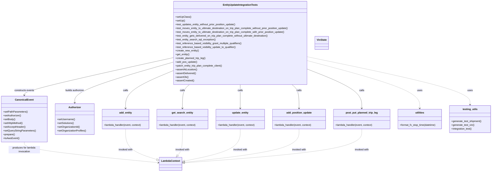
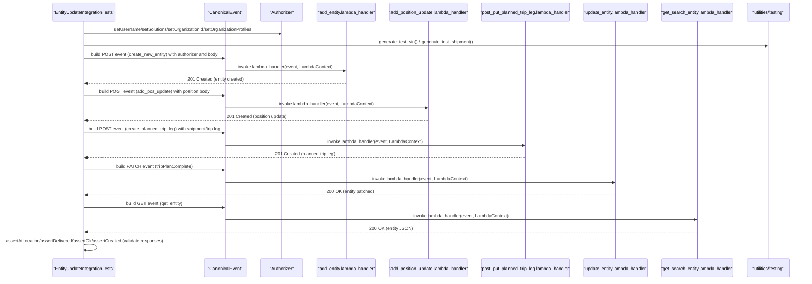

# Diagram: entity_core/entity_service/entity_service_tests/update_entity_tests/integration_tests.py

> Auto-generated by Obscura crawlers

## Diagram 1

### SVG

<svg id="container" width="3156.7734375" xmlns="http://www.w3.org/2000/svg" class="classDiagram" height="1100" viewBox="0 0 3156.7734375 1100" role="graphics-document document" aria-roledescription="class"><g><defs><marker id="container_class-aggregationStart" class="marker aggregation class" refX="18" refY="7" markerWidth="190" markerHeight="240" orient="auto"><path d="M 18,7 L9,13 L1,7 L9,1 Z"></path></marker></defs><defs><marker id="container_class-aggregationEnd" class="marker aggregation class" refX="1" refY="7" markerWidth="20" markerHeight="28" orient="auto"><path d="M 18,7 L9,13 L1,7 L9,1 Z"></path></marker></defs><defs><marker id="container_class-extensionStart" class="marker extension class" refX="18" refY="7" markerWidth="190" markerHeight="240" orient="auto"><path d="M 1,7 L18,13 V 1 Z"></path></marker></defs><defs><marker id="container_class-extensionEnd" class="marker extension class" refX="1" refY="7" markerWidth="20" markerHeight="28" orient="auto"><path d="M 1,1 V 13 L18,7 Z"></path></marker></defs><defs><marker id="container_class-compositionStart" class="marker composition class" refX="18" refY="7" markerWidth="190" markerHeight="240" orient="auto"><path d="M 18,7 L9,13 L1,7 L9,1 Z"></path></marker></defs><defs><marker id="container_class-compositionEnd" class="marker composition class" refX="1" refY="7" markerWidth="20" markerHeight="28" orient="auto"><path d="M 18,7 L9,13 L1,7 L9,1 Z"></path></marker></defs><defs><marker id="container_class-dependencyStart" class="marker dependency class" refX="6" refY="7" markerWidth="190" markerHeight="240" orient="auto"><path d="M 5,7 L9,13 L1,7 L9,1 Z"></path></marker></defs><defs><marker id="container_class-dependencyEnd" class="marker dependency class" refX="13" refY="7" markerWidth="20" markerHeight="28" orient="auto"><path d="M 18,7 L9,13 L14,7 L9,1 Z"></path></marker></defs><defs><marker id="container_class-lollipopStart" class="marker lollipop class" refX="13" refY="7" markerWidth="190" markerHeight="240" orient="auto"><circle stroke="black" fill="transparent" cx="7" cy="7" r="6"></circle></marker></defs><defs><marker id="container_class-lollipopEnd" class="marker lollipop class" refX="1" refY="7" markerWidth="190" markerHeight="240" orient="auto"><circle stroke="black" fill="transparent" cx="7" cy="7" r="6"></circle></marker></defs><g class="root"><g class="clusters"></g><g class="edgePaths"><path d="M1098.504,371.011L940.719,405.676C782.934,440.341,467.363,509.67,309.578,549.502C151.793,589.333,151.793,599.667,151.793,604.833L151.793,610" id="id_EntityUpdateIntegrationTests_CanonicalEvent_1" class="edge-thickness-normal edge-pattern-solid relation" style=";;;" data-edge="true" data-et="edge" data-id="id_EntityUpdateIntegrationTests_CanonicalEvent_1" data-points="W3sieCI6MTA5OC41MDM5MDYyNSwieSI6MzcxLjAxMDg0MDI5MjAxMDM2fSx7IngiOjE1MS43OTI5Njg3NSwieSI6NTc5fSx7IngiOjE1MS43OTI5Njg3NSwieSI6NjE2fV0=" marker-end="url(#container_class-dependencyEnd)"></path><path d="M1098.504,399.681L993.75,429.568C888.996,459.454,679.488,519.227,574.734,562.28C469.98,605.333,469.98,631.667,469.98,644.833L469.98,658" id="id_EntityUpdateIntegrationTests_Authorizer_2" class="edge-thickness-normal edge-pattern-solid relation" style=";;;" data-edge="true" data-et="edge" data-id="id_EntityUpdateIntegrationTests_Authorizer_2" data-points="W3sieCI6MTA5OC41MDM5MDYyNSwieSI6Mzk5LjY4MTI1NzI4NjE0NDh9LHsieCI6NDY5Ljk4MDQ2ODc1LCJ5Ijo1Nzl9LHsieCI6NDY5Ljk4MDQ2ODc1LCJ5Ijo2NjR9XQ==" marker-end="url(#container_class-dependencyEnd)"></path><path d="M1972.535,364.677L2146.609,400.397C2320.684,436.118,2668.832,507.559,2842.906,558.446C3016.98,609.333,3016.98,639.667,3016.98,654.833L3016.98,670" id="id_EntityUpdateIntegrationTests_testing_utils_3" class="edge-thickness-normal edge-pattern-dashed relation" style=";;;" data-edge="true" data-et="edge" data-id="id_EntityUpdateIntegrationTests_testing_utils_3" data-points="W3sieCI6MTk3Mi41MzUxNTYyNSwieSI6MzY0LjY3Njg0OTgxNTY5MDh9LHsieCI6MzAxNi45ODA0Njg3NSwieSI6NTc5fSx7IngiOjMwMTYuOTgwNDY4NzUsInkiOjY3Nn1d" marker-end="url(#container_class-dependencyEnd)"></path><path d="M1972.535,389.848L2092.495,421.373C2212.454,452.898,2452.374,515.949,2572.333,566.641C2692.293,617.333,2692.293,655.667,2692.293,674.833L2692.293,694" id="id_EntityUpdateIntegrationTests_utilities_4" class="edge-thickness-normal edge-pattern-dashed relation" style=";;;" data-edge="true" data-et="edge" data-id="id_EntityUpdateIntegrationTests_utilities_4" data-points="W3sieCI6MTk3Mi41MzUxNTYyNSwieSI6Mzg5Ljg0NzY4MzgxODgxMTh9LHsieCI6MjY5Mi4yOTI5Njg3NSwieSI6NTc5fSx7IngiOjI2OTIuMjkyOTY4NzUsInkiOjcwMH1d" marker-end="url(#container_class-dependencyEnd)"></path><path d="M1098.504,454.707L1048.128,475.423C997.751,496.138,896.999,537.569,846.622,577.451C796.246,617.333,796.246,655.667,796.246,674.833L796.246,694" id="id_EntityUpdateIntegrationTests_add_entity_5" class="edge-thickness-normal edge-pattern-solid relation" style=";;;" data-edge="true" data-et="edge" data-id="id_EntityUpdateIntegrationTests_add_entity_5" data-points="W3sieCI6MTA5OC41MDM5MDYyNSwieSI6NDU0LjcwNzE4NzE2NjQ1MzU0fSx7IngiOjc5Ni4yNDYwOTM3NSwieSI6NTc5fSx7IngiOjc5Ni4yNDYwOTM3NSwieSI6NzAwfV0=" marker-end="url(#container_class-dependencyEnd)"></path><path d="M1868.357,542L1876.044,548.167C1883.731,554.333,1899.106,566.667,1906.793,592C1914.48,617.333,1914.48,655.667,1914.48,674.833L1914.48,694" id="id_EntityUpdateIntegrationTests_add_position_update_6" class="edge-thickness-normal edge-pattern-solid relation" style=";;;" data-edge="true" data-et="edge" data-id="id_EntityUpdateIntegrationTests_add_position_update_6" data-points="W3sieCI6MTg2OC4zNTY5MzM1OTM3NSwieSI6NTQyfSx7IngiOjE5MTQuNDgwNDY4NzUsInkiOjU3OX0seyJ4IjoxOTE0LjQ4MDQ2ODc1LCJ5Ijo3MDB9XQ==" marker-end="url(#container_class-dependencyEnd)"></path><path d="M1972.535,444.882L2030.037,467.235C2087.539,489.588,2202.543,534.294,2260.045,575.814C2317.547,617.333,2317.547,655.667,2317.547,674.833L2317.547,694" id="id_EntityUpdateIntegrationTests_post_put_planned_trip_leg_7" class="edge-thickness-normal edge-pattern-solid relation" style=";;;" data-edge="true" data-et="edge" data-id="id_EntityUpdateIntegrationTests_post_put_planned_trip_leg_7" data-points="W3sieCI6MTk3Mi41MzUxNTYyNSwieSI6NDQ0Ljg4MjQ4NjkyNTUwOTF9LHsieCI6MjMxNy41NDY4NzUsInkiOjU3OX0seyJ4IjoyMzE3LjU0Njg3NSwieSI6NzAwfV0=" marker-end="url(#container_class-dependencyEnd)"></path><path d="M1535.52,542L1535.52,548.167C1535.52,554.333,1535.52,566.667,1535.52,592C1535.52,617.333,1535.52,655.667,1535.52,674.833L1535.52,694" id="id_EntityUpdateIntegrationTests_update_entity_8" class="edge-thickness-normal edge-pattern-solid relation" style=";;;" data-edge="true" data-et="edge" data-id="id_EntityUpdateIntegrationTests_update_entity_8" data-points="W3sieCI6MTUzNS41MTk1MzEyNSwieSI6NTQyfSx7IngiOjE1MzUuNTE5NTMxMjUsInkiOjU3OX0seyJ4IjoxNTM1LjUxOTUzMTI1LCJ5Ijo3MDB9XQ==" marker-end="url(#container_class-dependencyEnd)"></path><path d="M1208.292,542L1200.734,548.167C1193.176,554.333,1178.061,566.667,1170.503,592C1162.945,617.333,1162.945,655.667,1162.945,674.833L1162.945,694" id="id_EntityUpdateIntegrationTests_get_search_entity_9" class="edge-thickness-normal edge-pattern-solid relation" style=";;;" data-edge="true" data-et="edge" data-id="id_EntityUpdateIntegrationTests_get_search_entity_9" data-points="W3sieCI6MTIwOC4yOTE1MTY3NTU3NTY3LCJ5Ijo1NDJ9LHsieCI6MTE2Mi45NDUzMTI1LCJ5Ijo1Nzl9LHsieCI6MTE2Mi45NDUzMTI1LCJ5Ijo3MDB9XQ==" marker-end="url(#container_class-dependencyEnd)"></path><path d="M151.793,910L151.793,918.167C151.793,926.333,151.793,942.667,294.674,964.776C437.556,986.885,723.318,1014.77,866.2,1028.713L1009.081,1042.655" id="id_CanonicalEvent_LambdaContext_10" class="edge-thickness-normal edge-pattern-dashed relation" style=";;;" data-edge="true" data-et="edge" data-id="id_CanonicalEvent_LambdaContext_10" data-points="W3sieCI6MTUxLjc5Mjk2ODc1LCJ5Ijo5MTB9LHsieCI6MTUxLjc5Mjk2ODc1LCJ5Ijo5NTl9LHsieCI6MTAxNS4wNTI3MzQzNzUsInkiOjEwNDMuMjM3OTI3NDg4NDg2fV0=" marker-end="url(#container_class-dependencyEnd)"></path><path d="M796.246,826L796.246,848.167C796.246,870.333,796.246,914.667,829.972,947.486C863.699,980.305,931.151,1001.611,964.877,1012.264L998.604,1022.916" id="id_add_entity_LambdaContext_11" class="edge-thickness-normal edge-pattern-dashed relation" style=";;;" data-edge="true" data-et="edge" data-id="id_add_entity_LambdaContext_11" data-points="W3sieCI6Nzk2LjI0NjA5Mzc1LCJ5Ijo4MjZ9LHsieCI6Nzk2LjI0NjA5Mzc1LCJ5Ijo5NTl9LHsieCI6MTAxNS4wNTI3MzQzNzUsInkiOjEwMjguMTExOTc5NjA4MDIzOH1d" marker-end="url(#container_class-extensionEnd)"></path><path d="M1162.945,826L1162.945,848.167C1162.945,870.333,1162.945,914.667,1157.771,942.824C1152.597,970.982,1142.248,982.963,1137.074,988.954L1131.9,994.945" id="id_get_search_entity_LambdaContext_12" class="edge-thickness-normal edge-pattern-dashed relation" style=";;;" data-edge="true" data-et="edge" data-id="id_get_search_entity_LambdaContext_12" data-points="W3sieCI6MTE2Mi45NDUzMTI1LCJ5Ijo4MjZ9LHsieCI6MTE2Mi45NDUzMTI1LCJ5Ijo5NTl9LHsieCI6MTEyMC42MjQ1NDkyNzg4NDYyLCJ5IjoxMDA4fV0=" marker-end="url(#container_class-extensionEnd)"></path><path d="M1535.52,826L1535.52,848.167C1535.52,870.333,1535.52,914.667,1474.692,949.102C1413.865,983.537,1292.21,1008.075,1231.383,1020.344L1170.556,1032.612" id="id_update_entity_LambdaContext_13" class="edge-thickness-normal edge-pattern-dashed relation" style=";;;" data-edge="true" data-et="edge" data-id="id_update_entity_LambdaContext_13" data-points="W3sieCI6MTUzNS41MTk1MzEyNSwieSI6ODI2fSx7IngiOjE1MzUuNTE5NTMxMjUsInkiOjk1OX0seyJ4IjoxMTUzLjY0NjQ4NDM3NSwieSI6MTAzNi4wMjI5Njk3OTY0MDZ9XQ==" marker-end="url(#container_class-extensionEnd)"></path><path d="M1914.48,826L1914.48,848.167C1914.48,870.333,1914.48,914.667,1790.533,950.421C1666.585,986.175,1418.689,1013.349,1294.742,1026.937L1170.794,1040.524" id="id_add_position_update_LambdaContext_14" class="edge-thickness-normal edge-pattern-dashed relation" style=";;;" data-edge="true" data-et="edge" data-id="id_add_position_update_LambdaContext_14" data-points="W3sieCI6MTkxNC40ODA0Njg3NSwieSI6ODI2fSx7IngiOjE5MTQuNDgwNDY4NzUsInkiOjk1OX0seyJ4IjoxMTUzLjY0NjQ4NDM3NSwieSI6MTA0Mi40MDM1ODg0Nzc5MDg0fV0=" marker-end="url(#container_class-extensionEnd)"></path><path d="M2317.547,826L2317.547,848.167C2317.547,870.333,2317.547,914.667,2126.431,950.936C1935.314,987.206,1553.082,1015.411,1361.966,1029.514L1170.85,1043.617" id="id_post_put_planned_trip_leg_LambdaContext_15" class="edge-thickness-normal edge-pattern-dashed relation" style=";;;" data-edge="true" data-et="edge" data-id="id_post_put_planned_trip_leg_LambdaContext_15" data-points="W3sieCI6MjMxNy41NDY4NzUsInkiOjgyNn0seyJ4IjoyMzE3LjU0Njg3NSwieSI6OTU5fSx7IngiOjExNTMuNjQ2NDg0Mzc1LCJ5IjoxMDQ0Ljg4NjQ1MDIwNDg2MzJ9XQ==" marker-end="url(#container_class-extensionEnd)"></path></g><g class="edgeLabels"><g class="edgeLabel" transform="translate(151.79296875, 579)"><g class="label" data-id="id_EntityUpdateIntegrationTests_CanonicalEvent_1" transform="translate(-63.8671875, -12)"><foreignObject width="127.734375" height="24">

constructs events

</foreignObject></g></g><g class="edgeLabel" transform="translate(469.98046875, 579)"><g class="label" data-id="id_EntityUpdateIntegrationTests_Authorizer_2" transform="translate(-62.1015625, -12)"><foreignObject width="124.203125" height="24">

builds authorizer

</foreignObject></g></g><g class="edgeLabel" transform="translate(3016.98046875, 579)"><g class="label" data-id="id_EntityUpdateIntegrationTests_testing_utils_3" transform="translate(-16.4921875, -12)"><foreignObject width="32.984375" height="24">

uses

</foreignObject></g></g><g class="edgeLabel" transform="translate(2692.29296875, 579)"><g class="label" data-id="id_EntityUpdateIntegrationTests_utilities_4" transform="translate(-16.4921875, -12)"><foreignObject width="32.984375" height="24">

uses

</foreignObject></g></g><g class="edgeLabel" transform="translate(796.24609375, 579)"><g class="label" data-id="id_EntityUpdateIntegrationTests_add_entity_5" transform="translate(-16.4453125, -12)"><foreignObject width="32.890625" height="24">

calls

</foreignObject></g></g><g class="edgeLabel" transform="translate(1914.48046875, 579)"><g class="label" data-id="id_EntityUpdateIntegrationTests_add_position_update_6" transform="translate(-16.4453125, -12)"><foreignObject width="32.890625" height="24">

calls

</foreignObject></g></g><g class="edgeLabel" transform="translate(2317.546875, 579)"><g class="label" data-id="id_EntityUpdateIntegrationTests_post_put_planned_trip_leg_7" transform="translate(-16.4453125, -12)"><foreignObject width="32.890625" height="24">

calls

</foreignObject></g></g><g class="edgeLabel" transform="translate(1535.51953125, 579)"><g class="label" data-id="id_EntityUpdateIntegrationTests_update_entity_8" transform="translate(-16.4453125, -12)"><foreignObject width="32.890625" height="24">

calls

</foreignObject></g></g><g class="edgeLabel" transform="translate(1162.9453125, 579)"><g class="label" data-id="id_EntityUpdateIntegrationTests_get_search_entity_9" transform="translate(-16.4453125, -12)"><foreignObject width="32.890625" height="24">

calls

</foreignObject></g></g><g class="edgeLabel" transform="translate(151.79296875, 959)"><g class="label" data-id="id_CanonicalEvent_LambdaContext_10" transform="translate(-100, -24)"><foreignObject width="200" height="48">

produces for lambda invocation

</foreignObject></g></g><g class="edgeLabel" transform="translate(796.24609375, 959)"><g class="label" data-id="id_add_entity_LambdaContext_11" transform="translate(-46.3203125, -12)"><foreignObject width="92.640625" height="24">

invoked with

</foreignObject></g></g><g class="edgeLabel" transform="translate(1162.9453125, 959)"><g class="label" data-id="id_get_search_entity_LambdaContext_12" transform="translate(-46.3203125, -12)"><foreignObject width="92.640625" height="24">

invoked with

</foreignObject></g></g><g class="edgeLabel" transform="translate(1535.51953125, 959)"><g class="label" data-id="id_update_entity_LambdaContext_13" transform="translate(-46.3203125, -12)"><foreignObject width="92.640625" height="24">

invoked with

</foreignObject></g></g><g class="edgeLabel" transform="translate(1914.48046875, 959)"><g class="label" data-id="id_add_position_update_LambdaContext_14" transform="translate(-46.3203125, -12)"><foreignObject width="92.640625" height="24">

invoked with

</foreignObject></g></g><g class="edgeLabel" transform="translate(2317.546875, 959)"><g class="label" data-id="id_post_put_planned_trip_leg_LambdaContext_15" transform="translate(-46.3203125, -12)"><foreignObject width="92.640625" height="24">

invoked with

</foreignObject></g></g></g><g class="nodes"><g class="node default" id="classId-EntityUpdateIntegrationTests-0" transform="translate(1535.51953125, 275)"><g class="basic label-container"><path d="M-437.015625 -267 L437.015625 -267 L437.015625 267 L-437.015625 267" stroke="none" stroke-width="0" fill="#ECECFF" style=""></path><path d="M-437.015625 -267 C-213.41104624783904 -267, 10.193532504321922 -267, 437.015625 -267 M-437.015625 -267 C-234.66667918477478 -267, -32.31773336954956 -267, 437.015625 -267 M437.015625 -267 C437.015625 -155.15061954627282, 437.015625 -43.30123909254564, 437.015625 267 M437.015625 -267 C437.015625 -130.13103874861682, 437.015625 6.7379225027663665, 437.015625 267 M437.015625 267 C219.17387802541543 267, 1.332131050830867 267, -437.015625 267 M437.015625 267 C213.7523135418348 267, -9.510997916330382 267, -437.015625 267 M-437.015625 267 C-437.015625 94.29447115581178, -437.015625 -78.41105768837645, -437.015625 -267 M-437.015625 267 C-437.015625 139.70286577713057, -437.015625 12.405731554261138, -437.015625 -267" stroke="#9370DB" stroke-width="1.3" fill="none" stroke-dasharray="0 0" style=""></path></g><g class="annotation-group text" transform="translate(0, -243)"></g><g class="label-group text" transform="translate(-107.59375, -243)"><g class="label" style="font-weight: bolder" transform="translate(0,-12)"><foreignObject width="215.1875" height="24">

EntityUpdateIntegrationTests

</foreignObject></g></g><g class="members-group text" transform="translate(-425.015625, -195)"></g><g class="methods-group text" transform="translate(-425.015625, -165)"><g class="label" style="" transform="translate(0,-12)"><foreignObject width="97.15625" height="24">

+setUpClass()

</foreignObject></g><g class="label" style="" transform="translate(0,12)"><foreignObject width="60.421875" height="24">

+setUp()

</foreignObject></g><g class="label" style="" transform="translate(0,36)"><foreignObject width="395.578125" height="24">

+test_updates_entity_without_prior_position_update()

</foreignObject></g><g class="label" style="" transform="translate(0,60)"><foreignObject width="742.4375" height="24">

+test_moves_entity_to_ultimate_destination_on_trip_plan_complete_without_prior_position_update()

</foreignObject></g><g class="label" style="" transform="translate(0,84)"><foreignObject width="718.015625" height="24">

+test_moves_entity_to_ultimate_destination_on_trip_plan_complete_with_prior_position_update()

</foreignObject></g><g class="label" style="" transform="translate(0,108)"><foreignObject width="608.8125" height="24">

+test_entity_gets_delivered_on_trip_plan_complete_without_ultimate_destination()

</foreignObject></g><g class="label" style="" transform="translate(0,132)"><foreignObject width="259.828125" height="24">

+test_entity_search_sql_exception()

</foreignObject></g><g class="label" style="" transform="translate(0,156)"><foreignObject width="433.484375" height="24">

+test_reference_based_visibility_grant_multiple_qualifiers()

</foreignObject></g><g class="label" style="" transform="translate(0,180)"><foreignObject width="392.75" height="24">

+test_reference_based_visibility_update_to_qualifier()

</foreignObject></g><g class="label" style="" transform="translate(0,204)"><foreignObject width="150.421875" height="24">

+create_new_entity()

</foreignObject></g><g class="label" style="" transform="translate(0,228)"><foreignObject width="90.875" height="24">

+get_entity()

</foreignObject></g><g class="label" style="" transform="translate(0,252)"><foreignObject width="194.53125" height="24">

+create_planned_trip_leg()

</foreignObject></g><g class="label" style="" transform="translate(0,276)"><foreignObject width="139.625" height="24">

+add_pos_update()

</foreignObject></g><g class="label" style="" transform="translate(0,300)"><foreignObject width="306.46875" height="24">

+patch_entity_trip_plan_complete_client()

</foreignObject></g><g class="label" style="" transform="translate(0,324)"><foreignObject width="139.171875" height="24">

+assertAtLocation()

</foreignObject></g><g class="label" style="" transform="translate(0,348)"><foreignObject width="130.859375" height="24">

+assertDelivered()

</foreignObject></g><g class="label" style="" transform="translate(0,372)"><foreignObject width="81.390625" height="24">

+assertOk()

</foreignObject></g><g class="label" style="" transform="translate(0,396)"><foreignObject width="117.625" height="24">

+assertCreated()

</foreignObject></g></g><g class="divider" style=""><path d="M-437.015625 -219 C-218.25922689818447 -219, 0.49717120363106915 -219, 437.015625 -219 M-437.015625 -219 C-123.58956419877507 -219, 189.83649660244987 -219, 437.015625 -219" stroke="#9370DB" stroke-width="1.3" fill="none" stroke-dasharray="0 0" style=""></path></g><g class="divider" style=""><path d="M-437.015625 -195 C-190.67664876014717 -195, 55.66232747970565 -195, 437.015625 -195 M-437.015625 -195 C-143.3080933307072 -195, 150.39943833858558 -195, 437.015625 -195" stroke="#9370DB" stroke-width="1.3" fill="none" stroke-dasharray="0 0" style=""></path></g></g><g class="node default" id="classId-CanonicalEvent-1" transform="translate(151.79296875, 763)"><g class="basic label-container"><path d="M-143.79296875 -147 L143.79296875 -147 L143.79296875 147 L-143.79296875 147" stroke="none" stroke-width="0" fill="#ECECFF" style=""></path><path d="M-143.79296875 -147 C-57.42059894050698 -147, 28.951770868986046 -147, 143.79296875 -147 M-143.79296875 -147 C-80.57243891270565 -147, -17.351909075411314 -147, 143.79296875 -147 M143.79296875 -147 C143.79296875 -61.05049576396182, 143.79296875 24.89900847207636, 143.79296875 147 M143.79296875 -147 C143.79296875 -80.82312779715728, 143.79296875 -14.646255594314567, 143.79296875 147 M143.79296875 147 C58.34669431776142 147, -27.099580114477163 147, -143.79296875 147 M143.79296875 147 C66.93757030922563 147, -9.917828131548731 147, -143.79296875 147 M-143.79296875 147 C-143.79296875 59.22303625259107, -143.79296875 -28.553927494817856, -143.79296875 -147 M-143.79296875 147 C-143.79296875 86.3074652821298, -143.79296875 25.614930564259595, -143.79296875 -147" stroke="#9370DB" stroke-width="1.3" fill="none" stroke-dasharray="0 0" style=""></path></g><g class="annotation-group text" transform="translate(0, -123)"></g><g class="label-group text" transform="translate(-55.7109375, -123)"><g class="label" style="font-weight: bolder" transform="translate(0,-12)"><foreignObject width="111.421875" height="24">

CanonicalEvent

</foreignObject></g></g><g class="members-group text" transform="translate(-131.79296875, -75)"></g><g class="methods-group text" transform="translate(-131.79296875, -45)"><g class="label" style="" transform="translate(0,-12)"><foreignObject width="154.140625" height="24">

+setPathParameters()

</foreignObject></g><g class="label" style="" transform="translate(0,12)"><foreignObject width="115.765625" height="24">

+setAuthorizer()

</foreignObject></g><g class="label" style="" transform="translate(0,36)"><foreignObject width="76.84375" height="24">

+setBody()

</foreignObject></g><g class="label" style="" transform="translate(0,60)"><foreignObject width="127.5" height="24">

+setHttpMethod()

</foreignObject></g><g class="label" style="" transform="translate(0,84)"><foreignObject width="140.765625" height="24">

+setAcceptHeader()

</foreignObject></g><g class="label" style="" transform="translate(0,108)"><foreignObject width="207.875" height="24">

+setQueryStringParameters()

</foreignObject></g><g class="label" style="" transform="translate(0,132)"><foreignObject width="74.75" height="24">

+prepare()

</foreignObject></g><g class="label" style="" transform="translate(0,156)"><foreignObject width="101.1875" height="24">

+toAwsEvent()

</foreignObject></g></g><g class="divider" style=""><path d="M-143.79296875 -99 C-32.307357335544225 -99, 79.17825407891155 -99, 143.79296875 -99 M-143.79296875 -99 C-82.29290239561033 -99, -20.79283604122064 -99, 143.79296875 -99" stroke="#9370DB" stroke-width="1.3" fill="none" stroke-dasharray="0 0" style=""></path></g><g class="divider" style=""><path d="M-143.79296875 -75 C-32.09528940132965 -75, 79.6023899473407 -75, 143.79296875 -75 M-143.79296875 -75 C-80.58511813772157 -75, -17.377267525443145 -75, 143.79296875 -75" stroke="#9370DB" stroke-width="1.3" fill="none" stroke-dasharray="0 0" style=""></path></g></g><g class="node default" id="classId-Authorizer-2" transform="translate(469.98046875, 763)"><g class="basic label-container"><path d="M-124.39453125 -99 L124.39453125 -99 L124.39453125 99 L-124.39453125 99" stroke="none" stroke-width="0" fill="#ECECFF" style=""></path><path d="M-124.39453125 -99 C-57.67144540461112 -99, 9.05164044077776 -99, 124.39453125 -99 M-124.39453125 -99 C-58.1757775517455 -99, 8.042976146509005 -99, 124.39453125 -99 M124.39453125 -99 C124.39453125 -49.73930439512941, 124.39453125 -0.47860879025881786, 124.39453125 99 M124.39453125 -99 C124.39453125 -23.280614206959285, 124.39453125 52.43877158608143, 124.39453125 99 M124.39453125 99 C31.464933577555044 99, -61.46466409488991 99, -124.39453125 99 M124.39453125 99 C66.44434541131406 99, 8.494159572628107 99, -124.39453125 99 M-124.39453125 99 C-124.39453125 51.3910731168822, -124.39453125 3.7821462337643936, -124.39453125 -99 M-124.39453125 99 C-124.39453125 51.88347114380615, -124.39453125 4.766942287612295, -124.39453125 -99" stroke="#9370DB" stroke-width="1.3" fill="none" stroke-dasharray="0 0" style=""></path></g><g class="annotation-group text" transform="translate(0, -75)"></g><g class="label-group text" transform="translate(-38.3671875, -75)"><g class="label" style="font-weight: bolder" transform="translate(0,-12)"><foreignObject width="76.734375" height="24">

Authorizer

</foreignObject></g></g><g class="members-group text" transform="translate(-112.39453125, -27)"></g><g class="methods-group text" transform="translate(-112.39453125, 3)"><g class="label" style="" transform="translate(0,-12)"><foreignObject width="113.71875" height="24">

+setUsername()

</foreignObject></g><g class="label" style="" transform="translate(0,12)"><foreignObject width="108.875" height="24">

+setSolutions()

</foreignObject></g><g class="label" style="" transform="translate(0,36)"><foreignObject width="146.703125" height="24">

+setOrganizationId()

</foreignObject></g><g class="label" style="" transform="translate(0,60)"><foreignObject width="186.421875" height="24">

+setOrganizationProfiles()

</foreignObject></g></g><g class="divider" style=""><path d="M-124.39453125 -51 C-33.5115428723705 -51, 57.371445505259004 -51, 124.39453125 -51 M-124.39453125 -51 C-48.33911975168424 -51, 27.716291746631526 -51, 124.39453125 -51" stroke="#9370DB" stroke-width="1.3" fill="none" stroke-dasharray="0 0" style=""></path></g><g class="divider" style=""><path d="M-124.39453125 -27 C-72.86873116131818 -27, -21.342931072636375 -27, 124.39453125 -27 M-124.39453125 -27 C-40.5765314292325 -27, 43.241468391534994 -27, 124.39453125 -27" stroke="#9370DB" stroke-width="1.3" fill="none" stroke-dasharray="0 0" style=""></path></g></g><g class="node default" id="classId-LambdaContext-3" transform="translate(1084.349609375, 1050)"><g class="basic label-container"><path d="M-69.296875 -42 L69.296875 -42 L69.296875 42 L-69.296875 42" stroke="none" stroke-width="0" fill="#ECECFF" style=""></path><path d="M-69.296875 -42 C-25.767169534171572 -42, 17.762535931656856 -42, 69.296875 -42 M-69.296875 -42 C-23.243951817516738 -42, 22.808971364966524 -42, 69.296875 -42 M69.296875 -42 C69.296875 -11.666024194569054, 69.296875 18.66795161086189, 69.296875 42 M69.296875 -42 C69.296875 -24.89062846388717, 69.296875 -7.7812569277743435, 69.296875 42 M69.296875 42 C26.15898531706725 42, -16.978904365865503 42, -69.296875 42 M69.296875 42 C21.22997773163224 42, -26.83691953673552 42, -69.296875 42 M-69.296875 42 C-69.296875 14.137544250983488, -69.296875 -13.724911498033023, -69.296875 -42 M-69.296875 42 C-69.296875 18.824411877406064, -69.296875 -4.351176245187872, -69.296875 -42" stroke="#9370DB" stroke-width="1.3" fill="none" stroke-dasharray="0 0" style=""></path></g><g class="annotation-group text" transform="translate(0, -18)"></g><g class="label-group text" transform="translate(-57.296875, -18)"><g class="label" style="font-weight: bolder" transform="translate(0,-12)"><foreignObject width="114.59375" height="24">

LambdaContext

</foreignObject></g></g><g class="members-group text" transform="translate(-57.296875, 30)"></g><g class="methods-group text" transform="translate(-57.296875, 60)"></g><g class="divider" style=""><path d="M-69.296875 6 C-30.03073994948121 6, 9.235395101037582 6, 69.296875 6 M-69.296875 6 C-21.874476859000858 6, 25.547921281998285 6, 69.296875 6" stroke="#9370DB" stroke-width="1.3" fill="none" stroke-dasharray="0 0" style=""></path></g><g class="divider" style=""><path d="M-69.296875 24 C-38.45556696051601 24, -7.614258921032011 24, 69.296875 24 M-69.296875 24 C-40.574871889323845 24, -11.852868778647682 24, 69.296875 24" stroke="#9370DB" stroke-width="1.3" fill="none" stroke-dasharray="0 0" style=""></path></g></g><g class="node default" id="classId-add_entity-4" transform="translate(796.24609375, 763)"><g class="basic label-container"><path d="M-151.87109375 -63 L151.87109375 -63 L151.87109375 63 L-151.87109375 63" stroke="none" stroke-width="0" fill="#ECECFF" style=""></path><path d="M-151.87109375 -63 C-90.57173597774963 -63, -29.27237820549925 -63, 151.87109375 -63 M-151.87109375 -63 C-86.55199472810826 -63, -21.23289570621651 -63, 151.87109375 -63 M151.87109375 -63 C151.87109375 -27.33804063068598, 151.87109375 8.323918738628038, 151.87109375 63 M151.87109375 -63 C151.87109375 -35.85874245426954, 151.87109375 -8.717484908539078, 151.87109375 63 M151.87109375 63 C86.3347916910861 63, 20.798489632172192 63, -151.87109375 63 M151.87109375 63 C34.94798414462626 63, -81.97512546074748 63, -151.87109375 63 M-151.87109375 63 C-151.87109375 19.888548597795484, -151.87109375 -23.22290280440903, -151.87109375 -63 M-151.87109375 63 C-151.87109375 15.266143859747451, -151.87109375 -32.4677122805051, -151.87109375 -63" stroke="#9370DB" stroke-width="1.3" fill="none" stroke-dasharray="0 0" style=""></path></g><g class="annotation-group text" transform="translate(0, -39)"></g><g class="label-group text" transform="translate(-39.5546875, -39)"><g class="label" style="font-weight: bolder" transform="translate(0,-12)"><foreignObject width="79.109375" height="24">

add_entity

</foreignObject></g></g><g class="members-group text" transform="translate(-139.87109375, 9)"></g><g class="methods-group text" transform="translate(-139.87109375, 39)"><g class="label" style="" transform="translate(0,-12)"><foreignObject width="240.1875" height="24">

+lambda_handler(event, context)

</foreignObject></g></g><g class="divider" style=""><path d="M-151.87109375 -15 C-90.60991354826749 -15, -29.34873334653497 -15, 151.87109375 -15 M-151.87109375 -15 C-34.04796583569677 -15, 83.77516207860646 -15, 151.87109375 -15" stroke="#9370DB" stroke-width="1.3" fill="none" stroke-dasharray="0 0" style=""></path></g><g class="divider" style=""><path d="M-151.87109375 9 C-87.45779788614716 9, -23.044502022294324 9, 151.87109375 9 M-151.87109375 9 C-82.70864940542552 9, -13.546205060851037 9, 151.87109375 9" stroke="#9370DB" stroke-width="1.3" fill="none" stroke-dasharray="0 0" style=""></path></g></g><g class="node default" id="classId-get_search_entity-5" transform="translate(1162.9453125, 763)"><g class="basic label-container"><path d="M-164.828125 -63 L164.828125 -63 L164.828125 63 L-164.828125 63" stroke="none" stroke-width="0" fill="#ECECFF" style=""></path><path d="M-164.828125 -63 C-36.393764364533126 -63, 92.04059627093375 -63, 164.828125 -63 M-164.828125 -63 C-49.709410858080545 -63, 65.40930328383891 -63, 164.828125 -63 M164.828125 -63 C164.828125 -26.450028118924763, 164.828125 10.099943762150474, 164.828125 63 M164.828125 -63 C164.828125 -14.115492363991933, 164.828125 34.769015272016134, 164.828125 63 M164.828125 63 C86.39188907424028 63, 7.955653148480565 63, -164.828125 63 M164.828125 63 C49.140424270368385 63, -66.54727645926323 63, -164.828125 63 M-164.828125 63 C-164.828125 15.539613202069575, -164.828125 -31.92077359586085, -164.828125 -63 M-164.828125 63 C-164.828125 13.098396625050768, -164.828125 -36.803206749898465, -164.828125 -63" stroke="#9370DB" stroke-width="1.3" fill="none" stroke-dasharray="0 0" style=""></path></g><g class="annotation-group text" transform="translate(0, -39)"></g><g class="label-group text" transform="translate(-65.46875, -39)"><g class="label" style="font-weight: bolder" transform="translate(0,-12)"><foreignObject width="130.9375" height="24">

get_search_entity

</foreignObject></g></g><g class="members-group text" transform="translate(-152.828125, 9)"></g><g class="methods-group text" transform="translate(-152.828125, 39)"><g class="label" style="" transform="translate(0,-12)"><foreignObject width="240.1875" height="24">

+lambda_handler(event, context)

</foreignObject></g></g><g class="divider" style=""><path d="M-164.828125 -15 C-46.900012550997445 -15, 71.02809989800511 -15, 164.828125 -15 M-164.828125 -15 C-50.886951476867466 -15, 63.05422204626507 -15, 164.828125 -15" stroke="#9370DB" stroke-width="1.3" fill="none" stroke-dasharray="0 0" style=""></path></g><g class="divider" style=""><path d="M-164.828125 9 C-75.12749274575246 9, 14.573139508495075 9, 164.828125 9 M-164.828125 9 C-38.40065842884064 9, 88.02680814231871 9, 164.828125 9" stroke="#9370DB" stroke-width="1.3" fill="none" stroke-dasharray="0 0" style=""></path></g></g><g class="node default" id="classId-update_entity-6" transform="translate(1535.51953125, 763)"><g class="basic label-container"><path d="M-157.74609375 -63 L157.74609375 -63 L157.74609375 63 L-157.74609375 63" stroke="none" stroke-width="0" fill="#ECECFF" style=""></path><path d="M-157.74609375 -63 C-78.36006456444747 -63, 1.0259646211050608 -63, 157.74609375 -63 M-157.74609375 -63 C-87.38867051559944 -63, -17.031247281198887 -63, 157.74609375 -63 M157.74609375 -63 C157.74609375 -26.600886062650893, 157.74609375 9.798227874698213, 157.74609375 63 M157.74609375 -63 C157.74609375 -35.013204274029775, 157.74609375 -7.02640854805955, 157.74609375 63 M157.74609375 63 C93.02955707037432 63, 28.313020390748648 63, -157.74609375 63 M157.74609375 63 C33.58627273785683 63, -90.57354827428634 63, -157.74609375 63 M-157.74609375 63 C-157.74609375 20.233219971743942, -157.74609375 -22.533560056512115, -157.74609375 -63 M-157.74609375 63 C-157.74609375 14.563236986311232, -157.74609375 -33.87352602737754, -157.74609375 -63" stroke="#9370DB" stroke-width="1.3" fill="none" stroke-dasharray="0 0" style=""></path></g><g class="annotation-group text" transform="translate(0, -39)"></g><g class="label-group text" transform="translate(-51.3046875, -39)"><g class="label" style="font-weight: bolder" transform="translate(0,-12)"><foreignObject width="102.609375" height="24">

update_entity

</foreignObject></g></g><g class="members-group text" transform="translate(-145.74609375, 9)"></g><g class="methods-group text" transform="translate(-145.74609375, 39)"><g class="label" style="" transform="translate(0,-12)"><foreignObject width="240.1875" height="24">

+lambda_handler(event, context)

</foreignObject></g></g><g class="divider" style=""><path d="M-157.74609375 -15 C-59.0907636068429 -15, 39.5645665363142 -15, 157.74609375 -15 M-157.74609375 -15 C-78.80370227986727 -15, 0.13868919026546678 -15, 157.74609375 -15" stroke="#9370DB" stroke-width="1.3" fill="none" stroke-dasharray="0 0" style=""></path></g><g class="divider" style=""><path d="M-157.74609375 9 C-93.92228683859022 9, -30.09847992718045 9, 157.74609375 9 M-157.74609375 9 C-63.79724014980239 9, 30.151613450395217 9, 157.74609375 9" stroke="#9370DB" stroke-width="1.3" fill="none" stroke-dasharray="0 0" style=""></path></g></g><g class="node default" id="classId-add_position_update-7" transform="translate(1914.48046875, 763)"><g class="basic label-container"><path d="M-171.21484375 -63 L171.21484375 -63 L171.21484375 63 L-171.21484375 63" stroke="none" stroke-width="0" fill="#ECECFF" style=""></path><path d="M-171.21484375 -63 C-80.7219921595168 -63, 9.770859430966397 -63, 171.21484375 -63 M-171.21484375 -63 C-95.11167364651646 -63, -19.00850354303293 -63, 171.21484375 -63 M171.21484375 -63 C171.21484375 -24.016706848033742, 171.21484375 14.966586303932516, 171.21484375 63 M171.21484375 -63 C171.21484375 -34.2716603200504, 171.21484375 -5.543320640100802, 171.21484375 63 M171.21484375 63 C73.91866835721778 63, -23.377507035564435 63, -171.21484375 63 M171.21484375 63 C70.0062225627372 63, -31.202398624525614 63, -171.21484375 63 M-171.21484375 63 C-171.21484375 21.4352197661484, -171.21484375 -20.1295604677032, -171.21484375 -63 M-171.21484375 63 C-171.21484375 15.139240289887049, -171.21484375 -32.7215194202259, -171.21484375 -63" stroke="#9370DB" stroke-width="1.3" fill="none" stroke-dasharray="0 0" style=""></path></g><g class="annotation-group text" transform="translate(0, -39)"></g><g class="label-group text" transform="translate(-78.2421875, -39)"><g class="label" style="font-weight: bolder" transform="translate(0,-12)"><foreignObject width="156.484375" height="24">

add_position_update

</foreignObject></g></g><g class="members-group text" transform="translate(-159.21484375, 9)"></g><g class="methods-group text" transform="translate(-159.21484375, 39)"><g class="label" style="" transform="translate(0,-12)"><foreignObject width="240.1875" height="24">

+lambda_handler(event, context)

</foreignObject></g></g><g class="divider" style=""><path d="M-171.21484375 -15 C-45.265883563405424 -15, 80.68307662318915 -15, 171.21484375 -15 M-171.21484375 -15 C-76.77909625916742 -15, 17.656651231665165 -15, 171.21484375 -15" stroke="#9370DB" stroke-width="1.3" fill="none" stroke-dasharray="0 0" style=""></path></g><g class="divider" style=""><path d="M-171.21484375 9 C-47.775625283033875 9, 75.66359318393225 9, 171.21484375 9 M-171.21484375 9 C-79.01692556510706 9, 13.180992619785883 9, 171.21484375 9" stroke="#9370DB" stroke-width="1.3" fill="none" stroke-dasharray="0 0" style=""></path></g></g><g class="node default" id="classId-post_put_planned_trip_leg-8" transform="translate(2317.546875, 763)"><g class="basic label-container"><path d="M-181.8515625 -63 L181.8515625 -63 L181.8515625 63 L-181.8515625 63" stroke="none" stroke-width="0" fill="#ECECFF" style=""></path><path d="M-181.8515625 -63 C-102.09734406525354 -63, -22.343125630507075 -63, 181.8515625 -63 M-181.8515625 -63 C-105.1038936653568 -63, -28.356224830713586 -63, 181.8515625 -63 M181.8515625 -63 C181.8515625 -17.699013346286442, 181.8515625 27.601973307427116, 181.8515625 63 M181.8515625 -63 C181.8515625 -19.938874715931384, 181.8515625 23.122250568137233, 181.8515625 63 M181.8515625 63 C52.57864698914506 63, -76.69426852170989 63, -181.8515625 63 M181.8515625 63 C80.25734533662244 63, -21.33687182675513 63, -181.8515625 63 M-181.8515625 63 C-181.8515625 31.92037839230162, -181.8515625 0.8407567846032435, -181.8515625 -63 M-181.8515625 63 C-181.8515625 31.941689893977024, -181.8515625 0.8833797879540484, -181.8515625 -63" stroke="#9370DB" stroke-width="1.3" fill="none" stroke-dasharray="0 0" style=""></path></g><g class="annotation-group text" transform="translate(0, -39)"></g><g class="label-group text" transform="translate(-99.515625, -39)"><g class="label" style="font-weight: bolder" transform="translate(0,-12)"><foreignObject width="199.03125" height="24">

post_put_planned_trip_leg

</foreignObject></g></g><g class="members-group text" transform="translate(-169.8515625, 9)"></g><g class="methods-group text" transform="translate(-169.8515625, 39)"><g class="label" style="" transform="translate(0,-12)"><foreignObject width="240.1875" height="24">

+lambda_handler(event, context)

</foreignObject></g></g><g class="divider" style=""><path d="M-181.8515625 -15 C-72.06366175485645 -15, 37.72423899028709 -15, 181.8515625 -15 M-181.8515625 -15 C-75.06268691697323 -15, 31.72618866605353 -15, 181.8515625 -15" stroke="#9370DB" stroke-width="1.3" fill="none" stroke-dasharray="0 0" style=""></path></g><g class="divider" style=""><path d="M-181.8515625 9 C-82.6991677148345 9, 16.453227070330996 9, 181.8515625 9 M-181.8515625 9 C-57.92845167040598 9, 65.99465915918805 9, 181.8515625 9" stroke="#9370DB" stroke-width="1.3" fill="none" stroke-dasharray="0 0" style=""></path></g></g><g class="node default" id="classId-utilities-9" transform="translate(2692.29296875, 763)"><g class="basic label-container"><path d="M-142.89453125 -63 L142.89453125 -63 L142.89453125 63 L-142.89453125 63" stroke="none" stroke-width="0" fill="#ECECFF" style=""></path><path d="M-142.89453125 -63 C-70.79286677516646 -63, 1.3087976996670818 -63, 142.89453125 -63 M-142.89453125 -63 C-43.09655280241978 -63, 56.70142564516044 -63, 142.89453125 -63 M142.89453125 -63 C142.89453125 -36.55657613607384, 142.89453125 -10.113152272147687, 142.89453125 63 M142.89453125 -63 C142.89453125 -30.741040911935933, 142.89453125 1.5179181761281342, 142.89453125 63 M142.89453125 63 C56.54606912201743 63, -29.802393005965143 63, -142.89453125 63 M142.89453125 63 C37.63039409690376 63, -67.63374305619249 63, -142.89453125 63 M-142.89453125 63 C-142.89453125 37.72674499455847, -142.89453125 12.453489989116946, -142.89453125 -63 M-142.89453125 63 C-142.89453125 20.785463682459707, -142.89453125 -21.429072635080587, -142.89453125 -63" stroke="#9370DB" stroke-width="1.3" fill="none" stroke-dasharray="0 0" style=""></path></g><g class="annotation-group text" transform="translate(0, -39)"></g><g class="label-group text" transform="translate(-28.1796875, -39)"><g class="label" style="font-weight: bolder" transform="translate(0,-12)"><foreignObject width="56.359375" height="24">

utilities

</foreignObject></g></g><g class="members-group text" transform="translate(-130.89453125, 9)"></g><g class="methods-group text" transform="translate(-130.89453125, 39)"><g class="label" style="" transform="translate(0,-12)"><foreignObject width="233.609375" height="24">

+format_fv_stop_time(datetime)

</foreignObject></g></g><g class="divider" style=""><path d="M-142.89453125 -15 C-72.8298766178859 -15, -2.7652219857718023 -15, 142.89453125 -15 M-142.89453125 -15 C-38.48929936636547 -15, 65.91593251726906 -15, 142.89453125 -15" stroke="#9370DB" stroke-width="1.3" fill="none" stroke-dasharray="0 0" style=""></path></g><g class="divider" style=""><path d="M-142.89453125 9 C-83.23859515674437 9, -23.582659063488748 9, 142.89453125 9 M-142.89453125 9 C-56.415730789379964 9, 30.063069671240072 9, 142.89453125 9" stroke="#9370DB" stroke-width="1.3" fill="none" stroke-dasharray="0 0" style=""></path></g></g><g class="node default" id="classId-testing_utils-10" transform="translate(3016.98046875, 763)"><g class="basic label-container"><path d="M-131.79296875 -87 L131.79296875 -87 L131.79296875 87 L-131.79296875 87" stroke="none" stroke-width="0" fill="#ECECFF" style=""></path><path d="M-131.79296875 -87 C-77.82451100692285 -87, -23.856053263845695 -87, 131.79296875 -87 M-131.79296875 -87 C-75.42262813043784 -87, -19.052287510875686 -87, 131.79296875 -87 M131.79296875 -87 C131.79296875 -44.1613511072604, 131.79296875 -1.3227022145208025, 131.79296875 87 M131.79296875 -87 C131.79296875 -33.23289898676773, 131.79296875 20.53420202646454, 131.79296875 87 M131.79296875 87 C57.359054389692034 87, -17.074859970615933 87, -131.79296875 87 M131.79296875 87 C70.5288613970852 87, 9.264754044170374 87, -131.79296875 87 M-131.79296875 87 C-131.79296875 44.17211350059347, -131.79296875 1.3442270011869368, -131.79296875 -87 M-131.79296875 87 C-131.79296875 46.6379108933008, -131.79296875 6.275821786601597, -131.79296875 -87" stroke="#9370DB" stroke-width="1.3" fill="none" stroke-dasharray="0 0" style=""></path></g><g class="annotation-group text" transform="translate(0, -63)"></g><g class="label-group text" transform="translate(-45.8203125, -63)"><g class="label" style="font-weight: bolder" transform="translate(0,-12)"><foreignObject width="91.640625" height="24">

testing_utils

</foreignObject></g></g><g class="members-group text" transform="translate(-119.79296875, -15)"></g><g class="methods-group text" transform="translate(-119.79296875, 15)"><g class="label" style="" transform="translate(0,-12)"><foreignObject width="193.765625" height="24">

+generate_test_shipment()

</foreignObject></g><g class="label" style="" transform="translate(0,12)"><foreignObject width="146.59375" height="24">

+generate_test_vin()

</foreignObject></g><g class="label" style="" transform="translate(0,36)"><foreignObject width="133.65625" height="24">

+integration_test()

</foreignObject></g></g><g class="divider" style=""><path d="M-131.79296875 -39 C-73.92750577423078 -39, -16.062042798461576 -39, 131.79296875 -39 M-131.79296875 -39 C-44.919351259357185 -39, 41.95426623128563 -39, 131.79296875 -39" stroke="#9370DB" stroke-width="1.3" fill="none" stroke-dasharray="0 0" style=""></path></g><g class="divider" style=""><path d="M-131.79296875 -15 C-49.05036866563091 -15, 33.692231418738174 -15, 131.79296875 -15 M-131.79296875 -15 C-37.07166903073447 -15, 57.64963068853106 -15, 131.79296875 -15" stroke="#9370DB" stroke-width="1.3" fill="none" stroke-dasharray="0 0" style=""></path></g></g><g class="node default" id="classId-VinState-11" transform="translate(2065.28515625, 275)"><g class="basic label-container"><path d="M-42.75 -42 L42.75 -42 L42.75 42 L-42.75 42" stroke="none" stroke-width="0" fill="#ECECFF" style=""></path><path d="M-42.75 -42 C-10.566743222861383 -42, 21.616513554277233 -42, 42.75 -42 M-42.75 -42 C-9.715545509127857 -42, 23.318908981744286 -42, 42.75 -42 M42.75 -42 C42.75 -23.73179056711859, 42.75 -5.463581134237181, 42.75 42 M42.75 -42 C42.75 -10.630275179106857, 42.75 20.739449641786287, 42.75 42 M42.75 42 C11.785614350970732 42, -19.178771298058535 42, -42.75 42 M42.75 42 C23.881163585941934 42, 5.012327171883868 42, -42.75 42 M-42.75 42 C-42.75 22.04162930453049, -42.75 2.0832586090609766, -42.75 -42 M-42.75 42 C-42.75 11.94381513355539, -42.75 -18.11236973288922, -42.75 -42" stroke="#9370DB" stroke-width="1.3" fill="none" stroke-dasharray="0 0" style=""></path></g><g class="annotation-group text" transform="translate(0, -18)"></g><g class="label-group text" transform="translate(-30.75, -18)"><g class="label" style="font-weight: bolder" transform="translate(0,-12)"><foreignObject width="61.5" height="24">

VinState

</foreignObject></g></g><g class="members-group text" transform="translate(-30.75, 30)"></g><g class="methods-group text" transform="translate(-30.75, 60)"></g><g class="divider" style=""><path d="M-42.75 6 C-14.780534877289874 6, 13.188930245420252 6, 42.75 6 M-42.75 6 C-13.61910453148585 6, 15.511790937028302 6, 42.75 6" stroke="#9370DB" stroke-width="1.3" fill="none" stroke-dasharray="0 0" style=""></path></g><g class="divider" style=""><path d="M-42.75 24 C-18.63812282370618 24, 5.47375435258764 24, 42.75 24 M-42.75 24 C-24.000807179109948 24, -5.251614358219896 24, 42.75 24" stroke="#9370DB" stroke-width="1.3" fill="none" stroke-dasharray="0 0" style=""></path></g></g></g></g></g></svg>

## Diagram 2

### SVG

<svg id="container" width="3100" xmlns="http://www.w3.org/2000/svg" height="1065" viewBox="-212 -10 3100 1065" role="graphics-document document" aria-roledescription="sequence"><g><rect x="2688" y="979" fill="#eaeaea" stroke="#666" width="150" height="65" name="Utils" rx="3" ry="3" class="actor actor-bottom"></rect><text x="2763" y="1011.5" dominant-baseline="central" alignment-baseline="central" class="actor actor-box" style="text-anchor: middle; font-size: 16px; font-weight: 400;"><tspan x="2763" dy="0">"utilities/testing"</tspan></text></g><g><rect x="2354" y="979" fill="#eaeaea" stroke="#666" width="284" height="65" name="GetEntity" rx="3" ry="3" class="actor actor-bottom"></rect><text x="2496" y="1011.5" dominant-baseline="central" alignment-baseline="central" class="actor actor-box" style="text-anchor: middle; font-size: 16px; font-weight: 400;"><tspan x="2496" dy="0">"get_search_entity.lambda_handler"</tspan></text></g><g><rect x="2047" y="979" fill="#eaeaea" stroke="#666" width="257" height="65" name="UpdateEntity" rx="3" ry="3" class="actor actor-bottom"></rect><text x="2175.5" y="1011.5" dominant-baseline="central" alignment-baseline="central" class="actor actor-box" style="text-anchor: middle; font-size: 16px; font-weight: 400;"><tspan x="2175.5" dy="0">"update_entity.lambda_handler"</tspan></text></g><g><rect x="1644" y="979" fill="#eaeaea" stroke="#666" width="353" height="65" name="TripLeg" rx="3" ry="3" class="actor actor-bottom"></rect><text x="1820.5" y="1011.5" dominant-baseline="central" alignment-baseline="central" class="actor actor-box" style="text-anchor: middle; font-size: 16px; font-weight: 400;"><tspan x="1820.5" dy="0">"post_put_planned_trip_leg.lambda_handler"</tspan></text></g><g><rect x="1283" y="979" fill="#eaeaea" stroke="#666" width="311" height="65" name="PosUpdate" rx="3" ry="3" class="actor actor-bottom"></rect><text x="1438.5" y="1011.5" dominant-baseline="central" alignment-baseline="central" class="actor actor-box" style="text-anchor: middle; font-size: 16px; font-weight: 400;"><tspan x="1438.5" dy="0">"add_position_update.lambda_handler"</tspan></text></g><g><rect x="1000" y="979" fill="#eaeaea" stroke="#666" width="233" height="65" name="AddEntity" rx="3" ry="3" class="actor actor-bottom"></rect><text x="1116.5" y="1011.5" dominant-baseline="central" alignment-baseline="central" class="actor actor-box" style="text-anchor: middle; font-size: 16px; font-weight: 400;"><tspan x="1116.5" dy="0">"add_entity.lambda_handler"</tspan></text></g><g><rect x="800" y="979" fill="#eaeaea" stroke="#666" width="150" height="65" name="Author" rx="3" ry="3" class="actor actor-bottom"></rect><text x="875" y="1011.5" dominant-baseline="central" alignment-baseline="central" class="actor actor-box" style="text-anchor: middle; font-size: 16px; font-weight: 400;"><tspan x="875" dy="0">"Authorizer"</tspan></text></g><g><rect x="600" y="979" fill="#eaeaea" stroke="#666" width="150" height="65" name="CE" rx="3" ry="3" class="actor actor-bottom"></rect><text x="675" y="1011.5" dominant-baseline="central" alignment-baseline="central" class="actor actor-box" style="text-anchor: middle; font-size: 16px; font-weight: 400;"><tspan x="675" dy="0">"CanonicalEvent"</tspan></text></g><g><rect x="0" y="979" fill="#eaeaea" stroke="#666" width="244" height="65" name="Test" rx="3" ry="3" class="actor actor-bottom"></rect><text x="122" y="1011.5" dominant-baseline="central" alignment-baseline="central" class="actor actor-box" style="text-anchor: middle; font-size: 16px; font-weight: 400;"><tspan x="122" dy="0">"EntityUpdateIntegrationTests"</tspan></text></g><g><line id="actor8" x1="2763" y1="65" x2="2763" y2="979" class="actor-line 200" stroke-width="0.5px" stroke="#999" name="Utils"></line><g id="root-8"><rect x="2688" y="0" fill="#eaeaea" stroke="#666" width="150" height="65" name="Utils" rx="3" ry="3" class="actor actor-top"></rect><text x="2763" y="32.5" dominant-baseline="central" alignment-baseline="central" class="actor actor-box" style="text-anchor: middle; font-size: 16px; font-weight: 400;"><tspan x="2763" dy="0">"utilities/testing"</tspan></text></g></g><g><line id="actor7" x1="2496" y1="65" x2="2496" y2="979" class="actor-line 200" stroke-width="0.5px" stroke="#999" name="GetEntity"></line><g id="root-7"><rect x="2354" y="0" fill="#eaeaea" stroke="#666" width="284" height="65" name="GetEntity" rx="3" ry="3" class="actor actor-top"></rect><text x="2496" y="32.5" dominant-baseline="central" alignment-baseline="central" class="actor actor-box" style="text-anchor: middle; font-size: 16px; font-weight: 400;"><tspan x="2496" dy="0">"get_search_entity.lambda_handler"</tspan></text></g></g><g><line id="actor6" x1="2175.5" y1="65" x2="2175.5" y2="979" class="actor-line 200" stroke-width="0.5px" stroke="#999" name="UpdateEntity"></line><g id="root-6"><rect x="2047" y="0" fill="#eaeaea" stroke="#666" width="257" height="65" name="UpdateEntity" rx="3" ry="3" class="actor actor-top"></rect><text x="2175.5" y="32.5" dominant-baseline="central" alignment-baseline="central" class="actor actor-box" style="text-anchor: middle; font-size: 16px; font-weight: 400;"><tspan x="2175.5" dy="0">"update_entity.lambda_handler"</tspan></text></g></g><g><line id="actor5" x1="1820.5" y1="65" x2="1820.5" y2="979" class="actor-line 200" stroke-width="0.5px" stroke="#999" name="TripLeg"></line><g id="root-5"><rect x="1644" y="0" fill="#eaeaea" stroke="#666" width="353" height="65" name="TripLeg" rx="3" ry="3" class="actor actor-top"></rect><text x="1820.5" y="32.5" dominant-baseline="central" alignment-baseline="central" class="actor actor-box" style="text-anchor: middle; font-size: 16px; font-weight: 400;"><tspan x="1820.5" dy="0">"post_put_planned_trip_leg.lambda_handler"</tspan></text></g></g><g><line id="actor4" x1="1438.5" y1="65" x2="1438.5" y2="979" class="actor-line 200" stroke-width="0.5px" stroke="#999" name="PosUpdate"></line><g id="root-4"><rect x="1283" y="0" fill="#eaeaea" stroke="#666" width="311" height="65" name="PosUpdate" rx="3" ry="3" class="actor actor-top"></rect><text x="1438.5" y="32.5" dominant-baseline="central" alignment-baseline="central" class="actor actor-box" style="text-anchor: middle; font-size: 16px; font-weight: 400;"><tspan x="1438.5" dy="0">"add_position_update.lambda_handler"</tspan></text></g></g><g><line id="actor3" x1="1116.5" y1="65" x2="1116.5" y2="979" class="actor-line 200" stroke-width="0.5px" stroke="#999" name="AddEntity"></line><g id="root-3"><rect x="1000" y="0" fill="#eaeaea" stroke="#666" width="233" height="65" name="AddEntity" rx="3" ry="3" class="actor actor-top"></rect><text x="1116.5" y="32.5" dominant-baseline="central" alignment-baseline="central" class="actor actor-box" style="text-anchor: middle; font-size: 16px; font-weight: 400;"><tspan x="1116.5" dy="0">"add_entity.lambda_handler"</tspan></text></g></g><g><line id="actor2" x1="875" y1="65" x2="875" y2="979" class="actor-line 200" stroke-width="0.5px" stroke="#999" name="Author"></line><g id="root-2"><rect x="800" y="0" fill="#eaeaea" stroke="#666" width="150" height="65" name="Author" rx="3" ry="3" class="actor actor-top"></rect><text x="875" y="32.5" dominant-baseline="central" alignment-baseline="central" class="actor actor-box" style="text-anchor: middle; font-size: 16px; font-weight: 400;"><tspan x="875" dy="0">"Authorizer"</tspan></text></g></g><g><line id="actor1" x1="675" y1="65" x2="675" y2="979" class="actor-line 200" stroke-width="0.5px" stroke="#999" name="CE"></line><g id="root-1"><rect x="600" y="0" fill="#eaeaea" stroke="#666" width="150" height="65" name="CE" rx="3" ry="3" class="actor actor-top"></rect><text x="675" y="32.5" dominant-baseline="central" alignment-baseline="central" class="actor actor-box" style="text-anchor: middle; font-size: 16px; font-weight: 400;"><tspan x="675" dy="0">"CanonicalEvent"</tspan></text></g></g><g><line id="actor0" x1="122" y1="65" x2="122" y2="979" class="actor-line 200" stroke-width="0.5px" stroke="#999" name="Test"></line><g id="root-0"><rect x="0" y="0" fill="#eaeaea" stroke="#666" width="244" height="65" name="Test" rx="3" ry="3" class="actor actor-top"></rect><text x="122" y="32.5" dominant-baseline="central" alignment-baseline="central" class="actor actor-box" style="text-anchor: middle; font-size: 16px; font-weight: 400;"><tspan x="122" dy="0">"EntityUpdateIntegrationTests"</tspan></text></g></g><g></g><defs><symbol id="computer" width="24" height="24"><path transform="scale(.5)" d="M2 2v13h20v-13h-20zm18 11h-16v-9h16v9zm-10.228 6l.466-1h3.524l.467 1h-4.457zm14.228 3h-24l2-6h2.104l-1.33 4h18.45l-1.297-4h2.073l2 6zm-5-10h-14v-7h14v7z"></path></symbol></defs><defs><symbol id="database" fill-rule="evenodd" clip-rule="evenodd"><path transform="scale(.5)" d="M12.258.001l.256.004.255.005.253.008.251.01.249.012.247.015.246.016.242.019.241.02.239.023.236.024.233.027.231.028.229.031.225.032.223.034.22.036.217.038.214.04.211.041.208.043.205.045.201.046.198.048.194.05.191.051.187.053.183.054.18.056.175.057.172.059.168.06.163.061.16.063.155.064.15.066.074.033.073.033.071.034.07.034.069.035.068.035.067.035.066.035.064.036.064.036.062.036.06.036.06.037.058.037.058.037.055.038.055.038.053.038.052.038.051.039.05.039.048.039.047.039.045.04.044.04.043.04.041.04.04.041.039.041.037.041.036.041.034.041.033.042.032.042.03.042.029.042.027.042.026.043.024.043.023.043.021.043.02.043.018.044.017.043.015.044.013.044.012.044.011.045.009.044.007.045.006.045.004.045.002.045.001.045v17l-.001.045-.002.045-.004.045-.006.045-.007.045-.009.044-.011.045-.012.044-.013.044-.015.044-.017.043-.018.044-.02.043-.021.043-.023.043-.024.043-.026.043-.027.042-.029.042-.03.042-.032.042-.033.042-.034.041-.036.041-.037.041-.039.041-.04.041-.041.04-.043.04-.044.04-.045.04-.047.039-.048.039-.05.039-.051.039-.052.038-.053.038-.055.038-.055.038-.058.037-.058.037-.06.037-.06.036-.062.036-.064.036-.064.036-.066.035-.067.035-.068.035-.069.035-.07.034-.071.034-.073.033-.074.033-.15.066-.155.064-.16.063-.163.061-.168.06-.172.059-.175.057-.18.056-.183.054-.187.053-.191.051-.194.05-.198.048-.201.046-.205.045-.208.043-.211.041-.214.04-.217.038-.22.036-.223.034-.225.032-.229.031-.231.028-.233.027-.236.024-.239.023-.241.02-.242.019-.246.016-.247.015-.249.012-.251.01-.253.008-.255.005-.256.004-.258.001-.258-.001-.256-.004-.255-.005-.253-.008-.251-.01-.249-.012-.247-.015-.245-.016-.243-.019-.241-.02-.238-.023-.236-.024-.234-.027-.231-.028-.228-.031-.226-.032-.223-.034-.22-.036-.217-.038-.214-.04-.211-.041-.208-.043-.204-.045-.201-.046-.198-.048-.195-.05-.19-.051-.187-.053-.184-.054-.179-.056-.176-.057-.172-.059-.167-.06-.164-.061-.159-.063-.155-.064-.151-.066-.074-.033-.072-.033-.072-.034-.07-.034-.069-.035-.068-.035-.067-.035-.066-.035-.064-.036-.063-.036-.062-.036-.061-.036-.06-.037-.058-.037-.057-.037-.056-.038-.055-.038-.053-.038-.052-.038-.051-.039-.049-.039-.049-.039-.046-.039-.046-.04-.044-.04-.043-.04-.041-.04-.04-.041-.039-.041-.037-.041-.036-.041-.034-.041-.033-.042-.032-.042-.03-.042-.029-.042-.027-.042-.026-.043-.024-.043-.023-.043-.021-.043-.02-.043-.018-.044-.017-.043-.015-.044-.013-.044-.012-.044-.011-.045-.009-.044-.007-.045-.006-.045-.004-.045-.002-.045-.001-.045v-17l.001-.045.002-.045.004-.045.006-.045.007-.045.009-.044.011-.045.012-.044.013-.044.015-.044.017-.043.018-.044.02-.043.021-.043.023-.043.024-.043.026-.043.027-.042.029-.042.03-.042.032-.042.033-.042.034-.041.036-.041.037-.041.039-.041.04-.041.041-.04.043-.04.044-.04.046-.04.046-.039.049-.039.049-.039.051-.039.052-.038.053-.038.055-.038.056-.038.057-.037.058-.037.06-.037.061-.036.062-.036.063-.036.064-.036.066-.035.067-.035.068-.035.069-.035.07-.034.072-.034.072-.033.074-.033.151-.066.155-.064.159-.063.164-.061.167-.06.172-.059.176-.057.179-.056.184-.054.187-.053.19-.051.195-.05.198-.048.201-.046.204-.045.208-.043.211-.041.214-.04.217-.038.22-.036.223-.034.226-.032.228-.031.231-.028.234-.027.236-.024.238-.023.241-.02.243-.019.245-.016.247-.015.249-.012.251-.01.253-.008.255-.005.256-.004.258-.001.258.001zm-9.258 20.499v.01l.001.021.003.021.004.022.005.021.006.022.007.022.009.023.01.022.011.023.012.023.013.023.015.023.016.024.017.023.018.024.019.024.021.024.022.025.023.024.024.025.052.049.056.05.061.051.066.051.07.051.075.051.079.052.084.052.088.052.092.052.097.052.102.051.105.052.11.052.114.051.119.051.123.051.127.05.131.05.135.05.139.048.144.049.147.047.152.047.155.047.16.045.163.045.167.043.171.043.176.041.178.041.183.039.187.039.19.037.194.035.197.035.202.033.204.031.209.03.212.029.216.027.219.025.222.024.226.021.23.02.233.018.236.016.24.015.243.012.246.01.249.008.253.005.256.004.259.001.26-.001.257-.004.254-.005.25-.008.247-.011.244-.012.241-.014.237-.016.233-.018.231-.021.226-.021.224-.024.22-.026.216-.027.212-.028.21-.031.205-.031.202-.034.198-.034.194-.036.191-.037.187-.039.183-.04.179-.04.175-.042.172-.043.168-.044.163-.045.16-.046.155-.046.152-.047.148-.048.143-.049.139-.049.136-.05.131-.05.126-.05.123-.051.118-.052.114-.051.11-.052.106-.052.101-.052.096-.052.092-.052.088-.053.083-.051.079-.052.074-.052.07-.051.065-.051.06-.051.056-.05.051-.05.023-.024.023-.025.021-.024.02-.024.019-.024.018-.024.017-.024.015-.023.014-.024.013-.023.012-.023.01-.023.01-.022.008-.022.006-.022.006-.022.004-.022.004-.021.001-.021.001-.021v-4.127l-.077.055-.08.053-.083.054-.085.053-.087.052-.09.052-.093.051-.095.05-.097.05-.1.049-.102.049-.105.048-.106.047-.109.047-.111.046-.114.045-.115.045-.118.044-.12.043-.122.042-.124.042-.126.041-.128.04-.13.04-.132.038-.134.038-.135.037-.138.037-.139.035-.142.035-.143.034-.144.033-.147.032-.148.031-.15.03-.151.03-.153.029-.154.027-.156.027-.158.026-.159.025-.161.024-.162.023-.163.022-.165.021-.166.02-.167.019-.169.018-.169.017-.171.016-.173.015-.173.014-.175.013-.175.012-.177.011-.178.01-.179.008-.179.008-.181.006-.182.005-.182.004-.184.003-.184.002h-.37l-.184-.002-.184-.003-.182-.004-.182-.005-.181-.006-.179-.008-.179-.008-.178-.01-.176-.011-.176-.012-.175-.013-.173-.014-.172-.015-.171-.016-.17-.017-.169-.018-.167-.019-.166-.02-.165-.021-.163-.022-.162-.023-.161-.024-.159-.025-.157-.026-.156-.027-.155-.027-.153-.029-.151-.03-.15-.03-.148-.031-.146-.032-.145-.033-.143-.034-.141-.035-.14-.035-.137-.037-.136-.037-.134-.038-.132-.038-.13-.04-.128-.04-.126-.041-.124-.042-.122-.042-.12-.044-.117-.043-.116-.045-.113-.045-.112-.046-.109-.047-.106-.047-.105-.048-.102-.049-.1-.049-.097-.05-.095-.05-.093-.052-.09-.051-.087-.052-.085-.053-.083-.054-.08-.054-.077-.054v4.127zm0-5.654v.011l.001.021.003.021.004.021.005.022.006.022.007.022.009.022.01.022.011.023.012.023.013.023.015.024.016.023.017.024.018.024.019.024.021.024.022.024.023.025.024.024.052.05.056.05.061.05.066.051.07.051.075.052.079.051.084.052.088.052.092.052.097.052.102.052.105.052.11.051.114.051.119.052.123.05.127.051.131.05.135.049.139.049.144.048.147.048.152.047.155.046.16.045.163.045.167.044.171.042.176.042.178.04.183.04.187.038.19.037.194.036.197.034.202.033.204.032.209.03.212.028.216.027.219.025.222.024.226.022.23.02.233.018.236.016.24.014.243.012.246.01.249.008.253.006.256.003.259.001.26-.001.257-.003.254-.006.25-.008.247-.01.244-.012.241-.015.237-.016.233-.018.231-.02.226-.022.224-.024.22-.025.216-.027.212-.029.21-.03.205-.032.202-.033.198-.035.194-.036.191-.037.187-.039.183-.039.179-.041.175-.042.172-.043.168-.044.163-.045.16-.045.155-.047.152-.047.148-.048.143-.048.139-.05.136-.049.131-.05.126-.051.123-.051.118-.051.114-.052.11-.052.106-.052.101-.052.096-.052.092-.052.088-.052.083-.052.079-.052.074-.051.07-.052.065-.051.06-.05.056-.051.051-.049.023-.025.023-.024.021-.025.02-.024.019-.024.018-.024.017-.024.015-.023.014-.023.013-.024.012-.022.01-.023.01-.023.008-.022.006-.022.006-.022.004-.021.004-.022.001-.021.001-.021v-4.139l-.077.054-.08.054-.083.054-.085.052-.087.053-.09.051-.093.051-.095.051-.097.05-.1.049-.102.049-.105.048-.106.047-.109.047-.111.046-.114.045-.115.044-.118.044-.12.044-.122.042-.124.042-.126.041-.128.04-.13.039-.132.039-.134.038-.135.037-.138.036-.139.036-.142.035-.143.033-.144.033-.147.033-.148.031-.15.03-.151.03-.153.028-.154.028-.156.027-.158.026-.159.025-.161.024-.162.023-.163.022-.165.021-.166.02-.167.019-.169.018-.169.017-.171.016-.173.015-.173.014-.175.013-.175.012-.177.011-.178.009-.179.009-.179.007-.181.007-.182.005-.182.004-.184.003-.184.002h-.37l-.184-.002-.184-.003-.182-.004-.182-.005-.181-.007-.179-.007-.179-.009-.178-.009-.176-.011-.176-.012-.175-.013-.173-.014-.172-.015-.171-.016-.17-.017-.169-.018-.167-.019-.166-.02-.165-.021-.163-.022-.162-.023-.161-.024-.159-.025-.157-.026-.156-.027-.155-.028-.153-.028-.151-.03-.15-.03-.148-.031-.146-.033-.145-.033-.143-.033-.141-.035-.14-.036-.137-.036-.136-.037-.134-.038-.132-.039-.13-.039-.128-.04-.126-.041-.124-.042-.122-.043-.12-.043-.117-.044-.116-.044-.113-.046-.112-.046-.109-.046-.106-.047-.105-.048-.102-.049-.1-.049-.097-.05-.095-.051-.093-.051-.09-.051-.087-.053-.085-.052-.083-.054-.08-.054-.077-.054v4.139zm0-5.666v.011l.001.02.003.022.004.021.005.022.006.021.007.022.009.023.01.022.011.023.012.023.013.023.015.023.016.024.017.024.018.023.019.024.021.025.022.024.023.024.024.025.052.05.056.05.061.05.066.051.07.051.075.052.079.051.084.052.088.052.092.052.097.052.102.052.105.051.11.052.114.051.119.051.123.051.127.05.131.05.135.05.139.049.144.048.147.048.152.047.155.046.16.045.163.045.167.043.171.043.176.042.178.04.183.04.187.038.19.037.194.036.197.034.202.033.204.032.209.03.212.028.216.027.219.025.222.024.226.021.23.02.233.018.236.017.24.014.243.012.246.01.249.008.253.006.256.003.259.001.26-.001.257-.003.254-.006.25-.008.247-.01.244-.013.241-.014.237-.016.233-.018.231-.02.226-.022.224-.024.22-.025.216-.027.212-.029.21-.03.205-.032.202-.033.198-.035.194-.036.191-.037.187-.039.183-.039.179-.041.175-.042.172-.043.168-.044.163-.045.16-.045.155-.047.152-.047.148-.048.143-.049.139-.049.136-.049.131-.051.126-.05.123-.051.118-.052.114-.051.11-.052.106-.052.101-.052.096-.052.092-.052.088-.052.083-.052.079-.052.074-.052.07-.051.065-.051.06-.051.056-.05.051-.049.023-.025.023-.025.021-.024.02-.024.019-.024.018-.024.017-.024.015-.023.014-.024.013-.023.012-.023.01-.022.01-.023.008-.022.006-.022.006-.022.004-.022.004-.021.001-.021.001-.021v-4.153l-.077.054-.08.054-.083.053-.085.053-.087.053-.09.051-.093.051-.095.051-.097.05-.1.049-.102.048-.105.048-.106.048-.109.046-.111.046-.114.046-.115.044-.118.044-.12.043-.122.043-.124.042-.126.041-.128.04-.13.039-.132.039-.134.038-.135.037-.138.036-.139.036-.142.034-.143.034-.144.033-.147.032-.148.032-.15.03-.151.03-.153.028-.154.028-.156.027-.158.026-.159.024-.161.024-.162.023-.163.023-.165.021-.166.02-.167.019-.169.018-.169.017-.171.016-.173.015-.173.014-.175.013-.175.012-.177.01-.178.01-.179.009-.179.007-.181.006-.182.006-.182.004-.184.003-.184.001-.185.001-.185-.001-.184-.001-.184-.003-.182-.004-.182-.006-.181-.006-.179-.007-.179-.009-.178-.01-.176-.01-.176-.012-.175-.013-.173-.014-.172-.015-.171-.016-.17-.017-.169-.018-.167-.019-.166-.02-.165-.021-.163-.023-.162-.023-.161-.024-.159-.024-.157-.026-.156-.027-.155-.028-.153-.028-.151-.03-.15-.03-.148-.032-.146-.032-.145-.033-.143-.034-.141-.034-.14-.036-.137-.036-.136-.037-.134-.038-.132-.039-.13-.039-.128-.041-.126-.041-.124-.041-.122-.043-.12-.043-.117-.044-.116-.044-.113-.046-.112-.046-.109-.046-.106-.048-.105-.048-.102-.048-.1-.05-.097-.049-.095-.051-.093-.051-.09-.052-.087-.052-.085-.053-.083-.053-.08-.054-.077-.054v4.153zm8.74-8.179l-.257.004-.254.005-.25.008-.247.011-.244.012-.241.014-.237.016-.233.018-.231.021-.226.022-.224.023-.22.026-.216.027-.212.028-.21.031-.205.032-.202.033-.198.034-.194.036-.191.038-.187.038-.183.04-.179.041-.175.042-.172.043-.168.043-.163.045-.16.046-.155.046-.152.048-.148.048-.143.048-.139.049-.136.05-.131.05-.126.051-.123.051-.118.051-.114.052-.11.052-.106.052-.101.052-.096.052-.092.052-.088.052-.083.052-.079.052-.074.051-.07.052-.065.051-.06.05-.056.05-.051.05-.023.025-.023.024-.021.024-.02.025-.019.024-.018.024-.017.023-.015.024-.014.023-.013.023-.012.023-.01.023-.01.022-.008.022-.006.023-.006.021-.004.022-.004.021-.001.021-.001.021.001.021.001.021.004.021.004.022.006.021.006.023.008.022.01.022.01.023.012.023.013.023.014.023.015.024.017.023.018.024.019.024.02.025.021.024.023.024.023.025.051.05.056.05.06.05.065.051.07.052.074.051.079.052.083.052.088.052.092.052.096.052.101.052.106.052.11.052.114.052.118.051.123.051.126.051.131.05.136.05.139.049.143.048.148.048.152.048.155.046.16.046.163.045.168.043.172.043.175.042.179.041.183.04.187.038.191.038.194.036.198.034.202.033.205.032.21.031.212.028.216.027.22.026.224.023.226.022.231.021.233.018.237.016.241.014.244.012.247.011.25.008.254.005.257.004.26.001.26-.001.257-.004.254-.005.25-.008.247-.011.244-.012.241-.014.237-.016.233-.018.231-.021.226-.022.224-.023.22-.026.216-.027.212-.028.21-.031.205-.032.202-.033.198-.034.194-.036.191-.038.187-.038.183-.04.179-.041.175-.042.172-.043.168-.043.163-.045.16-.046.155-.046.152-.048.148-.048.143-.048.139-.049.136-.05.131-.05.126-.051.123-.051.118-.051.114-.052.11-.052.106-.052.101-.052.096-.052.092-.052.088-.052.083-.052.079-.052.074-.051.07-.052.065-.051.06-.05.056-.05.051-.05.023-.025.023-.024.021-.024.02-.025.019-.024.018-.024.017-.023.015-.024.014-.023.013-.023.012-.023.01-.023.01-.022.008-.022.006-.023.006-.021.004-.022.004-.021.001-.021.001-.021-.001-.021-.001-.021-.004-.021-.004-.022-.006-.021-.006-.023-.008-.022-.01-.022-.01-.023-.012-.023-.013-.023-.014-.023-.015-.024-.017-.023-.018-.024-.019-.024-.02-.025-.021-.024-.023-.024-.023-.025-.051-.05-.056-.05-.06-.05-.065-.051-.07-.052-.074-.051-.079-.052-.083-.052-.088-.052-.092-.052-.096-.052-.101-.052-.106-.052-.11-.052-.114-.052-.118-.051-.123-.051-.126-.051-.131-.05-.136-.05-.139-.049-.143-.048-.148-.048-.152-.048-.155-.046-.16-.046-.163-.045-.168-.043-.172-.043-.175-.042-.179-.041-.183-.04-.187-.038-.191-.038-.194-.036-.198-.034-.202-.033-.205-.032-.21-.031-.212-.028-.216-.027-.22-.026-.224-.023-.226-.022-.231-.021-.233-.018-.237-.016-.241-.014-.244-.012-.247-.011-.25-.008-.254-.005-.257-.004-.26-.001-.26.001z"></path></symbol></defs><defs><symbol id="clock" width="24" height="24"><path transform="scale(.5)" d="M12 2c5.514 0 10 4.486 10 10s-4.486 10-10 10-10-4.486-10-10 4.486-10 10-10zm0-2c-6.627 0-12 5.373-12 12s5.373 12 12 12 12-5.373 12-12-5.373-12-12-12zm5.848 12.459c.202.038.202.333.001.372-1.907.361-6.045 1.111-6.547 1.111-.719 0-1.301-.582-1.301-1.301 0-.512.77-5.447 1.125-7.445.034-.192.312-.181.343.014l.985 6.238 5.394 1.011z"></path></symbol></defs><defs><marker id="arrowhead" refX="7.9" refY="5" markerUnits="userSpaceOnUse" markerWidth="12" markerHeight="12" orient="auto-start-reverse"><path d="M -1 0 L 10 5 L 0 10 z"></path></marker></defs><defs><marker id="crosshead" markerWidth="15" markerHeight="8" orient="auto" refX="4" refY="4.5"><path fill="none" stroke="#000000" stroke-width="1pt" d="M 1,2 L 6,7 M 6,2 L 1,7" style="stroke-dasharray: 0, 0;"></path></marker></defs><defs><marker id="filled-head" refX="15.5" refY="7" markerWidth="20" markerHeight="28" orient="auto"><path d="M 18,7 L9,13 L14,7 L9,1 Z"></path></marker></defs><defs><marker id="sequencenumber" refX="15" refY="15" markerWidth="60" markerHeight="40" orient="auto"><circle cx="15" cy="15" r="6"></circle></marker></defs><text x="497" y="80" text-anchor="middle" dominant-baseline="middle" alignment-baseline="middle" class="messageText" dy="1em" style="font-size: 16px; font-weight: 400;">setUsername/setSolutions/setOrganizationId/setOrganizationProfiles</text><line x1="123" y1="113" x2="871" y2="113" class="messageLine0" stroke-width="2" stroke="none" marker-end="url(#arrowhead)" style="fill: none;"></line><text x="1441" y="128" text-anchor="middle" dominant-baseline="middle" alignment-baseline="middle" class="messageText" dy="1em" style="font-size: 16px; font-weight: 400;">generate_test_vin() / generate_test_shipment()</text><line x1="123" y1="161" x2="2759" y2="161" class="messageLine0" stroke-width="2" stroke="none" marker-end="url(#arrowhead)" style="fill: none;"></line><text x="397" y="176" text-anchor="middle" dominant-baseline="middle" alignment-baseline="middle" class="messageText" dy="1em" style="font-size: 16px; font-weight: 400;">build POST event (create_new_entity) with authorizer and body</text><line x1="123" y1="209" x2="671" y2="209" class="messageLine0" stroke-width="2" stroke="none" marker-end="url(#arrowhead)" style="fill: none;"></line><text x="894" y="224" text-anchor="middle" dominant-baseline="middle" alignment-baseline="middle" class="messageText" dy="1em" style="font-size: 16px; font-weight: 400;">invoke lambda_handler(event, LambdaContext)</text><line x1="676" y1="257" x2="1112.5" y2="257" class="messageLine0" stroke-width="2" stroke="none" marker-end="url(#arrowhead)" style="fill: none;"></line><text x="621" y="272" text-anchor="middle" dominant-baseline="middle" alignment-baseline="middle" class="messageText" dy="1em" style="font-size: 16px; font-weight: 400;">201 Created (entity created)</text><line x1="1115.5" y1="305" x2="126" y2="305" class="messageLine1" stroke-width="2" stroke="none" marker-end="url(#arrowhead)" style="stroke-dasharray: 3, 3; fill: none;"></line><text x="397" y="320" text-anchor="middle" dominant-baseline="middle" alignment-baseline="middle" class="messageText" dy="1em" style="font-size: 16px; font-weight: 400;">build POST event (add_pos_update) with position body</text><line x1="123" y1="353" x2="671" y2="353" class="messageLine0" stroke-width="2" stroke="none" marker-end="url(#arrowhead)" style="fill: none;"></line><text x="1055" y="368" text-anchor="middle" dominant-baseline="middle" alignment-baseline="middle" class="messageText" dy="1em" style="font-size: 16px; font-weight: 400;">invoke lambda_handler(event, LambdaContext)</text><line x1="676" y1="401" x2="1434.5" y2="401" class="messageLine0" stroke-width="2" stroke="none" marker-end="url(#arrowhead)" style="fill: none;"></line><text x="782" y="416" text-anchor="middle" dominant-baseline="middle" alignment-baseline="middle" class="messageText" dy="1em" style="font-size: 16px; font-weight: 400;">201 Created (position update)</text><line x1="1437.5" y1="449" x2="126" y2="449" class="messageLine1" stroke-width="2" stroke="none" marker-end="url(#arrowhead)" style="stroke-dasharray: 3, 3; fill: none;"></line><text x="397" y="464" text-anchor="middle" dominant-baseline="middle" alignment-baseline="middle" class="messageText" dy="1em" style="font-size: 16px; font-weight: 400;">build POST event (create_planned_trip_leg) with shipment/trip leg</text><line x1="123" y1="497" x2="671" y2="497" class="messageLine0" stroke-width="2" stroke="none" marker-end="url(#arrowhead)" style="fill: none;"></line><text x="1246" y="512" text-anchor="middle" dominant-baseline="middle" alignment-baseline="middle" class="messageText" dy="1em" style="font-size: 16px; font-weight: 400;">invoke lambda_handler(event, LambdaContext)</text><line x1="676" y1="545" x2="1816.5" y2="545" class="messageLine0" stroke-width="2" stroke="none" marker-end="url(#arrowhead)" style="fill: none;"></line><text x="973" y="560" text-anchor="middle" dominant-baseline="middle" alignment-baseline="middle" class="messageText" dy="1em" style="font-size: 16px; font-weight: 400;">201 Created (planned trip leg)</text><line x1="1819.5" y1="593" x2="126" y2="593" class="messageLine1" stroke-width="2" stroke="none" marker-end="url(#arrowhead)" style="stroke-dasharray: 3, 3; fill: none;"></line><text x="397" y="608" text-anchor="middle" dominant-baseline="middle" alignment-baseline="middle" class="messageText" dy="1em" style="font-size: 16px; font-weight: 400;">build PATCH event (tripPlanComplete)</text><line x1="123" y1="641" x2="671" y2="641" class="messageLine0" stroke-width="2" stroke="none" marker-end="url(#arrowhead)" style="fill: none;"></line><text x="1424" y="656" text-anchor="middle" dominant-baseline="middle" alignment-baseline="middle" class="messageText" dy="1em" style="font-size: 16px; font-weight: 400;">invoke lambda_handler(event, LambdaContext)</text><line x1="676" y1="689" x2="2171.5" y2="689" class="messageLine0" stroke-width="2" stroke="none" marker-end="url(#arrowhead)" style="fill: none;"></line><text x="1150" y="704" text-anchor="middle" dominant-baseline="middle" alignment-baseline="middle" class="messageText" dy="1em" style="font-size: 16px; font-weight: 400;">200 OK (entity patched)</text><line x1="2174.5" y1="737" x2="126" y2="737" class="messageLine1" stroke-width="2" stroke="none" marker-end="url(#arrowhead)" style="stroke-dasharray: 3, 3; fill: none;"></line><text x="397" y="752" text-anchor="middle" dominant-baseline="middle" alignment-baseline="middle" class="messageText" dy="1em" style="font-size: 16px; font-weight: 400;">build GET event (get_entity)</text><line x1="123" y1="785" x2="671" y2="785" class="messageLine0" stroke-width="2" stroke="none" marker-end="url(#arrowhead)" style="fill: none;"></line><text x="1584" y="800" text-anchor="middle" dominant-baseline="middle" alignment-baseline="middle" class="messageText" dy="1em" style="font-size: 16px; font-weight: 400;">invoke lambda_handler(event, LambdaContext)</text><line x1="676" y1="833" x2="2492" y2="833" class="messageLine0" stroke-width="2" stroke="none" marker-end="url(#arrowhead)" style="fill: none;"></line><text x="1311" y="848" text-anchor="middle" dominant-baseline="middle" alignment-baseline="middle" class="messageText" dy="1em" style="font-size: 16px; font-weight: 400;">200 OK (entity JSON)</text><line x1="2495" y1="881" x2="126" y2="881" class="messageLine1" stroke-width="2" stroke="none" marker-end="url(#arrowhead)" style="stroke-dasharray: 3, 3; fill: none;"></line><text x="123" y="896" text-anchor="middle" dominant-baseline="middle" alignment-baseline="middle" class="messageText" dy="1em" style="font-size: 16px; font-weight: 400;">assertAtLocation/assertDelivered/assertOk/assertCreated (validate responses)</text><path d="M 123,929 C 183,919 183,959 123,949" class="messageLine0" stroke-width="2" stroke="none" marker-end="url(#arrowhead)" style="fill: none;"></path></svg>
