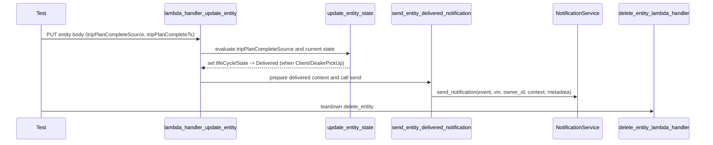
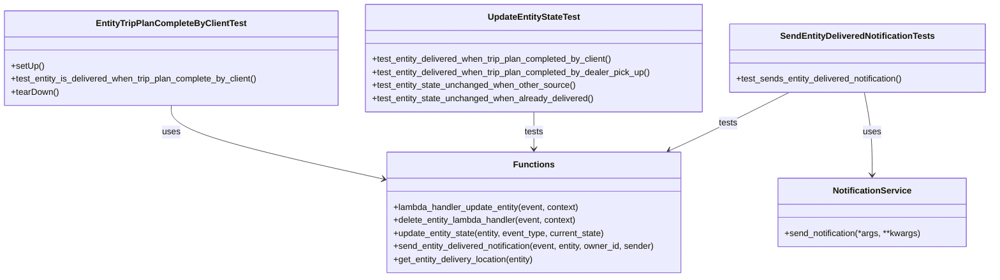
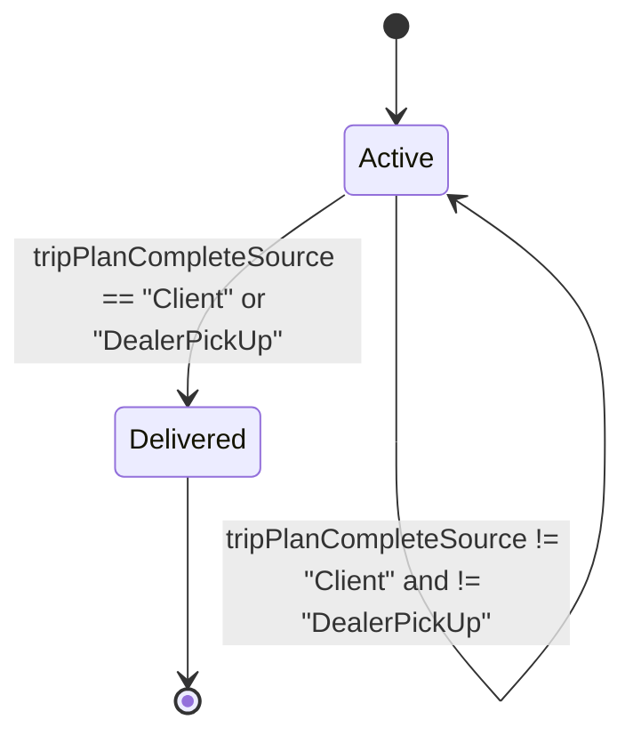

# Diagram: entity_core/entity_service/entity_service_tests/update_entity_tests/test_entity_delivered_by_client_trip_plan_complete.py

> Auto-generated by Obscura crawlers

## Diagram 1

### SVG

<svg id="container" width="2322" xmlns="http://www.w3.org/2000/svg" height="459" viewBox="-50 -10 2322 459" role="graphics-document document" aria-roledescription="sequence"><g><rect x="1978" y="373" fill="#eaeaea" stroke="#666" width="244" height="65" name="DeleteLambda" rx="3" ry="3" class="actor actor-bottom"></rect><text x="2100" y="405.5" dominant-baseline="central" alignment-baseline="central" class="actor actor-box" style="text-anchor: middle; font-size: 16px; font-weight: 400;"><tspan x="2100" dy="0">delete_entity_lambda_handler</tspan></text></g><g><rect x="1771" y="373" fill="#eaeaea" stroke="#666" width="157" height="65" name="NotifService" rx="3" ry="3" class="actor actor-bottom"></rect><text x="1849.5" y="405.5" dominant-baseline="central" alignment-baseline="central" class="actor actor-box" style="text-anchor: middle; font-size: 16px; font-weight: 400;"><tspan x="1849.5" dy="0">NotificationService</tspan></text></g><g><rect x="1222.5" y="373" fill="#eaeaea" stroke="#666" width="272" height="65" name="Notification" rx="3" ry="3" class="actor actor-bottom"></rect><text x="1358.5" y="405.5" dominant-baseline="central" alignment-baseline="central" class="actor actor-box" style="text-anchor: middle; font-size: 16px; font-weight: 400;"><tspan x="1358.5" dy="0">send_entity_delivered_notification</tspan></text></g><g><rect x="1007.5" y="373" fill="#eaeaea" stroke="#666" width="165" height="65" name="UpdateState" rx="3" ry="3" class="actor actor-bottom"></rect><text x="1090" y="405.5" dominant-baseline="central" alignment-baseline="central" class="actor actor-box" style="text-anchor: middle; font-size: 16px; font-weight: 400;"><tspan x="1090" dy="0">update_entity_state</tspan></text></g><g><rect x="476.5" y="373" fill="#eaeaea" stroke="#666" width="247" height="65" name="UpdateLambda" rx="3" ry="3" class="actor actor-bottom"></rect><text x="600" y="405.5" dominant-baseline="central" alignment-baseline="central" class="actor actor-box" style="text-anchor: middle; font-size: 16px; font-weight: 400;"><tspan x="600" dy="0">lambda_handler_update_entity</tspan></text></g><g><rect x="0" y="373" fill="#eaeaea" stroke="#666" width="150" height="65" name="Test" rx="3" ry="3" class="actor actor-bottom"></rect><text x="75" y="405.5" dominant-baseline="central" alignment-baseline="central" class="actor actor-box" style="text-anchor: middle; font-size: 16px; font-weight: 400;"><tspan x="75" dy="0">Test</tspan></text></g><g><line id="actor5" x1="2100" y1="65" x2="2100" y2="373" class="actor-line 200" stroke-width="0.5px" stroke="#999" name="DeleteLambda"></line><g id="root-5"><rect x="1978" y="0" fill="#eaeaea" stroke="#666" width="244" height="65" name="DeleteLambda" rx="3" ry="3" class="actor actor-top"></rect><text x="2100" y="32.5" dominant-baseline="central" alignment-baseline="central" class="actor actor-box" style="text-anchor: middle; font-size: 16px; font-weight: 400;"><tspan x="2100" dy="0">delete_entity_lambda_handler</tspan></text></g></g><g><line id="actor4" x1="1849.5" y1="65" x2="1849.5" y2="373" class="actor-line 200" stroke-width="0.5px" stroke="#999" name="NotifService"></line><g id="root-4"><rect x="1771" y="0" fill="#eaeaea" stroke="#666" width="157" height="65" name="NotifService" rx="3" ry="3" class="actor actor-top"></rect><text x="1849.5" y="32.5" dominant-baseline="central" alignment-baseline="central" class="actor actor-box" style="text-anchor: middle; font-size: 16px; font-weight: 400;"><tspan x="1849.5" dy="0">NotificationService</tspan></text></g></g><g><line id="actor3" x1="1358.5" y1="65" x2="1358.5" y2="373" class="actor-line 200" stroke-width="0.5px" stroke="#999" name="Notification"></line><g id="root-3"><rect x="1222.5" y="0" fill="#eaeaea" stroke="#666" width="272" height="65" name="Notification" rx="3" ry="3" class="actor actor-top"></rect><text x="1358.5" y="32.5" dominant-baseline="central" alignment-baseline="central" class="actor actor-box" style="text-anchor: middle; font-size: 16px; font-weight: 400;"><tspan x="1358.5" dy="0">send_entity_delivered_notification</tspan></text></g></g><g><line id="actor2" x1="1090" y1="65" x2="1090" y2="373" class="actor-line 200" stroke-width="0.5px" stroke="#999" name="UpdateState"></line><g id="root-2"><rect x="1007.5" y="0" fill="#eaeaea" stroke="#666" width="165" height="65" name="UpdateState" rx="3" ry="3" class="actor actor-top"></rect><text x="1090" y="32.5" dominant-baseline="central" alignment-baseline="central" class="actor actor-box" style="text-anchor: middle; font-size: 16px; font-weight: 400;"><tspan x="1090" dy="0">update_entity_state</tspan></text></g></g><g><line id="actor1" x1="600" y1="65" x2="600" y2="373" class="actor-line 200" stroke-width="0.5px" stroke="#999" name="UpdateLambda"></line><g id="root-1"><rect x="476.5" y="0" fill="#eaeaea" stroke="#666" width="247" height="65" name="UpdateLambda" rx="3" ry="3" class="actor actor-top"></rect><text x="600" y="32.5" dominant-baseline="central" alignment-baseline="central" class="actor actor-box" style="text-anchor: middle; font-size: 16px; font-weight: 400;"><tspan x="600" dy="0">lambda_handler_update_entity</tspan></text></g></g><g><line id="actor0" x1="75" y1="65" x2="75" y2="373" class="actor-line 200" stroke-width="0.5px" stroke="#999" name="Test"></line><g id="root-0"><rect x="0" y="0" fill="#eaeaea" stroke="#666" width="150" height="65" name="Test" rx="3" ry="3" class="actor actor-top"></rect><text x="75" y="32.5" dominant-baseline="central" alignment-baseline="central" class="actor actor-box" style="text-anchor: middle; font-size: 16px; font-weight: 400;"><tspan x="75" dy="0">Test</tspan></text></g></g><g></g><defs><symbol id="computer" width="24" height="24"><path transform="scale(.5)" d="M2 2v13h20v-13h-20zm18 11h-16v-9h16v9zm-10.228 6l.466-1h3.524l.467 1h-4.457zm14.228 3h-24l2-6h2.104l-1.33 4h18.45l-1.297-4h2.073l2 6zm-5-10h-14v-7h14v7z"></path></symbol></defs><defs><symbol id="database" fill-rule="evenodd" clip-rule="evenodd"><path transform="scale(.5)" d="M12.258.001l.256.004.255.005.253.008.251.01.249.012.247.015.246.016.242.019.241.02.239.023.236.024.233.027.231.028.229.031.225.032.223.034.22.036.217.038.214.04.211.041.208.043.205.045.201.046.198.048.194.05.191.051.187.053.183.054.18.056.175.057.172.059.168.06.163.061.16.063.155.064.15.066.074.033.073.033.071.034.07.034.069.035.068.035.067.035.066.035.064.036.064.036.062.036.06.036.06.037.058.037.058.037.055.038.055.038.053.038.052.038.051.039.05.039.048.039.047.039.045.04.044.04.043.04.041.04.04.041.039.041.037.041.036.041.034.041.033.042.032.042.03.042.029.042.027.042.026.043.024.043.023.043.021.043.02.043.018.044.017.043.015.044.013.044.012.044.011.045.009.044.007.045.006.045.004.045.002.045.001.045v17l-.001.045-.002.045-.004.045-.006.045-.007.045-.009.044-.011.045-.012.044-.013.044-.015.044-.017.043-.018.044-.02.043-.021.043-.023.043-.024.043-.026.043-.027.042-.029.042-.03.042-.032.042-.033.042-.034.041-.036.041-.037.041-.039.041-.04.041-.041.04-.043.04-.044.04-.045.04-.047.039-.048.039-.05.039-.051.039-.052.038-.053.038-.055.038-.055.038-.058.037-.058.037-.06.037-.06.036-.062.036-.064.036-.064.036-.066.035-.067.035-.068.035-.069.035-.07.034-.071.034-.073.033-.074.033-.15.066-.155.064-.16.063-.163.061-.168.06-.172.059-.175.057-.18.056-.183.054-.187.053-.191.051-.194.05-.198.048-.201.046-.205.045-.208.043-.211.041-.214.04-.217.038-.22.036-.223.034-.225.032-.229.031-.231.028-.233.027-.236.024-.239.023-.241.02-.242.019-.246.016-.247.015-.249.012-.251.01-.253.008-.255.005-.256.004-.258.001-.258-.001-.256-.004-.255-.005-.253-.008-.251-.01-.249-.012-.247-.015-.245-.016-.243-.019-.241-.02-.238-.023-.236-.024-.234-.027-.231-.028-.228-.031-.226-.032-.223-.034-.22-.036-.217-.038-.214-.04-.211-.041-.208-.043-.204-.045-.201-.046-.198-.048-.195-.05-.19-.051-.187-.053-.184-.054-.179-.056-.176-.057-.172-.059-.167-.06-.164-.061-.159-.063-.155-.064-.151-.066-.074-.033-.072-.033-.072-.034-.07-.034-.069-.035-.068-.035-.067-.035-.066-.035-.064-.036-.063-.036-.062-.036-.061-.036-.06-.037-.058-.037-.057-.037-.056-.038-.055-.038-.053-.038-.052-.038-.051-.039-.049-.039-.049-.039-.046-.039-.046-.04-.044-.04-.043-.04-.041-.04-.04-.041-.039-.041-.037-.041-.036-.041-.034-.041-.033-.042-.032-.042-.03-.042-.029-.042-.027-.042-.026-.043-.024-.043-.023-.043-.021-.043-.02-.043-.018-.044-.017-.043-.015-.044-.013-.044-.012-.044-.011-.045-.009-.044-.007-.045-.006-.045-.004-.045-.002-.045-.001-.045v-17l.001-.045.002-.045.004-.045.006-.045.007-.045.009-.044.011-.045.012-.044.013-.044.015-.044.017-.043.018-.044.02-.043.021-.043.023-.043.024-.043.026-.043.027-.042.029-.042.03-.042.032-.042.033-.042.034-.041.036-.041.037-.041.039-.041.04-.041.041-.04.043-.04.044-.04.046-.04.046-.039.049-.039.049-.039.051-.039.052-.038.053-.038.055-.038.056-.038.057-.037.058-.037.06-.037.061-.036.062-.036.063-.036.064-.036.066-.035.067-.035.068-.035.069-.035.07-.034.072-.034.072-.033.074-.033.151-.066.155-.064.159-.063.164-.061.167-.06.172-.059.176-.057.179-.056.184-.054.187-.053.19-.051.195-.05.198-.048.201-.046.204-.045.208-.043.211-.041.214-.04.217-.038.22-.036.223-.034.226-.032.228-.031.231-.028.234-.027.236-.024.238-.023.241-.02.243-.019.245-.016.247-.015.249-.012.251-.01.253-.008.255-.005.256-.004.258-.001.258.001zm-9.258 20.499v.01l.001.021.003.021.004.022.005.021.006.022.007.022.009.023.01.022.011.023.012.023.013.023.015.023.016.024.017.023.018.024.019.024.021.024.022.025.023.024.024.025.052.049.056.05.061.051.066.051.07.051.075.051.079.052.084.052.088.052.092.052.097.052.102.051.105.052.11.052.114.051.119.051.123.051.127.05.131.05.135.05.139.048.144.049.147.047.152.047.155.047.16.045.163.045.167.043.171.043.176.041.178.041.183.039.187.039.19.037.194.035.197.035.202.033.204.031.209.03.212.029.216.027.219.025.222.024.226.021.23.02.233.018.236.016.24.015.243.012.246.01.249.008.253.005.256.004.259.001.26-.001.257-.004.254-.005.25-.008.247-.011.244-.012.241-.014.237-.016.233-.018.231-.021.226-.021.224-.024.22-.026.216-.027.212-.028.21-.031.205-.031.202-.034.198-.034.194-.036.191-.037.187-.039.183-.04.179-.04.175-.042.172-.043.168-.044.163-.045.16-.046.155-.046.152-.047.148-.048.143-.049.139-.049.136-.05.131-.05.126-.05.123-.051.118-.052.114-.051.11-.052.106-.052.101-.052.096-.052.092-.052.088-.053.083-.051.079-.052.074-.052.07-.051.065-.051.06-.051.056-.05.051-.05.023-.024.023-.025.021-.024.02-.024.019-.024.018-.024.017-.024.015-.023.014-.024.013-.023.012-.023.01-.023.01-.022.008-.022.006-.022.006-.022.004-.022.004-.021.001-.021.001-.021v-4.127l-.077.055-.08.053-.083.054-.085.053-.087.052-.09.052-.093.051-.095.05-.097.05-.1.049-.102.049-.105.048-.106.047-.109.047-.111.046-.114.045-.115.045-.118.044-.12.043-.122.042-.124.042-.126.041-.128.04-.13.04-.132.038-.134.038-.135.037-.138.037-.139.035-.142.035-.143.034-.144.033-.147.032-.148.031-.15.03-.151.03-.153.029-.154.027-.156.027-.158.026-.159.025-.161.024-.162.023-.163.022-.165.021-.166.02-.167.019-.169.018-.169.017-.171.016-.173.015-.173.014-.175.013-.175.012-.177.011-.178.01-.179.008-.179.008-.181.006-.182.005-.182.004-.184.003-.184.002h-.37l-.184-.002-.184-.003-.182-.004-.182-.005-.181-.006-.179-.008-.179-.008-.178-.01-.176-.011-.176-.012-.175-.013-.173-.014-.172-.015-.171-.016-.17-.017-.169-.018-.167-.019-.166-.02-.165-.021-.163-.022-.162-.023-.161-.024-.159-.025-.157-.026-.156-.027-.155-.027-.153-.029-.151-.03-.15-.03-.148-.031-.146-.032-.145-.033-.143-.034-.141-.035-.14-.035-.137-.037-.136-.037-.134-.038-.132-.038-.13-.04-.128-.04-.126-.041-.124-.042-.122-.042-.12-.044-.117-.043-.116-.045-.113-.045-.112-.046-.109-.047-.106-.047-.105-.048-.102-.049-.1-.049-.097-.05-.095-.05-.093-.052-.09-.051-.087-.052-.085-.053-.083-.054-.08-.054-.077-.054v4.127zm0-5.654v.011l.001.021.003.021.004.021.005.022.006.022.007.022.009.022.01.022.011.023.012.023.013.023.015.024.016.023.017.024.018.024.019.024.021.024.022.024.023.025.024.024.052.05.056.05.061.05.066.051.07.051.075.052.079.051.084.052.088.052.092.052.097.052.102.052.105.052.11.051.114.051.119.052.123.05.127.051.131.05.135.049.139.049.144.048.147.048.152.047.155.046.16.045.163.045.167.044.171.042.176.042.178.04.183.04.187.038.19.037.194.036.197.034.202.033.204.032.209.03.212.028.216.027.219.025.222.024.226.022.23.02.233.018.236.016.24.014.243.012.246.01.249.008.253.006.256.003.259.001.26-.001.257-.003.254-.006.25-.008.247-.01.244-.012.241-.015.237-.016.233-.018.231-.02.226-.022.224-.024.22-.025.216-.027.212-.029.21-.03.205-.032.202-.033.198-.035.194-.036.191-.037.187-.039.183-.039.179-.041.175-.042.172-.043.168-.044.163-.045.16-.045.155-.047.152-.047.148-.048.143-.048.139-.05.136-.049.131-.05.126-.051.123-.051.118-.051.114-.052.11-.052.106-.052.101-.052.096-.052.092-.052.088-.052.083-.052.079-.052.074-.051.07-.052.065-.051.06-.05.056-.051.051-.049.023-.025.023-.024.021-.025.02-.024.019-.024.018-.024.017-.024.015-.023.014-.023.013-.024.012-.022.01-.023.01-.023.008-.022.006-.022.006-.022.004-.021.004-.022.001-.021.001-.021v-4.139l-.077.054-.08.054-.083.054-.085.052-.087.053-.09.051-.093.051-.095.051-.097.05-.1.049-.102.049-.105.048-.106.047-.109.047-.111.046-.114.045-.115.044-.118.044-.12.044-.122.042-.124.042-.126.041-.128.04-.13.039-.132.039-.134.038-.135.037-.138.036-.139.036-.142.035-.143.033-.144.033-.147.033-.148.031-.15.03-.151.03-.153.028-.154.028-.156.027-.158.026-.159.025-.161.024-.162.023-.163.022-.165.021-.166.02-.167.019-.169.018-.169.017-.171.016-.173.015-.173.014-.175.013-.175.012-.177.011-.178.009-.179.009-.179.007-.181.007-.182.005-.182.004-.184.003-.184.002h-.37l-.184-.002-.184-.003-.182-.004-.182-.005-.181-.007-.179-.007-.179-.009-.178-.009-.176-.011-.176-.012-.175-.013-.173-.014-.172-.015-.171-.016-.17-.017-.169-.018-.167-.019-.166-.02-.165-.021-.163-.022-.162-.023-.161-.024-.159-.025-.157-.026-.156-.027-.155-.028-.153-.028-.151-.03-.15-.03-.148-.031-.146-.033-.145-.033-.143-.033-.141-.035-.14-.036-.137-.036-.136-.037-.134-.038-.132-.039-.13-.039-.128-.04-.126-.041-.124-.042-.122-.043-.12-.043-.117-.044-.116-.044-.113-.046-.112-.046-.109-.046-.106-.047-.105-.048-.102-.049-.1-.049-.097-.05-.095-.051-.093-.051-.09-.051-.087-.053-.085-.052-.083-.054-.08-.054-.077-.054v4.139zm0-5.666v.011l.001.02.003.022.004.021.005.022.006.021.007.022.009.023.01.022.011.023.012.023.013.023.015.023.016.024.017.024.018.023.019.024.021.025.022.024.023.024.024.025.052.05.056.05.061.05.066.051.07.051.075.052.079.051.084.052.088.052.092.052.097.052.102.052.105.051.11.052.114.051.119.051.123.051.127.05.131.05.135.05.139.049.144.048.147.048.152.047.155.046.16.045.163.045.167.043.171.043.176.042.178.04.183.04.187.038.19.037.194.036.197.034.202.033.204.032.209.03.212.028.216.027.219.025.222.024.226.021.23.02.233.018.236.017.24.014.243.012.246.01.249.008.253.006.256.003.259.001.26-.001.257-.003.254-.006.25-.008.247-.01.244-.013.241-.014.237-.016.233-.018.231-.02.226-.022.224-.024.22-.025.216-.027.212-.029.21-.03.205-.032.202-.033.198-.035.194-.036.191-.037.187-.039.183-.039.179-.041.175-.042.172-.043.168-.044.163-.045.16-.045.155-.047.152-.047.148-.048.143-.049.139-.049.136-.049.131-.051.126-.05.123-.051.118-.052.114-.051.11-.052.106-.052.101-.052.096-.052.092-.052.088-.052.083-.052.079-.052.074-.052.07-.051.065-.051.06-.051.056-.05.051-.049.023-.025.023-.025.021-.024.02-.024.019-.024.018-.024.017-.024.015-.023.014-.024.013-.023.012-.023.01-.022.01-.023.008-.022.006-.022.006-.022.004-.022.004-.021.001-.021.001-.021v-4.153l-.077.054-.08.054-.083.053-.085.053-.087.053-.09.051-.093.051-.095.051-.097.05-.1.049-.102.048-.105.048-.106.048-.109.046-.111.046-.114.046-.115.044-.118.044-.12.043-.122.043-.124.042-.126.041-.128.04-.13.039-.132.039-.134.038-.135.037-.138.036-.139.036-.142.034-.143.034-.144.033-.147.032-.148.032-.15.03-.151.03-.153.028-.154.028-.156.027-.158.026-.159.024-.161.024-.162.023-.163.023-.165.021-.166.02-.167.019-.169.018-.169.017-.171.016-.173.015-.173.014-.175.013-.175.012-.177.01-.178.01-.179.009-.179.007-.181.006-.182.006-.182.004-.184.003-.184.001-.185.001-.185-.001-.184-.001-.184-.003-.182-.004-.182-.006-.181-.006-.179-.007-.179-.009-.178-.01-.176-.01-.176-.012-.175-.013-.173-.014-.172-.015-.171-.016-.17-.017-.169-.018-.167-.019-.166-.02-.165-.021-.163-.023-.162-.023-.161-.024-.159-.024-.157-.026-.156-.027-.155-.028-.153-.028-.151-.03-.15-.03-.148-.032-.146-.032-.145-.033-.143-.034-.141-.034-.14-.036-.137-.036-.136-.037-.134-.038-.132-.039-.13-.039-.128-.041-.126-.041-.124-.041-.122-.043-.12-.043-.117-.044-.116-.044-.113-.046-.112-.046-.109-.046-.106-.048-.105-.048-.102-.048-.1-.05-.097-.049-.095-.051-.093-.051-.09-.052-.087-.052-.085-.053-.083-.053-.08-.054-.077-.054v4.153zm8.74-8.179l-.257.004-.254.005-.25.008-.247.011-.244.012-.241.014-.237.016-.233.018-.231.021-.226.022-.224.023-.22.026-.216.027-.212.028-.21.031-.205.032-.202.033-.198.034-.194.036-.191.038-.187.038-.183.04-.179.041-.175.042-.172.043-.168.043-.163.045-.16.046-.155.046-.152.048-.148.048-.143.048-.139.049-.136.05-.131.05-.126.051-.123.051-.118.051-.114.052-.11.052-.106.052-.101.052-.096.052-.092.052-.088.052-.083.052-.079.052-.074.051-.07.052-.065.051-.06.05-.056.05-.051.05-.023.025-.023.024-.021.024-.02.025-.019.024-.018.024-.017.023-.015.024-.014.023-.013.023-.012.023-.01.023-.01.022-.008.022-.006.023-.006.021-.004.022-.004.021-.001.021-.001.021.001.021.001.021.004.021.004.022.006.021.006.023.008.022.01.022.01.023.012.023.013.023.014.023.015.024.017.023.018.024.019.024.02.025.021.024.023.024.023.025.051.05.056.05.06.05.065.051.07.052.074.051.079.052.083.052.088.052.092.052.096.052.101.052.106.052.11.052.114.052.118.051.123.051.126.051.131.05.136.05.139.049.143.048.148.048.152.048.155.046.16.046.163.045.168.043.172.043.175.042.179.041.183.04.187.038.191.038.194.036.198.034.202.033.205.032.21.031.212.028.216.027.22.026.224.023.226.022.231.021.233.018.237.016.241.014.244.012.247.011.25.008.254.005.257.004.26.001.26-.001.257-.004.254-.005.25-.008.247-.011.244-.012.241-.014.237-.016.233-.018.231-.021.226-.022.224-.023.22-.026.216-.027.212-.028.21-.031.205-.032.202-.033.198-.034.194-.036.191-.038.187-.038.183-.04.179-.041.175-.042.172-.043.168-.043.163-.045.16-.046.155-.046.152-.048.148-.048.143-.048.139-.049.136-.05.131-.05.126-.051.123-.051.118-.051.114-.052.11-.052.106-.052.101-.052.096-.052.092-.052.088-.052.083-.052.079-.052.074-.051.07-.052.065-.051.06-.05.056-.05.051-.05.023-.025.023-.024.021-.024.02-.025.019-.024.018-.024.017-.023.015-.024.014-.023.013-.023.012-.023.01-.023.01-.022.008-.022.006-.023.006-.021.004-.022.004-.021.001-.021.001-.021-.001-.021-.001-.021-.004-.021-.004-.022-.006-.021-.006-.023-.008-.022-.01-.022-.01-.023-.012-.023-.013-.023-.014-.023-.015-.024-.017-.023-.018-.024-.019-.024-.02-.025-.021-.024-.023-.024-.023-.025-.051-.05-.056-.05-.06-.05-.065-.051-.07-.052-.074-.051-.079-.052-.083-.052-.088-.052-.092-.052-.096-.052-.101-.052-.106-.052-.11-.052-.114-.052-.118-.051-.123-.051-.126-.051-.131-.05-.136-.05-.139-.049-.143-.048-.148-.048-.152-.048-.155-.046-.16-.046-.163-.045-.168-.043-.172-.043-.175-.042-.179-.041-.183-.04-.187-.038-.191-.038-.194-.036-.198-.034-.202-.033-.205-.032-.21-.031-.212-.028-.216-.027-.22-.026-.224-.023-.226-.022-.231-.021-.233-.018-.237-.016-.241-.014-.244-.012-.247-.011-.25-.008-.254-.005-.257-.004-.26-.001-.26.001z"></path></symbol></defs><defs><symbol id="clock" width="24" height="24"><path transform="scale(.5)" d="M12 2c5.514 0 10 4.486 10 10s-4.486 10-10 10-10-4.486-10-10 4.486-10 10-10zm0-2c-6.627 0-12 5.373-12 12s5.373 12 12 12 12-5.373 12-12-5.373-12-12-12zm5.848 12.459c.202.038.202.333.001.372-1.907.361-6.045 1.111-6.547 1.111-.719 0-1.301-.582-1.301-1.301 0-.512.77-5.447 1.125-7.445.034-.192.312-.181.343.014l.985 6.238 5.394 1.011z"></path></symbol></defs><defs><marker id="arrowhead" refX="7.9" refY="5" markerUnits="userSpaceOnUse" markerWidth="12" markerHeight="12" orient="auto-start-reverse"><path d="M -1 0 L 10 5 L 0 10 z"></path></marker></defs><defs><marker id="crosshead" markerWidth="15" markerHeight="8" orient="auto" refX="4" refY="4.5"><path fill="none" stroke="#000000" stroke-width="1pt" d="M 1,2 L 6,7 M 6,2 L 1,7" style="stroke-dasharray: 0, 0;"></path></marker></defs><defs><marker id="filled-head" refX="15.5" refY="7" markerWidth="20" markerHeight="28" orient="auto"><path d="M 18,7 L9,13 L14,7 L9,1 Z"></path></marker></defs><defs><marker id="sequencenumber" refX="15" refY="15" markerWidth="60" markerHeight="40" orient="auto"><circle cx="15" cy="15" r="6"></circle></marker></defs><text x="336" y="80" text-anchor="middle" dominant-baseline="middle" alignment-baseline="middle" class="messageText" dy="1em" style="font-size: 16px; font-weight: 400;">PUT entity body (tripPlanCompleteSource, tripPlanCompleteTs)</text><line x1="76" y1="113" x2="596" y2="113" class="messageLine0" stroke-width="2" stroke="none" marker-end="url(#arrowhead)" style="fill: none;"></line><text x="844" y="128" text-anchor="middle" dominant-baseline="middle" alignment-baseline="middle" class="messageText" dy="1em" style="font-size: 16px; font-weight: 400;">evaluate tripPlanCompleteSource and current state</text><line x1="601" y1="161" x2="1086" y2="161" class="messageLine0" stroke-width="2" stroke="none" marker-end="url(#arrowhead)" style="fill: none;"></line><text x="847" y="176" text-anchor="middle" dominant-baseline="middle" alignment-baseline="middle" class="messageText" dy="1em" style="font-size: 16px; font-weight: 400;">set lifeCycleState -&gt; Delivered (when Client/DealerPickUp)</text><line x1="1089" y1="209" x2="604" y2="209" class="messageLine1" stroke-width="2" stroke="none" marker-end="url(#arrowhead)" style="stroke-dasharray: 3, 3; fill: none;"></line><text x="978" y="224" text-anchor="middle" dominant-baseline="middle" alignment-baseline="middle" class="messageText" dy="1em" style="font-size: 16px; font-weight: 400;">prepare delivered context and call send</text><line x1="601" y1="257" x2="1354.5" y2="257" class="messageLine0" stroke-width="2" stroke="none" marker-end="url(#arrowhead)" style="fill: none;"></line><text x="1603" y="272" text-anchor="middle" dominant-baseline="middle" alignment-baseline="middle" class="messageText" dy="1em" style="font-size: 16px; font-weight: 400;">send_notification(event, vin, owner_id, context, metadata)</text><line x1="1359.5" y1="305" x2="1845.5" y2="305" class="messageLine0" stroke-width="2" stroke="none" marker-end="url(#arrowhead)" style="fill: none;"></line><text x="1086" y="320" text-anchor="middle" dominant-baseline="middle" alignment-baseline="middle" class="messageText" dy="1em" style="font-size: 16px; font-weight: 400;">teardown delete_entity</text><line x1="76" y1="353" x2="2096" y2="353" class="messageLine0" stroke-width="2" stroke="none" marker-end="url(#arrowhead)" style="fill: none;"></line></svg>

## Diagram 2

### SVG

<svg id="container" width="1834.3828125" xmlns="http://www.w3.org/2000/svg" class="classDiagram" height="510" viewBox="0 0 1834.3828125 510" role="graphics-document document" aria-roledescription="class"><g><defs><marker id="container_class-aggregationStart" class="marker aggregation class" refX="18" refY="7" markerWidth="190" markerHeight="240" orient="auto"><path d="M 18,7 L9,13 L1,7 L9,1 Z"></path></marker></defs><defs><marker id="container_class-aggregationEnd" class="marker aggregation class" refX="1" refY="7" markerWidth="20" markerHeight="28" orient="auto"><path d="M 18,7 L9,13 L1,7 L9,1 Z"></path></marker></defs><defs><marker id="container_class-extensionStart" class="marker extension class" refX="18" refY="7" markerWidth="190" markerHeight="240" orient="auto"><path d="M 1,7 L18,13 V 1 Z"></path></marker></defs><defs><marker id="container_class-extensionEnd" class="marker extension class" refX="1" refY="7" markerWidth="20" markerHeight="28" orient="auto"><path d="M 1,1 V 13 L18,7 Z"></path></marker></defs><defs><marker id="container_class-compositionStart" class="marker composition class" refX="18" refY="7" markerWidth="190" markerHeight="240" orient="auto"><path d="M 18,7 L9,13 L1,7 L9,1 Z"></path></marker></defs><defs><marker id="container_class-compositionEnd" class="marker composition class" refX="1" refY="7" markerWidth="20" markerHeight="28" orient="auto"><path d="M 18,7 L9,13 L1,7 L9,1 Z"></path></marker></defs><defs><marker id="container_class-dependencyStart" class="marker dependency class" refX="6" refY="7" markerWidth="190" markerHeight="240" orient="auto"><path d="M 5,7 L9,13 L1,7 L9,1 Z"></path></marker></defs><defs><marker id="container_class-dependencyEnd" class="marker dependency class" refX="13" refY="7" markerWidth="20" markerHeight="28" orient="auto"><path d="M 18,7 L9,13 L14,7 L9,1 Z"></path></marker></defs><defs><marker id="container_class-lollipopStart" class="marker lollipop class" refX="13" refY="7" markerWidth="190" markerHeight="240" orient="auto"><circle stroke="black" fill="transparent" cx="7" cy="7" r="6"></circle></marker></defs><defs><marker id="container_class-lollipopEnd" class="marker lollipop class" refX="1" refY="7" markerWidth="190" markerHeight="240" orient="auto"><circle stroke="black" fill="transparent" cx="7" cy="7" r="6"></circle></marker></defs><g class="root"><g class="clusters"></g><g class="edgePaths"><path d="M316.699,194L316.699,202.167C316.699,210.333,316.699,226.667,381.738,249.155C446.777,271.644,576.855,300.287,641.894,314.609L706.933,328.931" id="id_EntityTripPlanCompleteByClientTest_Functions_1" class="edge-thickness-normal edge-pattern-solid relation" style=";;;" data-edge="true" data-et="edge" data-id="id_EntityTripPlanCompleteByClientTest_Functions_1" data-points="W3sieCI6MzE2LjY5OTIxODc1LCJ5IjoxOTR9LHsieCI6MzE2LjY5OTIxODc1LCJ5IjoyNDN9LHsieCI6NzEyLjc5Mjk2ODc1LCJ5IjozMzAuMjIxMjQzODc1NjQ3M31d" marker-end="url(#container_class-dependencyEnd)"></path><path d="M988.805,206L988.805,212.167C988.805,218.333,988.805,230.667,988.805,242C988.805,253.333,988.805,263.667,988.805,268.833L988.805,274" id="id_UpdateEntityStateTest_Functions_2" class="edge-thickness-normal edge-pattern-solid relation" style=";;;" data-edge="true" data-et="edge" data-id="id_UpdateEntityStateTest_Functions_2" data-points="W3sieCI6OTg4LjgwNDY4NzUsInkiOjIwNn0seyJ4Ijo5ODguODA0Njg3NSwieSI6MjQzfSx7IngiOjk4OC44MDQ2ODc1LCJ5IjoyODB9XQ==" marker-end="url(#container_class-dependencyEnd)"></path><path d="M1462.948,170L1438.547,182.167C1414.146,194.333,1365.345,218.667,1328.199,236.588C1291.054,254.51,1265.565,266.02,1252.821,271.776L1240.077,277.531" id="id_SendEntityDeliveredNotificationTests_Functions_3" class="edge-thickness-normal edge-pattern-solid relation" style=";;;" data-edge="true" data-et="edge" data-id="id_SendEntityDeliveredNotificationTests_Functions_3" data-points="W3sieCI6MTQ2Mi45NDc2MzkwMTY1NDQxLCJ5IjoxNzB9LHsieCI6MTMxNi41NDI5Njg3NSwieSI6MjQzfSx7IngiOjEyMzQuNjA4Mzk4NDM3NSwieSI6MjgwfV0=" marker-end="url(#container_class-dependencyEnd)"></path><path d="M1601.801,170L1604.215,182.167C1606.63,194.333,1611.46,218.667,1613.874,244C1616.289,269.333,1616.289,295.667,1616.289,308.833L1616.289,322" id="id_SendEntityDeliveredNotificationTests_NotificationService_4" class="edge-thickness-normal edge-pattern-solid relation" style=";;;" data-edge="true" data-et="edge" data-id="id_SendEntityDeliveredNotificationTests_NotificationService_4" data-points="W3sieCI6MTYwMS44MDA2MDg5MTU0NDEyLCJ5IjoxNzB9LHsieCI6MTYxNi4yODkwNjI1LCJ5IjoyNDN9LHsieCI6MTYxNi4yODkwNjI1LCJ5IjozMjh9XQ==" marker-end="url(#container_class-dependencyEnd)"></path></g><g class="edgeLabels"><g class="edgeLabel" transform="translate(316.69921875, 243)"><g class="label" data-id="id_EntityTripPlanCompleteByClientTest_Functions_1" transform="translate(-16.4921875, -12)"><foreignObject width="32.984375" height="24">

uses

</foreignObject></g></g><g class="edgeLabel" transform="translate(988.8046875, 243)"><g class="label" data-id="id_UpdateEntityStateTest_Functions_2" transform="translate(-17.4921875, -12)"><foreignObject width="34.984375" height="24">

tests

</foreignObject></g></g><g class="edgeLabel" transform="translate(1349.51793, 226.55809)"><g class="label" data-id="id_SendEntityDeliveredNotificationTests_Functions_3" transform="translate(-17.4921875, -12)"><foreignObject width="34.984375" height="24">

tests

</foreignObject></g></g><g class="edgeLabel" transform="translate(1616.2890625, 243)"><g class="label" data-id="id_SendEntityDeliveredNotificationTests_NotificationService_4" transform="translate(-16.4921875, -12)"><foreignObject width="32.984375" height="24">

uses

</foreignObject></g></g></g><g class="nodes"><g class="node default" id="classId-EntityTripPlanCompleteByClientTest-0" transform="translate(316.69921875, 107)"><g class="basic label-container"><path d="M-308.69921875 -87 L308.69921875 -87 L308.69921875 87 L-308.69921875 87" stroke="none" stroke-width="0" fill="#ECECFF" style=""></path><path d="M-308.69921875 -87 C-162.81886140070444 -87, -16.93850405140887 -87, 308.69921875 -87 M-308.69921875 -87 C-172.5474481717466 -87, -36.39567759349319 -87, 308.69921875 -87 M308.69921875 -87 C308.69921875 -19.816226261900653, 308.69921875 47.367547476198695, 308.69921875 87 M308.69921875 -87 C308.69921875 -38.07709197474977, 308.69921875 10.84581605050046, 308.69921875 87 M308.69921875 87 C127.22307087629594 87, -54.25307699740813 87, -308.69921875 87 M308.69921875 87 C124.61746457316849 87, -59.46428960366302 87, -308.69921875 87 M-308.69921875 87 C-308.69921875 27.831461873944477, -308.69921875 -31.337076252111046, -308.69921875 -87 M-308.69921875 87 C-308.69921875 49.84898148796675, -308.69921875 12.697962975933507, -308.69921875 -87" stroke="#9370DB" stroke-width="1.3" fill="none" stroke-dasharray="0 0" style=""></path></g><g class="annotation-group text" transform="translate(0, -63)"></g><g class="label-group text" transform="translate(-132.0234375, -63)"><g class="label" style="font-weight: bolder" transform="translate(0,-12)"><foreignObject width="264.046875" height="24">

EntityTripPlanCompleteByClientTest

</foreignObject></g></g><g class="members-group text" transform="translate(-296.69921875, -15)"></g><g class="methods-group text" transform="translate(-296.69921875, 15)"><g class="label" style="" transform="translate(0,-12)"><foreignObject width="60.421875" height="24">

+setUp()

</foreignObject></g><g class="label" style="" transform="translate(0,12)"><foreignObject width="461.375" height="24">

+test_entity_is_delivered_when_trip_plan_complete_by_client()

</foreignObject></g><g class="label" style="" transform="translate(0,36)"><foreignObject width="87.75" height="24">

+tearDown()

</foreignObject></g></g><g class="divider" style=""><path d="M-308.69921875 -39 C-89.5864977257697 -39, 129.5262232984606 -39, 308.69921875 -39 M-308.69921875 -39 C-76.65579702573851 -39, 155.38762469852298 -39, 308.69921875 -39" stroke="#9370DB" stroke-width="1.3" fill="none" stroke-dasharray="0 0" style=""></path></g><g class="divider" style=""><path d="M-308.69921875 -15 C-79.15638129612734 -15, 150.38645615774533 -15, 308.69921875 -15 M-308.69921875 -15 C-182.23757571754723 -15, -55.77593268509446 -15, 308.69921875 -15" stroke="#9370DB" stroke-width="1.3" fill="none" stroke-dasharray="0 0" style=""></path></g></g><g class="node default" id="classId-UpdateEntityStateTest-1" transform="translate(988.8046875, 107)"><g class="basic label-container"><path d="M-313.40625 -99 L313.40625 -99 L313.40625 99 L-313.40625 99" stroke="none" stroke-width="0" fill="#ECECFF" style=""></path><path d="M-313.40625 -99 C-131.54681980931542 -99, 50.312610381369154 -99, 313.40625 -99 M-313.40625 -99 C-125.55807420501174 -99, 62.29010158997653 -99, 313.40625 -99 M313.40625 -99 C313.40625 -31.515075426560742, 313.40625 35.969849146878516, 313.40625 99 M313.40625 -99 C313.40625 -51.73506726187256, 313.40625 -4.470134523745116, 313.40625 99 M313.40625 99 C162.40845817578233 99, 11.410666351564657 99, -313.40625 99 M313.40625 99 C107.03769363157969 99, -99.33086273684063 99, -313.40625 99 M-313.40625 99 C-313.40625 57.53089083240919, -313.40625 16.061781664818383, -313.40625 -99 M-313.40625 99 C-313.40625 42.54196791555285, -313.40625 -13.916064168894295, -313.40625 -99" stroke="#9370DB" stroke-width="1.3" fill="none" stroke-dasharray="0 0" style=""></path></g><g class="annotation-group text" transform="translate(0, -75)"></g><g class="label-group text" transform="translate(-82.375, -75)"><g class="label" style="font-weight: bolder" transform="translate(0,-12)"><foreignObject width="164.75" height="24">

UpdateEntityStateTest

</foreignObject></g></g><g class="members-group text" transform="translate(-301.40625, -27)"></g><g class="methods-group text" transform="translate(-301.40625, 3)"><g class="label" style="" transform="translate(0,-12)"><foreignObject width="451.265625" height="24">

+test_entity_delivered_when_trip_plan_completed_by_client()

</foreignObject></g><g class="label" style="" transform="translate(0,12)"><foreignObject width="520.4375" height="24">

+test_entity_delivered_when_trip_plan_completed_by_dealer_pick_up()

</foreignObject></g><g class="label" style="" transform="translate(0,36)"><foreignObject width="376.75" height="24">

+test_entity_state_unchanged_when_other_source()

</foreignObject></g><g class="label" style="" transform="translate(0,60)"><foreignObject width="411.59375" height="24">

+test_entity_state_unchanged_when_already_delivered()

</foreignObject></g></g><g class="divider" style=""><path d="M-313.40625 -51 C-149.05246232466922 -51, 15.301325350661557 -51, 313.40625 -51 M-313.40625 -51 C-148.41995133883393 -51, 16.56634732233215 -51, 313.40625 -51" stroke="#9370DB" stroke-width="1.3" fill="none" stroke-dasharray="0 0" style=""></path></g><g class="divider" style=""><path d="M-313.40625 -27 C-115.3568531553596 -27, 82.6925436892808 -27, 313.40625 -27 M-313.40625 -27 C-107.23180242732292 -27, 98.94264514535416 -27, 313.40625 -27" stroke="#9370DB" stroke-width="1.3" fill="none" stroke-dasharray="0 0" style=""></path></g></g><g class="node default" id="classId-SendEntityDeliveredNotificationTests-2" transform="translate(1589.296875, 107)"><g class="basic label-container"><path d="M-237.0859375 -63 L237.0859375 -63 L237.0859375 63 L-237.0859375 63" stroke="none" stroke-width="0" fill="#ECECFF" style=""></path><path d="M-237.0859375 -63 C-72.61496270160731 -63, 91.85601209678538 -63, 237.0859375 -63 M-237.0859375 -63 C-104.42662481555675 -63, 28.2326878688865 -63, 237.0859375 -63 M237.0859375 -63 C237.0859375 -31.30166907732302, 237.0859375 0.396661845353961, 237.0859375 63 M237.0859375 -63 C237.0859375 -25.516257639612263, 237.0859375 11.967484720775474, 237.0859375 63 M237.0859375 63 C60.0807620088371 63, -116.9244134823258 63, -237.0859375 63 M237.0859375 63 C121.48519038987872 63, 5.884443279757448 63, -237.0859375 63 M-237.0859375 63 C-237.0859375 17.769543719661705, -237.0859375 -27.46091256067659, -237.0859375 -63 M-237.0859375 63 C-237.0859375 22.135891892160252, -237.0859375 -18.728216215679495, -237.0859375 -63" stroke="#9370DB" stroke-width="1.3" fill="none" stroke-dasharray="0 0" style=""></path></g><g class="annotation-group text" transform="translate(0, -39)"></g><g class="label-group text" transform="translate(-136.578125, -39)"><g class="label" style="font-weight: bolder" transform="translate(0,-12)"><foreignObject width="273.15625" height="24">

SendEntityDeliveredNotificationTests

</foreignObject></g></g><g class="members-group text" transform="translate(-225.0859375, 9)"></g><g class="methods-group text" transform="translate(-225.0859375, 39)"><g class="label" style="" transform="translate(0,-12)"><foreignObject width="313.59375" height="24">

+test_sends_entity_delivered_notification()

</foreignObject></g></g><g class="divider" style=""><path d="M-237.0859375 -15 C-98.29450734368626 -15, 40.496922812627474 -15, 237.0859375 -15 M-237.0859375 -15 C-73.45827162209756 -15, 90.16939425580489 -15, 237.0859375 -15" stroke="#9370DB" stroke-width="1.3" fill="none" stroke-dasharray="0 0" style=""></path></g><g class="divider" style=""><path d="M-237.0859375 9 C-136.63850324827172 9, -36.19106899654341 9, 237.0859375 9 M-237.0859375 9 C-115.40216572619342 9, 6.281606047613167 9, 237.0859375 9" stroke="#9370DB" stroke-width="1.3" fill="none" stroke-dasharray="0 0" style=""></path></g></g><g class="node default" id="classId-NotificationService-3" transform="translate(1616.2890625, 391)"><g class="basic label-container"><path d="M-173.8828125 -63 L173.8828125 -63 L173.8828125 63 L-173.8828125 63" stroke="none" stroke-width="0" fill="#ECECFF" style=""></path><path d="M-173.8828125 -63 C-50.050127576450095 -63, 73.78255734709981 -63, 173.8828125 -63 M-173.8828125 -63 C-95.01469054107704 -63, -16.14656858215409 -63, 173.8828125 -63 M173.8828125 -63 C173.8828125 -15.914822384685117, 173.8828125 31.170355230629767, 173.8828125 63 M173.8828125 -63 C173.8828125 -26.461833403376133, 173.8828125 10.076333193247734, 173.8828125 63 M173.8828125 63 C49.99110802318674 63, -73.90059645362652 63, -173.8828125 63 M173.8828125 63 C73.56065261314916 63, -26.76150727370168 63, -173.8828125 63 M-173.8828125 63 C-173.8828125 21.354220943272978, -173.8828125 -20.291558113454045, -173.8828125 -63 M-173.8828125 63 C-173.8828125 13.785028896758796, -173.8828125 -35.42994220648241, -173.8828125 -63" stroke="#9370DB" stroke-width="1.3" fill="none" stroke-dasharray="0 0" style=""></path></g><g class="annotation-group text" transform="translate(0, -39)"></g><g class="label-group text" transform="translate(-69.53125, -39)"><g class="label" style="font-weight: bolder" transform="translate(0,-12)"><foreignObject width="139.0625" height="24">

NotificationService

</foreignObject></g></g><g class="members-group text" transform="translate(-161.8828125, 9)"></g><g class="methods-group text" transform="translate(-161.8828125, 39)"><g class="label" style="" transform="translate(0,-12)"><foreignObject width="254.234375" height="24">

+send_notification(*args, **kwargs)

</foreignObject></g></g><g class="divider" style=""><path d="M-173.8828125 -15 C-45.933282691495776 -15, 82.01624711700845 -15, 173.8828125 -15 M-173.8828125 -15 C-54.73600747933804 -15, 64.41079754132392 -15, 173.8828125 -15" stroke="#9370DB" stroke-width="1.3" fill="none" stroke-dasharray="0 0" style=""></path></g><g class="divider" style=""><path d="M-173.8828125 9 C-56.571909152812765 9, 60.73899419437447 9, 173.8828125 9 M-173.8828125 9 C-84.12558353000333 9, 5.631645439993349 9, 173.8828125 9" stroke="#9370DB" stroke-width="1.3" fill="none" stroke-dasharray="0 0" style=""></path></g></g><g class="node default" id="classId-Functions-4" transform="translate(988.8046875, 391)"><g class="basic label-container"><path d="M-276.01171875 -111 L276.01171875 -111 L276.01171875 111 L-276.01171875 111" stroke="none" stroke-width="0" fill="#ECECFF" style=""></path><path d="M-276.01171875 -111 C-83.25108007282822 -111, 109.50955860434357 -111, 276.01171875 -111 M-276.01171875 -111 C-138.01443694180745 -111, -0.017155133614892293 -111, 276.01171875 -111 M276.01171875 -111 C276.01171875 -59.31258621613637, 276.01171875 -7.625172432272734, 276.01171875 111 M276.01171875 -111 C276.01171875 -23.89001541561676, 276.01171875 63.21996916876648, 276.01171875 111 M276.01171875 111 C99.14616865716857 111, -77.71938143566285 111, -276.01171875 111 M276.01171875 111 C67.8972932075421 111, -140.2171323349158 111, -276.01171875 111 M-276.01171875 111 C-276.01171875 52.09817745418707, -276.01171875 -6.803645091625853, -276.01171875 -111 M-276.01171875 111 C-276.01171875 43.899388369305484, -276.01171875 -23.201223261389032, -276.01171875 -111" stroke="#9370DB" stroke-width="1.3" fill="none" stroke-dasharray="0 0" style=""></path></g><g class="annotation-group text" transform="translate(0, -87)"></g><g class="label-group text" transform="translate(-35.1328125, -87)"><g class="label" style="font-weight: bolder" transform="translate(0,-12)"><foreignObject width="70.265625" height="24">

Functions

</foreignObject></g></g><g class="members-group text" transform="translate(-264.01171875, -39)"></g><g class="methods-group text" transform="translate(-264.01171875, -9)"><g class="label" style="" transform="translate(0,-12)"><foreignObject width="347.875" height="24">

+lambda_handler_update_entity(event, context)

</foreignObject></g><g class="label" style="" transform="translate(0,12)"><foreignObject width="343.375" height="24">

+delete_entity_lambda_handler(event, context)

</foreignObject></g><g class="label" style="" transform="translate(0,36)"><foreignObject width="397.671875" height="24">

+update_entity_state(entity, event_type, current_state)

</foreignObject></g><g class="label" style="" transform="translate(0,60)"><foreignObject width="492.890625" height="24">

+send_entity_delivered_notification(event, entity, owner_id, sender)

</foreignObject></g><g class="label" style="" transform="translate(0,84)"><foreignObject width="265.234375" height="24">

+get_entity_delivery_location(entity)

</foreignObject></g></g><g class="divider" style=""><path d="M-276.01171875 -63 C-66.1658464344919 -63, 143.6800258810162 -63, 276.01171875 -63 M-276.01171875 -63 C-99.56192945928669 -63, 76.88785983142662 -63, 276.01171875 -63" stroke="#9370DB" stroke-width="1.3" fill="none" stroke-dasharray="0 0" style=""></path></g><g class="divider" style=""><path d="M-276.01171875 -39 C-150.7213005406757 -39, -25.430882331351427 -39, 276.01171875 -39 M-276.01171875 -39 C-105.77252270720149 -39, 64.46667333559702 -39, 276.01171875 -39" stroke="#9370DB" stroke-width="1.3" fill="none" stroke-dasharray="0 0" style=""></path></g></g></g></g></g></svg>

## Diagram 3

### SVG

<svg id="container" width="356" xmlns="http://www.w3.org/2000/svg" class="statediagram" height="418" viewBox="0 0 356 418" role="graphics-document document" aria-roledescription="stateDiagram"><g><defs><marker id="container_stateDiagram-barbEnd" refX="19" refY="7" markerWidth="20" markerHeight="14" markerUnits="userSpaceOnUse" orient="auto"><path d="M 19,7 L9,13 L14,7 L9,1 Z"></path></marker></defs><g class="root"><g class="clusters"></g><g class="edgePaths"><path d="M228,22L228,26.167C228,30.333,228,38.667,228.083,47.083C228.167,55.5,228.333,64,228.417,68.25L228.5,72.5" id="edge0" class="edge-thickness-normal edge-pattern-solid transition" style="fill:none;;;fill:none" data-edge="true" data-et="edge" data-id="edge0" data-points="W3sieCI6MjI4LCJ5IjoyMn0seyJ4IjoyMjgsInkiOjQ3fSx7IngiOjIyOC41LCJ5Ijo3Mi41fV0=" marker-end="url(#container_stateDiagram-barbEnd)"></path><path d="M200.53,111.379L185.109,121.65C169.687,131.92,138.843,152.46,123.505,172.98C108.167,193.5,108.333,214,108.417,224.25L108.5,234.5" id="edge1" class="edge-thickness-normal edge-pattern-solid transition" style="fill:none;;;fill:none" data-edge="true" data-et="edge" data-id="edge1" data-points="W3sieCI6MjAwLjUzMDQxOTU0NTcxMjU2LCJ5IjoxMTEuMzc5NDY2ODA2NjQ0MDN9LHsieCI6MTA4LCJ5IjoxNzN9LHsieCI6MTA4LjUsInkiOjIzNC41fV0=" marker-end="url(#container_stateDiagram-barbEnd)"></path><path d="M228.5,112.5L228.417,122.583C228.333,132.667,228.167,152.833,228.083,176.408C228,199.983,228,226.967,228,240.458L228,253.95" id="Active-cyclic-special-1" class="edge-thickness-normal edge-pattern-solid transition" style="fill:none;;;fill:none" data-edge="true" data-et="edge" data-id="Active-cyclic-special-1" data-points="W3sieCI6MjI4LjUsInkiOjExMi41fSx7IngiOjIyOCwieSI6MTczfSx7IngiOjIyOCwieSI6MjUzLjk0OTk5OTk5OTI1NDk0fV0="></path><path d="M228,254.05L228,267.542C228,281.033,228,308.017,237.993,332.833C247.985,357.65,267.971,380.3,277.963,391.625L287.956,402.95" id="Active-cyclic-special-mid" class="edge-thickness-normal edge-pattern-solid transition" style="fill:none;;;fill:none" data-edge="true" data-et="edge" data-id="Active-cyclic-special-mid" data-points="W3sieCI6MjI4LCJ5IjoyNTQuMDUwMDAwMDAwNzQ1MDZ9LHsieCI6MjI4LCJ5IjozMzV9LHsieCI6Mjg3Ljk1NTg4MjM1MjI4Mzc3LCJ5Ijo0MDIuOTQ5OTk5OTk5MjU0OTR9XQ=="></path><path d="M288.044,402.95L298.037,391.625C308.029,380.3,328.015,357.65,338.007,332.825C348,308,348,281,348,254C348,227,348,200,332.745,176.23C317.49,152.46,286.98,131.92,271.725,121.65L256.47,111.379" id="Active-cyclic-special-2" class="edge-thickness-normal edge-pattern-solid transition" style="fill:none;;;fill:none" data-edge="true" data-et="edge" data-id="Active-cyclic-special-2" data-points="W3sieCI6Mjg4LjA0NDExNzY0NzcxNjIzLCJ5Ijo0MDIuOTQ5OTk5OTk5MjU0OTR9LHsieCI6MzQ4LCJ5IjozMzV9LHsieCI6MzQ4LCJ5IjoyNTR9LHsieCI6MzQ4LCJ5IjoxNzN9LHsieCI6MjU2LjQ2OTU4MDQ1NDI4NjcsInkiOjExMS4zNzk0NjY4MDY2NDM0OX1d" marker-end="url(#container_stateDiagram-barbEnd)"></path><path d="M108.5,274.5L108.417,284.583C108.333,294.667,108.167,314.833,108.083,335.083C108,355.333,108,375.667,108,385.833L108,396" id="edge3" class="edge-thickness-normal edge-pattern-solid transition" style="fill:none;;;fill:none" data-edge="true" data-et="edge" data-id="edge3" data-points="W3sieCI6MTA4LjUsInkiOjI3NC41fSx7IngiOjEwOCwieSI6MzM1fSx7IngiOjEwOCwieSI6Mzk2fV0=" marker-end="url(#container_stateDiagram-barbEnd)"></path></g><g class="edgeLabels"><g class="edgeLabel"><g class="label" data-id="edge0" transform="translate(0, 0)"><foreignObject width="0" height="0">

</foreignObject></g></g><g class="edgeLabel" transform="translate(108, 173)"><g class="label" data-id="edge1" transform="translate(-100, -36)"><foreignObject width="200" height="72">

tripPlanCompleteSource == "Client" or "DealerPickUp"

</foreignObject></g></g><g class="edgeLabel"><g class="label" data-id="Active-cyclic-special-1" transform="translate(0, 0)"><foreignObject width="0" height="0">

</foreignObject></g></g><g class="edgeLabel" transform="translate(228, 335)"><g class="label" data-id="Active-cyclic-special-mid" transform="translate(-100, -36)"><foreignObject width="200" height="72">

tripPlanCompleteSource != "Client" and != "DealerPickUp"

</foreignObject></g></g><g class="edgeLabel"><g class="label" data-id="Active-cyclic-special-2" transform="translate(0, 0)"><foreignObject width="0" height="0">

</foreignObject></g></g><g class="edgeLabel"><g class="label" data-id="edge3" transform="translate(0, 0)"><foreignObject width="0" height="0">

</foreignObject></g></g></g><g class="nodes"><g class="node default" id="state-root_start-0" transform="translate(228, 15)"><circle class="state-start" r="7" width="14" height="14"></circle></g><g class="node  statediagram-state" id="state-Active-2" transform="translate(228, 92)"><g class="basic label-container outer-path"><path d="M-24.8203125 -20 C-5.588676651384052 -20, 13.642959197231896 -20, 24.8203125 -20 C24.8203125 -20, 24.8203125 -20, 24.8203125 -20 C24.973016895068465 -19.99368409950109, 25.12572129013693 -19.987368199002173, 25.233209227361662 -19.982922465033347 C25.339983155795384 -19.969613108733963, 25.446757084229105 -19.95630375243458, 25.64328545140367 -19.931806517013612 C25.784027108277968 -19.902296094857775, 25.924768765152262 -19.872785672701937, 26.047739935703998 -19.847001329696653 C26.203195175909286 -19.80072029947604, 26.35865041611458 -19.75443926925543, 26.443809846023417 -19.729086208503173 C26.596904043889747 -19.669348667123405, 26.749998241756074 -19.609611125743637, 26.828789623264846 -19.578866633275286 C26.95221389502012 -19.518528183503978, 27.07563816677539 -19.45818973373267, 27.20004946518537 -19.397368756032446 C27.32520977697918 -19.322789398099523, 27.450370088772985 -19.248210040166605, 27.555053290612136 -19.185832391312644 C27.682971695279257 -19.094500405849075, 27.810890099946377 -19.003168420385506, 27.89137606344834 -18.94570254698197 C28.010965532777252 -18.84441543314429, 28.130555002106163 -18.743128319306617, 28.206720358128706 -18.678619553365657 C28.27378879808856 -18.611551113405802, 28.340857238048415 -18.54448267344595, 28.498932053365657 -18.386407858128706 C28.584544716934023 -18.285325177261882, 28.670157380502392 -18.184242496395058, 28.76601504698197 -18.07106356344834 C28.822760164254273 -17.991587081717668, 28.879505281526573 -17.912110599986995, 29.006144891312644 -17.734740790612136 C29.05276601222682 -17.65650045452553, 29.099387133140993 -17.57826011843893, 29.217681256032446 -17.37973696518537 C29.274975488915363 -17.262539738605085, 29.332269721798284 -17.145342512024797, 29.399179133275286 -17.008477123264846 C29.43120688050074 -16.92639704166633, 29.46323462772619 -16.844316960067815, 29.549398708503173 -16.623497346023417 C29.57753184918505 -16.52899979223987, 29.605664989866924 -16.43450223845632, 29.667313829696653 -16.227427435703994 C29.696708176258717 -16.087239368720887, 29.72610252282078 -15.947051301737783, 29.752119017013612 -15.82297295140367 C29.7657932172336 -15.71327207310163, 29.779467417453585 -15.603571194799589, 29.803234965033347 -15.412896727361662 C29.807641244293507 -15.306362717042578, 29.81204752355367 -15.199828706723496, 29.8203125 -15 C29.8203125 -15, 29.8203125 -15, 29.8203125 -15 C29.8203125 -3.3890006006793136, 29.8203125 8.221998798641373, 29.8203125 15 C29.8203125 15, 29.8203125 15, 29.8203125 15 C29.813974823523953 15.153230889653974, 29.807637147047906 15.306461779307947, 29.803234965033347 15.412896727361662 C29.790783444517523 15.512788692873867, 29.778331924001698 15.61268065838607, 29.752119017013612 15.822972951403669 C29.724996757071953 15.95232494041307, 29.697874497130293 16.08167692942247, 29.667313829696653 16.227427435703994 C29.64220625027321 16.311762308364333, 29.617098670849767 16.396097181024672, 29.549398708503173 16.623497346023417 C29.496066568727926 16.760175906452943, 29.442734428952683 16.896854466882473, 29.399179133275286 17.008477123264846 C29.33569979608426 17.13832618292755, 29.272220458893234 17.268175242590257, 29.217681256032446 17.379736965185366 C29.150860254701797 17.491877074630136, 29.08403925337115 17.604017184074902, 29.006144891312644 17.734740790612133 C28.91829055141023 17.857788449615256, 28.83043621150782 17.98083610861838, 28.76601504698197 18.07106356344834 C28.690918259832863 18.159730172488665, 28.615821472683756 18.248396781528985, 28.498932053365657 18.386407858128706 C28.431610893560997 18.453729017933366, 28.364289733756337 18.521050177738026, 28.206720358128706 18.678619553365657 C28.11999776422327 18.752069843683774, 28.033275170317836 18.825520134001895, 27.89137606344834 18.94570254698197 C27.759949412885607 19.039539371870127, 27.628522762322877 19.133376196758288, 27.555053290612136 19.185832391312644 C27.468378029706557 19.237479636468567, 27.381702768800977 19.28912688162449, 27.20004946518537 19.397368756032446 C27.072116478800478 19.45991138207592, 26.94418349241559 19.522454008119396, 26.828789623264846 19.578866633275286 C26.726858964910196 19.618640099586823, 26.624928306555546 19.658413565898357, 26.443809846023417 19.729086208503173 C26.337821116140994 19.76064042053395, 26.231832386258567 19.792194632564723, 26.047739935703998 19.847001329696653 C25.923001266360668 19.873156278225977, 25.798262597017334 19.8993112267553, 25.64328545140367 19.931806517013612 C25.517759229547885 19.947453344250388, 25.3922330076921 19.96310017148716, 25.233209227361662 19.982922465033347 C25.143371912068808 19.986638163878983, 25.053534596775958 19.990353862724614, 24.8203125 20 C24.8203125 20, 24.8203125 20, 24.8203125 20 C12.173515136411607 20, -0.47328222717678514 20, -24.8203125 20 C-24.8203125 20, -24.8203125 20, -24.8203125 20 C-24.942909805601143 19.994929337932515, -25.065507111202283 19.989858675865033, -25.233209227361662 19.982922465033347 C-25.37020508411759 19.965845949297243, -25.50720094087352 19.94876943356114, -25.64328545140367 19.931806517013612 C-25.743527478078896 19.910787974311756, -25.84376950475412 19.889769431609896, -26.047739935703994 19.847001329696653 C-26.181469945421256 19.807188180825285, -26.315199955138514 19.767375031953918, -26.443809846023417 19.729086208503173 C-26.557308719907812 19.684798810484693, -26.670807593792208 19.64051141246621, -26.828789623264846 19.578866633275286 C-26.964647757991358 19.512449638290107, -27.10050589271787 19.446032643304928, -27.20004946518537 19.397368756032446 C-27.29458187432934 19.341039666748742, -27.38911428347331 19.284710577465038, -27.555053290612133 19.185832391312644 C-27.645349876323873 19.12136186828591, -27.735646462035614 19.056891345259178, -27.89137606344834 18.94570254698197 C-27.971059951736343 18.87821373622508, -28.050743840024346 18.810724925468193, -28.206720358128706 18.67861955336566 C-28.30973257545916 18.5756073360352, -28.412744792789617 18.472595118704746, -28.498932053365657 18.386407858128706 C-28.60164890397208 18.265130301786783, -28.704365754578507 18.14385274544486, -28.766015046981966 18.07106356344834 C-28.826840481538873 17.98587224178582, -28.88766591609578 17.900680920123296, -29.006144891312644 17.734740790612133 C-29.075193148568967 17.618862863441002, -29.144241405825294 17.502984936269876, -29.217681256032446 17.37973696518537 C-29.281937966607494 17.24829776284965, -29.346194677182545 17.11685856051393, -29.399179133275286 17.00847712326485 C-29.447314108590014 16.885117753847954, -29.495449083904745 16.761758384431058, -29.549398708503173 16.623497346023417 C-29.58501814746364 16.50385375958677, -29.620637586424102 16.384210173150123, -29.667313829696653 16.227427435703994 C-29.698209547269556 16.08007900203644, -29.729105264842463 15.932730568368887, -29.752119017013612 15.82297295140367 C-29.763139292733364 15.734563106137532, -29.77415956845311 15.646153260871392, -29.803234965033347 15.412896727361664 C-29.80679477697951 15.326828409805122, -29.81035458892567 15.240760092248582, -29.8203125 15 C-29.8203125 15, -29.8203125 15, -29.8203125 15 C-29.8203125 4.803424211378106, -29.8203125 -5.393151577243788, -29.8203125 -15 C-29.8203125 -15, -29.8203125 -15, -29.8203125 -15 C-29.813998508951315 -15.15265822881833, -29.807684517902633 -15.30531645763666, -29.803234965033347 -15.41289672736166 C-29.784561773872053 -15.562701866831672, -29.765888582710758 -15.712507006301683, -29.752119017013612 -15.822972951403669 C-29.724883025800647 -15.952867349717737, -29.697647034587682 -16.082761748031807, -29.667313829696653 -16.227427435703994 C-29.636890751034546 -16.329616755575614, -29.60646767237244 -16.431806075447238, -29.549398708503173 -16.623497346023417 C-29.508291290849353 -16.72884662868069, -29.467183873195534 -16.83419591133796, -29.39917913327529 -17.008477123264846 C-29.33088138896526 -17.14818239222589, -29.26258364465523 -17.287887661186932, -29.217681256032446 -17.379736965185366 C-29.17252032904971 -17.45552677966916, -29.127359402066975 -17.53131659415295, -29.006144891312644 -17.734740790612133 C-28.92465776481687 -17.84887061237545, -28.843170638321098 -17.963000434138767, -28.76601504698197 -18.07106356344834 C-28.6811643626397 -18.17124657714295, -28.596313678297427 -18.27142959083756, -28.49893205336566 -18.386407858128706 C-28.42225562770199 -18.463084283792373, -28.345579202038323 -18.539760709456043, -28.206720358128706 -18.678619553365657 C-28.09668199726839 -18.771817290971768, -27.986643636408076 -18.86501502857788, -27.89137606344834 -18.945702546981966 C-27.80496049995831 -19.007402073403018, -27.718544936468277 -19.069101599824073, -27.555053290612136 -19.185832391312644 C-27.483483873974347 -19.228478507034, -27.411914457336557 -19.271124622755362, -27.200049465185366 -19.397368756032446 C-27.10996810368067 -19.44140685023534, -27.01988674217598 -19.485444944438232, -26.82878962326485 -19.578866633275286 C-26.677918427948615 -19.637736756368312, -26.527047232632377 -19.69660687946134, -26.44380984602342 -19.729086208503173 C-26.31130279080613 -19.768535268045053, -26.178795735588842 -19.807984327586933, -26.047739935703994 -19.847001329696653 C-25.939308186731953 -19.869737076584432, -25.830876437759912 -19.89247282347221, -25.643285451403674 -19.931806517013612 C-25.497339390535423 -19.94999867452885, -25.351393329667168 -19.96819083204409, -25.233209227361662 -19.982922465033347 C-25.125122684196917 -19.987392957526993, -25.01703614103217 -19.991863450020634, -24.8203125 -20 C-24.8203125 -20, -24.8203125 -20, -24.8203125 -20" stroke="none" stroke-width="0" fill="#ECECFF" style=""></path><path d="M-24.8203125 -20 C-13.437993488392037 -20, -2.0556744767840733 -20, 24.8203125 -20 M-24.8203125 -20 C-6.745911798364176 -20, 11.328488903271648 -20, 24.8203125 -20 M24.8203125 -20 C24.8203125 -20, 24.8203125 -20, 24.8203125 -20 M24.8203125 -20 C24.8203125 -20, 24.8203125 -20, 24.8203125 -20 M24.8203125 -20 C24.976934112297965 -19.993522082198027, 25.133555724595933 -19.987044164396057, 25.233209227361662 -19.982922465033347 M24.8203125 -20 C24.97187424033877 -19.993731360050294, 25.123435980677538 -19.987462720100588, 25.233209227361662 -19.982922465033347 M25.233209227361662 -19.982922465033347 C25.322343810966995 -19.97181185077383, 25.411478394572327 -19.96070123651431, 25.64328545140367 -19.931806517013612 M25.233209227361662 -19.982922465033347 C25.31527767657849 -19.972692643506807, 25.39734612579532 -19.962462821980264, 25.64328545140367 -19.931806517013612 M25.64328545140367 -19.931806517013612 C25.797165525469904 -19.89954125846886, 25.951045599536137 -19.867275999924107, 26.047739935703998 -19.847001329696653 M25.64328545140367 -19.931806517013612 C25.737161714044305 -19.912122734667552, 25.83103797668494 -19.892438952321495, 26.047739935703998 -19.847001329696653 M26.047739935703998 -19.847001329696653 C26.177938659651183 -19.808239490148964, 26.308137383598368 -19.769477650601274, 26.443809846023417 -19.729086208503173 M26.047739935703998 -19.847001329696653 C26.153955230229005 -19.81537966644933, 26.26017052475401 -19.78375800320201, 26.443809846023417 -19.729086208503173 M26.443809846023417 -19.729086208503173 C26.555502469620425 -19.685503611533907, 26.667195093217433 -19.64192101456464, 26.828789623264846 -19.578866633275286 M26.443809846023417 -19.729086208503173 C26.564894001416643 -19.681839024455396, 26.68597815680987 -19.63459184040762, 26.828789623264846 -19.578866633275286 M26.828789623264846 -19.578866633275286 C26.967449250548235 -19.511080072032808, 27.10610887783162 -19.44329351079033, 27.20004946518537 -19.397368756032446 M26.828789623264846 -19.578866633275286 C26.909923498556175 -19.539202698545136, 26.991057373847504 -19.499538763814986, 27.20004946518537 -19.397368756032446 M27.20004946518537 -19.397368756032446 C27.304462977893223 -19.335151807019876, 27.408876490601077 -19.272934858007307, 27.555053290612136 -19.185832391312644 M27.20004946518537 -19.397368756032446 C27.30959916533823 -19.332091303603242, 27.419148865491096 -19.26681385117404, 27.555053290612136 -19.185832391312644 M27.555053290612136 -19.185832391312644 C27.65684380872193 -19.11315535828893, 27.758634326831725 -19.04047832526522, 27.89137606344834 -18.94570254698197 M27.555053290612136 -19.185832391312644 C27.675650127106355 -19.0997279050481, 27.796246963600574 -19.013623418783556, 27.89137606344834 -18.94570254698197 M27.89137606344834 -18.94570254698197 C27.995009424781696 -18.857929567256782, 28.098642786115054 -18.77015658753159, 28.206720358128706 -18.678619553365657 M27.89137606344834 -18.94570254698197 C27.992311834578977 -18.860214309613138, 28.093247605709614 -18.77472607224431, 28.206720358128706 -18.678619553365657 M28.206720358128706 -18.678619553365657 C28.27689592227369 -18.60844398922067, 28.347071486418677 -18.538268425075685, 28.498932053365657 -18.386407858128706 M28.206720358128706 -18.678619553365657 C28.26774942276804 -18.61759048872632, 28.328778487407376 -18.556561424086986, 28.498932053365657 -18.386407858128706 M28.498932053365657 -18.386407858128706 C28.592778270665715 -18.275603838740555, 28.686624487965773 -18.164799819352407, 28.76601504698197 -18.07106356344834 M28.498932053365657 -18.386407858128706 C28.586720044747004 -18.282756772566415, 28.674508036128355 -18.179105687004125, 28.76601504698197 -18.07106356344834 M28.76601504698197 -18.07106356344834 C28.861580285299993 -17.937216119256394, 28.957145523618017 -17.80336867506445, 29.006144891312644 -17.734740790612136 M28.76601504698197 -18.07106356344834 C28.84354984333811 -17.96246932446704, 28.92108463969425 -17.853875085485743, 29.006144891312644 -17.734740790612136 M29.006144891312644 -17.734740790612136 C29.0879082944436 -17.597524095365205, 29.169671697574557 -17.460307400118275, 29.217681256032446 -17.37973696518537 M29.006144891312644 -17.734740790612136 C29.069287741398774 -17.628773415411104, 29.132430591484905 -17.522806040210074, 29.217681256032446 -17.37973696518537 M29.217681256032446 -17.37973696518537 C29.27263038152337 -17.267336732448012, 29.327579507014292 -17.154936499710658, 29.399179133275286 -17.008477123264846 M29.217681256032446 -17.37973696518537 C29.28658108078675 -17.23880012099071, 29.355480905541057 -17.097863276796055, 29.399179133275286 -17.008477123264846 M29.399179133275286 -17.008477123264846 C29.45873833328361 -16.855839975162823, 29.518297533291932 -16.7032028270608, 29.549398708503173 -16.623497346023417 M29.399179133275286 -17.008477123264846 C29.432338861359497 -16.923496023352406, 29.465498589443705 -16.838514923439963, 29.549398708503173 -16.623497346023417 M29.549398708503173 -16.623497346023417 C29.592239837641042 -16.47959652987808, 29.635080966778908 -16.33569571373274, 29.667313829696653 -16.227427435703994 M29.549398708503173 -16.623497346023417 C29.581381687939267 -16.5160684118139, 29.61336466737536 -16.408639477604385, 29.667313829696653 -16.227427435703994 M29.667313829696653 -16.227427435703994 C29.699292373972973 -16.074914764685253, 29.731270918249294 -15.922402093666511, 29.752119017013612 -15.82297295140367 M29.667313829696653 -16.227427435703994 C29.69200955320079 -16.109648129622663, 29.716705276704925 -15.991868823541331, 29.752119017013612 -15.82297295140367 M29.752119017013612 -15.82297295140367 C29.7704629889202 -15.675808963943574, 29.788806960826793 -15.528644976483477, 29.803234965033347 -15.412896727361662 M29.752119017013612 -15.82297295140367 C29.76664823850433 -15.706412689528378, 29.78117745999505 -15.589852427653087, 29.803234965033347 -15.412896727361662 M29.803234965033347 -15.412896727361662 C29.807312927430985 -15.314300686915729, 29.811390889828626 -15.215704646469796, 29.8203125 -15 M29.803234965033347 -15.412896727361662 C29.8078863065825 -15.30043765717174, 29.81253764813165 -15.187978586981817, 29.8203125 -15 M29.8203125 -15 C29.8203125 -15, 29.8203125 -15, 29.8203125 -15 M29.8203125 -15 C29.8203125 -15, 29.8203125 -15, 29.8203125 -15 M29.8203125 -15 C29.8203125 -3.7968977143718146, 29.8203125 7.406204571256371, 29.8203125 15 M29.8203125 -15 C29.8203125 -8.775993893462605, 29.8203125 -2.55198778692521, 29.8203125 15 M29.8203125 15 C29.8203125 15, 29.8203125 15, 29.8203125 15 M29.8203125 15 C29.8203125 15, 29.8203125 15, 29.8203125 15 M29.8203125 15 C29.813750546102064 15.158653417770552, 29.80718859220413 15.317306835541103, 29.803234965033347 15.412896727361662 M29.8203125 15 C29.81687311721459 15.08315660890245, 29.81343373442918 15.166313217804896, 29.803234965033347 15.412896727361662 M29.803234965033347 15.412896727361662 C29.78924593885145 15.52512328789579, 29.77525691266956 15.637349848429915, 29.752119017013612 15.822972951403669 M29.803234965033347 15.412896727361662 C29.789950692997262 15.519469418013934, 29.776666420961178 15.626042108666205, 29.752119017013612 15.822972951403669 M29.752119017013612 15.822972951403669 C29.72971564048758 15.9298195534347, 29.707312263961548 16.036666155465728, 29.667313829696653 16.227427435703994 M29.752119017013612 15.822972951403669 C29.722508468871606 15.964192131002495, 29.692897920729596 16.105411310601323, 29.667313829696653 16.227427435703994 M29.667313829696653 16.227427435703994 C29.62583231270868 16.36676139514064, 29.58435079572071 16.506095354577283, 29.549398708503173 16.623497346023417 M29.667313829696653 16.227427435703994 C29.636449185222858 16.331099948991906, 29.605584540749064 16.434772462279817, 29.549398708503173 16.623497346023417 M29.549398708503173 16.623497346023417 C29.5043206774506 16.739022438720394, 29.459242646398025 16.854547531417367, 29.399179133275286 17.008477123264846 M29.549398708503173 16.623497346023417 C29.506855428366354 16.73252642885331, 29.464312148229535 16.8415555116832, 29.399179133275286 17.008477123264846 M29.399179133275286 17.008477123264846 C29.347850930748304 17.113470639694434, 29.296522728221323 17.21846415612402, 29.217681256032446 17.379736965185366 M29.399179133275286 17.008477123264846 C29.34217217308645 17.12508672415709, 29.285165212897613 17.241696325049332, 29.217681256032446 17.379736965185366 M29.217681256032446 17.379736965185366 C29.164224671592102 17.469448689198913, 29.110768087151754 17.559160413212457, 29.006144891312644 17.734740790612133 M29.217681256032446 17.379736965185366 C29.15651796230482 17.48238221616984, 29.0953546685772 17.585027467154312, 29.006144891312644 17.734740790612133 M29.006144891312644 17.734740790612133 C28.92883437935006 17.843020899755242, 28.851523867387474 17.95130100889835, 28.76601504698197 18.07106356344834 M29.006144891312644 17.734740790612133 C28.9509930556018 17.81198574267122, 28.895841219890954 17.8892306947303, 28.76601504698197 18.07106356344834 M28.76601504698197 18.07106356344834 C28.671198660377904 18.183013059569213, 28.576382273773838 18.294962555690084, 28.498932053365657 18.386407858128706 M28.76601504698197 18.07106356344834 C28.666139572374234 18.188986313487934, 28.5662640977665 18.306909063527527, 28.498932053365657 18.386407858128706 M28.498932053365657 18.386407858128706 C28.390210732232667 18.495129179261696, 28.281489411099674 18.60385050039469, 28.206720358128706 18.678619553365657 M28.498932053365657 18.386407858128706 C28.40359170997451 18.481748201519853, 28.308251366583363 18.577088544911, 28.206720358128706 18.678619553365657 M28.206720358128706 18.678619553365657 C28.119216801877023 18.75273128505074, 28.031713245625337 18.826843016735825, 27.89137606344834 18.94570254698197 M28.206720358128706 18.678619553365657 C28.126527716854085 18.7465392559223, 28.046335075579467 18.81445895847894, 27.89137606344834 18.94570254698197 M27.89137606344834 18.94570254698197 C27.79753964341865 19.012700463133346, 27.703703223388956 19.079698379284718, 27.555053290612136 19.185832391312644 M27.89137606344834 18.94570254698197 C27.81668806581161 18.99902875232523, 27.74200006817488 19.052354957668488, 27.555053290612136 19.185832391312644 M27.555053290612136 19.185832391312644 C27.443788636664973 19.252131734395764, 27.332523982717813 19.318431077478884, 27.20004946518537 19.397368756032446 M27.555053290612136 19.185832391312644 C27.417176389506675 19.267989191746043, 27.279299488401218 19.350145992179442, 27.20004946518537 19.397368756032446 M27.20004946518537 19.397368756032446 C27.089732459564406 19.45129945384349, 26.979415453943442 19.505230151654533, 26.828789623264846 19.578866633275286 M27.20004946518537 19.397368756032446 C27.070727161533675 19.46059057790124, 26.94140485788198 19.523812399770037, 26.828789623264846 19.578866633275286 M26.828789623264846 19.578866633275286 C26.68283805749646 19.635817110961863, 26.536886491728076 19.69276758864844, 26.443809846023417 19.729086208503173 M26.828789623264846 19.578866633275286 C26.741211404596687 19.613039760242668, 26.653633185928527 19.64721288721005, 26.443809846023417 19.729086208503173 M26.443809846023417 19.729086208503173 C26.33205441238538 19.762357242626496, 26.220298978747337 19.79562827674982, 26.047739935703998 19.847001329696653 M26.443809846023417 19.729086208503173 C26.314946174727243 19.767450585655858, 26.18608250343107 19.805814962808547, 26.047739935703998 19.847001329696653 M26.047739935703998 19.847001329696653 C25.96031450635013 19.86533251454047, 25.872889076996263 19.88366369938429, 25.64328545140367 19.931806517013612 M26.047739935703998 19.847001329696653 C25.963016263200558 19.86476601570147, 25.878292590697118 19.882530701706283, 25.64328545140367 19.931806517013612 M25.64328545140367 19.931806517013612 C25.52588820255536 19.946440068821715, 25.408490953707048 19.96107362062982, 25.233209227361662 19.982922465033347 M25.64328545140367 19.931806517013612 C25.48280328746914 19.95181059788647, 25.322321123534604 19.971814678759326, 25.233209227361662 19.982922465033347 M25.233209227361662 19.982922465033347 C25.141035453559113 19.986734800517766, 25.048861679756563 19.990547136002185, 24.8203125 20 M25.233209227361662 19.982922465033347 C25.081279673475915 19.989206317863886, 24.92935011959017 19.995490170694424, 24.8203125 20 M24.8203125 20 C24.8203125 20, 24.8203125 20, 24.8203125 20 M24.8203125 20 C24.8203125 20, 24.8203125 20, 24.8203125 20 M24.8203125 20 C10.31934591158609 20, -4.181620676827819 20, -24.8203125 20 M24.8203125 20 C9.556839459970156 20, -5.7066335800596875 20, -24.8203125 20 M-24.8203125 20 C-24.8203125 20, -24.8203125 20, -24.8203125 20 M-24.8203125 20 C-24.8203125 20, -24.8203125 20, -24.8203125 20 M-24.8203125 20 C-24.984168509357918 19.993222865322313, -25.148024518715832 19.986445730644625, -25.233209227361662 19.982922465033347 M-24.8203125 20 C-24.912012507448285 19.99620725963694, -25.003712514896566 19.99241451927388, -25.233209227361662 19.982922465033347 M-25.233209227361662 19.982922465033347 C-25.38792913824279 19.963636648254543, -25.542649049123913 19.94435083147574, -25.64328545140367 19.931806517013612 M-25.233209227361662 19.982922465033347 C-25.360325810516834 19.96707739946734, -25.487442393672 19.951232333901334, -25.64328545140367 19.931806517013612 M-25.64328545140367 19.931806517013612 C-25.74391877670961 19.910705927616853, -25.844552102015545 19.889605338220097, -26.047739935703994 19.847001329696653 M-25.64328545140367 19.931806517013612 C-25.73070466494814 19.91347663548797, -25.818123878492603 19.895146753962326, -26.047739935703994 19.847001329696653 M-26.047739935703994 19.847001329696653 C-26.16469310365183 19.812182863023917, -26.281646271599666 19.77736439635118, -26.443809846023417 19.729086208503173 M-26.047739935703994 19.847001329696653 C-26.192718429816622 19.803839361926993, -26.33769692392925 19.760677394157334, -26.443809846023417 19.729086208503173 M-26.443809846023417 19.729086208503173 C-26.56279021973998 19.68265992261297, -26.681770593456545 19.636233636722768, -26.828789623264846 19.578866633275286 M-26.443809846023417 19.729086208503173 C-26.573093977328544 19.678639383925727, -26.70237810863367 19.62819255934828, -26.828789623264846 19.578866633275286 M-26.828789623264846 19.578866633275286 C-26.970102999443043 19.509782733250752, -27.111416375621236 19.440698833226218, -27.20004946518537 19.397368756032446 M-26.828789623264846 19.578866633275286 C-26.912294599021212 19.538043538160572, -26.995799574777582 19.497220443045858, -27.20004946518537 19.397368756032446 M-27.20004946518537 19.397368756032446 C-27.315713224438184 19.328448115155535, -27.431376983691 19.259527474278627, -27.555053290612133 19.185832391312644 M-27.20004946518537 19.397368756032446 C-27.27582047922583 19.35221903168234, -27.351591493266284 19.307069307332235, -27.555053290612133 19.185832391312644 M-27.555053290612133 19.185832391312644 C-27.677961575721703 19.09807756245755, -27.800869860831277 19.01032273360246, -27.89137606344834 18.94570254698197 M-27.555053290612133 19.185832391312644 C-27.667437860428844 19.105591350756047, -27.77982243024556 19.025350310199453, -27.89137606344834 18.94570254698197 M-27.89137606344834 18.94570254698197 C-27.968253804350123 18.880590421825815, -28.045131545251905 18.81547829666966, -28.206720358128706 18.67861955336566 M-27.89137606344834 18.94570254698197 C-27.99625874099092 18.856871450402405, -28.1011414185335 18.76804035382284, -28.206720358128706 18.67861955336566 M-28.206720358128706 18.67861955336566 C-28.313291788043063 18.572048123451303, -28.41986321795742 18.465476693536946, -28.498932053365657 18.386407858128706 M-28.206720358128706 18.67861955336566 C-28.271835567614787 18.61350434387958, -28.336950777100864 18.5483891343935, -28.498932053365657 18.386407858128706 M-28.498932053365657 18.386407858128706 C-28.60352952540373 18.262909856258243, -28.708126997441806 18.13941185438778, -28.766015046981966 18.07106356344834 M-28.498932053365657 18.386407858128706 C-28.58223973754374 18.2880466612854, -28.66554742172183 18.189685464442096, -28.766015046981966 18.07106356344834 M-28.766015046981966 18.07106356344834 C-28.84751485201612 17.956915984287168, -28.92901465705027 17.84276840512599, -29.006144891312644 17.734740790612133 M-28.766015046981966 18.07106356344834 C-28.81949341089457 17.996162454475552, -28.872971774807176 17.921261345502764, -29.006144891312644 17.734740790612133 M-29.006144891312644 17.734740790612133 C-29.08756453019477 17.598101006212385, -29.168984169076897 17.461461221812634, -29.217681256032446 17.37973696518537 M-29.006144891312644 17.734740790612133 C-29.088312756439525 17.596845320555097, -29.17048062156641 17.458949850498062, -29.217681256032446 17.37973696518537 M-29.217681256032446 17.37973696518537 C-29.263701552411817 17.285600944321168, -29.309721848791185 17.191464923456966, -29.399179133275286 17.00847712326485 M-29.217681256032446 17.37973696518537 C-29.282149992670973 17.247864056604673, -29.346618729309505 17.115991148023973, -29.399179133275286 17.00847712326485 M-29.399179133275286 17.00847712326485 C-29.454603352799616 16.86643702194059, -29.510027572323942 16.72439692061633, -29.549398708503173 16.623497346023417 M-29.399179133275286 17.00847712326485 C-29.44539117859976 16.89004580106268, -29.491603223924233 16.77161447886051, -29.549398708503173 16.623497346023417 M-29.549398708503173 16.623497346023417 C-29.58843912380295 16.492362902619472, -29.627479539102726 16.361228459215532, -29.667313829696653 16.227427435703994 M-29.549398708503173 16.623497346023417 C-29.585743980864375 16.501415728170386, -29.622089253225578 16.37933411031735, -29.667313829696653 16.227427435703994 M-29.667313829696653 16.227427435703994 C-29.698253761395577 16.079868135200297, -29.7291936930945 15.932308834696599, -29.752119017013612 15.82297295140367 M-29.667313829696653 16.227427435703994 C-29.695185395479548 16.094501843272585, -29.723056961262444 15.961576250841176, -29.752119017013612 15.82297295140367 M-29.752119017013612 15.82297295140367 C-29.762735513091773 15.737802416708556, -29.773352009169933 15.65263188201344, -29.803234965033347 15.412896727361664 M-29.752119017013612 15.82297295140367 C-29.76524028160549 15.717707983288122, -29.778361546197367 15.612443015172575, -29.803234965033347 15.412896727361664 M-29.803234965033347 15.412896727361664 C-29.80863947119827 15.282227815668037, -29.81404397736319 15.151558903974408, -29.8203125 15 M-29.803234965033347 15.412896727361664 C-29.809689375834765 15.256843461936846, -29.81614378663618 15.100790196512028, -29.8203125 15 M-29.8203125 15 C-29.8203125 15, -29.8203125 15, -29.8203125 15 M-29.8203125 15 C-29.8203125 15, -29.8203125 15, -29.8203125 15 M-29.8203125 15 C-29.8203125 6.333041169121664, -29.8203125 -2.333917661756672, -29.8203125 -15 M-29.8203125 15 C-29.8203125 3.1060090893120282, -29.8203125 -8.787981821375944, -29.8203125 -15 M-29.8203125 -15 C-29.8203125 -15, -29.8203125 -15, -29.8203125 -15 M-29.8203125 -15 C-29.8203125 -15, -29.8203125 -15, -29.8203125 -15 M-29.8203125 -15 C-29.816083093442245 -15.102257622648045, -29.81185368688449 -15.20451524529609, -29.803234965033347 -15.41289672736166 M-29.8203125 -15 C-29.81631613640119 -15.096623163384955, -29.812319772802383 -15.193246326769907, -29.803234965033347 -15.41289672736166 M-29.803234965033347 -15.41289672736166 C-29.78405312231181 -15.566782509356315, -29.764871279590277 -15.72066829135097, -29.752119017013612 -15.822972951403669 M-29.803234965033347 -15.41289672736166 C-29.787342356298726 -15.540394724220777, -29.771449747564102 -15.667892721079895, -29.752119017013612 -15.822972951403669 M-29.752119017013612 -15.822972951403669 C-29.726331893839404 -15.94595738118898, -29.7005447706652 -16.068941810974295, -29.667313829696653 -16.227427435703994 M-29.752119017013612 -15.822972951403669 C-29.719570863944725 -15.978202211321506, -29.687022710875837 -16.133431471239344, -29.667313829696653 -16.227427435703994 M-29.667313829696653 -16.227427435703994 C-29.621648057287786 -16.380816061349126, -29.57598228487892 -16.534204686994258, -29.549398708503173 -16.623497346023417 M-29.667313829696653 -16.227427435703994 C-29.63650942389973 -16.33089761084302, -29.605705018102814 -16.43436778598205, -29.549398708503173 -16.623497346023417 M-29.549398708503173 -16.623497346023417 C-29.49636408759305 -16.759413430948364, -29.44332946668293 -16.89532951587331, -29.39917913327529 -17.008477123264846 M-29.549398708503173 -16.623497346023417 C-29.499382661464935 -16.751677489111078, -29.449366614426697 -16.879857632198743, -29.39917913327529 -17.008477123264846 M-29.39917913327529 -17.008477123264846 C-29.359307569429436 -17.090035710700718, -29.31943600558358 -17.17159429813659, -29.217681256032446 -17.379736965185366 M-29.39917913327529 -17.008477123264846 C-29.334456466487463 -17.140869454268103, -29.269733799699637 -17.27326178527136, -29.217681256032446 -17.379736965185366 M-29.217681256032446 -17.379736965185366 C-29.137861766390646 -17.513691352668502, -29.05804227674885 -17.64764574015164, -29.006144891312644 -17.734740790612133 M-29.217681256032446 -17.379736965185366 C-29.160947162674812 -17.474949058863714, -29.10421306931718 -17.570161152542067, -29.006144891312644 -17.734740790612133 M-29.006144891312644 -17.734740790612133 C-28.92012237683559 -17.855222818474633, -28.834099862358535 -17.97570484633713, -28.76601504698197 -18.07106356344834 M-29.006144891312644 -17.734740790612133 C-28.951021532461684 -17.81194585834736, -28.895898173610725 -17.889150926082593, -28.76601504698197 -18.07106356344834 M-28.76601504698197 -18.07106356344834 C-28.670408385948654 -18.183946134824666, -28.57480172491534 -18.29682870620099, -28.49893205336566 -18.386407858128706 M-28.76601504698197 -18.07106356344834 C-28.67041180002176 -18.183942103836166, -28.574808553061555 -18.29682064422399, -28.49893205336566 -18.386407858128706 M-28.49893205336566 -18.386407858128706 C-28.3911610751697 -18.494178836324668, -28.283390096973736 -18.601949814520626, -28.206720358128706 -18.678619553365657 M-28.49893205336566 -18.386407858128706 C-28.423829003025663 -18.461510908468703, -28.348725952685665 -18.536613958808697, -28.206720358128706 -18.678619553365657 M-28.206720358128706 -18.678619553365657 C-28.08935936759722 -18.77801924194, -27.97199837706573 -18.87741893051435, -27.89137606344834 -18.945702546981966 M-28.206720358128706 -18.678619553365657 C-28.11964645003445 -18.752367391623704, -28.03257254194019 -18.826115229881754, -27.89137606344834 -18.945702546981966 M-27.89137606344834 -18.945702546981966 C-27.804734122088867 -19.00756370409514, -27.718092180729393 -19.06942486120831, -27.555053290612136 -19.185832391312644 M-27.89137606344834 -18.945702546981966 C-27.789926237070215 -19.0181363307847, -27.688476410692093 -19.090570114587432, -27.555053290612136 -19.185832391312644 M-27.555053290612136 -19.185832391312644 C-27.4410862646874 -19.253741998576917, -27.32711923876266 -19.32165160584119, -27.200049465185366 -19.397368756032446 M-27.555053290612136 -19.185832391312644 C-27.470187978576753 -19.23640114103582, -27.385322666541366 -19.286969890759, -27.200049465185366 -19.397368756032446 M-27.200049465185366 -19.397368756032446 C-27.125438930466892 -19.433843623880545, -27.050828395748415 -19.47031849172864, -26.82878962326485 -19.578866633275286 M-27.200049465185366 -19.397368756032446 C-27.09454949547698 -19.44894454848068, -26.989049525768596 -19.500520340928908, -26.82878962326485 -19.578866633275286 M-26.82878962326485 -19.578866633275286 C-26.722487483119313 -19.620345857074785, -26.616185342973772 -19.66182508087428, -26.44380984602342 -19.729086208503173 M-26.82878962326485 -19.578866633275286 C-26.70385125137974 -19.62761773726503, -26.57891287949463 -19.67636884125477, -26.44380984602342 -19.729086208503173 M-26.44380984602342 -19.729086208503173 C-26.339653840553446 -19.760094794836117, -26.235497835083468 -19.79110338116906, -26.047739935703994 -19.847001329696653 M-26.44380984602342 -19.729086208503173 C-26.341121646670555 -19.759657810021874, -26.238433447317693 -19.790229411540576, -26.047739935703994 -19.847001329696653 M-26.047739935703994 -19.847001329696653 C-25.946435233997104 -19.86824269192114, -25.845130532290213 -19.88948405414563, -25.643285451403674 -19.931806517013612 M-26.047739935703994 -19.847001329696653 C-25.963151293511 -19.864737702822726, -25.878562651318006 -19.8824740759488, -25.643285451403674 -19.931806517013612 M-25.643285451403674 -19.931806517013612 C-25.50724836074301 -19.948763522680572, -25.371211270082348 -19.965720528347536, -25.233209227361662 -19.982922465033347 M-25.643285451403674 -19.931806517013612 C-25.54637645346846 -19.94388621100873, -25.44946745553325 -19.955965905003847, -25.233209227361662 -19.982922465033347 M-25.233209227361662 -19.982922465033347 C-25.09924564485628 -19.988463239791027, -24.965282062350898 -19.994004014548704, -24.8203125 -20 M-25.233209227361662 -19.982922465033347 C-25.090582068877584 -19.98882156794407, -24.94795491039351 -19.99472067085479, -24.8203125 -20 M-24.8203125 -20 C-24.8203125 -20, -24.8203125 -20, -24.8203125 -20 M-24.8203125 -20 C-24.8203125 -20, -24.8203125 -20, -24.8203125 -20" stroke="#9370DB" stroke-width="1.3" fill="none" stroke-dasharray="0 0" style=""></path></g><g class="label" style="" transform="translate(-21.8203125, -12)"><rect></rect><foreignObject width="43.640625" height="24">

Active

</foreignObject></g></g><g class="node  statediagram-state" id="state-Delivered-3" transform="translate(108, 254)"><g class="basic label-container outer-path"><path d="M-37.375 -20 C-22.35737392037886 -20, -7.339747840757717 -20, 37.375 -20 C37.375 -20, 37.375 -20, 37.375 -20 C37.51456987098073 -19.994227347435775, 37.65413974196146 -19.98845469487155, 37.78789672736166 -19.982922465033347 C37.93274771120326 -19.964866808727127, 38.07759869504487 -19.946811152420906, 38.19797295140367 -19.931806517013612 C38.30674663597312 -19.908999073770584, 38.41552032054257 -19.886191630527556, 38.602427435703994 -19.847001329696653 C38.68853127334875 -19.821367106579533, 38.774635110993515 -19.795732883462414, 38.99849734602342 -19.729086208503173 C39.08662844744158 -19.69469734601729, 39.17475954885974 -19.660308483531406, 39.383477123264846 -19.578866633275286 C39.50762766080177 -19.518173133798086, 39.63177819833869 -19.457479634320883, 39.754736965185366 -19.397368756032446 C39.84445409221975 -19.34390895209049, 39.93417121925414 -19.29044914814854, 40.109740790612136 -19.185832391312644 C40.1771494657488 -19.13770352233776, 40.24455814088546 -19.089574653362874, 40.44606356344834 -18.94570254698197 C40.56042764943947 -18.848841107076538, 40.674791735430595 -18.751979667171103, 40.761407858128706 -18.678619553365657 C40.82350943600624 -18.616517975488122, 40.885611013883775 -18.554416397610584, 41.05361955336566 -18.386407858128706 C41.150079045747844 -18.2725183506815, 41.24653853813003 -18.158628843234297, 41.32070254698197 -18.07106356344834 C41.387037930378604 -17.97815507827735, 41.45337331377524 -17.885246593106363, 41.560832391312644 -17.734740790612136 C41.623516033554615 -17.629544065609046, 41.68619967579659 -17.524347340605953, 41.77236875603245 -17.37973696518537 C41.81729992276866 -17.28782879461502, 41.862231089504874 -17.19592062404467, 41.95386663327529 -17.008477123264846 C42.00999496903919 -16.864632526669904, 42.06612330480309 -16.720787930074962, 42.104086208503176 -16.623497346023417 C42.14294579564328 -16.492970293700967, 42.181805382783374 -16.362443241378514, 42.22200132969665 -16.227427435703994 C42.25198880373661 -16.084410614068183, 42.28197627777657 -15.941393792432375, 42.30680651701361 -15.82297295140367 C42.327092256194256 -15.660231191789114, 42.34737799537489 -15.497489432174559, 42.35792246503335 -15.412896727361662 C42.362875666930044 -15.293139346855634, 42.367828868826734 -15.173381966349606, 42.375 -15 C42.375 -15, 42.375 -15, 42.375 -15 C42.375 -3.757947021193397, 42.375 7.484105957613206, 42.375 15 C42.375 15, 42.375 15, 42.375 15 C42.36890745840116 15.147304074761854, 42.36281491680232 15.294608149523707, 42.35792246503335 15.412896727361662 C42.34589513955941 15.509385600340662, 42.333867814085465 15.605874473319664, 42.30680651701361 15.822972951403669 C42.28812031146085 15.912091552157696, 42.2694341059081 16.00121015291172, 42.22200132969665 16.227427435703994 C42.193218766860994 16.324106360049726, 42.16443620402534 16.420785284395453, 42.104086208503176 16.623497346023417 C42.068509670232494 16.714672199618164, 42.03293313196182 16.805847053212908, 41.95386663327529 17.008477123264846 C41.896486164082546 17.125850749036353, 41.8391056948898 17.243224374807856, 41.77236875603245 17.379736965185366 C41.722769613067506 17.46297506712479, 41.67317047010257 17.54621316906422, 41.560832391312644 17.734740790612133 C41.49602769062173 17.825505421264097, 41.43122298993082 17.91627005191606, 41.32070254698197 18.07106356344834 C41.22115068759686 18.18860422171659, 41.12159882821175 18.306144879984842, 41.05361955336566 18.386407858128706 C40.970385931618814 18.469641479875545, 40.88715230987198 18.552875101622387, 40.761407858128706 18.678619553365657 C40.692594729503085 18.736901300343398, 40.623781600877464 18.795183047321142, 40.44606356344834 18.94570254698197 C40.33024742371408 19.02839368136707, 40.21443128397981 19.11108481575217, 40.109740790612136 19.185832391312644 C40.006919787857704 19.247100410363906, 39.904098785103265 19.308368429415165, 39.754736965185366 19.397368756032446 C39.622312353224515 19.46210720401882, 39.48988774126367 19.526845652005193, 39.383477123264846 19.578866633275286 C39.30354388228462 19.610056680692004, 39.2236106413044 19.641246728108722, 38.99849734602342 19.729086208503173 C38.86733624067503 19.76813456140772, 38.73617513532665 19.80718291431227, 38.602427435703994 19.847001329696653 C38.47217205021372 19.87431301196086, 38.341916664723456 19.90162469422507, 38.19797295140367 19.931806517013612 C38.1005253188164 19.94395335174809, 38.00307768622913 19.95610018648257, 37.78789672736166 19.982922465033347 C37.626680518325166 19.98959041676211, 37.46546430928868 19.996258368490874, 37.375 20 C37.375 20, 37.375 20, 37.375 20 C7.909822019321549 20, -21.555355961356902 20, -37.375 20 C-37.375 20, -37.375 20, -37.375 20 C-37.52889623420361 19.99363480466982, -37.682792468407214 19.987269609339645, -37.78789672736166 19.982922465033347 C-37.93091978613712 19.965094659349006, -38.07394284491257 19.94726685366466, -38.19797295140367 19.931806517013612 C-38.28916309448577 19.91268595471124, -38.38035323756787 19.89356539240887, -38.602427435703994 19.847001329696653 C-38.69035494750139 19.82082417526079, -38.77828245929878 19.79464702082492, -38.99849734602342 19.729086208503173 C-39.14232088360492 19.672966089991817, -39.286144421186414 19.616845971480462, -39.383477123264846 19.578866633275286 C-39.52341099986919 19.510457129498445, -39.663344876473545 19.442047625721607, -39.754736965185366 19.397368756032446 C-39.83368041215152 19.350328671972516, -39.91262385911768 19.30328858791259, -40.109740790612136 19.185832391312644 C-40.203148699316756 19.11914042636676, -40.29655660802138 19.052448461420877, -40.44606356344834 18.94570254698197 C-40.56690650038596 18.843353800233906, -40.68774943732358 18.741005053485846, -40.761407858128706 18.67861955336566 C-40.87118140919125 18.568846002303115, -40.9809549602538 18.459072451240566, -41.05361955336566 18.386407858128706 C-41.132474667064756 18.293303801315915, -41.21132978076386 18.200199744503127, -41.32070254698197 18.07106356344834 C-41.39496255108506 17.967055956395605, -41.46922255518815 17.863048349342865, -41.560832391312644 17.734740790612133 C-41.63047872327155 17.617859164584836, -41.70012505523045 17.50097753855754, -41.77236875603244 17.37973696518537 C-41.829822187904604 17.262214091867627, -41.88727561977676 17.144691218549887, -41.95386663327528 17.00847712326485 C-41.986407292685364 16.925082560392617, -42.018947952095445 16.84168799752038, -42.104086208503176 16.623497346023417 C-42.138187988177016 16.50895148726974, -42.172289767850856 16.39440562851607, -42.22200132969665 16.227427435703994 C-42.24954803126793 16.096051191742134, -42.277094732839196 15.964674947780273, -42.30680651701361 15.82297295140367 C-42.322711594814656 15.695374921817509, -42.3386166726157 15.567776892231347, -42.35792246503335 15.412896727361664 C-42.36157243020472 15.324648705783359, -42.36522239537608 15.236400684205051, -42.375 15 C-42.375 15, -42.375 15, -42.375 15 C-42.375 8.023810364483806, -42.375 1.0476207289676118, -42.375 -15 C-42.375 -15, -42.375 -15, -42.375 -15 C-42.36909366586502 -15.142801993367184, -42.363187331730046 -15.285603986734369, -42.35792246503335 -15.41289672736166 C-42.341231524154274 -15.546799320907537, -42.3245405832752 -15.680701914453413, -42.30680651701361 -15.822972951403669 C-42.28959142046917 -15.905075511581245, -42.27237632392473 -15.987178071758821, -42.22200132969665 -16.227427435703994 C-42.17751840323403 -16.376842951852154, -42.13303547677141 -16.526258468000314, -42.104086208503176 -16.623497346023417 C-42.07196811449802 -16.705808966574647, -42.03985002049286 -16.78812058712588, -41.95386663327529 -17.008477123264846 C-41.887575718833446 -17.144077356117794, -41.8212848043916 -17.279677588970742, -41.77236875603245 -17.379736965185366 C-41.70127978343791 -17.499039654584173, -41.630190810843374 -17.61834234398298, -41.560832391312644 -17.734740790612133 C-41.46791154633926 -17.864884531482158, -41.37499070136588 -17.995028272352187, -41.32070254698197 -18.07106356344834 C-41.238039339146304 -18.16866382851202, -41.155376131310646 -18.2662640935757, -41.05361955336566 -18.386407858128706 C-40.987782790546724 -18.45224462094764, -40.92194602772779 -18.51808138376657, -40.761407858128706 -18.678619553365657 C-40.68940980538907 -18.73959879346809, -40.61741175264944 -18.800578033570524, -40.44606356344834 -18.945702546981966 C-40.34853543176097 -19.015336294594277, -40.25100730007361 -19.08497004220659, -40.109740790612136 -19.185832391312644 C-40.03029443714793 -19.233172142600843, -39.950848083683724 -19.280511893889045, -39.754736965185366 -19.397368756032446 C-39.64093053515773 -19.45300532948933, -39.5271241051301 -19.50864190294621, -39.383477123264846 -19.578866633275286 C-39.3003133591595 -19.611317234727068, -39.21714959505416 -19.64376783617885, -38.99849734602342 -19.729086208503173 C-38.85781881479735 -19.77096802185644, -38.71714028357128 -19.812849835209704, -38.602427435703994 -19.847001329696653 C-38.49557872305867 -19.869405148771964, -38.388730010413354 -19.891808967847272, -38.19797295140367 -19.931806517013612 C-38.03583128930296 -19.95201745411716, -37.87368962720225 -19.972228391220707, -37.78789672736166 -19.982922465033347 C-37.67741497117821 -19.987492024270246, -37.566933214994755 -19.99206158350714, -37.375 -20 C-37.375 -20, -37.375 -20, -37.375 -20" stroke="none" stroke-width="0" fill="#ECECFF" style=""></path><path d="M-37.375 -20 C-17.6075706085662 -20, 2.1598587828676017 -20, 37.375 -20 M-37.375 -20 C-10.044531982079256 -20, 17.285936035841488 -20, 37.375 -20 M37.375 -20 C37.375 -20, 37.375 -20, 37.375 -20 M37.375 -20 C37.375 -20, 37.375 -20, 37.375 -20 M37.375 -20 C37.49802007302458 -19.99491185214254, 37.621040146049154 -19.98982370428508, 37.78789672736166 -19.982922465033347 M37.375 -20 C37.49684717325034 -19.994960363636043, 37.618694346500675 -19.989920727272086, 37.78789672736166 -19.982922465033347 M37.78789672736166 -19.982922465033347 C37.87848753643642 -19.971630332458364, 37.96907834551117 -19.96033819988338, 38.19797295140367 -19.931806517013612 M37.78789672736166 -19.982922465033347 C37.94046680868253 -19.963904624229766, 38.0930368900034 -19.94488678342619, 38.19797295140367 -19.931806517013612 M38.19797295140367 -19.931806517013612 C38.33594281592464 -19.902877278597483, 38.473912680445615 -19.873948040181354, 38.602427435703994 -19.847001329696653 M38.19797295140367 -19.931806517013612 C38.32530067185823 -19.905108701553683, 38.45262839231279 -19.878410886093757, 38.602427435703994 -19.847001329696653 M38.602427435703994 -19.847001329696653 C38.70557437884017 -19.81629315423634, 38.80872132197634 -19.78558497877603, 38.99849734602342 -19.729086208503173 M38.602427435703994 -19.847001329696653 C38.721941263521515 -19.811420521550854, 38.841455091339036 -19.775839713405052, 38.99849734602342 -19.729086208503173 M38.99849734602342 -19.729086208503173 C39.086339177333805 -19.694810219563603, 39.17418100864419 -19.66053423062403, 39.383477123264846 -19.578866633275286 M38.99849734602342 -19.729086208503173 C39.15109982220935 -19.66954053751849, 39.30370229839529 -19.609994866533807, 39.383477123264846 -19.578866633275286 M39.383477123264846 -19.578866633275286 C39.48893377501786 -19.527312017685034, 39.59439042677088 -19.475757402094782, 39.754736965185366 -19.397368756032446 M39.383477123264846 -19.578866633275286 C39.491158132781365 -19.52622459543593, 39.59883914229788 -19.473582557596572, 39.754736965185366 -19.397368756032446 M39.754736965185366 -19.397368756032446 C39.826304510690456 -19.354723755264168, 39.89787205619555 -19.31207875449589, 40.109740790612136 -19.185832391312644 M39.754736965185366 -19.397368756032446 C39.857049517192095 -19.336403707865173, 39.95936206919882 -19.275438659697905, 40.109740790612136 -19.185832391312644 M40.109740790612136 -19.185832391312644 C40.18824160313852 -19.129783888462754, 40.26674241566491 -19.073735385612864, 40.44606356344834 -18.94570254698197 M40.109740790612136 -19.185832391312644 C40.18934320585508 -19.128997359240806, 40.268945621098034 -19.07216232716897, 40.44606356344834 -18.94570254698197 M40.44606356344834 -18.94570254698197 C40.55937897438996 -18.849729289537038, 40.67269438533157 -18.75375603209211, 40.761407858128706 -18.678619553365657 M40.44606356344834 -18.94570254698197 C40.53598197802355 -18.8695455346272, 40.62590039259876 -18.793388522272426, 40.761407858128706 -18.678619553365657 M40.761407858128706 -18.678619553365657 C40.838238173607 -18.60178923788736, 40.9150684890853 -18.524958922409063, 41.05361955336566 -18.386407858128706 M40.761407858128706 -18.678619553365657 C40.82443476466667 -18.615592646827693, 40.88746167120463 -18.55256574028973, 41.05361955336566 -18.386407858128706 M41.05361955336566 -18.386407858128706 C41.12100212014197 -18.30684941187153, 41.18838468691828 -18.22729096561435, 41.32070254698197 -18.07106356344834 M41.05361955336566 -18.386407858128706 C41.112302738986564 -18.31712075179274, 41.17098592460747 -18.24783364545677, 41.32070254698197 -18.07106356344834 M41.32070254698197 -18.07106356344834 C41.38337345401622 -17.98328749675963, 41.44604436105047 -17.895511430070922, 41.560832391312644 -17.734740790612136 M41.32070254698197 -18.07106356344834 C41.38964816985581 -17.974499210423076, 41.45859379272965 -17.87793485739781, 41.560832391312644 -17.734740790612136 M41.560832391312644 -17.734740790612136 C41.60706478133507 -17.657152829136468, 41.653297171357494 -17.5795648676608, 41.77236875603245 -17.37973696518537 M41.560832391312644 -17.734740790612136 C41.6045784410128 -17.661325446581646, 41.64832449071295 -17.58791010255116, 41.77236875603245 -17.37973696518537 M41.77236875603245 -17.37973696518537 C41.83716597557292 -17.247192134089087, 41.901963195113396 -17.114647302992804, 41.95386663327529 -17.008477123264846 M41.77236875603245 -17.37973696518537 C41.81119537997907 -17.300315836477385, 41.85002200392569 -17.220894707769396, 41.95386663327529 -17.008477123264846 M41.95386663327529 -17.008477123264846 C42.00221764803561 -16.88456409219957, 42.05056866279593 -16.760651061134297, 42.104086208503176 -16.623497346023417 M41.95386663327529 -17.008477123264846 C41.98814833328162 -16.920620655744717, 42.02243003328796 -16.83276418822459, 42.104086208503176 -16.623497346023417 M42.104086208503176 -16.623497346023417 C42.13362752666553 -16.524269807461327, 42.16316884482787 -16.425042268899237, 42.22200132969665 -16.227427435703994 M42.104086208503176 -16.623497346023417 C42.145702115476 -16.483711978584914, 42.187318022448814 -16.343926611146408, 42.22200132969665 -16.227427435703994 M42.22200132969665 -16.227427435703994 C42.24427570342837 -16.12119607621057, 42.26655007716009 -16.014964716717145, 42.30680651701361 -15.82297295140367 M42.22200132969665 -16.227427435703994 C42.24824027812301 -16.102288152481812, 42.27447922654938 -15.977148869259626, 42.30680651701361 -15.82297295140367 M42.30680651701361 -15.82297295140367 C42.31774465082415 -15.735222087243615, 42.328682784634694 -15.64747122308356, 42.35792246503335 -15.412896727361662 M42.30680651701361 -15.82297295140367 C42.325391432750806 -15.673875998986695, 42.343976348488 -15.524779046569721, 42.35792246503335 -15.412896727361662 M42.35792246503335 -15.412896727361662 C42.36375461590004 -15.27188832005705, 42.36958676676673 -15.130879912752437, 42.375 -15 M42.35792246503335 -15.412896727361662 C42.36424570845082 -15.26001479689086, 42.370568951868286 -15.107132866420057, 42.375 -15 M42.375 -15 C42.375 -15, 42.375 -15, 42.375 -15 M42.375 -15 C42.375 -15, 42.375 -15, 42.375 -15 M42.375 -15 C42.375 -5.420041778053529, 42.375 4.159916443892943, 42.375 15 M42.375 -15 C42.375 -3.1592105960243515, 42.375 8.681578807951297, 42.375 15 M42.375 15 C42.375 15, 42.375 15, 42.375 15 M42.375 15 C42.375 15, 42.375 15, 42.375 15 M42.375 15 C42.37025549438323 15.114711569669632, 42.36551098876646 15.229423139339264, 42.35792246503335 15.412896727361662 M42.375 15 C42.3699589733716 15.1218807867455, 42.3649179467432 15.243761573491, 42.35792246503335 15.412896727361662 M42.35792246503335 15.412896727361662 C42.339932238969375 15.557222798965118, 42.32194201290541 15.70154887056857, 42.30680651701361 15.822972951403669 M42.35792246503335 15.412896727361662 C42.339104276442896 15.56386510454023, 42.32028608785244 15.714833481718799, 42.30680651701361 15.822972951403669 M42.30680651701361 15.822972951403669 C42.28860658383723 15.909772412852194, 42.27040665066085 15.996571874300717, 42.22200132969665 16.227427435703994 M42.30680651701361 15.822972951403669 C42.28969420602267 15.9045853047985, 42.272581895031735 15.986197658193332, 42.22200132969665 16.227427435703994 M42.22200132969665 16.227427435703994 C42.186607316635495 16.346313829892363, 42.15121330357434 16.465200224080736, 42.104086208503176 16.623497346023417 M42.22200132969665 16.227427435703994 C42.194029591642426 16.32138284761793, 42.16605785358821 16.415338259531868, 42.104086208503176 16.623497346023417 M42.104086208503176 16.623497346023417 C42.071054583905934 16.70815014483527, 42.0380229593087 16.792802943647118, 41.95386663327529 17.008477123264846 M42.104086208503176 16.623497346023417 C42.049712739203436 16.76284460530772, 41.995339269903695 16.90219186459202, 41.95386663327529 17.008477123264846 M41.95386663327529 17.008477123264846 C41.897776675899955 17.123210964920933, 41.84168671852462 17.23794480657702, 41.77236875603245 17.379736965185366 M41.95386663327529 17.008477123264846 C41.90755777409949 17.103203408763626, 41.861248914923685 17.197929694262406, 41.77236875603245 17.379736965185366 M41.77236875603245 17.379736965185366 C41.727997425341805 17.454201666114308, 41.68362609465115 17.52866636704325, 41.560832391312644 17.734740790612133 M41.77236875603245 17.379736965185366 C41.721756886505474 17.464674641588548, 41.6711450169785 17.54961231799173, 41.560832391312644 17.734740790612133 M41.560832391312644 17.734740790612133 C41.49128724880868 17.832144823123862, 41.42174210630472 17.92954885563559, 41.32070254698197 18.07106356344834 M41.560832391312644 17.734740790612133 C41.5035696568972 17.814942240258954, 41.44630692248175 17.895143689905776, 41.32070254698197 18.07106356344834 M41.32070254698197 18.07106356344834 C41.23008533503418 18.178055103421222, 41.139468123086395 18.2850466433941, 41.05361955336566 18.386407858128706 M41.32070254698197 18.07106356344834 C41.237889700048065 18.16884050706146, 41.15507685311416 18.266617450674577, 41.05361955336566 18.386407858128706 M41.05361955336566 18.386407858128706 C40.97236015545235 18.467667256042013, 40.89110075753904 18.548926653955316, 40.761407858128706 18.678619553365657 M41.05361955336566 18.386407858128706 C40.941729494310756 18.498297917183606, 40.829839435255856 18.61018797623851, 40.761407858128706 18.678619553365657 M40.761407858128706 18.678619553365657 C40.680803175008826 18.74688823756358, 40.600198491888946 18.81515692176151, 40.44606356344834 18.94570254698197 M40.761407858128706 18.678619553365657 C40.68282793772352 18.745173351021077, 40.60424801731834 18.811727148676496, 40.44606356344834 18.94570254698197 M40.44606356344834 18.94570254698197 C40.32239001107803 19.034003766159202, 40.19871645870772 19.122304985336434, 40.109740790612136 19.185832391312644 M40.44606356344834 18.94570254698197 C40.36787901666916 19.00152524042858, 40.289694469889966 19.057347933875196, 40.109740790612136 19.185832391312644 M40.109740790612136 19.185832391312644 C40.02870870583565 19.234117033368765, 39.94767662105915 19.28240167542489, 39.754736965185366 19.397368756032446 M40.109740790612136 19.185832391312644 C39.976974197118224 19.264944109362926, 39.844207603624305 19.34405582741321, 39.754736965185366 19.397368756032446 M39.754736965185366 19.397368756032446 C39.67685159012307 19.435444595770303, 39.598966215060784 19.473520435508163, 39.383477123264846 19.578866633275286 M39.754736965185366 19.397368756032446 C39.67956091826259 19.434120085951164, 39.6043848713398 19.470871415869887, 39.383477123264846 19.578866633275286 M39.383477123264846 19.578866633275286 C39.27482934017101 19.621261129793403, 39.166181557077174 19.66365562631152, 38.99849734602342 19.729086208503173 M39.383477123264846 19.578866633275286 C39.258496535602696 19.627634209912348, 39.133515947940545 19.67640178654941, 38.99849734602342 19.729086208503173 M38.99849734602342 19.729086208503173 C38.863195020998525 19.76936745592286, 38.72789269597363 19.80964870334255, 38.602427435703994 19.847001329696653 M38.99849734602342 19.729086208503173 C38.8807123098024 19.764152333091076, 38.76292727358137 19.79921845767898, 38.602427435703994 19.847001329696653 M38.602427435703994 19.847001329696653 C38.48073981065956 19.872516541510663, 38.35905218561512 19.898031753324673, 38.19797295140367 19.931806517013612 M38.602427435703994 19.847001329696653 C38.48749926103451 19.8710992338099, 38.37257108636503 19.895197137923148, 38.19797295140367 19.931806517013612 M38.19797295140367 19.931806517013612 C38.07943207821958 19.946582621446506, 37.96089120503549 19.961358725879403, 37.78789672736166 19.982922465033347 M38.19797295140367 19.931806517013612 C38.09980949406704 19.944042579210045, 38.001646036730406 19.95627864140648, 37.78789672736166 19.982922465033347 M37.78789672736166 19.982922465033347 C37.63100818198382 19.989411423269168, 37.474119636605984 19.995900381504992, 37.375 20 M37.78789672736166 19.982922465033347 C37.697937071696224 19.98664322391422, 37.60797741603078 19.990363982795095, 37.375 20 M37.375 20 C37.375 20, 37.375 20, 37.375 20 M37.375 20 C37.375 20, 37.375 20, 37.375 20 M37.375 20 C7.8091564127937865 20, -21.756687174412427 20, -37.375 20 M37.375 20 C14.698442873539264 20, -7.978114252921472 20, -37.375 20 M-37.375 20 C-37.375 20, -37.375 20, -37.375 20 M-37.375 20 C-37.375 20, -37.375 20, -37.375 20 M-37.375 20 C-37.507070036376575 19.994537542889525, -37.63914007275316 19.989075085779053, -37.78789672736166 19.982922465033347 M-37.375 20 C-37.47663220890561 19.995796460745975, -37.57826441781122 19.991592921491947, -37.78789672736166 19.982922465033347 M-37.78789672736166 19.982922465033347 C-37.90070788192459 19.968860569281755, -38.013519036487516 19.954798673530163, -38.19797295140367 19.931806517013612 M-37.78789672736166 19.982922465033347 C-37.90379434019089 19.96847584266008, -38.01969195302012 19.954029220286813, -38.19797295140367 19.931806517013612 M-38.19797295140367 19.931806517013612 C-38.327968418726925 19.904549333857947, -38.45796388605018 19.87729215070228, -38.602427435703994 19.847001329696653 M-38.19797295140367 19.931806517013612 C-38.33009925234475 19.904102545032217, -38.46222555328583 19.876398573050825, -38.602427435703994 19.847001329696653 M-38.602427435703994 19.847001329696653 C-38.70087736287564 19.81769151647562, -38.79932729004727 19.78838170325459, -38.99849734602342 19.729086208503173 M-38.602427435703994 19.847001329696653 C-38.6921435940173 19.820291672121314, -38.78185975233061 19.793582014545976, -38.99849734602342 19.729086208503173 M-38.99849734602342 19.729086208503173 C-39.10693428557974 19.68677398338869, -39.21537122513606 19.644461758274208, -39.383477123264846 19.578866633275286 M-38.99849734602342 19.729086208503173 C-39.11598311513942 19.683243119137835, -39.23346888425542 19.637400029772493, -39.383477123264846 19.578866633275286 M-39.383477123264846 19.578866633275286 C-39.499964373032334 19.521919486906622, -39.616451622799815 19.464972340537958, -39.754736965185366 19.397368756032446 M-39.383477123264846 19.578866633275286 C-39.47125262755365 19.53595580397598, -39.55902813184246 19.493044974676675, -39.754736965185366 19.397368756032446 M-39.754736965185366 19.397368756032446 C-39.890867509049606 19.31625255864569, -40.02699805291385 19.235136361258938, -40.109740790612136 19.185832391312644 M-39.754736965185366 19.397368756032446 C-39.82643628289215 19.354645236075015, -39.89813560059895 19.311921716117585, -40.109740790612136 19.185832391312644 M-40.109740790612136 19.185832391312644 C-40.187926845573145 19.130008621044908, -40.266112900534154 19.07418485077717, -40.44606356344834 18.94570254698197 M-40.109740790612136 19.185832391312644 C-40.240489532018096 19.092479584259237, -40.371238273424055 18.999126777205834, -40.44606356344834 18.94570254698197 M-40.44606356344834 18.94570254698197 C-40.53569428303582 18.869789199852377, -40.62532500262329 18.793875852722785, -40.761407858128706 18.67861955336566 M-40.44606356344834 18.94570254698197 C-40.555026734599416 18.853415448607624, -40.6639899057505 18.761128350233275, -40.761407858128706 18.67861955336566 M-40.761407858128706 18.67861955336566 C-40.859359689049455 18.58066772244491, -40.957311519970204 18.48271589152416, -41.05361955336566 18.386407858128706 M-40.761407858128706 18.67861955336566 C-40.838670944483475 18.601356467010895, -40.91593403083824 18.524093380656126, -41.05361955336566 18.386407858128706 M-41.05361955336566 18.386407858128706 C-41.13648041090413 18.28857422850189, -41.2193412684426 18.190740598875077, -41.32070254698197 18.07106356344834 M-41.05361955336566 18.386407858128706 C-41.14419583659092 18.279464642607202, -41.23477211981617 18.172521427085698, -41.32070254698197 18.07106356344834 M-41.32070254698197 18.07106356344834 C-41.39016623711711 17.973773612077228, -41.459629927252244 17.87648366070611, -41.560832391312644 17.734740790612133 M-41.32070254698197 18.07106356344834 C-41.39242947694552 17.97060374746999, -41.46415640690907 17.87014393149164, -41.560832391312644 17.734740790612133 M-41.560832391312644 17.734740790612133 C-41.623841928454176 17.628997143399307, -41.68685146559571 17.52325349618648, -41.77236875603244 17.37973696518537 M-41.560832391312644 17.734740790612133 C-41.63939257213911 17.602899796007943, -41.717952752965566 17.471058801403757, -41.77236875603244 17.37973696518537 M-41.77236875603244 17.37973696518537 C-41.82152456610702 17.2791871485429, -41.87068037618161 17.178637331900433, -41.95386663327528 17.00847712326485 M-41.77236875603244 17.37973696518537 C-41.83212770483076 17.25749808161696, -41.891886653629086 17.135259198048548, -41.95386663327528 17.00847712326485 M-41.95386663327528 17.00847712326485 C-41.98484282196121 16.92909195523994, -42.015819010647135 16.849706787215027, -42.104086208503176 16.623497346023417 M-41.95386663327528 17.00847712326485 C-41.99536583566705 16.902123782375394, -42.03686503805883 16.79577044148594, -42.104086208503176 16.623497346023417 M-42.104086208503176 16.623497346023417 C-42.13529034838728 16.51868448775385, -42.16649448827138 16.41387162948428, -42.22200132969665 16.227427435703994 M-42.104086208503176 16.623497346023417 C-42.13763976607128 16.510792932862596, -42.17119332363939 16.398088519701776, -42.22200132969665 16.227427435703994 M-42.22200132969665 16.227427435703994 C-42.24985110787308 16.094605753132566, -42.2777008860495 15.961784070561139, -42.30680651701361 15.82297295140367 M-42.22200132969665 16.227427435703994 C-42.25398338130917 16.07489803743193, -42.28596543292168 15.922368639159863, -42.30680651701361 15.82297295140367 M-42.30680651701361 15.82297295140367 C-42.31930635934828 15.722693325488413, -42.33180620168296 15.622413699573153, -42.35792246503335 15.412896727361664 M-42.30680651701361 15.82297295140367 C-42.319697062270514 15.719558922522662, -42.332587607527415 15.616144893641653, -42.35792246503335 15.412896727361664 M-42.35792246503335 15.412896727361664 C-42.3628679350322 15.293326286910089, -42.36781340503104 15.173755846458514, -42.375 15 M-42.35792246503335 15.412896727361664 C-42.363740952108024 15.272218680089532, -42.3695594391827 15.131540632817401, -42.375 15 M-42.375 15 C-42.375 15, -42.375 15, -42.375 15 M-42.375 15 C-42.375 15, -42.375 15, -42.375 15 M-42.375 15 C-42.375 3.8090835791290676, -42.375 -7.381832841741865, -42.375 -15 M-42.375 15 C-42.375 6.230625685074148, -42.375 -2.5387486298517032, -42.375 -15 M-42.375 -15 C-42.375 -15, -42.375 -15, -42.375 -15 M-42.375 -15 C-42.375 -15, -42.375 -15, -42.375 -15 M-42.375 -15 C-42.37128834774163 -15.08973947783308, -42.36757669548327 -15.17947895566616, -42.35792246503335 -15.41289672736166 M-42.375 -15 C-42.36917205394759 -15.140906744268504, -42.363344107895166 -15.281813488537008, -42.35792246503335 -15.41289672736166 M-42.35792246503335 -15.41289672736166 C-42.34149109694944 -15.54471690561782, -42.325059728865526 -15.676537083873978, -42.30680651701361 -15.822972951403669 M-42.35792246503335 -15.41289672736166 C-42.34231549496033 -15.538103196266578, -42.326708524887316 -15.663309665171496, -42.30680651701361 -15.822972951403669 M-42.30680651701361 -15.822972951403669 C-42.28958954456014 -15.905084458201687, -42.27237257210666 -15.987195964999703, -42.22200132969665 -16.227427435703994 M-42.30680651701361 -15.822972951403669 C-42.27666423706359 -15.966728076278947, -42.24652195711357 -16.110483201154228, -42.22200132969665 -16.227427435703994 M-42.22200132969665 -16.227427435703994 C-42.195789059382435 -16.315472899657564, -42.169576789068216 -16.403518363611138, -42.104086208503176 -16.623497346023417 M-42.22200132969665 -16.227427435703994 C-42.19153309894381 -16.329768418774943, -42.16106486819096 -16.432109401845896, -42.104086208503176 -16.623497346023417 M-42.104086208503176 -16.623497346023417 C-42.05743364086655 -16.74305763015578, -42.01078107322993 -16.862617914288137, -41.95386663327529 -17.008477123264846 M-42.104086208503176 -16.623497346023417 C-42.047366106016426 -16.768858510754, -41.99064600352968 -16.914219675484585, -41.95386663327529 -17.008477123264846 M-41.95386663327529 -17.008477123264846 C-41.89125876189471 -17.136543571119965, -41.828650890514126 -17.264610018975084, -41.77236875603245 -17.379736965185366 M-41.95386663327529 -17.008477123264846 C-41.88775730946126 -17.14370590655156, -41.821647985647225 -17.27893468983827, -41.77236875603245 -17.379736965185366 M-41.77236875603245 -17.379736965185366 C-41.71330540887193 -17.47885805111433, -41.654242061711415 -17.577979137043297, -41.560832391312644 -17.734740790612133 M-41.77236875603245 -17.379736965185366 C-41.715075930726925 -17.475886732058356, -41.657783105421395 -17.572036498931347, -41.560832391312644 -17.734740790612133 M-41.560832391312644 -17.734740790612133 C-41.46805168681904 -17.864688252527845, -41.37527098232543 -17.994635714443557, -41.32070254698197 -18.07106356344834 M-41.560832391312644 -17.734740790612133 C-41.471577782008495 -17.859749648937324, -41.382323172704346 -17.984758507262516, -41.32070254698197 -18.07106356344834 M-41.32070254698197 -18.07106356344834 C-41.21800489170527 -18.192318455907284, -41.11530723642857 -18.313573348366226, -41.05361955336566 -18.386407858128706 M-41.32070254698197 -18.07106356344834 C-41.23566304473997 -18.17146951401589, -41.150623542497975 -18.271875464583438, -41.05361955336566 -18.386407858128706 M-41.05361955336566 -18.386407858128706 C-40.98294178144381 -18.457085630050553, -40.91226400952196 -18.527763401972397, -40.761407858128706 -18.678619553365657 M-41.05361955336566 -18.386407858128706 C-40.952798564085086 -18.487228847409277, -40.851977574804515 -18.588049836689844, -40.761407858128706 -18.678619553365657 M-40.761407858128706 -18.678619553365657 C-40.660809159710716 -18.763822304709592, -40.56021046129273 -18.84902505605353, -40.44606356344834 -18.945702546981966 M-40.761407858128706 -18.678619553365657 C-40.66014825166162 -18.76438206527364, -40.55888864519453 -18.85014457718162, -40.44606356344834 -18.945702546981966 M-40.44606356344834 -18.945702546981966 C-40.37452664856189 -18.996778922484932, -40.30298973367544 -19.047855297987894, -40.109740790612136 -19.185832391312644 M-40.44606356344834 -18.945702546981966 C-40.3196518517705 -19.035958774328062, -40.19324014009266 -19.12621500167416, -40.109740790612136 -19.185832391312644 M-40.109740790612136 -19.185832391312644 C-39.97192448166625 -19.267953086655766, -39.834108172720356 -19.350073781998887, -39.754736965185366 -19.397368756032446 M-40.109740790612136 -19.185832391312644 C-40.004639567869305 -19.248459126559503, -39.89953834512648 -19.311085861806358, -39.754736965185366 -19.397368756032446 M-39.754736965185366 -19.397368756032446 C-39.61301558701778 -19.466652116075608, -39.47129420885019 -19.535935476118773, -39.383477123264846 -19.578866633275286 M-39.754736965185366 -19.397368756032446 C-39.61792591087782 -19.46425160501424, -39.48111485657027 -19.53113445399603, -39.383477123264846 -19.578866633275286 M-39.383477123264846 -19.578866633275286 C-39.276430446779216 -19.6206363760562, -39.169383770293585 -19.662406118837115, -38.99849734602342 -19.729086208503173 M-39.383477123264846 -19.578866633275286 C-39.266453477084774 -19.62452940171147, -39.149429830904694 -19.670192170147658, -38.99849734602342 -19.729086208503173 M-38.99849734602342 -19.729086208503173 C-38.91669286909877 -19.753440456476618, -38.83488839217411 -19.777794704450066, -38.602427435703994 -19.847001329696653 M-38.99849734602342 -19.729086208503173 C-38.86227506004734 -19.769641340164572, -38.72605277407125 -19.81019647182597, -38.602427435703994 -19.847001329696653 M-38.602427435703994 -19.847001329696653 C-38.46942627252114 -19.874888740999825, -38.33642510933828 -19.902776152302998, -38.19797295140367 -19.931806517013612 M-38.602427435703994 -19.847001329696653 C-38.48579568201744 -19.87145643676662, -38.36916392833089 -19.89591154383659, -38.19797295140367 -19.931806517013612 M-38.19797295140367 -19.931806517013612 C-38.110116661012334 -19.942757792190175, -38.022260370621 -19.95370906736674, -37.78789672736166 -19.982922465033347 M-38.19797295140367 -19.931806517013612 C-38.089492063202336 -19.945328645626137, -37.981011175000994 -19.95885077423866, -37.78789672736166 -19.982922465033347 M-37.78789672736166 -19.982922465033347 C-37.66915881563873 -19.98783350138927, -37.55042090391579 -19.9927445377452, -37.375 -20 M-37.78789672736166 -19.982922465033347 C-37.634033544109705 -19.989286293366053, -37.48017036085775 -19.99565012169876, -37.375 -20 M-37.375 -20 C-37.375 -20, -37.375 -20, -37.375 -20 M-37.375 -20 C-37.375 -20, -37.375 -20, -37.375 -20" stroke="#9370DB" stroke-width="1.3" fill="none" stroke-dasharray="0 0" style=""></path></g><g class="label" style="" transform="translate(-34.375, -12)"><rect></rect><foreignObject width="68.75" height="24">

Delivered

</foreignObject></g></g><g class="node default" id="state-root_end-3" transform="translate(108, 403)"><g><path d="M7 0 C7 0.40517908122283747, 6.964012880168563 0.816513743121899, 6.893654271085456 1.2155372436685123 C6.823295662002349 1.6145607442151257, 6.716427752933756 2.013397210557766, 6.5778483455013586 2.394141003279681 C6.439268938068961 2.7748847960015954, 6.26476736710249 3.149104622578984, 6.062177826491071 3.4999999999999996 C5.859588285879653 3.8508953774210153, 5.622755194947063 4.189128084166967, 5.362311101832846 4.499513267805774 C5.10186700871863 4.809898451444582, 4.809898451444583 5.10186700871863, 4.499513267805775 5.362311101832846 C4.189128084166968 5.622755194947063, 3.8508953774210166 5.859588285879652, 3.500000000000001 6.06217782649107 C3.149104622578985 6.264767367102489, 2.7748847960015963 6.439268938068961, 2.3941410032796817 6.5778483455013586 C2.013397210557767 6.716427752933756, 1.6145607442151264 6.823295662002349, 1.2155372436685128 6.893654271085456 C0.8165137431218992 6.964012880168563, 0.4051790812228379 7, 4.286263797015736e-16 7 C-0.405179081222837 7, -0.8165137431218985 6.964012880168563, -1.2155372436685121 6.893654271085456 C-1.6145607442151257 6.823295662002349, -2.0133972105577667 6.716427752933756, -2.394141003279681 6.5778483455013586 C-2.774884796001595 6.439268938068961, -3.149104622578983 6.26476736710249, -3.4999999999999982 6.062177826491071 C-3.8508953774210135 5.859588285879653, -4.189128084166966 5.6227551949470636, -4.499513267805773 5.362311101832848 C-4.809898451444581 5.101867008718632, -5.101867008718628 4.809898451444586, -5.3623111018328435 4.499513267805779 C-5.622755194947059 4.189128084166971, -5.859588285879649 3.8508953774210206, -6.062177826491068 3.5000000000000053 C-6.264767367102486 3.14910462257899, -6.439268938068958 2.774884796001602, -6.577848345501356 2.394141003279688 C-6.716427752933754 2.0133972105577738, -6.823295662002347 1.614560744215134, -6.893654271085454 1.215537243668521 C-6.9640128801685615 0.816513743121908, -6.999999999999999 0.4051790812228472, -7 1.0183126166254463e-14 C-7.000000000000001 -0.40517908122282686, -6.964012880168565 -0.8165137431218878, -6.893654271085459 -1.215537243668501 C-6.823295662002352 -1.6145607442151142, -6.716427752933759 -2.0133972105577542, -6.577848345501363 -2.394141003279669 C-6.439268938068967 -2.7748847960015834, -6.264767367102496 -3.149104622578972, -6.062177826491078 -3.4999999999999876 C-5.859588285879661 -3.8508953774210033, -5.6227551949470715 -4.1891280841669545, -5.362311101832856 -4.499513267805763 C-5.10186700871864 -4.809898451444571, -4.809898451444594 -5.10186700871862, -4.499513267805787 -5.362311101832836 C-4.189128084166979 -5.622755194947053, -3.850895377421028 -5.859588285879643, -3.5000000000000133 -6.062177826491062 C-3.1491046225789985 -6.264767367102482, -2.774884796001611 -6.439268938068954, -2.3941410032796973 -6.577848345501353 C-2.0133972105577835 -6.716427752933752, -1.6145607442151435 -6.823295662002345, -1.2155372436685306 -6.893654271085453 C-0.8165137431219176 -6.9640128801685615, -0.40517908122285695 -6.999999999999999, -1.9937625952807352e-14 -7 C0.4051790812228171 -7.000000000000001, 0.8165137431218781 -6.964012880168565, 1.2155372436684913 -6.89365427108546 C1.6145607442151044 -6.823295662002354, 2.013397210557745 -6.716427752933763, 2.3941410032796595 -6.5778483455013665 C2.774884796001574 -6.43926893806897, 3.149104622578963 -6.2647673671025, 3.499999999999979 -6.062177826491083 C3.8508953774209953 -5.859588285879665, 4.189128084166947 -5.622755194947077, 4.499513267805756 -5.362311101832862 C4.809898451444564 -5.1018670087186475, 5.101867008718613 -4.809898451444602, 5.362311101832829 -4.499513267805796 C5.622755194947046 -4.189128084166989, 5.859588285879637 -3.8508953774210393, 6.062177826491056 -3.500000000000025 C6.2647673671024755 -3.1491046225790105, 6.439268938068949 -2.774884796001623, 6.577848345501348 -2.3941410032797092 C6.716427752933747 -2.0133972105577955, 6.823295662002342 -1.6145607442151562, 6.893654271085451 -1.2155372436685434 C6.96401288016856 -0.8165137431219307, 6.982275711847575 -0.2025895406114567, 7 -3.2800750208310675e-14 C7.017724288152425 0.2025895406113911, 7.017724288152424 -0.2025895406114242, 7 0" stroke="none" stroke-width="0" fill="#ECECFF" style=""></path><path d="M7 0 C7 0.40517908122283747, 6.964012880168563 0.816513743121899, 6.893654271085456 1.2155372436685123 C6.823295662002349 1.6145607442151257, 6.716427752933756 2.013397210557766, 6.5778483455013586 2.394141003279681 C6.439268938068961 2.7748847960015954, 6.26476736710249 3.149104622578984, 6.062177826491071 3.4999999999999996 C5.859588285879653 3.8508953774210153, 5.622755194947063 4.189128084166967, 5.362311101832846 4.499513267805774 C5.10186700871863 4.809898451444582, 4.809898451444583 5.10186700871863, 4.499513267805775 5.362311101832846 C4.189128084166968 5.622755194947063, 3.8508953774210166 5.859588285879652, 3.500000000000001 6.06217782649107 C3.149104622578985 6.264767367102489, 2.7748847960015963 6.439268938068961, 2.3941410032796817 6.5778483455013586 C2.013397210557767 6.716427752933756, 1.6145607442151264 6.823295662002349, 1.2155372436685128 6.893654271085456 C0.8165137431218992 6.964012880168563, 0.4051790812228379 7, 4.286263797015736e-16 7 C-0.405179081222837 7, -0.8165137431218985 6.964012880168563, -1.2155372436685121 6.893654271085456 C-1.6145607442151257 6.823295662002349, -2.0133972105577667 6.716427752933756, -2.394141003279681 6.5778483455013586 C-2.774884796001595 6.439268938068961, -3.149104622578983 6.26476736710249, -3.4999999999999982 6.062177826491071 C-3.8508953774210135 5.859588285879653, -4.189128084166966 5.6227551949470636, -4.499513267805773 5.362311101832848 C-4.809898451444581 5.101867008718632, -5.101867008718628 4.809898451444586, -5.3623111018328435 4.499513267805779 C-5.622755194947059 4.189128084166971, -5.859588285879649 3.8508953774210206, -6.062177826491068 3.5000000000000053 C-6.264767367102486 3.14910462257899, -6.439268938068958 2.774884796001602, -6.577848345501356 2.394141003279688 C-6.716427752933754 2.0133972105577738, -6.823295662002347 1.614560744215134, -6.893654271085454 1.215537243668521 C-6.9640128801685615 0.816513743121908, -6.999999999999999 0.4051790812228472, -7 1.0183126166254463e-14 C-7.000000000000001 -0.40517908122282686, -6.964012880168565 -0.8165137431218878, -6.893654271085459 -1.215537243668501 C-6.823295662002352 -1.6145607442151142, -6.716427752933759 -2.0133972105577542, -6.577848345501363 -2.394141003279669 C-6.439268938068967 -2.7748847960015834, -6.264767367102496 -3.149104622578972, -6.062177826491078 -3.4999999999999876 C-5.859588285879661 -3.8508953774210033, -5.6227551949470715 -4.1891280841669545, -5.362311101832856 -4.499513267805763 C-5.10186700871864 -4.809898451444571, -4.809898451444594 -5.10186700871862, -4.499513267805787 -5.362311101832836 C-4.189128084166979 -5.622755194947053, -3.850895377421028 -5.859588285879643, -3.5000000000000133 -6.062177826491062 C-3.1491046225789985 -6.264767367102482, -2.774884796001611 -6.439268938068954, -2.3941410032796973 -6.577848345501353 C-2.0133972105577835 -6.716427752933752, -1.6145607442151435 -6.823295662002345, -1.2155372436685306 -6.893654271085453 C-0.8165137431219176 -6.9640128801685615, -0.40517908122285695 -6.999999999999999, -1.9937625952807352e-14 -7 C0.4051790812228171 -7.000000000000001, 0.8165137431218781 -6.964012880168565, 1.2155372436684913 -6.89365427108546 C1.6145607442151044 -6.823295662002354, 2.013397210557745 -6.716427752933763, 2.3941410032796595 -6.5778483455013665 C2.774884796001574 -6.43926893806897, 3.149104622578963 -6.2647673671025, 3.499999999999979 -6.062177826491083 C3.8508953774209953 -5.859588285879665, 4.189128084166947 -5.622755194947077, 4.499513267805756 -5.362311101832862 C4.809898451444564 -5.1018670087186475, 5.101867008718613 -4.809898451444602, 5.362311101832829 -4.499513267805796 C5.622755194947046 -4.189128084166989, 5.859588285879637 -3.8508953774210393, 6.062177826491056 -3.500000000000025 C6.2647673671024755 -3.1491046225790105, 6.439268938068949 -2.774884796001623, 6.577848345501348 -2.3941410032797092 C6.716427752933747 -2.0133972105577955, 6.823295662002342 -1.6145607442151562, 6.893654271085451 -1.2155372436685434 C6.96401288016856 -0.8165137431219307, 6.982275711847575 -0.2025895406114567, 7 -3.2800750208310675e-14 C7.017724288152425 0.2025895406113911, 7.017724288152424 -0.2025895406114242, 7 0" stroke="#333333" stroke-width="2" fill="none" stroke-dasharray="0 0" style=""></path><g><path d="M2.5 0 C2.5 0.14470681472244193, 2.487147457203058 0.29161205111496386, 2.46201938253052 0.4341204441673258 C2.436891307857982 0.5766288372196877, 2.3987241974763416 0.7190704323420595, 2.3492315519647713 0.8550503583141718 C2.299738906453201 0.991030284286284, 2.2374169168223177 1.124680222349637, 2.165063509461097 1.2499999999999998 C2.092710102099876 1.3753197776503625, 2.0081268553382365 1.496117172916774, 1.915111107797445 1.6069690242163481 C1.8220953602566536 1.7178208755159223, 1.7178208755159226 1.8220953602566536, 1.6069690242163484 1.915111107797445 C1.4961171729167742 2.0081268553382365, 1.375319777650363 2.0927101020998755, 1.2500000000000002 2.1650635094610964 C1.1246802223496375 2.2374169168223172, 0.9910302842862845 2.2997389064532, 0.8550503583141721 2.349231551964771 C0.7190704323420597 2.3987241974763416, 0.576628837219688 2.436891307857982, 0.43412044416732604 2.46201938253052 C0.291612051114964 2.487147457203058, 0.14470681472244212 2.5, 1.5308084989341916e-16 2.5 C-0.1447068147224418 2.5, -0.2916120511149638 2.487147457203058, -0.43412044416732576 2.46201938253052 C-0.5766288372196877 2.436891307857982, -0.7190704323420595 2.3987241974763416, -0.8550503583141718 2.3492315519647713 C-0.991030284286284 2.299738906453201, -1.124680222349637 2.2374169168223177, -1.2499999999999996 2.165063509461097 C-1.375319777650362 2.092710102099876, -1.4961171729167733 2.008126855338237, -1.6069690242163475 1.9151111077974459 C-1.7178208755159217 1.8220953602566548, -1.822095360256653 1.7178208755159234, -1.9151111077974443 1.6069690242163495 C-2.0081268553382357 1.4961171729167755, -2.0927101020998746 1.3753197776503645, -2.1650635094610955 1.250000000000002 C-2.2374169168223164 1.1246802223496395, -2.2997389064531992 0.9910302842862865, -2.34923155196477 0.8550503583141743 C-2.3987241974763407 0.7190704323420621, -2.436891307857981 0.5766288372196907, -2.4620193825305194 0.434120444167329 C-2.487147457203058 0.29161205111496724, -2.5 0.14470681472244545, -2.5 3.636830773662308e-15 C-2.5 -0.14470681472243818, -2.4871474572030587 -0.2916120511149599, -2.4620193825305208 -0.4341204441673218 C-2.436891307857983 -0.5766288372196837, -2.398724197476343 -0.7190704323420553, -2.3492315519647726 -0.8550503583141675 C-2.2997389064532023 -0.9910302842862798, -2.23741691682232 -1.1246802223496328, -2.165063509461099 -1.2499999999999956 C-2.092710102099878 -1.3753197776503583, -2.00812685533824 -1.4961171729167695, -1.9151111077974488 -1.606969024216344 C-1.8220953602566576 -1.7178208755159183, -1.7178208755159263 -1.82209536025665, -1.6069690242163523 -1.9151111077974416 C-1.4961171729167784 -2.0081268553382334, -1.3753197776503672 -2.0927101020998724, -1.2500000000000047 -2.1650635094610937 C-1.1246802223496422 -2.237416916822315, -0.9910302842862897 -2.299738906453198, -0.8550503583141776 -2.3492315519647686 C-0.7190704323420656 -2.3987241974763394, -0.5766288372196942 -2.4368913078579806, -0.43412044416733236 -2.462019382530519 C-0.29161205111497057 -2.4871474572030574, -0.1447068147224489 -2.4999999999999996, -7.120580697431198e-15 -2.5 C0.14470681472243463 -2.5000000000000004, 0.29161205111495647 -2.487147457203059, 0.4341204441673183 -2.4620193825305217 C0.5766288372196802 -2.436891307857984, 0.7190704323420518 -2.3987241974763442, 0.8550503583141642 -2.349231551964774 C0.9910302842862766 -2.2997389064532037, 1.1246802223496295 -2.2374169168223212, 1.2499999999999925 -2.165063509461101 C1.3753197776503554 -2.0927101020998804, 1.4961171729167668 -2.008126855338242, 1.6069690242163412 -1.915111107797451 C1.7178208755159157 -1.82209536025666, 1.8220953602566472 -1.7178208755159294, 1.915111107797439 -1.6069690242163557 C2.0081268553382308 -1.496117172916782, 2.09271010209987 -1.3753197776503712, 2.1650635094610915 -1.2500000000000089 C2.237416916822313 -1.1246802223496466, 2.299738906453196 -0.9910302842862939, 2.3492315519647673 -0.855050358314182 C2.3987241974763385 -0.71907043234207, 2.4368913078579792 -0.5766288372196986, 2.462019382530518 -0.4341204441673369 C2.487147457203057 -0.29161205111497523, 2.4936698970884197 -0.07235340736123454, 2.5 -1.1714553645825241e-14 C2.5063301029115803 0.07235340736121111, 2.50633010291158 -0.07235340736122292, 2.5 0" stroke="none" stroke-width="0" fill="#9370DB" style=""></path><path d="M2.5 0 C2.5 0.14470681472244193, 2.487147457203058 0.29161205111496386, 2.46201938253052 0.4341204441673258 C2.436891307857982 0.5766288372196877, 2.3987241974763416 0.7190704323420595, 2.3492315519647713 0.8550503583141718 C2.299738906453201 0.991030284286284, 2.2374169168223177 1.124680222349637, 2.165063509461097 1.2499999999999998 C2.092710102099876 1.3753197776503625, 2.0081268553382365 1.496117172916774, 1.915111107797445 1.6069690242163481 C1.8220953602566536 1.7178208755159223, 1.7178208755159226 1.8220953602566536, 1.6069690242163484 1.915111107797445 C1.4961171729167742 2.0081268553382365, 1.375319777650363 2.0927101020998755, 1.2500000000000002 2.1650635094610964 C1.1246802223496375 2.2374169168223172, 0.9910302842862845 2.2997389064532, 0.8550503583141721 2.349231551964771 C0.7190704323420597 2.3987241974763416, 0.576628837219688 2.436891307857982, 0.43412044416732604 2.46201938253052 C0.291612051114964 2.487147457203058, 0.14470681472244212 2.5, 1.5308084989341916e-16 2.5 C-0.1447068147224418 2.5, -0.2916120511149638 2.487147457203058, -0.43412044416732576 2.46201938253052 C-0.5766288372196877 2.436891307857982, -0.7190704323420595 2.3987241974763416, -0.8550503583141718 2.3492315519647713 C-0.991030284286284 2.299738906453201, -1.124680222349637 2.2374169168223177, -1.2499999999999996 2.165063509461097 C-1.375319777650362 2.092710102099876, -1.4961171729167733 2.008126855338237, -1.6069690242163475 1.9151111077974459 C-1.7178208755159217 1.8220953602566548, -1.822095360256653 1.7178208755159234, -1.9151111077974443 1.6069690242163495 C-2.0081268553382357 1.4961171729167755, -2.0927101020998746 1.3753197776503645, -2.1650635094610955 1.250000000000002 C-2.2374169168223164 1.1246802223496395, -2.2997389064531992 0.9910302842862865, -2.34923155196477 0.8550503583141743 C-2.3987241974763407 0.7190704323420621, -2.436891307857981 0.5766288372196907, -2.4620193825305194 0.434120444167329 C-2.487147457203058 0.29161205111496724, -2.5 0.14470681472244545, -2.5 3.636830773662308e-15 C-2.5 -0.14470681472243818, -2.4871474572030587 -0.2916120511149599, -2.4620193825305208 -0.4341204441673218 C-2.436891307857983 -0.5766288372196837, -2.398724197476343 -0.7190704323420553, -2.3492315519647726 -0.8550503583141675 C-2.2997389064532023 -0.9910302842862798, -2.23741691682232 -1.1246802223496328, -2.165063509461099 -1.2499999999999956 C-2.092710102099878 -1.3753197776503583, -2.00812685533824 -1.4961171729167695, -1.9151111077974488 -1.606969024216344 C-1.8220953602566576 -1.7178208755159183, -1.7178208755159263 -1.82209536025665, -1.6069690242163523 -1.9151111077974416 C-1.4961171729167784 -2.0081268553382334, -1.3753197776503672 -2.0927101020998724, -1.2500000000000047 -2.1650635094610937 C-1.1246802223496422 -2.237416916822315, -0.9910302842862897 -2.299738906453198, -0.8550503583141776 -2.3492315519647686 C-0.7190704323420656 -2.3987241974763394, -0.5766288372196942 -2.4368913078579806, -0.43412044416733236 -2.462019382530519 C-0.29161205111497057 -2.4871474572030574, -0.1447068147224489 -2.4999999999999996, -7.120580697431198e-15 -2.5 C0.14470681472243463 -2.5000000000000004, 0.29161205111495647 -2.487147457203059, 0.4341204441673183 -2.4620193825305217 C0.5766288372196802 -2.436891307857984, 0.7190704323420518 -2.3987241974763442, 0.8550503583141642 -2.349231551964774 C0.9910302842862766 -2.2997389064532037, 1.1246802223496295 -2.2374169168223212, 1.2499999999999925 -2.165063509461101 C1.3753197776503554 -2.0927101020998804, 1.4961171729167668 -2.008126855338242, 1.6069690242163412 -1.915111107797451 C1.7178208755159157 -1.82209536025666, 1.8220953602566472 -1.7178208755159294, 1.915111107797439 -1.6069690242163557 C2.0081268553382308 -1.496117172916782, 2.09271010209987 -1.3753197776503712, 2.1650635094610915 -1.2500000000000089 C2.237416916822313 -1.1246802223496466, 2.299738906453196 -0.9910302842862939, 2.3492315519647673 -0.855050358314182 C2.3987241974763385 -0.71907043234207, 2.4368913078579792 -0.5766288372196986, 2.462019382530518 -0.4341204441673369 C2.487147457203057 -0.29161205111497523, 2.4936698970884197 -0.07235340736123454, 2.5 -1.1714553645825241e-14 C2.5063301029115803 0.07235340736121111, 2.50633010291158 -0.07235340736122292, 2.5 0" stroke="#9370DB" stroke-width="2" fill="none" stroke-dasharray="0 0" style=""></path></g></g></g><g class="label edgeLabel" id="Active---Active---1" transform="translate(228, 254)"><rect width="0.1" height="0.1"></rect><g class="label" style="" transform="translate(0, 0)"><rect></rect><foreignObject width="0" height="0">

</foreignObject></g></g><g class="label edgeLabel" id="Active---Active---2" transform="translate(288, 403)"><rect width="0.1" height="0.1"></rect><g class="label" style="" transform="translate(0, 0)"><rect></rect><foreignObject width="0" height="0">

</foreignObject></g></g></g></g></g></svg>
