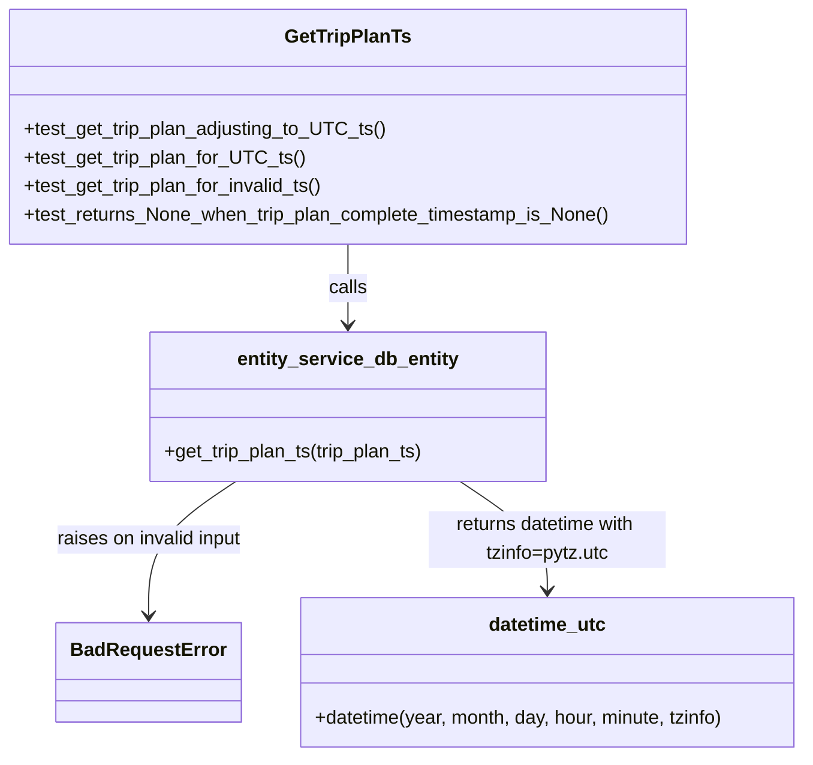
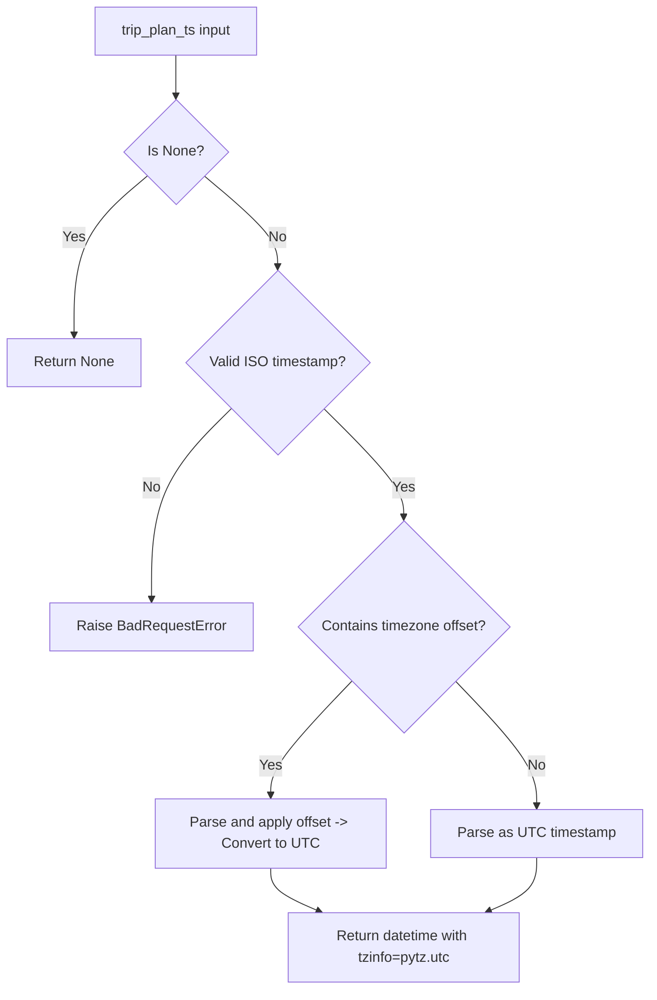

# Diagram: entity_core/entity_service/entity_service_tests/update_entity_tests/test_get_trip_plan_ts.py

> Auto-generated by Obscura crawlers

## Diagram 1

### SVG

<svg id="container" width="684.244140625" xmlns="http://www.w3.org/2000/svg" class="classDiagram" height="638" viewBox="0 0 684.244140625 638" role="graphics-document document" aria-roledescription="class"><g><defs><marker id="container_class-aggregationStart" class="marker aggregation class" refX="18" refY="7" markerWidth="190" markerHeight="240" orient="auto"><path d="M 18,7 L9,13 L1,7 L9,1 Z"></path></marker></defs><defs><marker id="container_class-aggregationEnd" class="marker aggregation class" refX="1" refY="7" markerWidth="20" markerHeight="28" orient="auto"><path d="M 18,7 L9,13 L1,7 L9,1 Z"></path></marker></defs><defs><marker id="container_class-extensionStart" class="marker extension class" refX="18" refY="7" markerWidth="190" markerHeight="240" orient="auto"><path d="M 1,7 L18,13 V 1 Z"></path></marker></defs><defs><marker id="container_class-extensionEnd" class="marker extension class" refX="1" refY="7" markerWidth="20" markerHeight="28" orient="auto"><path d="M 1,1 V 13 L18,7 Z"></path></marker></defs><defs><marker id="container_class-compositionStart" class="marker composition class" refX="18" refY="7" markerWidth="190" markerHeight="240" orient="auto"><path d="M 18,7 L9,13 L1,7 L9,1 Z"></path></marker></defs><defs><marker id="container_class-compositionEnd" class="marker composition class" refX="1" refY="7" markerWidth="20" markerHeight="28" orient="auto"><path d="M 18,7 L9,13 L1,7 L9,1 Z"></path></marker></defs><defs><marker id="container_class-dependencyStart" class="marker dependency class" refX="6" refY="7" markerWidth="190" markerHeight="240" orient="auto"><path d="M 5,7 L9,13 L1,7 L9,1 Z"></path></marker></defs><defs><marker id="container_class-dependencyEnd" class="marker dependency class" refX="13" refY="7" markerWidth="20" markerHeight="28" orient="auto"><path d="M 18,7 L9,13 L14,7 L9,1 Z"></path></marker></defs><defs><marker id="container_class-lollipopStart" class="marker lollipop class" refX="13" refY="7" markerWidth="190" markerHeight="240" orient="auto"><circle stroke="black" fill="transparent" cx="7" cy="7" r="6"></circle></marker></defs><defs><marker id="container_class-lollipopEnd" class="marker lollipop class" refX="1" refY="7" markerWidth="190" markerHeight="240" orient="auto"><circle stroke="black" fill="transparent" cx="7" cy="7" r="6"></circle></marker></defs><g class="root"><g class="clusters"></g><g class="edgePaths"><path d="M295.945,206L295.945,212.167C295.945,218.333,295.945,230.667,295.945,242C295.945,253.333,295.945,263.667,295.945,268.833L295.945,274" id="id_GetTripPlanTs_entity_service_db_entity_1" class="edge-thickness-normal edge-pattern-solid relation" style=";;;" data-edge="true" data-et="edge" data-id="id_GetTripPlanTs_entity_service_db_entity_1" data-points="W3sieCI6Mjk1Ljk0NTMxMjUsInkiOjIwNn0seyJ4IjoyOTUuOTQ1MzEyNSwieSI6MjQzfSx7IngiOjI5NS45NDUzMTI1LCJ5IjoyODB9XQ==" marker-end="url(#container_class-dependencyEnd)"></path><path d="M201.337,406L189.072,414.167C176.808,422.333,152.28,438.667,140.016,457.5C127.752,476.333,127.752,497.667,127.752,508.333L127.752,519" id="id_entity_service_db_entity_BadRequestError_2" class="edge-thickness-normal edge-pattern-solid relation" style=";;;" data-edge="true" data-et="edge" data-id="id_entity_service_db_entity_BadRequestError_2" data-points="W3sieCI6MjAxLjMzNjU0Nzg1MTU2MjUsInkiOjQwNn0seyJ4IjoxMjcuNzUxOTUzMTI1LCJ5Ijo0NTV9LHsieCI6MTI3Ljc1MTk1MzEyNSwieSI6NTI1fV0=" marker-end="url(#container_class-dependencyEnd)"></path><path d="M390.554,406L402.818,414.167C415.082,422.333,439.61,438.667,451.875,454C464.139,469.333,464.139,483.667,464.139,490.833L464.139,498" id="id_entity_service_db_entity_datetime_utc_3" class="edge-thickness-normal edge-pattern-solid relation" style=";;;" data-edge="true" data-et="edge" data-id="id_entity_service_db_entity_datetime_utc_3" data-points="W3sieCI6MzkwLjU1NDA3NzE0ODQzNzUsInkiOjQwNn0seyJ4Ijo0NjQuMTM4NjcxODc1LCJ5Ijo0NTV9LHsieCI6NDY0LjEzODY3MTg3NSwieSI6NTA0fV0=" marker-end="url(#container_class-dependencyEnd)"></path></g><g class="edgeLabels"><g class="edgeLabel" transform="translate(295.9453125, 243)"><g class="label" data-id="id_GetTripPlanTs_entity_service_db_entity_1" transform="translate(-16.4453125, -12)"><foreignObject width="32.890625" height="24">

calls

</foreignObject></g></g><g class="edgeLabel" transform="translate(127.751953125, 455)"><g class="label" data-id="id_entity_service_db_entity_BadRequestError_2" transform="translate(-80.5625, -12)"><foreignObject width="161.125" height="24">

raises on invalid input

</foreignObject></g></g><g class="edgeLabel" transform="translate(464.138671875, 455)"><g class="label" data-id="id_entity_service_db_entity_datetime_utc_3" transform="translate(-100, -24)"><foreignObject width="200" height="48">

returns datetime with tzinfo=pytz.utc

</foreignObject></g></g></g><g class="nodes"><g class="node default" id="classId-GetTripPlanTs-0" transform="translate(295.9453125, 107)"><g class="basic label-container"><path d="M-287.9453125 -99 L287.9453125 -99 L287.9453125 99 L-287.9453125 99" stroke="none" stroke-width="0" fill="#ECECFF" style=""></path><path d="M-287.9453125 -99 C-136.55720043681936 -99, 14.830911626361285 -99, 287.9453125 -99 M-287.9453125 -99 C-152.37257657468965 -99, -16.79984064937929 -99, 287.9453125 -99 M287.9453125 -99 C287.9453125 -49.85921720412076, 287.9453125 -0.7184344082415208, 287.9453125 99 M287.9453125 -99 C287.9453125 -35.70160676398507, 287.9453125 27.596786472029862, 287.9453125 99 M287.9453125 99 C145.00387499186976 99, 2.0624374837395294 99, -287.9453125 99 M287.9453125 99 C71.70995463657124 99, -144.52540322685752 99, -287.9453125 99 M-287.9453125 99 C-287.9453125 58.88624120790658, -287.9453125 18.77248241581316, -287.9453125 -99 M-287.9453125 99 C-287.9453125 36.013724958172645, -287.9453125 -26.97255008365471, -287.9453125 -99" stroke="#9370DB" stroke-width="1.3" fill="none" stroke-dasharray="0 0" style=""></path></g><g class="annotation-group text" transform="translate(0, -75)"></g><g class="label-group text" transform="translate(-50.828125, -75)"><g class="label" style="font-weight: bolder" transform="translate(0,-12)"><foreignObject width="101.65625" height="24">

GetTripPlanTs

</foreignObject></g></g><g class="members-group text" transform="translate(-275.9453125, -27)"></g><g class="methods-group text" transform="translate(-275.9453125, 3)"><g class="label" style="" transform="translate(0,-12)"><foreignObject width="305.46875" height="24">

+test_get_trip_plan_adjusting_to_UTC_ts()

</foreignObject></g><g class="label" style="" transform="translate(0,12)"><foreignObject width="234.765625" height="24">

+test_get_trip_plan_for_UTC_ts()

</foreignObject></g><g class="label" style="" transform="translate(0,36)"><foreignObject width="256.6875" height="24">

+test_get_trip_plan_for_invalid_ts()

</foreignObject></g><g class="label" style="" transform="translate(0,60)"><foreignObject width="501.0625" height="24">

+test_returns_None_when_trip_plan_complete_timestamp_is_None()

</foreignObject></g></g><g class="divider" style=""><path d="M-287.9453125 -51 C-168.06019099713194 -51, -48.17506949426388 -51, 287.9453125 -51 M-287.9453125 -51 C-126.10423807191162 -51, 35.73683635617675 -51, 287.9453125 -51" stroke="#9370DB" stroke-width="1.3" fill="none" stroke-dasharray="0 0" style=""></path></g><g class="divider" style=""><path d="M-287.9453125 -27 C-111.45950615130724 -27, 65.02630019738552 -27, 287.9453125 -27 M-287.9453125 -27 C-157.60838421924717 -27, -27.27145593849434 -27, 287.9453125 -27" stroke="#9370DB" stroke-width="1.3" fill="none" stroke-dasharray="0 0" style=""></path></g></g><g class="node default" id="classId-entity_service_db_entity-1" transform="translate(295.9453125, 343)"><g class="basic label-container"><path d="M-168.9921875 -63 L168.9921875 -63 L168.9921875 63 L-168.9921875 63" stroke="none" stroke-width="0" fill="#ECECFF" style=""></path><path d="M-168.9921875 -63 C-90.00588473060363 -63, -11.019581961207251 -63, 168.9921875 -63 M-168.9921875 -63 C-97.1086295175234 -63, -25.225071535046794 -63, 168.9921875 -63 M168.9921875 -63 C168.9921875 -31.71555679496772, 168.9921875 -0.4311135899354426, 168.9921875 63 M168.9921875 -63 C168.9921875 -17.816375174382486, 168.9921875 27.367249651235028, 168.9921875 63 M168.9921875 63 C63.684587768860624 63, -41.62301196227875 63, -168.9921875 63 M168.9921875 63 C78.95608893969045 63, -11.080009620619109 63, -168.9921875 63 M-168.9921875 63 C-168.9921875 34.14821505513903, -168.9921875 5.2964301102780595, -168.9921875 -63 M-168.9921875 63 C-168.9921875 23.020393433835807, -168.9921875 -16.959213132328387, -168.9921875 -63" stroke="#9370DB" stroke-width="1.3" fill="none" stroke-dasharray="0 0" style=""></path></g><g class="annotation-group text" transform="translate(0, -39)"></g><g class="label-group text" transform="translate(-90.25, -39)"><g class="label" style="font-weight: bolder" transform="translate(0,-12)"><foreignObject width="180.5" height="24">

entity_service_db_entity

</foreignObject></g></g><g class="members-group text" transform="translate(-156.9921875, 9)"></g><g class="methods-group text" transform="translate(-156.9921875, 39)"><g class="label" style="" transform="translate(0,-12)"><foreignObject width="223.734375" height="24">

+get_trip_plan_ts(trip_plan_ts)

</foreignObject></g></g><g class="divider" style=""><path d="M-168.9921875 -15 C-81.54318786185118 -15, 5.905811776297639 -15, 168.9921875 -15 M-168.9921875 -15 C-62.26672686454867 -15, 44.458733770902654 -15, 168.9921875 -15" stroke="#9370DB" stroke-width="1.3" fill="none" stroke-dasharray="0 0" style=""></path></g><g class="divider" style=""><path d="M-168.9921875 9 C-84.59387339045824 9, -0.1955592809164841 9, 168.9921875 9 M-168.9921875 9 C-76.60788960837183 9, 15.77640828325633 9, 168.9921875 9" stroke="#9370DB" stroke-width="1.3" fill="none" stroke-dasharray="0 0" style=""></path></g></g><g class="node default" id="classId-BadRequestError-2" transform="translate(127.751953125, 567)"><g class="basic label-container"><path d="M-74.28125 -42 L74.28125 -42 L74.28125 42 L-74.28125 42" stroke="none" stroke-width="0" fill="#ECECFF" style=""></path><path d="M-74.28125 -42 C-26.984104608120617 -42, 20.313040783758765 -42, 74.28125 -42 M-74.28125 -42 C-29.83316668755362 -42, 14.614916624892757 -42, 74.28125 -42 M74.28125 -42 C74.28125 -17.585945510459773, 74.28125 6.828108979080454, 74.28125 42 M74.28125 -42 C74.28125 -8.625050935690474, 74.28125 24.74989812861905, 74.28125 42 M74.28125 42 C31.879834195509325 42, -10.52158160898135 42, -74.28125 42 M74.28125 42 C25.663758735341048 42, -22.953732529317904 42, -74.28125 42 M-74.28125 42 C-74.28125 14.76828382019604, -74.28125 -12.463432359607921, -74.28125 -42 M-74.28125 42 C-74.28125 18.67430560294998, -74.28125 -4.651388794100043, -74.28125 -42" stroke="#9370DB" stroke-width="1.3" fill="none" stroke-dasharray="0 0" style=""></path></g><g class="annotation-group text" transform="translate(0, -18)"></g><g class="label-group text" transform="translate(-62.28125, -18)"><g class="label" style="font-weight: bolder" transform="translate(0,-12)"><foreignObject width="124.5625" height="24">

BadRequestError

</foreignObject></g></g><g class="members-group text" transform="translate(-62.28125, 30)"></g><g class="methods-group text" transform="translate(-62.28125, 60)"></g><g class="divider" style=""><path d="M-74.28125 6 C-33.571022386430705 6, 7.139205227138589 6, 74.28125 6 M-74.28125 6 C-35.21369808614877 6, 3.8538538277024657 6, 74.28125 6" stroke="#9370DB" stroke-width="1.3" fill="none" stroke-dasharray="0 0" style=""></path></g><g class="divider" style=""><path d="M-74.28125 24 C-21.09719890568467 24, 32.08685218863066 24, 74.28125 24 M-74.28125 24 C-26.203609514270468 24, 21.874030971459064 24, 74.28125 24" stroke="#9370DB" stroke-width="1.3" fill="none" stroke-dasharray="0 0" style=""></path></g></g><g class="node default" id="classId-datetime_utc-3" transform="translate(464.138671875, 567)"><g class="basic label-container"><path d="M-212.10546875 -63 L212.10546875 -63 L212.10546875 63 L-212.10546875 63" stroke="none" stroke-width="0" fill="#ECECFF" style=""></path><path d="M-212.10546875 -63 C-77.93741899679327 -63, 56.23063075641346 -63, 212.10546875 -63 M-212.10546875 -63 C-91.1808175771583 -63, 29.743833595683412 -63, 212.10546875 -63 M212.10546875 -63 C212.10546875 -13.904855394420323, 212.10546875 35.19028921115935, 212.10546875 63 M212.10546875 -63 C212.10546875 -22.34539683207698, 212.10546875 18.309206335846042, 212.10546875 63 M212.10546875 63 C43.89871554564513 63, -124.30803765870974 63, -212.10546875 63 M212.10546875 63 C95.10587558232827 63, -21.893717585343467 63, -212.10546875 63 M-212.10546875 63 C-212.10546875 21.775322267122434, -212.10546875 -19.449355465755133, -212.10546875 -63 M-212.10546875 63 C-212.10546875 22.494015877698892, -212.10546875 -18.011968244602215, -212.10546875 -63" stroke="#9370DB" stroke-width="1.3" fill="none" stroke-dasharray="0 0" style=""></path></g><g class="annotation-group text" transform="translate(0, -39)"></g><g class="label-group text" transform="translate(-48.2578125, -39)"><g class="label" style="font-weight: bolder" transform="translate(0,-12)"><foreignObject width="96.515625" height="24">

datetime_utc

</foreignObject></g></g><g class="members-group text" transform="translate(-200.10546875, 9)"></g><g class="methods-group text" transform="translate(-200.10546875, 39)"><g class="label" style="" transform="translate(0,-12)"><foreignObject width="351.953125" height="24">

+datetime(year, month, day, hour, minute, tzinfo)

</foreignObject></g></g><g class="divider" style=""><path d="M-212.10546875 -15 C-54.26070056662107 -15, 103.58406761675786 -15, 212.10546875 -15 M-212.10546875 -15 C-91.7775859039566 -15, 28.55029694208679 -15, 212.10546875 -15" stroke="#9370DB" stroke-width="1.3" fill="none" stroke-dasharray="0 0" style=""></path></g><g class="divider" style=""><path d="M-212.10546875 9 C-110.42354163234376 9, -8.741614514687512 9, 212.10546875 9 M-212.10546875 9 C-86.429041737304 9, 39.24738527539199 9, 212.10546875 9" stroke="#9370DB" stroke-width="1.3" fill="none" stroke-dasharray="0 0" style=""></path></g></g></g></g></g></svg>

## Diagram 2

### SVG

<svg id="container" width="727.5390625" xmlns="http://www.w3.org/2000/svg" class="flowchart" height="1111.875" viewBox="0 0 727.5390625 1111.875" role="graphics-document document" aria-roledescription="flowchart-v2"><g><marker id="container_flowchart-v2-pointEnd" class="marker flowchart-v2" viewBox="0 0 10 10" refX="5" refY="5" markerUnits="userSpaceOnUse" markerWidth="8" markerHeight="8" orient="auto"><path d="M 0 0 L 10 5 L 0 10 z" class="arrowMarkerPath" style="stroke-width: 1; stroke-dasharray: 1, 0;"></path></marker><marker id="container_flowchart-v2-pointStart" class="marker flowchart-v2" viewBox="0 0 10 10" refX="4.5" refY="5" markerUnits="userSpaceOnUse" markerWidth="8" markerHeight="8" orient="auto"><path d="M 0 5 L 10 10 L 10 0 z" class="arrowMarkerPath" style="stroke-width: 1; stroke-dasharray: 1, 0;"></path></marker><marker id="container_flowchart-v2-circleEnd" class="marker flowchart-v2" viewBox="0 0 10 10" refX="11" refY="5" markerUnits="userSpaceOnUse" markerWidth="11" markerHeight="11" orient="auto"><circle cx="5" cy="5" r="5" class="arrowMarkerPath" style="stroke-width: 1; stroke-dasharray: 1, 0;"></circle></marker><marker id="container_flowchart-v2-circleStart" class="marker flowchart-v2" viewBox="0 0 10 10" refX="-1" refY="5" markerUnits="userSpaceOnUse" markerWidth="11" markerHeight="11" orient="auto"><circle cx="5" cy="5" r="5" class="arrowMarkerPath" style="stroke-width: 1; stroke-dasharray: 1, 0;"></circle></marker><marker id="container_flowchart-v2-crossEnd" class="marker cross flowchart-v2" viewBox="0 0 11 11" refX="12" refY="5.2" markerUnits="userSpaceOnUse" markerWidth="11" markerHeight="11" orient="auto"><path d="M 1,1 l 9,9 M 10,1 l -9,9" class="arrowMarkerPath" style="stroke-width: 2; stroke-dasharray: 1, 0;"></path></marker><marker id="container_flowchart-v2-crossStart" class="marker cross flowchart-v2" viewBox="0 0 11 11" refX="-1" refY="5.2" markerUnits="userSpaceOnUse" markerWidth="11" markerHeight="11" orient="auto"><path d="M 1,1 l 9,9 M 10,1 l -9,9" class="arrowMarkerPath" style="stroke-width: 2; stroke-dasharray: 1, 0;"></path></marker><g class="root"><g class="clusters"></g><g class="edgePaths"><path d="M198.328,62L198.328,66.167C198.328,70.333,198.328,78.667,198.328,86.333C198.328,94,198.328,101,198.328,104.5L198.328,108" id="L_A_B_0" class="edge-thickness-normal edge-pattern-solid edge-thickness-normal edge-pattern-solid flowchart-link" style=";" data-edge="true" data-et="edge" data-id="L_A_B_0" data-points="W3sieCI6MTk4LjMyODEyNSwieSI6NjJ9LHsieCI6MTk4LjMyODEyNSwieSI6ODd9LHsieCI6MTk4LjMyODEyNSwieSI6MTEyfV0=" marker-end="url(#container_flowchart-v2-pointEnd)"></path><path d="M166.71,195.898L152.877,207.334C139.044,218.77,111.377,241.643,97.544,271.333C83.711,301.023,83.711,337.531,83.711,355.785L83.711,374.039" id="L_B_C_0" class="edge-thickness-normal edge-pattern-solid edge-thickness-normal edge-pattern-solid flowchart-link" style=";" data-edge="true" data-et="edge" data-id="L_B_C_0" data-points="W3sieCI6MTY2LjcxMDAzMjk0MDc2NDkzLCJ5IjoxOTUuODk3NTMyOTQwNzY0OTN9LHsieCI6ODMuNzEwOTM3NSwieSI6MjY0LjUxNTYyNX0seyJ4Ijo4My43MTA5Mzc1LCJ5IjozNzguMDM5MDYyNX1d" marker-end="url(#container_flowchart-v2-pointEnd)"></path><path d="M229.946,195.898L243.779,207.334C257.613,218.77,285.279,241.643,299.112,258.579C312.945,275.516,312.945,286.516,312.945,292.016L312.945,297.516" id="L_B_D_0" class="edge-thickness-normal edge-pattern-solid edge-thickness-normal edge-pattern-solid flowchart-link" style=";" data-edge="true" data-et="edge" data-id="L_B_D_0" data-points="W3sieCI6MjI5Ljk0NjIxNzA1OTIzNTA3LCJ5IjoxOTUuODk3NTMyOTQwNzY0OTN9LHsieCI6MzEyLjk0NTMxMjUsInkiOjI2NC41MTU2MjV9LHsieCI6MzEyLjk0NTMxMjUsInkiOjMwMS41MTU2MjV9XQ==" marker-end="url(#container_flowchart-v2-pointEnd)"></path><path d="M260.946,456.563L245.976,471.396C231.006,486.23,201.065,515.896,186.095,551.839C171.125,587.781,171.125,630,171.125,651.109L171.125,672.219" id="L_D_E_0" class="edge-thickness-normal edge-pattern-solid edge-thickness-normal edge-pattern-solid flowchart-link" style=";" data-edge="true" data-et="edge" data-id="L_D_E_0" data-points="W3sieCI6MjYwLjk0NTgzOTMxNDEyNTY0LCJ5Ijo0NTYuNTYzMDI2ODE0MTI1NjR9LHsieCI6MTcxLjEyNSwieSI6NTQ1LjU2MjV9LHsieCI6MTcxLjEyNSwieSI6Njc2LjIxODc1fV0=" marker-end="url(#container_flowchart-v2-pointEnd)"></path><path d="M364.945,456.563L379.915,471.396C394.885,486.23,424.825,515.896,439.795,536.229C454.766,556.563,454.766,567.563,454.766,573.063L454.766,578.563" id="L_D_F_0" class="edge-thickness-normal edge-pattern-solid edge-thickness-normal edge-pattern-solid flowchart-link" style=";" data-edge="true" data-et="edge" data-id="L_D_F_0" data-points="W3sieCI6MzY0Ljk0NDc4NTY4NTg3NDM2LCJ5Ijo0NTYuNTYzMDI2ODE0MTI1NjR9LHsieCI6NDU0Ljc2NTYyNSwieSI6NTQ1LjU2MjV9LHsieCI6NDU0Ljc2NTYyNSwieSI6NTgyLjU2MjV9XQ==" marker-end="url(#container_flowchart-v2-pointEnd)"></path><path d="M396.291,765.4L381.327,781.313C366.363,797.225,336.436,829.05,321.472,850.463C306.508,871.875,306.508,882.875,306.508,888.375L306.508,893.875" id="L_F_G_0" class="edge-thickness-normal edge-pattern-solid edge-thickness-normal edge-pattern-solid flowchart-link" style=";" data-edge="true" data-et="edge" data-id="L_F_G_0" data-points="W3sieCI6Mzk2LjI5MDkyOTM4MzYzNTEsInkiOjc2NS40MDAzMDQzODM2MzUxfSx7IngiOjMwNi41MDc4MTI1LCJ5Ijo4NjAuODc1fSx7IngiOjMwNi41MDc4MTI1LCJ5Ijo4OTcuODc1fV0=" marker-end="url(#container_flowchart-v2-pointEnd)"></path><path d="M513.24,765.4L528.204,781.313C543.168,797.225,573.096,829.05,588.06,852.463C603.023,875.875,603.023,890.875,603.023,898.375L603.023,905.875" id="L_F_H_0" class="edge-thickness-normal edge-pattern-solid edge-thickness-normal edge-pattern-solid flowchart-link" style=";" data-edge="true" data-et="edge" data-id="L_F_H_0" data-points="W3sieCI6NTEzLjI0MDMyMDYxNjM2NDksInkiOjc2NS40MDAzMDQzODM2MzUxfSx7IngiOjYwMy4wMjM0Mzc1LCJ5Ijo4NjAuODc1fSx7IngiOjYwMy4wMjM0Mzc1LCJ5Ijo5MDkuODc1fV0=" marker-end="url(#container_flowchart-v2-pointEnd)"></path><path d="M306.508,975.875L306.508,980.042C306.508,984.208,306.508,992.542,315.548,1000.611C324.588,1008.68,342.668,1016.485,351.708,1020.387L360.749,1024.29" id="L_G_I_0" class="edge-thickness-normal edge-pattern-solid edge-thickness-normal edge-pattern-solid flowchart-link" style=";" data-edge="true" data-et="edge" data-id="L_G_I_0" data-points="W3sieCI6MzA2LjUwNzgxMjUsInkiOjk3NS44NzV9LHsieCI6MzA2LjUwNzgxMjUsInkiOjEwMDAuODc1fSx7IngiOjM2NC40MjEwMjA1MDc4MTI1LCJ5IjoxMDI1Ljg3NX1d" marker-end="url(#container_flowchart-v2-pointEnd)"></path><path d="M603.023,963.875L603.023,970.042C603.023,976.208,603.023,988.542,593.983,998.611C584.943,1008.68,566.863,1016.485,557.823,1020.387L548.783,1024.29" id="L_H_I_0" class="edge-thickness-normal edge-pattern-solid edge-thickness-normal edge-pattern-solid flowchart-link" style=";" data-edge="true" data-et="edge" data-id="L_H_I_0" data-points="W3sieCI6NjAzLjAyMzQzNzUsInkiOjk2My44NzV9LHsieCI6NjAzLjAyMzQzNzUsInkiOjEwMDAuODc1fSx7IngiOjU0NS4xMTAyMjk0OTIxODc1LCJ5IjoxMDI1Ljg3NX1d" marker-end="url(#container_flowchart-v2-pointEnd)"></path></g><g class="edgeLabels"><g class="edgeLabel"><g class="label" data-id="L_A_B_0" transform="translate(0, 0)"><foreignObject width="0" height="0">

</foreignObject></g></g><g class="edgeLabel" transform="translate(83.7109375, 264.515625)"><g class="label" data-id="L_B_C_0" transform="translate(-12.03125, -12)"><foreignObject width="24.0625" height="24">

Yes

</foreignObject></g></g><g class="edgeLabel" transform="translate(312.9453125, 264.515625)"><g class="label" data-id="L_B_D_0" transform="translate(-10.140625, -12)"><foreignObject width="20.28125" height="24">

No

</foreignObject></g></g><g class="edgeLabel" transform="translate(171.125, 545.5625)"><g class="label" data-id="L_D_E_0" transform="translate(-10.140625, -12)"><foreignObject width="20.28125" height="24">

No

</foreignObject></g></g><g class="edgeLabel" transform="translate(454.765625, 545.5625)"><g class="label" data-id="L_D_F_0" transform="translate(-12.03125, -12)"><foreignObject width="24.0625" height="24">

Yes

</foreignObject></g></g><g class="edgeLabel" transform="translate(306.5078125, 860.875)"><g class="label" data-id="L_F_G_0" transform="translate(-12.03125, -12)"><foreignObject width="24.0625" height="24">

Yes

</foreignObject></g></g><g class="edgeLabel" transform="translate(603.0234375, 860.875)"><g class="label" data-id="L_F_H_0" transform="translate(-10.140625, -12)"><foreignObject width="20.28125" height="24">

No

</foreignObject></g></g><g class="edgeLabel"><g class="label" data-id="L_G_I_0" transform="translate(0, 0)"><foreignObject width="0" height="0">

</foreignObject></g></g><g class="edgeLabel"><g class="label" data-id="L_H_I_0" transform="translate(0, 0)"><foreignObject width="0" height="0">

</foreignObject></g></g></g><g class="nodes"><g class="node default" id="flowchart-A-0" transform="translate(198.328125, 35)"><rect class="basic label-container" style="" x="-95.0703125" y="-27" width="190.140625" height="54"></rect><g class="label" style="" transform="translate(-65.0703125, -12)"><rect></rect><foreignObject width="130.140625" height="24">

trip_plan_ts input

</foreignObject></g></g><g class="node default" id="flowchart-B-1" transform="translate(198.328125, 169.7578125)"><polygon points="57.7578125,0 115.515625,-57.7578125 57.7578125,-115.515625 0,-57.7578125" class="label-container" transform="translate(-57.2578125, 57.7578125)"></polygon><g class="label" style="" transform="translate(-30.7578125, -12)"><rect></rect><foreignObject width="61.515625" height="24">

Is None?

</foreignObject></g></g><g class="node default" id="flowchart-C-3" transform="translate(83.7109375, 405.0390625)"><rect class="basic label-container" style="" x="-75.7109375" y="-27" width="151.421875" height="54"></rect><g class="label" style="" transform="translate(-45.7109375, -12)"><rect></rect><foreignObject width="91.421875" height="24">

Return None

</foreignObject></g></g><g class="node default" id="flowchart-D-5" transform="translate(312.9453125, 405.0390625)"><polygon points="103.5234375,0 207.046875,-103.5234375 103.5234375,-207.046875 0,-103.5234375" class="label-container" transform="translate(-103.0234375, 103.5234375)"></polygon><g class="label" style="" transform="translate(-76.5234375, -12)"><rect></rect><foreignObject width="153.046875" height="24">

Valid ISO timestamp?

</foreignObject></g></g><g class="node default" id="flowchart-E-7" transform="translate(171.125, 703.21875)"><rect class="basic label-container" style="" x="-112.984375" y="-27" width="225.96875" height="54"></rect><g class="label" style="" transform="translate(-82.984375, -12)"><rect></rect><foreignObject width="165.96875" height="24">

Raise BadRequestError

</foreignObject></g></g><g class="node default" id="flowchart-F-9" transform="translate(454.765625, 703.21875)"><polygon points="120.65625,0 241.3125,-120.65625 120.65625,-241.3125 0,-120.65625" class="label-container" transform="translate(-120.15625, 120.65625)"></polygon><g class="label" style="" transform="translate(-93.65625, -12)"><rect></rect><foreignObject width="187.3125" height="24">

Contains timezone offset?

</foreignObject></g></g><g class="node default" id="flowchart-G-11" transform="translate(306.5078125, 936.875)"><rect class="basic label-container" style="" x="-130" y="-39" width="260" height="78"></rect><g class="label" style="" transform="translate(-100, -24)"><rect></rect><foreignObject width="200" height="48">

Parse and apply offset -&gt; Convert to UTC

</foreignObject></g></g><g class="node default" id="flowchart-H-13" transform="translate(603.0234375, 936.875)"><rect class="basic label-container" style="" x="-116.515625" y="-27" width="233.03125" height="54"></rect><g class="label" style="" transform="translate(-86.515625, -12)"><rect></rect><foreignObject width="173.03125" height="24">

Parse as UTC timestamp

</foreignObject></g></g><g class="node default" id="flowchart-I-15" transform="translate(454.765625, 1064.875)"><rect class="basic label-container" style="" x="-130" y="-39" width="260" height="78"></rect><g class="label" style="" transform="translate(-100, -24)"><rect></rect><foreignObject width="200" height="48">

Return datetime with tzinfo=pytz.utc

</foreignObject></g></g></g></g></g></svg>
