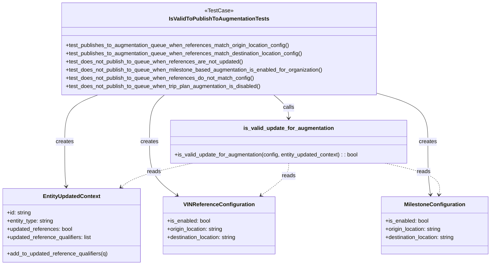
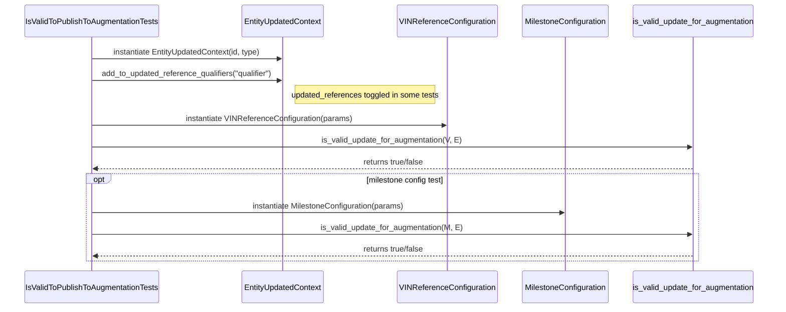

# Diagram: entity_core/entity_service/entity_service_tests/update_entity_tests/test_is_valid_to_publish_to_augmentation.py

> Auto-generated by Obscura crawlers

## Diagram 1

### SVG

<svg id="container" width="1443.751953125" xmlns="http://www.w3.org/2000/svg" class="classDiagram" height="776" viewBox="0 0 1443.751953125 776" role="graphics-document document" aria-roledescription="class"><g><defs><marker id="container_class-aggregationStart" class="marker aggregation class" refX="18" refY="7" markerWidth="190" markerHeight="240" orient="auto"><path d="M 18,7 L9,13 L1,7 L9,1 Z"></path></marker></defs><defs><marker id="container_class-aggregationEnd" class="marker aggregation class" refX="1" refY="7" markerWidth="20" markerHeight="28" orient="auto"><path d="M 18,7 L9,13 L1,7 L9,1 Z"></path></marker></defs><defs><marker id="container_class-extensionStart" class="marker extension class" refX="18" refY="7" markerWidth="190" markerHeight="240" orient="auto"><path d="M 1,7 L18,13 V 1 Z"></path></marker></defs><defs><marker id="container_class-extensionEnd" class="marker extension class" refX="1" refY="7" markerWidth="20" markerHeight="28" orient="auto"><path d="M 1,1 V 13 L18,7 Z"></path></marker></defs><defs><marker id="container_class-compositionStart" class="marker composition class" refX="18" refY="7" markerWidth="190" markerHeight="240" orient="auto"><path d="M 18,7 L9,13 L1,7 L9,1 Z"></path></marker></defs><defs><marker id="container_class-compositionEnd" class="marker composition class" refX="1" refY="7" markerWidth="20" markerHeight="28" orient="auto"><path d="M 18,7 L9,13 L1,7 L9,1 Z"></path></marker></defs><defs><marker id="container_class-dependencyStart" class="marker dependency class" refX="6" refY="7" markerWidth="190" markerHeight="240" orient="auto"><path d="M 5,7 L9,13 L1,7 L9,1 Z"></path></marker></defs><defs><marker id="container_class-dependencyEnd" class="marker dependency class" refX="13" refY="7" markerWidth="20" markerHeight="28" orient="auto"><path d="M 18,7 L9,13 L14,7 L9,1 Z"></path></marker></defs><defs><marker id="container_class-lollipopStart" class="marker lollipop class" refX="13" refY="7" markerWidth="190" markerHeight="240" orient="auto"><circle stroke="black" fill="transparent" cx="7" cy="7" r="6"></circle></marker></defs><defs><marker id="container_class-lollipopEnd" class="marker lollipop class" refX="1" refY="7" markerWidth="190" markerHeight="240" orient="auto"><circle stroke="black" fill="transparent" cx="7" cy="7" r="6"></circle></marker></defs><g class="root"><g class="clusters"></g><g class="edgePaths"><path d="M287.438,278L271.19,284.167C254.942,290.333,222.446,302.667,206.197,325.5C189.949,348.333,189.949,381.667,189.949,415C189.949,448.333,189.949,481.667,190.663,503.509C191.377,525.352,192.806,535.704,193.52,540.88L194.234,546.056" id="id_IsValidToPublishToAugmentationTests_EntityUpdatedContext_1" class="edge-thickness-normal edge-pattern-solid relation" style=";;;" data-edge="true" data-et="edge" data-id="id_IsValidToPublishToAugmentationTests_EntityUpdatedContext_1" data-points="W3sieCI6Mjg3LjQzODA2Nzc2ODg5NTM0LCJ5IjoyNzh9LHsieCI6MTg5Ljk0OTIxODc1LCJ5IjozMTV9LHsieCI6MTg5Ljk0OTIxODc1LCJ5Ijo0MTV9LHsieCI6MTg5Ljk0OTIxODc1LCJ5Ijo1MTV9LHsieCI6MTk1LjA1MzY2Mzc5MzEwMzQ1LCJ5Ijo1NTJ9XQ==" marker-end="url(#container_class-dependencyEnd)"></path><path d="M482.517,278L475.18,284.167C467.843,290.333,453.168,302.667,445.831,325.5C438.494,348.333,438.494,381.667,438.494,415C438.494,448.333,438.494,481.667,452.027,507.922C465.56,534.177,492.625,553.354,506.158,562.943L519.691,572.531" id="id_IsValidToPublishToAugmentationTests_VINReferenceConfiguration_2" class="edge-thickness-normal edge-pattern-solid relation" style=";;;" data-edge="true" data-et="edge" data-id="id_IsValidToPublishToAugmentationTests_VINReferenceConfiguration_2" data-points="W3sieCI6NDgyLjUxNjkzMDg2ODQ1OTMsInkiOjI3OH0seyJ4Ijo0MzguNDk0MTQwNjI1LCJ5IjozMTV9LHsieCI6NDM4LjQ5NDE0MDYyNSwieSI6NDE1fSx7IngiOjQzOC40OTQxNDA2MjUsInkiOjUxNX0seyJ4Ijo1MjQuNTg2Nzk5NTY4OTY1NSwieSI6NTc2fV0=" marker-end="url(#container_class-dependencyEnd)"></path><path d="M1105.301,272.478L1130.597,279.565C1155.894,286.652,1206.487,300.826,1231.784,324.58C1257.08,348.333,1257.08,381.667,1257.08,415C1257.08,448.333,1257.08,481.667,1258.346,507.509C1259.612,533.352,1262.144,551.704,1263.41,560.88L1264.676,570.056" id="id_IsValidToPublishToAugmentationTests_MilestoneConfiguration_3" class="edge-thickness-normal edge-pattern-solid relation" style=";;;" data-edge="true" data-et="edge" data-id="id_IsValidToPublishToAugmentationTests_MilestoneConfiguration_3" data-points="W3sieCI6MTEwNS4zMDA3ODEyNSwieSI6MjcyLjQ3NzgyNzkzNjI1OTV9LHsieCI6MTI1Ny4wODAwNzgxMjUsInkiOjMxNX0seyJ4IjoxMjU3LjA4MDA3ODEyNSwieSI6NDE1fSx7IngiOjEyNTcuMDgwMDc4MTI1LCJ5Ijo1MTV9LHsieCI6MTI2NS40OTU1MTQ1NDc0MTQsInkiOjU3Nn1d" marker-end="url(#container_class-dependencyEnd)"></path><path d="M803.764,278L811.101,284.167C818.439,290.333,833.113,302.667,840.45,314C847.787,325.333,847.787,335.667,847.787,340.833L847.787,346" id="id_IsValidToPublishToAugmentationTests_is_valid_update_for_augmentation_4" class="edge-thickness-normal edge-pattern-solid relation" style=";;;" data-edge="true" data-et="edge" data-id="id_IsValidToPublishToAugmentationTests_is_valid_update_for_augmentation_4" data-points="W3sieCI6ODAzLjc2NDMxOTEzMTU0MDcsInkiOjI3OH0seyJ4Ijo4NDcuNzg3MTA5Mzc1LCJ5IjozMTV9LHsieCI6ODQ3Ljc4NzEwOTM3NSwieSI6MzUyfV0=" marker-end="url(#container_class-dependencyEnd)"></path><path d="M564.728,478L537.021,484.167C509.314,490.333,453.9,502.667,418.968,514.39C384.036,526.114,369.585,537.228,362.359,542.785L355.134,548.342" id="id_is_valid_update_for_augmentation_EntityUpdatedContext_5" class="edge-thickness-normal edge-pattern-dashed relation" style=";;;" data-edge="true" data-et="edge" data-id="id_is_valid_update_for_augmentation_EntityUpdatedContext_5" data-points="W3sieCI6NTY0LjcyNzYxNzE4NzUwMDEsInkiOjQ3OH0seyJ4IjozOTguNDg2MzI4MTI1LCJ5Ijo1MTV9LHsieCI6MzUwLjM3Nzg1NTYwMzQ0ODI3LCJ5Ijo1NTJ9XQ==" marker-end="url(#container_class-dependencyEnd)"></path><path d="M847.787,478L847.787,484.167C847.787,490.333,847.787,502.667,834.254,518.422C820.721,534.177,793.656,553.354,780.123,562.943L766.59,572.531" id="id_is_valid_update_for_augmentation_VINReferenceConfiguration_6" class="edge-thickness-normal edge-pattern-dashed relation" style=";;;" data-edge="true" data-et="edge" data-id="id_is_valid_update_for_augmentation_VINReferenceConfiguration_6" data-points="W3sieCI6ODQ3Ljc4NzEwOTM3NSwieSI6NDc4fSx7IngiOjg0Ny43ODcxMDkzNzUsInkiOjUxNX0seyJ4Ijo3NjEuNjk0NDUwNDMxMDM0NSwieSI6NTc2fV0=" marker-end="url(#container_class-dependencyEnd)"></path><path d="M1130.847,478L1158.553,484.167C1186.26,490.333,1241.674,502.667,1268.115,518.009C1294.556,533.352,1292.024,551.704,1290.758,560.88L1289.492,570.056" id="id_is_valid_update_for_augmentation_MilestoneConfiguration_7" class="edge-thickness-normal edge-pattern-dashed relation" style=";;;" data-edge="true" data-et="edge" data-id="id_is_valid_update_for_augmentation_MilestoneConfiguration_7" data-points="W3sieCI6MTEzMC44NDY2MDE1NjI1LCJ5Ijo0Nzh9LHsieCI6MTI5Ny4wODc4OTA2MjUsInkiOjUxNX0seyJ4IjoxMjg4LjY3MjQ1NDIwMjU4NiwieSI6NTc2fV0=" marker-end="url(#container_class-dependencyEnd)"></path></g><g class="edgeLabels"><g class="edgeLabel" transform="translate(189.94921875, 415)"><g class="label" data-id="id_IsValidToPublishToAugmentationTests_EntityUpdatedContext_1" transform="translate(-26.171875, -12)"><foreignObject width="52.34375" height="24">

creates

</foreignObject></g></g><g class="edgeLabel" transform="translate(438.494140625, 415)"><g class="label" data-id="id_IsValidToPublishToAugmentationTests_VINReferenceConfiguration_2" transform="translate(-26.171875, -12)"><foreignObject width="52.34375" height="24">

creates

</foreignObject></g></g><g class="edgeLabel" transform="translate(1257.080078125, 415)"><g class="label" data-id="id_IsValidToPublishToAugmentationTests_MilestoneConfiguration_3" transform="translate(-26.171875, -12)"><foreignObject width="52.34375" height="24">

creates

</foreignObject></g></g><g class="edgeLabel" transform="translate(847.787109375, 315)"><g class="label" data-id="id_IsValidToPublishToAugmentationTests_is_valid_update_for_augmentation_4" transform="translate(-16.4453125, -12)"><foreignObject width="32.890625" height="24">

calls

</foreignObject></g></g><g class="edgeLabel" transform="translate(451.98615, 503.09265)"><g class="label" data-id="id_is_valid_update_for_augmentation_EntityUpdatedContext_5" transform="translate(-20.0078125, -12)"><foreignObject width="40.015625" height="24">

reads

</foreignObject></g></g><g class="edgeLabel" transform="translate(847.787109375, 515)"><g class="label" data-id="id_is_valid_update_for_augmentation_VINReferenceConfiguration_6" transform="translate(-20.0078125, -12)"><foreignObject width="40.015625" height="24">

reads

</foreignObject></g></g><g class="edgeLabel" transform="translate(1244.02075, 503.18895)"><g class="label" data-id="id_is_valid_update_for_augmentation_MilestoneConfiguration_7" transform="translate(-20.0078125, -12)"><foreignObject width="40.015625" height="24">

reads

</foreignObject></g></g></g><g class="nodes"><g class="node default" id="classId-IsValidToPublishToAugmentationTests-0" transform="translate(643.140625, 143)"><g class="basic label-container"><path d="M-462.16015625 -135 L462.16015625 -135 L462.16015625 135 L-462.16015625 135" stroke="none" stroke-width="0" fill="#ECECFF" style=""></path><path d="M-462.16015625 -135 C-143.37508784447368 -135, 175.40998056105263 -135, 462.16015625 -135 M-462.16015625 -135 C-174.4169311091798 -135, 113.32629403164037 -135, 462.16015625 -135 M462.16015625 -135 C462.16015625 -46.39725533064835, 462.16015625 42.2054893387033, 462.16015625 135 M462.16015625 -135 C462.16015625 -33.477510190203674, 462.16015625 68.04497961959265, 462.16015625 135 M462.16015625 135 C100.09279577061591 135, -261.9745647087682 135, -462.16015625 135 M462.16015625 135 C103.78187598451649 135, -254.59640428096702 135, -462.16015625 135 M-462.16015625 135 C-462.16015625 62.395017560861135, -462.16015625 -10.20996487827773, -462.16015625 -135 M-462.16015625 135 C-462.16015625 33.383322793142355, -462.16015625 -68.23335441371529, -462.16015625 -135" stroke="#9370DB" stroke-width="1.3" fill="none" stroke-dasharray="0 0" style=""></path></g><g class="annotation-group text" transform="translate(-40.2578125, -111)"><g class="label" style="" transform="translate(0,-12)"><foreignObject width="80.515625" height="24">

«TestCase»

</foreignObject></g></g><g class="label-group text" transform="translate(-138.9609375, -87)"><g class="label" style="font-weight: bolder" transform="translate(0,-12)"><foreignObject width="277.921875" height="24">

IsValidToPublishToAugmentationTests

</foreignObject></g></g><g class="members-group text" transform="translate(-450.16015625, -39)"></g><g class="methods-group text" transform="translate(-450.16015625, -9)"><g class="label" style="" transform="translate(0,-12)"><foreignObject width="662.75" height="24">

+test_publishes_to_augmentation_queue_when_references_match_origin_location_config()

</foreignObject></g><g class="label" style="" transform="translate(0,12)"><foreignObject width="703.640625" height="24">

+test_publishes_to_augmentation_queue_when_references_match_destination_location_config()

</foreignObject></g><g class="label" style="" transform="translate(0,36)"><foreignObject width="523.0625" height="24">

+test_does_not_publish_to_queue_when_references_are_not_updated()

</foreignObject></g><g class="label" style="" transform="translate(0,60)"><foreignObject width="761.359375" height="24">

+test_does_not_publish_to_queue_when_milestone_based_augmentation_is_enabled_for_organization()

</foreignObject></g><g class="label" style="" transform="translate(0,84)"><foreignObject width="554.8125" height="24">

+test_does_not_publish_to_queue_when_references_do_not_match_config()

</foreignObject></g><g class="label" style="" transform="translate(0,108)"><foreignObject width="581.046875" height="24">

+test_does_not_publish_to_queue_when_trip_plan_augmentation_is_disabled()

</foreignObject></g></g><g class="divider" style=""><path d="M-462.16015625 -63 C-261.2137976469841 -63, -60.26743904396824 -63, 462.16015625 -63 M-462.16015625 -63 C-208.31778772459182 -63, 45.52458080081635 -63, 462.16015625 -63" stroke="#9370DB" stroke-width="1.3" fill="none" stroke-dasharray="0 0" style=""></path></g><g class="divider" style=""><path d="M-462.16015625 -39 C-119.15516064194316 -39, 223.8498349661137 -39, 462.16015625 -39 M-462.16015625 -39 C-272.7291164089055 -39, -83.298076567811 -39, 462.16015625 -39" stroke="#9370DB" stroke-width="1.3" fill="none" stroke-dasharray="0 0" style=""></path></g></g><g class="node default" id="classId-EntityUpdatedContext-1" transform="translate(209.953125, 660)"><g class="basic label-container"><path d="M-201.953125 -108 L201.953125 -108 L201.953125 108 L-201.953125 108" stroke="none" stroke-width="0" fill="#ECECFF" style=""></path><path d="M-201.953125 -108 C-95.25939738026659 -108, 11.434330239466817 -108, 201.953125 -108 M-201.953125 -108 C-119.95576239190315 -108, -37.9583997838063 -108, 201.953125 -108 M201.953125 -108 C201.953125 -42.840581689775235, 201.953125 22.31883662044953, 201.953125 108 M201.953125 -108 C201.953125 -39.39625207569688, 201.953125 29.207495848606243, 201.953125 108 M201.953125 108 C95.31320290616425 108, -11.3267191876715 108, -201.953125 108 M201.953125 108 C42.93150816347287 108, -116.09010867305426 108, -201.953125 108 M-201.953125 108 C-201.953125 45.32077125613444, -201.953125 -17.358457487731116, -201.953125 -108 M-201.953125 108 C-201.953125 34.64249604207279, -201.953125 -38.715007915854414, -201.953125 -108" stroke="#9370DB" stroke-width="1.3" fill="none" stroke-dasharray="0 0" style=""></path></g><g class="annotation-group text" transform="translate(0, -84)"></g><g class="label-group text" transform="translate(-80.78125, -84)"><g class="label" style="font-weight: bolder" transform="translate(0,-12)"><foreignObject width="161.5625" height="24">

EntityUpdatedContext

</foreignObject></g></g><g class="members-group text" transform="translate(-189.953125, -36)"><g class="label" style="" transform="translate(0,-12)"><foreignObject width="71.78125" height="24">

+id: string

</foreignObject></g><g class="label" style="" transform="translate(0,12)"><foreignObject width="138.96875" height="24">

+entity_type: string

</foreignObject></g><g class="label" style="" transform="translate(0,36)"><foreignObject width="193.828125" height="24">

+updated_references: bool

</foreignObject></g><g class="label" style="" transform="translate(0,60)"><foreignObject width="251.5625" height="24">

+updated_reference_qualifiers: list

</foreignObject></g></g><g class="methods-group text" transform="translate(-189.953125, 84)"><g class="label" style="" transform="translate(0,-12)"><foreignObject width="299.125" height="24">

+add_to_updated_reference_qualifiers(q)

</foreignObject></g></g><g class="divider" style=""><path d="M-201.953125 -60 C-102.75825054916601 -60, -3.5633760983320144 -60, 201.953125 -60 M-201.953125 -60 C-41.61102395571632 -60, 118.73107708856736 -60, 201.953125 -60" stroke="#9370DB" stroke-width="1.3" fill="none" stroke-dasharray="0 0" style=""></path></g><g class="divider" style=""><path d="M-201.953125 60 C-72.72726357159323 60, 56.49859785681355 60, 201.953125 60 M-201.953125 60 C-76.65637472430387 60, 48.64037555139225 60, 201.953125 60" stroke="#9370DB" stroke-width="1.3" fill="none" stroke-dasharray="0 0" style=""></path></g></g><g class="node default" id="classId-VINReferenceConfiguration-2" transform="translate(643.140625, 660)"><g class="basic label-container"><path d="M-165.12109375 -84 L165.12109375 -84 L165.12109375 84 L-165.12109375 84" stroke="none" stroke-width="0" fill="#ECECFF" style=""></path><path d="M-165.12109375 -84 C-60.83229966872996 -84, 43.45649441254008 -84, 165.12109375 -84 M-165.12109375 -84 C-49.3035119520068 -84, 66.5140698459864 -84, 165.12109375 -84 M165.12109375 -84 C165.12109375 -48.69951988541964, 165.12109375 -13.39903977083928, 165.12109375 84 M165.12109375 -84 C165.12109375 -23.467468941452893, 165.12109375 37.065062117094214, 165.12109375 84 M165.12109375 84 C98.83047493639734 84, 32.539856122794674 84, -165.12109375 84 M165.12109375 84 C81.46995465689282 84, -2.1811844362143518 84, -165.12109375 84 M-165.12109375 84 C-165.12109375 36.8663388053063, -165.12109375 -10.267322389387402, -165.12109375 -84 M-165.12109375 84 C-165.12109375 38.9209339458478, -165.12109375 -6.1581321083044, -165.12109375 -84" stroke="#9370DB" stroke-width="1.3" fill="none" stroke-dasharray="0 0" style=""></path></g><g class="annotation-group text" transform="translate(0, -60)"></g><g class="label-group text" transform="translate(-98.0859375, -60)"><g class="label" style="font-weight: bolder" transform="translate(0,-12)"><foreignObject width="196.171875" height="24">

VINReferenceConfiguration

</foreignObject></g></g><g class="members-group text" transform="translate(-153.12109375, -12)"><g class="label" style="" transform="translate(0,-12)"><foreignObject width="127.8125" height="24">

+is_enabled: bool

</foreignObject></g><g class="label" style="" transform="translate(0,12)"><foreignObject width="167.25" height="24">

+origin_location: string

</foreignObject></g><g class="label" style="" transform="translate(0,36)"><foreignObject width="208.15625" height="24">

+destination_location: string

</foreignObject></g></g><g class="methods-group text" transform="translate(-153.12109375, 84)"></g><g class="divider" style=""><path d="M-165.12109375 -36 C-58.42839813185145 -36, 48.264297486297096 -36, 165.12109375 -36 M-165.12109375 -36 C-76.60221910473706 -36, 11.91665554052588 -36, 165.12109375 -36" stroke="#9370DB" stroke-width="1.3" fill="none" stroke-dasharray="0 0" style=""></path></g><g class="divider" style=""><path d="M-165.12109375 60 C-55.819162967993094 60, 53.48276781401381 60, 165.12109375 60 M-165.12109375 60 C-80.22623247927626 60, 4.668628791447475 60, 165.12109375 60" stroke="#9370DB" stroke-width="1.3" fill="none" stroke-dasharray="0 0" style=""></path></g></g><g class="node default" id="classId-MilestoneConfiguration-3" transform="translate(1277.083984375, 660)"><g class="basic label-container"><path d="M-158.66796875 -84 L158.66796875 -84 L158.66796875 84 L-158.66796875 84" stroke="none" stroke-width="0" fill="#ECECFF" style=""></path><path d="M-158.66796875 -84 C-55.7700745060975 -84, 47.127819737805 -84, 158.66796875 -84 M-158.66796875 -84 C-64.99811669172746 -84, 28.67173536654508 -84, 158.66796875 -84 M158.66796875 -84 C158.66796875 -20.76603967577966, 158.66796875 42.46792064844068, 158.66796875 84 M158.66796875 -84 C158.66796875 -37.089611138356936, 158.66796875 9.820777723286128, 158.66796875 84 M158.66796875 84 C51.102827912333595 84, -56.46231292533281 84, -158.66796875 84 M158.66796875 84 C80.96564792848247 84, 3.2633271069649368 84, -158.66796875 84 M-158.66796875 84 C-158.66796875 37.56328239348639, -158.66796875 -8.873435213027221, -158.66796875 -84 M-158.66796875 84 C-158.66796875 36.306978757026506, -158.66796875 -11.386042485946987, -158.66796875 -84" stroke="#9370DB" stroke-width="1.3" fill="none" stroke-dasharray="0 0" style=""></path></g><g class="annotation-group text" transform="translate(0, -60)"></g><g class="label-group text" transform="translate(-85.1796875, -60)"><g class="label" style="font-weight: bolder" transform="translate(0,-12)"><foreignObject width="170.359375" height="24">

MilestoneConfiguration

</foreignObject></g></g><g class="members-group text" transform="translate(-146.66796875, -12)"><g class="label" style="" transform="translate(0,-12)"><foreignObject width="127.8125" height="24">

+is_enabled: bool

</foreignObject></g><g class="label" style="" transform="translate(0,12)"><foreignObject width="167.25" height="24">

+origin_location: string

</foreignObject></g><g class="label" style="" transform="translate(0,36)"><foreignObject width="208.15625" height="24">

+destination_location: string

</foreignObject></g></g><g class="methods-group text" transform="translate(-146.66796875, 84)"></g><g class="divider" style=""><path d="M-158.66796875 -36 C-42.07259352522297 -36, 74.52278169955406 -36, 158.66796875 -36 M-158.66796875 -36 C-33.36903981301154 -36, 91.92988912397692 -36, 158.66796875 -36" stroke="#9370DB" stroke-width="1.3" fill="none" stroke-dasharray="0 0" style=""></path></g><g class="divider" style=""><path d="M-158.66796875 60 C-33.61863143316823 60, 91.43070588366353 60, 158.66796875 60 M-158.66796875 60 C-79.15469012198382 60, 0.3585885060323619 60, 158.66796875 60" stroke="#9370DB" stroke-width="1.3" fill="none" stroke-dasharray="0 0" style=""></path></g></g><g class="node default" id="classId-is_valid_update_for_augmentation-4" transform="translate(847.787109375, 415)"><g class="basic label-container"><path d="M-348.12109375 -63 L348.12109375 -63 L348.12109375 63 L-348.12109375 63" stroke="none" stroke-width="0" fill="#ECECFF" style=""></path><path d="M-348.12109375 -63 C-104.08925192358865 -63, 139.9425899028227 -63, 348.12109375 -63 M-348.12109375 -63 C-149.05498196693455 -63, 50.011129816130904 -63, 348.12109375 -63 M348.12109375 -63 C348.12109375 -24.301201915146763, 348.12109375 14.397596169706475, 348.12109375 63 M348.12109375 -63 C348.12109375 -27.57738539448612, 348.12109375 7.845229211027757, 348.12109375 63 M348.12109375 63 C106.96955959116943 63, -134.18197456766114 63, -348.12109375 63 M348.12109375 63 C151.72039105147087 63, -44.68031164705826 63, -348.12109375 63 M-348.12109375 63 C-348.12109375 27.821911757676624, -348.12109375 -7.3561764846467526, -348.12109375 -63 M-348.12109375 63 C-348.12109375 21.923525609579784, -348.12109375 -19.152948780840433, -348.12109375 -63" stroke="#9370DB" stroke-width="1.3" fill="none" stroke-dasharray="0 0" style=""></path></g><g class="annotation-group text" transform="translate(0, -39)"></g><g class="label-group text" transform="translate(-126.4609375, -39)"><g class="label" style="font-weight: bolder" transform="translate(0,-12)"><foreignObject width="252.921875" height="24">

is_valid_update_for_augmentation

</foreignObject></g></g><g class="members-group text" transform="translate(-336.12109375, 9)"></g><g class="methods-group text" transform="translate(-336.12109375, 39)"><g class="label" style="" transform="translate(0,-12)"><foreignObject width="545.78125" height="24">

+is_valid_update_for_augmentation(config, entity_updated_context) : : bool

</foreignObject></g></g><g class="divider" style=""><path d="M-348.12109375 -15 C-78.44380210495927 -15, 191.23348954008145 -15, 348.12109375 -15 M-348.12109375 -15 C-85.5075891921403 -15, 177.1059153657194 -15, 348.12109375 -15" stroke="#9370DB" stroke-width="1.3" fill="none" stroke-dasharray="0 0" style=""></path></g><g class="divider" style=""><path d="M-348.12109375 9 C-70.56980533176619 9, 206.98148308646762 9, 348.12109375 9 M-348.12109375 9 C-110.62582614593288 9, 126.86944145813425 9, 348.12109375 9" stroke="#9370DB" stroke-width="1.3" fill="none" stroke-dasharray="0 0" style=""></path></g></g></g></g></g></svg>

## Diagram 2

### SVG

<svg id="container" width="1711" xmlns="http://www.w3.org/2000/svg" height="659" viewBox="-50 -10 1711 659" role="graphics-document document" aria-roledescription="sequence"><g><rect x="1341" y="573" fill="#eaeaea" stroke="#666" width="270" height="65" name="F" rx="3" ry="3" class="actor actor-bottom"></rect><text x="1476" y="605.5" dominant-baseline="central" alignment-baseline="central" class="actor actor-box" style="text-anchor: middle; font-size: 16px; font-weight: 400;"><tspan x="1476" dy="0">is_valid_update_for_augmentation</tspan></text></g><g><rect x="1103" y="573" fill="#eaeaea" stroke="#666" width="188" height="65" name="M" rx="3" ry="3" class="actor actor-bottom"></rect><text x="1197" y="605.5" dominant-baseline="central" alignment-baseline="central" class="actor actor-box" style="text-anchor: middle; font-size: 16px; font-weight: 400;"><tspan x="1197" dy="0">MilestoneConfiguration</tspan></text></g><g><rect x="839" y="573" fill="#eaeaea" stroke="#666" width="214" height="65" name="V" rx="3" ry="3" class="actor actor-bottom"></rect><text x="946" y="605.5" dominant-baseline="central" alignment-baseline="central" class="actor actor-box" style="text-anchor: middle; font-size: 16px; font-weight: 400;"><tspan x="946" dy="0">VINReferenceConfiguration</tspan></text></g><g><rect x="482.5" y="573" fill="#eaeaea" stroke="#666" width="179" height="65" name="E" rx="3" ry="3" class="actor actor-bottom"></rect><text x="572" y="605.5" dominant-baseline="central" alignment-baseline="central" class="actor actor-box" style="text-anchor: middle; font-size: 16px; font-weight: 400;"><tspan x="572" dy="0">EntityUpdatedContext</tspan></text></g><g><rect x="0" y="573" fill="#eaeaea" stroke="#666" width="294" height="65" name="Test" rx="3" ry="3" class="actor actor-bottom"></rect><text x="147" y="605.5" dominant-baseline="central" alignment-baseline="central" class="actor actor-box" style="text-anchor: middle; font-size: 16px; font-weight: 400;"><tspan x="147" dy="0">IsValidToPublishToAugmentationTests</tspan></text></g><g><line id="actor4" x1="1476" y1="65" x2="1476" y2="573" class="actor-line 200" stroke-width="0.5px" stroke="#999" name="F"></line><g id="root-4"><rect x="1341" y="0" fill="#eaeaea" stroke="#666" width="270" height="65" name="F" rx="3" ry="3" class="actor actor-top"></rect><text x="1476" y="32.5" dominant-baseline="central" alignment-baseline="central" class="actor actor-box" style="text-anchor: middle; font-size: 16px; font-weight: 400;"><tspan x="1476" dy="0">is_valid_update_for_augmentation</tspan></text></g></g><g><line id="actor3" x1="1197" y1="65" x2="1197" y2="573" class="actor-line 200" stroke-width="0.5px" stroke="#999" name="M"></line><g id="root-3"><rect x="1103" y="0" fill="#eaeaea" stroke="#666" width="188" height="65" name="M" rx="3" ry="3" class="actor actor-top"></rect><text x="1197" y="32.5" dominant-baseline="central" alignment-baseline="central" class="actor actor-box" style="text-anchor: middle; font-size: 16px; font-weight: 400;"><tspan x="1197" dy="0">MilestoneConfiguration</tspan></text></g></g><g><line id="actor2" x1="946" y1="65" x2="946" y2="573" class="actor-line 200" stroke-width="0.5px" stroke="#999" name="V"></line><g id="root-2"><rect x="839" y="0" fill="#eaeaea" stroke="#666" width="214" height="65" name="V" rx="3" ry="3" class="actor actor-top"></rect><text x="946" y="32.5" dominant-baseline="central" alignment-baseline="central" class="actor actor-box" style="text-anchor: middle; font-size: 16px; font-weight: 400;"><tspan x="946" dy="0">VINReferenceConfiguration</tspan></text></g></g><g><line id="actor1" x1="572" y1="65" x2="572" y2="573" class="actor-line 200" stroke-width="0.5px" stroke="#999" name="E"></line><g id="root-1"><rect x="482.5" y="0" fill="#eaeaea" stroke="#666" width="179" height="65" name="E" rx="3" ry="3" class="actor actor-top"></rect><text x="572" y="32.5" dominant-baseline="central" alignment-baseline="central" class="actor actor-box" style="text-anchor: middle; font-size: 16px; font-weight: 400;"><tspan x="572" dy="0">EntityUpdatedContext</tspan></text></g></g><g><line id="actor0" x1="147" y1="65" x2="147" y2="573" class="actor-line 200" stroke-width="0.5px" stroke="#999" name="Test"></line><g id="root-0"><rect x="0" y="0" fill="#eaeaea" stroke="#666" width="294" height="65" name="Test" rx="3" ry="3" class="actor actor-top"></rect><text x="147" y="32.5" dominant-baseline="central" alignment-baseline="central" class="actor actor-box" style="text-anchor: middle; font-size: 16px; font-weight: 400;"><tspan x="147" dy="0">IsValidToPublishToAugmentationTests</tspan></text></g></g><g></g><defs><symbol id="computer" width="24" height="24"><path transform="scale(.5)" d="M2 2v13h20v-13h-20zm18 11h-16v-9h16v9zm-10.228 6l.466-1h3.524l.467 1h-4.457zm14.228 3h-24l2-6h2.104l-1.33 4h18.45l-1.297-4h2.073l2 6zm-5-10h-14v-7h14v7z"></path></symbol></defs><defs><symbol id="database" fill-rule="evenodd" clip-rule="evenodd"><path transform="scale(.5)" d="M12.258.001l.256.004.255.005.253.008.251.01.249.012.247.015.246.016.242.019.241.02.239.023.236.024.233.027.231.028.229.031.225.032.223.034.22.036.217.038.214.04.211.041.208.043.205.045.201.046.198.048.194.05.191.051.187.053.183.054.18.056.175.057.172.059.168.06.163.061.16.063.155.064.15.066.074.033.073.033.071.034.07.034.069.035.068.035.067.035.066.035.064.036.064.036.062.036.06.036.06.037.058.037.058.037.055.038.055.038.053.038.052.038.051.039.05.039.048.039.047.039.045.04.044.04.043.04.041.04.04.041.039.041.037.041.036.041.034.041.033.042.032.042.03.042.029.042.027.042.026.043.024.043.023.043.021.043.02.043.018.044.017.043.015.044.013.044.012.044.011.045.009.044.007.045.006.045.004.045.002.045.001.045v17l-.001.045-.002.045-.004.045-.006.045-.007.045-.009.044-.011.045-.012.044-.013.044-.015.044-.017.043-.018.044-.02.043-.021.043-.023.043-.024.043-.026.043-.027.042-.029.042-.03.042-.032.042-.033.042-.034.041-.036.041-.037.041-.039.041-.04.041-.041.04-.043.04-.044.04-.045.04-.047.039-.048.039-.05.039-.051.039-.052.038-.053.038-.055.038-.055.038-.058.037-.058.037-.06.037-.06.036-.062.036-.064.036-.064.036-.066.035-.067.035-.068.035-.069.035-.07.034-.071.034-.073.033-.074.033-.15.066-.155.064-.16.063-.163.061-.168.06-.172.059-.175.057-.18.056-.183.054-.187.053-.191.051-.194.05-.198.048-.201.046-.205.045-.208.043-.211.041-.214.04-.217.038-.22.036-.223.034-.225.032-.229.031-.231.028-.233.027-.236.024-.239.023-.241.02-.242.019-.246.016-.247.015-.249.012-.251.01-.253.008-.255.005-.256.004-.258.001-.258-.001-.256-.004-.255-.005-.253-.008-.251-.01-.249-.012-.247-.015-.245-.016-.243-.019-.241-.02-.238-.023-.236-.024-.234-.027-.231-.028-.228-.031-.226-.032-.223-.034-.22-.036-.217-.038-.214-.04-.211-.041-.208-.043-.204-.045-.201-.046-.198-.048-.195-.05-.19-.051-.187-.053-.184-.054-.179-.056-.176-.057-.172-.059-.167-.06-.164-.061-.159-.063-.155-.064-.151-.066-.074-.033-.072-.033-.072-.034-.07-.034-.069-.035-.068-.035-.067-.035-.066-.035-.064-.036-.063-.036-.062-.036-.061-.036-.06-.037-.058-.037-.057-.037-.056-.038-.055-.038-.053-.038-.052-.038-.051-.039-.049-.039-.049-.039-.046-.039-.046-.04-.044-.04-.043-.04-.041-.04-.04-.041-.039-.041-.037-.041-.036-.041-.034-.041-.033-.042-.032-.042-.03-.042-.029-.042-.027-.042-.026-.043-.024-.043-.023-.043-.021-.043-.02-.043-.018-.044-.017-.043-.015-.044-.013-.044-.012-.044-.011-.045-.009-.044-.007-.045-.006-.045-.004-.045-.002-.045-.001-.045v-17l.001-.045.002-.045.004-.045.006-.045.007-.045.009-.044.011-.045.012-.044.013-.044.015-.044.017-.043.018-.044.02-.043.021-.043.023-.043.024-.043.026-.043.027-.042.029-.042.03-.042.032-.042.033-.042.034-.041.036-.041.037-.041.039-.041.04-.041.041-.04.043-.04.044-.04.046-.04.046-.039.049-.039.049-.039.051-.039.052-.038.053-.038.055-.038.056-.038.057-.037.058-.037.06-.037.061-.036.062-.036.063-.036.064-.036.066-.035.067-.035.068-.035.069-.035.07-.034.072-.034.072-.033.074-.033.151-.066.155-.064.159-.063.164-.061.167-.06.172-.059.176-.057.179-.056.184-.054.187-.053.19-.051.195-.05.198-.048.201-.046.204-.045.208-.043.211-.041.214-.04.217-.038.22-.036.223-.034.226-.032.228-.031.231-.028.234-.027.236-.024.238-.023.241-.02.243-.019.245-.016.247-.015.249-.012.251-.01.253-.008.255-.005.256-.004.258-.001.258.001zm-9.258 20.499v.01l.001.021.003.021.004.022.005.021.006.022.007.022.009.023.01.022.011.023.012.023.013.023.015.023.016.024.017.023.018.024.019.024.021.024.022.025.023.024.024.025.052.049.056.05.061.051.066.051.07.051.075.051.079.052.084.052.088.052.092.052.097.052.102.051.105.052.11.052.114.051.119.051.123.051.127.05.131.05.135.05.139.048.144.049.147.047.152.047.155.047.16.045.163.045.167.043.171.043.176.041.178.041.183.039.187.039.19.037.194.035.197.035.202.033.204.031.209.03.212.029.216.027.219.025.222.024.226.021.23.02.233.018.236.016.24.015.243.012.246.01.249.008.253.005.256.004.259.001.26-.001.257-.004.254-.005.25-.008.247-.011.244-.012.241-.014.237-.016.233-.018.231-.021.226-.021.224-.024.22-.026.216-.027.212-.028.21-.031.205-.031.202-.034.198-.034.194-.036.191-.037.187-.039.183-.04.179-.04.175-.042.172-.043.168-.044.163-.045.16-.046.155-.046.152-.047.148-.048.143-.049.139-.049.136-.05.131-.05.126-.05.123-.051.118-.052.114-.051.11-.052.106-.052.101-.052.096-.052.092-.052.088-.053.083-.051.079-.052.074-.052.07-.051.065-.051.06-.051.056-.05.051-.05.023-.024.023-.025.021-.024.02-.024.019-.024.018-.024.017-.024.015-.023.014-.024.013-.023.012-.023.01-.023.01-.022.008-.022.006-.022.006-.022.004-.022.004-.021.001-.021.001-.021v-4.127l-.077.055-.08.053-.083.054-.085.053-.087.052-.09.052-.093.051-.095.05-.097.05-.1.049-.102.049-.105.048-.106.047-.109.047-.111.046-.114.045-.115.045-.118.044-.12.043-.122.042-.124.042-.126.041-.128.04-.13.04-.132.038-.134.038-.135.037-.138.037-.139.035-.142.035-.143.034-.144.033-.147.032-.148.031-.15.03-.151.03-.153.029-.154.027-.156.027-.158.026-.159.025-.161.024-.162.023-.163.022-.165.021-.166.02-.167.019-.169.018-.169.017-.171.016-.173.015-.173.014-.175.013-.175.012-.177.011-.178.01-.179.008-.179.008-.181.006-.182.005-.182.004-.184.003-.184.002h-.37l-.184-.002-.184-.003-.182-.004-.182-.005-.181-.006-.179-.008-.179-.008-.178-.01-.176-.011-.176-.012-.175-.013-.173-.014-.172-.015-.171-.016-.17-.017-.169-.018-.167-.019-.166-.02-.165-.021-.163-.022-.162-.023-.161-.024-.159-.025-.157-.026-.156-.027-.155-.027-.153-.029-.151-.03-.15-.03-.148-.031-.146-.032-.145-.033-.143-.034-.141-.035-.14-.035-.137-.037-.136-.037-.134-.038-.132-.038-.13-.04-.128-.04-.126-.041-.124-.042-.122-.042-.12-.044-.117-.043-.116-.045-.113-.045-.112-.046-.109-.047-.106-.047-.105-.048-.102-.049-.1-.049-.097-.05-.095-.05-.093-.052-.09-.051-.087-.052-.085-.053-.083-.054-.08-.054-.077-.054v4.127zm0-5.654v.011l.001.021.003.021.004.021.005.022.006.022.007.022.009.022.01.022.011.023.012.023.013.023.015.024.016.023.017.024.018.024.019.024.021.024.022.024.023.025.024.024.052.05.056.05.061.05.066.051.07.051.075.052.079.051.084.052.088.052.092.052.097.052.102.052.105.052.11.051.114.051.119.052.123.05.127.051.131.05.135.049.139.049.144.048.147.048.152.047.155.046.16.045.163.045.167.044.171.042.176.042.178.04.183.04.187.038.19.037.194.036.197.034.202.033.204.032.209.03.212.028.216.027.219.025.222.024.226.022.23.02.233.018.236.016.24.014.243.012.246.01.249.008.253.006.256.003.259.001.26-.001.257-.003.254-.006.25-.008.247-.01.244-.012.241-.015.237-.016.233-.018.231-.02.226-.022.224-.024.22-.025.216-.027.212-.029.21-.03.205-.032.202-.033.198-.035.194-.036.191-.037.187-.039.183-.039.179-.041.175-.042.172-.043.168-.044.163-.045.16-.045.155-.047.152-.047.148-.048.143-.048.139-.05.136-.049.131-.05.126-.051.123-.051.118-.051.114-.052.11-.052.106-.052.101-.052.096-.052.092-.052.088-.052.083-.052.079-.052.074-.051.07-.052.065-.051.06-.05.056-.051.051-.049.023-.025.023-.024.021-.025.02-.024.019-.024.018-.024.017-.024.015-.023.014-.023.013-.024.012-.022.01-.023.01-.023.008-.022.006-.022.006-.022.004-.021.004-.022.001-.021.001-.021v-4.139l-.077.054-.08.054-.083.054-.085.052-.087.053-.09.051-.093.051-.095.051-.097.05-.1.049-.102.049-.105.048-.106.047-.109.047-.111.046-.114.045-.115.044-.118.044-.12.044-.122.042-.124.042-.126.041-.128.04-.13.039-.132.039-.134.038-.135.037-.138.036-.139.036-.142.035-.143.033-.144.033-.147.033-.148.031-.15.03-.151.03-.153.028-.154.028-.156.027-.158.026-.159.025-.161.024-.162.023-.163.022-.165.021-.166.02-.167.019-.169.018-.169.017-.171.016-.173.015-.173.014-.175.013-.175.012-.177.011-.178.009-.179.009-.179.007-.181.007-.182.005-.182.004-.184.003-.184.002h-.37l-.184-.002-.184-.003-.182-.004-.182-.005-.181-.007-.179-.007-.179-.009-.178-.009-.176-.011-.176-.012-.175-.013-.173-.014-.172-.015-.171-.016-.17-.017-.169-.018-.167-.019-.166-.02-.165-.021-.163-.022-.162-.023-.161-.024-.159-.025-.157-.026-.156-.027-.155-.028-.153-.028-.151-.03-.15-.03-.148-.031-.146-.033-.145-.033-.143-.033-.141-.035-.14-.036-.137-.036-.136-.037-.134-.038-.132-.039-.13-.039-.128-.04-.126-.041-.124-.042-.122-.043-.12-.043-.117-.044-.116-.044-.113-.046-.112-.046-.109-.046-.106-.047-.105-.048-.102-.049-.1-.049-.097-.05-.095-.051-.093-.051-.09-.051-.087-.053-.085-.052-.083-.054-.08-.054-.077-.054v4.139zm0-5.666v.011l.001.02.003.022.004.021.005.022.006.021.007.022.009.023.01.022.011.023.012.023.013.023.015.023.016.024.017.024.018.023.019.024.021.025.022.024.023.024.024.025.052.05.056.05.061.05.066.051.07.051.075.052.079.051.084.052.088.052.092.052.097.052.102.052.105.051.11.052.114.051.119.051.123.051.127.05.131.05.135.05.139.049.144.048.147.048.152.047.155.046.16.045.163.045.167.043.171.043.176.042.178.04.183.04.187.038.19.037.194.036.197.034.202.033.204.032.209.03.212.028.216.027.219.025.222.024.226.021.23.02.233.018.236.017.24.014.243.012.246.01.249.008.253.006.256.003.259.001.26-.001.257-.003.254-.006.25-.008.247-.01.244-.013.241-.014.237-.016.233-.018.231-.02.226-.022.224-.024.22-.025.216-.027.212-.029.21-.03.205-.032.202-.033.198-.035.194-.036.191-.037.187-.039.183-.039.179-.041.175-.042.172-.043.168-.044.163-.045.16-.045.155-.047.152-.047.148-.048.143-.049.139-.049.136-.049.131-.051.126-.05.123-.051.118-.052.114-.051.11-.052.106-.052.101-.052.096-.052.092-.052.088-.052.083-.052.079-.052.074-.052.07-.051.065-.051.06-.051.056-.05.051-.049.023-.025.023-.025.021-.024.02-.024.019-.024.018-.024.017-.024.015-.023.014-.024.013-.023.012-.023.01-.022.01-.023.008-.022.006-.022.006-.022.004-.022.004-.021.001-.021.001-.021v-4.153l-.077.054-.08.054-.083.053-.085.053-.087.053-.09.051-.093.051-.095.051-.097.05-.1.049-.102.048-.105.048-.106.048-.109.046-.111.046-.114.046-.115.044-.118.044-.12.043-.122.043-.124.042-.126.041-.128.04-.13.039-.132.039-.134.038-.135.037-.138.036-.139.036-.142.034-.143.034-.144.033-.147.032-.148.032-.15.03-.151.03-.153.028-.154.028-.156.027-.158.026-.159.024-.161.024-.162.023-.163.023-.165.021-.166.02-.167.019-.169.018-.169.017-.171.016-.173.015-.173.014-.175.013-.175.012-.177.01-.178.01-.179.009-.179.007-.181.006-.182.006-.182.004-.184.003-.184.001-.185.001-.185-.001-.184-.001-.184-.003-.182-.004-.182-.006-.181-.006-.179-.007-.179-.009-.178-.01-.176-.01-.176-.012-.175-.013-.173-.014-.172-.015-.171-.016-.17-.017-.169-.018-.167-.019-.166-.02-.165-.021-.163-.023-.162-.023-.161-.024-.159-.024-.157-.026-.156-.027-.155-.028-.153-.028-.151-.03-.15-.03-.148-.032-.146-.032-.145-.033-.143-.034-.141-.034-.14-.036-.137-.036-.136-.037-.134-.038-.132-.039-.13-.039-.128-.041-.126-.041-.124-.041-.122-.043-.12-.043-.117-.044-.116-.044-.113-.046-.112-.046-.109-.046-.106-.048-.105-.048-.102-.048-.1-.05-.097-.049-.095-.051-.093-.051-.09-.052-.087-.052-.085-.053-.083-.053-.08-.054-.077-.054v4.153zm8.74-8.179l-.257.004-.254.005-.25.008-.247.011-.244.012-.241.014-.237.016-.233.018-.231.021-.226.022-.224.023-.22.026-.216.027-.212.028-.21.031-.205.032-.202.033-.198.034-.194.036-.191.038-.187.038-.183.04-.179.041-.175.042-.172.043-.168.043-.163.045-.16.046-.155.046-.152.048-.148.048-.143.048-.139.049-.136.05-.131.05-.126.051-.123.051-.118.051-.114.052-.11.052-.106.052-.101.052-.096.052-.092.052-.088.052-.083.052-.079.052-.074.051-.07.052-.065.051-.06.05-.056.05-.051.05-.023.025-.023.024-.021.024-.02.025-.019.024-.018.024-.017.023-.015.024-.014.023-.013.023-.012.023-.01.023-.01.022-.008.022-.006.023-.006.021-.004.022-.004.021-.001.021-.001.021.001.021.001.021.004.021.004.022.006.021.006.023.008.022.01.022.01.023.012.023.013.023.014.023.015.024.017.023.018.024.019.024.02.025.021.024.023.024.023.025.051.05.056.05.06.05.065.051.07.052.074.051.079.052.083.052.088.052.092.052.096.052.101.052.106.052.11.052.114.052.118.051.123.051.126.051.131.05.136.05.139.049.143.048.148.048.152.048.155.046.16.046.163.045.168.043.172.043.175.042.179.041.183.04.187.038.191.038.194.036.198.034.202.033.205.032.21.031.212.028.216.027.22.026.224.023.226.022.231.021.233.018.237.016.241.014.244.012.247.011.25.008.254.005.257.004.26.001.26-.001.257-.004.254-.005.25-.008.247-.011.244-.012.241-.014.237-.016.233-.018.231-.021.226-.022.224-.023.22-.026.216-.027.212-.028.21-.031.205-.032.202-.033.198-.034.194-.036.191-.038.187-.038.183-.04.179-.041.175-.042.172-.043.168-.043.163-.045.16-.046.155-.046.152-.048.148-.048.143-.048.139-.049.136-.05.131-.05.126-.051.123-.051.118-.051.114-.052.11-.052.106-.052.101-.052.096-.052.092-.052.088-.052.083-.052.079-.052.074-.051.07-.052.065-.051.06-.05.056-.05.051-.05.023-.025.023-.024.021-.024.02-.025.019-.024.018-.024.017-.023.015-.024.014-.023.013-.023.012-.023.01-.023.01-.022.008-.022.006-.023.006-.021.004-.022.004-.021.001-.021.001-.021-.001-.021-.001-.021-.004-.021-.004-.022-.006-.021-.006-.023-.008-.022-.01-.022-.01-.023-.012-.023-.013-.023-.014-.023-.015-.024-.017-.023-.018-.024-.019-.024-.02-.025-.021-.024-.023-.024-.023-.025-.051-.05-.056-.05-.06-.05-.065-.051-.07-.052-.074-.051-.079-.052-.083-.052-.088-.052-.092-.052-.096-.052-.101-.052-.106-.052-.11-.052-.114-.052-.118-.051-.123-.051-.126-.051-.131-.05-.136-.05-.139-.049-.143-.048-.148-.048-.152-.048-.155-.046-.16-.046-.163-.045-.168-.043-.172-.043-.175-.042-.179-.041-.183-.04-.187-.038-.191-.038-.194-.036-.198-.034-.202-.033-.205-.032-.21-.031-.212-.028-.216-.027-.22-.026-.224-.023-.226-.022-.231-.021-.233-.018-.237-.016-.241-.014-.244-.012-.247-.011-.25-.008-.254-.005-.257-.004-.26-.001-.26.001z"></path></symbol></defs><defs><symbol id="clock" width="24" height="24"><path transform="scale(.5)" d="M12 2c5.514 0 10 4.486 10 10s-4.486 10-10 10-10-4.486-10-10 4.486-10 10-10zm0-2c-6.627 0-12 5.373-12 12s5.373 12 12 12 12-5.373 12-12-5.373-12-12-12zm5.848 12.459c.202.038.202.333.001.372-1.907.361-6.045 1.111-6.547 1.111-.719 0-1.301-.582-1.301-1.301 0-.512.77-5.447 1.125-7.445.034-.192.312-.181.343.014l.985 6.238 5.394 1.011z"></path></symbol></defs><defs><marker id="arrowhead" refX="7.9" refY="5" markerUnits="userSpaceOnUse" markerWidth="12" markerHeight="12" orient="auto-start-reverse"><path d="M -1 0 L 10 5 L 0 10 z"></path></marker></defs><defs><marker id="crosshead" markerWidth="15" markerHeight="8" orient="auto" refX="4" refY="4.5"><path fill="none" stroke="#000000" stroke-width="1pt" d="M 1,2 L 6,7 M 6,2 L 1,7" style="stroke-dasharray: 0, 0;"></path></marker></defs><defs><marker id="filled-head" refX="15.5" refY="7" markerWidth="20" markerHeight="28" orient="auto"><path d="M 18,7 L9,13 L14,7 L9,1 Z"></path></marker></defs><defs><marker id="sequencenumber" refX="15" refY="15" markerWidth="60" markerHeight="40" orient="auto"><circle cx="15" cy="15" r="6"></circle></marker></defs><g><rect x="597" y="171" fill="#EDF2AE" stroke="#666" width="324" height="39" class="note"></rect><text x="759" y="176" text-anchor="middle" dominant-baseline="middle" alignment-baseline="middle" class="noteText" dy="1em" style="font-size: 16px; font-weight: 400;"><tspan x="759">updated_references toggled in some tests</tspan></text></g><g><line x1="136" y1="364" x2="1487" y2="364" class="loopLine"></line><line x1="1487" y1="364" x2="1487" y2="553" class="loopLine"></line><line x1="136" y1="553" x2="1487" y2="553" class="loopLine"></line><line x1="136" y1="364" x2="136" y2="553" class="loopLine"></line><polygon points="136,364 186,364 186,377 177.6,384 136,384" class="labelBox"></polygon><text x="161" y="377" text-anchor="middle" dominant-baseline="middle" alignment-baseline="middle" class="labelText" style="font-size: 16px; font-weight: 400;">opt</text><text x="836.5" y="382" text-anchor="middle" class="loopText" style="font-size: 16px; font-weight: 400;"><tspan x="836.5">[milestone config test]</tspan></text></g><text x="358" y="80" text-anchor="middle" dominant-baseline="middle" alignment-baseline="middle" class="messageText" dy="1em" style="font-size: 16px; font-weight: 400;">instantiate EntityUpdatedContext(id, type)</text><line x1="148" y1="113" x2="568" y2="113" class="messageLine0" stroke-width="2" stroke="none" marker-end="url(#arrowhead)" style="fill: none;"></line><text x="358" y="128" text-anchor="middle" dominant-baseline="middle" alignment-baseline="middle" class="messageText" dy="1em" style="font-size: 16px; font-weight: 400;">add_to_updated_reference_qualifiers("qualifier")</text><line x1="148" y1="161" x2="568" y2="161" class="messageLine0" stroke-width="2" stroke="none" marker-end="url(#arrowhead)" style="fill: none;"></line><text x="545" y="225" text-anchor="middle" dominant-baseline="middle" alignment-baseline="middle" class="messageText" dy="1em" style="font-size: 16px; font-weight: 400;">instantiate VINReferenceConfiguration(params)</text><line x1="148" y1="258" x2="942" y2="258" class="messageLine0" stroke-width="2" stroke="none" marker-end="url(#arrowhead)" style="fill: none;"></line><text x="810" y="273" text-anchor="middle" dominant-baseline="middle" alignment-baseline="middle" class="messageText" dy="1em" style="font-size: 16px; font-weight: 400;">is_valid_update_for_augmentation(V, E)</text><line x1="148" y1="306" x2="1472" y2="306" class="messageLine0" stroke-width="2" stroke="none" marker-end="url(#arrowhead)" style="fill: none;"></line><text x="813" y="321" text-anchor="middle" dominant-baseline="middle" alignment-baseline="middle" class="messageText" dy="1em" style="font-size: 16px; font-weight: 400;">returns true/false</text><line x1="1475" y1="354" x2="151" y2="354" class="messageLine1" stroke-width="2" stroke="none" marker-end="url(#arrowhead)" style="stroke-dasharray: 3, 3; fill: none;"></line><text x="671" y="414" text-anchor="middle" dominant-baseline="middle" alignment-baseline="middle" class="messageText" dy="1em" style="font-size: 16px; font-weight: 400;">instantiate MilestoneConfiguration(params)</text><line x1="148" y1="447" x2="1193" y2="447" class="messageLine0" stroke-width="2" stroke="none" marker-end="url(#arrowhead)" style="fill: none;"></line><text x="810" y="462" text-anchor="middle" dominant-baseline="middle" alignment-baseline="middle" class="messageText" dy="1em" style="font-size: 16px; font-weight: 400;">is_valid_update_for_augmentation(M, E)</text><line x1="148" y1="495" x2="1472" y2="495" class="messageLine0" stroke-width="2" stroke="none" marker-end="url(#arrowhead)" style="fill: none;"></line><text x="813" y="510" text-anchor="middle" dominant-baseline="middle" alignment-baseline="middle" class="messageText" dy="1em" style="font-size: 16px; font-weight: 400;">returns true/false</text><line x1="1475" y1="543" x2="151" y2="543" class="messageLine1" stroke-width="2" stroke="none" marker-end="url(#arrowhead)" style="stroke-dasharray: 3, 3; fill: none;"></line></svg>
