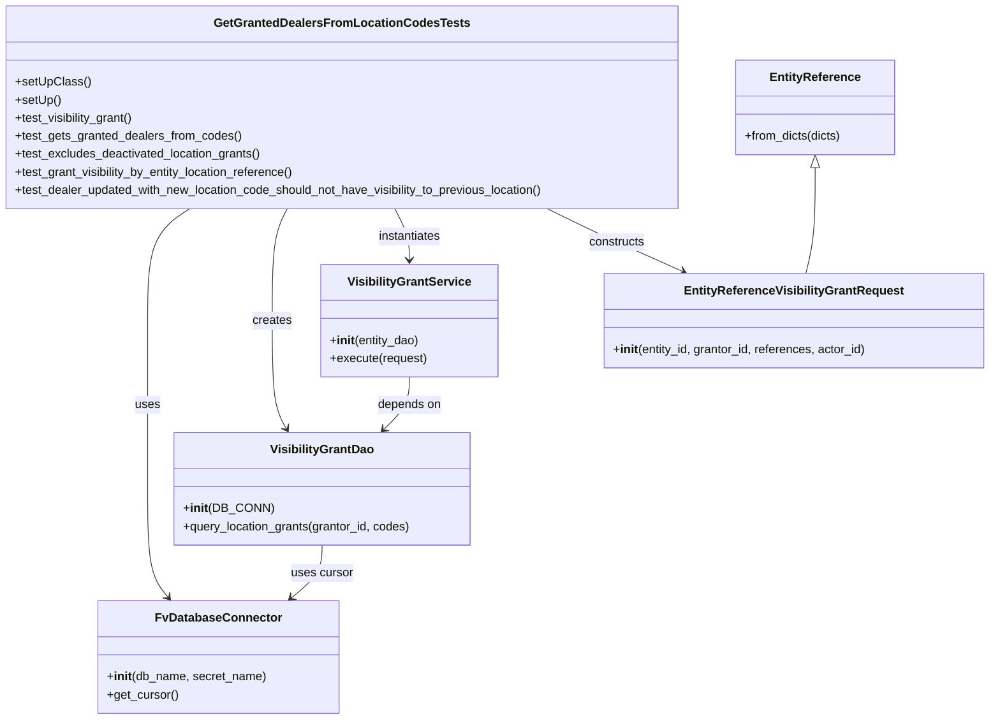
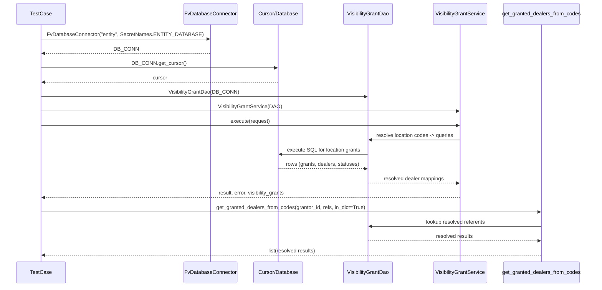

# Diagram: entity_core/entity_service/entity_service_tests/update_entity_tests/test_reference_based_visibility_grants.py


> Auto-generated by Obscura crawlers

## Diagram 1



### SVG

<svg id="container" width="1318.205078125" xmlns="http://www.w3.org/2000/svg" class="classDiagram" height="958" viewBox="0 0 1318.205078125 958" role="graphics-document document" aria-roledescription="class"><style>#container{font-family:"trebuchet ms",verdana,arial,sans-serif;font-size:16px;fill:#333;}@keyframes edge-animation-frame{from{stroke-dashoffset:0;}}@keyframes dash{to{stroke-dashoffset:0;}}#container .edge-animation-slow{stroke-dasharray:9,5!important;stroke-dashoffset:900;animation:dash 50s linear infinite;stroke-linecap:round;}#container .edge-animation-fast{stroke-dasharray:9,5!important;stroke-dashoffset:900;animation:dash 20s linear infinite;stroke-linecap:round;}#container .error-icon{fill:#552222;}#container .error-text{fill:#552222;stroke:#552222;}#container .edge-thickness-normal{stroke-width:1px;}#container .edge-thickness-thick{stroke-width:3.5px;}#container .edge-pattern-solid{stroke-dasharray:0;}#container .edge-thickness-invisible{stroke-width:0;fill:none;}#container .edge-pattern-dashed{stroke-dasharray:3;}#container .edge-pattern-dotted{stroke-dasharray:2;}#container .marker{fill:#333333;stroke:#333333;}#container .marker.cross{stroke:#333333;}#container svg{font-family:"trebuchet ms",verdana,arial,sans-serif;font-size:16px;}#container p{margin:0;}#container g.classGroup text{fill:#9370DB;stroke:none;font-family:"trebuchet ms",verdana,arial,sans-serif;font-size:10px;}#container g.classGroup text .title{font-weight:bolder;}#container .nodeLabel,#container .edgeLabel{color:#131300;}#container .edgeLabel .label rect{fill:#ECECFF;}#container .label text{fill:#131300;}#container .labelBkg{background:#ECECFF;}#container .edgeLabel .label span{background:#ECECFF;}#container .classTitle{font-weight:bolder;}#container .node rect,#container .node circle,#container .node ellipse,#container .node polygon,#container .node path{fill:#ECECFF;stroke:#9370DB;stroke-width:1px;}#container .divider{stroke:#9370DB;stroke-width:1;}#container g.clickable{cursor:pointer;}#container g.classGroup rect{fill:#ECECFF;stroke:#9370DB;}#container g.classGroup line{stroke:#9370DB;stroke-width:1;}#container .classLabel .box{stroke:none;stroke-width:0;fill:#ECECFF;opacity:0.5;}#container .classLabel .label{fill:#9370DB;font-size:10px;}#container .relation{stroke:#333333;stroke-width:1;fill:none;}#container .dashed-line{stroke-dasharray:3;}#container .dotted-line{stroke-dasharray:1 2;}#container #compositionStart,#container .composition{fill:#333333!important;stroke:#333333!important;stroke-width:1;}#container #compositionEnd,#container .composition{fill:#333333!important;stroke:#333333!important;stroke-width:1;}#container #dependencyStart,#container .dependency{fill:#333333!important;stroke:#333333!important;stroke-width:1;}#container #dependencyStart,#container .dependency{fill:#333333!important;stroke:#333333!important;stroke-width:1;}#container #extensionStart,#container .extension{fill:transparent!important;stroke:#333333!important;stroke-width:1;}#container #extensionEnd,#container .extension{fill:transparent!important;stroke:#333333!important;stroke-width:1;}#container #aggregationStart,#container .aggregation{fill:transparent!important;stroke:#333333!important;stroke-width:1;}#container #aggregationEnd,#container .aggregation{fill:transparent!important;stroke:#333333!important;stroke-width:1;}#container #lollipopStart,#container .lollipop{fill:#ECECFF!important;stroke:#333333!important;stroke-width:1;}#container #lollipopEnd,#container .lollipop{fill:#ECECFF!important;stroke:#333333!important;stroke-width:1;}#container .edgeTerminals{font-size:11px;line-height:initial;}#container .classTitleText{text-anchor:middle;font-size:18px;fill:#333;}#container .label-icon{display:inline-block;height:1em;overflow:visible;vertical-align:-0.125em;}#container .node .label-icon path{fill:currentColor;stroke:revert;stroke-width:revert;}#container :root{--mermaid-font-family:"trebuchet ms",verdana,arial,sans-serif;}</style><g><defs><marker id="container_class-aggregationStart" class="marker aggregation class" refX="18" refY="7" markerWidth="190" markerHeight="240" orient="auto"><path d="M 18,7 L9,13 L1,7 L9,1 Z"></path></marker></defs><defs><marker id="container_class-aggregationEnd" class="marker aggregation class" refX="1" refY="7" markerWidth="20" markerHeight="28" orient="auto"><path d="M 18,7 L9,13 L1,7 L9,1 Z"></path></marker></defs><defs><marker id="container_class-extensionStart" class="marker extension class" refX="18" refY="7" markerWidth="190" markerHeight="240" orient="auto"><path d="M 1,7 L18,13 V 1 Z"></path></marker></defs><defs><marker id="container_class-extensionEnd" class="marker extension class" refX="1" refY="7" markerWidth="20" markerHeight="28" orient="auto"><path d="M 1,1 V 13 L18,7 Z"></path></marker></defs><defs><marker id="container_class-compositionStart" class="marker composition class" refX="18" refY="7" markerWidth="190" markerHeight="240" orient="auto"><path d="M 18,7 L9,13 L1,7 L9,1 Z"></path></marker></defs><defs><marker id="container_class-compositionEnd" class="marker composition class" refX="1" refY="7" markerWidth="20" markerHeight="28" orient="auto"><path d="M 18,7 L9,13 L1,7 L9,1 Z"></path></marker></defs><defs><marker id="container_class-dependencyStart" class="marker dependency class" refX="6" refY="7" markerWidth="190" markerHeight="240" orient="auto"><path d="M 5,7 L9,13 L1,7 L9,1 Z"></path></marker></defs><defs><marker id="container_class-dependencyEnd" class="marker dependency class" refX="13" refY="7" markerWidth="20" markerHeight="28" orient="auto"><path d="M 18,7 L9,13 L14,7 L9,1 Z"></path></marker></defs><defs><marker id="container_class-lollipopStart" class="marker lollipop class" refX="13" refY="7" markerWidth="190" markerHeight="240" orient="auto"><circle stroke="black" fill="transparent" cx="7" cy="7" r="6"></circle></marker></defs><defs><marker id="container_class-lollipopEnd" class="marker lollipop class" refX="1" refY="7" markerWidth="190" markerHeight="240" orient="auto"><circle stroke="black" fill="transparent" cx="7" cy="7" r="6"></circle></marker></defs><g class="root"><g class="clusters"></g><g class="edgePaths"><path d="M257.243,278L248.065,284.167C238.887,290.333,220.53,302.667,211.352,327.5C202.174,352.333,202.174,389.667,202.174,427C202.174,464.333,202.174,501.667,202.174,539C202.174,576.333,202.174,613.667,202.174,651C202.174,688.333,202.174,725.667,206.465,749.718C210.757,773.769,219.34,784.539,223.632,789.923L227.923,795.308" id="id_GetGrantedDealersFromLocationCodesTests_FvDatabaseConnector_1" class="edge-thickness-normal edge-pattern-solid relation" style=";;;" data-edge="true" data-et="edge" data-id="id_GetGrantedDealersFromLocationCodesTests_FvDatabaseConnector_1" data-points="W3sieCI6MjU3LjI0MzE3NTQxNzg3Nzg2LCJ5IjoyNzh9LHsieCI6MjAyLjE3MzgyODEyNSwieSI6MzE1fSx7IngiOjIwMi4xNzM4MjgxMjUsInkiOjQyN30seyJ4IjoyMDIuMTczODI4MTI1LCJ5Ijo1Mzl9LHsieCI6MjAyLjE3MzgyODEyNSwieSI6NjUxfSx7IngiOjIwMi4xNzM4MjgxMjUsInkiOjc2M30seyJ4IjoyMzEuNjYyNzE5NzI2NTYyNSwieSI6ODAwfV0=" marker-end="url(#container_class-dependencyEnd)"></path><path d="M384.966,278L381.622,284.167C378.278,290.333,371.59,302.667,368.246,327.5C364.902,352.333,364.902,389.667,364.902,427C364.902,464.333,364.902,501.667,368.226,525.652C371.549,549.637,378.196,560.274,381.519,565.593L384.842,570.912" id="id_GetGrantedDealersFromLocationCodesTests_VisibilityGrantDao_2" class="edge-thickness-normal edge-pattern-solid relation" style=";;;" data-edge="true" data-et="edge" data-id="id_GetGrantedDealersFromLocationCodesTests_VisibilityGrantDao_2" data-points="W3sieCI6Mzg0Ljk2NjEzODI2MzA4MTQsInkiOjI3OH0seyJ4IjozNjQuOTAyMzQzNzUsInkiOjMxNX0seyJ4IjozNjQuOTAyMzQzNzUsInkiOjQyN30seyJ4IjozNjQuOTAyMzQzNzUsInkiOjUzOX0seyJ4IjozODguMDIxNTM2NjkwODQ4MiwieSI6NTc2fV0=" marker-end="url(#container_class-dependencyEnd)"></path><path d="M527.743,278L530.921,284.167C534.099,290.333,540.455,302.667,543.633,314C546.811,325.333,546.811,335.667,546.811,340.833L546.811,346" id="id_GetGrantedDealersFromLocationCodesTests_VisibilityGrantService_3" class="edge-thickness-normal edge-pattern-solid relation" style=";;;" data-edge="true" data-et="edge" data-id="id_GetGrantedDealersFromLocationCodesTests_VisibilityGrantService_3" data-points="W3sieCI6NTI3Ljc0MjkyNTU5OTU2MzksInkiOjI3OH0seyJ4Ijo1NDYuODEwNTQ2ODc1LCJ5IjozMTV9LHsieCI6NTQ2LjgxMDU0Njg3NSwieSI6MzUyfV0=" marker-end="url(#container_class-dependencyEnd)"></path><path d="M731.173,278L743.644,284.167C756.114,290.333,781.055,302.667,811.038,316.595C841.02,330.523,876.044,346.046,893.556,353.807L911.067,361.569" id="id_GetGrantedDealersFromLocationCodesTests_EntityReferenceVisibilityGrantRequest_4" class="edge-thickness-normal edge-pattern-solid relation" style=";;;" data-edge="true" data-et="edge" data-id="id_GetGrantedDealersFromLocationCodesTests_EntityReferenceVisibilityGrantRequest_4" data-points="W3sieCI6NzMxLjE3MzQ0MjA0MjE1MTIsInkiOjI3OH0seyJ4Ijo4MDUuOTk2MDkzNzUsInkiOjMxNX0seyJ4Ijo5MTYuNTUyODU2NDQ1MzEyNSwieSI6MzY0fV0=" marker-end="url(#container_class-dependencyEnd)"></path><path d="M546.811,502L546.811,508.167C546.811,514.333,546.811,526.667,541.355,538.293C535.899,549.919,524.988,560.837,519.532,566.297L514.076,571.756" id="id_VisibilityGrantService_VisibilityGrantDao_5" class="edge-thickness-normal edge-pattern-solid relation" style=";;;" data-edge="true" data-et="edge" data-id="id_VisibilityGrantService_VisibilityGrantDao_5" data-points="W3sieCI6NTQ2LjgxMDU0Njg3NSwieSI6NTAyfSx7IngiOjU0Ni44MTA1NDY4NzUsInkiOjUzOX0seyJ4Ijo1MDkuODM1MDY1NTY5MTk2NDQsInkiOjU3Nn1d" marker-end="url(#container_class-dependencyEnd)"></path><path d="M434.885,726L434.885,732.167C434.885,738.333,434.885,750.667,427.775,762.385C420.665,774.103,406.445,785.205,399.335,790.756L392.225,796.308" id="id_VisibilityGrantDao_FvDatabaseConnector_6" class="edge-thickness-normal edge-pattern-solid relation" style=";;;" data-edge="true" data-et="edge" data-id="id_VisibilityGrantDao_FvDatabaseConnector_6" data-points="W3sieCI6NDM0Ljg4NDc2NTYyNSwieSI6NzI2fSx7IngiOjQzNC44ODQ3NjU2MjUsInkiOjc2M30seyJ4IjozODcuNDk1OTM2ODAyNDU1NCwieSI6ODAwfV0=" marker-end="url(#container_class-dependencyEnd)"></path><path d="M1087.619,223.25L1087.619,238.542C1087.619,253.833,1087.619,284.417,1085.51,307.875C1083.401,331.333,1079.184,347.667,1077.075,355.833L1074.966,364" id="id_EntityReference_EntityReferenceVisibilityGrantRequest_7" class="edge-thickness-normal edge-pattern-solid relation" style=";;;" data-edge="true" data-et="edge" data-id="id_EntityReference_EntityReferenceVisibilityGrantRequest_7" data-points="W3sieCI6MTA4Ny42MTkxNDA2MjUsInkiOjIwNn0seyJ4IjoxMDg3LjYxOTE0MDYyNSwieSI6MzE1fSx7IngiOjEwNzQuOTY1ODIwMzEyNSwieSI6MzY0fV0=" marker-start="url(#container_class-extensionStart)"></path></g><g class="edgeLabels"><g class="edgeLabel" transform="translate(202.173828125, 539)"><g class="label" data-id="id_GetGrantedDealersFromLocationCodesTests_FvDatabaseConnector_1" transform="translate(-16.4921875, -12)"><foreignObject width="32.984375" height="24"><div xmlns="http://www.w3.org/1999/xhtml" class="labelBkg" style="display: table-cell; white-space: nowrap; line-height: 1.5; max-width: 200px; text-align: center;"><span class="edgeLabel"><p>uses</p></span></div></foreignObject></g></g><g class="edgeLabel" transform="translate(364.90234375, 427)"><g class="label" data-id="id_GetGrantedDealersFromLocationCodesTests_VisibilityGrantDao_2" transform="translate(-26.171875, -12)"><foreignObject width="52.34375" height="24"><div xmlns="http://www.w3.org/1999/xhtml" class="labelBkg" style="display: table-cell; white-space: nowrap; line-height: 1.5; max-width: 200px; text-align: center;"><span class="edgeLabel"><p>creates</p></span></div></foreignObject></g></g><g class="edgeLabel" transform="translate(546.810546875, 315)"><g class="label" data-id="id_GetGrantedDealersFromLocationCodesTests_VisibilityGrantService_3" transform="translate(-42.9140625, -12)"><foreignObject width="85.828125" height="24"><div xmlns="http://www.w3.org/1999/xhtml" class="labelBkg" style="display: table-cell; white-space: nowrap; line-height: 1.5; max-width: 200px; text-align: center;"><span class="edgeLabel"><p>instantiates</p></span></div></foreignObject></g></g><g class="edgeLabel" transform="translate(823.11859, 322.58888)"><g class="label" data-id="id_GetGrantedDealersFromLocationCodesTests_EntityReferenceVisibilityGrantRequest_4" transform="translate(-37.84375, -12)"><foreignObject width="75.6875" height="24"><div xmlns="http://www.w3.org/1999/xhtml" class="labelBkg" style="display: table-cell; white-space: nowrap; line-height: 1.5; max-width: 200px; text-align: center;"><span class="edgeLabel"><p>constructs</p></span></div></foreignObject></g></g><g class="edgeLabel" transform="translate(546.810546875, 539)"><g class="label" data-id="id_VisibilityGrantService_VisibilityGrantDao_5" transform="translate(-42.9453125, -12)"><foreignObject width="85.890625" height="24"><div xmlns="http://www.w3.org/1999/xhtml" class="labelBkg" style="display: table-cell; white-space: nowrap; line-height: 1.5; max-width: 200px; text-align: center;"><span class="edgeLabel"><p>depends on</p></span></div></foreignObject></g></g><g class="edgeLabel" transform="translate(434.884765625, 763)"><g class="label" data-id="id_VisibilityGrantDao_FvDatabaseConnector_6" transform="translate(-41.4765625, -12)"><foreignObject width="82.953125" height="24"><div xmlns="http://www.w3.org/1999/xhtml" class="labelBkg" style="display: table-cell; white-space: nowrap; line-height: 1.5; max-width: 200px; text-align: center;"><span class="edgeLabel"><p>uses cursor</p></span></div></foreignObject></g></g><g class="edgeLabel"><g class="label" data-id="id_EntityReference_EntityReferenceVisibilityGrantRequest_7" transform="translate(0, 0)"><foreignObject width="0" height="0"><div xmlns="http://www.w3.org/1999/xhtml" class="labelBkg" style="display: table-cell; white-space: nowrap; line-height: 1.5; max-width: 200px; text-align: center;"><span class="edgeLabel"></span></div></foreignObject></g></g></g><g class="nodes"><g class="node default" id="classId-GetGrantedDealersFromLocationCodesTests-0" transform="translate(458.171875, 143)"><g class="basic label-container"><path d="M-450.171875 -135 L450.171875 -135 L450.171875 135 L-450.171875 135" stroke="none" stroke-width="0" fill="#ECECFF" style=""></path><path d="M-450.171875 -135 C-263.3934283621745 -135, -76.61498172434898 -135, 450.171875 -135 M-450.171875 -135 C-101.34409697445835 -135, 247.4836810510833 -135, 450.171875 -135 M450.171875 -135 C450.171875 -38.96919252433169, 450.171875 57.06161495133662, 450.171875 135 M450.171875 -135 C450.171875 -68.73254184373404, 450.171875 -2.4650836874680806, 450.171875 135 M450.171875 135 C104.14437417474522 135, -241.88312665050955 135, -450.171875 135 M450.171875 135 C191.19695477141204 135, -67.77796545717592 135, -450.171875 135 M-450.171875 135 C-450.171875 46.013052766465975, -450.171875 -42.97389446706805, -450.171875 -135 M-450.171875 135 C-450.171875 67.88785964747493, -450.171875 0.7757192949498517, -450.171875 -135" stroke="#9370DB" stroke-width="1.3" fill="none" stroke-dasharray="0 0" style=""></path></g><g class="annotation-group text" transform="translate(0, -111)"></g><g class="label-group text" transform="translate(-160.15625, -111)"><g class="label" style="font-weight: bolder" transform="translate(0,-12)"><foreignObject width="320.3125" height="24"><div xmlns="http://www.w3.org/1999/xhtml" style="display: table-cell; white-space: nowrap; line-height: 1.5; max-width: 365px; text-align: center;"><span class="nodeLabel markdown-node-label" style=""><p>GetGrantedDealersFromLocationCodesTests</p></span></div></foreignObject></g></g><g class="members-group text" transform="translate(-438.171875, -63)"></g><g class="methods-group text" transform="translate(-438.171875, -33)"><g class="label" style="" transform="translate(0,-12)"><foreignObject width="97.15625" height="24"><div xmlns="http://www.w3.org/1999/xhtml" style="display: table-cell; white-space: nowrap; line-height: 1.5; max-width: 155px; text-align: center;"><span class="nodeLabel markdown-node-label" style=""><p>+setUpClass()</p></span></div></foreignObject></g><g class="label" style="" transform="translate(0,12)"><foreignObject width="60.421875" height="24"><div xmlns="http://www.w3.org/1999/xhtml" style="display: table-cell; white-space: nowrap; line-height: 1.5; max-width: 118px; text-align: center;"><span class="nodeLabel markdown-node-label" style=""><p>+setUp()</p></span></div></foreignObject></g><g class="label" style="" transform="translate(0,36)"><foreignObject width="160.546875" height="24"><div xmlns="http://www.w3.org/1999/xhtml" style="display: table-cell; white-space: nowrap; line-height: 1.5; max-width: 218px; text-align: center;"><span class="nodeLabel markdown-node-label" style=""><p>+test_visibility_grant()</p></span></div></foreignObject></g><g class="label" style="" transform="translate(0,60)"><foreignObject width="301.890625" height="24"><div xmlns="http://www.w3.org/1999/xhtml" style="display: table-cell; white-space: nowrap; line-height: 1.5; max-width: 359px; text-align: center;"><span class="nodeLabel markdown-node-label" style=""><p>+test_gets_granted_dealers_from_codes()</p></span></div></foreignObject></g><g class="label" style="" transform="translate(0,84)"><foreignObject width="331.015625" height="24"><div xmlns="http://www.w3.org/1999/xhtml" style="display: table-cell; white-space: nowrap; line-height: 1.5; max-width: 388px; text-align: center;"><span class="nodeLabel markdown-node-label" style=""><p>+test_excludes_deactivated_location_grants()</p></span></div></foreignObject></g><g class="label" style="" transform="translate(0,108)"><foreignObject width="378.984375" height="24"><div xmlns="http://www.w3.org/1999/xhtml" style="display: table-cell; white-space: nowrap; line-height: 1.5; max-width: 436px; text-align: center;"><span class="nodeLabel markdown-node-label" style=""><p>+test_grant_visibility_by_entity_location_reference()</p></span></div></foreignObject></g><g class="label" style="" transform="translate(0,132)"><foreignObject width="716.1875" height="24"><div xmlns="http://www.w3.org/1999/xhtml" style="display: table-cell; white-space: nowrap; line-height: 1.5; max-width: 774px; text-align: center;"><span class="nodeLabel markdown-node-label" style=""><p>+test_dealer_updated_with_new_location_code_should_not_have_visibility_to_previous_location()</p></span></div></foreignObject></g></g><g class="divider" style=""><path d="M-450.171875 -87 C-101.48776145946135 -87, 247.1963520810773 -87, 450.171875 -87 M-450.171875 -87 C-117.20501808773736 -87, 215.76183882452528 -87, 450.171875 -87" stroke="#9370DB" stroke-width="1.3" fill="none" stroke-dasharray="0 0" style=""></path></g><g class="divider" style=""><path d="M-450.171875 -63 C-106.66658160219691 -63, 236.83871179560617 -63, 450.171875 -63 M-450.171875 -63 C-161.86336443237838 -63, 126.44514613524325 -63, 450.171875 -63" stroke="#9370DB" stroke-width="1.3" fill="none" stroke-dasharray="0 0" style=""></path></g></g><g class="node default" id="classId-VisibilityGrantDao-1" transform="translate(434.884765625, 651)"><g class="basic label-container"><path d="M-197.7109375 -75 L197.7109375 -75 L197.7109375 75 L-197.7109375 75" stroke="none" stroke-width="0" fill="#ECECFF" style=""></path><path d="M-197.7109375 -75 C-40.58249900590269 -75, 116.54593948819462 -75, 197.7109375 -75 M-197.7109375 -75 C-113.43668393192013 -75, -29.162430363840258 -75, 197.7109375 -75 M197.7109375 -75 C197.7109375 -37.94376400225934, 197.7109375 -0.8875280045186855, 197.7109375 75 M197.7109375 -75 C197.7109375 -43.93356453023243, 197.7109375 -12.867129060464855, 197.7109375 75 M197.7109375 75 C76.5268839001706 75, -44.657169699658795 75, -197.7109375 75 M197.7109375 75 C77.9371168424997 75, -41.83670381500059 75, -197.7109375 75 M-197.7109375 75 C-197.7109375 39.758203091693204, -197.7109375 4.516406183386408, -197.7109375 -75 M-197.7109375 75 C-197.7109375 40.928653241375656, -197.7109375 6.857306482751312, -197.7109375 -75" stroke="#9370DB" stroke-width="1.3" fill="none" stroke-dasharray="0 0" style=""></path></g><g class="annotation-group text" transform="translate(0, -51)"></g><g class="label-group text" transform="translate(-66.15625, -51)"><g class="label" style="font-weight: bolder" transform="translate(0,-12)"><foreignObject width="132.3125" height="24"><div xmlns="http://www.w3.org/1999/xhtml" style="display: table-cell; white-space: nowrap; line-height: 1.5; max-width: 180px; text-align: center;"><span class="nodeLabel markdown-node-label" style=""><p>VisibilityGrantDao</p></span></div></foreignObject></g></g><g class="members-group text" transform="translate(-185.7109375, -3)"></g><g class="methods-group text" transform="translate(-185.7109375, 27)"><g class="label" style="" transform="translate(0,-12)"><foreignObject width="111.765625" height="24"><div xmlns="http://www.w3.org/1999/xhtml" style="display: table-cell; white-space: nowrap; line-height: 1.5; max-width: 201px; text-align: center;"><span class="nodeLabel markdown-node-label" style=""><p>+<strong>init</strong>(DB_CONN)</p></span></div></foreignObject></g><g class="label" style="" transform="translate(0,12)"><foreignObject width="305.265625" height="24"><div xmlns="http://www.w3.org/1999/xhtml" style="display: table-cell; white-space: nowrap; line-height: 1.5; max-width: 363px; text-align: center;"><span class="nodeLabel markdown-node-label" style=""><p>+query_location_grants(grantor_id, codes)</p></span></div></foreignObject></g></g><g class="divider" style=""><path d="M-197.7109375 -27 C-53.901630130525405 -27, 89.90767723894919 -27, 197.7109375 -27 M-197.7109375 -27 C-44.93045751223627 -27, 107.85002247552745 -27, 197.7109375 -27" stroke="#9370DB" stroke-width="1.3" fill="none" stroke-dasharray="0 0" style=""></path></g><g class="divider" style=""><path d="M-197.7109375 -3 C-47.55974988231594 -3, 102.59143773536812 -3, 197.7109375 -3 M-197.7109375 -3 C-80.76384223381444 -3, 36.18325303237111 -3, 197.7109375 -3" stroke="#9370DB" stroke-width="1.3" fill="none" stroke-dasharray="0 0" style=""></path></g></g><g class="node default" id="classId-VisibilityGrantService-2" transform="translate(546.810546875, 427)"><g class="basic label-container"><path d="M-116.10546875 -75 L116.10546875 -75 L116.10546875 75 L-116.10546875 75" stroke="none" stroke-width="0" fill="#ECECFF" style=""></path><path d="M-116.10546875 -75 C-31.841139068379533 -75, 52.42319061324093 -75, 116.10546875 -75 M-116.10546875 -75 C-69.3797963174328 -75, -22.654123884865626 -75, 116.10546875 -75 M116.10546875 -75 C116.10546875 -27.828896175516014, 116.10546875 19.34220764896797, 116.10546875 75 M116.10546875 -75 C116.10546875 -26.57464614845796, 116.10546875 21.850707703084083, 116.10546875 75 M116.10546875 75 C52.21405383159597 75, -11.677361086808062 75, -116.10546875 75 M116.10546875 75 C66.26411655135774 75, 16.422764352715504 75, -116.10546875 75 M-116.10546875 75 C-116.10546875 15.703062286629347, -116.10546875 -43.593875426741306, -116.10546875 -75 M-116.10546875 75 C-116.10546875 31.709596106475978, -116.10546875 -11.580807787048045, -116.10546875 -75" stroke="#9370DB" stroke-width="1.3" fill="none" stroke-dasharray="0 0" style=""></path></g><g class="annotation-group text" transform="translate(0, -51)"></g><g class="label-group text" transform="translate(-78.6171875, -51)"><g class="label" style="font-weight: bolder" transform="translate(0,-12)"><foreignObject width="157.234375" height="24"><div xmlns="http://www.w3.org/1999/xhtml" style="display: table-cell; white-space: nowrap; line-height: 1.5; max-width: 204px; text-align: center;"><span class="nodeLabel markdown-node-label" style=""><p>VisibilityGrantService</p></span></div></foreignObject></g></g><g class="members-group text" transform="translate(-104.10546875, -3)"></g><g class="methods-group text" transform="translate(-104.10546875, 27)"><g class="label" style="" transform="translate(0,-12)"><foreignObject width="119.890625" height="24"><div xmlns="http://www.w3.org/1999/xhtml" style="display: table-cell; white-space: nowrap; line-height: 1.5; max-width: 209px; text-align: center;"><span class="nodeLabel markdown-node-label" style=""><p>+<strong>init</strong>(entity_dao)</p></span></div></foreignObject></g><g class="label" style="" transform="translate(0,12)"><foreignObject width="129.59375" height="24"><div xmlns="http://www.w3.org/1999/xhtml" style="display: table-cell; white-space: nowrap; line-height: 1.5; max-width: 187px; text-align: center;"><span class="nodeLabel markdown-node-label" style=""><p>+execute(request)</p></span></div></foreignObject></g></g><g class="divider" style=""><path d="M-116.10546875 -27 C-52.356980683099714 -27, 11.391507383800572 -27, 116.10546875 -27 M-116.10546875 -27 C-64.96741907857127 -27, -13.829369407142536 -27, 116.10546875 -27" stroke="#9370DB" stroke-width="1.3" fill="none" stroke-dasharray="0 0" style=""></path></g><g class="divider" style=""><path d="M-116.10546875 -3 C-65.08307100079656 -3, -14.06067325159313 -3, 116.10546875 -3 M-116.10546875 -3 C-68.63367470908864 -3, -21.16188066817726 -3, 116.10546875 -3" stroke="#9370DB" stroke-width="1.3" fill="none" stroke-dasharray="0 0" style=""></path></g></g><g class="node default" id="classId-EntityReferenceVisibilityGrantRequest-3" transform="translate(1058.697265625, 427)"><g class="basic label-container"><path d="M-251.5078125 -63 L251.5078125 -63 L251.5078125 63 L-251.5078125 63" stroke="none" stroke-width="0" fill="#ECECFF" style=""></path><path d="M-251.5078125 -63 C-106.61384895260562 -63, 38.280114594788756 -63, 251.5078125 -63 M-251.5078125 -63 C-60.234833309318304 -63, 131.0381458813634 -63, 251.5078125 -63 M251.5078125 -63 C251.5078125 -35.89109118239678, 251.5078125 -8.782182364793549, 251.5078125 63 M251.5078125 -63 C251.5078125 -20.776941201310983, 251.5078125 21.446117597378034, 251.5078125 63 M251.5078125 63 C145.49026536612564 63, 39.47271823225128 63, -251.5078125 63 M251.5078125 63 C134.4550402399547 63, 17.402267979909453 63, -251.5078125 63 M-251.5078125 63 C-251.5078125 31.61915806459174, -251.5078125 0.238316129183481, -251.5078125 -63 M-251.5078125 63 C-251.5078125 37.63924173558182, -251.5078125 12.278483471163646, -251.5078125 -63" stroke="#9370DB" stroke-width="1.3" fill="none" stroke-dasharray="0 0" style=""></path></g><g class="annotation-group text" transform="translate(0, -39)"></g><g class="label-group text" transform="translate(-139.734375, -39)"><g class="label" style="font-weight: bolder" transform="translate(0,-12)"><foreignObject width="279.46875" height="24"><div xmlns="http://www.w3.org/1999/xhtml" style="display: table-cell; white-space: nowrap; line-height: 1.5; max-width: 325px; text-align: center;"><span class="nodeLabel markdown-node-label" style=""><p>EntityReferenceVisibilityGrantRequest</p></span></div></foreignObject></g></g><g class="members-group text" transform="translate(-239.5078125, 9)"></g><g class="methods-group text" transform="translate(-239.5078125, 39)"><g class="label" style="" transform="translate(0,-12)"><foreignObject width="339.28125" height="24"><div xmlns="http://www.w3.org/1999/xhtml" style="display: table-cell; white-space: nowrap; line-height: 1.5; max-width: 428px; text-align: center;"><span class="nodeLabel markdown-node-label" style=""><p>+<strong>init</strong>(entity_id, grantor_id, references, actor_id)</p></span></div></foreignObject></g></g><g class="divider" style=""><path d="M-251.5078125 -15 C-76.14667763610811 -15, 99.21445722778378 -15, 251.5078125 -15 M-251.5078125 -15 C-75.63430904324193 -15, 100.23919441351615 -15, 251.5078125 -15" stroke="#9370DB" stroke-width="1.3" fill="none" stroke-dasharray="0 0" style=""></path></g><g class="divider" style=""><path d="M-251.5078125 9 C-82.92133288538548 9, 85.66514672922904 9, 251.5078125 9 M-251.5078125 9 C-56.92502507248224 9, 137.65776235503552 9, 251.5078125 9" stroke="#9370DB" stroke-width="1.3" fill="none" stroke-dasharray="0 0" style=""></path></g></g><g class="node default" id="classId-EntityReference-4" transform="translate(1087.619140625, 143)"><g class="basic label-container"><path d="M-105.98828125 -63 L105.98828125 -63 L105.98828125 63 L-105.98828125 63" stroke="none" stroke-width="0" fill="#ECECFF" style=""></path><path d="M-105.98828125 -63 C-59.90091443231691 -63, -13.81354761463382 -63, 105.98828125 -63 M-105.98828125 -63 C-37.74099196093303 -63, 30.50629732813394 -63, 105.98828125 -63 M105.98828125 -63 C105.98828125 -26.804726608192297, 105.98828125 9.390546783615406, 105.98828125 63 M105.98828125 -63 C105.98828125 -34.56238651471284, 105.98828125 -6.12477302942569, 105.98828125 63 M105.98828125 63 C35.114159533916094 63, -35.75996218216781 63, -105.98828125 63 M105.98828125 63 C36.02736025515904 63, -33.93356073968192 63, -105.98828125 63 M-105.98828125 63 C-105.98828125 27.471501821981427, -105.98828125 -8.056996356037146, -105.98828125 -63 M-105.98828125 63 C-105.98828125 17.16762441144595, -105.98828125 -28.6647511771081, -105.98828125 -63" stroke="#9370DB" stroke-width="1.3" fill="none" stroke-dasharray="0 0" style=""></path></g><g class="annotation-group text" transform="translate(0, -39)"></g><g class="label-group text" transform="translate(-57.7890625, -39)"><g class="label" style="font-weight: bolder" transform="translate(0,-12)"><foreignObject width="115.578125" height="24"><div xmlns="http://www.w3.org/1999/xhtml" style="display: table-cell; white-space: nowrap; line-height: 1.5; max-width: 164px; text-align: center;"><span class="nodeLabel markdown-node-label" style=""><p>EntityReference</p></span></div></foreignObject></g></g><g class="members-group text" transform="translate(-93.98828125, 9)"></g><g class="methods-group text" transform="translate(-93.98828125, 39)"><g class="label" style="" transform="translate(0,-12)"><foreignObject width="130.1875" height="24"><div xmlns="http://www.w3.org/1999/xhtml" style="display: table-cell; white-space: nowrap; line-height: 1.5; max-width: 188px; text-align: center;"><span class="nodeLabel markdown-node-label" style=""><p>+from_dicts(dicts)</p></span></div></foreignObject></g></g><g class="divider" style=""><path d="M-105.98828125 -15 C-58.468924756901316 -15, -10.949568263802632 -15, 105.98828125 -15 M-105.98828125 -15 C-62.207746626977276 -15, -18.42721200395455 -15, 105.98828125 -15" stroke="#9370DB" stroke-width="1.3" fill="none" stroke-dasharray="0 0" style=""></path></g><g class="divider" style=""><path d="M-105.98828125 9 C-32.078823724045364 9, 41.83063380190927 9, 105.98828125 9 M-105.98828125 9 C-31.541838704146258 9, 42.904603841707484 9, 105.98828125 9" stroke="#9370DB" stroke-width="1.3" fill="none" stroke-dasharray="0 0" style=""></path></g></g><g class="node default" id="classId-FvDatabaseConnector-5" transform="translate(291.4375, 875)"><g class="basic label-container"><path d="M-157.23828125 -75 L157.23828125 -75 L157.23828125 75 L-157.23828125 75" stroke="none" stroke-width="0" fill="#ECECFF" style=""></path><path d="M-157.23828125 -75 C-78.67230926719407 -75, -0.1063372843881325 -75, 157.23828125 -75 M-157.23828125 -75 C-80.90573654625013 -75, -4.5731918425002505 -75, 157.23828125 -75 M157.23828125 -75 C157.23828125 -19.443292246466747, 157.23828125 36.113415507066506, 157.23828125 75 M157.23828125 -75 C157.23828125 -29.038272674225887, 157.23828125 16.923454651548226, 157.23828125 75 M157.23828125 75 C73.57659440395885 75, -10.0850924420823 75, -157.23828125 75 M157.23828125 75 C60.1411768569633 75, -36.9559275360734 75, -157.23828125 75 M-157.23828125 75 C-157.23828125 38.16505839989362, -157.23828125 1.330116799787234, -157.23828125 -75 M-157.23828125 75 C-157.23828125 22.354531560532173, -157.23828125 -30.290936878935653, -157.23828125 -75" stroke="#9370DB" stroke-width="1.3" fill="none" stroke-dasharray="0 0" style=""></path></g><g class="annotation-group text" transform="translate(0, -51)"></g><g class="label-group text" transform="translate(-79.3046875, -51)"><g class="label" style="font-weight: bolder" transform="translate(0,-12)"><foreignObject width="158.609375" height="24"><div xmlns="http://www.w3.org/1999/xhtml" style="display: table-cell; white-space: nowrap; line-height: 1.5; max-width: 207px; text-align: center;"><span class="nodeLabel markdown-node-label" style=""><p>FvDatabaseConnector</p></span></div></foreignObject></g></g><g class="members-group text" transform="translate(-145.23828125, -3)"></g><g class="methods-group text" transform="translate(-145.23828125, 27)"><g class="label" style="" transform="translate(0,-12)"><foreignObject width="211.171875" height="24"><div xmlns="http://www.w3.org/1999/xhtml" style="display: table-cell; white-space: nowrap; line-height: 1.5; max-width: 300px; text-align: center;"><span class="nodeLabel markdown-node-label" style=""><p>+<strong>init</strong>(db_name, secret_name)</p></span></div></foreignObject></g><g class="label" style="" transform="translate(0,12)"><foreignObject width="94.640625" height="24"><div xmlns="http://www.w3.org/1999/xhtml" style="display: table-cell; white-space: nowrap; line-height: 1.5; max-width: 152px; text-align: center;"><span class="nodeLabel markdown-node-label" style=""><p>+get_cursor()</p></span></div></foreignObject></g></g><g class="divider" style=""><path d="M-157.23828125 -27 C-51.13588542293748 -27, 54.966510404125046 -27, 157.23828125 -27 M-157.23828125 -27 C-63.287428444678724 -27, 30.66342436064255 -27, 157.23828125 -27" stroke="#9370DB" stroke-width="1.3" fill="none" stroke-dasharray="0 0" style=""></path></g><g class="divider" style=""><path d="M-157.23828125 -3 C-32.988754977649535 -3, 91.26077129470093 -3, 157.23828125 -3 M-157.23828125 -3 C-61.95074246988328 -3, 33.33679631023344 -3, 157.23828125 -3" stroke="#9370DB" stroke-width="1.3" fill="none" stroke-dasharray="0 0" style=""></path></g></g></g></g></g></svg>

## Diagram 2



### SVG

<svg id="container" width="1917.5" xmlns="http://www.w3.org/2000/svg" height="939" viewBox="-50 -10 1917.5 939" role="graphics-document document" aria-roledescription="sequence"><g><rect x="1556.5" y="853" fill="#eaeaea" stroke="#666" width="261" height="65" name="Util" rx="3" ry="3" class="actor actor-bottom"></rect><text x="1687" y="885.5" dominant-baseline="central" alignment-baseline="central" class="actor actor-box" style="text-anchor: middle; font-size: 16px; font-weight: 400;"><tspan x="1687" dy="0">get_granted_dealers_from_codes</tspan></text></g><g><rect x="1332.5" y="853" fill="#eaeaea" stroke="#666" width="174" height="65" name="Service" rx="3" ry="3" class="actor actor-bottom"></rect><text x="1419.5" y="885.5" dominant-baseline="central" alignment-baseline="central" class="actor actor-box" style="text-anchor: middle; font-size: 16px; font-weight: 400;"><tspan x="1419.5" dy="0">VisibilityGrantService</tspan></text></g><g><rect x="1034.5" y="853" fill="#eaeaea" stroke="#666" width="150" height="65" name="DAO" rx="3" ry="3" class="actor actor-bottom"></rect><text x="1109.5" y="885.5" dominant-baseline="central" alignment-baseline="central" class="actor actor-box" style="text-anchor: middle; font-size: 16px; font-weight: 400;"><tspan x="1109.5" dy="0">VisibilityGrantDao</tspan></text></g><g><rect x="738.5" y="853" fill="#eaeaea" stroke="#666" width="150" height="65" name="DB" rx="3" ry="3" class="actor actor-bottom"></rect><text x="813.5" y="885.5" dominant-baseline="central" alignment-baseline="central" class="actor actor-box" style="text-anchor: middle; font-size: 16px; font-weight: 400;"><tspan x="813.5" dy="0">Cursor/Database</tspan></text></g><g><rect x="511.5" y="853" fill="#eaeaea" stroke="#666" width="177" height="65" name="Connector" rx="3" ry="3" class="actor actor-bottom"></rect><text x="600" y="885.5" dominant-baseline="central" alignment-baseline="central" class="actor actor-box" style="text-anchor: middle; font-size: 16px; font-weight: 400;"><tspan x="600" dy="0">FvDatabaseConnector</tspan></text></g><g><rect x="0" y="853" fill="#eaeaea" stroke="#666" width="150" height="65" name="Test" rx="3" ry="3" class="actor actor-bottom"></rect><text x="75" y="885.5" dominant-baseline="central" alignment-baseline="central" class="actor actor-box" style="text-anchor: middle; font-size: 16px; font-weight: 400;"><tspan x="75" dy="0">TestCase</tspan></text></g><g><line id="actor5" x1="1687" y1="65" x2="1687" y2="853" class="actor-line 200" stroke-width="0.5px" stroke="#999" name="Util"></line><g id="root-5"><rect x="1556.5" y="0" fill="#eaeaea" stroke="#666" width="261" height="65" name="Util" rx="3" ry="3" class="actor actor-top"></rect><text x="1687" y="32.5" dominant-baseline="central" alignment-baseline="central" class="actor actor-box" style="text-anchor: middle; font-size: 16px; font-weight: 400;"><tspan x="1687" dy="0">get_granted_dealers_from_codes</tspan></text></g></g><g><line id="actor4" x1="1419.5" y1="65" x2="1419.5" y2="853" class="actor-line 200" stroke-width="0.5px" stroke="#999" name="Service"></line><g id="root-4"><rect x="1332.5" y="0" fill="#eaeaea" stroke="#666" width="174" height="65" name="Service" rx="3" ry="3" class="actor actor-top"></rect><text x="1419.5" y="32.5" dominant-baseline="central" alignment-baseline="central" class="actor actor-box" style="text-anchor: middle; font-size: 16px; font-weight: 400;"><tspan x="1419.5" dy="0">VisibilityGrantService</tspan></text></g></g><g><line id="actor3" x1="1109.5" y1="65" x2="1109.5" y2="853" class="actor-line 200" stroke-width="0.5px" stroke="#999" name="DAO"></line><g id="root-3"><rect x="1034.5" y="0" fill="#eaeaea" stroke="#666" width="150" height="65" name="DAO" rx="3" ry="3" class="actor actor-top"></rect><text x="1109.5" y="32.5" dominant-baseline="central" alignment-baseline="central" class="actor actor-box" style="text-anchor: middle; font-size: 16px; font-weight: 400;"><tspan x="1109.5" dy="0">VisibilityGrantDao</tspan></text></g></g><g><line id="actor2" x1="813.5" y1="65" x2="813.5" y2="853" class="actor-line 200" stroke-width="0.5px" stroke="#999" name="DB"></line><g id="root-2"><rect x="738.5" y="0" fill="#eaeaea" stroke="#666" width="150" height="65" name="DB" rx="3" ry="3" class="actor actor-top"></rect><text x="813.5" y="32.5" dominant-baseline="central" alignment-baseline="central" class="actor actor-box" style="text-anchor: middle; font-size: 16px; font-weight: 400;"><tspan x="813.5" dy="0">Cursor/Database</tspan></text></g></g><g><line id="actor1" x1="600" y1="65" x2="600" y2="853" class="actor-line 200" stroke-width="0.5px" stroke="#999" name="Connector"></line><g id="root-1"><rect x="511.5" y="0" fill="#eaeaea" stroke="#666" width="177" height="65" name="Connector" rx="3" ry="3" class="actor actor-top"></rect><text x="600" y="32.5" dominant-baseline="central" alignment-baseline="central" class="actor actor-box" style="text-anchor: middle; font-size: 16px; font-weight: 400;"><tspan x="600" dy="0">FvDatabaseConnector</tspan></text></g></g><g><line id="actor0" x1="75" y1="65" x2="75" y2="853" class="actor-line 200" stroke-width="0.5px" stroke="#999" name="Test"></line><g id="root-0"><rect x="0" y="0" fill="#eaeaea" stroke="#666" width="150" height="65" name="Test" rx="3" ry="3" class="actor actor-top"></rect><text x="75" y="32.5" dominant-baseline="central" alignment-baseline="central" class="actor actor-box" style="text-anchor: middle; font-size: 16px; font-weight: 400;"><tspan x="75" dy="0">TestCase</tspan></text></g></g><style>#container{font-family:"trebuchet ms",verdana,arial,sans-serif;font-size:16px;fill:#333;}@keyframes edge-animation-frame{from{stroke-dashoffset:0;}}@keyframes dash{to{stroke-dashoffset:0;}}#container .edge-animation-slow{stroke-dasharray:9,5!important;stroke-dashoffset:900;animation:dash 50s linear infinite;stroke-linecap:round;}#container .edge-animation-fast{stroke-dasharray:9,5!important;stroke-dashoffset:900;animation:dash 20s linear infinite;stroke-linecap:round;}#container .error-icon{fill:#552222;}#container .error-text{fill:#552222;stroke:#552222;}#container .edge-thickness-normal{stroke-width:1px;}#container .edge-thickness-thick{stroke-width:3.5px;}#container .edge-pattern-solid{stroke-dasharray:0;}#container .edge-thickness-invisible{stroke-width:0;fill:none;}#container .edge-pattern-dashed{stroke-dasharray:3;}#container .edge-pattern-dotted{stroke-dasharray:2;}#container .marker{fill:#333333;stroke:#333333;}#container .marker.cross{stroke:#333333;}#container svg{font-family:"trebuchet ms",verdana,arial,sans-serif;font-size:16px;}#container p{margin:0;}#container .actor{stroke:hsl(259.6261682243, 59.7765363128%, 87.9019607843%);fill:#ECECFF;}#container text.actor&gt;tspan{fill:black;stroke:none;}#container .actor-line{stroke:hsl(259.6261682243, 59.7765363128%, 87.9019607843%);}#container .innerArc{stroke-width:1.5;stroke-dasharray:none;}#container .messageLine0{stroke-width:1.5;stroke-dasharray:none;stroke:#333;}#container .messageLine1{stroke-width:1.5;stroke-dasharray:2,2;stroke:#333;}#container #arrowhead path{fill:#333;stroke:#333;}#container .sequenceNumber{fill:white;}#container #sequencenumber{fill:#333;}#container #crosshead path{fill:#333;stroke:#333;}#container .messageText{fill:#333;stroke:none;}#container .labelBox{stroke:hsl(259.6261682243, 59.7765363128%, 87.9019607843%);fill:#ECECFF;}#container .labelText,#container .labelText&gt;tspan{fill:black;stroke:none;}#container .loopText,#container .loopText&gt;tspan{fill:black;stroke:none;}#container .loopLine{stroke-width:2px;stroke-dasharray:2,2;stroke:hsl(259.6261682243, 59.7765363128%, 87.9019607843%);fill:hsl(259.6261682243, 59.7765363128%, 87.9019607843%);}#container .note{stroke:#aaaa33;fill:#fff5ad;}#container .noteText,#container .noteText&gt;tspan{fill:black;stroke:none;}#container .activation0{fill:#f4f4f4;stroke:#666;}#container .activation1{fill:#f4f4f4;stroke:#666;}#container .activation2{fill:#f4f4f4;stroke:#666;}#container .actorPopupMenu{position:absolute;}#container .actorPopupMenuPanel{position:absolute;fill:#ECECFF;box-shadow:0px 8px 16px 0px rgba(0,0,0,0.2);filter:drop-shadow(3px 5px 2px rgb(0 0 0 / 0.4));}#container .actor-man line{stroke:hsl(259.6261682243, 59.7765363128%, 87.9019607843%);fill:#ECECFF;}#container .actor-man circle,#container line{stroke:hsl(259.6261682243, 59.7765363128%, 87.9019607843%);fill:#ECECFF;stroke-width:2px;}#container :root{--mermaid-font-family:"trebuchet ms",verdana,arial,sans-serif;}</style><g></g><defs><symbol id="computer" width="24" height="24"><path transform="scale(.5)" d="M2 2v13h20v-13h-20zm18 11h-16v-9h16v9zm-10.228 6l.466-1h3.524l.467 1h-4.457zm14.228 3h-24l2-6h2.104l-1.33 4h18.45l-1.297-4h2.073l2 6zm-5-10h-14v-7h14v7z"></path></symbol></defs><defs><symbol id="database" fill-rule="evenodd" clip-rule="evenodd"><path transform="scale(.5)" d="M12.258.001l.256.004.255.005.253.008.251.01.249.012.247.015.246.016.242.019.241.02.239.023.236.024.233.027.231.028.229.031.225.032.223.034.22.036.217.038.214.04.211.041.208.043.205.045.201.046.198.048.194.05.191.051.187.053.183.054.18.056.175.057.172.059.168.06.163.061.16.063.155.064.15.066.074.033.073.033.071.034.07.034.069.035.068.035.067.035.066.035.064.036.064.036.062.036.06.036.06.037.058.037.058.037.055.038.055.038.053.038.052.038.051.039.05.039.048.039.047.039.045.04.044.04.043.04.041.04.04.041.039.041.037.041.036.041.034.041.033.042.032.042.03.042.029.042.027.042.026.043.024.043.023.043.021.043.02.043.018.044.017.043.015.044.013.044.012.044.011.045.009.044.007.045.006.045.004.045.002.045.001.045v17l-.001.045-.002.045-.004.045-.006.045-.007.045-.009.044-.011.045-.012.044-.013.044-.015.044-.017.043-.018.044-.02.043-.021.043-.023.043-.024.043-.026.043-.027.042-.029.042-.03.042-.032.042-.033.042-.034.041-.036.041-.037.041-.039.041-.04.041-.041.04-.043.04-.044.04-.045.04-.047.039-.048.039-.05.039-.051.039-.052.038-.053.038-.055.038-.055.038-.058.037-.058.037-.06.037-.06.036-.062.036-.064.036-.064.036-.066.035-.067.035-.068.035-.069.035-.07.034-.071.034-.073.033-.074.033-.15.066-.155.064-.16.063-.163.061-.168.06-.172.059-.175.057-.18.056-.183.054-.187.053-.191.051-.194.05-.198.048-.201.046-.205.045-.208.043-.211.041-.214.04-.217.038-.22.036-.223.034-.225.032-.229.031-.231.028-.233.027-.236.024-.239.023-.241.02-.242.019-.246.016-.247.015-.249.012-.251.01-.253.008-.255.005-.256.004-.258.001-.258-.001-.256-.004-.255-.005-.253-.008-.251-.01-.249-.012-.247-.015-.245-.016-.243-.019-.241-.02-.238-.023-.236-.024-.234-.027-.231-.028-.228-.031-.226-.032-.223-.034-.22-.036-.217-.038-.214-.04-.211-.041-.208-.043-.204-.045-.201-.046-.198-.048-.195-.05-.19-.051-.187-.053-.184-.054-.179-.056-.176-.057-.172-.059-.167-.06-.164-.061-.159-.063-.155-.064-.151-.066-.074-.033-.072-.033-.072-.034-.07-.034-.069-.035-.068-.035-.067-.035-.066-.035-.064-.036-.063-.036-.062-.036-.061-.036-.06-.037-.058-.037-.057-.037-.056-.038-.055-.038-.053-.038-.052-.038-.051-.039-.049-.039-.049-.039-.046-.039-.046-.04-.044-.04-.043-.04-.041-.04-.04-.041-.039-.041-.037-.041-.036-.041-.034-.041-.033-.042-.032-.042-.03-.042-.029-.042-.027-.042-.026-.043-.024-.043-.023-.043-.021-.043-.02-.043-.018-.044-.017-.043-.015-.044-.013-.044-.012-.044-.011-.045-.009-.044-.007-.045-.006-.045-.004-.045-.002-.045-.001-.045v-17l.001-.045.002-.045.004-.045.006-.045.007-.045.009-.044.011-.045.012-.044.013-.044.015-.044.017-.043.018-.044.02-.043.021-.043.023-.043.024-.043.026-.043.027-.042.029-.042.03-.042.032-.042.033-.042.034-.041.036-.041.037-.041.039-.041.04-.041.041-.04.043-.04.044-.04.046-.04.046-.039.049-.039.049-.039.051-.039.052-.038.053-.038.055-.038.056-.038.057-.037.058-.037.06-.037.061-.036.062-.036.063-.036.064-.036.066-.035.067-.035.068-.035.069-.035.07-.034.072-.034.072-.033.074-.033.151-.066.155-.064.159-.063.164-.061.167-.06.172-.059.176-.057.179-.056.184-.054.187-.053.19-.051.195-.05.198-.048.201-.046.204-.045.208-.043.211-.041.214-.04.217-.038.22-.036.223-.034.226-.032.228-.031.231-.028.234-.027.236-.024.238-.023.241-.02.243-.019.245-.016.247-.015.249-.012.251-.01.253-.008.255-.005.256-.004.258-.001.258.001zm-9.258 20.499v.01l.001.021.003.021.004.022.005.021.006.022.007.022.009.023.01.022.011.023.012.023.013.023.015.023.016.024.017.023.018.024.019.024.021.024.022.025.023.024.024.025.052.049.056.05.061.051.066.051.07.051.075.051.079.052.084.052.088.052.092.052.097.052.102.051.105.052.11.052.114.051.119.051.123.051.127.05.131.05.135.05.139.048.144.049.147.047.152.047.155.047.16.045.163.045.167.043.171.043.176.041.178.041.183.039.187.039.19.037.194.035.197.035.202.033.204.031.209.03.212.029.216.027.219.025.222.024.226.021.23.02.233.018.236.016.24.015.243.012.246.01.249.008.253.005.256.004.259.001.26-.001.257-.004.254-.005.25-.008.247-.011.244-.012.241-.014.237-.016.233-.018.231-.021.226-.021.224-.024.22-.026.216-.027.212-.028.21-.031.205-.031.202-.034.198-.034.194-.036.191-.037.187-.039.183-.04.179-.04.175-.042.172-.043.168-.044.163-.045.16-.046.155-.046.152-.047.148-.048.143-.049.139-.049.136-.05.131-.05.126-.05.123-.051.118-.052.114-.051.11-.052.106-.052.101-.052.096-.052.092-.052.088-.053.083-.051.079-.052.074-.052.07-.051.065-.051.06-.051.056-.05.051-.05.023-.024.023-.025.021-.024.02-.024.019-.024.018-.024.017-.024.015-.023.014-.024.013-.023.012-.023.01-.023.01-.022.008-.022.006-.022.006-.022.004-.022.004-.021.001-.021.001-.021v-4.127l-.077.055-.08.053-.083.054-.085.053-.087.052-.09.052-.093.051-.095.05-.097.05-.1.049-.102.049-.105.048-.106.047-.109.047-.111.046-.114.045-.115.045-.118.044-.12.043-.122.042-.124.042-.126.041-.128.04-.13.04-.132.038-.134.038-.135.037-.138.037-.139.035-.142.035-.143.034-.144.033-.147.032-.148.031-.15.03-.151.03-.153.029-.154.027-.156.027-.158.026-.159.025-.161.024-.162.023-.163.022-.165.021-.166.02-.167.019-.169.018-.169.017-.171.016-.173.015-.173.014-.175.013-.175.012-.177.011-.178.01-.179.008-.179.008-.181.006-.182.005-.182.004-.184.003-.184.002h-.37l-.184-.002-.184-.003-.182-.004-.182-.005-.181-.006-.179-.008-.179-.008-.178-.01-.176-.011-.176-.012-.175-.013-.173-.014-.172-.015-.171-.016-.17-.017-.169-.018-.167-.019-.166-.02-.165-.021-.163-.022-.162-.023-.161-.024-.159-.025-.157-.026-.156-.027-.155-.027-.153-.029-.151-.03-.15-.03-.148-.031-.146-.032-.145-.033-.143-.034-.141-.035-.14-.035-.137-.037-.136-.037-.134-.038-.132-.038-.13-.04-.128-.04-.126-.041-.124-.042-.122-.042-.12-.044-.117-.043-.116-.045-.113-.045-.112-.046-.109-.047-.106-.047-.105-.048-.102-.049-.1-.049-.097-.05-.095-.05-.093-.052-.09-.051-.087-.052-.085-.053-.083-.054-.08-.054-.077-.054v4.127zm0-5.654v.011l.001.021.003.021.004.021.005.022.006.022.007.022.009.022.01.022.011.023.012.023.013.023.015.024.016.023.017.024.018.024.019.024.021.024.022.024.023.025.024.024.052.05.056.05.061.05.066.051.07.051.075.052.079.051.084.052.088.052.092.052.097.052.102.052.105.052.11.051.114.051.119.052.123.05.127.051.131.05.135.049.139.049.144.048.147.048.152.047.155.046.16.045.163.045.167.044.171.042.176.042.178.04.183.04.187.038.19.037.194.036.197.034.202.033.204.032.209.03.212.028.216.027.219.025.222.024.226.022.23.02.233.018.236.016.24.014.243.012.246.01.249.008.253.006.256.003.259.001.26-.001.257-.003.254-.006.25-.008.247-.01.244-.012.241-.015.237-.016.233-.018.231-.02.226-.022.224-.024.22-.025.216-.027.212-.029.21-.03.205-.032.202-.033.198-.035.194-.036.191-.037.187-.039.183-.039.179-.041.175-.042.172-.043.168-.044.163-.045.16-.045.155-.047.152-.047.148-.048.143-.048.139-.05.136-.049.131-.05.126-.051.123-.051.118-.051.114-.052.11-.052.106-.052.101-.052.096-.052.092-.052.088-.052.083-.052.079-.052.074-.051.07-.052.065-.051.06-.05.056-.051.051-.049.023-.025.023-.024.021-.025.02-.024.019-.024.018-.024.017-.024.015-.023.014-.023.013-.024.012-.022.01-.023.01-.023.008-.022.006-.022.006-.022.004-.021.004-.022.001-.021.001-.021v-4.139l-.077.054-.08.054-.083.054-.085.052-.087.053-.09.051-.093.051-.095.051-.097.05-.1.049-.102.049-.105.048-.106.047-.109.047-.111.046-.114.045-.115.044-.118.044-.12.044-.122.042-.124.042-.126.041-.128.04-.13.039-.132.039-.134.038-.135.037-.138.036-.139.036-.142.035-.143.033-.144.033-.147.033-.148.031-.15.03-.151.03-.153.028-.154.028-.156.027-.158.026-.159.025-.161.024-.162.023-.163.022-.165.021-.166.02-.167.019-.169.018-.169.017-.171.016-.173.015-.173.014-.175.013-.175.012-.177.011-.178.009-.179.009-.179.007-.181.007-.182.005-.182.004-.184.003-.184.002h-.37l-.184-.002-.184-.003-.182-.004-.182-.005-.181-.007-.179-.007-.179-.009-.178-.009-.176-.011-.176-.012-.175-.013-.173-.014-.172-.015-.171-.016-.17-.017-.169-.018-.167-.019-.166-.02-.165-.021-.163-.022-.162-.023-.161-.024-.159-.025-.157-.026-.156-.027-.155-.028-.153-.028-.151-.03-.15-.03-.148-.031-.146-.033-.145-.033-.143-.033-.141-.035-.14-.036-.137-.036-.136-.037-.134-.038-.132-.039-.13-.039-.128-.04-.126-.041-.124-.042-.122-.043-.12-.043-.117-.044-.116-.044-.113-.046-.112-.046-.109-.046-.106-.047-.105-.048-.102-.049-.1-.049-.097-.05-.095-.051-.093-.051-.09-.051-.087-.053-.085-.052-.083-.054-.08-.054-.077-.054v4.139zm0-5.666v.011l.001.02.003.022.004.021.005.022.006.021.007.022.009.023.01.022.011.023.012.023.013.023.015.023.016.024.017.024.018.023.019.024.021.025.022.024.023.024.024.025.052.05.056.05.061.05.066.051.07.051.075.052.079.051.084.052.088.052.092.052.097.052.102.052.105.051.11.052.114.051.119.051.123.051.127.05.131.05.135.05.139.049.144.048.147.048.152.047.155.046.16.045.163.045.167.043.171.043.176.042.178.04.183.04.187.038.19.037.194.036.197.034.202.033.204.032.209.03.212.028.216.027.219.025.222.024.226.021.23.02.233.018.236.017.24.014.243.012.246.01.249.008.253.006.256.003.259.001.26-.001.257-.003.254-.006.25-.008.247-.01.244-.013.241-.014.237-.016.233-.018.231-.02.226-.022.224-.024.22-.025.216-.027.212-.029.21-.03.205-.032.202-.033.198-.035.194-.036.191-.037.187-.039.183-.039.179-.041.175-.042.172-.043.168-.044.163-.045.16-.045.155-.047.152-.047.148-.048.143-.049.139-.049.136-.049.131-.051.126-.05.123-.051.118-.052.114-.051.11-.052.106-.052.101-.052.096-.052.092-.052.088-.052.083-.052.079-.052.074-.052.07-.051.065-.051.06-.051.056-.05.051-.049.023-.025.023-.025.021-.024.02-.024.019-.024.018-.024.017-.024.015-.023.014-.024.013-.023.012-.023.01-.022.01-.023.008-.022.006-.022.006-.022.004-.022.004-.021.001-.021.001-.021v-4.153l-.077.054-.08.054-.083.053-.085.053-.087.053-.09.051-.093.051-.095.051-.097.05-.1.049-.102.048-.105.048-.106.048-.109.046-.111.046-.114.046-.115.044-.118.044-.12.043-.122.043-.124.042-.126.041-.128.04-.13.039-.132.039-.134.038-.135.037-.138.036-.139.036-.142.034-.143.034-.144.033-.147.032-.148.032-.15.03-.151.03-.153.028-.154.028-.156.027-.158.026-.159.024-.161.024-.162.023-.163.023-.165.021-.166.02-.167.019-.169.018-.169.017-.171.016-.173.015-.173.014-.175.013-.175.012-.177.01-.178.01-.179.009-.179.007-.181.006-.182.006-.182.004-.184.003-.184.001-.185.001-.185-.001-.184-.001-.184-.003-.182-.004-.182-.006-.181-.006-.179-.007-.179-.009-.178-.01-.176-.01-.176-.012-.175-.013-.173-.014-.172-.015-.171-.016-.17-.017-.169-.018-.167-.019-.166-.02-.165-.021-.163-.023-.162-.023-.161-.024-.159-.024-.157-.026-.156-.027-.155-.028-.153-.028-.151-.03-.15-.03-.148-.032-.146-.032-.145-.033-.143-.034-.141-.034-.14-.036-.137-.036-.136-.037-.134-.038-.132-.039-.13-.039-.128-.041-.126-.041-.124-.041-.122-.043-.12-.043-.117-.044-.116-.044-.113-.046-.112-.046-.109-.046-.106-.048-.105-.048-.102-.048-.1-.05-.097-.049-.095-.051-.093-.051-.09-.052-.087-.052-.085-.053-.083-.053-.08-.054-.077-.054v4.153zm8.74-8.179l-.257.004-.254.005-.25.008-.247.011-.244.012-.241.014-.237.016-.233.018-.231.021-.226.022-.224.023-.22.026-.216.027-.212.028-.21.031-.205.032-.202.033-.198.034-.194.036-.191.038-.187.038-.183.04-.179.041-.175.042-.172.043-.168.043-.163.045-.16.046-.155.046-.152.048-.148.048-.143.048-.139.049-.136.05-.131.05-.126.051-.123.051-.118.051-.114.052-.11.052-.106.052-.101.052-.096.052-.092.052-.088.052-.083.052-.079.052-.074.051-.07.052-.065.051-.06.05-.056.05-.051.05-.023.025-.023.024-.021.024-.02.025-.019.024-.018.024-.017.023-.015.024-.014.023-.013.023-.012.023-.01.023-.01.022-.008.022-.006.023-.006.021-.004.022-.004.021-.001.021-.001.021.001.021.001.021.004.021.004.022.006.021.006.023.008.022.01.022.01.023.012.023.013.023.014.023.015.024.017.023.018.024.019.024.02.025.021.024.023.024.023.025.051.05.056.05.06.05.065.051.07.052.074.051.079.052.083.052.088.052.092.052.096.052.101.052.106.052.11.052.114.052.118.051.123.051.126.051.131.05.136.05.139.049.143.048.148.048.152.048.155.046.16.046.163.045.168.043.172.043.175.042.179.041.183.04.187.038.191.038.194.036.198.034.202.033.205.032.21.031.212.028.216.027.22.026.224.023.226.022.231.021.233.018.237.016.241.014.244.012.247.011.25.008.254.005.257.004.26.001.26-.001.257-.004.254-.005.25-.008.247-.011.244-.012.241-.014.237-.016.233-.018.231-.021.226-.022.224-.023.22-.026.216-.027.212-.028.21-.031.205-.032.202-.033.198-.034.194-.036.191-.038.187-.038.183-.04.179-.041.175-.042.172-.043.168-.043.163-.045.16-.046.155-.046.152-.048.148-.048.143-.048.139-.049.136-.05.131-.05.126-.051.123-.051.118-.051.114-.052.11-.052.106-.052.101-.052.096-.052.092-.052.088-.052.083-.052.079-.052.074-.051.07-.052.065-.051.06-.05.056-.05.051-.05.023-.025.023-.024.021-.024.02-.025.019-.024.018-.024.017-.023.015-.024.014-.023.013-.023.012-.023.01-.023.01-.022.008-.022.006-.023.006-.021.004-.022.004-.021.001-.021.001-.021-.001-.021-.001-.021-.004-.021-.004-.022-.006-.021-.006-.023-.008-.022-.01-.022-.01-.023-.012-.023-.013-.023-.014-.023-.015-.024-.017-.023-.018-.024-.019-.024-.02-.025-.021-.024-.023-.024-.023-.025-.051-.05-.056-.05-.06-.05-.065-.051-.07-.052-.074-.051-.079-.052-.083-.052-.088-.052-.092-.052-.096-.052-.101-.052-.106-.052-.11-.052-.114-.052-.118-.051-.123-.051-.126-.051-.131-.05-.136-.05-.139-.049-.143-.048-.148-.048-.152-.048-.155-.046-.16-.046-.163-.045-.168-.043-.172-.043-.175-.042-.179-.041-.183-.04-.187-.038-.191-.038-.194-.036-.198-.034-.202-.033-.205-.032-.21-.031-.212-.028-.216-.027-.22-.026-.224-.023-.226-.022-.231-.021-.233-.018-.237-.016-.241-.014-.244-.012-.247-.011-.25-.008-.254-.005-.257-.004-.26-.001-.26.001z"></path></symbol></defs><defs><symbol id="clock" width="24" height="24"><path transform="scale(.5)" d="M12 2c5.514 0 10 4.486 10 10s-4.486 10-10 10-10-4.486-10-10 4.486-10 10-10zm0-2c-6.627 0-12 5.373-12 12s5.373 12 12 12 12-5.373 12-12-5.373-12-12-12zm5.848 12.459c.202.038.202.333.001.372-1.907.361-6.045 1.111-6.547 1.111-.719 0-1.301-.582-1.301-1.301 0-.512.77-5.447 1.125-7.445.034-.192.312-.181.343.014l.985 6.238 5.394 1.011z"></path></symbol></defs><defs><marker id="arrowhead" refX="7.9" refY="5" markerUnits="userSpaceOnUse" markerWidth="12" markerHeight="12" orient="auto-start-reverse"><path d="M -1 0 L 10 5 L 0 10 z"></path></marker></defs><defs><marker id="crosshead" markerWidth="15" markerHeight="8" orient="auto" refX="4" refY="4.5"><path fill="none" stroke="#000000" stroke-width="1pt" d="M 1,2 L 6,7 M 6,2 L 1,7" style="stroke-dasharray: 0, 0;"></path></marker></defs><defs><marker id="filled-head" refX="15.5" refY="7" markerWidth="20" markerHeight="28" orient="auto"><path d="M 18,7 L9,13 L14,7 L9,1 Z"></path></marker></defs><defs><marker id="sequencenumber" refX="15" refY="15" markerWidth="60" markerHeight="40" orient="auto"><circle cx="15" cy="15" r="6"></circle></marker></defs><text x="336" y="80" text-anchor="middle" dominant-baseline="middle" alignment-baseline="middle" class="messageText" dy="1em" style="font-size: 16px; font-weight: 400;">FvDatabaseConnector("entity", SecretNames.ENTITY_DATABASE)</text><line x1="76" y1="113" x2="596" y2="113" class="messageLine0" stroke-width="2" stroke="none" marker-end="url(#arrowhead)" style="fill: none;"></line><text x="339" y="128" text-anchor="middle" dominant-baseline="middle" alignment-baseline="middle" class="messageText" dy="1em" style="font-size: 16px; font-weight: 400;">DB_CONN</text><line x1="599" y1="161" x2="79" y2="161" class="messageLine1" stroke-width="2" stroke="none" marker-end="url(#arrowhead)" style="stroke-dasharray: 3, 3; fill: none;"></line><text x="443" y="176" text-anchor="middle" dominant-baseline="middle" alignment-baseline="middle" class="messageText" dy="1em" style="font-size: 16px; font-weight: 400;">DB_CONN.get_cursor()</text><line x1="76" y1="209" x2="809.5" y2="209" class="messageLine0" stroke-width="2" stroke="none" marker-end="url(#arrowhead)" style="fill: none;"></line><text x="446" y="224" text-anchor="middle" dominant-baseline="middle" alignment-baseline="middle" class="messageText" dy="1em" style="font-size: 16px; font-weight: 400;">cursor</text><line x1="812.5" y1="257" x2="79" y2="257" class="messageLine1" stroke-width="2" stroke="none" marker-end="url(#arrowhead)" style="stroke-dasharray: 3, 3; fill: none;"></line><text x="591" y="272" text-anchor="middle" dominant-baseline="middle" alignment-baseline="middle" class="messageText" dy="1em" style="font-size: 16px; font-weight: 400;">VisibilityGrantDao(DB_CONN)</text><line x1="76" y1="305" x2="1105.5" y2="305" class="messageLine0" stroke-width="2" stroke="none" marker-end="url(#arrowhead)" style="fill: none;"></line><text x="746" y="320" text-anchor="middle" dominant-baseline="middle" alignment-baseline="middle" class="messageText" dy="1em" style="font-size: 16px; font-weight: 400;">VisibilityGrantService(DAO)</text><line x1="76" y1="353" x2="1415.5" y2="353" class="messageLine0" stroke-width="2" stroke="none" marker-end="url(#arrowhead)" style="fill: none;"></line><text x="746" y="368" text-anchor="middle" dominant-baseline="middle" alignment-baseline="middle" class="messageText" dy="1em" style="font-size: 16px; font-weight: 400;">execute(request)</text><line x1="76" y1="401" x2="1415.5" y2="401" class="messageLine0" stroke-width="2" stroke="none" marker-end="url(#arrowhead)" style="fill: none;"></line><text x="1266" y="416" text-anchor="middle" dominant-baseline="middle" alignment-baseline="middle" class="messageText" dy="1em" style="font-size: 16px; font-weight: 400;">resolve location codes -&gt; queries</text><line x1="1418.5" y1="449" x2="1113.5" y2="449" class="messageLine0" stroke-width="2" stroke="none" marker-end="url(#arrowhead)" style="fill: none;"></line><text x="963" y="464" text-anchor="middle" dominant-baseline="middle" alignment-baseline="middle" class="messageText" dy="1em" style="font-size: 16px; font-weight: 400;">execute SQL for location grants</text><line x1="1108.5" y1="497" x2="817.5" y2="497" class="messageLine0" stroke-width="2" stroke="none" marker-end="url(#arrowhead)" style="fill: none;"></line><text x="960" y="512" text-anchor="middle" dominant-baseline="middle" alignment-baseline="middle" class="messageText" dy="1em" style="font-size: 16px; font-weight: 400;">rows (grants, dealers, statuses)</text><line x1="814.5" y1="545" x2="1105.5" y2="545" class="messageLine1" stroke-width="2" stroke="none" marker-end="url(#arrowhead)" style="stroke-dasharray: 3, 3; fill: none;"></line><text x="1263" y="560" text-anchor="middle" dominant-baseline="middle" alignment-baseline="middle" class="messageText" dy="1em" style="font-size: 16px; font-weight: 400;">resolved dealer mappings</text><line x1="1110.5" y1="593" x2="1415.5" y2="593" class="messageLine1" stroke-width="2" stroke="none" marker-end="url(#arrowhead)" style="stroke-dasharray: 3, 3; fill: none;"></line><text x="749" y="608" text-anchor="middle" dominant-baseline="middle" alignment-baseline="middle" class="messageText" dy="1em" style="font-size: 16px; font-weight: 400;">result, error, visibility_grants</text><line x1="1418.5" y1="641" x2="79" y2="641" class="messageLine1" stroke-width="2" stroke="none" marker-end="url(#arrowhead)" style="stroke-dasharray: 3, 3; fill: none;"></line><text x="880" y="656" text-anchor="middle" dominant-baseline="middle" alignment-baseline="middle" class="messageText" dy="1em" style="font-size: 16px; font-weight: 400;">get_granted_dealers_from_codes(grantor_id, refs, in_dict=True)</text><line x1="76" y1="689" x2="1683" y2="689" class="messageLine0" stroke-width="2" stroke="none" marker-end="url(#arrowhead)" style="fill: none;"></line><text x="1400" y="704" text-anchor="middle" dominant-baseline="middle" alignment-baseline="middle" class="messageText" dy="1em" style="font-size: 16px; font-weight: 400;">lookup resolved referents</text><line x1="1686" y1="737" x2="1113.5" y2="737" class="messageLine0" stroke-width="2" stroke="none" marker-end="url(#arrowhead)" style="fill: none;"></line><text x="1397" y="752" text-anchor="middle" dominant-baseline="middle" alignment-baseline="middle" class="messageText" dy="1em" style="font-size: 16px; font-weight: 400;">resolved results</text><line x1="1110.5" y1="785" x2="1683" y2="785" class="messageLine1" stroke-width="2" stroke="none" marker-end="url(#arrowhead)" style="stroke-dasharray: 3, 3; fill: none;"></line><text x="883" y="800" text-anchor="middle" dominant-baseline="middle" alignment-baseline="middle" class="messageText" dy="1em" style="font-size: 16px; font-weight: 400;">list(resolved results)</text><line x1="1686" y1="833" x2="79" y2="833" class="messageLine1" stroke-width="2" stroke="none" marker-end="url(#arrowhead)" style="stroke-dasharray: 3, 3; fill: none;"></line></svg>

## Diagram 3

```mermaid
flowchart LR
A[setUpClass: connect DB & create DAO/Service] --> B[setUp: define entityId, actorId, grantorId]
B --> C[Prepare references list of entity reference dicts]
C --> D[Build EntityReferenceVisibilityGrantRequest]
D --> E[Call VisibilityGrantService.execute(request)]
E --> F[VisibilityGrantService calls VisibilityGrantDao to resolve codes]
F --> G[DAO queries DB for location grants and dealer resolutions]
G --> H[Return resolved referents and visibility grants]
H --> I[Assertions: error == "" and results match expected]
```

> SVG rendering failed for this diagram.
