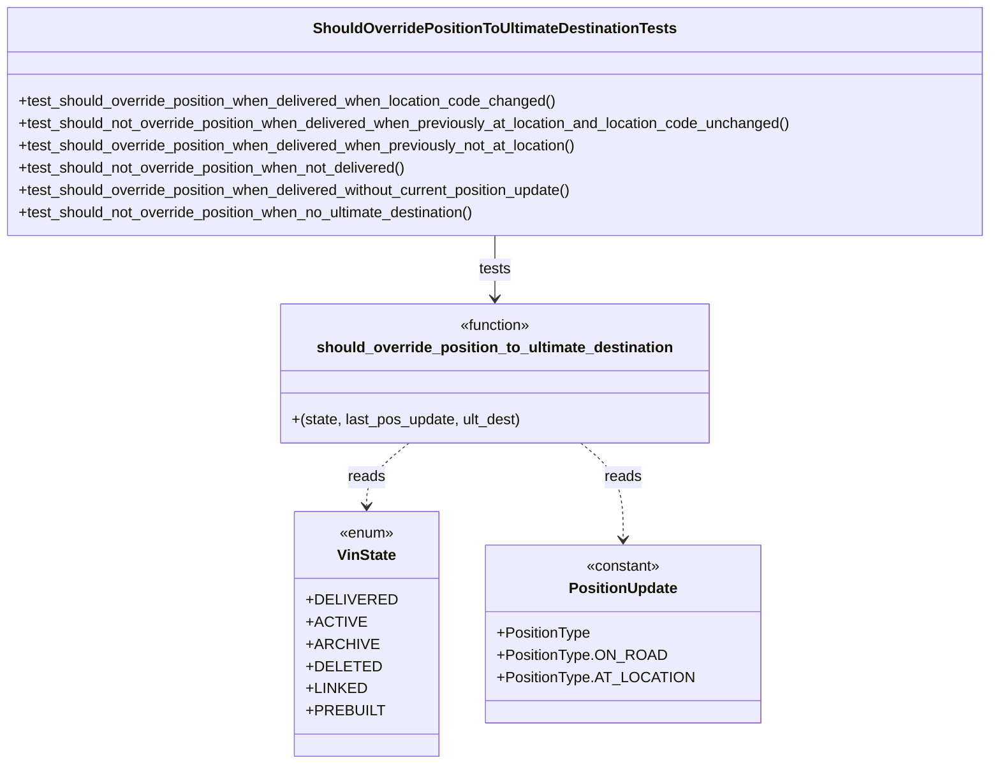

# Diagram: entity_core/entity_service/entity_service_tests/update_entity_tests/test_should_override_position_to_ultimate_destination.py


> Auto-generated by Obscura crawlers

## Diagram 1

```mermaid
flowchart TD
    Start([Start]) --> A{state == DELIVERED?}
    A -- No --> RFalse[Return False]
    A -- Yes --> B{ultimate destination present and has "code"?}
    B -- No --> RFalse
    B -- Yes --> C{last_pos_update present?}
    C -- No --> RTrue[Return True]
    C -- Yes --> D{positionType == "AT_LOCATION" AND locationCode == ult_code?}
    D -- Yes --> RFalse
    D -- No --> RTrue
```

> SVG rendering failed for this diagram.

## Diagram 2



### SVG

<svg id="container" width="1078.4375" xmlns="http://www.w3.org/2000/svg" class="classDiagram" height="824" viewBox="0 0 1078.4375 824" role="graphics-document document" aria-roledescription="class"><style>#container{font-family:"trebuchet ms",verdana,arial,sans-serif;font-size:16px;fill:#333;}@keyframes edge-animation-frame{from{stroke-dashoffset:0;}}@keyframes dash{to{stroke-dashoffset:0;}}#container .edge-animation-slow{stroke-dasharray:9,5!important;stroke-dashoffset:900;animation:dash 50s linear infinite;stroke-linecap:round;}#container .edge-animation-fast{stroke-dasharray:9,5!important;stroke-dashoffset:900;animation:dash 20s linear infinite;stroke-linecap:round;}#container .error-icon{fill:#552222;}#container .error-text{fill:#552222;stroke:#552222;}#container .edge-thickness-normal{stroke-width:1px;}#container .edge-thickness-thick{stroke-width:3.5px;}#container .edge-pattern-solid{stroke-dasharray:0;}#container .edge-thickness-invisible{stroke-width:0;fill:none;}#container .edge-pattern-dashed{stroke-dasharray:3;}#container .edge-pattern-dotted{stroke-dasharray:2;}#container .marker{fill:#333333;stroke:#333333;}#container .marker.cross{stroke:#333333;}#container svg{font-family:"trebuchet ms",verdana,arial,sans-serif;font-size:16px;}#container p{margin:0;}#container g.classGroup text{fill:#9370DB;stroke:none;font-family:"trebuchet ms",verdana,arial,sans-serif;font-size:10px;}#container g.classGroup text .title{font-weight:bolder;}#container .nodeLabel,#container .edgeLabel{color:#131300;}#container .edgeLabel .label rect{fill:#ECECFF;}#container .label text{fill:#131300;}#container .labelBkg{background:#ECECFF;}#container .edgeLabel .label span{background:#ECECFF;}#container .classTitle{font-weight:bolder;}#container .node rect,#container .node circle,#container .node ellipse,#container .node polygon,#container .node path{fill:#ECECFF;stroke:#9370DB;stroke-width:1px;}#container .divider{stroke:#9370DB;stroke-width:1;}#container g.clickable{cursor:pointer;}#container g.classGroup rect{fill:#ECECFF;stroke:#9370DB;}#container g.classGroup line{stroke:#9370DB;stroke-width:1;}#container .classLabel .box{stroke:none;stroke-width:0;fill:#ECECFF;opacity:0.5;}#container .classLabel .label{fill:#9370DB;font-size:10px;}#container .relation{stroke:#333333;stroke-width:1;fill:none;}#container .dashed-line{stroke-dasharray:3;}#container .dotted-line{stroke-dasharray:1 2;}#container #compositionStart,#container .composition{fill:#333333!important;stroke:#333333!important;stroke-width:1;}#container #compositionEnd,#container .composition{fill:#333333!important;stroke:#333333!important;stroke-width:1;}#container #dependencyStart,#container .dependency{fill:#333333!important;stroke:#333333!important;stroke-width:1;}#container #dependencyStart,#container .dependency{fill:#333333!important;stroke:#333333!important;stroke-width:1;}#container #extensionStart,#container .extension{fill:transparent!important;stroke:#333333!important;stroke-width:1;}#container #extensionEnd,#container .extension{fill:transparent!important;stroke:#333333!important;stroke-width:1;}#container #aggregationStart,#container .aggregation{fill:transparent!important;stroke:#333333!important;stroke-width:1;}#container #aggregationEnd,#container .aggregation{fill:transparent!important;stroke:#333333!important;stroke-width:1;}#container #lollipopStart,#container .lollipop{fill:#ECECFF!important;stroke:#333333!important;stroke-width:1;}#container #lollipopEnd,#container .lollipop{fill:#ECECFF!important;stroke:#333333!important;stroke-width:1;}#container .edgeTerminals{font-size:11px;line-height:initial;}#container .classTitleText{text-anchor:middle;font-size:18px;fill:#333;}#container .label-icon{display:inline-block;height:1em;overflow:visible;vertical-align:-0.125em;}#container .node .label-icon path{fill:currentColor;stroke:revert;stroke-width:revert;}#container :root{--mermaid-font-family:"trebuchet ms",verdana,arial,sans-serif;}</style><g><defs><marker id="container_class-aggregationStart" class="marker aggregation class" refX="18" refY="7" markerWidth="190" markerHeight="240" orient="auto"><path d="M 18,7 L9,13 L1,7 L9,1 Z"></path></marker></defs><defs><marker id="container_class-aggregationEnd" class="marker aggregation class" refX="1" refY="7" markerWidth="20" markerHeight="28" orient="auto"><path d="M 18,7 L9,13 L1,7 L9,1 Z"></path></marker></defs><defs><marker id="container_class-extensionStart" class="marker extension class" refX="18" refY="7" markerWidth="190" markerHeight="240" orient="auto"><path d="M 1,7 L18,13 V 1 Z"></path></marker></defs><defs><marker id="container_class-extensionEnd" class="marker extension class" refX="1" refY="7" markerWidth="20" markerHeight="28" orient="auto"><path d="M 1,1 V 13 L18,7 Z"></path></marker></defs><defs><marker id="container_class-compositionStart" class="marker composition class" refX="18" refY="7" markerWidth="190" markerHeight="240" orient="auto"><path d="M 18,7 L9,13 L1,7 L9,1 Z"></path></marker></defs><defs><marker id="container_class-compositionEnd" class="marker composition class" refX="1" refY="7" markerWidth="20" markerHeight="28" orient="auto"><path d="M 18,7 L9,13 L1,7 L9,1 Z"></path></marker></defs><defs><marker id="container_class-dependencyStart" class="marker dependency class" refX="6" refY="7" markerWidth="190" markerHeight="240" orient="auto"><path d="M 5,7 L9,13 L1,7 L9,1 Z"></path></marker></defs><defs><marker id="container_class-dependencyEnd" class="marker dependency class" refX="13" refY="7" markerWidth="20" markerHeight="28" orient="auto"><path d="M 18,7 L9,13 L14,7 L9,1 Z"></path></marker></defs><defs><marker id="container_class-lollipopStart" class="marker lollipop class" refX="13" refY="7" markerWidth="190" markerHeight="240" orient="auto"><circle stroke="black" fill="transparent" cx="7" cy="7" r="6"></circle></marker></defs><defs><marker id="container_class-lollipopEnd" class="marker lollipop class" refX="1" refY="7" markerWidth="190" markerHeight="240" orient="auto"><circle stroke="black" fill="transparent" cx="7" cy="7" r="6"></circle></marker></defs><g class="root"><g class="clusters"></g><g class="edgePaths"><path d="M539.219,254L539.219,260.167C539.219,266.333,539.219,278.667,539.219,290C539.219,301.333,539.219,311.667,539.219,316.833L539.219,322" id="id_ShouldOverridePositionToUltimateDestinationTests_should_override_position_to_ultimate_destination_1" class="edge-thickness-normal edge-pattern-solid relation" style=";;;" data-edge="true" data-et="edge" data-id="id_ShouldOverridePositionToUltimateDestinationTests_should_override_position_to_ultimate_destination_1" data-points="W3sieCI6NTM5LjIxODc1LCJ5IjoyNTR9LHsieCI6NTM5LjIxODc1LCJ5IjoyOTF9LHsieCI6NTM5LjIxODc1LCJ5IjozMjh9XQ==" marker-end="url(#container_class-dependencyEnd)"></path><path d="M452.126,478L444.965,484.167C437.804,490.333,423.482,502.667,416.321,514C409.16,525.333,409.16,535.667,409.16,540.833L409.16,546" id="id_should_override_position_to_ultimate_destination_VinState_2" class="edge-thickness-normal edge-pattern-dashed relation" style=";;;" data-edge="true" data-et="edge" data-id="id_should_override_position_to_ultimate_destination_VinState_2" data-points="W3sieCI6NDUyLjEyNTk0MTY4NTI2NzksInkiOjQ3OH0seyJ4Ijo0MDkuMTYwMTU2MjUsInkiOjUxNX0seyJ4Ijo0MDkuMTYwMTU2MjUsInkiOjU1Mn1d" marker-end="url(#container_class-dependencyEnd)"></path><path d="M626.312,478L633.473,484.167C640.633,490.333,654.955,502.667,662.116,520C669.277,537.333,669.277,559.667,669.277,570.833L669.277,582" id="id_should_override_position_to_ultimate_destination_PositionUpdate_3" class="edge-thickness-normal edge-pattern-dashed relation" style=";;;" data-edge="true" data-et="edge" data-id="id_should_override_position_to_ultimate_destination_PositionUpdate_3" data-points="W3sieCI6NjI2LjMxMTU1ODMxNDczMjEsInkiOjQ3OH0seyJ4Ijo2NjkuMjc3MzQzNzUsInkiOjUxNX0seyJ4Ijo2NjkuMjc3MzQzNzUsInkiOjU4OH1d" marker-end="url(#container_class-dependencyEnd)"></path></g><g class="edgeLabels"><g class="edgeLabel" transform="translate(539.21875, 291)"><g class="label" data-id="id_ShouldOverridePositionToUltimateDestinationTests_should_override_position_to_ultimate_destination_1" transform="translate(-17.4921875, -12)"><foreignObject width="34.984375" height="24"><div xmlns="http://www.w3.org/1999/xhtml" class="labelBkg" style="display: table-cell; white-space: nowrap; line-height: 1.5; max-width: 200px; text-align: center;"><span class="edgeLabel"><p>tests</p></span></div></foreignObject></g></g><g class="edgeLabel" transform="translate(409.16015625, 515)"><g class="label" data-id="id_should_override_position_to_ultimate_destination_VinState_2" transform="translate(-20.0078125, -12)"><foreignObject width="40.015625" height="24"><div xmlns="http://www.w3.org/1999/xhtml" class="labelBkg" style="display: table-cell; white-space: nowrap; line-height: 1.5; max-width: 200px; text-align: center;"><span class="edgeLabel"><p>reads</p></span></div></foreignObject></g></g><g class="edgeLabel" transform="translate(669.27734375, 515)"><g class="label" data-id="id_should_override_position_to_ultimate_destination_PositionUpdate_3" transform="translate(-20.0078125, -12)"><foreignObject width="40.015625" height="24"><div xmlns="http://www.w3.org/1999/xhtml" class="labelBkg" style="display: table-cell; white-space: nowrap; line-height: 1.5; max-width: 200px; text-align: center;"><span class="edgeLabel"><p>reads</p></span></div></foreignObject></g></g></g><g class="nodes"><g class="node default" id="classId-ShouldOverridePositionToUltimateDestinationTests-0" transform="translate(539.21875, 131)"><g class="basic label-container"><path d="M-531.21875 -123 L531.21875 -123 L531.21875 123 L-531.21875 123" stroke="none" stroke-width="0" fill="#ECECFF" style=""></path><path d="M-531.21875 -123 C-205.48617704102463 -123, 120.24639591795074 -123, 531.21875 -123 M-531.21875 -123 C-291.77341803435047 -123, -52.328086068701 -123, 531.21875 -123 M531.21875 -123 C531.21875 -29.715505266631254, 531.21875 63.56898946673749, 531.21875 123 M531.21875 -123 C531.21875 -49.95048727712776, 531.21875 23.099025445744473, 531.21875 123 M531.21875 123 C270.6425099453375 123, 10.066269890675017 123, -531.21875 123 M531.21875 123 C168.25385757687621 123, -194.71103484624757 123, -531.21875 123 M-531.21875 123 C-531.21875 56.16917553412323, -531.21875 -10.661648931753547, -531.21875 -123 M-531.21875 123 C-531.21875 35.790373391623234, -531.21875 -51.41925321675353, -531.21875 -123" stroke="#9370DB" stroke-width="1.3" fill="none" stroke-dasharray="0 0" style=""></path></g><g class="annotation-group text" transform="translate(0, -99)"></g><g class="label-group text" transform="translate(-189, -99)"><g class="label" style="font-weight: bolder" transform="translate(0,-12)"><foreignObject width="378" height="24"><div xmlns="http://www.w3.org/1999/xhtml" style="display: table-cell; white-space: nowrap; line-height: 1.5; max-width: 423px; text-align: center;"><span class="nodeLabel markdown-node-label" style=""><p>ShouldOverridePositionToUltimateDestinationTests</p></span></div></foreignObject></g></g><g class="members-group text" transform="translate(-519.21875, -51)"></g><g class="methods-group text" transform="translate(-519.21875, -21)"><g class="label" style="" transform="translate(0,-12)"><foreignObject width="589.875" height="24"><div xmlns="http://www.w3.org/1999/xhtml" style="display: table-cell; white-space: nowrap; line-height: 1.5; max-width: 647px; text-align: center;"><span class="nodeLabel markdown-node-label" style=""><p>+test_should_override_position_when_delivered_when_location_code_changed()</p></span></div></foreignObject></g><g class="label" style="" transform="translate(0,12)"><foreignObject width="849.4375" height="24"><div xmlns="http://www.w3.org/1999/xhtml" style="display: table-cell; white-space: nowrap; line-height: 1.5; max-width: 907px; text-align: center;"><span class="nodeLabel markdown-node-label" style=""><p>+test_should_not_override_position_when_delivered_when_previously_at_location_and_location_code_unchanged()</p></span></div></foreignObject></g><g class="label" style="" transform="translate(0,36)"><foreignObject width="615.6875" height="24"><div xmlns="http://www.w3.org/1999/xhtml" style="display: table-cell; white-space: nowrap; line-height: 1.5; max-width: 673px; text-align: center;"><span class="nodeLabel markdown-node-label" style=""><p>+test_should_override_position_when_delivered_when_previously_not_at_location()</p></span></div></foreignObject></g><g class="label" style="" transform="translate(0,60)"><foreignObject width="429.15625" height="24"><div xmlns="http://www.w3.org/1999/xhtml" style="display: table-cell; white-space: nowrap; line-height: 1.5; max-width: 487px; text-align: center;"><span class="nodeLabel markdown-node-label" style=""><p>+test_should_not_override_position_when_not_delivered()</p></span></div></foreignObject></g><g class="label" style="" transform="translate(0,84)"><foreignObject width="615.140625" height="24"><div xmlns="http://www.w3.org/1999/xhtml" style="display: table-cell; white-space: nowrap; line-height: 1.5; max-width: 673px; text-align: center;"><span class="nodeLabel markdown-node-label" style=""><p>+test_should_override_position_when_delivered_without_current_position_update()</p></span></div></foreignObject></g><g class="label" style="" transform="translate(0,108)"><foreignObject width="506.84375" height="24"><div xmlns="http://www.w3.org/1999/xhtml" style="display: table-cell; white-space: nowrap; line-height: 1.5; max-width: 564px; text-align: center;"><span class="nodeLabel markdown-node-label" style=""><p>+test_should_not_override_position_when_no_ultimate_destination()</p></span></div></foreignObject></g></g><g class="divider" style=""><path d="M-531.21875 -75 C-192.70839585704215 -75, 145.8019582859157 -75, 531.21875 -75 M-531.21875 -75 C-269.19779023789033 -75, -7.176830475780662 -75, 531.21875 -75" stroke="#9370DB" stroke-width="1.3" fill="none" stroke-dasharray="0 0" style=""></path></g><g class="divider" style=""><path d="M-531.21875 -51 C-149.57952303003606 -51, 232.05970393992789 -51, 531.21875 -51 M-531.21875 -51 C-211.19039272216241 -51, 108.83796455567517 -51, 531.21875 -51" stroke="#9370DB" stroke-width="1.3" fill="none" stroke-dasharray="0 0" style=""></path></g></g><g class="node default" id="classId-should_override_position_to_ultimate_destination-1" transform="translate(539.21875, 403)"><g class="basic label-container"><path d="M-229.921875 -75 L229.921875 -75 L229.921875 75 L-229.921875 75" stroke="none" stroke-width="0" fill="#ECECFF" style=""></path><path d="M-229.921875 -75 C-98.51327053604095 -75, 32.8953339279181 -75, 229.921875 -75 M-229.921875 -75 C-105.32749582059945 -75, 19.266883358801095 -75, 229.921875 -75 M229.921875 -75 C229.921875 -34.21663276622254, 229.921875 6.566734467554923, 229.921875 75 M229.921875 -75 C229.921875 -24.60211057010374, 229.921875 25.79577885979252, 229.921875 75 M229.921875 75 C64.80501156232768 75, -100.31185187534464 75, -229.921875 75 M229.921875 75 C60.972862373782675 75, -107.97615025243465 75, -229.921875 75 M-229.921875 75 C-229.921875 35.67764828498281, -229.921875 -3.644703430034383, -229.921875 -75 M-229.921875 75 C-229.921875 19.873215895172358, -229.921875 -35.253568209655285, -229.921875 -75" stroke="#9370DB" stroke-width="1.3" fill="none" stroke-dasharray="0 0" style=""></path></g><g class="annotation-group text" transform="translate(-39.484375, -51)"><g class="label" style="" transform="translate(0,-12)"><foreignObject width="78.96875" height="24"><div xmlns="http://www.w3.org/1999/xhtml" style="display: table-cell; white-space: nowrap; line-height: 1.5; max-width: 129px; text-align: center;"><span class="nodeLabel markdown-node-label" style=""><p>«function»</p></span></div></foreignObject></g></g><g class="label-group text" transform="translate(-186.171875, -27)"><g class="label" style="font-weight: bolder" transform="translate(0,-12)"><foreignObject width="372.34375" height="24"><div xmlns="http://www.w3.org/1999/xhtml" style="display: table-cell; white-space: nowrap; line-height: 1.5; max-width: 419px; text-align: center;"><span class="nodeLabel markdown-node-label" style=""><p>should_override_position_to_ultimate_destination</p></span></div></foreignObject></g></g><g class="members-group text" transform="translate(-217.921875, 21)"></g><g class="methods-group text" transform="translate(-217.921875, 51)"><g class="label" style="" transform="translate(0,-12)"><foreignObject width="249.671875" height="24"><div xmlns="http://www.w3.org/1999/xhtml" style="display: table-cell; white-space: nowrap; line-height: 1.5; max-width: 300px; text-align: center;"><span class="nodeLabel markdown-node-label" style=""><p>+(state, last_pos_update, ult_dest)</p></span></div></foreignObject></g></g><g class="divider" style=""><path d="M-229.921875 -3 C-108.62403089420809 -3, 12.67381321158382 -3, 229.921875 -3 M-229.921875 -3 C-58.177642785153495 -3, 113.56658942969301 -3, 229.921875 -3" stroke="#9370DB" stroke-width="1.3" fill="none" stroke-dasharray="0 0" style=""></path></g><g class="divider" style=""><path d="M-229.921875 21 C-124.09468154736926 21, -18.267488094738525 21, 229.921875 21 M-229.921875 21 C-65.68025057986387 21, 98.56137384027227 21, 229.921875 21" stroke="#9370DB" stroke-width="1.3" fill="none" stroke-dasharray="0 0" style=""></path></g></g><g class="node default" id="classId-VinState-2" transform="translate(409.16015625, 684)"><g class="basic label-container"><path d="M-70.1484375 -132 L70.1484375 -132 L70.1484375 132 L-70.1484375 132" stroke="none" stroke-width="0" fill="#ECECFF" style=""></path><path d="M-70.1484375 -132 C-14.38296703419509 -132, 41.38250343160982 -132, 70.1484375 -132 M-70.1484375 -132 C-17.446813348786158 -132, 35.254810802427684 -132, 70.1484375 -132 M70.1484375 -132 C70.1484375 -66.32234358500845, 70.1484375 -0.6446871700169083, 70.1484375 132 M70.1484375 -132 C70.1484375 -71.89851186942022, 70.1484375 -11.797023738840423, 70.1484375 132 M70.1484375 132 C25.061995564168356 132, -20.024446371663288 132, -70.1484375 132 M70.1484375 132 C40.94670484992848 132, 11.74497219985696 132, -70.1484375 132 M-70.1484375 132 C-70.1484375 39.40910984306787, -70.1484375 -53.181780313864266, -70.1484375 -132 M-70.1484375 132 C-70.1484375 35.67013448701583, -70.1484375 -60.65973102596834, -70.1484375 -132" stroke="#9370DB" stroke-width="1.3" fill="none" stroke-dasharray="0 0" style=""></path></g><g class="annotation-group text" transform="translate(-29.53125, -108)"><g class="label" style="" transform="translate(0,-12)"><foreignObject width="59.0625" height="24"><div xmlns="http://www.w3.org/1999/xhtml" style="display: table-cell; white-space: nowrap; line-height: 1.5; max-width: 109px; text-align: center;"><span class="nodeLabel markdown-node-label" style=""><p>«enum»</p></span></div></foreignObject></g></g><g class="label-group text" transform="translate(-30.75, -84)"><g class="label" style="font-weight: bolder" transform="translate(0,-12)"><foreignObject width="61.5" height="24"><div xmlns="http://www.w3.org/1999/xhtml" style="display: table-cell; white-space: nowrap; line-height: 1.5; max-width: 110px; text-align: center;"><span class="nodeLabel markdown-node-label" style=""><p>VinState</p></span></div></foreignObject></g></g><g class="members-group text" transform="translate(-58.1484375, -36)"><g class="label" style="" transform="translate(0,-12)"><foreignObject width="85.546875" height="24"><div xmlns="http://www.w3.org/1999/xhtml" style="display: table-cell; white-space: nowrap; line-height: 1.5; max-width: 143px; text-align: center;"><span class="nodeLabel markdown-node-label" style=""><p>+DELIVERED</p></span></div></foreignObject></g><g class="label" style="" transform="translate(0,12)"><foreignObject width="56.09375" height="24"><div xmlns="http://www.w3.org/1999/xhtml" style="display: table-cell; white-space: nowrap; line-height: 1.5; max-width: 113px; text-align: center;"><span class="nodeLabel markdown-node-label" style=""><p>+ACTIVE</p></span></div></foreignObject></g><g class="label" style="" transform="translate(0,36)"><foreignObject width="68.546875" height="24"><div xmlns="http://www.w3.org/1999/xhtml" style="display: table-cell; white-space: nowrap; line-height: 1.5; max-width: 126px; text-align: center;"><span class="nodeLabel markdown-node-label" style=""><p>+ARCHIVE</p></span></div></foreignObject></g><g class="label" style="" transform="translate(0,60)"><foreignObject width="70.515625" height="24"><div xmlns="http://www.w3.org/1999/xhtml" style="display: table-cell; white-space: nowrap; line-height: 1.5; max-width: 128px; text-align: center;"><span class="nodeLabel markdown-node-label" style=""><p>+DELETED</p></span></div></foreignObject></g><g class="label" style="" transform="translate(0,84)"><foreignObject width="59.890625" height="24"><div xmlns="http://www.w3.org/1999/xhtml" style="display: table-cell; white-space: nowrap; line-height: 1.5; max-width: 117px; text-align: center;"><span class="nodeLabel markdown-node-label" style=""><p>+LINKED</p></span></div></foreignObject></g><g class="label" style="" transform="translate(0,108)"><foreignObject width="75.484375" height="24"><div xmlns="http://www.w3.org/1999/xhtml" style="display: table-cell; white-space: nowrap; line-height: 1.5; max-width: 134px; text-align: center;"><span class="nodeLabel markdown-node-label" style=""><p>+PREBUILT</p></span></div></foreignObject></g></g><g class="methods-group text" transform="translate(-58.1484375, 132)"></g><g class="divider" style=""><path d="M-70.1484375 -60 C-39.33085951450935 -60, -8.513281529018698 -60, 70.1484375 -60 M-70.1484375 -60 C-39.10269848379576 -60, -8.056959467591533 -60, 70.1484375 -60" stroke="#9370DB" stroke-width="1.3" fill="none" stroke-dasharray="0 0" style=""></path></g><g class="divider" style=""><path d="M-70.1484375 108 C-41.50863039305382 108, -12.868823286107649 108, 70.1484375 108 M-70.1484375 108 C-18.430742491298247 108, 33.286952517403506 108, 70.1484375 108" stroke="#9370DB" stroke-width="1.3" fill="none" stroke-dasharray="0 0" style=""></path></g></g><g class="node default" id="classId-PositionUpdate-3" transform="translate(669.27734375, 684)"><g class="basic label-container"><path d="M-139.96875 -96 L139.96875 -96 L139.96875 96 L-139.96875 96" stroke="none" stroke-width="0" fill="#ECECFF" style=""></path><path d="M-139.96875 -96 C-31.158505324908404 -96, 77.65173935018319 -96, 139.96875 -96 M-139.96875 -96 C-38.4949249285132 -96, 62.9789001429736 -96, 139.96875 -96 M139.96875 -96 C139.96875 -22.003041130892257, 139.96875 51.99391773821549, 139.96875 96 M139.96875 -96 C139.96875 -33.796509942070415, 139.96875 28.40698011585917, 139.96875 96 M139.96875 96 C34.367987044734704 96, -71.23277591053059 96, -139.96875 96 M139.96875 96 C51.835181283486804 96, -36.29838743302639 96, -139.96875 96 M-139.96875 96 C-139.96875 51.15623072264668, -139.96875 6.312461445293366, -139.96875 -96 M-139.96875 96 C-139.96875 30.199339273949278, -139.96875 -35.601321452101445, -139.96875 -96" stroke="#9370DB" stroke-width="1.3" fill="none" stroke-dasharray="0 0" style=""></path></g><g class="annotation-group text" transform="translate(-40.4921875, -72)"><g class="label" style="" transform="translate(0,-12)"><foreignObject width="80.984375" height="24"><div xmlns="http://www.w3.org/1999/xhtml" style="display: table-cell; white-space: nowrap; line-height: 1.5; max-width: 131px; text-align: center;"><span class="nodeLabel markdown-node-label" style=""><p>«constant»</p></span></div></foreignObject></g></g><g class="label-group text" transform="translate(-56.515625, -48)"><g class="label" style="font-weight: bolder" transform="translate(0,-12)"><foreignObject width="113.03125" height="24"><div xmlns="http://www.w3.org/1999/xhtml" style="display: table-cell; white-space: nowrap; line-height: 1.5; max-width: 162px; text-align: center;"><span class="nodeLabel markdown-node-label" style=""><p>PositionUpdate</p></span></div></foreignObject></g></g><g class="members-group text" transform="translate(-127.96875, 0)"><g class="label" style="" transform="translate(0,-12)"><foreignObject width="100.875" height="24"><div xmlns="http://www.w3.org/1999/xhtml" style="display: table-cell; white-space: nowrap; line-height: 1.5; max-width: 158px; text-align: center;"><span class="nodeLabel markdown-node-label" style=""><p>+PositionType</p></span></div></foreignObject></g><g class="label" style="" transform="translate(0,12)"><foreignObject width="174.46875" height="24"><div xmlns="http://www.w3.org/1999/xhtml" style="display: table-cell; white-space: nowrap; line-height: 1.5; max-width: 232px; text-align: center;"><span class="nodeLabel markdown-node-label" style=""><p>+PositionType.ON_ROAD</p></span></div></foreignObject></g><g class="label" style="" transform="translate(0,36)"><foreignObject width="199.421875" height="24"><div xmlns="http://www.w3.org/1999/xhtml" style="display: table-cell; white-space: nowrap; line-height: 1.5; max-width: 257px; text-align: center;"><span class="nodeLabel markdown-node-label" style=""><p>+PositionType.AT_LOCATION</p></span></div></foreignObject></g></g><g class="methods-group text" transform="translate(-127.96875, 96)"></g><g class="divider" style=""><path d="M-139.96875 -24 C-73.9176880886619 -24, -7.866626177323809 -24, 139.96875 -24 M-139.96875 -24 C-61.678999921490814 -24, 16.610750157018373 -24, 139.96875 -24" stroke="#9370DB" stroke-width="1.3" fill="none" stroke-dasharray="0 0" style=""></path></g><g class="divider" style=""><path d="M-139.96875 72 C-58.93442278827921 72, 22.099904423441586 72, 139.96875 72 M-139.96875 72 C-50.53486136276689 72, 38.89902727446622 72, 139.96875 72" stroke="#9370DB" stroke-width="1.3" fill="none" stroke-dasharray="0 0" style=""></path></g></g></g></g></g></svg>
