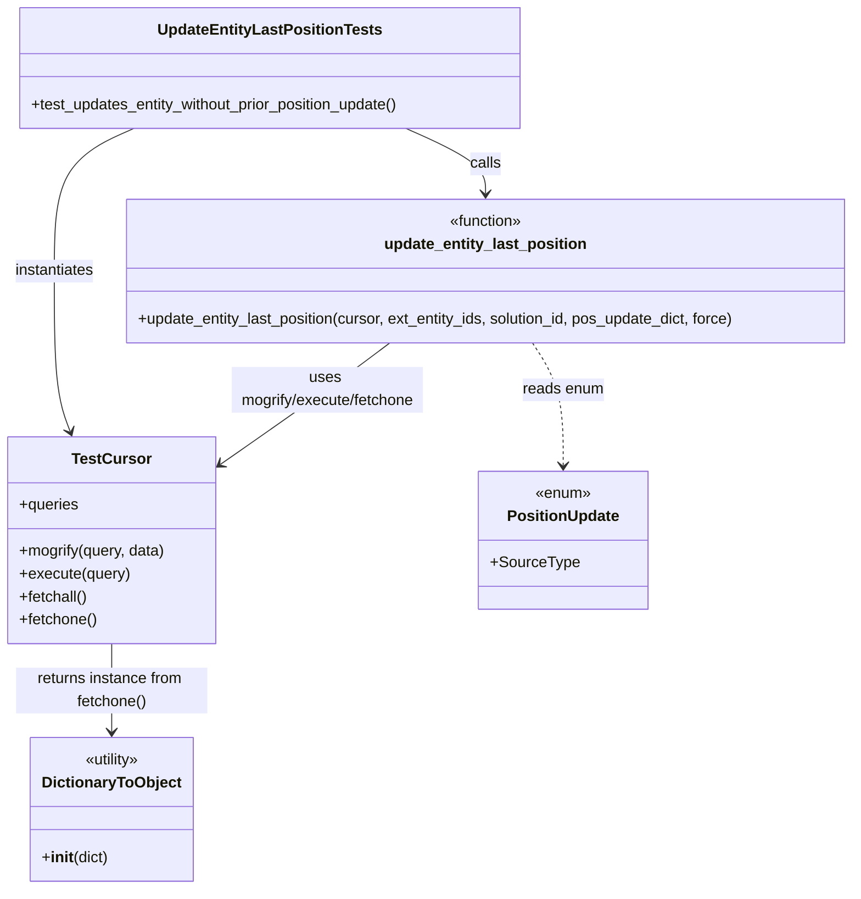
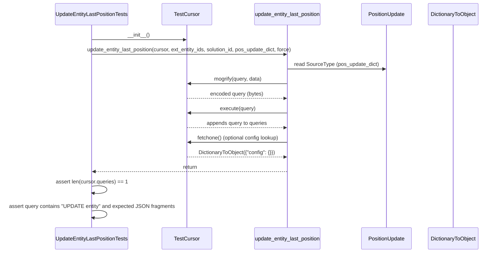

# Diagram: entity_core/entity_service/entity_service_tests/update_entity_tests/test_update_entity_last_position.py

> Auto-generated by Obscura crawlers

## Diagram 1

### SVG

<svg id="container" width="909.1953125" xmlns="http://www.w3.org/2000/svg" class="classDiagram" height="928" viewBox="0 0 909.1953125 928" role="graphics-document document" aria-roledescription="class"><g><defs><marker id="container_class-aggregationStart" class="marker aggregation class" refX="18" refY="7" markerWidth="190" markerHeight="240" orient="auto"><path d="M 18,7 L9,13 L1,7 L9,1 Z"></path></marker></defs><defs><marker id="container_class-aggregationEnd" class="marker aggregation class" refX="1" refY="7" markerWidth="20" markerHeight="28" orient="auto"><path d="M 18,7 L9,13 L1,7 L9,1 Z"></path></marker></defs><defs><marker id="container_class-extensionStart" class="marker extension class" refX="18" refY="7" markerWidth="190" markerHeight="240" orient="auto"><path d="M 1,7 L18,13 V 1 Z"></path></marker></defs><defs><marker id="container_class-extensionEnd" class="marker extension class" refX="1" refY="7" markerWidth="20" markerHeight="28" orient="auto"><path d="M 1,1 V 13 L18,7 Z"></path></marker></defs><defs><marker id="container_class-compositionStart" class="marker composition class" refX="18" refY="7" markerWidth="190" markerHeight="240" orient="auto"><path d="M 18,7 L9,13 L1,7 L9,1 Z"></path></marker></defs><defs><marker id="container_class-compositionEnd" class="marker composition class" refX="1" refY="7" markerWidth="20" markerHeight="28" orient="auto"><path d="M 18,7 L9,13 L1,7 L9,1 Z"></path></marker></defs><defs><marker id="container_class-dependencyStart" class="marker dependency class" refX="6" refY="7" markerWidth="190" markerHeight="240" orient="auto"><path d="M 5,7 L9,13 L1,7 L9,1 Z"></path></marker></defs><defs><marker id="container_class-dependencyEnd" class="marker dependency class" refX="13" refY="7" markerWidth="20" markerHeight="28" orient="auto"><path d="M 18,7 L9,13 L14,7 L9,1 Z"></path></marker></defs><defs><marker id="container_class-lollipopStart" class="marker lollipop class" refX="13" refY="7" markerWidth="190" markerHeight="240" orient="auto"><circle stroke="black" fill="transparent" cx="7" cy="7" r="6"></circle></marker></defs><defs><marker id="container_class-lollipopEnd" class="marker lollipop class" refX="1" refY="7" markerWidth="190" markerHeight="240" orient="auto"><circle stroke="black" fill="transparent" cx="7" cy="7" r="6"></circle></marker></defs><g class="root"><g class="clusters"></g><g class="edgePaths"><path d="M432.922,134L447.133,140.167C461.345,146.333,489.768,158.667,503.98,170C518.191,181.333,518.191,191.667,518.191,196.833L518.191,202" id="id_UpdateEntityLastPositionTests_update_entity_last_position_1" class="edge-thickness-normal edge-pattern-solid relation" style=";;;" data-edge="true" data-et="edge" data-id="id_UpdateEntityLastPositionTests_update_entity_last_position_1" data-points="W3sieCI6NDMyLjkyMTU4MjAzMTI1LCJ5IjoxMzR9LHsieCI6NTE4LjE5MTQwNjI1LCJ5IjoxNzF9LHsieCI6NTE4LjE5MTQwNjI1LCJ5IjoyMDh9XQ==" marker-end="url(#container_class-dependencyEnd)"></path><path d="M142.543,134L128.332,140.167C114.12,146.333,85.697,158.667,71.485,183.5C57.273,208.333,57.273,245.667,57.273,285C57.273,324.333,57.273,365.667,60.037,393.566C62.802,421.465,68.33,435.93,71.094,443.163L73.858,450.395" id="id_UpdateEntityLastPositionTests_TestCursor_2" class="edge-thickness-normal edge-pattern-solid relation" style=";;;" data-edge="true" data-et="edge" data-id="id_UpdateEntityLastPositionTests_TestCursor_2" data-points="W3sieCI6MTQyLjU0MzI2MTcxODc1LCJ5IjoxMzR9LHsieCI6NTcuMjczNDM3NSwieSI6MTcxfSx7IngiOjU3LjI3MzQzNzUsInkiOjI4M30seyJ4Ijo1Ny4yNzM0Mzc1LCJ5Ijo0MDd9LHsieCI6NzUuOTk5NTUyMTQ5NjgxNTMsInkiOjQ1Nn1d" marker-end="url(#container_class-dependencyEnd)"></path><path d="M567.391,358L572.749,366.167C578.106,374.333,588.821,390.667,594.178,412C599.535,433.333,599.535,459.667,599.535,472.833L599.535,486" id="id_update_entity_last_position_PositionUpdate_3" class="edge-thickness-normal edge-pattern-dashed relation" style=";;;" data-edge="true" data-et="edge" data-id="id_update_entity_last_position_PositionUpdate_3" data-points="W3sieCI6NTY3LjM5MTI1NTA0MDMyMjYsInkiOjM1OH0seyJ4Ijo1OTkuNTM1MTU2MjUsInkiOjQwN30seyJ4Ijo1OTkuNTM1MTU2MjUsInkiOjQ5Mn1d" marker-end="url(#container_class-dependencyEnd)"></path><path d="M117.273,672L117.273,680.167C117.273,688.333,117.273,704.667,117.273,720C117.273,735.333,117.273,749.667,117.273,756.833L117.273,764" id="id_TestCursor_DictionaryToObject_4" class="edge-thickness-normal edge-pattern-solid relation" style=";;;" data-edge="true" data-et="edge" data-id="id_TestCursor_DictionaryToObject_4" data-points="W3sieCI6MTE3LjI3MzQzNzUsInkiOjY3Mn0seyJ4IjoxMTcuMjczNDM3NSwieSI6NzIxfSx7IngiOjExNy4yNzM0Mzc1LCJ5Ijo3NzB9XQ==" marker-end="url(#container_class-dependencyEnd)"></path><path d="M415.091,358L403.865,366.167C392.638,374.333,370.185,390.667,339.588,412.03C308.99,433.393,270.248,459.786,250.877,472.983L231.506,486.179" id="id_update_entity_last_position_TestCursor_5" class="edge-thickness-normal edge-pattern-solid relation" style=";;;" data-edge="true" data-et="edge" data-id="id_update_entity_last_position_TestCursor_5" data-points="W3sieCI6NDE1LjA5MTIxNDA4NzcwMTYsInkiOjM1OH0seyJ4IjozNDcuNzMyNDIxODc1LCJ5Ijo0MDd9LHsieCI6MjI2LjU0Njg3NSwieSI6NDg5LjU1NzU1NzUyMzYyMzg3fV0=" marker-end="url(#container_class-dependencyEnd)"></path></g><g class="edgeLabels"><g class="edgeLabel" transform="translate(518.19140625, 171)"><g class="label" data-id="id_UpdateEntityLastPositionTests_update_entity_last_position_1" transform="translate(-16.4453125, -12)"><foreignObject width="32.890625" height="24">

calls

</foreignObject></g></g><g class="edgeLabel" transform="translate(57.2734375, 283)"><g class="label" data-id="id_UpdateEntityLastPositionTests_TestCursor_2" transform="translate(-42.9140625, -12)"><foreignObject width="85.828125" height="24">

instantiates

</foreignObject></g></g><g class="edgeLabel" transform="translate(599.53515625, 407)"><g class="label" data-id="id_update_entity_last_position_PositionUpdate_3" transform="translate(-42.6875, -12)"><foreignObject width="85.375" height="24">

reads enum

</foreignObject></g></g><g class="edgeLabel" transform="translate(117.2734375, 721)"><g class="label" data-id="id_TestCursor_DictionaryToObject_4" transform="translate(-100, -24)"><foreignObject width="200" height="48">

returns instance from fetchone()

</foreignObject></g></g><g class="edgeLabel" transform="translate(321.55944, 424.83033)"><g class="label" data-id="id_update_entity_last_position_TestCursor_5" transform="translate(-100, -24)"><foreignObject width="200" height="48">

uses mogrify/execute/fetchone

</foreignObject></g></g></g><g class="nodes"><g class="node default" id="classId-UpdateEntityLastPositionTests-0" transform="translate(287.732421875, 71)"><g class="basic label-container"><path d="M-265.8828125 -63 L265.8828125 -63 L265.8828125 63 L-265.8828125 63" stroke="none" stroke-width="0" fill="#ECECFF" style=""></path><path d="M-265.8828125 -63 C-113.63096599209342 -63, 38.620880515813155 -63, 265.8828125 -63 M-265.8828125 -63 C-138.7716474382855 -63, -11.660482376570997 -63, 265.8828125 -63 M265.8828125 -63 C265.8828125 -30.86126573639808, 265.8828125 1.2774685272038369, 265.8828125 63 M265.8828125 -63 C265.8828125 -36.24550574380555, 265.8828125 -9.491011487611104, 265.8828125 63 M265.8828125 63 C127.57808365560052 63, -10.726645188798955 63, -265.8828125 63 M265.8828125 63 C124.89288235920327 63, -16.09704778159346 63, -265.8828125 63 M-265.8828125 63 C-265.8828125 24.493243212823074, -265.8828125 -14.013513574353851, -265.8828125 -63 M-265.8828125 63 C-265.8828125 17.04971303931856, -265.8828125 -28.900573921362877, -265.8828125 -63" stroke="#9370DB" stroke-width="1.3" fill="none" stroke-dasharray="0 0" style=""></path></g><g class="annotation-group text" transform="translate(0, -39)"></g><g class="label-group text" transform="translate(-112.1875, -39)"><g class="label" style="font-weight: bolder" transform="translate(0,-12)"><foreignObject width="224.375" height="24">

UpdateEntityLastPositionTests

</foreignObject></g></g><g class="members-group text" transform="translate(-253.8828125, 9)"></g><g class="methods-group text" transform="translate(-253.8828125, 39)"><g class="label" style="" transform="translate(0,-12)"><foreignObject width="395.578125" height="24">

+test_updates_entity_without_prior_position_update()

</foreignObject></g></g><g class="divider" style=""><path d="M-265.8828125 -15 C-82.30838848790944 -15, 101.26603552418112 -15, 265.8828125 -15 M-265.8828125 -15 C-89.7197509897633 -15, 86.4433105204734 -15, 265.8828125 -15" stroke="#9370DB" stroke-width="1.3" fill="none" stroke-dasharray="0 0" style=""></path></g><g class="divider" style=""><path d="M-265.8828125 9 C-131.8126898087431 9, 2.257432882513797 9, 265.8828125 9 M-265.8828125 9 C-83.11192273925386 9, 99.65896702149229 9, 265.8828125 9" stroke="#9370DB" stroke-width="1.3" fill="none" stroke-dasharray="0 0" style=""></path></g></g><g class="node default" id="classId-TestCursor-1" transform="translate(117.2734375, 564)"><g class="basic label-container"><path d="M-109.2734375 -108 L109.2734375 -108 L109.2734375 108 L-109.2734375 108" stroke="none" stroke-width="0" fill="#ECECFF" style=""></path><path d="M-109.2734375 -108 C-60.86835337175463 -108, -12.46326924350926 -108, 109.2734375 -108 M-109.2734375 -108 C-65.1802324838012 -108, -21.08702746760241 -108, 109.2734375 -108 M109.2734375 -108 C109.2734375 -61.82552420458035, 109.2734375 -15.651048409160694, 109.2734375 108 M109.2734375 -108 C109.2734375 -43.09131484234503, 109.2734375 21.817370315309944, 109.2734375 108 M109.2734375 108 C35.02888265677386 108, -39.21567218645228 108, -109.2734375 108 M109.2734375 108 C29.131648810522833 108, -51.010139878954334 108, -109.2734375 108 M-109.2734375 108 C-109.2734375 54.50953635762066, -109.2734375 1.0190727152413217, -109.2734375 -108 M-109.2734375 108 C-109.2734375 28.013013688171, -109.2734375 -51.973972623658, -109.2734375 -108" stroke="#9370DB" stroke-width="1.3" fill="none" stroke-dasharray="0 0" style=""></path></g><g class="annotation-group text" transform="translate(0, -84)"></g><g class="label-group text" transform="translate(-39.15625, -84)"><g class="label" style="font-weight: bolder" transform="translate(0,-12)"><foreignObject width="78.3125" height="24">

TestCursor

</foreignObject></g></g><g class="members-group text" transform="translate(-97.2734375, -36)"><g class="label" style="" transform="translate(0,-12)"><foreignObject width="62.46875" height="24">

+queries

</foreignObject></g></g><g class="methods-group text" transform="translate(-97.2734375, 12)"><g class="label" style="" transform="translate(0,-12)"><foreignObject width="155.390625" height="24">

+mogrify(query, data)

</foreignObject></g><g class="label" style="" transform="translate(0,12)"><foreignObject width="115.96875" height="24">

+execute(query)

</foreignObject></g><g class="label" style="" transform="translate(0,36)"><foreignObject width="72.515625" height="24">

+fetchall()

</foreignObject></g><g class="label" style="" transform="translate(0,60)"><foreignObject width="82.046875" height="24">

+fetchone()

</foreignObject></g></g><g class="divider" style=""><path d="M-109.2734375 -60 C-54.81940089652875 -60, -0.36536429305749607 -60, 109.2734375 -60 M-109.2734375 -60 C-49.80852918968123 -60, 9.656379120637538 -60, 109.2734375 -60" stroke="#9370DB" stroke-width="1.3" fill="none" stroke-dasharray="0 0" style=""></path></g><g class="divider" style=""><path d="M-109.2734375 -12 C-23.819063168518582 -12, 61.635311162962836 -12, 109.2734375 -12 M-109.2734375 -12 C-57.33286600191592 -12, -5.392294503831835 -12, 109.2734375 -12" stroke="#9370DB" stroke-width="1.3" fill="none" stroke-dasharray="0 0" style=""></path></g></g><g class="node default" id="classId-update_entity_last_position-2" transform="translate(518.19140625, 283)"><g class="basic label-container"><path d="M-383.00390625 -75 L383.00390625 -75 L383.00390625 75 L-383.00390625 75" stroke="none" stroke-width="0" fill="#ECECFF" style=""></path><path d="M-383.00390625 -75 C-158.16881419859342 -75, 66.66627785281315 -75, 383.00390625 -75 M-383.00390625 -75 C-210.27319673436799 -75, -37.54248721873597 -75, 383.00390625 -75 M383.00390625 -75 C383.00390625 -37.52728015884785, 383.00390625 -0.05456031769570302, 383.00390625 75 M383.00390625 -75 C383.00390625 -29.956932863797775, 383.00390625 15.08613427240445, 383.00390625 75 M383.00390625 75 C118.82468999463589 75, -145.35452626072822 75, -383.00390625 75 M383.00390625 75 C118.50346905584024 75, -145.99696813831952 75, -383.00390625 75 M-383.00390625 75 C-383.00390625 22.727152422363304, -383.00390625 -29.545695155273393, -383.00390625 -75 M-383.00390625 75 C-383.00390625 23.691986756217183, -383.00390625 -27.616026487565634, -383.00390625 -75" stroke="#9370DB" stroke-width="1.3" fill="none" stroke-dasharray="0 0" style=""></path></g><g class="annotation-group text" transform="translate(-39.484375, -51)"><g class="label" style="" transform="translate(0,-12)"><foreignObject width="78.96875" height="24">

«function»

</foreignObject></g></g><g class="label-group text" transform="translate(-103.1015625, -27)"><g class="label" style="font-weight: bolder" transform="translate(0,-12)"><foreignObject width="206.203125" height="24">

update_entity_last_position

</foreignObject></g></g><g class="members-group text" transform="translate(-371.00390625, 21)"></g><g class="methods-group text" transform="translate(-371.00390625, 51)"><g class="label" style="" transform="translate(0,-12)"><foreignObject width="638.90625" height="24">

+update_entity_last_position(cursor, ext_entity_ids, solution_id, pos_update_dict, force)

</foreignObject></g></g><g class="divider" style=""><path d="M-383.00390625 -3 C-198.9582397085864 -3, -14.912573167172809 -3, 383.00390625 -3 M-383.00390625 -3 C-205.16011558561232 -3, -27.316324921224634 -3, 383.00390625 -3" stroke="#9370DB" stroke-width="1.3" fill="none" stroke-dasharray="0 0" style=""></path></g><g class="divider" style=""><path d="M-383.00390625 21 C-108.43619406813059 21, 166.13151811373882 21, 383.00390625 21 M-383.00390625 21 C-193.14039784569968 21, -3.276889441399362 21, 383.00390625 21" stroke="#9370DB" stroke-width="1.3" fill="none" stroke-dasharray="0 0" style=""></path></g></g><g class="node default" id="classId-PositionUpdate-3" transform="translate(599.53515625, 564)"><g class="basic label-container"><path d="M-85.359375 -72 L85.359375 -72 L85.359375 72 L-85.359375 72" stroke="none" stroke-width="0" fill="#ECECFF" style=""></path><path d="M-85.359375 -72 C-35.473319062949344 -72, 14.412736874101313 -72, 85.359375 -72 M-85.359375 -72 C-50.51970347305491 -72, -15.680031946109821 -72, 85.359375 -72 M85.359375 -72 C85.359375 -24.002794645925945, 85.359375 23.99441070814811, 85.359375 72 M85.359375 -72 C85.359375 -27.23364395865292, 85.359375 17.53271208269416, 85.359375 72 M85.359375 72 C42.04080455808816 72, -1.277765883823676 72, -85.359375 72 M85.359375 72 C20.636609831771395 72, -44.08615533645721 72, -85.359375 72 M-85.359375 72 C-85.359375 37.000841628512546, -85.359375 2.0016832570250926, -85.359375 -72 M-85.359375 72 C-85.359375 27.517393796760658, -85.359375 -16.965212406478685, -85.359375 -72" stroke="#9370DB" stroke-width="1.3" fill="none" stroke-dasharray="0 0" style=""></path></g><g class="annotation-group text" transform="translate(-29.53125, -48)"><g class="label" style="" transform="translate(0,-12)"><foreignObject width="59.0625" height="24">

«enum»

</foreignObject></g></g><g class="label-group text" transform="translate(-56.515625, -24)"><g class="label" style="font-weight: bolder" transform="translate(0,-12)"><foreignObject width="113.03125" height="24">

PositionUpdate

</foreignObject></g></g><g class="members-group text" transform="translate(-73.359375, 24)"><g class="label" style="" transform="translate(0,-12)"><foreignObject width="90.203125" height="24">

+SourceType

</foreignObject></g></g><g class="methods-group text" transform="translate(-73.359375, 72)"></g><g class="divider" style=""><path d="M-85.359375 0 C-43.75513634367852 0, -2.1508976873570447 0, 85.359375 0 M-85.359375 0 C-37.10500965882794 0, 11.149355682344122 0, 85.359375 0" stroke="#9370DB" stroke-width="1.3" fill="none" stroke-dasharray="0 0" style=""></path></g><g class="divider" style=""><path d="M-85.359375 48 C-45.67102417546481 48, -5.982673350929616 48, 85.359375 48 M-85.359375 48 C-46.442279693826464 48, -7.525184387652928 48, 85.359375 48" stroke="#9370DB" stroke-width="1.3" fill="none" stroke-dasharray="0 0" style=""></path></g></g><g class="node default" id="classId-DictionaryToObject-4" transform="translate(117.2734375, 845)"><g class="basic label-container"><path d="M-82.203125 -75 L82.203125 -75 L82.203125 75 L-82.203125 75" stroke="none" stroke-width="0" fill="#ECECFF" style=""></path><path d="M-82.203125 -75 C-31.796170064572863 -75, 18.610784870854275 -75, 82.203125 -75 M-82.203125 -75 C-18.70163902037155 -75, 44.7998469592569 -75, 82.203125 -75 M82.203125 -75 C82.203125 -33.30425271185395, 82.203125 8.391494576292104, 82.203125 75 M82.203125 -75 C82.203125 -42.90468750676123, 82.203125 -10.809375013522455, 82.203125 75 M82.203125 75 C20.091922405503297 75, -42.019280188993406 75, -82.203125 75 M82.203125 75 C45.26785557853829 75, 8.332586157076577 75, -82.203125 75 M-82.203125 75 C-82.203125 26.391685534307918, -82.203125 -22.216628931384165, -82.203125 -75 M-82.203125 75 C-82.203125 33.010493469974335, -82.203125 -8.97901306005133, -82.203125 -75" stroke="#9370DB" stroke-width="1.3" fill="none" stroke-dasharray="0 0" style=""></path></g><g class="annotation-group text" transform="translate(-30.3125, -51)"><g class="label" style="" transform="translate(0,-12)"><foreignObject width="60.625" height="24">

«utility»

</foreignObject></g></g><g class="label-group text" transform="translate(-70.109375, -27)"><g class="label" style="font-weight: bolder" transform="translate(0,-12)"><foreignObject width="140.21875" height="24">

DictionaryToObject

</foreignObject></g></g><g class="members-group text" transform="translate(-70.203125, 21)"></g><g class="methods-group text" transform="translate(-70.203125, 51)"><g class="label" style="" transform="translate(0,-12)"><foreignObject width="70.296875" height="24">

+<strong>init</strong>(dict)

</foreignObject></g></g><g class="divider" style=""><path d="M-82.203125 -3 C-32.01854174173845 -3, 18.166041516523094 -3, 82.203125 -3 M-82.203125 -3 C-37.459727168702656 -3, 7.283670662594687 -3, 82.203125 -3" stroke="#9370DB" stroke-width="1.3" fill="none" stroke-dasharray="0 0" style=""></path></g><g class="divider" style=""><path d="M-82.203125 21 C-20.9291290247616 21, 40.3448669504768 21, 82.203125 21 M-82.203125 21 C-22.791427162859527 21, 36.620270674280945 21, 82.203125 21" stroke="#9370DB" stroke-width="1.3" fill="none" stroke-dasharray="0 0" style=""></path></g></g></g></g></g></svg>

## Diagram 2

### SVG

<svg id="container" width="1582" xmlns="http://www.w3.org/2000/svg" height="807" viewBox="-175.5 -10 1582 807" role="graphics-document document" aria-roledescription="sequence"><g><rect x="1198.5" y="721" fill="#eaeaea" stroke="#666" width="158" height="65" name="Util" rx="3" ry="3" class="actor actor-bottom"></rect><text x="1277.5" y="753.5" dominant-baseline="central" alignment-baseline="central" class="actor actor-box" style="text-anchor: middle; font-size: 16px; font-weight: 400;"><tspan x="1277.5" dy="0">DictionaryToObject</tspan></text></g><g><rect x="998.5" y="721" fill="#eaeaea" stroke="#666" width="150" height="65" name="Pos" rx="3" ry="3" class="actor actor-bottom"></rect><text x="1073.5" y="753.5" dominant-baseline="central" alignment-baseline="central" class="actor actor-box" style="text-anchor: middle; font-size: 16px; font-weight: 400;"><tspan x="1073.5" dy="0">PositionUpdate</tspan></text></g><g><rect x="637" y="721" fill="#eaeaea" stroke="#666" width="223" height="65" name="Func" rx="3" ry="3" class="actor actor-bottom"></rect><text x="748.5" y="753.5" dominant-baseline="central" alignment-baseline="central" class="actor actor-box" style="text-anchor: middle; font-size: 16px; font-weight: 400;"><tspan x="748.5" dy="0">update_entity_last_position</tspan></text></g><g><rect x="351.5" y="721" fill="#eaeaea" stroke="#666" width="150" height="65" name="Cursor" rx="3" ry="3" class="actor actor-bottom"></rect><text x="426.5" y="753.5" dominant-baseline="central" alignment-baseline="central" class="actor actor-box" style="text-anchor: middle; font-size: 16px; font-weight: 400;"><tspan x="426.5" dy="0">TestCursor</tspan></text></g><g><rect x="0" y="721" fill="#eaeaea" stroke="#666" width="240" height="65" name="Test" rx="3" ry="3" class="actor actor-bottom"></rect><text x="120" y="753.5" dominant-baseline="central" alignment-baseline="central" class="actor actor-box" style="text-anchor: middle; font-size: 16px; font-weight: 400;"><tspan x="120" dy="0">UpdateEntityLastPositionTests</tspan></text></g><g><line id="actor4" x1="1277.5" y1="65" x2="1277.5" y2="721" class="actor-line 200" stroke-width="0.5px" stroke="#999" name="Util"></line><g id="root-4"><rect x="1198.5" y="0" fill="#eaeaea" stroke="#666" width="158" height="65" name="Util" rx="3" ry="3" class="actor actor-top"></rect><text x="1277.5" y="32.5" dominant-baseline="central" alignment-baseline="central" class="actor actor-box" style="text-anchor: middle; font-size: 16px; font-weight: 400;"><tspan x="1277.5" dy="0">DictionaryToObject</tspan></text></g></g><g><line id="actor3" x1="1073.5" y1="65" x2="1073.5" y2="721" class="actor-line 200" stroke-width="0.5px" stroke="#999" name="Pos"></line><g id="root-3"><rect x="998.5" y="0" fill="#eaeaea" stroke="#666" width="150" height="65" name="Pos" rx="3" ry="3" class="actor actor-top"></rect><text x="1073.5" y="32.5" dominant-baseline="central" alignment-baseline="central" class="actor actor-box" style="text-anchor: middle; font-size: 16px; font-weight: 400;"><tspan x="1073.5" dy="0">PositionUpdate</tspan></text></g></g><g><line id="actor2" x1="748.5" y1="65" x2="748.5" y2="721" class="actor-line 200" stroke-width="0.5px" stroke="#999" name="Func"></line><g id="root-2"><rect x="637" y="0" fill="#eaeaea" stroke="#666" width="223" height="65" name="Func" rx="3" ry="3" class="actor actor-top"></rect><text x="748.5" y="32.5" dominant-baseline="central" alignment-baseline="central" class="actor actor-box" style="text-anchor: middle; font-size: 16px; font-weight: 400;"><tspan x="748.5" dy="0">update_entity_last_position</tspan></text></g></g><g><line id="actor1" x1="426.5" y1="65" x2="426.5" y2="721" class="actor-line 200" stroke-width="0.5px" stroke="#999" name="Cursor"></line><g id="root-1"><rect x="351.5" y="0" fill="#eaeaea" stroke="#666" width="150" height="65" name="Cursor" rx="3" ry="3" class="actor actor-top"></rect><text x="426.5" y="32.5" dominant-baseline="central" alignment-baseline="central" class="actor actor-box" style="text-anchor: middle; font-size: 16px; font-weight: 400;"><tspan x="426.5" dy="0">TestCursor</tspan></text></g></g><g><line id="actor0" x1="120" y1="65" x2="120" y2="721" class="actor-line 200" stroke-width="0.5px" stroke="#999" name="Test"></line><g id="root-0"><rect x="0" y="0" fill="#eaeaea" stroke="#666" width="240" height="65" name="Test" rx="3" ry="3" class="actor actor-top"></rect><text x="120" y="32.5" dominant-baseline="central" alignment-baseline="central" class="actor actor-box" style="text-anchor: middle; font-size: 16px; font-weight: 400;"><tspan x="120" dy="0">UpdateEntityLastPositionTests</tspan></text></g></g><g></g><defs><symbol id="computer" width="24" height="24"><path transform="scale(.5)" d="M2 2v13h20v-13h-20zm18 11h-16v-9h16v9zm-10.228 6l.466-1h3.524l.467 1h-4.457zm14.228 3h-24l2-6h2.104l-1.33 4h18.45l-1.297-4h2.073l2 6zm-5-10h-14v-7h14v7z"></path></symbol></defs><defs><symbol id="database" fill-rule="evenodd" clip-rule="evenodd"><path transform="scale(.5)" d="M12.258.001l.256.004.255.005.253.008.251.01.249.012.247.015.246.016.242.019.241.02.239.023.236.024.233.027.231.028.229.031.225.032.223.034.22.036.217.038.214.04.211.041.208.043.205.045.201.046.198.048.194.05.191.051.187.053.183.054.18.056.175.057.172.059.168.06.163.061.16.063.155.064.15.066.074.033.073.033.071.034.07.034.069.035.068.035.067.035.066.035.064.036.064.036.062.036.06.036.06.037.058.037.058.037.055.038.055.038.053.038.052.038.051.039.05.039.048.039.047.039.045.04.044.04.043.04.041.04.04.041.039.041.037.041.036.041.034.041.033.042.032.042.03.042.029.042.027.042.026.043.024.043.023.043.021.043.02.043.018.044.017.043.015.044.013.044.012.044.011.045.009.044.007.045.006.045.004.045.002.045.001.045v17l-.001.045-.002.045-.004.045-.006.045-.007.045-.009.044-.011.045-.012.044-.013.044-.015.044-.017.043-.018.044-.02.043-.021.043-.023.043-.024.043-.026.043-.027.042-.029.042-.03.042-.032.042-.033.042-.034.041-.036.041-.037.041-.039.041-.04.041-.041.04-.043.04-.044.04-.045.04-.047.039-.048.039-.05.039-.051.039-.052.038-.053.038-.055.038-.055.038-.058.037-.058.037-.06.037-.06.036-.062.036-.064.036-.064.036-.066.035-.067.035-.068.035-.069.035-.07.034-.071.034-.073.033-.074.033-.15.066-.155.064-.16.063-.163.061-.168.06-.172.059-.175.057-.18.056-.183.054-.187.053-.191.051-.194.05-.198.048-.201.046-.205.045-.208.043-.211.041-.214.04-.217.038-.22.036-.223.034-.225.032-.229.031-.231.028-.233.027-.236.024-.239.023-.241.02-.242.019-.246.016-.247.015-.249.012-.251.01-.253.008-.255.005-.256.004-.258.001-.258-.001-.256-.004-.255-.005-.253-.008-.251-.01-.249-.012-.247-.015-.245-.016-.243-.019-.241-.02-.238-.023-.236-.024-.234-.027-.231-.028-.228-.031-.226-.032-.223-.034-.22-.036-.217-.038-.214-.04-.211-.041-.208-.043-.204-.045-.201-.046-.198-.048-.195-.05-.19-.051-.187-.053-.184-.054-.179-.056-.176-.057-.172-.059-.167-.06-.164-.061-.159-.063-.155-.064-.151-.066-.074-.033-.072-.033-.072-.034-.07-.034-.069-.035-.068-.035-.067-.035-.066-.035-.064-.036-.063-.036-.062-.036-.061-.036-.06-.037-.058-.037-.057-.037-.056-.038-.055-.038-.053-.038-.052-.038-.051-.039-.049-.039-.049-.039-.046-.039-.046-.04-.044-.04-.043-.04-.041-.04-.04-.041-.039-.041-.037-.041-.036-.041-.034-.041-.033-.042-.032-.042-.03-.042-.029-.042-.027-.042-.026-.043-.024-.043-.023-.043-.021-.043-.02-.043-.018-.044-.017-.043-.015-.044-.013-.044-.012-.044-.011-.045-.009-.044-.007-.045-.006-.045-.004-.045-.002-.045-.001-.045v-17l.001-.045.002-.045.004-.045.006-.045.007-.045.009-.044.011-.045.012-.044.013-.044.015-.044.017-.043.018-.044.02-.043.021-.043.023-.043.024-.043.026-.043.027-.042.029-.042.03-.042.032-.042.033-.042.034-.041.036-.041.037-.041.039-.041.04-.041.041-.04.043-.04.044-.04.046-.04.046-.039.049-.039.049-.039.051-.039.052-.038.053-.038.055-.038.056-.038.057-.037.058-.037.06-.037.061-.036.062-.036.063-.036.064-.036.066-.035.067-.035.068-.035.069-.035.07-.034.072-.034.072-.033.074-.033.151-.066.155-.064.159-.063.164-.061.167-.06.172-.059.176-.057.179-.056.184-.054.187-.053.19-.051.195-.05.198-.048.201-.046.204-.045.208-.043.211-.041.214-.04.217-.038.22-.036.223-.034.226-.032.228-.031.231-.028.234-.027.236-.024.238-.023.241-.02.243-.019.245-.016.247-.015.249-.012.251-.01.253-.008.255-.005.256-.004.258-.001.258.001zm-9.258 20.499v.01l.001.021.003.021.004.022.005.021.006.022.007.022.009.023.01.022.011.023.012.023.013.023.015.023.016.024.017.023.018.024.019.024.021.024.022.025.023.024.024.025.052.049.056.05.061.051.066.051.07.051.075.051.079.052.084.052.088.052.092.052.097.052.102.051.105.052.11.052.114.051.119.051.123.051.127.05.131.05.135.05.139.048.144.049.147.047.152.047.155.047.16.045.163.045.167.043.171.043.176.041.178.041.183.039.187.039.19.037.194.035.197.035.202.033.204.031.209.03.212.029.216.027.219.025.222.024.226.021.23.02.233.018.236.016.24.015.243.012.246.01.249.008.253.005.256.004.259.001.26-.001.257-.004.254-.005.25-.008.247-.011.244-.012.241-.014.237-.016.233-.018.231-.021.226-.021.224-.024.22-.026.216-.027.212-.028.21-.031.205-.031.202-.034.198-.034.194-.036.191-.037.187-.039.183-.04.179-.04.175-.042.172-.043.168-.044.163-.045.16-.046.155-.046.152-.047.148-.048.143-.049.139-.049.136-.05.131-.05.126-.05.123-.051.118-.052.114-.051.11-.052.106-.052.101-.052.096-.052.092-.052.088-.053.083-.051.079-.052.074-.052.07-.051.065-.051.06-.051.056-.05.051-.05.023-.024.023-.025.021-.024.02-.024.019-.024.018-.024.017-.024.015-.023.014-.024.013-.023.012-.023.01-.023.01-.022.008-.022.006-.022.006-.022.004-.022.004-.021.001-.021.001-.021v-4.127l-.077.055-.08.053-.083.054-.085.053-.087.052-.09.052-.093.051-.095.05-.097.05-.1.049-.102.049-.105.048-.106.047-.109.047-.111.046-.114.045-.115.045-.118.044-.12.043-.122.042-.124.042-.126.041-.128.04-.13.04-.132.038-.134.038-.135.037-.138.037-.139.035-.142.035-.143.034-.144.033-.147.032-.148.031-.15.03-.151.03-.153.029-.154.027-.156.027-.158.026-.159.025-.161.024-.162.023-.163.022-.165.021-.166.02-.167.019-.169.018-.169.017-.171.016-.173.015-.173.014-.175.013-.175.012-.177.011-.178.01-.179.008-.179.008-.181.006-.182.005-.182.004-.184.003-.184.002h-.37l-.184-.002-.184-.003-.182-.004-.182-.005-.181-.006-.179-.008-.179-.008-.178-.01-.176-.011-.176-.012-.175-.013-.173-.014-.172-.015-.171-.016-.17-.017-.169-.018-.167-.019-.166-.02-.165-.021-.163-.022-.162-.023-.161-.024-.159-.025-.157-.026-.156-.027-.155-.027-.153-.029-.151-.03-.15-.03-.148-.031-.146-.032-.145-.033-.143-.034-.141-.035-.14-.035-.137-.037-.136-.037-.134-.038-.132-.038-.13-.04-.128-.04-.126-.041-.124-.042-.122-.042-.12-.044-.117-.043-.116-.045-.113-.045-.112-.046-.109-.047-.106-.047-.105-.048-.102-.049-.1-.049-.097-.05-.095-.05-.093-.052-.09-.051-.087-.052-.085-.053-.083-.054-.08-.054-.077-.054v4.127zm0-5.654v.011l.001.021.003.021.004.021.005.022.006.022.007.022.009.022.01.022.011.023.012.023.013.023.015.024.016.023.017.024.018.024.019.024.021.024.022.024.023.025.024.024.052.05.056.05.061.05.066.051.07.051.075.052.079.051.084.052.088.052.092.052.097.052.102.052.105.052.11.051.114.051.119.052.123.05.127.051.131.05.135.049.139.049.144.048.147.048.152.047.155.046.16.045.163.045.167.044.171.042.176.042.178.04.183.04.187.038.19.037.194.036.197.034.202.033.204.032.209.03.212.028.216.027.219.025.222.024.226.022.23.02.233.018.236.016.24.014.243.012.246.01.249.008.253.006.256.003.259.001.26-.001.257-.003.254-.006.25-.008.247-.01.244-.012.241-.015.237-.016.233-.018.231-.02.226-.022.224-.024.22-.025.216-.027.212-.029.21-.03.205-.032.202-.033.198-.035.194-.036.191-.037.187-.039.183-.039.179-.041.175-.042.172-.043.168-.044.163-.045.16-.045.155-.047.152-.047.148-.048.143-.048.139-.05.136-.049.131-.05.126-.051.123-.051.118-.051.114-.052.11-.052.106-.052.101-.052.096-.052.092-.052.088-.052.083-.052.079-.052.074-.051.07-.052.065-.051.06-.05.056-.051.051-.049.023-.025.023-.024.021-.025.02-.024.019-.024.018-.024.017-.024.015-.023.014-.023.013-.024.012-.022.01-.023.01-.023.008-.022.006-.022.006-.022.004-.021.004-.022.001-.021.001-.021v-4.139l-.077.054-.08.054-.083.054-.085.052-.087.053-.09.051-.093.051-.095.051-.097.05-.1.049-.102.049-.105.048-.106.047-.109.047-.111.046-.114.045-.115.044-.118.044-.12.044-.122.042-.124.042-.126.041-.128.04-.13.039-.132.039-.134.038-.135.037-.138.036-.139.036-.142.035-.143.033-.144.033-.147.033-.148.031-.15.03-.151.03-.153.028-.154.028-.156.027-.158.026-.159.025-.161.024-.162.023-.163.022-.165.021-.166.02-.167.019-.169.018-.169.017-.171.016-.173.015-.173.014-.175.013-.175.012-.177.011-.178.009-.179.009-.179.007-.181.007-.182.005-.182.004-.184.003-.184.002h-.37l-.184-.002-.184-.003-.182-.004-.182-.005-.181-.007-.179-.007-.179-.009-.178-.009-.176-.011-.176-.012-.175-.013-.173-.014-.172-.015-.171-.016-.17-.017-.169-.018-.167-.019-.166-.02-.165-.021-.163-.022-.162-.023-.161-.024-.159-.025-.157-.026-.156-.027-.155-.028-.153-.028-.151-.03-.15-.03-.148-.031-.146-.033-.145-.033-.143-.033-.141-.035-.14-.036-.137-.036-.136-.037-.134-.038-.132-.039-.13-.039-.128-.04-.126-.041-.124-.042-.122-.043-.12-.043-.117-.044-.116-.044-.113-.046-.112-.046-.109-.046-.106-.047-.105-.048-.102-.049-.1-.049-.097-.05-.095-.051-.093-.051-.09-.051-.087-.053-.085-.052-.083-.054-.08-.054-.077-.054v4.139zm0-5.666v.011l.001.02.003.022.004.021.005.022.006.021.007.022.009.023.01.022.011.023.012.023.013.023.015.023.016.024.017.024.018.023.019.024.021.025.022.024.023.024.024.025.052.05.056.05.061.05.066.051.07.051.075.052.079.051.084.052.088.052.092.052.097.052.102.052.105.051.11.052.114.051.119.051.123.051.127.05.131.05.135.05.139.049.144.048.147.048.152.047.155.046.16.045.163.045.167.043.171.043.176.042.178.04.183.04.187.038.19.037.194.036.197.034.202.033.204.032.209.03.212.028.216.027.219.025.222.024.226.021.23.02.233.018.236.017.24.014.243.012.246.01.249.008.253.006.256.003.259.001.26-.001.257-.003.254-.006.25-.008.247-.01.244-.013.241-.014.237-.016.233-.018.231-.02.226-.022.224-.024.22-.025.216-.027.212-.029.21-.03.205-.032.202-.033.198-.035.194-.036.191-.037.187-.039.183-.039.179-.041.175-.042.172-.043.168-.044.163-.045.16-.045.155-.047.152-.047.148-.048.143-.049.139-.049.136-.049.131-.051.126-.05.123-.051.118-.052.114-.051.11-.052.106-.052.101-.052.096-.052.092-.052.088-.052.083-.052.079-.052.074-.052.07-.051.065-.051.06-.051.056-.05.051-.049.023-.025.023-.025.021-.024.02-.024.019-.024.018-.024.017-.024.015-.023.014-.024.013-.023.012-.023.01-.022.01-.023.008-.022.006-.022.006-.022.004-.022.004-.021.001-.021.001-.021v-4.153l-.077.054-.08.054-.083.053-.085.053-.087.053-.09.051-.093.051-.095.051-.097.05-.1.049-.102.048-.105.048-.106.048-.109.046-.111.046-.114.046-.115.044-.118.044-.12.043-.122.043-.124.042-.126.041-.128.04-.13.039-.132.039-.134.038-.135.037-.138.036-.139.036-.142.034-.143.034-.144.033-.147.032-.148.032-.15.03-.151.03-.153.028-.154.028-.156.027-.158.026-.159.024-.161.024-.162.023-.163.023-.165.021-.166.02-.167.019-.169.018-.169.017-.171.016-.173.015-.173.014-.175.013-.175.012-.177.01-.178.01-.179.009-.179.007-.181.006-.182.006-.182.004-.184.003-.184.001-.185.001-.185-.001-.184-.001-.184-.003-.182-.004-.182-.006-.181-.006-.179-.007-.179-.009-.178-.01-.176-.01-.176-.012-.175-.013-.173-.014-.172-.015-.171-.016-.17-.017-.169-.018-.167-.019-.166-.02-.165-.021-.163-.023-.162-.023-.161-.024-.159-.024-.157-.026-.156-.027-.155-.028-.153-.028-.151-.03-.15-.03-.148-.032-.146-.032-.145-.033-.143-.034-.141-.034-.14-.036-.137-.036-.136-.037-.134-.038-.132-.039-.13-.039-.128-.041-.126-.041-.124-.041-.122-.043-.12-.043-.117-.044-.116-.044-.113-.046-.112-.046-.109-.046-.106-.048-.105-.048-.102-.048-.1-.05-.097-.049-.095-.051-.093-.051-.09-.052-.087-.052-.085-.053-.083-.053-.08-.054-.077-.054v4.153zm8.74-8.179l-.257.004-.254.005-.25.008-.247.011-.244.012-.241.014-.237.016-.233.018-.231.021-.226.022-.224.023-.22.026-.216.027-.212.028-.21.031-.205.032-.202.033-.198.034-.194.036-.191.038-.187.038-.183.04-.179.041-.175.042-.172.043-.168.043-.163.045-.16.046-.155.046-.152.048-.148.048-.143.048-.139.049-.136.05-.131.05-.126.051-.123.051-.118.051-.114.052-.11.052-.106.052-.101.052-.096.052-.092.052-.088.052-.083.052-.079.052-.074.051-.07.052-.065.051-.06.05-.056.05-.051.05-.023.025-.023.024-.021.024-.02.025-.019.024-.018.024-.017.023-.015.024-.014.023-.013.023-.012.023-.01.023-.01.022-.008.022-.006.023-.006.021-.004.022-.004.021-.001.021-.001.021.001.021.001.021.004.021.004.022.006.021.006.023.008.022.01.022.01.023.012.023.013.023.014.023.015.024.017.023.018.024.019.024.02.025.021.024.023.024.023.025.051.05.056.05.06.05.065.051.07.052.074.051.079.052.083.052.088.052.092.052.096.052.101.052.106.052.11.052.114.052.118.051.123.051.126.051.131.05.136.05.139.049.143.048.148.048.152.048.155.046.16.046.163.045.168.043.172.043.175.042.179.041.183.04.187.038.191.038.194.036.198.034.202.033.205.032.21.031.212.028.216.027.22.026.224.023.226.022.231.021.233.018.237.016.241.014.244.012.247.011.25.008.254.005.257.004.26.001.26-.001.257-.004.254-.005.25-.008.247-.011.244-.012.241-.014.237-.016.233-.018.231-.021.226-.022.224-.023.22-.026.216-.027.212-.028.21-.031.205-.032.202-.033.198-.034.194-.036.191-.038.187-.038.183-.04.179-.041.175-.042.172-.043.168-.043.163-.045.16-.046.155-.046.152-.048.148-.048.143-.048.139-.049.136-.05.131-.05.126-.051.123-.051.118-.051.114-.052.11-.052.106-.052.101-.052.096-.052.092-.052.088-.052.083-.052.079-.052.074-.051.07-.052.065-.051.06-.05.056-.05.051-.05.023-.025.023-.024.021-.024.02-.025.019-.024.018-.024.017-.023.015-.024.014-.023.013-.023.012-.023.01-.023.01-.022.008-.022.006-.023.006-.021.004-.022.004-.021.001-.021.001-.021-.001-.021-.001-.021-.004-.021-.004-.022-.006-.021-.006-.023-.008-.022-.01-.022-.01-.023-.012-.023-.013-.023-.014-.023-.015-.024-.017-.023-.018-.024-.019-.024-.02-.025-.021-.024-.023-.024-.023-.025-.051-.05-.056-.05-.06-.05-.065-.051-.07-.052-.074-.051-.079-.052-.083-.052-.088-.052-.092-.052-.096-.052-.101-.052-.106-.052-.11-.052-.114-.052-.118-.051-.123-.051-.126-.051-.131-.05-.136-.05-.139-.049-.143-.048-.148-.048-.152-.048-.155-.046-.16-.046-.163-.045-.168-.043-.172-.043-.175-.042-.179-.041-.183-.04-.187-.038-.191-.038-.194-.036-.198-.034-.202-.033-.205-.032-.21-.031-.212-.028-.216-.027-.22-.026-.224-.023-.226-.022-.231-.021-.233-.018-.237-.016-.241-.014-.244-.012-.247-.011-.25-.008-.254-.005-.257-.004-.26-.001-.26.001z"></path></symbol></defs><defs><symbol id="clock" width="24" height="24"><path transform="scale(.5)" d="M12 2c5.514 0 10 4.486 10 10s-4.486 10-10 10-10-4.486-10-10 4.486-10 10-10zm0-2c-6.627 0-12 5.373-12 12s5.373 12 12 12 12-5.373 12-12-5.373-12-12-12zm5.848 12.459c.202.038.202.333.001.372-1.907.361-6.045 1.111-6.547 1.111-.719 0-1.301-.582-1.301-1.301 0-.512.77-5.447 1.125-7.445.034-.192.312-.181.343.014l.985 6.238 5.394 1.011z"></path></symbol></defs><defs><marker id="arrowhead" refX="7.9" refY="5" markerUnits="userSpaceOnUse" markerWidth="12" markerHeight="12" orient="auto-start-reverse"><path d="M -1 0 L 10 5 L 0 10 z"></path></marker></defs><defs><marker id="crosshead" markerWidth="15" markerHeight="8" orient="auto" refX="4" refY="4.5"><path fill="none" stroke="#000000" stroke-width="1pt" d="M 1,2 L 6,7 M 6,2 L 1,7" style="stroke-dasharray: 0, 0;"></path></marker></defs><defs><marker id="filled-head" refX="15.5" refY="7" markerWidth="20" markerHeight="28" orient="auto"><path d="M 18,7 L9,13 L14,7 L9,1 Z"></path></marker></defs><defs><marker id="sequencenumber" refX="15" refY="15" markerWidth="60" markerHeight="40" orient="auto"><circle cx="15" cy="15" r="6"></circle></marker></defs><text x="272" y="80" text-anchor="middle" dominant-baseline="middle" alignment-baseline="middle" class="messageText" dy="1em" style="font-size: 16px; font-weight: 400;">__init__()</text><line x1="121" y1="113" x2="422.5" y2="113" class="messageLine0" stroke-width="2" stroke="none" marker-end="url(#arrowhead)" style="fill: none;"></line><text x="433" y="128" text-anchor="middle" dominant-baseline="middle" alignment-baseline="middle" class="messageText" dy="1em" style="font-size: 16px; font-weight: 400;">update_entity_last_position(cursor, ext_entity_ids, solution_id, pos_update_dict, force)</text><line x1="121" y1="161" x2="744.5" y2="161" class="messageLine0" stroke-width="2" stroke="none" marker-end="url(#arrowhead)" style="fill: none;"></line><text x="910" y="176" text-anchor="middle" dominant-baseline="middle" alignment-baseline="middle" class="messageText" dy="1em" style="font-size: 16px; font-weight: 400;">read SourceType (pos_update_dict)</text><line x1="749.5" y1="209" x2="1069.5" y2="209" class="messageLine0" stroke-width="2" stroke="none" marker-end="url(#arrowhead)" style="fill: none;"></line><text x="589" y="224" text-anchor="middle" dominant-baseline="middle" alignment-baseline="middle" class="messageText" dy="1em" style="font-size: 16px; font-weight: 400;">mogrify(query, data)</text><line x1="747.5" y1="257" x2="430.5" y2="257" class="messageLine0" stroke-width="2" stroke="none" marker-end="url(#arrowhead)" style="fill: none;"></line><text x="586" y="272" text-anchor="middle" dominant-baseline="middle" alignment-baseline="middle" class="messageText" dy="1em" style="font-size: 16px; font-weight: 400;">encoded query (bytes)</text><line x1="427.5" y1="305" x2="744.5" y2="305" class="messageLine1" stroke-width="2" stroke="none" marker-end="url(#arrowhead)" style="stroke-dasharray: 3, 3; fill: none;"></line><text x="589" y="320" text-anchor="middle" dominant-baseline="middle" alignment-baseline="middle" class="messageText" dy="1em" style="font-size: 16px; font-weight: 400;">execute(query)</text><line x1="747.5" y1="353" x2="430.5" y2="353" class="messageLine0" stroke-width="2" stroke="none" marker-end="url(#arrowhead)" style="fill: none;"></line><text x="586" y="368" text-anchor="middle" dominant-baseline="middle" alignment-baseline="middle" class="messageText" dy="1em" style="font-size: 16px; font-weight: 400;">appends query to queries</text><line x1="427.5" y1="401" x2="744.5" y2="401" class="messageLine1" stroke-width="2" stroke="none" marker-end="url(#arrowhead)" style="stroke-dasharray: 3, 3; fill: none;"></line><text x="589" y="416" text-anchor="middle" dominant-baseline="middle" alignment-baseline="middle" class="messageText" dy="1em" style="font-size: 16px; font-weight: 400;">fetchone() (optional config lookup)</text><line x1="747.5" y1="449" x2="430.5" y2="449" class="messageLine0" stroke-width="2" stroke="none" marker-end="url(#arrowhead)" style="fill: none;"></line><text x="586" y="464" text-anchor="middle" dominant-baseline="middle" alignment-baseline="middle" class="messageText" dy="1em" style="font-size: 16px; font-weight: 400;">DictionaryToObject({"config": {}})</text><line x1="427.5" y1="497" x2="744.5" y2="497" class="messageLine1" stroke-width="2" stroke="none" marker-end="url(#arrowhead)" style="stroke-dasharray: 3, 3; fill: none;"></line><text x="436" y="512" text-anchor="middle" dominant-baseline="middle" alignment-baseline="middle" class="messageText" dy="1em" style="font-size: 16px; font-weight: 400;">return</text><line x1="747.5" y1="545" x2="124" y2="545" class="messageLine1" stroke-width="2" stroke="none" marker-end="url(#arrowhead)" style="stroke-dasharray: 3, 3; fill: none;"></line><text x="121" y="560" text-anchor="middle" dominant-baseline="middle" alignment-baseline="middle" class="messageText" dy="1em" style="font-size: 16px; font-weight: 400;">assert len(cursor.queries) == 1</text><path d="M 121,593 C 181,583 181,623 121,613" class="messageLine0" stroke-width="2" stroke="none" marker-end="url(#arrowhead)" style="fill: none;"></path><text x="121" y="638" text-anchor="middle" dominant-baseline="middle" alignment-baseline="middle" class="messageText" dy="1em" style="font-size: 16px; font-weight: 400;">assert query contains "UPDATE entity" and expected JSON fragments</text><path d="M 121,671 C 181,661 181,701 121,691" class="messageLine0" stroke-width="2" stroke="none" marker-end="url(#arrowhead)" style="fill: none;"></path></svg>
