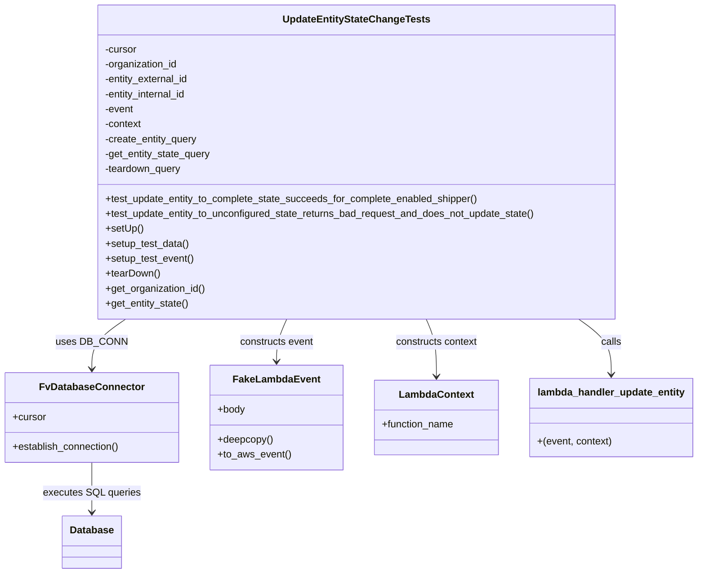
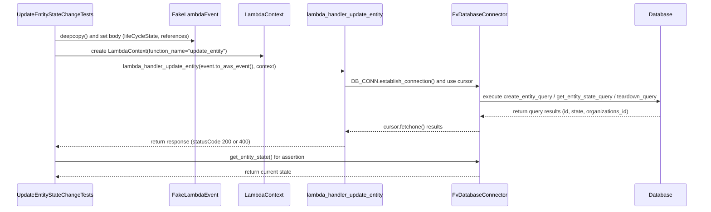

# Diagram: entity_core/entity_service/entity_service_tests/update_entity_tests/test_update_entity_state_change.py

> Auto-generated by Obscura crawlers

## Diagram 1

### SVG

<svg id="container" width="1106.609375" xmlns="http://www.w3.org/2000/svg" class="classDiagram" height="920" viewBox="0 0 1106.609375 920" role="graphics-document document" aria-roledescription="class"><g><defs><marker id="container_class-aggregationStart" class="marker aggregation class" refX="18" refY="7" markerWidth="190" markerHeight="240" orient="auto"><path d="M 18,7 L9,13 L1,7 L9,1 Z"></path></marker></defs><defs><marker id="container_class-aggregationEnd" class="marker aggregation class" refX="1" refY="7" markerWidth="20" markerHeight="28" orient="auto"><path d="M 18,7 L9,13 L1,7 L9,1 Z"></path></marker></defs><defs><marker id="container_class-extensionStart" class="marker extension class" refX="18" refY="7" markerWidth="190" markerHeight="240" orient="auto"><path d="M 1,7 L18,13 V 1 Z"></path></marker></defs><defs><marker id="container_class-extensionEnd" class="marker extension class" refX="1" refY="7" markerWidth="20" markerHeight="28" orient="auto"><path d="M 1,1 V 13 L18,7 Z"></path></marker></defs><defs><marker id="container_class-compositionStart" class="marker composition class" refX="18" refY="7" markerWidth="190" markerHeight="240" orient="auto"><path d="M 18,7 L9,13 L1,7 L9,1 Z"></path></marker></defs><defs><marker id="container_class-compositionEnd" class="marker composition class" refX="1" refY="7" markerWidth="20" markerHeight="28" orient="auto"><path d="M 18,7 L9,13 L1,7 L9,1 Z"></path></marker></defs><defs><marker id="container_class-dependencyStart" class="marker dependency class" refX="6" refY="7" markerWidth="190" markerHeight="240" orient="auto"><path d="M 5,7 L9,13 L1,7 L9,1 Z"></path></marker></defs><defs><marker id="container_class-dependencyEnd" class="marker dependency class" refX="13" refY="7" markerWidth="20" markerHeight="28" orient="auto"><path d="M 18,7 L9,13 L14,7 L9,1 Z"></path></marker></defs><defs><marker id="container_class-lollipopStart" class="marker lollipop class" refX="13" refY="7" markerWidth="190" markerHeight="240" orient="auto"><circle stroke="black" fill="transparent" cx="7" cy="7" r="6"></circle></marker></defs><defs><marker id="container_class-lollipopEnd" class="marker lollipop class" refX="1" refY="7" markerWidth="190" markerHeight="240" orient="auto"><circle stroke="black" fill="transparent" cx="7" cy="7" r="6"></circle></marker></defs><g class="root"><g class="clusters"></g><g class="edgePaths"><path d="M199.755,512L190.844,518.167C181.932,524.333,164.109,536.667,155.197,550C146.285,563.333,146.285,577.667,146.285,584.833L146.285,592" id="id_UpdateEntityStateChangeTests_FvDatabaseConnector_1" class="edge-thickness-normal edge-pattern-solid relation" style=";;;" data-edge="true" data-et="edge" data-id="id_UpdateEntityStateChangeTests_FvDatabaseConnector_1" data-points="W3sieCI6MTk5Ljc1NTQ2NzM5ODM1NjQyLCJ5Ijo1MTJ9LHsieCI6MTQ2LjI4NTE1NjI1LCJ5Ijo1NDl9LHsieCI6MTQ2LjI4NTE1NjI1LCJ5Ijo1OTh9XQ==" marker-end="url(#container_class-dependencyEnd)"></path><path d="M453.874,512L451.181,518.167C448.488,524.333,443.101,536.667,440.408,548C437.715,559.333,437.715,569.667,437.715,574.833L437.715,580" id="id_UpdateEntityStateChangeTests_FakeLambdaEvent_2" class="edge-thickness-normal edge-pattern-solid relation" style=";;;" data-edge="true" data-et="edge" data-id="id_UpdateEntityStateChangeTests_FakeLambdaEvent_2" data-points="W3sieCI6NDUzLjg3NDA4NzY0MDU3MDksInkiOjUxMn0seyJ4Ijo0MzcuNzE0ODQzNzUsInkiOjU0OX0seyJ4Ijo0MzcuNzE0ODQzNzUsInkiOjU4Nn1d" marker-end="url(#container_class-dependencyEnd)"></path><path d="M673.989,512L676.682,518.167C679.376,524.333,684.762,536.667,687.455,552C690.148,567.333,690.148,585.667,690.148,594.833L690.148,604" id="id_UpdateEntityStateChangeTests_LambdaContext_3" class="edge-thickness-normal edge-pattern-solid relation" style=";;;" data-edge="true" data-et="edge" data-id="id_UpdateEntityStateChangeTests_LambdaContext_3" data-points="W3sieCI6NjczLjk4OTE5MzYwOTQyOTEsInkiOjUxMn0seyJ4Ijo2OTAuMTQ4NDM3NSwieSI6NTQ5fSx7IngiOjY5MC4xNDg0Mzc1LCJ5Ijo2MTB9XQ==" marker-end="url(#container_class-dependencyEnd)"></path><path d="M917.16,512L925.804,518.167C934.448,524.333,951.736,536.667,960.38,551.5C969.023,566.333,969.023,583.667,969.023,592.333L969.023,601" id="id_UpdateEntityStateChangeTests_lambda_handler_update_entity_4" class="edge-thickness-normal edge-pattern-solid relation" style=";;;" data-edge="true" data-et="edge" data-id="id_UpdateEntityStateChangeTests_lambda_handler_update_entity_4" data-points="W3sieCI6OTE3LjE2MDQ3Mzg4NjI0NTcsInkiOjUxMn0seyJ4Ijo5NjkuMDIzNDM3NSwieSI6NTQ5fSx7IngiOjk2OS4wMjM0Mzc1LCJ5Ijo2MDd9XQ==" marker-end="url(#container_class-dependencyEnd)"></path><path d="M146.285,742L146.285,750.167C146.285,758.333,146.285,774.667,146.285,788C146.285,801.333,146.285,811.667,146.285,816.833L146.285,822" id="id_FvDatabaseConnector_Database_5" class="edge-thickness-normal edge-pattern-solid relation" style=";;;" data-edge="true" data-et="edge" data-id="id_FvDatabaseConnector_Database_5" data-points="W3sieCI6MTQ2LjI4NTE1NjI1LCJ5Ijo3NDJ9LHsieCI6MTQ2LjI4NTE1NjI1LCJ5Ijo3OTF9LHsieCI6MTQ2LjI4NTE1NjI1LCJ5Ijo4Mjh9XQ==" marker-end="url(#container_class-dependencyEnd)"></path></g><g class="edgeLabels"><g class="edgeLabel" transform="translate(146.28515625, 549)"><g class="label" data-id="id_UpdateEntityStateChangeTests_FvDatabaseConnector_1" transform="translate(-53.09375, -12)"><foreignObject width="106.1875" height="24">

uses DB_CONN

</foreignObject></g></g><g class="edgeLabel" transform="translate(437.71484375, 549)"><g class="label" data-id="id_UpdateEntityStateChangeTests_FakeLambdaEvent_2" transform="translate(-60.1328125, -12)"><foreignObject width="120.265625" height="24">

constructs event

</foreignObject></g></g><g class="edgeLabel" transform="translate(690.1484375, 549)"><g class="label" data-id="id_UpdateEntityStateChangeTests_LambdaContext_3" transform="translate(-66.8125, -12)"><foreignObject width="133.625" height="24">

constructs context

</foreignObject></g></g><g class="edgeLabel" transform="translate(969.0234375, 549)"><g class="label" data-id="id_UpdateEntityStateChangeTests_lambda_handler_update_entity_4" transform="translate(-16.4453125, -12)"><foreignObject width="32.890625" height="24">

calls

</foreignObject></g></g><g class="edgeLabel" transform="translate(146.28515625, 791)"><g class="label" data-id="id_FvDatabaseConnector_Database_5" transform="translate(-77.078125, -12)"><foreignObject width="154.15625" height="24">

executes SQL queries

</foreignObject></g></g></g><g class="nodes"><g class="node default" id="classId-UpdateEntityStateChangeTests-0" transform="translate(563.931640625, 260)"><g class="basic label-container"><path d="M-418.04296875 -252 L418.04296875 -252 L418.04296875 252 L-418.04296875 252" stroke="none" stroke-width="0" fill="#ECECFF" style=""></path><path d="M-418.04296875 -252 C-192.46221131062882 -252, 33.118546128742366 -252, 418.04296875 -252 M-418.04296875 -252 C-216.61945229849556 -252, -15.19593584699112 -252, 418.04296875 -252 M418.04296875 -252 C418.04296875 -82.19772421961792, 418.04296875 87.60455156076415, 418.04296875 252 M418.04296875 -252 C418.04296875 -53.67741632845551, 418.04296875 144.64516734308899, 418.04296875 252 M418.04296875 252 C132.45162962238743 252, -153.13970950522514 252, -418.04296875 252 M418.04296875 252 C207.9591168203221 252, -2.124735109355811 252, -418.04296875 252 M-418.04296875 252 C-418.04296875 104.84058181252811, -418.04296875 -42.31883637494377, -418.04296875 -252 M-418.04296875 252 C-418.04296875 86.87107288855216, -418.04296875 -78.25785422289567, -418.04296875 -252" stroke="#9370DB" stroke-width="1.3" fill="none" stroke-dasharray="0 0" style=""></path></g><g class="annotation-group text" transform="translate(0, -228)"></g><g class="label-group text" transform="translate(-113.0234375, -228)"><g class="label" style="font-weight: bolder" transform="translate(0,-12)"><foreignObject width="226.046875" height="24">

UpdateEntityStateChangeTests

</foreignObject></g></g><g class="members-group text" transform="translate(-406.04296875, -180)"><g class="label" style="" transform="translate(0,-12)"><foreignObject width="52.1875" height="24">

-cursor

</foreignObject></g><g class="label" style="" transform="translate(0,12)"><foreignObject width="119.203125" height="24">

-organization_id

</foreignObject></g><g class="label" style="" transform="translate(0,36)"><foreignObject width="137.703125" height="24">

-entity_external_id

</foreignObject></g><g class="label" style="" transform="translate(0,60)"><foreignObject width="135.578125" height="24">

-entity_internal_id

</foreignObject></g><g class="label" style="" transform="translate(0,84)"><foreignObject width="46.796875" height="24">

-event

</foreignObject></g><g class="label" style="" transform="translate(0,108)"><foreignObject width="60.15625" height="24">

-context

</foreignObject></g><g class="label" style="" transform="translate(0,132)"><foreignObject width="150.125" height="24">

-create_entity_query

</foreignObject></g><g class="label" style="" transform="translate(0,156)"><foreignObject width="172.234375" height="24">

-get_entity_state_query

</foreignObject></g><g class="label" style="" transform="translate(0,180)"><foreignObject width="124.28125" height="24">

-teardown_query

</foreignObject></g></g><g class="methods-group text" transform="translate(-406.04296875, 60)"><g class="label" style="" transform="translate(0,-12)"><foreignObject width="603.390625" height="24">

+test_update_entity_to_complete_state_succeeds_for_complete_enabled_shipper()

</foreignObject></g><g class="label" style="" transform="translate(0,12)"><foreignObject width="699.0625" height="24">

+test_update_entity_to_unconfigured_state_returns_bad_request_and_does_not_update_state()

</foreignObject></g><g class="label" style="" transform="translate(0,36)"><foreignObject width="60.421875" height="24">

+setUp()

</foreignObject></g><g class="label" style="" transform="translate(0,60)"><foreignObject width="134.96875" height="24">

+setup_test_data()

</foreignObject></g><g class="label" style="" transform="translate(0,84)"><foreignObject width="142.671875" height="24">

+setup_test_event()

</foreignObject></g><g class="label" style="" transform="translate(0,108)"><foreignObject width="87.75" height="24">

+tearDown()

</foreignObject></g><g class="label" style="" transform="translate(0,132)"><foreignObject width="161.671875" height="24">

+get_organization_id()

</foreignObject></g><g class="label" style="" transform="translate(0,156)"><foreignObject width="134.8125" height="24">

+get_entity_state()

</foreignObject></g></g><g class="divider" style=""><path d="M-418.04296875 -204 C-179.95651255291003 -204, 58.129943644179946 -204, 418.04296875 -204 M-418.04296875 -204 C-178.25417315959825 -204, 61.534622430803495 -204, 418.04296875 -204" stroke="#9370DB" stroke-width="1.3" fill="none" stroke-dasharray="0 0" style=""></path></g><g class="divider" style=""><path d="M-418.04296875 36 C-236.95628847566613 36, -55.869608201332255 36, 418.04296875 36 M-418.04296875 36 C-103.3517717203286 36, 211.3394253093428 36, 418.04296875 36" stroke="#9370DB" stroke-width="1.3" fill="none" stroke-dasharray="0 0" style=""></path></g></g><g class="node default" id="classId-FvDatabaseConnector-1" transform="translate(146.28515625, 670)"><g class="basic label-container"><path d="M-138.28515625 -72 L138.28515625 -72 L138.28515625 72 L-138.28515625 72" stroke="none" stroke-width="0" fill="#ECECFF" style=""></path><path d="M-138.28515625 -72 C-31.22637276605957 -72, 75.83241071788086 -72, 138.28515625 -72 M-138.28515625 -72 C-69.79599487676906 -72, -1.3068335035381153 -72, 138.28515625 -72 M138.28515625 -72 C138.28515625 -36.12224016045565, 138.28515625 -0.24448032091129335, 138.28515625 72 M138.28515625 -72 C138.28515625 -32.64264883465767, 138.28515625 6.714702330684659, 138.28515625 72 M138.28515625 72 C68.69045335954564 72, -0.9042495309087144 72, -138.28515625 72 M138.28515625 72 C46.919602535379994 72, -44.44595117924001 72, -138.28515625 72 M-138.28515625 72 C-138.28515625 30.02406526229167, -138.28515625 -11.951869475416657, -138.28515625 -72 M-138.28515625 72 C-138.28515625 23.91376539555131, -138.28515625 -24.172469208897382, -138.28515625 -72" stroke="#9370DB" stroke-width="1.3" fill="none" stroke-dasharray="0 0" style=""></path></g><g class="annotation-group text" transform="translate(0, -48)"></g><g class="label-group text" transform="translate(-79.3046875, -48)"><g class="label" style="font-weight: bolder" transform="translate(0,-12)"><foreignObject width="158.609375" height="24">

FvDatabaseConnector

</foreignObject></g></g><g class="members-group text" transform="translate(-126.28515625, 0)"><g class="label" style="" transform="translate(0,-12)"><foreignObject width="53.71875" height="24">

+cursor

</foreignObject></g></g><g class="methods-group text" transform="translate(-126.28515625, 48)"><g class="label" style="" transform="translate(0,-12)"><foreignObject width="173.265625" height="24">

+establish_connection()

</foreignObject></g></g><g class="divider" style=""><path d="M-138.28515625 -24 C-44.768337635260295 -24, 48.74848097947941 -24, 138.28515625 -24 M-138.28515625 -24 C-46.258006605821464 -24, 45.76914303835707 -24, 138.28515625 -24" stroke="#9370DB" stroke-width="1.3" fill="none" stroke-dasharray="0 0" style=""></path></g><g class="divider" style=""><path d="M-138.28515625 24 C-74.29957641474968 24, -10.313996579499374 24, 138.28515625 24 M-138.28515625 24 C-54.56529506145033 24, 29.154566127099343 24, 138.28515625 24" stroke="#9370DB" stroke-width="1.3" fill="none" stroke-dasharray="0 0" style=""></path></g></g><g class="node default" id="classId-FakeLambdaEvent-2" transform="translate(437.71484375, 670)"><g class="basic label-container"><path d="M-103.14453125 -84 L103.14453125 -84 L103.14453125 84 L-103.14453125 84" stroke="none" stroke-width="0" fill="#ECECFF" style=""></path><path d="M-103.14453125 -84 C-61.104494986983774 -84, -19.064458723967547 -84, 103.14453125 -84 M-103.14453125 -84 C-31.950433163441787 -84, 39.24366492311643 -84, 103.14453125 -84 M103.14453125 -84 C103.14453125 -38.502090809178426, 103.14453125 6.995818381643147, 103.14453125 84 M103.14453125 -84 C103.14453125 -37.0227299530911, 103.14453125 9.954540093817798, 103.14453125 84 M103.14453125 84 C59.030523727819954 84, 14.916516205639908 84, -103.14453125 84 M103.14453125 84 C32.75245221639862 84, -37.63962681720275 84, -103.14453125 84 M-103.14453125 84 C-103.14453125 36.40179892472016, -103.14453125 -11.196402150559678, -103.14453125 -84 M-103.14453125 84 C-103.14453125 21.48850183216439, -103.14453125 -41.02299633567122, -103.14453125 -84" stroke="#9370DB" stroke-width="1.3" fill="none" stroke-dasharray="0 0" style=""></path></g><g class="annotation-group text" transform="translate(0, -60)"></g><g class="label-group text" transform="translate(-65.8671875, -60)"><g class="label" style="font-weight: bolder" transform="translate(0,-12)"><foreignObject width="131.734375" height="24">

FakeLambdaEvent

</foreignObject></g></g><g class="members-group text" transform="translate(-91.14453125, -12)"><g class="label" style="" transform="translate(0,-12)"><foreignObject width="44.28125" height="24">

+body

</foreignObject></g></g><g class="methods-group text" transform="translate(-91.14453125, 36)"><g class="label" style="" transform="translate(0,-12)"><foreignObject width="88.859375" height="24">

+deepcopy()

</foreignObject></g><g class="label" style="" transform="translate(0,12)"><foreignObject width="116.421875" height="24">

+to_aws_event()

</foreignObject></g></g><g class="divider" style=""><path d="M-103.14453125 -36 C-21.661516931287963 -36, 59.821497387424074 -36, 103.14453125 -36 M-103.14453125 -36 C-48.84396120511253 -36, 5.456608839774944 -36, 103.14453125 -36" stroke="#9370DB" stroke-width="1.3" fill="none" stroke-dasharray="0 0" style=""></path></g><g class="divider" style=""><path d="M-103.14453125 12 C-50.617634380215065 12, 1.909262489569869 12, 103.14453125 12 M-103.14453125 12 C-48.531007629523906 12, 6.082515990952189 12, 103.14453125 12" stroke="#9370DB" stroke-width="1.3" fill="none" stroke-dasharray="0 0" style=""></path></g></g><g class="node default" id="classId-LambdaContext-3" transform="translate(690.1484375, 670)"><g class="basic label-container"><path d="M-99.2890625 -60 L99.2890625 -60 L99.2890625 60 L-99.2890625 60" stroke="none" stroke-width="0" fill="#ECECFF" style=""></path><path d="M-99.2890625 -60 C-36.874686576213655 -60, 25.53968934757269 -60, 99.2890625 -60 M-99.2890625 -60 C-40.27019613907272 -60, 18.748670221854553 -60, 99.2890625 -60 M99.2890625 -60 C99.2890625 -25.84909521938299, 99.2890625 8.301809561234023, 99.2890625 60 M99.2890625 -60 C99.2890625 -13.883650086080713, 99.2890625 32.23269982783857, 99.2890625 60 M99.2890625 60 C44.71766891716102 60, -9.853724665677959 60, -99.2890625 60 M99.2890625 60 C25.527035732431756 60, -48.23499103513649 60, -99.2890625 60 M-99.2890625 60 C-99.2890625 12.404363731259437, -99.2890625 -35.191272537481126, -99.2890625 -60 M-99.2890625 60 C-99.2890625 19.090895392766257, -99.2890625 -21.818209214467487, -99.2890625 -60" stroke="#9370DB" stroke-width="1.3" fill="none" stroke-dasharray="0 0" style=""></path></g><g class="annotation-group text" transform="translate(0, -36)"></g><g class="label-group text" transform="translate(-57.296875, -36)"><g class="label" style="font-weight: bolder" transform="translate(0,-12)"><foreignObject width="114.59375" height="24">

LambdaContext

</foreignObject></g></g><g class="members-group text" transform="translate(-87.2890625, 12)"><g class="label" style="" transform="translate(0,-12)"><foreignObject width="117.28125" height="24">

+function_name

</foreignObject></g></g><g class="methods-group text" transform="translate(-87.2890625, 60)"></g><g class="divider" style=""><path d="M-99.2890625 -12 C-24.171574720092437 -12, 50.945913059815126 -12, 99.2890625 -12 M-99.2890625 -12 C-30.845843090540924 -12, 37.59737631891815 -12, 99.2890625 -12" stroke="#9370DB" stroke-width="1.3" fill="none" stroke-dasharray="0 0" style=""></path></g><g class="divider" style=""><path d="M-99.2890625 36 C-32.33528366598229 36, 34.61849516803542 36, 99.2890625 36 M-99.2890625 36 C-46.7098047759222 36, 5.8694529481555975 36, 99.2890625 36" stroke="#9370DB" stroke-width="1.3" fill="none" stroke-dasharray="0 0" style=""></path></g></g><g class="node default" id="classId-lambda_handler_update_entity-4" transform="translate(969.0234375, 670)"><g class="basic label-container"><path d="M-129.5859375 -63 L129.5859375 -63 L129.5859375 63 L-129.5859375 63" stroke="none" stroke-width="0" fill="#ECECFF" style=""></path><path d="M-129.5859375 -63 C-66.80976983754663 -63, -4.03360217509325 -63, 129.5859375 -63 M-129.5859375 -63 C-71.81709128797291 -63, -14.048245075945829 -63, 129.5859375 -63 M129.5859375 -63 C129.5859375 -21.87086576568946, 129.5859375 19.258268468621083, 129.5859375 63 M129.5859375 -63 C129.5859375 -19.442010419343333, 129.5859375 24.115979161313334, 129.5859375 63 M129.5859375 63 C42.51864062736631 63, -44.54865624526738 63, -129.5859375 63 M129.5859375 63 C45.718930969398144 63, -38.14807556120371 63, -129.5859375 63 M-129.5859375 63 C-129.5859375 20.399176935881187, -129.5859375 -22.201646128237627, -129.5859375 -63 M-129.5859375 63 C-129.5859375 35.97128803496959, -129.5859375 8.942576069939186, -129.5859375 -63" stroke="#9370DB" stroke-width="1.3" fill="none" stroke-dasharray="0 0" style=""></path></g><g class="annotation-group text" transform="translate(0, -39)"></g><g class="label-group text" transform="translate(-114.640625, -39)"><g class="label" style="font-weight: bolder" transform="translate(0,-12)"><foreignObject width="229.28125" height="24">

lambda_handler_update_entity

</foreignObject></g></g><g class="members-group text" transform="translate(-117.5859375, 9)"></g><g class="methods-group text" transform="translate(-117.5859375, 39)"><g class="label" style="" transform="translate(0,-12)"><foreignObject width="120.53125" height="24">

+(event, context)

</foreignObject></g></g><g class="divider" style=""><path d="M-129.5859375 -15 C-32.48428982705103 -15, 64.61735784589794 -15, 129.5859375 -15 M-129.5859375 -15 C-69.25816766052814 -15, -8.930397821056289 -15, 129.5859375 -15" stroke="#9370DB" stroke-width="1.3" fill="none" stroke-dasharray="0 0" style=""></path></g><g class="divider" style=""><path d="M-129.5859375 9 C-52.82786080658936 9, 23.930215886821287 9, 129.5859375 9 M-129.5859375 9 C-67.99332878283053 9, -6.400720065661076 9, 129.5859375 9" stroke="#9370DB" stroke-width="1.3" fill="none" stroke-dasharray="0 0" style=""></path></g></g><g class="node default" id="classId-Database-5" transform="translate(146.28515625, 870)"><g class="basic label-container"><path d="M-46.171875 -42 L46.171875 -42 L46.171875 42 L-46.171875 42" stroke="none" stroke-width="0" fill="#ECECFF" style=""></path><path d="M-46.171875 -42 C-21.581601314702958 -42, 3.008672370594084 -42, 46.171875 -42 M-46.171875 -42 C-25.36116844610488 -42, -4.550461892209761 -42, 46.171875 -42 M46.171875 -42 C46.171875 -17.19794603698765, 46.171875 7.604107926024703, 46.171875 42 M46.171875 -42 C46.171875 -12.526058703953385, 46.171875 16.94788259209323, 46.171875 42 M46.171875 42 C15.065918094684012 42, -16.040038810631977 42, -46.171875 42 M46.171875 42 C15.798322851325246 42, -14.575229297349509 42, -46.171875 42 M-46.171875 42 C-46.171875 23.344185451316438, -46.171875 4.688370902632876, -46.171875 -42 M-46.171875 42 C-46.171875 17.243132826315648, -46.171875 -7.513734347368704, -46.171875 -42" stroke="#9370DB" stroke-width="1.3" fill="none" stroke-dasharray="0 0" style=""></path></g><g class="annotation-group text" transform="translate(0, -18)"></g><g class="label-group text" transform="translate(-34.171875, -18)"><g class="label" style="font-weight: bolder" transform="translate(0,-12)"><foreignObject width="68.34375" height="24">

Database

</foreignObject></g></g><g class="members-group text" transform="translate(-34.171875, 30)"></g><g class="methods-group text" transform="translate(-34.171875, 60)"></g><g class="divider" style=""><path d="M-46.171875 6 C-20.92755837689472 6, 4.316758246210561 6, 46.171875 6 M-46.171875 6 C-16.38270621627408 6, 13.40646256745184 6, 46.171875 6" stroke="#9370DB" stroke-width="1.3" fill="none" stroke-dasharray="0 0" style=""></path></g><g class="divider" style=""><path d="M-46.171875 24 C-20.627342343490415 24, 4.917190313019169 24, 46.171875 24 M-46.171875 24 C-13.725968360047894 24, 18.719938279904213 24, 46.171875 24" stroke="#9370DB" stroke-width="1.3" fill="none" stroke-dasharray="0 0" style=""></path></g></g></g></g></g></svg>

## Diagram 2

### SVG

<svg id="container" width="2200.5" xmlns="http://www.w3.org/2000/svg" height="651" viewBox="-50 -10 2200.5 651" role="graphics-document document" aria-roledescription="sequence"><g><rect x="1950.5" y="565" fill="#eaeaea" stroke="#666" width="150" height="65" name="SQL" rx="3" ry="3" class="actor actor-bottom"></rect><text x="2025.5" y="597.5" dominant-baseline="central" alignment-baseline="central" class="actor actor-box" style="text-anchor: middle; font-size: 16px; font-weight: 400;"><tspan x="2025.5" dy="0">Database</tspan></text></g><g><rect x="1346" y="565" fill="#eaeaea" stroke="#666" width="177" height="65" name="DB" rx="3" ry="3" class="actor actor-bottom"></rect><text x="1434.5" y="597.5" dominant-baseline="central" alignment-baseline="central" class="actor actor-box" style="text-anchor: middle; font-size: 16px; font-weight: 400;"><tspan x="1434.5" dy="0">FvDatabaseConnector</tspan></text></g><g><rect x="891" y="565" fill="#eaeaea" stroke="#666" width="247" height="65" name="Handler" rx="3" ry="3" class="actor actor-bottom"></rect><text x="1014.5" y="597.5" dominant-baseline="central" alignment-baseline="central" class="actor actor-box" style="text-anchor: middle; font-size: 16px; font-weight: 400;"><tspan x="1014.5" dy="0">lambda_handler_update_entity</tspan></text></g><g><rect x="691" y="565" fill="#eaeaea" stroke="#666" width="150" height="65" name="Context" rx="3" ry="3" class="actor actor-bottom"></rect><text x="766" y="597.5" dominant-baseline="central" alignment-baseline="central" class="actor actor-box" style="text-anchor: middle; font-size: 16px; font-weight: 400;"><tspan x="766" dy="0">LambdaContext</tspan></text></g><g><rect x="490" y="565" fill="#eaeaea" stroke="#666" width="151" height="65" name="Event" rx="3" ry="3" class="actor actor-bottom"></rect><text x="565.5" y="597.5" dominant-baseline="central" alignment-baseline="central" class="actor actor-box" style="text-anchor: middle; font-size: 16px; font-weight: 400;"><tspan x="565.5" dy="0">FakeLambdaEvent</tspan></text></g><g><rect x="0" y="565" fill="#eaeaea" stroke="#666" width="241" height="65" name="Test" rx="3" ry="3" class="actor actor-bottom"></rect><text x="120.5" y="597.5" dominant-baseline="central" alignment-baseline="central" class="actor actor-box" style="text-anchor: middle; font-size: 16px; font-weight: 400;"><tspan x="120.5" dy="0">UpdateEntityStateChangeTests</tspan></text></g><g><line id="actor5" x1="2025.5" y1="65" x2="2025.5" y2="565" class="actor-line 200" stroke-width="0.5px" stroke="#999" name="SQL"></line><g id="root-5"><rect x="1950.5" y="0" fill="#eaeaea" stroke="#666" width="150" height="65" name="SQL" rx="3" ry="3" class="actor actor-top"></rect><text x="2025.5" y="32.5" dominant-baseline="central" alignment-baseline="central" class="actor actor-box" style="text-anchor: middle; font-size: 16px; font-weight: 400;"><tspan x="2025.5" dy="0">Database</tspan></text></g></g><g><line id="actor4" x1="1434.5" y1="65" x2="1434.5" y2="565" class="actor-line 200" stroke-width="0.5px" stroke="#999" name="DB"></line><g id="root-4"><rect x="1346" y="0" fill="#eaeaea" stroke="#666" width="177" height="65" name="DB" rx="3" ry="3" class="actor actor-top"></rect><text x="1434.5" y="32.5" dominant-baseline="central" alignment-baseline="central" class="actor actor-box" style="text-anchor: middle; font-size: 16px; font-weight: 400;"><tspan x="1434.5" dy="0">FvDatabaseConnector</tspan></text></g></g><g><line id="actor3" x1="1014.5" y1="65" x2="1014.5" y2="565" class="actor-line 200" stroke-width="0.5px" stroke="#999" name="Handler"></line><g id="root-3"><rect x="891" y="0" fill="#eaeaea" stroke="#666" width="247" height="65" name="Handler" rx="3" ry="3" class="actor actor-top"></rect><text x="1014.5" y="32.5" dominant-baseline="central" alignment-baseline="central" class="actor actor-box" style="text-anchor: middle; font-size: 16px; font-weight: 400;"><tspan x="1014.5" dy="0">lambda_handler_update_entity</tspan></text></g></g><g><line id="actor2" x1="766" y1="65" x2="766" y2="565" class="actor-line 200" stroke-width="0.5px" stroke="#999" name="Context"></line><g id="root-2"><rect x="691" y="0" fill="#eaeaea" stroke="#666" width="150" height="65" name="Context" rx="3" ry="3" class="actor actor-top"></rect><text x="766" y="32.5" dominant-baseline="central" alignment-baseline="central" class="actor actor-box" style="text-anchor: middle; font-size: 16px; font-weight: 400;"><tspan x="766" dy="0">LambdaContext</tspan></text></g></g><g><line id="actor1" x1="565.5" y1="65" x2="565.5" y2="565" class="actor-line 200" stroke-width="0.5px" stroke="#999" name="Event"></line><g id="root-1"><rect x="490" y="0" fill="#eaeaea" stroke="#666" width="151" height="65" name="Event" rx="3" ry="3" class="actor actor-top"></rect><text x="565.5" y="32.5" dominant-baseline="central" alignment-baseline="central" class="actor actor-box" style="text-anchor: middle; font-size: 16px; font-weight: 400;"><tspan x="565.5" dy="0">FakeLambdaEvent</tspan></text></g></g><g><line id="actor0" x1="120.5" y1="65" x2="120.5" y2="565" class="actor-line 200" stroke-width="0.5px" stroke="#999" name="Test"></line><g id="root-0"><rect x="0" y="0" fill="#eaeaea" stroke="#666" width="241" height="65" name="Test" rx="3" ry="3" class="actor actor-top"></rect><text x="120.5" y="32.5" dominant-baseline="central" alignment-baseline="central" class="actor actor-box" style="text-anchor: middle; font-size: 16px; font-weight: 400;"><tspan x="120.5" dy="0">UpdateEntityStateChangeTests</tspan></text></g></g><g></g><defs><symbol id="computer" width="24" height="24"><path transform="scale(.5)" d="M2 2v13h20v-13h-20zm18 11h-16v-9h16v9zm-10.228 6l.466-1h3.524l.467 1h-4.457zm14.228 3h-24l2-6h2.104l-1.33 4h18.45l-1.297-4h2.073l2 6zm-5-10h-14v-7h14v7z"></path></symbol></defs><defs><symbol id="database" fill-rule="evenodd" clip-rule="evenodd"><path transform="scale(.5)" d="M12.258.001l.256.004.255.005.253.008.251.01.249.012.247.015.246.016.242.019.241.02.239.023.236.024.233.027.231.028.229.031.225.032.223.034.22.036.217.038.214.04.211.041.208.043.205.045.201.046.198.048.194.05.191.051.187.053.183.054.18.056.175.057.172.059.168.06.163.061.16.063.155.064.15.066.074.033.073.033.071.034.07.034.069.035.068.035.067.035.066.035.064.036.064.036.062.036.06.036.06.037.058.037.058.037.055.038.055.038.053.038.052.038.051.039.05.039.048.039.047.039.045.04.044.04.043.04.041.04.04.041.039.041.037.041.036.041.034.041.033.042.032.042.03.042.029.042.027.042.026.043.024.043.023.043.021.043.02.043.018.044.017.043.015.044.013.044.012.044.011.045.009.044.007.045.006.045.004.045.002.045.001.045v17l-.001.045-.002.045-.004.045-.006.045-.007.045-.009.044-.011.045-.012.044-.013.044-.015.044-.017.043-.018.044-.02.043-.021.043-.023.043-.024.043-.026.043-.027.042-.029.042-.03.042-.032.042-.033.042-.034.041-.036.041-.037.041-.039.041-.04.041-.041.04-.043.04-.044.04-.045.04-.047.039-.048.039-.05.039-.051.039-.052.038-.053.038-.055.038-.055.038-.058.037-.058.037-.06.037-.06.036-.062.036-.064.036-.064.036-.066.035-.067.035-.068.035-.069.035-.07.034-.071.034-.073.033-.074.033-.15.066-.155.064-.16.063-.163.061-.168.06-.172.059-.175.057-.18.056-.183.054-.187.053-.191.051-.194.05-.198.048-.201.046-.205.045-.208.043-.211.041-.214.04-.217.038-.22.036-.223.034-.225.032-.229.031-.231.028-.233.027-.236.024-.239.023-.241.02-.242.019-.246.016-.247.015-.249.012-.251.01-.253.008-.255.005-.256.004-.258.001-.258-.001-.256-.004-.255-.005-.253-.008-.251-.01-.249-.012-.247-.015-.245-.016-.243-.019-.241-.02-.238-.023-.236-.024-.234-.027-.231-.028-.228-.031-.226-.032-.223-.034-.22-.036-.217-.038-.214-.04-.211-.041-.208-.043-.204-.045-.201-.046-.198-.048-.195-.05-.19-.051-.187-.053-.184-.054-.179-.056-.176-.057-.172-.059-.167-.06-.164-.061-.159-.063-.155-.064-.151-.066-.074-.033-.072-.033-.072-.034-.07-.034-.069-.035-.068-.035-.067-.035-.066-.035-.064-.036-.063-.036-.062-.036-.061-.036-.06-.037-.058-.037-.057-.037-.056-.038-.055-.038-.053-.038-.052-.038-.051-.039-.049-.039-.049-.039-.046-.039-.046-.04-.044-.04-.043-.04-.041-.04-.04-.041-.039-.041-.037-.041-.036-.041-.034-.041-.033-.042-.032-.042-.03-.042-.029-.042-.027-.042-.026-.043-.024-.043-.023-.043-.021-.043-.02-.043-.018-.044-.017-.043-.015-.044-.013-.044-.012-.044-.011-.045-.009-.044-.007-.045-.006-.045-.004-.045-.002-.045-.001-.045v-17l.001-.045.002-.045.004-.045.006-.045.007-.045.009-.044.011-.045.012-.044.013-.044.015-.044.017-.043.018-.044.02-.043.021-.043.023-.043.024-.043.026-.043.027-.042.029-.042.03-.042.032-.042.033-.042.034-.041.036-.041.037-.041.039-.041.04-.041.041-.04.043-.04.044-.04.046-.04.046-.039.049-.039.049-.039.051-.039.052-.038.053-.038.055-.038.056-.038.057-.037.058-.037.06-.037.061-.036.062-.036.063-.036.064-.036.066-.035.067-.035.068-.035.069-.035.07-.034.072-.034.072-.033.074-.033.151-.066.155-.064.159-.063.164-.061.167-.06.172-.059.176-.057.179-.056.184-.054.187-.053.19-.051.195-.05.198-.048.201-.046.204-.045.208-.043.211-.041.214-.04.217-.038.22-.036.223-.034.226-.032.228-.031.231-.028.234-.027.236-.024.238-.023.241-.02.243-.019.245-.016.247-.015.249-.012.251-.01.253-.008.255-.005.256-.004.258-.001.258.001zm-9.258 20.499v.01l.001.021.003.021.004.022.005.021.006.022.007.022.009.023.01.022.011.023.012.023.013.023.015.023.016.024.017.023.018.024.019.024.021.024.022.025.023.024.024.025.052.049.056.05.061.051.066.051.07.051.075.051.079.052.084.052.088.052.092.052.097.052.102.051.105.052.11.052.114.051.119.051.123.051.127.05.131.05.135.05.139.048.144.049.147.047.152.047.155.047.16.045.163.045.167.043.171.043.176.041.178.041.183.039.187.039.19.037.194.035.197.035.202.033.204.031.209.03.212.029.216.027.219.025.222.024.226.021.23.02.233.018.236.016.24.015.243.012.246.01.249.008.253.005.256.004.259.001.26-.001.257-.004.254-.005.25-.008.247-.011.244-.012.241-.014.237-.016.233-.018.231-.021.226-.021.224-.024.22-.026.216-.027.212-.028.21-.031.205-.031.202-.034.198-.034.194-.036.191-.037.187-.039.183-.04.179-.04.175-.042.172-.043.168-.044.163-.045.16-.046.155-.046.152-.047.148-.048.143-.049.139-.049.136-.05.131-.05.126-.05.123-.051.118-.052.114-.051.11-.052.106-.052.101-.052.096-.052.092-.052.088-.053.083-.051.079-.052.074-.052.07-.051.065-.051.06-.051.056-.05.051-.05.023-.024.023-.025.021-.024.02-.024.019-.024.018-.024.017-.024.015-.023.014-.024.013-.023.012-.023.01-.023.01-.022.008-.022.006-.022.006-.022.004-.022.004-.021.001-.021.001-.021v-4.127l-.077.055-.08.053-.083.054-.085.053-.087.052-.09.052-.093.051-.095.05-.097.05-.1.049-.102.049-.105.048-.106.047-.109.047-.111.046-.114.045-.115.045-.118.044-.12.043-.122.042-.124.042-.126.041-.128.04-.13.04-.132.038-.134.038-.135.037-.138.037-.139.035-.142.035-.143.034-.144.033-.147.032-.148.031-.15.03-.151.03-.153.029-.154.027-.156.027-.158.026-.159.025-.161.024-.162.023-.163.022-.165.021-.166.02-.167.019-.169.018-.169.017-.171.016-.173.015-.173.014-.175.013-.175.012-.177.011-.178.01-.179.008-.179.008-.181.006-.182.005-.182.004-.184.003-.184.002h-.37l-.184-.002-.184-.003-.182-.004-.182-.005-.181-.006-.179-.008-.179-.008-.178-.01-.176-.011-.176-.012-.175-.013-.173-.014-.172-.015-.171-.016-.17-.017-.169-.018-.167-.019-.166-.02-.165-.021-.163-.022-.162-.023-.161-.024-.159-.025-.157-.026-.156-.027-.155-.027-.153-.029-.151-.03-.15-.03-.148-.031-.146-.032-.145-.033-.143-.034-.141-.035-.14-.035-.137-.037-.136-.037-.134-.038-.132-.038-.13-.04-.128-.04-.126-.041-.124-.042-.122-.042-.12-.044-.117-.043-.116-.045-.113-.045-.112-.046-.109-.047-.106-.047-.105-.048-.102-.049-.1-.049-.097-.05-.095-.05-.093-.052-.09-.051-.087-.052-.085-.053-.083-.054-.08-.054-.077-.054v4.127zm0-5.654v.011l.001.021.003.021.004.021.005.022.006.022.007.022.009.022.01.022.011.023.012.023.013.023.015.024.016.023.017.024.018.024.019.024.021.024.022.024.023.025.024.024.052.05.056.05.061.05.066.051.07.051.075.052.079.051.084.052.088.052.092.052.097.052.102.052.105.052.11.051.114.051.119.052.123.05.127.051.131.05.135.049.139.049.144.048.147.048.152.047.155.046.16.045.163.045.167.044.171.042.176.042.178.04.183.04.187.038.19.037.194.036.197.034.202.033.204.032.209.03.212.028.216.027.219.025.222.024.226.022.23.02.233.018.236.016.24.014.243.012.246.01.249.008.253.006.256.003.259.001.26-.001.257-.003.254-.006.25-.008.247-.01.244-.012.241-.015.237-.016.233-.018.231-.02.226-.022.224-.024.22-.025.216-.027.212-.029.21-.03.205-.032.202-.033.198-.035.194-.036.191-.037.187-.039.183-.039.179-.041.175-.042.172-.043.168-.044.163-.045.16-.045.155-.047.152-.047.148-.048.143-.048.139-.05.136-.049.131-.05.126-.051.123-.051.118-.051.114-.052.11-.052.106-.052.101-.052.096-.052.092-.052.088-.052.083-.052.079-.052.074-.051.07-.052.065-.051.06-.05.056-.051.051-.049.023-.025.023-.024.021-.025.02-.024.019-.024.018-.024.017-.024.015-.023.014-.023.013-.024.012-.022.01-.023.01-.023.008-.022.006-.022.006-.022.004-.021.004-.022.001-.021.001-.021v-4.139l-.077.054-.08.054-.083.054-.085.052-.087.053-.09.051-.093.051-.095.051-.097.05-.1.049-.102.049-.105.048-.106.047-.109.047-.111.046-.114.045-.115.044-.118.044-.12.044-.122.042-.124.042-.126.041-.128.04-.13.039-.132.039-.134.038-.135.037-.138.036-.139.036-.142.035-.143.033-.144.033-.147.033-.148.031-.15.03-.151.03-.153.028-.154.028-.156.027-.158.026-.159.025-.161.024-.162.023-.163.022-.165.021-.166.02-.167.019-.169.018-.169.017-.171.016-.173.015-.173.014-.175.013-.175.012-.177.011-.178.009-.179.009-.179.007-.181.007-.182.005-.182.004-.184.003-.184.002h-.37l-.184-.002-.184-.003-.182-.004-.182-.005-.181-.007-.179-.007-.179-.009-.178-.009-.176-.011-.176-.012-.175-.013-.173-.014-.172-.015-.171-.016-.17-.017-.169-.018-.167-.019-.166-.02-.165-.021-.163-.022-.162-.023-.161-.024-.159-.025-.157-.026-.156-.027-.155-.028-.153-.028-.151-.03-.15-.03-.148-.031-.146-.033-.145-.033-.143-.033-.141-.035-.14-.036-.137-.036-.136-.037-.134-.038-.132-.039-.13-.039-.128-.04-.126-.041-.124-.042-.122-.043-.12-.043-.117-.044-.116-.044-.113-.046-.112-.046-.109-.046-.106-.047-.105-.048-.102-.049-.1-.049-.097-.05-.095-.051-.093-.051-.09-.051-.087-.053-.085-.052-.083-.054-.08-.054-.077-.054v4.139zm0-5.666v.011l.001.02.003.022.004.021.005.022.006.021.007.022.009.023.01.022.011.023.012.023.013.023.015.023.016.024.017.024.018.023.019.024.021.025.022.024.023.024.024.025.052.05.056.05.061.05.066.051.07.051.075.052.079.051.084.052.088.052.092.052.097.052.102.052.105.051.11.052.114.051.119.051.123.051.127.05.131.05.135.05.139.049.144.048.147.048.152.047.155.046.16.045.163.045.167.043.171.043.176.042.178.04.183.04.187.038.19.037.194.036.197.034.202.033.204.032.209.03.212.028.216.027.219.025.222.024.226.021.23.02.233.018.236.017.24.014.243.012.246.01.249.008.253.006.256.003.259.001.26-.001.257-.003.254-.006.25-.008.247-.01.244-.013.241-.014.237-.016.233-.018.231-.02.226-.022.224-.024.22-.025.216-.027.212-.029.21-.03.205-.032.202-.033.198-.035.194-.036.191-.037.187-.039.183-.039.179-.041.175-.042.172-.043.168-.044.163-.045.16-.045.155-.047.152-.047.148-.048.143-.049.139-.049.136-.049.131-.051.126-.05.123-.051.118-.052.114-.051.11-.052.106-.052.101-.052.096-.052.092-.052.088-.052.083-.052.079-.052.074-.052.07-.051.065-.051.06-.051.056-.05.051-.049.023-.025.023-.025.021-.024.02-.024.019-.024.018-.024.017-.024.015-.023.014-.024.013-.023.012-.023.01-.022.01-.023.008-.022.006-.022.006-.022.004-.022.004-.021.001-.021.001-.021v-4.153l-.077.054-.08.054-.083.053-.085.053-.087.053-.09.051-.093.051-.095.051-.097.05-.1.049-.102.048-.105.048-.106.048-.109.046-.111.046-.114.046-.115.044-.118.044-.12.043-.122.043-.124.042-.126.041-.128.04-.13.039-.132.039-.134.038-.135.037-.138.036-.139.036-.142.034-.143.034-.144.033-.147.032-.148.032-.15.03-.151.03-.153.028-.154.028-.156.027-.158.026-.159.024-.161.024-.162.023-.163.023-.165.021-.166.02-.167.019-.169.018-.169.017-.171.016-.173.015-.173.014-.175.013-.175.012-.177.01-.178.01-.179.009-.179.007-.181.006-.182.006-.182.004-.184.003-.184.001-.185.001-.185-.001-.184-.001-.184-.003-.182-.004-.182-.006-.181-.006-.179-.007-.179-.009-.178-.01-.176-.01-.176-.012-.175-.013-.173-.014-.172-.015-.171-.016-.17-.017-.169-.018-.167-.019-.166-.02-.165-.021-.163-.023-.162-.023-.161-.024-.159-.024-.157-.026-.156-.027-.155-.028-.153-.028-.151-.03-.15-.03-.148-.032-.146-.032-.145-.033-.143-.034-.141-.034-.14-.036-.137-.036-.136-.037-.134-.038-.132-.039-.13-.039-.128-.041-.126-.041-.124-.041-.122-.043-.12-.043-.117-.044-.116-.044-.113-.046-.112-.046-.109-.046-.106-.048-.105-.048-.102-.048-.1-.05-.097-.049-.095-.051-.093-.051-.09-.052-.087-.052-.085-.053-.083-.053-.08-.054-.077-.054v4.153zm8.74-8.179l-.257.004-.254.005-.25.008-.247.011-.244.012-.241.014-.237.016-.233.018-.231.021-.226.022-.224.023-.22.026-.216.027-.212.028-.21.031-.205.032-.202.033-.198.034-.194.036-.191.038-.187.038-.183.04-.179.041-.175.042-.172.043-.168.043-.163.045-.16.046-.155.046-.152.048-.148.048-.143.048-.139.049-.136.05-.131.05-.126.051-.123.051-.118.051-.114.052-.11.052-.106.052-.101.052-.096.052-.092.052-.088.052-.083.052-.079.052-.074.051-.07.052-.065.051-.06.05-.056.05-.051.05-.023.025-.023.024-.021.024-.02.025-.019.024-.018.024-.017.023-.015.024-.014.023-.013.023-.012.023-.01.023-.01.022-.008.022-.006.023-.006.021-.004.022-.004.021-.001.021-.001.021.001.021.001.021.004.021.004.022.006.021.006.023.008.022.01.022.01.023.012.023.013.023.014.023.015.024.017.023.018.024.019.024.02.025.021.024.023.024.023.025.051.05.056.05.06.05.065.051.07.052.074.051.079.052.083.052.088.052.092.052.096.052.101.052.106.052.11.052.114.052.118.051.123.051.126.051.131.05.136.05.139.049.143.048.148.048.152.048.155.046.16.046.163.045.168.043.172.043.175.042.179.041.183.04.187.038.191.038.194.036.198.034.202.033.205.032.21.031.212.028.216.027.22.026.224.023.226.022.231.021.233.018.237.016.241.014.244.012.247.011.25.008.254.005.257.004.26.001.26-.001.257-.004.254-.005.25-.008.247-.011.244-.012.241-.014.237-.016.233-.018.231-.021.226-.022.224-.023.22-.026.216-.027.212-.028.21-.031.205-.032.202-.033.198-.034.194-.036.191-.038.187-.038.183-.04.179-.041.175-.042.172-.043.168-.043.163-.045.16-.046.155-.046.152-.048.148-.048.143-.048.139-.049.136-.05.131-.05.126-.051.123-.051.118-.051.114-.052.11-.052.106-.052.101-.052.096-.052.092-.052.088-.052.083-.052.079-.052.074-.051.07-.052.065-.051.06-.05.056-.05.051-.05.023-.025.023-.024.021-.024.02-.025.019-.024.018-.024.017-.023.015-.024.014-.023.013-.023.012-.023.01-.023.01-.022.008-.022.006-.023.006-.021.004-.022.004-.021.001-.021.001-.021-.001-.021-.001-.021-.004-.021-.004-.022-.006-.021-.006-.023-.008-.022-.01-.022-.01-.023-.012-.023-.013-.023-.014-.023-.015-.024-.017-.023-.018-.024-.019-.024-.02-.025-.021-.024-.023-.024-.023-.025-.051-.05-.056-.05-.06-.05-.065-.051-.07-.052-.074-.051-.079-.052-.083-.052-.088-.052-.092-.052-.096-.052-.101-.052-.106-.052-.11-.052-.114-.052-.118-.051-.123-.051-.126-.051-.131-.05-.136-.05-.139-.049-.143-.048-.148-.048-.152-.048-.155-.046-.16-.046-.163-.045-.168-.043-.172-.043-.175-.042-.179-.041-.183-.04-.187-.038-.191-.038-.194-.036-.198-.034-.202-.033-.205-.032-.21-.031-.212-.028-.216-.027-.22-.026-.224-.023-.226-.022-.231-.021-.233-.018-.237-.016-.241-.014-.244-.012-.247-.011-.25-.008-.254-.005-.257-.004-.26-.001-.26.001z"></path></symbol></defs><defs><symbol id="clock" width="24" height="24"><path transform="scale(.5)" d="M12 2c5.514 0 10 4.486 10 10s-4.486 10-10 10-10-4.486-10-10 4.486-10 10-10zm0-2c-6.627 0-12 5.373-12 12s5.373 12 12 12 12-5.373 12-12-5.373-12-12-12zm5.848 12.459c.202.038.202.333.001.372-1.907.361-6.045 1.111-6.547 1.111-.719 0-1.301-.582-1.301-1.301 0-.512.77-5.447 1.125-7.445.034-.192.312-.181.343.014l.985 6.238 5.394 1.011z"></path></symbol></defs><defs><marker id="arrowhead" refX="7.9" refY="5" markerUnits="userSpaceOnUse" markerWidth="12" markerHeight="12" orient="auto-start-reverse"><path d="M -1 0 L 10 5 L 0 10 z"></path></marker></defs><defs><marker id="crosshead" markerWidth="15" markerHeight="8" orient="auto" refX="4" refY="4.5"><path fill="none" stroke="#000000" stroke-width="1pt" d="M 1,2 L 6,7 M 6,2 L 1,7" style="stroke-dasharray: 0, 0;"></path></marker></defs><defs><marker id="filled-head" refX="15.5" refY="7" markerWidth="20" markerHeight="28" orient="auto"><path d="M 18,7 L9,13 L14,7 L9,1 Z"></path></marker></defs><defs><marker id="sequencenumber" refX="15" refY="15" markerWidth="60" markerHeight="40" orient="auto"><circle cx="15" cy="15" r="6"></circle></marker></defs><text x="342" y="80" text-anchor="middle" dominant-baseline="middle" alignment-baseline="middle" class="messageText" dy="1em" style="font-size: 16px; font-weight: 400;">deepcopy() and set body (lifeCycleState, references)</text><line x1="121.5" y1="113" x2="561.5" y2="113" class="messageLine0" stroke-width="2" stroke="none" marker-end="url(#arrowhead)" style="fill: none;"></line><text x="442" y="128" text-anchor="middle" dominant-baseline="middle" alignment-baseline="middle" class="messageText" dy="1em" style="font-size: 16px; font-weight: 400;">create LambdaContext(function_name="update_entity")</text><line x1="121.5" y1="161" x2="762" y2="161" class="messageLine0" stroke-width="2" stroke="none" marker-end="url(#arrowhead)" style="fill: none;"></line><text x="566" y="176" text-anchor="middle" dominant-baseline="middle" alignment-baseline="middle" class="messageText" dy="1em" style="font-size: 16px; font-weight: 400;">lambda_handler_update_entity(event.to_aws_event(), context)</text><line x1="121.5" y1="209" x2="1010.5" y2="209" class="messageLine0" stroke-width="2" stroke="none" marker-end="url(#arrowhead)" style="fill: none;"></line><text x="1223" y="224" text-anchor="middle" dominant-baseline="middle" alignment-baseline="middle" class="messageText" dy="1em" style="font-size: 16px; font-weight: 400;">DB_CONN.establish_connection() and use cursor</text><line x1="1015.5" y1="257" x2="1430.5" y2="257" class="messageLine0" stroke-width="2" stroke="none" marker-end="url(#arrowhead)" style="fill: none;"></line><text x="1729" y="272" text-anchor="middle" dominant-baseline="middle" alignment-baseline="middle" class="messageText" dy="1em" style="font-size: 16px; font-weight: 400;">execute create_entity_query / get_entity_state_query / teardown_query</text><line x1="1435.5" y1="305" x2="2021.5" y2="305" class="messageLine0" stroke-width="2" stroke="none" marker-end="url(#arrowhead)" style="fill: none;"></line><text x="1732" y="320" text-anchor="middle" dominant-baseline="middle" alignment-baseline="middle" class="messageText" dy="1em" style="font-size: 16px; font-weight: 400;">return query results (id, state, organizations_id)</text><line x1="2024.5" y1="353" x2="1438.5" y2="353" class="messageLine1" stroke-width="2" stroke="none" marker-end="url(#arrowhead)" style="stroke-dasharray: 3, 3; fill: none;"></line><text x="1226" y="368" text-anchor="middle" dominant-baseline="middle" alignment-baseline="middle" class="messageText" dy="1em" style="font-size: 16px; font-weight: 400;">cursor.fetchone() results</text><line x1="1433.5" y1="401" x2="1018.5" y2="401" class="messageLine1" stroke-width="2" stroke="none" marker-end="url(#arrowhead)" style="stroke-dasharray: 3, 3; fill: none;"></line><text x="569" y="416" text-anchor="middle" dominant-baseline="middle" alignment-baseline="middle" class="messageText" dy="1em" style="font-size: 16px; font-weight: 400;">return response (statusCode 200 or 400)</text><line x1="1013.5" y1="449" x2="124.5" y2="449" class="messageLine1" stroke-width="2" stroke="none" marker-end="url(#arrowhead)" style="stroke-dasharray: 3, 3; fill: none;"></line><text x="776" y="464" text-anchor="middle" dominant-baseline="middle" alignment-baseline="middle" class="messageText" dy="1em" style="font-size: 16px; font-weight: 400;">get_entity_state() for assertion</text><line x1="121.5" y1="497" x2="1430.5" y2="497" class="messageLine0" stroke-width="2" stroke="none" marker-end="url(#arrowhead)" style="fill: none;"></line><text x="779" y="512" text-anchor="middle" dominant-baseline="middle" alignment-baseline="middle" class="messageText" dy="1em" style="font-size: 16px; font-weight: 400;">return current state</text><line x1="1433.5" y1="545" x2="124.5" y2="545" class="messageLine1" stroke-width="2" stroke="none" marker-end="url(#arrowhead)" style="stroke-dasharray: 3, 3; fill: none;"></line></svg>
