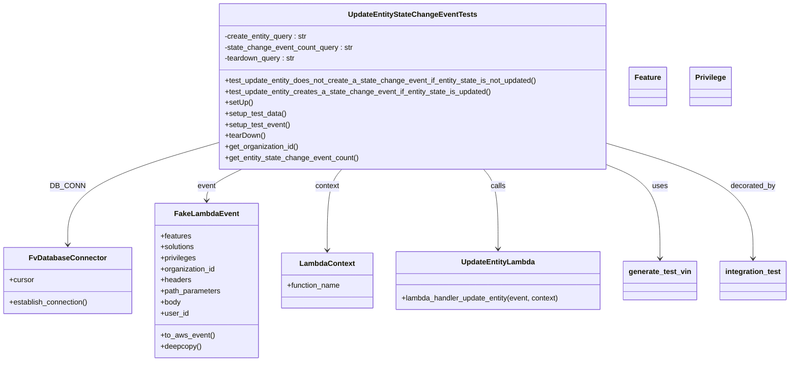
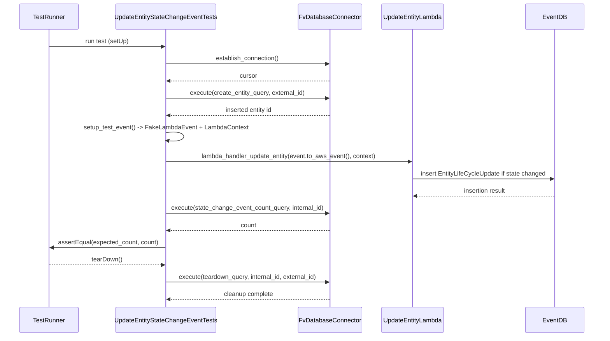

# Diagram: entity_core/entity_service/entity_service_tests/update_entity_tests/test_update_entity_state_change_events.py

> Auto-generated by Obscura crawlers

## Diagram 1

### SVG

<svg id="container" width="1708.40625" xmlns="http://www.w3.org/2000/svg" class="classDiagram" height="786" viewBox="0 0 1708.40625 786" role="graphics-document document" aria-roledescription="class"><g><defs><marker id="container_class-aggregationStart" class="marker aggregation class" refX="18" refY="7" markerWidth="190" markerHeight="240" orient="auto"><path d="M 18,7 L9,13 L1,7 L9,1 Z"></path></marker></defs><defs><marker id="container_class-aggregationEnd" class="marker aggregation class" refX="1" refY="7" markerWidth="20" markerHeight="28" orient="auto"><path d="M 18,7 L9,13 L1,7 L9,1 Z"></path></marker></defs><defs><marker id="container_class-extensionStart" class="marker extension class" refX="18" refY="7" markerWidth="190" markerHeight="240" orient="auto"><path d="M 1,7 L18,13 V 1 Z"></path></marker></defs><defs><marker id="container_class-extensionEnd" class="marker extension class" refX="1" refY="7" markerWidth="20" markerHeight="28" orient="auto"><path d="M 1,1 V 13 L18,7 Z"></path></marker></defs><defs><marker id="container_class-compositionStart" class="marker composition class" refX="18" refY="7" markerWidth="190" markerHeight="240" orient="auto"><path d="M 18,7 L9,13 L1,7 L9,1 Z"></path></marker></defs><defs><marker id="container_class-compositionEnd" class="marker composition class" refX="1" refY="7" markerWidth="20" markerHeight="28" orient="auto"><path d="M 18,7 L9,13 L1,7 L9,1 Z"></path></marker></defs><defs><marker id="container_class-dependencyStart" class="marker dependency class" refX="6" refY="7" markerWidth="190" markerHeight="240" orient="auto"><path d="M 5,7 L9,13 L1,7 L9,1 Z"></path></marker></defs><defs><marker id="container_class-dependencyEnd" class="marker dependency class" refX="13" refY="7" markerWidth="20" markerHeight="28" orient="auto"><path d="M 18,7 L9,13 L14,7 L9,1 Z"></path></marker></defs><defs><marker id="container_class-lollipopStart" class="marker lollipop class" refX="13" refY="7" markerWidth="190" markerHeight="240" orient="auto"><circle stroke="black" fill="transparent" cx="7" cy="7" r="6"></circle></marker></defs><defs><marker id="container_class-lollipopEnd" class="marker lollipop class" refX="1" refY="7" markerWidth="190" markerHeight="240" orient="auto"><circle stroke="black" fill="transparent" cx="7" cy="7" r="6"></circle></marker></defs><g class="root"><g class="clusters"></g><g class="edgePaths"><path d="M471.867,310.326L417.604,326.105C363.34,341.884,254.813,373.442,200.549,410.388C146.285,447.333,146.285,489.667,146.285,510.833L146.285,532" id="id_UpdateEntityStateChangeEventTests_FvDatabaseConnector_1" class="edge-thickness-normal edge-pattern-solid relation" style=";;;" data-edge="true" data-et="edge" data-id="id_UpdateEntityStateChangeEventTests_FvDatabaseConnector_1" data-points="W3sieCI6NDcxLjg2NzE4NzUsInkiOjMxMC4zMjU4ODEyMTk4MzY0NX0seyJ4IjoxNDYuMjg1MTU2MjUsInkiOjQwNX0seyJ4IjoxNDYuMjg1MTU2MjUsInkiOjUzOH1d" marker-end="url(#container_class-dependencyEnd)"></path><path d="M521.714,368L509.01,374.167C496.306,380.333,470.897,392.667,458.193,404C445.488,415.333,445.488,425.667,445.488,430.833L445.488,436" id="id_UpdateEntityStateChangeEventTests_FakeLambdaEvent_2" class="edge-thickness-normal edge-pattern-solid relation" style=";;;" data-edge="true" data-et="edge" data-id="id_UpdateEntityStateChangeEventTests_FakeLambdaEvent_2" data-points="W3sieCI6NTIxLjcxNDE5NTcwODUyNTMsInkiOjM2OH0seyJ4Ijo0NDUuNDg4MjgxMjUsInkiOjQwNX0seyJ4Ijo0NDUuNDg4MjgxMjUsInkiOjQ0Mn1d" marker-end="url(#container_class-dependencyEnd)"></path><path d="M737.554,368L732.244,374.167C726.935,380.333,716.315,392.667,711.005,422C705.695,451.333,705.695,497.667,705.695,520.833L705.695,544" id="id_UpdateEntityStateChangeEventTests_LambdaContext_3" class="edge-thickness-normal edge-pattern-solid relation" style=";;;" data-edge="true" data-et="edge" data-id="id_UpdateEntityStateChangeEventTests_LambdaContext_3" data-points="W3sieCI6NzM3LjU1NDEyOTQ2NDI4NTgsInkiOjM2OH0seyJ4Ijo3MDUuNjk1MzEyNSwieSI6NDA1fSx7IngiOjcwNS42OTUzMTI1LCJ5Ijo1NTB9XQ==" marker-end="url(#container_class-dependencyEnd)"></path><path d="M1047.532,368L1052.842,374.167C1058.151,380.333,1068.771,392.667,1074.081,421.5C1079.391,450.333,1079.391,495.667,1079.391,518.333L1079.391,541" id="id_UpdateEntityStateChangeEventTests_UpdateEntityLambda_4" class="edge-thickness-normal edge-pattern-solid relation" style=";;;" data-edge="true" data-et="edge" data-id="id_UpdateEntityStateChangeEventTests_UpdateEntityLambda_4" data-points="W3sieCI6MTA0Ny41MzE4MDgwMzU3MTQyLCJ5IjozNjh9LHsieCI6MTA3OS4zOTA2MjUsInkiOjQwNX0seyJ4IjoxMDc5LjM5MDYyNSwieSI6NTQ3fV0=" marker-end="url(#container_class-dependencyEnd)"></path><path d="M1313.219,357.47L1332.883,365.392C1352.547,373.313,1391.875,389.157,1411.539,423.245C1431.203,457.333,1431.203,509.667,1431.203,535.833L1431.203,562" id="id_UpdateEntityStateChangeEventTests_generate_test_vin_5" class="edge-thickness-normal edge-pattern-solid relation" style=";;;" data-edge="true" data-et="edge" data-id="id_UpdateEntityStateChangeEventTests_generate_test_vin_5" data-points="W3sieCI6MTMxMy4yMTg3NSwieSI6MzU3LjQ2OTgyODkzMDI4ODU0fSx7IngiOjE0MzEuMjAzMTI1LCJ5Ijo0MDV9LHsieCI6MTQzMS4yMDMxMjUsInkiOjU2OH1d" marker-end="url(#container_class-dependencyEnd)"></path><path d="M1313.219,311.868L1365.934,327.39C1418.648,342.912,1524.078,373.956,1576.793,415.645C1629.508,457.333,1629.508,509.667,1629.508,535.833L1629.508,562" id="id_UpdateEntityStateChangeEventTests_integration_test_6" class="edge-thickness-normal edge-pattern-solid relation" style=";;;" data-edge="true" data-et="edge" data-id="id_UpdateEntityStateChangeEventTests_integration_test_6" data-points="W3sieCI6MTMxMy4yMTg3NSwieSI6MzExLjg2ODM4NDM2Nzg5NDA3fSx7IngiOjE2MjkuNTA3ODEyNSwieSI6NDA1fSx7IngiOjE2MjkuNTA3ODEyNSwieSI6NTY4fV0=" marker-end="url(#container_class-dependencyEnd)"></path></g><g class="edgeLabels"><g class="edgeLabel" transform="translate(146.28515625, 405)"><g class="label" data-id="id_UpdateEntityStateChangeEventTests_FvDatabaseConnector_1" transform="translate(-34.484375, -12)"><foreignObject width="68.96875" height="24">

DB_CONN

</foreignObject></g></g><g class="edgeLabel" transform="translate(445.48828125, 405)"><g class="label" data-id="id_UpdateEntityStateChangeEventTests_FakeLambdaEvent_2" transform="translate(-20.171875, -12)"><foreignObject width="40.34375" height="24">

event

</foreignObject></g></g><g class="edgeLabel" transform="translate(705.6953125, 405)"><g class="label" data-id="id_UpdateEntityStateChangeEventTests_LambdaContext_3" transform="translate(-26.8515625, -12)"><foreignObject width="53.703125" height="24">

context

</foreignObject></g></g><g class="edgeLabel" transform="translate(1079.390625, 405)"><g class="label" data-id="id_UpdateEntityStateChangeEventTests_UpdateEntityLambda_4" transform="translate(-16.4453125, -12)"><foreignObject width="32.890625" height="24">

calls

</foreignObject></g></g><g class="edgeLabel" transform="translate(1431.203125, 405)"><g class="label" data-id="id_UpdateEntityStateChangeEventTests_generate_test_vin_5" transform="translate(-16.4921875, -12)"><foreignObject width="32.984375" height="24">

uses

</foreignObject></g></g><g class="edgeLabel" transform="translate(1629.5078125, 405)"><g class="label" data-id="id_UpdateEntityStateChangeEventTests_integration_test_6" transform="translate(-49.375, -12)"><foreignObject width="98.75" height="24">

decorated_by

</foreignObject></g></g></g><g class="nodes"><g class="node default" id="classId-UpdateEntityStateChangeEventTests-0" transform="translate(892.54296875, 188)"><g class="basic label-container"><path d="M-420.67578125 -180 L420.67578125 -180 L420.67578125 180 L-420.67578125 180" stroke="none" stroke-width="0" fill="#ECECFF" style=""></path><path d="M-420.67578125 -180 C-170.3230733013439 -180, 80.02963464731221 -180, 420.67578125 -180 M-420.67578125 -180 C-85.09786063567975 -180, 250.4800599786405 -180, 420.67578125 -180 M420.67578125 -180 C420.67578125 -86.10304444268678, 420.67578125 7.7939111146264395, 420.67578125 180 M420.67578125 -180 C420.67578125 -45.382606496334375, 420.67578125 89.23478700733125, 420.67578125 180 M420.67578125 180 C167.54626669417112 180, -85.58324786165775 180, -420.67578125 180 M420.67578125 180 C235.7673757618972 180, 50.8589702737944 180, -420.67578125 180 M-420.67578125 180 C-420.67578125 62.16268135118119, -420.67578125 -55.67463729763762, -420.67578125 -180 M-420.67578125 180 C-420.67578125 40.01232158222638, -420.67578125 -99.97535683554725, -420.67578125 -180" stroke="#9370DB" stroke-width="1.3" fill="none" stroke-dasharray="0 0" style=""></path></g><g class="annotation-group text" transform="translate(0, -156)"></g><g class="label-group text" transform="translate(-133.2265625, -156)"><g class="label" style="font-weight: bolder" transform="translate(0,-12)"><foreignObject width="266.453125" height="24">

UpdateEntityStateChangeEventTests

</foreignObject></g></g><g class="members-group text" transform="translate(-408.67578125, -108)"><g class="label" style="" transform="translate(0,-12)"><foreignObject width="181.859375" height="24">

-create_entity_query : str

</foreignObject></g><g class="label" style="" transform="translate(0,12)"><foreignObject width="280.671875" height="24">

-state_change_event_count_query : str

</foreignObject></g><g class="label" style="" transform="translate(0,36)"><foreignObject width="156.03125" height="24">

-teardown_query : str

</foreignObject></g></g><g class="methods-group text" transform="translate(-408.67578125, -12)"><g class="label" style="" transform="translate(0,-12)"><foreignObject width="684.125" height="24">

+test_update_entity_does_not_create_a_state_change_event_if_entity_state_is_not_updated()

</foreignObject></g><g class="label" style="" transform="translate(0,12)"><foreignObject width="583.171875" height="24">

+test_update_entity_creates_a_state_change_event_if_entity_state_is_updated()

</foreignObject></g><g class="label" style="" transform="translate(0,36)"><foreignObject width="60.421875" height="24">

+setUp()

</foreignObject></g><g class="label" style="" transform="translate(0,60)"><foreignObject width="134.96875" height="24">

+setup_test_data()

</foreignObject></g><g class="label" style="" transform="translate(0,84)"><foreignObject width="142.671875" height="24">

+setup_test_event()

</foreignObject></g><g class="label" style="" transform="translate(0,108)"><foreignObject width="87.75" height="24">

+tearDown()

</foreignObject></g><g class="label" style="" transform="translate(0,132)"><foreignObject width="161.671875" height="24">

+get_organization_id()

</foreignObject></g><g class="label" style="" transform="translate(0,156)"><foreignObject width="291.53125" height="24">

+get_entity_state_change_event_count()

</foreignObject></g></g><g class="divider" style=""><path d="M-420.67578125 -132 C-223.60514576124936 -132, -26.53451027249872 -132, 420.67578125 -132 M-420.67578125 -132 C-86.5012733275774 -132, 247.6732345948452 -132, 420.67578125 -132" stroke="#9370DB" stroke-width="1.3" fill="none" stroke-dasharray="0 0" style=""></path></g><g class="divider" style=""><path d="M-420.67578125 -36 C-207.23660523075603 -36, 6.202570788487947 -36, 420.67578125 -36 M-420.67578125 -36 C-181.42874750172749 -36, 57.81828624654503 -36, 420.67578125 -36" stroke="#9370DB" stroke-width="1.3" fill="none" stroke-dasharray="0 0" style=""></path></g></g><g class="node default" id="classId-FvDatabaseConnector-1" transform="translate(146.28515625, 610)"><g class="basic label-container"><path d="M-138.28515625 -72 L138.28515625 -72 L138.28515625 72 L-138.28515625 72" stroke="none" stroke-width="0" fill="#ECECFF" style=""></path><path d="M-138.28515625 -72 C-50.33337108125825 -72, 37.6184140874835 -72, 138.28515625 -72 M-138.28515625 -72 C-52.932712878110934 -72, 32.41973049377813 -72, 138.28515625 -72 M138.28515625 -72 C138.28515625 -32.29145523303471, 138.28515625 7.417089533930579, 138.28515625 72 M138.28515625 -72 C138.28515625 -23.593856460502742, 138.28515625 24.812287078994515, 138.28515625 72 M138.28515625 72 C28.278038142933525 72, -81.72907996413295 72, -138.28515625 72 M138.28515625 72 C49.35269540430912 72, -39.57976544138177 72, -138.28515625 72 M-138.28515625 72 C-138.28515625 21.98753997731704, -138.28515625 -28.024920045365917, -138.28515625 -72 M-138.28515625 72 C-138.28515625 37.96046261052333, -138.28515625 3.9209252210466587, -138.28515625 -72" stroke="#9370DB" stroke-width="1.3" fill="none" stroke-dasharray="0 0" style=""></path></g><g class="annotation-group text" transform="translate(0, -48)"></g><g class="label-group text" transform="translate(-79.3046875, -48)"><g class="label" style="font-weight: bolder" transform="translate(0,-12)"><foreignObject width="158.609375" height="24">

FvDatabaseConnector

</foreignObject></g></g><g class="members-group text" transform="translate(-126.28515625, 0)"><g class="label" style="" transform="translate(0,-12)"><foreignObject width="53.71875" height="24">

+cursor

</foreignObject></g></g><g class="methods-group text" transform="translate(-126.28515625, 48)"><g class="label" style="" transform="translate(0,-12)"><foreignObject width="173.265625" height="24">

+establish_connection()

</foreignObject></g></g><g class="divider" style=""><path d="M-138.28515625 -24 C-75.68771700410568 -24, -13.090277758211343 -24, 138.28515625 -24 M-138.28515625 -24 C-57.24471517885709 -24, 23.795725892285816 -24, 138.28515625 -24" stroke="#9370DB" stroke-width="1.3" fill="none" stroke-dasharray="0 0" style=""></path></g><g class="divider" style=""><path d="M-138.28515625 24 C-62.84891014019718 24, 12.587335969605647 24, 138.28515625 24 M-138.28515625 24 C-29.229849380617736 24, 79.82545748876453 24, 138.28515625 24" stroke="#9370DB" stroke-width="1.3" fill="none" stroke-dasharray="0 0" style=""></path></g></g><g class="node default" id="classId-FakeLambdaEvent-2" transform="translate(445.48828125, 610)"><g class="basic label-container"><path d="M-110.91796875 -168 L110.91796875 -168 L110.91796875 168 L-110.91796875 168" stroke="none" stroke-width="0" fill="#ECECFF" style=""></path><path d="M-110.91796875 -168 C-30.596430537185654 -168, 49.72510767562869 -168, 110.91796875 -168 M-110.91796875 -168 C-27.570725973255833 -168, 55.776516803488335 -168, 110.91796875 -168 M110.91796875 -168 C110.91796875 -73.8488982285875, 110.91796875 20.302203542824998, 110.91796875 168 M110.91796875 -168 C110.91796875 -89.94923444378125, 110.91796875 -11.898468887562501, 110.91796875 168 M110.91796875 168 C59.63980779023416 168, 8.361646830468317 168, -110.91796875 168 M110.91796875 168 C65.67358553473056 168, 20.429202319461126 168, -110.91796875 168 M-110.91796875 168 C-110.91796875 97.65891013595848, -110.91796875 27.317820271916958, -110.91796875 -168 M-110.91796875 168 C-110.91796875 87.59044600768013, -110.91796875 7.180892015360257, -110.91796875 -168" stroke="#9370DB" stroke-width="1.3" fill="none" stroke-dasharray="0 0" style=""></path></g><g class="annotation-group text" transform="translate(0, -144)"></g><g class="label-group text" transform="translate(-65.8671875, -144)"><g class="label" style="font-weight: bolder" transform="translate(0,-12)"><foreignObject width="131.734375" height="24">

FakeLambdaEvent

</foreignObject></g></g><g class="members-group text" transform="translate(-98.91796875, -96)"><g class="label" style="" transform="translate(0,-12)"><foreignObject width="67.1875" height="24">

+features

</foreignObject></g><g class="label" style="" transform="translate(0,12)"><foreignObject width="75.28125" height="24">

+solutions

</foreignObject></g><g class="label" style="" transform="translate(0,36)"><foreignObject width="78.15625" height="24">

+privileges

</foreignObject></g><g class="label" style="" transform="translate(0,60)"><foreignObject width="120.75" height="24">

+organization_id

</foreignObject></g><g class="label" style="" transform="translate(0,84)"><foreignObject width="66.328125" height="24">

+headers

</foreignObject></g><g class="label" style="" transform="translate(0,108)"><foreignObject width="131.96875" height="24">

+path_parameters

</foreignObject></g><g class="label" style="" transform="translate(0,132)"><foreignObject width="44.28125" height="24">

+body

</foreignObject></g><g class="label" style="" transform="translate(0,156)"><foreignObject width="60.796875" height="24">

+user_id

</foreignObject></g></g><g class="methods-group text" transform="translate(-98.91796875, 120)"><g class="label" style="" transform="translate(0,-12)"><foreignObject width="116.421875" height="24">

+to_aws_event()

</foreignObject></g><g class="label" style="" transform="translate(0,12)"><foreignObject width="88.859375" height="24">

+deepcopy()

</foreignObject></g></g><g class="divider" style=""><path d="M-110.91796875 -120 C-50.472827059712486 -120, 9.972314630575028 -120, 110.91796875 -120 M-110.91796875 -120 C-49.7282619420746 -120, 11.461444865850794 -120, 110.91796875 -120" stroke="#9370DB" stroke-width="1.3" fill="none" stroke-dasharray="0 0" style=""></path></g><g class="divider" style=""><path d="M-110.91796875 96 C-36.65493957147089 96, 37.60808960705822 96, 110.91796875 96 M-110.91796875 96 C-62.29948165287392 96, -13.680994555747844 96, 110.91796875 96" stroke="#9370DB" stroke-width="1.3" fill="none" stroke-dasharray="0 0" style=""></path></g></g><g class="node default" id="classId-LambdaContext-3" transform="translate(705.6953125, 610)"><g class="basic label-container"><path d="M-99.2890625 -60 L99.2890625 -60 L99.2890625 60 L-99.2890625 60" stroke="none" stroke-width="0" fill="#ECECFF" style=""></path><path d="M-99.2890625 -60 C-57.483098258537886 -60, -15.677134017075772 -60, 99.2890625 -60 M-99.2890625 -60 C-20.398955222800538 -60, 58.491152054398924 -60, 99.2890625 -60 M99.2890625 -60 C99.2890625 -16.110480832479666, 99.2890625 27.779038335040667, 99.2890625 60 M99.2890625 -60 C99.2890625 -18.918662041035027, 99.2890625 22.162675917929946, 99.2890625 60 M99.2890625 60 C48.40829385397357 60, -2.4724747920528642 60, -99.2890625 60 M99.2890625 60 C48.80284450879586 60, -1.6833734824082853 60, -99.2890625 60 M-99.2890625 60 C-99.2890625 25.67243112975494, -99.2890625 -8.655137740490119, -99.2890625 -60 M-99.2890625 60 C-99.2890625 23.777465179276817, -99.2890625 -12.445069641446366, -99.2890625 -60" stroke="#9370DB" stroke-width="1.3" fill="none" stroke-dasharray="0 0" style=""></path></g><g class="annotation-group text" transform="translate(0, -36)"></g><g class="label-group text" transform="translate(-57.296875, -36)"><g class="label" style="font-weight: bolder" transform="translate(0,-12)"><foreignObject width="114.59375" height="24">

LambdaContext

</foreignObject></g></g><g class="members-group text" transform="translate(-87.2890625, 12)"><g class="label" style="" transform="translate(0,-12)"><foreignObject width="117.28125" height="24">

+function_name

</foreignObject></g></g><g class="methods-group text" transform="translate(-87.2890625, 60)"></g><g class="divider" style=""><path d="M-99.2890625 -12 C-25.07027173426569 -12, 49.14851903146862 -12, 99.2890625 -12 M-99.2890625 -12 C-50.333681942177556 -12, -1.3783013843551117 -12, 99.2890625 -12" stroke="#9370DB" stroke-width="1.3" fill="none" stroke-dasharray="0 0" style=""></path></g><g class="divider" style=""><path d="M-99.2890625 36 C-33.08909103735316 36, 33.110880425293686 36, 99.2890625 36 M-99.2890625 36 C-58.63962335256009 36, -17.990184205120187 36, 99.2890625 36" stroke="#9370DB" stroke-width="1.3" fill="none" stroke-dasharray="0 0" style=""></path></g></g><g class="node default" id="classId-UpdateEntityLambda-4" transform="translate(1079.390625, 610)"><g class="basic label-container"><path d="M-224.40625 -63 L224.40625 -63 L224.40625 63 L-224.40625 63" stroke="none" stroke-width="0" fill="#ECECFF" style=""></path><path d="M-224.40625 -63 C-129.93005846267195 -63, -35.4538669253439 -63, 224.40625 -63 M-224.40625 -63 C-92.302703141833 -63, 39.800843716333986 -63, 224.40625 -63 M224.40625 -63 C224.40625 -36.50937362927792, 224.40625 -10.018747258555834, 224.40625 63 M224.40625 -63 C224.40625 -25.484644567171323, 224.40625 12.030710865657355, 224.40625 63 M224.40625 63 C109.03818229769199 63, -6.329885404616022 63, -224.40625 63 M224.40625 63 C132.73795999041374 63, 41.069669980827484 63, -224.40625 63 M-224.40625 63 C-224.40625 29.335517498358122, -224.40625 -4.328965003283756, -224.40625 -63 M-224.40625 63 C-224.40625 23.177773426490717, -224.40625 -16.644453147018567, -224.40625 -63" stroke="#9370DB" stroke-width="1.3" fill="none" stroke-dasharray="0 0" style=""></path></g><g class="annotation-group text" transform="translate(0, -39)"></g><g class="label-group text" transform="translate(-76.9375, -39)"><g class="label" style="font-weight: bolder" transform="translate(0,-12)"><foreignObject width="153.875" height="24">

UpdateEntityLambda

</foreignObject></g></g><g class="members-group text" transform="translate(-212.40625, 9)"></g><g class="methods-group text" transform="translate(-212.40625, 39)"><g class="label" style="" transform="translate(0,-12)"><foreignObject width="347.875" height="24">

+lambda_handler_update_entity(event, context)

</foreignObject></g></g><g class="divider" style=""><path d="M-224.40625 -15 C-66.6393605955113 -15, 91.12752880897739 -15, 224.40625 -15 M-224.40625 -15 C-116.6184016342472 -15, -8.830553268494413 -15, 224.40625 -15" stroke="#9370DB" stroke-width="1.3" fill="none" stroke-dasharray="0 0" style=""></path></g><g class="divider" style=""><path d="M-224.40625 9 C-132.75636615643646 9, -41.106482312872885 9, 224.40625 9 M-224.40625 9 C-128.19878284569185 9, -31.991315691383704 9, 224.40625 9" stroke="#9370DB" stroke-width="1.3" fill="none" stroke-dasharray="0 0" style=""></path></g></g><g class="node default" id="classId-Feature-5" transform="translate(1402.609375, 188)"><g class="basic label-container"><path d="M-39.390625 -42 L39.390625 -42 L39.390625 42 L-39.390625 42" stroke="none" stroke-width="0" fill="#ECECFF" style=""></path><path d="M-39.390625 -42 C-9.268287259590004 -42, 20.854050480819993 -42, 39.390625 -42 M-39.390625 -42 C-15.226370576623289 -42, 8.937883846753422 -42, 39.390625 -42 M39.390625 -42 C39.390625 -9.907905021073333, 39.390625 22.184189957853334, 39.390625 42 M39.390625 -42 C39.390625 -17.04274659211584, 39.390625 7.91450681576832, 39.390625 42 M39.390625 42 C14.09857819741677 42, -11.193468605166458 42, -39.390625 42 M39.390625 42 C17.580361659793518 42, -4.229901680412965 42, -39.390625 42 M-39.390625 42 C-39.390625 16.217354234164937, -39.390625 -9.565291531670127, -39.390625 -42 M-39.390625 42 C-39.390625 11.999121522612903, -39.390625 -18.001756954774194, -39.390625 -42" stroke="#9370DB" stroke-width="1.3" fill="none" stroke-dasharray="0 0" style=""></path></g><g class="annotation-group text" transform="translate(0, -18)"></g><g class="label-group text" transform="translate(-27.390625, -18)"><g class="label" style="font-weight: bolder" transform="translate(0,-12)"><foreignObject width="54.78125" height="24">

Feature

</foreignObject></g></g><g class="members-group text" transform="translate(-27.390625, 30)"></g><g class="methods-group text" transform="translate(-27.390625, 60)"></g><g class="divider" style=""><path d="M-39.390625 6 C-15.950256726604884 6, 7.4901115467902315 6, 39.390625 6 M-39.390625 6 C-12.127798496445514 6, 15.135028007108971 6, 39.390625 6" stroke="#9370DB" stroke-width="1.3" fill="none" stroke-dasharray="0 0" style=""></path></g><g class="divider" style=""><path d="M-39.390625 24 C-9.48314814061321 24, 20.42432871877358 24, 39.390625 24 M-39.390625 24 C-9.955274051642405 24, 19.48007689671519 24, 39.390625 24" stroke="#9370DB" stroke-width="1.3" fill="none" stroke-dasharray="0 0" style=""></path></g></g><g class="node default" id="classId-Privilege-6" transform="translate(1535.8671875, 188)"><g class="basic label-container"><path d="M-43.8671875 -42 L43.8671875 -42 L43.8671875 42 L-43.8671875 42" stroke="none" stroke-width="0" fill="#ECECFF" style=""></path><path d="M-43.8671875 -42 C-21.463544944666033 -42, 0.9400976106679337 -42, 43.8671875 -42 M-43.8671875 -42 C-9.613716875824778 -42, 24.639753748350444 -42, 43.8671875 -42 M43.8671875 -42 C43.8671875 -13.680110211974327, 43.8671875 14.639779576051346, 43.8671875 42 M43.8671875 -42 C43.8671875 -18.044146514110782, 43.8671875 5.911706971778436, 43.8671875 42 M43.8671875 42 C11.847077179037178 42, -20.173033141925643 42, -43.8671875 42 M43.8671875 42 C12.141803221153179 42, -19.583581057693642 42, -43.8671875 42 M-43.8671875 42 C-43.8671875 11.121926960197744, -43.8671875 -19.756146079604513, -43.8671875 -42 M-43.8671875 42 C-43.8671875 16.459624035121422, -43.8671875 -9.080751929757156, -43.8671875 -42" stroke="#9370DB" stroke-width="1.3" fill="none" stroke-dasharray="0 0" style=""></path></g><g class="annotation-group text" transform="translate(0, -18)"></g><g class="label-group text" transform="translate(-31.8671875, -18)"><g class="label" style="font-weight: bolder" transform="translate(0,-12)"><foreignObject width="63.734375" height="24">

Privilege

</foreignObject></g></g><g class="members-group text" transform="translate(-31.8671875, 30)"></g><g class="methods-group text" transform="translate(-31.8671875, 60)"></g><g class="divider" style=""><path d="M-43.8671875 6 C-12.588581347087949 6, 18.690024805824102 6, 43.8671875 6 M-43.8671875 6 C-8.949128810906132 6, 25.968929878187737 6, 43.8671875 6" stroke="#9370DB" stroke-width="1.3" fill="none" stroke-dasharray="0 0" style=""></path></g><g class="divider" style=""><path d="M-43.8671875 24 C-12.174396607166923 24, 19.518394285666155 24, 43.8671875 24 M-43.8671875 24 C-18.453268224326596 24, 6.960651051346808 24, 43.8671875 24" stroke="#9370DB" stroke-width="1.3" fill="none" stroke-dasharray="0 0" style=""></path></g></g><g class="node default" id="classId-generate_test_vin-7" transform="translate(1431.203125, 610)"><g class="basic label-container"><path d="M-77.40625 -42 L77.40625 -42 L77.40625 42 L-77.40625 42" stroke="none" stroke-width="0" fill="#ECECFF" style=""></path><path d="M-77.40625 -42 C-33.07535354662362 -42, 11.255542906752765 -42, 77.40625 -42 M-77.40625 -42 C-18.28830697985689 -42, 40.82963604028622 -42, 77.40625 -42 M77.40625 -42 C77.40625 -16.284421015160962, 77.40625 9.431157969678075, 77.40625 42 M77.40625 -42 C77.40625 -24.905561440833992, 77.40625 -7.811122881667984, 77.40625 42 M77.40625 42 C44.53381550753477 42, 11.661381015069537 42, -77.40625 42 M77.40625 42 C42.37329843689453 42, 7.340346873789059 42, -77.40625 42 M-77.40625 42 C-77.40625 21.212051061869158, -77.40625 0.42410212373831513, -77.40625 -42 M-77.40625 42 C-77.40625 10.419474960460342, -77.40625 -21.161050079079317, -77.40625 -42" stroke="#9370DB" stroke-width="1.3" fill="none" stroke-dasharray="0 0" style=""></path></g><g class="annotation-group text" transform="translate(0, -18)"></g><g class="label-group text" transform="translate(-65.40625, -18)"><g class="label" style="font-weight: bolder" transform="translate(0,-12)"><foreignObject width="130.8125" height="24">

generate_test_vin

</foreignObject></g></g><g class="members-group text" transform="translate(-65.40625, 30)"></g><g class="methods-group text" transform="translate(-65.40625, 60)"></g><g class="divider" style=""><path d="M-77.40625 6 C-20.890915843910477 6, 35.624418312179046 6, 77.40625 6 M-77.40625 6 C-43.3602899305751 6, -9.314329861150199 6, 77.40625 6" stroke="#9370DB" stroke-width="1.3" fill="none" stroke-dasharray="0 0" style=""></path></g><g class="divider" style=""><path d="M-77.40625 24 C-19.06399045752223 24, 39.27826908495554 24, 77.40625 24 M-77.40625 24 C-30.010836726998612 24, 17.384576546002776 24, 77.40625 24" stroke="#9370DB" stroke-width="1.3" fill="none" stroke-dasharray="0 0" style=""></path></g></g><g class="node default" id="classId-integration_test-8" transform="translate(1629.5078125, 610)"><g class="basic label-container"><path d="M-70.8984375 -42 L70.8984375 -42 L70.8984375 42 L-70.8984375 42" stroke="none" stroke-width="0" fill="#ECECFF" style=""></path><path d="M-70.8984375 -42 C-23.957605559662966 -42, 22.98322638067407 -42, 70.8984375 -42 M-70.8984375 -42 C-35.02651395418075 -42, 0.8454095916385 -42, 70.8984375 -42 M70.8984375 -42 C70.8984375 -13.668208953093586, 70.8984375 14.663582093812828, 70.8984375 42 M70.8984375 -42 C70.8984375 -11.625851567292852, 70.8984375 18.748296865414297, 70.8984375 42 M70.8984375 42 C41.6332711774309 42, 12.368104854861791 42, -70.8984375 42 M70.8984375 42 C20.016902380117365 42, -30.86463273976527 42, -70.8984375 42 M-70.8984375 42 C-70.8984375 9.973428592308444, -70.8984375 -22.05314281538311, -70.8984375 -42 M-70.8984375 42 C-70.8984375 17.548463333833865, -70.8984375 -6.903073332332269, -70.8984375 -42" stroke="#9370DB" stroke-width="1.3" fill="none" stroke-dasharray="0 0" style=""></path></g><g class="annotation-group text" transform="translate(0, -18)"></g><g class="label-group text" transform="translate(-58.8984375, -18)"><g class="label" style="font-weight: bolder" transform="translate(0,-12)"><foreignObject width="117.796875" height="24">

integration_test

</foreignObject></g></g><g class="members-group text" transform="translate(-58.8984375, 30)"></g><g class="methods-group text" transform="translate(-58.8984375, 60)"></g><g class="divider" style=""><path d="M-70.8984375 6 C-42.08014215455818 6, -13.261846809116363 6, 70.8984375 6 M-70.8984375 6 C-19.281849732139968 6, 32.334738035720065 6, 70.8984375 6" stroke="#9370DB" stroke-width="1.3" fill="none" stroke-dasharray="0 0" style=""></path></g><g class="divider" style=""><path d="M-70.8984375 24 C-28.309078832973093 24, 14.280279834053815 24, 70.8984375 24 M-70.8984375 24 C-20.598767028787506 24, 29.700903442424988 24, 70.8984375 24" stroke="#9370DB" stroke-width="1.3" fill="none" stroke-dasharray="0 0" style=""></path></g></g></g></g></g></svg>

## Diagram 2

### SVG

<svg id="container" width="1663.5" xmlns="http://www.w3.org/2000/svg" height="921" viewBox="-50 -10 1663.5 921" role="graphics-document document" aria-roledescription="sequence"><g><rect x="1413.5" y="835" fill="#eaeaea" stroke="#666" width="150" height="65" name="EventTable" rx="3" ry="3" class="actor actor-bottom"></rect><text x="1488.5" y="867.5" dominant-baseline="central" alignment-baseline="central" class="actor actor-box" style="text-anchor: middle; font-size: 16px; font-weight: 400;"><tspan x="1488.5" dy="0">EventDB</tspan></text></g><g><rect x="1008.5" y="835" fill="#eaeaea" stroke="#666" width="172" height="65" name="Lambda" rx="3" ry="3" class="actor actor-bottom"></rect><text x="1094.5" y="867.5" dominant-baseline="central" alignment-baseline="central" class="actor actor-box" style="text-anchor: middle; font-size: 16px; font-weight: 400;"><tspan x="1094.5" dy="0">UpdateEntityLambda</tspan></text></g><g><rect x="781.5" y="835" fill="#eaeaea" stroke="#666" width="177" height="65" name="DB" rx="3" ry="3" class="actor actor-bottom"></rect><text x="870" y="867.5" dominant-baseline="central" alignment-baseline="central" class="actor actor-box" style="text-anchor: middle; font-size: 16px; font-weight: 400;"><tspan x="870" dy="0">FvDatabaseConnector</tspan></text></g><g><rect x="263.5" y="835" fill="#eaeaea" stroke="#666" width="281" height="65" name="TestCase" rx="3" ry="3" class="actor actor-bottom"></rect><text x="404" y="867.5" dominant-baseline="central" alignment-baseline="central" class="actor actor-box" style="text-anchor: middle; font-size: 16px; font-weight: 400;"><tspan x="404" dy="0">UpdateEntityStateChangeEventTests</tspan></text></g><g><rect x="0" y="835" fill="#eaeaea" stroke="#666" width="150" height="65" name="TestRunner" rx="3" ry="3" class="actor actor-bottom"></rect><text x="75" y="867.5" dominant-baseline="central" alignment-baseline="central" class="actor actor-box" style="text-anchor: middle; font-size: 16px; font-weight: 400;"><tspan x="75" dy="0">TestRunner</tspan></text></g><g><line id="actor4" x1="1488.5" y1="65" x2="1488.5" y2="835" class="actor-line 200" stroke-width="0.5px" stroke="#999" name="EventTable"></line><g id="root-4"><rect x="1413.5" y="0" fill="#eaeaea" stroke="#666" width="150" height="65" name="EventTable" rx="3" ry="3" class="actor actor-top"></rect><text x="1488.5" y="32.5" dominant-baseline="central" alignment-baseline="central" class="actor actor-box" style="text-anchor: middle; font-size: 16px; font-weight: 400;"><tspan x="1488.5" dy="0">EventDB</tspan></text></g></g><g><line id="actor3" x1="1094.5" y1="65" x2="1094.5" y2="835" class="actor-line 200" stroke-width="0.5px" stroke="#999" name="Lambda"></line><g id="root-3"><rect x="1008.5" y="0" fill="#eaeaea" stroke="#666" width="172" height="65" name="Lambda" rx="3" ry="3" class="actor actor-top"></rect><text x="1094.5" y="32.5" dominant-baseline="central" alignment-baseline="central" class="actor actor-box" style="text-anchor: middle; font-size: 16px; font-weight: 400;"><tspan x="1094.5" dy="0">UpdateEntityLambda</tspan></text></g></g><g><line id="actor2" x1="870" y1="65" x2="870" y2="835" class="actor-line 200" stroke-width="0.5px" stroke="#999" name="DB"></line><g id="root-2"><rect x="781.5" y="0" fill="#eaeaea" stroke="#666" width="177" height="65" name="DB" rx="3" ry="3" class="actor actor-top"></rect><text x="870" y="32.5" dominant-baseline="central" alignment-baseline="central" class="actor actor-box" style="text-anchor: middle; font-size: 16px; font-weight: 400;"><tspan x="870" dy="0">FvDatabaseConnector</tspan></text></g></g><g><line id="actor1" x1="404" y1="65" x2="404" y2="835" class="actor-line 200" stroke-width="0.5px" stroke="#999" name="TestCase"></line><g id="root-1"><rect x="263.5" y="0" fill="#eaeaea" stroke="#666" width="281" height="65" name="TestCase" rx="3" ry="3" class="actor actor-top"></rect><text x="404" y="32.5" dominant-baseline="central" alignment-baseline="central" class="actor actor-box" style="text-anchor: middle; font-size: 16px; font-weight: 400;"><tspan x="404" dy="0">UpdateEntityStateChangeEventTests</tspan></text></g></g><g><line id="actor0" x1="75" y1="65" x2="75" y2="835" class="actor-line 200" stroke-width="0.5px" stroke="#999" name="TestRunner"></line><g id="root-0"><rect x="0" y="0" fill="#eaeaea" stroke="#666" width="150" height="65" name="TestRunner" rx="3" ry="3" class="actor actor-top"></rect><text x="75" y="32.5" dominant-baseline="central" alignment-baseline="central" class="actor actor-box" style="text-anchor: middle; font-size: 16px; font-weight: 400;"><tspan x="75" dy="0">TestRunner</tspan></text></g></g><g></g><defs><symbol id="computer" width="24" height="24"><path transform="scale(.5)" d="M2 2v13h20v-13h-20zm18 11h-16v-9h16v9zm-10.228 6l.466-1h3.524l.467 1h-4.457zm14.228 3h-24l2-6h2.104l-1.33 4h18.45l-1.297-4h2.073l2 6zm-5-10h-14v-7h14v7z"></path></symbol></defs><defs><symbol id="database" fill-rule="evenodd" clip-rule="evenodd"><path transform="scale(.5)" d="M12.258.001l.256.004.255.005.253.008.251.01.249.012.247.015.246.016.242.019.241.02.239.023.236.024.233.027.231.028.229.031.225.032.223.034.22.036.217.038.214.04.211.041.208.043.205.045.201.046.198.048.194.05.191.051.187.053.183.054.18.056.175.057.172.059.168.06.163.061.16.063.155.064.15.066.074.033.073.033.071.034.07.034.069.035.068.035.067.035.066.035.064.036.064.036.062.036.06.036.06.037.058.037.058.037.055.038.055.038.053.038.052.038.051.039.05.039.048.039.047.039.045.04.044.04.043.04.041.04.04.041.039.041.037.041.036.041.034.041.033.042.032.042.03.042.029.042.027.042.026.043.024.043.023.043.021.043.02.043.018.044.017.043.015.044.013.044.012.044.011.045.009.044.007.045.006.045.004.045.002.045.001.045v17l-.001.045-.002.045-.004.045-.006.045-.007.045-.009.044-.011.045-.012.044-.013.044-.015.044-.017.043-.018.044-.02.043-.021.043-.023.043-.024.043-.026.043-.027.042-.029.042-.03.042-.032.042-.033.042-.034.041-.036.041-.037.041-.039.041-.04.041-.041.04-.043.04-.044.04-.045.04-.047.039-.048.039-.05.039-.051.039-.052.038-.053.038-.055.038-.055.038-.058.037-.058.037-.06.037-.06.036-.062.036-.064.036-.064.036-.066.035-.067.035-.068.035-.069.035-.07.034-.071.034-.073.033-.074.033-.15.066-.155.064-.16.063-.163.061-.168.06-.172.059-.175.057-.18.056-.183.054-.187.053-.191.051-.194.05-.198.048-.201.046-.205.045-.208.043-.211.041-.214.04-.217.038-.22.036-.223.034-.225.032-.229.031-.231.028-.233.027-.236.024-.239.023-.241.02-.242.019-.246.016-.247.015-.249.012-.251.01-.253.008-.255.005-.256.004-.258.001-.258-.001-.256-.004-.255-.005-.253-.008-.251-.01-.249-.012-.247-.015-.245-.016-.243-.019-.241-.02-.238-.023-.236-.024-.234-.027-.231-.028-.228-.031-.226-.032-.223-.034-.22-.036-.217-.038-.214-.04-.211-.041-.208-.043-.204-.045-.201-.046-.198-.048-.195-.05-.19-.051-.187-.053-.184-.054-.179-.056-.176-.057-.172-.059-.167-.06-.164-.061-.159-.063-.155-.064-.151-.066-.074-.033-.072-.033-.072-.034-.07-.034-.069-.035-.068-.035-.067-.035-.066-.035-.064-.036-.063-.036-.062-.036-.061-.036-.06-.037-.058-.037-.057-.037-.056-.038-.055-.038-.053-.038-.052-.038-.051-.039-.049-.039-.049-.039-.046-.039-.046-.04-.044-.04-.043-.04-.041-.04-.04-.041-.039-.041-.037-.041-.036-.041-.034-.041-.033-.042-.032-.042-.03-.042-.029-.042-.027-.042-.026-.043-.024-.043-.023-.043-.021-.043-.02-.043-.018-.044-.017-.043-.015-.044-.013-.044-.012-.044-.011-.045-.009-.044-.007-.045-.006-.045-.004-.045-.002-.045-.001-.045v-17l.001-.045.002-.045.004-.045.006-.045.007-.045.009-.044.011-.045.012-.044.013-.044.015-.044.017-.043.018-.044.02-.043.021-.043.023-.043.024-.043.026-.043.027-.042.029-.042.03-.042.032-.042.033-.042.034-.041.036-.041.037-.041.039-.041.04-.041.041-.04.043-.04.044-.04.046-.04.046-.039.049-.039.049-.039.051-.039.052-.038.053-.038.055-.038.056-.038.057-.037.058-.037.06-.037.061-.036.062-.036.063-.036.064-.036.066-.035.067-.035.068-.035.069-.035.07-.034.072-.034.072-.033.074-.033.151-.066.155-.064.159-.063.164-.061.167-.06.172-.059.176-.057.179-.056.184-.054.187-.053.19-.051.195-.05.198-.048.201-.046.204-.045.208-.043.211-.041.214-.04.217-.038.22-.036.223-.034.226-.032.228-.031.231-.028.234-.027.236-.024.238-.023.241-.02.243-.019.245-.016.247-.015.249-.012.251-.01.253-.008.255-.005.256-.004.258-.001.258.001zm-9.258 20.499v.01l.001.021.003.021.004.022.005.021.006.022.007.022.009.023.01.022.011.023.012.023.013.023.015.023.016.024.017.023.018.024.019.024.021.024.022.025.023.024.024.025.052.049.056.05.061.051.066.051.07.051.075.051.079.052.084.052.088.052.092.052.097.052.102.051.105.052.11.052.114.051.119.051.123.051.127.05.131.05.135.05.139.048.144.049.147.047.152.047.155.047.16.045.163.045.167.043.171.043.176.041.178.041.183.039.187.039.19.037.194.035.197.035.202.033.204.031.209.03.212.029.216.027.219.025.222.024.226.021.23.02.233.018.236.016.24.015.243.012.246.01.249.008.253.005.256.004.259.001.26-.001.257-.004.254-.005.25-.008.247-.011.244-.012.241-.014.237-.016.233-.018.231-.021.226-.021.224-.024.22-.026.216-.027.212-.028.21-.031.205-.031.202-.034.198-.034.194-.036.191-.037.187-.039.183-.04.179-.04.175-.042.172-.043.168-.044.163-.045.16-.046.155-.046.152-.047.148-.048.143-.049.139-.049.136-.05.131-.05.126-.05.123-.051.118-.052.114-.051.11-.052.106-.052.101-.052.096-.052.092-.052.088-.053.083-.051.079-.052.074-.052.07-.051.065-.051.06-.051.056-.05.051-.05.023-.024.023-.025.021-.024.02-.024.019-.024.018-.024.017-.024.015-.023.014-.024.013-.023.012-.023.01-.023.01-.022.008-.022.006-.022.006-.022.004-.022.004-.021.001-.021.001-.021v-4.127l-.077.055-.08.053-.083.054-.085.053-.087.052-.09.052-.093.051-.095.05-.097.05-.1.049-.102.049-.105.048-.106.047-.109.047-.111.046-.114.045-.115.045-.118.044-.12.043-.122.042-.124.042-.126.041-.128.04-.13.04-.132.038-.134.038-.135.037-.138.037-.139.035-.142.035-.143.034-.144.033-.147.032-.148.031-.15.03-.151.03-.153.029-.154.027-.156.027-.158.026-.159.025-.161.024-.162.023-.163.022-.165.021-.166.02-.167.019-.169.018-.169.017-.171.016-.173.015-.173.014-.175.013-.175.012-.177.011-.178.01-.179.008-.179.008-.181.006-.182.005-.182.004-.184.003-.184.002h-.37l-.184-.002-.184-.003-.182-.004-.182-.005-.181-.006-.179-.008-.179-.008-.178-.01-.176-.011-.176-.012-.175-.013-.173-.014-.172-.015-.171-.016-.17-.017-.169-.018-.167-.019-.166-.02-.165-.021-.163-.022-.162-.023-.161-.024-.159-.025-.157-.026-.156-.027-.155-.027-.153-.029-.151-.03-.15-.03-.148-.031-.146-.032-.145-.033-.143-.034-.141-.035-.14-.035-.137-.037-.136-.037-.134-.038-.132-.038-.13-.04-.128-.04-.126-.041-.124-.042-.122-.042-.12-.044-.117-.043-.116-.045-.113-.045-.112-.046-.109-.047-.106-.047-.105-.048-.102-.049-.1-.049-.097-.05-.095-.05-.093-.052-.09-.051-.087-.052-.085-.053-.083-.054-.08-.054-.077-.054v4.127zm0-5.654v.011l.001.021.003.021.004.021.005.022.006.022.007.022.009.022.01.022.011.023.012.023.013.023.015.024.016.023.017.024.018.024.019.024.021.024.022.024.023.025.024.024.052.05.056.05.061.05.066.051.07.051.075.052.079.051.084.052.088.052.092.052.097.052.102.052.105.052.11.051.114.051.119.052.123.05.127.051.131.05.135.049.139.049.144.048.147.048.152.047.155.046.16.045.163.045.167.044.171.042.176.042.178.04.183.04.187.038.19.037.194.036.197.034.202.033.204.032.209.03.212.028.216.027.219.025.222.024.226.022.23.02.233.018.236.016.24.014.243.012.246.01.249.008.253.006.256.003.259.001.26-.001.257-.003.254-.006.25-.008.247-.01.244-.012.241-.015.237-.016.233-.018.231-.02.226-.022.224-.024.22-.025.216-.027.212-.029.21-.03.205-.032.202-.033.198-.035.194-.036.191-.037.187-.039.183-.039.179-.041.175-.042.172-.043.168-.044.163-.045.16-.045.155-.047.152-.047.148-.048.143-.048.139-.05.136-.049.131-.05.126-.051.123-.051.118-.051.114-.052.11-.052.106-.052.101-.052.096-.052.092-.052.088-.052.083-.052.079-.052.074-.051.07-.052.065-.051.06-.05.056-.051.051-.049.023-.025.023-.024.021-.025.02-.024.019-.024.018-.024.017-.024.015-.023.014-.023.013-.024.012-.022.01-.023.01-.023.008-.022.006-.022.006-.022.004-.021.004-.022.001-.021.001-.021v-4.139l-.077.054-.08.054-.083.054-.085.052-.087.053-.09.051-.093.051-.095.051-.097.05-.1.049-.102.049-.105.048-.106.047-.109.047-.111.046-.114.045-.115.044-.118.044-.12.044-.122.042-.124.042-.126.041-.128.04-.13.039-.132.039-.134.038-.135.037-.138.036-.139.036-.142.035-.143.033-.144.033-.147.033-.148.031-.15.03-.151.03-.153.028-.154.028-.156.027-.158.026-.159.025-.161.024-.162.023-.163.022-.165.021-.166.02-.167.019-.169.018-.169.017-.171.016-.173.015-.173.014-.175.013-.175.012-.177.011-.178.009-.179.009-.179.007-.181.007-.182.005-.182.004-.184.003-.184.002h-.37l-.184-.002-.184-.003-.182-.004-.182-.005-.181-.007-.179-.007-.179-.009-.178-.009-.176-.011-.176-.012-.175-.013-.173-.014-.172-.015-.171-.016-.17-.017-.169-.018-.167-.019-.166-.02-.165-.021-.163-.022-.162-.023-.161-.024-.159-.025-.157-.026-.156-.027-.155-.028-.153-.028-.151-.03-.15-.03-.148-.031-.146-.033-.145-.033-.143-.033-.141-.035-.14-.036-.137-.036-.136-.037-.134-.038-.132-.039-.13-.039-.128-.04-.126-.041-.124-.042-.122-.043-.12-.043-.117-.044-.116-.044-.113-.046-.112-.046-.109-.046-.106-.047-.105-.048-.102-.049-.1-.049-.097-.05-.095-.051-.093-.051-.09-.051-.087-.053-.085-.052-.083-.054-.08-.054-.077-.054v4.139zm0-5.666v.011l.001.02.003.022.004.021.005.022.006.021.007.022.009.023.01.022.011.023.012.023.013.023.015.023.016.024.017.024.018.023.019.024.021.025.022.024.023.024.024.025.052.05.056.05.061.05.066.051.07.051.075.052.079.051.084.052.088.052.092.052.097.052.102.052.105.051.11.052.114.051.119.051.123.051.127.05.131.05.135.05.139.049.144.048.147.048.152.047.155.046.16.045.163.045.167.043.171.043.176.042.178.04.183.04.187.038.19.037.194.036.197.034.202.033.204.032.209.03.212.028.216.027.219.025.222.024.226.021.23.02.233.018.236.017.24.014.243.012.246.01.249.008.253.006.256.003.259.001.26-.001.257-.003.254-.006.25-.008.247-.01.244-.013.241-.014.237-.016.233-.018.231-.02.226-.022.224-.024.22-.025.216-.027.212-.029.21-.03.205-.032.202-.033.198-.035.194-.036.191-.037.187-.039.183-.039.179-.041.175-.042.172-.043.168-.044.163-.045.16-.045.155-.047.152-.047.148-.048.143-.049.139-.049.136-.049.131-.051.126-.05.123-.051.118-.052.114-.051.11-.052.106-.052.101-.052.096-.052.092-.052.088-.052.083-.052.079-.052.074-.052.07-.051.065-.051.06-.051.056-.05.051-.049.023-.025.023-.025.021-.024.02-.024.019-.024.018-.024.017-.024.015-.023.014-.024.013-.023.012-.023.01-.022.01-.023.008-.022.006-.022.006-.022.004-.022.004-.021.001-.021.001-.021v-4.153l-.077.054-.08.054-.083.053-.085.053-.087.053-.09.051-.093.051-.095.051-.097.05-.1.049-.102.048-.105.048-.106.048-.109.046-.111.046-.114.046-.115.044-.118.044-.12.043-.122.043-.124.042-.126.041-.128.04-.13.039-.132.039-.134.038-.135.037-.138.036-.139.036-.142.034-.143.034-.144.033-.147.032-.148.032-.15.03-.151.03-.153.028-.154.028-.156.027-.158.026-.159.024-.161.024-.162.023-.163.023-.165.021-.166.02-.167.019-.169.018-.169.017-.171.016-.173.015-.173.014-.175.013-.175.012-.177.01-.178.01-.179.009-.179.007-.181.006-.182.006-.182.004-.184.003-.184.001-.185.001-.185-.001-.184-.001-.184-.003-.182-.004-.182-.006-.181-.006-.179-.007-.179-.009-.178-.01-.176-.01-.176-.012-.175-.013-.173-.014-.172-.015-.171-.016-.17-.017-.169-.018-.167-.019-.166-.02-.165-.021-.163-.023-.162-.023-.161-.024-.159-.024-.157-.026-.156-.027-.155-.028-.153-.028-.151-.03-.15-.03-.148-.032-.146-.032-.145-.033-.143-.034-.141-.034-.14-.036-.137-.036-.136-.037-.134-.038-.132-.039-.13-.039-.128-.041-.126-.041-.124-.041-.122-.043-.12-.043-.117-.044-.116-.044-.113-.046-.112-.046-.109-.046-.106-.048-.105-.048-.102-.048-.1-.05-.097-.049-.095-.051-.093-.051-.09-.052-.087-.052-.085-.053-.083-.053-.08-.054-.077-.054v4.153zm8.74-8.179l-.257.004-.254.005-.25.008-.247.011-.244.012-.241.014-.237.016-.233.018-.231.021-.226.022-.224.023-.22.026-.216.027-.212.028-.21.031-.205.032-.202.033-.198.034-.194.036-.191.038-.187.038-.183.04-.179.041-.175.042-.172.043-.168.043-.163.045-.16.046-.155.046-.152.048-.148.048-.143.048-.139.049-.136.05-.131.05-.126.051-.123.051-.118.051-.114.052-.11.052-.106.052-.101.052-.096.052-.092.052-.088.052-.083.052-.079.052-.074.051-.07.052-.065.051-.06.05-.056.05-.051.05-.023.025-.023.024-.021.024-.02.025-.019.024-.018.024-.017.023-.015.024-.014.023-.013.023-.012.023-.01.023-.01.022-.008.022-.006.023-.006.021-.004.022-.004.021-.001.021-.001.021.001.021.001.021.004.021.004.022.006.021.006.023.008.022.01.022.01.023.012.023.013.023.014.023.015.024.017.023.018.024.019.024.02.025.021.024.023.024.023.025.051.05.056.05.06.05.065.051.07.052.074.051.079.052.083.052.088.052.092.052.096.052.101.052.106.052.11.052.114.052.118.051.123.051.126.051.131.05.136.05.139.049.143.048.148.048.152.048.155.046.16.046.163.045.168.043.172.043.175.042.179.041.183.04.187.038.191.038.194.036.198.034.202.033.205.032.21.031.212.028.216.027.22.026.224.023.226.022.231.021.233.018.237.016.241.014.244.012.247.011.25.008.254.005.257.004.26.001.26-.001.257-.004.254-.005.25-.008.247-.011.244-.012.241-.014.237-.016.233-.018.231-.021.226-.022.224-.023.22-.026.216-.027.212-.028.21-.031.205-.032.202-.033.198-.034.194-.036.191-.038.187-.038.183-.04.179-.041.175-.042.172-.043.168-.043.163-.045.16-.046.155-.046.152-.048.148-.048.143-.048.139-.049.136-.05.131-.05.126-.051.123-.051.118-.051.114-.052.11-.052.106-.052.101-.052.096-.052.092-.052.088-.052.083-.052.079-.052.074-.051.07-.052.065-.051.06-.05.056-.05.051-.05.023-.025.023-.024.021-.024.02-.025.019-.024.018-.024.017-.023.015-.024.014-.023.013-.023.012-.023.01-.023.01-.022.008-.022.006-.023.006-.021.004-.022.004-.021.001-.021.001-.021-.001-.021-.001-.021-.004-.021-.004-.022-.006-.021-.006-.023-.008-.022-.01-.022-.01-.023-.012-.023-.013-.023-.014-.023-.015-.024-.017-.023-.018-.024-.019-.024-.02-.025-.021-.024-.023-.024-.023-.025-.051-.05-.056-.05-.06-.05-.065-.051-.07-.052-.074-.051-.079-.052-.083-.052-.088-.052-.092-.052-.096-.052-.101-.052-.106-.052-.11-.052-.114-.052-.118-.051-.123-.051-.126-.051-.131-.05-.136-.05-.139-.049-.143-.048-.148-.048-.152-.048-.155-.046-.16-.046-.163-.045-.168-.043-.172-.043-.175-.042-.179-.041-.183-.04-.187-.038-.191-.038-.194-.036-.198-.034-.202-.033-.205-.032-.21-.031-.212-.028-.216-.027-.22-.026-.224-.023-.226-.022-.231-.021-.233-.018-.237-.016-.241-.014-.244-.012-.247-.011-.25-.008-.254-.005-.257-.004-.26-.001-.26.001z"></path></symbol></defs><defs><symbol id="clock" width="24" height="24"><path transform="scale(.5)" d="M12 2c5.514 0 10 4.486 10 10s-4.486 10-10 10-10-4.486-10-10 4.486-10 10-10zm0-2c-6.627 0-12 5.373-12 12s5.373 12 12 12 12-5.373 12-12-5.373-12-12-12zm5.848 12.459c.202.038.202.333.001.372-1.907.361-6.045 1.111-6.547 1.111-.719 0-1.301-.582-1.301-1.301 0-.512.77-5.447 1.125-7.445.034-.192.312-.181.343.014l.985 6.238 5.394 1.011z"></path></symbol></defs><defs><marker id="arrowhead" refX="7.9" refY="5" markerUnits="userSpaceOnUse" markerWidth="12" markerHeight="12" orient="auto-start-reverse"><path d="M -1 0 L 10 5 L 0 10 z"></path></marker></defs><defs><marker id="crosshead" markerWidth="15" markerHeight="8" orient="auto" refX="4" refY="4.5"><path fill="none" stroke="#000000" stroke-width="1pt" d="M 1,2 L 6,7 M 6,2 L 1,7" style="stroke-dasharray: 0, 0;"></path></marker></defs><defs><marker id="filled-head" refX="15.5" refY="7" markerWidth="20" markerHeight="28" orient="auto"><path d="M 18,7 L9,13 L14,7 L9,1 Z"></path></marker></defs><defs><marker id="sequencenumber" refX="15" refY="15" markerWidth="60" markerHeight="40" orient="auto"><circle cx="15" cy="15" r="6"></circle></marker></defs><text x="238" y="80" text-anchor="middle" dominant-baseline="middle" alignment-baseline="middle" class="messageText" dy="1em" style="font-size: 16px; font-weight: 400;">run test (setUp)</text><line x1="76" y1="113" x2="400" y2="113" class="messageLine0" stroke-width="2" stroke="none" marker-end="url(#arrowhead)" style="fill: none;"></line><text x="636" y="128" text-anchor="middle" dominant-baseline="middle" alignment-baseline="middle" class="messageText" dy="1em" style="font-size: 16px; font-weight: 400;">establish_connection()</text><line x1="405" y1="161" x2="866" y2="161" class="messageLine0" stroke-width="2" stroke="none" marker-end="url(#arrowhead)" style="fill: none;"></line><text x="639" y="176" text-anchor="middle" dominant-baseline="middle" alignment-baseline="middle" class="messageText" dy="1em" style="font-size: 16px; font-weight: 400;">cursor</text><line x1="869" y1="209" x2="408" y2="209" class="messageLine1" stroke-width="2" stroke="none" marker-end="url(#arrowhead)" style="stroke-dasharray: 3, 3; fill: none;"></line><text x="636" y="224" text-anchor="middle" dominant-baseline="middle" alignment-baseline="middle" class="messageText" dy="1em" style="font-size: 16px; font-weight: 400;">execute(create_entity_query, external_id)</text><line x1="405" y1="257" x2="866" y2="257" class="messageLine0" stroke-width="2" stroke="none" marker-end="url(#arrowhead)" style="fill: none;"></line><text x="639" y="272" text-anchor="middle" dominant-baseline="middle" alignment-baseline="middle" class="messageText" dy="1em" style="font-size: 16px; font-weight: 400;">inserted entity id</text><line x1="869" y1="305" x2="408" y2="305" class="messageLine1" stroke-width="2" stroke="none" marker-end="url(#arrowhead)" style="stroke-dasharray: 3, 3; fill: none;"></line><text x="405" y="320" text-anchor="middle" dominant-baseline="middle" alignment-baseline="middle" class="messageText" dy="1em" style="font-size: 16px; font-weight: 400;">setup_test_event() -&gt; FakeLambdaEvent + LambdaContext</text><path d="M 405,353 C 465,343 465,383 405,373" class="messageLine0" stroke-width="2" stroke="none" marker-end="url(#arrowhead)" style="fill: none;"></path><text x="748" y="398" text-anchor="middle" dominant-baseline="middle" alignment-baseline="middle" class="messageText" dy="1em" style="font-size: 16px; font-weight: 400;">lambda_handler_update_entity(event.to_aws_event(), context)</text><line x1="405" y1="431" x2="1090.5" y2="431" class="messageLine0" stroke-width="2" stroke="none" marker-end="url(#arrowhead)" style="fill: none;"></line><text x="1290" y="446" text-anchor="middle" dominant-baseline="middle" alignment-baseline="middle" class="messageText" dy="1em" style="font-size: 16px; font-weight: 400;">insert EntityLifeCycleUpdate if state changed</text><line x1="1095.5" y1="479" x2="1484.5" y2="479" class="messageLine0" stroke-width="2" stroke="none" marker-end="url(#arrowhead)" style="fill: none;"></line><text x="1293" y="494" text-anchor="middle" dominant-baseline="middle" alignment-baseline="middle" class="messageText" dy="1em" style="font-size: 16px; font-weight: 400;">insertion result</text><line x1="1487.5" y1="527" x2="1098.5" y2="527" class="messageLine1" stroke-width="2" stroke="none" marker-end="url(#arrowhead)" style="stroke-dasharray: 3, 3; fill: none;"></line><text x="636" y="542" text-anchor="middle" dominant-baseline="middle" alignment-baseline="middle" class="messageText" dy="1em" style="font-size: 16px; font-weight: 400;">execute(state_change_event_count_query, internal_id)</text><line x1="405" y1="575" x2="866" y2="575" class="messageLine0" stroke-width="2" stroke="none" marker-end="url(#arrowhead)" style="fill: none;"></line><text x="639" y="590" text-anchor="middle" dominant-baseline="middle" alignment-baseline="middle" class="messageText" dy="1em" style="font-size: 16px; font-weight: 400;">count</text><line x1="869" y1="623" x2="408" y2="623" class="messageLine1" stroke-width="2" stroke="none" marker-end="url(#arrowhead)" style="stroke-dasharray: 3, 3; fill: none;"></line><text x="241" y="638" text-anchor="middle" dominant-baseline="middle" alignment-baseline="middle" class="messageText" dy="1em" style="font-size: 16px; font-weight: 400;">assertEqual(expected_count, count)</text><line x1="403" y1="671" x2="79" y2="671" class="messageLine0" stroke-width="2" stroke="none" marker-end="url(#arrowhead)" style="fill: none;"></line><text x="238" y="686" text-anchor="middle" dominant-baseline="middle" alignment-baseline="middle" class="messageText" dy="1em" style="font-size: 16px; font-weight: 400;">tearDown()</text><line x1="76" y1="719" x2="400" y2="719" class="messageLine1" stroke-width="2" stroke="none" marker-end="url(#arrowhead)" style="stroke-dasharray: 3, 3; fill: none;"></line><text x="636" y="734" text-anchor="middle" dominant-baseline="middle" alignment-baseline="middle" class="messageText" dy="1em" style="font-size: 16px; font-weight: 400;">execute(teardown_query, internal_id, external_id)</text><line x1="405" y1="767" x2="866" y2="767" class="messageLine0" stroke-width="2" stroke="none" marker-end="url(#arrowhead)" style="fill: none;"></line><text x="639" y="782" text-anchor="middle" dominant-baseline="middle" alignment-baseline="middle" class="messageText" dy="1em" style="font-size: 16px; font-weight: 400;">cleanup complete</text><line x1="869" y1="815" x2="408" y2="815" class="messageLine1" stroke-width="2" stroke="none" marker-end="url(#arrowhead)" style="stroke-dasharray: 3, 3; fill: none;"></line></svg>
