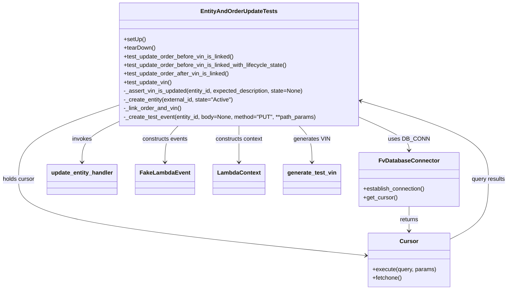
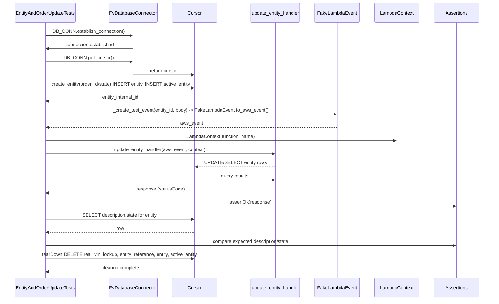

# Diagram: entity_core/entity_service/entity_service_tests/update_entity_tests/test_update_order_and_entity.py

> Auto-generated by Obscura crawlers

## Diagram 1

### SVG

<svg id="container" width="1388.2890625" xmlns="http://www.w3.org/2000/svg" class="classDiagram" height="806" viewBox="0 0 1388.2890625 806" role="graphics-document document" aria-roledescription="class"><g><defs><marker id="container_class-aggregationStart" class="marker aggregation class" refX="18" refY="7" markerWidth="190" markerHeight="240" orient="auto"><path d="M 18,7 L9,13 L1,7 L9,1 Z"></path></marker></defs><defs><marker id="container_class-aggregationEnd" class="marker aggregation class" refX="1" refY="7" markerWidth="20" markerHeight="28" orient="auto"><path d="M 18,7 L9,13 L1,7 L9,1 Z"></path></marker></defs><defs><marker id="container_class-extensionStart" class="marker extension class" refX="18" refY="7" markerWidth="190" markerHeight="240" orient="auto"><path d="M 1,7 L18,13 V 1 Z"></path></marker></defs><defs><marker id="container_class-extensionEnd" class="marker extension class" refX="1" refY="7" markerWidth="20" markerHeight="28" orient="auto"><path d="M 1,1 V 13 L18,7 Z"></path></marker></defs><defs><marker id="container_class-compositionStart" class="marker composition class" refX="18" refY="7" markerWidth="190" markerHeight="240" orient="auto"><path d="M 18,7 L9,13 L1,7 L9,1 Z"></path></marker></defs><defs><marker id="container_class-compositionEnd" class="marker composition class" refX="1" refY="7" markerWidth="20" markerHeight="28" orient="auto"><path d="M 18,7 L9,13 L1,7 L9,1 Z"></path></marker></defs><defs><marker id="container_class-dependencyStart" class="marker dependency class" refX="6" refY="7" markerWidth="190" markerHeight="240" orient="auto"><path d="M 5,7 L9,13 L1,7 L9,1 Z"></path></marker></defs><defs><marker id="container_class-dependencyEnd" class="marker dependency class" refX="13" refY="7" markerWidth="20" markerHeight="28" orient="auto"><path d="M 18,7 L9,13 L14,7 L9,1 Z"></path></marker></defs><defs><marker id="container_class-lollipopStart" class="marker lollipop class" refX="13" refY="7" markerWidth="190" markerHeight="240" orient="auto"><circle stroke="black" fill="transparent" cx="7" cy="7" r="6"></circle></marker></defs><defs><marker id="container_class-lollipopEnd" class="marker lollipop class" refX="1" refY="7" markerWidth="190" markerHeight="240" orient="auto"><circle stroke="black" fill="transparent" cx="7" cy="7" r="6"></circle></marker></defs><g class="root"><g class="clusters"></g><g class="edgePaths"><path d="M980.418,327.822L1002.344,337.685C1024.27,347.548,1068.121,367.274,1090.047,382.304C1111.973,397.333,1111.973,407.667,1111.973,412.833L1111.973,418" id="id_EntityAndOrderUpdateTests_FvDatabaseConnector_1" class="edge-thickness-normal edge-pattern-solid relation" style=";;;" data-edge="true" data-et="edge" data-id="id_EntityAndOrderUpdateTests_FvDatabaseConnector_1" data-points="W3sieCI6OTgwLjQxNzk2ODc1LCJ5IjozMjcuODIyNDUxMDY1Njk5MX0seyJ4IjoxMTExLjk3MjY1NjI1LCJ5IjozODd9LHsieCI6MTExMS45NzI2NTYyNSwieSI6NDI0fV0=" marker-end="url(#container_class-dependencyEnd)"></path><path d="M318.738,294.382L274.477,309.819C230.216,325.255,141.694,356.127,97.433,390.23C53.172,424.333,53.172,461.667,53.172,499C53.172,536.333,53.172,573.667,209.905,608.913C366.637,644.158,680.103,677.317,836.836,693.896L993.568,710.475" id="id_EntityAndOrderUpdateTests_Cursor_2" class="edge-thickness-normal edge-pattern-solid relation" style=";;;" data-edge="true" data-et="edge" data-id="id_EntityAndOrderUpdateTests_Cursor_2" data-points="W3sieCI6MzE4LjczODI4MTI1LCJ5IjoyOTQuMzgyMjM3MzU5MTgyNn0seyJ4Ijo1My4xNzE4NzUsInkiOjM4N30seyJ4Ijo1My4xNzE4NzUsInkiOjQ5OX0seyJ4Ijo1My4xNzE4NzUsInkiOjYxMX0seyJ4Ijo5OTkuNTM1MTU2MjUsInkiOjcxMS4xMDYzNTU1ODM1OTQzfV0=" marker-end="url(#container_class-dependencyEnd)"></path><path d="M318.738,342.598L303.773,349.998C288.807,357.399,258.876,372.199,243.911,390.266C228.945,408.333,228.945,429.667,228.945,440.333L228.945,451" id="id_EntityAndOrderUpdateTests_update_entity_handler_3" class="edge-thickness-normal edge-pattern-solid relation" style=";;;" data-edge="true" data-et="edge" data-id="id_EntityAndOrderUpdateTests_update_entity_handler_3" data-points="W3sieCI6MzE4LjczODI4MTI1LCJ5IjozNDIuNTk4MDAxNTIzMDAyOTV9LHsieCI6MjI4Ljk0NTMxMjUsInkiOjM4N30seyJ4IjoyMjguOTQ1MzEyNSwieSI6NDU3fV0=" marker-end="url(#container_class-dependencyEnd)"></path><path d="M487.487,350L481.641,356.167C475.796,362.333,464.105,374.667,458.259,391.5C452.414,408.333,452.414,429.667,452.414,440.333L452.414,451" id="id_EntityAndOrderUpdateTests_FakeLambdaEvent_4" class="edge-thickness-normal edge-pattern-solid relation" style=";;;" data-edge="true" data-et="edge" data-id="id_EntityAndOrderUpdateTests_FakeLambdaEvent_4" data-points="W3sieCI6NDg3LjQ4NjUxNTkyNTQ4MDgsInkiOjM1MH0seyJ4Ijo0NTIuNDE0MDYyNSwieSI6Mzg3fSx7IngiOjQ1Mi40MTQwNjI1LCJ5Ijo0NTd9XQ==" marker-end="url(#container_class-dependencyEnd)"></path><path d="M649.578,350L649.578,356.167C649.578,362.333,649.578,374.667,649.578,391.5C649.578,408.333,649.578,429.667,649.578,440.333L649.578,451" id="id_EntityAndOrderUpdateTests_LambdaContext_5" class="edge-thickness-normal edge-pattern-solid relation" style=";;;" data-edge="true" data-et="edge" data-id="id_EntityAndOrderUpdateTests_LambdaContext_5" data-points="W3sieCI6NjQ5LjU3ODEyNSwieSI6MzUwfSx7IngiOjY0OS41NzgxMjUsInkiOjM4N30seyJ4Ijo2NDkuNTc4MTI1LCJ5Ijo0NTd9XQ==" marker-end="url(#container_class-dependencyEnd)"></path><path d="M811.291,350L817.123,356.167C822.954,362.333,834.618,374.667,840.45,391.5C846.281,408.333,846.281,429.667,846.281,440.333L846.281,451" id="id_EntityAndOrderUpdateTests_generate_test_vin_6" class="edge-thickness-normal edge-pattern-solid relation" style=";;;" data-edge="true" data-et="edge" data-id="id_EntityAndOrderUpdateTests_generate_test_vin_6" data-points="W3sieCI6ODExLjI5MDc5MDI2NDQyMzEsInkiOjM1MH0seyJ4Ijo4NDYuMjgxMjUsInkiOjM4N30seyJ4Ijo4NDYuMjgxMjUsInkiOjQ1N31d" marker-end="url(#container_class-dependencyEnd)"></path><path d="M1111.973,574L1111.973,580.167C1111.973,586.333,1111.973,598.667,1111.973,610C1111.973,621.333,1111.973,631.667,1111.973,636.833L1111.973,642" id="id_FvDatabaseConnector_Cursor_7" class="edge-thickness-normal edge-pattern-solid relation" style=";;;" data-edge="true" data-et="edge" data-id="id_FvDatabaseConnector_Cursor_7" data-points="W3sieCI6MTExMS45NzI2NTYyNSwieSI6NTc0fSx7IngiOjExMTEuOTcyNjU2MjUsInkiOjYxMX0seyJ4IjoxMTExLjk3MjY1NjI1LCJ5Ijo2NDh9XQ==" marker-end="url(#container_class-dependencyEnd)"></path><path d="M1224.41,665.967L1242.471,656.806C1260.531,647.644,1296.652,629.322,1314.713,601.494C1332.773,573.667,1332.773,536.333,1332.773,499C1332.773,461.667,1332.773,424.333,1275.004,388.079C1217.235,351.824,1101.696,316.648,1043.927,299.06L986.158,281.472" id="id_Cursor_EntityAndOrderUpdateTests_8" class="edge-thickness-normal edge-pattern-solid relation" style=";;;" data-edge="true" data-et="edge" data-id="id_Cursor_EntityAndOrderUpdateTests_8" data-points="W3sieCI6MTIyNC40MTAxNTYyNSwieSI6NjY1Ljk2NjY4NzMwNjUwMTV9LHsieCI6MTMzMi43NzM0Mzc1LCJ5Ijo2MTF9LHsieCI6MTMzMi43NzM0Mzc1LCJ5Ijo0OTl9LHsieCI6MTMzMi43NzM0Mzc1LCJ5IjozODd9LHsieCI6OTgwLjQxNzk2ODc1LCJ5IjoyNzkuNzI0NzY1MjkxNzcwMDR9XQ==" marker-end="url(#container_class-dependencyEnd)"></path></g><g class="edgeLabels"><g class="edgeLabel" transform="translate(1111.97265625, 387)"><g class="label" data-id="id_EntityAndOrderUpdateTests_FvDatabaseConnector_1" transform="translate(-53.09375, -12)"><foreignObject width="106.1875" height="24">

uses DB_CONN

</foreignObject></g></g><g class="edgeLabel" transform="translate(53.171875, 499)"><g class="label" data-id="id_EntityAndOrderUpdateTests_Cursor_2" transform="translate(-45.171875, -12)"><foreignObject width="90.34375" height="24">

holds cursor

</foreignObject></g></g><g class="edgeLabel" transform="translate(228.9453125, 387)"><g class="label" data-id="id_EntityAndOrderUpdateTests_update_entity_handler_3" transform="translate(-27.5859375, -12)"><foreignObject width="55.171875" height="24">

invokes

</foreignObject></g></g><g class="edgeLabel" transform="translate(452.4140625, 387)"><g class="label" data-id="id_EntityAndOrderUpdateTests_FakeLambdaEvent_4" transform="translate(-63.8671875, -12)"><foreignObject width="127.734375" height="24">

constructs events

</foreignObject></g></g><g class="edgeLabel" transform="translate(649.578125, 387)"><g class="label" data-id="id_EntityAndOrderUpdateTests_LambdaContext_5" transform="translate(-66.8125, -12)"><foreignObject width="133.625" height="24">

constructs context

</foreignObject></g></g><g class="edgeLabel" transform="translate(846.28125, 387)"><g class="label" data-id="id_EntityAndOrderUpdateTests_generate_test_vin_6" transform="translate(-49.859375, -12)"><foreignObject width="99.71875" height="24">

generates VIN

</foreignObject></g></g><g class="edgeLabel" transform="translate(1111.97265625, 611)"><g class="label" data-id="id_FvDatabaseConnector_Cursor_7" transform="translate(-26.265625, -12)"><foreignObject width="52.53125" height="24">

returns

</foreignObject></g></g><g class="edgeLabel" transform="translate(1332.7734375, 499)"><g class="label" data-id="id_Cursor_EntityAndOrderUpdateTests_8" transform="translate(-47.515625, -12)"><foreignObject width="95.03125" height="24">

query results

</foreignObject></g></g></g><g class="nodes"><g class="node default" id="classId-EntityAndOrderUpdateTests-0" transform="translate(649.578125, 179)"><g class="basic label-container"><path d="M-330.83984375 -171 L330.83984375 -171 L330.83984375 171 L-330.83984375 171" stroke="none" stroke-width="0" fill="#ECECFF" style=""></path><path d="M-330.83984375 -171 C-127.72328285217463 -171, 75.39327804565073 -171, 330.83984375 -171 M-330.83984375 -171 C-94.2863031375793 -171, 142.2672374748414 -171, 330.83984375 -171 M330.83984375 -171 C330.83984375 -42.225797387256875, 330.83984375 86.54840522548625, 330.83984375 171 M330.83984375 -171 C330.83984375 -81.12807031833029, 330.83984375 8.743859363339425, 330.83984375 171 M330.83984375 171 C195.23609383249445 171, 59.632343914988894 171, -330.83984375 171 M330.83984375 171 C142.69947884374224 171, -45.44088606251552 171, -330.83984375 171 M-330.83984375 171 C-330.83984375 99.55746430460694, -330.83984375 28.114928609213877, -330.83984375 -171 M-330.83984375 171 C-330.83984375 45.825303222622864, -330.83984375 -79.34939355475427, -330.83984375 -171" stroke="#9370DB" stroke-width="1.3" fill="none" stroke-dasharray="0 0" style=""></path></g><g class="annotation-group text" transform="translate(0, -147)"></g><g class="label-group text" transform="translate(-101.9765625, -147)"><g class="label" style="font-weight: bolder" transform="translate(0,-12)"><foreignObject width="203.953125" height="24">

EntityAndOrderUpdateTests

</foreignObject></g></g><g class="members-group text" transform="translate(-318.83984375, -99)"></g><g class="methods-group text" transform="translate(-318.83984375, -69)"><g class="label" style="" transform="translate(0,-12)"><foreignObject width="60.421875" height="24">

+setUp()

</foreignObject></g><g class="label" style="" transform="translate(0,12)"><foreignObject width="87.75" height="24">

+tearDown()

</foreignObject></g><g class="label" style="" transform="translate(0,36)"><foreignObject width="308.875" height="24">

+test_update_order_before_vin_is_linked()

</foreignObject></g><g class="label" style="" transform="translate(0,60)"><foreignObject width="459.8125" height="24">

+test_update_order_before_vin_is_linked_with_lifecycle_state()

</foreignObject></g><g class="label" style="" transform="translate(0,84)"><foreignObject width="294.90625" height="24">

+test_update_order_after_vin_is_linked()

</foreignObject></g><g class="label" style="" transform="translate(0,108)"><foreignObject width="134.40625" height="24">

+test_update_vin()

</foreignObject></g><g class="label" style="" transform="translate(0,132)"><foreignObject width="505.171875" height="24">

-_assert_vin_is_updated(entity_id, expected_description, state=None)

</foreignObject></g><g class="label" style="" transform="translate(0,156)"><foreignObject width="307.75" height="24">

-_create_entity(external_id, state="Active")

</foreignObject></g><g class="label" style="" transform="translate(0,180)"><foreignObject width="161.9375" height="24">

-_link_order_and_vin()

</foreignObject></g><g class="label" style="" transform="translate(0,204)"><foreignObject width="535.703125" height="24">

-_create_test_event(entity_id, body=None, method="PUT", **path_params)

</foreignObject></g></g><g class="divider" style=""><path d="M-330.83984375 -123 C-161.65593252266206 -123, 7.527978704675888 -123, 330.83984375 -123 M-330.83984375 -123 C-147.85343991354713 -123, 35.13296392290573 -123, 330.83984375 -123" stroke="#9370DB" stroke-width="1.3" fill="none" stroke-dasharray="0 0" style=""></path></g><g class="divider" style=""><path d="M-330.83984375 -99 C-149.0115767517611 -99, 32.816690246477776 -99, 330.83984375 -99 M-330.83984375 -99 C-71.73591195459869 -99, 187.36801984080262 -99, 330.83984375 -99" stroke="#9370DB" stroke-width="1.3" fill="none" stroke-dasharray="0 0" style=""></path></g></g><g class="node default" id="classId-FvDatabaseConnector-1" transform="translate(1111.97265625, 499)"><g class="basic label-container"><path d="M-138.28515625 -75 L138.28515625 -75 L138.28515625 75 L-138.28515625 75" stroke="none" stroke-width="0" fill="#ECECFF" style=""></path><path d="M-138.28515625 -75 C-42.99768428759373 -75, 52.289787674812544 -75, 138.28515625 -75 M-138.28515625 -75 C-78.0344636754433 -75, -17.783771100886597 -75, 138.28515625 -75 M138.28515625 -75 C138.28515625 -19.57715394667499, 138.28515625 35.84569210665002, 138.28515625 75 M138.28515625 -75 C138.28515625 -23.675540557598133, 138.28515625 27.648918884803734, 138.28515625 75 M138.28515625 75 C31.3574859674751 75, -75.5701843150498 75, -138.28515625 75 M138.28515625 75 C76.07177056345566 75, 13.858384876911316 75, -138.28515625 75 M-138.28515625 75 C-138.28515625 31.952963048805486, -138.28515625 -11.094073902389027, -138.28515625 -75 M-138.28515625 75 C-138.28515625 44.38416897237843, -138.28515625 13.768337944756873, -138.28515625 -75" stroke="#9370DB" stroke-width="1.3" fill="none" stroke-dasharray="0 0" style=""></path></g><g class="annotation-group text" transform="translate(0, -51)"></g><g class="label-group text" transform="translate(-79.3046875, -51)"><g class="label" style="font-weight: bolder" transform="translate(0,-12)"><foreignObject width="158.609375" height="24">

FvDatabaseConnector

</foreignObject></g></g><g class="members-group text" transform="translate(-126.28515625, -3)"></g><g class="methods-group text" transform="translate(-126.28515625, 27)"><g class="label" style="" transform="translate(0,-12)"><foreignObject width="173.265625" height="24">

+establish_connection()

</foreignObject></g><g class="label" style="" transform="translate(0,12)"><foreignObject width="94.640625" height="24">

+get_cursor()

</foreignObject></g></g><g class="divider" style=""><path d="M-138.28515625 -27 C-72.32808318867083 -27, -6.371010127341663 -27, 138.28515625 -27 M-138.28515625 -27 C-72.51337255414393 -27, -6.741588858287855 -27, 138.28515625 -27" stroke="#9370DB" stroke-width="1.3" fill="none" stroke-dasharray="0 0" style=""></path></g><g class="divider" style=""><path d="M-138.28515625 -3 C-42.238707261739705 -3, 53.80774172652059 -3, 138.28515625 -3 M-138.28515625 -3 C-50.369641640308686 -3, 37.54587296938263 -3, 138.28515625 -3" stroke="#9370DB" stroke-width="1.3" fill="none" stroke-dasharray="0 0" style=""></path></g></g><g class="node default" id="classId-Cursor-2" transform="translate(1111.97265625, 723)"><g class="basic label-container"><path d="M-112.4375 -75 L112.4375 -75 L112.4375 75 L-112.4375 75" stroke="none" stroke-width="0" fill="#ECECFF" style=""></path><path d="M-112.4375 -75 C-45.90339048929849 -75, 20.630719021403024 -75, 112.4375 -75 M-112.4375 -75 C-65.8731113731238 -75, -19.30872274624761 -75, 112.4375 -75 M112.4375 -75 C112.4375 -27.81779337290108, 112.4375 19.364413254197842, 112.4375 75 M112.4375 -75 C112.4375 -26.264694114167284, 112.4375 22.470611771665432, 112.4375 75 M112.4375 75 C26.76484203070278 75, -58.90781593859444 75, -112.4375 75 M112.4375 75 C53.0688547231521 75, -6.2997905536958 75, -112.4375 75 M-112.4375 75 C-112.4375 21.91753204786221, -112.4375 -31.16493590427558, -112.4375 -75 M-112.4375 75 C-112.4375 38.65280111296302, -112.4375 2.3056022259260374, -112.4375 -75" stroke="#9370DB" stroke-width="1.3" fill="none" stroke-dasharray="0 0" style=""></path></g><g class="annotation-group text" transform="translate(0, -51)"></g><g class="label-group text" transform="translate(-23.90625, -51)"><g class="label" style="font-weight: bolder" transform="translate(0,-12)"><foreignObject width="47.8125" height="24">

Cursor

</foreignObject></g></g><g class="members-group text" transform="translate(-100.4375, -3)"></g><g class="methods-group text" transform="translate(-100.4375, 27)"><g class="label" style="" transform="translate(0,-12)"><foreignObject width="176.96875" height="24">

+execute(query, params)

</foreignObject></g><g class="label" style="" transform="translate(0,12)"><foreignObject width="82.046875" height="24">

+fetchone()

</foreignObject></g></g><g class="divider" style=""><path d="M-112.4375 -27 C-27.580197708042377 -27, 57.277104583915246 -27, 112.4375 -27 M-112.4375 -27 C-59.551772156449154 -27, -6.666044312898308 -27, 112.4375 -27" stroke="#9370DB" stroke-width="1.3" fill="none" stroke-dasharray="0 0" style=""></path></g><g class="divider" style=""><path d="M-112.4375 -3 C-62.866920203354525 -3, -13.29634040670905 -3, 112.4375 -3 M-112.4375 -3 C-59.184269106951774 -3, -5.931038213903548 -3, 112.4375 -3" stroke="#9370DB" stroke-width="1.3" fill="none" stroke-dasharray="0 0" style=""></path></g></g><g class="node default" id="classId-update_entity_handler-3" transform="translate(228.9453125, 499)"><g class="basic label-container"><path d="M-95.6015625 -42 L95.6015625 -42 L95.6015625 42 L-95.6015625 42" stroke="none" stroke-width="0" fill="#ECECFF" style=""></path><path d="M-95.6015625 -42 C-56.36389079744782 -42, -17.126219094895646 -42, 95.6015625 -42 M-95.6015625 -42 C-54.87877692653825 -42, -14.155991353076502 -42, 95.6015625 -42 M95.6015625 -42 C95.6015625 -17.69320734284378, 95.6015625 6.613585314312438, 95.6015625 42 M95.6015625 -42 C95.6015625 -21.322730401794278, 95.6015625 -0.6454608035885556, 95.6015625 42 M95.6015625 42 C45.895505768898865 42, -3.810550962202271 42, -95.6015625 42 M95.6015625 42 C57.11641463661066 42, 18.631266773221327 42, -95.6015625 42 M-95.6015625 42 C-95.6015625 14.803449606126659, -95.6015625 -12.393100787746683, -95.6015625 -42 M-95.6015625 42 C-95.6015625 14.643318628601204, -95.6015625 -12.713362742797592, -95.6015625 -42" stroke="#9370DB" stroke-width="1.3" fill="none" stroke-dasharray="0 0" style=""></path></g><g class="annotation-group text" transform="translate(0, -18)"></g><g class="label-group text" transform="translate(-83.6015625, -18)"><g class="label" style="font-weight: bolder" transform="translate(0,-12)"><foreignObject width="167.203125" height="24">

update_entity_handler

</foreignObject></g></g><g class="members-group text" transform="translate(-83.6015625, 30)"></g><g class="methods-group text" transform="translate(-83.6015625, 60)"></g><g class="divider" style=""><path d="M-95.6015625 6 C-47.5632665320149 6, 0.47502943597019964 6, 95.6015625 6 M-95.6015625 6 C-27.613618179918504 6, 40.37432614016299 6, 95.6015625 6" stroke="#9370DB" stroke-width="1.3" fill="none" stroke-dasharray="0 0" style=""></path></g><g class="divider" style=""><path d="M-95.6015625 24 C-20.688317695817048 24, 54.224927108365904 24, 95.6015625 24 M-95.6015625 24 C-51.24162691579278 24, -6.881691331585557 24, 95.6015625 24" stroke="#9370DB" stroke-width="1.3" fill="none" stroke-dasharray="0 0" style=""></path></g></g><g class="node default" id="classId-FakeLambdaEvent-4" transform="translate(452.4140625, 499)"><g class="basic label-container"><path d="M-77.8671875 -42 L77.8671875 -42 L77.8671875 42 L-77.8671875 42" stroke="none" stroke-width="0" fill="#ECECFF" style=""></path><path d="M-77.8671875 -42 C-35.91245205780451 -42, 6.042283384390984 -42, 77.8671875 -42 M-77.8671875 -42 C-37.59813364047996 -42, 2.6709202190400845 -42, 77.8671875 -42 M77.8671875 -42 C77.8671875 -18.566510523830203, 77.8671875 4.866978952339593, 77.8671875 42 M77.8671875 -42 C77.8671875 -18.88776059962138, 77.8671875 4.22447880075724, 77.8671875 42 M77.8671875 42 C28.91646168253277 42, -20.03426413493446 42, -77.8671875 42 M77.8671875 42 C21.665313934789303 42, -34.536559630421394 42, -77.8671875 42 M-77.8671875 42 C-77.8671875 19.025762771592007, -77.8671875 -3.948474456815987, -77.8671875 -42 M-77.8671875 42 C-77.8671875 9.738491388144048, -77.8671875 -22.523017223711904, -77.8671875 -42" stroke="#9370DB" stroke-width="1.3" fill="none" stroke-dasharray="0 0" style=""></path></g><g class="annotation-group text" transform="translate(0, -18)"></g><g class="label-group text" transform="translate(-65.8671875, -18)"><g class="label" style="font-weight: bolder" transform="translate(0,-12)"><foreignObject width="131.734375" height="24">

FakeLambdaEvent

</foreignObject></g></g><g class="members-group text" transform="translate(-65.8671875, 30)"></g><g class="methods-group text" transform="translate(-65.8671875, 60)"></g><g class="divider" style=""><path d="M-77.8671875 6 C-29.176029766057276 6, 19.515127967885448 6, 77.8671875 6 M-77.8671875 6 C-26.50562724387978 6, 24.855933012240442 6, 77.8671875 6" stroke="#9370DB" stroke-width="1.3" fill="none" stroke-dasharray="0 0" style=""></path></g><g class="divider" style=""><path d="M-77.8671875 24 C-27.222904345731138 24, 23.421378808537725 24, 77.8671875 24 M-77.8671875 24 C-37.1044325600012 24, 3.6583223799975997 24, 77.8671875 24" stroke="#9370DB" stroke-width="1.3" fill="none" stroke-dasharray="0 0" style=""></path></g></g><g class="node default" id="classId-LambdaContext-5" transform="translate(649.578125, 499)"><g class="basic label-container"><path d="M-69.296875 -42 L69.296875 -42 L69.296875 42 L-69.296875 42" stroke="none" stroke-width="0" fill="#ECECFF" style=""></path><path d="M-69.296875 -42 C-25.745496939517665 -42, 17.80588112096467 -42, 69.296875 -42 M-69.296875 -42 C-41.48090923365846 -42, -13.664943467316917 -42, 69.296875 -42 M69.296875 -42 C69.296875 -24.79456933851178, 69.296875 -7.589138677023563, 69.296875 42 M69.296875 -42 C69.296875 -21.908635921585365, 69.296875 -1.8172718431707295, 69.296875 42 M69.296875 42 C17.3325562460008 42, -34.6317625079984 42, -69.296875 42 M69.296875 42 C26.813461415677004 42, -15.669952168645992 42, -69.296875 42 M-69.296875 42 C-69.296875 14.220982544892582, -69.296875 -13.558034910214836, -69.296875 -42 M-69.296875 42 C-69.296875 22.224656289277636, -69.296875 2.449312578555272, -69.296875 -42" stroke="#9370DB" stroke-width="1.3" fill="none" stroke-dasharray="0 0" style=""></path></g><g class="annotation-group text" transform="translate(0, -18)"></g><g class="label-group text" transform="translate(-57.296875, -18)"><g class="label" style="font-weight: bolder" transform="translate(0,-12)"><foreignObject width="114.59375" height="24">

LambdaContext

</foreignObject></g></g><g class="members-group text" transform="translate(-57.296875, 30)"></g><g class="methods-group text" transform="translate(-57.296875, 60)"></g><g class="divider" style=""><path d="M-69.296875 6 C-18.400327977675204 6, 32.49621904464959 6, 69.296875 6 M-69.296875 6 C-17.180913304061754 6, 34.93504839187649 6, 69.296875 6" stroke="#9370DB" stroke-width="1.3" fill="none" stroke-dasharray="0 0" style=""></path></g><g class="divider" style=""><path d="M-69.296875 24 C-27.88764001363071 24, 13.521594972738583 24, 69.296875 24 M-69.296875 24 C-40.41706525248054 24, -11.537255504961088 24, 69.296875 24" stroke="#9370DB" stroke-width="1.3" fill="none" stroke-dasharray="0 0" style=""></path></g></g><g class="node default" id="classId-generate_test_vin-6" transform="translate(846.28125, 499)"><g class="basic label-container"><path d="M-77.40625 -42 L77.40625 -42 L77.40625 42 L-77.40625 42" stroke="none" stroke-width="0" fill="#ECECFF" style=""></path><path d="M-77.40625 -42 C-29.88393738185573 -42, 17.63837523628854 -42, 77.40625 -42 M-77.40625 -42 C-33.447239288805605 -42, 10.51177142238879 -42, 77.40625 -42 M77.40625 -42 C77.40625 -18.615752276238513, 77.40625 4.768495447522973, 77.40625 42 M77.40625 -42 C77.40625 -16.26029288468767, 77.40625 9.479414230624663, 77.40625 42 M77.40625 42 C41.1564586082208 42, 4.906667216441605 42, -77.40625 42 M77.40625 42 C25.941827845998297 42, -25.522594308003406 42, -77.40625 42 M-77.40625 42 C-77.40625 11.460684715023227, -77.40625 -19.078630569953546, -77.40625 -42 M-77.40625 42 C-77.40625 10.060617880095599, -77.40625 -21.878764239808802, -77.40625 -42" stroke="#9370DB" stroke-width="1.3" fill="none" stroke-dasharray="0 0" style=""></path></g><g class="annotation-group text" transform="translate(0, -18)"></g><g class="label-group text" transform="translate(-65.40625, -18)"><g class="label" style="font-weight: bolder" transform="translate(0,-12)"><foreignObject width="130.8125" height="24">

generate_test_vin

</foreignObject></g></g><g class="members-group text" transform="translate(-65.40625, 30)"></g><g class="methods-group text" transform="translate(-65.40625, 60)"></g><g class="divider" style=""><path d="M-77.40625 6 C-25.914231169064493 6, 25.577787661871014 6, 77.40625 6 M-77.40625 6 C-44.65137995673352 6, -11.896509913467042 6, 77.40625 6" stroke="#9370DB" stroke-width="1.3" fill="none" stroke-dasharray="0 0" style=""></path></g><g class="divider" style=""><path d="M-77.40625 24 C-45.22469236497323 24, -13.043134729946459 24, 77.40625 24 M-77.40625 24 C-36.71287117269865 24, 3.980507654602704 24, 77.40625 24" stroke="#9370DB" stroke-width="1.3" fill="none" stroke-dasharray="0 0" style=""></path></g></g></g></g></g></svg>

## Diagram 2

### SVG

<svg id="container" width="1694.5" xmlns="http://www.w3.org/2000/svg" height="1083" viewBox="-50 -10 1694.5 1083" role="graphics-document document" aria-roledescription="sequence"><g><rect x="1444.5" y="997" fill="#eaeaea" stroke="#666" width="150" height="65" name="Assert" rx="3" ry="3" class="actor actor-bottom"></rect><text x="1519.5" y="1029.5" dominant-baseline="central" alignment-baseline="central" class="actor actor-box" style="text-anchor: middle; font-size: 16px; font-weight: 400;"><tspan x="1519.5" dy="0">Assertions</tspan></text></g><g><rect x="1244.5" y="997" fill="#eaeaea" stroke="#666" width="150" height="65" name="Context" rx="3" ry="3" class="actor actor-bottom"></rect><text x="1319.5" y="1029.5" dominant-baseline="central" alignment-baseline="central" class="actor actor-box" style="text-anchor: middle; font-size: 16px; font-weight: 400;"><tspan x="1319.5" dy="0">LambdaContext</tspan></text></g><g><rect x="1043.5" y="997" fill="#eaeaea" stroke="#666" width="151" height="65" name="Event" rx="3" ry="3" class="actor actor-bottom"></rect><text x="1119" y="1029.5" dominant-baseline="central" alignment-baseline="central" class="actor actor-box" style="text-anchor: middle; font-size: 16px; font-weight: 400;"><tspan x="1119" dy="0">FakeLambdaEvent</tspan></text></g><g><rect x="807.5" y="997" fill="#eaeaea" stroke="#666" width="186" height="65" name="Handler" rx="3" ry="3" class="actor actor-bottom"></rect><text x="900.5" y="1029.5" dominant-baseline="central" alignment-baseline="central" class="actor actor-box" style="text-anchor: middle; font-size: 16px; font-weight: 400;"><tspan x="900.5" dy="0">update_entity_handler</tspan></text></g><g><rect x="556.5" y="997" fill="#eaeaea" stroke="#666" width="150" height="65" name="Cur" rx="3" ry="3" class="actor actor-bottom"></rect><text x="631.5" y="1029.5" dominant-baseline="central" alignment-baseline="central" class="actor actor-box" style="text-anchor: middle; font-size: 16px; font-weight: 400;"><tspan x="631.5" dy="0">Cursor</tspan></text></g><g><rect x="329.5" y="997" fill="#eaeaea" stroke="#666" width="177" height="65" name="DB" rx="3" ry="3" class="actor actor-bottom"></rect><text x="418" y="1029.5" dominant-baseline="central" alignment-baseline="central" class="actor actor-box" style="text-anchor: middle; font-size: 16px; font-weight: 400;"><tspan x="418" dy="0">FvDatabaseConnector</tspan></text></g><g><rect x="0" y="997" fill="#eaeaea" stroke="#666" width="220" height="65" name="Test" rx="3" ry="3" class="actor actor-bottom"></rect><text x="110" y="1029.5" dominant-baseline="central" alignment-baseline="central" class="actor actor-box" style="text-anchor: middle; font-size: 16px; font-weight: 400;"><tspan x="110" dy="0">EntityAndOrderUpdateTests</tspan></text></g><g><line id="actor6" x1="1519.5" y1="65" x2="1519.5" y2="997" class="actor-line 200" stroke-width="0.5px" stroke="#999" name="Assert"></line><g id="root-6"><rect x="1444.5" y="0" fill="#eaeaea" stroke="#666" width="150" height="65" name="Assert" rx="3" ry="3" class="actor actor-top"></rect><text x="1519.5" y="32.5" dominant-baseline="central" alignment-baseline="central" class="actor actor-box" style="text-anchor: middle; font-size: 16px; font-weight: 400;"><tspan x="1519.5" dy="0">Assertions</tspan></text></g></g><g><line id="actor5" x1="1319.5" y1="65" x2="1319.5" y2="997" class="actor-line 200" stroke-width="0.5px" stroke="#999" name="Context"></line><g id="root-5"><rect x="1244.5" y="0" fill="#eaeaea" stroke="#666" width="150" height="65" name="Context" rx="3" ry="3" class="actor actor-top"></rect><text x="1319.5" y="32.5" dominant-baseline="central" alignment-baseline="central" class="actor actor-box" style="text-anchor: middle; font-size: 16px; font-weight: 400;"><tspan x="1319.5" dy="0">LambdaContext</tspan></text></g></g><g><line id="actor4" x1="1119" y1="65" x2="1119" y2="997" class="actor-line 200" stroke-width="0.5px" stroke="#999" name="Event"></line><g id="root-4"><rect x="1043.5" y="0" fill="#eaeaea" stroke="#666" width="151" height="65" name="Event" rx="3" ry="3" class="actor actor-top"></rect><text x="1119" y="32.5" dominant-baseline="central" alignment-baseline="central" class="actor actor-box" style="text-anchor: middle; font-size: 16px; font-weight: 400;"><tspan x="1119" dy="0">FakeLambdaEvent</tspan></text></g></g><g><line id="actor3" x1="900.5" y1="65" x2="900.5" y2="997" class="actor-line 200" stroke-width="0.5px" stroke="#999" name="Handler"></line><g id="root-3"><rect x="807.5" y="0" fill="#eaeaea" stroke="#666" width="186" height="65" name="Handler" rx="3" ry="3" class="actor actor-top"></rect><text x="900.5" y="32.5" dominant-baseline="central" alignment-baseline="central" class="actor actor-box" style="text-anchor: middle; font-size: 16px; font-weight: 400;"><tspan x="900.5" dy="0">update_entity_handler</tspan></text></g></g><g><line id="actor2" x1="631.5" y1="65" x2="631.5" y2="997" class="actor-line 200" stroke-width="0.5px" stroke="#999" name="Cur"></line><g id="root-2"><rect x="556.5" y="0" fill="#eaeaea" stroke="#666" width="150" height="65" name="Cur" rx="3" ry="3" class="actor actor-top"></rect><text x="631.5" y="32.5" dominant-baseline="central" alignment-baseline="central" class="actor actor-box" style="text-anchor: middle; font-size: 16px; font-weight: 400;"><tspan x="631.5" dy="0">Cursor</tspan></text></g></g><g><line id="actor1" x1="418" y1="65" x2="418" y2="997" class="actor-line 200" stroke-width="0.5px" stroke="#999" name="DB"></line><g id="root-1"><rect x="329.5" y="0" fill="#eaeaea" stroke="#666" width="177" height="65" name="DB" rx="3" ry="3" class="actor actor-top"></rect><text x="418" y="32.5" dominant-baseline="central" alignment-baseline="central" class="actor actor-box" style="text-anchor: middle; font-size: 16px; font-weight: 400;"><tspan x="418" dy="0">FvDatabaseConnector</tspan></text></g></g><g><line id="actor0" x1="110" y1="65" x2="110" y2="997" class="actor-line 200" stroke-width="0.5px" stroke="#999" name="Test"></line><g id="root-0"><rect x="0" y="0" fill="#eaeaea" stroke="#666" width="220" height="65" name="Test" rx="3" ry="3" class="actor actor-top"></rect><text x="110" y="32.5" dominant-baseline="central" alignment-baseline="central" class="actor actor-box" style="text-anchor: middle; font-size: 16px; font-weight: 400;"><tspan x="110" dy="0">EntityAndOrderUpdateTests</tspan></text></g></g><g></g><defs><symbol id="computer" width="24" height="24"><path transform="scale(.5)" d="M2 2v13h20v-13h-20zm18 11h-16v-9h16v9zm-10.228 6l.466-1h3.524l.467 1h-4.457zm14.228 3h-24l2-6h2.104l-1.33 4h18.45l-1.297-4h2.073l2 6zm-5-10h-14v-7h14v7z"></path></symbol></defs><defs><symbol id="database" fill-rule="evenodd" clip-rule="evenodd"><path transform="scale(.5)" d="M12.258.001l.256.004.255.005.253.008.251.01.249.012.247.015.246.016.242.019.241.02.239.023.236.024.233.027.231.028.229.031.225.032.223.034.22.036.217.038.214.04.211.041.208.043.205.045.201.046.198.048.194.05.191.051.187.053.183.054.18.056.175.057.172.059.168.06.163.061.16.063.155.064.15.066.074.033.073.033.071.034.07.034.069.035.068.035.067.035.066.035.064.036.064.036.062.036.06.036.06.037.058.037.058.037.055.038.055.038.053.038.052.038.051.039.05.039.048.039.047.039.045.04.044.04.043.04.041.04.04.041.039.041.037.041.036.041.034.041.033.042.032.042.03.042.029.042.027.042.026.043.024.043.023.043.021.043.02.043.018.044.017.043.015.044.013.044.012.044.011.045.009.044.007.045.006.045.004.045.002.045.001.045v17l-.001.045-.002.045-.004.045-.006.045-.007.045-.009.044-.011.045-.012.044-.013.044-.015.044-.017.043-.018.044-.02.043-.021.043-.023.043-.024.043-.026.043-.027.042-.029.042-.03.042-.032.042-.033.042-.034.041-.036.041-.037.041-.039.041-.04.041-.041.04-.043.04-.044.04-.045.04-.047.039-.048.039-.05.039-.051.039-.052.038-.053.038-.055.038-.055.038-.058.037-.058.037-.06.037-.06.036-.062.036-.064.036-.064.036-.066.035-.067.035-.068.035-.069.035-.07.034-.071.034-.073.033-.074.033-.15.066-.155.064-.16.063-.163.061-.168.06-.172.059-.175.057-.18.056-.183.054-.187.053-.191.051-.194.05-.198.048-.201.046-.205.045-.208.043-.211.041-.214.04-.217.038-.22.036-.223.034-.225.032-.229.031-.231.028-.233.027-.236.024-.239.023-.241.02-.242.019-.246.016-.247.015-.249.012-.251.01-.253.008-.255.005-.256.004-.258.001-.258-.001-.256-.004-.255-.005-.253-.008-.251-.01-.249-.012-.247-.015-.245-.016-.243-.019-.241-.02-.238-.023-.236-.024-.234-.027-.231-.028-.228-.031-.226-.032-.223-.034-.22-.036-.217-.038-.214-.04-.211-.041-.208-.043-.204-.045-.201-.046-.198-.048-.195-.05-.19-.051-.187-.053-.184-.054-.179-.056-.176-.057-.172-.059-.167-.06-.164-.061-.159-.063-.155-.064-.151-.066-.074-.033-.072-.033-.072-.034-.07-.034-.069-.035-.068-.035-.067-.035-.066-.035-.064-.036-.063-.036-.062-.036-.061-.036-.06-.037-.058-.037-.057-.037-.056-.038-.055-.038-.053-.038-.052-.038-.051-.039-.049-.039-.049-.039-.046-.039-.046-.04-.044-.04-.043-.04-.041-.04-.04-.041-.039-.041-.037-.041-.036-.041-.034-.041-.033-.042-.032-.042-.03-.042-.029-.042-.027-.042-.026-.043-.024-.043-.023-.043-.021-.043-.02-.043-.018-.044-.017-.043-.015-.044-.013-.044-.012-.044-.011-.045-.009-.044-.007-.045-.006-.045-.004-.045-.002-.045-.001-.045v-17l.001-.045.002-.045.004-.045.006-.045.007-.045.009-.044.011-.045.012-.044.013-.044.015-.044.017-.043.018-.044.02-.043.021-.043.023-.043.024-.043.026-.043.027-.042.029-.042.03-.042.032-.042.033-.042.034-.041.036-.041.037-.041.039-.041.04-.041.041-.04.043-.04.044-.04.046-.04.046-.039.049-.039.049-.039.051-.039.052-.038.053-.038.055-.038.056-.038.057-.037.058-.037.06-.037.061-.036.062-.036.063-.036.064-.036.066-.035.067-.035.068-.035.069-.035.07-.034.072-.034.072-.033.074-.033.151-.066.155-.064.159-.063.164-.061.167-.06.172-.059.176-.057.179-.056.184-.054.187-.053.19-.051.195-.05.198-.048.201-.046.204-.045.208-.043.211-.041.214-.04.217-.038.22-.036.223-.034.226-.032.228-.031.231-.028.234-.027.236-.024.238-.023.241-.02.243-.019.245-.016.247-.015.249-.012.251-.01.253-.008.255-.005.256-.004.258-.001.258.001zm-9.258 20.499v.01l.001.021.003.021.004.022.005.021.006.022.007.022.009.023.01.022.011.023.012.023.013.023.015.023.016.024.017.023.018.024.019.024.021.024.022.025.023.024.024.025.052.049.056.05.061.051.066.051.07.051.075.051.079.052.084.052.088.052.092.052.097.052.102.051.105.052.11.052.114.051.119.051.123.051.127.05.131.05.135.05.139.048.144.049.147.047.152.047.155.047.16.045.163.045.167.043.171.043.176.041.178.041.183.039.187.039.19.037.194.035.197.035.202.033.204.031.209.03.212.029.216.027.219.025.222.024.226.021.23.02.233.018.236.016.24.015.243.012.246.01.249.008.253.005.256.004.259.001.26-.001.257-.004.254-.005.25-.008.247-.011.244-.012.241-.014.237-.016.233-.018.231-.021.226-.021.224-.024.22-.026.216-.027.212-.028.21-.031.205-.031.202-.034.198-.034.194-.036.191-.037.187-.039.183-.04.179-.04.175-.042.172-.043.168-.044.163-.045.16-.046.155-.046.152-.047.148-.048.143-.049.139-.049.136-.05.131-.05.126-.05.123-.051.118-.052.114-.051.11-.052.106-.052.101-.052.096-.052.092-.052.088-.053.083-.051.079-.052.074-.052.07-.051.065-.051.06-.051.056-.05.051-.05.023-.024.023-.025.021-.024.02-.024.019-.024.018-.024.017-.024.015-.023.014-.024.013-.023.012-.023.01-.023.01-.022.008-.022.006-.022.006-.022.004-.022.004-.021.001-.021.001-.021v-4.127l-.077.055-.08.053-.083.054-.085.053-.087.052-.09.052-.093.051-.095.05-.097.05-.1.049-.102.049-.105.048-.106.047-.109.047-.111.046-.114.045-.115.045-.118.044-.12.043-.122.042-.124.042-.126.041-.128.04-.13.04-.132.038-.134.038-.135.037-.138.037-.139.035-.142.035-.143.034-.144.033-.147.032-.148.031-.15.03-.151.03-.153.029-.154.027-.156.027-.158.026-.159.025-.161.024-.162.023-.163.022-.165.021-.166.02-.167.019-.169.018-.169.017-.171.016-.173.015-.173.014-.175.013-.175.012-.177.011-.178.01-.179.008-.179.008-.181.006-.182.005-.182.004-.184.003-.184.002h-.37l-.184-.002-.184-.003-.182-.004-.182-.005-.181-.006-.179-.008-.179-.008-.178-.01-.176-.011-.176-.012-.175-.013-.173-.014-.172-.015-.171-.016-.17-.017-.169-.018-.167-.019-.166-.02-.165-.021-.163-.022-.162-.023-.161-.024-.159-.025-.157-.026-.156-.027-.155-.027-.153-.029-.151-.03-.15-.03-.148-.031-.146-.032-.145-.033-.143-.034-.141-.035-.14-.035-.137-.037-.136-.037-.134-.038-.132-.038-.13-.04-.128-.04-.126-.041-.124-.042-.122-.042-.12-.044-.117-.043-.116-.045-.113-.045-.112-.046-.109-.047-.106-.047-.105-.048-.102-.049-.1-.049-.097-.05-.095-.05-.093-.052-.09-.051-.087-.052-.085-.053-.083-.054-.08-.054-.077-.054v4.127zm0-5.654v.011l.001.021.003.021.004.021.005.022.006.022.007.022.009.022.01.022.011.023.012.023.013.023.015.024.016.023.017.024.018.024.019.024.021.024.022.024.023.025.024.024.052.05.056.05.061.05.066.051.07.051.075.052.079.051.084.052.088.052.092.052.097.052.102.052.105.052.11.051.114.051.119.052.123.05.127.051.131.05.135.049.139.049.144.048.147.048.152.047.155.046.16.045.163.045.167.044.171.042.176.042.178.04.183.04.187.038.19.037.194.036.197.034.202.033.204.032.209.03.212.028.216.027.219.025.222.024.226.022.23.02.233.018.236.016.24.014.243.012.246.01.249.008.253.006.256.003.259.001.26-.001.257-.003.254-.006.25-.008.247-.01.244-.012.241-.015.237-.016.233-.018.231-.02.226-.022.224-.024.22-.025.216-.027.212-.029.21-.03.205-.032.202-.033.198-.035.194-.036.191-.037.187-.039.183-.039.179-.041.175-.042.172-.043.168-.044.163-.045.16-.045.155-.047.152-.047.148-.048.143-.048.139-.05.136-.049.131-.05.126-.051.123-.051.118-.051.114-.052.11-.052.106-.052.101-.052.096-.052.092-.052.088-.052.083-.052.079-.052.074-.051.07-.052.065-.051.06-.05.056-.051.051-.049.023-.025.023-.024.021-.025.02-.024.019-.024.018-.024.017-.024.015-.023.014-.023.013-.024.012-.022.01-.023.01-.023.008-.022.006-.022.006-.022.004-.021.004-.022.001-.021.001-.021v-4.139l-.077.054-.08.054-.083.054-.085.052-.087.053-.09.051-.093.051-.095.051-.097.05-.1.049-.102.049-.105.048-.106.047-.109.047-.111.046-.114.045-.115.044-.118.044-.12.044-.122.042-.124.042-.126.041-.128.04-.13.039-.132.039-.134.038-.135.037-.138.036-.139.036-.142.035-.143.033-.144.033-.147.033-.148.031-.15.03-.151.03-.153.028-.154.028-.156.027-.158.026-.159.025-.161.024-.162.023-.163.022-.165.021-.166.02-.167.019-.169.018-.169.017-.171.016-.173.015-.173.014-.175.013-.175.012-.177.011-.178.009-.179.009-.179.007-.181.007-.182.005-.182.004-.184.003-.184.002h-.37l-.184-.002-.184-.003-.182-.004-.182-.005-.181-.007-.179-.007-.179-.009-.178-.009-.176-.011-.176-.012-.175-.013-.173-.014-.172-.015-.171-.016-.17-.017-.169-.018-.167-.019-.166-.02-.165-.021-.163-.022-.162-.023-.161-.024-.159-.025-.157-.026-.156-.027-.155-.028-.153-.028-.151-.03-.15-.03-.148-.031-.146-.033-.145-.033-.143-.033-.141-.035-.14-.036-.137-.036-.136-.037-.134-.038-.132-.039-.13-.039-.128-.04-.126-.041-.124-.042-.122-.043-.12-.043-.117-.044-.116-.044-.113-.046-.112-.046-.109-.046-.106-.047-.105-.048-.102-.049-.1-.049-.097-.05-.095-.051-.093-.051-.09-.051-.087-.053-.085-.052-.083-.054-.08-.054-.077-.054v4.139zm0-5.666v.011l.001.02.003.022.004.021.005.022.006.021.007.022.009.023.01.022.011.023.012.023.013.023.015.023.016.024.017.024.018.023.019.024.021.025.022.024.023.024.024.025.052.05.056.05.061.05.066.051.07.051.075.052.079.051.084.052.088.052.092.052.097.052.102.052.105.051.11.052.114.051.119.051.123.051.127.05.131.05.135.05.139.049.144.048.147.048.152.047.155.046.16.045.163.045.167.043.171.043.176.042.178.04.183.04.187.038.19.037.194.036.197.034.202.033.204.032.209.03.212.028.216.027.219.025.222.024.226.021.23.02.233.018.236.017.24.014.243.012.246.01.249.008.253.006.256.003.259.001.26-.001.257-.003.254-.006.25-.008.247-.01.244-.013.241-.014.237-.016.233-.018.231-.02.226-.022.224-.024.22-.025.216-.027.212-.029.21-.03.205-.032.202-.033.198-.035.194-.036.191-.037.187-.039.183-.039.179-.041.175-.042.172-.043.168-.044.163-.045.16-.045.155-.047.152-.047.148-.048.143-.049.139-.049.136-.049.131-.051.126-.05.123-.051.118-.052.114-.051.11-.052.106-.052.101-.052.096-.052.092-.052.088-.052.083-.052.079-.052.074-.052.07-.051.065-.051.06-.051.056-.05.051-.049.023-.025.023-.025.021-.024.02-.024.019-.024.018-.024.017-.024.015-.023.014-.024.013-.023.012-.023.01-.022.01-.023.008-.022.006-.022.006-.022.004-.022.004-.021.001-.021.001-.021v-4.153l-.077.054-.08.054-.083.053-.085.053-.087.053-.09.051-.093.051-.095.051-.097.05-.1.049-.102.048-.105.048-.106.048-.109.046-.111.046-.114.046-.115.044-.118.044-.12.043-.122.043-.124.042-.126.041-.128.04-.13.039-.132.039-.134.038-.135.037-.138.036-.139.036-.142.034-.143.034-.144.033-.147.032-.148.032-.15.03-.151.03-.153.028-.154.028-.156.027-.158.026-.159.024-.161.024-.162.023-.163.023-.165.021-.166.02-.167.019-.169.018-.169.017-.171.016-.173.015-.173.014-.175.013-.175.012-.177.01-.178.01-.179.009-.179.007-.181.006-.182.006-.182.004-.184.003-.184.001-.185.001-.185-.001-.184-.001-.184-.003-.182-.004-.182-.006-.181-.006-.179-.007-.179-.009-.178-.01-.176-.01-.176-.012-.175-.013-.173-.014-.172-.015-.171-.016-.17-.017-.169-.018-.167-.019-.166-.02-.165-.021-.163-.023-.162-.023-.161-.024-.159-.024-.157-.026-.156-.027-.155-.028-.153-.028-.151-.03-.15-.03-.148-.032-.146-.032-.145-.033-.143-.034-.141-.034-.14-.036-.137-.036-.136-.037-.134-.038-.132-.039-.13-.039-.128-.041-.126-.041-.124-.041-.122-.043-.12-.043-.117-.044-.116-.044-.113-.046-.112-.046-.109-.046-.106-.048-.105-.048-.102-.048-.1-.05-.097-.049-.095-.051-.093-.051-.09-.052-.087-.052-.085-.053-.083-.053-.08-.054-.077-.054v4.153zm8.74-8.179l-.257.004-.254.005-.25.008-.247.011-.244.012-.241.014-.237.016-.233.018-.231.021-.226.022-.224.023-.22.026-.216.027-.212.028-.21.031-.205.032-.202.033-.198.034-.194.036-.191.038-.187.038-.183.04-.179.041-.175.042-.172.043-.168.043-.163.045-.16.046-.155.046-.152.048-.148.048-.143.048-.139.049-.136.05-.131.05-.126.051-.123.051-.118.051-.114.052-.11.052-.106.052-.101.052-.096.052-.092.052-.088.052-.083.052-.079.052-.074.051-.07.052-.065.051-.06.05-.056.05-.051.05-.023.025-.023.024-.021.024-.02.025-.019.024-.018.024-.017.023-.015.024-.014.023-.013.023-.012.023-.01.023-.01.022-.008.022-.006.023-.006.021-.004.022-.004.021-.001.021-.001.021.001.021.001.021.004.021.004.022.006.021.006.023.008.022.01.022.01.023.012.023.013.023.014.023.015.024.017.023.018.024.019.024.02.025.021.024.023.024.023.025.051.05.056.05.06.05.065.051.07.052.074.051.079.052.083.052.088.052.092.052.096.052.101.052.106.052.11.052.114.052.118.051.123.051.126.051.131.05.136.05.139.049.143.048.148.048.152.048.155.046.16.046.163.045.168.043.172.043.175.042.179.041.183.04.187.038.191.038.194.036.198.034.202.033.205.032.21.031.212.028.216.027.22.026.224.023.226.022.231.021.233.018.237.016.241.014.244.012.247.011.25.008.254.005.257.004.26.001.26-.001.257-.004.254-.005.25-.008.247-.011.244-.012.241-.014.237-.016.233-.018.231-.021.226-.022.224-.023.22-.026.216-.027.212-.028.21-.031.205-.032.202-.033.198-.034.194-.036.191-.038.187-.038.183-.04.179-.041.175-.042.172-.043.168-.043.163-.045.16-.046.155-.046.152-.048.148-.048.143-.048.139-.049.136-.05.131-.05.126-.051.123-.051.118-.051.114-.052.11-.052.106-.052.101-.052.096-.052.092-.052.088-.052.083-.052.079-.052.074-.051.07-.052.065-.051.06-.05.056-.05.051-.05.023-.025.023-.024.021-.024.02-.025.019-.024.018-.024.017-.023.015-.024.014-.023.013-.023.012-.023.01-.023.01-.022.008-.022.006-.023.006-.021.004-.022.004-.021.001-.021.001-.021-.001-.021-.001-.021-.004-.021-.004-.022-.006-.021-.006-.023-.008-.022-.01-.022-.01-.023-.012-.023-.013-.023-.014-.023-.015-.024-.017-.023-.018-.024-.019-.024-.02-.025-.021-.024-.023-.024-.023-.025-.051-.05-.056-.05-.06-.05-.065-.051-.07-.052-.074-.051-.079-.052-.083-.052-.088-.052-.092-.052-.096-.052-.101-.052-.106-.052-.11-.052-.114-.052-.118-.051-.123-.051-.126-.051-.131-.05-.136-.05-.139-.049-.143-.048-.148-.048-.152-.048-.155-.046-.16-.046-.163-.045-.168-.043-.172-.043-.175-.042-.179-.041-.183-.04-.187-.038-.191-.038-.194-.036-.198-.034-.202-.033-.205-.032-.21-.031-.212-.028-.216-.027-.22-.026-.224-.023-.226-.022-.231-.021-.233-.018-.237-.016-.241-.014-.244-.012-.247-.011-.25-.008-.254-.005-.257-.004-.26-.001-.26.001z"></path></symbol></defs><defs><symbol id="clock" width="24" height="24"><path transform="scale(.5)" d="M12 2c5.514 0 10 4.486 10 10s-4.486 10-10 10-10-4.486-10-10 4.486-10 10-10zm0-2c-6.627 0-12 5.373-12 12s5.373 12 12 12 12-5.373 12-12-5.373-12-12-12zm5.848 12.459c.202.038.202.333.001.372-1.907.361-6.045 1.111-6.547 1.111-.719 0-1.301-.582-1.301-1.301 0-.512.77-5.447 1.125-7.445.034-.192.312-.181.343.014l.985 6.238 5.394 1.011z"></path></symbol></defs><defs><marker id="arrowhead" refX="7.9" refY="5" markerUnits="userSpaceOnUse" markerWidth="12" markerHeight="12" orient="auto-start-reverse"><path d="M -1 0 L 10 5 L 0 10 z"></path></marker></defs><defs><marker id="crosshead" markerWidth="15" markerHeight="8" orient="auto" refX="4" refY="4.5"><path fill="none" stroke="#000000" stroke-width="1pt" d="M 1,2 L 6,7 M 6,2 L 1,7" style="stroke-dasharray: 0, 0;"></path></marker></defs><defs><marker id="filled-head" refX="15.5" refY="7" markerWidth="20" markerHeight="28" orient="auto"><path d="M 18,7 L9,13 L14,7 L9,1 Z"></path></marker></defs><defs><marker id="sequencenumber" refX="15" refY="15" markerWidth="60" markerHeight="40" orient="auto"><circle cx="15" cy="15" r="6"></circle></marker></defs><text x="263" y="80" text-anchor="middle" dominant-baseline="middle" alignment-baseline="middle" class="messageText" dy="1em" style="font-size: 16px; font-weight: 400;">DB_CONN.establish_connection()</text><line x1="111" y1="113" x2="414" y2="113" class="messageLine0" stroke-width="2" stroke="none" marker-end="url(#arrowhead)" style="fill: none;"></line><text x="266" y="128" text-anchor="middle" dominant-baseline="middle" alignment-baseline="middle" class="messageText" dy="1em" style="font-size: 16px; font-weight: 400;">connection established</text><line x1="417" y1="161" x2="114" y2="161" class="messageLine0" stroke-width="2" stroke="none" marker-end="url(#arrowhead)" style="fill: none;"></line><text x="263" y="176" text-anchor="middle" dominant-baseline="middle" alignment-baseline="middle" class="messageText" dy="1em" style="font-size: 16px; font-weight: 400;">DB_CONN.get_cursor()</text><line x1="111" y1="209" x2="414" y2="209" class="messageLine0" stroke-width="2" stroke="none" marker-end="url(#arrowhead)" style="fill: none;"></line><text x="523" y="224" text-anchor="middle" dominant-baseline="middle" alignment-baseline="middle" class="messageText" dy="1em" style="font-size: 16px; font-weight: 400;">return cursor</text><line x1="419" y1="257" x2="627.5" y2="257" class="messageLine0" stroke-width="2" stroke="none" marker-end="url(#arrowhead)" style="fill: none;"></line><text x="369" y="272" text-anchor="middle" dominant-baseline="middle" alignment-baseline="middle" class="messageText" dy="1em" style="font-size: 16px; font-weight: 400;">_create_entity(order_id/state) INSERT entity, INSERT active_entity</text><line x1="111" y1="305" x2="627.5" y2="305" class="messageLine0" stroke-width="2" stroke="none" marker-end="url(#arrowhead)" style="fill: none;"></line><text x="372" y="320" text-anchor="middle" dominant-baseline="middle" alignment-baseline="middle" class="messageText" dy="1em" style="font-size: 16px; font-weight: 400;">entity_internal_id</text><line x1="630.5" y1="353" x2="114" y2="353" class="messageLine1" stroke-width="2" stroke="none" marker-end="url(#arrowhead)" style="stroke-dasharray: 3, 3; fill: none;"></line><text x="613" y="368" text-anchor="middle" dominant-baseline="middle" alignment-baseline="middle" class="messageText" dy="1em" style="font-size: 16px; font-weight: 400;">_create_test_event(entity_id, body) -&gt; FakeLambdaEvent.to_aws_event()</text><line x1="111" y1="401" x2="1115" y2="401" class="messageLine0" stroke-width="2" stroke="none" marker-end="url(#arrowhead)" style="fill: none;"></line><text x="616" y="416" text-anchor="middle" dominant-baseline="middle" alignment-baseline="middle" class="messageText" dy="1em" style="font-size: 16px; font-weight: 400;">aws_event</text><line x1="1118" y1="449" x2="114" y2="449" class="messageLine1" stroke-width="2" stroke="none" marker-end="url(#arrowhead)" style="stroke-dasharray: 3, 3; fill: none;"></line><text x="713" y="464" text-anchor="middle" dominant-baseline="middle" alignment-baseline="middle" class="messageText" dy="1em" style="font-size: 16px; font-weight: 400;">LambdaContext(function_name)</text><line x1="111" y1="497" x2="1315.5" y2="497" class="messageLine0" stroke-width="2" stroke="none" marker-end="url(#arrowhead)" style="fill: none;"></line><text x="504" y="512" text-anchor="middle" dominant-baseline="middle" alignment-baseline="middle" class="messageText" dy="1em" style="font-size: 16px; font-weight: 400;">update_entity_handler(aws_event, context)</text><line x1="111" y1="545" x2="896.5" y2="545" class="messageLine0" stroke-width="2" stroke="none" marker-end="url(#arrowhead)" style="fill: none;"></line><text x="768" y="560" text-anchor="middle" dominant-baseline="middle" alignment-baseline="middle" class="messageText" dy="1em" style="font-size: 16px; font-weight: 400;">UPDATE/SELECT entity rows</text><line x1="899.5" y1="593" x2="635.5" y2="593" class="messageLine1" stroke-width="2" stroke="none" marker-end="url(#arrowhead)" style="stroke-dasharray: 3, 3; fill: none;"></line><text x="765" y="608" text-anchor="middle" dominant-baseline="middle" alignment-baseline="middle" class="messageText" dy="1em" style="font-size: 16px; font-weight: 400;">query results</text><line x1="632.5" y1="641" x2="896.5" y2="641" class="messageLine1" stroke-width="2" stroke="none" marker-end="url(#arrowhead)" style="stroke-dasharray: 3, 3; fill: none;"></line><text x="507" y="656" text-anchor="middle" dominant-baseline="middle" alignment-baseline="middle" class="messageText" dy="1em" style="font-size: 16px; font-weight: 400;">response (statusCode)</text><line x1="899.5" y1="689" x2="114" y2="689" class="messageLine1" stroke-width="2" stroke="none" marker-end="url(#arrowhead)" style="stroke-dasharray: 3, 3; fill: none;"></line><text x="813" y="704" text-anchor="middle" dominant-baseline="middle" alignment-baseline="middle" class="messageText" dy="1em" style="font-size: 16px; font-weight: 400;">assertOk(response)</text><line x1="111" y1="737" x2="1515.5" y2="737" class="messageLine0" stroke-width="2" stroke="none" marker-end="url(#arrowhead)" style="fill: none;"></line><text x="369" y="752" text-anchor="middle" dominant-baseline="middle" alignment-baseline="middle" class="messageText" dy="1em" style="font-size: 16px; font-weight: 400;">SELECT description,state for entity</text><line x1="111" y1="785" x2="627.5" y2="785" class="messageLine0" stroke-width="2" stroke="none" marker-end="url(#arrowhead)" style="fill: none;"></line><text x="372" y="800" text-anchor="middle" dominant-baseline="middle" alignment-baseline="middle" class="messageText" dy="1em" style="font-size: 16px; font-weight: 400;">row</text><line x1="630.5" y1="833" x2="114" y2="833" class="messageLine1" stroke-width="2" stroke="none" marker-end="url(#arrowhead)" style="stroke-dasharray: 3, 3; fill: none;"></line><text x="813" y="848" text-anchor="middle" dominant-baseline="middle" alignment-baseline="middle" class="messageText" dy="1em" style="font-size: 16px; font-weight: 400;">compare expected description/state</text><line x1="111" y1="881" x2="1515.5" y2="881" class="messageLine0" stroke-width="2" stroke="none" marker-end="url(#arrowhead)" style="fill: none;"></line><text x="369" y="896" text-anchor="middle" dominant-baseline="middle" alignment-baseline="middle" class="messageText" dy="1em" style="font-size: 16px; font-weight: 400;">tearDown DELETE real_vin_lookup, entity_reference, entity, active_entity</text><line x1="111" y1="929" x2="627.5" y2="929" class="messageLine0" stroke-width="2" stroke="none" marker-end="url(#arrowhead)" style="fill: none;"></line><text x="372" y="944" text-anchor="middle" dominant-baseline="middle" alignment-baseline="middle" class="messageText" dy="1em" style="font-size: 16px; font-weight: 400;">cleanup complete</text><line x1="630.5" y1="977" x2="114" y2="977" class="messageLine1" stroke-width="2" stroke="none" marker-end="url(#arrowhead)" style="stroke-dasharray: 3, 3; fill: none;"></line></svg>
