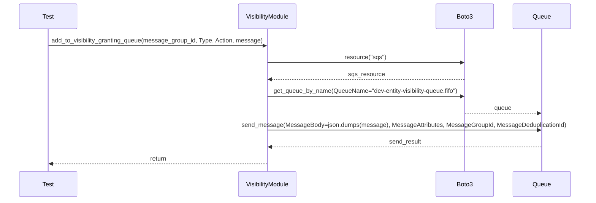
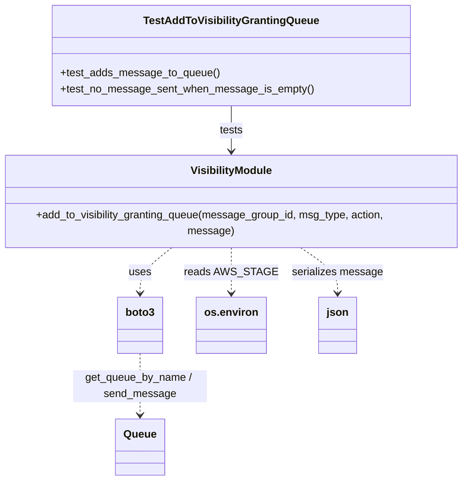

# Diagram: entity_core/entity_service/entity_service_tests/visibility_grant_code_tests/test_add_to_visibility_granting_queue.py

> Auto-generated by Obscura crawlers

## Diagram 1

### SVG

<svg id="container" width="1633" xmlns="http://www.w3.org/2000/svg" height="555" viewBox="-50 -10 1633 555" role="graphics-document document" aria-roledescription="sequence"><g><rect x="1383" y="469" fill="#eaeaea" stroke="#666" width="150" height="65" name="Queue" rx="3" ry="3" class="actor actor-bottom"></rect><text x="1458" y="501.5" dominant-baseline="central" alignment-baseline="central" class="actor actor-box" style="text-anchor: middle; font-size: 16px; font-weight: 400;"><tspan x="1458" dy="0">Queue</tspan></text></g><g><rect x="1183" y="469" fill="#eaeaea" stroke="#666" width="150" height="65" name="Boto3" rx="3" ry="3" class="actor actor-bottom"></rect><text x="1258" y="501.5" dominant-baseline="central" alignment-baseline="central" class="actor actor-box" style="text-anchor: middle; font-size: 16px; font-weight: 400;"><tspan x="1258" dy="0">Boto3</tspan></text></g><g><rect x="622" y="469" fill="#eaeaea" stroke="#666" width="150" height="65" name="VisibilityModule" rx="3" ry="3" class="actor actor-bottom"></rect><text x="697" y="501.5" dominant-baseline="central" alignment-baseline="central" class="actor actor-box" style="text-anchor: middle; font-size: 16px; font-weight: 400;"><tspan x="697" dy="0">VisibilityModule</tspan></text></g><g><rect x="0" y="469" fill="#eaeaea" stroke="#666" width="150" height="65" name="Test" rx="3" ry="3" class="actor actor-bottom"></rect><text x="75" y="501.5" dominant-baseline="central" alignment-baseline="central" class="actor actor-box" style="text-anchor: middle; font-size: 16px; font-weight: 400;"><tspan x="75" dy="0">Test</tspan></text></g><g><line id="actor3" x1="1458" y1="65" x2="1458" y2="469" class="actor-line 200" stroke-width="0.5px" stroke="#999" name="Queue"></line><g id="root-3"><rect x="1383" y="0" fill="#eaeaea" stroke="#666" width="150" height="65" name="Queue" rx="3" ry="3" class="actor actor-top"></rect><text x="1458" y="32.5" dominant-baseline="central" alignment-baseline="central" class="actor actor-box" style="text-anchor: middle; font-size: 16px; font-weight: 400;"><tspan x="1458" dy="0">Queue</tspan></text></g></g><g><line id="actor2" x1="1258" y1="65" x2="1258" y2="469" class="actor-line 200" stroke-width="0.5px" stroke="#999" name="Boto3"></line><g id="root-2"><rect x="1183" y="0" fill="#eaeaea" stroke="#666" width="150" height="65" name="Boto3" rx="3" ry="3" class="actor actor-top"></rect><text x="1258" y="32.5" dominant-baseline="central" alignment-baseline="central" class="actor actor-box" style="text-anchor: middle; font-size: 16px; font-weight: 400;"><tspan x="1258" dy="0">Boto3</tspan></text></g></g><g><line id="actor1" x1="697" y1="65" x2="697" y2="469" class="actor-line 200" stroke-width="0.5px" stroke="#999" name="VisibilityModule"></line><g id="root-1"><rect x="622" y="0" fill="#eaeaea" stroke="#666" width="150" height="65" name="VisibilityModule" rx="3" ry="3" class="actor actor-top"></rect><text x="697" y="32.5" dominant-baseline="central" alignment-baseline="central" class="actor actor-box" style="text-anchor: middle; font-size: 16px; font-weight: 400;"><tspan x="697" dy="0">VisibilityModule</tspan></text></g></g><g><line id="actor0" x1="75" y1="65" x2="75" y2="469" class="actor-line 200" stroke-width="0.5px" stroke="#999" name="Test"></line><g id="root-0"><rect x="0" y="0" fill="#eaeaea" stroke="#666" width="150" height="65" name="Test" rx="3" ry="3" class="actor actor-top"></rect><text x="75" y="32.5" dominant-baseline="central" alignment-baseline="central" class="actor actor-box" style="text-anchor: middle; font-size: 16px; font-weight: 400;"><tspan x="75" dy="0">Test</tspan></text></g></g><g></g><defs><symbol id="computer" width="24" height="24"><path transform="scale(.5)" d="M2 2v13h20v-13h-20zm18 11h-16v-9h16v9zm-10.228 6l.466-1h3.524l.467 1h-4.457zm14.228 3h-24l2-6h2.104l-1.33 4h18.45l-1.297-4h2.073l2 6zm-5-10h-14v-7h14v7z"></path></symbol></defs><defs><symbol id="database" fill-rule="evenodd" clip-rule="evenodd"><path transform="scale(.5)" d="M12.258.001l.256.004.255.005.253.008.251.01.249.012.247.015.246.016.242.019.241.02.239.023.236.024.233.027.231.028.229.031.225.032.223.034.22.036.217.038.214.04.211.041.208.043.205.045.201.046.198.048.194.05.191.051.187.053.183.054.18.056.175.057.172.059.168.06.163.061.16.063.155.064.15.066.074.033.073.033.071.034.07.034.069.035.068.035.067.035.066.035.064.036.064.036.062.036.06.036.06.037.058.037.058.037.055.038.055.038.053.038.052.038.051.039.05.039.048.039.047.039.045.04.044.04.043.04.041.04.04.041.039.041.037.041.036.041.034.041.033.042.032.042.03.042.029.042.027.042.026.043.024.043.023.043.021.043.02.043.018.044.017.043.015.044.013.044.012.044.011.045.009.044.007.045.006.045.004.045.002.045.001.045v17l-.001.045-.002.045-.004.045-.006.045-.007.045-.009.044-.011.045-.012.044-.013.044-.015.044-.017.043-.018.044-.02.043-.021.043-.023.043-.024.043-.026.043-.027.042-.029.042-.03.042-.032.042-.033.042-.034.041-.036.041-.037.041-.039.041-.04.041-.041.04-.043.04-.044.04-.045.04-.047.039-.048.039-.05.039-.051.039-.052.038-.053.038-.055.038-.055.038-.058.037-.058.037-.06.037-.06.036-.062.036-.064.036-.064.036-.066.035-.067.035-.068.035-.069.035-.07.034-.071.034-.073.033-.074.033-.15.066-.155.064-.16.063-.163.061-.168.06-.172.059-.175.057-.18.056-.183.054-.187.053-.191.051-.194.05-.198.048-.201.046-.205.045-.208.043-.211.041-.214.04-.217.038-.22.036-.223.034-.225.032-.229.031-.231.028-.233.027-.236.024-.239.023-.241.02-.242.019-.246.016-.247.015-.249.012-.251.01-.253.008-.255.005-.256.004-.258.001-.258-.001-.256-.004-.255-.005-.253-.008-.251-.01-.249-.012-.247-.015-.245-.016-.243-.019-.241-.02-.238-.023-.236-.024-.234-.027-.231-.028-.228-.031-.226-.032-.223-.034-.22-.036-.217-.038-.214-.04-.211-.041-.208-.043-.204-.045-.201-.046-.198-.048-.195-.05-.19-.051-.187-.053-.184-.054-.179-.056-.176-.057-.172-.059-.167-.06-.164-.061-.159-.063-.155-.064-.151-.066-.074-.033-.072-.033-.072-.034-.07-.034-.069-.035-.068-.035-.067-.035-.066-.035-.064-.036-.063-.036-.062-.036-.061-.036-.06-.037-.058-.037-.057-.037-.056-.038-.055-.038-.053-.038-.052-.038-.051-.039-.049-.039-.049-.039-.046-.039-.046-.04-.044-.04-.043-.04-.041-.04-.04-.041-.039-.041-.037-.041-.036-.041-.034-.041-.033-.042-.032-.042-.03-.042-.029-.042-.027-.042-.026-.043-.024-.043-.023-.043-.021-.043-.02-.043-.018-.044-.017-.043-.015-.044-.013-.044-.012-.044-.011-.045-.009-.044-.007-.045-.006-.045-.004-.045-.002-.045-.001-.045v-17l.001-.045.002-.045.004-.045.006-.045.007-.045.009-.044.011-.045.012-.044.013-.044.015-.044.017-.043.018-.044.02-.043.021-.043.023-.043.024-.043.026-.043.027-.042.029-.042.03-.042.032-.042.033-.042.034-.041.036-.041.037-.041.039-.041.04-.041.041-.04.043-.04.044-.04.046-.04.046-.039.049-.039.049-.039.051-.039.052-.038.053-.038.055-.038.056-.038.057-.037.058-.037.06-.037.061-.036.062-.036.063-.036.064-.036.066-.035.067-.035.068-.035.069-.035.07-.034.072-.034.072-.033.074-.033.151-.066.155-.064.159-.063.164-.061.167-.06.172-.059.176-.057.179-.056.184-.054.187-.053.19-.051.195-.05.198-.048.201-.046.204-.045.208-.043.211-.041.214-.04.217-.038.22-.036.223-.034.226-.032.228-.031.231-.028.234-.027.236-.024.238-.023.241-.02.243-.019.245-.016.247-.015.249-.012.251-.01.253-.008.255-.005.256-.004.258-.001.258.001zm-9.258 20.499v.01l.001.021.003.021.004.022.005.021.006.022.007.022.009.023.01.022.011.023.012.023.013.023.015.023.016.024.017.023.018.024.019.024.021.024.022.025.023.024.024.025.052.049.056.05.061.051.066.051.07.051.075.051.079.052.084.052.088.052.092.052.097.052.102.051.105.052.11.052.114.051.119.051.123.051.127.05.131.05.135.05.139.048.144.049.147.047.152.047.155.047.16.045.163.045.167.043.171.043.176.041.178.041.183.039.187.039.19.037.194.035.197.035.202.033.204.031.209.03.212.029.216.027.219.025.222.024.226.021.23.02.233.018.236.016.24.015.243.012.246.01.249.008.253.005.256.004.259.001.26-.001.257-.004.254-.005.25-.008.247-.011.244-.012.241-.014.237-.016.233-.018.231-.021.226-.021.224-.024.22-.026.216-.027.212-.028.21-.031.205-.031.202-.034.198-.034.194-.036.191-.037.187-.039.183-.04.179-.04.175-.042.172-.043.168-.044.163-.045.16-.046.155-.046.152-.047.148-.048.143-.049.139-.049.136-.05.131-.05.126-.05.123-.051.118-.052.114-.051.11-.052.106-.052.101-.052.096-.052.092-.052.088-.053.083-.051.079-.052.074-.052.07-.051.065-.051.06-.051.056-.05.051-.05.023-.024.023-.025.021-.024.02-.024.019-.024.018-.024.017-.024.015-.023.014-.024.013-.023.012-.023.01-.023.01-.022.008-.022.006-.022.006-.022.004-.022.004-.021.001-.021.001-.021v-4.127l-.077.055-.08.053-.083.054-.085.053-.087.052-.09.052-.093.051-.095.05-.097.05-.1.049-.102.049-.105.048-.106.047-.109.047-.111.046-.114.045-.115.045-.118.044-.12.043-.122.042-.124.042-.126.041-.128.04-.13.04-.132.038-.134.038-.135.037-.138.037-.139.035-.142.035-.143.034-.144.033-.147.032-.148.031-.15.03-.151.03-.153.029-.154.027-.156.027-.158.026-.159.025-.161.024-.162.023-.163.022-.165.021-.166.02-.167.019-.169.018-.169.017-.171.016-.173.015-.173.014-.175.013-.175.012-.177.011-.178.01-.179.008-.179.008-.181.006-.182.005-.182.004-.184.003-.184.002h-.37l-.184-.002-.184-.003-.182-.004-.182-.005-.181-.006-.179-.008-.179-.008-.178-.01-.176-.011-.176-.012-.175-.013-.173-.014-.172-.015-.171-.016-.17-.017-.169-.018-.167-.019-.166-.02-.165-.021-.163-.022-.162-.023-.161-.024-.159-.025-.157-.026-.156-.027-.155-.027-.153-.029-.151-.03-.15-.03-.148-.031-.146-.032-.145-.033-.143-.034-.141-.035-.14-.035-.137-.037-.136-.037-.134-.038-.132-.038-.13-.04-.128-.04-.126-.041-.124-.042-.122-.042-.12-.044-.117-.043-.116-.045-.113-.045-.112-.046-.109-.047-.106-.047-.105-.048-.102-.049-.1-.049-.097-.05-.095-.05-.093-.052-.09-.051-.087-.052-.085-.053-.083-.054-.08-.054-.077-.054v4.127zm0-5.654v.011l.001.021.003.021.004.021.005.022.006.022.007.022.009.022.01.022.011.023.012.023.013.023.015.024.016.023.017.024.018.024.019.024.021.024.022.024.023.025.024.024.052.05.056.05.061.05.066.051.07.051.075.052.079.051.084.052.088.052.092.052.097.052.102.052.105.052.11.051.114.051.119.052.123.05.127.051.131.05.135.049.139.049.144.048.147.048.152.047.155.046.16.045.163.045.167.044.171.042.176.042.178.04.183.04.187.038.19.037.194.036.197.034.202.033.204.032.209.03.212.028.216.027.219.025.222.024.226.022.23.02.233.018.236.016.24.014.243.012.246.01.249.008.253.006.256.003.259.001.26-.001.257-.003.254-.006.25-.008.247-.01.244-.012.241-.015.237-.016.233-.018.231-.02.226-.022.224-.024.22-.025.216-.027.212-.029.21-.03.205-.032.202-.033.198-.035.194-.036.191-.037.187-.039.183-.039.179-.041.175-.042.172-.043.168-.044.163-.045.16-.045.155-.047.152-.047.148-.048.143-.048.139-.05.136-.049.131-.05.126-.051.123-.051.118-.051.114-.052.11-.052.106-.052.101-.052.096-.052.092-.052.088-.052.083-.052.079-.052.074-.051.07-.052.065-.051.06-.05.056-.051.051-.049.023-.025.023-.024.021-.025.02-.024.019-.024.018-.024.017-.024.015-.023.014-.023.013-.024.012-.022.01-.023.01-.023.008-.022.006-.022.006-.022.004-.021.004-.022.001-.021.001-.021v-4.139l-.077.054-.08.054-.083.054-.085.052-.087.053-.09.051-.093.051-.095.051-.097.05-.1.049-.102.049-.105.048-.106.047-.109.047-.111.046-.114.045-.115.044-.118.044-.12.044-.122.042-.124.042-.126.041-.128.04-.13.039-.132.039-.134.038-.135.037-.138.036-.139.036-.142.035-.143.033-.144.033-.147.033-.148.031-.15.03-.151.03-.153.028-.154.028-.156.027-.158.026-.159.025-.161.024-.162.023-.163.022-.165.021-.166.02-.167.019-.169.018-.169.017-.171.016-.173.015-.173.014-.175.013-.175.012-.177.011-.178.009-.179.009-.179.007-.181.007-.182.005-.182.004-.184.003-.184.002h-.37l-.184-.002-.184-.003-.182-.004-.182-.005-.181-.007-.179-.007-.179-.009-.178-.009-.176-.011-.176-.012-.175-.013-.173-.014-.172-.015-.171-.016-.17-.017-.169-.018-.167-.019-.166-.02-.165-.021-.163-.022-.162-.023-.161-.024-.159-.025-.157-.026-.156-.027-.155-.028-.153-.028-.151-.03-.15-.03-.148-.031-.146-.033-.145-.033-.143-.033-.141-.035-.14-.036-.137-.036-.136-.037-.134-.038-.132-.039-.13-.039-.128-.04-.126-.041-.124-.042-.122-.043-.12-.043-.117-.044-.116-.044-.113-.046-.112-.046-.109-.046-.106-.047-.105-.048-.102-.049-.1-.049-.097-.05-.095-.051-.093-.051-.09-.051-.087-.053-.085-.052-.083-.054-.08-.054-.077-.054v4.139zm0-5.666v.011l.001.02.003.022.004.021.005.022.006.021.007.022.009.023.01.022.011.023.012.023.013.023.015.023.016.024.017.024.018.023.019.024.021.025.022.024.023.024.024.025.052.05.056.05.061.05.066.051.07.051.075.052.079.051.084.052.088.052.092.052.097.052.102.052.105.051.11.052.114.051.119.051.123.051.127.05.131.05.135.05.139.049.144.048.147.048.152.047.155.046.16.045.163.045.167.043.171.043.176.042.178.04.183.04.187.038.19.037.194.036.197.034.202.033.204.032.209.03.212.028.216.027.219.025.222.024.226.021.23.02.233.018.236.017.24.014.243.012.246.01.249.008.253.006.256.003.259.001.26-.001.257-.003.254-.006.25-.008.247-.01.244-.013.241-.014.237-.016.233-.018.231-.02.226-.022.224-.024.22-.025.216-.027.212-.029.21-.03.205-.032.202-.033.198-.035.194-.036.191-.037.187-.039.183-.039.179-.041.175-.042.172-.043.168-.044.163-.045.16-.045.155-.047.152-.047.148-.048.143-.049.139-.049.136-.049.131-.051.126-.05.123-.051.118-.052.114-.051.11-.052.106-.052.101-.052.096-.052.092-.052.088-.052.083-.052.079-.052.074-.052.07-.051.065-.051.06-.051.056-.05.051-.049.023-.025.023-.025.021-.024.02-.024.019-.024.018-.024.017-.024.015-.023.014-.024.013-.023.012-.023.01-.022.01-.023.008-.022.006-.022.006-.022.004-.022.004-.021.001-.021.001-.021v-4.153l-.077.054-.08.054-.083.053-.085.053-.087.053-.09.051-.093.051-.095.051-.097.05-.1.049-.102.048-.105.048-.106.048-.109.046-.111.046-.114.046-.115.044-.118.044-.12.043-.122.043-.124.042-.126.041-.128.04-.13.039-.132.039-.134.038-.135.037-.138.036-.139.036-.142.034-.143.034-.144.033-.147.032-.148.032-.15.03-.151.03-.153.028-.154.028-.156.027-.158.026-.159.024-.161.024-.162.023-.163.023-.165.021-.166.02-.167.019-.169.018-.169.017-.171.016-.173.015-.173.014-.175.013-.175.012-.177.01-.178.01-.179.009-.179.007-.181.006-.182.006-.182.004-.184.003-.184.001-.185.001-.185-.001-.184-.001-.184-.003-.182-.004-.182-.006-.181-.006-.179-.007-.179-.009-.178-.01-.176-.01-.176-.012-.175-.013-.173-.014-.172-.015-.171-.016-.17-.017-.169-.018-.167-.019-.166-.02-.165-.021-.163-.023-.162-.023-.161-.024-.159-.024-.157-.026-.156-.027-.155-.028-.153-.028-.151-.03-.15-.03-.148-.032-.146-.032-.145-.033-.143-.034-.141-.034-.14-.036-.137-.036-.136-.037-.134-.038-.132-.039-.13-.039-.128-.041-.126-.041-.124-.041-.122-.043-.12-.043-.117-.044-.116-.044-.113-.046-.112-.046-.109-.046-.106-.048-.105-.048-.102-.048-.1-.05-.097-.049-.095-.051-.093-.051-.09-.052-.087-.052-.085-.053-.083-.053-.08-.054-.077-.054v4.153zm8.74-8.179l-.257.004-.254.005-.25.008-.247.011-.244.012-.241.014-.237.016-.233.018-.231.021-.226.022-.224.023-.22.026-.216.027-.212.028-.21.031-.205.032-.202.033-.198.034-.194.036-.191.038-.187.038-.183.04-.179.041-.175.042-.172.043-.168.043-.163.045-.16.046-.155.046-.152.048-.148.048-.143.048-.139.049-.136.05-.131.05-.126.051-.123.051-.118.051-.114.052-.11.052-.106.052-.101.052-.096.052-.092.052-.088.052-.083.052-.079.052-.074.051-.07.052-.065.051-.06.05-.056.05-.051.05-.023.025-.023.024-.021.024-.02.025-.019.024-.018.024-.017.023-.015.024-.014.023-.013.023-.012.023-.01.023-.01.022-.008.022-.006.023-.006.021-.004.022-.004.021-.001.021-.001.021.001.021.001.021.004.021.004.022.006.021.006.023.008.022.01.022.01.023.012.023.013.023.014.023.015.024.017.023.018.024.019.024.02.025.021.024.023.024.023.025.051.05.056.05.06.05.065.051.07.052.074.051.079.052.083.052.088.052.092.052.096.052.101.052.106.052.11.052.114.052.118.051.123.051.126.051.131.05.136.05.139.049.143.048.148.048.152.048.155.046.16.046.163.045.168.043.172.043.175.042.179.041.183.04.187.038.191.038.194.036.198.034.202.033.205.032.21.031.212.028.216.027.22.026.224.023.226.022.231.021.233.018.237.016.241.014.244.012.247.011.25.008.254.005.257.004.26.001.26-.001.257-.004.254-.005.25-.008.247-.011.244-.012.241-.014.237-.016.233-.018.231-.021.226-.022.224-.023.22-.026.216-.027.212-.028.21-.031.205-.032.202-.033.198-.034.194-.036.191-.038.187-.038.183-.04.179-.041.175-.042.172-.043.168-.043.163-.045.16-.046.155-.046.152-.048.148-.048.143-.048.139-.049.136-.05.131-.05.126-.051.123-.051.118-.051.114-.052.11-.052.106-.052.101-.052.096-.052.092-.052.088-.052.083-.052.079-.052.074-.051.07-.052.065-.051.06-.05.056-.05.051-.05.023-.025.023-.024.021-.024.02-.025.019-.024.018-.024.017-.023.015-.024.014-.023.013-.023.012-.023.01-.023.01-.022.008-.022.006-.023.006-.021.004-.022.004-.021.001-.021.001-.021-.001-.021-.001-.021-.004-.021-.004-.022-.006-.021-.006-.023-.008-.022-.01-.022-.01-.023-.012-.023-.013-.023-.014-.023-.015-.024-.017-.023-.018-.024-.019-.024-.02-.025-.021-.024-.023-.024-.023-.025-.051-.05-.056-.05-.06-.05-.065-.051-.07-.052-.074-.051-.079-.052-.083-.052-.088-.052-.092-.052-.096-.052-.101-.052-.106-.052-.11-.052-.114-.052-.118-.051-.123-.051-.126-.051-.131-.05-.136-.05-.139-.049-.143-.048-.148-.048-.152-.048-.155-.046-.16-.046-.163-.045-.168-.043-.172-.043-.175-.042-.179-.041-.183-.04-.187-.038-.191-.038-.194-.036-.198-.034-.202-.033-.205-.032-.21-.031-.212-.028-.216-.027-.22-.026-.224-.023-.226-.022-.231-.021-.233-.018-.237-.016-.241-.014-.244-.012-.247-.011-.25-.008-.254-.005-.257-.004-.26-.001-.26.001z"></path></symbol></defs><defs><symbol id="clock" width="24" height="24"><path transform="scale(.5)" d="M12 2c5.514 0 10 4.486 10 10s-4.486 10-10 10-10-4.486-10-10 4.486-10 10-10zm0-2c-6.627 0-12 5.373-12 12s5.373 12 12 12 12-5.373 12-12-5.373-12-12-12zm5.848 12.459c.202.038.202.333.001.372-1.907.361-6.045 1.111-6.547 1.111-.719 0-1.301-.582-1.301-1.301 0-.512.77-5.447 1.125-7.445.034-.192.312-.181.343.014l.985 6.238 5.394 1.011z"></path></symbol></defs><defs><marker id="arrowhead" refX="7.9" refY="5" markerUnits="userSpaceOnUse" markerWidth="12" markerHeight="12" orient="auto-start-reverse"><path d="M -1 0 L 10 5 L 0 10 z"></path></marker></defs><defs><marker id="crosshead" markerWidth="15" markerHeight="8" orient="auto" refX="4" refY="4.5"><path fill="none" stroke="#000000" stroke-width="1pt" d="M 1,2 L 6,7 M 6,2 L 1,7" style="stroke-dasharray: 0, 0;"></path></marker></defs><defs><marker id="filled-head" refX="15.5" refY="7" markerWidth="20" markerHeight="28" orient="auto"><path d="M 18,7 L9,13 L14,7 L9,1 Z"></path></marker></defs><defs><marker id="sequencenumber" refX="15" refY="15" markerWidth="60" markerHeight="40" orient="auto"><circle cx="15" cy="15" r="6"></circle></marker></defs><text x="385" y="80" text-anchor="middle" dominant-baseline="middle" alignment-baseline="middle" class="messageText" dy="1em" style="font-size: 16px; font-weight: 400;">add_to_visibility_granting_queue(message_group_id, Type, Action, message)</text><line x1="76" y1="113" x2="693" y2="113" class="messageLine0" stroke-width="2" stroke="none" marker-end="url(#arrowhead)" style="fill: none;"></line><text x="976" y="128" text-anchor="middle" dominant-baseline="middle" alignment-baseline="middle" class="messageText" dy="1em" style="font-size: 16px; font-weight: 400;">resource("sqs")</text><line x1="698" y1="161" x2="1254" y2="161" class="messageLine0" stroke-width="2" stroke="none" marker-end="url(#arrowhead)" style="fill: none;"></line><text x="979" y="176" text-anchor="middle" dominant-baseline="middle" alignment-baseline="middle" class="messageText" dy="1em" style="font-size: 16px; font-weight: 400;">sqs_resource</text><line x1="1257" y1="209" x2="701" y2="209" class="messageLine1" stroke-width="2" stroke="none" marker-end="url(#arrowhead)" style="stroke-dasharray: 3, 3; fill: none;"></line><text x="976" y="224" text-anchor="middle" dominant-baseline="middle" alignment-baseline="middle" class="messageText" dy="1em" style="font-size: 16px; font-weight: 400;">get_queue_by_name(QueueName="dev-entity-visibility-queue.fifo")</text><line x1="698" y1="257" x2="1254" y2="257" class="messageLine0" stroke-width="2" stroke="none" marker-end="url(#arrowhead)" style="fill: none;"></line><text x="1357" y="272" text-anchor="middle" dominant-baseline="middle" alignment-baseline="middle" class="messageText" dy="1em" style="font-size: 16px; font-weight: 400;">queue</text><line x1="1259" y1="305" x2="1454" y2="305" class="messageLine1" stroke-width="2" stroke="none" marker-end="url(#arrowhead)" style="stroke-dasharray: 3, 3; fill: none;"></line><text x="1076" y="320" text-anchor="middle" dominant-baseline="middle" alignment-baseline="middle" class="messageText" dy="1em" style="font-size: 16px; font-weight: 400;">send_message(MessageBody=json.dumps(message), MessageAttributes, MessageGroupId, MessageDeduplicationId)</text><line x1="698" y1="353" x2="1454" y2="353" class="messageLine0" stroke-width="2" stroke="none" marker-end="url(#arrowhead)" style="fill: none;"></line><text x="1079" y="368" text-anchor="middle" dominant-baseline="middle" alignment-baseline="middle" class="messageText" dy="1em" style="font-size: 16px; font-weight: 400;">send_result</text><line x1="1457" y1="401" x2="701" y2="401" class="messageLine1" stroke-width="2" stroke="none" marker-end="url(#arrowhead)" style="stroke-dasharray: 3, 3; fill: none;"></line><text x="388" y="416" text-anchor="middle" dominant-baseline="middle" alignment-baseline="middle" class="messageText" dy="1em" style="font-size: 16px; font-weight: 400;">return</text><line x1="696" y1="449" x2="79" y2="449" class="messageLine1" stroke-width="2" stroke="none" marker-end="url(#arrowhead)" style="stroke-dasharray: 3, 3; fill: none;"></line></svg>

## Diagram 2

### SVG

<svg id="container" width="694.0390625" xmlns="http://www.w3.org/2000/svg" class="classDiagram" height="706" viewBox="0 0 694.0390625 706" role="graphics-document document" aria-roledescription="class"><g><defs><marker id="container_class-aggregationStart" class="marker aggregation class" refX="18" refY="7" markerWidth="190" markerHeight="240" orient="auto"><path d="M 18,7 L9,13 L1,7 L9,1 Z"></path></marker></defs><defs><marker id="container_class-aggregationEnd" class="marker aggregation class" refX="1" refY="7" markerWidth="20" markerHeight="28" orient="auto"><path d="M 18,7 L9,13 L1,7 L9,1 Z"></path></marker></defs><defs><marker id="container_class-extensionStart" class="marker extension class" refX="18" refY="7" markerWidth="190" markerHeight="240" orient="auto"><path d="M 1,7 L18,13 V 1 Z"></path></marker></defs><defs><marker id="container_class-extensionEnd" class="marker extension class" refX="1" refY="7" markerWidth="20" markerHeight="28" orient="auto"><path d="M 1,1 V 13 L18,7 Z"></path></marker></defs><defs><marker id="container_class-compositionStart" class="marker composition class" refX="18" refY="7" markerWidth="190" markerHeight="240" orient="auto"><path d="M 18,7 L9,13 L1,7 L9,1 Z"></path></marker></defs><defs><marker id="container_class-compositionEnd" class="marker composition class" refX="1" refY="7" markerWidth="20" markerHeight="28" orient="auto"><path d="M 18,7 L9,13 L1,7 L9,1 Z"></path></marker></defs><defs><marker id="container_class-dependencyStart" class="marker dependency class" refX="6" refY="7" markerWidth="190" markerHeight="240" orient="auto"><path d="M 5,7 L9,13 L1,7 L9,1 Z"></path></marker></defs><defs><marker id="container_class-dependencyEnd" class="marker dependency class" refX="13" refY="7" markerWidth="20" markerHeight="28" orient="auto"><path d="M 18,7 L9,13 L14,7 L9,1 Z"></path></marker></defs><defs><marker id="container_class-lollipopStart" class="marker lollipop class" refX="13" refY="7" markerWidth="190" markerHeight="240" orient="auto"><circle stroke="black" fill="transparent" cx="7" cy="7" r="6"></circle></marker></defs><defs><marker id="container_class-lollipopEnd" class="marker lollipop class" refX="1" refY="7" markerWidth="190" markerHeight="240" orient="auto"><circle stroke="black" fill="transparent" cx="7" cy="7" r="6"></circle></marker></defs><g class="root"><g class="clusters"></g><g class="edgePaths"><path d="M347.02,158L347.02,164.167C347.02,170.333,347.02,182.667,347.02,194C347.02,205.333,347.02,215.667,347.02,220.833L347.02,226" id="id_TestAddToVisibilityGrantingQueue_VisibilityModule_1" class="edge-thickness-normal edge-pattern-solid relation" style=";;;" data-edge="true" data-et="edge" data-id="id_TestAddToVisibilityGrantingQueue_VisibilityModule_1" data-points="W3sieCI6MzQ3LjAxOTUzMTI1LCJ5IjoxNTh9LHsieCI6MzQ3LjAxOTUzMTI1LCJ5IjoxOTV9LHsieCI6MzQ3LjAxOTUzMTI1LCJ5IjoyMzJ9XQ==" marker-end="url(#container_class-dependencyEnd)"></path><path d="M263.2,358L254.995,364.167C246.791,370.333,230.382,382.667,222.177,394C213.973,405.333,213.973,415.667,213.973,420.833L213.973,426" id="id_VisibilityModule_boto3_2" class="edge-thickness-normal edge-pattern-dashed relation" style=";;;" data-edge="true" data-et="edge" data-id="id_VisibilityModule_boto3_2" data-points="W3sieCI6MjYzLjIsInkiOjM1OH0seyJ4IjoyMTMuOTcyNjU2MjUsInkiOjM5NX0seyJ4IjoyMTMuOTcyNjU2MjUsInkiOjQzMn1d" marker-end="url(#container_class-dependencyEnd)"></path><path d="M347.02,358L347.02,364.167C347.02,370.333,347.02,382.667,347.02,394C347.02,405.333,347.02,415.667,347.02,420.833L347.02,426" id="id_VisibilityModule_os.environ_3" class="edge-thickness-normal edge-pattern-dashed relation" style=";;;" data-edge="true" data-et="edge" data-id="id_VisibilityModule_os.environ_3" data-points="W3sieCI6MzQ3LjAxOTUzMTI1LCJ5IjozNTh9LHsieCI6MzQ3LjAxOTUzMTI1LCJ5IjozOTV9LHsieCI6MzQ3LjAxOTUzMTI1LCJ5Ijo0MzJ9XQ==" marker-end="url(#container_class-dependencyEnd)"></path><path d="M441.692,358L450.959,364.167C460.226,370.333,478.759,382.667,488.026,394C497.293,405.333,497.293,415.667,497.293,420.833L497.293,426" id="id_VisibilityModule_json_4" class="edge-thickness-normal edge-pattern-dashed relation" style=";;;" data-edge="true" data-et="edge" data-id="id_VisibilityModule_json_4" data-points="W3sieCI6NDQxLjY5MTc5Njg3NSwieSI6MzU4fSx7IngiOjQ5Ny4yOTI5Njg3NSwieSI6Mzk1fSx7IngiOjQ5Ny4yOTI5Njg3NSwieSI6NDMyfV0=" marker-end="url(#container_class-dependencyEnd)"></path><path d="M213.973,516L213.973,524.167C213.973,532.333,213.973,548.667,213.973,564C213.973,579.333,213.973,593.667,213.973,600.833L213.973,608" id="id_boto3_Queue_5" class="edge-thickness-normal edge-pattern-dashed relation" style=";;;" data-edge="true" data-et="edge" data-id="id_boto3_Queue_5" data-points="W3sieCI6MjEzLjk3MjY1NjI1LCJ5Ijo1MTZ9LHsieCI6MjEzLjk3MjY1NjI1LCJ5Ijo1NjV9LHsieCI6MjEzLjk3MjY1NjI1LCJ5Ijo2MTR9XQ==" marker-end="url(#container_class-dependencyEnd)"></path></g><g class="edgeLabels"><g class="edgeLabel" transform="translate(347.01953125, 195)"><g class="label" data-id="id_TestAddToVisibilityGrantingQueue_VisibilityModule_1" transform="translate(-17.4921875, -12)"><foreignObject width="34.984375" height="24">

tests

</foreignObject></g></g><g class="edgeLabel" transform="translate(213.97265625, 395)"><g class="label" data-id="id_VisibilityModule_boto3_2" transform="translate(-16.4921875, -12)"><foreignObject width="32.984375" height="24">

uses

</foreignObject></g></g><g class="edgeLabel" transform="translate(347.01953125, 395)"><g class="label" data-id="id_VisibilityModule_os.environ_3" transform="translate(-63.109375, -12)"><foreignObject width="126.21875" height="24">

reads AWS_STAGE

</foreignObject></g></g><g class="edgeLabel" transform="translate(497.29296875, 395)"><g class="label" data-id="id_VisibilityModule_json_4" transform="translate(-67.1640625, -12)"><foreignObject width="134.328125" height="24">

serializes message

</foreignObject></g></g><g class="edgeLabel" transform="translate(213.97265625, 565)"><g class="label" data-id="id_boto3_Queue_5" transform="translate(-100, -24)"><foreignObject width="200" height="48">

get_queue_by_name / send_message

</foreignObject></g></g></g><g class="nodes"><g class="node default" id="classId-TestAddToVisibilityGrantingQueue-0" transform="translate(347.01953125, 83)"><g class="basic label-container"><path d="M-261.125 -75 L261.125 -75 L261.125 75 L-261.125 75" stroke="none" stroke-width="0" fill="#ECECFF" style=""></path><path d="M-261.125 -75 C-81.34608190261346 -75, 98.43283619477307 -75, 261.125 -75 M-261.125 -75 C-92.81457398275444 -75, 75.49585203449112 -75, 261.125 -75 M261.125 -75 C261.125 -33.339774039762396, 261.125 8.320451920475207, 261.125 75 M261.125 -75 C261.125 -37.57272940687674, 261.125 -0.14545881375347847, 261.125 75 M261.125 75 C111.63352629137557 75, -37.85794741724885 75, -261.125 75 M261.125 75 C142.93090905476512 75, 24.736818109530248 75, -261.125 75 M-261.125 75 C-261.125 35.64333976041766, -261.125 -3.713320479164679, -261.125 -75 M-261.125 75 C-261.125 16.275295985366228, -261.125 -42.449408029267545, -261.125 -75" stroke="#9370DB" stroke-width="1.3" fill="none" stroke-dasharray="0 0" style=""></path></g><g class="annotation-group text" transform="translate(0, -51)"></g><g class="label-group text" transform="translate(-124.875, -51)"><g class="label" style="font-weight: bolder" transform="translate(0,-12)"><foreignObject width="249.75" height="24">

TestAddToVisibilityGrantingQueue

</foreignObject></g></g><g class="members-group text" transform="translate(-249.125, -3)"></g><g class="methods-group text" transform="translate(-249.125, 27)"><g class="label" style="" transform="translate(0,-12)"><foreignObject width="235.359375" height="24">

+test_adds_message_to_queue()

</foreignObject></g><g class="label" style="" transform="translate(0,12)"><foreignObject width="373.375" height="24">

+test_no_message_sent_when_message_is_empty()

</foreignObject></g></g><g class="divider" style=""><path d="M-261.125 -27 C-52.881212970918824 -27, 155.36257405816235 -27, 261.125 -27 M-261.125 -27 C-156.53911824862374 -27, -51.953236497247474 -27, 261.125 -27" stroke="#9370DB" stroke-width="1.3" fill="none" stroke-dasharray="0 0" style=""></path></g><g class="divider" style=""><path d="M-261.125 -3 C-145.6537212093645 -3, -30.18244241872901 -3, 261.125 -3 M-261.125 -3 C-84.11462613367243 -3, 92.89574773265514 -3, 261.125 -3" stroke="#9370DB" stroke-width="1.3" fill="none" stroke-dasharray="0 0" style=""></path></g></g><g class="node default" id="classId-VisibilityModule-1" transform="translate(347.01953125, 295)"><g class="basic label-container"><path d="M-339.01953125 -63 L339.01953125 -63 L339.01953125 63 L-339.01953125 63" stroke="none" stroke-width="0" fill="#ECECFF" style=""></path><path d="M-339.01953125 -63 C-192.90869866298334 -63, -46.79786607596668 -63, 339.01953125 -63 M-339.01953125 -63 C-124.37544643438389 -63, 90.26863838123222 -63, 339.01953125 -63 M339.01953125 -63 C339.01953125 -30.811866006314723, 339.01953125 1.3762679873705537, 339.01953125 63 M339.01953125 -63 C339.01953125 -34.23076621902052, 339.01953125 -5.461532438041047, 339.01953125 63 M339.01953125 63 C105.36280047004695 63, -128.2939303099061 63, -339.01953125 63 M339.01953125 63 C168.36148473018412 63, -2.2965617896317667 63, -339.01953125 63 M-339.01953125 63 C-339.01953125 22.753142518756277, -339.01953125 -17.493714962487445, -339.01953125 -63 M-339.01953125 63 C-339.01953125 35.25727885872824, -339.01953125 7.514557717456491, -339.01953125 -63" stroke="#9370DB" stroke-width="1.3" fill="none" stroke-dasharray="0 0" style=""></path></g><g class="annotation-group text" transform="translate(0, -39)"></g><g class="label-group text" transform="translate(-58.8828125, -39)"><g class="label" style="font-weight: bolder" transform="translate(0,-12)"><foreignObject width="117.765625" height="24">

VisibilityModule

</foreignObject></g></g><g class="members-group text" transform="translate(-327.01953125, 9)"></g><g class="methods-group text" transform="translate(-327.01953125, 39)"><g class="label" style="" transform="translate(0,-12)"><foreignObject width="595.15625" height="24">

+add_to_visibility_granting_queue(message_group_id, msg_type, action, message)

</foreignObject></g></g><g class="divider" style=""><path d="M-339.01953125 -15 C-152.4551508393133 -15, 34.10922957137342 -15, 339.01953125 -15 M-339.01953125 -15 C-167.4936600849206 -15, 4.032211080158788 -15, 339.01953125 -15" stroke="#9370DB" stroke-width="1.3" fill="none" stroke-dasharray="0 0" style=""></path></g><g class="divider" style=""><path d="M-339.01953125 9 C-121.56842905652255 9, 95.8826731369549 9, 339.01953125 9 M-339.01953125 9 C-135.0926557489191 9, 68.8342197521618 9, 339.01953125 9" stroke="#9370DB" stroke-width="1.3" fill="none" stroke-dasharray="0 0" style=""></path></g></g><g class="node default" id="classId-boto3-2" transform="translate(213.97265625, 474)"><g class="basic label-container"><path d="M-33.0703125 -42 L33.0703125 -42 L33.0703125 42 L-33.0703125 42" stroke="none" stroke-width="0" fill="#ECECFF" style=""></path><path d="M-33.0703125 -42 C-12.07447054015243 -42, 8.921371419695141 -42, 33.0703125 -42 M-33.0703125 -42 C-10.242017468282924 -42, 12.586277563434152 -42, 33.0703125 -42 M33.0703125 -42 C33.0703125 -18.602275760063456, 33.0703125 4.795448479873087, 33.0703125 42 M33.0703125 -42 C33.0703125 -14.31223660109887, 33.0703125 13.375526797802259, 33.0703125 42 M33.0703125 42 C12.574711370131556 42, -7.9208897597368875 42, -33.0703125 42 M33.0703125 42 C14.109466971320018 42, -4.851378557359965 42, -33.0703125 42 M-33.0703125 42 C-33.0703125 23.37487773877337, -33.0703125 4.749755477546742, -33.0703125 -42 M-33.0703125 42 C-33.0703125 21.47335669910653, -33.0703125 0.9467133982130633, -33.0703125 -42" stroke="#9370DB" stroke-width="1.3" fill="none" stroke-dasharray="0 0" style=""></path></g><g class="annotation-group text" transform="translate(0, -18)"></g><g class="label-group text" transform="translate(-21.0703125, -18)"><g class="label" style="font-weight: bolder" transform="translate(0,-12)"><foreignObject width="42.140625" height="24">

boto3

</foreignObject></g></g><g class="members-group text" transform="translate(-21.0703125, 30)"></g><g class="methods-group text" transform="translate(-21.0703125, 60)"></g><g class="divider" style=""><path d="M-33.0703125 6 C-8.727918460041924 6, 15.614475579916153 6, 33.0703125 6 M-33.0703125 6 C-14.438165217889857 6, 4.193982064220286 6, 33.0703125 6" stroke="#9370DB" stroke-width="1.3" fill="none" stroke-dasharray="0 0" style=""></path></g><g class="divider" style=""><path d="M-33.0703125 24 C-9.17981045898932 24, 14.710691582021362 24, 33.0703125 24 M-33.0703125 24 C-16.51621871298836 24, 0.03787507402328316 24, 33.0703125 24" stroke="#9370DB" stroke-width="1.3" fill="none" stroke-dasharray="0 0" style=""></path></g></g><g class="node default" id="classId-os.environ-3" transform="translate(347.01953125, 474)"><g class="basic label-container"><path d="M-49.9765625 -42 L49.9765625 -42 L49.9765625 42 L-49.9765625 42" stroke="none" stroke-width="0" fill="#ECECFF" style=""></path><path d="M-49.9765625 -42 C-27.10081242342834 -42, -4.2250623468566815 -42, 49.9765625 -42 M-49.9765625 -42 C-18.01112679052593 -42, 13.954308918948144 -42, 49.9765625 -42 M49.9765625 -42 C49.9765625 -21.678337797591634, 49.9765625 -1.356675595183269, 49.9765625 42 M49.9765625 -42 C49.9765625 -22.987093457193016, 49.9765625 -3.9741869143860313, 49.9765625 42 M49.9765625 42 C27.518698330391093 42, 5.060834160782186 42, -49.9765625 42 M49.9765625 42 C23.247150825449793 42, -3.4822608491004132 42, -49.9765625 42 M-49.9765625 42 C-49.9765625 12.302202633585225, -49.9765625 -17.39559473282955, -49.9765625 -42 M-49.9765625 42 C-49.9765625 16.959145576751176, -49.9765625 -8.081708846497648, -49.9765625 -42" stroke="#9370DB" stroke-width="1.3" fill="none" stroke-dasharray="0 0" style=""></path></g><g class="annotation-group text" transform="translate(0, -18)"></g><g class="label-group text" transform="translate(-37.9765625, -18)"><g class="label" style="font-weight: bolder" transform="translate(0,-12)"><foreignObject width="75.953125" height="24">

os.environ

</foreignObject></g></g><g class="members-group text" transform="translate(-37.9765625, 30)"></g><g class="methods-group text" transform="translate(-37.9765625, 60)"></g><g class="divider" style=""><path d="M-49.9765625 6 C-20.6914110002978 6, 8.593740499404397 6, 49.9765625 6 M-49.9765625 6 C-15.962769651466012 6, 18.051023197067977 6, 49.9765625 6" stroke="#9370DB" stroke-width="1.3" fill="none" stroke-dasharray="0 0" style=""></path></g><g class="divider" style=""><path d="M-49.9765625 24 C-19.636823881953216 24, 10.702914736093568 24, 49.9765625 24 M-49.9765625 24 C-24.61096170418151 24, 0.7546390916369816 24, 49.9765625 24" stroke="#9370DB" stroke-width="1.3" fill="none" stroke-dasharray="0 0" style=""></path></g></g><g class="node default" id="classId-json-4" transform="translate(497.29296875, 474)"><g class="basic label-container"><path d="M-27.40625 -42 L27.40625 -42 L27.40625 42 L-27.40625 42" stroke="none" stroke-width="0" fill="#ECECFF" style=""></path><path d="M-27.40625 -42 C-7.627453840723142 -42, 12.151342318553716 -42, 27.40625 -42 M-27.40625 -42 C-6.153621960663283 -42, 15.099006078673433 -42, 27.40625 -42 M27.40625 -42 C27.40625 -16.88867395740821, 27.40625 8.222652085183583, 27.40625 42 M27.40625 -42 C27.40625 -24.920314927247492, 27.40625 -7.840629854494985, 27.40625 42 M27.40625 42 C8.224137908640902 42, -10.957974182718196 42, -27.40625 42 M27.40625 42 C12.94462739783633 42, -1.5169952043273405 42, -27.40625 42 M-27.40625 42 C-27.40625 23.00201029854494, -27.40625 4.004020597089877, -27.40625 -42 M-27.40625 42 C-27.40625 12.873239216291886, -27.40625 -16.25352156741623, -27.40625 -42" stroke="#9370DB" stroke-width="1.3" fill="none" stroke-dasharray="0 0" style=""></path></g><g class="annotation-group text" transform="translate(0, -18)"></g><g class="label-group text" transform="translate(-15.40625, -18)"><g class="label" style="font-weight: bolder" transform="translate(0,-12)"><foreignObject width="30.8125" height="24">

json

</foreignObject></g></g><g class="members-group text" transform="translate(-15.40625, 30)"></g><g class="methods-group text" transform="translate(-15.40625, 60)"></g><g class="divider" style=""><path d="M-27.40625 6 C-14.16843429184152 6, -0.9306185836830387 6, 27.40625 6 M-27.40625 6 C-15.57303347617584 6, -3.7398169523516813 6, 27.40625 6" stroke="#9370DB" stroke-width="1.3" fill="none" stroke-dasharray="0 0" style=""></path></g><g class="divider" style=""><path d="M-27.40625 24 C-12.473194923071036 24, 2.459860153857928 24, 27.40625 24 M-27.40625 24 C-8.595692449240271 24, 10.214865101519457 24, 27.40625 24" stroke="#9370DB" stroke-width="1.3" fill="none" stroke-dasharray="0 0" style=""></path></g></g><g class="node default" id="classId-Queue-5" transform="translate(213.97265625, 656)"><g class="basic label-container"><path d="M-35.5078125 -42 L35.5078125 -42 L35.5078125 42 L-35.5078125 42" stroke="none" stroke-width="0" fill="#ECECFF" style=""></path><path d="M-35.5078125 -42 C-8.84263527399569 -42, 17.82254195200862 -42, 35.5078125 -42 M-35.5078125 -42 C-15.315752086482338 -42, 4.876308327035325 -42, 35.5078125 -42 M35.5078125 -42 C35.5078125 -23.71118200780271, 35.5078125 -5.422364015605417, 35.5078125 42 M35.5078125 -42 C35.5078125 -21.276784505698597, 35.5078125 -0.5535690113971938, 35.5078125 42 M35.5078125 42 C17.394745656985794 42, -0.7183211860284118 42, -35.5078125 42 M35.5078125 42 C8.287388039183327 42, -18.933036421633346 42, -35.5078125 42 M-35.5078125 42 C-35.5078125 9.111340120742277, -35.5078125 -23.777319758515446, -35.5078125 -42 M-35.5078125 42 C-35.5078125 13.600952665772109, -35.5078125 -14.798094668455782, -35.5078125 -42" stroke="#9370DB" stroke-width="1.3" fill="none" stroke-dasharray="0 0" style=""></path></g><g class="annotation-group text" transform="translate(0, -18)"></g><g class="label-group text" transform="translate(-23.5078125, -18)"><g class="label" style="font-weight: bolder" transform="translate(0,-12)"><foreignObject width="47.015625" height="24">

Queue

</foreignObject></g></g><g class="members-group text" transform="translate(-23.5078125, 30)"></g><g class="methods-group text" transform="translate(-23.5078125, 60)"></g><g class="divider" style=""><path d="M-35.5078125 6 C-15.658799167580138 6, 4.190214164839723 6, 35.5078125 6 M-35.5078125 6 C-12.78605321327126 6, 9.935706073457482 6, 35.5078125 6" stroke="#9370DB" stroke-width="1.3" fill="none" stroke-dasharray="0 0" style=""></path></g><g class="divider" style=""><path d="M-35.5078125 24 C-15.415100057481666 24, 4.677612385036667 24, 35.5078125 24 M-35.5078125 24 C-13.573063366434749 24, 8.361685767130503 24, 35.5078125 24" stroke="#9370DB" stroke-width="1.3" fill="none" stroke-dasharray="0 0" style=""></path></g></g></g></g></g></svg>
