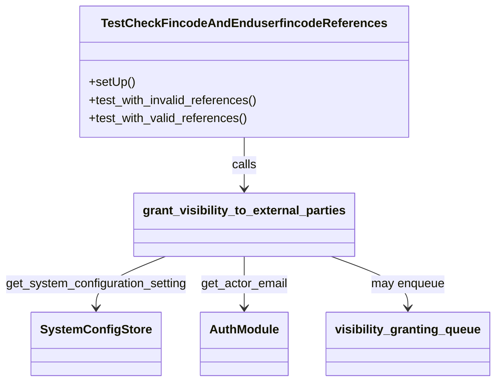
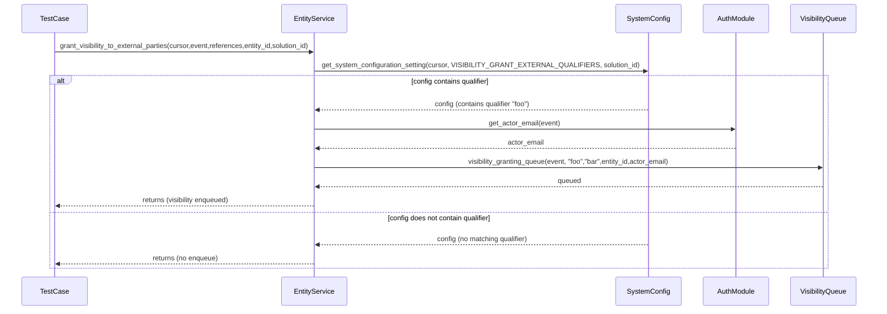
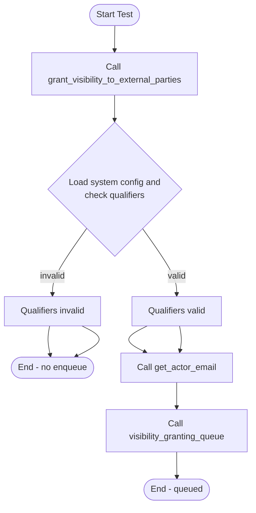

# Diagram: entity_core/entity_service/entity_service_tests/visibility_grant_code_tests/test_grant_visibility_to_external_parties.py

> Auto-generated by Obscura crawlers

## Diagram 1

### SVG

<svg id="container" width="653.09375" xmlns="http://www.w3.org/2000/svg" class="classDiagram" height="506" viewBox="0 0 653.09375 506" role="graphics-document document" aria-roledescription="class"><g><defs><marker id="container_class-aggregationStart" class="marker aggregation class" refX="18" refY="7" markerWidth="190" markerHeight="240" orient="auto"><path d="M 18,7 L9,13 L1,7 L9,1 Z"></path></marker></defs><defs><marker id="container_class-aggregationEnd" class="marker aggregation class" refX="1" refY="7" markerWidth="20" markerHeight="28" orient="auto"><path d="M 18,7 L9,13 L1,7 L9,1 Z"></path></marker></defs><defs><marker id="container_class-extensionStart" class="marker extension class" refX="18" refY="7" markerWidth="190" markerHeight="240" orient="auto"><path d="M 1,7 L18,13 V 1 Z"></path></marker></defs><defs><marker id="container_class-extensionEnd" class="marker extension class" refX="1" refY="7" markerWidth="20" markerHeight="28" orient="auto"><path d="M 1,1 V 13 L18,7 Z"></path></marker></defs><defs><marker id="container_class-compositionStart" class="marker composition class" refX="18" refY="7" markerWidth="190" markerHeight="240" orient="auto"><path d="M 18,7 L9,13 L1,7 L9,1 Z"></path></marker></defs><defs><marker id="container_class-compositionEnd" class="marker composition class" refX="1" refY="7" markerWidth="20" markerHeight="28" orient="auto"><path d="M 18,7 L9,13 L1,7 L9,1 Z"></path></marker></defs><defs><marker id="container_class-dependencyStart" class="marker dependency class" refX="6" refY="7" markerWidth="190" markerHeight="240" orient="auto"><path d="M 5,7 L9,13 L1,7 L9,1 Z"></path></marker></defs><defs><marker id="container_class-dependencyEnd" class="marker dependency class" refX="13" refY="7" markerWidth="20" markerHeight="28" orient="auto"><path d="M 18,7 L9,13 L14,7 L9,1 Z"></path></marker></defs><defs><marker id="container_class-lollipopStart" class="marker lollipop class" refX="13" refY="7" markerWidth="190" markerHeight="240" orient="auto"><circle stroke="black" fill="transparent" cx="7" cy="7" r="6"></circle></marker></defs><defs><marker id="container_class-lollipopEnd" class="marker lollipop class" refX="1" refY="7" markerWidth="190" markerHeight="240" orient="auto"><circle stroke="black" fill="transparent" cx="7" cy="7" r="6"></circle></marker></defs><g class="root"><g class="clusters"></g><g class="edgePaths"><path d="M329.125,182L329.125,188.167C329.125,194.333,329.125,206.667,329.125,218C329.125,229.333,329.125,239.667,329.125,244.833L329.125,250" id="id_TestCheckFincodeAndEnduserfincodeReferences_grant_visibility_to_external_parties_1" class="edge-thickness-normal edge-pattern-solid relation" style=";;;" data-edge="true" data-et="edge" data-id="id_TestCheckFincodeAndEnduserfincodeReferences_grant_visibility_to_external_parties_1" data-points="W3sieCI6MzI5LjEyNSwieSI6MTgyfSx7IngiOjMyOS4xMjUsInkiOjIxOX0seyJ4IjozMjkuMTI1LCJ5IjoyNTZ9XQ==" marker-end="url(#container_class-dependencyEnd)"></path><path d="M223.157,340L207.598,346.167C192.04,352.333,160.922,364.667,145.363,376C129.805,387.333,129.805,397.667,129.805,402.833L129.805,408" id="id_grant_visibility_to_external_parties_SystemConfigStore_2" class="edge-thickness-normal edge-pattern-solid relation" style=";;;" data-edge="true" data-et="edge" data-id="id_grant_visibility_to_external_parties_SystemConfigStore_2" data-points="W3sieCI6MjIzLjE1NzIzODkyNDA1MDYzLCJ5IjozNDB9LHsieCI6MTI5LjgwNDY4NzUsInkiOjM3N30seyJ4IjoxMjkuODA0Njg3NSwieSI6NDE0fV0=" marker-end="url(#container_class-dependencyEnd)"></path><path d="M329.125,340L329.125,346.167C329.125,352.333,329.125,364.667,329.125,376C329.125,387.333,329.125,397.667,329.125,402.833L329.125,408" id="id_grant_visibility_to_external_parties_AuthModule_3" class="edge-thickness-normal edge-pattern-solid relation" style=";;;" data-edge="true" data-et="edge" data-id="id_grant_visibility_to_external_parties_AuthModule_3" data-points="W3sieCI6MzI5LjEyNSwieSI6MzQwfSx7IngiOjMyOS4xMjUsInkiOjM3N30seyJ4IjozMjkuMTI1LCJ5Ijo0MTR9XQ==" marker-end="url(#container_class-dependencyEnd)"></path><path d="M441.319,340L457.792,346.167C474.265,352.333,507.21,364.667,523.683,376C540.156,387.333,540.156,397.667,540.156,402.833L540.156,408" id="id_grant_visibility_to_external_parties_visibility_granting_queue_4" class="edge-thickness-normal edge-pattern-solid relation" style=";;;" data-edge="true" data-et="edge" data-id="id_grant_visibility_to_external_parties_visibility_granting_queue_4" data-points="W3sieCI6NDQxLjMxODgyOTExMzkyNDA0LCJ5IjozNDB9LHsieCI6NTQwLjE1NjI1LCJ5IjozNzd9LHsieCI6NTQwLjE1NjI1LCJ5Ijo0MTR9XQ==" marker-end="url(#container_class-dependencyEnd)"></path></g><g class="edgeLabels"><g class="edgeLabel" transform="translate(329.125, 219)"><g class="label" data-id="id_TestCheckFincodeAndEnduserfincodeReferences_grant_visibility_to_external_parties_1" transform="translate(-16.4453125, -12)"><foreignObject width="32.890625" height="24">

calls

</foreignObject></g></g><g class="edgeLabel" transform="translate(129.8046875, 377)"><g class="label" data-id="id_grant_visibility_to_external_parties_SystemConfigStore_2" transform="translate(-121.8046875, -12)"><foreignObject width="243.609375" height="24">

get_system_configuration_setting

</foreignObject></g></g><g class="edgeLabel" transform="translate(329.125, 377)"><g class="label" data-id="id_grant_visibility_to_external_parties_AuthModule_3" transform="translate(-57.515625, -12)"><foreignObject width="115.03125" height="24">

get_actor_email

</foreignObject></g></g><g class="edgeLabel" transform="translate(540.15625, 377)"><g class="label" data-id="id_grant_visibility_to_external_parties_visibility_granting_queue_4" transform="translate(-49.015625, -12)"><foreignObject width="98.03125" height="24">

may enqueue

</foreignObject></g></g></g><g class="nodes"><g class="node default" id="classId-TestCheckFincodeAndEnduserfincodeReferences-0" transform="translate(329.125, 95)"><g class="basic label-container"><path d="M-213.06640625 -87 L213.06640625 -87 L213.06640625 87 L-213.06640625 87" stroke="none" stroke-width="0" fill="#ECECFF" style=""></path><path d="M-213.06640625 -87 C-57.56797689811316 -87, 97.93045245377368 -87, 213.06640625 -87 M-213.06640625 -87 C-60.80485814889394 -87, 91.45668995221212 -87, 213.06640625 -87 M213.06640625 -87 C213.06640625 -35.76359487828256, 213.06640625 15.472810243434878, 213.06640625 87 M213.06640625 -87 C213.06640625 -45.70103223611273, 213.06640625 -4.402064472225462, 213.06640625 87 M213.06640625 87 C64.54829381821972 87, -83.96981861356056 87, -213.06640625 87 M213.06640625 87 C45.28683080398676 87, -122.49274464202648 87, -213.06640625 87 M-213.06640625 87 C-213.06640625 46.12898593429734, -213.06640625 5.25797186859468, -213.06640625 -87 M-213.06640625 87 C-213.06640625 51.84733659339487, -213.06640625 16.694673186789743, -213.06640625 -87" stroke="#9370DB" stroke-width="1.3" fill="none" stroke-dasharray="0 0" style=""></path></g><g class="annotation-group text" transform="translate(0, -63)"></g><g class="label-group text" transform="translate(-176.2265625, -63)"><g class="label" style="font-weight: bolder" transform="translate(0,-12)"><foreignObject width="352.453125" height="24">

TestCheckFincodeAndEnduserfincodeReferences

</foreignObject></g></g><g class="members-group text" transform="translate(-201.06640625, -15)"></g><g class="methods-group text" transform="translate(-201.06640625, 15)"><g class="label" style="" transform="translate(0,-12)"><foreignObject width="60.421875" height="24">

+setUp()

</foreignObject></g><g class="label" style="" transform="translate(0,12)"><foreignObject width="225.90625" height="24">

+test_with_invalid_references()

</foreignObject></g><g class="label" style="" transform="translate(0,36)"><foreignObject width="211.65625" height="24">

+test_with_valid_references()

</foreignObject></g></g><g class="divider" style=""><path d="M-213.06640625 -39 C-110.30326170184354 -39, -7.540117153687078 -39, 213.06640625 -39 M-213.06640625 -39 C-43.800271630913784 -39, 125.46586298817243 -39, 213.06640625 -39" stroke="#9370DB" stroke-width="1.3" fill="none" stroke-dasharray="0 0" style=""></path></g><g class="divider" style=""><path d="M-213.06640625 -15 C-99.99417158970478 -15, 13.078063070590446 -15, 213.06640625 -15 M-213.06640625 -15 C-54.27642590042524 -15, 104.51355444914952 -15, 213.06640625 -15" stroke="#9370DB" stroke-width="1.3" fill="none" stroke-dasharray="0 0" style=""></path></g></g><g class="node default" id="classId-grant_visibility_to_external_parties-1" transform="translate(329.125, 298)"><g class="basic label-container"><path d="M-142.2421875 -42 L142.2421875 -42 L142.2421875 42 L-142.2421875 42" stroke="none" stroke-width="0" fill="#ECECFF" style=""></path><path d="M-142.2421875 -42 C-67.22441262046668 -42, 7.79336225906664 -42, 142.2421875 -42 M-142.2421875 -42 C-77.93421039568123 -42, -13.626233291362468 -42, 142.2421875 -42 M142.2421875 -42 C142.2421875 -24.19245953636763, 142.2421875 -6.384919072735258, 142.2421875 42 M142.2421875 -42 C142.2421875 -13.158884049515216, 142.2421875 15.682231900969569, 142.2421875 42 M142.2421875 42 C29.486123189130865 42, -83.26994112173827 42, -142.2421875 42 M142.2421875 42 C63.82712770562719 42, -14.587932088745617 42, -142.2421875 42 M-142.2421875 42 C-142.2421875 11.458434028333347, -142.2421875 -19.083131943333306, -142.2421875 -42 M-142.2421875 42 C-142.2421875 23.4888515087308, -142.2421875 4.9777030174616, -142.2421875 -42" stroke="#9370DB" stroke-width="1.3" fill="none" stroke-dasharray="0 0" style=""></path></g><g class="annotation-group text" transform="translate(0, -18)"></g><g class="label-group text" transform="translate(-130.2421875, -18)"><g class="label" style="font-weight: bolder" transform="translate(0,-12)"><foreignObject width="260.484375" height="24">

grant_visibility_to_external_parties

</foreignObject></g></g><g class="members-group text" transform="translate(-130.2421875, 30)"></g><g class="methods-group text" transform="translate(-130.2421875, 60)"></g><g class="divider" style=""><path d="M-142.2421875 6 C-68.1767868639203 6, 5.8886137721594025 6, 142.2421875 6 M-142.2421875 6 C-29.026840342430617 6, 84.18850681513877 6, 142.2421875 6" stroke="#9370DB" stroke-width="1.3" fill="none" stroke-dasharray="0 0" style=""></path></g><g class="divider" style=""><path d="M-142.2421875 24 C-39.40727998287106 24, 63.42762753425788 24, 142.2421875 24 M-142.2421875 24 C-66.81847431258177 24, 8.60523887483646 24, 142.2421875 24" stroke="#9370DB" stroke-width="1.3" fill="none" stroke-dasharray="0 0" style=""></path></g></g><g class="node default" id="classId-visibility_granting_queue-2" transform="translate(540.15625, 456)"><g class="basic label-container"><path d="M-104.9375 -42 L104.9375 -42 L104.9375 42 L-104.9375 42" stroke="none" stroke-width="0" fill="#ECECFF" style=""></path><path d="M-104.9375 -42 C-38.313503952676854 -42, 28.310492094646293 -42, 104.9375 -42 M-104.9375 -42 C-37.72343635175643 -42, 29.490627296487133 -42, 104.9375 -42 M104.9375 -42 C104.9375 -23.808377295959488, 104.9375 -5.616754591918976, 104.9375 42 M104.9375 -42 C104.9375 -9.168290644402106, 104.9375 23.66341871119579, 104.9375 42 M104.9375 42 C44.37006918169664 42, -16.197361636606715 42, -104.9375 42 M104.9375 42 C58.724395816310796 42, 12.511291632621592 42, -104.9375 42 M-104.9375 42 C-104.9375 18.368517063837576, -104.9375 -5.262965872324848, -104.9375 -42 M-104.9375 42 C-104.9375 14.90941540781185, -104.9375 -12.181169184376301, -104.9375 -42" stroke="#9370DB" stroke-width="1.3" fill="none" stroke-dasharray="0 0" style=""></path></g><g class="annotation-group text" transform="translate(0, -18)"></g><g class="label-group text" transform="translate(-92.9375, -18)"><g class="label" style="font-weight: bolder" transform="translate(0,-12)"><foreignObject width="185.875" height="24">

visibility_granting_queue

</foreignObject></g></g><g class="members-group text" transform="translate(-92.9375, 30)"></g><g class="methods-group text" transform="translate(-92.9375, 60)"></g><g class="divider" style=""><path d="M-104.9375 6 C-52.26993897624027 6, 0.3976220475194623 6, 104.9375 6 M-104.9375 6 C-24.788436866899985 6, 55.36062626620003 6, 104.9375 6" stroke="#9370DB" stroke-width="1.3" fill="none" stroke-dasharray="0 0" style=""></path></g><g class="divider" style=""><path d="M-104.9375 24 C-32.1963763742325 24, 40.544747251535 24, 104.9375 24 M-104.9375 24 C-53.92882026026415 24, -2.9201405205283066 24, 104.9375 24" stroke="#9370DB" stroke-width="1.3" fill="none" stroke-dasharray="0 0" style=""></path></g></g><g class="node default" id="classId-SystemConfigStore-3" transform="translate(129.8046875, 456)"><g class="basic label-container"><path d="M-81.0625 -42 L81.0625 -42 L81.0625 42 L-81.0625 42" stroke="none" stroke-width="0" fill="#ECECFF" style=""></path><path d="M-81.0625 -42 C-48.62289084432877 -42, -16.183281688657544 -42, 81.0625 -42 M-81.0625 -42 C-23.727549352207475 -42, 33.60740129558505 -42, 81.0625 -42 M81.0625 -42 C81.0625 -22.133485378347466, 81.0625 -2.2669707566949313, 81.0625 42 M81.0625 -42 C81.0625 -10.673346269134964, 81.0625 20.653307461730073, 81.0625 42 M81.0625 42 C37.46565852392096 42, -6.131182952158085 42, -81.0625 42 M81.0625 42 C19.478649285230134 42, -42.10520142953973 42, -81.0625 42 M-81.0625 42 C-81.0625 8.969452493778753, -81.0625 -24.061095012442493, -81.0625 -42 M-81.0625 42 C-81.0625 10.275810745193795, -81.0625 -21.44837850961241, -81.0625 -42" stroke="#9370DB" stroke-width="1.3" fill="none" stroke-dasharray="0 0" style=""></path></g><g class="annotation-group text" transform="translate(0, -18)"></g><g class="label-group text" transform="translate(-69.0625, -18)"><g class="label" style="font-weight: bolder" transform="translate(0,-12)"><foreignObject width="138.125" height="24">

SystemConfigStore

</foreignObject></g></g><g class="members-group text" transform="translate(-69.0625, 30)"></g><g class="methods-group text" transform="translate(-69.0625, 60)"></g><g class="divider" style=""><path d="M-81.0625 6 C-29.809147558487986 6, 21.444204883024028 6, 81.0625 6 M-81.0625 6 C-45.05167390715928 6, -9.040847814318553 6, 81.0625 6" stroke="#9370DB" stroke-width="1.3" fill="none" stroke-dasharray="0 0" style=""></path></g><g class="divider" style=""><path d="M-81.0625 24 C-18.760328003932116 24, 43.54184399213577 24, 81.0625 24 M-81.0625 24 C-20.583071348741413 24, 39.896357302517174 24, 81.0625 24" stroke="#9370DB" stroke-width="1.3" fill="none" stroke-dasharray="0 0" style=""></path></g></g><g class="node default" id="classId-AuthModule-4" transform="translate(329.125, 456)"><g class="basic label-container"><path d="M-56.09375 -42 L56.09375 -42 L56.09375 42 L-56.09375 42" stroke="none" stroke-width="0" fill="#ECECFF" style=""></path><path d="M-56.09375 -42 C-14.649404533479824 -42, 26.79494093304035 -42, 56.09375 -42 M-56.09375 -42 C-12.269412534225793 -42, 31.554924931548413 -42, 56.09375 -42 M56.09375 -42 C56.09375 -18.245731060735057, 56.09375 5.508537878529886, 56.09375 42 M56.09375 -42 C56.09375 -15.269248556989947, 56.09375 11.461502886020106, 56.09375 42 M56.09375 42 C19.40204599219703 42, -17.289658015605937 42, -56.09375 42 M56.09375 42 C23.65033920949989 42, -8.79307158100022 42, -56.09375 42 M-56.09375 42 C-56.09375 15.915350416299912, -56.09375 -10.169299167400176, -56.09375 -42 M-56.09375 42 C-56.09375 16.563386054590353, -56.09375 -8.873227890819294, -56.09375 -42" stroke="#9370DB" stroke-width="1.3" fill="none" stroke-dasharray="0 0" style=""></path></g><g class="annotation-group text" transform="translate(0, -18)"></g><g class="label-group text" transform="translate(-44.09375, -18)"><g class="label" style="font-weight: bolder" transform="translate(0,-12)"><foreignObject width="88.1875" height="24">

AuthModule

</foreignObject></g></g><g class="members-group text" transform="translate(-44.09375, 30)"></g><g class="methods-group text" transform="translate(-44.09375, 60)"></g><g class="divider" style=""><path d="M-56.09375 6 C-14.196539777283526 6, 27.700670445432948 6, 56.09375 6 M-56.09375 6 C-29.94826474225821 6, -3.802779484516421 6, 56.09375 6" stroke="#9370DB" stroke-width="1.3" fill="none" stroke-dasharray="0 0" style=""></path></g><g class="divider" style=""><path d="M-56.09375 24 C-24.7781505912337 24, 6.537448817532599 24, 56.09375 24 M-56.09375 24 C-16.15104085954605 24, 23.7916682809079 24, 56.09375 24" stroke="#9370DB" stroke-width="1.3" fill="none" stroke-dasharray="0 0" style=""></path></g></g></g></g></g></svg>

## Diagram 2

### SVG

<svg id="container" width="2069" xmlns="http://www.w3.org/2000/svg" height="751" viewBox="-50 -10 2069 751" role="graphics-document document" aria-roledescription="sequence"><g><rect x="1819" y="665" fill="#eaeaea" stroke="#666" width="150" height="65" name="Queue" rx="3" ry="3" class="actor actor-bottom"></rect><text x="1894" y="697.5" dominant-baseline="central" alignment-baseline="central" class="actor actor-box" style="text-anchor: middle; font-size: 16px; font-weight: 400;"><tspan x="1894" dy="0">VisibilityQueue</tspan></text></g><g><rect x="1619" y="665" fill="#eaeaea" stroke="#666" width="150" height="65" name="Auth" rx="3" ry="3" class="actor actor-bottom"></rect><text x="1694" y="697.5" dominant-baseline="central" alignment-baseline="central" class="actor actor-box" style="text-anchor: middle; font-size: 16px; font-weight: 400;"><tspan x="1694" dy="0">AuthModule</tspan></text></g><g><rect x="1419" y="665" fill="#eaeaea" stroke="#666" width="150" height="65" name="Config" rx="3" ry="3" class="actor actor-bottom"></rect><text x="1494" y="697.5" dominant-baseline="central" alignment-baseline="central" class="actor actor-box" style="text-anchor: middle; font-size: 16px; font-weight: 400;"><tspan x="1494" dy="0">SystemConfig</tspan></text></g><g><rect x="657" y="665" fill="#eaeaea" stroke="#666" width="150" height="65" name="Entity" rx="3" ry="3" class="actor actor-bottom"></rect><text x="732" y="697.5" dominant-baseline="central" alignment-baseline="central" class="actor actor-box" style="text-anchor: middle; font-size: 16px; font-weight: 400;"><tspan x="732" dy="0">EntityService</tspan></text></g><g><rect x="0" y="665" fill="#eaeaea" stroke="#666" width="150" height="65" name="Test" rx="3" ry="3" class="actor actor-bottom"></rect><text x="75" y="697.5" dominant-baseline="central" alignment-baseline="central" class="actor actor-box" style="text-anchor: middle; font-size: 16px; font-weight: 400;"><tspan x="75" dy="0">TestCase</tspan></text></g><g><line id="actor4" x1="1894" y1="65" x2="1894" y2="665" class="actor-line 200" stroke-width="0.5px" stroke="#999" name="Queue"></line><g id="root-4"><rect x="1819" y="0" fill="#eaeaea" stroke="#666" width="150" height="65" name="Queue" rx="3" ry="3" class="actor actor-top"></rect><text x="1894" y="32.5" dominant-baseline="central" alignment-baseline="central" class="actor actor-box" style="text-anchor: middle; font-size: 16px; font-weight: 400;"><tspan x="1894" dy="0">VisibilityQueue</tspan></text></g></g><g><line id="actor3" x1="1694" y1="65" x2="1694" y2="665" class="actor-line 200" stroke-width="0.5px" stroke="#999" name="Auth"></line><g id="root-3"><rect x="1619" y="0" fill="#eaeaea" stroke="#666" width="150" height="65" name="Auth" rx="3" ry="3" class="actor actor-top"></rect><text x="1694" y="32.5" dominant-baseline="central" alignment-baseline="central" class="actor actor-box" style="text-anchor: middle; font-size: 16px; font-weight: 400;"><tspan x="1694" dy="0">AuthModule</tspan></text></g></g><g><line id="actor2" x1="1494" y1="65" x2="1494" y2="665" class="actor-line 200" stroke-width="0.5px" stroke="#999" name="Config"></line><g id="root-2"><rect x="1419" y="0" fill="#eaeaea" stroke="#666" width="150" height="65" name="Config" rx="3" ry="3" class="actor actor-top"></rect><text x="1494" y="32.5" dominant-baseline="central" alignment-baseline="central" class="actor actor-box" style="text-anchor: middle; font-size: 16px; font-weight: 400;"><tspan x="1494" dy="0">SystemConfig</tspan></text></g></g><g><line id="actor1" x1="732" y1="65" x2="732" y2="665" class="actor-line 200" stroke-width="0.5px" stroke="#999" name="Entity"></line><g id="root-1"><rect x="657" y="0" fill="#eaeaea" stroke="#666" width="150" height="65" name="Entity" rx="3" ry="3" class="actor actor-top"></rect><text x="732" y="32.5" dominant-baseline="central" alignment-baseline="central" class="actor actor-box" style="text-anchor: middle; font-size: 16px; font-weight: 400;"><tspan x="732" dy="0">EntityService</tspan></text></g></g><g><line id="actor0" x1="75" y1="65" x2="75" y2="665" class="actor-line 200" stroke-width="0.5px" stroke="#999" name="Test"></line><g id="root-0"><rect x="0" y="0" fill="#eaeaea" stroke="#666" width="150" height="65" name="Test" rx="3" ry="3" class="actor actor-top"></rect><text x="75" y="32.5" dominant-baseline="central" alignment-baseline="central" class="actor actor-box" style="text-anchor: middle; font-size: 16px; font-weight: 400;"><tspan x="75" dy="0">TestCase</tspan></text></g></g><g></g><defs><symbol id="computer" width="24" height="24"><path transform="scale(.5)" d="M2 2v13h20v-13h-20zm18 11h-16v-9h16v9zm-10.228 6l.466-1h3.524l.467 1h-4.457zm14.228 3h-24l2-6h2.104l-1.33 4h18.45l-1.297-4h2.073l2 6zm-5-10h-14v-7h14v7z"></path></symbol></defs><defs><symbol id="database" fill-rule="evenodd" clip-rule="evenodd"><path transform="scale(.5)" d="M12.258.001l.256.004.255.005.253.008.251.01.249.012.247.015.246.016.242.019.241.02.239.023.236.024.233.027.231.028.229.031.225.032.223.034.22.036.217.038.214.04.211.041.208.043.205.045.201.046.198.048.194.05.191.051.187.053.183.054.18.056.175.057.172.059.168.06.163.061.16.063.155.064.15.066.074.033.073.033.071.034.07.034.069.035.068.035.067.035.066.035.064.036.064.036.062.036.06.036.06.037.058.037.058.037.055.038.055.038.053.038.052.038.051.039.05.039.048.039.047.039.045.04.044.04.043.04.041.04.04.041.039.041.037.041.036.041.034.041.033.042.032.042.03.042.029.042.027.042.026.043.024.043.023.043.021.043.02.043.018.044.017.043.015.044.013.044.012.044.011.045.009.044.007.045.006.045.004.045.002.045.001.045v17l-.001.045-.002.045-.004.045-.006.045-.007.045-.009.044-.011.045-.012.044-.013.044-.015.044-.017.043-.018.044-.02.043-.021.043-.023.043-.024.043-.026.043-.027.042-.029.042-.03.042-.032.042-.033.042-.034.041-.036.041-.037.041-.039.041-.04.041-.041.04-.043.04-.044.04-.045.04-.047.039-.048.039-.05.039-.051.039-.052.038-.053.038-.055.038-.055.038-.058.037-.058.037-.06.037-.06.036-.062.036-.064.036-.064.036-.066.035-.067.035-.068.035-.069.035-.07.034-.071.034-.073.033-.074.033-.15.066-.155.064-.16.063-.163.061-.168.06-.172.059-.175.057-.18.056-.183.054-.187.053-.191.051-.194.05-.198.048-.201.046-.205.045-.208.043-.211.041-.214.04-.217.038-.22.036-.223.034-.225.032-.229.031-.231.028-.233.027-.236.024-.239.023-.241.02-.242.019-.246.016-.247.015-.249.012-.251.01-.253.008-.255.005-.256.004-.258.001-.258-.001-.256-.004-.255-.005-.253-.008-.251-.01-.249-.012-.247-.015-.245-.016-.243-.019-.241-.02-.238-.023-.236-.024-.234-.027-.231-.028-.228-.031-.226-.032-.223-.034-.22-.036-.217-.038-.214-.04-.211-.041-.208-.043-.204-.045-.201-.046-.198-.048-.195-.05-.19-.051-.187-.053-.184-.054-.179-.056-.176-.057-.172-.059-.167-.06-.164-.061-.159-.063-.155-.064-.151-.066-.074-.033-.072-.033-.072-.034-.07-.034-.069-.035-.068-.035-.067-.035-.066-.035-.064-.036-.063-.036-.062-.036-.061-.036-.06-.037-.058-.037-.057-.037-.056-.038-.055-.038-.053-.038-.052-.038-.051-.039-.049-.039-.049-.039-.046-.039-.046-.04-.044-.04-.043-.04-.041-.04-.04-.041-.039-.041-.037-.041-.036-.041-.034-.041-.033-.042-.032-.042-.03-.042-.029-.042-.027-.042-.026-.043-.024-.043-.023-.043-.021-.043-.02-.043-.018-.044-.017-.043-.015-.044-.013-.044-.012-.044-.011-.045-.009-.044-.007-.045-.006-.045-.004-.045-.002-.045-.001-.045v-17l.001-.045.002-.045.004-.045.006-.045.007-.045.009-.044.011-.045.012-.044.013-.044.015-.044.017-.043.018-.044.02-.043.021-.043.023-.043.024-.043.026-.043.027-.042.029-.042.03-.042.032-.042.033-.042.034-.041.036-.041.037-.041.039-.041.04-.041.041-.04.043-.04.044-.04.046-.04.046-.039.049-.039.049-.039.051-.039.052-.038.053-.038.055-.038.056-.038.057-.037.058-.037.06-.037.061-.036.062-.036.063-.036.064-.036.066-.035.067-.035.068-.035.069-.035.07-.034.072-.034.072-.033.074-.033.151-.066.155-.064.159-.063.164-.061.167-.06.172-.059.176-.057.179-.056.184-.054.187-.053.19-.051.195-.05.198-.048.201-.046.204-.045.208-.043.211-.041.214-.04.217-.038.22-.036.223-.034.226-.032.228-.031.231-.028.234-.027.236-.024.238-.023.241-.02.243-.019.245-.016.247-.015.249-.012.251-.01.253-.008.255-.005.256-.004.258-.001.258.001zm-9.258 20.499v.01l.001.021.003.021.004.022.005.021.006.022.007.022.009.023.01.022.011.023.012.023.013.023.015.023.016.024.017.023.018.024.019.024.021.024.022.025.023.024.024.025.052.049.056.05.061.051.066.051.07.051.075.051.079.052.084.052.088.052.092.052.097.052.102.051.105.052.11.052.114.051.119.051.123.051.127.05.131.05.135.05.139.048.144.049.147.047.152.047.155.047.16.045.163.045.167.043.171.043.176.041.178.041.183.039.187.039.19.037.194.035.197.035.202.033.204.031.209.03.212.029.216.027.219.025.222.024.226.021.23.02.233.018.236.016.24.015.243.012.246.01.249.008.253.005.256.004.259.001.26-.001.257-.004.254-.005.25-.008.247-.011.244-.012.241-.014.237-.016.233-.018.231-.021.226-.021.224-.024.22-.026.216-.027.212-.028.21-.031.205-.031.202-.034.198-.034.194-.036.191-.037.187-.039.183-.04.179-.04.175-.042.172-.043.168-.044.163-.045.16-.046.155-.046.152-.047.148-.048.143-.049.139-.049.136-.05.131-.05.126-.05.123-.051.118-.052.114-.051.11-.052.106-.052.101-.052.096-.052.092-.052.088-.053.083-.051.079-.052.074-.052.07-.051.065-.051.06-.051.056-.05.051-.05.023-.024.023-.025.021-.024.02-.024.019-.024.018-.024.017-.024.015-.023.014-.024.013-.023.012-.023.01-.023.01-.022.008-.022.006-.022.006-.022.004-.022.004-.021.001-.021.001-.021v-4.127l-.077.055-.08.053-.083.054-.085.053-.087.052-.09.052-.093.051-.095.05-.097.05-.1.049-.102.049-.105.048-.106.047-.109.047-.111.046-.114.045-.115.045-.118.044-.12.043-.122.042-.124.042-.126.041-.128.04-.13.04-.132.038-.134.038-.135.037-.138.037-.139.035-.142.035-.143.034-.144.033-.147.032-.148.031-.15.03-.151.03-.153.029-.154.027-.156.027-.158.026-.159.025-.161.024-.162.023-.163.022-.165.021-.166.02-.167.019-.169.018-.169.017-.171.016-.173.015-.173.014-.175.013-.175.012-.177.011-.178.01-.179.008-.179.008-.181.006-.182.005-.182.004-.184.003-.184.002h-.37l-.184-.002-.184-.003-.182-.004-.182-.005-.181-.006-.179-.008-.179-.008-.178-.01-.176-.011-.176-.012-.175-.013-.173-.014-.172-.015-.171-.016-.17-.017-.169-.018-.167-.019-.166-.02-.165-.021-.163-.022-.162-.023-.161-.024-.159-.025-.157-.026-.156-.027-.155-.027-.153-.029-.151-.03-.15-.03-.148-.031-.146-.032-.145-.033-.143-.034-.141-.035-.14-.035-.137-.037-.136-.037-.134-.038-.132-.038-.13-.04-.128-.04-.126-.041-.124-.042-.122-.042-.12-.044-.117-.043-.116-.045-.113-.045-.112-.046-.109-.047-.106-.047-.105-.048-.102-.049-.1-.049-.097-.05-.095-.05-.093-.052-.09-.051-.087-.052-.085-.053-.083-.054-.08-.054-.077-.054v4.127zm0-5.654v.011l.001.021.003.021.004.021.005.022.006.022.007.022.009.022.01.022.011.023.012.023.013.023.015.024.016.023.017.024.018.024.019.024.021.024.022.024.023.025.024.024.052.05.056.05.061.05.066.051.07.051.075.052.079.051.084.052.088.052.092.052.097.052.102.052.105.052.11.051.114.051.119.052.123.05.127.051.131.05.135.049.139.049.144.048.147.048.152.047.155.046.16.045.163.045.167.044.171.042.176.042.178.04.183.04.187.038.19.037.194.036.197.034.202.033.204.032.209.03.212.028.216.027.219.025.222.024.226.022.23.02.233.018.236.016.24.014.243.012.246.01.249.008.253.006.256.003.259.001.26-.001.257-.003.254-.006.25-.008.247-.01.244-.012.241-.015.237-.016.233-.018.231-.02.226-.022.224-.024.22-.025.216-.027.212-.029.21-.03.205-.032.202-.033.198-.035.194-.036.191-.037.187-.039.183-.039.179-.041.175-.042.172-.043.168-.044.163-.045.16-.045.155-.047.152-.047.148-.048.143-.048.139-.05.136-.049.131-.05.126-.051.123-.051.118-.051.114-.052.11-.052.106-.052.101-.052.096-.052.092-.052.088-.052.083-.052.079-.052.074-.051.07-.052.065-.051.06-.05.056-.051.051-.049.023-.025.023-.024.021-.025.02-.024.019-.024.018-.024.017-.024.015-.023.014-.023.013-.024.012-.022.01-.023.01-.023.008-.022.006-.022.006-.022.004-.021.004-.022.001-.021.001-.021v-4.139l-.077.054-.08.054-.083.054-.085.052-.087.053-.09.051-.093.051-.095.051-.097.05-.1.049-.102.049-.105.048-.106.047-.109.047-.111.046-.114.045-.115.044-.118.044-.12.044-.122.042-.124.042-.126.041-.128.04-.13.039-.132.039-.134.038-.135.037-.138.036-.139.036-.142.035-.143.033-.144.033-.147.033-.148.031-.15.03-.151.03-.153.028-.154.028-.156.027-.158.026-.159.025-.161.024-.162.023-.163.022-.165.021-.166.02-.167.019-.169.018-.169.017-.171.016-.173.015-.173.014-.175.013-.175.012-.177.011-.178.009-.179.009-.179.007-.181.007-.182.005-.182.004-.184.003-.184.002h-.37l-.184-.002-.184-.003-.182-.004-.182-.005-.181-.007-.179-.007-.179-.009-.178-.009-.176-.011-.176-.012-.175-.013-.173-.014-.172-.015-.171-.016-.17-.017-.169-.018-.167-.019-.166-.02-.165-.021-.163-.022-.162-.023-.161-.024-.159-.025-.157-.026-.156-.027-.155-.028-.153-.028-.151-.03-.15-.03-.148-.031-.146-.033-.145-.033-.143-.033-.141-.035-.14-.036-.137-.036-.136-.037-.134-.038-.132-.039-.13-.039-.128-.04-.126-.041-.124-.042-.122-.043-.12-.043-.117-.044-.116-.044-.113-.046-.112-.046-.109-.046-.106-.047-.105-.048-.102-.049-.1-.049-.097-.05-.095-.051-.093-.051-.09-.051-.087-.053-.085-.052-.083-.054-.08-.054-.077-.054v4.139zm0-5.666v.011l.001.02.003.022.004.021.005.022.006.021.007.022.009.023.01.022.011.023.012.023.013.023.015.023.016.024.017.024.018.023.019.024.021.025.022.024.023.024.024.025.052.05.056.05.061.05.066.051.07.051.075.052.079.051.084.052.088.052.092.052.097.052.102.052.105.051.11.052.114.051.119.051.123.051.127.05.131.05.135.05.139.049.144.048.147.048.152.047.155.046.16.045.163.045.167.043.171.043.176.042.178.04.183.04.187.038.19.037.194.036.197.034.202.033.204.032.209.03.212.028.216.027.219.025.222.024.226.021.23.02.233.018.236.017.24.014.243.012.246.01.249.008.253.006.256.003.259.001.26-.001.257-.003.254-.006.25-.008.247-.01.244-.013.241-.014.237-.016.233-.018.231-.02.226-.022.224-.024.22-.025.216-.027.212-.029.21-.03.205-.032.202-.033.198-.035.194-.036.191-.037.187-.039.183-.039.179-.041.175-.042.172-.043.168-.044.163-.045.16-.045.155-.047.152-.047.148-.048.143-.049.139-.049.136-.049.131-.051.126-.05.123-.051.118-.052.114-.051.11-.052.106-.052.101-.052.096-.052.092-.052.088-.052.083-.052.079-.052.074-.052.07-.051.065-.051.06-.051.056-.05.051-.049.023-.025.023-.025.021-.024.02-.024.019-.024.018-.024.017-.024.015-.023.014-.024.013-.023.012-.023.01-.022.01-.023.008-.022.006-.022.006-.022.004-.022.004-.021.001-.021.001-.021v-4.153l-.077.054-.08.054-.083.053-.085.053-.087.053-.09.051-.093.051-.095.051-.097.05-.1.049-.102.048-.105.048-.106.048-.109.046-.111.046-.114.046-.115.044-.118.044-.12.043-.122.043-.124.042-.126.041-.128.04-.13.039-.132.039-.134.038-.135.037-.138.036-.139.036-.142.034-.143.034-.144.033-.147.032-.148.032-.15.03-.151.03-.153.028-.154.028-.156.027-.158.026-.159.024-.161.024-.162.023-.163.023-.165.021-.166.02-.167.019-.169.018-.169.017-.171.016-.173.015-.173.014-.175.013-.175.012-.177.01-.178.01-.179.009-.179.007-.181.006-.182.006-.182.004-.184.003-.184.001-.185.001-.185-.001-.184-.001-.184-.003-.182-.004-.182-.006-.181-.006-.179-.007-.179-.009-.178-.01-.176-.01-.176-.012-.175-.013-.173-.014-.172-.015-.171-.016-.17-.017-.169-.018-.167-.019-.166-.02-.165-.021-.163-.023-.162-.023-.161-.024-.159-.024-.157-.026-.156-.027-.155-.028-.153-.028-.151-.03-.15-.03-.148-.032-.146-.032-.145-.033-.143-.034-.141-.034-.14-.036-.137-.036-.136-.037-.134-.038-.132-.039-.13-.039-.128-.041-.126-.041-.124-.041-.122-.043-.12-.043-.117-.044-.116-.044-.113-.046-.112-.046-.109-.046-.106-.048-.105-.048-.102-.048-.1-.05-.097-.049-.095-.051-.093-.051-.09-.052-.087-.052-.085-.053-.083-.053-.08-.054-.077-.054v4.153zm8.74-8.179l-.257.004-.254.005-.25.008-.247.011-.244.012-.241.014-.237.016-.233.018-.231.021-.226.022-.224.023-.22.026-.216.027-.212.028-.21.031-.205.032-.202.033-.198.034-.194.036-.191.038-.187.038-.183.04-.179.041-.175.042-.172.043-.168.043-.163.045-.16.046-.155.046-.152.048-.148.048-.143.048-.139.049-.136.05-.131.05-.126.051-.123.051-.118.051-.114.052-.11.052-.106.052-.101.052-.096.052-.092.052-.088.052-.083.052-.079.052-.074.051-.07.052-.065.051-.06.05-.056.05-.051.05-.023.025-.023.024-.021.024-.02.025-.019.024-.018.024-.017.023-.015.024-.014.023-.013.023-.012.023-.01.023-.01.022-.008.022-.006.023-.006.021-.004.022-.004.021-.001.021-.001.021.001.021.001.021.004.021.004.022.006.021.006.023.008.022.01.022.01.023.012.023.013.023.014.023.015.024.017.023.018.024.019.024.02.025.021.024.023.024.023.025.051.05.056.05.06.05.065.051.07.052.074.051.079.052.083.052.088.052.092.052.096.052.101.052.106.052.11.052.114.052.118.051.123.051.126.051.131.05.136.05.139.049.143.048.148.048.152.048.155.046.16.046.163.045.168.043.172.043.175.042.179.041.183.04.187.038.191.038.194.036.198.034.202.033.205.032.21.031.212.028.216.027.22.026.224.023.226.022.231.021.233.018.237.016.241.014.244.012.247.011.25.008.254.005.257.004.26.001.26-.001.257-.004.254-.005.25-.008.247-.011.244-.012.241-.014.237-.016.233-.018.231-.021.226-.022.224-.023.22-.026.216-.027.212-.028.21-.031.205-.032.202-.033.198-.034.194-.036.191-.038.187-.038.183-.04.179-.041.175-.042.172-.043.168-.043.163-.045.16-.046.155-.046.152-.048.148-.048.143-.048.139-.049.136-.05.131-.05.126-.051.123-.051.118-.051.114-.052.11-.052.106-.052.101-.052.096-.052.092-.052.088-.052.083-.052.079-.052.074-.051.07-.052.065-.051.06-.05.056-.05.051-.05.023-.025.023-.024.021-.024.02-.025.019-.024.018-.024.017-.023.015-.024.014-.023.013-.023.012-.023.01-.023.01-.022.008-.022.006-.023.006-.021.004-.022.004-.021.001-.021.001-.021-.001-.021-.001-.021-.004-.021-.004-.022-.006-.021-.006-.023-.008-.022-.01-.022-.01-.023-.012-.023-.013-.023-.014-.023-.015-.024-.017-.023-.018-.024-.019-.024-.02-.025-.021-.024-.023-.024-.023-.025-.051-.05-.056-.05-.06-.05-.065-.051-.07-.052-.074-.051-.079-.052-.083-.052-.088-.052-.092-.052-.096-.052-.101-.052-.106-.052-.11-.052-.114-.052-.118-.051-.123-.051-.126-.051-.131-.05-.136-.05-.139-.049-.143-.048-.148-.048-.152-.048-.155-.046-.16-.046-.163-.045-.168-.043-.172-.043-.175-.042-.179-.041-.183-.04-.187-.038-.191-.038-.194-.036-.198-.034-.202-.033-.205-.032-.21-.031-.212-.028-.216-.027-.22-.026-.224-.023-.226-.022-.231-.021-.233-.018-.237-.016-.241-.014-.244-.012-.247-.011-.25-.008-.254-.005-.257-.004-.26-.001-.26.001z"></path></symbol></defs><defs><symbol id="clock" width="24" height="24"><path transform="scale(.5)" d="M12 2c5.514 0 10 4.486 10 10s-4.486 10-10 10-10-4.486-10-10 4.486-10 10-10zm0-2c-6.627 0-12 5.373-12 12s5.373 12 12 12 12-5.373 12-12-5.373-12-12-12zm5.848 12.459c.202.038.202.333.001.372-1.907.361-6.045 1.111-6.547 1.111-.719 0-1.301-.582-1.301-1.301 0-.512.77-5.447 1.125-7.445.034-.192.312-.181.343.014l.985 6.238 5.394 1.011z"></path></symbol></defs><defs><marker id="arrowhead" refX="7.9" refY="5" markerUnits="userSpaceOnUse" markerWidth="12" markerHeight="12" orient="auto-start-reverse"><path d="M -1 0 L 10 5 L 0 10 z"></path></marker></defs><defs><marker id="crosshead" markerWidth="15" markerHeight="8" orient="auto" refX="4" refY="4.5"><path fill="none" stroke="#000000" stroke-width="1pt" d="M 1,2 L 6,7 M 6,2 L 1,7" style="stroke-dasharray: 0, 0;"></path></marker></defs><defs><marker id="filled-head" refX="15.5" refY="7" markerWidth="20" markerHeight="28" orient="auto"><path d="M 18,7 L9,13 L14,7 L9,1 Z"></path></marker></defs><defs><marker id="sequencenumber" refX="15" refY="15" markerWidth="60" markerHeight="40" orient="auto"><circle cx="15" cy="15" r="6"></circle></marker></defs><g><line x1="64" y1="171" x2="1905" y2="171" class="loopLine"></line><line x1="1905" y1="171" x2="1905" y2="645" class="loopLine"></line><line x1="64" y1="645" x2="1905" y2="645" class="loopLine"></line><line x1="64" y1="171" x2="64" y2="645" class="loopLine"></line><line x1="64" y1="509" x2="1905" y2="509" class="loopLine" style="stroke-dasharray: 3, 3;"></line><polygon points="64,171 114,171 114,184 105.6,191 64,191" class="labelBox"></polygon><text x="89" y="184" text-anchor="middle" dominant-baseline="middle" alignment-baseline="middle" class="labelText" style="font-size: 16px; font-weight: 400;">alt</text><text x="1009.5" y="189" text-anchor="middle" class="loopText" style="font-size: 16px; font-weight: 400;"><tspan x="1009.5">[config contains qualifier]</tspan></text><text x="984.5" y="527" text-anchor="middle" class="loopText" style="font-size: 16px; font-weight: 400;">[config does not contain qualifier]</text></g><text x="402" y="80" text-anchor="middle" dominant-baseline="middle" alignment-baseline="middle" class="messageText" dy="1em" style="font-size: 16px; font-weight: 400;">grant_visibility_to_external_parties(cursor,event,references,entity_id,solution_id)</text><line x1="76" y1="113" x2="728" y2="113" class="messageLine0" stroke-width="2" stroke="none" marker-end="url(#arrowhead)" style="fill: none;"></line><text x="1112" y="128" text-anchor="middle" dominant-baseline="middle" alignment-baseline="middle" class="messageText" dy="1em" style="font-size: 16px; font-weight: 400;">get_system_configuration_setting(cursor, VISIBILITY_GRANT_EXTERNAL_QUALIFIERS, solution_id)</text><line x1="733" y1="161" x2="1490" y2="161" class="messageLine0" stroke-width="2" stroke="none" marker-end="url(#arrowhead)" style="fill: none;"></line><text x="1115" y="221" text-anchor="middle" dominant-baseline="middle" alignment-baseline="middle" class="messageText" dy="1em" style="font-size: 16px; font-weight: 400;">config (contains qualifier "foo")</text><line x1="1493" y1="254" x2="736" y2="254" class="messageLine1" stroke-width="2" stroke="none" marker-end="url(#arrowhead)" style="stroke-dasharray: 3, 3; fill: none;"></line><text x="1212" y="269" text-anchor="middle" dominant-baseline="middle" alignment-baseline="middle" class="messageText" dy="1em" style="font-size: 16px; font-weight: 400;">get_actor_email(event)</text><line x1="733" y1="302" x2="1690" y2="302" class="messageLine0" stroke-width="2" stroke="none" marker-end="url(#arrowhead)" style="fill: none;"></line><text x="1215" y="317" text-anchor="middle" dominant-baseline="middle" alignment-baseline="middle" class="messageText" dy="1em" style="font-size: 16px; font-weight: 400;">actor_email</text><line x1="1693" y1="350" x2="736" y2="350" class="messageLine1" stroke-width="2" stroke="none" marker-end="url(#arrowhead)" style="stroke-dasharray: 3, 3; fill: none;"></line><text x="1312" y="365" text-anchor="middle" dominant-baseline="middle" alignment-baseline="middle" class="messageText" dy="1em" style="font-size: 16px; font-weight: 400;">visibility_granting_queue(event, "foo","bar",entity_id,actor_email)</text><line x1="733" y1="398" x2="1890" y2="398" class="messageLine0" stroke-width="2" stroke="none" marker-end="url(#arrowhead)" style="fill: none;"></line><text x="1315" y="413" text-anchor="middle" dominant-baseline="middle" alignment-baseline="middle" class="messageText" dy="1em" style="font-size: 16px; font-weight: 400;">queued</text><line x1="1893" y1="446" x2="736" y2="446" class="messageLine1" stroke-width="2" stroke="none" marker-end="url(#arrowhead)" style="stroke-dasharray: 3, 3; fill: none;"></line><text x="405" y="461" text-anchor="middle" dominant-baseline="middle" alignment-baseline="middle" class="messageText" dy="1em" style="font-size: 16px; font-weight: 400;">returns (visibility enqueued)</text><line x1="731" y1="494" x2="79" y2="494" class="messageLine1" stroke-width="2" stroke="none" marker-end="url(#arrowhead)" style="stroke-dasharray: 3, 3; fill: none;"></line><text x="1115" y="554" text-anchor="middle" dominant-baseline="middle" alignment-baseline="middle" class="messageText" dy="1em" style="font-size: 16px; font-weight: 400;">config (no matching qualifier)</text><line x1="1493" y1="587" x2="736" y2="587" class="messageLine1" stroke-width="2" stroke="none" marker-end="url(#arrowhead)" style="stroke-dasharray: 3, 3; fill: none;"></line><text x="405" y="602" text-anchor="middle" dominant-baseline="middle" alignment-baseline="middle" class="messageText" dy="1em" style="font-size: 16px; font-weight: 400;">returns (no enqueue)</text><line x1="731" y1="635" x2="79" y2="635" class="messageLine1" stroke-width="2" stroke="none" marker-end="url(#arrowhead)" style="stroke-dasharray: 3, 3; fill: none;"></line></svg>

## Diagram 3

### SVG

<svg id="container" width="467.036865234375" xmlns="http://www.w3.org/2000/svg" class="flowchart" height="960" viewBox="0 0 467.036865234375 960" role="graphics-document document" aria-roledescription="flowchart-v2"><g><marker id="container_flowchart-v2-pointEnd" class="marker flowchart-v2" viewBox="0 0 10 10" refX="5" refY="5" markerUnits="userSpaceOnUse" markerWidth="8" markerHeight="8" orient="auto"><path d="M 0 0 L 10 5 L 0 10 z" class="arrowMarkerPath" style="stroke-width: 1; stroke-dasharray: 1, 0;"></path></marker><marker id="container_flowchart-v2-pointStart" class="marker flowchart-v2" viewBox="0 0 10 10" refX="4.5" refY="5" markerUnits="userSpaceOnUse" markerWidth="8" markerHeight="8" orient="auto"><path d="M 0 5 L 10 10 L 10 0 z" class="arrowMarkerPath" style="stroke-width: 1; stroke-dasharray: 1, 0;"></path></marker><marker id="container_flowchart-v2-circleEnd" class="marker flowchart-v2" viewBox="0 0 10 10" refX="11" refY="5" markerUnits="userSpaceOnUse" markerWidth="11" markerHeight="11" orient="auto"><circle cx="5" cy="5" r="5" class="arrowMarkerPath" style="stroke-width: 1; stroke-dasharray: 1, 0;"></circle></marker><marker id="container_flowchart-v2-circleStart" class="marker flowchart-v2" viewBox="0 0 10 10" refX="-1" refY="5" markerUnits="userSpaceOnUse" markerWidth="11" markerHeight="11" orient="auto"><circle cx="5" cy="5" r="5" class="arrowMarkerPath" style="stroke-width: 1; stroke-dasharray: 1, 0;"></circle></marker><marker id="container_flowchart-v2-crossEnd" class="marker cross flowchart-v2" viewBox="0 0 11 11" refX="12" refY="5.2" markerUnits="userSpaceOnUse" markerWidth="11" markerHeight="11" orient="auto"><path d="M 1,1 l 9,9 M 10,1 l -9,9" class="arrowMarkerPath" style="stroke-width: 2; stroke-dasharray: 1, 0;"></path></marker><marker id="container_flowchart-v2-crossStart" class="marker cross flowchart-v2" viewBox="0 0 11 11" refX="-1" refY="5.2" markerUnits="userSpaceOnUse" markerWidth="11" markerHeight="11" orient="auto"><path d="M 1,1 l 9,9 M 10,1 l -9,9" class="arrowMarkerPath" style="stroke-width: 2; stroke-dasharray: 1, 0;"></path></marker><g class="root"><g class="clusters"></g><g class="edgePaths"><path d="M94.003,631L93.202,635.167C92.4,639.333,90.798,647.667,90.988,656.68C91.178,665.694,93.161,675.387,94.152,680.234L95.144,685.081" id="L_C_E_0" class="edge-thickness-normal edge-pattern-solid edge-thickness-normal edge-pattern-solid flowchart-link" style=";" data-edge="true" data-et="edge" data-id="L_C_E_0" data-points="W3sieCI6OTQuMDAzMDA0ODA3NjkyMywieSI6NjMxfSx7IngiOjg5LjE5NTMxMjUsInkiOjY1Nn0seyJ4Ijo5NS45NDUzMTI1LCJ5Ijo2ODl9XQ==" marker-end="url(#container_flowchart-v2-pointEnd)"></path><path d="M274.559,631L266.152,635.167C257.745,639.333,240.93,647.667,240.333,655.704C239.736,663.741,255.355,671.482,263.165,675.353L270.975,679.224" id="L_D_F_0" class="edge-thickness-normal edge-pattern-solid edge-thickness-normal edge-pattern-solid flowchart-link" style=";" data-edge="true" data-et="edge" data-id="L_D_F_0" data-points="W3sieCI6Mjc0LjU1ODc2NDE2NDI2NDQsInkiOjYzMX0seyJ4IjoyMjQuMTE2MDg1MDUyNDkwMjMsInkiOjY1Nn0seyJ4IjoyNzQuNTU4NzY0MTY0MjY0NCwieSI6NjgxfV0=" marker-end="url(#container_flowchart-v2-pointEnd)"></path><path d="M214.616,47.5L214.533,51.583C214.449,55.667,214.283,63.833,214.199,71.417C214.116,79,214.116,86,214.116,89.5L214.116,93" id="L_Start_A_0" class="edge-thickness-normal edge-pattern-solid edge-thickness-normal edge-pattern-solid flowchart-link" style=";" data-edge="true" data-et="edge" data-id="L_Start_A_0" data-points="W3sieCI6MjE0LjYxNjA4NTA1MjQ5MDIzLCJ5Ijo0Ny41fSx7IngiOjIxNC4xMTYwODUwNTI0OTAyMywieSI6NzJ9LHsieCI6MjE0LjExNjA4NTA1MjQ5MDIzLCJ5Ijo5N31d" marker-end="url(#container_flowchart-v2-pointEnd)"></path><path d="M214.116,175L214.116,179.167C214.116,183.333,214.116,191.667,214.116,199.333C214.116,207,214.116,214,214.116,217.5L214.116,221" id="L_A_B_0" class="edge-thickness-normal edge-pattern-solid edge-thickness-normal edge-pattern-solid flowchart-link" style=";" data-edge="true" data-et="edge" data-id="L_A_B_0" data-points="W3sieCI6MjE0LjExNjA4NTA1MjQ5MDIzLCJ5IjoxNzV9LHsieCI6MjE0LjExNjA4NTA1MjQ5MDIzLCJ5IjoyMDB9LHsieCI6MjE0LjExNjA4NTA1MjQ5MDIzLCJ5IjoyMjV9XQ==" marker-end="url(#container_flowchart-v2-pointEnd)"></path><path d="M159.208,448.092L149.206,463.41C139.204,478.728,119.199,509.364,109.197,530.182C99.195,551,99.195,562,99.195,567.5L99.195,573" id="L_B_C_0" class="edge-thickness-normal edge-pattern-solid edge-thickness-normal edge-pattern-solid flowchart-link" style=";" data-edge="true" data-et="edge" data-id="L_B_C_0" data-points="W3sieCI6MTU5LjIwNzcwODI5ODc2NzczLCJ5Ijo0NDguMDkxNjIzMjQ2Mjc3NX0seyJ4Ijo5OS4xOTUzMTI1LCJ5Ijo1NDB9LHsieCI6OTkuMTk1MzEyNSwieSI6NTc3fV0=" marker-end="url(#container_flowchart-v2-pointEnd)"></path><path d="M153.673,631L162.081,635.167C170.488,639.333,187.302,647.667,185.458,657.032C183.613,666.397,163.111,676.794,152.859,681.992L142.608,687.191" id="L_C_E_2" class="edge-thickness-normal edge-pattern-solid edge-thickness-normal edge-pattern-solid flowchart-link" style=";" data-edge="true" data-et="edge" data-id="L_C_E_2" data-points="W3sieCI6MTUzLjY3MzQwNTk0MDcxNjA3LCJ5Ijo2MzF9LHsieCI6MjA0LjExNjA4NTA1MjQ5MDIzLCJ5Ijo2NTZ9LHsieCI6MTM5LjA0MDYwMjIwNzE4Mzg0LCJ5Ijo2ODl9XQ==" marker-end="url(#container_flowchart-v2-pointEnd)"></path><path d="M269.024,448.092L279.027,463.41C289.029,478.728,309.033,509.364,319.035,530.182C329.037,551,329.037,562,329.037,567.5L329.037,573" id="L_B_D_0" class="edge-thickness-normal edge-pattern-solid edge-thickness-normal edge-pattern-solid flowchart-link" style=";" data-edge="true" data-et="edge" data-id="L_B_D_0" data-points="W3sieCI6MjY5LjAyNDQ2MTgwNjIxMjc0LCJ5Ijo0NDguMDkxNjIzMjQ2Mjc3NX0seyJ4IjozMjkuMDM2ODU3NjA0OTgwNDcsInkiOjU0MH0seyJ4IjozMjkuMDM2ODU3NjA0OTgwNDcsInkiOjU3N31d" marker-end="url(#container_flowchart-v2-pointEnd)"></path><path d="M334.229,631L335.03,635.167C335.832,639.333,337.434,647.667,337.56,655.345C337.686,663.024,336.335,670.048,335.66,673.56L334.985,677.072" id="L_D_F_2" class="edge-thickness-normal edge-pattern-solid edge-thickness-normal edge-pattern-solid flowchart-link" style=";" data-edge="true" data-et="edge" data-id="L_D_F_2" data-points="W3sieCI6MzM0LjIyOTE2NTI5NzI4ODE1LCJ5Ijo2MzF9LHsieCI6MzM5LjAzNjg1NzYwNDk4MDQ3LCJ5Ijo2NTZ9LHsieCI6MzM0LjIyOTE2NTI5NzI4ODE1LCJ5Ijo2ODF9XQ==" marker-end="url(#container_flowchart-v2-pointEnd)"></path><path d="M329.037,735L329.037,739.167C329.037,743.333,329.037,751.667,329.037,759.333C329.037,767,329.037,774,329.037,777.5L329.037,781" id="L_F_G_0" class="edge-thickness-normal edge-pattern-solid edge-thickness-normal edge-pattern-solid flowchart-link" style=";" data-edge="true" data-et="edge" data-id="L_F_G_0" data-points="W3sieCI6MzI5LjAzNjg1NzYwNDk4MDQ3LCJ5Ijo3MzV9LHsieCI6MzI5LjAzNjg1NzYwNDk4MDQ3LCJ5Ijo3NjB9LHsieCI6MzI5LjAzNjg1NzYwNDk4MDQ3LCJ5Ijo3ODV9XQ==" marker-end="url(#container_flowchart-v2-pointEnd)"></path><path d="M329.037,863L329.037,867.167C329.037,871.333,329.037,879.667,329.107,887.417C329.177,895.167,329.318,902.334,329.388,905.917L329.458,909.501" id="L_G_H_0" class="edge-thickness-normal edge-pattern-solid edge-thickness-normal edge-pattern-solid flowchart-link" style=";" data-edge="true" data-et="edge" data-id="L_G_H_0" data-points="W3sieCI6MzI5LjAzNjg1NzYwNDk4MDQ3LCJ5Ijo4NjN9LHsieCI6MzI5LjAzNjg1NzYwNDk4MDQ3LCJ5Ijo4ODh9LHsieCI6MzI5LjUzNjg1NzYwNDk4MDQ3LCJ5Ijo5MTMuNX1d" marker-end="url(#container_flowchart-v2-pointEnd)"></path></g><g class="edgeLabels"><g class="edgeLabel"><g class="label" data-id="L_C_E_0" transform="translate(0, 0)"><foreignObject width="0" height="0">

</foreignObject></g></g><g class="edgeLabel"><g class="label" data-id="L_D_F_0" transform="translate(0, 0)"><foreignObject width="0" height="0">

</foreignObject></g></g><g class="edgeLabel"><g class="label" data-id="L_Start_A_0" transform="translate(0, 0)"><foreignObject width="0" height="0">

</foreignObject></g></g><g class="edgeLabel"><g class="label" data-id="L_A_B_0" transform="translate(0, 0)"><foreignObject width="0" height="0">

</foreignObject></g></g><g class="edgeLabel" transform="translate(99.1953125, 540)"><g class="label" data-id="L_B_C_0" transform="translate(-24.359375, -12)"><foreignObject width="48.71875" height="24">

invalid

</foreignObject></g></g><g class="edgeLabel"><g class="label" data-id="L_C_E_2" transform="translate(0, 0)"><foreignObject width="0" height="0">

</foreignObject></g></g><g class="edgeLabel" transform="translate(329.03685760498047, 540)"><g class="label" data-id="L_B_D_0" transform="translate(-17.46875, -12)"><foreignObject width="34.9375" height="24">

valid

</foreignObject></g></g><g class="edgeLabel"><g class="label" data-id="L_D_F_2" transform="translate(0, 0)"><foreignObject width="0" height="0">

</foreignObject></g></g><g class="edgeLabel"><g class="label" data-id="L_F_G_0" transform="translate(0, 0)"><foreignObject width="0" height="0">

</foreignObject></g></g><g class="edgeLabel"><g class="label" data-id="L_G_H_0" transform="translate(0, 0)"><foreignObject width="0" height="0">

</foreignObject></g></g></g><g class="nodes"><g class="node default" id="flowchart-Start-0" transform="translate(214.11608505249023, 27.5)"><g class="basic label-container outer-path"><path d="M-27.1953125 -19.5 C-11.947183144131449 -19.5, 3.3009462117371022 -19.5, 27.1953125 -19.5 C27.1953125 -19.5, 27.1953125 -19.5, 27.1953125 -19.5 C27.687749325856654 -19.484208509464914, 28.180186151713308 -19.468417018929824, 28.4446817896239 -19.45993515863156 C28.740944697081595 -19.43135503225739, 29.037207604539287 -19.402774905883224, 29.688917152847864 -19.3399052695533 C30.14621078625686 -19.265973581268828, 30.60350441966585 -19.192041892984353, 30.92290575967676 -19.140403561325776 C31.329151647275637 -19.047680588483498, 31.73539753487452 -18.954957615641217, 32.14157688623539 -18.862249829261074 C32.5607198882198 -18.737850386398616, 32.97986289020421 -18.613450943536158, 33.339922751460605 -18.50658706670804 C33.641090855427436 -18.39575442048081, 33.94225895939427 -18.28492177425358, 34.5130190951478 -18.074876768247425 C34.89537751897668 -17.90561803627803, 35.277735942805556 -17.736359304308635, 35.65604541279238 -17.568892924097174 C35.99827010121577 -17.390354523352066, 36.34049478963916 -17.211816122606958, 36.76430476407678 -16.990714730406097 C37.13327424630549 -16.7670432619737, 37.50224372853419 -16.543371793541304, 37.8332430736057 -16.342718045390892 C38.14295336483873 -16.12667755336915, 38.45266365607177 -15.910637061347407, 38.85846784457871 -15.627565626425154 C39.114823842682945 -15.423128539856641, 39.37117984078717 -15.21869145328813, 39.835766208501866 -14.848196188198123 C40.076857002979864 -14.629243907566076, 40.31794779745786 -14.410291626934029, 40.76112223676799 -14.007812326905688 C41.027088820792585 -13.733179992637645, 41.293055404817174 -13.458547658369604, 41.63073344296865 -13.10986736009568 C41.951821375245785 -12.73269920442203, 42.27290930752293 -12.355531048748377, 42.44102640812658 -12.158051136245305 C42.60029987132074 -11.944639205676125, 42.759573334514904 -11.731227275106946, 43.188671464640635 -11.156274872382312 C43.459438171820054 -10.740304499113341, 43.73020487899947 -10.32433412584437, 43.87059637860425 -10.108655082055241 C44.020554744672104 -9.842388818170601, 44.17051311073996 -9.576122554285961, 44.483998974273504 -9.019496659696287 C44.61738062403693 -8.742526810052413, 44.750762273800355 -8.465556960408538, 45.02635864880834 -7.893275190886684 C45.18969948394879 -7.489820170109557, 45.353040319089246 -7.086365149332429, 45.495446729970325 -6.734618561215508 C45.595888246258895 -6.432104717336684, 45.696329762547464 -6.12959087345786, 45.88933563421488 -5.548287939305138 C45.986482664195016 -5.177824210201761, 46.08362969417515 -4.807360481098384, 46.20640678754556 -4.339158212148133 C46.28884397772977 -3.9158606636585143, 46.371281167913985 -3.4925631151688954, 46.445357276581774 -3.1121979531509023 C46.49213079634279 -2.7494317703606646, 46.5389043161038 -2.386665587570427, 46.60520520250937 -1.872449005199798 C46.626923370382656 -1.5341710099837726, 46.648641538255944 -1.1958930147677471, 46.68529371591342 -0.6250057626472757 C46.68529371591342 -0.35012583124705016, 46.68529371591342 -0.07524589984682462, 46.68529371591342 0.625005762647271 C46.66250591080172 0.9799442212472089, 46.639718105690015 1.334882679847147, 46.60520520250937 1.8724490051997846 C46.56653517425435 2.172366108084896, 46.52786514599933 2.4722832109700077, 46.445357276581774 3.1121979531508885 C46.372942974261164 3.484030090798994, 46.30052867194056 3.8558622284470996, 46.20640678754556 4.339158212148129 C46.13757470222839 4.601644785476975, 46.06874261691122 4.864131358805822, 45.88933563421489 5.548287939305125 C45.74493531562683 5.983198691825991, 45.60053499703878 6.418109444346857, 45.495446729970325 6.734618561215495 C45.38048163649118 7.018584564807845, 45.26551654301205 7.302550568400195, 45.02635864880834 7.893275190886679 C44.850910963045386 8.257596064352557, 44.67546327728243 8.621916937818433, 44.483998974273504 9.019496659696284 C44.253769217288664 9.428292906513771, 44.023539460303816 9.837089153331258, 43.87059637860425 10.108655082055236 C43.605675790932274 10.515644245857871, 43.34075520326031 10.922633409660508, 43.18867146464064 11.156274872382301 C42.89372208655058 11.55148016858186, 42.59877270846052 11.946685464781416, 42.44102640812658 12.158051136245302 C42.18501387159297 12.458778029183692, 41.92900133505936 12.759504922122082, 41.63073344296866 13.10986736009567 C41.33144842110772 13.418903716924353, 41.03216339924679 13.727940073753036, 40.76112223676799 14.007812326905684 C40.55406086058928 14.195859990207385, 40.34699948441058 14.383907653509086, 39.83576620850189 14.848196188198111 C39.54406425143099 15.080820736447071, 39.25236229436008 15.313445284696032, 38.85846784457871 15.627565626425152 C38.54784325749771 15.844243891651209, 38.23721867041671 16.060922156877265, 37.83324307360571 16.34271804539089 C37.43838685752253 16.5820822040132, 37.043530641439354 16.821446362635513, 36.76430476407678 16.990714730406093 C36.3555447831795 17.203964550616945, 35.94678480228222 17.417214370827793, 35.65604541279239 17.56889292409717 C35.37245560836027 17.694429718126614, 35.08886580392815 17.819966512156057, 34.513019095147804 18.07487676824742 C34.09469753187717 18.22882297045315, 33.67637596860655 18.382769172658886, 33.33992275146062 18.506587066708033 C32.86972879088124 18.64613816610953, 32.39953483030186 18.785689265511028, 32.14157688623541 18.86224982926107 C31.800505768152142 18.94009708626653, 31.45943465006887 19.01794434327199, 30.922905759676766 19.140403561325773 C30.587078921964277 19.194697440071106, 30.251252084251785 19.24899131881644, 29.68891715284788 19.3399052695533 C29.281260202479015 19.37923144527617, 28.873603252110147 19.418557620999042, 28.4446817896239 19.45993515863156 C28.02962054179439 19.473245364981743, 27.614559293964877 19.486555571331927, 27.195312500000004 19.5 C27.195312500000004 19.5, 27.1953125 19.5, 27.1953125 19.5 C11.214756613223685 19.5, -4.765799273552631 19.5, -27.195312499999996 19.5 C-27.57757290355472 19.48774165288274, -27.959833307109445 19.475483305765476, -28.444681789623893 19.45993515863156 C-28.93020011554925 19.413097789650756, -29.41571844147461 19.366260420669956, -29.68891715284787 19.3399052695533 C-30.12356140998003 19.269635356776725, -30.558205667112194 19.199365444000154, -30.92290575967676 19.140403561325773 C-31.215004777265413 19.073733866685387, -31.507103794854064 19.007064172045006, -32.141576886235384 18.862249829261074 C-32.48202541596307 18.761206492688697, -32.82247394569075 18.660163156116322, -33.33992275146059 18.506587066708043 C-33.735450410170074 18.361029232085357, -34.13097806887956 18.21547139746267, -34.5130190951478 18.074876768247425 C-34.90379133014785 17.901893491659393, -35.294563565147904 17.728910215071362, -35.65604541279238 17.568892924097174 C-36.066664149655224 17.354673392089683, -36.47728288651806 17.140453860082193, -36.76430476407678 16.990714730406097 C-37.0144834252237 16.83905495580583, -37.26466208637063 16.68739518120556, -37.833243073605686 16.3427180453909 C-38.12727273698956 16.137615680553292, -38.42130240037344 15.932513315715683, -38.85846784457871 15.627565626425156 C-39.09768788427367 15.436794010681036, -39.336907923968624 15.246022394936915, -39.835766208501866 14.848196188198125 C-40.18232891898887 14.533457104080671, -40.52889162947588 14.218718019963218, -40.761122236767974 14.007812326905697 C-40.99032642484637 13.77114018470094, -41.21953061292478 13.534468042496183, -41.630733442968655 13.109867360095677 C-41.904269773631086 12.78855602144144, -42.177806104293516 12.467244682787204, -42.441026408126575 12.158051136245307 C-42.73790474197508 11.760261215060922, -43.03478307582358 11.362471293876537, -43.188671464640635 11.156274872382316 C-43.4519204947477 10.751853669875432, -43.715169524854765 10.34743246736855, -43.87059637860425 10.108655082055249 C-44.031633186767216 9.822717922416826, -44.192669994930185 9.536780762778406, -44.483998974273504 9.019496659696289 C-44.682620494369615 8.607054823396995, -44.88124201446572 8.1946129870977, -45.02635864880834 7.893275190886686 C-45.20745823977659 7.445955699872714, -45.38855783074484 6.998636208858743, -45.495446729970325 6.73461856121551 C-45.607182701362355 6.3980876180921, -45.718918672754384 6.061556674968689, -45.88933563421488 5.5482879393051325 C-46.010560137757736 5.086006368264047, -46.13178464130059 4.623724797222962, -46.20640678754556 4.339158212148136 C-46.27580674212604 3.9828041130629317, -46.34520669670653 3.626450013977727, -46.445357276581774 3.112197953150904 C-46.49549223102351 2.7233611467673566, -46.54562718546525 2.3345243403838087, -46.60520520250937 1.872449005199809 C-46.63029021343272 1.4817297118121509, -46.655375224356085 1.0910104184244926, -46.68529371591342 0.6250057626472781 C-46.68529371591342 0.34229774196909313, -46.68529371591342 0.059589721290908115, -46.68529371591342 -0.6250057626472687 C-46.65332669875286 -1.1229178582347275, -46.62135968159231 -1.620829953822186, -46.60520520250937 -1.8724490051997822 C-46.56425810628233 -2.190026597617964, -46.52331101005529 -2.5076041900361457, -46.445357276581774 -3.112197953150895 C-46.37591654342154 -3.46876144162454, -46.30647581026131 -3.8253249300981844, -46.20640678754556 -4.339158212148126 C-46.1394839728653 -4.594363909055322, -46.07256115818504 -4.849569605962519, -45.88933563421489 -5.548287939305123 C-45.739563998796974 -5.99937624231442, -45.589792363379054 -6.450464545323717, -45.49544672997033 -6.734618561215485 C-45.30954534648686 -7.193798572578409, -45.12364396300338 -7.652978583941332, -45.02635864880834 -7.893275190886676 C-44.81317676013959 -8.335951944069041, -44.59999487147084 -8.778628697251408, -44.483998974273504 -9.019496659696282 C-44.35292032441425 -9.25224007567398, -44.221841674554994 -9.484983491651679, -43.87059637860425 -10.108655082055243 C-43.6966799264483 -10.375837455673233, -43.522763474292354 -10.643019829291225, -43.18867146464064 -11.156274872382308 C-42.89815604285538 -11.545539071075163, -42.607640621070125 -11.934803269768018, -42.44102640812659 -12.158051136245302 C-42.24991159391968 -12.382545471753739, -42.05879677971276 -12.607039807262176, -41.63073344296866 -13.10986736009567 C-41.322881089581855 -13.427750190115816, -41.01502873619505 -13.74563302013596, -40.761122236767996 -14.007812326905677 C-40.48893119070674 -14.255009033158078, -40.21674014464548 -14.50220573941048, -39.83576620850189 -14.848196188198107 C-39.555320500251845 -15.071844177553794, -39.2748747920018 -15.295492166909481, -38.85846784457872 -15.627565626425149 C-38.62148181590024 -15.792876821071419, -38.384495787221766 -15.958188015717688, -37.833243073605715 -16.342718045390885 C-37.486922933087904 -16.552659349775833, -37.14060279257009 -16.762600654160778, -36.76430476407679 -16.99071473040609 C-36.33942733090007 -17.2123730151474, -35.914549897723354 -17.43403129988871, -35.65604541279239 -17.56889292409717 C-35.23826117264577 -17.75383361408092, -34.820476932499155 -17.938774304064673, -34.513019095147804 -18.07487676824742 C-34.11651909349388 -18.220792434061902, -33.72001909183995 -18.366708099876384, -33.33992275146062 -18.506587066708033 C-32.90937019170882 -18.634372806425862, -32.478817631957014 -18.762158546143695, -32.14157688623541 -18.862249829261067 C-31.689967841272942 -18.96532664674932, -31.23835879631047 -19.068403464237573, -30.922905759676766 -19.140403561325773 C-30.458053571444463 -19.215557258136613, -29.993201383212156 -19.290710954947453, -29.688917152847882 -19.3399052695533 C-29.207315421067158 -19.38636480940736, -28.725713689286433 -19.432824349261423, -28.444681789623903 -19.45993515863156 C-28.186907210728656 -19.46820148764895, -27.92913263183341 -19.47646781666634, -27.195312500000007 -19.5 C-27.195312500000007 -19.5, -27.195312500000004 -19.5, -27.1953125 -19.5" stroke="none" stroke-width="0" fill="#ECECFF" style=""></path><path d="M-27.1953125 -19.5 C-10.635074169235658 -19.5, 5.925164161528684 -19.5, 27.1953125 -19.5 M-27.1953125 -19.5 C-7.70052231464506 -19.5, 11.79426787070988 -19.5, 27.1953125 -19.5 M27.1953125 -19.5 C27.1953125 -19.5, 27.1953125 -19.5, 27.1953125 -19.5 M27.1953125 -19.5 C27.1953125 -19.5, 27.1953125 -19.5, 27.1953125 -19.5 M27.1953125 -19.5 C27.456809856153374 -19.491614288761888, 27.718307212306748 -19.483228577523775, 28.4446817896239 -19.45993515863156 M27.1953125 -19.5 C27.624348187587366 -19.486241660566378, 28.053383875174728 -19.472483321132756, 28.4446817896239 -19.45993515863156 M28.4446817896239 -19.45993515863156 C28.843326888319545 -19.421478345401265, 29.241971987015194 -19.38302153217097, 29.688917152847864 -19.3399052695533 M28.4446817896239 -19.45993515863156 C28.828647301974385 -19.422894467441196, 29.212612814324874 -19.385853776250837, 29.688917152847864 -19.3399052695533 M29.688917152847864 -19.3399052695533 C30.101405700447167 -19.273217320073908, 30.51389424804647 -19.206529370594513, 30.92290575967676 -19.140403561325776 M29.688917152847864 -19.3399052695533 C30.05825761972829 -19.28019316714617, 30.427598086608715 -19.220481064739044, 30.92290575967676 -19.140403561325776 M30.92290575967676 -19.140403561325776 C31.22846170870667 -19.07066240989861, 31.53401765773658 -19.000921258471443, 32.14157688623539 -18.862249829261074 M30.92290575967676 -19.140403561325776 C31.20684643940303 -19.07559595406435, 31.490787119129305 -19.010788346802926, 32.14157688623539 -18.862249829261074 M32.14157688623539 -18.862249829261074 C32.42313643979217 -18.77868443170168, 32.704695993348935 -18.695119034142287, 33.339922751460605 -18.50658706670804 M32.14157688623539 -18.862249829261074 C32.54425661604576 -18.74273659916239, 32.94693634585612 -18.623223369063712, 33.339922751460605 -18.50658706670804 M33.339922751460605 -18.50658706670804 C33.68369145038965 -18.380077007739132, 34.02746014931869 -18.253566948770228, 34.5130190951478 -18.074876768247425 M33.339922751460605 -18.50658706670804 C33.626137013168275 -18.401257572663987, 33.912351274875945 -18.29592807861993, 34.5130190951478 -18.074876768247425 M34.5130190951478 -18.074876768247425 C34.85704578257042 -17.922586358914522, 35.201072469993036 -17.77029594958162, 35.65604541279238 -17.568892924097174 M34.5130190951478 -18.074876768247425 C34.79714549876182 -17.9491024376778, 35.081271902375846 -17.82332810710818, 35.65604541279238 -17.568892924097174 M35.65604541279238 -17.568892924097174 C35.95100425301618 -17.415013086082574, 36.24596309323997 -17.261133248067974, 36.76430476407678 -16.990714730406097 M35.65604541279238 -17.568892924097174 C35.91778160147184 -17.432345322113132, 36.179517790151294 -17.29579772012909, 36.76430476407678 -16.990714730406097 M36.76430476407678 -16.990714730406097 C37.00400628006677 -16.845406262770503, 37.24370779605675 -16.700097795134912, 37.8332430736057 -16.342718045390892 M36.76430476407678 -16.990714730406097 C36.98462341322178 -16.8571562705583, 37.20494206236679 -16.723597810710505, 37.8332430736057 -16.342718045390892 M37.8332430736057 -16.342718045390892 C38.21935952872469 -16.073379921011835, 38.60547598384367 -15.80404179663278, 38.85846784457871 -15.627565626425154 M37.8332430736057 -16.342718045390892 C38.09454606666055 -16.16044438906009, 38.355849059715396 -15.978170732729286, 38.85846784457871 -15.627565626425154 M38.85846784457871 -15.627565626425154 C39.140695999109475 -15.402496183593477, 39.42292415364024 -15.1774267407618, 39.835766208501866 -14.848196188198123 M38.85846784457871 -15.627565626425154 C39.1015295925617 -15.43373035055348, 39.34459134054468 -15.239895074681808, 39.835766208501866 -14.848196188198123 M39.835766208501866 -14.848196188198123 C40.09538860320373 -14.612413998562035, 40.355010997905595 -14.376631808925946, 40.76112223676799 -14.007812326905688 M39.835766208501866 -14.848196188198123 C40.15092910674829 -14.561973582764058, 40.46609200499472 -14.275750977329993, 40.76112223676799 -14.007812326905688 M40.76112223676799 -14.007812326905688 C40.9722520026398 -13.789803509566894, 41.18338176851161 -13.5717946922281, 41.63073344296865 -13.10986736009568 M40.76112223676799 -14.007812326905688 C41.002413429924125 -13.758659359596594, 41.24370462308026 -13.509506392287502, 41.63073344296865 -13.10986736009568 M41.63073344296865 -13.10986736009568 C41.86090792480373 -12.839491316433142, 42.091082406638826 -12.569115272770603, 42.44102640812658 -12.158051136245305 M41.63073344296865 -13.10986736009568 C41.84810284181405 -12.854532895542695, 42.06547224065944 -12.599198430989711, 42.44102640812658 -12.158051136245305 M42.44102640812658 -12.158051136245305 C42.71269579886631 -11.794038902244715, 42.98436518960603 -11.430026668244125, 43.188671464640635 -11.156274872382312 M42.44102640812658 -12.158051136245305 C42.64559740708471 -11.883944634442818, 42.85016840604283 -11.60983813264033, 43.188671464640635 -11.156274872382312 M43.188671464640635 -11.156274872382312 C43.42554663018487 -10.792371008218197, 43.6624217957291 -10.42846714405408, 43.87059637860425 -10.108655082055241 M43.188671464640635 -11.156274872382312 C43.334010801251566 -10.93299462227146, 43.47935013786249 -10.709714372160608, 43.87059637860425 -10.108655082055241 M43.87059637860425 -10.108655082055241 C44.10974612367889 -9.684020493137572, 44.34889586875354 -9.259385904219902, 44.483998974273504 -9.019496659696287 M43.87059637860425 -10.108655082055241 C44.08693502272653 -9.724523912752936, 44.30327366684881 -9.34039274345063, 44.483998974273504 -9.019496659696287 M44.483998974273504 -9.019496659696287 C44.6142287878244 -8.749071665386218, 44.7444586013753 -8.47864667107615, 45.02635864880834 -7.893275190886684 M44.483998974273504 -9.019496659696287 C44.69394240630256 -8.583544631018123, 44.90388583833161 -8.14759260233996, 45.02635864880834 -7.893275190886684 M45.02635864880834 -7.893275190886684 C45.17913730174924 -7.515908964348343, 45.331915954690146 -7.138542737810002, 45.495446729970325 -6.734618561215508 M45.02635864880834 -7.893275190886684 C45.21285619845683 -7.43262263757009, 45.39935374810532 -6.9719700842534955, 45.495446729970325 -6.734618561215508 M45.495446729970325 -6.734618561215508 C45.643624153003955 -6.288331771904433, 45.79180157603758 -5.842044982593358, 45.88933563421488 -5.548287939305138 M45.495446729970325 -6.734618561215508 C45.6235317814914 -6.348846793615586, 45.75161683301248 -5.963075026015664, 45.88933563421488 -5.548287939305138 M45.88933563421488 -5.548287939305138 C45.9558719409974 -5.2945561645256385, 46.02240824777991 -5.040824389746139, 46.20640678754556 -4.339158212148133 M45.88933563421488 -5.548287939305138 C45.959775755073366 -5.279669229530232, 46.03021587593185 -5.011050519755327, 46.20640678754556 -4.339158212148133 M46.20640678754556 -4.339158212148133 C46.25496758013112 -4.089808805548419, 46.303528372716684 -3.840459398948705, 46.445357276581774 -3.1121979531509023 M46.20640678754556 -4.339158212148133 C46.28922156794557 -3.9139218177041397, 46.37203634834557 -3.488685423260146, 46.445357276581774 -3.1121979531509023 M46.445357276581774 -3.1121979531509023 C46.507808286759364 -2.627840250560352, 46.57025929693696 -2.1434825479698016, 46.60520520250937 -1.872449005199798 M46.445357276581774 -3.1121979531509023 C46.49402365711377 -2.7347511160085674, 46.54269003764577 -2.357304278866232, 46.60520520250937 -1.872449005199798 M46.60520520250937 -1.872449005199798 C46.63617793466925 -1.3900237010701824, 46.66715066682914 -0.9075983969405667, 46.68529371591342 -0.6250057626472757 M46.60520520250937 -1.872449005199798 C46.63620988099938 -1.3895261111918216, 46.667214559489395 -0.9066032171838451, 46.68529371591342 -0.6250057626472757 M46.68529371591342 -0.6250057626472757 C46.68529371591342 -0.3012994723710314, 46.68529371591342 0.022406817905212928, 46.68529371591342 0.625005762647271 M46.68529371591342 -0.6250057626472757 C46.68529371591342 -0.2610703883496871, 46.68529371591342 0.1028649859479015, 46.68529371591342 0.625005762647271 M46.68529371591342 0.625005762647271 C46.65357685165537 1.1190215248583781, 46.62185998739732 1.6130372870694853, 46.60520520250937 1.8724490051997846 M46.68529371591342 0.625005762647271 C46.664263168044656 0.9525735212559191, 46.643232620175894 1.280141279864567, 46.60520520250937 1.8724490051997846 M46.60520520250937 1.8724490051997846 C46.55421361811511 2.267929664334407, 46.503222033720846 2.663410323469029, 46.445357276581774 3.1121979531508885 M46.60520520250937 1.8724490051997846 C46.56122354159056 2.213562082124764, 46.51724188067175 2.554675159049743, 46.445357276581774 3.1121979531508885 M46.445357276581774 3.1121979531508885 C46.35447507204896 3.578858865466145, 46.26359286751615 4.045519777781401, 46.20640678754556 4.339158212148129 M46.445357276581774 3.1121979531508885 C46.3880218155125 3.406603427887612, 46.33068635444323 3.7010089026243356, 46.20640678754556 4.339158212148129 M46.20640678754556 4.339158212148129 C46.12103465282151 4.664719162368199, 46.03566251809745 4.99028011258827, 45.88933563421489 5.548287939305125 M46.20640678754556 4.339158212148129 C46.092847822386865 4.772207763065064, 45.97928885722817 5.205257313982, 45.88933563421489 5.548287939305125 M45.88933563421489 5.548287939305125 C45.738033361546215 6.0039862778397595, 45.58673108887755 6.4596846163743935, 45.495446729970325 6.734618561215495 M45.88933563421489 5.548287939305125 C45.762930866228096 5.928998960616613, 45.6365260982413 6.309709981928101, 45.495446729970325 6.734618561215495 M45.495446729970325 6.734618561215495 C45.31581646947717 7.1783087775484145, 45.136186208984014 7.621998993881334, 45.02635864880834 7.893275190886679 M45.495446729970325 6.734618561215495 C45.326957423788166 7.150790405004551, 45.15846811760601 7.566962248793608, 45.02635864880834 7.893275190886679 M45.02635864880834 7.893275190886679 C44.81378598594911 8.33468687364023, 44.60121332308988 8.776098556393782, 44.483998974273504 9.019496659696284 M45.02635864880834 7.893275190886679 C44.880098199243086 8.196988143881214, 44.73383774967784 8.50070109687575, 44.483998974273504 9.019496659696284 M44.483998974273504 9.019496659696284 C44.331803614867155 9.289734931773548, 44.17960825546081 9.559973203850813, 43.87059637860425 10.108655082055236 M44.483998974273504 9.019496659696284 C44.2996191280782 9.346881747100031, 44.11523928188289 9.674266834503781, 43.87059637860425 10.108655082055236 M43.87059637860425 10.108655082055236 C43.66625996456788 10.422570686025079, 43.4619235505315 10.736486289994923, 43.18867146464064 11.156274872382301 M43.87059637860425 10.108655082055236 C43.65119865009965 10.445708909577494, 43.431800921595055 10.78276273709975, 43.18867146464064 11.156274872382301 M43.18867146464064 11.156274872382301 C42.98734545113957 11.426033389296597, 42.786019437638494 11.695791906210895, 42.44102640812658 12.158051136245302 M43.18867146464064 11.156274872382301 C42.984586373164205 11.429730302426407, 42.78050128168777 11.703185732470512, 42.44102640812658 12.158051136245302 M42.44102640812658 12.158051136245302 C42.22663072754033 12.409892502121734, 42.01223504695408 12.661733867998167, 41.63073344296866 13.10986736009567 M42.44102640812658 12.158051136245302 C42.122478814229275 12.532235265908657, 41.80393122033197 12.906419395572014, 41.63073344296866 13.10986736009567 M41.63073344296866 13.10986736009567 C41.406390662037815 13.341519700291625, 41.182047881106975 13.57317204048758, 40.76112223676799 14.007812326905684 M41.63073344296866 13.10986736009567 C41.38389942389117 13.364743750243028, 41.13706540481368 13.619620140390387, 40.76112223676799 14.007812326905684 M40.76112223676799 14.007812326905684 C40.53263351178185 14.21531974145771, 40.30414478679572 14.422827156009738, 39.83576620850189 14.848196188198111 M40.76112223676799 14.007812326905684 C40.512155321639256 14.233917491922002, 40.263188406510515 14.46002265693832, 39.83576620850189 14.848196188198111 M39.83576620850189 14.848196188198111 C39.48466699368869 15.12818846886914, 39.133567778875495 15.40818074954017, 38.85846784457871 15.627565626425152 M39.83576620850189 14.848196188198111 C39.520787538746895 15.099383295393297, 39.205808868991895 15.350570402588485, 38.85846784457871 15.627565626425152 M38.85846784457871 15.627565626425152 C38.58182250134444 15.82054144208149, 38.30517715811016 16.013517257737828, 37.83324307360571 16.34271804539089 M38.85846784457871 15.627565626425152 C38.585674231448586 15.817854641899547, 38.31288061831845 16.008143657373942, 37.83324307360571 16.34271804539089 M37.83324307360571 16.34271804539089 C37.549799200937755 16.514543386703288, 37.2663553282698 16.686368728015683, 36.76430476407678 16.990714730406093 M37.83324307360571 16.34271804539089 C37.610634383260724 16.47766474167189, 37.38802569291574 16.612611437952893, 36.76430476407678 16.990714730406093 M36.76430476407678 16.990714730406093 C36.46766925083006 17.145469287662795, 36.171033737583336 17.300223844919497, 35.65604541279239 17.56889292409717 M36.76430476407678 16.990714730406093 C36.4138894587156 17.173526170761306, 36.06347415335442 17.356337611116523, 35.65604541279239 17.56889292409717 M35.65604541279239 17.56889292409717 C35.327252950896764 17.714439593696518, 34.99846048900113 17.859986263295863, 34.513019095147804 18.07487676824742 M35.65604541279239 17.56889292409717 C35.406518611943824 17.679351036883272, 35.15699181109527 17.789809149669374, 34.513019095147804 18.07487676824742 M34.513019095147804 18.07487676824742 C34.074626772793025 18.236209195328186, 33.63623445043824 18.39754162240895, 33.33992275146062 18.506587066708033 M34.513019095147804 18.07487676824742 C34.149153214415776 18.208782775896136, 33.785287333683755 18.34268878354485, 33.33992275146062 18.506587066708033 M33.33992275146062 18.506587066708033 C32.95803644627296 18.61992891752561, 32.57615014108531 18.733270768343186, 32.14157688623541 18.86224982926107 M33.33992275146062 18.506587066708033 C33.068837425108356 18.58704376861347, 32.79775209875609 18.667500470518906, 32.14157688623541 18.86224982926107 M32.14157688623541 18.86224982926107 C31.691726921872466 18.964925148081555, 31.241876957509515 19.06760046690204, 30.922905759676766 19.140403561325773 M32.14157688623541 18.86224982926107 C31.74694617149021 18.952321714695582, 31.35231545674501 19.042393600130097, 30.922905759676766 19.140403561325773 M30.922905759676766 19.140403561325773 C30.54893737334395 19.200863869859912, 30.174968987011134 19.26132417839405, 29.68891715284788 19.3399052695533 M30.922905759676766 19.140403561325773 C30.67517148490463 19.180455317662936, 30.427437210132496 19.220507074000103, 29.68891715284788 19.3399052695533 M29.68891715284788 19.3399052695533 C29.435961845700472 19.36430756381054, 29.183006538553066 19.388709858067788, 28.4446817896239 19.45993515863156 M29.68891715284788 19.3399052695533 C29.204328281494934 19.386652975169334, 28.71973941014199 19.433400680785365, 28.4446817896239 19.45993515863156 M28.4446817896239 19.45993515863156 C28.178718501234705 19.468464083624063, 27.912755212845507 19.47699300861657, 27.195312500000004 19.5 M28.4446817896239 19.45993515863156 C28.075150063029053 19.471785321853584, 27.705618336434203 19.48363548507561, 27.195312500000004 19.5 M27.195312500000004 19.5 C27.195312500000004 19.5, 27.1953125 19.5, 27.1953125 19.5 M27.195312500000004 19.5 C27.195312500000004 19.5, 27.195312500000004 19.5, 27.1953125 19.5 M27.1953125 19.5 C16.038222023732622 19.5, 4.881131547465245 19.5, -27.195312499999996 19.5 M27.1953125 19.5 C5.97027274571801 19.5, -15.25476700856398 19.5, -27.195312499999996 19.5 M-27.195312499999996 19.5 C-27.67567200823015 19.48459580553412, -28.156031516460306 19.469191611068243, -28.444681789623893 19.45993515863156 M-27.195312499999996 19.5 C-27.69369266523216 19.48401791813915, -28.192072830464323 19.468035836278297, -28.444681789623893 19.45993515863156 M-28.444681789623893 19.45993515863156 C-28.897331122490794 19.41626862188036, -29.3499804553577 19.37260208512916, -29.68891715284787 19.3399052695533 M-28.444681789623893 19.45993515863156 C-28.82887446259292 19.422872553529526, -29.21306713556195 19.385809948427497, -29.68891715284787 19.3399052695533 M-29.68891715284787 19.3399052695533 C-30.154880410841272 19.26457194359996, -30.620843668834674 19.18923861764662, -30.92290575967676 19.140403561325773 M-29.68891715284787 19.3399052695533 C-29.99750436083418 19.29001528289561, -30.306091568820495 19.240125296237924, -30.92290575967676 19.140403561325773 M-30.92290575967676 19.140403561325773 C-31.27455373277546 19.06014220618347, -31.62620170587416 18.97988085104117, -32.141576886235384 18.862249829261074 M-30.92290575967676 19.140403561325773 C-31.220215083661085 19.072544648251004, -31.517524407645407 19.004685735176235, -32.141576886235384 18.862249829261074 M-32.141576886235384 18.862249829261074 C-32.600486897818904 18.72604774669089, -33.05939690940243 18.589845664120713, -33.33992275146059 18.506587066708043 M-32.141576886235384 18.862249829261074 C-32.45641395645768 18.7688078394326, -32.771251026679984 18.67536584960413, -33.33992275146059 18.506587066708043 M-33.33992275146059 18.506587066708043 C-33.7226031693072 18.365757135481488, -34.105283587153814 18.22492720425493, -34.5130190951478 18.074876768247425 M-33.33992275146059 18.506587066708043 C-33.582684778465065 18.417248396702817, -33.82544680546955 18.327909726697595, -34.5130190951478 18.074876768247425 M-34.5130190951478 18.074876768247425 C-34.752242287909105 17.968979757115875, -34.99146548067041 17.863082745984325, -35.65604541279238 17.568892924097174 M-34.5130190951478 18.074876768247425 C-34.90272518804888 17.902365441140624, -35.29243128094997 17.729854114033824, -35.65604541279238 17.568892924097174 M-35.65604541279238 17.568892924097174 C-36.01678775699086 17.38069387419533, -36.37753010118933 17.192494824293483, -36.76430476407678 16.990714730406097 M-35.65604541279238 17.568892924097174 C-35.88000556748731 17.452053054846154, -36.10396572218224 17.335213185595137, -36.76430476407678 16.990714730406097 M-36.76430476407678 16.990714730406097 C-37.098212838214124 16.788297693602388, -37.432120912351465 16.58588065679868, -37.833243073605686 16.3427180453909 M-36.76430476407678 16.990714730406097 C-37.15032582068398 16.75670649737928, -37.53634687729119 16.522698264352464, -37.833243073605686 16.3427180453909 M-37.833243073605686 16.3427180453909 C-38.23833250872147 16.06014519149315, -38.64342194383725 15.777572337595394, -38.85846784457871 15.627565626425156 M-37.833243073605686 16.3427180453909 C-38.09698676023343 16.158741866879566, -38.36073044686117 15.974765688368235, -38.85846784457871 15.627565626425156 M-38.85846784457871 15.627565626425156 C-39.114984363999326 15.423000528378477, -39.37150088341994 15.218435430331798, -39.835766208501866 14.848196188198125 M-38.85846784457871 15.627565626425156 C-39.077347850661596 15.453014646215639, -39.29622785674447 15.27846366600612, -39.835766208501866 14.848196188198125 M-39.835766208501866 14.848196188198125 C-40.13929017966831 14.572543748388963, -40.44281415083476 14.2968913085798, -40.761122236767974 14.007812326905697 M-39.835766208501866 14.848196188198125 C-40.1420816206515 14.570008635545507, -40.44839703280115 14.29182108289289, -40.761122236767974 14.007812326905697 M-40.761122236767974 14.007812326905697 C-40.943941280860365 13.819036654157639, -41.12676032495276 13.630260981409581, -41.630733442968655 13.109867360095677 M-40.761122236767974 14.007812326905697 C-41.01337230157954 13.747343424872284, -41.2656223663911 13.486874522838873, -41.630733442968655 13.109867360095677 M-41.630733442968655 13.109867360095677 C-41.79332904919722 12.918873309067518, -41.955924655425775 12.727879258039357, -42.441026408126575 12.158051136245307 M-41.630733442968655 13.109867360095677 C-41.85578815525274 12.84550528907088, -42.08084286753683 12.581143218046083, -42.441026408126575 12.158051136245307 M-42.441026408126575 12.158051136245307 C-42.64407452610712 11.885985156215472, -42.847122644087655 11.613919176185638, -43.188671464640635 11.156274872382316 M-42.441026408126575 12.158051136245307 C-42.656910485081994 11.868786140569057, -42.87279456203741 11.579521144892805, -43.188671464640635 11.156274872382316 M-43.188671464640635 11.156274872382316 C-43.330967781536586 10.93766951771888, -43.47326409843253 10.719064163055446, -43.87059637860425 10.108655082055249 M-43.188671464640635 11.156274872382316 C-43.340709897894264 10.922703010868954, -43.49274833114789 10.689131149355594, -43.87059637860425 10.108655082055249 M-43.87059637860425 10.108655082055249 C-44.11520007529751 9.674336449766239, -44.35980377199077 9.240017817477229, -44.483998974273504 9.019496659696289 M-43.87059637860425 10.108655082055249 C-44.05961277419436 9.77303733169947, -44.248629169784486 9.43741958134369, -44.483998974273504 9.019496659696289 M-44.483998974273504 9.019496659696289 C-44.684082508207624 8.604018920380275, -44.88416604214175 8.188541181064261, -45.02635864880834 7.893275190886686 M-44.483998974273504 9.019496659696289 C-44.59521040922789 8.788563735470001, -44.706421844182266 8.557630811243715, -45.02635864880834 7.893275190886686 M-45.02635864880834 7.893275190886686 C-45.19105574608972 7.486470176399925, -45.3557528433711 7.079665161913164, -45.495446729970325 6.73461856121551 M-45.02635864880834 7.893275190886686 C-45.21354620288177 7.430918313300159, -45.4007337569552 6.968561435713633, -45.495446729970325 6.73461856121551 M-45.495446729970325 6.73461856121551 C-45.58873756665602 6.453641424994455, -45.682028403341725 6.172664288773399, -45.88933563421488 5.5482879393051325 M-45.495446729970325 6.73461856121551 C-45.648727475726616 6.272961376967824, -45.80200822148291 5.811304192720138, -45.88933563421488 5.5482879393051325 M-45.88933563421488 5.5482879393051325 C-46.009135518219594 5.091439059997001, -46.12893540222431 4.63459018068887, -46.20640678754556 4.339158212148136 M-45.88933563421488 5.5482879393051325 C-45.97926150805368 5.205361608237525, -46.06918738189248 4.862435277169917, -46.20640678754556 4.339158212148136 M-46.20640678754556 4.339158212148136 C-46.29391251420197 3.8898348001093312, -46.38141824085839 3.4405113880705267, -46.445357276581774 3.112197953150904 M-46.20640678754556 4.339158212148136 C-46.262230584200225 4.05251481469002, -46.318054380854896 3.7658714172319048, -46.445357276581774 3.112197953150904 M-46.445357276581774 3.112197953150904 C-46.49653194902548 2.7152972992596176, -46.54770662146919 2.3183966453683316, -46.60520520250937 1.872449005199809 M-46.445357276581774 3.112197953150904 C-46.506950120985124 2.6344960148414027, -46.56854296538847 2.1567940765319014, -46.60520520250937 1.872449005199809 M-46.60520520250937 1.872449005199809 C-46.631675386052464 1.4601545301684413, -46.65814556959557 1.0478600551370738, -46.68529371591342 0.6250057626472781 M-46.60520520250937 1.872449005199809 C-46.63359358282275 1.430277067130787, -46.66198196313613 0.988105129061765, -46.68529371591342 0.6250057626472781 M-46.68529371591342 0.6250057626472781 C-46.68529371591342 0.17346987335683034, -46.68529371591342 -0.27806601593361746, -46.68529371591342 -0.6250057626472687 M-46.68529371591342 0.6250057626472781 C-46.68529371591342 0.16251270478880175, -46.68529371591342 -0.29998035306967463, -46.68529371591342 -0.6250057626472687 M-46.68529371591342 -0.6250057626472687 C-46.654531535891614 -1.1041515472715766, -46.62376935586982 -1.5832973318958845, -46.60520520250937 -1.8724490051997822 M-46.68529371591342 -0.6250057626472687 C-46.664468142625566 -0.9493808767056984, -46.64364256933772 -1.273755990764128, -46.60520520250937 -1.8724490051997822 M-46.60520520250937 -1.8724490051997822 C-46.57211894538228 -2.129059481857011, -46.53903268825519 -2.3856699585142396, -46.445357276581774 -3.112197953150895 M-46.60520520250937 -1.8724490051997822 C-46.54170001490003 -2.3649826997800565, -46.47819482729069 -2.857516394360331, -46.445357276581774 -3.112197953150895 M-46.445357276581774 -3.112197953150895 C-46.37943442593048 -3.450697858445885, -46.31351157527918 -3.789197763740875, -46.20640678754556 -4.339158212148126 M-46.445357276581774 -3.112197953150895 C-46.38071972009182 -3.4440981445744354, -46.316082163601855 -3.7759983359979756, -46.20640678754556 -4.339158212148126 M-46.20640678754556 -4.339158212148126 C-46.12250463398597 -4.659113487094229, -46.03860248042638 -4.979068762040332, -45.88933563421489 -5.548287939305123 M-46.20640678754556 -4.339158212148126 C-46.11730184071401 -4.67895399274507, -46.028196893882466 -5.018749773342014, -45.88933563421489 -5.548287939305123 M-45.88933563421489 -5.548287939305123 C-45.78817709169748 -5.8529613519425965, -45.68701854918007 -6.157634764580069, -45.49544672997033 -6.734618561215485 M-45.88933563421489 -5.548287939305123 C-45.78765312568587 -5.854539454086903, -45.68597061715686 -6.160790968868683, -45.49544672997033 -6.734618561215485 M-45.49544672997033 -6.734618561215485 C-45.324645638186 -7.156500560137251, -45.153844546401665 -7.578382559059016, -45.02635864880834 -7.893275190886676 M-45.49544672997033 -6.734618561215485 C-45.31133590606295 -7.189375855807343, -45.12722508215557 -7.6441331503992025, -45.02635864880834 -7.893275190886676 M-45.02635864880834 -7.893275190886676 C-44.85129313418664 -8.256802477800584, -44.67622761956494 -8.620329764714493, -44.483998974273504 -9.019496659696282 M-45.02635864880834 -7.893275190886676 C-44.8386046320243 -8.283150424031144, -44.65085061524026 -8.673025657175613, -44.483998974273504 -9.019496659696282 M-44.483998974273504 -9.019496659696282 C-44.324530721290714 -9.302648690778863, -44.16506246830792 -9.585800721861444, -43.87059637860425 -10.108655082055243 M-44.483998974273504 -9.019496659696282 C-44.31936007052399 -9.311829704800335, -44.154721166774486 -9.60416274990439, -43.87059637860425 -10.108655082055243 M-43.87059637860425 -10.108655082055243 C-43.60593733375706 -10.515242445844926, -43.341278288909876 -10.92182980963461, -43.18867146464064 -11.156274872382308 M-43.87059637860425 -10.108655082055243 C-43.607077053947854 -10.513491529574146, -43.34355772929146 -10.918327977093048, -43.18867146464064 -11.156274872382308 M-43.18867146464064 -11.156274872382308 C-42.942840447332834 -11.485666039908374, -42.69700943002503 -11.815057207434439, -42.44102640812659 -12.158051136245302 M-43.18867146464064 -11.156274872382308 C-42.97982258883 -11.436113339444576, -42.77097371301935 -11.715951806506846, -42.44102640812659 -12.158051136245302 M-42.44102640812659 -12.158051136245302 C-42.132628050710444 -12.520313395229968, -41.82422969329429 -12.882575654214632, -41.63073344296866 -13.10986736009567 M-42.44102640812659 -12.158051136245302 C-42.24244709245884 -12.391313699911798, -42.043867776791096 -12.624576263578295, -41.63073344296866 -13.10986736009567 M-41.63073344296866 -13.10986736009567 C-41.45207364658368 -13.29434826810524, -41.27341385019869 -13.478829176114811, -40.761122236767996 -14.007812326905677 M-41.63073344296866 -13.10986736009567 C-41.45499311086866 -13.291333681538523, -41.27925277876865 -13.472800002981376, -40.761122236767996 -14.007812326905677 M-40.761122236767996 -14.007812326905677 C-40.48476233122535 -14.258795081037102, -40.20840242568269 -14.509777835168526, -39.83576620850189 -14.848196188198107 M-40.761122236767996 -14.007812326905677 C-40.533744413489515 -14.214310849919661, -40.306366590211034 -14.420809372933647, -39.83576620850189 -14.848196188198107 M-39.83576620850189 -14.848196188198107 C-39.55281316113454 -15.073843713776753, -39.26986011376719 -15.299491239355397, -38.85846784457872 -15.627565626425149 M-39.83576620850189 -14.848196188198107 C-39.562316151645376 -15.066265331729555, -39.288866094788865 -15.284334475261003, -38.85846784457872 -15.627565626425149 M-38.85846784457872 -15.627565626425149 C-38.58266164889136 -15.819956089078872, -38.306855453203994 -16.012346551732595, -37.833243073605715 -16.342718045390885 M-38.85846784457872 -15.627565626425149 C-38.54023735958307 -15.849549436782453, -38.22200687458741 -16.071533247139758, -37.833243073605715 -16.342718045390885 M-37.833243073605715 -16.342718045390885 C-37.419412534703305 -16.593584550011716, -37.00558199580089 -16.844451054632543, -36.76430476407679 -16.99071473040609 M-37.833243073605715 -16.342718045390885 C-37.54340223604473 -16.51842126441418, -37.25356139848374 -16.694124483437474, -36.76430476407679 -16.99071473040609 M-36.76430476407679 -16.99071473040609 C-36.4788257261871 -17.13964896161509, -36.1933466882974 -17.288583192824095, -35.65604541279239 -17.56889292409717 M-36.76430476407679 -16.99071473040609 C-36.376240464687235 -17.193167626830576, -35.98817616529768 -17.39562052325506, -35.65604541279239 -17.56889292409717 M-35.65604541279239 -17.56889292409717 C-35.28069063651866 -17.73505134904972, -34.90533586024494 -17.901209774002268, -34.513019095147804 -18.07487676824742 M-35.65604541279239 -17.56889292409717 C-35.29264807015342 -17.72975814788428, -34.92925072751444 -17.890623371671392, -34.513019095147804 -18.07487676824742 M-34.513019095147804 -18.07487676824742 C-34.13491129882877 -18.21402393248298, -33.75680350250973 -18.35317109671854, -33.33992275146062 -18.506587066708033 M-34.513019095147804 -18.07487676824742 C-34.20516260883898 -18.18817080100323, -33.89730612253016 -18.30146483375904, -33.33992275146062 -18.506587066708033 M-33.33992275146062 -18.506587066708033 C-33.07514716382248 -18.585171071283614, -32.81037157618433 -18.663755075859193, -32.14157688623541 -18.862249829261067 M-33.33992275146062 -18.506587066708033 C-33.05531854429292 -18.591056101477434, -32.77071433712523 -18.67552513624684, -32.14157688623541 -18.862249829261067 M-32.14157688623541 -18.862249829261067 C-31.732947502702913 -18.95551681949643, -31.32431811917041 -19.048783809731795, -30.922905759676766 -19.140403561325773 M-32.14157688623541 -18.862249829261067 C-31.89686280024985 -18.918104222478622, -31.652148714264285 -18.973958615696176, -30.922905759676766 -19.140403561325773 M-30.922905759676766 -19.140403561325773 C-30.4363698785401 -19.21906290944584, -29.94983399740343 -19.29772225756591, -29.688917152847882 -19.3399052695533 M-30.922905759676766 -19.140403561325773 C-30.617101373972528 -19.189843642858005, -30.31129698826829 -19.239283724390237, -29.688917152847882 -19.3399052695533 M-29.688917152847882 -19.3399052695533 C-29.251421200889645 -19.382109977872847, -28.813925248931405 -19.424314686192396, -28.444681789623903 -19.45993515863156 M-29.688917152847882 -19.3399052695533 C-29.352304669329488 -19.372377871002577, -29.01569218581109 -19.404850472451855, -28.444681789623903 -19.45993515863156 M-28.444681789623903 -19.45993515863156 C-28.15538700344225 -19.469212279346262, -27.866092217260597 -19.47848940006097, -27.195312500000007 -19.5 M-28.444681789623903 -19.45993515863156 C-27.962944370948016 -19.47538354000349, -27.481206952272128 -19.490831921375428, -27.195312500000007 -19.5 M-27.195312500000007 -19.5 C-27.195312500000004 -19.5, -27.195312500000004 -19.5, -27.1953125 -19.5 M-27.195312500000007 -19.5 C-27.195312500000007 -19.5, -27.195312500000004 -19.5, -27.1953125 -19.5" stroke="#9370DB" stroke-width="1.3" fill="none" stroke-dasharray="0 0" style=""></path></g><g class="label" style="" transform="translate(-34.3203125, -12)"><rect></rect><foreignObject width="68.640625" height="24">

Start Test

</foreignObject></g></g><g class="node default" id="flowchart-A-1" transform="translate(214.11608505249023, 136)"><rect class="basic label-container" style="" x="-157.6328125" y="-39" width="315.265625" height="78"></rect><g class="label" style="" transform="translate(-127.6328125, -24)"><rect></rect><foreignObject width="255.265625" height="48">

Call grant_visibility_to_external_parties

</foreignObject></g></g><g class="node default" id="flowchart-B-2" transform="translate(214.11608505249023, 364)"><polygon points="139,0 278,-139 139,-278 0,-139" class="label-container" transform="translate(-138.5, 139)"></polygon><g class="label" style="" transform="translate(-100, -24)"><rect></rect><foreignObject width="200" height="48">

Load system config and\ncheck qualifiers

</foreignObject></g></g><g class="node default" id="flowchart-C-3" transform="translate(99.1953125, 604)"><rect class="basic label-container" style="" x="-91.1953125" y="-27" width="182.390625" height="54"></rect><g class="label" style="" transform="translate(-61.1953125, -12)"><rect></rect><foreignObject width="122.390625" height="24">

Qualifiers invalid

</foreignObject></g></g><g class="node default" id="flowchart-E-4" transform="translate(99.1953125, 708)"><g class="basic label-container outer-path"><path d="M-57.359375 -19.5 C-31.94609107368377 -19.5, -6.532807147367542 -19.5, 57.359375 -19.5 C57.359375 -19.5, 57.359375 -19.5, 57.359375 -19.5 C57.627347864582696 -19.49140663181037, 57.8953207291654 -19.482813263620745, 58.6087442896239 -19.45993515863156 C59.03970016450145 -19.41836136368239, 59.470656039378994 -19.376787568733224, 59.852979652847864 -19.3399052695533 C60.3380038156668 -19.261490324327294, 60.82302797848575 -19.183075379101286, 61.08696825967676 -19.140403561325776 C61.343456878602844 -19.081861707800556, 61.599945497528935 -19.023319854275332, 62.30563938623539 -18.862249829261074 C62.694972426075594 -18.74669782668733, 63.0843054659158 -18.631145824113588, 63.503985251460605 -18.50658706670804 C63.79043853736355 -18.40116960955061, 64.0768918232665 -18.295752152393177, 64.6770815951478 -18.074876768247425 C65.04033467946644 -17.914075403339453, 65.40358776378508 -17.75327403843148, 65.82010791279238 -17.568892924097174 C66.11460284628569 -17.41525510592672, 66.409097779779 -17.26161728775627, 66.92836726407678 -16.990714730406097 C67.2297590562672 -16.808009254805498, 67.53115084845761 -16.625303779204902, 67.9973055736057 -16.342718045390892 C68.2651347138973 -16.15589203126009, 68.53296385418889 -15.969066017129292, 69.02253034457871 -15.627565626425154 C69.30545871405279 -15.40193778080969, 69.58838708352687 -15.176309935194224, 69.99982870850187 -14.848196188198123 C70.34459491681946 -14.53508863981809, 70.68936112513705 -14.221981091438055, 70.92518473676799 -14.007812326905688 C71.12213868208717 -13.804441208144, 71.31909262740635 -13.601070089382313, 71.79479594296865 -13.10986736009568 C72.09770384534464 -12.754054502016928, 72.40061174772062 -12.398241643938174, 72.60508890812658 -12.158051136245305 C72.81200293072249 -11.880805196222033, 73.0189169533184 -11.603559256198759, 73.35273396464063 -11.156274872382312 C73.4950983392603 -10.937564962779206, 73.63746271387994 -10.7188550531761, 74.03465887860425 -10.108655082055241 C74.1576646650391 -9.890245852553614, 74.28067045147398 -9.671836623051986, 74.6480614742735 -9.019496659696287 C74.81762178581714 -8.667401044766464, 74.98718209736076 -8.315305429836643, 75.19042114880834 -7.893275190886684 C75.31592918721832 -7.583267909481203, 75.44143722562829 -7.2732606280757235, 75.65950922997033 -6.734618561215508 C75.78581207418479 -6.35421451806691, 75.91211491839927 -5.973810474918311, 76.05339813421489 -5.548287939305138 C76.15084083315257 -5.176696696322869, 76.24828353209026 -4.805105453340601, 76.37046928754556 -4.339158212148133 C76.45995228601652 -3.879681927238222, 76.54943528448746 -3.4202056423283107, 76.60941977658177 -3.1121979531509023 C76.66204241642986 -2.7040671500048408, 76.71466505627792 -2.2959363468587792, 76.76926770250937 -1.872449005199798 C76.78684158235404 -1.5987216412384715, 76.80441546219872 -1.324994277277145, 76.84935621591342 -0.6250057626472757 C76.84935621591342 -0.2512553045193412, 76.84935621591342 0.12249515360859331, 76.84935621591342 0.625005762647271 C76.82354633367319 1.0270155119007933, 76.79773645143295 1.4290252611543157, 76.76926770250937 1.8724490051997846 C76.73513865860038 2.1371471302159186, 76.70100961469139 2.401845255232053, 76.60941977658177 3.1121979531508885 C76.54509750259612 3.4424792355497957, 76.48077522861047 3.772760517948703, 76.37046928754556 4.339158212148129 C76.2912481514275 4.641262738823873, 76.21202701530945 4.943367265499617, 76.05339813421489 5.548287939305125 C75.96836825352861 5.804384392260494, 75.88333837284235 6.060480845215862, 75.65950922997033 6.734618561215495 C75.56239374960444 6.9744956753193295, 75.46527826923854 7.214372789423165, 75.19042114880834 7.893275190886679 C75.01357093296066 8.260508448082817, 74.836720717113 8.627741705278954, 74.6480614742735 9.019496659696284 C74.45272056903688 9.366344217355461, 74.25737966380028 9.713191775014637, 74.03465887860425 10.108655082055236 C73.88236574456569 10.342618232370997, 73.73007261052713 10.576581382686758, 73.35273396464065 11.156274872382301 C73.09173884321217 11.505984557951752, 72.8307437217837 11.855694243521203, 72.60508890812659 12.158051136245302 C72.41441219750864 12.382030850349333, 72.2237354868907 12.606010564453365, 71.79479594296866 13.10986736009567 C71.54510124521772 13.367697635839454, 71.29540654746678 13.625527911583237, 70.92518473676799 14.007812326905684 C70.67925972641275 14.2311549144911, 70.43333471605752 14.454497502076517, 69.9998287085019 14.848196188198111 C69.69738980165386 15.0893831681721, 69.39495089480583 15.33057014814609, 69.02253034457871 15.627565626425152 C68.64635028114319 15.889972554105293, 68.27017021770764 16.152379481785434, 67.9973055736057 16.34271804539089 C67.74448490351455 16.495979421339317, 67.49166423342339 16.64924079728775, 66.92836726407678 16.990714730406093 C66.63945827475429 17.1414383650806, 66.3505492854318 17.292161999755105, 65.82010791279238 17.56889292409717 C65.54235678955934 17.69184510715811, 65.26460566632628 17.81479729021905, 64.6770815951478 18.07487676824742 C64.27915676409226 18.22131678445267, 63.88123193303674 18.367756800657922, 63.50398525146062 18.506587066708033 C63.237621869612006 18.58564232027078, 62.97125848776339 18.664697573833525, 62.30563938623541 18.86224982926107 C61.91841971548107 18.95063019226625, 61.53120004472673 19.03901055527143, 61.086968259676766 19.140403561325773 C60.633641469688875 19.213693921129252, 60.180314679700984 19.286984280932735, 59.85297965284788 19.3399052695533 C59.35913897269834 19.387545486037013, 58.86529829254879 19.435185702520727, 58.6087442896239 19.45993515863156 C58.31896546072579 19.469227801654046, 58.029186631827685 19.478520444676537, 57.35937500000001 19.5 C57.35937500000001 19.5, 57.35937500000001 19.5, 57.359375 19.5 C15.14350260328932 19.5, -27.07236979342136 19.5, -57.35937499999999 19.5 C-57.61582068339476 19.49177628607477, -57.872266366789525 19.48355257214954, -58.60874428962389 19.45993515863156 C-59.00467142524495 19.421740544030243, -59.40059856086601 19.383545929428927, -59.85297965284787 19.3399052695533 C-60.22737471955815 19.279375978644687, -60.60176978626843 19.218846687736075, -61.08696825967676 19.140403561325773 C-61.38071241659707 19.073358374368475, -61.67445657351739 19.006313187411177, -62.305639386235384 18.862249829261074 C-62.70232102027361 18.74451680250292, -63.09900265431183 18.626783775744762, -63.50398525146059 18.506587066708043 C-63.825729480531585 18.388182216238867, -64.14747370960258 18.269777365769688, -64.6770815951478 18.074876768247425 C-65.05023442691278 17.909693078810534, -65.42338725867775 17.744509389373643, -65.82010791279238 17.568892924097174 C-66.11297224398 17.41610579010515, -66.40583657516761 17.263318656113128, -66.92836726407678 16.990714730406097 C-67.20220973434813 16.824709815650625, -67.47605220461948 16.658704900895152, -67.99730557360569 16.3427180453909 C-68.35435450249581 16.093656168996166, -68.71140343138595 15.844594292601434, -69.02253034457871 15.627565626425156 C-69.26605262864545 15.433363085282064, -69.50957491271221 15.23916054413897, -69.99982870850187 14.848196188198125 C-70.2477870711363 14.623006963872292, -70.49574543377075 14.397817739546458, -70.92518473676797 14.007812326905697 C-71.19973327240547 13.724318423006002, -71.47428180804297 13.440824519106307, -71.79479594296865 13.109867360095677 C-72.00765855758206 12.859826820744873, -72.22052117219546 12.609786281394069, -72.60508890812658 12.158051136245307 C-72.89538411619615 11.769082003869576, -73.18567932426575 11.380112871493845, -73.35273396464063 11.156274872382316 C-73.58600989645602 10.797900397755306, -73.81928582827139 10.439525923128295, -74.03465887860425 10.108655082055249 C-74.26294585328895 9.703308441939685, -74.49123282797366 9.297961801824123, -74.6480614742735 9.019496659696289 C-74.7881581454103 8.728582924492157, -74.92825481654711 8.437669189288025, -75.19042114880834 7.893275190886686 C-75.3225764518408 7.566849037347533, -75.45473175487327 7.240422883808378, -75.65950922997033 6.73461856121551 C-75.76162787133704 6.427053483814887, -75.86374651270377 6.119488406414264, -76.05339813421489 5.5482879393051325 C-76.12553429012162 5.273201512825005, -76.19767044602837 4.998115086344877, -76.37046928754556 4.339158212148136 C-76.42375263809917 4.06555946849542, -76.4770359886528 3.791960724842704, -76.60941977658177 3.112197953150904 C-76.66763736117932 2.660673863374746, -76.72585494577687 2.209149773598588, -76.76926770250937 1.872449005199809 C-76.7896139341636 1.5555400240025132, -76.80996016581784 1.2386310428052174, -76.84935621591342 0.6250057626472781 C-76.84935621591342 0.30318530383148445, -76.84935621591342 -0.018635154984309232, -76.84935621591342 -0.6250057626472687 C-76.82146181881409 -1.059483513421425, -76.79356742171476 -1.4939612641955815, -76.76926770250937 -1.8724490051997822 C-76.73487638671487 -2.139181259168451, -76.70048507092037 -2.4059135131371194, -76.60941977658177 -3.112197953150895 C-76.51397517723758 -3.6022857985600987, -76.41853057789339 -4.092373643969302, -76.37046928754556 -4.339158212148126 C-76.26636461292371 -4.736154455732655, -76.16225993830184 -5.133150699317184, -76.05339813421489 -5.548287939305123 C-75.93388875987289 -5.908231133590253, -75.8143793855309 -6.268174327875384, -75.65950922997033 -6.734618561215485 C-75.50248801072864 -7.12246400854121, -75.34546679148694 -7.510309455866936, -75.19042114880834 -7.893275190886676 C-75.04176785686448 -8.201956932279023, -74.89311456492062 -8.51063867367137, -74.6480614742735 -9.019496659696282 C-74.42397317920427 -9.417388118992164, -74.19988488413502 -9.815279578288049, -74.03465887860425 -10.108655082055243 C-73.78194997084589 -10.49688382621536, -73.52924106308754 -10.885112570375476, -73.35273396464063 -11.156274872382308 C-73.11421730568631 -11.47586546606646, -72.87570064673199 -11.795456059750615, -72.60508890812659 -12.158051136245302 C-72.43364043898872 -12.35944426378891, -72.26219196985083 -12.56083739133252, -71.79479594296866 -13.10986736009567 C-71.48728066032534 -13.427402136899138, -71.17976537768202 -13.744936913702608, -70.92518473676799 -14.007812326905677 C-70.67432769616298 -14.23563405386957, -70.42347065555796 -14.463455780833462, -69.9998287085019 -14.848196188198107 C-69.75617304047913 -15.04250509949663, -69.51251737245636 -15.236814010795154, -69.02253034457871 -15.627565626425149 C-68.69773455796155 -15.854129106986292, -68.3729387713444 -16.080692587547436, -67.99730557360571 -16.342718045390885 C-67.56974342762794 -16.601908730916676, -67.14218128165018 -16.861099416442464, -66.92836726407678 -16.99071473040609 C-66.6477971926872 -17.13708795693633, -66.36722712129762 -17.28346118346657, -65.8201079127924 -17.56889292409717 C-65.5392762874964 -17.693208754041528, -65.25844466220042 -17.817524583985882, -64.67708159514781 -18.07487676824742 C-64.36639500391969 -18.18921230577473, -64.05570841269159 -18.303547843302045, -63.50398525146062 -18.506587066708033 C-63.06957204442873 -18.63551862627364, -62.635158837396844 -18.76445018583925, -62.30563938623541 -18.862249829261067 C-61.89405287197965 -18.956191765286935, -61.482466357723894 -19.0501337013128, -61.086968259676766 -19.140403561325773 C-60.652316862812 -19.210674628398944, -60.21766546594724 -19.280945695472113, -59.85297965284788 -19.3399052695533 C-59.453672034465654 -19.378425995260958, -59.05436441608344 -19.41694672096862, -58.6087442896239 -19.45993515863156 C-58.24209045376596 -19.471693033499125, -57.87543661790802 -19.48345090836669, -57.35937500000001 -19.5 C-57.35937500000001 -19.5, -57.359375 -19.5, -57.359375 -19.5" stroke="none" stroke-width="0" fill="#ECECFF" style=""></path><path d="M-57.359375 -19.5 C-21.978270713126904 -19.5, 13.402833573746193 -19.5, 57.359375 -19.5 M-57.359375 -19.5 C-26.79581487282581 -19.5, 3.7677452543483767 -19.5, 57.359375 -19.5 M57.359375 -19.5 C57.359375 -19.5, 57.359375 -19.5, 57.359375 -19.5 M57.359375 -19.5 C57.359375 -19.5, 57.359375 -19.5, 57.359375 -19.5 M57.359375 -19.5 C57.84998092360194 -19.484267222936584, 58.34058684720389 -19.46853444587317, 58.6087442896239 -19.45993515863156 M57.359375 -19.5 C57.83232018361464 -19.484833568493432, 58.305265367229275 -19.469667136986867, 58.6087442896239 -19.45993515863156 M58.6087442896239 -19.45993515863156 C58.932520532024995 -19.428700853925026, 59.25629677442609 -19.397466549218496, 59.852979652847864 -19.3399052695533 M58.6087442896239 -19.45993515863156 C58.93658042821852 -19.428309200621978, 59.26441656681314 -19.396683242612397, 59.852979652847864 -19.3399052695533 M59.852979652847864 -19.3399052695533 C60.24770689217138 -19.27608883065493, 60.642434131494895 -19.212272391756567, 61.08696825967676 -19.140403561325776 M59.852979652847864 -19.3399052695533 C60.181627562268815 -19.28677202426072, 60.51027547168977 -19.233638778968146, 61.08696825967676 -19.140403561325776 M61.08696825967676 -19.140403561325776 C61.33305484356495 -19.084235904418332, 61.579141427453145 -19.028068247510888, 62.30563938623539 -18.862249829261074 M61.08696825967676 -19.140403561325776 C61.40154788140351 -19.06860281549052, 61.71612750313027 -18.99680206965527, 62.30563938623539 -18.862249829261074 M62.30563938623539 -18.862249829261074 C62.661534077317654 -18.756622153077213, 63.01742876839992 -18.650994476893356, 63.503985251460605 -18.50658706670804 M62.30563938623539 -18.862249829261074 C62.63260316385276 -18.76520869633213, 62.95956694147012 -18.66816756340319, 63.503985251460605 -18.50658706670804 M63.503985251460605 -18.50658706670804 C63.84805846565709 -18.379964943305808, 64.19213167985357 -18.253342819903573, 64.6770815951478 -18.074876768247425 M63.503985251460605 -18.50658706670804 C63.91309681098076 -18.35603023101882, 64.32220837050092 -18.205473395329605, 64.6770815951478 -18.074876768247425 M64.6770815951478 -18.074876768247425 C65.07644368034671 -17.89809101978521, 65.47580576554563 -17.721305271322993, 65.82010791279238 -17.568892924097174 M64.6770815951478 -18.074876768247425 C64.93787785368951 -17.95943000083715, 65.19867411223123 -17.84398323342687, 65.82010791279238 -17.568892924097174 M65.82010791279238 -17.568892924097174 C66.1825123405865 -17.379826766248097, 66.54491676838062 -17.190760608399025, 66.92836726407678 -16.990714730406097 M65.82010791279238 -17.568892924097174 C66.07363414830164 -17.4366284494233, 66.3271603838109 -17.30436397474942, 66.92836726407678 -16.990714730406097 M66.92836726407678 -16.990714730406097 C67.22271388525058 -16.812280078877787, 67.5170605064244 -16.633845427349474, 67.9973055736057 -16.342718045390892 M66.92836726407678 -16.990714730406097 C67.33178386439779 -16.746161216552412, 67.73520046471879 -16.501607702698728, 67.9973055736057 -16.342718045390892 M67.9973055736057 -16.342718045390892 C68.29006470039559 -16.13850195188061, 68.58282382718546 -15.934285858370327, 69.02253034457871 -15.627565626425154 M67.9973055736057 -16.342718045390892 C68.3350105509252 -16.107149672225656, 68.67271552824471 -15.871581299060423, 69.02253034457871 -15.627565626425154 M69.02253034457871 -15.627565626425154 C69.31846672254414 -15.391564240195475, 69.61440310050958 -15.155562853965794, 69.99982870850187 -14.848196188198123 M69.02253034457871 -15.627565626425154 C69.28274161895379 -15.420054059623846, 69.54295289332887 -15.21254249282254, 69.99982870850187 -14.848196188198123 M69.99982870850187 -14.848196188198123 C70.19013570508568 -14.675364409147916, 70.38044270166948 -14.502532630097708, 70.92518473676799 -14.007812326905688 M69.99982870850187 -14.848196188198123 C70.33070176438443 -14.54770603326691, 70.661574820267 -14.247215878335696, 70.92518473676799 -14.007812326905688 M70.92518473676799 -14.007812326905688 C71.11891807959272 -13.8077667446359, 71.31265142241745 -13.607721162366113, 71.79479594296865 -13.10986736009568 M70.92518473676799 -14.007812326905688 C71.20754010020711 -13.716257232348335, 71.48989546364622 -13.424702137790982, 71.79479594296865 -13.10986736009568 M71.79479594296865 -13.10986736009568 C72.03345099503589 -12.829529556080331, 72.27210604710314 -12.549191752064983, 72.60508890812658 -12.158051136245305 M71.79479594296865 -13.10986736009568 C72.09104265939968 -12.761879110060093, 72.3872893758307 -12.413890860024507, 72.60508890812658 -12.158051136245305 M72.60508890812658 -12.158051136245305 C72.85214290851364 -11.82702128280908, 73.09919690890072 -11.495991429372852, 73.35273396464063 -11.156274872382312 M72.60508890812658 -12.158051136245305 C72.80200838771533 -11.894196973330018, 72.99892786730409 -11.63034281041473, 73.35273396464063 -11.156274872382312 M73.35273396464063 -11.156274872382312 C73.51768695569673 -10.902862782040021, 73.68263994675281 -10.649450691697732, 74.03465887860425 -10.108655082055241 M73.35273396464063 -11.156274872382312 C73.62241373818918 -10.741974321052913, 73.89209351173773 -10.327673769723514, 74.03465887860425 -10.108655082055241 M74.03465887860425 -10.108655082055241 C74.27327160042144 -9.684974032310691, 74.51188432223861 -9.26129298256614, 74.6480614742735 -9.019496659696287 M74.03465887860425 -10.108655082055241 C74.17683688383977 -9.856203636675366, 74.3190148890753 -9.60375219129549, 74.6480614742735 -9.019496659696287 M74.6480614742735 -9.019496659696287 C74.80989894785154 -8.683437683044287, 74.97173642142957 -8.34737870639229, 75.19042114880834 -7.893275190886684 M74.6480614742735 -9.019496659696287 C74.84516412734632 -8.610208783269389, 75.04226678041915 -8.20092090684249, 75.19042114880834 -7.893275190886684 M75.19042114880834 -7.893275190886684 C75.34736902461182 -7.505610903271334, 75.5043169004153 -7.117946615655984, 75.65950922997033 -6.734618561215508 M75.19042114880834 -7.893275190886684 C75.35636830579908 -7.4833825047495255, 75.52231546278983 -7.073489818612368, 75.65950922997033 -6.734618561215508 M75.65950922997033 -6.734618561215508 C75.7988744696775 -6.314872664052956, 75.93823970938469 -5.895126766890403, 76.05339813421489 -5.548287939305138 M75.65950922997033 -6.734618561215508 C75.7791017908745 -6.374424822259034, 75.8986943517787 -6.014231083302559, 76.05339813421489 -5.548287939305138 M76.05339813421489 -5.548287939305138 C76.16404031262404 -5.126361360407584, 76.27468249103319 -4.704434781510031, 76.37046928754556 -4.339158212148133 M76.05339813421489 -5.548287939305138 C76.144686592166 -5.200165484469611, 76.2359750501171 -4.852043029634084, 76.37046928754556 -4.339158212148133 M76.37046928754556 -4.339158212148133 C76.45212804028114 -3.919857775434409, 76.53378679301673 -3.5005573387206845, 76.60941977658177 -3.1121979531509023 M76.37046928754556 -4.339158212148133 C76.4250811485345 -4.058737848190841, 76.47969300952343 -3.7783174842335487, 76.60941977658177 -3.1121979531509023 M76.60941977658177 -3.1121979531509023 C76.64419037631936 -2.8425240478177365, 76.67896097605694 -2.572850142484571, 76.76926770250937 -1.872449005199798 M76.60941977658177 -3.1121979531509023 C76.66179036267397 -2.706022029161777, 76.71416094876616 -2.299846105172652, 76.76926770250937 -1.872449005199798 M76.76926770250937 -1.872449005199798 C76.79432934154715 -1.4820937477953846, 76.81939098058494 -1.0917384903909713, 76.84935621591342 -0.6250057626472757 M76.76926770250937 -1.872449005199798 C76.79168009039023 -1.523357973001478, 76.81409247827109 -1.174266940803158, 76.84935621591342 -0.6250057626472757 M76.84935621591342 -0.6250057626472757 C76.84935621591342 -0.3716727396837586, 76.84935621591342 -0.11833971672024146, 76.84935621591342 0.625005762647271 M76.84935621591342 -0.6250057626472757 C76.84935621591342 -0.2473419239929105, 76.84935621591342 0.1303219146614547, 76.84935621591342 0.625005762647271 M76.84935621591342 0.625005762647271 C76.83170958945138 0.899866213893976, 76.81406296298934 1.174726665140681, 76.76926770250937 1.8724490051997846 M76.84935621591342 0.625005762647271 C76.83234298697965 0.8900005361217733, 76.8153297580459 1.1549953095962757, 76.76926770250937 1.8724490051997846 M76.76926770250937 1.8724490051997846 C76.71580205534735 2.287118006602082, 76.66233640818535 2.701787008004379, 76.60941977658177 3.1121979531508885 M76.76926770250937 1.8724490051997846 C76.73462048597318 2.1411659747877025, 76.69997326943698 2.4098829443756205, 76.60941977658177 3.1121979531508885 M76.60941977658177 3.1121979531508885 C76.53342110436306 3.5024350726689675, 76.45742243214433 3.8926721921870464, 76.37046928754556 4.339158212148129 M76.60941977658177 3.1121979531508885 C76.56096424686763 3.361006857153187, 76.5125087171535 3.609815761155485, 76.37046928754556 4.339158212148129 M76.37046928754556 4.339158212148129 C76.30225965666473 4.599271096937776, 76.23405002578389 4.859383981727422, 76.05339813421489 5.548287939305125 M76.37046928754556 4.339158212148129 C76.28127520782321 4.6792938950881515, 76.19208112810085 5.019429578028174, 76.05339813421489 5.548287939305125 M76.05339813421489 5.548287939305125 C75.94628121530167 5.8709070323084305, 75.83916429638845 6.193526125311735, 75.65950922997033 6.734618561215495 M76.05339813421489 5.548287939305125 C75.92115551695896 5.946581632480266, 75.78891289970304 6.344875325655406, 75.65950922997033 6.734618561215495 M75.65950922997033 6.734618561215495 C75.55525419776036 6.9921305064080155, 75.45099916555041 7.249642451600535, 75.19042114880834 7.893275190886679 M75.65950922997033 6.734618561215495 C75.50523139844682 7.115687787837495, 75.35095356692332 7.4967570144594955, 75.19042114880834 7.893275190886679 M75.19042114880834 7.893275190886679 C75.0642817810167 8.155206287056133, 74.93814241322505 8.417137383225588, 74.6480614742735 9.019496659696284 M75.19042114880834 7.893275190886679 C75.06365259261672 8.156512810231167, 74.9368840364251 8.419750429575654, 74.6480614742735 9.019496659696284 M74.6480614742735 9.019496659696284 C74.45320151012483 9.365490257753263, 74.25834154597615 9.711483855810243, 74.03465887860425 10.108655082055236 M74.6480614742735 9.019496659696284 C74.4195090330145 9.425314662595905, 74.1909565917555 9.831132665495527, 74.03465887860425 10.108655082055236 M74.03465887860425 10.108655082055236 C73.81628385701083 10.44413775712667, 73.59790883541741 10.779620432198104, 73.35273396464065 11.156274872382301 M74.03465887860425 10.108655082055236 C73.77911837442831 10.50123391870287, 73.52357787025237 10.893812755350503, 73.35273396464065 11.156274872382301 M73.35273396464065 11.156274872382301 C73.06068774159556 11.547590205304465, 72.76864151855047 11.938905538226628, 72.60508890812659 12.158051136245302 M73.35273396464065 11.156274872382301 C73.1862798530586 11.379308217620736, 73.01982574147654 11.60234156285917, 72.60508890812659 12.158051136245302 M72.60508890812659 12.158051136245302 C72.32576108735921 12.486165488721927, 72.04643326659183 12.814279841198552, 71.79479594296866 13.10986736009567 M72.60508890812659 12.158051136245302 C72.38819132776683 12.412831375957824, 72.17129374740708 12.667611615670344, 71.79479594296866 13.10986736009567 M71.79479594296866 13.10986736009567 C71.57137303436222 13.340569856593747, 71.3479501257558 13.571272353091825, 70.92518473676799 14.007812326905684 M71.79479594296866 13.10986736009567 C71.47596129861309 13.43909030720393, 71.1571266542575 13.768313254312188, 70.92518473676799 14.007812326905684 M70.92518473676799 14.007812326905684 C70.72149165527239 14.192800994096382, 70.5177985737768 14.377789661287078, 69.9998287085019 14.848196188198111 M70.92518473676799 14.007812326905684 C70.607377522212 14.296436430447313, 70.28957030765604 14.585060533988944, 69.9998287085019 14.848196188198111 M69.9998287085019 14.848196188198111 C69.72876573264462 15.064361698155565, 69.45770275678733 15.28052720811302, 69.02253034457871 15.627565626425152 M69.9998287085019 14.848196188198111 C69.70567507038335 15.08277588684059, 69.4115214322648 15.31735558548307, 69.02253034457871 15.627565626425152 M69.02253034457871 15.627565626425152 C68.61498637405359 15.911850657969337, 68.20744240352846 16.196135689513522, 67.9973055736057 16.34271804539089 M69.02253034457871 15.627565626425152 C68.80020878387751 15.782647523025062, 68.5778872231763 15.937729419624974, 67.9973055736057 16.34271804539089 M67.9973055736057 16.34271804539089 C67.68230622547284 16.533672501370674, 67.36730687733998 16.724626957350456, 66.92836726407678 16.990714730406093 M67.9973055736057 16.34271804539089 C67.69501114115667 16.52597070682076, 67.39271670870764 16.709223368250637, 66.92836726407678 16.990714730406093 M66.92836726407678 16.990714730406093 C66.65593439174984 17.132842785397475, 66.38350151942291 17.274970840388857, 65.82010791279238 17.56889292409717 M66.92836726407678 16.990714730406093 C66.49164230112929 17.218553863840107, 66.05491733818181 17.446392997274124, 65.82010791279238 17.56889292409717 M65.82010791279238 17.56889292409717 C65.51469294045012 17.70409107253983, 65.20927796810786 17.83928922098249, 64.6770815951478 18.07487676824742 M65.82010791279238 17.56889292409717 C65.43292390783024 17.740287797688477, 65.0457399028681 17.911682671279785, 64.6770815951478 18.07487676824742 M64.6770815951478 18.07487676824742 C64.23994600816684 18.235746705093483, 63.80281042118589 18.396616641939545, 63.50398525146062 18.506587066708033 M64.6770815951478 18.07487676824742 C64.27394674550676 18.22323411945302, 63.87081189586573 18.371591470658622, 63.50398525146062 18.506587066708033 M63.50398525146062 18.506587066708033 C63.06352470581039 18.63731344463244, 62.623064160160155 18.768039822556847, 62.30563938623541 18.86224982926107 M63.50398525146062 18.506587066708033 C63.16882126441485 18.606061978751548, 62.83365727736908 18.705536890795067, 62.30563938623541 18.86224982926107 M62.30563938623541 18.86224982926107 C62.02867539421239 18.92546505308137, 61.75171140218937 18.988680276901672, 61.086968259676766 19.140403561325773 M62.30563938623541 18.86224982926107 C61.852998672299016 18.96556211846035, 61.40035795836262 19.06887440765963, 61.086968259676766 19.140403561325773 M61.086968259676766 19.140403561325773 C60.70316381941957 19.20245408677867, 60.319359379162385 19.264504612231562, 59.85297965284788 19.3399052695533 M61.086968259676766 19.140403561325773 C60.72829477199917 19.19839110925905, 60.36962128432157 19.25637865719232, 59.85297965284788 19.3399052695533 M59.85297965284788 19.3399052695533 C59.46924327035827 19.37692385686155, 59.08550688786866 19.413942444169802, 58.6087442896239 19.45993515863156 M59.85297965284788 19.3399052695533 C59.548244259570176 19.369302726444868, 59.243508866292466 19.398700183336437, 58.6087442896239 19.45993515863156 M58.6087442896239 19.45993515863156 C58.273267134285646 19.470693258036587, 57.9377899789474 19.481451357441614, 57.35937500000001 19.5 M58.6087442896239 19.45993515863156 C58.22452118347882 19.472256445800724, 57.84029807733375 19.48457773296989, 57.35937500000001 19.5 M57.35937500000001 19.5 C57.35937500000001 19.5, 57.359375 19.5, 57.359375 19.5 M57.35937500000001 19.5 C57.35937500000001 19.5, 57.35937500000001 19.5, 57.359375 19.5 M57.359375 19.5 C33.33589890950713 19.5, 9.312422819014259 19.5, -57.35937499999999 19.5 M57.359375 19.5 C27.390590692880988 19.5, -2.5781936142380246 19.5, -57.35937499999999 19.5 M-57.35937499999999 19.5 C-57.654336504496534 19.490541158658537, -57.949298008993075 19.48108231731707, -58.60874428962389 19.45993515863156 M-57.35937499999999 19.5 C-57.71085650308243 19.48872867231339, -58.062338006164865 19.477457344626778, -58.60874428962389 19.45993515863156 M-58.60874428962389 19.45993515863156 C-58.857964910720185 19.435893145046048, -59.107185531816484 19.411851131460537, -59.85297965284787 19.3399052695533 M-58.60874428962389 19.45993515863156 C-59.01369881921077 19.42086968219139, -59.41865334879764 19.38180420575122, -59.85297965284787 19.3399052695533 M-59.85297965284787 19.3399052695533 C-60.33418416236362 19.262107856251497, -60.815388671879376 19.184310442949695, -61.08696825967676 19.140403561325773 M-59.85297965284787 19.3399052695533 C-60.215736969191795 19.281257479871815, -60.57849428553572 19.222609690190335, -61.08696825967676 19.140403561325773 M-61.08696825967676 19.140403561325773 C-61.412382677245674 19.066129844043196, -61.73779709481459 18.99185612676062, -62.305639386235384 18.862249829261074 M-61.08696825967676 19.140403561325773 C-61.36410225091538 19.07714953629386, -61.64123624215401 19.013895511261946, -62.305639386235384 18.862249829261074 M-62.305639386235384 18.862249829261074 C-62.68931263807705 18.748377622056466, -63.07298588991871 18.634505414851855, -63.50398525146059 18.506587066708043 M-62.305639386235384 18.862249829261074 C-62.7550221572488 18.72887538168259, -63.20440492826222 18.595500934104113, -63.50398525146059 18.506587066708043 M-63.50398525146059 18.506587066708043 C-63.85672011997539 18.376777374449215, -64.2094549884902 18.24696768219039, -64.6770815951478 18.074876768247425 M-63.50398525146059 18.506587066708043 C-63.933409181743286 18.348555090812713, -64.36283311202598 18.190523114917386, -64.6770815951478 18.074876768247425 M-64.6770815951478 18.074876768247425 C-64.99826202843983 17.932699717908086, -65.31944246173185 17.790522667568748, -65.82010791279238 17.568892924097174 M-64.6770815951478 18.074876768247425 C-65.008314999468 17.928249565844702, -65.3395484037882 17.78162236344198, -65.82010791279238 17.568892924097174 M-65.82010791279238 17.568892924097174 C-66.14066262885268 17.40165973405361, -66.46121734491298 17.234426544010045, -66.92836726407678 16.990714730406097 M-65.82010791279238 17.568892924097174 C-66.21368923936359 17.363561798125847, -66.6072705659348 17.158230672154517, -66.92836726407678 16.990714730406097 M-66.92836726407678 16.990714730406097 C-67.24567876995853 16.798358630811187, -67.56299027584029 16.606002531216276, -67.99730557360569 16.3427180453909 M-66.92836726407678 16.990714730406097 C-67.24303417067452 16.79996180243855, -67.55770107727226 16.609208874471005, -67.99730557360569 16.3427180453909 M-67.99730557360569 16.3427180453909 C-68.31598388867914 16.12042184815757, -68.63466220375261 15.898125650924243, -69.02253034457871 15.627565626425156 M-67.99730557360569 16.3427180453909 C-68.40418643555839 16.058895569681333, -68.81106729751109 15.775073093971763, -69.02253034457871 15.627565626425156 M-69.02253034457871 15.627565626425156 C-69.3594719306778 15.358863677903301, -69.69641351677689 15.090161729381446, -69.99982870850187 14.848196188198125 M-69.02253034457871 15.627565626425156 C-69.27489238713092 15.426313613125766, -69.52725442968311 15.225061599826375, -69.99982870850187 14.848196188198125 M-69.99982870850187 14.848196188198125 C-70.23260041087694 14.636799086902835, -70.46537211325202 14.425401985607543, -70.92518473676797 14.007812326905697 M-69.99982870850187 14.848196188198125 C-70.20254611691566 14.664093601485432, -70.40526352532945 14.479991014772738, -70.92518473676797 14.007812326905697 M-70.92518473676797 14.007812326905697 C-71.15153173015133 13.774090472803614, -71.37787872353469 13.540368618701532, -71.79479594296865 13.109867360095677 M-70.92518473676797 14.007812326905697 C-71.24387863825825 13.678734708361064, -71.56257253974853 13.34965708981643, -71.79479594296865 13.109867360095677 M-71.79479594296865 13.109867360095677 C-72.10238609713862 12.748554462632034, -72.40997625130859 12.387241565168392, -72.60508890812658 12.158051136245307 M-71.79479594296865 13.109867360095677 C-72.08191282518574 12.772603532830058, -72.36902970740285 12.435339705564438, -72.60508890812658 12.158051136245307 M-72.60508890812658 12.158051136245307 C-72.76337727230934 11.945959148607033, -72.92166563649211 11.733867160968757, -73.35273396464063 11.156274872382316 M-72.60508890812658 12.158051136245307 C-72.79639119954533 11.90172349374146, -72.98769349096408 11.645395851237614, -73.35273396464063 11.156274872382316 M-73.35273396464063 11.156274872382316 C-73.51088455318502 10.91331309899884, -73.66903514172941 10.670351325615362, -74.03465887860425 10.108655082055249 M-73.35273396464063 11.156274872382316 C-73.59172252862774 10.789124260682998, -73.83071109261486 10.42197364898368, -74.03465887860425 10.108655082055249 M-74.03465887860425 10.108655082055249 C-74.17989073839267 9.850781208680408, -74.32512259818108 9.592907335305567, -74.6480614742735 9.019496659696289 M-74.03465887860425 10.108655082055249 C-74.26691186693957 9.696266383100603, -74.49916485527488 9.283877684145956, -74.6480614742735 9.019496659696289 M-74.6480614742735 9.019496659696289 C-74.853540684529 8.592814683049973, -75.05901989478448 8.166132706403658, -75.19042114880834 7.893275190886686 M-74.6480614742735 9.019496659696289 C-74.85912395022723 8.581220912364834, -75.07018642618097 8.14294516503338, -75.19042114880834 7.893275190886686 M-75.19042114880834 7.893275190886686 C-75.29530070375601 7.634220662457669, -75.4001802587037 7.375166134028652, -75.65950922997033 6.73461856121551 M-75.19042114880834 7.893275190886686 C-75.33207225922655 7.543394209515803, -75.47372336964476 7.19351322814492, -75.65950922997033 6.73461856121551 M-75.65950922997033 6.73461856121551 C-75.80689709853425 6.290709784168783, -75.95428496709816 5.846801007122056, -76.05339813421489 5.5482879393051325 M-75.65950922997033 6.73461856121551 C-75.81572407999836 6.264124322387349, -75.97193893002641 5.793630083559187, -76.05339813421489 5.5482879393051325 M-76.05339813421489 5.5482879393051325 C-76.16164134326668 5.135509670287087, -76.26988455231847 4.722731401269042, -76.37046928754556 4.339158212148136 M-76.05339813421489 5.5482879393051325 C-76.13952976210334 5.219830712482796, -76.2256613899918 4.89137348566046, -76.37046928754556 4.339158212148136 M-76.37046928754556 4.339158212148136 C-76.43460138378497 4.009853452282162, -76.49873348002436 3.680548692416188, -76.60941977658177 3.112197953150904 M-76.37046928754556 4.339158212148136 C-76.451867876217 3.9211936629181614, -76.53326646488841 3.5032291136881866, -76.60941977658177 3.112197953150904 M-76.60941977658177 3.112197953150904 C-76.66952952590651 2.6459986074008164, -76.72963927523126 2.1797992616507282, -76.76926770250937 1.872449005199809 M-76.60941977658177 3.112197953150904 C-76.6417964872775 2.861090578499559, -76.67417319797322 2.6099832038482136, -76.76926770250937 1.872449005199809 M-76.76926770250937 1.872449005199809 C-76.79286208360404 1.504947474608803, -76.81645646469869 1.1374459440177969, -76.84935621591342 0.6250057626472781 M-76.76926770250937 1.872449005199809 C-76.79814086777313 1.4227261502171498, -76.8270140330369 0.9730032952344906, -76.84935621591342 0.6250057626472781 M-76.84935621591342 0.6250057626472781 C-76.84935621591342 0.15254733722886094, -76.84935621591342 -0.31991108818955627, -76.84935621591342 -0.6250057626472687 M-76.84935621591342 0.6250057626472781 C-76.84935621591342 0.3229215994161467, -76.84935621591342 0.020837436185015212, -76.84935621591342 -0.6250057626472687 M-76.84935621591342 -0.6250057626472687 C-76.82896651165122 -0.9425918648040074, -76.80857680738903 -1.260177966960746, -76.76926770250937 -1.8724490051997822 M-76.84935621591342 -0.6250057626472687 C-76.82679481358079 -0.9764178152142164, -76.80423341124815 -1.3278298677811642, -76.76926770250937 -1.8724490051997822 M-76.76926770250937 -1.8724490051997822 C-76.72061725829117 -2.2497722434392307, -76.67196681407299 -2.6270954816786793, -76.60941977658177 -3.112197953150895 M-76.76926770250937 -1.8724490051997822 C-76.72648702984817 -2.2042474543606834, -76.68370635718696 -2.5360459035215843, -76.60941977658177 -3.112197953150895 M-76.60941977658177 -3.112197953150895 C-76.53565748989365 -3.490951705629584, -76.46189520320553 -3.8697054581082733, -76.37046928754556 -4.339158212148126 M-76.60941977658177 -3.112197953150895 C-76.54752145755653 -3.430032739131197, -76.48562313853128 -3.7478675251114986, -76.37046928754556 -4.339158212148126 M-76.37046928754556 -4.339158212148126 C-76.25584019764297 -4.776288612508564, -76.14121110774036 -5.213419012869002, -76.05339813421489 -5.548287939305123 M-76.37046928754556 -4.339158212148126 C-76.26631454269776 -4.736345395204789, -76.16215979784994 -5.133532578261453, -76.05339813421489 -5.548287939305123 M-76.05339813421489 -5.548287939305123 C-75.91968535478935 -5.951009526696588, -75.78597257536383 -6.353731114088052, -75.65950922997033 -6.734618561215485 M-76.05339813421489 -5.548287939305123 C-75.9334657901995 -5.909505050855409, -75.81353344618414 -6.270722162405695, -75.65950922997033 -6.734618561215485 M-75.65950922997033 -6.734618561215485 C-75.53710388151302 -7.036962138451448, -75.41469853305571 -7.339305715687409, -75.19042114880834 -7.893275190886676 M-75.65950922997033 -6.734618561215485 C-75.53926976472901 -7.031612365033432, -75.41903029948772 -7.328606168851378, -75.19042114880834 -7.893275190886676 M-75.19042114880834 -7.893275190886676 C-75.06857311995454 -8.146295229931756, -74.94672509110075 -8.399315268976833, -74.6480614742735 -9.019496659696282 M-75.19042114880834 -7.893275190886676 C-75.06250056899103 -8.158905011939268, -74.93457998917371 -8.42453483299186, -74.6480614742735 -9.019496659696282 M-74.6480614742735 -9.019496659696282 C-74.4660091872902 -9.342748930028202, -74.28395690030689 -9.666001200360125, -74.03465887860425 -10.108655082055243 M-74.6480614742735 -9.019496659696282 C-74.40358938614376 -9.453581607653962, -74.15911729801401 -9.887666555611645, -74.03465887860425 -10.108655082055243 M-74.03465887860425 -10.108655082055243 C-73.81956068480666 -10.439103669680811, -73.60446249100906 -10.769552257306378, -73.35273396464063 -11.156274872382308 M-74.03465887860425 -10.108655082055243 C-73.85826153233876 -10.379648775238836, -73.68186418607327 -10.650642468422431, -73.35273396464063 -11.156274872382308 M-73.35273396464063 -11.156274872382308 C-73.19039064783328 -11.37380012712374, -73.02804733102595 -11.591325381865172, -72.60508890812659 -12.158051136245302 M-73.35273396464063 -11.156274872382308 C-73.18954653366774 -11.374931163205186, -73.02635910269485 -11.593587454028066, -72.60508890812659 -12.158051136245302 M-72.60508890812659 -12.158051136245302 C-72.3592158442455 -12.446867627653704, -72.1133427803644 -12.735684119062109, -71.79479594296866 -13.10986736009567 M-72.60508890812659 -12.158051136245302 C-72.40913670210142 -12.38822774743886, -72.21318449607624 -12.618404358632418, -71.79479594296866 -13.10986736009567 M-71.79479594296866 -13.10986736009567 C-71.59400824918602 -13.317197138902479, -71.39322055540339 -13.524526917709288, -70.92518473676799 -14.007812326905677 M-71.79479594296866 -13.10986736009567 C-71.47552425075506 -13.439541594999628, -71.15625255854147 -13.769215829903587, -70.92518473676799 -14.007812326905677 M-70.92518473676799 -14.007812326905677 C-70.68823289387043 -14.223005721223034, -70.45128105097287 -14.438199115540392, -69.9998287085019 -14.848196188198107 M-70.92518473676799 -14.007812326905677 C-70.73106661568998 -14.184105268384688, -70.53694849461198 -14.360398209863698, -69.9998287085019 -14.848196188198107 M-69.9998287085019 -14.848196188198107 C-69.75348511502247 -15.044648648519614, -69.50714152154303 -15.24110110884112, -69.02253034457871 -15.627565626425149 M-69.9998287085019 -14.848196188198107 C-69.79044722184985 -15.015172351927745, -69.58106573519781 -15.182148515657385, -69.02253034457871 -15.627565626425149 M-69.02253034457871 -15.627565626425149 C-68.66808753127623 -15.874809589402869, -68.31364471797376 -16.12205355238059, -67.99730557360571 -16.342718045390885 M-69.02253034457871 -15.627565626425149 C-68.66217309695615 -15.87893524275282, -68.3018158493336 -16.130304859080493, -67.99730557360571 -16.342718045390885 M-67.99730557360571 -16.342718045390885 C-67.63588682563729 -16.561812214341657, -67.27446807766887 -16.78090638329243, -66.92836726407678 -16.99071473040609 M-67.99730557360571 -16.342718045390885 C-67.64739035401675 -16.554838707835795, -67.29747513442778 -16.766959370280702, -66.92836726407678 -16.99071473040609 M-66.92836726407678 -16.99071473040609 C-66.66174402405571 -17.129811903944752, -66.39512078403463 -17.268909077483414, -65.8201079127924 -17.56889292409717 M-66.92836726407678 -16.99071473040609 C-66.52178738995254 -17.202827190309872, -66.1152075158283 -17.414939650213654, -65.8201079127924 -17.56889292409717 M-65.8201079127924 -17.56889292409717 C-65.5700169070029 -17.67960079367408, -65.3199259012134 -17.79030866325099, -64.67708159514781 -18.07487676824742 M-65.8201079127924 -17.56889292409717 C-65.54069400097396 -17.692581174339992, -65.26128008915552 -17.81626942458281, -64.67708159514781 -18.07487676824742 M-64.67708159514781 -18.07487676824742 C-64.24919586827103 -18.232342671070374, -63.82131014139426 -18.389808573893326, -63.50398525146062 -18.506587066708033 M-64.67708159514781 -18.07487676824742 C-64.43773608002213 -18.16295813029936, -64.19839056489646 -18.251039492351293, -63.50398525146062 -18.506587066708033 M-63.50398525146062 -18.506587066708033 C-63.254214492263245 -18.580717716964344, -63.00444373306588 -18.654848367220655, -62.30563938623541 -18.862249829261067 M-63.50398525146062 -18.506587066708033 C-63.10832486086148 -18.624016993774084, -62.71266447026234 -18.74144692084014, -62.30563938623541 -18.862249829261067 M-62.30563938623541 -18.862249829261067 C-61.978936359026704 -18.936817663284963, -61.65223333181799 -19.01138549730886, -61.086968259676766 -19.140403561325773 M-62.30563938623541 -18.862249829261067 C-62.02100477801428 -18.92721582117314, -61.73637016979314 -18.99218181308521, -61.086968259676766 -19.140403561325773 M-61.086968259676766 -19.140403561325773 C-60.787792277882644 -19.188772013917855, -60.488616296088516 -19.237140466509942, -59.85297965284788 -19.3399052695533 M-61.086968259676766 -19.140403561325773 C-60.66451842389653 -19.208701974627317, -60.2420685881163 -19.277000387928858, -59.85297965284788 -19.3399052695533 M-59.85297965284788 -19.3399052695533 C-59.51051351577148 -19.37294256592127, -59.168047378695086 -19.40597986228924, -58.6087442896239 -19.45993515863156 M-59.85297965284788 -19.3399052695533 C-59.5044676140428 -19.373525806789775, -59.155955575237726 -19.407146344026252, -58.6087442896239 -19.45993515863156 M-58.6087442896239 -19.45993515863156 C-58.116582851699604 -19.475717818011667, -57.62442141377531 -19.491500477391774, -57.35937500000001 -19.5 M-58.6087442896239 -19.45993515863156 C-58.1337569216572 -19.475167079015424, -57.65876955369051 -19.490398999399293, -57.35937500000001 -19.5 M-57.35937500000001 -19.5 C-57.35937500000001 -19.5, -57.359375 -19.5, -57.359375 -19.5 M-57.35937500000001 -19.5 C-57.35937500000001 -19.5, -57.359375 -19.5, -57.359375 -19.5" stroke="#9370DB" stroke-width="1.3" fill="none" stroke-dasharray="0 0" style=""></path></g><g class="label" style="" transform="translate(-64.484375, -12)"><rect></rect><foreignObject width="128.96875" height="24">

End - no enqueue

</foreignObject></g></g><g class="node default" id="flowchart-D-5" transform="translate(329.03685760498047, 604)"><rect class="basic label-container" style="" x="-84.3046875" y="-27" width="168.609375" height="54"></rect><g class="label" style="" transform="translate(-54.3046875, -12)"><rect></rect><foreignObject width="108.609375" height="24">

Qualifiers valid

</foreignObject></g></g><g class="node default" id="flowchart-F-6" transform="translate(329.03685760498047, 708)"><rect class="basic label-container" style="" x="-102.9921875" y="-27" width="205.984375" height="54"></rect><g class="label" style="" transform="translate(-72.9921875, -12)"><rect></rect><foreignObject width="145.984375" height="24">

Call get_actor_email

</foreignObject></g></g><g class="node default" id="flowchart-G-7" transform="translate(329.03685760498047, 824)"><rect class="basic label-container" style="" x="-130" y="-39" width="260" height="78"></rect><g class="label" style="" transform="translate(-100, -24)"><rect></rect><foreignObject width="200" height="48">

Call visibility_granting_queue

</foreignObject></g></g><g class="node default" id="flowchart-H-8" transform="translate(329.03685760498047, 932.5)"><g class="basic label-container outer-path"><path d="M-41.6171875 -19.5 C-10.630190948486796 -19.5, 20.35680560302641 -19.5, 41.6171875 -19.5 C41.6171875 -19.5, 41.6171875 -19.5, 41.6171875 -19.5 C41.980461921781206 -19.488350496364244, 42.34373634356241 -19.47670099272849, 42.8665567896239 -19.45993515863156 C43.20777755358336 -19.427018001910398, 43.548998317542825 -19.39410084518924, 44.110792152847864 -19.3399052695533 C44.49879515887452 -19.27717595254716, 44.88679816490117 -19.214446635541023, 45.34478075967676 -19.140403561325776 C45.751196978519886 -19.047641711488513, 46.157613197363005 -18.95487986165125, 46.56345188623539 -18.862249829261074 C46.83295276704073 -18.78226338247704, 47.10245364784607 -18.702276935693007, 47.761797751460605 -18.50658706670804 C48.16989212014922 -18.35640456664764, 48.57798648883783 -18.206222066587237, 48.9348940951478 -18.074876768247425 C49.31776858943505 -17.905389587194797, 49.7006430837223 -17.73590240614217, 50.07792041279238 -17.568892924097174 C50.42484295901452 -17.387903653947582, 50.77176550523666 -17.206914383797987, 51.18617976407678 -16.990714730406097 C51.55294138823525 -16.768381678510696, 51.919703012393704 -16.546048626615296, 52.2551180736057 -16.342718045390892 C52.66251213035683 -16.05853758720578, 53.06990618710797 -15.774357129020668, 53.28034284457871 -15.627565626425154 C53.575730584028996 -15.392001764811424, 53.87111832347928 -15.156437903197691, 54.257641208501866 -14.848196188198123 C54.4846543268842 -14.642028880521261, 54.71166744526653 -14.4358615728444, 55.18299723676799 -14.007812326905688 C55.521398601097395 -13.658385134966862, 55.85979996542681 -13.308957943028034, 56.05260844296865 -13.10986736009568 C56.303961918201104 -12.814613265669726, 56.55531539343357 -12.519359171243773, 56.86290140812658 -12.158051136245305 C57.14980448790049 -11.77362714675653, 57.4367075676744 -11.389203157267755, 57.610546464640635 -11.156274872382312 C57.7543621359906 -10.935335381273712, 57.898177807340566 -10.714395890165111, 58.29247137860425 -10.108655082055241 C58.51954475113759 -9.70546331544998, 58.74661812367093 -9.30227154884472, 58.905873974273504 -9.019496659696287 C59.02621906857571 -8.769597496405234, 59.14656416287792 -8.51969833311418, 59.44823364880834 -7.893275190886684 C59.5832561346461 -7.55976704038524, 59.718278620483865 -7.226258889883796, 59.917321729970325 -6.734618561215508 C60.0243349595874 -6.412311763851542, 60.13134818920448 -6.090004966487575, 60.31121063421488 -5.548287939305138 C60.43364215488226 -5.081403488843728, 60.556073675549634 -4.614519038382317, 60.62828178754556 -4.339158212148133 C60.68429157554575 -4.0515597884400405, 60.74030136354594 -3.763961364731947, 60.867232276581774 -3.1121979531509023 C60.919716021876596 -2.70514438873202, 60.972199767171425 -2.298090824313138, 61.02708020250937 -1.872449005199798 C61.052567541585404 -1.4754631260807407, 61.07805488066144 -1.0784772469616835, 61.10716871591342 -0.6250057626472757 C61.10716871591342 -0.18059528693785004, 61.10716871591342 0.2638151887715756, 61.10716871591342 0.625005762647271 C61.077078655643916 1.093682739604223, 61.046988595374415 1.5623597165611751, 61.02708020250937 1.8724490051997846 C60.978990001865874 2.2454271049064545, 60.93089980122238 2.618405204613124, 60.867232276581774 3.1121979531508885 C60.788269708487405 3.5176540515708146, 60.70930714039303 3.92311014999074, 60.62828178754556 4.339158212148129 C60.538714868456765 4.6807156931819875, 60.449147949367976 5.0222731742158455, 60.31121063421489 5.548287939305125 C60.18711408078684 5.922046986129709, 60.063017527358795 6.295806032954293, 59.917321729970325 6.734618561215495 C59.7494040206206 7.1493785497773645, 59.58148631127088 7.564138538339234, 59.44823364880834 7.893275190886679 C59.25358621030986 8.297464761716768, 59.058938771811384 8.701654332546855, 58.905873974273504 9.019496659696284 C58.737869943499284 9.317804828588768, 58.56986591272507 9.616112997481252, 58.29247137860425 10.108655082055236 C58.02257790794301 10.523283929535447, 57.75268443728177 10.937912777015656, 57.61054646464064 11.156274872382301 C57.40616560115163 11.43012660997788, 57.201784737662614 11.703978347573457, 56.86290140812658 12.158051136245302 C56.62666472311096 12.435548188712831, 56.390428038095344 12.713045241180359, 56.05260844296866 13.10986736009567 C55.85441408178638 13.314519310076045, 55.6562197206041 13.519171260056423, 55.18299723676799 14.007812326905684 C54.87412101562223 14.288325538533288, 54.56524479447647 14.568838750160893, 54.25764120850189 14.848196188198111 C53.94885037460118 15.094448660964733, 53.64005954070047 15.340701133731354, 53.28034284457871 15.627565626425152 C52.9849631280956 15.833609729861932, 52.68958341161249 16.03965383329871, 52.25511807360571 16.34271804539089 C51.93381525449514 16.537493702520667, 51.61251243538456 16.732269359650445, 51.18617976407678 16.990714730406093 C50.884115999457826 17.14830120292673, 50.58205223483886 17.305887675447366, 50.07792041279239 17.56889292409717 C49.8001787548197 17.691840917168125, 49.52243709684701 17.81478891023908, 48.934894095147804 18.07487676824742 C48.51448970748209 18.22958946908396, 48.09408531981638 18.384302169920502, 47.76179775146062 18.506587066708033 C47.51971945167182 18.578434635390423, 47.27764115188302 18.650282204072816, 46.56345188623541 18.86224982926107 C46.11797907841341 18.9639260906647, 45.67250627059142 19.065602352068325, 45.344780759676766 19.140403561325773 C44.975283867122 19.200140953422828, 44.605786974567245 19.259878345519887, 44.11079215284788 19.3399052695533 C43.65620812917556 19.383758443599692, 43.20162410550324 19.427611617646082, 42.8665567896239 19.45993515863156 C42.47698953890141 19.472427822115577, 42.08742228817891 19.48492048559959, 41.61718750000001 19.5 C41.61718750000001 19.5, 41.61718750000001 19.5, 41.6171875 19.5 C19.75813533706316 19.5, -2.100916825873682 19.5, -41.61718749999999 19.5 C-42.08381209375803 19.485036257507854, -42.55043668751606 19.470072515015705, -42.86655678962389 19.45993515863156 C-43.126055483535296 19.434901631722767, -43.38555417744671 19.409868104813974, -44.11079215284787 19.3399052695533 C-44.44761058495307 19.28545107751648, -44.78442901705827 19.230996885479666, -45.34478075967676 19.140403561325773 C-45.8041578318722 19.035553742312707, -46.263534904067654 18.930703923299646, -46.563451886235384 18.862249829261074 C-46.80725427778583 18.789890559193772, -47.051056669336276 18.717531289126466, -47.76179775146059 18.506587066708043 C-48.127908355228655 18.371854980232072, -48.49401895899672 18.237122893756105, -48.9348940951478 18.074876768247425 C-49.20804414821512 17.953961342462954, -49.48119420128244 17.833045916678486, -50.07792041279238 17.568892924097174 C-50.43801696899978 17.381030781376626, -50.79811352520718 17.19316863865608, -51.18617976407678 16.990714730406097 C-51.40666674085169 16.85705422935985, -51.62715371762659 16.723393728313603, -52.255118073605686 16.3427180453909 C-52.50982611738185 16.165044740186154, -52.76453416115801 15.987371434981409, -53.28034284457871 15.627565626425156 C-53.5141511674465 15.441109710838871, -53.74795949031429 15.254653795252585, -54.257641208501866 14.848196188198125 C-54.62283910959961 14.516533117028125, -54.98803701069735 14.184870045858126, -55.182997236767974 14.007812326905697 C-55.36411455639809 13.820793824379114, -55.54523187602821 13.633775321852532, -56.052608442968655 13.109867360095677 C-56.337807310046394 12.774856542550898, -56.62300617712413 12.439845725006117, -56.862901408126575 12.158051136245307 C-57.11297816507089 11.82297106440116, -57.36305492201521 11.487890992557016, -57.610546464640635 11.156274872382316 C-57.78859900312544 10.882738359468508, -57.96665154161025 10.609201846554702, -58.29247137860425 10.108655082055249 C-58.473293809236246 9.787586546211536, -58.654116239868245 9.466518010367823, -58.905873974273504 9.019496659696289 C-59.06807134193223 8.682690355285226, -59.23026870959096 8.345884050874163, -59.44823364880834 7.893275190886686 C-59.599035015318634 7.520792900060187, -59.74983638182893 7.148310609233688, -59.917321729970325 6.73461856121551 C-60.03889587965381 6.368456592579091, -60.16047002933728 6.002294623942671, -60.31121063421488 5.5482879393051325 C-60.39090164474277 5.244391577859849, -60.470592655270664 4.940495216414567, -60.62828178754556 4.339158212148136 C-60.69075988570078 4.018346382871795, -60.753237983856 3.697534553595453, -60.867232276581774 3.112197953150904 C-60.904097433009355 2.82627907974713, -60.940962589436936 2.5403602063433564, -61.02708020250937 1.872449005199809 C-61.053080958330355 1.467466245855632, -61.079081714151336 1.062483486511455, -61.10716871591342 0.6250057626472781 C-61.10716871591342 0.2849226429835671, -61.10716871591342 -0.0551604766801439, -61.10716871591342 -0.6250057626472687 C-61.09062151710161 -0.8827417407996424, -61.0740743182898 -1.140477718952016, -61.02708020250937 -1.8724490051997822 C-60.974192081519796 -2.2826388276541083, -60.921303960530224 -2.6928286501084346, -60.867232276581774 -3.112197953150895 C-60.810835899701985 -3.4017814290501414, -60.754439522822196 -3.691364904949388, -60.62828178754556 -4.339158212148126 C-60.54681211373843 -4.649837387554698, -60.4653424399313 -4.9605165629612715, -60.31121063421489 -5.548287939305123 C-60.166699537780836 -5.983532337048088, -60.022188441346785 -6.418776734791054, -59.91732172997033 -6.734618561215485 C-59.77771279470516 -7.079455330475603, -59.63810385943999 -7.4242920997357205, -59.44823364880834 -7.893275190886676 C-59.28760895897159 -8.226815796150486, -59.12698426913484 -8.560356401414296, -58.905873974273504 -9.019496659696282 C-58.76421130702784 -9.27103307029152, -58.62254863978218 -9.522569480886757, -58.29247137860425 -10.108655082055243 C-58.14625460690741 -10.333283308082356, -58.000037835210584 -10.557911534109468, -57.61054646464064 -11.156274872382308 C-57.38709778247457 -11.455675749891125, -57.163649100308504 -11.755076627399939, -56.86290140812659 -12.158051136245302 C-56.69842840702526 -12.351250482117806, -56.53395540592393 -12.54444982799031, -56.05260844296866 -13.10986736009567 C-55.709868437318185 -13.463774555407575, -55.36712843166771 -13.817681750719478, -55.182997236767996 -14.007812326905677 C-54.942319669807304 -14.226389325239909, -54.70164210284661 -14.44496632357414, -54.25764120850189 -14.848196188198107 C-53.95315588557638 -15.091015130536466, -53.64867056265087 -15.333834072874824, -53.28034284457872 -15.627565626425149 C-52.935738029534264 -15.86794702769815, -52.59113321448981 -16.108328428971152, -52.255118073605715 -16.342718045390885 C-52.02553123452128 -16.481894936445894, -51.79594439543685 -16.621071827500902, -51.18617976407679 -16.99071473040609 C-50.89717085987903 -17.141490490607023, -50.608161955681275 -17.292266250807955, -50.07792041279239 -17.56889292409717 C-49.75802848478951 -17.710499591367153, -49.43813655678664 -17.852106258637136, -48.934894095147804 -18.07487676824742 C-48.61798374657198 -18.19150270601047, -48.30107339799616 -18.30812864377352, -47.76179775146062 -18.506587066708033 C-47.4082388222933 -18.611521501016203, -47.05467989312597 -18.716455935324376, -46.56345188623541 -18.862249829261067 C-46.21476965817623 -18.941834272451395, -45.86608743011705 -19.021418715641722, -45.344780759676766 -19.140403561325773 C-44.88883672655677 -19.214117056701827, -44.43289269343677 -19.287830552077885, -44.11079215284788 -19.3399052695533 C-43.76028201705389 -19.373718560803233, -43.40977188125989 -19.407531852053165, -42.8665567896239 -19.45993515863156 C-42.41324421661436 -19.47447201052858, -41.95993164360482 -19.4890088624256, -41.61718750000001 -19.5 C-41.61718750000001 -19.5, -41.6171875 -19.5, -41.6171875 -19.5" stroke="none" stroke-width="0" fill="#ECECFF" style=""></path><path d="M-41.6171875 -19.5 C-8.492498550151723 -19.5, 24.632190399696555 -19.5, 41.6171875 -19.5 M-41.6171875 -19.5 C-11.618055140996542 -19.5, 18.381077218006915 -19.5, 41.6171875 -19.5 M41.6171875 -19.5 C41.6171875 -19.5, 41.6171875 -19.5, 41.6171875 -19.5 M41.6171875 -19.5 C41.6171875 -19.5, 41.6171875 -19.5, 41.6171875 -19.5 M41.6171875 -19.5 C42.11240415631445 -19.484119365712743, 42.60762081262889 -19.468238731425483, 42.8665567896239 -19.45993515863156 M41.6171875 -19.5 C41.95884773909533 -19.489043621133526, 42.300507978190666 -19.47808724226705, 42.8665567896239 -19.45993515863156 M42.8665567896239 -19.45993515863156 C43.324249878251976 -19.415782056828082, 43.78194296688005 -19.371628955024605, 44.110792152847864 -19.3399052695533 M42.8665567896239 -19.45993515863156 C43.24700394635616 -19.423233878976248, 43.62745110308842 -19.386532599320933, 44.110792152847864 -19.3399052695533 M44.110792152847864 -19.3399052695533 C44.59089410720679 -19.26228610881881, 45.07099606156572 -19.184666948084324, 45.34478075967676 -19.140403561325776 M44.110792152847864 -19.3399052695533 C44.572861250739656 -19.265201521205526, 45.03493034863144 -19.190497772857757, 45.34478075967676 -19.140403561325776 M45.34478075967676 -19.140403561325776 C45.79437465246008 -19.037786689172318, 46.2439685452434 -18.93516981701886, 46.56345188623539 -18.862249829261074 M45.34478075967676 -19.140403561325776 C45.726921746456256 -19.053182374796343, 46.10906273323575 -18.96596118826691, 46.56345188623539 -18.862249829261074 M46.56345188623539 -18.862249829261074 C46.98715426722641 -18.736497186642126, 47.41085664821742 -18.610744544023174, 47.761797751460605 -18.50658706670804 M46.56345188623539 -18.862249829261074 C46.83977209176207 -18.780239442695112, 47.11609229728875 -18.69822905612915, 47.761797751460605 -18.50658706670804 M47.761797751460605 -18.50658706670804 C48.036290831189405 -18.405571075981626, 48.310783910918204 -18.304555085255217, 48.9348940951478 -18.074876768247425 M47.761797751460605 -18.50658706670804 C48.120805860631556 -18.374468763898548, 48.4798139698025 -18.242350461089057, 48.9348940951478 -18.074876768247425 M48.9348940951478 -18.074876768247425 C49.22596025962003 -17.946030411406564, 49.517026424092265 -17.817184054565704, 50.07792041279238 -17.568892924097174 M48.9348940951478 -18.074876768247425 C49.30722050702245 -17.910058910381103, 49.67954691889711 -17.745241052514785, 50.07792041279238 -17.568892924097174 M50.07792041279238 -17.568892924097174 C50.479916076353476 -17.35917204390786, 50.88191173991457 -17.14945116371855, 51.18617976407678 -16.990714730406097 M50.07792041279238 -17.568892924097174 C50.49601291730775 -17.350774332292534, 50.91410542182312 -17.1326557404879, 51.18617976407678 -16.990714730406097 M51.18617976407678 -16.990714730406097 C51.578476302662956 -16.752902263324803, 51.97077284124913 -16.51508979624351, 52.2551180736057 -16.342718045390892 M51.18617976407678 -16.990714730406097 C51.58133303423673 -16.751170495856762, 51.97648630439668 -16.511626261307427, 52.2551180736057 -16.342718045390892 M52.2551180736057 -16.342718045390892 C52.65343116455491 -16.064872075840526, 53.051744255504126 -15.78702610629016, 53.28034284457871 -15.627565626425154 M52.2551180736057 -16.342718045390892 C52.532139271276776 -16.14948004994992, 52.80916046894785 -15.956242054508946, 53.28034284457871 -15.627565626425154 M53.28034284457871 -15.627565626425154 C53.53127228192517 -15.427456077654117, 53.78220171927163 -15.227346528883078, 54.257641208501866 -14.848196188198123 M53.28034284457871 -15.627565626425154 C53.500570041299476 -15.451940297532174, 53.72079723802024 -15.276314968639191, 54.257641208501866 -14.848196188198123 M54.257641208501866 -14.848196188198123 C54.467102160382524 -14.657969293733203, 54.67656311226319 -14.467742399268282, 55.18299723676799 -14.007812326905688 M54.257641208501866 -14.848196188198123 C54.57165507296309 -14.563017104846015, 54.885668937424306 -14.277838021493908, 55.18299723676799 -14.007812326905688 M55.18299723676799 -14.007812326905688 C55.50332864328423 -13.67704384998009, 55.82366004980046 -13.346275373054489, 56.05260844296865 -13.10986736009568 M55.18299723676799 -14.007812326905688 C55.512679851593916 -13.667387959651855, 55.84236246641984 -13.326963592398021, 56.05260844296865 -13.10986736009568 M56.05260844296865 -13.10986736009568 C56.35205492830734 -12.758120479429147, 56.65150141364603 -12.406373598762613, 56.86290140812658 -12.158051136245305 M56.05260844296865 -13.10986736009568 C56.230649466034755 -12.900730243581027, 56.40869048910086 -12.691593127066374, 56.86290140812658 -12.158051136245305 M56.86290140812658 -12.158051136245305 C57.09155397675245 -11.851677524964169, 57.32020654537832 -11.545303913683032, 57.610546464640635 -11.156274872382312 M56.86290140812658 -12.158051136245305 C57.02551199893142 -11.940167758696395, 57.18812258973627 -11.722284381147485, 57.610546464640635 -11.156274872382312 M57.610546464640635 -11.156274872382312 C57.80213444640588 -10.86194428381431, 57.993722428171125 -10.567613695246308, 58.29247137860425 -10.108655082055241 M57.610546464640635 -11.156274872382312 C57.86897561250661 -10.759258303317347, 58.127404760372585 -10.36224173425238, 58.29247137860425 -10.108655082055241 M58.29247137860425 -10.108655082055241 C58.500901536782116 -9.738566230368285, 58.709331694959985 -9.368477378681328, 58.905873974273504 -9.019496659696287 M58.29247137860425 -10.108655082055241 C58.47783014508459 -9.779531822558987, 58.66318891156493 -9.450408563062734, 58.905873974273504 -9.019496659696287 M58.905873974273504 -9.019496659696287 C59.070312092231866 -8.678037389343656, 59.234750210190235 -8.336578118991024, 59.44823364880834 -7.893275190886684 M58.905873974273504 -9.019496659696287 C59.07947715339167 -8.659005943744427, 59.25308033250984 -8.298515227792569, 59.44823364880834 -7.893275190886684 M59.44823364880834 -7.893275190886684 C59.56969343234705 -7.593267177280912, 59.691153215885755 -7.293259163675139, 59.917321729970325 -6.734618561215508 M59.44823364880834 -7.893275190886684 C59.55406241912031 -7.63187608215604, 59.65989118943228 -7.370476973425395, 59.917321729970325 -6.734618561215508 M59.917321729970325 -6.734618561215508 C60.00496139030295 -6.470661867777235, 60.09260105063558 -6.206705174338961, 60.31121063421488 -5.548287939305138 M59.917321729970325 -6.734618561215508 C60.0503283985075 -6.334023667316274, 60.18333506704467 -5.933428773417041, 60.31121063421488 -5.548287939305138 M60.31121063421488 -5.548287939305138 C60.42519131385132 -5.1136302083123475, 60.53917199348776 -4.678972477319556, 60.62828178754556 -4.339158212148133 M60.31121063421488 -5.548287939305138 C60.43307476364869 -5.083567197526215, 60.55493889308251 -4.618846455747294, 60.62828178754556 -4.339158212148133 M60.62828178754556 -4.339158212148133 C60.69770758100448 -3.9826714358832307, 60.7671333744634 -3.6261846596183283, 60.867232276581774 -3.1121979531509023 M60.62828178754556 -4.339158212148133 C60.67835815867707 -4.082026630032628, 60.728434529808574 -3.8248950479171215, 60.867232276581774 -3.1121979531509023 M60.867232276581774 -3.1121979531509023 C60.92173573110037 -2.689479922829134, 60.97623918561897 -2.2667618925073656, 61.02708020250937 -1.872449005199798 M60.867232276581774 -3.1121979531509023 C60.929656959178246 -2.628044442080575, 60.99208164177471 -2.143890931010247, 61.02708020250937 -1.872449005199798 M61.02708020250937 -1.872449005199798 C61.04920583603974 -1.527824403474367, 61.071331469570104 -1.1831998017489365, 61.10716871591342 -0.6250057626472757 M61.02708020250937 -1.872449005199798 C61.05680237885058 -1.4095021173765017, 61.086524555191794 -0.9465552295532054, 61.10716871591342 -0.6250057626472757 M61.10716871591342 -0.6250057626472757 C61.10716871591342 -0.3329442308598537, 61.10716871591342 -0.040882699072431694, 61.10716871591342 0.625005762647271 M61.10716871591342 -0.6250057626472757 C61.10716871591342 -0.31180411404103275, 61.10716871591342 0.00139753456521019, 61.10716871591342 0.625005762647271 M61.10716871591342 0.625005762647271 C61.084830871587734 0.9729357188031895, 61.06249302726205 1.3208656749591081, 61.02708020250937 1.8724490051997846 M61.10716871591342 0.625005762647271 C61.082632772481674 1.0071728866537661, 61.05809682904993 1.3893400106602614, 61.02708020250937 1.8724490051997846 M61.02708020250937 1.8724490051997846 C60.99275363637078 2.1386790736234556, 60.9584270702322 2.4049091420471265, 60.867232276581774 3.1121979531508885 M61.02708020250937 1.8724490051997846 C60.977816825526105 2.2545260289278675, 60.928553448542836 2.6366030526559507, 60.867232276581774 3.1121979531508885 M60.867232276581774 3.1121979531508885 C60.78403969052322 3.539374299802261, 60.70084710446467 3.9665506464536335, 60.62828178754556 4.339158212148129 M60.867232276581774 3.1121979531508885 C60.811362607783074 3.3990768943735175, 60.75549293898438 3.685955835596146, 60.62828178754556 4.339158212148129 M60.62828178754556 4.339158212148129 C60.511595071603686 4.784135232377087, 60.39490835566182 5.229112252606047, 60.31121063421489 5.548287939305125 M60.62828178754556 4.339158212148129 C60.507478026870686 4.799835308282505, 60.38667426619581 5.260512404416881, 60.31121063421489 5.548287939305125 M60.31121063421489 5.548287939305125 C60.17859652072773 5.947700519938857, 60.04598240724057 6.347113100572587, 59.917321729970325 6.734618561215495 M60.31121063421489 5.548287939305125 C60.204698089671645 5.869086753000024, 60.0981855451284 6.189885566694922, 59.917321729970325 6.734618561215495 M59.917321729970325 6.734618561215495 C59.743350927255754 7.164329807417147, 59.569380124541176 7.594041053618798, 59.44823364880834 7.893275190886679 M59.917321729970325 6.734618561215495 C59.820309577175145 6.974240454221969, 59.723297424379965 7.213862347228444, 59.44823364880834 7.893275190886679 M59.44823364880834 7.893275190886679 C59.31426717475567 8.171459440680398, 59.18030070070301 8.449643690474117, 58.905873974273504 9.019496659696284 M59.44823364880834 7.893275190886679 C59.27517920880939 8.252626438316339, 59.10212476881045 8.611977685745998, 58.905873974273504 9.019496659696284 M58.905873974273504 9.019496659696284 C58.69974392790005 9.385501429962925, 58.4936138815266 9.751506200229565, 58.29247137860425 10.108655082055236 M58.905873974273504 9.019496659696284 C58.69704979182667 9.390285141372077, 58.48822560937983 9.761073623047869, 58.29247137860425 10.108655082055236 M58.29247137860425 10.108655082055236 C58.15018863405618 10.327239585947645, 58.00790588950811 10.545824089840055, 57.61054646464064 11.156274872382301 M58.29247137860425 10.108655082055236 C58.13032182338474 10.35776034212461, 57.968172268165226 10.606865602193983, 57.61054646464064 11.156274872382301 M57.61054646464064 11.156274872382301 C57.43868762937885 11.386550054971122, 57.26682879411706 11.616825237559944, 56.86290140812658 12.158051136245302 M57.61054646464064 11.156274872382301 C57.43248633962717 11.39485921828926, 57.25442621461369 11.63344356419622, 56.86290140812658 12.158051136245302 M56.86290140812658 12.158051136245302 C56.64465327887847 12.414417807530494, 56.42640514963036 12.670784478815685, 56.05260844296866 13.10986736009567 M56.86290140812658 12.158051136245302 C56.674966588217096 12.378810069505182, 56.48703176830761 12.599569002765062, 56.05260844296866 13.10986736009567 M56.05260844296866 13.10986736009567 C55.810948029923615 13.35940157725358, 55.56928761687856 13.60893579441149, 55.18299723676799 14.007812326905684 M56.05260844296866 13.10986736009567 C55.7634391950605 13.40845834979763, 55.47426994715233 13.70704933949959, 55.18299723676799 14.007812326905684 M55.18299723676799 14.007812326905684 C54.83512702446638 14.323738849576559, 54.48725681216477 14.639665372247432, 54.25764120850189 14.848196188198111 M55.18299723676799 14.007812326905684 C54.89396543884199 14.270303358419769, 54.60493364091599 14.532794389933853, 54.25764120850189 14.848196188198111 M54.25764120850189 14.848196188198111 C53.874955566596974 15.153377803924661, 53.49226992469206 15.45855941965121, 53.28034284457871 15.627565626425152 M54.25764120850189 14.848196188198111 C53.8970641945007 15.135746761506734, 53.53648718049951 15.423297334815357, 53.28034284457871 15.627565626425152 M53.28034284457871 15.627565626425152 C52.916561868870005 15.881323487254921, 52.5527808931613 16.13508134808469, 52.25511807360571 16.34271804539089 M53.28034284457871 15.627565626425152 C53.01485107574381 15.812761191410937, 52.74935930690892 15.997956756396723, 52.25511807360571 16.34271804539089 M52.25511807360571 16.34271804539089 C51.88824988284616 16.565115698586123, 51.521381692086614 16.787513351781353, 51.18617976407678 16.990714730406093 M52.25511807360571 16.34271804539089 C51.997740580575645 16.498741794183747, 51.74036308754559 16.654765542976605, 51.18617976407678 16.990714730406093 M51.18617976407678 16.990714730406093 C50.93280035772961 17.122902604400156, 50.67942095138244 17.255090478394223, 50.07792041279239 17.56889292409717 M51.18617976407678 16.990714730406093 C50.951983107245056 17.112894976265085, 50.717786450413335 17.23507522212408, 50.07792041279239 17.56889292409717 M50.07792041279239 17.56889292409717 C49.679907790057214 17.74508130555707, 49.28189516732204 17.921269687016967, 48.934894095147804 18.07487676824742 M50.07792041279239 17.56889292409717 C49.817177335575686 17.684316149712433, 49.55643425835898 17.799739375327693, 48.934894095147804 18.07487676824742 M48.934894095147804 18.07487676824742 C48.53144335916048 18.223350368548477, 48.12799262317316 18.371823968849533, 47.76179775146062 18.506587066708033 M48.934894095147804 18.07487676824742 C48.599936420941624 18.198144288670093, 48.26497874673544 18.32141180909277, 47.76179775146062 18.506587066708033 M47.76179775146062 18.506587066708033 C47.287715356801364 18.64729223293363, 46.81363296214211 18.78799739915923, 46.56345188623541 18.86224982926107 M47.76179775146062 18.506587066708033 C47.41877322985003 18.6083949441496, 47.07574870823944 18.710202821591167, 46.56345188623541 18.86224982926107 M46.56345188623541 18.86224982926107 C46.2902042168952 18.924616826680293, 46.01695654755499 18.98698382409951, 45.344780759676766 19.140403561325773 M46.56345188623541 18.86224982926107 C46.132556467229556 18.960598896793766, 45.701661048223706 19.05894796432646, 45.344780759676766 19.140403561325773 M45.344780759676766 19.140403561325773 C45.00682257020375 19.195042020494867, 44.66886438073073 19.24968047966396, 44.11079215284788 19.3399052695533 M45.344780759676766 19.140403561325773 C44.97613944026021 19.200002630992913, 44.60749812084366 19.259601700660053, 44.11079215284788 19.3399052695533 M44.11079215284788 19.3399052695533 C43.72363680395633 19.377253680438436, 43.336481455064785 19.414602091323573, 42.8665567896239 19.45993515863156 M44.11079215284788 19.3399052695533 C43.64622756967684 19.384721256171154, 43.1816629865058 19.42953724278901, 42.8665567896239 19.45993515863156 M42.8665567896239 19.45993515863156 C42.368598815757984 19.47590370163704, 41.87064084189207 19.491872244642526, 41.61718750000001 19.5 M42.8665567896239 19.45993515863156 C42.56554139399327 19.46958813647851, 42.264525998362636 19.47924111432546, 41.61718750000001 19.5 M41.61718750000001 19.5 C41.61718750000001 19.5, 41.6171875 19.5, 41.6171875 19.5 M41.61718750000001 19.5 C41.61718750000001 19.5, 41.6171875 19.5, 41.6171875 19.5 M41.6171875 19.5 C17.309961442583877 19.5, -6.997264614832247 19.5, -41.61718749999999 19.5 M41.6171875 19.5 C13.824333429768679 19.5, -13.968520640462643 19.5, -41.61718749999999 19.5 M-41.61718749999999 19.5 C-42.04107551885096 19.486406736283424, -42.46496353770193 19.472813472566852, -42.86655678962389 19.45993515863156 M-41.61718749999999 19.5 C-41.90783987781544 19.490679343963993, -42.19849225563089 19.481358687927983, -42.86655678962389 19.45993515863156 M-42.86655678962389 19.45993515863156 C-43.21211330330895 19.426599737348873, -43.55766981699402 19.393264316066183, -44.11079215284787 19.3399052695533 M-42.86655678962389 19.45993515863156 C-43.319848986840526 19.4162066055297, -43.77314118405716 19.372478052427837, -44.11079215284787 19.3399052695533 M-44.11079215284787 19.3399052695533 C-44.432429679967456 19.28790540850488, -44.75406720708704 19.23590554745646, -45.34478075967676 19.140403561325773 M-44.11079215284787 19.3399052695533 C-44.437408398287715 19.287100487937398, -44.76402464372756 19.234295706321497, -45.34478075967676 19.140403561325773 M-45.34478075967676 19.140403561325773 C-45.75025354440387 19.047857044169007, -46.15572632913098 18.955310527012244, -46.563451886235384 18.862249829261074 M-45.34478075967676 19.140403561325773 C-45.621630434138346 19.077214429742877, -45.89848010859994 19.014025298159982, -46.563451886235384 18.862249829261074 M-46.563451886235384 18.862249829261074 C-47.01619522796439 18.727877981934203, -47.468938569693385 18.593506134607335, -47.76179775146059 18.506587066708043 M-46.563451886235384 18.862249829261074 C-46.972022492141186 18.74098821805911, -47.38059309804699 18.619726606857142, -47.76179775146059 18.506587066708043 M-47.76179775146059 18.506587066708043 C-48.1241210288987 18.373248751331158, -48.4864443063368 18.239910435954275, -48.9348940951478 18.074876768247425 M-47.76179775146059 18.506587066708043 C-48.124075514382895 18.373265501093705, -48.486353277305206 18.239943935479367, -48.9348940951478 18.074876768247425 M-48.9348940951478 18.074876768247425 C-49.235739583966634 17.94170139461167, -49.53658507278547 17.80852602097592, -50.07792041279238 17.568892924097174 M-48.9348940951478 18.074876768247425 C-49.27223824510333 17.92554452002077, -49.609582395058865 17.776212271794115, -50.07792041279238 17.568892924097174 M-50.07792041279238 17.568892924097174 C-50.32698659656685 17.43895525555654, -50.576052780341314 17.30901758701591, -51.18617976407678 16.990714730406097 M-50.07792041279238 17.568892924097174 C-50.30489729377701 17.450479230673125, -50.53187417476163 17.332065537249076, -51.18617976407678 16.990714730406097 M-51.18617976407678 16.990714730406097 C-51.59797407598624 16.7410825985546, -52.00976838789569 16.491450466703096, -52.255118073605686 16.3427180453909 M-51.18617976407678 16.990714730406097 C-51.51000253306557 16.794411464851276, -51.83382530205435 16.598108199296455, -52.255118073605686 16.3427180453909 M-52.255118073605686 16.3427180453909 C-52.66143303763206 16.05929031557741, -53.06774800165844 15.775862585763917, -53.28034284457871 15.627565626425156 M-52.255118073605686 16.3427180453909 C-52.54755698352117 16.138725321310236, -52.839995893436644 15.934732597229576, -53.28034284457871 15.627565626425156 M-53.28034284457871 15.627565626425156 C-53.564895206581525 15.400642689984277, -53.849447568584345 15.173719753543397, -54.257641208501866 14.848196188198125 M-53.28034284457871 15.627565626425156 C-53.6290926431457 15.349446942689884, -53.97784244171268 15.071328258954612, -54.257641208501866 14.848196188198125 M-54.257641208501866 14.848196188198125 C-54.50860319736406 14.620279150003839, -54.75956518622626 14.392362111809552, -55.182997236767974 14.007812326905697 M-54.257641208501866 14.848196188198125 C-54.62361755900229 14.51582614987725, -54.989593909502716 14.183456111556376, -55.182997236767974 14.007812326905697 M-55.182997236767974 14.007812326905697 C-55.377238891253725 13.807241871112746, -55.57148054573947 13.606671415319797, -56.052608442968655 13.109867360095677 M-55.182997236767974 14.007812326905697 C-55.4240584697734 13.758896812332296, -55.665119702778824 13.509981297758895, -56.052608442968655 13.109867360095677 M-56.052608442968655 13.109867360095677 C-56.33066991629156 12.783240531384536, -56.60873138961447 12.456613702673396, -56.862901408126575 12.158051136245307 M-56.052608442968655 13.109867360095677 C-56.32097323563589 12.794630804239448, -56.589338028303125 12.47939424838322, -56.862901408126575 12.158051136245307 M-56.862901408126575 12.158051136245307 C-57.061853928898685 11.891472883358189, -57.260806449670795 11.624894630471069, -57.610546464640635 11.156274872382316 M-56.862901408126575 12.158051136245307 C-57.126844286054606 11.804391725512593, -57.39078716398264 11.450732314779879, -57.610546464640635 11.156274872382316 M-57.610546464640635 11.156274872382316 C-57.850214157802355 10.788080935899076, -58.08988185096408 10.419886999415837, -58.29247137860425 10.108655082055249 M-57.610546464640635 11.156274872382316 C-57.79482710753213 10.873170318619628, -57.97910775042363 10.59006576485694, -58.29247137860425 10.108655082055249 M-58.29247137860425 10.108655082055249 C-58.47311027083844 9.78791243722212, -58.65374916307263 9.467169792388992, -58.905873974273504 9.019496659696289 M-58.29247137860425 10.108655082055249 C-58.502603253805454 9.735544659475824, -58.71273512900665 9.3624342368964, -58.905873974273504 9.019496659696289 M-58.905873974273504 9.019496659696289 C-59.11339633341333 8.588572040675274, -59.32091869255315 8.15764742165426, -59.44823364880834 7.893275190886686 M-58.905873974273504 9.019496659696289 C-59.015788593290054 8.79125660151233, -59.1257032123066 8.563016543328372, -59.44823364880834 7.893275190886686 M-59.44823364880834 7.893275190886686 C-59.55861105364765 7.6206408669316446, -59.66898845848696 7.348006542976603, -59.917321729970325 6.73461856121551 M-59.44823364880834 7.893275190886686 C-59.599878134425644 7.518710379565263, -59.751522620042955 7.14414556824384, -59.917321729970325 6.73461856121551 M-59.917321729970325 6.73461856121551 C-60.05939640791204 6.306712267780891, -60.201471085853754 5.878805974346272, -60.31121063421488 5.5482879393051325 M-59.917321729970325 6.73461856121551 C-60.05231932832942 6.328027303904237, -60.18731692668852 5.921436046592966, -60.31121063421488 5.5482879393051325 M-60.31121063421488 5.5482879393051325 C-60.390811049564405 5.244737056539165, -60.47041146491392 4.941186173773198, -60.62828178754556 4.339158212148136 M-60.31121063421488 5.5482879393051325 C-60.42655474938984 5.108430837687293, -60.54189886456479 4.668573736069455, -60.62828178754556 4.339158212148136 M-60.62828178754556 4.339158212148136 C-60.71702726561822 3.883468938608444, -60.80577274369088 3.427779665068752, -60.867232276581774 3.112197953150904 M-60.62828178754556 4.339158212148136 C-60.71000751652553 3.91951386657493, -60.7917332455055 3.499869521001724, -60.867232276581774 3.112197953150904 M-60.867232276581774 3.112197953150904 C-60.91221951767566 2.7632857949623086, -60.957206758769544 2.414373636773713, -61.02708020250937 1.872449005199809 M-60.867232276581774 3.112197953150904 C-60.914829954910736 2.743039759256215, -60.96242763323969 2.3738815653615255, -61.02708020250937 1.872449005199809 M-61.02708020250937 1.872449005199809 C-61.05695145789546 1.407180090918102, -61.08682271328155 0.941911176636395, -61.10716871591342 0.6250057626472781 M-61.02708020250937 1.872449005199809 C-61.05214227436853 1.4820870062531197, -61.07720434622769 1.0917250073064304, -61.10716871591342 0.6250057626472781 M-61.10716871591342 0.6250057626472781 C-61.10716871591342 0.20407747320579023, -61.10716871591342 -0.21685081623569769, -61.10716871591342 -0.6250057626472687 M-61.10716871591342 0.6250057626472781 C-61.10716871591342 0.25848655274027615, -61.10716871591342 -0.10803265716672583, -61.10716871591342 -0.6250057626472687 M-61.10716871591342 -0.6250057626472687 C-61.08115555589625 -1.0301817273594822, -61.05514239587908 -1.4353576920716955, -61.02708020250937 -1.8724490051997822 M-61.10716871591342 -0.6250057626472687 C-61.08377770289776 -0.9893396712519267, -61.06038668988211 -1.3536735798565847, -61.02708020250937 -1.8724490051997822 M-61.02708020250937 -1.8724490051997822 C-60.97009914098978 -2.3143828661623855, -60.913118079470195 -2.756316727124989, -60.867232276581774 -3.112197953150895 M-61.02708020250937 -1.8724490051997822 C-60.966783086180484 -2.340101532434222, -60.906485969851595 -2.807754059668661, -60.867232276581774 -3.112197953150895 M-60.867232276581774 -3.112197953150895 C-60.795346602456036 -3.4813156967439656, -60.7234609283303 -3.8504334403370364, -60.62828178754556 -4.339158212148126 M-60.867232276581774 -3.112197953150895 C-60.814015711732246 -3.3854537663282445, -60.760799146882725 -3.6587095795055937, -60.62828178754556 -4.339158212148126 M-60.62828178754556 -4.339158212148126 C-60.54421026659951 -4.659759358343098, -60.46013874565345 -4.980360504538069, -60.31121063421489 -5.548287939305123 M-60.62828178754556 -4.339158212148126 C-60.52319891431802 -4.739884750970074, -60.41811604109049 -5.14061128979202, -60.31121063421489 -5.548287939305123 M-60.31121063421489 -5.548287939305123 C-60.18135849046703 -5.939381907144215, -60.051506346719165 -6.330475874983306, -59.91732172997033 -6.734618561215485 M-60.31121063421489 -5.548287939305123 C-60.2024926925448 -5.875729057763774, -60.093774750874715 -6.203170176222425, -59.91732172997033 -6.734618561215485 M-59.91732172997033 -6.734618561215485 C-59.74461417150702 -7.161209569693367, -59.571906613043694 -7.587800578171247, -59.44823364880834 -7.893275190886676 M-59.91732172997033 -6.734618561215485 C-59.77943992524558 -7.0751892846489595, -59.641558120520834 -7.415760008082434, -59.44823364880834 -7.893275190886676 M-59.44823364880834 -7.893275190886676 C-59.31208419352104 -8.175992447922436, -59.17593473823373 -8.458709704958197, -58.905873974273504 -9.019496659696282 M-59.44823364880834 -7.893275190886676 C-59.27621892901299 -8.250467437067124, -59.104204209217635 -8.607659683247572, -58.905873974273504 -9.019496659696282 M-58.905873974273504 -9.019496659696282 C-58.695234354208345 -9.393508634696397, -58.484594734143194 -9.767520609696511, -58.29247137860425 -10.108655082055243 M-58.905873974273504 -9.019496659696282 C-58.67759691640443 -9.4248256915015, -58.449319858535354 -9.830154723306716, -58.29247137860425 -10.108655082055243 M-58.29247137860425 -10.108655082055243 C-58.14245723992287 -10.33911708350643, -57.99244310124149 -10.569579084957617, -57.61054646464064 -11.156274872382308 M-58.29247137860425 -10.108655082055243 C-58.036625838892355 -10.501702535199607, -57.78078029918047 -10.894749988343971, -57.61054646464064 -11.156274872382308 M-57.61054646464064 -11.156274872382308 C-57.4579634894666 -11.36072215852052, -57.305380514292565 -11.565169444658734, -56.86290140812659 -12.158051136245302 M-57.61054646464064 -11.156274872382308 C-57.37684057474047 -11.469419473803969, -57.143134684840305 -11.78256407522563, -56.86290140812659 -12.158051136245302 M-56.86290140812659 -12.158051136245302 C-56.609903103763465 -12.45523734056157, -56.35690479940033 -12.752423544877837, -56.05260844296866 -13.10986736009567 M-56.86290140812659 -12.158051136245302 C-56.65269958706011 -12.404966156092433, -56.44249776599364 -12.651881175939566, -56.05260844296866 -13.10986736009567 M-56.05260844296866 -13.10986736009567 C-55.793733469151064 -13.377177024592962, -55.53485849533347 -13.644486689090252, -55.182997236767996 -14.007812326905677 M-56.05260844296866 -13.10986736009567 C-55.87215668779559 -13.296198612676498, -55.691704932622514 -13.482529865257327, -55.182997236767996 -14.007812326905677 M-55.182997236767996 -14.007812326905677 C-54.8808200816709 -14.282241623995459, -54.5786429265738 -14.556670921085242, -54.25764120850189 -14.848196188198107 M-55.182997236767996 -14.007812326905677 C-54.851736225115225 -14.308654813002644, -54.52047521346246 -14.60949729909961, -54.25764120850189 -14.848196188198107 M-54.25764120850189 -14.848196188198107 C-53.874379091373854 -15.153837527574447, -53.49111697424582 -15.459478866950787, -53.28034284457872 -15.627565626425149 M-54.25764120850189 -14.848196188198107 C-54.044045446491445 -15.018533124379493, -53.830449684481 -15.18887006056088, -53.28034284457872 -15.627565626425149 M-53.28034284457872 -15.627565626425149 C-52.97005677646412 -15.844007755474491, -52.65977070834952 -16.060449884523834, -52.255118073605715 -16.342718045390885 M-53.28034284457872 -15.627565626425149 C-52.969871053520386 -15.844137307760226, -52.659399262462045 -16.060708989095303, -52.255118073605715 -16.342718045390885 M-52.255118073605715 -16.342718045390885 C-51.97385936363726 -16.513218728233408, -51.6926006536688 -16.68371941107593, -51.18617976407679 -16.99071473040609 M-52.255118073605715 -16.342718045390885 C-51.90722083886215 -16.553615393563515, -51.559323604118596 -16.764512741736144, -51.18617976407679 -16.99071473040609 M-51.18617976407679 -16.99071473040609 C-50.937846699084645 -17.120269931347575, -50.68951363409249 -17.249825132289057, -50.07792041279239 -17.56889292409717 M-51.18617976407679 -16.99071473040609 C-50.95848016089715 -17.109505467536348, -50.730780557717516 -17.22829620466661, -50.07792041279239 -17.56889292409717 M-50.07792041279239 -17.56889292409717 C-49.747887736472336 -17.714988599832555, -49.417855060152284 -17.861084275567944, -48.934894095147804 -18.07487676824742 M-50.07792041279239 -17.56889292409717 C-49.66556065429943 -17.751432356964376, -49.25320089580648 -17.933971789831585, -48.934894095147804 -18.07487676824742 M-48.934894095147804 -18.07487676824742 C-48.50923333672634 -18.231523862111437, -48.08357257830487 -18.388170955975458, -47.76179775146062 -18.506587066708033 M-48.934894095147804 -18.07487676824742 C-48.47931171916379 -18.242535293966856, -48.023729343179774 -18.41019381968629, -47.76179775146062 -18.506587066708033 M-47.76179775146062 -18.506587066708033 C-47.436914823888905 -18.60301061426603, -47.1120318963172 -18.699434161824026, -46.56345188623541 -18.862249829261067 M-47.76179775146062 -18.506587066708033 C-47.51766593206481 -18.57904410923064, -47.273534112669 -18.651501151753244, -46.56345188623541 -18.862249829261067 M-46.56345188623541 -18.862249829261067 C-46.27441540876197 -18.928220519105096, -45.98537893128852 -18.994191208949125, -45.344780759676766 -19.140403561325773 M-46.56345188623541 -18.862249829261067 C-46.27292718534633 -18.92856019638815, -45.98240248445725 -18.994870563515235, -45.344780759676766 -19.140403561325773 M-45.344780759676766 -19.140403561325773 C-45.02316980898536 -19.192399125703385, -44.70155885829396 -19.244394690081002, -44.11079215284788 -19.3399052695533 M-45.344780759676766 -19.140403561325773 C-45.09614860265376 -19.180600480302076, -44.84751644563076 -19.220797399278382, -44.11079215284788 -19.3399052695533 M-44.11079215284788 -19.3399052695533 C-43.739998616818845 -19.37567527602955, -43.369205080789804 -19.4114452825058, -42.8665567896239 -19.45993515863156 M-44.11079215284788 -19.3399052695533 C-43.70985506773223 -19.378583187957013, -43.30891798261658 -19.417261106360726, -42.8665567896239 -19.45993515863156 M-42.8665567896239 -19.45993515863156 C-42.49284748782276 -19.47191928855929, -42.11913818602161 -19.483903418487028, -41.61718750000001 -19.5 M-42.8665567896239 -19.45993515863156 C-42.5997556668566 -19.468490951341824, -42.3329545440893 -19.47704674405209, -41.61718750000001 -19.5 M-41.61718750000001 -19.5 C-41.61718750000001 -19.5, -41.61718750000001 -19.5, -41.6171875 -19.5 M-41.61718750000001 -19.5 C-41.61718750000001 -19.5, -41.6171875 -19.5, -41.6171875 -19.5" stroke="#9370DB" stroke-width="1.3" fill="none" stroke-dasharray="0 0" style=""></path></g><g class="label" style="" transform="translate(-48.7421875, -12)"><rect></rect><foreignObject width="97.484375" height="24">

End - queued

</foreignObject></g></g></g></g></g></svg>
