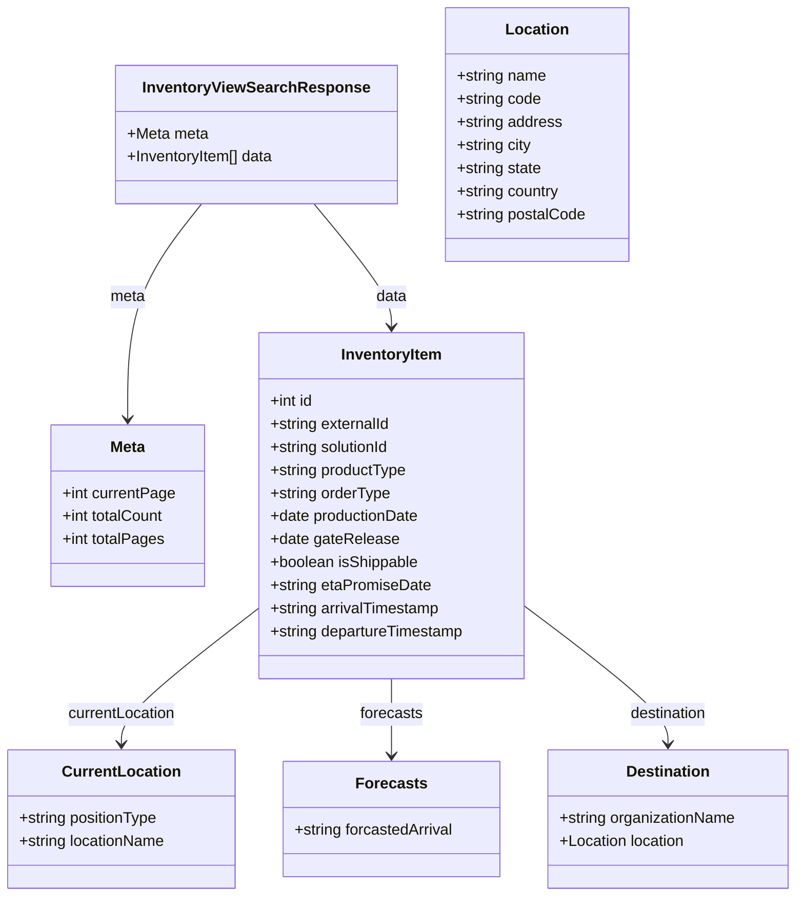

# Diagram: entity_core/entity_service/entity_workflow/docs/Inventory-OpenAPI-Spec.yml


> Auto-generated by Obscura crawlers

## Diagram 1

```mermaid
flowchart LR
  Client[Client] -->|HTTP GET| Search[/search]
  Search --> Filters[Filters: lifeCycleState, productType, productType:isNull, productType:isNotNull, inventoryLocationId, isShippable, entityId, forecastedArrivalDateType, forecastedArrivalDateFrom, forecastedArrivalDateTo, currentPositionType, currentPositionLocationCode, currentPositionLocationCode:isNotNull, productionDateFrom, productionDateTo, timeOnSiteFrom, timeOnSiteTo, destinationLocationCode, destinationLocationCode:isNull, destinationLocationCode:isNotNull, initialETAFrom, initialETATo, carrier, carrier:isNull, carrier:isNotNull, arrivalDateFrom, arrivalDateTo, departureDateFrom, departureDateTo, sortColumn, pageNumber, pageSize]
  Search --> Response200[200 OK\nInventoryViewSearchResponse]
  Search --> Response400[400 Bad Request]
  Search --> Response403[403 Forbidden]
  Response200 --> Meta[meta]
  Response200 --> Data[data[]]
  Data --> InventoryItem[InventoryItem]
  InventoryItem --> CurrentLocation[CurrentLocation]
  InventoryItem --> Forecasts[Forecasts]
  InventoryItem --> Destination[Destination]
  Destination --> DestinationLocation[Location]
```

> SVG rendering failed for this diagram.

## Diagram 2



### SVG

<svg id="container" width="833.3828125" xmlns="http://www.w3.org/2000/svg" class="classDiagram" height="932" viewBox="0 0 833.3828125 932" role="graphics-document document" aria-roledescription="class"><style>#container{font-family:"trebuchet ms",verdana,arial,sans-serif;font-size:16px;fill:#333;}@keyframes edge-animation-frame{from{stroke-dashoffset:0;}}@keyframes dash{to{stroke-dashoffset:0;}}#container .edge-animation-slow{stroke-dasharray:9,5!important;stroke-dashoffset:900;animation:dash 50s linear infinite;stroke-linecap:round;}#container .edge-animation-fast{stroke-dasharray:9,5!important;stroke-dashoffset:900;animation:dash 20s linear infinite;stroke-linecap:round;}#container .error-icon{fill:#552222;}#container .error-text{fill:#552222;stroke:#552222;}#container .edge-thickness-normal{stroke-width:1px;}#container .edge-thickness-thick{stroke-width:3.5px;}#container .edge-pattern-solid{stroke-dasharray:0;}#container .edge-thickness-invisible{stroke-width:0;fill:none;}#container .edge-pattern-dashed{stroke-dasharray:3;}#container .edge-pattern-dotted{stroke-dasharray:2;}#container .marker{fill:#333333;stroke:#333333;}#container .marker.cross{stroke:#333333;}#container svg{font-family:"trebuchet ms",verdana,arial,sans-serif;font-size:16px;}#container p{margin:0;}#container g.classGroup text{fill:#9370DB;stroke:none;font-family:"trebuchet ms",verdana,arial,sans-serif;font-size:10px;}#container g.classGroup text .title{font-weight:bolder;}#container .nodeLabel,#container .edgeLabel{color:#131300;}#container .edgeLabel .label rect{fill:#ECECFF;}#container .label text{fill:#131300;}#container .labelBkg{background:#ECECFF;}#container .edgeLabel .label span{background:#ECECFF;}#container .classTitle{font-weight:bolder;}#container .node rect,#container .node circle,#container .node ellipse,#container .node polygon,#container .node path{fill:#ECECFF;stroke:#9370DB;stroke-width:1px;}#container .divider{stroke:#9370DB;stroke-width:1;}#container g.clickable{cursor:pointer;}#container g.classGroup rect{fill:#ECECFF;stroke:#9370DB;}#container g.classGroup line{stroke:#9370DB;stroke-width:1;}#container .classLabel .box{stroke:none;stroke-width:0;fill:#ECECFF;opacity:0.5;}#container .classLabel .label{fill:#9370DB;font-size:10px;}#container .relation{stroke:#333333;stroke-width:1;fill:none;}#container .dashed-line{stroke-dasharray:3;}#container .dotted-line{stroke-dasharray:1 2;}#container #compositionStart,#container .composition{fill:#333333!important;stroke:#333333!important;stroke-width:1;}#container #compositionEnd,#container .composition{fill:#333333!important;stroke:#333333!important;stroke-width:1;}#container #dependencyStart,#container .dependency{fill:#333333!important;stroke:#333333!important;stroke-width:1;}#container #dependencyStart,#container .dependency{fill:#333333!important;stroke:#333333!important;stroke-width:1;}#container #extensionStart,#container .extension{fill:transparent!important;stroke:#333333!important;stroke-width:1;}#container #extensionEnd,#container .extension{fill:transparent!important;stroke:#333333!important;stroke-width:1;}#container #aggregationStart,#container .aggregation{fill:transparent!important;stroke:#333333!important;stroke-width:1;}#container #aggregationEnd,#container .aggregation{fill:transparent!important;stroke:#333333!important;stroke-width:1;}#container #lollipopStart,#container .lollipop{fill:#ECECFF!important;stroke:#333333!important;stroke-width:1;}#container #lollipopEnd,#container .lollipop{fill:#ECECFF!important;stroke:#333333!important;stroke-width:1;}#container .edgeTerminals{font-size:11px;line-height:initial;}#container .classTitleText{text-anchor:middle;font-size:18px;fill:#333;}#container .label-icon{display:inline-block;height:1em;overflow:visible;vertical-align:-0.125em;}#container .node .label-icon path{fill:currentColor;stroke:revert;stroke-width:revert;}#container :root{--mermaid-font-family:"trebuchet ms",verdana,arial,sans-serif;}</style><g><defs><marker id="container_class-aggregationStart" class="marker aggregation class" refX="18" refY="7" markerWidth="190" markerHeight="240" orient="auto"><path d="M 18,7 L9,13 L1,7 L9,1 Z"></path></marker></defs><defs><marker id="container_class-aggregationEnd" class="marker aggregation class" refX="1" refY="7" markerWidth="20" markerHeight="28" orient="auto"><path d="M 18,7 L9,13 L1,7 L9,1 Z"></path></marker></defs><defs><marker id="container_class-extensionStart" class="marker extension class" refX="18" refY="7" markerWidth="190" markerHeight="240" orient="auto"><path d="M 1,7 L18,13 V 1 Z"></path></marker></defs><defs><marker id="container_class-extensionEnd" class="marker extension class" refX="1" refY="7" markerWidth="20" markerHeight="28" orient="auto"><path d="M 1,1 V 13 L18,7 Z"></path></marker></defs><defs><marker id="container_class-compositionStart" class="marker composition class" refX="18" refY="7" markerWidth="190" markerHeight="240" orient="auto"><path d="M 18,7 L9,13 L1,7 L9,1 Z"></path></marker></defs><defs><marker id="container_class-compositionEnd" class="marker composition class" refX="1" refY="7" markerWidth="20" markerHeight="28" orient="auto"><path d="M 18,7 L9,13 L1,7 L9,1 Z"></path></marker></defs><defs><marker id="container_class-dependencyStart" class="marker dependency class" refX="6" refY="7" markerWidth="190" markerHeight="240" orient="auto"><path d="M 5,7 L9,13 L1,7 L9,1 Z"></path></marker></defs><defs><marker id="container_class-dependencyEnd" class="marker dependency class" refX="13" refY="7" markerWidth="20" markerHeight="28" orient="auto"><path d="M 18,7 L9,13 L14,7 L9,1 Z"></path></marker></defs><defs><marker id="container_class-lollipopStart" class="marker lollipop class" refX="13" refY="7" markerWidth="190" markerHeight="240" orient="auto"><circle stroke="black" fill="transparent" cx="7" cy="7" r="6"></circle></marker></defs><defs><marker id="container_class-lollipopEnd" class="marker lollipop class" refX="1" refY="7" markerWidth="190" markerHeight="240" orient="auto"><circle stroke="black" fill="transparent" cx="7" cy="7" r="6"></circle></marker></defs><g class="root"><g class="clusters"></g><g class="edgePaths"><path d="M210.333,212L197.374,228.167C184.416,244.333,158.499,276.667,145.541,314C132.582,351.333,132.582,393.667,132.582,414.833L132.582,436" id="id_InventoryViewSearchResponse_Meta_1" class="edge-thickness-normal edge-pattern-solid relation" style=";;;" data-edge="true" data-et="edge" data-id="id_InventoryViewSearchResponse_Meta_1" data-points="W3sieCI6MjEwLjMzMjkyMTEzNTM1NTA0LCJ5IjoyMTJ9LHsieCI6MTMyLjU4MjAzMTI1LCJ5IjozMDl9LHsieCI6MTMyLjU4MjAzMTI1LCJ5Ijo0NDJ9XQ==" marker-end="url(#container_class-dependencyEnd)"></path><path d="M328.183,212L341.687,228.167C355.19,244.333,382.197,276.667,395.7,298C409.203,319.333,409.203,329.667,409.203,334.833L409.203,340" id="id_InventoryViewSearchResponse_InventoryItem_2" class="edge-thickness-normal edge-pattern-solid relation" style=";;;" data-edge="true" data-et="edge" data-id="id_InventoryViewSearchResponse_InventoryItem_2" data-points="W3sieCI6MzI4LjE4MzMyNzk0MDA4ODc2LCJ5IjoyMTJ9LHsieCI6NDA5LjIwMzEyNSwieSI6MzA5fSx7IngiOjQwOS4yMDMxMjUsInkiOjM0Nn1d" marker-end="url(#container_class-dependencyEnd)"></path><path d="M268.414,634.216L244.826,652.347C221.238,670.478,174.063,706.739,150.475,730.036C126.887,753.333,126.887,763.667,126.887,768.833L126.887,774" id="id_InventoryItem_CurrentLocation_3" class="edge-thickness-normal edge-pattern-solid relation" style=";;;" data-edge="true" data-et="edge" data-id="id_InventoryItem_CurrentLocation_3" data-points="W3sieCI6MjY4LjQxNDA2MjUsInkiOjYzNC4yMTYyNjMzMzQ4NTUzfSx7IngiOjEyNi44ODY3MTg3NSwieSI6NzQzfSx7IngiOjEyNi44ODY3MTg3NSwieSI6NzgwfV0=" marker-end="url(#container_class-dependencyEnd)"></path><path d="M409.203,706L409.203,712.167C409.203,718.333,409.203,730.667,409.203,744C409.203,757.333,409.203,771.667,409.203,778.833L409.203,786" id="id_InventoryItem_Forecasts_4" class="edge-thickness-normal edge-pattern-solid relation" style=";;;" data-edge="true" data-et="edge" data-id="id_InventoryItem_Forecasts_4" data-points="W3sieCI6NDA5LjIwMzEyNSwieSI6NzA2fSx7IngiOjQwOS4yMDMxMjUsInkiOjc0M30seyJ4Ijo0MDkuMjAzMTI1LCJ5Ijo3OTJ9XQ==" marker-end="url(#container_class-dependencyEnd)"></path><path d="M549.992,631.42L574.828,650.017C599.664,668.613,649.336,705.807,674.172,729.57C699.008,753.333,699.008,763.667,699.008,768.833L699.008,774" id="id_InventoryItem_Destination_5" class="edge-thickness-normal edge-pattern-solid relation" style=";;;" data-edge="true" data-et="edge" data-id="id_InventoryItem_Destination_5" data-points="W3sieCI6NTQ5Ljk5MjE4NzUsInkiOjYzMS40MjAwNTY2MTE0MDMyfSx7IngiOjY5OS4wMDc4MTI1LCJ5Ijo3NDN9LHsieCI6Njk5LjAwNzgxMjUsInkiOjc4MH1d" marker-end="url(#container_class-dependencyEnd)"></path></g><g class="edgeLabels"><g class="edgeLabel" transform="translate(132.58203125, 309)"><g class="label" data-id="id_InventoryViewSearchResponse_Meta_1" transform="translate(-18.40625, -12)"><foreignObject width="36.8125" height="24"><div xmlns="http://www.w3.org/1999/xhtml" class="labelBkg" style="display: table-cell; white-space: nowrap; line-height: 1.5; max-width: 200px; text-align: center;"><span class="edgeLabel"><p>meta</p></span></div></foreignObject></g></g><g class="edgeLabel" transform="translate(409.203125, 309)"><g class="label" data-id="id_InventoryViewSearchResponse_InventoryItem_2" transform="translate(-16.3203125, -12)"><foreignObject width="32.640625" height="24"><div xmlns="http://www.w3.org/1999/xhtml" class="labelBkg" style="display: table-cell; white-space: nowrap; line-height: 1.5; max-width: 200px; text-align: center;"><span class="edgeLabel"><p>data</p></span></div></foreignObject></g></g><g class="edgeLabel" transform="translate(126.88671875, 743)"><g class="label" data-id="id_InventoryItem_CurrentLocation_3" transform="translate(-57.328125, -12)"><foreignObject width="114.65625" height="24"><div xmlns="http://www.w3.org/1999/xhtml" class="labelBkg" style="display: table-cell; white-space: nowrap; line-height: 1.5; max-width: 200px; text-align: center;"><span class="edgeLabel"><p>currentLocation</p></span></div></foreignObject></g></g><g class="edgeLabel" transform="translate(409.203125, 743)"><g class="label" data-id="id_InventoryItem_Forecasts_4" transform="translate(-32.859375, -12)"><foreignObject width="65.71875" height="24"><div xmlns="http://www.w3.org/1999/xhtml" class="labelBkg" style="display: table-cell; white-space: nowrap; line-height: 1.5; max-width: 200px; text-align: center;"><span class="edgeLabel"><p>forecasts</p></span></div></foreignObject></g></g><g class="edgeLabel" transform="translate(699.0078125, 743)"><g class="label" data-id="id_InventoryItem_Destination_5" transform="translate(-41.5703125, -12)"><foreignObject width="83.140625" height="24"><div xmlns="http://www.w3.org/1999/xhtml" class="labelBkg" style="display: table-cell; white-space: nowrap; line-height: 1.5; max-width: 200px; text-align: center;"><span class="edgeLabel"><p>destination</p></span></div></foreignObject></g></g></g><g class="nodes"><g class="node default" id="classId-InventoryViewSearchResponse-0" transform="translate(268.044921875, 140)"><g class="basic label-container"><path d="M-146.51171875 -72 L146.51171875 -72 L146.51171875 72 L-146.51171875 72" stroke="none" stroke-width="0" fill="#ECECFF" style=""></path><path d="M-146.51171875 -72 C-48.04906571531191 -72, 50.41358731937618 -72, 146.51171875 -72 M-146.51171875 -72 C-74.97240748451593 -72, -3.433096219031853 -72, 146.51171875 -72 M146.51171875 -72 C146.51171875 -34.376447663318054, 146.51171875 3.247104673363893, 146.51171875 72 M146.51171875 -72 C146.51171875 -40.81543814315731, 146.51171875 -9.630876286314624, 146.51171875 72 M146.51171875 72 C29.460484385252215 72, -87.59074997949557 72, -146.51171875 72 M146.51171875 72 C51.15288213959832 72, -44.20595447080336 72, -146.51171875 72 M-146.51171875 72 C-146.51171875 29.711551991592167, -146.51171875 -12.576896016815667, -146.51171875 -72 M-146.51171875 72 C-146.51171875 37.174384828334624, -146.51171875 2.3487696566692478, -146.51171875 -72" stroke="#9370DB" stroke-width="1.3" fill="none" stroke-dasharray="0 0" style=""></path></g><g class="annotation-group text" transform="translate(0, -48)"></g><g class="label-group text" transform="translate(-112.3359375, -48)"><g class="label" style="font-weight: bolder" transform="translate(0,-12)"><foreignObject width="224.671875" height="24"><div xmlns="http://www.w3.org/1999/xhtml" style="display: table-cell; white-space: nowrap; line-height: 1.5; max-width: 271px; text-align: center;"><span class="nodeLabel markdown-node-label" style=""><p>InventoryViewSearchResponse</p></span></div></foreignObject></g></g><g class="members-group text" transform="translate(-134.51171875, 0)"><g class="label" style="" transform="translate(0,-12)"><foreignObject width="84.5625" height="24"><div xmlns="http://www.w3.org/1999/xhtml" style="display: table-cell; white-space: nowrap; line-height: 1.5; max-width: 142px; text-align: center;"><span class="nodeLabel markdown-node-label" style=""><p>+Meta meta</p></span></div></foreignObject></g><g class="label" style="" transform="translate(0,12)"><foreignObject width="156.6875" height="24"><div xmlns="http://www.w3.org/1999/xhtml" style="display: table-cell; white-space: nowrap; line-height: 1.5; max-width: 214px; text-align: center;"><span class="nodeLabel markdown-node-label" style=""><p>+InventoryItem[] data</p></span></div></foreignObject></g></g><g class="methods-group text" transform="translate(-134.51171875, 72)"></g><g class="divider" style=""><path d="M-146.51171875 -24 C-36.86464918522181 -24, 72.78242037955638 -24, 146.51171875 -24 M-146.51171875 -24 C-38.13533497775168 -24, 70.24104879449663 -24, 146.51171875 -24" stroke="#9370DB" stroke-width="1.3" fill="none" stroke-dasharray="0 0" style=""></path></g><g class="divider" style=""><path d="M-146.51171875 48 C-63.694074034977575 48, 19.12357068004485 48, 146.51171875 48 M-146.51171875 48 C-80.55341599543667 48, -14.595113240873332 48, 146.51171875 48" stroke="#9370DB" stroke-width="1.3" fill="none" stroke-dasharray="0 0" style=""></path></g></g><g class="node default" id="classId-Meta-1" transform="translate(132.58203125, 526)"><g class="basic label-container"><path d="M-80.13671875 -84 L80.13671875 -84 L80.13671875 84 L-80.13671875 84" stroke="none" stroke-width="0" fill="#ECECFF" style=""></path><path d="M-80.13671875 -84 C-18.040720401766215 -84, 44.05527794646757 -84, 80.13671875 -84 M-80.13671875 -84 C-25.98069484743195 -84, 28.175329055136103 -84, 80.13671875 -84 M80.13671875 -84 C80.13671875 -30.48109556015877, 80.13671875 23.03780887968246, 80.13671875 84 M80.13671875 -84 C80.13671875 -44.02461309637477, 80.13671875 -4.049226192749543, 80.13671875 84 M80.13671875 84 C36.34901564412784 84, -7.438687461744323 84, -80.13671875 84 M80.13671875 84 C42.440001649800486 84, 4.743284549600972 84, -80.13671875 84 M-80.13671875 84 C-80.13671875 38.2286236102901, -80.13671875 -7.5427527794198, -80.13671875 -84 M-80.13671875 84 C-80.13671875 34.86528315353533, -80.13671875 -14.26943369292934, -80.13671875 -84" stroke="#9370DB" stroke-width="1.3" fill="none" stroke-dasharray="0 0" style=""></path></g><g class="annotation-group text" transform="translate(0, -60)"></g><g class="label-group text" transform="translate(-18.0859375, -60)"><g class="label" style="font-weight: bolder" transform="translate(0,-12)"><foreignObject width="36.171875" height="24"><div xmlns="http://www.w3.org/1999/xhtml" style="display: table-cell; white-space: nowrap; line-height: 1.5; max-width: 86px; text-align: center;"><span class="nodeLabel markdown-node-label" style=""><p>Meta</p></span></div></foreignObject></g></g><g class="members-group text" transform="translate(-68.13671875, -12)"><g class="label" style="" transform="translate(0,-12)"><foreignObject width="118.1875" height="24"><div xmlns="http://www.w3.org/1999/xhtml" style="display: table-cell; white-space: nowrap; line-height: 1.5; max-width: 176px; text-align: center;"><span class="nodeLabel markdown-node-label" style=""><p>+int currentPage</p></span></div></foreignObject></g><g class="label" style="" transform="translate(0,12)"><foreignObject width="108.125" height="24"><div xmlns="http://www.w3.org/1999/xhtml" style="display: table-cell; white-space: nowrap; line-height: 1.5; max-width: 166px; text-align: center;"><span class="nodeLabel markdown-node-label" style=""><p>+int totalCount</p></span></div></foreignObject></g><g class="label" style="" transform="translate(0,36)"><foreignObject width="106.890625" height="24"><div xmlns="http://www.w3.org/1999/xhtml" style="display: table-cell; white-space: nowrap; line-height: 1.5; max-width: 164px; text-align: center;"><span class="nodeLabel markdown-node-label" style=""><p>+int totalPages</p></span></div></foreignObject></g></g><g class="methods-group text" transform="translate(-68.13671875, 84)"></g><g class="divider" style=""><path d="M-80.13671875 -36 C-18.88830780591227 -36, 42.36010313817546 -36, 80.13671875 -36 M-80.13671875 -36 C-23.831866490104588 -36, 32.472985769790824 -36, 80.13671875 -36" stroke="#9370DB" stroke-width="1.3" fill="none" stroke-dasharray="0 0" style=""></path></g><g class="divider" style=""><path d="M-80.13671875 60 C-29.607875884816302 60, 20.920966980367396 60, 80.13671875 60 M-80.13671875 60 C-40.024227555819984 60, 0.08826363836003281 60, 80.13671875 60" stroke="#9370DB" stroke-width="1.3" fill="none" stroke-dasharray="0 0" style=""></path></g></g><g class="node default" id="classId-InventoryItem-2" transform="translate(409.203125, 526)"><g class="basic label-container"><path d="M-140.7890625 -180 L140.7890625 -180 L140.7890625 180 L-140.7890625 180" stroke="none" stroke-width="0" fill="#ECECFF" style=""></path><path d="M-140.7890625 -180 C-73.3029658241099 -180, -5.8168691482198085 -180, 140.7890625 -180 M-140.7890625 -180 C-37.94807324515163 -180, 64.89291600969673 -180, 140.7890625 -180 M140.7890625 -180 C140.7890625 -105.70400922481373, 140.7890625 -31.408018449627463, 140.7890625 180 M140.7890625 -180 C140.7890625 -61.43705133459774, 140.7890625 57.12589733080452, 140.7890625 180 M140.7890625 180 C60.510347518284036 180, -19.76836746343193 180, -140.7890625 180 M140.7890625 180 C45.11569207975768 180, -50.55767834048464 180, -140.7890625 180 M-140.7890625 180 C-140.7890625 77.30776692412795, -140.7890625 -25.384466151744107, -140.7890625 -180 M-140.7890625 180 C-140.7890625 91.94936528811985, -140.7890625 3.8987305762397, -140.7890625 -180" stroke="#9370DB" stroke-width="1.3" fill="none" stroke-dasharray="0 0" style=""></path></g><g class="annotation-group text" transform="translate(0, -156)"></g><g class="label-group text" transform="translate(-51.421875, -156)"><g class="label" style="font-weight: bolder" transform="translate(0,-12)"><foreignObject width="102.84375" height="24"><div xmlns="http://www.w3.org/1999/xhtml" style="display: table-cell; white-space: nowrap; line-height: 1.5; max-width: 152px; text-align: center;"><span class="nodeLabel markdown-node-label" style=""><p>InventoryItem</p></span></div></foreignObject></g></g><g class="members-group text" transform="translate(-128.7890625, -108)"><g class="label" style="" transform="translate(0,-12)"><foreignObject width="45.96875" height="24"><div xmlns="http://www.w3.org/1999/xhtml" style="display: table-cell; white-space: nowrap; line-height: 1.5; max-width: 103px; text-align: center;"><span class="nodeLabel markdown-node-label" style=""><p>+int id</p></span></div></foreignObject></g><g class="label" style="" transform="translate(0,12)"><foreignObject width="127.53125" height="24"><div xmlns="http://www.w3.org/1999/xhtml" style="display: table-cell; white-space: nowrap; line-height: 1.5; max-width: 185px; text-align: center;"><span class="nodeLabel markdown-node-label" style=""><p>+string externalId</p></span></div></foreignObject></g><g class="label" style="" transform="translate(0,36)"><foreignObject width="127.96875" height="24"><div xmlns="http://www.w3.org/1999/xhtml" style="display: table-cell; white-space: nowrap; line-height: 1.5; max-width: 185px; text-align: center;"><span class="nodeLabel markdown-node-label" style=""><p>+string solutionId</p></span></div></foreignObject></g><g class="label" style="" transform="translate(0,60)"><foreignObject width="144.4375" height="24"><div xmlns="http://www.w3.org/1999/xhtml" style="display: table-cell; white-space: nowrap; line-height: 1.5; max-width: 202px; text-align: center;"><span class="nodeLabel markdown-node-label" style=""><p>+string productType</p></span></div></foreignObject></g><g class="label" style="" transform="translate(0,84)"><foreignObject width="127.09375" height="24"><div xmlns="http://www.w3.org/1999/xhtml" style="display: table-cell; white-space: nowrap; line-height: 1.5; max-width: 184px; text-align: center;"><span class="nodeLabel markdown-node-label" style=""><p>+string orderType</p></span></div></foreignObject></g><g class="label" style="" transform="translate(0,108)"><foreignObject width="157.9375" height="24"><div xmlns="http://www.w3.org/1999/xhtml" style="display: table-cell; white-space: nowrap; line-height: 1.5; max-width: 215px; text-align: center;"><span class="nodeLabel markdown-node-label" style=""><p>+date productionDate</p></span></div></foreignObject></g><g class="label" style="" transform="translate(0,132)"><foreignObject width="131.796875" height="24"><div xmlns="http://www.w3.org/1999/xhtml" style="display: table-cell; white-space: nowrap; line-height: 1.5; max-width: 189px; text-align: center;"><span class="nodeLabel markdown-node-label" style=""><p>+date gateRelease</p></span></div></foreignObject></g><g class="label" style="" transform="translate(0,156)"><foreignObject width="156.640625" height="24"><div xmlns="http://www.w3.org/1999/xhtml" style="display: table-cell; white-space: nowrap; line-height: 1.5; max-width: 214px; text-align: center;"><span class="nodeLabel markdown-node-label" style=""><p>+boolean isShippable</p></span></div></foreignObject></g><g class="label" style="" transform="translate(0,180)"><foreignObject width="168.484375" height="24"><div xmlns="http://www.w3.org/1999/xhtml" style="display: table-cell; white-space: nowrap; line-height: 1.5; max-width: 226px; text-align: center;"><span class="nodeLabel markdown-node-label" style=""><p>+string etaPromiseDate</p></span></div></foreignObject></g><g class="label" style="" transform="translate(0,204)"><foreignObject width="180.546875" height="24"><div xmlns="http://www.w3.org/1999/xhtml" style="display: table-cell; white-space: nowrap; line-height: 1.5; max-width: 238px; text-align: center;"><span class="nodeLabel markdown-node-label" style=""><p>+string arrivalTimestamp</p></span></div></foreignObject></g><g class="label" style="" transform="translate(0,228)"><foreignObject width="206.15625" height="24"><div xmlns="http://www.w3.org/1999/xhtml" style="display: table-cell; white-space: nowrap; line-height: 1.5; max-width: 264px; text-align: center;"><span class="nodeLabel markdown-node-label" style=""><p>+string departureTimestamp</p></span></div></foreignObject></g></g><g class="methods-group text" transform="translate(-128.7890625, 180)"></g><g class="divider" style=""><path d="M-140.7890625 -132 C-70.07359283542688 -132, 0.6418768291462413 -132, 140.7890625 -132 M-140.7890625 -132 C-51.54924609545331 -132, 37.690570309093374 -132, 140.7890625 -132" stroke="#9370DB" stroke-width="1.3" fill="none" stroke-dasharray="0 0" style=""></path></g><g class="divider" style=""><path d="M-140.7890625 156 C-34.2846153308854 156, 72.2198318382292 156, 140.7890625 156 M-140.7890625 156 C-49.56407298389166 156, 41.660916532216675 156, 140.7890625 156" stroke="#9370DB" stroke-width="1.3" fill="none" stroke-dasharray="0 0" style=""></path></g></g><g class="node default" id="classId-CurrentLocation-3" transform="translate(126.88671875, 852)"><g class="basic label-container"><path d="M-118.88671875 -72 L118.88671875 -72 L118.88671875 72 L-118.88671875 72" stroke="none" stroke-width="0" fill="#ECECFF" style=""></path><path d="M-118.88671875 -72 C-29.547424077402795 -72, 59.79187059519441 -72, 118.88671875 -72 M-118.88671875 -72 C-41.981066810858195 -72, 34.92458512828361 -72, 118.88671875 -72 M118.88671875 -72 C118.88671875 -34.00265886510992, 118.88671875 3.9946822697801565, 118.88671875 72 M118.88671875 -72 C118.88671875 -30.45141675791602, 118.88671875 11.097166484167957, 118.88671875 72 M118.88671875 72 C50.23132416539542 72, -18.42407041920916 72, -118.88671875 72 M118.88671875 72 C45.24712354956934 72, -28.392471650861324 72, -118.88671875 72 M-118.88671875 72 C-118.88671875 29.569513916362588, -118.88671875 -12.860972167274824, -118.88671875 -72 M-118.88671875 72 C-118.88671875 25.847326500987343, -118.88671875 -20.305346998025314, -118.88671875 -72" stroke="#9370DB" stroke-width="1.3" fill="none" stroke-dasharray="0 0" style=""></path></g><g class="annotation-group text" transform="translate(0, -48)"></g><g class="label-group text" transform="translate(-58.6953125, -48)"><g class="label" style="font-weight: bolder" transform="translate(0,-12)"><foreignObject width="117.390625" height="24"><div xmlns="http://www.w3.org/1999/xhtml" style="display: table-cell; white-space: nowrap; line-height: 1.5; max-width: 166px; text-align: center;"><span class="nodeLabel markdown-node-label" style=""><p>CurrentLocation</p></span></div></foreignObject></g></g><g class="members-group text" transform="translate(-106.88671875, 0)"><g class="label" style="" transform="translate(0,-12)"><foreignObject width="147.4375" height="24"><div xmlns="http://www.w3.org/1999/xhtml" style="display: table-cell; white-space: nowrap; line-height: 1.5; max-width: 205px; text-align: center;"><span class="nodeLabel markdown-node-label" style=""><p>+string positionType</p></span></div></foreignObject></g><g class="label" style="" transform="translate(0,12)"><foreignObject width="155.078125" height="24"><div xmlns="http://www.w3.org/1999/xhtml" style="display: table-cell; white-space: nowrap; line-height: 1.5; max-width: 212px; text-align: center;"><span class="nodeLabel markdown-node-label" style=""><p>+string locationName</p></span></div></foreignObject></g></g><g class="methods-group text" transform="translate(-106.88671875, 72)"></g><g class="divider" style=""><path d="M-118.88671875 -24 C-37.98735797410963 -24, 42.912002801780744 -24, 118.88671875 -24 M-118.88671875 -24 C-33.1697769692402 -24, 52.54716481151959 -24, 118.88671875 -24" stroke="#9370DB" stroke-width="1.3" fill="none" stroke-dasharray="0 0" style=""></path></g><g class="divider" style=""><path d="M-118.88671875 48 C-32.98536017754677 48, 52.91599839490647 48, 118.88671875 48 M-118.88671875 48 C-56.13357515415778 48, 6.619568441684436 48, 118.88671875 48" stroke="#9370DB" stroke-width="1.3" fill="none" stroke-dasharray="0 0" style=""></path></g></g><g class="node default" id="classId-Forecasts-4" transform="translate(409.203125, 852)"><g class="basic label-container"><path d="M-113.4296875 -60 L113.4296875 -60 L113.4296875 60 L-113.4296875 60" stroke="none" stroke-width="0" fill="#ECECFF" style=""></path><path d="M-113.4296875 -60 C-30.560231222655148 -60, 52.309225054689705 -60, 113.4296875 -60 M-113.4296875 -60 C-24.089427478936642 -60, 65.25083254212672 -60, 113.4296875 -60 M113.4296875 -60 C113.4296875 -35.09493269617059, 113.4296875 -10.189865392341169, 113.4296875 60 M113.4296875 -60 C113.4296875 -31.77749998460238, 113.4296875 -3.554999969204758, 113.4296875 60 M113.4296875 60 C60.713366083901235 60, 7.99704466780247 60, -113.4296875 60 M113.4296875 60 C26.848799094579064 60, -59.73208931084187 60, -113.4296875 60 M-113.4296875 60 C-113.4296875 31.368118228418076, -113.4296875 2.736236456836153, -113.4296875 -60 M-113.4296875 60 C-113.4296875 17.339950833936527, -113.4296875 -25.320098332126946, -113.4296875 -60" stroke="#9370DB" stroke-width="1.3" fill="none" stroke-dasharray="0 0" style=""></path></g><g class="annotation-group text" transform="translate(0, -36)"></g><g class="label-group text" transform="translate(-34.546875, -36)"><g class="label" style="font-weight: bolder" transform="translate(0,-12)"><foreignObject width="69.09375" height="24"><div xmlns="http://www.w3.org/1999/xhtml" style="display: table-cell; white-space: nowrap; line-height: 1.5; max-width: 118px; text-align: center;"><span class="nodeLabel markdown-node-label" style=""><p>Forecasts</p></span></div></foreignObject></g></g><g class="members-group text" transform="translate(-101.4296875, 12)"><g class="label" style="" transform="translate(0,-12)"><foreignObject width="168.3125" height="24"><div xmlns="http://www.w3.org/1999/xhtml" style="display: table-cell; white-space: nowrap; line-height: 1.5; max-width: 226px; text-align: center;"><span class="nodeLabel markdown-node-label" style=""><p>+string forcastedArrival</p></span></div></foreignObject></g></g><g class="methods-group text" transform="translate(-101.4296875, 60)"></g><g class="divider" style=""><path d="M-113.4296875 -12 C-31.231496695447987 -12, 50.966694109104026 -12, 113.4296875 -12 M-113.4296875 -12 C-40.54897482712518 -12, 32.33173784574964 -12, 113.4296875 -12" stroke="#9370DB" stroke-width="1.3" fill="none" stroke-dasharray="0 0" style=""></path></g><g class="divider" style=""><path d="M-113.4296875 36 C-24.01509162647659 36, 65.39950424704682 36, 113.4296875 36 M-113.4296875 36 C-35.988059373574316 36, 41.45356875285137 36, 113.4296875 36" stroke="#9370DB" stroke-width="1.3" fill="none" stroke-dasharray="0 0" style=""></path></g></g><g class="node default" id="classId-Destination-5" transform="translate(699.0078125, 852)"><g class="basic label-container"><path d="M-126.375 -72 L126.375 -72 L126.375 72 L-126.375 72" stroke="none" stroke-width="0" fill="#ECECFF" style=""></path><path d="M-126.375 -72 C-54.17039518658143 -72, 18.03420962683714 -72, 126.375 -72 M-126.375 -72 C-38.76427517237421 -72, 48.846449655251575 -72, 126.375 -72 M126.375 -72 C126.375 -41.80349794273202, 126.375 -11.606995885464045, 126.375 72 M126.375 -72 C126.375 -17.092718302263904, 126.375 37.81456339547219, 126.375 72 M126.375 72 C70.13964541949116 72, 13.90429083898232 72, -126.375 72 M126.375 72 C49.47936656609669 72, -27.416266867806627 72, -126.375 72 M-126.375 72 C-126.375 33.60253114625211, -126.375 -4.794937707495777, -126.375 -72 M-126.375 72 C-126.375 23.49290555121955, -126.375 -25.0141888975609, -126.375 -72" stroke="#9370DB" stroke-width="1.3" fill="none" stroke-dasharray="0 0" style=""></path></g><g class="annotation-group text" transform="translate(0, -48)"></g><g class="label-group text" transform="translate(-42.46875, -48)"><g class="label" style="font-weight: bolder" transform="translate(0,-12)"><foreignObject width="84.9375" height="24"><div xmlns="http://www.w3.org/1999/xhtml" style="display: table-cell; white-space: nowrap; line-height: 1.5; max-width: 134px; text-align: center;"><span class="nodeLabel markdown-node-label" style=""><p>Destination</p></span></div></foreignObject></g></g><g class="members-group text" transform="translate(-114.375, 0)"><g class="label" style="" transform="translate(0,-12)"><foreignObject width="186.28125" height="24"><div xmlns="http://www.w3.org/1999/xhtml" style="display: table-cell; white-space: nowrap; line-height: 1.5; max-width: 244px; text-align: center;"><span class="nodeLabel markdown-node-label" style=""><p>+string organizationName</p></span></div></foreignObject></g><g class="label" style="" transform="translate(0,12)"><foreignObject width="133.5" height="24"><div xmlns="http://www.w3.org/1999/xhtml" style="display: table-cell; white-space: nowrap; line-height: 1.5; max-width: 191px; text-align: center;"><span class="nodeLabel markdown-node-label" style=""><p>+Location location</p></span></div></foreignObject></g></g><g class="methods-group text" transform="translate(-114.375, 72)"></g><g class="divider" style=""><path d="M-126.375 -24 C-60.42653791411222 -24, 5.5219241717755665 -24, 126.375 -24 M-126.375 -24 C-50.20595851028631 -24, 25.963082979427384 -24, 126.375 -24" stroke="#9370DB" stroke-width="1.3" fill="none" stroke-dasharray="0 0" style=""></path></g><g class="divider" style=""><path d="M-126.375 48 C-64.27564542596187 48, -2.1762908519237527 48, 126.375 48 M-126.375 48 C-59.52258906378471 48, 7.3298218724305855 48, 126.375 48" stroke="#9370DB" stroke-width="1.3" fill="none" stroke-dasharray="0 0" style=""></path></g></g><g class="node default" id="classId-Location-6" transform="translate(559.912109375, 140)"><g class="basic label-container"><path d="M-95.35546875 -132 L95.35546875 -132 L95.35546875 132 L-95.35546875 132" stroke="none" stroke-width="0" fill="#ECECFF" style=""></path><path d="M-95.35546875 -132 C-36.94043819025391 -132, 21.474592369492186 -132, 95.35546875 -132 M-95.35546875 -132 C-33.91604561759429 -132, 27.523377514811415 -132, 95.35546875 -132 M95.35546875 -132 C95.35546875 -53.5836697796849, 95.35546875 24.832660440630207, 95.35546875 132 M95.35546875 -132 C95.35546875 -44.185485171935696, 95.35546875 43.62902965612861, 95.35546875 132 M95.35546875 132 C30.696047557501828 132, -33.963373634996344 132, -95.35546875 132 M95.35546875 132 C37.02963758181626 132, -21.29619358636748 132, -95.35546875 132 M-95.35546875 132 C-95.35546875 36.45346708592838, -95.35546875 -59.09306582814324, -95.35546875 -132 M-95.35546875 132 C-95.35546875 65.79591494454372, -95.35546875 -0.4081701109125504, -95.35546875 -132" stroke="#9370DB" stroke-width="1.3" fill="none" stroke-dasharray="0 0" style=""></path></g><g class="annotation-group text" transform="translate(0, -108)"></g><g class="label-group text" transform="translate(-31.3515625, -108)"><g class="label" style="font-weight: bolder" transform="translate(0,-12)"><foreignObject width="62.703125" height="24"><div xmlns="http://www.w3.org/1999/xhtml" style="display: table-cell; white-space: nowrap; line-height: 1.5; max-width: 112px; text-align: center;"><span class="nodeLabel markdown-node-label" style=""><p>Location</p></span></div></foreignObject></g></g><g class="members-group text" transform="translate(-83.35546875, -60)"><g class="label" style="" transform="translate(0,-12)"><foreignObject width="94.375" height="24"><div xmlns="http://www.w3.org/1999/xhtml" style="display: table-cell; white-space: nowrap; line-height: 1.5; max-width: 152px; text-align: center;"><span class="nodeLabel markdown-node-label" style=""><p>+string name</p></span></div></foreignObject></g><g class="label" style="" transform="translate(0,12)"><foreignObject width="88.828125" height="24"><div xmlns="http://www.w3.org/1999/xhtml" style="display: table-cell; white-space: nowrap; line-height: 1.5; max-width: 146px; text-align: center;"><span class="nodeLabel markdown-node-label" style=""><p>+string code</p></span></div></foreignObject></g><g class="label" style="" transform="translate(0,36)"><foreignObject width="110.90625" height="24"><div xmlns="http://www.w3.org/1999/xhtml" style="display: table-cell; white-space: nowrap; line-height: 1.5; max-width: 168px; text-align: center;"><span class="nodeLabel markdown-node-label" style=""><p>+string address</p></span></div></foreignObject></g><g class="label" style="" transform="translate(0,60)"><foreignObject width="79.59375" height="24"><div xmlns="http://www.w3.org/1999/xhtml" style="display: table-cell; white-space: nowrap; line-height: 1.5; max-width: 137px; text-align: center;"><span class="nodeLabel markdown-node-label" style=""><p>+string city</p></span></div></foreignObject></g><g class="label" style="" transform="translate(0,84)"><foreignObject width="89.953125" height="24"><div xmlns="http://www.w3.org/1999/xhtml" style="display: table-cell; white-space: nowrap; line-height: 1.5; max-width: 147px; text-align: center;"><span class="nodeLabel markdown-node-label" style=""><p>+string state</p></span></div></foreignObject></g><g class="label" style="" transform="translate(0,108)"><foreignObject width="109.046875" height="24"><div xmlns="http://www.w3.org/1999/xhtml" style="display: table-cell; white-space: nowrap; line-height: 1.5; max-width: 167px; text-align: center;"><span class="nodeLabel markdown-node-label" style=""><p>+string country</p></span></div></foreignObject></g><g class="label" style="" transform="translate(0,132)"><foreignObject width="135.359375" height="24"><div xmlns="http://www.w3.org/1999/xhtml" style="display: table-cell; white-space: nowrap; line-height: 1.5; max-width: 193px; text-align: center;"><span class="nodeLabel markdown-node-label" style=""><p>+string postalCode</p></span></div></foreignObject></g></g><g class="methods-group text" transform="translate(-83.35546875, 132)"></g><g class="divider" style=""><path d="M-95.35546875 -84 C-35.564634686553624 -84, 24.22619937689275 -84, 95.35546875 -84 M-95.35546875 -84 C-42.9781736826664 -84, 9.399121384667197 -84, 95.35546875 -84" stroke="#9370DB" stroke-width="1.3" fill="none" stroke-dasharray="0 0" style=""></path></g><g class="divider" style=""><path d="M-95.35546875 108 C-52.33716582783404 108, -9.318862905668084 108, 95.35546875 108 M-95.35546875 108 C-51.87770362710759 108, -8.399938504215186 108, 95.35546875 108" stroke="#9370DB" stroke-width="1.3" fill="none" stroke-dasharray="0 0" style=""></path></g></g></g></g></g></svg>
