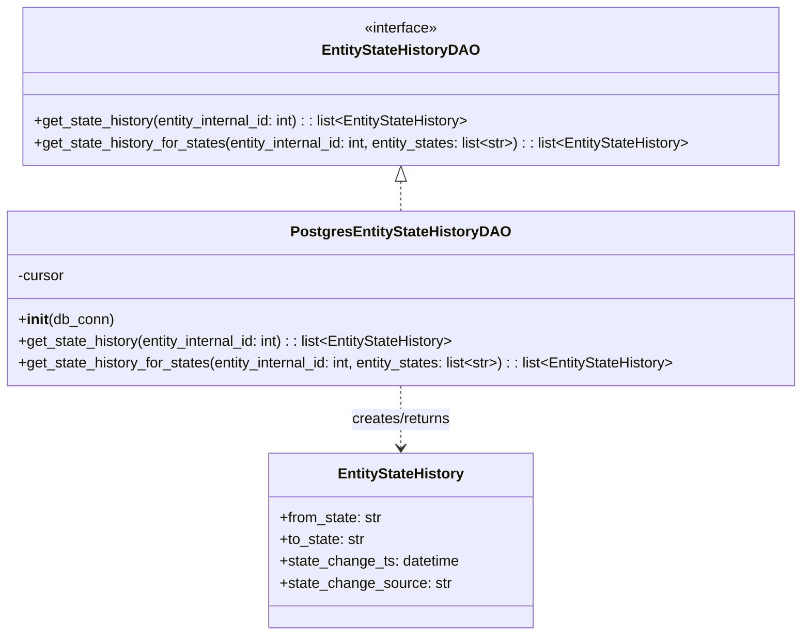

# Diagram: entity_core/entity_service/entity_workflow/entity_workflow_service/db/dao/entity_state_history_dao.py


> Auto-generated by Obscura crawlers

## Diagram 1



### SVG

<svg id="container" width="890.4375" xmlns="http://www.w3.org/2000/svg" class="classDiagram" height="698" viewBox="0 0 890.4375 698" role="graphics-document document" aria-roledescription="class"><style>#container{font-family:"trebuchet ms",verdana,arial,sans-serif;font-size:16px;fill:#333;}@keyframes edge-animation-frame{from{stroke-dashoffset:0;}}@keyframes dash{to{stroke-dashoffset:0;}}#container .edge-animation-slow{stroke-dasharray:9,5!important;stroke-dashoffset:900;animation:dash 50s linear infinite;stroke-linecap:round;}#container .edge-animation-fast{stroke-dasharray:9,5!important;stroke-dashoffset:900;animation:dash 20s linear infinite;stroke-linecap:round;}#container .error-icon{fill:#552222;}#container .error-text{fill:#552222;stroke:#552222;}#container .edge-thickness-normal{stroke-width:1px;}#container .edge-thickness-thick{stroke-width:3.5px;}#container .edge-pattern-solid{stroke-dasharray:0;}#container .edge-thickness-invisible{stroke-width:0;fill:none;}#container .edge-pattern-dashed{stroke-dasharray:3;}#container .edge-pattern-dotted{stroke-dasharray:2;}#container .marker{fill:#333333;stroke:#333333;}#container .marker.cross{stroke:#333333;}#container svg{font-family:"trebuchet ms",verdana,arial,sans-serif;font-size:16px;}#container p{margin:0;}#container g.classGroup text{fill:#9370DB;stroke:none;font-family:"trebuchet ms",verdana,arial,sans-serif;font-size:10px;}#container g.classGroup text .title{font-weight:bolder;}#container .nodeLabel,#container .edgeLabel{color:#131300;}#container .edgeLabel .label rect{fill:#ECECFF;}#container .label text{fill:#131300;}#container .labelBkg{background:#ECECFF;}#container .edgeLabel .label span{background:#ECECFF;}#container .classTitle{font-weight:bolder;}#container .node rect,#container .node circle,#container .node ellipse,#container .node polygon,#container .node path{fill:#ECECFF;stroke:#9370DB;stroke-width:1px;}#container .divider{stroke:#9370DB;stroke-width:1;}#container g.clickable{cursor:pointer;}#container g.classGroup rect{fill:#ECECFF;stroke:#9370DB;}#container g.classGroup line{stroke:#9370DB;stroke-width:1;}#container .classLabel .box{stroke:none;stroke-width:0;fill:#ECECFF;opacity:0.5;}#container .classLabel .label{fill:#9370DB;font-size:10px;}#container .relation{stroke:#333333;stroke-width:1;fill:none;}#container .dashed-line{stroke-dasharray:3;}#container .dotted-line{stroke-dasharray:1 2;}#container #compositionStart,#container .composition{fill:#333333!important;stroke:#333333!important;stroke-width:1;}#container #compositionEnd,#container .composition{fill:#333333!important;stroke:#333333!important;stroke-width:1;}#container #dependencyStart,#container .dependency{fill:#333333!important;stroke:#333333!important;stroke-width:1;}#container #dependencyStart,#container .dependency{fill:#333333!important;stroke:#333333!important;stroke-width:1;}#container #extensionStart,#container .extension{fill:transparent!important;stroke:#333333!important;stroke-width:1;}#container #extensionEnd,#container .extension{fill:transparent!important;stroke:#333333!important;stroke-width:1;}#container #aggregationStart,#container .aggregation{fill:transparent!important;stroke:#333333!important;stroke-width:1;}#container #aggregationEnd,#container .aggregation{fill:transparent!important;stroke:#333333!important;stroke-width:1;}#container #lollipopStart,#container .lollipop{fill:#ECECFF!important;stroke:#333333!important;stroke-width:1;}#container #lollipopEnd,#container .lollipop{fill:#ECECFF!important;stroke:#333333!important;stroke-width:1;}#container .edgeTerminals{font-size:11px;line-height:initial;}#container .classTitleText{text-anchor:middle;font-size:18px;fill:#333;}#container .label-icon{display:inline-block;height:1em;overflow:visible;vertical-align:-0.125em;}#container .node .label-icon path{fill:currentColor;stroke:revert;stroke-width:revert;}#container :root{--mermaid-font-family:"trebuchet ms",verdana,arial,sans-serif;}</style><g><defs><marker id="container_class-aggregationStart" class="marker aggregation class" refX="18" refY="7" markerWidth="190" markerHeight="240" orient="auto"><path d="M 18,7 L9,13 L1,7 L9,1 Z"></path></marker></defs><defs><marker id="container_class-aggregationEnd" class="marker aggregation class" refX="1" refY="7" markerWidth="20" markerHeight="28" orient="auto"><path d="M 18,7 L9,13 L1,7 L9,1 Z"></path></marker></defs><defs><marker id="container_class-extensionStart" class="marker extension class" refX="18" refY="7" markerWidth="190" markerHeight="240" orient="auto"><path d="M 1,7 L18,13 V 1 Z"></path></marker></defs><defs><marker id="container_class-extensionEnd" class="marker extension class" refX="1" refY="7" markerWidth="20" markerHeight="28" orient="auto"><path d="M 1,1 V 13 L18,7 Z"></path></marker></defs><defs><marker id="container_class-compositionStart" class="marker composition class" refX="18" refY="7" markerWidth="190" markerHeight="240" orient="auto"><path d="M 18,7 L9,13 L1,7 L9,1 Z"></path></marker></defs><defs><marker id="container_class-compositionEnd" class="marker composition class" refX="1" refY="7" markerWidth="20" markerHeight="28" orient="auto"><path d="M 18,7 L9,13 L1,7 L9,1 Z"></path></marker></defs><defs><marker id="container_class-dependencyStart" class="marker dependency class" refX="6" refY="7" markerWidth="190" markerHeight="240" orient="auto"><path d="M 5,7 L9,13 L1,7 L9,1 Z"></path></marker></defs><defs><marker id="container_class-dependencyEnd" class="marker dependency class" refX="13" refY="7" markerWidth="20" markerHeight="28" orient="auto"><path d="M 18,7 L9,13 L14,7 L9,1 Z"></path></marker></defs><defs><marker id="container_class-lollipopStart" class="marker lollipop class" refX="13" refY="7" markerWidth="190" markerHeight="240" orient="auto"><circle stroke="black" fill="transparent" cx="7" cy="7" r="6"></circle></marker></defs><defs><marker id="container_class-lollipopEnd" class="marker lollipop class" refX="1" refY="7" markerWidth="190" markerHeight="240" orient="auto"><circle stroke="black" fill="transparent" cx="7" cy="7" r="6"></circle></marker></defs><g class="root"><g class="clusters"></g><g class="edgePaths"><path d="M445.219,199.25L445.219,200.542C445.219,201.833,445.219,204.417,445.219,209.875C445.219,215.333,445.219,223.667,445.219,227.833L445.219,232" id="id_EntityStateHistoryDAO_PostgresEntityStateHistoryDAO_1" class="edge-thickness-normal edge-pattern-dashed relation" style=";;;" data-edge="true" data-et="edge" data-id="id_EntityStateHistoryDAO_PostgresEntityStateHistoryDAO_1" data-points="W3sieCI6NDQ1LjIxODc1LCJ5IjoxODJ9LHsieCI6NDQ1LjIxODc1LCJ5IjoyMDd9LHsieCI6NDQ1LjIxODc1LCJ5IjoyMzJ9XQ==" marker-start="url(#container_class-extensionStart)"></path><path d="M445.219,424L445.219,430.167C445.219,436.333,445.219,448.667,445.219,460C445.219,471.333,445.219,481.667,445.219,486.833L445.219,492" id="id_PostgresEntityStateHistoryDAO_EntityStateHistory_2" class="edge-thickness-normal edge-pattern-dashed relation" style=";;;" data-edge="true" data-et="edge" data-id="id_PostgresEntityStateHistoryDAO_EntityStateHistory_2" data-points="W3sieCI6NDQ1LjIxODc1LCJ5Ijo0MjR9LHsieCI6NDQ1LjIxODc1LCJ5Ijo0NjF9LHsieCI6NDQ1LjIxODc1LCJ5Ijo0OTh9XQ==" marker-end="url(#container_class-dependencyEnd)"></path></g><g class="edgeLabels"><g class="edgeLabel"><g class="label" data-id="id_EntityStateHistoryDAO_PostgresEntityStateHistoryDAO_1" transform="translate(0, 0)"><foreignObject width="0" height="0"><div xmlns="http://www.w3.org/1999/xhtml" class="labelBkg" style="display: table-cell; white-space: nowrap; line-height: 1.5; max-width: 200px; text-align: center;"><span class="edgeLabel"></span></div></foreignObject></g></g><g class="edgeLabel" transform="translate(445.21875, 461)"><g class="label" data-id="id_PostgresEntityStateHistoryDAO_EntityStateHistory_2" transform="translate(-56.359375, -12)"><foreignObject width="112.71875" height="24"><div xmlns="http://www.w3.org/1999/xhtml" class="labelBkg" style="display: table-cell; white-space: nowrap; line-height: 1.5; max-width: 200px; text-align: center;"><span class="edgeLabel"><p>creates/returns</p></span></div></foreignObject></g></g></g><g class="nodes"><g class="node default" id="classId-EntityStateHistory-0" transform="translate(445.21875, 594)"><g class="basic label-container"><path d="M-144.4609375 -96 L144.4609375 -96 L144.4609375 96 L-144.4609375 96" stroke="none" stroke-width="0" fill="#ECECFF" style=""></path><path d="M-144.4609375 -96 C-39.34670107791351 -96, 65.76753534417298 -96, 144.4609375 -96 M-144.4609375 -96 C-66.52650293193744 -96, 11.407931636125113 -96, 144.4609375 -96 M144.4609375 -96 C144.4609375 -48.352543045431766, 144.4609375 -0.7050860908635315, 144.4609375 96 M144.4609375 -96 C144.4609375 -31.537878091792578, 144.4609375 32.924243816414844, 144.4609375 96 M144.4609375 96 C44.181997487774964 96, -56.09694252445007 96, -144.4609375 96 M144.4609375 96 C60.22844265064211 96, -24.004052198715783 96, -144.4609375 96 M-144.4609375 96 C-144.4609375 57.12712288743689, -144.4609375 18.25424577487378, -144.4609375 -96 M-144.4609375 96 C-144.4609375 56.85651903827111, -144.4609375 17.71303807654222, -144.4609375 -96" stroke="#9370DB" stroke-width="1.3" fill="none" stroke-dasharray="0 0" style=""></path></g><g class="annotation-group text" transform="translate(0, -72)"></g><g class="label-group text" transform="translate(-67.015625, -72)"><g class="label" style="font-weight: bolder" transform="translate(0,-12)"><foreignObject width="134.03125" height="24"><div xmlns="http://www.w3.org/1999/xhtml" style="display: table-cell; white-space: nowrap; line-height: 1.5; max-width: 181px; text-align: center;"><span class="nodeLabel markdown-node-label" style=""><p>EntityStateHistory</p></span></div></foreignObject></g></g><g class="members-group text" transform="translate(-132.4609375, -24)"><g class="label" style="" transform="translate(0,-12)"><foreignObject width="113.78125" height="24"><div xmlns="http://www.w3.org/1999/xhtml" style="display: table-cell; white-space: nowrap; line-height: 1.5; max-width: 172px; text-align: center;"><span class="nodeLabel markdown-node-label" style=""><p>+from_state: str</p></span></div></foreignObject></g><g class="label" style="" transform="translate(0,12)"><foreignObject width="94.390625" height="24"><div xmlns="http://www.w3.org/1999/xhtml" style="display: table-cell; white-space: nowrap; line-height: 1.5; max-width: 153px; text-align: center;"><span class="nodeLabel markdown-node-label" style=""><p>+to_state: str</p></span></div></foreignObject></g><g class="label" style="" transform="translate(0,36)"><foreignObject width="197.90625" height="24"><div xmlns="http://www.w3.org/1999/xhtml" style="display: table-cell; white-space: nowrap; line-height: 1.5; max-width: 255px; text-align: center;"><span class="nodeLabel markdown-node-label" style=""><p>+state_change_ts: datetime</p></span></div></foreignObject></g><g class="label" style="" transform="translate(0,60)"><foreignObject width="187.03125" height="24"><div xmlns="http://www.w3.org/1999/xhtml" style="display: table-cell; white-space: nowrap; line-height: 1.5; max-width: 245px; text-align: center;"><span class="nodeLabel markdown-node-label" style=""><p>+state_change_source: str</p></span></div></foreignObject></g></g><g class="methods-group text" transform="translate(-132.4609375, 96)"></g><g class="divider" style=""><path d="M-144.4609375 -48 C-74.41756823454236 -48, -4.374198969084716 -48, 144.4609375 -48 M-144.4609375 -48 C-67.83551376866886 -48, 8.789909962662279 -48, 144.4609375 -48" stroke="#9370DB" stroke-width="1.3" fill="none" stroke-dasharray="0 0" style=""></path></g><g class="divider" style=""><path d="M-144.4609375 72 C-84.46769019919101 72, -24.474442898382023 72, 144.4609375 72 M-144.4609375 72 C-54.89689703479168 72, 34.667143430416644 72, 144.4609375 72" stroke="#9370DB" stroke-width="1.3" fill="none" stroke-dasharray="0 0" style=""></path></g></g><g class="node default" id="classId-EntityStateHistoryDAO-1" transform="translate(445.21875, 95)"><g class="basic label-container"><path d="M-421.35546875 -87 L421.35546875 -87 L421.35546875 87 L-421.35546875 87" stroke="none" stroke-width="0" fill="#ECECFF" style=""></path><path d="M-421.35546875 -87 C-111.99047027418612 -87, 197.37452820162775 -87, 421.35546875 -87 M-421.35546875 -87 C-133.34567447677347 -87, 154.66411979645306 -87, 421.35546875 -87 M421.35546875 -87 C421.35546875 -47.53594866747739, 421.35546875 -8.071897334954784, 421.35546875 87 M421.35546875 -87 C421.35546875 -21.475999173097335, 421.35546875 44.04800165380533, 421.35546875 87 M421.35546875 87 C92.09028674251442 87, -237.17489526497116 87, -421.35546875 87 M421.35546875 87 C113.22708425891926 87, -194.90130023216147 87, -421.35546875 87 M-421.35546875 87 C-421.35546875 26.945967134791587, -421.35546875 -33.108065730416826, -421.35546875 -87 M-421.35546875 87 C-421.35546875 46.67936394694916, -421.35546875 6.358727893898319, -421.35546875 -87" stroke="#9370DB" stroke-width="1.3" fill="none" stroke-dasharray="0 0" style=""></path></g><g class="annotation-group text" transform="translate(-41.015625, -63)"><g class="label" style="" transform="translate(0,-12)"><foreignObject width="82.03125" height="24"><div xmlns="http://www.w3.org/1999/xhtml" style="display: table-cell; white-space: nowrap; line-height: 1.5; max-width: 132px; text-align: center;"><span class="nodeLabel markdown-node-label" style=""><p>«interface»</p></span></div></foreignObject></g></g><g class="label-group text" transform="translate(-82.3046875, -39)"><g class="label" style="font-weight: bolder" transform="translate(0,-12)"><foreignObject width="164.609375" height="24"><div xmlns="http://www.w3.org/1999/xhtml" style="display: table-cell; white-space: nowrap; line-height: 1.5; max-width: 211px; text-align: center;"><span class="nodeLabel markdown-node-label" style=""><p>EntityStateHistoryDAO</p></span></div></foreignObject></g></g><g class="members-group text" transform="translate(-409.35546875, 9)"></g><g class="methods-group text" transform="translate(-409.35546875, 39)"><g class="label" style="" transform="translate(0,-12)"><foreignObject width="490.109375" height="24"><div xmlns="http://www.w3.org/1999/xhtml" style="display: table-cell; white-space: nowrap; line-height: 1.5; max-width: 587px; text-align: center;"><span class="nodeLabel markdown-node-label" style=""><p>+get_state_history(entity_internal_id: int) : : list&lt;EntityStateHistory&gt;</p></span></div></foreignObject></g><g class="label" style="" transform="translate(0,12)"><foreignObject width="736.40625" height="24"><div xmlns="http://www.w3.org/1999/xhtml" style="display: table-cell; white-space: nowrap; line-height: 1.5; max-width: 873px; text-align: center;"><span class="nodeLabel markdown-node-label" style=""><p>+get_state_history_for_states(entity_internal_id: int, entity_states: list&lt;str&gt;) : : list&lt;EntityStateHistory&gt;</p></span></div></foreignObject></g></g><g class="divider" style=""><path d="M-421.35546875 -15 C-235.00412158698535 -15, -48.6527744239707 -15, 421.35546875 -15 M-421.35546875 -15 C-131.26535017845947 -15, 158.82476839308106 -15, 421.35546875 -15" stroke="#9370DB" stroke-width="1.3" fill="none" stroke-dasharray="0 0" style=""></path></g><g class="divider" style=""><path d="M-421.35546875 9 C-171.27974380184264 9, 78.79598114631472 9, 421.35546875 9 M-421.35546875 9 C-245.42523970170757 9, -69.49501065341514 9, 421.35546875 9" stroke="#9370DB" stroke-width="1.3" fill="none" stroke-dasharray="0 0" style=""></path></g></g><g class="node default" id="classId-PostgresEntityStateHistoryDAO-2" transform="translate(445.21875, 328)"><g class="basic label-container"><path d="M-437.21875 -96 L437.21875 -96 L437.21875 96 L-437.21875 96" stroke="none" stroke-width="0" fill="#ECECFF" style=""></path><path d="M-437.21875 -96 C-133.2693307517397 -96, 170.68008849652063 -96, 437.21875 -96 M-437.21875 -96 C-157.55549169912655 -96, 122.1077666017469 -96, 437.21875 -96 M437.21875 -96 C437.21875 -21.554101237363767, 437.21875 52.891797525272466, 437.21875 96 M437.21875 -96 C437.21875 -29.109413681111278, 437.21875 37.781172637777445, 437.21875 96 M437.21875 96 C112.29854657779407 96, -212.62165684441186 96, -437.21875 96 M437.21875 96 C173.825707761574 96, -89.56733447685201 96, -437.21875 96 M-437.21875 96 C-437.21875 53.92421679608506, -437.21875 11.848433592170124, -437.21875 -96 M-437.21875 96 C-437.21875 37.15001399907172, -437.21875 -21.699972001856565, -437.21875 -96" stroke="#9370DB" stroke-width="1.3" fill="none" stroke-dasharray="0 0" style=""></path></g><g class="annotation-group text" transform="translate(0, -72)"></g><g class="label-group text" transform="translate(-114.03125, -72)"><g class="label" style="font-weight: bolder" transform="translate(0,-12)"><foreignObject width="228.0625" height="24"><div xmlns="http://www.w3.org/1999/xhtml" style="display: table-cell; white-space: nowrap; line-height: 1.5; max-width: 272px; text-align: center;"><span class="nodeLabel markdown-node-label" style=""><p>PostgresEntityStateHistoryDAO</p></span></div></foreignObject></g></g><g class="members-group text" transform="translate(-425.21875, -24)"><g class="label" style="" transform="translate(0,-12)"><foreignObject width="52.1875" height="24"><div xmlns="http://www.w3.org/1999/xhtml" style="display: table-cell; white-space: nowrap; line-height: 1.5; max-width: 110px; text-align: center;"><span class="nodeLabel markdown-node-label" style=""><p>-cursor</p></span></div></foreignObject></g></g><g class="methods-group text" transform="translate(-425.21875, 24)"><g class="label" style="" transform="translate(0,-12)"><foreignObject width="104.96875" height="24"><div xmlns="http://www.w3.org/1999/xhtml" style="display: table-cell; white-space: nowrap; line-height: 1.5; max-width: 194px; text-align: center;"><span class="nodeLabel markdown-node-label" style=""><p>+<strong>init</strong>(db_conn)</p></span></div></foreignObject></g><g class="label" style="" transform="translate(0,12)"><foreignObject width="490.109375" height="24"><div xmlns="http://www.w3.org/1999/xhtml" style="display: table-cell; white-space: nowrap; line-height: 1.5; max-width: 587px; text-align: center;"><span class="nodeLabel markdown-node-label" style=""><p>+get_state_history(entity_internal_id: int) : : list&lt;EntityStateHistory&gt;</p></span></div></foreignObject></g><g class="label" style="" transform="translate(0,36)"><foreignObject width="736.40625" height="24"><div xmlns="http://www.w3.org/1999/xhtml" style="display: table-cell; white-space: nowrap; line-height: 1.5; max-width: 873px; text-align: center;"><span class="nodeLabel markdown-node-label" style=""><p>+get_state_history_for_states(entity_internal_id: int, entity_states: list&lt;str&gt;) : : list&lt;EntityStateHistory&gt;</p></span></div></foreignObject></g></g><g class="divider" style=""><path d="M-437.21875 -48 C-241.18034658469296 -48, -45.14194316938591 -48, 437.21875 -48 M-437.21875 -48 C-176.52561095057365 -48, 84.1675280988527 -48, 437.21875 -48" stroke="#9370DB" stroke-width="1.3" fill="none" stroke-dasharray="0 0" style=""></path></g><g class="divider" style=""><path d="M-437.21875 0 C-146.02063278086746 0, 145.17748443826508 0, 437.21875 0 M-437.21875 0 C-135.27217045238507 0, 166.67440909522986 0, 437.21875 0" stroke="#9370DB" stroke-width="1.3" fill="none" stroke-dasharray="0 0" style=""></path></g></g></g></g></g></svg>

## Diagram 2

```mermaid
flowchart LR
Init[__init__(db_conn)] --> Conn[db_conn.establish_connection()]
Conn --> CursorCall[db_conn.get_cursor()]
CursorCall --> SetCursor[self.cursor = db_conn.get_cursor()]
SetCursor --> Get1[get_state_history(entity_internal_id)]
SetCursor --> Get2[get_state_history_for_states(entity_internal_id, entity_states)]
Get1 --> BuildQ1[build SQL query\n(WHERE entity_id = %(entity_id)s)]
BuildQ1 --> Exec1[self.cursor.execute(query, {entity_id: entity_internal_id})]
Exec1 --> Fetch1[records = self.cursor.fetchall()]
Fetch1 --> Cond1{records?}
Cond1 -- yes --> Map1[map records to EntityStateHistory instances\nusing pytz.utc.localize(state_change_ts)]
Cond1 -- no --> Empty1[return []]
Map1 --> Return1[return state_history_list]
Empty1 --> Return1
Get2 --> BuildQ2[build SQL query\n(WHERE entity_id = %(entity_id)s AND to_state in %(entity_states)s)]
BuildQ2 --> Exec2[self.cursor.execute(query, {entity_id: entity_internal_id, entity_states: tuple(entity_states)})]
Exec2 --> Fetch2[records = self.cursor.fetchall()]
Fetch2 --> Cond2{records?}
Cond2 -- yes --> Map2[map records to EntityStateHistory instances\nusing pytz.utc.localize(state_change_ts)]
Cond2 -- no --> Empty2[return []]
Map2 --> Return2[return state_history_list]
Empty2 --> Return2
```

> SVG rendering failed for this diagram.
