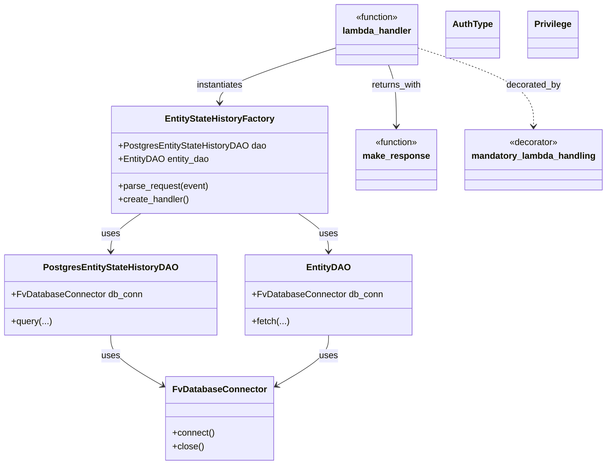

# Diagram: entity_core/entity_service/entity_workflow/entity_workflow_service/lambdas/entity_state_history.py


> Auto-generated by Obscura crawlers

## Diagram 1



> SVG rendering failed for this diagram.

## Diagram 2

```mermaid
flowchart TD
Evt[Incoming event]
Evt --> LH[lambda_handler(event, context, audit_ref)]
subgraph Auth
  AUTH_CHECK[AUTH_CHECK: AuthType.PRIVILEGE -> Privilege.VIEW_ENTITY]
end
subgraph Init
  DB_CONN[DB_CONN = FvDatabaseConnector("entity_state_history", SECRET, auto_connect=False)]
end
AUTH_CHECK -.-> LH
DB_CONN --> FactoryInit[EntityStateHistoryFactory(PostgresEntityStateHistoryDAO(DB_CONN), EntityDAO(DB_CONN))]
LH --> FactoryInit
FactoryInit --> Parse[factory.parse_request(event)]
Parse --> Request[request]
FactoryInit --> CreateHandler[factory.create_handler()]
CreateHandler --> Handler[handler]
Handler --> Handle[handler.handle(request)]
Handle --> Result[result]
Result --> Response[make_response(result)]
Response --> Return[HTTP response]
LH .. decorator .. mandatory_lambda_handling
```

> SVG rendering failed for this diagram.
