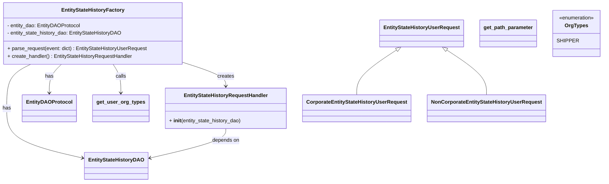

# Diagram: entity_core/entity_service/entity_workflow/entity_workflow_service/service/entity_state_history/factory.py


> Auto-generated by Obscura crawlers

## Diagram 1



### SVG

<svg id="container" width="1832.12109375" xmlns="http://www.w3.org/2000/svg" class="classDiagram" height="566" viewBox="0 0 1832.12109375 566" role="graphics-document document" aria-roledescription="class"><style>#container{font-family:"trebuchet ms",verdana,arial,sans-serif;font-size:16px;fill:#333;}@keyframes edge-animation-frame{from{stroke-dashoffset:0;}}@keyframes dash{to{stroke-dashoffset:0;}}#container .edge-animation-slow{stroke-dasharray:9,5!important;stroke-dashoffset:900;animation:dash 50s linear infinite;stroke-linecap:round;}#container .edge-animation-fast{stroke-dasharray:9,5!important;stroke-dashoffset:900;animation:dash 20s linear infinite;stroke-linecap:round;}#container .error-icon{fill:#552222;}#container .error-text{fill:#552222;stroke:#552222;}#container .edge-thickness-normal{stroke-width:1px;}#container .edge-thickness-thick{stroke-width:3.5px;}#container .edge-pattern-solid{stroke-dasharray:0;}#container .edge-thickness-invisible{stroke-width:0;fill:none;}#container .edge-pattern-dashed{stroke-dasharray:3;}#container .edge-pattern-dotted{stroke-dasharray:2;}#container .marker{fill:#333333;stroke:#333333;}#container .marker.cross{stroke:#333333;}#container svg{font-family:"trebuchet ms",verdana,arial,sans-serif;font-size:16px;}#container p{margin:0;}#container g.classGroup text{fill:#9370DB;stroke:none;font-family:"trebuchet ms",verdana,arial,sans-serif;font-size:10px;}#container g.classGroup text .title{font-weight:bolder;}#container .nodeLabel,#container .edgeLabel{color:#131300;}#container .edgeLabel .label rect{fill:#ECECFF;}#container .label text{fill:#131300;}#container .labelBkg{background:#ECECFF;}#container .edgeLabel .label span{background:#ECECFF;}#container .classTitle{font-weight:bolder;}#container .node rect,#container .node circle,#container .node ellipse,#container .node polygon,#container .node path{fill:#ECECFF;stroke:#9370DB;stroke-width:1px;}#container .divider{stroke:#9370DB;stroke-width:1;}#container g.clickable{cursor:pointer;}#container g.classGroup rect{fill:#ECECFF;stroke:#9370DB;}#container g.classGroup line{stroke:#9370DB;stroke-width:1;}#container .classLabel .box{stroke:none;stroke-width:0;fill:#ECECFF;opacity:0.5;}#container .classLabel .label{fill:#9370DB;font-size:10px;}#container .relation{stroke:#333333;stroke-width:1;fill:none;}#container .dashed-line{stroke-dasharray:3;}#container .dotted-line{stroke-dasharray:1 2;}#container #compositionStart,#container .composition{fill:#333333!important;stroke:#333333!important;stroke-width:1;}#container #compositionEnd,#container .composition{fill:#333333!important;stroke:#333333!important;stroke-width:1;}#container #dependencyStart,#container .dependency{fill:#333333!important;stroke:#333333!important;stroke-width:1;}#container #dependencyStart,#container .dependency{fill:#333333!important;stroke:#333333!important;stroke-width:1;}#container #extensionStart,#container .extension{fill:transparent!important;stroke:#333333!important;stroke-width:1;}#container #extensionEnd,#container .extension{fill:transparent!important;stroke:#333333!important;stroke-width:1;}#container #aggregationStart,#container .aggregation{fill:transparent!important;stroke:#333333!important;stroke-width:1;}#container #aggregationEnd,#container .aggregation{fill:transparent!important;stroke:#333333!important;stroke-width:1;}#container #lollipopStart,#container .lollipop{fill:#ECECFF!important;stroke:#333333!important;stroke-width:1;}#container #lollipopEnd,#container .lollipop{fill:#ECECFF!important;stroke:#333333!important;stroke-width:1;}#container .edgeTerminals{font-size:11px;line-height:initial;}#container .classTitleText{text-anchor:middle;font-size:18px;fill:#333;}#container .label-icon{display:inline-block;height:1em;overflow:visible;vertical-align:-0.125em;}#container .node .label-icon path{fill:currentColor;stroke:revert;stroke-width:revert;}#container :root{--mermaid-font-family:"trebuchet ms",verdana,arial,sans-serif;}</style><g><defs><marker id="container_class-aggregationStart" class="marker aggregation class" refX="18" refY="7" markerWidth="190" markerHeight="240" orient="auto"><path d="M 18,7 L9,13 L1,7 L9,1 Z"></path></marker></defs><defs><marker id="container_class-aggregationEnd" class="marker aggregation class" refX="1" refY="7" markerWidth="20" markerHeight="28" orient="auto"><path d="M 18,7 L9,13 L1,7 L9,1 Z"></path></marker></defs><defs><marker id="container_class-extensionStart" class="marker extension class" refX="18" refY="7" markerWidth="190" markerHeight="240" orient="auto"><path d="M 1,7 L18,13 V 1 Z"></path></marker></defs><defs><marker id="container_class-extensionEnd" class="marker extension class" refX="1" refY="7" markerWidth="20" markerHeight="28" orient="auto"><path d="M 1,1 V 13 L18,7 Z"></path></marker></defs><defs><marker id="container_class-compositionStart" class="marker composition class" refX="18" refY="7" markerWidth="190" markerHeight="240" orient="auto"><path d="M 18,7 L9,13 L1,7 L9,1 Z"></path></marker></defs><defs><marker id="container_class-compositionEnd" class="marker composition class" refX="1" refY="7" markerWidth="20" markerHeight="28" orient="auto"><path d="M 18,7 L9,13 L1,7 L9,1 Z"></path></marker></defs><defs><marker id="container_class-dependencyStart" class="marker dependency class" refX="6" refY="7" markerWidth="190" markerHeight="240" orient="auto"><path d="M 5,7 L9,13 L1,7 L9,1 Z"></path></marker></defs><defs><marker id="container_class-dependencyEnd" class="marker dependency class" refX="13" refY="7" markerWidth="20" markerHeight="28" orient="auto"><path d="M 18,7 L9,13 L14,7 L9,1 Z"></path></marker></defs><defs><marker id="container_class-lollipopStart" class="marker lollipop class" refX="13" refY="7" markerWidth="190" markerHeight="240" orient="auto"><circle stroke="black" fill="transparent" cx="7" cy="7" r="6"></circle></marker></defs><defs><marker id="container_class-lollipopEnd" class="marker lollipop class" refX="1" refY="7" markerWidth="190" markerHeight="240" orient="auto"><circle stroke="black" fill="transparent" cx="7" cy="7" r="6"></circle></marker></defs><g class="root"><g class="clusters"></g><g class="edgePaths"><path d="M99.2,200L87.246,206.167C75.291,212.333,51.382,224.667,39.427,247.5C27.473,270.333,27.473,303.667,27.473,337C27.473,370.333,27.473,403.667,65.921,429.514C104.368,455.362,181.264,473.725,219.712,482.906L258.16,492.087" id="id_EntityStateHistoryFactory_EntityStateHistoryDAO_1" class="edge-thickness-normal edge-pattern-solid relation" style=";;;" data-edge="true" data-et="edge" data-id="id_EntityStateHistoryFactory_EntityStateHistoryDAO_1" data-points="W3sieCI6OTkuMjAwMzY0MTkxNzI5MzQsInkiOjIwMH0seyJ4IjoyNy40NzI2NTYyNSwieSI6MjM3fSx7IngiOjI3LjQ3MjY1NjI1LCJ5IjozMzd9LHsieCI6MjcuNDcyNjU2MjUsInkiOjQzN30seyJ4IjoyNjMuOTk2MDkzNzUsInkiOjQ5My40ODA1NDEyNTUzNzI0M31d" marker-end="url(#container_class-dependencyEnd)"></path><path d="M190.796,200L184.725,206.167C178.655,212.333,166.513,224.667,160.442,239.5C154.371,254.333,154.371,271.667,154.371,280.333L154.371,289" id="id_EntityStateHistoryFactory_EntityDAOProtocol_2" class="edge-thickness-normal edge-pattern-solid relation" style=";;;" data-edge="true" data-et="edge" data-id="id_EntityStateHistoryFactory_EntityDAOProtocol_2" data-points="W3sieCI6MTkwLjc5NjIyODg1MzM4MzQ3LCJ5IjoyMDB9LHsieCI6MTU0LjM3MTA5Mzc1LCJ5IjoyMzd9LHsieCI6MTU0LjM3MTA5Mzc1LCJ5IjoyOTV9XQ==" marker-end="url(#container_class-dependencyEnd)"></path><path d="M344.445,200L348.244,206.167C352.043,212.333,359.64,224.667,363.439,239.5C367.238,254.333,367.238,271.667,367.238,280.333L367.238,289" id="id_EntityStateHistoryFactory_get_user_org_types_3" class="edge-thickness-normal edge-pattern-solid relation" style=";;;" data-edge="true" data-et="edge" data-id="id_EntityStateHistoryFactory_get_user_org_types_3" data-points="W3sieCI6MzQ0LjQ0NDcyNTA5Mzk4NDk3LCJ5IjoyMDB9LHsieCI6MzY3LjIzODI4MTI1LCJ5IjoyMzd9LHsieCI6MzY3LjIzODI4MTI1LCJ5IjoyOTV9XQ==" marker-end="url(#container_class-dependencyEnd)"></path><path d="M562.609,195.331L583.696,202.276C604.783,209.22,646.956,223.11,668.042,235.222C689.129,247.333,689.129,257.667,689.129,262.833L689.129,268" id="id_EntityStateHistoryFactory_EntityStateHistoryRequestHandler_4" class="edge-thickness-normal edge-pattern-solid relation" style=";;;" data-edge="true" data-et="edge" data-id="id_EntityStateHistoryFactory_EntityStateHistoryRequestHandler_4" data-points="W3sieCI6NTYyLjYwOTM3NSwieSI6MTk1LjMzMDYzNzc1MDQxMzUzfSx7IngiOjY4OS4xMjg5MDYyNSwieSI6MjM3fSx7IngiOjY4OS4xMjg5MDYyNSwieSI6Mjc0fV0=" marker-end="url(#container_class-dependencyEnd)"></path><path d="M689.129,400L689.129,406.167C689.129,412.333,689.129,424.667,650.681,440.014C612.233,455.362,535.337,473.725,496.889,482.906L458.441,492.087" id="id_EntityStateHistoryRequestHandler_EntityStateHistoryDAO_5" class="edge-thickness-normal edge-pattern-solid relation" style=";;;" data-edge="true" data-et="edge" data-id="id_EntityStateHistoryRequestHandler_EntityStateHistoryDAO_5" data-points="W3sieCI6Njg5LjEyODkwNjI1LCJ5Ijo0MDB9LHsieCI6Njg5LjEyODkwNjI1LCJ5Ijo0Mzd9LHsieCI6NDUyLjYwNTQ2ODc1LCJ5Ijo0OTMuNDgwNTQxMjU1MzcyNDN9XQ==" marker-end="url(#container_class-dependencyEnd)"></path><path d="M1208.196,155.741L1188.402,169.284C1168.608,182.827,1129.021,209.914,1109.227,233.123C1089.434,256.333,1089.434,275.667,1089.434,285.333L1089.434,295" id="id_EntityStateHistoryUserRequest_CorporateEntityStateHistoryUserRequest_6" class="edge-thickness-normal edge-pattern-solid relation" style=";;;" data-edge="true" data-et="edge" data-id="id_EntityStateHistoryUserRequest_CorporateEntityStateHistoryUserRequest_6" data-points="W3sieCI6MTIyMi40MzIzNjAxOTczNjgzLCJ5IjoxNDZ9LHsieCI6MTA4OS40MzM1OTM3NSwieSI6MjM3fSx7IngiOjEwODkuNDMzNTkzNzUsInkiOjI5NX1d" marker-start="url(#container_class-extensionStart)"></path><path d="M1359.437,155.741L1379.231,169.284C1399.024,182.827,1438.612,209.914,1458.406,233.123C1478.199,256.333,1478.199,275.667,1478.199,285.333L1478.199,295" id="id_EntityStateHistoryUserRequest_NonCorporateEntityStateHistoryUserRequest_7" class="edge-thickness-normal edge-pattern-solid relation" style=";;;" data-edge="true" data-et="edge" data-id="id_EntityStateHistoryUserRequest_NonCorporateEntityStateHistoryUserRequest_7" data-points="W3sieCI6MTM0NS4yMDA0NTIzMDI2MzE3LCJ5IjoxNDZ9LHsieCI6MTQ3OC4xOTkyMTg3NSwieSI6MjM3fSx7IngiOjE0NzguMTk5MjE4NzUsInkiOjI5NX1d" marker-start="url(#container_class-extensionStart)"></path></g><g class="edgeLabels"><g class="edgeLabel" transform="translate(27.47265625, 337)"><g class="label" data-id="id_EntityStateHistoryFactory_EntityStateHistoryDAO_1" transform="translate(-12.703125, -12)"><foreignObject width="25.40625" height="24"><div xmlns="http://www.w3.org/1999/xhtml" class="labelBkg" style="display: table-cell; white-space: nowrap; line-height: 1.5; max-width: 200px; text-align: center;"><span class="edgeLabel"><p>has</p></span></div></foreignObject></g></g><g class="edgeLabel" transform="translate(154.37109375, 237)"><g class="label" data-id="id_EntityStateHistoryFactory_EntityDAOProtocol_2" transform="translate(-12.703125, -12)"><foreignObject width="25.40625" height="24"><div xmlns="http://www.w3.org/1999/xhtml" class="labelBkg" style="display: table-cell; white-space: nowrap; line-height: 1.5; max-width: 200px; text-align: center;"><span class="edgeLabel"><p>has</p></span></div></foreignObject></g></g><g class="edgeLabel" transform="translate(367.23828125, 237)"><g class="label" data-id="id_EntityStateHistoryFactory_get_user_org_types_3" transform="translate(-16.4453125, -12)"><foreignObject width="32.890625" height="24"><div xmlns="http://www.w3.org/1999/xhtml" class="labelBkg" style="display: table-cell; white-space: nowrap; line-height: 1.5; max-width: 200px; text-align: center;"><span class="edgeLabel"><p>calls</p></span></div></foreignObject></g></g><g class="edgeLabel" transform="translate(689.12890625, 237)"><g class="label" data-id="id_EntityStateHistoryFactory_EntityStateHistoryRequestHandler_4" transform="translate(-26.171875, -12)"><foreignObject width="52.34375" height="24"><div xmlns="http://www.w3.org/1999/xhtml" class="labelBkg" style="display: table-cell; white-space: nowrap; line-height: 1.5; max-width: 200px; text-align: center;"><span class="edgeLabel"><p>creates</p></span></div></foreignObject></g></g><g class="edgeLabel" transform="translate(689.12890625, 437)"><g class="label" data-id="id_EntityStateHistoryRequestHandler_EntityStateHistoryDAO_5" transform="translate(-42.9453125, -12)"><foreignObject width="85.890625" height="24"><div xmlns="http://www.w3.org/1999/xhtml" class="labelBkg" style="display: table-cell; white-space: nowrap; line-height: 1.5; max-width: 200px; text-align: center;"><span class="edgeLabel"><p>depends on</p></span></div></foreignObject></g></g><g class="edgeLabel"><g class="label" data-id="id_EntityStateHistoryUserRequest_CorporateEntityStateHistoryUserRequest_6" transform="translate(0, 0)"><foreignObject width="0" height="0"><div xmlns="http://www.w3.org/1999/xhtml" class="labelBkg" style="display: table-cell; white-space: nowrap; line-height: 1.5; max-width: 200px; text-align: center;"><span class="edgeLabel"></span></div></foreignObject></g></g><g class="edgeLabel"><g class="label" data-id="id_EntityStateHistoryUserRequest_NonCorporateEntityStateHistoryUserRequest_7" transform="translate(0, 0)"><foreignObject width="0" height="0"><div xmlns="http://www.w3.org/1999/xhtml" class="labelBkg" style="display: table-cell; white-space: nowrap; line-height: 1.5; max-width: 200px; text-align: center;"><span class="edgeLabel"></span></div></foreignObject></g></g></g><g class="nodes"><g class="node default" id="classId-EntityStateHistoryFactory-0" transform="translate(285.3046875, 104)"><g class="basic label-container"><path d="M-277.3046875 -96 L277.3046875 -96 L277.3046875 96 L-277.3046875 96" stroke="none" stroke-width="0" fill="#ECECFF" style=""></path><path d="M-277.3046875 -96 C-73.67536127482191 -96, 129.95396495035618 -96, 277.3046875 -96 M-277.3046875 -96 C-75.61831388031575 -96, 126.0680597393685 -96, 277.3046875 -96 M277.3046875 -96 C277.3046875 -23.40593423769451, 277.3046875 49.18813152461098, 277.3046875 96 M277.3046875 -96 C277.3046875 -24.09232949125105, 277.3046875 47.8153410174979, 277.3046875 96 M277.3046875 96 C132.2087754692116 96, -12.887136561576824 96, -277.3046875 96 M277.3046875 96 C159.6212314467303 96, 41.93777539346061 96, -277.3046875 96 M-277.3046875 96 C-277.3046875 41.437001900349586, -277.3046875 -13.125996199300829, -277.3046875 -96 M-277.3046875 96 C-277.3046875 48.37649991501972, -277.3046875 0.7529998300394425, -277.3046875 -96" stroke="#9370DB" stroke-width="1.3" fill="none" stroke-dasharray="0 0" style=""></path></g><g class="annotation-group text" transform="translate(0, -72)"></g><g class="label-group text" transform="translate(-93.609375, -72)"><g class="label" style="font-weight: bolder" transform="translate(0,-12)"><foreignObject width="187.21875" height="24"><div xmlns="http://www.w3.org/1999/xhtml" style="display: table-cell; white-space: nowrap; line-height: 1.5; max-width: 233px; text-align: center;"><span class="nodeLabel markdown-node-label" style=""><p>EntityStateHistoryFactory</p></span></div></foreignObject></g></g><g class="members-group text" transform="translate(-265.3046875, -24)"><g class="label" style="" transform="translate(0,-12)"><foreignObject width="227.96875" height="24"><div xmlns="http://www.w3.org/1999/xhtml" style="display: table-cell; white-space: nowrap; line-height: 1.5; max-width: 286px; text-align: center;"><span class="nodeLabel markdown-node-label" style=""><p>- entity_dao: EntityDAOProtocol</p></span></div></foreignObject></g><g class="label" style="" transform="translate(0,12)"><foreignObject width="359.078125" height="24"><div xmlns="http://www.w3.org/1999/xhtml" style="display: table-cell; white-space: nowrap; line-height: 1.5; max-width: 416px; text-align: center;"><span class="nodeLabel markdown-node-label" style=""><p>- entity_state_history_dao: EntityStateHistoryDAO</p></span></div></foreignObject></g></g><g class="methods-group text" transform="translate(-265.3046875, 48)"><g class="label" style="" transform="translate(0,-12)"><foreignObject width="437" height="24"><div xmlns="http://www.w3.org/1999/xhtml" style="display: table-cell; white-space: nowrap; line-height: 1.5; max-width: 495px; text-align: center;"><span class="nodeLabel markdown-node-label" style=""><p>+ parse_request(event: dict) : EntityStateHistoryUserRequest</p></span></div></foreignObject></g><g class="label" style="" transform="translate(0,12)"><foreignObject width="392.125" height="24"><div xmlns="http://www.w3.org/1999/xhtml" style="display: table-cell; white-space: nowrap; line-height: 1.5; max-width: 450px; text-align: center;"><span class="nodeLabel markdown-node-label" style=""><p>+ create_handler() : EntityStateHistoryRequestHandler</p></span></div></foreignObject></g></g><g class="divider" style=""><path d="M-277.3046875 -48 C-155.66491999547864 -48, -34.02515249095728 -48, 277.3046875 -48 M-277.3046875 -48 C-138.86223462672564 -48, -0.4197817534512751 -48, 277.3046875 -48" stroke="#9370DB" stroke-width="1.3" fill="none" stroke-dasharray="0 0" style=""></path></g><g class="divider" style=""><path d="M-277.3046875 24 C-152.00305512305977 24, -26.701422746119533 24, 277.3046875 24 M-277.3046875 24 C-129.44773462690233 24, 18.409218246195337 24, 277.3046875 24" stroke="#9370DB" stroke-width="1.3" fill="none" stroke-dasharray="0 0" style=""></path></g></g><g class="node default" id="classId-EntityStateHistoryDAO-1" transform="translate(358.30078125, 516)"><g class="basic label-container"><path d="M-94.3046875 -42 L94.3046875 -42 L94.3046875 42 L-94.3046875 42" stroke="none" stroke-width="0" fill="#ECECFF" style=""></path><path d="M-94.3046875 -42 C-44.876909564802126 -42, 4.550868370395747 -42, 94.3046875 -42 M-94.3046875 -42 C-23.65297654553156 -42, 46.99873440893688 -42, 94.3046875 -42 M94.3046875 -42 C94.3046875 -23.956857456546405, 94.3046875 -5.913714913092811, 94.3046875 42 M94.3046875 -42 C94.3046875 -15.00825565657465, 94.3046875 11.983488686850698, 94.3046875 42 M94.3046875 42 C50.688787953322176 42, 7.072888406644353 42, -94.3046875 42 M94.3046875 42 C29.783906699080845 42, -34.73687410183831 42, -94.3046875 42 M-94.3046875 42 C-94.3046875 14.591580492191664, -94.3046875 -12.816839015616672, -94.3046875 -42 M-94.3046875 42 C-94.3046875 19.351627590386645, -94.3046875 -3.29674481922671, -94.3046875 -42" stroke="#9370DB" stroke-width="1.3" fill="none" stroke-dasharray="0 0" style=""></path></g><g class="annotation-group text" transform="translate(0, -18)"></g><g class="label-group text" transform="translate(-82.3046875, -18)"><g class="label" style="font-weight: bolder" transform="translate(0,-12)"><foreignObject width="164.609375" height="24"><div xmlns="http://www.w3.org/1999/xhtml" style="display: table-cell; white-space: nowrap; line-height: 1.5; max-width: 211px; text-align: center;"><span class="nodeLabel markdown-node-label" style=""><p>EntityStateHistoryDAO</p></span></div></foreignObject></g></g><g class="members-group text" transform="translate(-82.3046875, 30)"></g><g class="methods-group text" transform="translate(-82.3046875, 60)"></g><g class="divider" style=""><path d="M-94.3046875 6 C-56.50208815843994 6, -18.699488816879878 6, 94.3046875 6 M-94.3046875 6 C-33.53345107478613 6, 27.237785350427743 6, 94.3046875 6" stroke="#9370DB" stroke-width="1.3" fill="none" stroke-dasharray="0 0" style=""></path></g><g class="divider" style=""><path d="M-94.3046875 24 C-51.77038934321185 24, -9.236091186423707 24, 94.3046875 24 M-94.3046875 24 C-31.23485267433591 24, 31.834982151328177 24, 94.3046875 24" stroke="#9370DB" stroke-width="1.3" fill="none" stroke-dasharray="0 0" style=""></path></g></g><g class="node default" id="classId-EntityDAOProtocol-2" transform="translate(154.37109375, 337)"><g class="basic label-container"><path d="M-79.1953125 -42 L79.1953125 -42 L79.1953125 42 L-79.1953125 42" stroke="none" stroke-width="0" fill="#ECECFF" style=""></path><path d="M-79.1953125 -42 C-46.705112650552906 -42, -14.214912801105811 -42, 79.1953125 -42 M-79.1953125 -42 C-46.34893290919655 -42, -13.502553318393097 -42, 79.1953125 -42 M79.1953125 -42 C79.1953125 -21.712261926041702, 79.1953125 -1.4245238520834036, 79.1953125 42 M79.1953125 -42 C79.1953125 -14.957380518816695, 79.1953125 12.08523896236661, 79.1953125 42 M79.1953125 42 C36.94479654969586 42, -5.305719400608282 42, -79.1953125 42 M79.1953125 42 C37.72337657396882 42, -3.748559352062358 42, -79.1953125 42 M-79.1953125 42 C-79.1953125 22.269314041104924, -79.1953125 2.538628082209847, -79.1953125 -42 M-79.1953125 42 C-79.1953125 21.165844410258774, -79.1953125 0.3316888205175488, -79.1953125 -42" stroke="#9370DB" stroke-width="1.3" fill="none" stroke-dasharray="0 0" style=""></path></g><g class="annotation-group text" transform="translate(0, -18)"></g><g class="label-group text" transform="translate(-67.1953125, -18)"><g class="label" style="font-weight: bolder" transform="translate(0,-12)"><foreignObject width="134.390625" height="24"><div xmlns="http://www.w3.org/1999/xhtml" style="display: table-cell; white-space: nowrap; line-height: 1.5; max-width: 182px; text-align: center;"><span class="nodeLabel markdown-node-label" style=""><p>EntityDAOProtocol</p></span></div></foreignObject></g></g><g class="members-group text" transform="translate(-67.1953125, 30)"></g><g class="methods-group text" transform="translate(-67.1953125, 60)"></g><g class="divider" style=""><path d="M-79.1953125 6 C-19.334532848574398 6, 40.526246802851205 6, 79.1953125 6 M-79.1953125 6 C-33.23955408890863 6, 12.716204322182733 6, 79.1953125 6" stroke="#9370DB" stroke-width="1.3" fill="none" stroke-dasharray="0 0" style=""></path></g><g class="divider" style=""><path d="M-79.1953125 24 C-39.39469999887766 24, 0.405912502244675 24, 79.1953125 24 M-79.1953125 24 C-20.78987046000477 24, 37.61557157999046 24, 79.1953125 24" stroke="#9370DB" stroke-width="1.3" fill="none" stroke-dasharray="0 0" style=""></path></g></g><g class="node default" id="classId-EntityStateHistoryRequestHandler-3" transform="translate(689.12890625, 337)"><g class="basic label-container"><path d="M-188.21875 -63 L188.21875 -63 L188.21875 63 L-188.21875 63" stroke="none" stroke-width="0" fill="#ECECFF" style=""></path><path d="M-188.21875 -63 C-42.87526392768498 -63, 102.46822214463003 -63, 188.21875 -63 M-188.21875 -63 C-75.3111273723747 -63, 37.5964952552506 -63, 188.21875 -63 M188.21875 -63 C188.21875 -29.356525792625696, 188.21875 4.286948414748608, 188.21875 63 M188.21875 -63 C188.21875 -29.80377469509085, 188.21875 3.3924506098182974, 188.21875 63 M188.21875 63 C88.46122737671439 63, -11.29629524657122 63, -188.21875 63 M188.21875 63 C89.1881951099635 63, -9.842359780072997 63, -188.21875 63 M-188.21875 63 C-188.21875 19.399319354655994, -188.21875 -24.201361290688013, -188.21875 -63 M-188.21875 63 C-188.21875 13.987545208020798, -188.21875 -35.024909583958404, -188.21875 -63" stroke="#9370DB" stroke-width="1.3" fill="none" stroke-dasharray="0 0" style=""></path></g><g class="annotation-group text" transform="translate(0, -39)"></g><g class="label-group text" transform="translate(-126.078125, -39)"><g class="label" style="font-weight: bolder" transform="translate(0,-12)"><foreignObject width="252.15625" height="24"><div xmlns="http://www.w3.org/1999/xhtml" style="display: table-cell; white-space: nowrap; line-height: 1.5; max-width: 299px; text-align: center;"><span class="nodeLabel markdown-node-label" style=""><p>EntityStateHistoryRequestHandler</p></span></div></foreignObject></g></g><g class="members-group text" transform="translate(-176.21875, 9)"></g><g class="methods-group text" transform="translate(-176.21875, 39)"><g class="label" style="" transform="translate(0,-12)"><foreignObject width="226.359375" height="24"><div xmlns="http://www.w3.org/1999/xhtml" style="display: table-cell; white-space: nowrap; line-height: 1.5; max-width: 316px; text-align: center;"><span class="nodeLabel markdown-node-label" style=""><p>+ <strong>init</strong>(entity_state_history_dao)</p></span></div></foreignObject></g></g><g class="divider" style=""><path d="M-188.21875 -15 C-60.874735773077646 -15, 66.46927845384471 -15, 188.21875 -15 M-188.21875 -15 C-89.6935620470018 -15, 8.83162590599639 -15, 188.21875 -15" stroke="#9370DB" stroke-width="1.3" fill="none" stroke-dasharray="0 0" style=""></path></g><g class="divider" style=""><path d="M-188.21875 9 C-71.63143928699526 9, 44.95587142600948 9, 188.21875 9 M-188.21875 9 C-45.883784773728564 9, 96.45118045254287 9, 188.21875 9" stroke="#9370DB" stroke-width="1.3" fill="none" stroke-dasharray="0 0" style=""></path></g></g><g class="node default" id="classId-EntityStateHistoryUserRequest-4" transform="translate(1283.81640625, 104)"><g class="basic label-container"><path d="M-125.640625 -42 L125.640625 -42 L125.640625 42 L-125.640625 42" stroke="none" stroke-width="0" fill="#ECECFF" style=""></path><path d="M-125.640625 -42 C-64.89736776876076 -42, -4.154110537521518 -42, 125.640625 -42 M-125.640625 -42 C-49.94459044276347 -42, 25.75144411447306 -42, 125.640625 -42 M125.640625 -42 C125.640625 -12.732509827330382, 125.640625 16.534980345339235, 125.640625 42 M125.640625 -42 C125.640625 -22.26138218885819, 125.640625 -2.5227643777163777, 125.640625 42 M125.640625 42 C60.65565771757474 42, -4.329309564850519 42, -125.640625 42 M125.640625 42 C46.923168658629166 42, -31.79428768274167 42, -125.640625 42 M-125.640625 42 C-125.640625 14.426900411521046, -125.640625 -13.146199176957907, -125.640625 -42 M-125.640625 42 C-125.640625 18.770022122643635, -125.640625 -4.45995575471273, -125.640625 -42" stroke="#9370DB" stroke-width="1.3" fill="none" stroke-dasharray="0 0" style=""></path></g><g class="annotation-group text" transform="translate(0, -18)"></g><g class="label-group text" transform="translate(-113.640625, -18)"><g class="label" style="font-weight: bolder" transform="translate(0,-12)"><foreignObject width="227.28125" height="24"><div xmlns="http://www.w3.org/1999/xhtml" style="display: table-cell; white-space: nowrap; line-height: 1.5; max-width: 273px; text-align: center;"><span class="nodeLabel markdown-node-label" style=""><p>EntityStateHistoryUserRequest</p></span></div></foreignObject></g></g><g class="members-group text" transform="translate(-113.640625, 30)"></g><g class="methods-group text" transform="translate(-113.640625, 60)"></g><g class="divider" style=""><path d="M-125.640625 6 C-54.94329383162285 6, 15.754037336754294 6, 125.640625 6 M-125.640625 6 C-64.25990716457017 6, -2.879189329140331 6, 125.640625 6" stroke="#9370DB" stroke-width="1.3" fill="none" stroke-dasharray="0 0" style=""></path></g><g class="divider" style=""><path d="M-125.640625 24 C-74.89130385573658 24, -24.14198271147316 24, 125.640625 24 M-125.640625 24 C-49.46198164866563 24, 26.716661702668745 24, 125.640625 24" stroke="#9370DB" stroke-width="1.3" fill="none" stroke-dasharray="0 0" style=""></path></g></g><g class="node default" id="classId-CorporateEntityStateHistoryUserRequest-5" transform="translate(1089.43359375, 337)"><g class="basic label-container"><path d="M-162.0859375 -42 L162.0859375 -42 L162.0859375 42 L-162.0859375 42" stroke="none" stroke-width="0" fill="#ECECFF" style=""></path><path d="M-162.0859375 -42 C-46.75379822987435 -42, 68.5783410402513 -42, 162.0859375 -42 M-162.0859375 -42 C-59.487951621853824 -42, 43.11003425629235 -42, 162.0859375 -42 M162.0859375 -42 C162.0859375 -11.579688429891348, 162.0859375 18.840623140217303, 162.0859375 42 M162.0859375 -42 C162.0859375 -15.307215744538247, 162.0859375 11.385568510923505, 162.0859375 42 M162.0859375 42 C49.70275233485552 42, -62.680432830288964 42, -162.0859375 42 M162.0859375 42 C40.215805111209036 42, -81.65432727758193 42, -162.0859375 42 M-162.0859375 42 C-162.0859375 19.50714660580283, -162.0859375 -2.9857067883943387, -162.0859375 -42 M-162.0859375 42 C-162.0859375 18.003642569997062, -162.0859375 -5.992714860005876, -162.0859375 -42" stroke="#9370DB" stroke-width="1.3" fill="none" stroke-dasharray="0 0" style=""></path></g><g class="annotation-group text" transform="translate(0, -18)"></g><g class="label-group text" transform="translate(-150.0859375, -18)"><g class="label" style="font-weight: bolder" transform="translate(0,-12)"><foreignObject width="300.171875" height="24"><div xmlns="http://www.w3.org/1999/xhtml" style="display: table-cell; white-space: nowrap; line-height: 1.5; max-width: 344px; text-align: center;"><span class="nodeLabel markdown-node-label" style=""><p>CorporateEntityStateHistoryUserRequest</p></span></div></foreignObject></g></g><g class="members-group text" transform="translate(-150.0859375, 30)"></g><g class="methods-group text" transform="translate(-150.0859375, 60)"></g><g class="divider" style=""><path d="M-162.0859375 6 C-58.58257108780728 6, 44.92079532438544 6, 162.0859375 6 M-162.0859375 6 C-32.62102987324462 6, 96.84387775351075 6, 162.0859375 6" stroke="#9370DB" stroke-width="1.3" fill="none" stroke-dasharray="0 0" style=""></path></g><g class="divider" style=""><path d="M-162.0859375 24 C-53.82011813199968 24, 54.445701236000644 24, 162.0859375 24 M-162.0859375 24 C-78.31839337982522 24, 5.449150740349552 24, 162.0859375 24" stroke="#9370DB" stroke-width="1.3" fill="none" stroke-dasharray="0 0" style=""></path></g></g><g class="node default" id="classId-NonCorporateEntityStateHistoryUserRequest-6" transform="translate(1478.19921875, 337)"><g class="basic label-container"><path d="M-176.6796875 -42 L176.6796875 -42 L176.6796875 42 L-176.6796875 42" stroke="none" stroke-width="0" fill="#ECECFF" style=""></path><path d="M-176.6796875 -42 C-50.29607073193121 -42, 76.08754603613758 -42, 176.6796875 -42 M-176.6796875 -42 C-91.40307409966877 -42, -6.126460699337542 -42, 176.6796875 -42 M176.6796875 -42 C176.6796875 -25.04695215814058, 176.6796875 -8.093904316281161, 176.6796875 42 M176.6796875 -42 C176.6796875 -9.130000507028988, 176.6796875 23.739998985942023, 176.6796875 42 M176.6796875 42 C84.81999549637327 42, -7.039696507253467 42, -176.6796875 42 M176.6796875 42 C51.72312100130762 42, -73.23344549738476 42, -176.6796875 42 M-176.6796875 42 C-176.6796875 24.549880895929146, -176.6796875 7.099761791858292, -176.6796875 -42 M-176.6796875 42 C-176.6796875 23.92623924564543, -176.6796875 5.85247849129086, -176.6796875 -42" stroke="#9370DB" stroke-width="1.3" fill="none" stroke-dasharray="0 0" style=""></path></g><g class="annotation-group text" transform="translate(0, -18)"></g><g class="label-group text" transform="translate(-164.6796875, -18)"><g class="label" style="font-weight: bolder" transform="translate(0,-12)"><foreignObject width="329.359375" height="24"><div xmlns="http://www.w3.org/1999/xhtml" style="display: table-cell; white-space: nowrap; line-height: 1.5; max-width: 374px; text-align: center;"><span class="nodeLabel markdown-node-label" style=""><p>NonCorporateEntityStateHistoryUserRequest</p></span></div></foreignObject></g></g><g class="members-group text" transform="translate(-164.6796875, 30)"></g><g class="methods-group text" transform="translate(-164.6796875, 60)"></g><g class="divider" style=""><path d="M-176.6796875 6 C-42.5433746717614 6, 91.5929381564772 6, 176.6796875 6 M-176.6796875 6 C-87.92085587962308 6, 0.8379757407538477 6, 176.6796875 6" stroke="#9370DB" stroke-width="1.3" fill="none" stroke-dasharray="0 0" style=""></path></g><g class="divider" style=""><path d="M-176.6796875 24 C-38.881560177916896 24, 98.91656714416621 24, 176.6796875 24 M-176.6796875 24 C-81.76764239278593 24, 13.14440271442814 24, 176.6796875 24" stroke="#9370DB" stroke-width="1.3" fill="none" stroke-dasharray="0 0" style=""></path></g></g><g class="node default" id="classId-get_user_org_types-7" transform="translate(367.23828125, 337)"><g class="basic label-container"><path d="M-83.671875 -42 L83.671875 -42 L83.671875 42 L-83.671875 42" stroke="none" stroke-width="0" fill="#ECECFF" style=""></path><path d="M-83.671875 -42 C-24.865920872248125 -42, 33.94003325550375 -42, 83.671875 -42 M-83.671875 -42 C-23.40743653448356 -42, 36.85700193103288 -42, 83.671875 -42 M83.671875 -42 C83.671875 -21.755603116851937, 83.671875 -1.5112062337038736, 83.671875 42 M83.671875 -42 C83.671875 -11.725189241542616, 83.671875 18.54962151691477, 83.671875 42 M83.671875 42 C35.77726733312526 42, -12.117340333749482 42, -83.671875 42 M83.671875 42 C40.18273484422439 42, -3.3064053115512166 42, -83.671875 42 M-83.671875 42 C-83.671875 14.11279914546584, -83.671875 -13.774401709068322, -83.671875 -42 M-83.671875 42 C-83.671875 20.78621690279486, -83.671875 -0.4275661944102822, -83.671875 -42" stroke="#9370DB" stroke-width="1.3" fill="none" stroke-dasharray="0 0" style=""></path></g><g class="annotation-group text" transform="translate(0, -18)"></g><g class="label-group text" transform="translate(-71.671875, -18)"><g class="label" style="font-weight: bolder" transform="translate(0,-12)"><foreignObject width="143.34375" height="24"><div xmlns="http://www.w3.org/1999/xhtml" style="display: table-cell; white-space: nowrap; line-height: 1.5; max-width: 190px; text-align: center;"><span class="nodeLabel markdown-node-label" style=""><p>get_user_org_types</p></span></div></foreignObject></g></g><g class="members-group text" transform="translate(-71.671875, 30)"></g><g class="methods-group text" transform="translate(-71.671875, 60)"></g><g class="divider" style=""><path d="M-83.671875 6 C-23.3798677958454 6, 36.9121394083092 6, 83.671875 6 M-83.671875 6 C-37.16582422572837 6, 9.340226548543257 6, 83.671875 6" stroke="#9370DB" stroke-width="1.3" fill="none" stroke-dasharray="0 0" style=""></path></g><g class="divider" style=""><path d="M-83.671875 24 C-24.576027701730226 24, 34.51981959653955 24, 83.671875 24 M-83.671875 24 C-46.498461640744 24, -9.325048281487994 24, 83.671875 24" stroke="#9370DB" stroke-width="1.3" fill="none" stroke-dasharray="0 0" style=""></path></g></g><g class="node default" id="classId-get_path_parameter-8" transform="translate(1546.43359375, 104)"><g class="basic label-container"><path d="M-86.9765625 -42 L86.9765625 -42 L86.9765625 42 L-86.9765625 42" stroke="none" stroke-width="0" fill="#ECECFF" style=""></path><path d="M-86.9765625 -42 C-32.14400111768678 -42, 22.688560264626446 -42, 86.9765625 -42 M-86.9765625 -42 C-38.724539736667374 -42, 9.527483026665251 -42, 86.9765625 -42 M86.9765625 -42 C86.9765625 -11.360738728348775, 86.9765625 19.27852254330245, 86.9765625 42 M86.9765625 -42 C86.9765625 -12.863175130217012, 86.9765625 16.273649739565975, 86.9765625 42 M86.9765625 42 C48.87788742758104 42, 10.779212355162073 42, -86.9765625 42 M86.9765625 42 C35.051836855951144 42, -16.87288878809771 42, -86.9765625 42 M-86.9765625 42 C-86.9765625 15.792555809111118, -86.9765625 -10.414888381777764, -86.9765625 -42 M-86.9765625 42 C-86.9765625 21.557652256735942, -86.9765625 1.1153045134718838, -86.9765625 -42" stroke="#9370DB" stroke-width="1.3" fill="none" stroke-dasharray="0 0" style=""></path></g><g class="annotation-group text" transform="translate(0, -18)"></g><g class="label-group text" transform="translate(-74.9765625, -18)"><g class="label" style="font-weight: bolder" transform="translate(0,-12)"><foreignObject width="149.953125" height="24"><div xmlns="http://www.w3.org/1999/xhtml" style="display: table-cell; white-space: nowrap; line-height: 1.5; max-width: 198px; text-align: center;"><span class="nodeLabel markdown-node-label" style=""><p>get_path_parameter</p></span></div></foreignObject></g></g><g class="members-group text" transform="translate(-74.9765625, 30)"></g><g class="methods-group text" transform="translate(-74.9765625, 60)"></g><g class="divider" style=""><path d="M-86.9765625 6 C-29.306482218853603 6, 28.363598062292795 6, 86.9765625 6 M-86.9765625 6 C-30.277453567914243 6, 26.421655364171514 6, 86.9765625 6" stroke="#9370DB" stroke-width="1.3" fill="none" stroke-dasharray="0 0" style=""></path></g><g class="divider" style=""><path d="M-86.9765625 24 C-44.27542233456314 24, -1.5742821691262776 24, 86.9765625 24 M-86.9765625 24 C-31.41061624930567 24, 24.155330001388663 24, 86.9765625 24" stroke="#9370DB" stroke-width="1.3" fill="none" stroke-dasharray="0 0" style=""></path></g></g><g class="node default" id="classId-OrgTypes-9" transform="translate(1753.765625, 104)"><g class="basic label-container"><path d="M-70.35546875 -72 L70.35546875 -72 L70.35546875 72 L-70.35546875 72" stroke="none" stroke-width="0" fill="#ECECFF" style=""></path><path d="M-70.35546875 -72 C-21.439480946065643 -72, 27.476506857868713 -72, 70.35546875 -72 M-70.35546875 -72 C-18.471565611488593 -72, 33.412337527022814 -72, 70.35546875 -72 M70.35546875 -72 C70.35546875 -21.63417482205749, 70.35546875 28.731650355885023, 70.35546875 72 M70.35546875 -72 C70.35546875 -31.005260287068225, 70.35546875 9.98947942586355, 70.35546875 72 M70.35546875 72 C23.556086173417107 72, -23.243296403165786 72, -70.35546875 72 M70.35546875 72 C41.751130318969935 72, 13.14679188793987 72, -70.35546875 72 M-70.35546875 72 C-70.35546875 24.763479426596504, -70.35546875 -22.47304114680699, -70.35546875 -72 M-70.35546875 72 C-70.35546875 17.921080610552075, -70.35546875 -36.15783877889585, -70.35546875 -72" stroke="#9370DB" stroke-width="1.3" fill="none" stroke-dasharray="0 0" style=""></path></g><g class="annotation-group text" transform="translate(-55.5546875, -48)"><g class="label" style="" transform="translate(0,-12)"><foreignObject width="111.109375" height="24"><div xmlns="http://www.w3.org/1999/xhtml" style="display: table-cell; white-space: nowrap; line-height: 1.5; max-width: 161px; text-align: center;"><span class="nodeLabel markdown-node-label" style=""><p>«enumeration»</p></span></div></foreignObject></g></g><g class="label-group text" transform="translate(-34.25, -24)"><g class="label" style="font-weight: bolder" transform="translate(0,-12)"><foreignObject width="68.5" height="24"><div xmlns="http://www.w3.org/1999/xhtml" style="display: table-cell; white-space: nowrap; line-height: 1.5; max-width: 117px; text-align: center;"><span class="nodeLabel markdown-node-label" style=""><p>OrgTypes</p></span></div></foreignObject></g></g><g class="members-group text" transform="translate(-58.35546875, 24)"><g class="label" style="" transform="translate(0,-12)"><foreignObject width="61.15625" height="24"><div xmlns="http://www.w3.org/1999/xhtml" style="display: table-cell; white-space: nowrap; line-height: 1.5; max-width: 111px; text-align: center;"><span class="nodeLabel markdown-node-label" style=""><p>SHIPPER</p></span></div></foreignObject></g></g><g class="methods-group text" transform="translate(-58.35546875, 72)"></g><g class="divider" style=""><path d="M-70.35546875 0 C-14.660846103598423 0, 41.03377654280315 0, 70.35546875 0 M-70.35546875 0 C-29.96786677037195 0, 10.419735209256103 0, 70.35546875 0" stroke="#9370DB" stroke-width="1.3" fill="none" stroke-dasharray="0 0" style=""></path></g><g class="divider" style=""><path d="M-70.35546875 48 C-23.30721172744125 48, 23.7410452951175 48, 70.35546875 48 M-70.35546875 48 C-31.678614583095758 48, 6.998239583808484 48, 70.35546875 48" stroke="#9370DB" stroke-width="1.3" fill="none" stroke-dasharray="0 0" style=""></path></g></g></g></g></g></svg>

## Diagram 2

```mermaid
flowchart TD
    PARSE[EntityStateHistoryFactory.parse_request(event)]
    PARSE --> GETORG[get_user_org_types(event)]
    GETORG --> CHECK{OrgTypes.SHIPPER in org_types?}
    CHECK -- Yes --> CORP[CorporateEntityStateHistoryUserRequest.parse(event, entity_dao)]
    CHECK -- No --> NONCORP[NonCorporateEntityStateHistoryUserRequest.parse(event)]
    CORP --> RETURN1[returns CorporateEntityStateHistoryUserRequest]
    NONCORP --> RETURN2[returns NonCorporateEntityStateHistoryUserRequest]
    CREATE[EntityStateHistoryFactory.create_handler()]
    CREATE --> HANDLER[EntityStateHistoryRequestHandler(entity_state_history_dao)]
```

> SVG rendering failed for this diagram.
