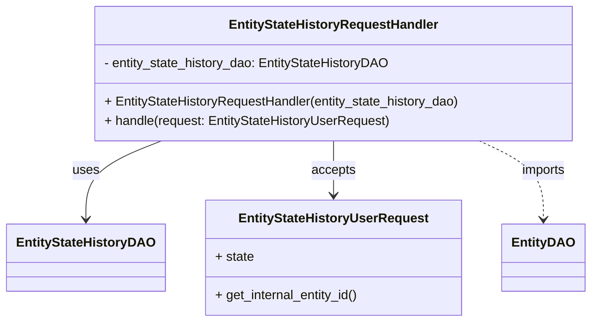

# Diagram: entity_core/entity_service/entity_workflow/entity_workflow_service/service/entity_state_history/handler.py


> Auto-generated by Obscura crawlers

## Diagram 1



### SVG

<svg id="container" width="721.6875" xmlns="http://www.w3.org/2000/svg" class="classDiagram" height="402" viewBox="0 0 721.6875 402" role="graphics-document document" aria-roledescription="class"><style>#container{font-family:"trebuchet ms",verdana,arial,sans-serif;font-size:16px;fill:#333;}@keyframes edge-animation-frame{from{stroke-dashoffset:0;}}@keyframes dash{to{stroke-dashoffset:0;}}#container .edge-animation-slow{stroke-dasharray:9,5!important;stroke-dashoffset:900;animation:dash 50s linear infinite;stroke-linecap:round;}#container .edge-animation-fast{stroke-dasharray:9,5!important;stroke-dashoffset:900;animation:dash 20s linear infinite;stroke-linecap:round;}#container .error-icon{fill:#552222;}#container .error-text{fill:#552222;stroke:#552222;}#container .edge-thickness-normal{stroke-width:1px;}#container .edge-thickness-thick{stroke-width:3.5px;}#container .edge-pattern-solid{stroke-dasharray:0;}#container .edge-thickness-invisible{stroke-width:0;fill:none;}#container .edge-pattern-dashed{stroke-dasharray:3;}#container .edge-pattern-dotted{stroke-dasharray:2;}#container .marker{fill:#333333;stroke:#333333;}#container .marker.cross{stroke:#333333;}#container svg{font-family:"trebuchet ms",verdana,arial,sans-serif;font-size:16px;}#container p{margin:0;}#container g.classGroup text{fill:#9370DB;stroke:none;font-family:"trebuchet ms",verdana,arial,sans-serif;font-size:10px;}#container g.classGroup text .title{font-weight:bolder;}#container .nodeLabel,#container .edgeLabel{color:#131300;}#container .edgeLabel .label rect{fill:#ECECFF;}#container .label text{fill:#131300;}#container .labelBkg{background:#ECECFF;}#container .edgeLabel .label span{background:#ECECFF;}#container .classTitle{font-weight:bolder;}#container .node rect,#container .node circle,#container .node ellipse,#container .node polygon,#container .node path{fill:#ECECFF;stroke:#9370DB;stroke-width:1px;}#container .divider{stroke:#9370DB;stroke-width:1;}#container g.clickable{cursor:pointer;}#container g.classGroup rect{fill:#ECECFF;stroke:#9370DB;}#container g.classGroup line{stroke:#9370DB;stroke-width:1;}#container .classLabel .box{stroke:none;stroke-width:0;fill:#ECECFF;opacity:0.5;}#container .classLabel .label{fill:#9370DB;font-size:10px;}#container .relation{stroke:#333333;stroke-width:1;fill:none;}#container .dashed-line{stroke-dasharray:3;}#container .dotted-line{stroke-dasharray:1 2;}#container #compositionStart,#container .composition{fill:#333333!important;stroke:#333333!important;stroke-width:1;}#container #compositionEnd,#container .composition{fill:#333333!important;stroke:#333333!important;stroke-width:1;}#container #dependencyStart,#container .dependency{fill:#333333!important;stroke:#333333!important;stroke-width:1;}#container #dependencyStart,#container .dependency{fill:#333333!important;stroke:#333333!important;stroke-width:1;}#container #extensionStart,#container .extension{fill:transparent!important;stroke:#333333!important;stroke-width:1;}#container #extensionEnd,#container .extension{fill:transparent!important;stroke:#333333!important;stroke-width:1;}#container #aggregationStart,#container .aggregation{fill:transparent!important;stroke:#333333!important;stroke-width:1;}#container #aggregationEnd,#container .aggregation{fill:transparent!important;stroke:#333333!important;stroke-width:1;}#container #lollipopStart,#container .lollipop{fill:#ECECFF!important;stroke:#333333!important;stroke-width:1;}#container #lollipopEnd,#container .lollipop{fill:#ECECFF!important;stroke:#333333!important;stroke-width:1;}#container .edgeTerminals{font-size:11px;line-height:initial;}#container .classTitleText{text-anchor:middle;font-size:18px;fill:#333;}#container .label-icon{display:inline-block;height:1em;overflow:visible;vertical-align:-0.125em;}#container .node .label-icon path{fill:currentColor;stroke:revert;stroke-width:revert;}#container :root{--mermaid-font-family:"trebuchet ms",verdana,arial,sans-serif;}</style><g><defs><marker id="container_class-aggregationStart" class="marker aggregation class" refX="18" refY="7" markerWidth="190" markerHeight="240" orient="auto"><path d="M 18,7 L9,13 L1,7 L9,1 Z"></path></marker></defs><defs><marker id="container_class-aggregationEnd" class="marker aggregation class" refX="1" refY="7" markerWidth="20" markerHeight="28" orient="auto"><path d="M 18,7 L9,13 L1,7 L9,1 Z"></path></marker></defs><defs><marker id="container_class-extensionStart" class="marker extension class" refX="18" refY="7" markerWidth="190" markerHeight="240" orient="auto"><path d="M 1,7 L18,13 V 1 Z"></path></marker></defs><defs><marker id="container_class-extensionEnd" class="marker extension class" refX="1" refY="7" markerWidth="20" markerHeight="28" orient="auto"><path d="M 1,1 V 13 L18,7 Z"></path></marker></defs><defs><marker id="container_class-compositionStart" class="marker composition class" refX="18" refY="7" markerWidth="190" markerHeight="240" orient="auto"><path d="M 18,7 L9,13 L1,7 L9,1 Z"></path></marker></defs><defs><marker id="container_class-compositionEnd" class="marker composition class" refX="1" refY="7" markerWidth="20" markerHeight="28" orient="auto"><path d="M 18,7 L9,13 L1,7 L9,1 Z"></path></marker></defs><defs><marker id="container_class-dependencyStart" class="marker dependency class" refX="6" refY="7" markerWidth="190" markerHeight="240" orient="auto"><path d="M 5,7 L9,13 L1,7 L9,1 Z"></path></marker></defs><defs><marker id="container_class-dependencyEnd" class="marker dependency class" refX="13" refY="7" markerWidth="20" markerHeight="28" orient="auto"><path d="M 18,7 L9,13 L14,7 L9,1 Z"></path></marker></defs><defs><marker id="container_class-lollipopStart" class="marker lollipop class" refX="13" refY="7" markerWidth="190" markerHeight="240" orient="auto"><circle stroke="black" fill="transparent" cx="7" cy="7" r="6"></circle></marker></defs><defs><marker id="container_class-lollipopEnd" class="marker lollipop class" refX="1" refY="7" markerWidth="190" markerHeight="240" orient="auto"><circle stroke="black" fill="transparent" cx="7" cy="7" r="6"></circle></marker></defs><g class="root"><g class="clusters"></g><g class="edgePaths"><path d="M195.345,176L179.838,182.167C164.331,188.333,133.318,200.667,117.811,217C102.305,233.333,102.305,253.667,102.305,263.833L102.305,274" id="id_EntityStateHistoryRequestHandler_EntityStateHistoryDAO_1" class="edge-thickness-normal edge-pattern-solid relation" style=";;;" data-edge="true" data-et="edge" data-id="id_EntityStateHistoryRequestHandler_EntityStateHistoryDAO_1" data-points="W3sieCI6MTk1LjM0NDU4OTM1OTUwNDE0LCJ5IjoxNzZ9LHsieCI6MTAyLjMwNDY4NzUsInkiOjIxM30seyJ4IjoxMDIuMzA0Njg3NSwieSI6MjgwfV0=" marker-end="url(#container_class-dependencyEnd)"></path><path d="M406.57,176L406.57,182.167C406.57,188.333,406.57,200.667,406.57,212C406.57,223.333,406.57,233.667,406.57,238.833L406.57,244" id="id_EntityStateHistoryRequestHandler_EntityStateHistoryUserRequest_2" class="edge-thickness-normal edge-pattern-solid relation" style=";;;" data-edge="true" data-et="edge" data-id="id_EntityStateHistoryRequestHandler_EntityStateHistoryUserRequest_2" data-points="W3sieCI6NDA2LjU3MDMxMjUsInkiOjE3Nn0seyJ4Ijo0MDYuNTcwMzEyNSwieSI6MjEzfSx7IngiOjQwNi41NzAzMTI1LCJ5IjoyNTB9XQ==" marker-end="url(#container_class-dependencyEnd)"></path><path d="M586.052,176L599.228,182.167C612.404,188.333,638.757,200.667,651.933,217C665.109,233.333,665.109,253.667,665.109,263.833L665.109,274" id="id_EntityStateHistoryRequestHandler_EntityDAO_3" class="edge-thickness-normal edge-pattern-dashed relation" style=";;;" data-edge="true" data-et="edge" data-id="id_EntityStateHistoryRequestHandler_EntityDAO_3" data-points="W3sieCI6NTg2LjA1MTk3NTcyMzE0MDUsInkiOjE3Nn0seyJ4Ijo2NjUuMTA5Mzc1LCJ5IjoyMTN9LHsieCI6NjY1LjEwOTM3NSwieSI6MjgwfV0=" marker-end="url(#container_class-dependencyEnd)"></path></g><g class="edgeLabels"><g class="edgeLabel" transform="translate(102.3046875, 213)"><g class="label" data-id="id_EntityStateHistoryRequestHandler_EntityStateHistoryDAO_1" transform="translate(-16.4921875, -12)"><foreignObject width="32.984375" height="24"><div xmlns="http://www.w3.org/1999/xhtml" class="labelBkg" style="display: table-cell; white-space: nowrap; line-height: 1.5; max-width: 200px; text-align: center;"><span class="edgeLabel"><p>uses</p></span></div></foreignObject></g></g><g class="edgeLabel" transform="translate(406.5703125, 213)"><g class="label" data-id="id_EntityStateHistoryRequestHandler_EntityStateHistoryUserRequest_2" transform="translate(-27.421875, -12)"><foreignObject width="54.84375" height="24"><div xmlns="http://www.w3.org/1999/xhtml" class="labelBkg" style="display: table-cell; white-space: nowrap; line-height: 1.5; max-width: 200px; text-align: center;"><span class="edgeLabel"><p>accepts</p></span></div></foreignObject></g></g><g class="edgeLabel" transform="translate(665.109375, 213)"><g class="label" data-id="id_EntityStateHistoryRequestHandler_EntityDAO_3" transform="translate(-28.25, -12)"><foreignObject width="56.5" height="24"><div xmlns="http://www.w3.org/1999/xhtml" class="labelBkg" style="display: table-cell; white-space: nowrap; line-height: 1.5; max-width: 200px; text-align: center;"><span class="edgeLabel"><p>imports</p></span></div></foreignObject></g></g></g><g class="nodes"><g class="node default" id="classId-EntityStateHistoryRequestHandler-0" transform="translate(406.5703125, 92)"><g class="basic label-container"><path d="M-299.8984375 -84 L299.8984375 -84 L299.8984375 84 L-299.8984375 84" stroke="none" stroke-width="0" fill="#ECECFF" style=""></path><path d="M-299.8984375 -84 C-164.83818375998814 -84, -29.77793001997628 -84, 299.8984375 -84 M-299.8984375 -84 C-63.757106835329324 -84, 172.38422382934135 -84, 299.8984375 -84 M299.8984375 -84 C299.8984375 -24.131502491152126, 299.8984375 35.73699501769575, 299.8984375 84 M299.8984375 -84 C299.8984375 -25.14630597844848, 299.8984375 33.70738804310304, 299.8984375 84 M299.8984375 84 C102.85790076700263 84, -94.18263596599473 84, -299.8984375 84 M299.8984375 84 C62.110709862007724 84, -175.67701777598455 84, -299.8984375 84 M-299.8984375 84 C-299.8984375 28.206636394644406, -299.8984375 -27.58672721071119, -299.8984375 -84 M-299.8984375 84 C-299.8984375 50.07493836458734, -299.8984375 16.14987672917468, -299.8984375 -84" stroke="#9370DB" stroke-width="1.3" fill="none" stroke-dasharray="0 0" style=""></path></g><g class="annotation-group text" transform="translate(0, -60)"></g><g class="label-group text" transform="translate(-126.078125, -60)"><g class="label" style="font-weight: bolder" transform="translate(0,-12)"><foreignObject width="252.15625" height="24"><div xmlns="http://www.w3.org/1999/xhtml" style="display: table-cell; white-space: nowrap; line-height: 1.5; max-width: 299px; text-align: center;"><span class="nodeLabel markdown-node-label" style=""><p>EntityStateHistoryRequestHandler</p></span></div></foreignObject></g></g><g class="members-group text" transform="translate(-287.8984375, -12)"><g class="label" style="" transform="translate(0,-12)"><foreignObject width="359.078125" height="24"><div xmlns="http://www.w3.org/1999/xhtml" style="display: table-cell; white-space: nowrap; line-height: 1.5; max-width: 416px; text-align: center;"><span class="nodeLabel markdown-node-label" style=""><p>- entity_state_history_dao: EntityStateHistoryDAO</p></span></div></foreignObject></g></g><g class="methods-group text" transform="translate(-287.8984375, 36)"><g class="label" style="" transform="translate(0,-12)"><foreignObject width="449.71875" height="24"><div xmlns="http://www.w3.org/1999/xhtml" style="display: table-cell; white-space: nowrap; line-height: 1.5; max-width: 507px; text-align: center;"><span class="nodeLabel markdown-node-label" style=""><p>+ EntityStateHistoryRequestHandler(entity_state_history_dao)</p></span></div></foreignObject></g><g class="label" style="" transform="translate(0,12)"><foreignObject width="359.015625" height="24"><div xmlns="http://www.w3.org/1999/xhtml" style="display: table-cell; white-space: nowrap; line-height: 1.5; max-width: 416px; text-align: center;"><span class="nodeLabel markdown-node-label" style=""><p>+ handle(request: EntityStateHistoryUserRequest)</p></span></div></foreignObject></g></g><g class="divider" style=""><path d="M-299.8984375 -36 C-152.73354817128688 -36, -5.568658842573768 -36, 299.8984375 -36 M-299.8984375 -36 C-136.78567978367718 -36, 26.327077932645636 -36, 299.8984375 -36" stroke="#9370DB" stroke-width="1.3" fill="none" stroke-dasharray="0 0" style=""></path></g><g class="divider" style=""><path d="M-299.8984375 12 C-118.10493172288076 12, 63.68857405423847 12, 299.8984375 12 M-299.8984375 12 C-171.418104773917 12, -42.93777204783402 12, 299.8984375 12" stroke="#9370DB" stroke-width="1.3" fill="none" stroke-dasharray="0 0" style=""></path></g></g><g class="node default" id="classId-EntityStateHistoryDAO-1" transform="translate(102.3046875, 322)"><g class="basic label-container"><path d="M-94.3046875 -42 L94.3046875 -42 L94.3046875 42 L-94.3046875 42" stroke="none" stroke-width="0" fill="#ECECFF" style=""></path><path d="M-94.3046875 -42 C-39.61113744128305 -42, 15.082412617433903 -42, 94.3046875 -42 M-94.3046875 -42 C-45.98218011812765 -42, 2.3403272637446975 -42, 94.3046875 -42 M94.3046875 -42 C94.3046875 -9.084368000780664, 94.3046875 23.831263998438672, 94.3046875 42 M94.3046875 -42 C94.3046875 -17.797097907873663, 94.3046875 6.405804184252673, 94.3046875 42 M94.3046875 42 C53.17354408320172 42, 12.042400666403438 42, -94.3046875 42 M94.3046875 42 C27.220165363267384 42, -39.86435677346523 42, -94.3046875 42 M-94.3046875 42 C-94.3046875 18.32408017896137, -94.3046875 -5.351839642077259, -94.3046875 -42 M-94.3046875 42 C-94.3046875 19.568245684646037, -94.3046875 -2.8635086307079263, -94.3046875 -42" stroke="#9370DB" stroke-width="1.3" fill="none" stroke-dasharray="0 0" style=""></path></g><g class="annotation-group text" transform="translate(0, -18)"></g><g class="label-group text" transform="translate(-82.3046875, -18)"><g class="label" style="font-weight: bolder" transform="translate(0,-12)"><foreignObject width="164.609375" height="24"><div xmlns="http://www.w3.org/1999/xhtml" style="display: table-cell; white-space: nowrap; line-height: 1.5; max-width: 211px; text-align: center;"><span class="nodeLabel markdown-node-label" style=""><p>EntityStateHistoryDAO</p></span></div></foreignObject></g></g><g class="members-group text" transform="translate(-82.3046875, 30)"></g><g class="methods-group text" transform="translate(-82.3046875, 60)"></g><g class="divider" style=""><path d="M-94.3046875 6 C-48.035945353933876 6, -1.7672032078677518 6, 94.3046875 6 M-94.3046875 6 C-49.94590663680755 6, -5.587125773615099 6, 94.3046875 6" stroke="#9370DB" stroke-width="1.3" fill="none" stroke-dasharray="0 0" style=""></path></g><g class="divider" style=""><path d="M-94.3046875 24 C-41.012783529921656 24, 12.279120440156689 24, 94.3046875 24 M-94.3046875 24 C-41.45870046477177 24, 11.387286570456453 24, 94.3046875 24" stroke="#9370DB" stroke-width="1.3" fill="none" stroke-dasharray="0 0" style=""></path></g></g><g class="node default" id="classId-EntityStateHistoryUserRequest-2" transform="translate(406.5703125, 322)"><g class="basic label-container"><path d="M-159.9609375 -72 L159.9609375 -72 L159.9609375 72 L-159.9609375 72" stroke="none" stroke-width="0" fill="#ECECFF" style=""></path><path d="M-159.9609375 -72 C-41.17066964971798 -72, 77.61959820056404 -72, 159.9609375 -72 M-159.9609375 -72 C-91.27967243130252 -72, -22.59840736260503 -72, 159.9609375 -72 M159.9609375 -72 C159.9609375 -29.05186028238397, 159.9609375 13.89627943523206, 159.9609375 72 M159.9609375 -72 C159.9609375 -14.976264684497352, 159.9609375 42.0474706310053, 159.9609375 72 M159.9609375 72 C32.512381460676664 72, -94.93617457864667 72, -159.9609375 72 M159.9609375 72 C54.67897924046116 72, -50.60297901907768 72, -159.9609375 72 M-159.9609375 72 C-159.9609375 36.065617398828145, -159.9609375 0.13123479765629043, -159.9609375 -72 M-159.9609375 72 C-159.9609375 24.622926452488898, -159.9609375 -22.754147095022205, -159.9609375 -72" stroke="#9370DB" stroke-width="1.3" fill="none" stroke-dasharray="0 0" style=""></path></g><g class="annotation-group text" transform="translate(0, -48)"></g><g class="label-group text" transform="translate(-113.640625, -48)"><g class="label" style="font-weight: bolder" transform="translate(0,-12)"><foreignObject width="227.28125" height="24"><div xmlns="http://www.w3.org/1999/xhtml" style="display: table-cell; white-space: nowrap; line-height: 1.5; max-width: 273px; text-align: center;"><span class="nodeLabel markdown-node-label" style=""><p>EntityStateHistoryUserRequest</p></span></div></foreignObject></g></g><g class="members-group text" transform="translate(-147.9609375, 0)"><g class="label" style="" transform="translate(0,-12)"><foreignObject width="48.328125" height="24"><div xmlns="http://www.w3.org/1999/xhtml" style="display: table-cell; white-space: nowrap; line-height: 1.5; max-width: 106px; text-align: center;"><span class="nodeLabel markdown-node-label" style=""><p>+ state</p></span></div></foreignObject></g></g><g class="methods-group text" transform="translate(-147.9609375, 48)"><g class="label" style="" transform="translate(0,-12)"><foreignObject width="182.28125" height="24"><div xmlns="http://www.w3.org/1999/xhtml" style="display: table-cell; white-space: nowrap; line-height: 1.5; max-width: 240px; text-align: center;"><span class="nodeLabel markdown-node-label" style=""><p>+ get_internal_entity_id()</p></span></div></foreignObject></g></g><g class="divider" style=""><path d="M-159.9609375 -24 C-53.86183169231292 -24, 52.23727411537416 -24, 159.9609375 -24 M-159.9609375 -24 C-77.17883693321485 -24, 5.603263633570293 -24, 159.9609375 -24" stroke="#9370DB" stroke-width="1.3" fill="none" stroke-dasharray="0 0" style=""></path></g><g class="divider" style=""><path d="M-159.9609375 24 C-43.81563073389785 24, 72.3296760322043 24, 159.9609375 24 M-159.9609375 24 C-73.58231331962713 24, 12.796310860745734 24, 159.9609375 24" stroke="#9370DB" stroke-width="1.3" fill="none" stroke-dasharray="0 0" style=""></path></g></g><g class="node default" id="classId-EntityDAO-3" transform="translate(665.109375, 322)"><g class="basic label-container"><path d="M-48.578125 -42 L48.578125 -42 L48.578125 42 L-48.578125 42" stroke="none" stroke-width="0" fill="#ECECFF" style=""></path><path d="M-48.578125 -42 C-14.682002587889855 -42, 19.21411982422029 -42, 48.578125 -42 M-48.578125 -42 C-19.71712900308948 -42, 9.143866993821042 -42, 48.578125 -42 M48.578125 -42 C48.578125 -17.638797782222035, 48.578125 6.72240443555593, 48.578125 42 M48.578125 -42 C48.578125 -22.45918355297141, 48.578125 -2.9183671059428207, 48.578125 42 M48.578125 42 C13.404159357819204 42, -21.769806284361593 42, -48.578125 42 M48.578125 42 C27.7048899558988 42, 6.8316549117975995 42, -48.578125 42 M-48.578125 42 C-48.578125 18.990318389666115, -48.578125 -4.0193632206677705, -48.578125 -42 M-48.578125 42 C-48.578125 21.737141176660803, -48.578125 1.4742823533216054, -48.578125 -42" stroke="#9370DB" stroke-width="1.3" fill="none" stroke-dasharray="0 0" style=""></path></g><g class="annotation-group text" transform="translate(0, -18)"></g><g class="label-group text" transform="translate(-36.578125, -18)"><g class="label" style="font-weight: bolder" transform="translate(0,-12)"><foreignObject width="73.15625" height="24"><div xmlns="http://www.w3.org/1999/xhtml" style="display: table-cell; white-space: nowrap; line-height: 1.5; max-width: 122px; text-align: center;"><span class="nodeLabel markdown-node-label" style=""><p>EntityDAO</p></span></div></foreignObject></g></g><g class="members-group text" transform="translate(-36.578125, 30)"></g><g class="methods-group text" transform="translate(-36.578125, 60)"></g><g class="divider" style=""><path d="M-48.578125 6 C-24.411140540282396 6, -0.24415608056479243 6, 48.578125 6 M-48.578125 6 C-26.814139938761617 6, -5.050154877523234 6, 48.578125 6" stroke="#9370DB" stroke-width="1.3" fill="none" stroke-dasharray="0 0" style=""></path></g><g class="divider" style=""><path d="M-48.578125 24 C-9.80073033177483 24, 28.97666433645034 24, 48.578125 24 M-48.578125 24 C-9.835595544583747 24, 28.906933910832507 24, 48.578125 24" stroke="#9370DB" stroke-width="1.3" fill="none" stroke-dasharray="0 0" style=""></path></g></g></g></g></g></svg>

## Diagram 2

```mermaid
flowchart TD
Start([Start])
GetID[Get entity_internal_id<br/>request.get_internal_entity_id()]
Decision{request.state?}
CallStates[get_state_history_for_states(entity_internal_id, request.state)]
CallAll[get_state_history(entity_internal_id)]
End([Return result])
Start --> GetID --> Decision
Decision -- yes --> CallStates --> End
Decision -- no --> CallAll --> End
```

> SVG rendering failed for this diagram.
