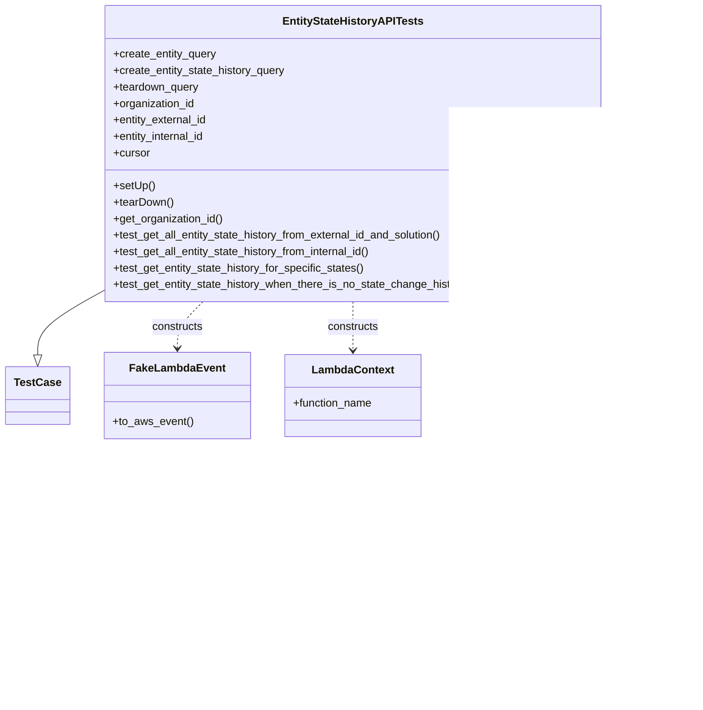
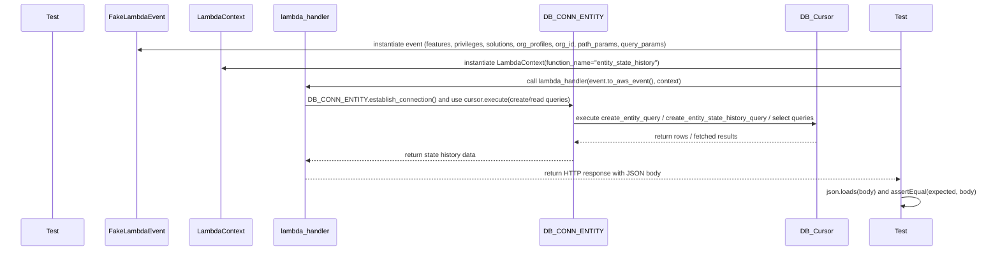

# Diagram: entity_core/entity_service/entity_workflow/entity_workflow_tests/integration/test_entity_state_history_api.py

> Auto-generated by Obscura crawlers

## Diagram 1

### SVG

<svg id="container" width="1007.1484375" xmlns="http://www.w3.org/2000/svg" class="classDiagram" height="1024" viewBox="0 0 1007.1484375 1024" role="graphics-document document" aria-roledescription="class"><g><defs><marker id="container_class-aggregationStart" class="marker aggregation class" refX="18" refY="7" markerWidth="190" markerHeight="240" orient="auto"><path d="M 18,7 L9,13 L1,7 L9,1 Z"></path></marker></defs><defs><marker id="container_class-aggregationEnd" class="marker aggregation class" refX="1" refY="7" markerWidth="20" markerHeight="28" orient="auto"><path d="M 18,7 L9,13 L1,7 L9,1 Z"></path></marker></defs><defs><marker id="container_class-extensionStart" class="marker extension class" refX="18" refY="7" markerWidth="190" markerHeight="240" orient="auto"><path d="M 1,7 L18,13 V 1 Z"></path></marker></defs><defs><marker id="container_class-extensionEnd" class="marker extension class" refX="1" refY="7" markerWidth="20" markerHeight="28" orient="auto"><path d="M 1,1 V 13 L18,7 Z"></path></marker></defs><defs><marker id="container_class-compositionStart" class="marker composition class" refX="18" refY="7" markerWidth="190" markerHeight="240" orient="auto"><path d="M 18,7 L9,13 L1,7 L9,1 Z"></path></marker></defs><defs><marker id="container_class-compositionEnd" class="marker composition class" refX="1" refY="7" markerWidth="20" markerHeight="28" orient="auto"><path d="M 18,7 L9,13 L1,7 L9,1 Z"></path></marker></defs><defs><marker id="container_class-dependencyStart" class="marker dependency class" refX="6" refY="7" markerWidth="190" markerHeight="240" orient="auto"><path d="M 5,7 L9,13 L1,7 L9,1 Z"></path></marker></defs><defs><marker id="container_class-dependencyEnd" class="marker dependency class" refX="13" refY="7" markerWidth="20" markerHeight="28" orient="auto"><path d="M 18,7 L9,13 L14,7 L9,1 Z"></path></marker></defs><defs><marker id="container_class-lollipopStart" class="marker lollipop class" refX="13" refY="7" markerWidth="190" markerHeight="240" orient="auto"><circle stroke="black" fill="transparent" cx="7" cy="7" r="6"></circle></marker></defs><defs><marker id="container_class-lollipopEnd" class="marker lollipop class" refX="1" refY="7" markerWidth="190" markerHeight="240" orient="auto"><circle stroke="black" fill="transparent" cx="7" cy="7" r="6"></circle></marker></defs><g class="root"><g class="clusters"></g><g class="edgePaths"><path d="M139.625,427.931L125.081,436.109C110.536,444.287,81.448,460.644,66.904,475.613C52.359,490.583,52.359,504.167,52.359,510.958L52.359,517.75" id="id_EntityStateHistoryAPITests_TestCase_1" class="edge-thickness-normal edge-pattern-solid relation" style=";;;" data-edge="true" data-et="edge" data-id="id_EntityStateHistoryAPITests_TestCase_1" data-points="W3sieCI6MTM5LjYyNSwieSI6NDI3LjkzMDUxMTE4MjEwODZ9LHsieCI6NTIuMzU5Mzc1LCJ5Ijo0Nzd9LHsieCI6NTIuMzU5Mzc1LCJ5Ijo1MzV9XQ==" marker-end="url(#container_class-extensionEnd)"></path><path d="M819.203,798L819.203,804.167C819.203,810.333,819.203,822.667,819.203,834C819.203,845.333,819.203,855.667,819.203,860.833L819.203,866" id="id_DB_CONN_ENTITY_FvDatabaseConnector_2" class="edge-thickness-normal edge-pattern-dashed relation" style=";;;" data-edge="true" data-et="edge" data-id="id_DB_CONN_ENTITY_FvDatabaseConnector_2" data-points="W3sieCI6ODE5LjIwMzEyNSwieSI6Nzk4fSx7IngiOjgxOS4yMDMxMjUsInkiOjgzNX0seyJ4Ijo4MTkuMjAzMTI1LCJ5Ijo4NzJ9XQ==" marker-end="url(#container_class-dependencyEnd)"></path><path d="M286.78,440L280.628,446.167C274.475,452.333,262.169,464.667,256.016,476C249.863,487.333,249.863,497.667,249.863,502.833L249.863,508" id="id_EntityStateHistoryAPITests_FakeLambdaEvent_3" class="edge-thickness-normal edge-pattern-dashed relation" style=";;;" data-edge="true" data-et="edge" data-id="id_EntityStateHistoryAPITests_FakeLambdaEvent_3" data-points="W3sieCI6Mjg2Ljc4MDQ0NzEzNDM4NzQsInkiOjQ0MH0seyJ4IjoyNDkuODYzMjgxMjUsInkiOjQ3N30seyJ4IjoyNDkuODYzMjgxMjUsInkiOjUxNH1d" marker-end="url(#container_class-dependencyEnd)"></path><path d="M502.297,440L502.297,446.167C502.297,452.333,502.297,464.667,502.297,476.5C502.297,488.333,502.297,499.667,502.297,505.333L502.297,511" id="id_EntityStateHistoryAPITests_LambdaContext_4" class="edge-thickness-normal edge-pattern-dashed relation" style=";;;" data-edge="true" data-et="edge" data-id="id_EntityStateHistoryAPITests_LambdaContext_4" data-points="W3sieCI6NTAyLjI5Njg3NSwieSI6NDQwfSx7IngiOjUwMi4yOTY4NzUsInkiOjQ3N30seyJ4Ijo1MDIuMjk2ODc1LCJ5Ijo1MTd9XQ==" marker-end="url(#container_class-dependencyEnd)"></path><path d="M691.203,440L696.597,446.167C701.99,452.333,712.776,464.667,718.169,479.5C723.563,494.333,723.563,511.667,723.563,520.333L723.563,529" id="id_EntityStateHistoryAPITests_lambda_handler_5" class="edge-thickness-normal edge-pattern-dashed relation" style=";;;" data-edge="true" data-et="edge" data-id="id_EntityStateHistoryAPITests_lambda_handler_5" data-points="W3sieCI6NjkxLjIwMzQ5NTU1MzM1OTcsInkiOjQ0MH0seyJ4Ijo3MjMuNTYyNSwieSI6NDc3fSx7IngiOjcyMy41NjI1LCJ5Ijo1MzV9XQ==" marker-end="url(#container_class-dependencyEnd)"></path><path d="M723.563,619L723.563,628.667C723.563,638.333,723.563,657.667,730.257,672.863C736.952,688.06,750.341,699.119,757.036,704.649L763.73,710.179" id="id_lambda_handler_DB_CONN_ENTITY_6" class="edge-thickness-normal edge-pattern-dashed relation" style=";;;" data-edge="true" data-et="edge" data-id="id_lambda_handler_DB_CONN_ENTITY_6" data-points="W3sieCI6NzIzLjU2MjUsInkiOjYxOX0seyJ4Ijo3MjMuNTYyNSwieSI6Njc3fSx7IngiOjc2OC4zNTYyMTA0NDMwMzgsInkiOjcxNH1d" marker-end="url(#container_class-dependencyEnd)"></path><path d="M870.05,714L877.516,707.833C884.981,701.667,899.913,689.333,907.378,666.5C914.844,643.667,914.844,610.333,914.844,577C914.844,543.667,914.844,510.333,905.641,488.023C896.438,465.712,878.032,454.424,868.829,448.781L859.626,443.137" id="id_DB_CONN_ENTITY_EntityStateHistoryAPITests_7" class="edge-thickness-normal edge-pattern-dashed relation" style=";;;" data-edge="true" data-et="edge" data-id="id_DB_CONN_ENTITY_EntityStateHistoryAPITests_7" data-points="W3sieCI6ODcwLjA1MDAzOTU1Njk2MiwieSI6NzE0fSx7IngiOjkxNC44NDM3NSwieSI6Njc3fSx7IngiOjkxNC44NDM3NSwieSI6NTc3fSx7IngiOjkxNC44NDM3NSwieSI6NDc3fSx7IngiOjg1NC41MTA4MDc4MDYzMjQxLCJ5Ijo0NDB9XQ==" marker-end="url(#container_class-dependencyEnd)"></path></g><g class="edgeLabels"><g class="edgeLabel"><g class="label" data-id="id_EntityStateHistoryAPITests_TestCase_1" transform="translate(0, 0)"><foreignObject width="0" height="0">

</foreignObject></g></g><g class="edgeLabel" transform="translate(819.203125, 835)"><g class="label" data-id="id_DB_CONN_ENTITY_FvDatabaseConnector_2" transform="translate(-40.0546875, -12)"><foreignObject width="80.109375" height="24">

instance of

</foreignObject></g></g><g class="edgeLabel" transform="translate(249.86328125, 477)"><g class="label" data-id="id_EntityStateHistoryAPITests_FakeLambdaEvent_3" transform="translate(-37.84375, -12)"><foreignObject width="75.6875" height="24">

constructs

</foreignObject></g></g><g class="edgeLabel" transform="translate(502.296875, 477)"><g class="label" data-id="id_EntityStateHistoryAPITests_LambdaContext_4" transform="translate(-37.84375, -12)"><foreignObject width="75.6875" height="24">

constructs

</foreignObject></g></g><g class="edgeLabel" transform="translate(723.5625, 477)"><g class="label" data-id="id_EntityStateHistoryAPITests_lambda_handler_5" transform="translate(-27.5859375, -12)"><foreignObject width="55.171875" height="24">

invokes

</foreignObject></g></g><g class="edgeLabel" transform="translate(723.5625, 677)"><g class="label" data-id="id_lambda_handler_DB_CONN_ENTITY_6" transform="translate(-27.2421875, -12)"><foreignObject width="54.484375" height="24">

queries

</foreignObject></g></g><g class="edgeLabel" transform="translate(914.84375, 577)"><g class="label" data-id="id_DB_CONN_ENTITY_EntityStateHistoryAPITests_7" transform="translate(-84.3046875, -12)"><foreignObject width="168.609375" height="24">

provides cursor/results

</foreignObject></g></g></g><g class="nodes"><g class="node default" id="classId-EntityStateHistoryAPITests-0" transform="translate(502.296875, 224)"><g class="basic label-container"><path d="M-362.671875 -216 L362.671875 -216 L362.671875 216 L-362.671875 216" stroke="none" stroke-width="0" fill="#ECECFF" style=""></path><path d="M-362.671875 -216 C-133.15388101663734 -216, 96.36411296672532 -216, 362.671875 -216 M-362.671875 -216 C-147.23647832065015 -216, 68.1989183586997 -216, 362.671875 -216 M362.671875 -216 C362.671875 -67.1388736142076, 362.671875 81.7222527715848, 362.671875 216 M362.671875 -216 C362.671875 -43.872419073543625, 362.671875 128.25516185291275, 362.671875 216 M362.671875 216 C80.81623562214327 216, -201.03940375571347 216, -362.671875 216 M362.671875 216 C91.23123533500876 216, -180.20940432998248 216, -362.671875 216 M-362.671875 216 C-362.671875 77.10467439178265, -362.671875 -61.790651216434696, -362.671875 -216 M-362.671875 216 C-362.671875 86.66993834563698, -362.671875 -42.66012330872604, -362.671875 -216" stroke="#9370DB" stroke-width="1.3" fill="none" stroke-dasharray="0 0" style=""></path></g><g class="annotation-group text" transform="translate(0, -192)"></g><g class="label-group text" transform="translate(-97.984375, -192)"><g class="label" style="font-weight: bolder" transform="translate(0,-12)"><foreignObject width="195.96875" height="24">

EntityStateHistoryAPITests

</foreignObject></g></g><g class="members-group text" transform="translate(-350.671875, -144)"><g class="label" style="" transform="translate(0,-12)"><foreignObject width="151.65625" height="24">

+create_entity_query

</foreignObject></g><g class="label" style="" transform="translate(0,12)"><foreignObject width="253.875" height="24">

+create_entity_state_history_query

</foreignObject></g><g class="label" style="" transform="translate(0,36)"><foreignObject width="125.8125" height="24">

+teardown_query

</foreignObject></g><g class="label" style="" transform="translate(0,60)"><foreignObject width="120.75" height="24">

+organization_id

</foreignObject></g><g class="label" style="" transform="translate(0,84)"><foreignObject width="139.234375" height="24">

+entity_external_id

</foreignObject></g><g class="label" style="" transform="translate(0,108)"><foreignObject width="137.109375" height="24">

+entity_internal_id

</foreignObject></g><g class="label" style="" transform="translate(0,132)"><foreignObject width="53.71875" height="24">

+cursor

</foreignObject></g></g><g class="methods-group text" transform="translate(-350.671875, 48)"><g class="label" style="" transform="translate(0,-12)"><foreignObject width="60.421875" height="24">

+setUp()

</foreignObject></g><g class="label" style="" transform="translate(0,12)"><foreignObject width="87.75" height="24">

+tearDown()

</foreignObject></g><g class="label" style="" transform="translate(0,36)"><foreignObject width="161.671875" height="24">

+get_organization_id()

</foreignObject></g><g class="label" style="" transform="translate(0,60)"><foreignObject width="490.109375" height="24">

+test_get_all_entity_state_history_from_external_id_and_solution()

</foreignObject></g><g class="label" style="" transform="translate(0,84)"><foreignObject width="384.1875" height="24">

+test_get_all_entity_state_history_from_internal_id()

</foreignObject></g><g class="label" style="" transform="translate(0,108)"><foreignObject width="370.859375" height="24">

+test_get_entity_state_history_for_specific_states()

</foreignObject></g><g class="label" style="" transform="translate(0,132)"><foreignObject width="603.359375" height="24">

+test_get_entity_state_history_when_there_is_no_state_change_history_available()

</foreignObject></g></g><g class="divider" style=""><path d="M-362.671875 -168 C-148.89880993055502 -168, 64.87425513888996 -168, 362.671875 -168 M-362.671875 -168 C-134.35520300509262 -168, 93.96146898981476 -168, 362.671875 -168" stroke="#9370DB" stroke-width="1.3" fill="none" stroke-dasharray="0 0" style=""></path></g><g class="divider" style=""><path d="M-362.671875 24 C-216.44519364564843 24, -70.21851229129686 24, 362.671875 24 M-362.671875 24 C-156.25766777634996 24, 50.15653944730008 24, 362.671875 24" stroke="#9370DB" stroke-width="1.3" fill="none" stroke-dasharray="0 0" style=""></path></g></g><g class="node default" id="classId-TestCase-1" transform="translate(52.359375, 577)"><g class="basic label-container"><path d="M-44.359375 -42 L44.359375 -42 L44.359375 42 L-44.359375 42" stroke="none" stroke-width="0" fill="#ECECFF" style=""></path><path d="M-44.359375 -42 C-8.957235236444951 -42, 26.444904527110097 -42, 44.359375 -42 M-44.359375 -42 C-9.493397592878416 -42, 25.372579814243167 -42, 44.359375 -42 M44.359375 -42 C44.359375 -21.379505826491048, 44.359375 -0.759011652982096, 44.359375 42 M44.359375 -42 C44.359375 -9.229424640812965, 44.359375 23.54115071837407, 44.359375 42 M44.359375 42 C19.002123688108597 42, -6.355127623782806 42, -44.359375 42 M44.359375 42 C14.471948246099828 42, -15.415478507800344 42, -44.359375 42 M-44.359375 42 C-44.359375 15.370171910174708, -44.359375 -11.259656179650584, -44.359375 -42 M-44.359375 42 C-44.359375 21.49318096912322, -44.359375 0.9863619382464393, -44.359375 -42" stroke="#9370DB" stroke-width="1.3" fill="none" stroke-dasharray="0 0" style=""></path></g><g class="annotation-group text" transform="translate(0, -18)"></g><g class="label-group text" transform="translate(-32.359375, -18)"><g class="label" style="font-weight: bolder" transform="translate(0,-12)"><foreignObject width="64.71875" height="24">

TestCase

</foreignObject></g></g><g class="members-group text" transform="translate(-32.359375, 30)"></g><g class="methods-group text" transform="translate(-32.359375, 60)"></g><g class="divider" style=""><path d="M-44.359375 6 C-16.907495495685726 6, 10.544384008628548 6, 44.359375 6 M-44.359375 6 C-22.558388604596775 6, -0.7574022091935504 6, 44.359375 6" stroke="#9370DB" stroke-width="1.3" fill="none" stroke-dasharray="0 0" style=""></path></g><g class="divider" style=""><path d="M-44.359375 24 C-20.64122570125426 24, 3.0769235974914793 24, 44.359375 24 M-44.359375 24 C-26.01163863930974 24, -7.6639022786194815 24, 44.359375 24" stroke="#9370DB" stroke-width="1.3" fill="none" stroke-dasharray="0 0" style=""></path></g></g><g class="node default" id="classId-FvDatabaseConnector-2" transform="translate(819.203125, 944)"><g class="basic label-container"><path d="M-138.28515625 -72 L138.28515625 -72 L138.28515625 72 L-138.28515625 72" stroke="none" stroke-width="0" fill="#ECECFF" style=""></path><path d="M-138.28515625 -72 C-69.27155018312538 -72, -0.2579441162507692 -72, 138.28515625 -72 M-138.28515625 -72 C-67.024902615626 -72, 4.235351018747991 -72, 138.28515625 -72 M138.28515625 -72 C138.28515625 -33.76991729273612, 138.28515625 4.460165414527765, 138.28515625 72 M138.28515625 -72 C138.28515625 -41.92471501796092, 138.28515625 -11.849430035921849, 138.28515625 72 M138.28515625 72 C53.048444155706264 72, -32.18826793858747 72, -138.28515625 72 M138.28515625 72 C33.40473426782813 72, -71.47568771434374 72, -138.28515625 72 M-138.28515625 72 C-138.28515625 40.68411505783435, -138.28515625 9.368230115668695, -138.28515625 -72 M-138.28515625 72 C-138.28515625 21.862053634399558, -138.28515625 -28.275892731200884, -138.28515625 -72" stroke="#9370DB" stroke-width="1.3" fill="none" stroke-dasharray="0 0" style=""></path></g><g class="annotation-group text" transform="translate(0, -48)"></g><g class="label-group text" transform="translate(-79.3046875, -48)"><g class="label" style="font-weight: bolder" transform="translate(0,-12)"><foreignObject width="158.609375" height="24">

FvDatabaseConnector

</foreignObject></g></g><g class="members-group text" transform="translate(-126.28515625, 0)"><g class="label" style="" transform="translate(0,-12)"><foreignObject width="53.71875" height="24">

+cursor

</foreignObject></g></g><g class="methods-group text" transform="translate(-126.28515625, 48)"><g class="label" style="" transform="translate(0,-12)"><foreignObject width="173.265625" height="24">

+establish_connection()

</foreignObject></g></g><g class="divider" style=""><path d="M-138.28515625 -24 C-58.40784579906193 -24, 21.469464651876137 -24, 138.28515625 -24 M-138.28515625 -24 C-65.40942662779472 -24, 7.466302994410569 -24, 138.28515625 -24" stroke="#9370DB" stroke-width="1.3" fill="none" stroke-dasharray="0 0" style=""></path></g><g class="divider" style=""><path d="M-138.28515625 24 C-47.519245715398654 24, 43.24666481920269 24, 138.28515625 24 M-138.28515625 24 C-55.2795980988833 24, 27.725960052233404 24, 138.28515625 24" stroke="#9370DB" stroke-width="1.3" fill="none" stroke-dasharray="0 0" style=""></path></g></g><g class="node default" id="classId-DB_CONN_ENTITY-3" transform="translate(819.203125, 756)"><g class="basic label-container"><path d="M-75.8125 -42 L75.8125 -42 L75.8125 42 L-75.8125 42" stroke="none" stroke-width="0" fill="#ECECFF" style=""></path><path d="M-75.8125 -42 C-18.694151483076688 -42, 38.424197033846625 -42, 75.8125 -42 M-75.8125 -42 C-28.644851669705844 -42, 18.522796660588313 -42, 75.8125 -42 M75.8125 -42 C75.8125 -17.236754707812878, 75.8125 7.526490584374244, 75.8125 42 M75.8125 -42 C75.8125 -24.89221589461627, 75.8125 -7.784431789232542, 75.8125 42 M75.8125 42 C27.056284152151626 42, -21.699931695696748 42, -75.8125 42 M75.8125 42 C25.184404504684856 42, -25.443690990630287 42, -75.8125 42 M-75.8125 42 C-75.8125 15.998482930730589, -75.8125 -10.003034138538823, -75.8125 -42 M-75.8125 42 C-75.8125 20.18463322698276, -75.8125 -1.6307335460344774, -75.8125 -42" stroke="#9370DB" stroke-width="1.3" fill="none" stroke-dasharray="0 0" style=""></path></g><g class="annotation-group text" transform="translate(0, -18)"></g><g class="label-group text" transform="translate(-63.8125, -18)"><g class="label" style="font-weight: bolder" transform="translate(0,-12)"><foreignObject width="127.625" height="24">

DB_CONN_ENTITY

</foreignObject></g></g><g class="members-group text" transform="translate(-63.8125, 30)"></g><g class="methods-group text" transform="translate(-63.8125, 60)"></g><g class="divider" style=""><path d="M-75.8125 6 C-43.502196994459126 6, -11.191893988918252 6, 75.8125 6 M-75.8125 6 C-23.150145236270475 6, 29.51220952745905 6, 75.8125 6" stroke="#9370DB" stroke-width="1.3" fill="none" stroke-dasharray="0 0" style=""></path></g><g class="divider" style=""><path d="M-75.8125 24 C-42.29113527206563 24, -8.769770544131262 24, 75.8125 24 M-75.8125 24 C-38.32413542168356 24, -0.8357708433671149 24, 75.8125 24" stroke="#9370DB" stroke-width="1.3" fill="none" stroke-dasharray="0 0" style=""></path></g></g><g class="node default" id="classId-FakeLambdaEvent-4" transform="translate(249.86328125, 577)"><g class="basic label-container"><path d="M-103.14453125 -63 L103.14453125 -63 L103.14453125 63 L-103.14453125 63" stroke="none" stroke-width="0" fill="#ECECFF" style=""></path><path d="M-103.14453125 -63 C-57.83355889328104 -63, -12.522586536562073 -63, 103.14453125 -63 M-103.14453125 -63 C-56.623875071014 -63, -10.103218892027996 -63, 103.14453125 -63 M103.14453125 -63 C103.14453125 -24.26674327159943, 103.14453125 14.466513456801138, 103.14453125 63 M103.14453125 -63 C103.14453125 -34.64347962550306, 103.14453125 -6.286959251006117, 103.14453125 63 M103.14453125 63 C32.6681496306763 63, -37.80823198864741 63, -103.14453125 63 M103.14453125 63 C44.846414790179324 63, -13.451701669641352 63, -103.14453125 63 M-103.14453125 63 C-103.14453125 15.120956708431002, -103.14453125 -32.758086583137995, -103.14453125 -63 M-103.14453125 63 C-103.14453125 28.037301983560972, -103.14453125 -6.925396032878055, -103.14453125 -63" stroke="#9370DB" stroke-width="1.3" fill="none" stroke-dasharray="0 0" style=""></path></g><g class="annotation-group text" transform="translate(0, -39)"></g><g class="label-group text" transform="translate(-65.8671875, -39)"><g class="label" style="font-weight: bolder" transform="translate(0,-12)"><foreignObject width="131.734375" height="24">

FakeLambdaEvent

</foreignObject></g></g><g class="members-group text" transform="translate(-91.14453125, 9)"></g><g class="methods-group text" transform="translate(-91.14453125, 39)"><g class="label" style="" transform="translate(0,-12)"><foreignObject width="116.421875" height="24">

+to_aws_event()

</foreignObject></g></g><g class="divider" style=""><path d="M-103.14453125 -15 C-24.668011576103297 -15, 53.80850809779341 -15, 103.14453125 -15 M-103.14453125 -15 C-42.58352398482386 -15, 17.977483280352274 -15, 103.14453125 -15" stroke="#9370DB" stroke-width="1.3" fill="none" stroke-dasharray="0 0" style=""></path></g><g class="divider" style=""><path d="M-103.14453125 9 C-54.8487881307186 9, -6.553045011437206 9, 103.14453125 9 M-103.14453125 9 C-55.75010414959291 9, -8.355677049185815 9, 103.14453125 9" stroke="#9370DB" stroke-width="1.3" fill="none" stroke-dasharray="0 0" style=""></path></g></g><g class="node default" id="classId-LambdaContext-5" transform="translate(502.296875, 577)"><g class="basic label-container"><path d="M-99.2890625 -60 L99.2890625 -60 L99.2890625 60 L-99.2890625 60" stroke="none" stroke-width="0" fill="#ECECFF" style=""></path><path d="M-99.2890625 -60 C-33.164131639618844 -60, 32.96079922076231 -60, 99.2890625 -60 M-99.2890625 -60 C-45.07971762826199 -60, 9.129627243476023 -60, 99.2890625 -60 M99.2890625 -60 C99.2890625 -15.88785424053767, 99.2890625 28.22429151892466, 99.2890625 60 M99.2890625 -60 C99.2890625 -32.1913203278324, 99.2890625 -4.382640655664808, 99.2890625 60 M99.2890625 60 C40.243776940514955 60, -18.80150861897009 60, -99.2890625 60 M99.2890625 60 C47.04134002818473 60, -5.206382443630545 60, -99.2890625 60 M-99.2890625 60 C-99.2890625 26.900842124156156, -99.2890625 -6.198315751687687, -99.2890625 -60 M-99.2890625 60 C-99.2890625 24.419425655041472, -99.2890625 -11.161148689917056, -99.2890625 -60" stroke="#9370DB" stroke-width="1.3" fill="none" stroke-dasharray="0 0" style=""></path></g><g class="annotation-group text" transform="translate(0, -36)"></g><g class="label-group text" transform="translate(-57.296875, -36)"><g class="label" style="font-weight: bolder" transform="translate(0,-12)"><foreignObject width="114.59375" height="24">

LambdaContext

</foreignObject></g></g><g class="members-group text" transform="translate(-87.2890625, 12)"><g class="label" style="" transform="translate(0,-12)"><foreignObject width="117.28125" height="24">

+function_name

</foreignObject></g></g><g class="methods-group text" transform="translate(-87.2890625, 60)"></g><g class="divider" style=""><path d="M-99.2890625 -12 C-34.55763289305099 -12, 30.173796713898014 -12, 99.2890625 -12 M-99.2890625 -12 C-28.773298315408482 -12, 41.742465869183036 -12, 99.2890625 -12" stroke="#9370DB" stroke-width="1.3" fill="none" stroke-dasharray="0 0" style=""></path></g><g class="divider" style=""><path d="M-99.2890625 36 C-57.8646524717995 36, -16.440242443599004 36, 99.2890625 36 M-99.2890625 36 C-58.549341541887514 36, -17.80962058377503 36, 99.2890625 36" stroke="#9370DB" stroke-width="1.3" fill="none" stroke-dasharray="0 0" style=""></path></g></g><g class="node default" id="classId-lambda_handler-6" transform="translate(723.5625, 577)"><g class="basic label-container"><path d="M-71.9765625 -42 L71.9765625 -42 L71.9765625 42 L-71.9765625 42" stroke="none" stroke-width="0" fill="#ECECFF" style=""></path><path d="M-71.9765625 -42 C-20.636869884762127 -42, 30.702822730475745 -42, 71.9765625 -42 M-71.9765625 -42 C-42.412989954684846 -42, -12.849417409369686 -42, 71.9765625 -42 M71.9765625 -42 C71.9765625 -18.470418398656257, 71.9765625 5.059163202687486, 71.9765625 42 M71.9765625 -42 C71.9765625 -20.912990160120312, 71.9765625 0.17401967975937538, 71.9765625 42 M71.9765625 42 C26.786666137672484 42, -18.403230224655033 42, -71.9765625 42 M71.9765625 42 C17.586037290912046 42, -36.80448791817591 42, -71.9765625 42 M-71.9765625 42 C-71.9765625 16.825601787327493, -71.9765625 -8.348796425345014, -71.9765625 -42 M-71.9765625 42 C-71.9765625 22.368696910817942, -71.9765625 2.7373938216358837, -71.9765625 -42" stroke="#9370DB" stroke-width="1.3" fill="none" stroke-dasharray="0 0" style=""></path></g><g class="annotation-group text" transform="translate(0, -18)"></g><g class="label-group text" transform="translate(-59.9765625, -18)"><g class="label" style="font-weight: bolder" transform="translate(0,-12)"><foreignObject width="119.953125" height="24">

lambda_handler

</foreignObject></g></g><g class="members-group text" transform="translate(-59.9765625, 30)"></g><g class="methods-group text" transform="translate(-59.9765625, 60)"></g><g class="divider" style=""><path d="M-71.9765625 6 C-23.901659583259935 6, 24.17324333348013 6, 71.9765625 6 M-71.9765625 6 C-16.334167029462222 6, 39.308228441075556 6, 71.9765625 6" stroke="#9370DB" stroke-width="1.3" fill="none" stroke-dasharray="0 0" style=""></path></g><g class="divider" style=""><path d="M-71.9765625 24 C-36.387681458329034 24, -0.798800416658068 24, 71.9765625 24 M-71.9765625 24 C-38.274655760928624 24, -4.572749021857248 24, 71.9765625 24" stroke="#9370DB" stroke-width="1.3" fill="none" stroke-dasharray="0 0" style=""></path></g></g></g></g></g></svg>

## Diagram 2

### SVG

<svg id="container" width="2502.5" xmlns="http://www.w3.org/2000/svg" height="633" viewBox="-50 -10 2502.5 633" role="graphics-document document" aria-roledescription="sequence"><g><rect x="2145" y="547" fill="#eaeaea" stroke="#666" width="150" height="65" name="Test" rx="3" ry="3" class="actor actor-bottom"></rect><text x="2220" y="579.5" dominant-baseline="central" alignment-baseline="central" class="actor actor-box" style="text-anchor: middle; font-size: 16px; font-weight: 400;"><tspan x="2220" dy="0">Test</tspan></text></g><g><rect x="1945" y="547" fill="#eaeaea" stroke="#666" width="150" height="65" name="Cursor" rx="3" ry="3" class="actor actor-bottom"></rect><text x="2020" y="579.5" dominant-baseline="central" alignment-baseline="central" class="actor actor-box" style="text-anchor: middle; font-size: 16px; font-weight: 400;"><tspan x="2020" dy="0">DB_Cursor</tspan></text></g><g><rect x="1290" y="547" fill="#eaeaea" stroke="#666" width="150" height="65" name="DB" rx="3" ry="3" class="actor actor-bottom"></rect><text x="1365" y="579.5" dominant-baseline="central" alignment-baseline="central" class="actor actor-box" style="text-anchor: middle; font-size: 16px; font-weight: 400;"><tspan x="1365" dy="0">DB_CONN_ENTITY</tspan></text></g><g><rect x="601" y="547" fill="#eaeaea" stroke="#666" width="150" height="65" name="Handler" rx="3" ry="3" class="actor actor-bottom"></rect><text x="676" y="579.5" dominant-baseline="central" alignment-baseline="central" class="actor actor-box" style="text-anchor: middle; font-size: 16px; font-weight: 400;"><tspan x="676" dy="0">lambda_handler</tspan></text></g><g><rect x="401" y="547" fill="#eaeaea" stroke="#666" width="150" height="65" name="Context" rx="3" ry="3" class="actor actor-bottom"></rect><text x="476" y="579.5" dominant-baseline="central" alignment-baseline="central" class="actor actor-box" style="text-anchor: middle; font-size: 16px; font-weight: 400;"><tspan x="476" dy="0">LambdaContext</tspan></text></g><g><rect x="200" y="547" fill="#eaeaea" stroke="#666" width="151" height="65" name="Event" rx="3" ry="3" class="actor actor-bottom"></rect><text x="275.5" y="579.5" dominant-baseline="central" alignment-baseline="central" class="actor actor-box" style="text-anchor: middle; font-size: 16px; font-weight: 400;"><tspan x="275.5" dy="0">FakeLambdaEvent</tspan></text></g><g><rect x="0" y="547" fill="#eaeaea" stroke="#666" width="150" height="65" name="TestRunner" rx="3" ry="3" class="actor actor-bottom"></rect><text x="75" y="579.5" dominant-baseline="central" alignment-baseline="central" class="actor actor-box" style="text-anchor: middle; font-size: 16px; font-weight: 400;"><tspan x="75" dy="0">Test</tspan></text></g><g><line id="actor6" x1="2220" y1="65" x2="2220" y2="547" class="actor-line 200" stroke-width="0.5px" stroke="#999" name="Test"></line><g id="root-6"><rect x="2145" y="0" fill="#eaeaea" stroke="#666" width="150" height="65" name="Test" rx="3" ry="3" class="actor actor-top"></rect><text x="2220" y="32.5" dominant-baseline="central" alignment-baseline="central" class="actor actor-box" style="text-anchor: middle; font-size: 16px; font-weight: 400;"><tspan x="2220" dy="0">Test</tspan></text></g></g><g><line id="actor5" x1="2020" y1="65" x2="2020" y2="547" class="actor-line 200" stroke-width="0.5px" stroke="#999" name="Cursor"></line><g id="root-5"><rect x="1945" y="0" fill="#eaeaea" stroke="#666" width="150" height="65" name="Cursor" rx="3" ry="3" class="actor actor-top"></rect><text x="2020" y="32.5" dominant-baseline="central" alignment-baseline="central" class="actor actor-box" style="text-anchor: middle; font-size: 16px; font-weight: 400;"><tspan x="2020" dy="0">DB_Cursor</tspan></text></g></g><g><line id="actor4" x1="1365" y1="65" x2="1365" y2="547" class="actor-line 200" stroke-width="0.5px" stroke="#999" name="DB"></line><g id="root-4"><rect x="1290" y="0" fill="#eaeaea" stroke="#666" width="150" height="65" name="DB" rx="3" ry="3" class="actor actor-top"></rect><text x="1365" y="32.5" dominant-baseline="central" alignment-baseline="central" class="actor actor-box" style="text-anchor: middle; font-size: 16px; font-weight: 400;"><tspan x="1365" dy="0">DB_CONN_ENTITY</tspan></text></g></g><g><line id="actor3" x1="676" y1="65" x2="676" y2="547" class="actor-line 200" stroke-width="0.5px" stroke="#999" name="Handler"></line><g id="root-3"><rect x="601" y="0" fill="#eaeaea" stroke="#666" width="150" height="65" name="Handler" rx="3" ry="3" class="actor actor-top"></rect><text x="676" y="32.5" dominant-baseline="central" alignment-baseline="central" class="actor actor-box" style="text-anchor: middle; font-size: 16px; font-weight: 400;"><tspan x="676" dy="0">lambda_handler</tspan></text></g></g><g><line id="actor2" x1="476" y1="65" x2="476" y2="547" class="actor-line 200" stroke-width="0.5px" stroke="#999" name="Context"></line><g id="root-2"><rect x="401" y="0" fill="#eaeaea" stroke="#666" width="150" height="65" name="Context" rx="3" ry="3" class="actor actor-top"></rect><text x="476" y="32.5" dominant-baseline="central" alignment-baseline="central" class="actor actor-box" style="text-anchor: middle; font-size: 16px; font-weight: 400;"><tspan x="476" dy="0">LambdaContext</tspan></text></g></g><g><line id="actor1" x1="275.5" y1="65" x2="275.5" y2="547" class="actor-line 200" stroke-width="0.5px" stroke="#999" name="Event"></line><g id="root-1"><rect x="200" y="0" fill="#eaeaea" stroke="#666" width="151" height="65" name="Event" rx="3" ry="3" class="actor actor-top"></rect><text x="275.5" y="32.5" dominant-baseline="central" alignment-baseline="central" class="actor actor-box" style="text-anchor: middle; font-size: 16px; font-weight: 400;"><tspan x="275.5" dy="0">FakeLambdaEvent</tspan></text></g></g><g><line id="actor0" x1="75" y1="65" x2="75" y2="547" class="actor-line 200" stroke-width="0.5px" stroke="#999" name="TestRunner"></line><g id="root-0"><rect x="0" y="0" fill="#eaeaea" stroke="#666" width="150" height="65" name="TestRunner" rx="3" ry="3" class="actor actor-top"></rect><text x="75" y="32.5" dominant-baseline="central" alignment-baseline="central" class="actor actor-box" style="text-anchor: middle; font-size: 16px; font-weight: 400;"><tspan x="75" dy="0">Test</tspan></text></g></g><g></g><defs><symbol id="computer" width="24" height="24"><path transform="scale(.5)" d="M2 2v13h20v-13h-20zm18 11h-16v-9h16v9zm-10.228 6l.466-1h3.524l.467 1h-4.457zm14.228 3h-24l2-6h2.104l-1.33 4h18.45l-1.297-4h2.073l2 6zm-5-10h-14v-7h14v7z"></path></symbol></defs><defs><symbol id="database" fill-rule="evenodd" clip-rule="evenodd"><path transform="scale(.5)" d="M12.258.001l.256.004.255.005.253.008.251.01.249.012.247.015.246.016.242.019.241.02.239.023.236.024.233.027.231.028.229.031.225.032.223.034.22.036.217.038.214.04.211.041.208.043.205.045.201.046.198.048.194.05.191.051.187.053.183.054.18.056.175.057.172.059.168.06.163.061.16.063.155.064.15.066.074.033.073.033.071.034.07.034.069.035.068.035.067.035.066.035.064.036.064.036.062.036.06.036.06.037.058.037.058.037.055.038.055.038.053.038.052.038.051.039.05.039.048.039.047.039.045.04.044.04.043.04.041.04.04.041.039.041.037.041.036.041.034.041.033.042.032.042.03.042.029.042.027.042.026.043.024.043.023.043.021.043.02.043.018.044.017.043.015.044.013.044.012.044.011.045.009.044.007.045.006.045.004.045.002.045.001.045v17l-.001.045-.002.045-.004.045-.006.045-.007.045-.009.044-.011.045-.012.044-.013.044-.015.044-.017.043-.018.044-.02.043-.021.043-.023.043-.024.043-.026.043-.027.042-.029.042-.03.042-.032.042-.033.042-.034.041-.036.041-.037.041-.039.041-.04.041-.041.04-.043.04-.044.04-.045.04-.047.039-.048.039-.05.039-.051.039-.052.038-.053.038-.055.038-.055.038-.058.037-.058.037-.06.037-.06.036-.062.036-.064.036-.064.036-.066.035-.067.035-.068.035-.069.035-.07.034-.071.034-.073.033-.074.033-.15.066-.155.064-.16.063-.163.061-.168.06-.172.059-.175.057-.18.056-.183.054-.187.053-.191.051-.194.05-.198.048-.201.046-.205.045-.208.043-.211.041-.214.04-.217.038-.22.036-.223.034-.225.032-.229.031-.231.028-.233.027-.236.024-.239.023-.241.02-.242.019-.246.016-.247.015-.249.012-.251.01-.253.008-.255.005-.256.004-.258.001-.258-.001-.256-.004-.255-.005-.253-.008-.251-.01-.249-.012-.247-.015-.245-.016-.243-.019-.241-.02-.238-.023-.236-.024-.234-.027-.231-.028-.228-.031-.226-.032-.223-.034-.22-.036-.217-.038-.214-.04-.211-.041-.208-.043-.204-.045-.201-.046-.198-.048-.195-.05-.19-.051-.187-.053-.184-.054-.179-.056-.176-.057-.172-.059-.167-.06-.164-.061-.159-.063-.155-.064-.151-.066-.074-.033-.072-.033-.072-.034-.07-.034-.069-.035-.068-.035-.067-.035-.066-.035-.064-.036-.063-.036-.062-.036-.061-.036-.06-.037-.058-.037-.057-.037-.056-.038-.055-.038-.053-.038-.052-.038-.051-.039-.049-.039-.049-.039-.046-.039-.046-.04-.044-.04-.043-.04-.041-.04-.04-.041-.039-.041-.037-.041-.036-.041-.034-.041-.033-.042-.032-.042-.03-.042-.029-.042-.027-.042-.026-.043-.024-.043-.023-.043-.021-.043-.02-.043-.018-.044-.017-.043-.015-.044-.013-.044-.012-.044-.011-.045-.009-.044-.007-.045-.006-.045-.004-.045-.002-.045-.001-.045v-17l.001-.045.002-.045.004-.045.006-.045.007-.045.009-.044.011-.045.012-.044.013-.044.015-.044.017-.043.018-.044.02-.043.021-.043.023-.043.024-.043.026-.043.027-.042.029-.042.03-.042.032-.042.033-.042.034-.041.036-.041.037-.041.039-.041.04-.041.041-.04.043-.04.044-.04.046-.04.046-.039.049-.039.049-.039.051-.039.052-.038.053-.038.055-.038.056-.038.057-.037.058-.037.06-.037.061-.036.062-.036.063-.036.064-.036.066-.035.067-.035.068-.035.069-.035.07-.034.072-.034.072-.033.074-.033.151-.066.155-.064.159-.063.164-.061.167-.06.172-.059.176-.057.179-.056.184-.054.187-.053.19-.051.195-.05.198-.048.201-.046.204-.045.208-.043.211-.041.214-.04.217-.038.22-.036.223-.034.226-.032.228-.031.231-.028.234-.027.236-.024.238-.023.241-.02.243-.019.245-.016.247-.015.249-.012.251-.01.253-.008.255-.005.256-.004.258-.001.258.001zm-9.258 20.499v.01l.001.021.003.021.004.022.005.021.006.022.007.022.009.023.01.022.011.023.012.023.013.023.015.023.016.024.017.023.018.024.019.024.021.024.022.025.023.024.024.025.052.049.056.05.061.051.066.051.07.051.075.051.079.052.084.052.088.052.092.052.097.052.102.051.105.052.11.052.114.051.119.051.123.051.127.05.131.05.135.05.139.048.144.049.147.047.152.047.155.047.16.045.163.045.167.043.171.043.176.041.178.041.183.039.187.039.19.037.194.035.197.035.202.033.204.031.209.03.212.029.216.027.219.025.222.024.226.021.23.02.233.018.236.016.24.015.243.012.246.01.249.008.253.005.256.004.259.001.26-.001.257-.004.254-.005.25-.008.247-.011.244-.012.241-.014.237-.016.233-.018.231-.021.226-.021.224-.024.22-.026.216-.027.212-.028.21-.031.205-.031.202-.034.198-.034.194-.036.191-.037.187-.039.183-.04.179-.04.175-.042.172-.043.168-.044.163-.045.16-.046.155-.046.152-.047.148-.048.143-.049.139-.049.136-.05.131-.05.126-.05.123-.051.118-.052.114-.051.11-.052.106-.052.101-.052.096-.052.092-.052.088-.053.083-.051.079-.052.074-.052.07-.051.065-.051.06-.051.056-.05.051-.05.023-.024.023-.025.021-.024.02-.024.019-.024.018-.024.017-.024.015-.023.014-.024.013-.023.012-.023.01-.023.01-.022.008-.022.006-.022.006-.022.004-.022.004-.021.001-.021.001-.021v-4.127l-.077.055-.08.053-.083.054-.085.053-.087.052-.09.052-.093.051-.095.05-.097.05-.1.049-.102.049-.105.048-.106.047-.109.047-.111.046-.114.045-.115.045-.118.044-.12.043-.122.042-.124.042-.126.041-.128.04-.13.04-.132.038-.134.038-.135.037-.138.037-.139.035-.142.035-.143.034-.144.033-.147.032-.148.031-.15.03-.151.03-.153.029-.154.027-.156.027-.158.026-.159.025-.161.024-.162.023-.163.022-.165.021-.166.02-.167.019-.169.018-.169.017-.171.016-.173.015-.173.014-.175.013-.175.012-.177.011-.178.01-.179.008-.179.008-.181.006-.182.005-.182.004-.184.003-.184.002h-.37l-.184-.002-.184-.003-.182-.004-.182-.005-.181-.006-.179-.008-.179-.008-.178-.01-.176-.011-.176-.012-.175-.013-.173-.014-.172-.015-.171-.016-.17-.017-.169-.018-.167-.019-.166-.02-.165-.021-.163-.022-.162-.023-.161-.024-.159-.025-.157-.026-.156-.027-.155-.027-.153-.029-.151-.03-.15-.03-.148-.031-.146-.032-.145-.033-.143-.034-.141-.035-.14-.035-.137-.037-.136-.037-.134-.038-.132-.038-.13-.04-.128-.04-.126-.041-.124-.042-.122-.042-.12-.044-.117-.043-.116-.045-.113-.045-.112-.046-.109-.047-.106-.047-.105-.048-.102-.049-.1-.049-.097-.05-.095-.05-.093-.052-.09-.051-.087-.052-.085-.053-.083-.054-.08-.054-.077-.054v4.127zm0-5.654v.011l.001.021.003.021.004.021.005.022.006.022.007.022.009.022.01.022.011.023.012.023.013.023.015.024.016.023.017.024.018.024.019.024.021.024.022.024.023.025.024.024.052.05.056.05.061.05.066.051.07.051.075.052.079.051.084.052.088.052.092.052.097.052.102.052.105.052.11.051.114.051.119.052.123.05.127.051.131.05.135.049.139.049.144.048.147.048.152.047.155.046.16.045.163.045.167.044.171.042.176.042.178.04.183.04.187.038.19.037.194.036.197.034.202.033.204.032.209.03.212.028.216.027.219.025.222.024.226.022.23.02.233.018.236.016.24.014.243.012.246.01.249.008.253.006.256.003.259.001.26-.001.257-.003.254-.006.25-.008.247-.01.244-.012.241-.015.237-.016.233-.018.231-.02.226-.022.224-.024.22-.025.216-.027.212-.029.21-.03.205-.032.202-.033.198-.035.194-.036.191-.037.187-.039.183-.039.179-.041.175-.042.172-.043.168-.044.163-.045.16-.045.155-.047.152-.047.148-.048.143-.048.139-.05.136-.049.131-.05.126-.051.123-.051.118-.051.114-.052.11-.052.106-.052.101-.052.096-.052.092-.052.088-.052.083-.052.079-.052.074-.051.07-.052.065-.051.06-.05.056-.051.051-.049.023-.025.023-.024.021-.025.02-.024.019-.024.018-.024.017-.024.015-.023.014-.023.013-.024.012-.022.01-.023.01-.023.008-.022.006-.022.006-.022.004-.021.004-.022.001-.021.001-.021v-4.139l-.077.054-.08.054-.083.054-.085.052-.087.053-.09.051-.093.051-.095.051-.097.05-.1.049-.102.049-.105.048-.106.047-.109.047-.111.046-.114.045-.115.044-.118.044-.12.044-.122.042-.124.042-.126.041-.128.04-.13.039-.132.039-.134.038-.135.037-.138.036-.139.036-.142.035-.143.033-.144.033-.147.033-.148.031-.15.03-.151.03-.153.028-.154.028-.156.027-.158.026-.159.025-.161.024-.162.023-.163.022-.165.021-.166.02-.167.019-.169.018-.169.017-.171.016-.173.015-.173.014-.175.013-.175.012-.177.011-.178.009-.179.009-.179.007-.181.007-.182.005-.182.004-.184.003-.184.002h-.37l-.184-.002-.184-.003-.182-.004-.182-.005-.181-.007-.179-.007-.179-.009-.178-.009-.176-.011-.176-.012-.175-.013-.173-.014-.172-.015-.171-.016-.17-.017-.169-.018-.167-.019-.166-.02-.165-.021-.163-.022-.162-.023-.161-.024-.159-.025-.157-.026-.156-.027-.155-.028-.153-.028-.151-.03-.15-.03-.148-.031-.146-.033-.145-.033-.143-.033-.141-.035-.14-.036-.137-.036-.136-.037-.134-.038-.132-.039-.13-.039-.128-.04-.126-.041-.124-.042-.122-.043-.12-.043-.117-.044-.116-.044-.113-.046-.112-.046-.109-.046-.106-.047-.105-.048-.102-.049-.1-.049-.097-.05-.095-.051-.093-.051-.09-.051-.087-.053-.085-.052-.083-.054-.08-.054-.077-.054v4.139zm0-5.666v.011l.001.02.003.022.004.021.005.022.006.021.007.022.009.023.01.022.011.023.012.023.013.023.015.023.016.024.017.024.018.023.019.024.021.025.022.024.023.024.024.025.052.05.056.05.061.05.066.051.07.051.075.052.079.051.084.052.088.052.092.052.097.052.102.052.105.051.11.052.114.051.119.051.123.051.127.05.131.05.135.05.139.049.144.048.147.048.152.047.155.046.16.045.163.045.167.043.171.043.176.042.178.04.183.04.187.038.19.037.194.036.197.034.202.033.204.032.209.03.212.028.216.027.219.025.222.024.226.021.23.02.233.018.236.017.24.014.243.012.246.01.249.008.253.006.256.003.259.001.26-.001.257-.003.254-.006.25-.008.247-.01.244-.013.241-.014.237-.016.233-.018.231-.02.226-.022.224-.024.22-.025.216-.027.212-.029.21-.03.205-.032.202-.033.198-.035.194-.036.191-.037.187-.039.183-.039.179-.041.175-.042.172-.043.168-.044.163-.045.16-.045.155-.047.152-.047.148-.048.143-.049.139-.049.136-.049.131-.051.126-.05.123-.051.118-.052.114-.051.11-.052.106-.052.101-.052.096-.052.092-.052.088-.052.083-.052.079-.052.074-.052.07-.051.065-.051.06-.051.056-.05.051-.049.023-.025.023-.025.021-.024.02-.024.019-.024.018-.024.017-.024.015-.023.014-.024.013-.023.012-.023.01-.022.01-.023.008-.022.006-.022.006-.022.004-.022.004-.021.001-.021.001-.021v-4.153l-.077.054-.08.054-.083.053-.085.053-.087.053-.09.051-.093.051-.095.051-.097.05-.1.049-.102.048-.105.048-.106.048-.109.046-.111.046-.114.046-.115.044-.118.044-.12.043-.122.043-.124.042-.126.041-.128.04-.13.039-.132.039-.134.038-.135.037-.138.036-.139.036-.142.034-.143.034-.144.033-.147.032-.148.032-.15.03-.151.03-.153.028-.154.028-.156.027-.158.026-.159.024-.161.024-.162.023-.163.023-.165.021-.166.02-.167.019-.169.018-.169.017-.171.016-.173.015-.173.014-.175.013-.175.012-.177.01-.178.01-.179.009-.179.007-.181.006-.182.006-.182.004-.184.003-.184.001-.185.001-.185-.001-.184-.001-.184-.003-.182-.004-.182-.006-.181-.006-.179-.007-.179-.009-.178-.01-.176-.01-.176-.012-.175-.013-.173-.014-.172-.015-.171-.016-.17-.017-.169-.018-.167-.019-.166-.02-.165-.021-.163-.023-.162-.023-.161-.024-.159-.024-.157-.026-.156-.027-.155-.028-.153-.028-.151-.03-.15-.03-.148-.032-.146-.032-.145-.033-.143-.034-.141-.034-.14-.036-.137-.036-.136-.037-.134-.038-.132-.039-.13-.039-.128-.041-.126-.041-.124-.041-.122-.043-.12-.043-.117-.044-.116-.044-.113-.046-.112-.046-.109-.046-.106-.048-.105-.048-.102-.048-.1-.05-.097-.049-.095-.051-.093-.051-.09-.052-.087-.052-.085-.053-.083-.053-.08-.054-.077-.054v4.153zm8.74-8.179l-.257.004-.254.005-.25.008-.247.011-.244.012-.241.014-.237.016-.233.018-.231.021-.226.022-.224.023-.22.026-.216.027-.212.028-.21.031-.205.032-.202.033-.198.034-.194.036-.191.038-.187.038-.183.04-.179.041-.175.042-.172.043-.168.043-.163.045-.16.046-.155.046-.152.048-.148.048-.143.048-.139.049-.136.05-.131.05-.126.051-.123.051-.118.051-.114.052-.11.052-.106.052-.101.052-.096.052-.092.052-.088.052-.083.052-.079.052-.074.051-.07.052-.065.051-.06.05-.056.05-.051.05-.023.025-.023.024-.021.024-.02.025-.019.024-.018.024-.017.023-.015.024-.014.023-.013.023-.012.023-.01.023-.01.022-.008.022-.006.023-.006.021-.004.022-.004.021-.001.021-.001.021.001.021.001.021.004.021.004.022.006.021.006.023.008.022.01.022.01.023.012.023.013.023.014.023.015.024.017.023.018.024.019.024.02.025.021.024.023.024.023.025.051.05.056.05.06.05.065.051.07.052.074.051.079.052.083.052.088.052.092.052.096.052.101.052.106.052.11.052.114.052.118.051.123.051.126.051.131.05.136.05.139.049.143.048.148.048.152.048.155.046.16.046.163.045.168.043.172.043.175.042.179.041.183.04.187.038.191.038.194.036.198.034.202.033.205.032.21.031.212.028.216.027.22.026.224.023.226.022.231.021.233.018.237.016.241.014.244.012.247.011.25.008.254.005.257.004.26.001.26-.001.257-.004.254-.005.25-.008.247-.011.244-.012.241-.014.237-.016.233-.018.231-.021.226-.022.224-.023.22-.026.216-.027.212-.028.21-.031.205-.032.202-.033.198-.034.194-.036.191-.038.187-.038.183-.04.179-.041.175-.042.172-.043.168-.043.163-.045.16-.046.155-.046.152-.048.148-.048.143-.048.139-.049.136-.05.131-.05.126-.051.123-.051.118-.051.114-.052.11-.052.106-.052.101-.052.096-.052.092-.052.088-.052.083-.052.079-.052.074-.051.07-.052.065-.051.06-.05.056-.05.051-.05.023-.025.023-.024.021-.024.02-.025.019-.024.018-.024.017-.023.015-.024.014-.023.013-.023.012-.023.01-.023.01-.022.008-.022.006-.023.006-.021.004-.022.004-.021.001-.021.001-.021-.001-.021-.001-.021-.004-.021-.004-.022-.006-.021-.006-.023-.008-.022-.01-.022-.01-.023-.012-.023-.013-.023-.014-.023-.015-.024-.017-.023-.018-.024-.019-.024-.02-.025-.021-.024-.023-.024-.023-.025-.051-.05-.056-.05-.06-.05-.065-.051-.07-.052-.074-.051-.079-.052-.083-.052-.088-.052-.092-.052-.096-.052-.101-.052-.106-.052-.11-.052-.114-.052-.118-.051-.123-.051-.126-.051-.131-.05-.136-.05-.139-.049-.143-.048-.148-.048-.152-.048-.155-.046-.16-.046-.163-.045-.168-.043-.172-.043-.175-.042-.179-.041-.183-.04-.187-.038-.191-.038-.194-.036-.198-.034-.202-.033-.205-.032-.21-.031-.212-.028-.216-.027-.22-.026-.224-.023-.226-.022-.231-.021-.233-.018-.237-.016-.241-.014-.244-.012-.247-.011-.25-.008-.254-.005-.257-.004-.26-.001-.26.001z"></path></symbol></defs><defs><symbol id="clock" width="24" height="24"><path transform="scale(.5)" d="M12 2c5.514 0 10 4.486 10 10s-4.486 10-10 10-10-4.486-10-10 4.486-10 10-10zm0-2c-6.627 0-12 5.373-12 12s5.373 12 12 12 12-5.373 12-12-5.373-12-12-12zm5.848 12.459c.202.038.202.333.001.372-1.907.361-6.045 1.111-6.547 1.111-.719 0-1.301-.582-1.301-1.301 0-.512.77-5.447 1.125-7.445.034-.192.312-.181.343.014l.985 6.238 5.394 1.011z"></path></symbol></defs><defs><marker id="arrowhead" refX="7.9" refY="5" markerUnits="userSpaceOnUse" markerWidth="12" markerHeight="12" orient="auto-start-reverse"><path d="M -1 0 L 10 5 L 0 10 z"></path></marker></defs><defs><marker id="crosshead" markerWidth="15" markerHeight="8" orient="auto" refX="4" refY="4.5"><path fill="none" stroke="#000000" stroke-width="1pt" d="M 1,2 L 6,7 M 6,2 L 1,7" style="stroke-dasharray: 0, 0;"></path></marker></defs><defs><marker id="filled-head" refX="15.5" refY="7" markerWidth="20" markerHeight="28" orient="auto"><path d="M 18,7 L9,13 L14,7 L9,1 Z"></path></marker></defs><defs><marker id="sequencenumber" refX="15" refY="15" markerWidth="60" markerHeight="40" orient="auto"><circle cx="15" cy="15" r="6"></circle></marker></defs><text x="1249" y="80" text-anchor="middle" dominant-baseline="middle" alignment-baseline="middle" class="messageText" dy="1em" style="font-size: 16px; font-weight: 400;">instantiate event (features, privileges, solutions, org_profiles, org_id, path_params, query_params)</text><line x1="2219" y1="113" x2="279.5" y2="113" class="messageLine0" stroke-width="2" stroke="none" marker-end="url(#arrowhead)" style="fill: none;"></line><text x="1350" y="128" text-anchor="middle" dominant-baseline="middle" alignment-baseline="middle" class="messageText" dy="1em" style="font-size: 16px; font-weight: 400;">instantiate LambdaContext(function_name="entity_state_history")</text><line x1="2219" y1="161" x2="480" y2="161" class="messageLine0" stroke-width="2" stroke="none" marker-end="url(#arrowhead)" style="fill: none;"></line><text x="1450" y="176" text-anchor="middle" dominant-baseline="middle" alignment-baseline="middle" class="messageText" dy="1em" style="font-size: 16px; font-weight: 400;">call lambda_handler(event.to_aws_event(), context)</text><line x1="2219" y1="209" x2="680" y2="209" class="messageLine0" stroke-width="2" stroke="none" marker-end="url(#arrowhead)" style="fill: none;"></line><text x="1019" y="224" text-anchor="middle" dominant-baseline="middle" alignment-baseline="middle" class="messageText" dy="1em" style="font-size: 16px; font-weight: 400;">DB_CONN_ENTITY.establish_connection() and use cursor.execute(create/read queries)</text><line x1="677" y1="257" x2="1361" y2="257" class="messageLine0" stroke-width="2" stroke="none" marker-end="url(#arrowhead)" style="fill: none;"></line><text x="1691" y="272" text-anchor="middle" dominant-baseline="middle" alignment-baseline="middle" class="messageText" dy="1em" style="font-size: 16px; font-weight: 400;">execute create_entity_query / create_entity_state_history_query / select queries</text><line x1="1366" y1="305" x2="2016" y2="305" class="messageLine0" stroke-width="2" stroke="none" marker-end="url(#arrowhead)" style="fill: none;"></line><text x="1694" y="320" text-anchor="middle" dominant-baseline="middle" alignment-baseline="middle" class="messageText" dy="1em" style="font-size: 16px; font-weight: 400;">return rows / fetched results</text><line x1="2019" y1="353" x2="1369" y2="353" class="messageLine1" stroke-width="2" stroke="none" marker-end="url(#arrowhead)" style="stroke-dasharray: 3, 3; fill: none;"></line><text x="1022" y="368" text-anchor="middle" dominant-baseline="middle" alignment-baseline="middle" class="messageText" dy="1em" style="font-size: 16px; font-weight: 400;">return state history data</text><line x1="1364" y1="401" x2="680" y2="401" class="messageLine1" stroke-width="2" stroke="none" marker-end="url(#arrowhead)" style="stroke-dasharray: 3, 3; fill: none;"></line><text x="1447" y="416" text-anchor="middle" dominant-baseline="middle" alignment-baseline="middle" class="messageText" dy="1em" style="font-size: 16px; font-weight: 400;">return HTTP response with JSON body</text><line x1="677" y1="449" x2="2216" y2="449" class="messageLine1" stroke-width="2" stroke="none" marker-end="url(#arrowhead)" style="stroke-dasharray: 3, 3; fill: none;"></line><text x="2221" y="464" text-anchor="middle" dominant-baseline="middle" alignment-baseline="middle" class="messageText" dy="1em" style="font-size: 16px; font-weight: 400;">json.loads(body) and assertEqual(expected, body)</text><path d="M 2221,497 C 2281,487 2281,527 2221,517" class="messageLine0" stroke-width="2" stroke="none" marker-end="url(#arrowhead)" style="fill: none;"></path></svg>
