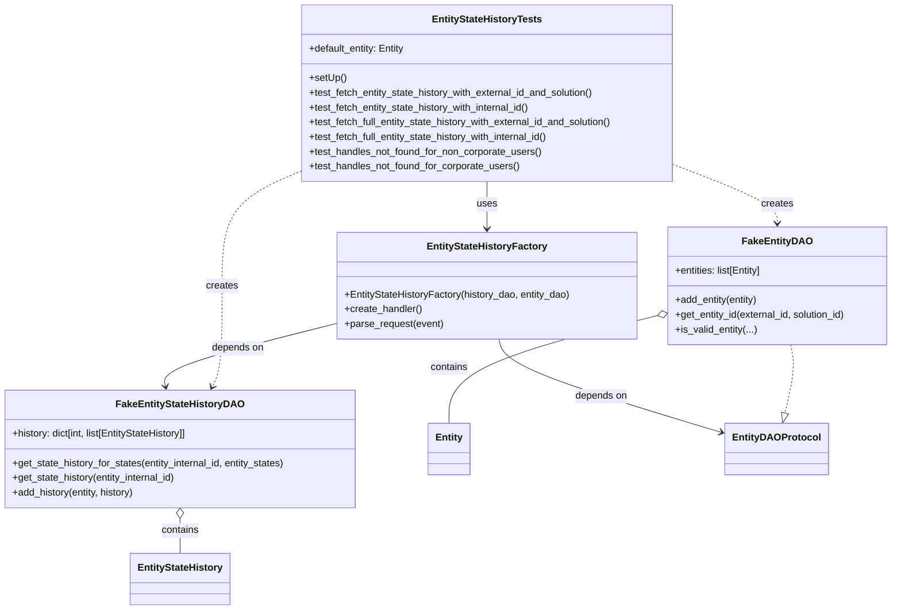
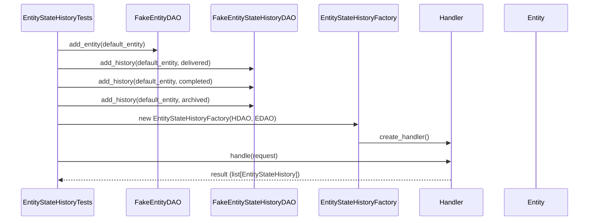
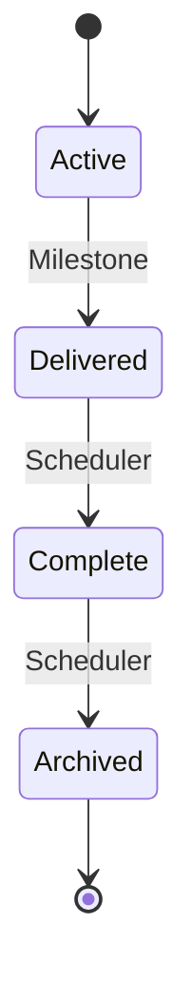

# Diagram: entity_core/entity_service/entity_workflow/entity_workflow_tests/unit/test_entity_state_history.py

> Auto-generated by Obscura crawlers

## Diagram 1

### SVG

<svg id="container" width="1459.9609375" xmlns="http://www.w3.org/2000/svg" class="classDiagram" height="994" viewBox="0 0 1459.9609375 994" role="graphics-document document" aria-roledescription="class"><g><defs><marker id="container_class-aggregationStart" class="marker aggregation class" refX="18" refY="7" markerWidth="190" markerHeight="240" orient="auto"><path d="M 18,7 L9,13 L1,7 L9,1 Z"></path></marker></defs><defs><marker id="container_class-aggregationEnd" class="marker aggregation class" refX="1" refY="7" markerWidth="20" markerHeight="28" orient="auto"><path d="M 18,7 L9,13 L1,7 L9,1 Z"></path></marker></defs><defs><marker id="container_class-extensionStart" class="marker extension class" refX="18" refY="7" markerWidth="190" markerHeight="240" orient="auto"><path d="M 1,7 L18,13 V 1 Z"></path></marker></defs><defs><marker id="container_class-extensionEnd" class="marker extension class" refX="1" refY="7" markerWidth="20" markerHeight="28" orient="auto"><path d="M 1,1 V 13 L18,7 Z"></path></marker></defs><defs><marker id="container_class-compositionStart" class="marker composition class" refX="18" refY="7" markerWidth="190" markerHeight="240" orient="auto"><path d="M 18,7 L9,13 L1,7 L9,1 Z"></path></marker></defs><defs><marker id="container_class-compositionEnd" class="marker composition class" refX="1" refY="7" markerWidth="20" markerHeight="28" orient="auto"><path d="M 18,7 L9,13 L1,7 L9,1 Z"></path></marker></defs><defs><marker id="container_class-dependencyStart" class="marker dependency class" refX="6" refY="7" markerWidth="190" markerHeight="240" orient="auto"><path d="M 5,7 L9,13 L1,7 L9,1 Z"></path></marker></defs><defs><marker id="container_class-dependencyEnd" class="marker dependency class" refX="13" refY="7" markerWidth="20" markerHeight="28" orient="auto"><path d="M 18,7 L9,13 L14,7 L9,1 Z"></path></marker></defs><defs><marker id="container_class-lollipopStart" class="marker lollipop class" refX="13" refY="7" markerWidth="190" markerHeight="240" orient="auto"><circle stroke="black" fill="transparent" cx="7" cy="7" r="6"></circle></marker></defs><defs><marker id="container_class-lollipopEnd" class="marker lollipop class" refX="1" refY="7" markerWidth="190" markerHeight="240" orient="auto"><circle stroke="black" fill="transparent" cx="7" cy="7" r="6"></circle></marker></defs><g class="root"><g class="clusters"></g><g class="edgePaths"><path d="M795.305,296L795.305,302.167C795.305,308.333,795.305,320.667,795.305,333.5C795.305,346.333,795.305,359.667,795.305,366.333L795.305,373" id="id_EntityStateHistoryTests_EntityStateHistoryFactory_1" class="edge-thickness-normal edge-pattern-solid relation" style=";;;" data-edge="true" data-et="edge" data-id="id_EntityStateHistoryTests_EntityStateHistoryFactory_1" data-points="W3sieCI6Nzk1LjMwNDY4NzUsInkiOjI5Nn0seyJ4Ijo3OTUuMzA0Njg3NSwieSI6MzMzfSx7IngiOjc5NS4zMDQ2ODc1LCJ5IjozNzl9XQ==" marker-end="url(#container_class-dependencyEnd)"></path><path d="M550.633,527.301L502.938,539.251C455.242,551.201,359.852,575.1,313.385,592.244C266.919,609.387,269.377,619.774,270.606,624.968L271.835,630.161" id="id_EntityStateHistoryFactory_FakeEntityStateHistoryDAO_2" class="edge-thickness-normal edge-pattern-solid relation" style=";;;" data-edge="true" data-et="edge" data-id="id_EntityStateHistoryFactory_FakeEntityStateHistoryDAO_2" data-points="W3sieCI6NTUwLjYzMjgxMjUsInkiOjUyNy4zMDEyMDA5MTgzNDkzfSx7IngiOjI2NC40NjA5Mzc1LCJ5Ijo1OTl9LHsieCI6MjczLjIxNjQ4ODQ4Njg0MjEsInkiOjYzNn1d" marker-end="url(#container_class-dependencyEnd)"></path><path d="M815.099,553L816.843,560.667C818.587,568.333,822.076,583.667,883.695,609.261C945.314,634.855,1065.063,670.711,1124.938,688.639L1184.813,706.566" id="id_EntityStateHistoryFactory_EntityDAOProtocol_3" class="edge-thickness-normal edge-pattern-solid relation" style=";;;" data-edge="true" data-et="edge" data-id="id_EntityStateHistoryFactory_EntityDAOProtocol_3" data-points="W3sieCI6ODE1LjA5ODY2OTUyNTM3NiwieSI6NTUzfSx7IngiOjgyNS41NjQ0NTMxMjUsInkiOjU5OX0seyJ4IjoxMTkwLjU2MDU0Njg3NSwieSI6NzA4LjI4NzMwMjI0MzM2NzF9XQ==" marker-end="url(#container_class-dependencyEnd)"></path><path d="M1292.81,562L1294.213,568.167C1295.616,574.333,1298.422,586.667,1296.899,605.202C1295.375,623.738,1289.521,648.476,1286.594,660.845L1283.667,673.214" id="id_FakeEntityDAO_EntityDAOProtocol_4" class="edge-thickness-normal edge-pattern-dashed relation" style=";;;" data-edge="true" data-et="edge" data-id="id_FakeEntityDAO_EntityDAOProtocol_4" data-points="W3sieCI6MTI5Mi44MTAzODUzMzgzNDYsInkiOjU2Mn0seyJ4IjoxMzAxLjIyODUxNTYyNSwieSI6NTk5fSx7IngiOjEyNzkuNjk0NTkyOTI3NjMxNywieSI6NjkwfV0=" marker-end="url(#container_class-extensionEnd)"></path><path d="M295.934,845.25L295.934,848.542C295.934,851.833,295.934,858.417,295.934,867.875C295.934,877.333,295.934,889.667,295.934,895.833L295.934,902" id="id_FakeEntityStateHistoryDAO_EntityStateHistory_5" class="edge-thickness-normal edge-pattern-solid relation" style=";;;" data-edge="true" data-et="edge" data-id="id_FakeEntityStateHistoryDAO_EntityStateHistory_5" data-points="W3sieCI6Mjk1LjkzMzU5Mzc1LCJ5Ijo4Mjh9LHsieCI6Mjk1LjkzMzU5Mzc1LCJ5Ijo4NjV9LHsieCI6Mjk1LjkzMzU5Mzc1LCJ5Ijo5MDJ9XQ==" marker-start="url(#container_class-aggregationStart)"></path><path d="M1073.228,514.771L1016.312,528.809C959.395,542.848,845.562,570.924,788.645,600.129C731.729,629.333,731.729,659.667,731.729,674.833L731.729,690" id="id_FakeEntityDAO_Entity_6" class="edge-thickness-normal edge-pattern-solid relation" style=";;;" data-edge="true" data-et="edge" data-id="id_FakeEntityDAO_Entity_6" data-points="W3sieCI6MTA4OS45NzY1NjI1LCJ5Ijo1MTAuNjQwNTEzNDUzODk3NH0seyJ4Ijo3MzEuNzI4NTE1NjI1LCJ5Ijo1OTl9LHsieCI6NzMxLjcyODUxNTYyNSwieSI6NjkwfV0=" marker-start="url(#container_class-aggregationStart)"></path><path d="M1103.727,269.361L1131.6,279.967C1159.474,290.574,1215.221,311.787,1243.095,327.56C1270.969,343.333,1270.969,353.667,1270.969,358.833L1270.969,364" id="id_EntityStateHistoryTests_FakeEntityDAO_7" class="edge-thickness-normal edge-pattern-dashed relation" style=";;;" data-edge="true" data-et="edge" data-id="id_EntityStateHistoryTests_FakeEntityDAO_7" data-points="W3sieCI6MTEwMy43MjY1NjI1LCJ5IjoyNjkuMzYwODkzNDg3NzIyNzZ9LHsieCI6MTI3MC45Njg3NSwieSI6MzMzfSx7IngiOjEyNzAuOTY4NzUsInkiOjM3MH1d" marker-end="url(#container_class-dependencyEnd)"></path><path d="M486.883,280.394L465.821,289.161C444.76,297.929,402.637,315.465,381.575,346.399C360.514,377.333,360.514,421.667,360.514,466C360.514,510.333,360.514,554.667,357.956,582.1C355.399,609.534,350.284,620.068,347.726,625.336L345.169,630.603" id="id_EntityStateHistoryTests_FakeEntityStateHistoryDAO_8" class="edge-thickness-normal edge-pattern-dashed relation" style=";;;" data-edge="true" data-et="edge" data-id="id_EntityStateHistoryTests_FakeEntityStateHistoryDAO_8" data-points="W3sieCI6NDg2Ljg4MjgxMjUsInkiOjI4MC4zOTM1NDM5NTI5NTg3fSx7IngiOjM2MC41MTM2NzE4NzUsInkiOjMzM30seyJ4IjozNjAuNTEzNjcxODc1LCJ5Ijo0NjZ9LHsieCI6MzYwLjUxMzY3MTg3NSwieSI6NTk5fSx7IngiOjM0Mi41NDc3ODU0NzkzMjMzLCJ5Ijo2MzZ9XQ==" marker-end="url(#container_class-dependencyEnd)"></path></g><g class="edgeLabels"><g class="edgeLabel" transform="translate(795.3046875, 333)"><g class="label" data-id="id_EntityStateHistoryTests_EntityStateHistoryFactory_1" transform="translate(-16.4921875, -12)"><foreignObject width="32.984375" height="24">

uses

</foreignObject></g></g><g class="edgeLabel" transform="translate(389.10594, 567.77088)"><g class="label" data-id="id_EntityStateHistoryFactory_FakeEntityStateHistoryDAO_2" transform="translate(-42.9453125, -12)"><foreignObject width="85.890625" height="24">

depends on

</foreignObject></g></g><g class="edgeLabel" transform="translate(985.46591, 646.87777)"><g class="label" data-id="id_EntityStateHistoryFactory_EntityDAOProtocol_3" transform="translate(-42.9453125, -12)"><foreignObject width="85.890625" height="24">

depends on

</foreignObject></g></g><g class="edgeLabel"><g class="label" data-id="id_FakeEntityDAO_EntityDAOProtocol_4" transform="translate(0, 0)"><foreignObject width="0" height="0">

</foreignObject></g></g><g class="edgeLabel" transform="translate(295.93359375, 865)"><g class="label" data-id="id_FakeEntityStateHistoryDAO_EntityStateHistory_5" transform="translate(-30.890625, -12)"><foreignObject width="61.78125" height="24">

contains

</foreignObject></g></g><g class="edgeLabel" transform="translate(731.728515625, 599)"><g class="label" data-id="id_FakeEntityDAO_Entity_6" transform="translate(-30.890625, -12)"><foreignObject width="61.78125" height="24">

contains

</foreignObject></g></g><g class="edgeLabel" transform="translate(1270.96875, 333)"><g class="label" data-id="id_EntityStateHistoryTests_FakeEntityDAO_7" transform="translate(-26.171875, -12)"><foreignObject width="52.34375" height="24">

creates

</foreignObject></g></g><g class="edgeLabel" transform="translate(360.513671875, 466)"><g class="label" data-id="id_EntityStateHistoryTests_FakeEntityStateHistoryDAO_8" transform="translate(-26.171875, -12)"><foreignObject width="52.34375" height="24">

creates

</foreignObject></g></g></g><g class="nodes"><g class="node default" id="classId-EntityStateHistoryTests-0" transform="translate(795.3046875, 152)"><g class="basic label-container"><path d="M-308.421875 -144 L308.421875 -144 L308.421875 144 L-308.421875 144" stroke="none" stroke-width="0" fill="#ECECFF" style=""></path><path d="M-308.421875 -144 C-144.61705217825906 -144, 19.187770643481883 -144, 308.421875 -144 M-308.421875 -144 C-152.95057008232513 -144, 2.5207348353497423 -144, 308.421875 -144 M308.421875 -144 C308.421875 -43.312865091630215, 308.421875 57.37426981673957, 308.421875 144 M308.421875 -144 C308.421875 -64.61194939344749, 308.421875 14.776101213105022, 308.421875 144 M308.421875 144 C140.11470939479167 144, -28.19245621041665 144, -308.421875 144 M308.421875 144 C181.70709788223348 144, 54.99232076446694 144, -308.421875 144 M-308.421875 144 C-308.421875 42.39263883253045, -308.421875 -59.2147223349391, -308.421875 -144 M-308.421875 144 C-308.421875 55.87029643394453, -308.421875 -32.25940713211094, -308.421875 -144" stroke="#9370DB" stroke-width="1.3" fill="none" stroke-dasharray="0 0" style=""></path></g><g class="annotation-group text" transform="translate(0, -120)"></g><g class="label-group text" transform="translate(-86.125, -120)"><g class="label" style="font-weight: bolder" transform="translate(0,-12)"><foreignObject width="172.25" height="24">

EntityStateHistoryTests

</foreignObject></g></g><g class="members-group text" transform="translate(-296.421875, -72)"><g class="label" style="" transform="translate(0,-12)"><foreignObject width="159.5" height="24">

+default_entity: Entity

</foreignObject></g></g><g class="methods-group text" transform="translate(-296.421875, -24)"><g class="label" style="" transform="translate(0,-12)"><foreignObject width="60.421875" height="24">

+setUp()

</foreignObject></g><g class="label" style="" transform="translate(0,12)"><foreignObject width="474.671875" height="24">

+test_fetch_entity_state_history_with_external_id_and_solution()

</foreignObject></g><g class="label" style="" transform="translate(0,36)"><foreignObject width="368.75" height="24">

+test_fetch_entity_state_history_with_internal_id()

</foreignObject></g><g class="label" style="" transform="translate(0,60)"><foreignObject width="506.71875" height="24">

+test_fetch_full_entity_state_history_with_external_id_and_solution()

</foreignObject></g><g class="label" style="" transform="translate(0,84)"><foreignObject width="400.796875" height="24">

+test_fetch_full_entity_state_history_with_internal_id()

</foreignObject></g><g class="label" style="" transform="translate(0,108)"><foreignObject width="383.9375" height="24">

+test_handles_not_found_for_non_corporate_users()

</foreignObject></g><g class="label" style="" transform="translate(0,132)"><foreignObject width="347.53125" height="24">

+test_handles_not_found_for_corporate_users()

</foreignObject></g></g><g class="divider" style=""><path d="M-308.421875 -96 C-152.02912782313183 -96, 4.36361935373634 -96, 308.421875 -96 M-308.421875 -96 C-166.64278367708386 -96, -24.86369235416771 -96, 308.421875 -96" stroke="#9370DB" stroke-width="1.3" fill="none" stroke-dasharray="0 0" style=""></path></g><g class="divider" style=""><path d="M-308.421875 -48 C-166.17414497517885 -48, -23.926414950357696 -48, 308.421875 -48 M-308.421875 -48 C-110.23207282015446 -48, 87.95772935969109 -48, 308.421875 -48" stroke="#9370DB" stroke-width="1.3" fill="none" stroke-dasharray="0 0" style=""></path></g></g><g class="node default" id="classId-FakeEntityStateHistoryDAO-1" transform="translate(295.93359375, 732)"><g class="basic label-container"><path d="M-287.93359375 -96 L287.93359375 -96 L287.93359375 96 L-287.93359375 96" stroke="none" stroke-width="0" fill="#ECECFF" style=""></path><path d="M-287.93359375 -96 C-138.32887939209317 -96, 11.275834965813658 -96, 287.93359375 -96 M-287.93359375 -96 C-155.75158440557442 -96, -23.56957506114884 -96, 287.93359375 -96 M287.93359375 -96 C287.93359375 -25.054126042357268, 287.93359375 45.891747915285464, 287.93359375 96 M287.93359375 -96 C287.93359375 -46.884040937099826, 287.93359375 2.231918125800348, 287.93359375 96 M287.93359375 96 C102.38261555662268 96, -83.16836263675464 96, -287.93359375 96 M287.93359375 96 C85.94020866710957 96, -116.05317641578085 96, -287.93359375 96 M-287.93359375 96 C-287.93359375 21.767526775397812, -287.93359375 -52.464946449204376, -287.93359375 -96 M-287.93359375 96 C-287.93359375 53.14384866650801, -287.93359375 10.287697333016027, -287.93359375 -96" stroke="#9370DB" stroke-width="1.3" fill="none" stroke-dasharray="0 0" style=""></path></g><g class="annotation-group text" transform="translate(0, -72)"></g><g class="label-group text" transform="translate(-98.8359375, -72)"><g class="label" style="font-weight: bolder" transform="translate(0,-12)"><foreignObject width="197.671875" height="24">

FakeEntityStateHistoryDAO

</foreignObject></g></g><g class="members-group text" transform="translate(-275.93359375, -24)"><g class="label" style="" transform="translate(0,-12)"><foreignObject width="295.5625" height="24">

+history: dict[int, list[EntityStateHistory]]

</foreignObject></g></g><g class="methods-group text" transform="translate(-275.93359375, 24)"><g class="label" style="" transform="translate(0,-12)"><foreignObject width="453.03125" height="24">

+get_state_history_for_states(entity_internal_id, entity_states)

</foreignObject></g><g class="label" style="" transform="translate(0,12)"><foreignObject width="272.75" height="24">

+get_state_history(entity_internal_id)

</foreignObject></g><g class="label" style="" transform="translate(0,36)"><foreignObject width="204.25" height="24">

+add_history(entity, history)

</foreignObject></g></g><g class="divider" style=""><path d="M-287.93359375 -48 C-77.74809683601151 -48, 132.43740007797697 -48, 287.93359375 -48 M-287.93359375 -48 C-117.7250935873501 -48, 52.483406575299796 -48, 287.93359375 -48" stroke="#9370DB" stroke-width="1.3" fill="none" stroke-dasharray="0 0" style=""></path></g><g class="divider" style=""><path d="M-287.93359375 0 C-99.58362591676334 0, 88.76634191647332 0, 287.93359375 0 M-287.93359375 0 C-82.24525129278726 0, 123.44309116442548 0, 287.93359375 0" stroke="#9370DB" stroke-width="1.3" fill="none" stroke-dasharray="0 0" style=""></path></g></g><g class="node default" id="classId-FakeEntityDAO-2" transform="translate(1270.96875, 466)"><g class="basic label-container"><path d="M-180.9921875 -96 L180.9921875 -96 L180.9921875 96 L-180.9921875 96" stroke="none" stroke-width="0" fill="#ECECFF" style=""></path><path d="M-180.9921875 -96 C-88.12008523989851 -96, 4.75201702020297 -96, 180.9921875 -96 M-180.9921875 -96 C-103.93862622577778 -96, -26.885064951555563 -96, 180.9921875 -96 M180.9921875 -96 C180.9921875 -31.783691052441952, 180.9921875 32.432617895116095, 180.9921875 96 M180.9921875 -96 C180.9921875 -20.985242351306766, 180.9921875 54.02951529738647, 180.9921875 96 M180.9921875 96 C66.5270962169845 96, -47.93799506603099 96, -180.9921875 96 M180.9921875 96 C90.57986626394444 96, 0.16754502788887748 96, -180.9921875 96 M-180.9921875 96 C-180.9921875 55.476033755630596, -180.9921875 14.952067511261191, -180.9921875 -96 M-180.9921875 96 C-180.9921875 37.71118204833316, -180.9921875 -20.577635903333686, -180.9921875 -96" stroke="#9370DB" stroke-width="1.3" fill="none" stroke-dasharray="0 0" style=""></path></g><g class="annotation-group text" transform="translate(0, -72)"></g><g class="label-group text" transform="translate(-53.109375, -72)"><g class="label" style="font-weight: bolder" transform="translate(0,-12)"><foreignObject width="106.21875" height="24">

FakeEntityDAO

</foreignObject></g></g><g class="members-group text" transform="translate(-168.9921875, -24)"><g class="label" style="" transform="translate(0,-12)"><foreignObject width="145.3125" height="24">

+entities: list[Entity]

</foreignObject></g></g><g class="methods-group text" transform="translate(-168.9921875, 24)"><g class="label" style="" transform="translate(0,-12)"><foreignObject width="137.859375" height="24">

+add_entity(entity)

</foreignObject></g><g class="label" style="" transform="translate(0,12)"><foreignObject width="284.875" height="24">

+get_entity_id(external_id, solution_id)

</foreignObject></g><g class="label" style="" transform="translate(0,36)"><foreignObject width="134.265625" height="24">

+is_valid_entity(...)

</foreignObject></g></g><g class="divider" style=""><path d="M-180.9921875 -48 C-65.5842903159436 -48, 49.82360686811279 -48, 180.9921875 -48 M-180.9921875 -48 C-98.28815992672145 -48, -15.584132353442897 -48, 180.9921875 -48" stroke="#9370DB" stroke-width="1.3" fill="none" stroke-dasharray="0 0" style=""></path></g><g class="divider" style=""><path d="M-180.9921875 0 C-47.853757445870656 0, 85.28467260825869 0, 180.9921875 0 M-180.9921875 0 C-53.72055922370956 0, 73.55106905258089 0, 180.9921875 0" stroke="#9370DB" stroke-width="1.3" fill="none" stroke-dasharray="0 0" style=""></path></g></g><g class="node default" id="classId-EntityStateHistoryFactory-3" transform="translate(795.3046875, 466)"><g class="basic label-container"><path d="M-244.671875 -87 L244.671875 -87 L244.671875 87 L-244.671875 87" stroke="none" stroke-width="0" fill="#ECECFF" style=""></path><path d="M-244.671875 -87 C-56.289838443198136 -87, 132.09219811360373 -87, 244.671875 -87 M-244.671875 -87 C-83.07023942877555 -87, 78.5313961424489 -87, 244.671875 -87 M244.671875 -87 C244.671875 -31.566818529369968, 244.671875 23.866362941260064, 244.671875 87 M244.671875 -87 C244.671875 -25.05172705090773, 244.671875 36.89654589818454, 244.671875 87 M244.671875 87 C127.91942258613066 87, 11.16697017226133 87, -244.671875 87 M244.671875 87 C63.23803480705129 87, -118.19580538589742 87, -244.671875 87 M-244.671875 87 C-244.671875 36.83049860918496, -244.671875 -13.339002781630086, -244.671875 -87 M-244.671875 87 C-244.671875 44.61339269178748, -244.671875 2.2267853835749634, -244.671875 -87" stroke="#9370DB" stroke-width="1.3" fill="none" stroke-dasharray="0 0" style=""></path></g><g class="annotation-group text" transform="translate(0, -63)"></g><g class="label-group text" transform="translate(-93.609375, -63)"><g class="label" style="font-weight: bolder" transform="translate(0,-12)"><foreignObject width="187.21875" height="24">

EntityStateHistoryFactory

</foreignObject></g></g><g class="members-group text" transform="translate(-232.671875, -15)"></g><g class="methods-group text" transform="translate(-232.671875, 15)"><g class="label" style="" transform="translate(0,-12)"><foreignObject width="371.734375" height="24">

+EntityStateHistoryFactory(history_dao, entity_dao)

</foreignObject></g><g class="label" style="" transform="translate(0,12)"><foreignObject width="127.75" height="24">

+create_handler()

</foreignObject></g><g class="label" style="" transform="translate(0,36)"><foreignObject width="162.140625" height="24">

+parse_request(event)

</foreignObject></g></g><g class="divider" style=""><path d="M-244.671875 -39 C-70.77019652002724 -39, 103.13148195994552 -39, 244.671875 -39 M-244.671875 -39 C-92.9431621694333 -39, 58.78555066113341 -39, 244.671875 -39" stroke="#9370DB" stroke-width="1.3" fill="none" stroke-dasharray="0 0" style=""></path></g><g class="divider" style=""><path d="M-244.671875 -15 C-136.54863610155098 -15, -28.425397203101994 -15, 244.671875 -15 M-244.671875 -15 C-144.46734190654314 -15, -44.26280881308631 -15, 244.671875 -15" stroke="#9370DB" stroke-width="1.3" fill="none" stroke-dasharray="0 0" style=""></path></g></g><g class="node default" id="classId-EntityStateHistory-4" transform="translate(295.93359375, 944)"><g class="basic label-container"><path d="M-79.015625 -42 L79.015625 -42 L79.015625 42 L-79.015625 42" stroke="none" stroke-width="0" fill="#ECECFF" style=""></path><path d="M-79.015625 -42 C-24.69230079653935 -42, 29.6310234069213 -42, 79.015625 -42 M-79.015625 -42 C-42.139002524540516 -42, -5.262380049081031 -42, 79.015625 -42 M79.015625 -42 C79.015625 -14.96007722093169, 79.015625 12.079845558136618, 79.015625 42 M79.015625 -42 C79.015625 -10.47812558163282, 79.015625 21.04374883673436, 79.015625 42 M79.015625 42 C41.6254251018229 42, 4.235225203645797 42, -79.015625 42 M79.015625 42 C38.40547162104923 42, -2.2046817579015396 42, -79.015625 42 M-79.015625 42 C-79.015625 24.044653442057825, -79.015625 6.089306884115651, -79.015625 -42 M-79.015625 42 C-79.015625 9.200569802484225, -79.015625 -23.59886039503155, -79.015625 -42" stroke="#9370DB" stroke-width="1.3" fill="none" stroke-dasharray="0 0" style=""></path></g><g class="annotation-group text" transform="translate(0, -18)"></g><g class="label-group text" transform="translate(-67.015625, -18)"><g class="label" style="font-weight: bolder" transform="translate(0,-12)"><foreignObject width="134.03125" height="24">

EntityStateHistory

</foreignObject></g></g><g class="members-group text" transform="translate(-67.015625, 30)"></g><g class="methods-group text" transform="translate(-67.015625, 60)"></g><g class="divider" style=""><path d="M-79.015625 6 C-36.49560326874056 6, 6.024418462518881 6, 79.015625 6 M-79.015625 6 C-36.98300904833473 6, 5.049606903330542 6, 79.015625 6" stroke="#9370DB" stroke-width="1.3" fill="none" stroke-dasharray="0 0" style=""></path></g><g class="divider" style=""><path d="M-79.015625 24 C-35.000341815278766 24, 9.014941369442468 24, 79.015625 24 M-79.015625 24 C-37.02640359299583 24, 4.962817814008346 24, 79.015625 24" stroke="#9370DB" stroke-width="1.3" fill="none" stroke-dasharray="0 0" style=""></path></g></g><g class="node default" id="classId-Entity-5" transform="translate(731.728515625, 732)"><g class="basic label-container"><path d="M-33.28125 -42 L33.28125 -42 L33.28125 42 L-33.28125 42" stroke="none" stroke-width="0" fill="#ECECFF" style=""></path><path d="M-33.28125 -42 C-12.471607277006978 -42, 8.338035445986044 -42, 33.28125 -42 M-33.28125 -42 C-7.72428130703074 -42, 17.83268738593852 -42, 33.28125 -42 M33.28125 -42 C33.28125 -18.539934663826955, 33.28125 4.92013067234609, 33.28125 42 M33.28125 -42 C33.28125 -18.876257424673376, 33.28125 4.247485150653247, 33.28125 42 M33.28125 42 C8.989091119855605 42, -15.30306776028879 42, -33.28125 42 M33.28125 42 C16.59105713673637 42, -0.09913572652725833 42, -33.28125 42 M-33.28125 42 C-33.28125 24.927846995353033, -33.28125 7.855693990706065, -33.28125 -42 M-33.28125 42 C-33.28125 15.035403153652322, -33.28125 -11.929193692695357, -33.28125 -42" stroke="#9370DB" stroke-width="1.3" fill="none" stroke-dasharray="0 0" style=""></path></g><g class="annotation-group text" transform="translate(0, -18)"></g><g class="label-group text" transform="translate(-21.28125, -18)"><g class="label" style="font-weight: bolder" transform="translate(0,-12)"><foreignObject width="42.5625" height="24">

Entity

</foreignObject></g></g><g class="members-group text" transform="translate(-21.28125, 30)"></g><g class="methods-group text" transform="translate(-21.28125, 60)"></g><g class="divider" style=""><path d="M-33.28125 6 C-9.682239488966495 6, 13.91677102206701 6, 33.28125 6 M-33.28125 6 C-9.768953783910465 6, 13.74334243217907 6, 33.28125 6" stroke="#9370DB" stroke-width="1.3" fill="none" stroke-dasharray="0 0" style=""></path></g><g class="divider" style=""><path d="M-33.28125 24 C-11.48099834246765 24, 10.3192533150647 24, 33.28125 24 M-33.28125 24 C-19.549539282967785 24, -5.817828565935571 24, 33.28125 24" stroke="#9370DB" stroke-width="1.3" fill="none" stroke-dasharray="0 0" style=""></path></g></g><g class="node default" id="classId-EntityDAOProtocol-6" transform="translate(1269.755859375, 732)"><g class="basic label-container"><path d="M-79.1953125 -42 L79.1953125 -42 L79.1953125 42 L-79.1953125 42" stroke="none" stroke-width="0" fill="#ECECFF" style=""></path><path d="M-79.1953125 -42 C-26.23957415928264 -42, 26.71616418143472 -42, 79.1953125 -42 M-79.1953125 -42 C-27.186085825178445 -42, 24.82314084964311 -42, 79.1953125 -42 M79.1953125 -42 C79.1953125 -21.712649405134982, 79.1953125 -1.4252988102699646, 79.1953125 42 M79.1953125 -42 C79.1953125 -11.436815363770076, 79.1953125 19.126369272459847, 79.1953125 42 M79.1953125 42 C45.506680453361426 42, 11.818048406722852 42, -79.1953125 42 M79.1953125 42 C42.29420455343065 42, 5.393096606861306 42, -79.1953125 42 M-79.1953125 42 C-79.1953125 12.496808762767614, -79.1953125 -17.006382474464772, -79.1953125 -42 M-79.1953125 42 C-79.1953125 25.093058803433696, -79.1953125 8.186117606867391, -79.1953125 -42" stroke="#9370DB" stroke-width="1.3" fill="none" stroke-dasharray="0 0" style=""></path></g><g class="annotation-group text" transform="translate(0, -18)"></g><g class="label-group text" transform="translate(-67.1953125, -18)"><g class="label" style="font-weight: bolder" transform="translate(0,-12)"><foreignObject width="134.390625" height="24">

EntityDAOProtocol

</foreignObject></g></g><g class="members-group text" transform="translate(-67.1953125, 30)"></g><g class="methods-group text" transform="translate(-67.1953125, 60)"></g><g class="divider" style=""><path d="M-79.1953125 6 C-35.313781994337894 6, 8.567748511324211 6, 79.1953125 6 M-79.1953125 6 C-46.6920863280445 6, -14.188860156089007 6, 79.1953125 6" stroke="#9370DB" stroke-width="1.3" fill="none" stroke-dasharray="0 0" style=""></path></g><g class="divider" style=""><path d="M-79.1953125 24 C-30.320282955232422 24, 18.554746589535156 24, 79.1953125 24 M-79.1953125 24 C-41.400730722593906 24, -3.6061489451878117 24, 79.1953125 24" stroke="#9370DB" stroke-width="1.3" fill="none" stroke-dasharray="0 0" style=""></path></g></g></g></g></g></svg>

## Diagram 2

### SVG

<svg id="container" width="1445" xmlns="http://www.w3.org/2000/svg" height="555" viewBox="-50 -10 1445 555" role="graphics-document document" aria-roledescription="sequence"><g><rect x="1195" y="469" fill="#eaeaea" stroke="#666" width="150" height="65" name="EntityObj" rx="3" ry="3" class="actor actor-bottom"></rect><text x="1270" y="501.5" dominant-baseline="central" alignment-baseline="central" class="actor actor-box" style="text-anchor: middle; font-size: 16px; font-weight: 400;"><tspan x="1270" dy="0">Entity</tspan></text></g><g><rect x="995" y="469" fill="#eaeaea" stroke="#666" width="150" height="65" name="Handler" rx="3" ry="3" class="actor actor-bottom"></rect><text x="1070" y="501.5" dominant-baseline="central" alignment-baseline="central" class="actor actor-box" style="text-anchor: middle; font-size: 16px; font-weight: 400;"><tspan x="1070" dy="0">Handler</tspan></text></g><g><rect x="742" y="469" fill="#eaeaea" stroke="#666" width="203" height="65" name="Factory" rx="3" ry="3" class="actor actor-bottom"></rect><text x="843.5" y="501.5" dominant-baseline="central" alignment-baseline="central" class="actor actor-box" style="text-anchor: middle; font-size: 16px; font-weight: 400;"><tspan x="843.5" dy="0">EntityStateHistoryFactory</tspan></text></g><g><rect x="479" y="469" fill="#eaeaea" stroke="#666" width="213" height="65" name="HDAO" rx="3" ry="3" class="actor actor-bottom"></rect><text x="585.5" y="501.5" dominant-baseline="central" alignment-baseline="central" class="actor actor-box" style="text-anchor: middle; font-size: 16px; font-weight: 400;"><tspan x="585.5" dy="0">FakeEntityStateHistoryDAO</tspan></text></g><g><rect x="279" y="469" fill="#eaeaea" stroke="#666" width="150" height="65" name="EDAO" rx="3" ry="3" class="actor actor-bottom"></rect><text x="354" y="501.5" dominant-baseline="central" alignment-baseline="central" class="actor actor-box" style="text-anchor: middle; font-size: 16px; font-weight: 400;"><tspan x="354" dy="0">FakeEntityDAO</tspan></text></g><g><rect x="0" y="469" fill="#eaeaea" stroke="#666" width="188" height="65" name="Test" rx="3" ry="3" class="actor actor-bottom"></rect><text x="94" y="501.5" dominant-baseline="central" alignment-baseline="central" class="actor actor-box" style="text-anchor: middle; font-size: 16px; font-weight: 400;"><tspan x="94" dy="0">EntityStateHistoryTests</tspan></text></g><g><line id="actor5" x1="1270" y1="65" x2="1270" y2="469" class="actor-line 200" stroke-width="0.5px" stroke="#999" name="EntityObj"></line><g id="root-5"><rect x="1195" y="0" fill="#eaeaea" stroke="#666" width="150" height="65" name="EntityObj" rx="3" ry="3" class="actor actor-top"></rect><text x="1270" y="32.5" dominant-baseline="central" alignment-baseline="central" class="actor actor-box" style="text-anchor: middle; font-size: 16px; font-weight: 400;"><tspan x="1270" dy="0">Entity</tspan></text></g></g><g><line id="actor4" x1="1070" y1="65" x2="1070" y2="469" class="actor-line 200" stroke-width="0.5px" stroke="#999" name="Handler"></line><g id="root-4"><rect x="995" y="0" fill="#eaeaea" stroke="#666" width="150" height="65" name="Handler" rx="3" ry="3" class="actor actor-top"></rect><text x="1070" y="32.5" dominant-baseline="central" alignment-baseline="central" class="actor actor-box" style="text-anchor: middle; font-size: 16px; font-weight: 400;"><tspan x="1070" dy="0">Handler</tspan></text></g></g><g><line id="actor3" x1="843.5" y1="65" x2="843.5" y2="469" class="actor-line 200" stroke-width="0.5px" stroke="#999" name="Factory"></line><g id="root-3"><rect x="742" y="0" fill="#eaeaea" stroke="#666" width="203" height="65" name="Factory" rx="3" ry="3" class="actor actor-top"></rect><text x="843.5" y="32.5" dominant-baseline="central" alignment-baseline="central" class="actor actor-box" style="text-anchor: middle; font-size: 16px; font-weight: 400;"><tspan x="843.5" dy="0">EntityStateHistoryFactory</tspan></text></g></g><g><line id="actor2" x1="585.5" y1="65" x2="585.5" y2="469" class="actor-line 200" stroke-width="0.5px" stroke="#999" name="HDAO"></line><g id="root-2"><rect x="479" y="0" fill="#eaeaea" stroke="#666" width="213" height="65" name="HDAO" rx="3" ry="3" class="actor actor-top"></rect><text x="585.5" y="32.5" dominant-baseline="central" alignment-baseline="central" class="actor actor-box" style="text-anchor: middle; font-size: 16px; font-weight: 400;"><tspan x="585.5" dy="0">FakeEntityStateHistoryDAO</tspan></text></g></g><g><line id="actor1" x1="354" y1="65" x2="354" y2="469" class="actor-line 200" stroke-width="0.5px" stroke="#999" name="EDAO"></line><g id="root-1"><rect x="279" y="0" fill="#eaeaea" stroke="#666" width="150" height="65" name="EDAO" rx="3" ry="3" class="actor actor-top"></rect><text x="354" y="32.5" dominant-baseline="central" alignment-baseline="central" class="actor actor-box" style="text-anchor: middle; font-size: 16px; font-weight: 400;"><tspan x="354" dy="0">FakeEntityDAO</tspan></text></g></g><g><line id="actor0" x1="94" y1="65" x2="94" y2="469" class="actor-line 200" stroke-width="0.5px" stroke="#999" name="Test"></line><g id="root-0"><rect x="0" y="0" fill="#eaeaea" stroke="#666" width="188" height="65" name="Test" rx="3" ry="3" class="actor actor-top"></rect><text x="94" y="32.5" dominant-baseline="central" alignment-baseline="central" class="actor actor-box" style="text-anchor: middle; font-size: 16px; font-weight: 400;"><tspan x="94" dy="0">EntityStateHistoryTests</tspan></text></g></g><g></g><defs><symbol id="computer" width="24" height="24"><path transform="scale(.5)" d="M2 2v13h20v-13h-20zm18 11h-16v-9h16v9zm-10.228 6l.466-1h3.524l.467 1h-4.457zm14.228 3h-24l2-6h2.104l-1.33 4h18.45l-1.297-4h2.073l2 6zm-5-10h-14v-7h14v7z"></path></symbol></defs><defs><symbol id="database" fill-rule="evenodd" clip-rule="evenodd"><path transform="scale(.5)" d="M12.258.001l.256.004.255.005.253.008.251.01.249.012.247.015.246.016.242.019.241.02.239.023.236.024.233.027.231.028.229.031.225.032.223.034.22.036.217.038.214.04.211.041.208.043.205.045.201.046.198.048.194.05.191.051.187.053.183.054.18.056.175.057.172.059.168.06.163.061.16.063.155.064.15.066.074.033.073.033.071.034.07.034.069.035.068.035.067.035.066.035.064.036.064.036.062.036.06.036.06.037.058.037.058.037.055.038.055.038.053.038.052.038.051.039.05.039.048.039.047.039.045.04.044.04.043.04.041.04.04.041.039.041.037.041.036.041.034.041.033.042.032.042.03.042.029.042.027.042.026.043.024.043.023.043.021.043.02.043.018.044.017.043.015.044.013.044.012.044.011.045.009.044.007.045.006.045.004.045.002.045.001.045v17l-.001.045-.002.045-.004.045-.006.045-.007.045-.009.044-.011.045-.012.044-.013.044-.015.044-.017.043-.018.044-.02.043-.021.043-.023.043-.024.043-.026.043-.027.042-.029.042-.03.042-.032.042-.033.042-.034.041-.036.041-.037.041-.039.041-.04.041-.041.04-.043.04-.044.04-.045.04-.047.039-.048.039-.05.039-.051.039-.052.038-.053.038-.055.038-.055.038-.058.037-.058.037-.06.037-.06.036-.062.036-.064.036-.064.036-.066.035-.067.035-.068.035-.069.035-.07.034-.071.034-.073.033-.074.033-.15.066-.155.064-.16.063-.163.061-.168.06-.172.059-.175.057-.18.056-.183.054-.187.053-.191.051-.194.05-.198.048-.201.046-.205.045-.208.043-.211.041-.214.04-.217.038-.22.036-.223.034-.225.032-.229.031-.231.028-.233.027-.236.024-.239.023-.241.02-.242.019-.246.016-.247.015-.249.012-.251.01-.253.008-.255.005-.256.004-.258.001-.258-.001-.256-.004-.255-.005-.253-.008-.251-.01-.249-.012-.247-.015-.245-.016-.243-.019-.241-.02-.238-.023-.236-.024-.234-.027-.231-.028-.228-.031-.226-.032-.223-.034-.22-.036-.217-.038-.214-.04-.211-.041-.208-.043-.204-.045-.201-.046-.198-.048-.195-.05-.19-.051-.187-.053-.184-.054-.179-.056-.176-.057-.172-.059-.167-.06-.164-.061-.159-.063-.155-.064-.151-.066-.074-.033-.072-.033-.072-.034-.07-.034-.069-.035-.068-.035-.067-.035-.066-.035-.064-.036-.063-.036-.062-.036-.061-.036-.06-.037-.058-.037-.057-.037-.056-.038-.055-.038-.053-.038-.052-.038-.051-.039-.049-.039-.049-.039-.046-.039-.046-.04-.044-.04-.043-.04-.041-.04-.04-.041-.039-.041-.037-.041-.036-.041-.034-.041-.033-.042-.032-.042-.03-.042-.029-.042-.027-.042-.026-.043-.024-.043-.023-.043-.021-.043-.02-.043-.018-.044-.017-.043-.015-.044-.013-.044-.012-.044-.011-.045-.009-.044-.007-.045-.006-.045-.004-.045-.002-.045-.001-.045v-17l.001-.045.002-.045.004-.045.006-.045.007-.045.009-.044.011-.045.012-.044.013-.044.015-.044.017-.043.018-.044.02-.043.021-.043.023-.043.024-.043.026-.043.027-.042.029-.042.03-.042.032-.042.033-.042.034-.041.036-.041.037-.041.039-.041.04-.041.041-.04.043-.04.044-.04.046-.04.046-.039.049-.039.049-.039.051-.039.052-.038.053-.038.055-.038.056-.038.057-.037.058-.037.06-.037.061-.036.062-.036.063-.036.064-.036.066-.035.067-.035.068-.035.069-.035.07-.034.072-.034.072-.033.074-.033.151-.066.155-.064.159-.063.164-.061.167-.06.172-.059.176-.057.179-.056.184-.054.187-.053.19-.051.195-.05.198-.048.201-.046.204-.045.208-.043.211-.041.214-.04.217-.038.22-.036.223-.034.226-.032.228-.031.231-.028.234-.027.236-.024.238-.023.241-.02.243-.019.245-.016.247-.015.249-.012.251-.01.253-.008.255-.005.256-.004.258-.001.258.001zm-9.258 20.499v.01l.001.021.003.021.004.022.005.021.006.022.007.022.009.023.01.022.011.023.012.023.013.023.015.023.016.024.017.023.018.024.019.024.021.024.022.025.023.024.024.025.052.049.056.05.061.051.066.051.07.051.075.051.079.052.084.052.088.052.092.052.097.052.102.051.105.052.11.052.114.051.119.051.123.051.127.05.131.05.135.05.139.048.144.049.147.047.152.047.155.047.16.045.163.045.167.043.171.043.176.041.178.041.183.039.187.039.19.037.194.035.197.035.202.033.204.031.209.03.212.029.216.027.219.025.222.024.226.021.23.02.233.018.236.016.24.015.243.012.246.01.249.008.253.005.256.004.259.001.26-.001.257-.004.254-.005.25-.008.247-.011.244-.012.241-.014.237-.016.233-.018.231-.021.226-.021.224-.024.22-.026.216-.027.212-.028.21-.031.205-.031.202-.034.198-.034.194-.036.191-.037.187-.039.183-.04.179-.04.175-.042.172-.043.168-.044.163-.045.16-.046.155-.046.152-.047.148-.048.143-.049.139-.049.136-.05.131-.05.126-.05.123-.051.118-.052.114-.051.11-.052.106-.052.101-.052.096-.052.092-.052.088-.053.083-.051.079-.052.074-.052.07-.051.065-.051.06-.051.056-.05.051-.05.023-.024.023-.025.021-.024.02-.024.019-.024.018-.024.017-.024.015-.023.014-.024.013-.023.012-.023.01-.023.01-.022.008-.022.006-.022.006-.022.004-.022.004-.021.001-.021.001-.021v-4.127l-.077.055-.08.053-.083.054-.085.053-.087.052-.09.052-.093.051-.095.05-.097.05-.1.049-.102.049-.105.048-.106.047-.109.047-.111.046-.114.045-.115.045-.118.044-.12.043-.122.042-.124.042-.126.041-.128.04-.13.04-.132.038-.134.038-.135.037-.138.037-.139.035-.142.035-.143.034-.144.033-.147.032-.148.031-.15.03-.151.03-.153.029-.154.027-.156.027-.158.026-.159.025-.161.024-.162.023-.163.022-.165.021-.166.02-.167.019-.169.018-.169.017-.171.016-.173.015-.173.014-.175.013-.175.012-.177.011-.178.01-.179.008-.179.008-.181.006-.182.005-.182.004-.184.003-.184.002h-.37l-.184-.002-.184-.003-.182-.004-.182-.005-.181-.006-.179-.008-.179-.008-.178-.01-.176-.011-.176-.012-.175-.013-.173-.014-.172-.015-.171-.016-.17-.017-.169-.018-.167-.019-.166-.02-.165-.021-.163-.022-.162-.023-.161-.024-.159-.025-.157-.026-.156-.027-.155-.027-.153-.029-.151-.03-.15-.03-.148-.031-.146-.032-.145-.033-.143-.034-.141-.035-.14-.035-.137-.037-.136-.037-.134-.038-.132-.038-.13-.04-.128-.04-.126-.041-.124-.042-.122-.042-.12-.044-.117-.043-.116-.045-.113-.045-.112-.046-.109-.047-.106-.047-.105-.048-.102-.049-.1-.049-.097-.05-.095-.05-.093-.052-.09-.051-.087-.052-.085-.053-.083-.054-.08-.054-.077-.054v4.127zm0-5.654v.011l.001.021.003.021.004.021.005.022.006.022.007.022.009.022.01.022.011.023.012.023.013.023.015.024.016.023.017.024.018.024.019.024.021.024.022.024.023.025.024.024.052.05.056.05.061.05.066.051.07.051.075.052.079.051.084.052.088.052.092.052.097.052.102.052.105.052.11.051.114.051.119.052.123.05.127.051.131.05.135.049.139.049.144.048.147.048.152.047.155.046.16.045.163.045.167.044.171.042.176.042.178.04.183.04.187.038.19.037.194.036.197.034.202.033.204.032.209.03.212.028.216.027.219.025.222.024.226.022.23.02.233.018.236.016.24.014.243.012.246.01.249.008.253.006.256.003.259.001.26-.001.257-.003.254-.006.25-.008.247-.01.244-.012.241-.015.237-.016.233-.018.231-.02.226-.022.224-.024.22-.025.216-.027.212-.029.21-.03.205-.032.202-.033.198-.035.194-.036.191-.037.187-.039.183-.039.179-.041.175-.042.172-.043.168-.044.163-.045.16-.045.155-.047.152-.047.148-.048.143-.048.139-.05.136-.049.131-.05.126-.051.123-.051.118-.051.114-.052.11-.052.106-.052.101-.052.096-.052.092-.052.088-.052.083-.052.079-.052.074-.051.07-.052.065-.051.06-.05.056-.051.051-.049.023-.025.023-.024.021-.025.02-.024.019-.024.018-.024.017-.024.015-.023.014-.023.013-.024.012-.022.01-.023.01-.023.008-.022.006-.022.006-.022.004-.021.004-.022.001-.021.001-.021v-4.139l-.077.054-.08.054-.083.054-.085.052-.087.053-.09.051-.093.051-.095.051-.097.05-.1.049-.102.049-.105.048-.106.047-.109.047-.111.046-.114.045-.115.044-.118.044-.12.044-.122.042-.124.042-.126.041-.128.04-.13.039-.132.039-.134.038-.135.037-.138.036-.139.036-.142.035-.143.033-.144.033-.147.033-.148.031-.15.03-.151.03-.153.028-.154.028-.156.027-.158.026-.159.025-.161.024-.162.023-.163.022-.165.021-.166.02-.167.019-.169.018-.169.017-.171.016-.173.015-.173.014-.175.013-.175.012-.177.011-.178.009-.179.009-.179.007-.181.007-.182.005-.182.004-.184.003-.184.002h-.37l-.184-.002-.184-.003-.182-.004-.182-.005-.181-.007-.179-.007-.179-.009-.178-.009-.176-.011-.176-.012-.175-.013-.173-.014-.172-.015-.171-.016-.17-.017-.169-.018-.167-.019-.166-.02-.165-.021-.163-.022-.162-.023-.161-.024-.159-.025-.157-.026-.156-.027-.155-.028-.153-.028-.151-.03-.15-.03-.148-.031-.146-.033-.145-.033-.143-.033-.141-.035-.14-.036-.137-.036-.136-.037-.134-.038-.132-.039-.13-.039-.128-.04-.126-.041-.124-.042-.122-.043-.12-.043-.117-.044-.116-.044-.113-.046-.112-.046-.109-.046-.106-.047-.105-.048-.102-.049-.1-.049-.097-.05-.095-.051-.093-.051-.09-.051-.087-.053-.085-.052-.083-.054-.08-.054-.077-.054v4.139zm0-5.666v.011l.001.02.003.022.004.021.005.022.006.021.007.022.009.023.01.022.011.023.012.023.013.023.015.023.016.024.017.024.018.023.019.024.021.025.022.024.023.024.024.025.052.05.056.05.061.05.066.051.07.051.075.052.079.051.084.052.088.052.092.052.097.052.102.052.105.051.11.052.114.051.119.051.123.051.127.05.131.05.135.05.139.049.144.048.147.048.152.047.155.046.16.045.163.045.167.043.171.043.176.042.178.04.183.04.187.038.19.037.194.036.197.034.202.033.204.032.209.03.212.028.216.027.219.025.222.024.226.021.23.02.233.018.236.017.24.014.243.012.246.01.249.008.253.006.256.003.259.001.26-.001.257-.003.254-.006.25-.008.247-.01.244-.013.241-.014.237-.016.233-.018.231-.02.226-.022.224-.024.22-.025.216-.027.212-.029.21-.03.205-.032.202-.033.198-.035.194-.036.191-.037.187-.039.183-.039.179-.041.175-.042.172-.043.168-.044.163-.045.16-.045.155-.047.152-.047.148-.048.143-.049.139-.049.136-.049.131-.051.126-.05.123-.051.118-.052.114-.051.11-.052.106-.052.101-.052.096-.052.092-.052.088-.052.083-.052.079-.052.074-.052.07-.051.065-.051.06-.051.056-.05.051-.049.023-.025.023-.025.021-.024.02-.024.019-.024.018-.024.017-.024.015-.023.014-.024.013-.023.012-.023.01-.022.01-.023.008-.022.006-.022.006-.022.004-.022.004-.021.001-.021.001-.021v-4.153l-.077.054-.08.054-.083.053-.085.053-.087.053-.09.051-.093.051-.095.051-.097.05-.1.049-.102.048-.105.048-.106.048-.109.046-.111.046-.114.046-.115.044-.118.044-.12.043-.122.043-.124.042-.126.041-.128.04-.13.039-.132.039-.134.038-.135.037-.138.036-.139.036-.142.034-.143.034-.144.033-.147.032-.148.032-.15.03-.151.03-.153.028-.154.028-.156.027-.158.026-.159.024-.161.024-.162.023-.163.023-.165.021-.166.02-.167.019-.169.018-.169.017-.171.016-.173.015-.173.014-.175.013-.175.012-.177.01-.178.01-.179.009-.179.007-.181.006-.182.006-.182.004-.184.003-.184.001-.185.001-.185-.001-.184-.001-.184-.003-.182-.004-.182-.006-.181-.006-.179-.007-.179-.009-.178-.01-.176-.01-.176-.012-.175-.013-.173-.014-.172-.015-.171-.016-.17-.017-.169-.018-.167-.019-.166-.02-.165-.021-.163-.023-.162-.023-.161-.024-.159-.024-.157-.026-.156-.027-.155-.028-.153-.028-.151-.03-.15-.03-.148-.032-.146-.032-.145-.033-.143-.034-.141-.034-.14-.036-.137-.036-.136-.037-.134-.038-.132-.039-.13-.039-.128-.041-.126-.041-.124-.041-.122-.043-.12-.043-.117-.044-.116-.044-.113-.046-.112-.046-.109-.046-.106-.048-.105-.048-.102-.048-.1-.05-.097-.049-.095-.051-.093-.051-.09-.052-.087-.052-.085-.053-.083-.053-.08-.054-.077-.054v4.153zm8.74-8.179l-.257.004-.254.005-.25.008-.247.011-.244.012-.241.014-.237.016-.233.018-.231.021-.226.022-.224.023-.22.026-.216.027-.212.028-.21.031-.205.032-.202.033-.198.034-.194.036-.191.038-.187.038-.183.04-.179.041-.175.042-.172.043-.168.043-.163.045-.16.046-.155.046-.152.048-.148.048-.143.048-.139.049-.136.05-.131.05-.126.051-.123.051-.118.051-.114.052-.11.052-.106.052-.101.052-.096.052-.092.052-.088.052-.083.052-.079.052-.074.051-.07.052-.065.051-.06.05-.056.05-.051.05-.023.025-.023.024-.021.024-.02.025-.019.024-.018.024-.017.023-.015.024-.014.023-.013.023-.012.023-.01.023-.01.022-.008.022-.006.023-.006.021-.004.022-.004.021-.001.021-.001.021.001.021.001.021.004.021.004.022.006.021.006.023.008.022.01.022.01.023.012.023.013.023.014.023.015.024.017.023.018.024.019.024.02.025.021.024.023.024.023.025.051.05.056.05.06.05.065.051.07.052.074.051.079.052.083.052.088.052.092.052.096.052.101.052.106.052.11.052.114.052.118.051.123.051.126.051.131.05.136.05.139.049.143.048.148.048.152.048.155.046.16.046.163.045.168.043.172.043.175.042.179.041.183.04.187.038.191.038.194.036.198.034.202.033.205.032.21.031.212.028.216.027.22.026.224.023.226.022.231.021.233.018.237.016.241.014.244.012.247.011.25.008.254.005.257.004.26.001.26-.001.257-.004.254-.005.25-.008.247-.011.244-.012.241-.014.237-.016.233-.018.231-.021.226-.022.224-.023.22-.026.216-.027.212-.028.21-.031.205-.032.202-.033.198-.034.194-.036.191-.038.187-.038.183-.04.179-.041.175-.042.172-.043.168-.043.163-.045.16-.046.155-.046.152-.048.148-.048.143-.048.139-.049.136-.05.131-.05.126-.051.123-.051.118-.051.114-.052.11-.052.106-.052.101-.052.096-.052.092-.052.088-.052.083-.052.079-.052.074-.051.07-.052.065-.051.06-.05.056-.05.051-.05.023-.025.023-.024.021-.024.02-.025.019-.024.018-.024.017-.023.015-.024.014-.023.013-.023.012-.023.01-.023.01-.022.008-.022.006-.023.006-.021.004-.022.004-.021.001-.021.001-.021-.001-.021-.001-.021-.004-.021-.004-.022-.006-.021-.006-.023-.008-.022-.01-.022-.01-.023-.012-.023-.013-.023-.014-.023-.015-.024-.017-.023-.018-.024-.019-.024-.02-.025-.021-.024-.023-.024-.023-.025-.051-.05-.056-.05-.06-.05-.065-.051-.07-.052-.074-.051-.079-.052-.083-.052-.088-.052-.092-.052-.096-.052-.101-.052-.106-.052-.11-.052-.114-.052-.118-.051-.123-.051-.126-.051-.131-.05-.136-.05-.139-.049-.143-.048-.148-.048-.152-.048-.155-.046-.16-.046-.163-.045-.168-.043-.172-.043-.175-.042-.179-.041-.183-.04-.187-.038-.191-.038-.194-.036-.198-.034-.202-.033-.205-.032-.21-.031-.212-.028-.216-.027-.22-.026-.224-.023-.226-.022-.231-.021-.233-.018-.237-.016-.241-.014-.244-.012-.247-.011-.25-.008-.254-.005-.257-.004-.26-.001-.26.001z"></path></symbol></defs><defs><symbol id="clock" width="24" height="24"><path transform="scale(.5)" d="M12 2c5.514 0 10 4.486 10 10s-4.486 10-10 10-10-4.486-10-10 4.486-10 10-10zm0-2c-6.627 0-12 5.373-12 12s5.373 12 12 12 12-5.373 12-12-5.373-12-12-12zm5.848 12.459c.202.038.202.333.001.372-1.907.361-6.045 1.111-6.547 1.111-.719 0-1.301-.582-1.301-1.301 0-.512.77-5.447 1.125-7.445.034-.192.312-.181.343.014l.985 6.238 5.394 1.011z"></path></symbol></defs><defs><marker id="arrowhead" refX="7.9" refY="5" markerUnits="userSpaceOnUse" markerWidth="12" markerHeight="12" orient="auto-start-reverse"><path d="M -1 0 L 10 5 L 0 10 z"></path></marker></defs><defs><marker id="crosshead" markerWidth="15" markerHeight="8" orient="auto" refX="4" refY="4.5"><path fill="none" stroke="#000000" stroke-width="1pt" d="M 1,2 L 6,7 M 6,2 L 1,7" style="stroke-dasharray: 0, 0;"></path></marker></defs><defs><marker id="filled-head" refX="15.5" refY="7" markerWidth="20" markerHeight="28" orient="auto"><path d="M 18,7 L9,13 L14,7 L9,1 Z"></path></marker></defs><defs><marker id="sequencenumber" refX="15" refY="15" markerWidth="60" markerHeight="40" orient="auto"><circle cx="15" cy="15" r="6"></circle></marker></defs><text x="223" y="80" text-anchor="middle" dominant-baseline="middle" alignment-baseline="middle" class="messageText" dy="1em" style="font-size: 16px; font-weight: 400;">add_entity(default_entity)</text><line x1="95" y1="113" x2="350" y2="113" class="messageLine0" stroke-width="2" stroke="none" marker-end="url(#arrowhead)" style="fill: none;"></line><text x="338" y="128" text-anchor="middle" dominant-baseline="middle" alignment-baseline="middle" class="messageText" dy="1em" style="font-size: 16px; font-weight: 400;">add_history(default_entity, delivered)</text><line x1="95" y1="161" x2="581.5" y2="161" class="messageLine0" stroke-width="2" stroke="none" marker-end="url(#arrowhead)" style="fill: none;"></line><text x="338" y="176" text-anchor="middle" dominant-baseline="middle" alignment-baseline="middle" class="messageText" dy="1em" style="font-size: 16px; font-weight: 400;">add_history(default_entity, completed)</text><line x1="95" y1="209" x2="581.5" y2="209" class="messageLine0" stroke-width="2" stroke="none" marker-end="url(#arrowhead)" style="fill: none;"></line><text x="338" y="224" text-anchor="middle" dominant-baseline="middle" alignment-baseline="middle" class="messageText" dy="1em" style="font-size: 16px; font-weight: 400;">add_history(default_entity, archived)</text><line x1="95" y1="257" x2="581.5" y2="257" class="messageLine0" stroke-width="2" stroke="none" marker-end="url(#arrowhead)" style="fill: none;"></line><text x="467" y="272" text-anchor="middle" dominant-baseline="middle" alignment-baseline="middle" class="messageText" dy="1em" style="font-size: 16px; font-weight: 400;">new EntityStateHistoryFactory(HDAO, EDAO)</text><line x1="95" y1="305" x2="839.5" y2="305" class="messageLine0" stroke-width="2" stroke="none" marker-end="url(#arrowhead)" style="fill: none;"></line><text x="955" y="320" text-anchor="middle" dominant-baseline="middle" alignment-baseline="middle" class="messageText" dy="1em" style="font-size: 16px; font-weight: 400;">create_handler()</text><line x1="844.5" y1="353" x2="1066" y2="353" class="messageLine0" stroke-width="2" stroke="none" marker-end="url(#arrowhead)" style="fill: none;"></line><text x="581" y="368" text-anchor="middle" dominant-baseline="middle" alignment-baseline="middle" class="messageText" dy="1em" style="font-size: 16px; font-weight: 400;">handle(request)</text><line x1="95" y1="401" x2="1066" y2="401" class="messageLine0" stroke-width="2" stroke="none" marker-end="url(#arrowhead)" style="fill: none;"></line><text x="584" y="416" text-anchor="middle" dominant-baseline="middle" alignment-baseline="middle" class="messageText" dy="1em" style="font-size: 16px; font-weight: 400;">result (list[EntityStateHistory])</text><line x1="1069" y1="449" x2="98" y2="449" class="messageLine1" stroke-width="2" stroke="none" marker-end="url(#arrowhead)" style="stroke-dasharray: 3, 3; fill: none;"></line></svg>

## Diagram 3

### SVG

<svg id="container" width="100.796875" xmlns="http://www.w3.org/2000/svg" class="statediagram" height="526" viewBox="0 0 100.796875 526" role="graphics-document document" aria-roledescription="stateDiagram"><g><defs><marker id="container_stateDiagram-barbEnd" refX="19" refY="7" markerWidth="20" markerHeight="14" markerUnits="userSpaceOnUse" orient="auto"><path d="M 19,7 L9,13 L14,7 L9,1 Z"></path></marker></defs><g class="root"><g class="clusters"></g><g class="edgePaths"><path d="M50.398,22L50.398,26.167C50.398,30.333,50.398,38.667,50.482,47.083C50.565,55.5,50.732,64,50.815,68.25L50.898,72.5" id="edge0" class="edge-thickness-normal edge-pattern-solid transition" style="fill:none;;;fill:none" data-edge="true" data-et="edge" data-id="edge0" data-points="W3sieCI6NTAuMzk4NDM3NSwieSI6MjJ9LHsieCI6NTAuMzk4NDM3NSwieSI6NDd9LHsieCI6NTAuODk4NDM3NSwieSI6NzIuNX1d" marker-end="url(#container_stateDiagram-barbEnd)"></path><path d="M50.898,112.5L50.815,118.583C50.732,124.667,50.565,136.833,50.565,149.167C50.565,161.5,50.732,174,50.815,180.25L50.898,186.5" id="edge1" class="edge-thickness-normal edge-pattern-solid transition" style="fill:none;;;fill:none" data-edge="true" data-et="edge" data-id="edge1" data-points="W3sieCI6NTAuODk4NDM3NSwieSI6MTEyLjV9LHsieCI6NTAuMzk4NDM3NSwieSI6MTQ5fSx7IngiOjUwLjg5ODQzNzUsInkiOjE4Ni41fV0=" marker-end="url(#container_stateDiagram-barbEnd)"></path><path d="M50.898,226.5L50.815,232.583C50.732,238.667,50.565,250.833,50.565,263.167C50.565,275.5,50.732,288,50.815,294.25L50.898,300.5" id="edge2" class="edge-thickness-normal edge-pattern-solid transition" style="fill:none;;;fill:none" data-edge="true" data-et="edge" data-id="edge2" data-points="W3sieCI6NTAuODk4NDM3NSwieSI6MjI2LjV9LHsieCI6NTAuMzk4NDM3NSwieSI6MjYzfSx7IngiOjUwLjg5ODQzNzUsInkiOjMwMC41fV0=" marker-end="url(#container_stateDiagram-barbEnd)"></path><path d="M50.898,340.5L50.815,346.583C50.732,352.667,50.565,364.833,50.565,377.167C50.565,389.5,50.732,402,50.815,408.25L50.898,414.5" id="edge3" class="edge-thickness-normal edge-pattern-solid transition" style="fill:none;;;fill:none" data-edge="true" data-et="edge" data-id="edge3" data-points="W3sieCI6NTAuODk4NDM3NSwieSI6MzQwLjV9LHsieCI6NTAuMzk4NDM3NSwieSI6Mzc3fSx7IngiOjUwLjg5ODQzNzUsInkiOjQxNC41fV0=" marker-end="url(#container_stateDiagram-barbEnd)"></path><path d="M50.898,454.5L50.815,458.583C50.732,462.667,50.565,470.833,50.482,479.083C50.398,487.333,50.398,495.667,50.398,499.833L50.398,504" id="edge4" class="edge-thickness-normal edge-pattern-solid transition" style="fill:none;;;fill:none" data-edge="true" data-et="edge" data-id="edge4" data-points="W3sieCI6NTAuODk4NDM3NSwieSI6NDU0LjV9LHsieCI6NTAuMzk4NDM3NSwieSI6NDc5fSx7IngiOjUwLjM5ODQzNzUsInkiOjUwNH1d" marker-end="url(#container_stateDiagram-barbEnd)"></path></g><g class="edgeLabels"><g class="edgeLabel"><g class="label" data-id="edge0" transform="translate(0, 0)"><foreignObject width="0" height="0">

</foreignObject></g></g><g class="edgeLabel" transform="translate(50.3984375, 149)"><g class="label" data-id="edge1" transform="translate(-35.375, -12)"><foreignObject width="70.75" height="24">

Milestone

</foreignObject></g></g><g class="edgeLabel" transform="translate(50.3984375, 263)"><g class="label" data-id="edge2" transform="translate(-36.4296875, -12)"><foreignObject width="72.859375" height="24">

Scheduler

</foreignObject></g></g><g class="edgeLabel" transform="translate(50.3984375, 377)"><g class="label" data-id="edge3" transform="translate(-36.4296875, -12)"><foreignObject width="72.859375" height="24">

Scheduler

</foreignObject></g></g><g class="edgeLabel"><g class="label" data-id="edge4" transform="translate(0, 0)"><foreignObject width="0" height="0">

</foreignObject></g></g></g><g class="nodes"><g class="node default" id="state-root_start-0" transform="translate(50.3984375, 15)"><circle class="state-start" r="7" width="14" height="14"></circle></g><g class="node  statediagram-state" id="state-Active-1" transform="translate(50.3984375, 92)"><g class="basic label-container outer-path"><path d="M-24.8203125 -20 C-10.271055796868492 -20, 4.278200906263017 -20, 24.8203125 -20 C24.8203125 -20, 24.8203125 -20, 24.8203125 -20 C24.969666359375324 -19.993822678682427, 25.119020218750645 -19.98764535736486, 25.233209227361662 -19.982922465033347 C25.381968615646464 -19.964379626621348, 25.530728003931266 -19.94583678820935, 25.64328545140367 -19.931806517013612 C25.749172326587455 -19.909604374045898, 25.85505920177124 -19.887402231078187, 26.047739935703998 -19.847001329696653 C26.19633122290853 -19.802763786822247, 26.344922510113058 -19.75852624394784, 26.443809846023417 -19.729086208503173 C26.57420767650278 -19.67820481715943, 26.70460550698214 -19.62732342581569, 26.828789623264846 -19.578866633275286 C26.95918143641713 -19.51512196007131, 27.08957324956941 -19.45137728686733, 27.20004946518537 -19.397368756032446 C27.325758686530605 -19.32246231900135, 27.451467907875838 -19.247555881970257, 27.555053290612136 -19.185832391312644 C27.655978592797684 -19.113773110585186, 27.756903894983232 -19.041713829857724, 27.89137606344834 -18.94570254698197 C27.957781374193882 -18.889460117722493, 28.024186684939423 -18.833217688463012, 28.206720358128706 -18.678619553365657 C28.27324100388147 -18.612098907612893, 28.339761649634237 -18.545578261860125, 28.498932053365657 -18.386407858128706 C28.590204305372676 -18.278642913819336, 28.681476557379693 -18.170877969509966, 28.76601504698197 -18.07106356344834 C28.8195056848185 -17.996145263775496, 28.87299632265503 -17.92122696410265, 29.006144891312644 -17.734740790612136 C29.059697362567444 -17.644868147760903, 29.113249833822245 -17.55499550490967, 29.217681256032446 -17.37973696518537 C29.2756845336848 -17.26108936434719, 29.333687811337157 -17.14244176350901, 29.399179133275286 -17.008477123264846 C29.43493281484506 -16.916848290302088, 29.470686496414835 -16.82521945733933, 29.549398708503173 -16.623497346023417 C29.59095211167875 -16.483921925139, 29.632505514854323 -16.34434650425458, 29.667313829696653 -16.227427435703994 C29.693985866826 -16.10022265774541, 29.720657903955352 -15.973017879786822, 29.752119017013612 -15.82297295140367 C29.764115876521128 -15.726728490764799, 29.77611273602864 -15.630484030125928, 29.803234965033347 -15.412896727361662 C29.808683054314415 -15.281174073072332, 29.81413114359548 -15.149451418783004, 29.8203125 -15 C29.8203125 -15, 29.8203125 -15, 29.8203125 -15 C29.8203125 -4.203066742388815, 29.8203125 6.59386651522237, 29.8203125 15 C29.8203125 15, 29.8203125 15, 29.8203125 15 C29.813624187866168 15.161708478244956, 29.806935875732336 15.32341695648991, 29.803234965033347 15.412896727361662 C29.792397806675513 15.499837518854164, 29.781560648317683 15.586778310346665, 29.752119017013612 15.822972951403669 C29.72911632059797 15.932677841053094, 29.706113624182326 16.04238273070252, 29.667313829696653 16.227427435703994 C29.631637334787943 16.3472626696925, 29.595960839879233 16.467097903681008, 29.549398708503173 16.623497346023417 C29.513286497932622 16.716045010068235, 29.477174287362075 16.80859267411305, 29.399179133275286 17.008477123264846 C29.35487879552853 17.099094912512484, 29.31057845778178 17.189712701760122, 29.217681256032446 17.379736965185366 C29.16023320655981 17.47614723182253, 29.10278515708717 17.572557498459695, 29.006144891312644 17.734740790612133 C28.919895730709 17.855540256125746, 28.83364657010536 17.97633972163936, 28.76601504698197 18.07106356344834 C28.662110230459593 18.193743748496786, 28.558205413937216 18.31642393354523, 28.498932053365657 18.386407858128706 C28.42146415159326 18.463875759901104, 28.34399624982086 18.5413436616735, 28.206720358128706 18.678619553365657 C28.12261953037988 18.749849321018612, 28.03851870263105 18.821079088671564, 27.89137606344834 18.94570254698197 C27.79575889757003 19.013971891231463, 27.70014173169172 19.082241235480957, 27.555053290612136 19.185832391312644 C27.419334339661464 19.266703332557228, 27.283615388710793 19.347574273801808, 27.20004946518537 19.397368756032446 C27.1247161884949 19.434196950900866, 27.04938291180443 19.471025145769286, 26.828789623264846 19.578866633275286 C26.693233977458227 19.631760610405003, 26.557678331651612 19.68465458753472, 26.443809846023417 19.729086208503173 C26.28881057769275 19.775231490015145, 26.133811309362084 19.821376771527117, 26.047739935703998 19.847001329696653 C25.96461260095101 19.864431298873733, 25.881485266198027 19.881861268050812, 25.64328545140367 19.931806517013612 C25.484186143273803 19.95163822509018, 25.32508683514394 19.97146993316675, 25.233209227361662 19.982922465033347 C25.10704659293031 19.988140590192035, 24.98088395849896 19.993358715350727, 24.8203125 20 C24.8203125 20, 24.8203125 20, 24.8203125 20 C14.007049442969452 20, 3.1937863859389033 20, -24.8203125 20 C-24.8203125 20, -24.8203125 20, -24.8203125 20 C-24.956436711875906 19.994369860950528, -25.09256092375181 19.98873972190105, -25.233209227361662 19.982922465033347 C-25.368747348597623 19.966027655840314, -25.504285469833583 19.949132846647277, -25.64328545140367 19.931806517013612 C-25.73367566004539 19.912853683325192, -25.82406586868711 19.893900849636772, -26.047739935703994 19.847001329696653 C-26.194384740139174 19.803343279850292, -26.341029544574354 19.759685230003935, -26.443809846023417 19.729086208503173 C-26.56563957943195 19.68154809901105, -26.68746931284048 19.634009989518926, -26.828789623264846 19.578866633275286 C-26.932633853957928 19.52810028230877, -27.036478084651012 19.477333931342255, -27.20004946518537 19.397368756032446 C-27.283110272754485 19.347875257581435, -27.3661710803236 19.29838175913043, -27.555053290612133 19.185832391312644 C-27.66771186669608 19.105395714041524, -27.78037044278003 19.024959036770408, -27.89137606344834 18.94570254698197 C-27.971974911697227 18.877438804667687, -28.052573759946117 18.809175062353404, -28.206720358128706 18.67861955336566 C-28.314976297666252 18.570363613828114, -28.423232237203795 18.462107674290568, -28.498932053365657 18.386407858128706 C-28.58090697285855 18.28962025357571, -28.662881892351443 18.19283264902271, -28.766015046981966 18.07106356344834 C-28.83989944703896 17.967582022593767, -28.913783847095953 17.864100481739193, -29.006144891312644 17.734740790612133 C-29.06399746949858 17.637651637198665, -29.121850047684518 17.540562483785195, -29.217681256032446 17.37973696518537 C-29.279320322991115 17.253652238450048, -29.340959389949788 17.127567511714727, -29.399179133275286 17.00847712326485 C-29.45493768900289 16.865580191684842, -29.510696244730497 16.722683260104834, -29.549398708503173 16.623497346023417 C-29.589695941353714 16.48814132688278, -29.62999317420426 16.352785307742145, -29.667313829696653 16.227427435703994 C-29.69886172536286 16.07696862208512, -29.730409621029068 15.926509808466246, -29.752119017013612 15.82297295140367 C-29.76603143586276 15.711360970994983, -29.779943854711913 15.599748990586294, -29.803234965033347 15.412896727361664 C-29.809443182499848 15.262795867976926, -29.81565139996635 15.112695008592189, -29.8203125 15 C-29.8203125 15, -29.8203125 15, -29.8203125 15 C-29.8203125 7.274052214978774, -29.8203125 -0.45189557004245273, -29.8203125 -15 C-29.8203125 -15, -29.8203125 -15, -29.8203125 -15 C-29.816089607510293 -15.102100127003379, -29.81186671502059 -15.204200254006757, -29.803234965033347 -15.41289672736166 C-29.785307636463465 -15.556718205626314, -29.767380307893585 -15.700539683890968, -29.752119017013612 -15.822972951403669 C-29.733797428895876 -15.910352611872145, -29.715475840778144 -15.997732272340622, -29.667313829696653 -16.227427435703994 C-29.634699943547915 -16.33697554820521, -29.60208605739918 -16.446523660706426, -29.549398708503173 -16.623497346023417 C-29.508385567135225 -16.72860501926674, -29.46737242576728 -16.83371269251007, -29.39917913327529 -17.008477123264846 C-29.35330262023188 -17.102319030614385, -29.30742610718847 -17.196160937963924, -29.217681256032446 -17.379736965185366 C-29.145502203976847 -17.500869043962258, -29.073323151921244 -17.622001122739146, -29.006144891312644 -17.734740790612133 C-28.91791995721938 -17.85830749907457, -28.829695023126114 -17.981874207537004, -28.76601504698197 -18.07106356344834 C-28.679581053075086 -18.173115987213404, -28.593147059168206 -18.275168410978463, -28.49893205336566 -18.386407858128706 C-28.419094947541772 -18.466244963952594, -28.33925784171788 -18.54608206977648, -28.206720358128706 -18.678619553365657 C-28.12161642207694 -18.75069891041341, -28.03651248602517 -18.822778267461157, -27.89137606344834 -18.945702546981966 C-27.79397542500652 -19.01524526616659, -27.6965747865647 -19.08478798535122, -27.555053290612136 -19.185832391312644 C-27.470415031820774 -19.236265846668836, -27.38577677302941 -19.28669930202503, -27.200049465185366 -19.397368756032446 C-27.078171485156446 -19.456951269841277, -26.95629350512753 -19.51653378365011, -26.82878962326485 -19.578866633275286 C-26.695232448399786 -19.630980804623785, -26.561675273534718 -19.683094975972285, -26.44380984602342 -19.729086208503173 C-26.30995942634581 -19.768935204972898, -26.176109006668202 -19.808784201442624, -26.047739935703994 -19.847001329696653 C-25.966601833884063 -19.86401420058937, -25.88546373206413 -19.881027071482087, -25.643285451403674 -19.931806517013612 C-25.52267388518971 -19.946840733063503, -25.402062318975748 -19.961874949113398, -25.233209227361662 -19.982922465033347 C-25.0962977773547 -19.988585164492772, -24.95938632734774 -19.994247863952197, -24.8203125 -20 C-24.8203125 -20, -24.8203125 -20, -24.8203125 -20" stroke="none" stroke-width="0" fill="#ECECFF" style=""></path><path d="M-24.8203125 -20 C-6.452633760460216 -20, 11.915044979079568 -20, 24.8203125 -20 M-24.8203125 -20 C-9.58862711768384 -20, 5.6430582646323195 -20, 24.8203125 -20 M24.8203125 -20 C24.8203125 -20, 24.8203125 -20, 24.8203125 -20 M24.8203125 -20 C24.8203125 -20, 24.8203125 -20, 24.8203125 -20 M24.8203125 -20 C24.96145682027324 -19.994162227731344, 25.102601140546483 -19.98832445546269, 25.233209227361662 -19.982922465033347 M24.8203125 -20 C24.96044118372653 -19.994204234769644, 25.100569867453064 -19.988408469539287, 25.233209227361662 -19.982922465033347 M25.233209227361662 -19.982922465033347 C25.396642846267078 -19.962550485682037, 25.560076465172497 -19.94217850633073, 25.64328545140367 -19.931806517013612 M25.233209227361662 -19.982922465033347 C25.334333767419064 -19.97031730426069, 25.435458307476463 -19.95771214348803, 25.64328545140367 -19.931806517013612 M25.64328545140367 -19.931806517013612 C25.734317069567865 -19.91271919389112, 25.825348687732063 -19.89363187076863, 26.047739935703998 -19.847001329696653 M25.64328545140367 -19.931806517013612 C25.776671260033094 -19.903838454041555, 25.91005706866252 -19.875870391069498, 26.047739935703998 -19.847001329696653 M26.047739935703998 -19.847001329696653 C26.19790703252098 -19.80229464797431, 26.348074129337963 -19.757587966251965, 26.443809846023417 -19.729086208503173 M26.047739935703998 -19.847001329696653 C26.191428945716353 -19.804223257976652, 26.335117955728713 -19.76144518625665, 26.443809846023417 -19.729086208503173 M26.443809846023417 -19.729086208503173 C26.537167891785415 -19.692657786005338, 26.630525937547414 -19.656229363507503, 26.828789623264846 -19.578866633275286 M26.443809846023417 -19.729086208503173 C26.520898736734082 -19.699006030005684, 26.59798762744475 -19.6689258515082, 26.828789623264846 -19.578866633275286 M26.828789623264846 -19.578866633275286 C26.92292276324008 -19.532847745276715, 27.01705590321531 -19.486828857278145, 27.20004946518537 -19.397368756032446 M26.828789623264846 -19.578866633275286 C26.908301102197438 -19.539995839795303, 26.98781258113003 -19.50112504631532, 27.20004946518537 -19.397368756032446 M27.20004946518537 -19.397368756032446 C27.335774812985488 -19.316494003092945, 27.47150016078561 -19.23561925015344, 27.555053290612136 -19.185832391312644 M27.20004946518537 -19.397368756032446 C27.33875284937451 -19.314719478576258, 27.477456233563657 -19.232070201120067, 27.555053290612136 -19.185832391312644 M27.555053290612136 -19.185832391312644 C27.67642462948859 -19.09917492097595, 27.79779596836504 -19.012517450639255, 27.89137606344834 -18.94570254698197 M27.555053290612136 -19.185832391312644 C27.66479277425428 -19.10747990598525, 27.774532257896425 -19.029127420657858, 27.89137606344834 -18.94570254698197 M27.89137606344834 -18.94570254698197 C28.011192023206704 -18.844223605535728, 28.131007982965066 -18.742744664089486, 28.206720358128706 -18.678619553365657 M27.89137606344834 -18.94570254698197 C27.966703676800776 -18.881903312889172, 28.04203129015321 -18.818104078796377, 28.206720358128706 -18.678619553365657 M28.206720358128706 -18.678619553365657 C28.281197559468595 -18.604142352025768, 28.355674760808483 -18.52966515068588, 28.498932053365657 -18.386407858128706 M28.206720358128706 -18.678619553365657 C28.311268114314107 -18.574071797180256, 28.415815870499507 -18.469524040994855, 28.498932053365657 -18.386407858128706 M28.498932053365657 -18.386407858128706 C28.568373253466497 -18.30441878809823, 28.637814453567334 -18.222429718067755, 28.76601504698197 -18.07106356344834 M28.498932053365657 -18.386407858128706 C28.57788514292369 -18.293188121437865, 28.656838232481725 -18.199968384747024, 28.76601504698197 -18.07106356344834 M28.76601504698197 -18.07106356344834 C28.854305158566348 -17.947405568229783, 28.942595270150722 -17.823747573011225, 29.006144891312644 -17.734740790612136 M28.76601504698197 -18.07106356344834 C28.84786488805068 -17.956425728317264, 28.92971472911939 -17.841787893186186, 29.006144891312644 -17.734740790612136 M29.006144891312644 -17.734740790612136 C29.05698597041096 -17.649418450915917, 29.10782704950927 -17.564096111219698, 29.217681256032446 -17.37973696518537 M29.006144891312644 -17.734740790612136 C29.05529066468351 -17.652263541022805, 29.104436438054382 -17.56978629143347, 29.217681256032446 -17.37973696518537 M29.217681256032446 -17.37973696518537 C29.255407854490265 -17.30256597457974, 29.293134452948085 -17.22539498397411, 29.399179133275286 -17.008477123264846 M29.217681256032446 -17.37973696518537 C29.260770280885716 -17.291596956064875, 29.303859305738982 -17.203456946944385, 29.399179133275286 -17.008477123264846 M29.399179133275286 -17.008477123264846 C29.444082249337534 -16.89340029926993, 29.488985365399785 -16.778323475275013, 29.549398708503173 -16.623497346023417 M29.399179133275286 -17.008477123264846 C29.445618785265378 -16.889462495169987, 29.49205843725547 -16.770447867075124, 29.549398708503173 -16.623497346023417 M29.549398708503173 -16.623497346023417 C29.585734174803772 -16.50144866614733, 29.622069641104375 -16.37939998627124, 29.667313829696653 -16.227427435703994 M29.549398708503173 -16.623497346023417 C29.59119116274034 -16.483118966777358, 29.632983616977505 -16.3427405875313, 29.667313829696653 -16.227427435703994 M29.667313829696653 -16.227427435703994 C29.699906138423476 -16.0719875877971, 29.7324984471503 -15.916547739890207, 29.752119017013612 -15.82297295140367 M29.667313829696653 -16.227427435703994 C29.698850226009128 -16.077023465017845, 29.730386622321607 -15.926619494331694, 29.752119017013612 -15.82297295140367 M29.752119017013612 -15.82297295140367 C29.772480730486997 -15.659621690208882, 29.79284244396038 -15.496270429014094, 29.803234965033347 -15.412896727361662 M29.752119017013612 -15.82297295140367 C29.772277699019686 -15.661250504320774, 29.792436381025755 -15.499528057237876, 29.803234965033347 -15.412896727361662 M29.803234965033347 -15.412896727361662 C29.807435633996306 -15.311333915695801, 29.811636302959265 -15.20977110402994, 29.8203125 -15 M29.803234965033347 -15.412896727361662 C29.808293650999005 -15.290588977206344, 29.813352336964662 -15.168281227051025, 29.8203125 -15 M29.8203125 -15 C29.8203125 -15, 29.8203125 -15, 29.8203125 -15 M29.8203125 -15 C29.8203125 -15, 29.8203125 -15, 29.8203125 -15 M29.8203125 -15 C29.8203125 -4.135226767247788, 29.8203125 6.7295464655044235, 29.8203125 15 M29.8203125 -15 C29.8203125 -4.286592587766604, 29.8203125 6.426814824466792, 29.8203125 15 M29.8203125 15 C29.8203125 15, 29.8203125 15, 29.8203125 15 M29.8203125 15 C29.8203125 15, 29.8203125 15, 29.8203125 15 M29.8203125 15 C29.813662293729724 15.160787163407313, 29.807012087459448 15.321574326814627, 29.803234965033347 15.412896727361662 M29.8203125 15 C29.81422915461753 15.147081730749651, 29.808145809235057 15.294163461499302, 29.803234965033347 15.412896727361662 M29.803234965033347 15.412896727361662 C29.785670399061264 15.553807953110388, 29.76810583308918 15.694719178859112, 29.752119017013612 15.822972951403669 M29.803234965033347 15.412896727361662 C29.791235159922152 15.50916481902141, 29.779235354810957 15.605432910681161, 29.752119017013612 15.822972951403669 M29.752119017013612 15.822972951403669 C29.725650129328127 15.949208865237855, 29.699181241642645 16.075444779072043, 29.667313829696653 16.227427435703994 M29.752119017013612 15.822972951403669 C29.728823277223132 15.934075428993147, 29.705527537432648 16.045177906582627, 29.667313829696653 16.227427435703994 M29.667313829696653 16.227427435703994 C29.632268531647007 16.34514251681615, 29.597223233597365 16.462857597928306, 29.549398708503173 16.623497346023417 M29.667313829696653 16.227427435703994 C29.62801737274041 16.359421907871756, 29.58872091578416 16.491416380039514, 29.549398708503173 16.623497346023417 M29.549398708503173 16.623497346023417 C29.50734969228617 16.73125973898642, 29.46530067606917 16.83902213194942, 29.399179133275286 17.008477123264846 M29.549398708503173 16.623497346023417 C29.510809787201143 16.722392275690908, 29.472220865899114 16.821287205358395, 29.399179133275286 17.008477123264846 M29.399179133275286 17.008477123264846 C29.343162947511438 17.123060062677695, 29.28714676174759 17.237643002090543, 29.217681256032446 17.379736965185366 M29.399179133275286 17.008477123264846 C29.340699554419263 17.128099013787658, 29.282219975563237 17.247720904310473, 29.217681256032446 17.379736965185366 M29.217681256032446 17.379736965185366 C29.135299986934335 17.51799057331596, 29.05291871783622 17.656244181446553, 29.006144891312644 17.734740790612133 M29.217681256032446 17.379736965185366 C29.159906708227293 17.476695166723424, 29.10213216042214 17.573653368261485, 29.006144891312644 17.734740790612133 M29.006144891312644 17.734740790612133 C28.941305628979777 17.825553827855494, 28.87646636664691 17.916366865098855, 28.76601504698197 18.07106356344834 M29.006144891312644 17.734740790612133 C28.911727262147718 17.866980908178032, 28.817309632982788 17.99922102574393, 28.76601504698197 18.07106356344834 M28.76601504698197 18.07106356344834 C28.69339049458239 18.15681121043564, 28.62076594218281 18.242558857422942, 28.498932053365657 18.386407858128706 M28.76601504698197 18.07106356344834 C28.70098394231198 18.147845643642874, 28.635952837641984 18.224627723837408, 28.498932053365657 18.386407858128706 M28.498932053365657 18.386407858128706 C28.40928725342888 18.476052658065484, 28.3196424534921 18.565697458002262, 28.206720358128706 18.678619553365657 M28.498932053365657 18.386407858128706 C28.43120187601505 18.454138035479314, 28.363471698664444 18.52186821282992, 28.206720358128706 18.678619553365657 M28.206720358128706 18.678619553365657 C28.131823513858016 18.74205394465695, 28.056926669587327 18.80548833594824, 27.89137606344834 18.94570254698197 M28.206720358128706 18.678619553365657 C28.10896846344842 18.761411184935657, 28.01121656876813 18.844202816505653, 27.89137606344834 18.94570254698197 M27.89137606344834 18.94570254698197 C27.793423624837157 19.015639243914976, 27.695471186225976 19.085575940847978, 27.555053290612136 19.185832391312644 M27.89137606344834 18.94570254698197 C27.795062121229336 19.014469379976614, 27.698748179010334 19.083236212971258, 27.555053290612136 19.185832391312644 M27.555053290612136 19.185832391312644 C27.463763181075002 19.240229489380933, 27.37247307153787 19.294626587449223, 27.20004946518537 19.397368756032446 M27.555053290612136 19.185832391312644 C27.454828180206807 19.245553594269534, 27.354603069801477 19.30527479722642, 27.20004946518537 19.397368756032446 M27.20004946518537 19.397368756032446 C27.08806150425119 19.452116334119975, 26.97607354331701 19.506863912207503, 26.828789623264846 19.578866633275286 M27.20004946518537 19.397368756032446 C27.08356855588443 19.454312802735892, 26.967087646583494 19.511256849439338, 26.828789623264846 19.578866633275286 M26.828789623264846 19.578866633275286 C26.69841938052228 19.629737259850724, 26.568049137779717 19.680607886426166, 26.443809846023417 19.729086208503173 M26.828789623264846 19.578866633275286 C26.72353449099131 19.61993731333537, 26.61827935871777 19.661007993395458, 26.443809846023417 19.729086208503173 M26.443809846023417 19.729086208503173 C26.344076849639738 19.758778007978893, 26.24434385325606 19.78846980745461, 26.047739935703998 19.847001329696653 M26.443809846023417 19.729086208503173 C26.29645713190327 19.772955012194046, 26.149104417783125 19.816823815884923, 26.047739935703998 19.847001329696653 M26.047739935703998 19.847001329696653 C25.94598107440006 19.868337919174625, 25.84422221309612 19.889674508652597, 25.64328545140367 19.931806517013612 M26.047739935703998 19.847001329696653 C25.952193918716286 19.867035222711955, 25.85664790172857 19.88706911572726, 25.64328545140367 19.931806517013612 M25.64328545140367 19.931806517013612 C25.532733257857817 19.945586833568075, 25.42218106431196 19.95936715012254, 25.233209227361662 19.982922465033347 M25.64328545140367 19.931806517013612 C25.48393385757283 19.95166967247001, 25.32458226374199 19.97153282792641, 25.233209227361662 19.982922465033347 M25.233209227361662 19.982922465033347 C25.122154136831963 19.98751573755421, 25.01109904630226 19.99210901007508, 24.8203125 20 M25.233209227361662 19.982922465033347 C25.104781896450152 19.988234258731325, 24.97635456553864 19.993546052429302, 24.8203125 20 M24.8203125 20 C24.8203125 20, 24.8203125 20, 24.8203125 20 M24.8203125 20 C24.8203125 20, 24.8203125 20, 24.8203125 20 M24.8203125 20 C6.3574007368829015 20, -12.105511026234197 20, -24.8203125 20 M24.8203125 20 C10.629986443503714 20, -3.5603396129925713 20, -24.8203125 20 M-24.8203125 20 C-24.8203125 20, -24.8203125 20, -24.8203125 20 M-24.8203125 20 C-24.8203125 20, -24.8203125 20, -24.8203125 20 M-24.8203125 20 C-24.905436445589 19.99647924756734, -24.990560391178004 19.99295849513468, -25.233209227361662 19.982922465033347 M-24.8203125 20 C-24.903103793112184 19.99657572678744, -24.985895086224367 19.99315145357488, -25.233209227361662 19.982922465033347 M-25.233209227361662 19.982922465033347 C-25.377774990659827 19.96490236143079, -25.522340753957995 19.946882257828232, -25.64328545140367 19.931806517013612 M-25.233209227361662 19.982922465033347 C-25.349900607290362 19.968376899694317, -25.46659198721906 19.953831334355282, -25.64328545140367 19.931806517013612 M-25.64328545140367 19.931806517013612 C-25.781538845487002 19.902817828699956, -25.919792239570334 19.873829140386302, -26.047739935703994 19.847001329696653 M-25.64328545140367 19.931806517013612 C-25.772373007771584 19.90473970276625, -25.901460564139498 19.877672888518887, -26.047739935703994 19.847001329696653 M-26.047739935703994 19.847001329696653 C-26.179426329197465 19.807796591735638, -26.31111272269094 19.768591853774627, -26.443809846023417 19.729086208503173 M-26.047739935703994 19.847001329696653 C-26.128651068106965 19.82291304191053, -26.209562200509936 19.798824754124407, -26.443809846023417 19.729086208503173 M-26.443809846023417 19.729086208503173 C-26.542204226557804 19.690692602078965, -26.640598607092187 19.652298995654757, -26.828789623264846 19.578866633275286 M-26.443809846023417 19.729086208503173 C-26.570807714329863 19.679531486516108, -26.69780558263631 19.62997676452904, -26.828789623264846 19.578866633275286 M-26.828789623264846 19.578866633275286 C-26.97281298380863 19.508457902622233, -27.116836344352414 19.43804917196918, -27.20004946518537 19.397368756032446 M-26.828789623264846 19.578866633275286 C-26.932605211751135 19.528114284630448, -27.036420800237423 19.477361935985613, -27.20004946518537 19.397368756032446 M-27.20004946518537 19.397368756032446 C-27.300684876459613 19.337403066824887, -27.401320287733856 19.27743737761733, -27.555053290612133 19.185832391312644 M-27.20004946518537 19.397368756032446 C-27.281431035481766 19.34887586580797, -27.362812605778167 19.300382975583492, -27.555053290612133 19.185832391312644 M-27.555053290612133 19.185832391312644 C-27.670800307839098 19.103190609449165, -27.78654732506606 19.020548827585685, -27.89137606344834 18.94570254698197 M-27.555053290612133 19.185832391312644 C-27.686158345239875 19.092225181508695, -27.81726339986762 18.998617971704746, -27.89137606344834 18.94570254698197 M-27.89137606344834 18.94570254698197 C-28.015479782793978 18.840592058411538, -28.139583502139615 18.73548156984111, -28.206720358128706 18.67861955336566 M-27.89137606344834 18.94570254698197 C-27.962486885758892 18.88547475272151, -28.03359770806944 18.825246958461047, -28.206720358128706 18.67861955336566 M-28.206720358128706 18.67861955336566 C-28.290208542436798 18.59513136905757, -28.37369672674489 18.511643184749474, -28.498932053365657 18.386407858128706 M-28.206720358128706 18.67861955336566 C-28.314220093403833 18.571119818090533, -28.42171982867896 18.463620082815403, -28.498932053365657 18.386407858128706 M-28.498932053365657 18.386407858128706 C-28.59111443473813 18.27756832610811, -28.683296816110605 18.16872879408751, -28.766015046981966 18.07106356344834 M-28.498932053365657 18.386407858128706 C-28.591477342943364 18.27713984119987, -28.684022632521067 18.16787182427103, -28.766015046981966 18.07106356344834 M-28.766015046981966 18.07106356344834 C-28.8385674895378 17.969447545146107, -28.911119932093637 17.867831526843876, -29.006144891312644 17.734740790612133 M-28.766015046981966 18.07106356344834 C-28.8453783149748 17.959908390599704, -28.924741582967634 17.848753217751064, -29.006144891312644 17.734740790612133 M-29.006144891312644 17.734740790612133 C-29.054301274913538 17.653923951296203, -29.10245765851443 17.573107111980274, -29.217681256032446 17.37973696518537 M-29.006144891312644 17.734740790612133 C-29.080771144330974 17.609501778710495, -29.1553973973493 17.484262766808857, -29.217681256032446 17.37973696518537 M-29.217681256032446 17.37973696518537 C-29.280459171164658 17.25132268727676, -29.34323708629687 17.12290840936815, -29.399179133275286 17.00847712326485 M-29.217681256032446 17.37973696518537 C-29.279052369466175 17.25420034614598, -29.340423482899904 17.128663727106584, -29.399179133275286 17.00847712326485 M-29.399179133275286 17.00847712326485 C-29.450018106429063 16.87818800128968, -29.500857079582843 16.747898879314505, -29.549398708503173 16.623497346023417 M-29.399179133275286 17.00847712326485 C-29.448043041529587 16.883249658825882, -29.49690694978389 16.75802219438691, -29.549398708503173 16.623497346023417 M-29.549398708503173 16.623497346023417 C-29.58730222986668 16.496181662035767, -29.625205751230187 16.368865978048117, -29.667313829696653 16.227427435703994 M-29.549398708503173 16.623497346023417 C-29.591974894550404 16.480486458032207, -29.63455108059764 16.337475570041, -29.667313829696653 16.227427435703994 M-29.667313829696653 16.227427435703994 C-29.69233019196179 16.10811893325118, -29.717346554226932 15.988810430798367, -29.752119017013612 15.82297295140367 M-29.667313829696653 16.227427435703994 C-29.69141213582759 16.11249734372422, -29.715510441958532 15.997567251744444, -29.752119017013612 15.82297295140367 M-29.752119017013612 15.82297295140367 C-29.769436701482014 15.684042325423459, -29.78675438595042 15.545111699443247, -29.803234965033347 15.412896727361664 M-29.752119017013612 15.82297295140367 C-29.77098686989296 15.671606143894692, -29.789854722772304 15.520239336385714, -29.803234965033347 15.412896727361664 M-29.803234965033347 15.412896727361664 C-29.809413798903904 15.26350629782686, -29.815592632774457 15.114115868292053, -29.8203125 15 M-29.803234965033347 15.412896727361664 C-29.808412706408593 15.287710482793095, -29.813590447783838 15.162524238224528, -29.8203125 15 M-29.8203125 15 C-29.8203125 15, -29.8203125 15, -29.8203125 15 M-29.8203125 15 C-29.8203125 15, -29.8203125 15, -29.8203125 15 M-29.8203125 15 C-29.8203125 7.727105109379918, -29.8203125 0.4542102187598367, -29.8203125 -15 M-29.8203125 15 C-29.8203125 3.2327749358956197, -29.8203125 -8.53445012820876, -29.8203125 -15 M-29.8203125 -15 C-29.8203125 -15, -29.8203125 -15, -29.8203125 -15 M-29.8203125 -15 C-29.8203125 -15, -29.8203125 -15, -29.8203125 -15 M-29.8203125 -15 C-29.816165323409116 -15.10026948535085, -29.81201814681823 -15.200538970701698, -29.803234965033347 -15.41289672736166 M-29.8203125 -15 C-29.81673370465186 -15.086527293899854, -29.81315490930372 -15.173054587799708, -29.803234965033347 -15.41289672736166 M-29.803234965033347 -15.41289672736166 C-29.78822085323245 -15.533347007815808, -29.77320674143155 -15.653797288269953, -29.752119017013612 -15.822972951403669 M-29.803234965033347 -15.41289672736166 C-29.788578872547316 -15.530474808150874, -29.773922780061287 -15.648052888940088, -29.752119017013612 -15.822972951403669 M-29.752119017013612 -15.822972951403669 C-29.731373841883315 -15.921911228347568, -29.710628666753017 -16.020849505291466, -29.667313829696653 -16.227427435703994 M-29.752119017013612 -15.822972951403669 C-29.729686898692282 -15.929956629341998, -29.707254780370953 -16.036940307280325, -29.667313829696653 -16.227427435703994 M-29.667313829696653 -16.227427435703994 C-29.630868363870643 -16.349845597472846, -29.594422898044634 -16.472263759241695, -29.549398708503173 -16.623497346023417 M-29.667313829696653 -16.227427435703994 C-29.620369409385773 -16.38511096394308, -29.573424989074894 -16.54279449218217, -29.549398708503173 -16.623497346023417 M-29.549398708503173 -16.623497346023417 C-29.50095354929083 -16.747651648641437, -29.45250839007849 -16.871805951259454, -29.39917913327529 -17.008477123264846 M-29.549398708503173 -16.623497346023417 C-29.516715831969854 -16.707256380146095, -29.484032955436533 -16.791015414268774, -29.39917913327529 -17.008477123264846 M-29.39917913327529 -17.008477123264846 C-29.328719897956873 -17.15260379275286, -29.25826066263846 -17.296730462240877, -29.217681256032446 -17.379736965185366 M-29.39917913327529 -17.008477123264846 C-29.33175397066292 -17.146397497834517, -29.264328808050553 -17.284317872404188, -29.217681256032446 -17.379736965185366 M-29.217681256032446 -17.379736965185366 C-29.171318192207266 -17.457544225597754, -29.124955128382087 -17.535351486010146, -29.006144891312644 -17.734740790612133 M-29.217681256032446 -17.379736965185366 C-29.154852756693256 -17.485176791764495, -29.09202425735407 -17.59061661834362, -29.006144891312644 -17.734740790612133 M-29.006144891312644 -17.734740790612133 C-28.92941321431445 -17.842210190945675, -28.852681537316258 -17.94967959127922, -28.76601504698197 -18.07106356344834 M-29.006144891312644 -17.734740790612133 C-28.91464360246275 -17.862896319425563, -28.823142313612852 -17.99105184823899, -28.76601504698197 -18.07106356344834 M-28.76601504698197 -18.07106356344834 C-28.67326667651544 -18.180571357529526, -28.580518306048905 -18.290079151610716, -28.49893205336566 -18.386407858128706 M-28.76601504698197 -18.07106356344834 C-28.69463594618012 -18.1553407085129, -28.623256845378272 -18.239617853577453, -28.49893205336566 -18.386407858128706 M-28.49893205336566 -18.386407858128706 C-28.435576217231592 -18.449763694262774, -28.372220381097524 -18.513119530396843, -28.206720358128706 -18.678619553365657 M-28.49893205336566 -18.386407858128706 C-28.402374579477623 -18.48296533201674, -28.30581710558959 -18.579522805904777, -28.206720358128706 -18.678619553365657 M-28.206720358128706 -18.678619553365657 C-28.10597311567086 -18.763948115093733, -28.005225873213014 -18.849276676821805, -27.89137606344834 -18.945702546981966 M-28.206720358128706 -18.678619553365657 C-28.08175021234834 -18.784463867693646, -27.956780066567973 -18.890308182021638, -27.89137606344834 -18.945702546981966 M-27.89137606344834 -18.945702546981966 C-27.78654996129565 -19.02054694535393, -27.68172385914296 -19.0953913437259, -27.555053290612136 -19.185832391312644 M-27.89137606344834 -18.945702546981966 C-27.817630877086277 -18.998355598013642, -27.743885690724216 -19.051008649045315, -27.555053290612136 -19.185832391312644 M-27.555053290612136 -19.185832391312644 C-27.464252523316805 -19.23993790469502, -27.373451756021474 -19.294043418077397, -27.200049465185366 -19.397368756032446 M-27.555053290612136 -19.185832391312644 C-27.43738992214074 -19.25594454065978, -27.31972655366934 -19.326056690006915, -27.200049465185366 -19.397368756032446 M-27.200049465185366 -19.397368756032446 C-27.07956835777855 -19.45626838042782, -26.959087250371738 -19.515168004823188, -26.82878962326485 -19.578866633275286 M-27.200049465185366 -19.397368756032446 C-27.074877551917915 -19.45856157567851, -26.94970563865046 -19.51975439532457, -26.82878962326485 -19.578866633275286 M-26.82878962326485 -19.578866633275286 C-26.738080208944975 -19.61426155657734, -26.647370794625097 -19.649656479879393, -26.44380984602342 -19.729086208503173 M-26.82878962326485 -19.578866633275286 C-26.684880072103024 -19.635020314389834, -26.540970520941194 -19.691173995504386, -26.44380984602342 -19.729086208503173 M-26.44380984602342 -19.729086208503173 C-26.30347662359323 -19.77086521897378, -26.163143401163044 -19.812644229444384, -26.047739935703994 -19.847001329696653 M-26.44380984602342 -19.729086208503173 C-26.32920428446566 -19.763205762471895, -26.214598722907905 -19.797325316440613, -26.047739935703994 -19.847001329696653 M-26.047739935703994 -19.847001329696653 C-25.961842390817832 -19.865012150856764, -25.87594484593167 -19.883022972016875, -25.643285451403674 -19.931806517013612 M-26.047739935703994 -19.847001329696653 C-25.9104907557354 -19.87577945645292, -25.7732415757668 -19.90455758320919, -25.643285451403674 -19.931806517013612 M-25.643285451403674 -19.931806517013612 C-25.509821360896243 -19.948442798545944, -25.376357270388812 -19.96507908007828, -25.233209227361662 -19.982922465033347 M-25.643285451403674 -19.931806517013612 C-25.488984387271458 -19.95104012459961, -25.334683323139245 -19.97027373218561, -25.233209227361662 -19.982922465033347 M-25.233209227361662 -19.982922465033347 C-25.12691651674187 -19.98731876406412, -25.020623806122074 -19.991715063094894, -24.8203125 -20 M-25.233209227361662 -19.982922465033347 C-25.14015707802292 -19.986771130398676, -25.04710492868418 -19.990619795764005, -24.8203125 -20 M-24.8203125 -20 C-24.8203125 -20, -24.8203125 -20, -24.8203125 -20 M-24.8203125 -20 C-24.8203125 -20, -24.8203125 -20, -24.8203125 -20" stroke="#9370DB" stroke-width="1.3" fill="none" stroke-dasharray="0 0" style=""></path></g><g class="label" style="" transform="translate(-21.8203125, -12)"><rect></rect><foreignObject width="43.640625" height="24">

Active

</foreignObject></g></g><g class="node  statediagram-state" id="state-Delivered-2" transform="translate(50.3984375, 206)"><g class="basic label-container outer-path"><path d="M-37.375 -20 C-11.4418264447676 -20, 14.491347110464801 -20, 37.375 -20 C37.375 -20, 37.375 -20, 37.375 -20 C37.52767121083543 -19.99368547201112, 37.68034242167085 -19.987370944022235, 37.78789672736166 -19.982922465033347 C37.884409170797284 -19.970892201505055, 37.980921614232905 -19.95886193797676, 38.19797295140367 -19.931806517013612 C38.30626062429749 -19.90910097970262, 38.4145482971913 -19.886395442391635, 38.602427435703994 -19.847001329696653 C38.74933894935814 -19.803263877075537, 38.89625046301229 -19.759526424454418, 38.99849734602342 -19.729086208503173 C39.08401304642134 -19.695717878662215, 39.16952874681926 -19.662349548821258, 39.383477123264846 -19.578866633275286 C39.476747671268086 -19.53326944079604, 39.57001821927132 -19.487672248316795, 39.754736965185366 -19.397368756032446 C39.872648065713314 -19.327108990420598, 39.99055916624127 -19.256849224808754, 40.109740790612136 -19.185832391312644 C40.22619445521995 -19.102686072916804, 40.342648119827764 -19.019539754520963, 40.44606356344834 -18.94570254698197 C40.53198446087087 -18.87293125894877, 40.61790535829341 -18.800159970915573, 40.761407858128706 -18.678619553365657 C40.86813844676617 -18.5718889647282, 40.97486903540362 -18.465158376090738, 41.05361955336566 -18.386407858128706 C41.1482396609434 -18.274690108216294, 41.24285976852115 -18.162972358303886, 41.32070254698197 -18.07106356344834 C41.3826016912714 -17.984368417738175, 41.44450083556082 -17.89767327202801, 41.560832391312644 -17.734740790612136 C41.63667689370777 -17.6074572924603, 41.7125213961029 -17.48017379430846, 41.77236875603245 -17.37973696518537 C41.842710847214235 -17.23584991785882, 41.91305293839602 -17.091962870532267, 41.95386663327529 -17.008477123264846 C42.011035123199136 -16.861966840016326, 42.068203613122975 -16.7154565567678, 42.104086208503176 -16.623497346023417 C42.14627973515729 -16.481771788276358, 42.18847326181142 -16.340046230529296, 42.22200132969665 -16.227427435703994 C42.23958278892052 -16.143577611788622, 42.25716424814439 -16.059727787873253, 42.30680651701361 -15.82297295140367 C42.32254810649846 -15.696686502135938, 42.33828969598331 -15.570400052868205, 42.35792246503335 -15.412896727361662 C42.364735775415085 -15.248166070120295, 42.37154908579682 -15.083435412878927, 42.375 -15 C42.375 -15, 42.375 -15, 42.375 -15 C42.375 -8.468444875397203, 42.375 -1.9368897507944052, 42.375 15 C42.375 15, 42.375 15, 42.375 15 C42.37099677591054 15.096789034755986, 42.366993551821075 15.193578069511972, 42.35792246503335 15.412896727361662 C42.345197399590894 15.51498319918674, 42.33247233414844 15.61706967101182, 42.30680651701361 15.822972951403669 C42.289438621290174 15.905804244281423, 42.27207072556674 15.988635537159178, 42.22200132969665 16.227427435703994 C42.19418050568689 16.32087593627824, 42.166359681677115 16.414324436852493, 42.104086208503176 16.623497346023417 C42.05518898158063 16.74881019889102, 42.00629175465808 16.874123051758623, 41.95386663327529 17.008477123264846 C41.89090380194387 17.13726965330471, 41.82794097061246 17.26606218334457, 41.77236875603245 17.379736965185366 C41.70500290418807 17.49279145177241, 41.63763705234369 17.605845938359455, 41.560832391312644 17.734740790612133 C41.48890101406834 17.835486952823512, 41.416969636824035 17.93623311503489, 41.32070254698197 18.07106356344834 C41.26028039078869 18.142403868459333, 41.19985823459541 18.213744173470328, 41.05361955336566 18.386407858128706 C40.989565327457846 18.450462084036516, 40.925511101550036 18.514516309944323, 40.761407858128706 18.678619553365657 C40.63590413244116 18.784915786822506, 40.510400406753625 18.89121202027935, 40.44606356344834 18.94570254698197 C40.32816229039953 19.02988243793865, 40.21026101735072 19.114062328895326, 40.109740790612136 19.185832391312644 C39.969665947814896 19.26929888071851, 39.829591105017656 19.352765370124377, 39.754736965185366 19.397368756032446 C39.648718779451336 19.44919788885846, 39.5427005937173 19.50102702168448, 39.383477123264846 19.578866633275286 C39.288855100703955 19.615788261050522, 39.19423307814306 19.652709888825758, 38.99849734602342 19.729086208503173 C38.87242354625799 19.766620004914706, 38.746349746492555 19.804153801326237, 38.602427435703994 19.847001329696653 C38.510156425829514 19.866348525932754, 38.41788541595504 19.885695722168858, 38.19797295140367 19.931806517013612 C38.067626021714595 19.948054244855147, 37.93727909202552 19.96430197269668, 37.78789672736166 19.982922465033347 C37.69307535361999 19.986844306061265, 37.598253979878315 19.99076614708918, 37.375 20 C37.375 20, 37.375 20, 37.375 20 C11.163430469493989 20, -15.048139061012023 20, -37.375 20 C-37.375 20, -37.375 20, -37.375 20 C-37.462187689058 19.996393890506074, -37.54937537811599 19.99278778101215, -37.78789672736166 19.982922465033347 C-37.94521653886544 19.9633125709799, -38.102536350369206 19.943702676926453, -38.19797295140367 19.931806517013612 C-38.335299951661334 19.90301207305863, -38.472626951919 19.874217629103644, -38.602427435703994 19.847001329696653 C-38.702034388479476 19.817347055028925, -38.801641341254964 19.787692780361198, -38.99849734602342 19.729086208503173 C-39.098735306655996 19.689973234892374, -39.19897326728857 19.650860261281576, -39.383477123264846 19.578866633275286 C-39.523151140952514 19.510584166781864, -39.66282515864018 19.442301700288443, -39.754736965185366 19.397368756032446 C-39.84667206744227 19.34258732572479, -39.93860716969917 19.287805895417133, -40.109740790612136 19.185832391312644 C-40.18663147439516 19.130933498289156, -40.2635221581782 19.076034605265665, -40.44606356344834 18.94570254698197 C-40.523829285117664 18.879838340479587, -40.601595006786994 18.8139741339772, -40.761407858128706 18.67861955336566 C-40.87770586340478 18.562321548089585, -40.99400386868085 18.446023542813514, -41.05361955336566 18.386407858128706 C-41.151471059129186 18.27087480358784, -41.24932256489271 18.15534174904698, -41.32070254698197 18.07106356344834 C-41.409325466764706 17.946939441345773, -41.49794838654745 17.822815319243205, -41.560832391312644 17.734740790612133 C-41.62046910513679 17.63465747126656, -41.68010581896093 17.534574151920992, -41.77236875603244 17.37973696518537 C-41.83611841455975 17.249334954391227, -41.899868073087056 17.118932943597088, -41.95386663327528 17.00847712326485 C-42.0131751504444 16.85648242022001, -42.07248366761351 16.70448771717517, -42.104086208503176 16.623497346023417 C-42.1393964196487 16.504892437507745, -42.17470663079422 16.386287528992078, -42.22200132969665 16.227427435703994 C-42.25525987698607 16.06881015039287, -42.28851842427548 15.910192865081743, -42.30680651701361 15.82297295140367 C-42.31758865724947 15.736473541213584, -42.32837079748534 15.6499741310235, -42.35792246503335 15.412896727361664 C-42.362773820662326 15.295601762579937, -42.3676251762913 15.178306797798209, -42.375 15 C-42.375 15, -42.375 15, -42.375 15 C-42.375 5.967213570038661, -42.375 -3.0655728599226784, -42.375 -15 C-42.375 -15, -42.375 -15, -42.375 -15 C-42.36836296054648 -15.160468819128893, -42.36172592109295 -15.320937638257785, -42.35792246503335 -15.41289672736166 C-42.33934620075686 -15.56192427368375, -42.320769936480374 -15.71095182000584, -42.30680651701361 -15.822972951403669 C-42.28266575167403 -15.938105540634846, -42.25852498633444 -16.05323812986602, -42.22200132969665 -16.227427435703994 C-42.1801236120098 -16.368092209829094, -42.13824589432295 -16.508756983954193, -42.104086208503176 -16.623497346023417 C-42.07150185793498 -16.70700387973761, -42.03891750736679 -16.790510413451802, -41.95386663327529 -17.008477123264846 C-41.90624872708494 -17.105881107230797, -41.85863082089459 -17.203285091196744, -41.77236875603245 -17.379736965185366 C-41.69889771072424 -17.50303728840433, -41.625426665416036 -17.626337611623295, -41.560832391312644 -17.734740790612133 C-41.50108449760851 -17.818422922409237, -41.441336603904375 -17.90210505420634, -41.32070254698197 -18.07106356344834 C-41.26684903698566 -18.134648282549716, -41.21299552698935 -18.198233001651094, -41.05361955336566 -18.386407858128706 C-40.98743852262618 -18.452588888868185, -40.9212574918867 -18.518769919607667, -40.761407858128706 -18.678619553365657 C-40.63960032519783 -18.78178527124608, -40.51779279226696 -18.8849509891265, -40.44606356344834 -18.945702546981966 C-40.32300471407545 -19.033564876654825, -40.199945864702556 -19.121427206327684, -40.109740790612136 -19.185832391312644 C-40.03463555964037 -19.230585395064388, -39.959530328668606 -19.275338398816135, -39.754736965185366 -19.397368756032446 C-39.67294356229311 -19.437355114159995, -39.59115015940087 -19.477341472287545, -39.383477123264846 -19.578866633275286 C-39.29383275179044 -19.613845975569443, -39.20418838031603 -19.6488253178636, -38.99849734602342 -19.729086208503173 C-38.907203462047704 -19.756265575359237, -38.81590957807199 -19.7834449422153, -38.602427435703994 -19.847001329696653 C-38.446262958110964 -19.879745577290898, -38.29009848051793 -19.91248982488514, -38.19797295140367 -19.931806517013612 C-38.04797196289324 -19.950504120732337, -37.897970974382815 -19.969201724451057, -37.78789672736166 -19.982922465033347 C-37.692063126996594 -19.986886172064093, -37.596229526631525 -19.990849879094835, -37.375 -20 C-37.375 -20, -37.375 -20, -37.375 -20" stroke="none" stroke-width="0" fill="#ECECFF" style=""></path><path d="M-37.375 -20 C-12.344708802489428 -20, 12.685582395021143 -20, 37.375 -20 M-37.375 -20 C-18.688562391528183 -20, -0.0021247830563666525 -20, 37.375 -20 M37.375 -20 C37.375 -20, 37.375 -20, 37.375 -20 M37.375 -20 C37.375 -20, 37.375 -20, 37.375 -20 M37.375 -20 C37.46410883532408 -19.996314431308747, 37.553217670648166 -19.992628862617494, 37.78789672736166 -19.982922465033347 M37.375 -20 C37.53314720203985 -19.99345898333956, 37.691294404079706 -19.98691796667912, 37.78789672736166 -19.982922465033347 M37.78789672736166 -19.982922465033347 C37.935287624272 -19.964550208893282, 38.082678521182345 -19.946177952753214, 38.19797295140367 -19.931806517013612 M37.78789672736166 -19.982922465033347 C37.91347632945295 -19.967268983957158, 38.03905593154424 -19.951615502880966, 38.19797295140367 -19.931806517013612 M38.19797295140367 -19.931806517013612 C38.34576917547953 -19.900816907665664, 38.49356539955539 -19.869827298317716, 38.602427435703994 -19.847001329696653 M38.19797295140367 -19.931806517013612 C38.3364706598161 -19.902766601372168, 38.47496836822853 -19.873726685730723, 38.602427435703994 -19.847001329696653 M38.602427435703994 -19.847001329696653 C38.6995268889954 -19.81809356996948, 38.79662634228681 -19.789185810242305, 38.99849734602342 -19.729086208503173 M38.602427435703994 -19.847001329696653 C38.752238020074465 -19.802400786328278, 38.902048604444936 -19.757800242959902, 38.99849734602342 -19.729086208503173 M38.99849734602342 -19.729086208503173 C39.13507910546696 -19.675791840589874, 39.27166086491049 -19.62249747267657, 39.383477123264846 -19.578866633275286 M38.99849734602342 -19.729086208503173 C39.10132682657903 -19.688962020680496, 39.20415630713464 -19.648837832857815, 39.383477123264846 -19.578866633275286 M39.383477123264846 -19.578866633275286 C39.47788772583994 -19.532712102076985, 39.57229832841503 -19.486557570878684, 39.754736965185366 -19.397368756032446 M39.383477123264846 -19.578866633275286 C39.464825531106094 -19.5390978199722, 39.546173938947334 -19.499329006669115, 39.754736965185366 -19.397368756032446 M39.754736965185366 -19.397368756032446 C39.82671279257642 -19.354480472066207, 39.89868861996748 -19.31159218809997, 40.109740790612136 -19.185832391312644 M39.754736965185366 -19.397368756032446 C39.85247064085798 -19.339132125940825, 39.950204316530595 -19.280895495849204, 40.109740790612136 -19.185832391312644 M40.109740790612136 -19.185832391312644 C40.17921960370233 -19.136225472248164, 40.24869841679252 -19.08661855318368, 40.44606356344834 -18.94570254698197 M40.109740790612136 -19.185832391312644 C40.17706286077402 -19.13776535710124, 40.2443849309359 -19.089698322889838, 40.44606356344834 -18.94570254698197 M40.44606356344834 -18.94570254698197 C40.5467110037563 -18.860458513363046, 40.64735844406426 -18.775214479744125, 40.761407858128706 -18.678619553365657 M40.44606356344834 -18.94570254698197 C40.56090649164991 -18.848435548411956, 40.67574941985147 -18.75116854984194, 40.761407858128706 -18.678619553365657 M40.761407858128706 -18.678619553365657 C40.86342504262228 -18.576602368872084, 40.96544222711585 -18.47458518437851, 41.05361955336566 -18.386407858128706 M40.761407858128706 -18.678619553365657 C40.870157368468334 -18.569870043026032, 40.978906878807955 -18.461120532686405, 41.05361955336566 -18.386407858128706 M41.05361955336566 -18.386407858128706 C41.12010861073682 -18.307904376432703, 41.186597668107986 -18.229400894736703, 41.32070254698197 -18.07106356344834 M41.05361955336566 -18.386407858128706 C41.12317429932168 -18.30428472476034, 41.19272904527771 -18.22216159139197, 41.32070254698197 -18.07106356344834 M41.32070254698197 -18.07106356344834 C41.3730335120951 -17.99776948648302, 41.425364477208234 -17.924475409517697, 41.560832391312644 -17.734740790612136 M41.32070254698197 -18.07106356344834 C41.39226406022657 -17.970835427999933, 41.463825573471176 -17.87060729255153, 41.560832391312644 -17.734740790612136 M41.560832391312644 -17.734740790612136 C41.61761731458231 -17.639443393334847, 41.67440223785197 -17.544145996057562, 41.77236875603245 -17.37973696518537 M41.560832391312644 -17.734740790612136 C41.61632886339409 -17.6416056934259, 41.67182533547553 -17.54847059623966, 41.77236875603245 -17.37973696518537 M41.77236875603245 -17.37973696518537 C41.814168217195345 -17.294234800755444, 41.85596767835824 -17.208732636325518, 41.95386663327529 -17.008477123264846 M41.77236875603245 -17.37973696518537 C41.82898549296286 -17.263925578726482, 41.88560222989326 -17.148114192267595, 41.95386663327529 -17.008477123264846 M41.95386663327529 -17.008477123264846 C42.00208870124244 -16.884894554508726, 42.050310769209595 -16.761311985752606, 42.104086208503176 -16.623497346023417 M41.95386663327529 -17.008477123264846 C41.995582233545726 -16.901569202141776, 42.037297833816154 -16.794661281018705, 42.104086208503176 -16.623497346023417 M42.104086208503176 -16.623497346023417 C42.13105982944829 -16.532894550380338, 42.158033450393404 -16.442291754737262, 42.22200132969665 -16.227427435703994 M42.104086208503176 -16.623497346023417 C42.132242950795856 -16.52892051582664, 42.16039969308853 -16.434343685629862, 42.22200132969665 -16.227427435703994 M42.22200132969665 -16.227427435703994 C42.24932295854011 -16.097124612802084, 42.276644587383565 -15.96682178990017, 42.30680651701361 -15.82297295140367 M42.22200132969665 -16.227427435703994 C42.2533241747145 -16.07804193784332, 42.28464701973235 -15.928656439982648, 42.30680651701361 -15.82297295140367 M42.30680651701361 -15.82297295140367 C42.319844112507056 -15.718379216225859, 42.3328817080005 -15.613785481048048, 42.35792246503335 -15.412896727361662 M42.30680651701361 -15.82297295140367 C42.32404059175935 -15.684713082020783, 42.34127466650509 -15.546453212637898, 42.35792246503335 -15.412896727361662 M42.35792246503335 -15.412896727361662 C42.3625806605387 -15.30027194378923, 42.36723885604405 -15.187647160216796, 42.375 -15 M42.35792246503335 -15.412896727361662 C42.36330509343886 -15.28275677112199, 42.36868772184438 -15.152616814882316, 42.375 -15 M42.375 -15 C42.375 -15, 42.375 -15, 42.375 -15 M42.375 -15 C42.375 -15, 42.375 -15, 42.375 -15 M42.375 -15 C42.375 -5.5583798063187615, 42.375 3.883240387362477, 42.375 15 M42.375 -15 C42.375 -5.449084199241632, 42.375 4.101831601516736, 42.375 15 M42.375 15 C42.375 15, 42.375 15, 42.375 15 M42.375 15 C42.375 15, 42.375 15, 42.375 15 M42.375 15 C42.37052064670021 15.108300777705459, 42.366041293400414 15.216601555410916, 42.35792246503335 15.412896727361662 M42.375 15 C42.370337049629015 15.112739745624241, 42.36567409925803 15.225479491248482, 42.35792246503335 15.412896727361662 M42.35792246503335 15.412896727361662 C42.337673111510256 15.575346584084192, 42.31742375798716 15.737796440806724, 42.30680651701361 15.822972951403669 M42.35792246503335 15.412896727361662 C42.34614988517367 15.507341910970986, 42.334377305314 15.601787094580311, 42.30680651701361 15.822972951403669 M42.30680651701361 15.822972951403669 C42.280340488320675 15.94919523007717, 42.25387445962774 16.07541750875067, 42.22200132969665 16.227427435703994 M42.30680651701361 15.822972951403669 C42.288297172618215 15.91124806262061, 42.26978782822282 15.99952317383755, 42.22200132969665 16.227427435703994 M42.22200132969665 16.227427435703994 C42.19815772429688 16.307516694458904, 42.1743141188971 16.38760595321381, 42.104086208503176 16.623497346023417 M42.22200132969665 16.227427435703994 C42.19763830552536 16.30926139135757, 42.17327528135407 16.391095347011145, 42.104086208503176 16.623497346023417 M42.104086208503176 16.623497346023417 C42.06775151670339 16.716615180593237, 42.031416824903594 16.80973301516306, 41.95386663327529 17.008477123264846 M42.104086208503176 16.623497346023417 C42.0505231406515 16.76076772439204, 41.99696007279982 16.89803810276066, 41.95386663327529 17.008477123264846 M41.95386663327529 17.008477123264846 C41.88856659280327 17.14205049101618, 41.823266552331255 17.275623858767517, 41.77236875603245 17.379736965185366 M41.95386663327529 17.008477123264846 C41.88183352625205 17.15582319878236, 41.80980041922881 17.30316927429988, 41.77236875603245 17.379736965185366 M41.77236875603245 17.379736965185366 C41.691977226044784 17.514651360236705, 41.61158569605712 17.64956575528804, 41.560832391312644 17.734740790612133 M41.77236875603245 17.379736965185366 C41.691836405444434 17.51488768769694, 41.611304054856426 17.650038410208516, 41.560832391312644 17.734740790612133 M41.560832391312644 17.734740790612133 C41.489671581796834 17.834407705569483, 41.418510772281024 17.934074620526832, 41.32070254698197 18.07106356344834 M41.560832391312644 17.734740790612133 C41.467123165784976 17.865988727150995, 41.37341394025731 17.997236663689858, 41.32070254698197 18.07106356344834 M41.32070254698197 18.07106356344834 C41.24939737099853 18.155253425644734, 41.17809219501509 18.239443287841123, 41.05361955336566 18.386407858128706 M41.32070254698197 18.07106356344834 C41.265205461073144 18.13658884896268, 41.20970837516432 18.20211413447702, 41.05361955336566 18.386407858128706 M41.05361955336566 18.386407858128706 C40.95033541687446 18.489691994619903, 40.84705128038326 18.592976131111104, 40.761407858128706 18.678619553365657 M41.05361955336566 18.386407858128706 C40.9693830474165 18.470644364077863, 40.88514654146734 18.554880870027024, 40.761407858128706 18.678619553365657 M40.761407858128706 18.678619553365657 C40.640642040994074 18.78090298297243, 40.51987622385944 18.883186412579207, 40.44606356344834 18.94570254698197 M40.761407858128706 18.678619553365657 C40.64803774643717 18.774639139982508, 40.53466763474564 18.870658726599356, 40.44606356344834 18.94570254698197 M40.44606356344834 18.94570254698197 C40.34627833004079 19.016947834247503, 40.24649309663323 19.088193121513036, 40.109740790612136 19.185832391312644 M40.44606356344834 18.94570254698197 C40.32092355656489 19.035050794556916, 40.195783549681444 19.124399042131866, 40.109740790612136 19.185832391312644 M40.109740790612136 19.185832391312644 C39.99351001181753 19.255090902499685, 39.87727923302292 19.32434941368673, 39.754736965185366 19.397368756032446 M40.109740790612136 19.185832391312644 C40.03190182133301 19.23221434952126, 39.95406285205387 19.278596307729877, 39.754736965185366 19.397368756032446 M39.754736965185366 19.397368756032446 C39.61965284360451 19.463407359047817, 39.48456872202365 19.52944596206319, 39.383477123264846 19.578866633275286 M39.754736965185366 19.397368756032446 C39.632926862219065 19.456918086767356, 39.51111675925276 19.51646741750227, 39.383477123264846 19.578866633275286 M39.383477123264846 19.578866633275286 C39.264833029048084 19.625161702497486, 39.14618893483133 19.671456771719686, 38.99849734602342 19.729086208503173 M39.383477123264846 19.578866633275286 C39.278175082159315 19.619955617218416, 39.17287304105378 19.661044601161546, 38.99849734602342 19.729086208503173 M38.99849734602342 19.729086208503173 C38.86272882294903 19.769506249095667, 38.72696029987464 19.809926289688157, 38.602427435703994 19.847001329696653 M38.99849734602342 19.729086208503173 C38.84950047206054 19.773444499787185, 38.70050359809766 19.817802791071202, 38.602427435703994 19.847001329696653 M38.602427435703994 19.847001329696653 C38.51644282213364 19.865030407240013, 38.43045820856329 19.883059484783374, 38.19797295140367 19.931806517013612 M38.602427435703994 19.847001329696653 C38.510516065482996 19.866273117427315, 38.41860469526199 19.88554490515798, 38.19797295140367 19.931806517013612 M38.19797295140367 19.931806517013612 C38.10579284052079 19.94329675585238, 38.013612729637906 19.954786994691148, 37.78789672736166 19.982922465033347 M38.19797295140367 19.931806517013612 C38.04653904177946 19.9506827341629, 37.895105132155244 19.969558951312187, 37.78789672736166 19.982922465033347 M37.78789672736166 19.982922465033347 C37.63892959625435 19.989083791151437, 37.48996246514704 19.995245117269526, 37.375 20 M37.78789672736166 19.982922465033347 C37.67718923903255 19.98750136062085, 37.56648175070344 19.992080256208354, 37.375 20 M37.375 20 C37.375 20, 37.375 20, 37.375 20 M37.375 20 C37.375 20, 37.375 20, 37.375 20 M37.375 20 C10.481188357232895 20, -16.41262328553421 20, -37.375 20 M37.375 20 C8.373156766599418 20, -20.628686466801163 20, -37.375 20 M-37.375 20 C-37.375 20, -37.375 20, -37.375 20 M-37.375 20 C-37.375 20, -37.375 20, -37.375 20 M-37.375 20 C-37.47117740054575 19.9960220732886, -37.5673548010915 19.9920441465772, -37.78789672736166 19.982922465033347 M-37.375 20 C-37.516293677684395 19.994156050263125, -37.65758735536879 19.988312100526247, -37.78789672736166 19.982922465033347 M-37.78789672736166 19.982922465033347 C-37.93565661280049 19.96450421452117, -38.08341649823932 19.946085964008994, -38.19797295140367 19.931806517013612 M-37.78789672736166 19.982922465033347 C-37.88764545234355 19.970488799431006, -37.98739417732544 19.958055133828665, -38.19797295140367 19.931806517013612 M-38.19797295140367 19.931806517013612 C-38.307446453448854 19.908852337476585, -38.41691995549404 19.885898157939558, -38.602427435703994 19.847001329696653 M-38.19797295140367 19.931806517013612 C-38.33011989816299 19.904098216059364, -38.46226684492231 19.876389915105115, -38.602427435703994 19.847001329696653 M-38.602427435703994 19.847001329696653 C-38.69243681293858 19.82020437706623, -38.78244619017317 19.793407424435806, -38.99849734602342 19.729086208503173 M-38.602427435703994 19.847001329696653 C-38.69278315492468 19.820101266589514, -38.78313887414538 19.793201203482372, -38.99849734602342 19.729086208503173 M-38.99849734602342 19.729086208503173 C-39.14903542407251 19.67034606817114, -39.2995735021216 19.611605927839104, -39.383477123264846 19.578866633275286 M-38.99849734602342 19.729086208503173 C-39.134135887179426 19.67615988550775, -39.26977442833543 19.62323356251233, -39.383477123264846 19.578866633275286 M-39.383477123264846 19.578866633275286 C-39.524133552129975 19.510103895222283, -39.6647899809951 19.441341157169283, -39.754736965185366 19.397368756032446 M-39.383477123264846 19.578866633275286 C-39.46832288170316 19.53738806944799, -39.55316864014147 19.49590950562069, -39.754736965185366 19.397368756032446 M-39.754736965185366 19.397368756032446 C-39.827196252849134 19.354192392273116, -39.899655540512896 19.311016028513787, -40.109740790612136 19.185832391312644 M-39.754736965185366 19.397368756032446 C-39.87498263012929 19.32571789197493, -39.99522829507321 19.25406702791741, -40.109740790612136 19.185832391312644 M-40.109740790612136 19.185832391312644 C-40.216987937591306 19.109259400159413, -40.324235084570475 19.03268640900618, -40.44606356344834 18.94570254698197 M-40.109740790612136 19.185832391312644 C-40.197882007598594 19.122900771976887, -40.28602322458506 19.059969152641127, -40.44606356344834 18.94570254698197 M-40.44606356344834 18.94570254698197 C-40.519311441263284 18.883664759037572, -40.59255931907822 18.821626971093178, -40.761407858128706 18.67861955336566 M-40.44606356344834 18.94570254698197 C-40.528817241750716 18.87561375670859, -40.61157092005309 18.80552496643521, -40.761407858128706 18.67861955336566 M-40.761407858128706 18.67861955336566 C-40.85442372986381 18.585603681630555, -40.947439601598916 18.492587809895447, -41.05361955336566 18.386407858128706 M-40.761407858128706 18.67861955336566 C-40.85801941810022 18.582007993394143, -40.954630978071734 18.48539643342263, -41.05361955336566 18.386407858128706 M-41.05361955336566 18.386407858128706 C-41.12386935878116 18.303464069607273, -41.19411916419665 18.22052028108584, -41.32070254698197 18.07106356344834 M-41.05361955336566 18.386407858128706 C-41.12160648939471 18.306135834443214, -41.18959342542376 18.225863810757723, -41.32070254698197 18.07106356344834 M-41.32070254698197 18.07106356344834 C-41.388201277514746 17.97652570923458, -41.455700008047515 17.881987855020817, -41.560832391312644 17.734740790612133 M-41.32070254698197 18.07106356344834 C-41.382208511054294 17.984919100895482, -41.44371447512662 17.898774638342623, -41.560832391312644 17.734740790612133 M-41.560832391312644 17.734740790612133 C-41.63951323698137 17.60269729427424, -41.71819408265009 17.470653797936343, -41.77236875603244 17.37973696518537 M-41.560832391312644 17.734740790612133 C-41.61961205558267 17.636095786001214, -41.678391719852705 17.537450781390294, -41.77236875603244 17.37973696518537 M-41.77236875603244 17.37973696518537 C-41.81700013107913 17.28844202831754, -41.861631506125825 17.197147091449708, -41.95386663327528 17.00847712326485 M-41.77236875603244 17.37973696518537 C-41.83315097802939 17.25540494283356, -41.893933200026325 17.131072920481756, -41.95386663327528 17.00847712326485 M-41.95386663327528 17.00847712326485 C-41.98549424211112 16.927422508472937, -42.017121850946964 16.846367893681023, -42.104086208503176 16.623497346023417 M-41.95386663327528 17.00847712326485 C-41.984052719108355 16.931116815314454, -42.01423880494143 16.853756507364054, -42.104086208503176 16.623497346023417 M-42.104086208503176 16.623497346023417 C-42.13777051409388 16.510353757996306, -42.171454819684584 16.397210169969192, -42.22200132969665 16.227427435703994 M-42.104086208503176 16.623497346023417 C-42.135372622517686 16.51840813382126, -42.1666590365322 16.413318921619105, -42.22200132969665 16.227427435703994 M-42.22200132969665 16.227427435703994 C-42.25478735595044 16.071063706547058, -42.28757338220423 15.914699977390123, -42.30680651701361 15.82297295140367 M-42.22200132969665 16.227427435703994 C-42.24645642352527 16.110795745168375, -42.27091151735387 15.994164054632753, -42.30680651701361 15.82297295140367 M-42.30680651701361 15.82297295140367 C-42.32286748461855 15.694124300345683, -42.338928452223485 15.565275649287697, -42.35792246503335 15.412896727361664 M-42.30680651701361 15.82297295140367 C-42.3248272713557 15.6784019675663, -42.34284802569779 15.53383098372893, -42.35792246503335 15.412896727361664 M-42.35792246503335 15.412896727361664 C-42.36342657512535 15.27981961474185, -42.36893068521735 15.146742502122034, -42.375 15 M-42.35792246503335 15.412896727361664 C-42.36362369962836 15.275053583676108, -42.36932493422338 15.137210439990554, -42.375 15 M-42.375 15 C-42.375 15, -42.375 15, -42.375 15 M-42.375 15 C-42.375 15, -42.375 15, -42.375 15 M-42.375 15 C-42.375 4.962365545966183, -42.375 -5.075268908067635, -42.375 -15 M-42.375 15 C-42.375 8.61751936390586, -42.375 2.235038727811718, -42.375 -15 M-42.375 -15 C-42.375 -15, -42.375 -15, -42.375 -15 M-42.375 -15 C-42.375 -15, -42.375 -15, -42.375 -15 M-42.375 -15 C-42.370711866572854 -15.103677507439853, -42.3664237331457 -15.207355014879704, -42.35792246503335 -15.41289672736166 M-42.375 -15 C-42.36916218573453 -15.141145335662491, -42.36332437146907 -15.282290671324985, -42.35792246503335 -15.41289672736166 M-42.35792246503335 -15.41289672736166 C-42.3408538705264 -15.54982903628429, -42.323785276019464 -15.686761345206921, -42.30680651701361 -15.822972951403669 M-42.35792246503335 -15.41289672736166 C-42.34035185466965 -15.553856444068387, -42.32278124430596 -15.694816160775114, -42.30680651701361 -15.822972951403669 M-42.30680651701361 -15.822972951403669 C-42.283673646318164 -15.933298670661216, -42.26054077562271 -16.04362438991876, -42.22200132969665 -16.227427435703994 M-42.30680651701361 -15.822972951403669 C-42.27292999468888 -15.984537494802753, -42.23905347236415 -16.146102038201835, -42.22200132969665 -16.227427435703994 M-42.22200132969665 -16.227427435703994 C-42.19351674586112 -16.323105466231684, -42.16503216202559 -16.41878349675937, -42.104086208503176 -16.623497346023417 M-42.22200132969665 -16.227427435703994 C-42.1925684645166 -16.326290687120068, -42.16313559933655 -16.42515393853614, -42.104086208503176 -16.623497346023417 M-42.104086208503176 -16.623497346023417 C-42.05295469040601 -16.754536196434223, -42.00182317230885 -16.88557504684503, -41.95386663327529 -17.008477123264846 M-42.104086208503176 -16.623497346023417 C-42.06078504368054 -16.734468720842074, -42.0174838788579 -16.84544009566073, -41.95386663327529 -17.008477123264846 M-41.95386663327529 -17.008477123264846 C-41.889467051099324 -17.140208574131385, -41.82506746892336 -17.271940024997924, -41.77236875603245 -17.379736965185366 M-41.95386663327529 -17.008477123264846 C-41.907169886475536 -17.103996845580294, -41.86047313967578 -17.199516567895742, -41.77236875603245 -17.379736965185366 M-41.77236875603245 -17.379736965185366 C-41.69142871949148 -17.515571873005047, -41.61048868295052 -17.651406780824725, -41.560832391312644 -17.734740790612133 M-41.77236875603245 -17.379736965185366 C-41.69846090796897 -17.50377033801158, -41.6245530599055 -17.627803710837796, -41.560832391312644 -17.734740790612133 M-41.560832391312644 -17.734740790612133 C-41.48352081450066 -17.843022391169622, -41.40620923768867 -17.951303991727112, -41.32070254698197 -18.07106356344834 M-41.560832391312644 -17.734740790612133 C-41.480595828532664 -17.847119088912486, -41.400359265752684 -17.95949738721284, -41.32070254698197 -18.07106356344834 M-41.32070254698197 -18.07106356344834 C-41.21753654626183 -18.192871430327436, -41.114370545541696 -18.314679297206528, -41.05361955336566 -18.386407858128706 M-41.32070254698197 -18.07106356344834 C-41.24440869942991 -18.161143539035695, -41.16811485187786 -18.251223514623046, -41.05361955336566 -18.386407858128706 M-41.05361955336566 -18.386407858128706 C-40.984752464287986 -18.455274947206377, -40.915885375210316 -18.52414203628405, -40.761407858128706 -18.678619553365657 M-41.05361955336566 -18.386407858128706 C-40.94536723496075 -18.494660176533618, -40.837114916555834 -18.60291249493853, -40.761407858128706 -18.678619553365657 M-40.761407858128706 -18.678619553365657 C-40.68277296541174 -18.745219910194155, -40.60413807269479 -18.81182026702265, -40.44606356344834 -18.945702546981966 M-40.761407858128706 -18.678619553365657 C-40.68323199076999 -18.744831135547226, -40.60505612341127 -18.811042717728792, -40.44606356344834 -18.945702546981966 M-40.44606356344834 -18.945702546981966 C-40.313015517542794 -19.04069702589392, -40.179967471637255 -19.135691504805877, -40.109740790612136 -19.185832391312644 M-40.44606356344834 -18.945702546981966 C-40.36994307573347 -19.00005153058246, -40.29382258801859 -19.054400514182955, -40.109740790612136 -19.185832391312644 M-40.109740790612136 -19.185832391312644 C-40.007233262326864 -19.246913620124225, -39.90472573404159 -19.307994848935806, -39.754736965185366 -19.397368756032446 M-40.109740790612136 -19.185832391312644 C-40.0104111130659 -19.24502003209838, -39.911081435519655 -19.304207672884115, -39.754736965185366 -19.397368756032446 M-39.754736965185366 -19.397368756032446 C-39.634960662162584 -19.455923822559907, -39.515184359139795 -19.514478889087368, -39.383477123264846 -19.578866633275286 M-39.754736965185366 -19.397368756032446 C-39.679484385045384 -19.434157500761202, -39.60423180490541 -19.47094624548996, -39.383477123264846 -19.578866633275286 M-39.383477123264846 -19.578866633275286 C-39.27406648742323 -19.62155879585928, -39.16465585158161 -19.664250958443276, -38.99849734602342 -19.729086208503173 M-39.383477123264846 -19.578866633275286 C-39.26764230565908 -19.624065519362297, -39.15180748805331 -19.669264405449308, -38.99849734602342 -19.729086208503173 M-38.99849734602342 -19.729086208503173 C-38.88615621086078 -19.76253161352531, -38.773815075698145 -19.79597701854745, -38.602427435703994 -19.847001329696653 M-38.99849734602342 -19.729086208503173 C-38.86775027270278 -19.76801129873248, -38.73700319938214 -19.80693638896178, -38.602427435703994 -19.847001329696653 M-38.602427435703994 -19.847001329696653 C-38.44338009322157 -19.880350050492318, -38.28433275073915 -19.913698771287983, -38.19797295140367 -19.931806517013612 M-38.602427435703994 -19.847001329696653 C-38.4717207108866 -19.87440764786593, -38.3410139860692 -19.901813966035206, -38.19797295140367 -19.931806517013612 M-38.19797295140367 -19.931806517013612 C-38.04968987462919 -19.95028998325777, -37.9014067978547 -19.96877344950192, -37.78789672736166 -19.982922465033347 M-38.19797295140367 -19.931806517013612 C-38.06062593302463 -19.948926805000387, -37.923278914645586 -19.966047092987164, -37.78789672736166 -19.982922465033347 M-37.78789672736166 -19.982922465033347 C-37.689427127164016 -19.98699519782363, -37.59095752696637 -19.99106793061392, -37.375 -20 M-37.78789672736166 -19.982922465033347 C-37.661856029034574 -19.98813554687746, -37.535815330707486 -19.99334862872157, -37.375 -20 M-37.375 -20 C-37.375 -20, -37.375 -20, -37.375 -20 M-37.375 -20 C-37.375 -20, -37.375 -20, -37.375 -20" stroke="#9370DB" stroke-width="1.3" fill="none" stroke-dasharray="0 0" style=""></path></g><g class="label" style="" transform="translate(-34.375, -12)"><rect></rect><foreignObject width="68.75" height="24">

Delivered

</foreignObject></g></g><g class="node  statediagram-state" id="state-Complete-3" transform="translate(50.3984375, 320)"><g class="basic label-container outer-path"><path d="M-37.3984375 -20 C-10.825975842656955 -20, 15.746485814686089 -20, 37.3984375 -20 C37.3984375 -20, 37.3984375 -20, 37.3984375 -20 C37.54481157444808 -19.993945923498664, 37.69118564889616 -19.98789184699733, 37.81133422736166 -19.982922465033347 C37.90927722280203 -19.970713883383624, 38.0072202182424 -19.9585053017339, 38.22141045140367 -19.931806517013612 C38.35445616354739 -19.90390976477563, 38.48750187569111 -19.87601301253765, 38.625864935703994 -19.847001329696653 C38.717053634295944 -19.819853277886118, 38.808242332887886 -19.792705226075586, 39.02193484602342 -19.729086208503173 C39.14777376896974 -19.67998370839892, 39.273612691916064 -19.630881208294674, 39.406914623264846 -19.578866633275286 C39.50679260642045 -19.530039262579162, 39.60667058957605 -19.48121189188304, 39.778174465185366 -19.397368756032446 C39.84989373105488 -19.354633349550078, 39.92161299692438 -19.31189794306771, 40.133178290612136 -19.185832391312644 C40.21827421637148 -19.12507506812145, 40.30337014213083 -19.06431774493026, 40.46950106344834 -18.94570254698197 C40.57428343550791 -18.856956404812966, 40.679065807567476 -18.76821026264396, 40.784845358128706 -18.678619553365657 C40.85931818717198 -18.604146724322383, 40.93379101621525 -18.52967389527911, 41.07705705336566 -18.386407858128706 C41.16590698716668 -18.281502939520777, 41.25475692096771 -18.17659802091285, 41.34414004698197 -18.07106356344834 C41.41794750631389 -17.967689784784152, 41.491754965645804 -17.864316006119964, 41.584269891312644 -17.734740790612136 C41.65402906627564 -17.617669789589307, 41.72378824123863 -17.500598788566478, 41.79580625603245 -17.37973696518537 C41.85024878257848 -17.2683729971529, 41.90469130912451 -17.157009029120427, 41.97730413327529 -17.008477123264846 C42.010788382919344 -16.92266434587209, 42.0442726325634 -16.836851568479332, 42.127523708503176 -16.623497346023417 C42.1597699392173 -16.515184166358146, 42.19201616993142 -16.406870986692873, 42.24543882969665 -16.227427435703994 C42.2788501386723 -16.068081596503873, 42.31226144764795 -15.908735757303754, 42.33024401701361 -15.82297295140367 C42.347077114083476 -15.687929913902416, 42.36391021115333 -15.552886876401162, 42.38135996503335 -15.412896727361662 C42.38561245092661 -15.31008109782798, 42.389864936819876 -15.207265468294299, 42.3984375 -15 C42.3984375 -15, 42.3984375 -15, 42.3984375 -15 C42.3984375 -8.509446625680845, 42.3984375 -2.018893251361689, 42.3984375 15 C42.3984375 15, 42.3984375 15, 42.3984375 15 C42.39399474027373 15.107416026669672, 42.389551980547466 15.214832053339341, 42.38135996503335 15.412896727361662 C42.36975381139461 15.506006761396208, 42.35814765775587 15.599116795430753, 42.33024401701361 15.822972951403669 C42.3062847193314 15.937240081691787, 42.2823254216492 16.051507211979903, 42.24543882969665 16.227427435703994 C42.20858167366839 16.351228440485993, 42.17172451764012 16.475029445267996, 42.127523708503176 16.623497346023417 C42.0941777880181 16.708955616164182, 42.06083186753302 16.794413886304948, 41.97730413327529 17.008477123264846 C41.91932217096772 17.127081122868372, 41.861340208660145 17.2456851224719, 41.79580625603245 17.379736965185366 C41.731405023239205 17.487816179055216, 41.66700379044596 17.595895392925062, 41.584269891312644 17.734740790612133 C41.533135198010754 17.806359384658016, 41.48200050470887 17.8779779787039, 41.34414004698197 18.07106356344834 C41.28580798781715 18.13993609556099, 41.22747592865233 18.208808627673644, 41.07705705336566 18.386407858128706 C41.0059982594911 18.45746665200326, 40.93493946561655 18.528525445877815, 40.784845358128706 18.678619553365657 C40.693344807160564 18.756116566891414, 40.601844256192415 18.83361358041717, 40.46950106344834 18.94570254698197 C40.33687805453103 19.04039355531726, 40.20425504561371 19.135084563652544, 40.133178290612136 19.185832391312644 C40.03896347191314 19.241972237767428, 39.944748653214155 19.29811208422221, 39.778174465185366 19.397368756032446 C39.70129109222458 19.43495474679155, 39.6244077192638 19.472540737550656, 39.406914623264846 19.578866633275286 C39.28098133922451 19.628005953192677, 39.155048055184174 19.677145273110067, 39.02193484602342 19.729086208503173 C38.866805969142455 19.775270076152385, 38.71167709226148 19.821453943801597, 38.625864935703994 19.847001329696653 C38.53961116055775 19.865086844487585, 38.4533573854115 19.883172359278518, 38.22141045140367 19.931806517013612 C38.08742114560326 19.94850826656394, 37.953431839802846 19.96521001611427, 37.81133422736166 19.982922465033347 C37.67460533132266 19.988577614004807, 37.53787643528365 19.994232762976264, 37.3984375 20 C37.3984375 20, 37.3984375 20, 37.3984375 20 C16.332545511469906 20, -4.733346477060188 20, -37.3984375 20 C-37.3984375 20, -37.3984375 20, -37.3984375 20 C-37.53161247249649 19.994491842393558, -37.664787444992974 19.98898368478712, -37.81133422736166 19.982922465033347 C-37.96381121743705 19.963916228041416, -38.11628820751244 19.94490999104948, -38.22141045140367 19.931806517013612 C-38.344623476259386 19.90597146249356, -38.4678365011151 19.88013640797351, -38.625864935703994 19.847001329696653 C-38.7818301457216 19.800568474884834, -38.937795355739205 19.75413562007301, -39.02193484602342 19.729086208503173 C-39.13620679214083 19.684497156763303, -39.25047873825825 19.63990810502343, -39.406914623264846 19.578866633275286 C-39.49065474059957 19.537928584447553, -39.574394857934294 19.49699053561982, -39.778174465185366 19.397368756032446 C-39.85106320289846 19.35393649558763, -39.923951940611545 19.310504235142812, -40.133178290612136 19.185832391312644 C-40.24143333065353 19.108539778344653, -40.34968837069492 19.031247165376662, -40.46950106344834 18.94570254698197 C-40.55731638184919 18.871326766225764, -40.64513170025003 18.796950985469554, -40.784845358128706 18.67861955336566 C-40.89180885684882 18.571656054645544, -40.99877235556893 18.46469255592543, -41.07705705336566 18.386407858128706 C-41.18166436099873 18.26289824339317, -41.286271668631805 18.139388628657635, -41.34414004698197 18.07106356344834 C-41.39677300894377 17.997346513579284, -41.44940597090556 17.923629463710224, -41.584269891312644 17.734740790612133 C-41.6653886251182 17.598605990087915, -41.74650735892376 17.462471189563697, -41.79580625603244 17.37973696518537 C-41.83899575091246 17.291391441340327, -41.88218524579248 17.203045917495285, -41.97730413327528 17.00847712326485 C-42.027062098738796 16.880958386568448, -42.076820064202316 16.753439649872046, -42.127523708503176 16.623497346023417 C-42.15283768589393 16.53846919481172, -42.17815166328469 16.45344104360003, -42.24543882969665 16.227427435703994 C-42.26910788909718 16.11454451525321, -42.29277694849771 16.001661594802425, -42.33024401701361 15.82297295140367 C-42.3431073101596 15.719777551799284, -42.35597060330559 15.616582152194898, -42.38135996503335 15.412896727361664 C-42.38482502705617 15.329119251740991, -42.388290089079 15.245341776120318, -42.3984375 15 C-42.3984375 15, -42.3984375 15, -42.3984375 15 C-42.3984375 6.536966223318721, -42.3984375 -1.9260675533625573, -42.3984375 -15 C-42.3984375 -15, -42.3984375 -15, -42.3984375 -15 C-42.39438266439333 -15.09803688619292, -42.390327828786674 -15.196073772385843, -42.38135996503335 -15.41289672736166 C-42.368785193234494 -15.513777472750016, -42.35621042143564 -15.614658218138374, -42.33024401701361 -15.822972951403669 C-42.313265314817144 -15.90394809523885, -42.29628661262068 -15.98492323907403, -42.24543882969665 -16.227427435703994 C-42.20134218436129 -16.375545456417452, -42.15724553902592 -16.523663477130906, -42.127523708503176 -16.623497346023417 C-42.08556824072872 -16.731019994875048, -42.04361277295427 -16.83854264372668, -41.97730413327529 -17.008477123264846 C-41.90715517852321 -17.151969103709888, -41.837006223771134 -17.29546108415493, -41.79580625603245 -17.379736965185366 C-41.74227740598577 -17.469569966534507, -41.68874855593909 -17.559402967883653, -41.584269891312644 -17.734740790612133 C-41.51192824185779 -17.836061574807115, -41.439586592402925 -17.937382359002097, -41.34414004698197 -18.07106356344834 C-41.26523592317258 -18.164225486388997, -41.186331799363195 -18.257387409329656, -41.07705705336566 -18.386407858128706 C-40.9836425556641 -18.47982235583027, -40.89022805796253 -18.57323685353183, -40.784845358128706 -18.678619553365657 C-40.68375659735927 -18.76423736634886, -40.58266783658984 -18.84985517933206, -40.46950106344834 -18.945702546981966 C-40.36389104041558 -19.021106654104283, -40.25828101738282 -19.0965107612266, -40.133178290612136 -19.185832391312644 C-39.99319040862505 -19.269247063322936, -39.85320252663796 -19.352661735333232, -39.778174465185366 -19.397368756032446 C-39.63078548928992 -19.469422835772498, -39.48339651339447 -19.541476915512547, -39.406914623264846 -19.578866633275286 C-39.300056717663885 -19.62056271742843, -39.193198812062924 -19.662258801581576, -39.02193484602342 -19.729086208503173 C-38.87931034103205 -19.771547363347413, -38.73668583604068 -19.814008518191653, -38.625864935703994 -19.847001329696653 C-38.498746778822365 -19.87365520429612, -38.37162862194074 -19.90030907889559, -38.22141045140367 -19.931806517013612 C-38.09676050243437 -19.947344116948994, -37.97211055346507 -19.96288171688438, -37.81133422736166 -19.982922465033347 C-37.65793982949408 -19.989266904259132, -37.504545431626504 -19.99561134348492, -37.3984375 -20 C-37.3984375 -20, -37.3984375 -20, -37.3984375 -20" stroke="none" stroke-width="0" fill="#ECECFF" style=""></path><path d="M-37.3984375 -20 C-16.819284437218823 -20, 3.759868625562355 -20, 37.3984375 -20 M-37.3984375 -20 C-17.138511492705426 -20, 3.121414514589148 -20, 37.3984375 -20 M37.3984375 -20 C37.3984375 -20, 37.3984375 -20, 37.3984375 -20 M37.3984375 -20 C37.3984375 -20, 37.3984375 -20, 37.3984375 -20 M37.3984375 -20 C37.50969651176349 -19.995398293234516, 37.620955523526966 -19.990796586469035, 37.81133422736166 -19.982922465033347 M37.3984375 -20 C37.520687630739836 -19.994943697190994, 37.64293776147968 -19.98988739438199, 37.81133422736166 -19.982922465033347 M37.81133422736166 -19.982922465033347 C37.89513661881977 -19.972476507831832, 37.97893901027788 -19.962030550630317, 38.22141045140367 -19.931806517013612 M37.81133422736166 -19.982922465033347 C37.9407600087155 -19.966789558212056, 38.07018579006934 -19.950656651390766, 38.22141045140367 -19.931806517013612 M38.22141045140367 -19.931806517013612 C38.35758256239967 -19.903254227872008, 38.49375467339568 -19.8747019387304, 38.625864935703994 -19.847001329696653 M38.22141045140367 -19.931806517013612 C38.34904888746609 -19.905043551341855, 38.476687323528516 -19.8782805856701, 38.625864935703994 -19.847001329696653 M38.625864935703994 -19.847001329696653 C38.77152736979115 -19.80363574417446, 38.91718980387831 -19.760270158652265, 39.02193484602342 -19.729086208503173 M38.625864935703994 -19.847001329696653 C38.768602462129095 -19.80450652691373, 38.911339988554204 -19.762011724130808, 39.02193484602342 -19.729086208503173 M39.02193484602342 -19.729086208503173 C39.11273297164205 -19.69365666994493, 39.20353109726069 -19.658227131386685, 39.406914623264846 -19.578866633275286 M39.02193484602342 -19.729086208503173 C39.171233361253506 -19.67082974708402, 39.3205318764836 -19.612573285664872, 39.406914623264846 -19.578866633275286 M39.406914623264846 -19.578866633275286 C39.51356378449784 -19.52672903532398, 39.62021294573083 -19.474591437372673, 39.778174465185366 -19.397368756032446 M39.406914623264846 -19.578866633275286 C39.48713684291443 -19.539648379831043, 39.56735906256402 -19.500430126386796, 39.778174465185366 -19.397368756032446 M39.778174465185366 -19.397368756032446 C39.88336511755502 -19.334688732294584, 39.98855576992468 -19.272008708556722, 40.133178290612136 -19.185832391312644 M39.778174465185366 -19.397368756032446 C39.863778967129704 -19.346359544728355, 39.94938346907404 -19.295350333424267, 40.133178290612136 -19.185832391312644 M40.133178290612136 -19.185832391312644 C40.24199385097345 -19.108139574528444, 40.35080941133476 -19.030446757744247, 40.46950106344834 -18.94570254698197 M40.133178290612136 -19.185832391312644 C40.254929484995515 -19.098903709356897, 40.37668067937889 -19.011975027401146, 40.46950106344834 -18.94570254698197 M40.46950106344834 -18.94570254698197 C40.54625021738043 -18.88069932943374, 40.62299937131252 -18.815696111885504, 40.784845358128706 -18.678619553365657 M40.46950106344834 -18.94570254698197 C40.541931472950125 -18.884357119381324, 40.6143618824519 -18.82301169178068, 40.784845358128706 -18.678619553365657 M40.784845358128706 -18.678619553365657 C40.893352911333494 -18.570112000160872, 41.001860464538275 -18.461604446956084, 41.07705705336566 -18.386407858128706 M40.784845358128706 -18.678619553365657 C40.864025837691806 -18.599439073802554, 40.94320631725491 -18.52025859423945, 41.07705705336566 -18.386407858128706 M41.07705705336566 -18.386407858128706 C41.142953785130715 -18.30860373395431, 41.208850516895765 -18.230799609779915, 41.34414004698197 -18.07106356344834 M41.07705705336566 -18.386407858128706 C41.149647810386554 -18.300700113269617, 41.22223856740745 -18.21499236841053, 41.34414004698197 -18.07106356344834 M41.34414004698197 -18.07106356344834 C41.42326028025615 -17.960248781902173, 41.502380513530326 -17.849434000356002, 41.584269891312644 -17.734740790612136 M41.34414004698197 -18.07106356344834 C41.39358501424078 -18.001811577975108, 41.443029981499585 -17.93255959250187, 41.584269891312644 -17.734740790612136 M41.584269891312644 -17.734740790612136 C41.64097944003926 -17.63956988813945, 41.69768898876588 -17.544398985666767, 41.79580625603245 -17.37973696518537 M41.584269891312644 -17.734740790612136 C41.65856807216863 -17.610052354838636, 41.73286625302462 -17.48536391906514, 41.79580625603245 -17.37973696518537 M41.79580625603245 -17.37973696518537 C41.86013197628816 -17.2481566012916, 41.924457696543875 -17.11657623739783, 41.97730413327529 -17.008477123264846 M41.79580625603245 -17.37973696518537 C41.83482332756617 -17.299926269711346, 41.87384039909988 -17.220115574237326, 41.97730413327529 -17.008477123264846 M41.97730413327529 -17.008477123264846 C42.01045524546051 -16.923518104009126, 42.043606357645736 -16.838559084753403, 42.127523708503176 -16.623497346023417 M41.97730413327529 -17.008477123264846 C42.01243944163103 -16.918433045030813, 42.04757474998677 -16.828388966796783, 42.127523708503176 -16.623497346023417 M42.127523708503176 -16.623497346023417 C42.16792151698494 -16.487803499292607, 42.2083193254667 -16.352109652561797, 42.24543882969665 -16.227427435703994 M42.127523708503176 -16.623497346023417 C42.172973317302315 -16.470834801144292, 42.21842292610145 -16.318172256265164, 42.24543882969665 -16.227427435703994 M42.24543882969665 -16.227427435703994 C42.26450377495373 -16.136502542473746, 42.28356872021081 -16.045577649243498, 42.33024401701361 -15.82297295140367 M42.24543882969665 -16.227427435703994 C42.264191992625996 -16.13798950057816, 42.282945155555346 -16.04855156545233, 42.33024401701361 -15.82297295140367 M42.33024401701361 -15.82297295140367 C42.344638705703545 -15.707491975056524, 42.359033394393485 -15.592010998709378, 42.38135996503335 -15.412896727361662 M42.33024401701361 -15.82297295140367 C42.34515408922912 -15.703357325533455, 42.36006416144463 -15.583741699663241, 42.38135996503335 -15.412896727361662 M42.38135996503335 -15.412896727361662 C42.38632123241964 -15.292944341296261, 42.391282499805925 -15.172991955230861, 42.3984375 -15 M42.38135996503335 -15.412896727361662 C42.38556929411713 -15.311124533278763, 42.38977862320092 -15.209352339195865, 42.3984375 -15 M42.3984375 -15 C42.3984375 -15, 42.3984375 -15, 42.3984375 -15 M42.3984375 -15 C42.3984375 -15, 42.3984375 -15, 42.3984375 -15 M42.3984375 -15 C42.3984375 -7.906583763598546, 42.3984375 -0.8131675271970913, 42.3984375 15 M42.3984375 -15 C42.3984375 -7.180382081246905, 42.3984375 0.63923583750619, 42.3984375 15 M42.3984375 15 C42.3984375 15, 42.3984375 15, 42.3984375 15 M42.3984375 15 C42.3984375 15, 42.3984375 15, 42.3984375 15 M42.3984375 15 C42.3920066048154 15.155484710229603, 42.38557570963081 15.310969420459207, 42.38135996503335 15.412896727361662 M42.3984375 15 C42.393808119875835 15.111928091888702, 42.38917873975167 15.223856183777402, 42.38135996503335 15.412896727361662 M42.38135996503335 15.412896727361662 C42.370888367841324 15.496904814906763, 42.36041677064931 15.580912902451862, 42.33024401701361 15.822972951403669 M42.38135996503335 15.412896727361662 C42.367995278946665 15.520114537423938, 42.35463059285998 15.627332347486211, 42.33024401701361 15.822972951403669 M42.33024401701361 15.822972951403669 C42.30498272926164 15.943449557065795, 42.27972144150966 16.06392616272792, 42.24543882969665 16.227427435703994 M42.33024401701361 15.822972951403669 C42.300215077892524 15.966187529079345, 42.270186138771436 16.10940210675502, 42.24543882969665 16.227427435703994 M42.24543882969665 16.227427435703994 C42.201368646703514 16.375456570976745, 42.15729846371038 16.52348570624949, 42.127523708503176 16.623497346023417 M42.24543882969665 16.227427435703994 C42.21761547426874 16.32088443916191, 42.18979211884083 16.414341442619826, 42.127523708503176 16.623497346023417 M42.127523708503176 16.623497346023417 C42.08323020956585 16.73701185522281, 42.038936710628526 16.850526364422205, 41.97730413327529 17.008477123264846 M42.127523708503176 16.623497346023417 C42.07493847285675 16.758261755220005, 42.022353237210325 16.893026164416593, 41.97730413327529 17.008477123264846 M41.97730413327529 17.008477123264846 C41.92549449485329 17.1144554325581, 41.8736848564313 17.22043374185135, 41.79580625603245 17.379736965185366 M41.97730413327529 17.008477123264846 C41.92890156160833 17.10748616611762, 41.88049898994136 17.20649520897039, 41.79580625603245 17.379736965185366 M41.79580625603245 17.379736965185366 C41.74494848261826 17.465087321558556, 41.69409070920407 17.550437677931747, 41.584269891312644 17.734740790612133 M41.79580625603245 17.379736965185366 C41.72051021116617 17.506100032842507, 41.64521416629989 17.632463100499653, 41.584269891312644 17.734740790612133 M41.584269891312644 17.734740790612133 C41.532879963746005 17.806716862487914, 41.48149003617936 17.878692934363695, 41.34414004698197 18.07106356344834 M41.584269891312644 17.734740790612133 C41.498676981779916 17.854621119312654, 41.41308407224719 17.97450144801317, 41.34414004698197 18.07106356344834 M41.34414004698197 18.07106356344834 C41.283227296596394 18.142983111927627, 41.22231454621081 18.214902660406914, 41.07705705336566 18.386407858128706 M41.34414004698197 18.07106356344834 C41.24759833292662 18.1850501498416, 41.15105661887127 18.299036736234864, 41.07705705336566 18.386407858128706 M41.07705705336566 18.386407858128706 C40.96500400000712 18.498460911487243, 40.85295094664858 18.61051396484578, 40.784845358128706 18.678619553365657 M41.07705705336566 18.386407858128706 C40.997297035041775 18.466167876452584, 40.9175370167179 18.545927894776465, 40.784845358128706 18.678619553365657 M40.784845358128706 18.678619553365657 C40.67060505070134 18.775376158175256, 40.55636474327397 18.87213276298485, 40.46950106344834 18.94570254698197 M40.784845358128706 18.678619553365657 C40.70451128641795 18.746659041391418, 40.62417721470719 18.81469852941718, 40.46950106344834 18.94570254698197 M40.46950106344834 18.94570254698197 C40.345668404838634 19.03411736583066, 40.221835746228926 19.122532184679354, 40.133178290612136 19.185832391312644 M40.46950106344834 18.94570254698197 C40.34484291839338 19.03470675182413, 40.22018477333843 19.12371095666629, 40.133178290612136 19.185832391312644 M40.133178290612136 19.185832391312644 C40.05331118881573 19.233422854188383, 39.97344408701932 19.281013317064126, 39.778174465185366 19.397368756032446 M40.133178290612136 19.185832391312644 C39.996553461479685 19.267243118789736, 39.85992863234723 19.348653846266824, 39.778174465185366 19.397368756032446 M39.778174465185366 19.397368756032446 C39.642305351484254 19.463791118311256, 39.506436237783134 19.530213480590067, 39.406914623264846 19.578866633275286 M39.778174465185366 19.397368756032446 C39.63801907073127 19.465886553287227, 39.49786367627716 19.534404350542008, 39.406914623264846 19.578866633275286 M39.406914623264846 19.578866633275286 C39.30980668314968 19.616758269090244, 39.212698743034515 19.6546499049052, 39.02193484602342 19.729086208503173 M39.406914623264846 19.578866633275286 C39.28070187905128 19.628114998890652, 39.15448913483772 19.677363364506018, 39.02193484602342 19.729086208503173 M39.02193484602342 19.729086208503173 C38.94101263246797 19.753177795291325, 38.86009041891251 19.777269382079478, 38.625864935703994 19.847001329696653 M39.02193484602342 19.729086208503173 C38.89011144181776 19.7683317363205, 38.7582880376121 19.80757726413783, 38.625864935703994 19.847001329696653 M38.625864935703994 19.847001329696653 C38.52580148654555 19.867982428630796, 38.425738037387106 19.88896352756494, 38.22141045140367 19.931806517013612 M38.625864935703994 19.847001329696653 C38.54137216288415 19.86471760112905, 38.456879390064316 19.882433872561453, 38.22141045140367 19.931806517013612 M38.22141045140367 19.931806517013612 C38.05806224354999 19.952167849888426, 37.89471403569631 19.97252918276324, 37.81133422736166 19.982922465033347 M38.22141045140367 19.931806517013612 C38.1190312798296 19.94456806744173, 38.016652108255535 19.957329617869846, 37.81133422736166 19.982922465033347 M37.81133422736166 19.982922465033347 C37.71926981108273 19.98673027745713, 37.62720539480381 19.990538089880918, 37.3984375 20 M37.81133422736166 19.982922465033347 C37.65221925322731 19.9895035090437, 37.49310427909295 19.99608455305405, 37.3984375 20 M37.3984375 20 C37.3984375 20, 37.3984375 20, 37.3984375 20 M37.3984375 20 C37.3984375 20, 37.3984375 20, 37.3984375 20 M37.3984375 20 C11.371350029173453 20, -14.655737441653095 20, -37.3984375 20 M37.3984375 20 C13.671813002542443 20, -10.054811494915114 20, -37.3984375 20 M-37.3984375 20 C-37.3984375 20, -37.3984375 20, -37.3984375 20 M-37.3984375 20 C-37.3984375 20, -37.3984375 20, -37.3984375 20 M-37.3984375 20 C-37.55371979676488 19.99357747669823, -37.709002093529755 19.987154953396463, -37.81133422736166 19.982922465033347 M-37.3984375 20 C-37.52305124885866 19.99484593722247, -37.647664997717314 19.989691874444937, -37.81133422736166 19.982922465033347 M-37.81133422736166 19.982922465033347 C-37.95006537055745 19.96562964606809, -38.08879651375324 19.948336827102835, -38.22141045140367 19.931806517013612 M-37.81133422736166 19.982922465033347 C-37.95307018611245 19.965255096199765, -38.09480614486323 19.947587727366184, -38.22141045140367 19.931806517013612 M-38.22141045140367 19.931806517013612 C-38.31608327557052 19.911955713279333, -38.41075609973736 19.892104909545054, -38.625864935703994 19.847001329696653 M-38.22141045140367 19.931806517013612 C-38.35162039874204 19.904504362127966, -38.48183034608042 19.877202207242316, -38.625864935703994 19.847001329696653 M-38.625864935703994 19.847001329696653 C-38.76653768016228 19.8051212391388, -38.90721042462057 19.763241148580946, -39.02193484602342 19.729086208503173 M-38.625864935703994 19.847001329696653 C-38.758177446519056 19.80761018853274, -38.89048995733411 19.768219047368824, -39.02193484602342 19.729086208503173 M-39.02193484602342 19.729086208503173 C-39.10786446406139 19.69555636749788, -39.19379408209936 19.662026526492586, -39.406914623264846 19.578866633275286 M-39.02193484602342 19.729086208503173 C-39.12915557906407 19.687248548643737, -39.23637631210472 19.645410888784298, -39.406914623264846 19.578866633275286 M-39.406914623264846 19.578866633275286 C-39.52856102876731 19.519397329354057, -39.650207434269774 19.459928025432827, -39.778174465185366 19.397368756032446 M-39.406914623264846 19.578866633275286 C-39.49703168429697 19.534811086636886, -39.5871487453291 19.490755539998485, -39.778174465185366 19.397368756032446 M-39.778174465185366 19.397368756032446 C-39.90903287732281 19.319394067271606, -40.03989128946025 19.241419378510766, -40.133178290612136 19.185832391312644 M-39.778174465185366 19.397368756032446 C-39.893900444461714 19.328411040068882, -40.00962642373806 19.25945332410532, -40.133178290612136 19.185832391312644 M-40.133178290612136 19.185832391312644 C-40.22889086556249 19.11749492629504, -40.32460344051285 19.04915746127744, -40.46950106344834 18.94570254698197 M-40.133178290612136 19.185832391312644 C-40.24240920820238 19.107843015167077, -40.35164012579263 19.02985363902151, -40.46950106344834 18.94570254698197 M-40.46950106344834 18.94570254698197 C-40.54748838116325 18.879650658202703, -40.625475698878155 18.813598769423436, -40.784845358128706 18.67861955336566 M-40.46950106344834 18.94570254698197 C-40.54290789795988 18.88353012958304, -40.61631473247142 18.821357712184106, -40.784845358128706 18.67861955336566 M-40.784845358128706 18.67861955336566 C-40.89210110178945 18.571363809704916, -40.999356845450194 18.46410806604417, -41.07705705336566 18.386407858128706 M-40.784845358128706 18.67861955336566 C-40.87901548954743 18.584449421946935, -40.97318562096615 18.490279290528214, -41.07705705336566 18.386407858128706 M-41.07705705336566 18.386407858128706 C-41.15887328357777 18.289807617655477, -41.24068951378988 18.19320737718225, -41.34414004698197 18.07106356344834 M-41.07705705336566 18.386407858128706 C-41.13387521361135 18.319322783092243, -41.19069337385704 18.252237708055784, -41.34414004698197 18.07106356344834 M-41.34414004698197 18.07106356344834 C-41.43070471872357 17.94982219709115, -41.51726939046516 17.828580830733966, -41.584269891312644 17.734740790612133 M-41.34414004698197 18.07106356344834 C-41.427771102698436 17.953930981981088, -41.5114021584149 17.836798400513835, -41.584269891312644 17.734740790612133 M-41.584269891312644 17.734740790612133 C-41.66722255978835 17.595528250596896, -41.75017522826405 17.456315710581663, -41.79580625603244 17.37973696518537 M-41.584269891312644 17.734740790612133 C-41.64786425415681 17.628015679233958, -41.711458617000964 17.521290567855782, -41.79580625603244 17.37973696518537 M-41.79580625603244 17.37973696518537 C-41.85009884475288 17.268679699877328, -41.90439143347331 17.15762243456929, -41.97730413327528 17.00847712326485 M-41.79580625603244 17.37973696518537 C-41.84018115923274 17.288966649864612, -41.884556062433035 17.19819633454385, -41.97730413327528 17.00847712326485 M-41.97730413327528 17.00847712326485 C-42.02658657226102 16.88217705648687, -42.07586901124675 16.75587698970889, -42.127523708503176 16.623497346023417 M-41.97730413327528 17.00847712326485 C-42.02814451018371 16.878184403774842, -42.07898488709213 16.747891684284834, -42.127523708503176 16.623497346023417 M-42.127523708503176 16.623497346023417 C-42.15607287721637 16.527602378715763, -42.18462204592955 16.43170741140811, -42.24543882969665 16.227427435703994 M-42.127523708503176 16.623497346023417 C-42.16044336678671 16.512922163026218, -42.19336302507025 16.40234698002902, -42.24543882969665 16.227427435703994 M-42.24543882969665 16.227427435703994 C-42.265505754166135 16.131723884487673, -42.28557267863562 16.036020333271352, -42.33024401701361 15.82297295140367 M-42.24543882969665 16.227427435703994 C-42.26653712545538 16.126805049259435, -42.2876354212141 16.026182662814872, -42.33024401701361 15.82297295140367 M-42.33024401701361 15.82297295140367 C-42.340532901410185 15.740430672009344, -42.35082178580676 15.657888392615018, -42.38135996503335 15.412896727361664 M-42.33024401701361 15.82297295140367 C-42.342992314675705 15.720700099764153, -42.355740612337804 15.618427248124636, -42.38135996503335 15.412896727361664 M-42.38135996503335 15.412896727361664 C-42.386987942440875 15.276824779169358, -42.39261591984841 15.140752830977052, -42.3984375 15 M-42.38135996503335 15.412896727361664 C-42.38813390312277 15.249118004382325, -42.394907841212195 15.085339281402987, -42.3984375 15 M-42.3984375 15 C-42.3984375 15, -42.3984375 15, -42.3984375 15 M-42.3984375 15 C-42.3984375 15, -42.3984375 15, -42.3984375 15 M-42.3984375 15 C-42.3984375 3.6880735697101166, -42.3984375 -7.623852860579767, -42.3984375 -15 M-42.3984375 15 C-42.3984375 8.800150920318128, -42.3984375 2.6003018406362575, -42.3984375 -15 M-42.3984375 -15 C-42.3984375 -15, -42.3984375 -15, -42.3984375 -15 M-42.3984375 -15 C-42.3984375 -15, -42.3984375 -15, -42.3984375 -15 M-42.3984375 -15 C-42.394011477448736 -15.107011359087473, -42.38958545489747 -15.214022718174945, -42.38135996503335 -15.41289672736166 M-42.3984375 -15 C-42.3919368200482 -15.157171950340828, -42.38543614009641 -15.314343900681656, -42.38135996503335 -15.41289672736166 M-42.38135996503335 -15.41289672736166 C-42.36612580074239 -15.535112372593558, -42.35089163645143 -15.657328017825453, -42.33024401701361 -15.822972951403669 M-42.38135996503335 -15.41289672736166 C-42.36207951457703 -15.567573587074856, -42.34279906412071 -15.72225044678805, -42.33024401701361 -15.822972951403669 M-42.33024401701361 -15.822972951403669 C-42.31299636216054 -15.905230789275285, -42.29574870730746 -15.987488627146902, -42.24543882969665 -16.227427435703994 M-42.33024401701361 -15.822972951403669 C-42.2993782951521 -15.970178328963838, -42.26851257329059 -16.11738370652401, -42.24543882969665 -16.227427435703994 M-42.24543882969665 -16.227427435703994 C-42.202288752532205 -16.372365989977766, -42.15913867536776 -16.517304544251537, -42.127523708503176 -16.623497346023417 M-42.24543882969665 -16.227427435703994 C-42.200127138441026 -16.379626723720595, -42.1548154471854 -16.53182601173719, -42.127523708503176 -16.623497346023417 M-42.127523708503176 -16.623497346023417 C-42.09664937941681 -16.702621470266983, -42.065775050330444 -16.781745594510554, -41.97730413327529 -17.008477123264846 M-42.127523708503176 -16.623497346023417 C-42.08420047027654 -16.734525290128335, -42.04087723204991 -16.845553234233257, -41.97730413327529 -17.008477123264846 M-41.97730413327529 -17.008477123264846 C-41.93013158722464 -17.10497010850411, -41.882959041174 -17.20146309374337, -41.79580625603245 -17.379736965185366 M-41.97730413327529 -17.008477123264846 C-41.928196789674175 -17.108927800151243, -41.87908944607306 -17.209378477037635, -41.79580625603245 -17.379736965185366 M-41.79580625603245 -17.379736965185366 C-41.72307306557014 -17.501799008200116, -41.65033987510783 -17.623861051214867, -41.584269891312644 -17.734740790612133 M-41.79580625603245 -17.379736965185366 C-41.72288966498653 -17.502106794092406, -41.649973073940615 -17.624476622999442, -41.584269891312644 -17.734740790612133 M-41.584269891312644 -17.734740790612133 C-41.507874871322436 -17.84173867346839, -41.43147985133223 -17.948736556324647, -41.34414004698197 -18.07106356344834 M-41.584269891312644 -17.734740790612133 C-41.489474368123716 -17.8675101816898, -41.394678844934795 -18.000279572767468, -41.34414004698197 -18.07106356344834 M-41.34414004698197 -18.07106356344834 C-41.25619792332429 -18.174896632645414, -41.16825579966661 -18.27872970184249, -41.07705705336566 -18.386407858128706 M-41.34414004698197 -18.07106356344834 C-41.24555741051192 -18.18745986238319, -41.14697477404187 -18.303856161318038, -41.07705705336566 -18.386407858128706 M-41.07705705336566 -18.386407858128706 C-40.972199189277944 -18.49126572221642, -40.86734132519023 -18.596123586304127, -40.784845358128706 -18.678619553365657 M-41.07705705336566 -18.386407858128706 C-41.01802525162046 -18.4454396598739, -40.958993449875265 -18.5044714616191, -40.784845358128706 -18.678619553365657 M-40.784845358128706 -18.678619553365657 C-40.705615856061655 -18.745723518624473, -40.626386353994604 -18.812827483883293, -40.46950106344834 -18.945702546981966 M-40.784845358128706 -18.678619553365657 C-40.69312944619848 -18.756298968321943, -40.60141353426827 -18.833978383278225, -40.46950106344834 -18.945702546981966 M-40.46950106344834 -18.945702546981966 C-40.37619538449276 -19.01232152128997, -40.28288970553718 -19.078940495597976, -40.133178290612136 -19.185832391312644 M-40.46950106344834 -18.945702546981966 C-40.37328550761488 -19.014399133447526, -40.277069951781414 -19.083095719913086, -40.133178290612136 -19.185832391312644 M-40.133178290612136 -19.185832391312644 C-40.006210473496466 -19.261488788639546, -39.87924265638079 -19.33714518596645, -39.778174465185366 -19.397368756032446 M-40.133178290612136 -19.185832391312644 C-40.02401892079562 -19.250877257345653, -39.9148595509791 -19.315922123378662, -39.778174465185366 -19.397368756032446 M-39.778174465185366 -19.397368756032446 C-39.63663997703405 -19.466560751113928, -39.49510548888273 -19.535752746195406, -39.406914623264846 -19.578866633275286 M-39.778174465185366 -19.397368756032446 C-39.67591317776635 -19.44736125318662, -39.573651890347335 -19.497353750340796, -39.406914623264846 -19.578866633275286 M-39.406914623264846 -19.578866633275286 C-39.288653167488434 -19.625012396514748, -39.17039171171203 -19.67115815975421, -39.02193484602342 -19.729086208503173 M-39.406914623264846 -19.578866633275286 C-39.28560997455972 -19.62619985408035, -39.164305325854585 -19.673533074885412, -39.02193484602342 -19.729086208503173 M-39.02193484602342 -19.729086208503173 C-38.92618562717855 -19.757591986018987, -38.830436408333675 -19.7860977635348, -38.625864935703994 -19.847001329696653 M-39.02193484602342 -19.729086208503173 C-38.91648680818533 -19.760479449537982, -38.811038770347245 -19.791872690572788, -38.625864935703994 -19.847001329696653 M-38.625864935703994 -19.847001329696653 C-38.53882529682688 -19.865251622784005, -38.45178565794977 -19.883501915871353, -38.22141045140367 -19.931806517013612 M-38.625864935703994 -19.847001329696653 C-38.491210341711 -19.8752354289833, -38.35655574771801 -19.903469528269945, -38.22141045140367 -19.931806517013612 M-38.22141045140367 -19.931806517013612 C-38.069350701727 -19.950760745044082, -37.917290952050315 -19.969714973074556, -37.81133422736166 -19.982922465033347 M-38.22141045140367 -19.931806517013612 C-38.09252024131402 -19.94787266494644, -37.96363003122436 -19.963938812879274, -37.81133422736166 -19.982922465033347 M-37.81133422736166 -19.982922465033347 C-37.69208263116155 -19.987854747536407, -37.572831034961425 -19.992787030039466, -37.3984375 -20 M-37.81133422736166 -19.982922465033347 C-37.70123333993267 -19.987476271422036, -37.59113245250368 -19.992030077810725, -37.3984375 -20 M-37.3984375 -20 C-37.3984375 -20, -37.3984375 -20, -37.3984375 -20 M-37.3984375 -20 C-37.3984375 -20, -37.3984375 -20, -37.3984375 -20" stroke="#9370DB" stroke-width="1.3" fill="none" stroke-dasharray="0 0" style=""></path></g><g class="label" style="" transform="translate(-34.3984375, -12)"><rect></rect><foreignObject width="68.796875" height="24">

Complete

</foreignObject></g></g><g class="node  statediagram-state" id="state-Archived-4" transform="translate(50.3984375, 434)"><g class="basic label-container outer-path"><path d="M-34.25 -20 C-8.606455223745364 -20, 17.037089552509272 -20, 34.25 -20 C34.25 -20, 34.25 -20, 34.25 -20 C34.39783386394061 -19.99388554615864, 34.545667727881224 -19.98777109231728, 34.66289672736166 -19.982922465033347 C34.81971205818791 -19.963375454430775, 34.97652738901416 -19.943828443828203, 35.07297295140367 -19.931806517013612 C35.2059228309754 -19.90392985875291, 35.33887271054714 -19.87605320049221, 35.477427435703994 -19.847001329696653 C35.588771467112906 -19.813852775323603, 35.70011549852181 -19.780704220950554, 35.87349734602342 -19.729086208503173 C35.97633078852524 -19.688960474724286, 36.07916423102706 -19.6488347409454, 36.258477123264846 -19.578866633275286 C36.39821011060533 -19.51055533827525, 36.53794309794582 -19.442244043275217, 36.629736965185366 -19.397368756032446 C36.75073568684911 -19.32526916756823, 36.87173440851286 -19.253169579104018, 36.984740790612136 -19.185832391312644 C37.116152394537586 -19.092006309517018, 37.24756399846303 -18.99818022772139, 37.32106356344834 -18.94570254698197 C37.39780479418725 -18.880706040036053, 37.474546024926155 -18.815709533090136, 37.636407858128706 -18.678619553365657 C37.69996238689139 -18.615065024602973, 37.76351691565407 -18.551510495840287, 37.92861955336566 -18.386407858128706 C38.01913465485722 -18.279536879743674, 38.10964975634878 -18.172665901358645, 38.19570254698197 -18.07106356344834 C38.28606529101486 -17.94450266586837, 38.376428035047745 -17.817941768288396, 38.435832391312644 -17.734740790612136 C38.489849367461794 -17.64408860796574, 38.543866343610944 -17.553436425319347, 38.64736875603245 -17.37973696518537 C38.695854282269224 -17.28055823604787, 38.744339808506 -17.18137950691037, 38.82886663327529 -17.008477123264846 C38.88558377087442 -16.86312355689002, 38.94230090847355 -16.71776999051519, 38.979086208503176 -16.623497346023417 C39.0128350192104 -16.51013708912926, 39.04658382991763 -16.3967768322351, 39.09700132969665 -16.227427435703994 C39.12373246748031 -16.099940793800346, 39.150463605263965 -15.972454151896699, 39.18180651701361 -15.82297295140367 C39.19227172306844 -15.739016136573072, 39.20273692912326 -15.655059321742474, 39.23292246503335 -15.412896727361662 C39.237660319986325 -15.298345955917203, 39.24239817493931 -15.183795184472743, 39.25 -15 C39.25 -15, 39.25 -15, 39.25 -15 C39.25 -6.608699960789696, 39.25 1.7826000784206073, 39.25 15 C39.25 15, 39.25 15, 39.25 15 C39.24441956882288 15.134922386328043, 39.238839137645755 15.269844772656086, 39.23292246503335 15.412896727361662 C39.218750124752006 15.526593919990596, 39.204577784470665 15.640291112619527, 39.18180651701361 15.822972951403669 C39.15686285734265 15.941934719285582, 39.131919197671685 16.060896487167497, 39.09700132969665 16.227427435703994 C39.06941615769064 16.320084395150605, 39.04183098568463 16.412741354597216, 38.979086208503176 16.623497346023417 C38.92366721644479 16.765524050500613, 38.868248224386406 16.90755075497781, 38.82886663327529 17.008477123264846 C38.78059902359458 17.107210096962184, 38.73233141391388 17.20594307065952, 38.64736875603245 17.379736965185366 C38.57523880544109 17.50078664107298, 38.50310885484973 17.621836316960593, 38.435832391312644 17.734740790612133 C38.34973642256014 17.855325697588487, 38.26364045380764 17.97591060456484, 38.19570254698197 18.07106356344834 C38.13320326682039 18.14485632409449, 38.0707039866588 18.21864908474064, 37.92861955336566 18.386407858128706 C37.85087975978129 18.46414765171307, 37.77313996619693 18.541887445297434, 37.636407858128706 18.678619553365657 C37.52220989919552 18.775340290830286, 37.408011940262334 18.872061028294915, 37.32106356344834 18.94570254698197 C37.19729554894222 19.034071210827832, 37.0735275344361 19.122439874673695, 36.984740790612136 19.185832391312644 C36.84714813662959 19.267819817224538, 36.70955548264705 19.349807243136436, 36.629736965185366 19.397368756032446 C36.4854517781481 19.467905485858605, 36.341166591110834 19.538442215684764, 36.258477123264846 19.578866633275286 C36.13625394565633 19.626558265170644, 36.01403076804781 19.674249897065998, 35.87349734602342 19.729086208503173 C35.75846453692832 19.76333295957481, 35.643431727833224 19.797579710646446, 35.477427435703994 19.847001329696653 C35.36668669297227 19.870221221663556, 35.255945950240545 19.89344111363046, 35.07297295140367 19.931806517013612 C34.9592428940808 19.94598295387478, 34.84551283675794 19.960159390735946, 34.66289672736166 19.982922465033347 C34.50678700876572 19.989379210755192, 34.35067729016978 19.995835956477038, 34.25 20 C34.25 20, 34.25 20, 34.25 20 C10.25653132708284 20, -13.73693734583432 20, -34.25 20 C-34.25 20, -34.25 20, -34.25 20 C-34.34045953427539 19.996258565986885, -34.430919068550786 19.99251713197377, -34.66289672736166 19.982922465033347 C-34.79772085909516 19.966116654538983, -34.932544990828646 19.949310844044614, -35.07297295140367 19.931806517013612 C-35.162693708950535 19.912994052458686, -35.2524144664974 19.894181587903756, -35.477427435703994 19.847001329696653 C-35.568556611713 19.81987099852684, -35.659685787722 19.79274066735703, -35.87349734602342 19.729086208503173 C-36.027177404787274 19.669120063491807, -36.18085746355113 19.60915391848044, -36.258477123264846 19.578866633275286 C-36.366162519425785 19.526222450936142, -36.47384791558673 19.473578268597002, -36.629736965185366 19.397368756032446 C-36.77026996083354 19.313629266783675, -36.9108029564817 19.229889777534904, -36.984740790612136 19.185832391312644 C-37.10864335859532 19.097367658130683, -37.2325459265785 19.008902924948718, -37.32106356344834 18.94570254698197 C-37.41079523432551 18.869703698471458, -37.500526905202676 18.793704849960942, -37.636407858128706 18.67861955336566 C-37.7147853104631 18.600242101031263, -37.79316276279749 18.52186464869687, -37.92861955336566 18.386407858128706 C-38.0337869067371 18.262236998639388, -38.13895426010854 18.13806613915007, -38.19570254698197 18.07106356344834 C-38.26382793376365 17.97564802254872, -38.331953320545324 17.880232481649102, -38.435832391312644 17.734740790612133 C-38.50207944774264 17.623563884990904, -38.56832650417263 17.512386979369676, -38.64736875603244 17.37973696518537 C-38.71696465587352 17.237376276642756, -38.786560555714594 17.09501558810014, -38.82886663327528 17.00847712326485 C-38.881776740191256 16.872880140358788, -38.93468684710723 16.737283157452726, -38.979086208503176 16.623497346023417 C-39.005762941304575 16.533891780076292, -39.03243967410597 16.44428621412917, -39.09700132969665 16.227427435703994 C-39.1219638625993 16.1083756572528, -39.14692639550195 15.989323878801605, -39.18180651701361 15.82297295140367 C-39.194658542154336 15.719867949047734, -39.20751056729506 15.616762946691797, -39.23292246503335 15.412896727361664 C-39.238919856383994 15.267893173498335, -39.24491724773464 15.122889619635005, -39.25 15 C-39.25 15, -39.25 15, -39.25 15 C-39.25 7.3377293415836204, -39.25 -0.3245413168327591, -39.25 -15 C-39.25 -15, -39.25 -15, -39.25 -15 C-39.24593885002983 -15.09818955342699, -39.24187770005965 -15.196379106853978, -39.23292246503335 -15.41289672736166 C-39.21892018514005 -15.525229615414627, -39.20491790524675 -15.637562503467594, -39.18180651701361 -15.822972951403669 C-39.16250859115972 -15.915008980050482, -39.14321066530583 -16.007045008697297, -39.09700132969665 -16.227427435703994 C-39.0624325223404 -16.343542012790127, -39.02786371498414 -16.45965658987626, -38.979086208503176 -16.623497346023417 C-38.92471436177977 -16.76284044700096, -38.87034251505636 -16.902183547978506, -38.82886663327529 -17.008477123264846 C-38.78463446518437 -17.098955469252687, -38.74040229709345 -17.18943381524053, -38.64736875603245 -17.379736965185366 C-38.59961091823338 -17.45988495834596, -38.55185308043431 -17.540032951506557, -38.435832391312644 -17.734740790612133 C-38.384213575508205 -17.80703744041116, -38.33259475970377 -17.879334090210186, -38.19570254698197 -18.07106356344834 C-38.12211197163189 -18.157951791578025, -38.04852139628181 -18.244840019707713, -37.92861955336566 -18.386407858128706 C-37.81663671179559 -18.49839069969877, -37.70465387022553 -18.610373541268835, -37.636407858128706 -18.678619553365657 C-37.57068699374288 -18.734282286128938, -37.50496612935705 -18.789945018892215, -37.32106356344834 -18.945702546981966 C-37.2511826116421 -18.995596587571015, -37.18130165983587 -19.045490628160067, -36.984740790612136 -19.185832391312644 C-36.87355880392946 -19.252082475398087, -36.762376817246796 -19.31833255948353, -36.629736965185366 -19.397368756032446 C-36.54684373097773 -19.437892788927176, -36.463950496770096 -19.478416821821906, -36.258477123264846 -19.578866633275286 C-36.13909452662029 -19.62544986703902, -36.019711929975735 -19.672033100802754, -35.87349734602342 -19.729086208503173 C-35.73637791122243 -19.769908432942035, -35.59925847642144 -19.8107306573809, -35.477427435703994 -19.847001329696653 C-35.3638331154502 -19.870819553949826, -35.2502387951964 -19.894637778202995, -35.07297295140367 -19.931806517013612 C-34.92089390770704 -19.950763150041162, -34.768814864010416 -19.96971978306871, -34.66289672736166 -19.982922465033347 C-34.573505032708695 -19.98661973287298, -34.484113338055735 -19.990317000712615, -34.25 -20 C-34.25 -20, -34.25 -20, -34.25 -20" stroke="none" stroke-width="0" fill="#ECECFF" style=""></path><path d="M-34.25 -20 C-18.814332534265546 -20, -3.378665068531088 -20, 34.25 -20 M-34.25 -20 C-11.776819885444493 -20, 10.696360229111015 -20, 34.25 -20 M34.25 -20 C34.25 -20, 34.25 -20, 34.25 -20 M34.25 -20 C34.25 -20, 34.25 -20, 34.25 -20 M34.25 -20 C34.36636195964105 -19.99518723374909, 34.482723919282094 -19.990374467498174, 34.66289672736166 -19.982922465033347 M34.25 -20 C34.341101857393916 -19.996231999306186, 34.432203714787825 -19.992463998612376, 34.66289672736166 -19.982922465033347 M34.66289672736166 -19.982922465033347 C34.753303408339306 -19.971653284001732, 34.84371008931695 -19.96038410297012, 35.07297295140367 -19.931806517013612 M34.66289672736166 -19.982922465033347 C34.80939383830364 -19.96466161919805, 34.955890949245614 -19.946400773362754, 35.07297295140367 -19.931806517013612 M35.07297295140367 -19.931806517013612 C35.20498675525961 -19.904126133190463, 35.337000559115545 -19.876445749367313, 35.477427435703994 -19.847001329696653 M35.07297295140367 -19.931806517013612 C35.18176085808379 -19.908996091707568, 35.29054876476392 -19.88618566640152, 35.477427435703994 -19.847001329696653 M35.477427435703994 -19.847001329696653 C35.60533452125255 -19.808921740459997, 35.733241606801116 -19.770842151223338, 35.87349734602342 -19.729086208503173 M35.477427435703994 -19.847001329696653 C35.60813156662911 -19.808089023972407, 35.73883569755423 -19.76917671824816, 35.87349734602342 -19.729086208503173 M35.87349734602342 -19.729086208503173 C35.98068317271626 -19.687262169142915, 36.0878689994091 -19.645438129782658, 36.258477123264846 -19.578866633275286 M35.87349734602342 -19.729086208503173 C35.98853706785302 -19.684197569750758, 36.103576789682606 -19.639308930998343, 36.258477123264846 -19.578866633275286 M36.258477123264846 -19.578866633275286 C36.385670214908835 -19.51668571972989, 36.512863306552816 -19.45450480618449, 36.629736965185366 -19.397368756032446 M36.258477123264846 -19.578866633275286 C36.38359916860712 -19.517698192572325, 36.5087212139494 -19.456529751869365, 36.629736965185366 -19.397368756032446 M36.629736965185366 -19.397368756032446 C36.73702085854078 -19.3334414314012, 36.84430475189619 -19.269514106769954, 36.984740790612136 -19.185832391312644 M36.629736965185366 -19.397368756032446 C36.72132585150054 -19.342793625647424, 36.81291473781572 -19.288218495262402, 36.984740790612136 -19.185832391312644 M36.984740790612136 -19.185832391312644 C37.11457090789533 -19.093135469276298, 37.24440102517852 -19.000438547239952, 37.32106356344834 -18.94570254698197 M36.984740790612136 -19.185832391312644 C37.099141820248185 -19.104151626117623, 37.21354284988423 -19.0224708609226, 37.32106356344834 -18.94570254698197 M37.32106356344834 -18.94570254698197 C37.411203344027484 -18.86935804718565, 37.50134312460663 -18.793013547389332, 37.636407858128706 -18.678619553365657 M37.32106356344834 -18.94570254698197 C37.385672364441184 -18.890981683867516, 37.45028116543402 -18.836260820753058, 37.636407858128706 -18.678619553365657 M37.636407858128706 -18.678619553365657 C37.7176568564407 -18.597370555053665, 37.79890585475269 -18.51612155674167, 37.92861955336566 -18.386407858128706 M37.636407858128706 -18.678619553365657 C37.699034775842144 -18.61599263565222, 37.76166169355558 -18.553365717938785, 37.92861955336566 -18.386407858128706 M37.92861955336566 -18.386407858128706 C38.024799647984686 -18.272848234997106, 38.12097974260371 -18.15928861186551, 38.19570254698197 -18.07106356344834 M37.92861955336566 -18.386407858128706 C38.0025866183586 -18.299075109517673, 38.076553683351534 -18.211742360906644, 38.19570254698197 -18.07106356344834 M38.19570254698197 -18.07106356344834 C38.2753949165827 -17.95944745511865, 38.355087286183426 -17.847831346788954, 38.435832391312644 -17.734740790612136 M38.19570254698197 -18.07106356344834 C38.26743194368084 -17.970600292592216, 38.339161340379704 -17.87013702173609, 38.435832391312644 -17.734740790612136 M38.435832391312644 -17.734740790612136 C38.507621167203126 -17.614263679749506, 38.57940994309361 -17.493786568886875, 38.64736875603245 -17.37973696518537 M38.435832391312644 -17.734740790612136 C38.483893023158224 -17.65408464347541, 38.531953655003804 -17.573428496338686, 38.64736875603245 -17.37973696518537 M38.64736875603245 -17.37973696518537 C38.707373867798154 -17.256994547218948, 38.76737897956386 -17.13425212925253, 38.82886663327529 -17.008477123264846 M38.64736875603245 -17.37973696518537 C38.68941720233995 -17.293725493501647, 38.73146564864746 -17.207714021817925, 38.82886663327529 -17.008477123264846 M38.82886663327529 -17.008477123264846 C38.870181052813436 -16.902597340243712, 38.91149547235159 -16.796717557222582, 38.979086208503176 -16.623497346023417 M38.82886663327529 -17.008477123264846 C38.87729067126523 -16.884376949700805, 38.92571470925517 -16.76027677613676, 38.979086208503176 -16.623497346023417 M38.979086208503176 -16.623497346023417 C39.00847405403599 -16.5247853129368, 39.0378618995688 -16.426073279850183, 39.09700132969665 -16.227427435703994 M38.979086208503176 -16.623497346023417 C39.00724567467931 -16.528911366463383, 39.035405140855445 -16.43432538690335, 39.09700132969665 -16.227427435703994 M39.09700132969665 -16.227427435703994 C39.125904004918695 -16.0895842568647, 39.15480668014074 -15.95174107802541, 39.18180651701361 -15.82297295140367 M39.09700132969665 -16.227427435703994 C39.11795198863632 -16.127509161536107, 39.13890264757599 -16.02759088736822, 39.18180651701361 -15.82297295140367 M39.18180651701361 -15.82297295140367 C39.1959993481599 -15.70911137139956, 39.21019217930618 -15.59524979139545, 39.23292246503335 -15.412896727361662 M39.18180651701361 -15.82297295140367 C39.20047723088472 -15.67318768592295, 39.21914794475584 -15.523402420442231, 39.23292246503335 -15.412896727361662 M39.23292246503335 -15.412896727361662 C39.23967281213816 -15.24968838180269, 39.24642315924297 -15.086480036243717, 39.25 -15 M39.23292246503335 -15.412896727361662 C39.23659187114898 -15.324178667087486, 39.240261277264615 -15.235460606813309, 39.25 -15 M39.25 -15 C39.25 -15, 39.25 -15, 39.25 -15 M39.25 -15 C39.25 -15, 39.25 -15, 39.25 -15 M39.25 -15 C39.25 -3.1526288940274707, 39.25 8.694742211945059, 39.25 15 M39.25 -15 C39.25 -6.23549400308352, 39.25 2.5290119938329596, 39.25 15 M39.25 15 C39.25 15, 39.25 15, 39.25 15 M39.25 15 C39.25 15, 39.25 15, 39.25 15 M39.25 15 C39.245152606039724 15.117199180463539, 39.240305212079456 15.234398360927079, 39.23292246503335 15.412896727361662 M39.25 15 C39.24454541407088 15.131879728757449, 39.239090828141755 15.263759457514897, 39.23292246503335 15.412896727361662 M39.23292246503335 15.412896727361662 C39.21654262236912 15.544303544419149, 39.20016277970489 15.675710361476636, 39.18180651701361 15.822972951403669 M39.23292246503335 15.412896727361662 C39.213334354186514 15.570041783716343, 39.19374624333969 15.727186840071024, 39.18180651701361 15.822972951403669 M39.18180651701361 15.822972951403669 C39.14910032936772 15.978955912779703, 39.11639414172183 16.13493887415574, 39.09700132969665 16.227427435703994 M39.18180651701361 15.822972951403669 C39.15155810663409 15.967234235506833, 39.12130969625457 16.11149551961, 39.09700132969665 16.227427435703994 M39.09700132969665 16.227427435703994 C39.05627329923678 16.364230478506805, 39.0155452687769 16.50103352130962, 38.979086208503176 16.623497346023417 M39.09700132969665 16.227427435703994 C39.065591292741054 16.33293189004552, 39.03418125578546 16.438436344387046, 38.979086208503176 16.623497346023417 M38.979086208503176 16.623497346023417 C38.9388729018693 16.726555218518165, 38.89865959523543 16.82961309101291, 38.82886663327529 17.008477123264846 M38.979086208503176 16.623497346023417 C38.94590101155215 16.708543717047544, 38.91271581460113 16.79359008807167, 38.82886663327529 17.008477123264846 M38.82886663327529 17.008477123264846 C38.77878018543581 17.110930589882347, 38.72869373759632 17.213384056499848, 38.64736875603245 17.379736965185366 M38.82886663327529 17.008477123264846 C38.78120518410619 17.10597017581745, 38.73354373493709 17.203463228370058, 38.64736875603245 17.379736965185366 M38.64736875603245 17.379736965185366 C38.56436456061972 17.519035978558403, 38.481360365207 17.658334991931444, 38.435832391312644 17.734740790612133 M38.64736875603245 17.379736965185366 C38.59557939649911 17.46665072478925, 38.543790036965774 17.55356448439313, 38.435832391312644 17.734740790612133 M38.435832391312644 17.734740790612133 C38.35073836582964 17.85392238872631, 38.26564434034663 17.973103986840492, 38.19570254698197 18.07106356344834 M38.435832391312644 17.734740790612133 C38.38196100868872 17.810192356539307, 38.3280896260648 17.88564392246648, 38.19570254698197 18.07106356344834 M38.19570254698197 18.07106356344834 C38.120479910718736 18.159878762256938, 38.045257274455494 18.248693961065538, 37.92861955336566 18.386407858128706 M38.19570254698197 18.07106356344834 C38.124296038003656 18.155373069285694, 38.05288952902535 18.239682575123048, 37.92861955336566 18.386407858128706 M37.92861955336566 18.386407858128706 C37.852319027363556 18.462708384130806, 37.776018501361456 18.539008910132907, 37.636407858128706 18.678619553365657 M37.92861955336566 18.386407858128706 C37.851029434889 18.463997976605363, 37.77343931641234 18.541588095082023, 37.636407858128706 18.678619553365657 M37.636407858128706 18.678619553365657 C37.52558663714709 18.772480339672207, 37.41476541616548 18.86634112597876, 37.32106356344834 18.94570254698197 M37.636407858128706 18.678619553365657 C37.527251072070285 18.77107063520168, 37.418094286011865 18.863521717037706, 37.32106356344834 18.94570254698197 M37.32106356344834 18.94570254698197 C37.192448240932485 19.037532122225493, 37.06383291841663 19.12936169746901, 36.984740790612136 19.185832391312644 M37.32106356344834 18.94570254698197 C37.20997510878128 19.025018179108756, 37.09888665411422 19.10433381123554, 36.984740790612136 19.185832391312644 M36.984740790612136 19.185832391312644 C36.87117861569428 19.25350075973915, 36.75761644077642 19.321169128165657, 36.629736965185366 19.397368756032446 M36.984740790612136 19.185832391312644 C36.879027517529174 19.24882382940129, 36.773314244446205 19.31181526748993, 36.629736965185366 19.397368756032446 M36.629736965185366 19.397368756032446 C36.55331589195693 19.434728742223868, 36.476894818728496 19.472088728415294, 36.258477123264846 19.578866633275286 M36.629736965185366 19.397368756032446 C36.537562372133976 19.442430168783172, 36.44538777908259 19.4874915815339, 36.258477123264846 19.578866633275286 M36.258477123264846 19.578866633275286 C36.12619149902912 19.630484644028577, 35.993905874793384 19.68210265478187, 35.87349734602342 19.729086208503173 M36.258477123264846 19.578866633275286 C36.15423770713041 19.619540979668027, 36.04999829099598 19.660215326060765, 35.87349734602342 19.729086208503173 M35.87349734602342 19.729086208503173 C35.715361435548466 19.776165308840934, 35.557225525073505 19.82324440917869, 35.477427435703994 19.847001329696653 M35.87349734602342 19.729086208503173 C35.75300378701382 19.764958695262372, 35.63251022800422 19.80083118202157, 35.477427435703994 19.847001329696653 M35.477427435703994 19.847001329696653 C35.36016921688613 19.871587792691383, 35.242910998068254 19.896174255686113, 35.07297295140367 19.931806517013612 M35.477427435703994 19.847001329696653 C35.37243948828078 19.86901498733393, 35.26745154085758 19.891028644971204, 35.07297295140367 19.931806517013612 M35.07297295140367 19.931806517013612 C34.94152923624585 19.948190959021254, 34.81008552108802 19.964575401028892, 34.66289672736166 19.982922465033347 M35.07297295140367 19.931806517013612 C34.97304911094847 19.94426201073694, 34.873125270493276 19.95671750446026, 34.66289672736166 19.982922465033347 M34.66289672736166 19.982922465033347 C34.53866348120629 19.988060790102658, 34.41443023505092 19.993199115171972, 34.25 20 M34.66289672736166 19.982922465033347 C34.517587920079066 19.988932481758805, 34.37227911279647 19.994942498484267, 34.25 20 M34.25 20 C34.25 20, 34.25 20, 34.25 20 M34.25 20 C34.25 20, 34.25 20, 34.25 20 M34.25 20 C8.9998183032526 20, -16.2503633934948 20, -34.25 20 M34.25 20 C20.306132909265237 20, 6.362265818530471 20, -34.25 20 M-34.25 20 C-34.25 20, -34.25 20, -34.25 20 M-34.25 20 C-34.25 20, -34.25 20, -34.25 20 M-34.25 20 C-34.35919627183064 19.995483608789222, -34.46839254366128 19.99096721757844, -34.66289672736166 19.982922465033347 M-34.25 20 C-34.384788022518975 19.99442512615113, -34.519576045037944 19.988850252302253, -34.66289672736166 19.982922465033347 M-34.66289672736166 19.982922465033347 C-34.800404925249936 19.9657820860417, -34.937913123138216 19.948641707050047, -35.07297295140367 19.931806517013612 M-34.66289672736166 19.982922465033347 C-34.82279640603014 19.962990990873184, -34.982696084698624 19.94305951671302, -35.07297295140367 19.931806517013612 M-35.07297295140367 19.931806517013612 C-35.22106457558803 19.900754968776354, -35.36915619977239 19.869703420539093, -35.477427435703994 19.847001329696653 M-35.07297295140367 19.931806517013612 C-35.20731381239263 19.90363820062024, -35.34165467338158 19.875469884226867, -35.477427435703994 19.847001329696653 M-35.477427435703994 19.847001329696653 C-35.58572682140321 19.814759205624153, -35.694026207102425 19.782517081551656, -35.87349734602342 19.729086208503173 M-35.477427435703994 19.847001329696653 C-35.631836696637556 19.801031700997285, -35.78624595757112 19.755062072297914, -35.87349734602342 19.729086208503173 M-35.87349734602342 19.729086208503173 C-35.95428455928623 19.69756294006777, -36.03507177254904 19.66603967163236, -36.258477123264846 19.578866633275286 M-35.87349734602342 19.729086208503173 C-35.99340852544681 19.68229672109911, -36.1133197048702 19.635507233695048, -36.258477123264846 19.578866633275286 M-36.258477123264846 19.578866633275286 C-36.34679572660787 19.535690299026772, -36.43511432995089 19.492513964778258, -36.629736965185366 19.397368756032446 M-36.258477123264846 19.578866633275286 C-36.36699446130732 19.525815739333005, -36.475511799349796 19.472764845390728, -36.629736965185366 19.397368756032446 M-36.629736965185366 19.397368756032446 C-36.718257880478475 19.3446217395735, -36.80677879577159 19.291874723114553, -36.984740790612136 19.185832391312644 M-36.629736965185366 19.397368756032446 C-36.72278984669221 19.34192127386237, -36.81584272819905 19.28647379169229, -36.984740790612136 19.185832391312644 M-36.984740790612136 19.185832391312644 C-37.08637459810981 19.113267247515388, -37.18800840560749 19.040702103718132, -37.32106356344834 18.94570254698197 M-36.984740790612136 19.185832391312644 C-37.10459313559772 19.100259461768353, -37.2244454805833 19.014686532224058, -37.32106356344834 18.94570254698197 M-37.32106356344834 18.94570254698197 C-37.39810215917019 18.88045418474271, -37.475140754892045 18.815205822503447, -37.636407858128706 18.67861955336566 M-37.32106356344834 18.94570254698197 C-37.410331394003606 18.870096551184584, -37.49959922455887 18.794490555387195, -37.636407858128706 18.67861955336566 M-37.636407858128706 18.67861955336566 C-37.70443193097238 18.61059548052198, -37.77245600381607 18.5425714076783, -37.92861955336566 18.386407858128706 M-37.636407858128706 18.67861955336566 C-37.73208150807621 18.582945903418153, -37.82775515802371 18.48727225347065, -37.92861955336566 18.386407858128706 M-37.92861955336566 18.386407858128706 C-38.02869466867547 18.268249392757586, -38.12876978398528 18.150090927386465, -38.19570254698197 18.07106356344834 M-37.92861955336566 18.386407858128706 C-38.02611082434921 18.27130013198884, -38.123602095332764 18.15619240584898, -38.19570254698197 18.07106356344834 M-38.19570254698197 18.07106356344834 C-38.248727056158415 17.996798117584213, -38.30175156533486 17.92253267172008, -38.435832391312644 17.734740790612133 M-38.19570254698197 18.07106356344834 C-38.26570420191462 17.97302014549796, -38.33570585684727 17.87497672754758, -38.435832391312644 17.734740790612133 M-38.435832391312644 17.734740790612133 C-38.484526264117505 17.65302192802571, -38.53322013692236 17.571303065439285, -38.64736875603244 17.37973696518537 M-38.435832391312644 17.734740790612133 C-38.485934563016606 17.650658497524347, -38.53603673472057 17.56657620443656, -38.64736875603244 17.37973696518537 M-38.64736875603244 17.37973696518537 C-38.68764514939299 17.297350285741405, -38.72792154275354 17.21496360629744, -38.82886663327528 17.00847712326485 M-38.64736875603244 17.37973696518537 C-38.7164259753304 17.238478165305697, -38.78548319462836 17.097219365426024, -38.82886663327528 17.00847712326485 M-38.82886663327528 17.00847712326485 C-38.88528738276702 16.863883134510917, -38.94170813225875 16.719289145756985, -38.979086208503176 16.623497346023417 M-38.82886663327528 17.00847712326485 C-38.8791363846225 16.879646791756628, -38.929406135969714 16.750816460248405, -38.979086208503176 16.623497346023417 M-38.979086208503176 16.623497346023417 C-39.014236756829995 16.505428735462115, -39.04938730515681 16.387360124900816, -39.09700132969665 16.227427435703994 M-38.979086208503176 16.623497346023417 C-39.009034553143756 16.522902629621044, -39.03898289778434 16.42230791321867, -39.09700132969665 16.227427435703994 M-39.09700132969665 16.227427435703994 C-39.114998727462634 16.141593909919983, -39.132996125228615 16.055760384135972, -39.18180651701361 15.82297295140367 M-39.09700132969665 16.227427435703994 C-39.125927012136444 16.089474530411845, -39.15485269457623 15.951521625119696, -39.18180651701361 15.82297295140367 M-39.18180651701361 15.82297295140367 C-39.19442866337541 15.721712144945498, -39.20705080973721 15.620451338487324, -39.23292246503335 15.412896727361664 M-39.18180651701361 15.82297295140367 C-39.1965145979399 15.704977794846515, -39.211222678866186 15.58698263828936, -39.23292246503335 15.412896727361664 M-39.23292246503335 15.412896727361664 C-39.23715333324541 15.310603765170697, -39.24138420145747 15.208310802979728, -39.25 15 M-39.23292246503335 15.412896727361664 C-39.23702641398329 15.313672390008655, -39.24113036293323 15.214448052655646, -39.25 15 M-39.25 15 C-39.25 15, -39.25 15, -39.25 15 M-39.25 15 C-39.25 15, -39.25 15, -39.25 15 M-39.25 15 C-39.25 7.974991861923319, -39.25 0.9499837238466373, -39.25 -15 M-39.25 15 C-39.25 8.407405058085264, -39.25 1.8148101161705288, -39.25 -15 M-39.25 -15 C-39.25 -15, -39.25 -15, -39.25 -15 M-39.25 -15 C-39.25 -15, -39.25 -15, -39.25 -15 M-39.25 -15 C-39.24646261707634 -15.08552603378982, -39.24292523415268 -15.171052067579641, -39.23292246503335 -15.41289672736166 M-39.25 -15 C-39.244760505785365 -15.126679290569678, -39.23952101157072 -15.253358581139356, -39.23292246503335 -15.41289672736166 M-39.23292246503335 -15.41289672736166 C-39.221682429417115 -15.503069590081989, -39.21044239380088 -15.593242452802315, -39.18180651701361 -15.822972951403669 M-39.23292246503335 -15.41289672736166 C-39.21945471157235 -15.520941392472508, -39.205986958111346 -15.628986057583354, -39.18180651701361 -15.822972951403669 M-39.18180651701361 -15.822972951403669 C-39.16478349111569 -15.90415948466422, -39.147760465217765 -15.985346017924769, -39.09700132969665 -16.227427435703994 M-39.18180651701361 -15.822972951403669 C-39.15877360440919 -15.932821948665328, -39.13574069180477 -16.042670945926986, -39.09700132969665 -16.227427435703994 M-39.09700132969665 -16.227427435703994 C-39.055779732246165 -16.365888340804116, -39.01455813479567 -16.504349245904237, -38.979086208503176 -16.623497346023417 M-39.09700132969665 -16.227427435703994 C-39.0672065739223 -16.327506256198735, -39.037411818147945 -16.42758507669347, -38.979086208503176 -16.623497346023417 M-38.979086208503176 -16.623497346023417 C-38.94847179472246 -16.701955364426134, -38.91785738094174 -16.78041338282885, -38.82886663327529 -17.008477123264846 M-38.979086208503176 -16.623497346023417 C-38.92908235284387 -16.751646245284565, -38.87907849718457 -16.879795144545714, -38.82886663327529 -17.008477123264846 M-38.82886663327529 -17.008477123264846 C-38.77709216863205 -17.114383483443653, -38.72531770398881 -17.220289843622457, -38.64736875603245 -17.379736965185366 M-38.82886663327529 -17.008477123264846 C-38.765702621273796 -17.137681174942898, -38.7025386092723 -17.266885226620946, -38.64736875603245 -17.379736965185366 M-38.64736875603245 -17.379736965185366 C-38.57075273868872 -17.508315232482413, -38.49413672134499 -17.636893499779458, -38.435832391312644 -17.734740790612133 M-38.64736875603245 -17.379736965185366 C-38.5715236247063 -17.507021518819638, -38.49567849338016 -17.63430607245391, -38.435832391312644 -17.734740790612133 M-38.435832391312644 -17.734740790612133 C-38.35143017421874 -17.852953450790494, -38.26702795712484 -17.971166110968852, -38.19570254698197 -18.07106356344834 M-38.435832391312644 -17.734740790612133 C-38.38159182873965 -17.810709425229764, -38.32735126616665 -17.886678059847394, -38.19570254698197 -18.07106356344834 M-38.19570254698197 -18.07106356344834 C-38.12159213738759 -18.15856555871049, -38.0474817277932 -18.246067553972633, -37.92861955336566 -18.386407858128706 M-38.19570254698197 -18.07106356344834 C-38.12784852492846 -18.151178655899454, -38.05999450287494 -18.231293748350563, -37.92861955336566 -18.386407858128706 M-37.92861955336566 -18.386407858128706 C-37.85592881778996 -18.4590985937044, -37.78323808221427 -18.531789329280098, -37.636407858128706 -18.678619553365657 M-37.92861955336566 -18.386407858128706 C-37.83112393793138 -18.483903473562982, -37.733628322497104 -18.58139908899726, -37.636407858128706 -18.678619553365657 M-37.636407858128706 -18.678619553365657 C-37.5338926438395 -18.765445510852317, -37.431377429550295 -18.852271468338976, -37.32106356344834 -18.945702546981966 M-37.636407858128706 -18.678619553365657 C-37.551540557516404 -18.750498490419663, -37.4666732569041 -18.822377427473665, -37.32106356344834 -18.945702546981966 M-37.32106356344834 -18.945702546981966 C-37.23107513749733 -19.009953048168523, -37.14108671154632 -19.074203549355083, -36.984740790612136 -19.185832391312644 M-37.32106356344834 -18.945702546981966 C-37.25099630287168 -18.995729609476324, -37.180929042295006 -19.04575667197068, -36.984740790612136 -19.185832391312644 M-36.984740790612136 -19.185832391312644 C-36.900002127340734 -19.236325674752898, -36.81526346406933 -19.286818958193148, -36.629736965185366 -19.397368756032446 M-36.984740790612136 -19.185832391312644 C-36.880147685994245 -19.24815635387566, -36.77555458137636 -19.310480316438678, -36.629736965185366 -19.397368756032446 M-36.629736965185366 -19.397368756032446 C-36.53014785092907 -19.446054907328826, -36.430558736672765 -19.49474105862521, -36.258477123264846 -19.578866633275286 M-36.629736965185366 -19.397368756032446 C-36.53705164522234 -19.44267984795621, -36.44436632525932 -19.48799093987997, -36.258477123264846 -19.578866633275286 M-36.258477123264846 -19.578866633275286 C-36.12949368145444 -19.629196128447806, -36.00051023964404 -19.67952562362032, -35.87349734602342 -19.729086208503173 M-36.258477123264846 -19.578866633275286 C-36.14394899073714 -19.623555649262656, -36.02942085820943 -19.668244665250022, -35.87349734602342 -19.729086208503173 M-35.87349734602342 -19.729086208503173 C-35.763247131386166 -19.761909119514197, -35.652996916748904 -19.794732030525225, -35.477427435703994 -19.847001329696653 M-35.87349734602342 -19.729086208503173 C-35.73627407015668 -19.76993934776675, -35.599050794289944 -19.81079248703033, -35.477427435703994 -19.847001329696653 M-35.477427435703994 -19.847001329696653 C-35.33332003086265 -19.87721747498794, -35.189212626021316 -19.907433620279225, -35.07297295140367 -19.931806517013612 M-35.477427435703994 -19.847001329696653 C-35.343676621772275 -19.8750459262324, -35.209925807840555 -19.903090522768142, -35.07297295140367 -19.931806517013612 M-35.07297295140367 -19.931806517013612 C-34.930938056821226 -19.94951114815975, -34.78890316223879 -19.96721577930589, -34.66289672736166 -19.982922465033347 M-35.07297295140367 -19.931806517013612 C-34.94433849652311 -19.947840785092875, -34.815704041642555 -19.96387505317214, -34.66289672736166 -19.982922465033347 M-34.66289672736166 -19.982922465033347 C-34.540238433692124 -19.987995649585997, -34.417580140022594 -19.99306883413865, -34.25 -20 M-34.66289672736166 -19.982922465033347 C-34.541477959954285 -19.98794438240057, -34.4200591925469 -19.992966299767794, -34.25 -20 M-34.25 -20 C-34.25 -20, -34.25 -20, -34.25 -20 M-34.25 -20 C-34.25 -20, -34.25 -20, -34.25 -20" stroke="#9370DB" stroke-width="1.3" fill="none" stroke-dasharray="0 0" style=""></path></g><g class="label" style="" transform="translate(-31.25, -12)"><rect></rect><foreignObject width="62.5" height="24">

Archived

</foreignObject></g></g><g class="node default" id="state-root_end-4" transform="translate(50.3984375, 511)"><g><path d="M7 0 C7 0.40517908122283747, 6.964012880168563 0.816513743121899, 6.893654271085456 1.2155372436685123 C6.823295662002349 1.6145607442151257, 6.716427752933756 2.013397210557766, 6.5778483455013586 2.394141003279681 C6.439268938068961 2.7748847960015954, 6.26476736710249 3.149104622578984, 6.062177826491071 3.4999999999999996 C5.859588285879653 3.8508953774210153, 5.622755194947063 4.189128084166967, 5.362311101832846 4.499513267805774 C5.10186700871863 4.809898451444582, 4.809898451444583 5.10186700871863, 4.499513267805775 5.362311101832846 C4.189128084166968 5.622755194947063, 3.8508953774210166 5.859588285879652, 3.500000000000001 6.06217782649107 C3.149104622578985 6.264767367102489, 2.7748847960015963 6.439268938068961, 2.3941410032796817 6.5778483455013586 C2.013397210557767 6.716427752933756, 1.6145607442151264 6.823295662002349, 1.2155372436685128 6.893654271085456 C0.8165137431218992 6.964012880168563, 0.4051790812228379 7, 4.286263797015736e-16 7 C-0.405179081222837 7, -0.8165137431218985 6.964012880168563, -1.2155372436685121 6.893654271085456 C-1.6145607442151257 6.823295662002349, -2.0133972105577667 6.716427752933756, -2.394141003279681 6.5778483455013586 C-2.774884796001595 6.439268938068961, -3.149104622578983 6.26476736710249, -3.4999999999999982 6.062177826491071 C-3.8508953774210135 5.859588285879653, -4.189128084166966 5.6227551949470636, -4.499513267805773 5.362311101832848 C-4.809898451444581 5.101867008718632, -5.101867008718628 4.809898451444586, -5.3623111018328435 4.499513267805779 C-5.622755194947059 4.189128084166971, -5.859588285879649 3.8508953774210206, -6.062177826491068 3.5000000000000053 C-6.264767367102486 3.14910462257899, -6.439268938068958 2.774884796001602, -6.577848345501356 2.394141003279688 C-6.716427752933754 2.0133972105577738, -6.823295662002347 1.614560744215134, -6.893654271085454 1.215537243668521 C-6.9640128801685615 0.816513743121908, -6.999999999999999 0.4051790812228472, -7 1.0183126166254463e-14 C-7.000000000000001 -0.40517908122282686, -6.964012880168565 -0.8165137431218878, -6.893654271085459 -1.215537243668501 C-6.823295662002352 -1.6145607442151142, -6.716427752933759 -2.0133972105577542, -6.577848345501363 -2.394141003279669 C-6.439268938068967 -2.7748847960015834, -6.264767367102496 -3.149104622578972, -6.062177826491078 -3.4999999999999876 C-5.859588285879661 -3.8508953774210033, -5.6227551949470715 -4.1891280841669545, -5.362311101832856 -4.499513267805763 C-5.10186700871864 -4.809898451444571, -4.809898451444594 -5.10186700871862, -4.499513267805787 -5.362311101832836 C-4.189128084166979 -5.622755194947053, -3.850895377421028 -5.859588285879643, -3.5000000000000133 -6.062177826491062 C-3.1491046225789985 -6.264767367102482, -2.774884796001611 -6.439268938068954, -2.3941410032796973 -6.577848345501353 C-2.0133972105577835 -6.716427752933752, -1.6145607442151435 -6.823295662002345, -1.2155372436685306 -6.893654271085453 C-0.8165137431219176 -6.9640128801685615, -0.40517908122285695 -6.999999999999999, -1.9937625952807352e-14 -7 C0.4051790812228171 -7.000000000000001, 0.8165137431218781 -6.964012880168565, 1.2155372436684913 -6.89365427108546 C1.6145607442151044 -6.823295662002354, 2.013397210557745 -6.716427752933763, 2.3941410032796595 -6.5778483455013665 C2.774884796001574 -6.43926893806897, 3.149104622578963 -6.2647673671025, 3.499999999999979 -6.062177826491083 C3.8508953774209953 -5.859588285879665, 4.189128084166947 -5.622755194947077, 4.499513267805756 -5.362311101832862 C4.809898451444564 -5.1018670087186475, 5.101867008718613 -4.809898451444602, 5.362311101832829 -4.499513267805796 C5.622755194947046 -4.189128084166989, 5.859588285879637 -3.8508953774210393, 6.062177826491056 -3.500000000000025 C6.2647673671024755 -3.1491046225790105, 6.439268938068949 -2.774884796001623, 6.577848345501348 -2.3941410032797092 C6.716427752933747 -2.0133972105577955, 6.823295662002342 -1.6145607442151562, 6.893654271085451 -1.2155372436685434 C6.96401288016856 -0.8165137431219307, 6.982275711847575 -0.2025895406114567, 7 -3.2800750208310675e-14 C7.017724288152425 0.2025895406113911, 7.017724288152424 -0.2025895406114242, 7 0" stroke="none" stroke-width="0" fill="#ECECFF" style=""></path><path d="M7 0 C7 0.40517908122283747, 6.964012880168563 0.816513743121899, 6.893654271085456 1.2155372436685123 C6.823295662002349 1.6145607442151257, 6.716427752933756 2.013397210557766, 6.5778483455013586 2.394141003279681 C6.439268938068961 2.7748847960015954, 6.26476736710249 3.149104622578984, 6.062177826491071 3.4999999999999996 C5.859588285879653 3.8508953774210153, 5.622755194947063 4.189128084166967, 5.362311101832846 4.499513267805774 C5.10186700871863 4.809898451444582, 4.809898451444583 5.10186700871863, 4.499513267805775 5.362311101832846 C4.189128084166968 5.622755194947063, 3.8508953774210166 5.859588285879652, 3.500000000000001 6.06217782649107 C3.149104622578985 6.264767367102489, 2.7748847960015963 6.439268938068961, 2.3941410032796817 6.5778483455013586 C2.013397210557767 6.716427752933756, 1.6145607442151264 6.823295662002349, 1.2155372436685128 6.893654271085456 C0.8165137431218992 6.964012880168563, 0.4051790812228379 7, 4.286263797015736e-16 7 C-0.405179081222837 7, -0.8165137431218985 6.964012880168563, -1.2155372436685121 6.893654271085456 C-1.6145607442151257 6.823295662002349, -2.0133972105577667 6.716427752933756, -2.394141003279681 6.5778483455013586 C-2.774884796001595 6.439268938068961, -3.149104622578983 6.26476736710249, -3.4999999999999982 6.062177826491071 C-3.8508953774210135 5.859588285879653, -4.189128084166966 5.6227551949470636, -4.499513267805773 5.362311101832848 C-4.809898451444581 5.101867008718632, -5.101867008718628 4.809898451444586, -5.3623111018328435 4.499513267805779 C-5.622755194947059 4.189128084166971, -5.859588285879649 3.8508953774210206, -6.062177826491068 3.5000000000000053 C-6.264767367102486 3.14910462257899, -6.439268938068958 2.774884796001602, -6.577848345501356 2.394141003279688 C-6.716427752933754 2.0133972105577738, -6.823295662002347 1.614560744215134, -6.893654271085454 1.215537243668521 C-6.9640128801685615 0.816513743121908, -6.999999999999999 0.4051790812228472, -7 1.0183126166254463e-14 C-7.000000000000001 -0.40517908122282686, -6.964012880168565 -0.8165137431218878, -6.893654271085459 -1.215537243668501 C-6.823295662002352 -1.6145607442151142, -6.716427752933759 -2.0133972105577542, -6.577848345501363 -2.394141003279669 C-6.439268938068967 -2.7748847960015834, -6.264767367102496 -3.149104622578972, -6.062177826491078 -3.4999999999999876 C-5.859588285879661 -3.8508953774210033, -5.6227551949470715 -4.1891280841669545, -5.362311101832856 -4.499513267805763 C-5.10186700871864 -4.809898451444571, -4.809898451444594 -5.10186700871862, -4.499513267805787 -5.362311101832836 C-4.189128084166979 -5.622755194947053, -3.850895377421028 -5.859588285879643, -3.5000000000000133 -6.062177826491062 C-3.1491046225789985 -6.264767367102482, -2.774884796001611 -6.439268938068954, -2.3941410032796973 -6.577848345501353 C-2.0133972105577835 -6.716427752933752, -1.6145607442151435 -6.823295662002345, -1.2155372436685306 -6.893654271085453 C-0.8165137431219176 -6.9640128801685615, -0.40517908122285695 -6.999999999999999, -1.9937625952807352e-14 -7 C0.4051790812228171 -7.000000000000001, 0.8165137431218781 -6.964012880168565, 1.2155372436684913 -6.89365427108546 C1.6145607442151044 -6.823295662002354, 2.013397210557745 -6.716427752933763, 2.3941410032796595 -6.5778483455013665 C2.774884796001574 -6.43926893806897, 3.149104622578963 -6.2647673671025, 3.499999999999979 -6.062177826491083 C3.8508953774209953 -5.859588285879665, 4.189128084166947 -5.622755194947077, 4.499513267805756 -5.362311101832862 C4.809898451444564 -5.1018670087186475, 5.101867008718613 -4.809898451444602, 5.362311101832829 -4.499513267805796 C5.622755194947046 -4.189128084166989, 5.859588285879637 -3.8508953774210393, 6.062177826491056 -3.500000000000025 C6.2647673671024755 -3.1491046225790105, 6.439268938068949 -2.774884796001623, 6.577848345501348 -2.3941410032797092 C6.716427752933747 -2.0133972105577955, 6.823295662002342 -1.6145607442151562, 6.893654271085451 -1.2155372436685434 C6.96401288016856 -0.8165137431219307, 6.982275711847575 -0.2025895406114567, 7 -3.2800750208310675e-14 C7.017724288152425 0.2025895406113911, 7.017724288152424 -0.2025895406114242, 7 0" stroke="#333333" stroke-width="2" fill="none" stroke-dasharray="0 0" style=""></path><g><path d="M2.5 0 C2.5 0.14470681472244193, 2.487147457203058 0.29161205111496386, 2.46201938253052 0.4341204441673258 C2.436891307857982 0.5766288372196877, 2.3987241974763416 0.7190704323420595, 2.3492315519647713 0.8550503583141718 C2.299738906453201 0.991030284286284, 2.2374169168223177 1.124680222349637, 2.165063509461097 1.2499999999999998 C2.092710102099876 1.3753197776503625, 2.0081268553382365 1.496117172916774, 1.915111107797445 1.6069690242163481 C1.8220953602566536 1.7178208755159223, 1.7178208755159226 1.8220953602566536, 1.6069690242163484 1.915111107797445 C1.4961171729167742 2.0081268553382365, 1.375319777650363 2.0927101020998755, 1.2500000000000002 2.1650635094610964 C1.1246802223496375 2.2374169168223172, 0.9910302842862845 2.2997389064532, 0.8550503583141721 2.349231551964771 C0.7190704323420597 2.3987241974763416, 0.576628837219688 2.436891307857982, 0.43412044416732604 2.46201938253052 C0.291612051114964 2.487147457203058, 0.14470681472244212 2.5, 1.5308084989341916e-16 2.5 C-0.1447068147224418 2.5, -0.2916120511149638 2.487147457203058, -0.43412044416732576 2.46201938253052 C-0.5766288372196877 2.436891307857982, -0.7190704323420595 2.3987241974763416, -0.8550503583141718 2.3492315519647713 C-0.991030284286284 2.299738906453201, -1.124680222349637 2.2374169168223177, -1.2499999999999996 2.165063509461097 C-1.375319777650362 2.092710102099876, -1.4961171729167733 2.008126855338237, -1.6069690242163475 1.9151111077974459 C-1.7178208755159217 1.8220953602566548, -1.822095360256653 1.7178208755159234, -1.9151111077974443 1.6069690242163495 C-2.0081268553382357 1.4961171729167755, -2.0927101020998746 1.3753197776503645, -2.1650635094610955 1.250000000000002 C-2.2374169168223164 1.1246802223496395, -2.2997389064531992 0.9910302842862865, -2.34923155196477 0.8550503583141743 C-2.3987241974763407 0.7190704323420621, -2.436891307857981 0.5766288372196907, -2.4620193825305194 0.434120444167329 C-2.487147457203058 0.29161205111496724, -2.5 0.14470681472244545, -2.5 3.636830773662308e-15 C-2.5 -0.14470681472243818, -2.4871474572030587 -0.2916120511149599, -2.4620193825305208 -0.4341204441673218 C-2.436891307857983 -0.5766288372196837, -2.398724197476343 -0.7190704323420553, -2.3492315519647726 -0.8550503583141675 C-2.2997389064532023 -0.9910302842862798, -2.23741691682232 -1.1246802223496328, -2.165063509461099 -1.2499999999999956 C-2.092710102099878 -1.3753197776503583, -2.00812685533824 -1.4961171729167695, -1.9151111077974488 -1.606969024216344 C-1.8220953602566576 -1.7178208755159183, -1.7178208755159263 -1.82209536025665, -1.6069690242163523 -1.9151111077974416 C-1.4961171729167784 -2.0081268553382334, -1.3753197776503672 -2.0927101020998724, -1.2500000000000047 -2.1650635094610937 C-1.1246802223496422 -2.237416916822315, -0.9910302842862897 -2.299738906453198, -0.8550503583141776 -2.3492315519647686 C-0.7190704323420656 -2.3987241974763394, -0.5766288372196942 -2.4368913078579806, -0.43412044416733236 -2.462019382530519 C-0.29161205111497057 -2.4871474572030574, -0.1447068147224489 -2.4999999999999996, -7.120580697431198e-15 -2.5 C0.14470681472243463 -2.5000000000000004, 0.29161205111495647 -2.487147457203059, 0.4341204441673183 -2.4620193825305217 C0.5766288372196802 -2.436891307857984, 0.7190704323420518 -2.3987241974763442, 0.8550503583141642 -2.349231551964774 C0.9910302842862766 -2.2997389064532037, 1.1246802223496295 -2.2374169168223212, 1.2499999999999925 -2.165063509461101 C1.3753197776503554 -2.0927101020998804, 1.4961171729167668 -2.008126855338242, 1.6069690242163412 -1.915111107797451 C1.7178208755159157 -1.82209536025666, 1.8220953602566472 -1.7178208755159294, 1.915111107797439 -1.6069690242163557 C2.0081268553382308 -1.496117172916782, 2.09271010209987 -1.3753197776503712, 2.1650635094610915 -1.2500000000000089 C2.237416916822313 -1.1246802223496466, 2.299738906453196 -0.9910302842862939, 2.3492315519647673 -0.855050358314182 C2.3987241974763385 -0.71907043234207, 2.4368913078579792 -0.5766288372196986, 2.462019382530518 -0.4341204441673369 C2.487147457203057 -0.29161205111497523, 2.4936698970884197 -0.07235340736123454, 2.5 -1.1714553645825241e-14 C2.5063301029115803 0.07235340736121111, 2.50633010291158 -0.07235340736122292, 2.5 0" stroke="none" stroke-width="0" fill="#9370DB" style=""></path><path d="M2.5 0 C2.5 0.14470681472244193, 2.487147457203058 0.29161205111496386, 2.46201938253052 0.4341204441673258 C2.436891307857982 0.5766288372196877, 2.3987241974763416 0.7190704323420595, 2.3492315519647713 0.8550503583141718 C2.299738906453201 0.991030284286284, 2.2374169168223177 1.124680222349637, 2.165063509461097 1.2499999999999998 C2.092710102099876 1.3753197776503625, 2.0081268553382365 1.496117172916774, 1.915111107797445 1.6069690242163481 C1.8220953602566536 1.7178208755159223, 1.7178208755159226 1.8220953602566536, 1.6069690242163484 1.915111107797445 C1.4961171729167742 2.0081268553382365, 1.375319777650363 2.0927101020998755, 1.2500000000000002 2.1650635094610964 C1.1246802223496375 2.2374169168223172, 0.9910302842862845 2.2997389064532, 0.8550503583141721 2.349231551964771 C0.7190704323420597 2.3987241974763416, 0.576628837219688 2.436891307857982, 0.43412044416732604 2.46201938253052 C0.291612051114964 2.487147457203058, 0.14470681472244212 2.5, 1.5308084989341916e-16 2.5 C-0.1447068147224418 2.5, -0.2916120511149638 2.487147457203058, -0.43412044416732576 2.46201938253052 C-0.5766288372196877 2.436891307857982, -0.7190704323420595 2.3987241974763416, -0.8550503583141718 2.3492315519647713 C-0.991030284286284 2.299738906453201, -1.124680222349637 2.2374169168223177, -1.2499999999999996 2.165063509461097 C-1.375319777650362 2.092710102099876, -1.4961171729167733 2.008126855338237, -1.6069690242163475 1.9151111077974459 C-1.7178208755159217 1.8220953602566548, -1.822095360256653 1.7178208755159234, -1.9151111077974443 1.6069690242163495 C-2.0081268553382357 1.4961171729167755, -2.0927101020998746 1.3753197776503645, -2.1650635094610955 1.250000000000002 C-2.2374169168223164 1.1246802223496395, -2.2997389064531992 0.9910302842862865, -2.34923155196477 0.8550503583141743 C-2.3987241974763407 0.7190704323420621, -2.436891307857981 0.5766288372196907, -2.4620193825305194 0.434120444167329 C-2.487147457203058 0.29161205111496724, -2.5 0.14470681472244545, -2.5 3.636830773662308e-15 C-2.5 -0.14470681472243818, -2.4871474572030587 -0.2916120511149599, -2.4620193825305208 -0.4341204441673218 C-2.436891307857983 -0.5766288372196837, -2.398724197476343 -0.7190704323420553, -2.3492315519647726 -0.8550503583141675 C-2.2997389064532023 -0.9910302842862798, -2.23741691682232 -1.1246802223496328, -2.165063509461099 -1.2499999999999956 C-2.092710102099878 -1.3753197776503583, -2.00812685533824 -1.4961171729167695, -1.9151111077974488 -1.606969024216344 C-1.8220953602566576 -1.7178208755159183, -1.7178208755159263 -1.82209536025665, -1.6069690242163523 -1.9151111077974416 C-1.4961171729167784 -2.0081268553382334, -1.3753197776503672 -2.0927101020998724, -1.2500000000000047 -2.1650635094610937 C-1.1246802223496422 -2.237416916822315, -0.9910302842862897 -2.299738906453198, -0.8550503583141776 -2.3492315519647686 C-0.7190704323420656 -2.3987241974763394, -0.5766288372196942 -2.4368913078579806, -0.43412044416733236 -2.462019382530519 C-0.29161205111497057 -2.4871474572030574, -0.1447068147224489 -2.4999999999999996, -7.120580697431198e-15 -2.5 C0.14470681472243463 -2.5000000000000004, 0.29161205111495647 -2.487147457203059, 0.4341204441673183 -2.4620193825305217 C0.5766288372196802 -2.436891307857984, 0.7190704323420518 -2.3987241974763442, 0.8550503583141642 -2.349231551964774 C0.9910302842862766 -2.2997389064532037, 1.1246802223496295 -2.2374169168223212, 1.2499999999999925 -2.165063509461101 C1.3753197776503554 -2.0927101020998804, 1.4961171729167668 -2.008126855338242, 1.6069690242163412 -1.915111107797451 C1.7178208755159157 -1.82209536025666, 1.8220953602566472 -1.7178208755159294, 1.915111107797439 -1.6069690242163557 C2.0081268553382308 -1.496117172916782, 2.09271010209987 -1.3753197776503712, 2.1650635094610915 -1.2500000000000089 C2.237416916822313 -1.1246802223496466, 2.299738906453196 -0.9910302842862939, 2.3492315519647673 -0.855050358314182 C2.3987241974763385 -0.71907043234207, 2.4368913078579792 -0.5766288372196986, 2.462019382530518 -0.4341204441673369 C2.487147457203057 -0.29161205111497523, 2.4936698970884197 -0.07235340736123454, 2.5 -1.1714553645825241e-14 C2.5063301029115803 0.07235340736121111, 2.50633010291158 -0.07235340736122292, 2.5 0" stroke="#9370DB" stroke-width="2" fill="none" stroke-dasharray="0 0" style=""></path></g></g></g></g></g></g></svg>
