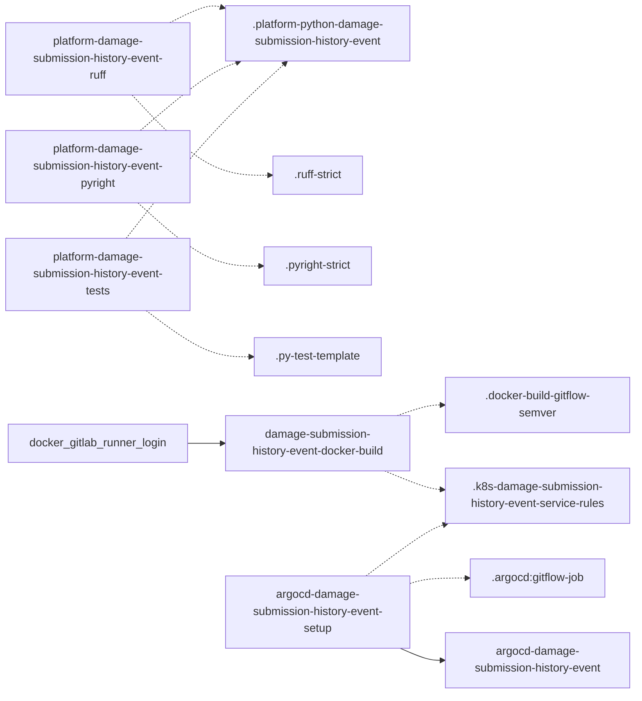

# Diagram: entity_core/entity_service/platform_applications/damage_submission_history_event/.gitlab-ci.yml

> Auto-generated by Obscura crawlers

## Mermaid

### SVG

<svg id="container" width="896" xmlns="http://www.w3.org/2000/svg" class="flowchart" height="978" viewBox="0 0 896 978" role="graphics-document document" aria-roledescription="flowchart-v2"><g><marker id="container_flowchart-v2-pointEnd" class="marker flowchart-v2" viewBox="0 0 10 10" refX="5" refY="5" markerUnits="userSpaceOnUse" markerWidth="8" markerHeight="8" orient="auto"><path d="M 0 0 L 10 5 L 0 10 z" class="arrowMarkerPath" style="stroke-width: 1; stroke-dasharray: 1, 0;"></path></marker><marker id="container_flowchart-v2-pointStart" class="marker flowchart-v2" viewBox="0 0 10 10" refX="4.5" refY="5" markerUnits="userSpaceOnUse" markerWidth="8" markerHeight="8" orient="auto"><path d="M 0 5 L 10 10 L 10 0 z" class="arrowMarkerPath" style="stroke-width: 1; stroke-dasharray: 1, 0;"></path></marker><marker id="container_flowchart-v2-circleEnd" class="marker flowchart-v2" viewBox="0 0 10 10" refX="11" refY="5" markerUnits="userSpaceOnUse" markerWidth="11" markerHeight="11" orient="auto"><circle cx="5" cy="5" r="5" class="arrowMarkerPath" style="stroke-width: 1; stroke-dasharray: 1, 0;"></circle></marker><marker id="container_flowchart-v2-circleStart" class="marker flowchart-v2" viewBox="0 0 10 10" refX="-1" refY="5" markerUnits="userSpaceOnUse" markerWidth="11" markerHeight="11" orient="auto"><circle cx="5" cy="5" r="5" class="arrowMarkerPath" style="stroke-width: 1; stroke-dasharray: 1, 0;"></circle></marker><marker id="container_flowchart-v2-crossEnd" class="marker cross flowchart-v2" viewBox="0 0 11 11" refX="12" refY="5.2" markerUnits="userSpaceOnUse" markerWidth="11" markerHeight="11" orient="auto"><path d="M 1,1 l 9,9 M 10,1 l -9,9" class="arrowMarkerPath" style="stroke-width: 2; stroke-dasharray: 1, 0;"></path></marker><marker id="container_flowchart-v2-crossStart" class="marker cross flowchart-v2" viewBox="0 0 11 11" refX="-1" refY="5.2" markerUnits="userSpaceOnUse" markerWidth="11" markerHeight="11" orient="auto"><path d="M 1,1 l 9,9 M 10,1 l -9,9" class="arrowMarkerPath" style="stroke-width: 2; stroke-dasharray: 1, 0;"></path></marker><g class="root"><g class="clusters"></g><g class="edgePaths"><path d="M239.346,32L248.288,27.5C257.231,23,275.115,14,287.581,10.455C300.046,6.909,307.093,8.819,310.616,9.773L314.139,10.728" id="L_job_ruff_template_base_0" class="edge-thickness-normal edge-pattern-dotted edge-thickness-normal edge-pattern-solid flowchart-link" style=";" data-edge="true" data-et="edge" data-id="L_job_ruff_template_base_0" data-points="W3sieCI6MjM5LjM0NjE1Mzg0NjE1Mzg0LCJ5IjozMn0seyJ4IjoyOTMsInkiOjV9LHsieCI6MzE4LCJ5IjoxMS43NzQxOTM1NDgzODcwOTZ9XQ==" marker-end="url(#container_flowchart-v2-pointEnd)"></path><path d="M186.201,134L204.001,152.833C221.801,171.667,257.4,209.333,289.238,228.167C321.076,247,349.151,247,363.189,247L377.227,247" id="L_job_ruff_ruff_strict_0" class="edge-thickness-normal edge-pattern-dotted edge-thickness-normal edge-pattern-solid flowchart-link" style=";" data-edge="true" data-et="edge" data-id="L_job_ruff_ruff_strict_0" data-points="W3sieCI6MTg2LjIwMTIxOTUxMjE5NTEsInkiOjEzNH0seyJ4IjoyOTMsInkiOjI0N30seyJ4IjozODEuMjI2NTYyNSwieSI6MjQ3fV0=" marker-end="url(#container_flowchart-v2-pointEnd)"></path><path d="M197.886,184L213.739,170.5C229.591,157,261.295,130,284.363,113.893C307.431,97.786,321.861,92.573,329.076,89.966L336.292,87.359" id="L_job_pyright_template_base_0" class="edge-thickness-normal edge-pattern-dotted edge-thickness-normal edge-pattern-solid flowchart-link" style=";" data-edge="true" data-et="edge" data-id="L_job_pyright_template_base_0" data-points="W3sieCI6MTk3Ljg4NjM2MzYzNjM2MzYzLCJ5IjoxODR9LHsieCI6MjkzLCJ5IjoxMDN9LHsieCI6MzQwLjA1MzU3MTQyODU3MTQ0LCJ5Ijo4Nn1d" marker-end="url(#container_flowchart-v2-pointEnd)"></path><path d="M194.464,286L210.887,300.833C227.31,315.667,260.155,345.333,288.537,360.167C316.919,375,340.839,375,352.798,375L364.758,375" id="L_job_pyright_pyright_strict_0" class="edge-thickness-normal edge-pattern-dotted edge-thickness-normal edge-pattern-solid flowchart-link" style=";" data-edge="true" data-et="edge" data-id="L_job_pyright_pyright_strict_0" data-points="W3sieCI6MTk0LjQ2NDI4NTcxNDI4NTcyLCJ5IjoyODZ9LHsieCI6MjkzLCJ5IjozNzV9LHsieCI6MzY4Ljc1NzgxMjUsInkiOjM3NX1d" marker-end="url(#container_flowchart-v2-pointEnd)"></path><path d="M177.924,336L197.104,311.5C216.283,287,254.641,238,292.067,196.784C329.493,155.567,365.987,122.135,384.233,105.418L402.48,88.702" id="L_job_tests_template_base_0" class="edge-thickness-normal edge-pattern-dotted edge-thickness-normal edge-pattern-solid flowchart-link" style=";" data-edge="true" data-et="edge" data-id="L_job_tests_template_base_0" data-points="W3sieCI6MTc3LjkyNDI0MjQyNDI0MjQ0LCJ5IjozMzZ9LHsieCI6MjkzLCJ5IjoxODl9LHsieCI6NDA1LjQyOTU3NzQ2NDc4ODc0LCJ5Ijo4Nn1d" marker-end="url(#container_flowchart-v2-pointEnd)"></path><path d="M206.147,438L220.622,448.833C235.098,459.667,264.049,481.333,288.221,492.167C312.393,503,331.786,503,341.483,503L351.18,503" id="L_job_tests_py_test_template_0" class="edge-thickness-normal edge-pattern-dotted edge-thickness-normal edge-pattern-solid flowchart-link" style=";" data-edge="true" data-et="edge" data-id="L_job_tests_py_test_template_0" data-points="W3sieCI6MjA2LjE0NjU1MTcyNDEzNzk0LCJ5Ijo0Mzh9LHsieCI6MjkzLCJ5Ijo1MDN9LHsieCI6MzU1LjE3OTY4NzUsInkiOjUwM31d" marker-end="url(#container_flowchart-v2-pointEnd)"></path><path d="M559.944,586L567.12,583.5C574.296,581,588.648,576,599.324,573.5C610,571,617,571,620.5,571L624,571" id="L_job_docker_build_docker_build_template_0" class="edge-thickness-normal edge-pattern-dotted edge-thickness-normal edge-pattern-solid flowchart-link" style=";" data-edge="true" data-et="edge" data-id="L_job_docker_build_docker_build_template_0" data-points="W3sieCI6NTU5Ljk0NDQ0NDQ0NDQ0NDUsInkiOjU4Nn0seyJ4Ijo2MDMsInkiOjU3MX0seyJ4Ijo2MjgsInkiOjU3MX1d" marker-end="url(#container_flowchart-v2-pointEnd)"></path><path d="M542.453,664L552.544,668.167C562.635,672.333,582.818,680.667,596.41,685.059C610.003,689.452,617.006,689.904,620.507,690.129L624.008,690.355" id="L_job_docker_build_k8s_rules_0" class="edge-thickness-normal edge-pattern-dotted edge-thickness-normal edge-pattern-solid flowchart-link" style=";" data-edge="true" data-et="edge" data-id="L_job_docker_build_k8s_rules_0" data-points="W3sieCI6NTQyLjQ1MzEyNSwieSI6NjY0fSx7IngiOjYwMywieSI6Njg5fSx7IngiOjYyOCwieSI6NjkwLjYxMjkwMzIyNTgwNjV9XQ==" marker-end="url(#container_flowchart-v2-pointEnd)"></path><path d="M578,822.742L582.167,821.452C586.333,820.161,594.667,817.581,607.745,816.29C620.823,815,638.646,815,647.557,815L656.469,815" id="L_job_argocd_setup_argocd_gitflow_0" class="edge-thickness-normal edge-pattern-dotted edge-thickness-normal edge-pattern-solid flowchart-link" style=";" data-edge="true" data-et="edge" data-id="L_job_argocd_setup_argocd_gitflow_0" data-points="W3sieCI6NTc4LCJ5Ijo4MjIuNzQxOTM1NDgzODcxfSx7IngiOjYwMywieSI6ODE1fSx7IngiOjY2MC40Njg3NSwieSI6ODE1fV0=" marker-end="url(#container_flowchart-v2-pointEnd)"></path><path d="M516.147,812L530.622,801.167C545.098,790.333,574.049,768.667,592.731,756.531C611.414,744.394,619.828,741.789,624.035,740.486L628.242,739.183" id="L_job_argocd_setup_k8s_rules_0" class="edge-thickness-normal edge-pattern-dotted edge-thickness-normal edge-pattern-solid flowchart-link" style=";" data-edge="true" data-et="edge" data-id="L_job_argocd_setup_k8s_rules_0" data-points="W3sieCI6NTE2LjE0NjU1MTcyNDEzNzksInkiOjgxMn0seyJ4Ijo2MDMsInkiOjc0N30seyJ4Ijo2MzIuMDYyNSwieSI6NzM4fV0=" marker-end="url(#container_flowchart-v2-pointEnd)"></path><path d="M267.07,625L271.392,625C275.714,625,284.357,625,292.178,625C300,625,307,625,310.5,625L314,625" id="L_docker_login_job_docker_build_0" class="edge-thickness-normal edge-pattern-solid edge-thickness-normal edge-pattern-solid flowchart-link" style=";" data-edge="true" data-et="edge" data-id="L_docker_login_job_docker_build_0" data-points="W3sieCI6MjY3LjA3MDMxMjUsInkiOjYyNX0seyJ4IjoyOTMsInkiOjYyNX0seyJ4IjozMTgsInkiOjYyNX1d" marker-end="url(#container_flowchart-v2-pointEnd)"></path><path d="M564.25,914L570.708,916.833C577.167,919.667,590.083,925.333,600.042,928.167C610,931,617,931,620.5,931L624,931" id="L_job_argocd_setup_job_argocd_0" class="edge-thickness-normal edge-pattern-solid edge-thickness-normal edge-pattern-solid flowchart-link" style=";" data-edge="true" data-et="edge" data-id="L_job_argocd_setup_job_argocd_0" data-points="W3sieCI6NTY0LjI1LCJ5Ijo5MTR9LHsieCI6NjAzLCJ5Ijo5MzF9LHsieCI6NjI4LCJ5Ijo5MzF9XQ==" marker-end="url(#container_flowchart-v2-pointEnd)"></path></g><g class="edgeLabels"><g class="edgeLabel"><g class="label" data-id="L_job_ruff_template_base_0" transform="translate(0, 0)"><foreignObject width="0" height="0">

</foreignObject></g></g><g class="edgeLabel"><g class="label" data-id="L_job_ruff_ruff_strict_0" transform="translate(0, 0)"><foreignObject width="0" height="0">

</foreignObject></g></g><g class="edgeLabel"><g class="label" data-id="L_job_pyright_template_base_0" transform="translate(0, 0)"><foreignObject width="0" height="0">

</foreignObject></g></g><g class="edgeLabel"><g class="label" data-id="L_job_pyright_pyright_strict_0" transform="translate(0, 0)"><foreignObject width="0" height="0">

</foreignObject></g></g><g class="edgeLabel"><g class="label" data-id="L_job_tests_template_base_0" transform="translate(0, 0)"><foreignObject width="0" height="0">

</foreignObject></g></g><g class="edgeLabel"><g class="label" data-id="L_job_tests_py_test_template_0" transform="translate(0, 0)"><foreignObject width="0" height="0">

</foreignObject></g></g><g class="edgeLabel"><g class="label" data-id="L_job_docker_build_docker_build_template_0" transform="translate(0, 0)"><foreignObject width="0" height="0">

</foreignObject></g></g><g class="edgeLabel"><g class="label" data-id="L_job_docker_build_k8s_rules_0" transform="translate(0, 0)"><foreignObject width="0" height="0">

</foreignObject></g></g><g class="edgeLabel"><g class="label" data-id="L_job_argocd_setup_argocd_gitflow_0" transform="translate(0, 0)"><foreignObject width="0" height="0">

</foreignObject></g></g><g class="edgeLabel"><g class="label" data-id="L_job_argocd_setup_k8s_rules_0" transform="translate(0, 0)"><foreignObject width="0" height="0">

</foreignObject></g></g><g class="edgeLabel"><g class="label" data-id="L_docker_login_job_docker_build_0" transform="translate(0, 0)"><foreignObject width="0" height="0">

</foreignObject></g></g><g class="edgeLabel"><g class="label" data-id="L_job_argocd_setup_job_argocd_0" transform="translate(0, 0)"><foreignObject width="0" height="0">

</foreignObject></g></g></g><g class="nodes"><g class="node default" id="flowchart-template_base-0" transform="translate(448, 47)"><rect class="basic label-container" style="" x="-130" y="-39" width="260" height="78"></rect><g class="label" style="" transform="translate(-100, -24)"><rect></rect><foreignObject width="200" height="48">

.platform-python-damage-submission-history-event

</foreignObject></g></g><g class="node default" id="flowchart-ruff_strict-1" transform="translate(448, 247)"><rect class="basic label-container" style="" x="-66.7734375" y="-27" width="133.546875" height="54"></rect><g class="label" style="" transform="translate(-36.7734375, -12)"><rect></rect><foreignObject width="73.546875" height="24">

.ruff-strict

</foreignObject></g></g><g class="node default" id="flowchart-pyright_strict-2" transform="translate(448, 375)"><rect class="basic label-container" style="" x="-79.2421875" y="-27" width="158.484375" height="54"></rect><g class="label" style="" transform="translate(-49.2421875, -12)"><rect></rect><foreignObject width="98.484375" height="24">

.pyright-strict

</foreignObject></g></g><g class="node default" id="flowchart-py_test_template-3" transform="translate(448, 503)"><rect class="basic label-container" style="" x="-92.8203125" y="-27" width="185.640625" height="54"></rect><g class="label" style="" transform="translate(-62.8203125, -12)"><rect></rect><foreignObject width="125.640625" height="24">

.py-test-template

</foreignObject></g></g><g class="node default" id="flowchart-docker_build_template-4" transform="translate(758, 571)"><rect class="basic label-container" style="" x="-130" y="-39" width="260" height="78"></rect><g class="label" style="" transform="translate(-100, -24)"><rect></rect><foreignObject width="200" height="48">

.docker-build-gitflow-semver

</foreignObject></g></g><g class="node default" id="flowchart-k8s_rules-5" transform="translate(758, 699)"><rect class="basic label-container" style="" x="-130" y="-39" width="260" height="78"></rect><g class="label" style="" transform="translate(-100, -24)"><rect></rect><foreignObject width="200" height="48">

.k8s-damage-submission-history-event-service-rules

</foreignObject></g></g><g class="node default" id="flowchart-argocd_gitflow-6" transform="translate(758, 815)"><rect class="basic label-container" style="" x="-97.53125" y="-27" width="195.0625" height="54"></rect><g class="label" style="" transform="translate(-67.53125, -12)"><rect></rect><foreignObject width="135.0625" height="24">

.argocd:gitflow-job

</foreignObject></g></g><g class="node default" id="flowchart-docker_login-7" transform="translate(138, 625)"><rect class="basic label-container" style="" x="-129.0703125" y="-27" width="258.140625" height="54"></rect><g class="label" style="" transform="translate(-99.0703125, -12)"><rect></rect><foreignObject width="198.140625" height="24">

docker_gitlab_runner_login

</foreignObject></g></g><g class="node default" id="flowchart-job_ruff-8" transform="translate(138, 83)"><rect class="basic label-container" style="" x="-130" y="-51" width="260" height="102"></rect><g class="label" style="" transform="translate(-100, -36)"><rect></rect><foreignObject width="200" height="72">

platform-damage-submission-history-event-ruff

</foreignObject></g></g><g class="node default" id="flowchart-job_pyright-9" transform="translate(138, 235)"><rect class="basic label-container" style="" x="-130" y="-51" width="260" height="102"></rect><g class="label" style="" transform="translate(-100, -36)"><rect></rect><foreignObject width="200" height="72">

platform-damage-submission-history-event-pyright

</foreignObject></g></g><g class="node default" id="flowchart-job_tests-10" transform="translate(138, 387)"><rect class="basic label-container" style="" x="-130" y="-51" width="260" height="102"></rect><g class="label" style="" transform="translate(-100, -36)"><rect></rect><foreignObject width="200" height="72">

platform-damage-submission-history-event-tests

</foreignObject></g></g><g class="node default" id="flowchart-job_docker_build-11" transform="translate(448, 625)"><rect class="basic label-container" style="" x="-130" y="-39" width="260" height="78"></rect><g class="label" style="" transform="translate(-100, -24)"><rect></rect><foreignObject width="200" height="48">

damage-submission-history-event-docker-build

</foreignObject></g></g><g class="node default" id="flowchart-job_argocd_setup-12" transform="translate(448, 863)"><rect class="basic label-container" style="" x="-130" y="-51" width="260" height="102"></rect><g class="label" style="" transform="translate(-100, -36)"><rect></rect><foreignObject width="200" height="72">

argocd-damage-submission-history-event-setup

</foreignObject></g></g><g class="node default" id="flowchart-job_argocd-13" transform="translate(758, 931)"><rect class="basic label-container" style="" x="-130" y="-39" width="260" height="78"></rect><g class="label" style="" transform="translate(-100, -24)"><rect></rect><foreignObject width="200" height="48">

argocd-damage-submission-history-event

</foreignObject></g></g></g></g></g></svg>
