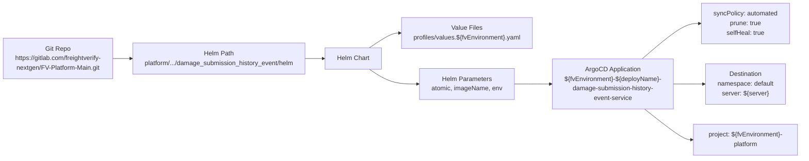
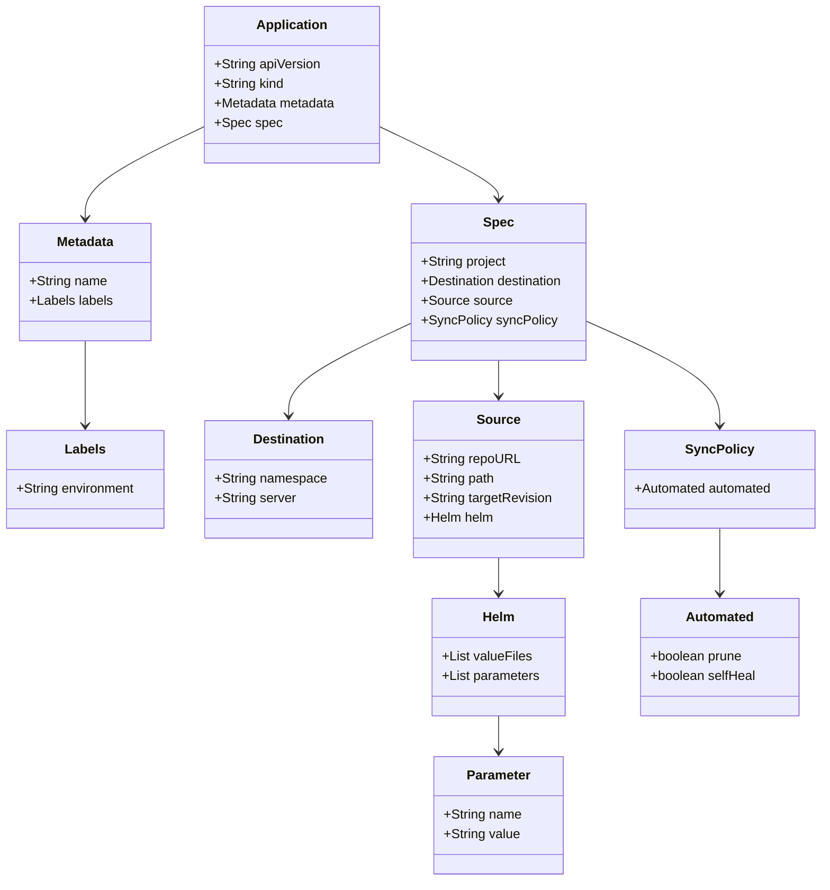

# Diagram: entity_core/entity_service/platform_applications/damage_submission_history_event/argocd/Application.yaml

> Auto-generated by Obscura crawlers

## Diagram 1

### SVG

<svg id="container" width="2049.28125" xmlns="http://www.w3.org/2000/svg" class="flowchart" height="398" viewBox="0 0 2049.28125 398" role="graphics-document document" aria-roledescription="flowchart-v2"><g><marker id="container_flowchart-v2-pointEnd" class="marker flowchart-v2" viewBox="0 0 10 10" refX="5" refY="5" markerUnits="userSpaceOnUse" markerWidth="8" markerHeight="8" orient="auto"><path d="M 0 0 L 10 5 L 0 10 z" class="arrowMarkerPath" style="stroke-width: 1; stroke-dasharray: 1, 0;"></path></marker><marker id="container_flowchart-v2-pointStart" class="marker flowchart-v2" viewBox="0 0 10 10" refX="4.5" refY="5" markerUnits="userSpaceOnUse" markerWidth="8" markerHeight="8" orient="auto"><path d="M 0 5 L 10 10 L 10 0 z" class="arrowMarkerPath" style="stroke-width: 1; stroke-dasharray: 1, 0;"></path></marker><marker id="container_flowchart-v2-circleEnd" class="marker flowchart-v2" viewBox="0 0 10 10" refX="11" refY="5" markerUnits="userSpaceOnUse" markerWidth="11" markerHeight="11" orient="auto"><circle cx="5" cy="5" r="5" class="arrowMarkerPath" style="stroke-width: 1; stroke-dasharray: 1, 0;"></circle></marker><marker id="container_flowchart-v2-circleStart" class="marker flowchart-v2" viewBox="0 0 10 10" refX="-1" refY="5" markerUnits="userSpaceOnUse" markerWidth="11" markerHeight="11" orient="auto"><circle cx="5" cy="5" r="5" class="arrowMarkerPath" style="stroke-width: 1; stroke-dasharray: 1, 0;"></circle></marker><marker id="container_flowchart-v2-crossEnd" class="marker cross flowchart-v2" viewBox="0 0 11 11" refX="12" refY="5.2" markerUnits="userSpaceOnUse" markerWidth="11" markerHeight="11" orient="auto"><path d="M 1,1 l 9,9 M 10,1 l -9,9" class="arrowMarkerPath" style="stroke-width: 2; stroke-dasharray: 1, 0;"></path></marker><marker id="container_flowchart-v2-crossStart" class="marker cross flowchart-v2" viewBox="0 0 11 11" refX="-1" refY="5.2" markerUnits="userSpaceOnUse" markerWidth="11" markerHeight="11" orient="auto"><path d="M 1,1 l 9,9 M 10,1 l -9,9" class="arrowMarkerPath" style="stroke-width: 2; stroke-dasharray: 1, 0;"></path></marker><g class="root"><g class="clusters"></g><g class="edgePaths"><path d="M301.422,147L305.589,147C309.755,147,318.089,147,325.755,147C333.422,147,340.422,147,343.922,147L347.422,147" id="L_Repo_Path_0" class="edge-thickness-normal edge-pattern-solid edge-thickness-normal edge-pattern-solid flowchart-link" style=";" data-edge="true" data-et="edge" data-id="L_Repo_Path_0" data-points="W3sieCI6MzAxLjQyMTg3NSwieSI6MTQ3fSx7IngiOjMyNi40MjE4NzUsInkiOjE0N30seyJ4IjozNTEuNDIxODc1LCJ5IjoxNDd9XQ==" marker-end="url(#container_flowchart-v2-pointEnd)"></path><path d="M798.688,147L802.854,147C807.021,147,815.354,147,823.021,147C830.688,147,837.688,147,841.188,147L844.688,147" id="L_Path_HelmChart_0" class="edge-thickness-normal edge-pattern-solid edge-thickness-normal edge-pattern-solid flowchart-link" style=";" data-edge="true" data-et="edge" data-id="L_Path_HelmChart_0" data-points="W3sieCI6Nzk4LjY4NzUsInkiOjE0N30seyJ4Ijo4MjMuNjg3NSwieSI6MTQ3fSx7IngiOjg0OC42ODc1LCJ5IjoxNDd9XQ==" marker-end="url(#container_flowchart-v2-pointEnd)"></path><path d="M959.532,120L968.738,113.833C977.943,107.667,996.354,95.333,1009.06,89.167C1021.766,83,1028.766,83,1032.266,83L1035.766,83" id="L_HelmChart_Values_0" class="edge-thickness-normal edge-pattern-solid edge-thickness-normal edge-pattern-solid flowchart-link" style=";" data-edge="true" data-et="edge" data-id="L_HelmChart_Values_0" data-points="W3sieCI6OTU5LjUzMjEwNDQ5MjE4NzUsInkiOjEyMH0seyJ4IjoxMDE0Ljc2NTYyNSwieSI6ODN9LHsieCI6MTAzOS43NjU2MjUsInkiOjgzfV0=" marker-end="url(#container_flowchart-v2-pointEnd)"></path><path d="M959.532,174L968.738,180.167C977.943,186.333,996.354,198.667,1017.198,204.833C1038.042,211,1061.318,211,1072.956,211L1084.594,211" id="L_HelmChart_Params_0" class="edge-thickness-normal edge-pattern-solid edge-thickness-normal edge-pattern-solid flowchart-link" style=";" data-edge="true" data-et="edge" data-id="L_HelmChart_Params_0" data-points="W3sieCI6OTU5LjUzMjEwNDQ5MjE4NzUsInkiOjE3NH0seyJ4IjoxMDE0Ljc2NTYyNSwieSI6MjExfSx7IngiOjEwODguNTkzNzUsInkiOjIxMX1d" marker-end="url(#container_flowchart-v2-pointEnd)"></path><path d="M1325.688,211L1337.992,211C1350.297,211,1374.906,211,1390.711,211C1406.516,211,1413.516,211,1417.016,211L1420.516,211" id="L_Params_App_0" class="edge-thickness-normal edge-pattern-solid edge-thickness-normal edge-pattern-solid flowchart-link" style=";" data-edge="true" data-et="edge" data-id="L_Params_App_0" data-points="W3sieCI6MTMyNS42ODc1LCJ5IjoyMTF9LHsieCI6MTM5OS41MTU2MjUsInkiOjIxMX0seyJ4IjoxNDI0LjUxNTYyNSwieSI6MjExfV0=" marker-end="url(#container_flowchart-v2-pointEnd)"></path><path d="M1651.833,148L1669.241,133.167C1686.649,118.333,1721.465,88.667,1745.518,73.833C1769.57,59,1782.859,59,1789.504,59L1796.148,59" id="L_App_Sync_0" class="edge-thickness-normal edge-pattern-solid edge-thickness-normal edge-pattern-solid flowchart-link" style=";" data-edge="true" data-et="edge" data-id="L_App_Sync_0" data-points="W3sieCI6MTY1MS44MzM0MTg5OTY3MTA0LCJ5IjoxNDh9LHsieCI6MTc1Ni4yODEyNSwieSI6NTl9LHsieCI6MTgwMC4xNDg0Mzc1LCJ5Ijo1OX1d" marker-end="url(#container_flowchart-v2-pointEnd)"></path><path d="M1731.281,211L1735.448,211C1739.615,211,1747.948,211,1760.453,211C1772.958,211,1789.635,211,1797.974,211L1806.313,211" id="L_App_Destination_0" class="edge-thickness-normal edge-pattern-solid edge-thickness-normal edge-pattern-solid flowchart-link" style=";" data-edge="true" data-et="edge" data-id="L_App_Destination_0" data-points="W3sieCI6MTczMS4yODEyNSwieSI6MjExfSx7IngiOjE3NTYuMjgxMjUsInkiOjIxMX0seyJ4IjoxODEwLjMxMjUsInkiOjIxMX1d" marker-end="url(#container_flowchart-v2-pointEnd)"></path><path d="M1658.171,274L1674.522,286.833C1690.874,299.667,1723.578,325.333,1743.429,338.167C1763.281,351,1770.281,351,1773.781,351L1777.281,351" id="L_App_Project_0" class="edge-thickness-normal edge-pattern-solid edge-thickness-normal edge-pattern-solid flowchart-link" style=";" data-edge="true" data-et="edge" data-id="L_App_Project_0" data-points="W3sieCI6MTY1OC4xNzA3MDMxMjUsInkiOjI3NH0seyJ4IjoxNzU2LjI4MTI1LCJ5IjozNTF9LHsieCI6MTc4MS4yODEyNSwieSI6MzUxfV0=" marker-end="url(#container_flowchart-v2-pointEnd)"></path></g><g class="edgeLabels"><g class="edgeLabel"><g class="label" data-id="L_Repo_Path_0" transform="translate(0, 0)"><foreignObject width="0" height="0">

</foreignObject></g></g><g class="edgeLabel"><g class="label" data-id="L_Path_HelmChart_0" transform="translate(0, 0)"><foreignObject width="0" height="0">

</foreignObject></g></g><g class="edgeLabel"><g class="label" data-id="L_HelmChart_Values_0" transform="translate(0, 0)"><foreignObject width="0" height="0">

</foreignObject></g></g><g class="edgeLabel"><g class="label" data-id="L_HelmChart_Params_0" transform="translate(0, 0)"><foreignObject width="0" height="0">

</foreignObject></g></g><g class="edgeLabel"><g class="label" data-id="L_Params_App_0" transform="translate(0, 0)"><foreignObject width="0" height="0">

</foreignObject></g></g><g class="edgeLabel"><g class="label" data-id="L_App_Sync_0" transform="translate(0, 0)"><foreignObject width="0" height="0">

</foreignObject></g></g><g class="edgeLabel"><g class="label" data-id="L_App_Destination_0" transform="translate(0, 0)"><foreignObject width="0" height="0">

</foreignObject></g></g><g class="edgeLabel"><g class="label" data-id="L_App_Project_0" transform="translate(0, 0)"><foreignObject width="0" height="0">

</foreignObject></g></g></g><g class="nodes"><g class="node default" id="flowchart-Repo-0" transform="translate(154.7109375, 147)"><rect class="basic label-container" style="" x="-146.7109375" y="-51" width="293.421875" height="102"></rect><g class="label" style="" transform="translate(-116.7109375, -36)"><rect></rect><foreignObject width="233.421875" height="72">

Git Repo https://gitlab.com/freightverify-nextgen/FV-Platform-Main.git

</foreignObject></g></g><g class="node default" id="flowchart-Path-1" transform="translate(575.0546875, 147)"><rect class="basic label-container" style="" x="-223.6328125" y="-39" width="447.265625" height="78"></rect><g class="label" style="" transform="translate(-193.6328125, -24)"><rect></rect><foreignObject width="387.265625" height="48">

Helm Path platform/.../damage_submission_history_event/helm

</foreignObject></g></g><g class="node default" id="flowchart-HelmChart-3" transform="translate(919.2265625, 147)"><rect class="basic label-container" style="" x="-70.5390625" y="-27" width="141.078125" height="54"></rect><g class="label" style="" transform="translate(-40.5390625, -12)"><rect></rect><foreignObject width="81.078125" height="24">

Helm Chart

</foreignObject></g></g><g class="node default" id="flowchart-Values-5" transform="translate(1207.140625, 83)"><rect class="basic label-container" style="" x="-167.375" y="-39" width="334.75" height="78"></rect><g class="label" style="" transform="translate(-137.375, -24)"><rect></rect><foreignObject width="274.75" height="48">

Value Files profiles/values.${fvEnvironment}.yaml

</foreignObject></g></g><g class="node default" id="flowchart-Params-7" transform="translate(1207.140625, 211)"><rect class="basic label-container" style="" x="-118.546875" y="-39" width="237.09375" height="78"></rect><g class="label" style="" transform="translate(-88.546875, -24)"><rect></rect><foreignObject width="177.09375" height="48">

Helm Parameters atomic, imageName, env

</foreignObject></g></g><g class="node default" id="flowchart-App-9" transform="translate(1577.8984375, 211)"><rect class="basic label-container" style="" x="-153.3828125" y="-63" width="306.765625" height="126"></rect><g class="label" style="" transform="translate(-123.3828125, -48)"><rect></rect><foreignObject width="246.765625" height="96">

ArgoCD Application ${fvEnvironment}-${deployName}-damage-submission-history-event-service

</foreignObject></g></g><g class="node default" id="flowchart-Sync-11" transform="translate(1911.28125, 59)"><rect class="basic label-container" style="" x="-111.1328125" y="-51" width="222.265625" height="102"></rect><g class="label" style="" transform="translate(-81.1328125, -36)"><rect></rect><foreignObject width="162.265625" height="72">

syncPolicy: automated prune: true selfHeal: true

</foreignObject></g></g><g class="node default" id="flowchart-Destination-13" transform="translate(1911.28125, 211)"><rect class="basic label-container" style="" x="-100.96875" y="-51" width="201.9375" height="102"></rect><g class="label" style="" transform="translate(-70.96875, -36)"><rect></rect><foreignObject width="141.9375" height="72">

Destination namespace: default server: ${server}

</foreignObject></g></g><g class="node default" id="flowchart-Project-15" transform="translate(1911.28125, 351)"><rect class="basic label-container" style="" x="-130" y="-39" width="260" height="78"></rect><g class="label" style="" transform="translate(-100, -24)"><rect></rect><foreignObject width="200" height="48">

project: ${fvEnvironment}-platform

</foreignObject></g></g></g></g></g></svg>

## Diagram 2

### SVG

<svg id="container" width="1004.84375" xmlns="http://www.w3.org/2000/svg" class="classDiagram" height="1080" viewBox="0 0 1004.84375 1080" role="graphics-document document" aria-roledescription="class"><g><defs><marker id="container_class-aggregationStart" class="marker aggregation class" refX="18" refY="7" markerWidth="190" markerHeight="240" orient="auto"><path d="M 18,7 L9,13 L1,7 L9,1 Z"></path></marker></defs><defs><marker id="container_class-aggregationEnd" class="marker aggregation class" refX="1" refY="7" markerWidth="20" markerHeight="28" orient="auto"><path d="M 18,7 L9,13 L1,7 L9,1 Z"></path></marker></defs><defs><marker id="container_class-extensionStart" class="marker extension class" refX="18" refY="7" markerWidth="190" markerHeight="240" orient="auto"><path d="M 1,7 L18,13 V 1 Z"></path></marker></defs><defs><marker id="container_class-extensionEnd" class="marker extension class" refX="1" refY="7" markerWidth="20" markerHeight="28" orient="auto"><path d="M 1,1 V 13 L18,7 Z"></path></marker></defs><defs><marker id="container_class-compositionStart" class="marker composition class" refX="18" refY="7" markerWidth="190" markerHeight="240" orient="auto"><path d="M 18,7 L9,13 L1,7 L9,1 Z"></path></marker></defs><defs><marker id="container_class-compositionEnd" class="marker composition class" refX="1" refY="7" markerWidth="20" markerHeight="28" orient="auto"><path d="M 18,7 L9,13 L1,7 L9,1 Z"></path></marker></defs><defs><marker id="container_class-dependencyStart" class="marker dependency class" refX="6" refY="7" markerWidth="190" markerHeight="240" orient="auto"><path d="M 5,7 L9,13 L1,7 L9,1 Z"></path></marker></defs><defs><marker id="container_class-dependencyEnd" class="marker dependency class" refX="13" refY="7" markerWidth="20" markerHeight="28" orient="auto"><path d="M 18,7 L9,13 L14,7 L9,1 Z"></path></marker></defs><defs><marker id="container_class-lollipopStart" class="marker lollipop class" refX="13" refY="7" markerWidth="190" markerHeight="240" orient="auto"><circle stroke="black" fill="transparent" cx="7" cy="7" r="6"></circle></marker></defs><defs><marker id="container_class-lollipopEnd" class="marker lollipop class" refX="1" refY="7" markerWidth="190" markerHeight="240" orient="auto"><circle stroke="black" fill="transparent" cx="7" cy="7" r="6"></circle></marker></defs><g class="root"><g class="clusters"></g><g class="edgePaths"><path d="M249.611,155.737L225.567,167.281C201.522,178.824,153.433,201.912,129.388,220.623C105.344,239.333,105.344,253.667,105.344,260.833L105.344,268" id="id_Application_Metadata_1" class="edge-thickness-normal edge-pattern-solid relation" style=";;;" data-edge="true" data-et="edge" data-id="id_Application_Metadata_1" data-points="W3sieCI6MjQ5LjYxMTMyODEyNSwieSI6MTU1LjczNjcxNTI1NjYyNzgzfSx7IngiOjEwNS4zNDM3NSwieSI6MjI1fSx7IngiOjEwNS4zNDM3NSwieSI6Mjc0fV0=" marker-end="url(#container_class-dependencyEnd)"></path><path d="M105.344,418L105.344,426.167C105.344,434.333,105.344,450.667,105.344,468C105.344,485.333,105.344,503.667,105.344,512.833L105.344,522" id="id_Metadata_Labels_2" class="edge-thickness-normal edge-pattern-solid relation" style=";;;" data-edge="true" data-et="edge" data-id="id_Metadata_Labels_2" data-points="W3sieCI6MTA1LjM0Mzc1LCJ5Ijo0MTh9LHsieCI6MTA1LjM0Mzc1LCJ5Ijo0Njd9LHsieCI6MTA1LjM0Mzc1LCJ5Ijo1Mjh9XQ==" marker-end="url(#container_class-dependencyEnd)"></path><path d="M465.135,155.737L489.179,167.281C513.224,178.824,561.313,201.912,585.358,216.623C609.402,231.333,609.402,237.667,609.402,240.833L609.402,244" id="id_Application_Spec_3" class="edge-thickness-normal edge-pattern-solid relation" style=";;;" data-edge="true" data-et="edge" data-id="id_Application_Spec_3" data-points="W3sieCI6NDY1LjEzNDc2NTYyNSwieSI6MTU1LjczNjcxNTI1NjYyNzgzfSx7IngiOjYwOS40MDIzNDM3NSwieSI6MjI1fSx7IngiOjYwOS40MDIzNDM3NSwieSI6MjUwfV0=" marker-end="url(#container_class-dependencyEnd)"></path><path d="M498.984,398.352L474.853,409.793C450.721,421.235,402.458,444.117,378.327,462.725C354.195,481.333,354.195,495.667,354.195,502.833L354.195,510" id="id_Spec_Destination_4" class="edge-thickness-normal edge-pattern-solid relation" style=";;;" data-edge="true" data-et="edge" data-id="id_Spec_Destination_4" data-points="W3sieCI6NDk4Ljk4NDM3NSwieSI6Mzk4LjM1MTkwNDg1NjY1NzR9LHsieCI6MzU0LjE5NTMxMjUsInkiOjQ2N30seyJ4IjozNTQuMTk1MzEyNSwieSI6NTE2fV0=" marker-end="url(#container_class-dependencyEnd)"></path><path d="M609.402,442L609.402,446.167C609.402,450.333,609.402,458.667,609.402,466C609.402,473.333,609.402,479.667,609.402,482.833L609.402,486" id="id_Spec_Source_5" class="edge-thickness-normal edge-pattern-solid relation" style=";;;" data-edge="true" data-et="edge" data-id="id_Spec_Source_5" data-points="W3sieCI6NjA5LjQwMjM0Mzc1LCJ5Ijo0NDJ9LHsieCI6NjA5LjQwMjM0Mzc1LCJ5Ijo0Njd9LHsieCI6NjA5LjQwMjM0Mzc1LCJ5Ijo0OTJ9XQ==" marker-end="url(#container_class-dependencyEnd)"></path><path d="M609.402,684L609.402,688.167C609.402,692.333,609.402,700.667,609.402,708C609.402,715.333,609.402,721.667,609.402,724.833L609.402,728" id="id_Source_Helm_6" class="edge-thickness-normal edge-pattern-solid relation" style=";;;" data-edge="true" data-et="edge" data-id="id_Source_Helm_6" data-points="W3sieCI6NjA5LjQwMjM0Mzc1LCJ5Ijo2ODR9LHsieCI6NjA5LjQwMjM0Mzc1LCJ5Ijo3MDl9LHsieCI6NjA5LjQwMjM0Mzc1LCJ5Ijo3MzR9XQ==" marker-end="url(#container_class-dependencyEnd)"></path><path d="M609.402,878L609.402,882.167C609.402,886.333,609.402,894.667,609.402,902C609.402,909.333,609.402,915.667,609.402,918.833L609.402,922" id="id_Helm_Parameter_7" class="edge-thickness-normal edge-pattern-solid relation" style=";;;" data-edge="true" data-et="edge" data-id="id_Helm_Parameter_7" data-points="W3sieCI6NjA5LjQwMjM0Mzc1LCJ5Ijo4Nzh9LHsieCI6NjA5LjQwMjM0Mzc1LCJ5Ijo5MDN9LHsieCI6NjA5LjQwMjM0Mzc1LCJ5Ijo5Mjh9XQ==" marker-end="url(#container_class-dependencyEnd)"></path><path d="M719.82,395.379L746.512,407.316C773.204,419.253,826.589,443.126,853.281,464.23C879.973,485.333,879.973,503.667,879.973,512.833L879.973,522" id="id_Spec_SyncPolicy_8" class="edge-thickness-normal edge-pattern-solid relation" style=";;;" data-edge="true" data-et="edge" data-id="id_Spec_SyncPolicy_8" data-points="W3sieCI6NzE5LjgyMDMxMjUsInkiOjM5NS4zNzkzMDU4NjQzNDl9LHsieCI6ODc5Ljk3MjY1NjI1LCJ5Ijo0Njd9LHsieCI6ODc5Ljk3MjY1NjI1LCJ5Ijo1Mjh9XQ==" marker-end="url(#container_class-dependencyEnd)"></path><path d="M879.973,648L879.973,658.167C879.973,668.333,879.973,688.667,879.973,702C879.973,715.333,879.973,721.667,879.973,724.833L879.973,728" id="id_SyncPolicy_Automated_9" class="edge-thickness-normal edge-pattern-solid relation" style=";;;" data-edge="true" data-et="edge" data-id="id_SyncPolicy_Automated_9" data-points="W3sieCI6ODc5Ljk3MjY1NjI1LCJ5Ijo2NDh9LHsieCI6ODc5Ljk3MjY1NjI1LCJ5Ijo3MDl9LHsieCI6ODc5Ljk3MjY1NjI1LCJ5Ijo3MzR9XQ==" marker-end="url(#container_class-dependencyEnd)"></path></g><g class="edgeLabels"><g class="edgeLabel"><g class="label" data-id="id_Application_Metadata_1" transform="translate(0, 0)"><foreignObject width="0" height="0">

</foreignObject></g></g><g class="edgeLabel"><g class="label" data-id="id_Metadata_Labels_2" transform="translate(0, 0)"><foreignObject width="0" height="0">

</foreignObject></g></g><g class="edgeLabel"><g class="label" data-id="id_Application_Spec_3" transform="translate(0, 0)"><foreignObject width="0" height="0">

</foreignObject></g></g><g class="edgeLabel"><g class="label" data-id="id_Spec_Destination_4" transform="translate(0, 0)"><foreignObject width="0" height="0">

</foreignObject></g></g><g class="edgeLabel"><g class="label" data-id="id_Spec_Source_5" transform="translate(0, 0)"><foreignObject width="0" height="0">

</foreignObject></g></g><g class="edgeLabel"><g class="label" data-id="id_Source_Helm_6" transform="translate(0, 0)"><foreignObject width="0" height="0">

</foreignObject></g></g><g class="edgeLabel"><g class="label" data-id="id_Helm_Parameter_7" transform="translate(0, 0)"><foreignObject width="0" height="0">

</foreignObject></g></g><g class="edgeLabel"><g class="label" data-id="id_Spec_SyncPolicy_8" transform="translate(0, 0)"><foreignObject width="0" height="0">

</foreignObject></g></g><g class="edgeLabel"><g class="label" data-id="id_SyncPolicy_Automated_9" transform="translate(0, 0)"><foreignObject width="0" height="0">

</foreignObject></g></g></g><g class="nodes"><g class="node default" id="classId-Application-0" transform="translate(357.373046875, 104)"><g class="basic label-container"><path d="M-107.76171875 -96 L107.76171875 -96 L107.76171875 96 L-107.76171875 96" stroke="none" stroke-width="0" fill="#ECECFF" style=""></path><path d="M-107.76171875 -96 C-23.253653215029843 -96, 61.254412319940315 -96, 107.76171875 -96 M-107.76171875 -96 C-48.6899690258018 -96, 10.381780698396398 -96, 107.76171875 -96 M107.76171875 -96 C107.76171875 -40.38863004280286, 107.76171875 15.222739914394282, 107.76171875 96 M107.76171875 -96 C107.76171875 -33.681157460451374, 107.76171875 28.637685079097253, 107.76171875 96 M107.76171875 96 C49.50819254224137 96, -8.745333665517265 96, -107.76171875 96 M107.76171875 96 C45.757694582182296 96, -16.246329585635408 96, -107.76171875 96 M-107.76171875 96 C-107.76171875 23.485313229234933, -107.76171875 -49.029373541530134, -107.76171875 -96 M-107.76171875 96 C-107.76171875 19.471137338094294, -107.76171875 -57.05772532381141, -107.76171875 -96" stroke="#9370DB" stroke-width="1.3" fill="none" stroke-dasharray="0 0" style=""></path></g><g class="annotation-group text" transform="translate(0, -72)"></g><g class="label-group text" transform="translate(-41.6796875, -72)"><g class="label" style="font-weight: bolder" transform="translate(0,-12)"><foreignObject width="83.359375" height="24">

Application

</foreignObject></g></g><g class="members-group text" transform="translate(-95.76171875, -24)"><g class="label" style="" transform="translate(0,-12)"><foreignObject width="131.046875" height="24">

+String apiVersion

</foreignObject></g><g class="label" style="" transform="translate(0,12)"><foreignObject width="86.125" height="24">

+String kind

</foreignObject></g><g class="label" style="" transform="translate(0,36)"><foreignObject width="149.84375" height="24">

+Metadata metadata

</foreignObject></g><g class="label" style="" transform="translate(0,60)"><foreignObject width="79.53125" height="24">

+Spec spec

</foreignObject></g></g><g class="methods-group text" transform="translate(-95.76171875, 96)"></g><g class="divider" style=""><path d="M-107.76171875 -48 C-30.941361190627262 -48, 45.878996368745476 -48, 107.76171875 -48 M-107.76171875 -48 C-43.63293352961077 -48, 20.495851690778466 -48, 107.76171875 -48" stroke="#9370DB" stroke-width="1.3" fill="none" stroke-dasharray="0 0" style=""></path></g><g class="divider" style=""><path d="M-107.76171875 72 C-35.57240218022109 72, 36.61691438955782 72, 107.76171875 72 M-107.76171875 72 C-38.790677978195404 72, 30.18036279360919 72, 107.76171875 72" stroke="#9370DB" stroke-width="1.3" fill="none" stroke-dasharray="0 0" style=""></path></g></g><g class="node default" id="classId-Metadata-1" transform="translate(105.34375, 346)"><g class="basic label-container"><path d="M-80.734375 -72 L80.734375 -72 L80.734375 72 L-80.734375 72" stroke="none" stroke-width="0" fill="#ECECFF" style=""></path><path d="M-80.734375 -72 C-17.82951392387811 -72, 45.07534715224378 -72, 80.734375 -72 M-80.734375 -72 C-48.37071130047367 -72, -16.007047600947345 -72, 80.734375 -72 M80.734375 -72 C80.734375 -18.7405731361589, 80.734375 34.5188537276822, 80.734375 72 M80.734375 -72 C80.734375 -23.837970318301466, 80.734375 24.32405936339707, 80.734375 72 M80.734375 72 C16.914829201354443 72, -46.90471659729111 72, -80.734375 72 M80.734375 72 C38.99561835734119 72, -2.743138285317613 72, -80.734375 72 M-80.734375 72 C-80.734375 29.295489184527028, -80.734375 -13.409021630945944, -80.734375 -72 M-80.734375 72 C-80.734375 15.886382488442628, -80.734375 -40.227235023114744, -80.734375 -72" stroke="#9370DB" stroke-width="1.3" fill="none" stroke-dasharray="0 0" style=""></path></g><g class="annotation-group text" transform="translate(0, -48)"></g><g class="label-group text" transform="translate(-34.640625, -48)"><g class="label" style="font-weight: bolder" transform="translate(0,-12)"><foreignObject width="69.28125" height="24">

Metadata

</foreignObject></g></g><g class="members-group text" transform="translate(-68.734375, 0)"><g class="label" style="" transform="translate(0,-12)"><foreignObject width="94.984375" height="24">

+String name

</foreignObject></g><g class="label" style="" transform="translate(0,12)"><foreignObject width="102.828125" height="24">

+Labels labels

</foreignObject></g></g><g class="methods-group text" transform="translate(-68.734375, 72)"></g><g class="divider" style=""><path d="M-80.734375 -24 C-34.712658205598316 -24, 11.309058588803367 -24, 80.734375 -24 M-80.734375 -24 C-35.56615131049804 -24, 9.602072379003914 -24, 80.734375 -24" stroke="#9370DB" stroke-width="1.3" fill="none" stroke-dasharray="0 0" style=""></path></g><g class="divider" style=""><path d="M-80.734375 48 C-22.94516938869856 48, 34.84403622260288 48, 80.734375 48 M-80.734375 48 C-21.495634748125994 48, 37.74310550374801 48, 80.734375 48" stroke="#9370DB" stroke-width="1.3" fill="none" stroke-dasharray="0 0" style=""></path></g></g><g class="node default" id="classId-Labels-2" transform="translate(105.34375, 588)"><g class="basic label-container"><path d="M-97.34375 -60 L97.34375 -60 L97.34375 60 L-97.34375 60" stroke="none" stroke-width="0" fill="#ECECFF" style=""></path><path d="M-97.34375 -60 C-42.63156125708454 -60, 12.080627485830917 -60, 97.34375 -60 M-97.34375 -60 C-26.761641581414935 -60, 43.82046683717013 -60, 97.34375 -60 M97.34375 -60 C97.34375 -12.688194597829565, 97.34375 34.62361080434087, 97.34375 60 M97.34375 -60 C97.34375 -33.15689012370812, 97.34375 -6.313780247416254, 97.34375 60 M97.34375 60 C29.75922939598233 60, -37.82529120803534 60, -97.34375 60 M97.34375 60 C51.5455773720103 60, 5.747404744020599 60, -97.34375 60 M-97.34375 60 C-97.34375 15.7517205266575, -97.34375 -28.496558946685, -97.34375 -60 M-97.34375 60 C-97.34375 17.214177861372292, -97.34375 -25.571644277255416, -97.34375 -60" stroke="#9370DB" stroke-width="1.3" fill="none" stroke-dasharray="0 0" style=""></path></g><g class="annotation-group text" transform="translate(0, -36)"></g><g class="label-group text" transform="translate(-23.84375, -36)"><g class="label" style="font-weight: bolder" transform="translate(0,-12)"><foreignObject width="47.6875" height="24">

Labels

</foreignObject></g></g><g class="members-group text" transform="translate(-85.34375, 12)"><g class="label" style="" transform="translate(0,-12)"><foreignObject width="146.84375" height="24">

+String environment

</foreignObject></g></g><g class="methods-group text" transform="translate(-85.34375, 60)"></g><g class="divider" style=""><path d="M-97.34375 -12 C-31.361319222997665 -12, 34.62111155400467 -12, 97.34375 -12 M-97.34375 -12 C-35.16632920339446 -12, 27.011091593211077 -12, 97.34375 -12" stroke="#9370DB" stroke-width="1.3" fill="none" stroke-dasharray="0 0" style=""></path></g><g class="divider" style=""><path d="M-97.34375 36 C-22.065094561576203 36, 53.213560876847595 36, 97.34375 36 M-97.34375 36 C-55.73985180855473 36, -14.135953617109465 36, 97.34375 36" stroke="#9370DB" stroke-width="1.3" fill="none" stroke-dasharray="0 0" style=""></path></g></g><g class="node default" id="classId-Spec-3" transform="translate(609.40234375, 346)"><g class="basic label-container"><path d="M-110.41796875 -96 L110.41796875 -96 L110.41796875 96 L-110.41796875 96" stroke="none" stroke-width="0" fill="#ECECFF" style=""></path><path d="M-110.41796875 -96 C-61.46920880688952 -96, -12.520448863779038 -96, 110.41796875 -96 M-110.41796875 -96 C-33.93172154672504 -96, 42.55452565654991 -96, 110.41796875 -96 M110.41796875 -96 C110.41796875 -25.419357274778065, 110.41796875 45.16128545044387, 110.41796875 96 M110.41796875 -96 C110.41796875 -38.71130647065001, 110.41796875 18.577387058699983, 110.41796875 96 M110.41796875 96 C50.89400679228729 96, -8.629955165425415 96, -110.41796875 96 M110.41796875 96 C54.51817870868412 96, -1.3816113326317634 96, -110.41796875 96 M-110.41796875 96 C-110.41796875 31.05241237920046, -110.41796875 -33.89517524159908, -110.41796875 -96 M-110.41796875 96 C-110.41796875 26.697867017834653, -110.41796875 -42.60426596433069, -110.41796875 -96" stroke="#9370DB" stroke-width="1.3" fill="none" stroke-dasharray="0 0" style=""></path></g><g class="annotation-group text" transform="translate(0, -72)"></g><g class="label-group text" transform="translate(-17.6015625, -72)"><g class="label" style="font-weight: bolder" transform="translate(0,-12)"><foreignObject width="35.203125" height="24">

Spec

</foreignObject></g></g><g class="members-group text" transform="translate(-98.41796875, -24)"><g class="label" style="" transform="translate(0,-12)"><foreignObject width="105.640625" height="24">

+String project

</foreignObject></g><g class="label" style="" transform="translate(0,12)"><foreignObject width="179.234375" height="24">

+Destination destination

</foreignObject></g><g class="label" style="" transform="translate(0,36)"><foreignObject width="108.578125" height="24">

+Source source

</foreignObject></g><g class="label" style="" transform="translate(0,60)"><foreignObject width="162.90625" height="24">

+SyncPolicy syncPolicy

</foreignObject></g></g><g class="methods-group text" transform="translate(-98.41796875, 96)"></g><g class="divider" style=""><path d="M-110.41796875 -48 C-51.851579797582914 -48, 6.714809154834171 -48, 110.41796875 -48 M-110.41796875 -48 C-43.90236753424608 -48, 22.613233681507836 -48, 110.41796875 -48" stroke="#9370DB" stroke-width="1.3" fill="none" stroke-dasharray="0 0" style=""></path></g><g class="divider" style=""><path d="M-110.41796875 72 C-38.245323604153214 72, 33.92732154169357 72, 110.41796875 72 M-110.41796875 72 C-27.7732399615781 72, 54.8714888268438 72, 110.41796875 72" stroke="#9370DB" stroke-width="1.3" fill="none" stroke-dasharray="0 0" style=""></path></g></g><g class="node default" id="classId-Destination-4" transform="translate(354.1953125, 588)"><g class="basic label-container"><path d="M-101.5078125 -72 L101.5078125 -72 L101.5078125 72 L-101.5078125 72" stroke="none" stroke-width="0" fill="#ECECFF" style=""></path><path d="M-101.5078125 -72 C-22.208361149644404 -72, 57.09109020071119 -72, 101.5078125 -72 M-101.5078125 -72 C-20.366097483837464 -72, 60.77561753232507 -72, 101.5078125 -72 M101.5078125 -72 C101.5078125 -23.700095970612622, 101.5078125 24.599808058774755, 101.5078125 72 M101.5078125 -72 C101.5078125 -41.56378307956889, 101.5078125 -11.127566159137785, 101.5078125 72 M101.5078125 72 C58.33542307134659 72, 15.163033642693179 72, -101.5078125 72 M101.5078125 72 C26.348802815096462 72, -48.810206869807075 72, -101.5078125 72 M-101.5078125 72 C-101.5078125 35.18414396969464, -101.5078125 -1.6317120606107238, -101.5078125 -72 M-101.5078125 72 C-101.5078125 29.911422370609934, -101.5078125 -12.177155258780132, -101.5078125 -72" stroke="#9370DB" stroke-width="1.3" fill="none" stroke-dasharray="0 0" style=""></path></g><g class="annotation-group text" transform="translate(0, -48)"></g><g class="label-group text" transform="translate(-42.46875, -48)"><g class="label" style="font-weight: bolder" transform="translate(0,-12)"><foreignObject width="84.9375" height="24">

Destination

</foreignObject></g></g><g class="members-group text" transform="translate(-89.5078125, 0)"><g class="label" style="" transform="translate(0,-12)"><foreignObject width="136.546875" height="24">

+String namespace

</foreignObject></g><g class="label" style="" transform="translate(0,12)"><foreignObject width="99.546875" height="24">

+String server

</foreignObject></g></g><g class="methods-group text" transform="translate(-89.5078125, 72)"></g><g class="divider" style=""><path d="M-101.5078125 -24 C-33.593973070431716 -24, 34.31986635913657 -24, 101.5078125 -24 M-101.5078125 -24 C-28.158817575050648 -24, 45.190177349898704 -24, 101.5078125 -24" stroke="#9370DB" stroke-width="1.3" fill="none" stroke-dasharray="0 0" style=""></path></g><g class="divider" style=""><path d="M-101.5078125 48 C-22.898782192553426 48, 55.71024811489315 48, 101.5078125 48 M-101.5078125 48 C-26.87363902886834 48, 47.76053444226332 48, 101.5078125 48" stroke="#9370DB" stroke-width="1.3" fill="none" stroke-dasharray="0 0" style=""></path></g></g><g class="node default" id="classId-Source-5" transform="translate(609.40234375, 588)"><g class="basic label-container"><path d="M-103.69921875 -96 L103.69921875 -96 L103.69921875 96 L-103.69921875 96" stroke="none" stroke-width="0" fill="#ECECFF" style=""></path><path d="M-103.69921875 -96 C-57.814542493012176 -96, -11.929866236024353 -96, 103.69921875 -96 M-103.69921875 -96 C-33.71416037155839 -96, 36.270898006883215 -96, 103.69921875 -96 M103.69921875 -96 C103.69921875 -45.39413592316845, 103.69921875 5.211728153663103, 103.69921875 96 M103.69921875 -96 C103.69921875 -51.282104622023205, 103.69921875 -6.56420924404641, 103.69921875 96 M103.69921875 96 C30.646195841524374 96, -42.40682706695125 96, -103.69921875 96 M103.69921875 96 C36.02995788675199 96, -31.639302976496026 96, -103.69921875 96 M-103.69921875 96 C-103.69921875 31.309523040829163, -103.69921875 -33.380953918341675, -103.69921875 -96 M-103.69921875 96 C-103.69921875 36.60975754244704, -103.69921875 -22.780484915105916, -103.69921875 -96" stroke="#9370DB" stroke-width="1.3" fill="none" stroke-dasharray="0 0" style=""></path></g><g class="annotation-group text" transform="translate(0, -72)"></g><g class="label-group text" transform="translate(-24.8828125, -72)"><g class="label" style="font-weight: bolder" transform="translate(0,-12)"><foreignObject width="49.765625" height="24">

Source

</foreignObject></g></g><g class="members-group text" transform="translate(-91.69921875, -24)"><g class="label" style="" transform="translate(0,-12)"><foreignObject width="115.96875" height="24">

+String repoURL

</foreignObject></g><g class="label" style="" transform="translate(0,12)"><foreignObject width="87.671875" height="24">

+String path

</foreignObject></g><g class="label" style="" transform="translate(0,36)"><foreignObject width="158.515625" height="24">

+String targetRevision

</foreignObject></g><g class="label" style="" transform="translate(0,60)"><foreignObject width="86.734375" height="24">

+Helm helm

</foreignObject></g></g><g class="methods-group text" transform="translate(-91.69921875, 96)"></g><g class="divider" style=""><path d="M-103.69921875 -48 C-37.44864829778224 -48, 28.801922154435516 -48, 103.69921875 -48 M-103.69921875 -48 C-62.096397249206895 -48, -20.49357574841379 -48, 103.69921875 -48" stroke="#9370DB" stroke-width="1.3" fill="none" stroke-dasharray="0 0" style=""></path></g><g class="divider" style=""><path d="M-103.69921875 72 C-58.8945935506692 72, -14.089968351338399 72, 103.69921875 72 M-103.69921875 72 C-60.908288911303615 72, -18.11735907260723 72, 103.69921875 72" stroke="#9370DB" stroke-width="1.3" fill="none" stroke-dasharray="0 0" style=""></path></g></g><g class="node default" id="classId-Helm-6" transform="translate(609.40234375, 806)"><g class="basic label-container"><path d="M-81.65234375 -72 L81.65234375 -72 L81.65234375 72 L-81.65234375 72" stroke="none" stroke-width="0" fill="#ECECFF" style=""></path><path d="M-81.65234375 -72 C-38.46314251878887 -72, 4.726058712422258 -72, 81.65234375 -72 M-81.65234375 -72 C-27.22573366610731 -72, 27.20087641778538 -72, 81.65234375 -72 M81.65234375 -72 C81.65234375 -38.81783718006008, 81.65234375 -5.635674360120163, 81.65234375 72 M81.65234375 -72 C81.65234375 -19.40568518198627, 81.65234375 33.18862963602746, 81.65234375 72 M81.65234375 72 C22.25083070984335 72, -37.1506823303133 72, -81.65234375 72 M81.65234375 72 C36.69233078282693 72, -8.267682184346143 72, -81.65234375 72 M-81.65234375 72 C-81.65234375 30.535299464468082, -81.65234375 -10.929401071063836, -81.65234375 -72 M-81.65234375 72 C-81.65234375 19.919795805638735, -81.65234375 -32.16040838872253, -81.65234375 -72" stroke="#9370DB" stroke-width="1.3" fill="none" stroke-dasharray="0 0" style=""></path></g><g class="annotation-group text" transform="translate(0, -48)"></g><g class="label-group text" transform="translate(-18.8828125, -48)"><g class="label" style="font-weight: bolder" transform="translate(0,-12)"><foreignObject width="37.765625" height="24">

Helm

</foreignObject></g></g><g class="members-group text" transform="translate(-69.65234375, 0)"><g class="label" style="" transform="translate(0,-12)"><foreignObject width="109.453125" height="24">

+List valueFiles

</foreignObject></g><g class="label" style="" transform="translate(0,12)"><foreignObject width="120.421875" height="24">

+List parameters

</foreignObject></g></g><g class="methods-group text" transform="translate(-69.65234375, 72)"></g><g class="divider" style=""><path d="M-81.65234375 -24 C-39.516574792030546 -24, 2.6191941659389073 -24, 81.65234375 -24 M-81.65234375 -24 C-21.634183803593494 -24, 38.38397614281301 -24, 81.65234375 -24" stroke="#9370DB" stroke-width="1.3" fill="none" stroke-dasharray="0 0" style=""></path></g><g class="divider" style=""><path d="M-81.65234375 48 C-38.17960113523944 48, 5.293141479521125 48, 81.65234375 48 M-81.65234375 48 C-40.47150688495577 48, 0.7093299800884552 48, 81.65234375 48" stroke="#9370DB" stroke-width="1.3" fill="none" stroke-dasharray="0 0" style=""></path></g></g><g class="node default" id="classId-Parameter-7" transform="translate(609.40234375, 1000)"><g class="basic label-container"><path d="M-78.40625 -72 L78.40625 -72 L78.40625 72 L-78.40625 72" stroke="none" stroke-width="0" fill="#ECECFF" style=""></path><path d="M-78.40625 -72 C-40.81114680437572 -72, -3.216043608751434 -72, 78.40625 -72 M-78.40625 -72 C-24.33858655950624 -72, 29.72907688098752 -72, 78.40625 -72 M78.40625 -72 C78.40625 -29.28874413591047, 78.40625 13.42251172817906, 78.40625 72 M78.40625 -72 C78.40625 -22.058264575081054, 78.40625 27.88347084983789, 78.40625 72 M78.40625 72 C17.570407368470597 72, -43.265435263058805 72, -78.40625 72 M78.40625 72 C41.848584572125056 72, 5.290919144250111 72, -78.40625 72 M-78.40625 72 C-78.40625 29.679919810586334, -78.40625 -12.640160378827332, -78.40625 -72 M-78.40625 72 C-78.40625 35.88065168849618, -78.40625 -0.23869662300764105, -78.40625 -72" stroke="#9370DB" stroke-width="1.3" fill="none" stroke-dasharray="0 0" style=""></path></g><g class="annotation-group text" transform="translate(0, -48)"></g><g class="label-group text" transform="translate(-37.828125, -48)"><g class="label" style="font-weight: bolder" transform="translate(0,-12)"><foreignObject width="75.65625" height="24">

Parameter

</foreignObject></g></g><g class="members-group text" transform="translate(-66.40625, 0)"><g class="label" style="" transform="translate(0,-12)"><foreignObject width="94.984375" height="24">

+String name

</foreignObject></g><g class="label" style="" transform="translate(0,12)"><foreignObject width="93.359375" height="24">

+String value

</foreignObject></g></g><g class="methods-group text" transform="translate(-66.40625, 72)"></g><g class="divider" style=""><path d="M-78.40625 -24 C-38.76455080919385 -24, 0.8771483816123009 -24, 78.40625 -24 M-78.40625 -24 C-19.906544490177453 -24, 38.593161019645095 -24, 78.40625 -24" stroke="#9370DB" stroke-width="1.3" fill="none" stroke-dasharray="0 0" style=""></path></g><g class="divider" style=""><path d="M-78.40625 48 C-28.287616181186614 48, 21.831017637626772 48, 78.40625 48 M-78.40625 48 C-33.610586997759114 48, 11.185076004481772 48, 78.40625 48" stroke="#9370DB" stroke-width="1.3" fill="none" stroke-dasharray="0 0" style=""></path></g></g><g class="node default" id="classId-SyncPolicy-8" transform="translate(879.97265625, 588)"><g class="basic label-container"><path d="M-116.87109375 -60 L116.87109375 -60 L116.87109375 60 L-116.87109375 60" stroke="none" stroke-width="0" fill="#ECECFF" style=""></path><path d="M-116.87109375 -60 C-31.13736287428941 -60, 54.59636800142118 -60, 116.87109375 -60 M-116.87109375 -60 C-28.64955750544121 -60, 59.57197873911758 -60, 116.87109375 -60 M116.87109375 -60 C116.87109375 -23.070949223188215, 116.87109375 13.85810155362357, 116.87109375 60 M116.87109375 -60 C116.87109375 -16.17854913227736, 116.87109375 27.642901735445278, 116.87109375 60 M116.87109375 60 C24.921612194888795 60, -67.02786936022241 60, -116.87109375 60 M116.87109375 60 C49.59206230008172 60, -17.686969149836557 60, -116.87109375 60 M-116.87109375 60 C-116.87109375 31.627725902069322, -116.87109375 3.2554518041386444, -116.87109375 -60 M-116.87109375 60 C-116.87109375 35.79001824799171, -116.87109375 11.580036495983428, -116.87109375 -60" stroke="#9370DB" stroke-width="1.3" fill="none" stroke-dasharray="0 0" style=""></path></g><g class="annotation-group text" transform="translate(0, -36)"></g><g class="label-group text" transform="translate(-38.9296875, -36)"><g class="label" style="font-weight: bolder" transform="translate(0,-12)"><foreignObject width="77.859375" height="24">

SyncPolicy

</foreignObject></g></g><g class="members-group text" transform="translate(-104.87109375, 12)"><g class="label" style="" transform="translate(0,-12)"><foreignObject width="170.8125" height="24">

+Automated automated

</foreignObject></g></g><g class="methods-group text" transform="translate(-104.87109375, 60)"></g><g class="divider" style=""><path d="M-116.87109375 -12 C-46.66426962654117 -12, 23.54255449691766 -12, 116.87109375 -12 M-116.87109375 -12 C-45.90311432255024 -12, 25.064865104899525 -12, 116.87109375 -12" stroke="#9370DB" stroke-width="1.3" fill="none" stroke-dasharray="0 0" style=""></path></g><g class="divider" style=""><path d="M-116.87109375 36 C-50.312096779542685 36, 16.24690019091463 36, 116.87109375 36 M-116.87109375 36 C-35.09096731186773 36, 46.68915912626454 36, 116.87109375 36" stroke="#9370DB" stroke-width="1.3" fill="none" stroke-dasharray="0 0" style=""></path></g></g><g class="node default" id="classId-Automated-9" transform="translate(879.97265625, 806)"><g class="basic label-container"><path d="M-97.3984375 -72 L97.3984375 -72 L97.3984375 72 L-97.3984375 72" stroke="none" stroke-width="0" fill="#ECECFF" style=""></path><path d="M-97.3984375 -72 C-30.3359103904817 -72, 36.7266167190366 -72, 97.3984375 -72 M-97.3984375 -72 C-41.53634739208248 -72, 14.325742715835034 -72, 97.3984375 -72 M97.3984375 -72 C97.3984375 -18.992073906389827, 97.3984375 34.01585218722035, 97.3984375 72 M97.3984375 -72 C97.3984375 -15.76729383660777, 97.3984375 40.46541232678446, 97.3984375 72 M97.3984375 72 C24.242338394519948 72, -48.913760710960105 72, -97.3984375 72 M97.3984375 72 C52.184291738022566 72, 6.970145976045131 72, -97.3984375 72 M-97.3984375 72 C-97.3984375 17.238061193806757, -97.3984375 -37.523877612386485, -97.3984375 -72 M-97.3984375 72 C-97.3984375 32.87267387093872, -97.3984375 -6.254652258122562, -97.3984375 -72" stroke="#9370DB" stroke-width="1.3" fill="none" stroke-dasharray="0 0" style=""></path></g><g class="annotation-group text" transform="translate(0, -48)"></g><g class="label-group text" transform="translate(-40.21875, -48)"><g class="label" style="font-weight: bolder" transform="translate(0,-12)"><foreignObject width="80.4375" height="24">

Automated

</foreignObject></g></g><g class="members-group text" transform="translate(-85.3984375, 0)"><g class="label" style="" transform="translate(0,-12)"><foreignObject width="114.765625" height="24">

+boolean prune

</foreignObject></g><g class="label" style="" transform="translate(0,12)"><foreignObject width="130.578125" height="24">

+boolean selfHeal

</foreignObject></g></g><g class="methods-group text" transform="translate(-85.3984375, 72)"></g><g class="divider" style=""><path d="M-97.3984375 -24 C-20.30207819732638 -24, 56.79428110534724 -24, 97.3984375 -24 M-97.3984375 -24 C-37.64069349524086 -24, 22.11705050951828 -24, 97.3984375 -24" stroke="#9370DB" stroke-width="1.3" fill="none" stroke-dasharray="0 0" style=""></path></g><g class="divider" style=""><path d="M-97.3984375 48 C-57.039742225676754 48, -16.68104695135351 48, 97.3984375 48 M-97.3984375 48 C-42.60579916453292 48, 12.186839170934164 48, 97.3984375 48" stroke="#9370DB" stroke-width="1.3" fill="none" stroke-dasharray="0 0" style=""></path></g></g></g></g></g></svg>
