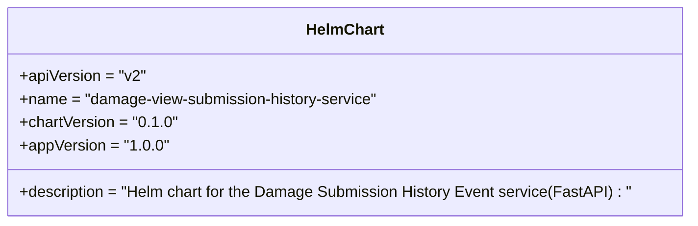
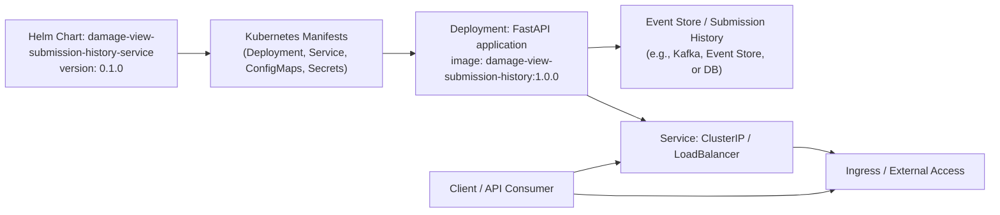

# Diagram: entity_core/entity_service/platform_applications/damage_submission_history_event/helm/Chart.yaml

> Auto-generated by Obscura crawlers

## Diagram 1

### SVG

<svg id="container" width="711.484375" xmlns="http://www.w3.org/2000/svg" class="classDiagram" height="232" viewBox="0 0 711.484375 232" role="graphics-document document" aria-roledescription="class"><g><defs><marker id="container_class-aggregationStart" class="marker aggregation class" refX="18" refY="7" markerWidth="190" markerHeight="240" orient="auto"><path d="M 18,7 L9,13 L1,7 L9,1 Z"></path></marker></defs><defs><marker id="container_class-aggregationEnd" class="marker aggregation class" refX="1" refY="7" markerWidth="20" markerHeight="28" orient="auto"><path d="M 18,7 L9,13 L1,7 L9,1 Z"></path></marker></defs><defs><marker id="container_class-extensionStart" class="marker extension class" refX="18" refY="7" markerWidth="190" markerHeight="240" orient="auto"><path d="M 1,7 L18,13 V 1 Z"></path></marker></defs><defs><marker id="container_class-extensionEnd" class="marker extension class" refX="1" refY="7" markerWidth="20" markerHeight="28" orient="auto"><path d="M 1,1 V 13 L18,7 Z"></path></marker></defs><defs><marker id="container_class-compositionStart" class="marker composition class" refX="18" refY="7" markerWidth="190" markerHeight="240" orient="auto"><path d="M 18,7 L9,13 L1,7 L9,1 Z"></path></marker></defs><defs><marker id="container_class-compositionEnd" class="marker composition class" refX="1" refY="7" markerWidth="20" markerHeight="28" orient="auto"><path d="M 18,7 L9,13 L1,7 L9,1 Z"></path></marker></defs><defs><marker id="container_class-dependencyStart" class="marker dependency class" refX="6" refY="7" markerWidth="190" markerHeight="240" orient="auto"><path d="M 5,7 L9,13 L1,7 L9,1 Z"></path></marker></defs><defs><marker id="container_class-dependencyEnd" class="marker dependency class" refX="13" refY="7" markerWidth="20" markerHeight="28" orient="auto"><path d="M 18,7 L9,13 L14,7 L9,1 Z"></path></marker></defs><defs><marker id="container_class-lollipopStart" class="marker lollipop class" refX="13" refY="7" markerWidth="190" markerHeight="240" orient="auto"><circle stroke="black" fill="transparent" cx="7" cy="7" r="6"></circle></marker></defs><defs><marker id="container_class-lollipopEnd" class="marker lollipop class" refX="1" refY="7" markerWidth="190" markerHeight="240" orient="auto"><circle stroke="black" fill="transparent" cx="7" cy="7" r="6"></circle></marker></defs><g class="root"><g class="clusters"></g><g class="edgePaths"></g><g class="edgeLabels"></g><g class="nodes"><g class="node default" id="classId-HelmChart-0" transform="translate(355.7421875, 116)"><g class="basic label-container"><path d="M-347.7421875 -108 L347.7421875 -108 L347.7421875 108 L-347.7421875 108" stroke="none" stroke-width="0" fill="#ECECFF" style=""></path><path d="M-347.7421875 -108 C-125.916814103713 -108, 95.90855929257401 -108, 347.7421875 -108 M-347.7421875 -108 C-144.39807892694623 -108, 58.94602964610755 -108, 347.7421875 -108 M347.7421875 -108 C347.7421875 -23.8988873056077, 347.7421875 60.2022253887846, 347.7421875 108 M347.7421875 -108 C347.7421875 -25.694571158438052, 347.7421875 56.610857683123896, 347.7421875 108 M347.7421875 108 C164.02686417123743 108, -19.68845915752513 108, -347.7421875 108 M347.7421875 108 C134.53288611525429 108, -78.67641526949143 108, -347.7421875 108 M-347.7421875 108 C-347.7421875 57.94583777521037, -347.7421875 7.891675550420743, -347.7421875 -108 M-347.7421875 108 C-347.7421875 42.70937128388343, -347.7421875 -22.581257432233144, -347.7421875 -108" stroke="#9370DB" stroke-width="1.3" fill="none" stroke-dasharray="0 0" style=""></path></g><g class="annotation-group text" transform="translate(0, -84)"></g><g class="label-group text" transform="translate(-38.703125, -84)"><g class="label" style="font-weight: bolder" transform="translate(0,-12)"><foreignObject width="77.40625" height="24">

HelmChart

</foreignObject></g></g><g class="members-group text" transform="translate(-335.7421875, -36)"><g class="label" style="" transform="translate(0,-12)"><foreignObject width="129.203125" height="24">

+apiVersion = "v2"

</foreignObject></g><g class="label" style="" transform="translate(0,12)"><foreignObject width="376.40625" height="24">

+name = "damage-view-submission-history-service"

</foreignObject></g><g class="label" style="" transform="translate(0,36)"><foreignObject width="158.9375" height="24">

+chartVersion = "0.1.0"

</foreignObject></g><g class="label" style="" transform="translate(0,60)"><foreignObject width="150.296875" height="24">

+appVersion = "1.0.0"

</foreignObject></g></g><g class="methods-group text" transform="translate(-335.7421875, 84)"><g class="label" style="" transform="translate(0,-12)"><foreignObject width="632.78125" height="24">

+description = "Helm chart for the Damage Submission History Event service(FastAPI) : "

</foreignObject></g></g><g class="divider" style=""><path d="M-347.7421875 -60 C-127.83612711724552 -60, 92.06993326550895 -60, 347.7421875 -60 M-347.7421875 -60 C-70.78168570932314 -60, 206.17881608135372 -60, 347.7421875 -60" stroke="#9370DB" stroke-width="1.3" fill="none" stroke-dasharray="0 0" style=""></path></g><g class="divider" style=""><path d="M-347.7421875 60 C-168.9951811222298 60, 9.751825255540382 60, 347.7421875 60 M-347.7421875 60 C-84.76923121561072 60, 178.20372506877857 60, 347.7421875 60" stroke="#9370DB" stroke-width="1.3" fill="none" stroke-dasharray="0 0" style=""></path></g></g></g></g></g></svg>

## Diagram 2

### SVG

<svg id="container" width="1495.359375" xmlns="http://www.w3.org/2000/svg" class="flowchart" height="300" viewBox="0 0 1495.359375 300" role="graphics-document document" aria-roledescription="flowchart-v2"><g><marker id="container_flowchart-v2-pointEnd" class="marker flowchart-v2" viewBox="0 0 10 10" refX="5" refY="5" markerUnits="userSpaceOnUse" markerWidth="8" markerHeight="8" orient="auto"><path d="M 0 0 L 10 5 L 0 10 z" class="arrowMarkerPath" style="stroke-width: 1; stroke-dasharray: 1, 0;"></path></marker><marker id="container_flowchart-v2-pointStart" class="marker flowchart-v2" viewBox="0 0 10 10" refX="4.5" refY="5" markerUnits="userSpaceOnUse" markerWidth="8" markerHeight="8" orient="auto"><path d="M 0 5 L 10 10 L 10 0 z" class="arrowMarkerPath" style="stroke-width: 1; stroke-dasharray: 1, 0;"></path></marker><marker id="container_flowchart-v2-circleEnd" class="marker flowchart-v2" viewBox="0 0 10 10" refX="11" refY="5" markerUnits="userSpaceOnUse" markerWidth="11" markerHeight="11" orient="auto"><circle cx="5" cy="5" r="5" class="arrowMarkerPath" style="stroke-width: 1; stroke-dasharray: 1, 0;"></circle></marker><marker id="container_flowchart-v2-circleStart" class="marker flowchart-v2" viewBox="0 0 10 10" refX="-1" refY="5" markerUnits="userSpaceOnUse" markerWidth="11" markerHeight="11" orient="auto"><circle cx="5" cy="5" r="5" class="arrowMarkerPath" style="stroke-width: 1; stroke-dasharray: 1, 0;"></circle></marker><marker id="container_flowchart-v2-crossEnd" class="marker cross flowchart-v2" viewBox="0 0 11 11" refX="12" refY="5.2" markerUnits="userSpaceOnUse" markerWidth="11" markerHeight="11" orient="auto"><path d="M 1,1 l 9,9 M 10,1 l -9,9" class="arrowMarkerPath" style="stroke-width: 2; stroke-dasharray: 1, 0;"></path></marker><marker id="container_flowchart-v2-crossStart" class="marker cross flowchart-v2" viewBox="0 0 11 11" refX="-1" refY="5.2" markerUnits="userSpaceOnUse" markerWidth="11" markerHeight="11" orient="auto"><path d="M 1,1 l 9,9 M 10,1 l -9,9" class="arrowMarkerPath" style="stroke-width: 2; stroke-dasharray: 1, 0;"></path></marker><g class="root"><g class="clusters"></g><g class="edgePaths"><path d="M268,71L272.167,71C276.333,71,284.667,71,292.333,71C300,71,307,71,310.5,71L314,71" id="L_Chart_Templates_0" class="edge-thickness-normal edge-pattern-solid edge-thickness-normal edge-pattern-solid flowchart-link" style=";" data-edge="true" data-et="edge" data-id="L_Chart_Templates_0" data-points="W3sieCI6MjY4LCJ5Ijo3MX0seyJ4IjoyOTMsInkiOjcxfSx7IngiOjMxOCwieSI6NzF9XQ==" marker-end="url(#container_flowchart-v2-pointEnd)"></path><path d="M578,71L582.167,71C586.333,71,594.667,71,602.333,71C610,71,617,71,620.5,71L624,71" id="L_Templates_Deployment_0" class="edge-thickness-normal edge-pattern-solid edge-thickness-normal edge-pattern-solid flowchart-link" style=";" data-edge="true" data-et="edge" data-id="L_Templates_Deployment_0" data-points="W3sieCI6NTc4LCJ5Ijo3MX0seyJ4Ijo2MDMsInkiOjcxfSx7IngiOjYyOCwieSI6NzF9XQ==" marker-end="url(#container_flowchart-v2-pointEnd)"></path><path d="M888,129.71L892.167,131.591C896.333,133.473,904.667,137.237,917.253,142.378C929.84,147.519,946.68,154.037,955.1,157.297L963.52,160.556" id="L_Deployment_Service_0" class="edge-thickness-normal edge-pattern-solid edge-thickness-normal edge-pattern-solid flowchart-link" style=";" data-edge="true" data-et="edge" data-id="L_Deployment_Service_0" data-points="W3sieCI6ODg4LCJ5IjoxMjkuNzA5Njc3NDE5MzU0ODV9LHsieCI6OTEzLCJ5IjoxNDF9LHsieCI6OTY3LjI1LCJ5IjoxNjJ9XQ==" marker-end="url(#container_flowchart-v2-pointEnd)"></path><path d="M1198,201L1202.167,201C1206.333,201,1214.667,201,1224.705,202.501C1234.742,204.003,1246.485,207.006,1252.356,208.507L1258.227,210.009" id="L_Service_Ingress_0" class="edge-thickness-normal edge-pattern-solid edge-thickness-normal edge-pattern-solid flowchart-link" style=";" data-edge="true" data-et="edge" data-id="L_Service_Ingress_0" data-points="W3sieCI6MTE5OCwieSI6MjAxfSx7IngiOjEyMjMsInkiOjIwMX0seyJ4IjoxMjYyLjEwMjYxODI0MzI0MzMsInkiOjIxMX1d" marker-end="url(#container_flowchart-v2-pointEnd)"></path><path d="M888,62.613L892.167,62.344C896.333,62.075,904.667,61.538,912.333,61.269C920,61,927,61,930.5,61L934,61" id="L_Deployment_EventStore_0" class="edge-thickness-normal edge-pattern-solid edge-thickness-normal edge-pattern-solid flowchart-link" style=";" data-edge="true" data-et="edge" data-id="L_Deployment_EventStore_0" data-points="W3sieCI6ODg4LCJ5Ijo2Mi42MTI5MDMyMjU4MDY0NX0seyJ4Ijo5MTMsInkiOjYxfSx7IngiOjkzOCwieSI6NjF9XQ==" marker-end="url(#container_flowchart-v2-pointEnd)"></path><path d="M867.43,272.06L875.025,272.55C882.62,273.04,897.81,274.02,931.238,274.51C964.667,275,1016.333,275,1068,275C1119.667,275,1171.333,275,1203.038,273.499C1234.742,271.997,1246.485,268.994,1252.356,267.493L1258.227,265.991" id="L_Client_Ingress_0" class="edge-thickness-normal edge-pattern-solid edge-thickness-normal edge-pattern-solid flowchart-link" style=";" data-edge="true" data-et="edge" data-id="L_Client_Ingress_0" data-points="W3sieCI6ODY3LjQyOTY4NzUsInkiOjI3Mi4wNTk5Nzk4Mzg3MDk3fSx7IngiOjkxMywieSI6Mjc1fSx7IngiOjEwNjgsInkiOjI3NX0seyJ4IjoxMjIzLCJ5IjoyNzV9LHsieCI6MTI2Mi4xMDI2MTgyNDMyNDMzLCJ5IjoyNjV9XQ==" marker-end="url(#container_flowchart-v2-pointEnd)"></path><path d="M867.43,238.878L875.025,237.065C882.62,235.252,897.81,231.626,908.915,229.202C920.02,226.777,927.04,225.554,930.549,224.943L934.059,224.332" id="L_Client_Service_0" class="edge-thickness-normal edge-pattern-solid edge-thickness-normal edge-pattern-solid flowchart-link" style=";" data-edge="true" data-et="edge" data-id="L_Client_Service_0" data-points="W3sieCI6ODY3LjQyOTY4NzUsInkiOjIzOC44NzgwNzQ1OTY3NzQxOH0seyJ4Ijo5MTMsInkiOjIyOH0seyJ4Ijo5MzgsInkiOjIyMy42NDUxNjEyOTAzMjI2fV0=" marker-end="url(#container_flowchart-v2-pointEnd)"></path></g><g class="edgeLabels"><g class="edgeLabel"><g class="label" data-id="L_Chart_Templates_0" transform="translate(0, 0)"><foreignObject width="0" height="0">

</foreignObject></g></g><g class="edgeLabel"><g class="label" data-id="L_Templates_Deployment_0" transform="translate(0, 0)"><foreignObject width="0" height="0">

</foreignObject></g></g><g class="edgeLabel"><g class="label" data-id="L_Deployment_Service_0" transform="translate(0, 0)"><foreignObject width="0" height="0">

</foreignObject></g></g><g class="edgeLabel"><g class="label" data-id="L_Service_Ingress_0" transform="translate(0, 0)"><foreignObject width="0" height="0">

</foreignObject></g></g><g class="edgeLabel"><g class="label" data-id="L_Deployment_EventStore_0" transform="translate(0, 0)"><foreignObject width="0" height="0">

</foreignObject></g></g><g class="edgeLabel"><g class="label" data-id="L_Client_Ingress_0" transform="translate(0, 0)"><foreignObject width="0" height="0">

</foreignObject></g></g><g class="edgeLabel"><g class="label" data-id="L_Client_Service_0" transform="translate(0, 0)"><foreignObject width="0" height="0">

</foreignObject></g></g></g><g class="nodes"><g class="node default" id="flowchart-Chart-0" transform="translate(138, 71)"><rect class="basic label-container" style="" x="-130" y="-51" width="260" height="102"></rect><g class="label" style="" transform="translate(-100, -36)"><rect></rect><foreignObject width="200" height="72">

Helm Chart: damage-view-submission-history-service\nversion: 0.1.0

</foreignObject></g></g><g class="node default" id="flowchart-Templates-1" transform="translate(448, 71)"><rect class="basic label-container" style="" x="-130" y="-63" width="260" height="126"></rect><g class="label" style="" transform="translate(-100, -48)"><rect></rect><foreignObject width="200" height="96">

Kubernetes Manifests\n(Deployment, Service, ConfigMaps, Secrets)

</foreignObject></g></g><g class="node default" id="flowchart-Deployment-3" transform="translate(758, 71)"><rect class="basic label-container" style="" x="-130" y="-63" width="260" height="126"></rect><g class="label" style="" transform="translate(-100, -48)"><rect></rect><foreignObject width="200" height="96">

Deployment: FastAPI application\nimage: damage-view-submission-history:1.0.0

</foreignObject></g></g><g class="node default" id="flowchart-Service-5" transform="translate(1068, 201)"><rect class="basic label-container" style="" x="-130" y="-39" width="260" height="78"></rect><g class="label" style="" transform="translate(-100, -24)"><rect></rect><foreignObject width="200" height="48">

Service: ClusterIP / LoadBalancer

</foreignObject></g></g><g class="node default" id="flowchart-Ingress-7" transform="translate(1367.6796875, 238)"><rect class="basic label-container" style="" x="-119.6796875" y="-27" width="239.359375" height="54"></rect><g class="label" style="" transform="translate(-89.6796875, -12)"><rect></rect><foreignObject width="179.359375" height="24">

Ingress / External Access

</foreignObject></g></g><g class="node default" id="flowchart-EventStore-9" transform="translate(1068, 61)"><rect class="basic label-container" style="" x="-130" y="-51" width="260" height="102"></rect><g class="label" style="" transform="translate(-100, -36)"><rect></rect><foreignObject width="200" height="72">

Event Store / Submission History\n(e.g., Kafka, Event Store, or DB)

</foreignObject></g></g><g class="node default" id="flowchart-Client-10" transform="translate(758, 265)"><rect class="basic label-container" style="" x="-109.4296875" y="-27" width="218.859375" height="54"></rect><g class="label" style="" transform="translate(-79.4296875, -12)"><rect></rect><foreignObject width="158.859375" height="24">

Client / API Consumer

</foreignObject></g></g></g></g></g></svg>
