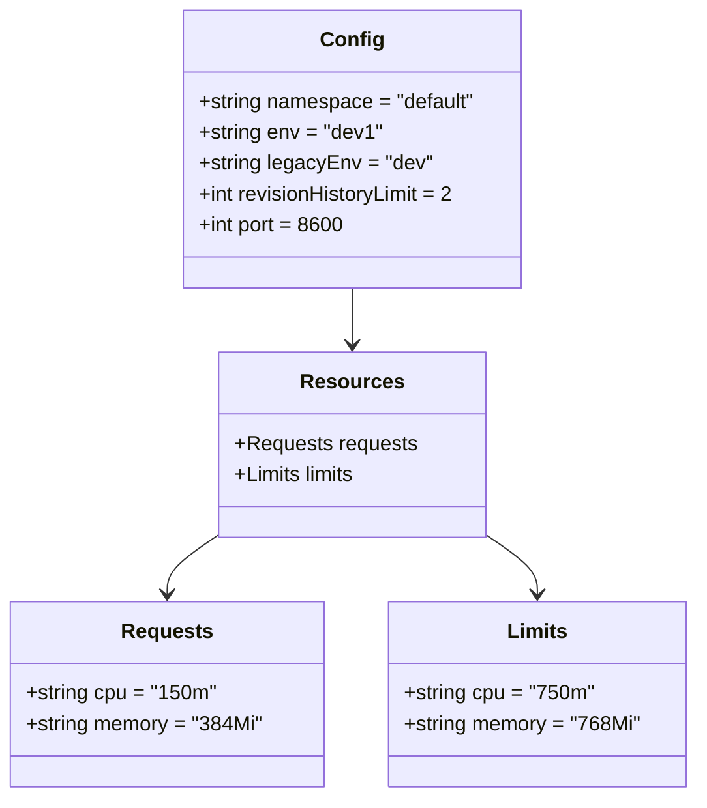
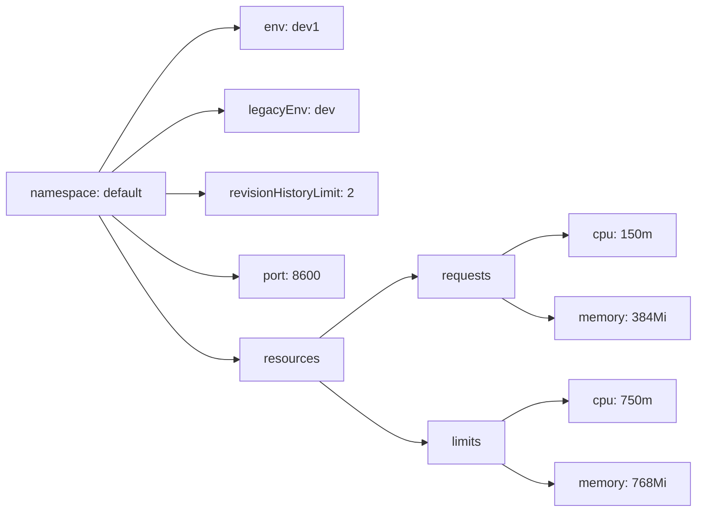

# Diagram: entity_core/entity_service/platform_applications/damage_submission_history_event/helm/profiles/values.dev1.yaml

> Auto-generated by Obscura crawlers

## Diagram 1

### SVG

<svg id="container" width="538.921875" xmlns="http://www.w3.org/2000/svg" class="classDiagram" height="620" viewBox="0 0 538.921875 620" role="graphics-document document" aria-roledescription="class"><g><defs><marker id="container_class-aggregationStart" class="marker aggregation class" refX="18" refY="7" markerWidth="190" markerHeight="240" orient="auto"><path d="M 18,7 L9,13 L1,7 L9,1 Z"></path></marker></defs><defs><marker id="container_class-aggregationEnd" class="marker aggregation class" refX="1" refY="7" markerWidth="20" markerHeight="28" orient="auto"><path d="M 18,7 L9,13 L1,7 L9,1 Z"></path></marker></defs><defs><marker id="container_class-extensionStart" class="marker extension class" refX="18" refY="7" markerWidth="190" markerHeight="240" orient="auto"><path d="M 1,7 L18,13 V 1 Z"></path></marker></defs><defs><marker id="container_class-extensionEnd" class="marker extension class" refX="1" refY="7" markerWidth="20" markerHeight="28" orient="auto"><path d="M 1,1 V 13 L18,7 Z"></path></marker></defs><defs><marker id="container_class-compositionStart" class="marker composition class" refX="18" refY="7" markerWidth="190" markerHeight="240" orient="auto"><path d="M 18,7 L9,13 L1,7 L9,1 Z"></path></marker></defs><defs><marker id="container_class-compositionEnd" class="marker composition class" refX="1" refY="7" markerWidth="20" markerHeight="28" orient="auto"><path d="M 18,7 L9,13 L1,7 L9,1 Z"></path></marker></defs><defs><marker id="container_class-dependencyStart" class="marker dependency class" refX="6" refY="7" markerWidth="190" markerHeight="240" orient="auto"><path d="M 5,7 L9,13 L1,7 L9,1 Z"></path></marker></defs><defs><marker id="container_class-dependencyEnd" class="marker dependency class" refX="13" refY="7" markerWidth="20" markerHeight="28" orient="auto"><path d="M 18,7 L9,13 L14,7 L9,1 Z"></path></marker></defs><defs><marker id="container_class-lollipopStart" class="marker lollipop class" refX="13" refY="7" markerWidth="190" markerHeight="240" orient="auto"><circle stroke="black" fill="transparent" cx="7" cy="7" r="6"></circle></marker></defs><defs><marker id="container_class-lollipopEnd" class="marker lollipop class" refX="1" refY="7" markerWidth="190" markerHeight="240" orient="auto"><circle stroke="black" fill="transparent" cx="7" cy="7" r="6"></circle></marker></defs><g class="root"><g class="clusters"></g><g class="edgePaths"><path d="M272.613,224L272.613,228.167C272.613,232.333,272.613,240.667,272.613,248C272.613,255.333,272.613,261.667,272.613,264.833L272.613,268" id="id_Config_Resources_1" class="edge-thickness-normal edge-pattern-solid relation" style=";;;" data-edge="true" data-et="edge" data-id="id_Config_Resources_1" data-points="W3sieCI6MjcyLjYxMzI4MTI1LCJ5IjoyMjR9LHsieCI6MjcyLjYxMzI4MTI1LCJ5IjoyNDl9LHsieCI6MjcyLjYxMzI4MTI1LCJ5IjoyNzR9XQ==" marker-end="url(#container_class-dependencyEnd)"></path><path d="M171.254,414.644L164.275,419.37C157.297,424.096,143.34,433.548,136.361,441.441C129.383,449.333,129.383,455.667,129.383,458.833L129.383,462" id="id_Resources_Requests_2" class="edge-thickness-normal edge-pattern-solid relation" style=";;;" data-edge="true" data-et="edge" data-id="id_Resources_Requests_2" data-points="W3sieCI6MTcxLjI1MzkwNjI1LCJ5Ijo0MTQuNjQzNjMwNTEyNDQ5OX0seyJ4IjoxMjkuMzgyODEyNSwieSI6NDQzfSx7IngiOjEyOS4zODI4MTI1LCJ5Ijo0Njh9XQ==" marker-end="url(#container_class-dependencyEnd)"></path><path d="M373.973,414.644L380.951,419.37C387.93,424.096,401.887,433.548,408.865,441.441C415.844,449.333,415.844,455.667,415.844,458.833L415.844,462" id="id_Resources_Limits_3" class="edge-thickness-normal edge-pattern-solid relation" style=";;;" data-edge="true" data-et="edge" data-id="id_Resources_Limits_3" data-points="W3sieCI6MzczLjk3MjY1NjI1LCJ5Ijo0MTQuNjQzNjMwNTEyNDQ5OX0seyJ4Ijo0MTUuODQzNzUsInkiOjQ0M30seyJ4Ijo0MTUuODQzNzUsInkiOjQ2OH1d" marker-end="url(#container_class-dependencyEnd)"></path></g><g class="edgeLabels"><g class="edgeLabel"><g class="label" data-id="id_Config_Resources_1" transform="translate(0, 0)"><foreignObject width="0" height="0">

</foreignObject></g></g><g class="edgeLabel"><g class="label" data-id="id_Resources_Requests_2" transform="translate(0, 0)"><foreignObject width="0" height="0">

</foreignObject></g></g><g class="edgeLabel"><g class="label" data-id="id_Resources_Limits_3" transform="translate(0, 0)"><foreignObject width="0" height="0">

</foreignObject></g></g></g><g class="nodes"><g class="node default" id="classId-Config-0" transform="translate(272.61328125, 116)"><g class="basic label-container"><path d="M-131.74609375 -108 L131.74609375 -108 L131.74609375 108 L-131.74609375 108" stroke="none" stroke-width="0" fill="#ECECFF" style=""></path><path d="M-131.74609375 -108 C-76.54061705677223 -108, -21.33514036354447 -108, 131.74609375 -108 M-131.74609375 -108 C-51.65527336610836 -108, 28.43554701778328 -108, 131.74609375 -108 M131.74609375 -108 C131.74609375 -33.29146857468571, 131.74609375 41.41706285062858, 131.74609375 108 M131.74609375 -108 C131.74609375 -34.244964001403574, 131.74609375 39.51007199719285, 131.74609375 108 M131.74609375 108 C32.52557757642114 108, -66.69493859715772 108, -131.74609375 108 M131.74609375 108 C77.15272483193507 108, 22.559355913870164 108, -131.74609375 108 M-131.74609375 108 C-131.74609375 40.811849021345864, -131.74609375 -26.37630195730827, -131.74609375 -108 M-131.74609375 108 C-131.74609375 34.894561536398655, -131.74609375 -38.21087692720269, -131.74609375 -108" stroke="#9370DB" stroke-width="1.3" fill="none" stroke-dasharray="0 0" style=""></path></g><g class="annotation-group text" transform="translate(0, -84)"></g><g class="label-group text" transform="translate(-22.9296875, -84)"><g class="label" style="font-weight: bolder" transform="translate(0,-12)"><foreignObject width="45.859375" height="24">

Config

</foreignObject></g></g><g class="members-group text" transform="translate(-119.74609375, -36)"><g class="label" style="" transform="translate(0,-12)"><foreignObject width="216.5625" height="24">

+string namespace = "default"

</foreignObject></g><g class="label" style="" transform="translate(0,12)"><foreignObject width="141.828125" height="24">

+string env = "dev1"

</foreignObject></g><g class="label" style="" transform="translate(0,36)"><foreignObject width="180.15625" height="24">

+string legacyEnv = "dev"

</foreignObject></g><g class="label" style="" transform="translate(0,60)"><foreignObject width="202.015625" height="24">

+int revisionHistoryLimit = 2

</foreignObject></g><g class="label" style="" transform="translate(0,84)"><foreignObject width="114.375" height="24">

+int port = 8600

</foreignObject></g></g><g class="methods-group text" transform="translate(-119.74609375, 108)"></g><g class="divider" style=""><path d="M-131.74609375 -60 C-74.09904207689311 -60, -16.451990403786226 -60, 131.74609375 -60 M-131.74609375 -60 C-41.86183613238511 -60, 48.022421485229785 -60, 131.74609375 -60" stroke="#9370DB" stroke-width="1.3" fill="none" stroke-dasharray="0 0" style=""></path></g><g class="divider" style=""><path d="M-131.74609375 84 C-46.4264584444045 84, 38.893176861190994 84, 131.74609375 84 M-131.74609375 84 C-69.7697525728971 84, -7.793411395794209 84, 131.74609375 84" stroke="#9370DB" stroke-width="1.3" fill="none" stroke-dasharray="0 0" style=""></path></g></g><g class="node default" id="classId-Resources-1" transform="translate(272.61328125, 346)"><g class="basic label-container"><path d="M-101.359375 -72 L101.359375 -72 L101.359375 72 L-101.359375 72" stroke="none" stroke-width="0" fill="#ECECFF" style=""></path><path d="M-101.359375 -72 C-51.42552639966279 -72, -1.4916777993255863 -72, 101.359375 -72 M-101.359375 -72 C-40.042034930163226 -72, 21.27530513967355 -72, 101.359375 -72 M101.359375 -72 C101.359375 -27.946432952329957, 101.359375 16.107134095340086, 101.359375 72 M101.359375 -72 C101.359375 -21.365734351926008, 101.359375 29.268531296147984, 101.359375 72 M101.359375 72 C51.408697907864685 72, 1.4580208157293697 72, -101.359375 72 M101.359375 72 C38.62809276463619 72, -24.103189470727614 72, -101.359375 72 M-101.359375 72 C-101.359375 19.16620888925791, -101.359375 -33.66758222148418, -101.359375 -72 M-101.359375 72 C-101.359375 17.938315846058515, -101.359375 -36.12336830788297, -101.359375 -72" stroke="#9370DB" stroke-width="1.3" fill="none" stroke-dasharray="0 0" style=""></path></g><g class="annotation-group text" transform="translate(0, -48)"></g><g class="label-group text" transform="translate(-37.265625, -48)"><g class="label" style="font-weight: bolder" transform="translate(0,-12)"><foreignObject width="74.53125" height="24">

Resources

</foreignObject></g></g><g class="members-group text" transform="translate(-89.359375, 0)"><g class="label" style="" transform="translate(0,-12)"><foreignObject width="141.453125" height="24">

+Requests requests

</foreignObject></g><g class="label" style="" transform="translate(0,12)"><foreignObject width="96.859375" height="24">

+Limits limits

</foreignObject></g></g><g class="methods-group text" transform="translate(-89.359375, 72)"></g><g class="divider" style=""><path d="M-101.359375 -24 C-21.003325913589933 -24, 59.352723172820134 -24, 101.359375 -24 M-101.359375 -24 C-45.617535157128145 -24, 10.12430468574371 -24, 101.359375 -24" stroke="#9370DB" stroke-width="1.3" fill="none" stroke-dasharray="0 0" style=""></path></g><g class="divider" style=""><path d="M-101.359375 48 C-21.758516270503677 48, 57.84234245899265 48, 101.359375 48 M-101.359375 48 C-22.850830854477422 48, 55.657713291045155 48, 101.359375 48" stroke="#9370DB" stroke-width="1.3" fill="none" stroke-dasharray="0 0" style=""></path></g></g><g class="node default" id="classId-Requests-2" transform="translate(129.3828125, 540)"><g class="basic label-container"><path d="M-121.3828125 -72 L121.3828125 -72 L121.3828125 72 L-121.3828125 72" stroke="none" stroke-width="0" fill="#ECECFF" style=""></path><path d="M-121.3828125 -72 C-58.49267628491854 -72, 4.397459930162924 -72, 121.3828125 -72 M-121.3828125 -72 C-34.82564179952375 -72, 51.7315289009525 -72, 121.3828125 -72 M121.3828125 -72 C121.3828125 -25.925452031522447, 121.3828125 20.149095936955106, 121.3828125 72 M121.3828125 -72 C121.3828125 -32.54566675034199, 121.3828125 6.908666499316027, 121.3828125 72 M121.3828125 72 C58.1174292117274 72, -5.147954076545204 72, -121.3828125 72 M121.3828125 72 C39.40102792754658 72, -42.58075664490684 72, -121.3828125 72 M-121.3828125 72 C-121.3828125 42.03956155187498, -121.3828125 12.079123103749971, -121.3828125 -72 M-121.3828125 72 C-121.3828125 32.339465409528316, -121.3828125 -7.321069180943368, -121.3828125 -72" stroke="#9370DB" stroke-width="1.3" fill="none" stroke-dasharray="0 0" style=""></path></g><g class="annotation-group text" transform="translate(0, -48)"></g><g class="label-group text" transform="translate(-33.84375, -48)"><g class="label" style="font-weight: bolder" transform="translate(0,-12)"><foreignObject width="67.6875" height="24">

Requests

</foreignObject></g></g><g class="members-group text" transform="translate(-109.3828125, 0)"><g class="label" style="" transform="translate(0,-12)"><foreignObject width="147" height="24">

+string cpu = "150m"

</foreignObject></g><g class="label" style="" transform="translate(0,12)"><foreignObject width="184.921875" height="24">

+string memory = "384Mi"

</foreignObject></g></g><g class="methods-group text" transform="translate(-109.3828125, 72)"></g><g class="divider" style=""><path d="M-121.3828125 -24 C-37.883554047115695 -24, 45.61570440576861 -24, 121.3828125 -24 M-121.3828125 -24 C-24.847440474446827 -24, 71.68793155110635 -24, 121.3828125 -24" stroke="#9370DB" stroke-width="1.3" fill="none" stroke-dasharray="0 0" style=""></path></g><g class="divider" style=""><path d="M-121.3828125 48 C-33.53478685251106 48, 54.31323879497788 48, 121.3828125 48 M-121.3828125 48 C-34.88656001251083 48, 51.609692474978345 48, 121.3828125 48" stroke="#9370DB" stroke-width="1.3" fill="none" stroke-dasharray="0 0" style=""></path></g></g><g class="node default" id="classId-Limits-3" transform="translate(415.84375, 540)"><g class="basic label-container"><path d="M-115.078125 -72 L115.078125 -72 L115.078125 72 L-115.078125 72" stroke="none" stroke-width="0" fill="#ECECFF" style=""></path><path d="M-115.078125 -72 C-39.00551300733498 -72, 37.067098985330034 -72, 115.078125 -72 M-115.078125 -72 C-43.65051875276751 -72, 27.77708749446498 -72, 115.078125 -72 M115.078125 -72 C115.078125 -35.02582639029394, 115.078125 1.9483472194121134, 115.078125 72 M115.078125 -72 C115.078125 -36.274658529113225, 115.078125 -0.5493170582264497, 115.078125 72 M115.078125 72 C67.46963040879099 72, 19.86113581758198 72, -115.078125 72 M115.078125 72 C25.731274484019266 72, -63.61557603196147 72, -115.078125 72 M-115.078125 72 C-115.078125 42.17458996323618, -115.078125 12.34917992647236, -115.078125 -72 M-115.078125 72 C-115.078125 38.79809031785843, -115.078125 5.596180635716863, -115.078125 -72" stroke="#9370DB" stroke-width="1.3" fill="none" stroke-dasharray="0 0" style=""></path></g><g class="annotation-group text" transform="translate(0, -48)"></g><g class="label-group text" transform="translate(-22.328125, -48)"><g class="label" style="font-weight: bolder" transform="translate(0,-12)"><foreignObject width="44.65625" height="24">

Limits

</foreignObject></g></g><g class="members-group text" transform="translate(-103.078125, 0)"><g class="label" style="" transform="translate(0,-12)"><foreignObject width="147.078125" height="24">

+string cpu = "750m"

</foreignObject></g><g class="label" style="" transform="translate(0,12)"><foreignObject width="183.828125" height="24">

+string memory = "768Mi"

</foreignObject></g></g><g class="methods-group text" transform="translate(-103.078125, 72)"></g><g class="divider" style=""><path d="M-115.078125 -24 C-25.44933807732481 -24, 64.17944884535038 -24, 115.078125 -24 M-115.078125 -24 C-44.332411661012955 -24, 26.41330167797409 -24, 115.078125 -24" stroke="#9370DB" stroke-width="1.3" fill="none" stroke-dasharray="0 0" style=""></path></g><g class="divider" style=""><path d="M-115.078125 48 C-48.91709181536554 48, 17.243941369268924 48, 115.078125 48 M-115.078125 48 C-59.84861075906607 48, -4.619096518132139 48, 115.078125 48" stroke="#9370DB" stroke-width="1.3" fill="none" stroke-dasharray="0 0" style=""></path></g></g></g></g></g></svg>

## Diagram 2

### SVG

<svg id="container" width="882.421875" xmlns="http://www.w3.org/2000/svg" class="flowchart" height="642" viewBox="0 0 882.421875 642" role="graphics-document document" aria-roledescription="flowchart-v2"><g><marker id="container_flowchart-v2-pointEnd" class="marker flowchart-v2" viewBox="0 0 10 10" refX="5" refY="5" markerUnits="userSpaceOnUse" markerWidth="8" markerHeight="8" orient="auto"><path d="M 0 0 L 10 5 L 0 10 z" class="arrowMarkerPath" style="stroke-width: 1; stroke-dasharray: 1, 0;"></path></marker><marker id="container_flowchart-v2-pointStart" class="marker flowchart-v2" viewBox="0 0 10 10" refX="4.5" refY="5" markerUnits="userSpaceOnUse" markerWidth="8" markerHeight="8" orient="auto"><path d="M 0 5 L 10 10 L 10 0 z" class="arrowMarkerPath" style="stroke-width: 1; stroke-dasharray: 1, 0;"></path></marker><marker id="container_flowchart-v2-circleEnd" class="marker flowchart-v2" viewBox="0 0 10 10" refX="11" refY="5" markerUnits="userSpaceOnUse" markerWidth="11" markerHeight="11" orient="auto"><circle cx="5" cy="5" r="5" class="arrowMarkerPath" style="stroke-width: 1; stroke-dasharray: 1, 0;"></circle></marker><marker id="container_flowchart-v2-circleStart" class="marker flowchart-v2" viewBox="0 0 10 10" refX="-1" refY="5" markerUnits="userSpaceOnUse" markerWidth="11" markerHeight="11" orient="auto"><circle cx="5" cy="5" r="5" class="arrowMarkerPath" style="stroke-width: 1; stroke-dasharray: 1, 0;"></circle></marker><marker id="container_flowchart-v2-crossEnd" class="marker cross flowchart-v2" viewBox="0 0 11 11" refX="12" refY="5.2" markerUnits="userSpaceOnUse" markerWidth="11" markerHeight="11" orient="auto"><path d="M 1,1 l 9,9 M 10,1 l -9,9" class="arrowMarkerPath" style="stroke-width: 2; stroke-dasharray: 1, 0;"></path></marker><marker id="container_flowchart-v2-crossStart" class="marker cross flowchart-v2" viewBox="0 0 11 11" refX="-1" refY="5.2" markerUnits="userSpaceOnUse" markerWidth="11" markerHeight="11" orient="auto"><path d="M 1,1 l 9,9 M 10,1 l -9,9" class="arrowMarkerPath" style="stroke-width: 2; stroke-dasharray: 1, 0;"></path></marker><g class="root"><g class="clusters"></g><g class="edgePaths"><path d="M125.32,216L143.59,185.833C161.859,155.667,198.398,95.333,228.064,65.167C257.729,35,280.521,35,291.917,35L303.313,35" id="L_NS_ENV_0" class="edge-thickness-normal edge-pattern-solid edge-thickness-normal edge-pattern-solid flowchart-link" style=";" data-edge="true" data-et="edge" data-id="L_NS_ENV_0" data-points="W3sieCI6MTI1LjMyMDQ2Mjc0MDM4NDYxLCJ5IjoyMTZ9LHsieCI6MjM0LjkzNzUsInkiOjM1fSx7IngiOjMwNy4zMTI1LCJ5IjozNX1d" marker-end="url(#container_flowchart-v2-pointEnd)"></path><path d="M141.672,216L157.216,203.167C172.761,190.333,203.849,164.667,227.595,151.833C251.341,139,267.745,139,275.947,139L284.148,139" id="L_NS_LENV_0" class="edge-thickness-normal edge-pattern-solid edge-thickness-normal edge-pattern-solid flowchart-link" style=";" data-edge="true" data-et="edge" data-id="L_NS_LENV_0" data-points="W3sieCI6MTQxLjY3MjE3NTQ4MDc2OTIzLCJ5IjoyMTZ9LHsieCI6MjM0LjkzNzUsInkiOjEzOX0seyJ4IjoyODguMTQ4NDM3NSwieSI6MTM5fV0=" marker-end="url(#container_flowchart-v2-pointEnd)"></path><path d="M209.938,243L214.104,243C218.271,243,226.604,243,234.271,243C241.938,243,248.938,243,252.438,243L255.938,243" id="L_NS_REV_0" class="edge-thickness-normal edge-pattern-solid edge-thickness-normal edge-pattern-solid flowchart-link" style=";" data-edge="true" data-et="edge" data-id="L_NS_REV_0" data-points="W3sieCI6MjA5LjkzNzUsInkiOjI0M30seyJ4IjoyMzQuOTM3NSwieSI6MjQzfSx7IngiOjI1OS45Mzc1LCJ5IjoyNDN9XQ==" marker-end="url(#container_flowchart-v2-pointEnd)"></path><path d="M141.672,270L157.216,282.833C172.761,295.667,203.849,321.333,230.195,334.167C256.542,347,278.146,347,288.948,347L299.75,347" id="L_NS_PORT_0" class="edge-thickness-normal edge-pattern-solid edge-thickness-normal edge-pattern-solid flowchart-link" style=";" data-edge="true" data-et="edge" data-id="L_NS_PORT_0" data-points="W3sieCI6MTQxLjY3MjE3NTQ4MDc2OTIzLCJ5IjoyNzB9LHsieCI6MjM0LjkzNzUsInkiOjM0N30seyJ4IjozMDMuNzUsInkiOjM0N31d" marker-end="url(#container_flowchart-v2-pointEnd)"></path><path d="M125.32,270L143.59,300.167C161.859,330.333,198.398,390.667,227.836,420.833C257.273,451,279.609,451,290.777,451L301.945,451" id="L_NS_RES_0" class="edge-thickness-normal edge-pattern-solid edge-thickness-normal edge-pattern-solid flowchart-link" style=";" data-edge="true" data-et="edge" data-id="L_NS_RES_0" data-points="W3sieCI6MTI1LjMyMDQ2Mjc0MDM4NDYxLCJ5IjoyNzB9LHsieCI6MjM0LjkzNzUsInkiOjQ1MX0seyJ4IjozMDUuOTQ1MzEyNSwieSI6NDUxfV0=" marker-end="url(#container_flowchart-v2-pointEnd)"></path><path d="M406.107,424L422.876,411.167C439.645,398.333,473.182,372.667,493.45,359.833C513.719,347,520.719,347,524.219,347L527.719,347" id="L_RES_REQ_0" class="edge-thickness-normal edge-pattern-solid edge-thickness-normal edge-pattern-solid flowchart-link" style=";" data-edge="true" data-et="edge" data-id="L_RES_REQ_0" data-points="W3sieCI6NDA2LjEwNzQyMTg3NSwieSI6NDI0fSx7IngiOjUwNi43MTg3NSwieSI6MzQ3fSx7IngiOjUzMS43MTg3NSwieSI6MzQ3fV0=" marker-end="url(#container_flowchart-v2-pointEnd)"></path><path d="M637.942,320L644.863,315.833C651.784,311.667,665.627,303.333,679.199,299.167C692.771,295,706.073,295,712.724,295L719.375,295" id="L_REQ_RCPU_0" class="edge-thickness-normal edge-pattern-solid edge-thickness-normal edge-pattern-solid flowchart-link" style=";" data-edge="true" data-et="edge" data-id="L_REQ_RCPU_0" data-points="W3sieCI6NjM3Ljk0MjMwNzY5MjMwNzcsInkiOjMyMH0seyJ4Ijo2NzkuNDY4NzUsInkiOjI5NX0seyJ4Ijo3MjMuMzc1LCJ5IjoyOTV9XQ==" marker-end="url(#container_flowchart-v2-pointEnd)"></path><path d="M637.942,374L644.863,378.167C651.784,382.333,665.627,390.667,676.048,394.833C686.469,399,693.469,399,696.969,399L700.469,399" id="L_REQ_RMEM_0" class="edge-thickness-normal edge-pattern-solid edge-thickness-normal edge-pattern-solid flowchart-link" style=";" data-edge="true" data-et="edge" data-id="L_REQ_RMEM_0" data-points="W3sieCI6NjM3Ljk0MjMwNzY5MjMwNzcsInkiOjM3NH0seyJ4Ijo2NzkuNDY4NzUsInkiOjM5OX0seyJ4Ijo3MDQuNDY4NzUsInkiOjM5OX1d" marker-end="url(#container_flowchart-v2-pointEnd)"></path><path d="M406.107,478L422.876,490.833C439.645,503.667,473.182,529.333,495.289,542.167C517.396,555,528.073,555,533.411,555L538.75,555" id="L_RES_LIM_0" class="edge-thickness-normal edge-pattern-solid edge-thickness-normal edge-pattern-solid flowchart-link" style=";" data-edge="true" data-et="edge" data-id="L_RES_LIM_0" data-points="W3sieCI6NDA2LjEwNzQyMTg3NSwieSI6NDc4fSx7IngiOjUwNi43MTg3NSwieSI6NTU1fSx7IngiOjU0Mi43NSwieSI6NTU1fV0=" marker-end="url(#container_flowchart-v2-pointEnd)"></path><path d="M637.942,528L644.863,523.833C651.784,519.667,665.627,511.333,679.204,507.167C692.781,503,706.094,503,712.75,503L719.406,503" id="L_LIM_LCPU_0" class="edge-thickness-normal edge-pattern-solid edge-thickness-normal edge-pattern-solid flowchart-link" style=";" data-edge="true" data-et="edge" data-id="L_LIM_LCPU_0" data-points="W3sieCI6NjM3Ljk0MjMwNzY5MjMwNzcsInkiOjUyOH0seyJ4Ijo2NzkuNDY4NzUsInkiOjUwM30seyJ4Ijo3MjMuNDA2MjUsInkiOjUwM31d" marker-end="url(#container_flowchart-v2-pointEnd)"></path><path d="M637.942,582L644.863,586.167C651.784,590.333,665.627,598.667,676.149,602.833C686.672,607,693.875,607,697.477,607L701.078,607" id="L_LIM_LMEM_0" class="edge-thickness-normal edge-pattern-solid edge-thickness-normal edge-pattern-solid flowchart-link" style=";" data-edge="true" data-et="edge" data-id="L_LIM_LMEM_0" data-points="W3sieCI6NjM3Ljk0MjMwNzY5MjMwNzcsInkiOjU4Mn0seyJ4Ijo2NzkuNDY4NzUsInkiOjYwN30seyJ4Ijo3MDUuMDc4MTI1LCJ5Ijo2MDd9XQ==" marker-end="url(#container_flowchart-v2-pointEnd)"></path></g><g class="edgeLabels"><g class="edgeLabel"><g class="label" data-id="L_NS_ENV_0" transform="translate(0, 0)"><foreignObject width="0" height="0">

</foreignObject></g></g><g class="edgeLabel"><g class="label" data-id="L_NS_LENV_0" transform="translate(0, 0)"><foreignObject width="0" height="0">

</foreignObject></g></g><g class="edgeLabel"><g class="label" data-id="L_NS_REV_0" transform="translate(0, 0)"><foreignObject width="0" height="0">

</foreignObject></g></g><g class="edgeLabel"><g class="label" data-id="L_NS_PORT_0" transform="translate(0, 0)"><foreignObject width="0" height="0">

</foreignObject></g></g><g class="edgeLabel"><g class="label" data-id="L_NS_RES_0" transform="translate(0, 0)"><foreignObject width="0" height="0">

</foreignObject></g></g><g class="edgeLabel"><g class="label" data-id="L_RES_REQ_0" transform="translate(0, 0)"><foreignObject width="0" height="0">

</foreignObject></g></g><g class="edgeLabel"><g class="label" data-id="L_REQ_RCPU_0" transform="translate(0, 0)"><foreignObject width="0" height="0">

</foreignObject></g></g><g class="edgeLabel"><g class="label" data-id="L_REQ_RMEM_0" transform="translate(0, 0)"><foreignObject width="0" height="0">

</foreignObject></g></g><g class="edgeLabel"><g class="label" data-id="L_RES_LIM_0" transform="translate(0, 0)"><foreignObject width="0" height="0">

</foreignObject></g></g><g class="edgeLabel"><g class="label" data-id="L_LIM_LCPU_0" transform="translate(0, 0)"><foreignObject width="0" height="0">

</foreignObject></g></g><g class="edgeLabel"><g class="label" data-id="L_LIM_LMEM_0" transform="translate(0, 0)"><foreignObject width="0" height="0">

</foreignObject></g></g></g><g class="nodes"><g class="node default" id="flowchart-NS-0" transform="translate(108.96875, 243)"><rect class="basic label-container" style="" x="-100.96875" y="-27" width="201.9375" height="54"></rect><g class="label" style="" transform="translate(-70.96875, -12)"><rect></rect><foreignObject width="141.9375" height="24">

namespace: default

</foreignObject></g></g><g class="node default" id="flowchart-ENV-1" transform="translate(370.828125, 35)"><rect class="basic label-container" style="" x="-63.515625" y="-27" width="127.03125" height="54"></rect><g class="label" style="" transform="translate(-33.515625, -12)"><rect></rect><foreignObject width="67.03125" height="24">

env: dev1

</foreignObject></g></g><g class="node default" id="flowchart-LENV-3" transform="translate(370.828125, 139)"><rect class="basic label-container" style="" x="-82.6796875" y="-27" width="165.359375" height="54"></rect><g class="label" style="" transform="translate(-52.6796875, -12)"><rect></rect><foreignObject width="105.359375" height="24">

legacyEnv: dev

</foreignObject></g></g><g class="node default" id="flowchart-REV-5" transform="translate(370.828125, 243)"><rect class="basic label-container" style="" x="-110.890625" y="-27" width="221.78125" height="54"></rect><g class="label" style="" transform="translate(-80.890625, -12)"><rect></rect><foreignObject width="161.78125" height="24">

revisionHistoryLimit: 2

</foreignObject></g></g><g class="node default" id="flowchart-PORT-7" transform="translate(370.828125, 347)"><rect class="basic label-container" style="" x="-67.078125" y="-27" width="134.15625" height="54"></rect><g class="label" style="" transform="translate(-37.078125, -12)"><rect></rect><foreignObject width="74.15625" height="24">

port: 8600

</foreignObject></g></g><g class="node default" id="flowchart-RES-9" transform="translate(370.828125, 451)"><rect class="basic label-container" style="" x="-64.8828125" y="-27" width="129.765625" height="54"></rect><g class="label" style="" transform="translate(-34.8828125, -12)"><rect></rect><foreignObject width="69.765625" height="24">

resources

</foreignObject></g></g><g class="node default" id="flowchart-REQ-11" transform="translate(593.09375, 347)"><rect class="basic label-container" style="" x="-61.375" y="-27" width="122.75" height="54"></rect><g class="label" style="" transform="translate(-31.375, -12)"><rect></rect><foreignObject width="62.75" height="24">

requests

</foreignObject></g></g><g class="node default" id="flowchart-RCPU-13" transform="translate(789.4453125, 295)"><rect class="basic label-container" style="" x="-66.0703125" y="-27" width="132.140625" height="54"></rect><g class="label" style="" transform="translate(-36.0703125, -12)"><rect></rect><foreignObject width="72.140625" height="24">

cpu: 150m

</foreignObject></g></g><g class="node default" id="flowchart-RMEM-15" transform="translate(789.4453125, 399)"><rect class="basic label-container" style="" x="-84.9765625" y="-27" width="169.953125" height="54"></rect><g class="label" style="" transform="translate(-54.9765625, -12)"><rect></rect><foreignObject width="109.953125" height="24">

memory: 384Mi

</foreignObject></g></g><g class="node default" id="flowchart-LIM-17" transform="translate(593.09375, 555)"><rect class="basic label-container" style="" x="-50.34375" y="-27" width="100.6875" height="54"></rect><g class="label" style="" transform="translate(-20.34375, -12)"><rect></rect><foreignObject width="40.6875" height="24">

limits

</foreignObject></g></g><g class="node default" id="flowchart-LCPU-19" transform="translate(789.4453125, 503)"><rect class="basic label-container" style="" x="-66.0390625" y="-27" width="132.078125" height="54"></rect><g class="label" style="" transform="translate(-36.0390625, -12)"><rect></rect><foreignObject width="72.078125" height="24">

cpu: 750m

</foreignObject></g></g><g class="node default" id="flowchart-LMEM-21" transform="translate(789.4453125, 607)"><rect class="basic label-container" style="" x="-84.3671875" y="-27" width="168.734375" height="54"></rect><g class="label" style="" transform="translate(-54.3671875, -12)"><rect></rect><foreignObject width="108.734375" height="24">

memory: 768Mi

</foreignObject></g></g></g></g></g></svg>
