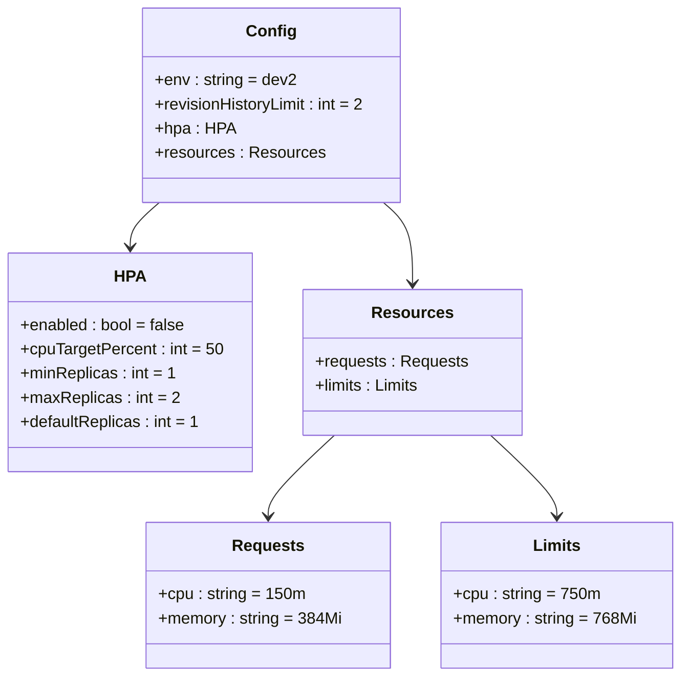
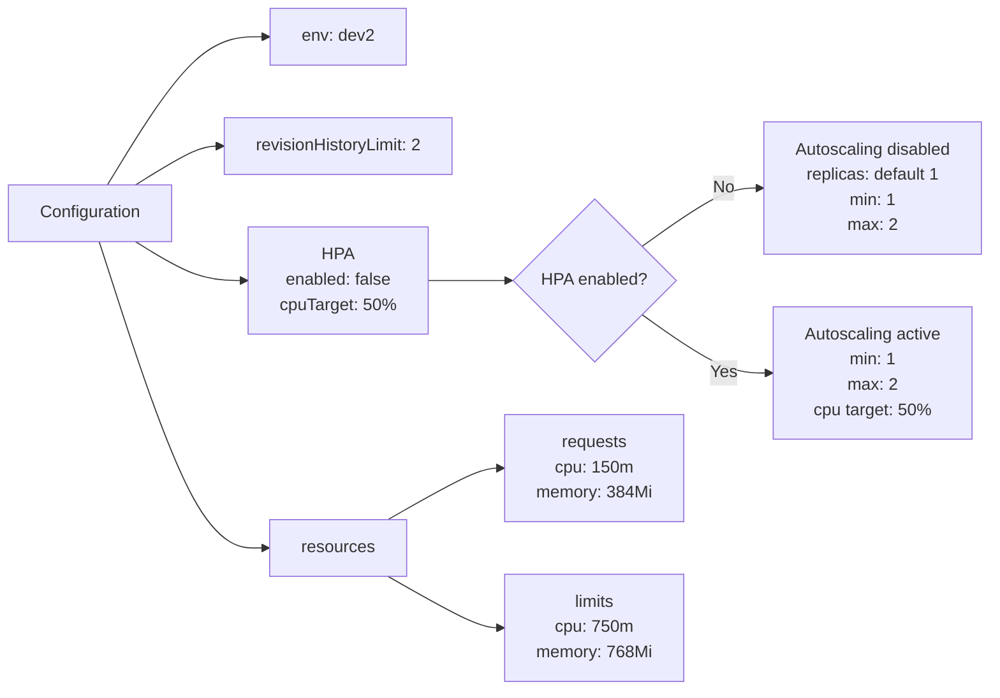

# Diagram: entity_core/entity_service/platform_applications/damage_submission_history_event/helm/profiles/values.dev2.yaml

> Auto-generated by Obscura crawlers

## Diagram 1

### SVG

<svg id="container" width="662.2578125" xmlns="http://www.w3.org/2000/svg" class="classDiagram" height="668" viewBox="0 0 662.2578125 668" role="graphics-document document" aria-roledescription="class"><g><defs><marker id="container_class-aggregationStart" class="marker aggregation class" refX="18" refY="7" markerWidth="190" markerHeight="240" orient="auto"><path d="M 18,7 L9,13 L1,7 L9,1 Z"></path></marker></defs><defs><marker id="container_class-aggregationEnd" class="marker aggregation class" refX="1" refY="7" markerWidth="20" markerHeight="28" orient="auto"><path d="M 18,7 L9,13 L1,7 L9,1 Z"></path></marker></defs><defs><marker id="container_class-extensionStart" class="marker extension class" refX="18" refY="7" markerWidth="190" markerHeight="240" orient="auto"><path d="M 1,7 L18,13 V 1 Z"></path></marker></defs><defs><marker id="container_class-extensionEnd" class="marker extension class" refX="1" refY="7" markerWidth="20" markerHeight="28" orient="auto"><path d="M 1,1 V 13 L18,7 Z"></path></marker></defs><defs><marker id="container_class-compositionStart" class="marker composition class" refX="18" refY="7" markerWidth="190" markerHeight="240" orient="auto"><path d="M 18,7 L9,13 L1,7 L9,1 Z"></path></marker></defs><defs><marker id="container_class-compositionEnd" class="marker composition class" refX="1" refY="7" markerWidth="20" markerHeight="28" orient="auto"><path d="M 18,7 L9,13 L1,7 L9,1 Z"></path></marker></defs><defs><marker id="container_class-dependencyStart" class="marker dependency class" refX="6" refY="7" markerWidth="190" markerHeight="240" orient="auto"><path d="M 5,7 L9,13 L1,7 L9,1 Z"></path></marker></defs><defs><marker id="container_class-dependencyEnd" class="marker dependency class" refX="13" refY="7" markerWidth="20" markerHeight="28" orient="auto"><path d="M 18,7 L9,13 L14,7 L9,1 Z"></path></marker></defs><defs><marker id="container_class-lollipopStart" class="marker lollipop class" refX="13" refY="7" markerWidth="190" markerHeight="240" orient="auto"><circle stroke="black" fill="transparent" cx="7" cy="7" r="6"></circle></marker></defs><defs><marker id="container_class-lollipopEnd" class="marker lollipop class" refX="1" refY="7" markerWidth="190" markerHeight="240" orient="auto"><circle stroke="black" fill="transparent" cx="7" cy="7" r="6"></circle></marker></defs><g class="root"><g class="clusters"></g><g class="edgePaths"><path d="M154.985,200L150.266,204.167C145.547,208.333,136.11,216.667,131.391,224C126.672,231.333,126.672,237.667,126.672,240.833L126.672,244" id="id_Config_HPA_1" class="edge-thickness-normal edge-pattern-solid relation" style=";;;" data-edge="true" data-et="edge" data-id="id_Config_HPA_1" data-points="W3sieCI6MTU0Ljk4NDkyMzgxMTk4MzUsInkiOjIwMH0seyJ4IjoxMjYuNjcxODc1LCJ5IjoyMjV9LHsieCI6MTI2LjY3MTg3NSwieSI6MjUwfV0=" marker-end="url(#container_class-dependencyEnd)"></path><path d="M372.429,200L377.148,204.167C381.867,208.333,391.305,216.667,396.023,230C400.742,243.333,400.742,261.667,400.742,270.833L400.742,280" id="id_Config_Resources_2" class="edge-thickness-normal edge-pattern-solid relation" style=";;;" data-edge="true" data-et="edge" data-id="id_Config_Resources_2" data-points="W3sieCI6MzcyLjQyOTEzODY4ODAxNjUsInkiOjIwMH0seyJ4Ijo0MDAuNzQyMTg3NSwieSI6MjI1fSx7IngiOjQwMC43NDIxODc1LCJ5IjoyODZ9XQ==" marker-end="url(#container_class-dependencyEnd)"></path><path d="M324.492,430L313.725,440.167C302.958,450.333,281.424,470.667,270.657,484C259.891,497.333,259.891,503.667,259.891,506.833L259.891,510" id="id_Resources_Requests_3" class="edge-thickness-normal edge-pattern-solid relation" style=";;;" data-edge="true" data-et="edge" data-id="id_Resources_Requests_3" data-points="W3sieCI6MzI0LjQ5MTcxNzU3NTE4OCwieSI6NDMwfSx7IngiOjI1OS44OTA2MjUsInkiOjQ5MX0seyJ4IjoyNTkuODkwNjI1LCJ5Ijo1MTZ9XQ==" marker-end="url(#container_class-dependencyEnd)"></path><path d="M476.993,430L487.76,440.167C498.526,450.333,520.06,470.667,530.827,484C541.594,497.333,541.594,503.667,541.594,506.833L541.594,510" id="id_Resources_Limits_4" class="edge-thickness-normal edge-pattern-solid relation" style=";;;" data-edge="true" data-et="edge" data-id="id_Resources_Limits_4" data-points="W3sieCI6NDc2Ljk5MjY1NzQyNDgxMiwieSI6NDMwfSx7IngiOjU0MS41OTM3NSwieSI6NDkxfSx7IngiOjU0MS41OTM3NSwieSI6NTE2fV0=" marker-end="url(#container_class-dependencyEnd)"></path></g><g class="edgeLabels"><g class="edgeLabel"><g class="label" data-id="id_Config_HPA_1" transform="translate(0, 0)"><foreignObject width="0" height="0">

</foreignObject></g></g><g class="edgeLabel"><g class="label" data-id="id_Config_Resources_2" transform="translate(0, 0)"><foreignObject width="0" height="0">

</foreignObject></g></g><g class="edgeLabel"><g class="label" data-id="id_Resources_Requests_3" transform="translate(0, 0)"><foreignObject width="0" height="0">

</foreignObject></g></g><g class="edgeLabel"><g class="label" data-id="id_Resources_Limits_4" transform="translate(0, 0)"><foreignObject width="0" height="0">

</foreignObject></g></g></g><g class="nodes"><g class="node default" id="classId-Config-0" transform="translate(263.70703125, 104)"><g class="basic label-container"><path d="M-128.51171875 -96 L128.51171875 -96 L128.51171875 96 L-128.51171875 96" stroke="none" stroke-width="0" fill="#ECECFF" style=""></path><path d="M-128.51171875 -96 C-55.028900304290545 -96, 18.45391814141891 -96, 128.51171875 -96 M-128.51171875 -96 C-42.214942721878515 -96, 44.08183330624297 -96, 128.51171875 -96 M128.51171875 -96 C128.51171875 -32.499011538396346, 128.51171875 31.00197692320731, 128.51171875 96 M128.51171875 -96 C128.51171875 -47.94209114813784, 128.51171875 0.11581770372431777, 128.51171875 96 M128.51171875 96 C73.1528327466226 96, 17.793946743245186 96, -128.51171875 96 M128.51171875 96 C66.76782588420127 96, 5.023933018402545 96, -128.51171875 96 M-128.51171875 96 C-128.51171875 21.13974702837207, -128.51171875 -53.72050594325586, -128.51171875 -96 M-128.51171875 96 C-128.51171875 36.760885535433744, -128.51171875 -22.478228929132513, -128.51171875 -96" stroke="#9370DB" stroke-width="1.3" fill="none" stroke-dasharray="0 0" style=""></path></g><g class="annotation-group text" transform="translate(0, -72)"></g><g class="label-group text" transform="translate(-22.9296875, -72)"><g class="label" style="font-weight: bolder" transform="translate(0,-12)"><foreignObject width="45.859375" height="24">

Config

</foreignObject></g></g><g class="members-group text" transform="translate(-116.51171875, -24)"><g class="label" style="" transform="translate(0,-12)"><foreignObject width="138.140625" height="24">

+env : string = dev2

</foreignObject></g><g class="label" style="" transform="translate(0,12)"><foreignObject width="210.09375" height="24">

+revisionHistoryLimit : int = 2

</foreignObject></g><g class="label" style="" transform="translate(0,36)"><foreignObject width="76.125" height="24">

+hpa : HPA

</foreignObject></g><g class="label" style="" transform="translate(0,60)"><foreignObject width="163.578125" height="24">

+resources : Resources

</foreignObject></g></g><g class="methods-group text" transform="translate(-116.51171875, 96)"></g><g class="divider" style=""><path d="M-128.51171875 -48 C-42.68429499541375 -48, 43.1431287591725 -48, 128.51171875 -48 M-128.51171875 -48 C-72.10980818000826 -48, -15.707897610016516 -48, 128.51171875 -48" stroke="#9370DB" stroke-width="1.3" fill="none" stroke-dasharray="0 0" style=""></path></g><g class="divider" style=""><path d="M-128.51171875 72 C-35.58903208373009 72, 57.33365458253982 72, 128.51171875 72 M-128.51171875 72 C-69.75176094405515 72, -10.9918031381103 72, 128.51171875 72" stroke="#9370DB" stroke-width="1.3" fill="none" stroke-dasharray="0 0" style=""></path></g></g><g class="node default" id="classId-HPA-1" transform="translate(126.671875, 358)"><g class="basic label-container"><path d="M-118.671875 -108 L118.671875 -108 L118.671875 108 L-118.671875 108" stroke="none" stroke-width="0" fill="#ECECFF" style=""></path><path d="M-118.671875 -108 C-44.77979846326119 -108, 29.112278073477626 -108, 118.671875 -108 M-118.671875 -108 C-47.90238430901944 -108, 22.867106381961122 -108, 118.671875 -108 M118.671875 -108 C118.671875 -56.94873874351295, 118.671875 -5.8974774870258955, 118.671875 108 M118.671875 -108 C118.671875 -48.68544457791884, 118.671875 10.629110844162327, 118.671875 108 M118.671875 108 C31.754800311946553 108, -55.16227437610689 108, -118.671875 108 M118.671875 108 C56.51799658057662 108, -5.635881838846757 108, -118.671875 108 M-118.671875 108 C-118.671875 31.44930812667296, -118.671875 -45.10138374665408, -118.671875 -108 M-118.671875 108 C-118.671875 57.703313883451074, -118.671875 7.406627766902147, -118.671875 -108" stroke="#9370DB" stroke-width="1.3" fill="none" stroke-dasharray="0 0" style=""></path></g><g class="annotation-group text" transform="translate(0, -84)"></g><g class="label-group text" transform="translate(-14.375, -84)"><g class="label" style="font-weight: bolder" transform="translate(0,-12)"><foreignObject width="28.75" height="24">

HPA

</foreignObject></g></g><g class="members-group text" transform="translate(-106.671875, -36)"><g class="label" style="" transform="translate(0,-12)"><foreignObject width="163.296875" height="24">

+enabled : bool = false

</foreignObject></g><g class="label" style="" transform="translate(0,12)"><foreignObject width="198.96875" height="24">

+cpuTargetPercent : int = 50

</foreignObject></g><g class="label" style="" transform="translate(0,36)"><foreignObject width="151.359375" height="24">

+minReplicas : int = 1

</foreignObject></g><g class="label" style="" transform="translate(0,60)"><foreignObject width="154.921875" height="24">

+maxReplicas : int = 2

</foreignObject></g><g class="label" style="" transform="translate(0,84)"><foreignObject width="175.53125" height="24">

+defaultReplicas : int = 1

</foreignObject></g></g><g class="methods-group text" transform="translate(-106.671875, 108)"></g><g class="divider" style=""><path d="M-118.671875 -60 C-57.053204514249046 -60, 4.565465971501908 -60, 118.671875 -60 M-118.671875 -60 C-61.72351025812565 -60, -4.7751455162513 -60, 118.671875 -60" stroke="#9370DB" stroke-width="1.3" fill="none" stroke-dasharray="0 0" style=""></path></g><g class="divider" style=""><path d="M-118.671875 84 C-64.32643677766816 84, -9.980998555336328 84, 118.671875 84 M-118.671875 84 C-41.35134307142715 84, 35.969188857145696 84, 118.671875 84" stroke="#9370DB" stroke-width="1.3" fill="none" stroke-dasharray="0 0" style=""></path></g></g><g class="node default" id="classId-Resources-2" transform="translate(400.7421875, 358)"><g class="basic label-container"><path d="M-105.3984375 -72 L105.3984375 -72 L105.3984375 72 L-105.3984375 72" stroke="none" stroke-width="0" fill="#ECECFF" style=""></path><path d="M-105.3984375 -72 C-50.62850296827242 -72, 4.141431563455157 -72, 105.3984375 -72 M-105.3984375 -72 C-49.67306069779247 -72, 6.0523161044150555 -72, 105.3984375 -72 M105.3984375 -72 C105.3984375 -38.55360978875789, 105.3984375 -5.107219577515778, 105.3984375 72 M105.3984375 -72 C105.3984375 -17.01035413864934, 105.3984375 37.97929172270132, 105.3984375 72 M105.3984375 72 C44.83071461001305 72, -15.737008279973907 72, -105.3984375 72 M105.3984375 72 C56.41925370851411 72, 7.440069917028225 72, -105.3984375 72 M-105.3984375 72 C-105.3984375 18.391596239543667, -105.3984375 -35.21680752091267, -105.3984375 -72 M-105.3984375 72 C-105.3984375 28.89152504106496, -105.3984375 -14.216949917870082, -105.3984375 -72" stroke="#9370DB" stroke-width="1.3" fill="none" stroke-dasharray="0 0" style=""></path></g><g class="annotation-group text" transform="translate(0, -48)"></g><g class="label-group text" transform="translate(-37.265625, -48)"><g class="label" style="font-weight: bolder" transform="translate(0,-12)"><foreignObject width="74.53125" height="24">

Resources

</foreignObject></g></g><g class="members-group text" transform="translate(-93.3984375, 0)"><g class="label" style="" transform="translate(0,-12)"><foreignObject width="149.53125" height="24">

+requests : Requests

</foreignObject></g><g class="label" style="" transform="translate(0,12)"><foreignObject width="104.9375" height="24">

+limits : Limits

</foreignObject></g></g><g class="methods-group text" transform="translate(-93.3984375, 72)"></g><g class="divider" style=""><path d="M-105.3984375 -24 C-29.27682858886125 -24, 46.8447803222775 -24, 105.3984375 -24 M-105.3984375 -24 C-51.921430012528326 -24, 1.5555774749433482 -24, 105.3984375 -24" stroke="#9370DB" stroke-width="1.3" fill="none" stroke-dasharray="0 0" style=""></path></g><g class="divider" style=""><path d="M-105.3984375 48 C-49.83496746211365 48, 5.728502575772694 48, 105.3984375 48 M-105.3984375 48 C-48.44451449914593 48, 8.509408501708137 48, 105.3984375 48" stroke="#9370DB" stroke-width="1.3" fill="none" stroke-dasharray="0 0" style=""></path></g></g><g class="node default" id="classId-Requests-3" transform="translate(259.890625, 588)"><g class="basic label-container"><path d="M-119.0390625 -72 L119.0390625 -72 L119.0390625 72 L-119.0390625 72" stroke="none" stroke-width="0" fill="#ECECFF" style=""></path><path d="M-119.0390625 -72 C-40.628764391793254 -72, 37.78153371641349 -72, 119.0390625 -72 M-119.0390625 -72 C-71.17907882127946 -72, -23.319095142558908 -72, 119.0390625 -72 M119.0390625 -72 C119.0390625 -29.657310520362955, 119.0390625 12.68537895927409, 119.0390625 72 M119.0390625 -72 C119.0390625 -42.53794277736819, 119.0390625 -13.075885554736374, 119.0390625 72 M119.0390625 72 C49.16054483664654 72, -20.717972826706927 72, -119.0390625 72 M119.0390625 72 C36.723639292014425 72, -45.59178391597115 72, -119.0390625 72 M-119.0390625 72 C-119.0390625 34.32319906813738, -119.0390625 -3.3536018637252454, -119.0390625 -72 M-119.0390625 72 C-119.0390625 31.3670985020851, -119.0390625 -9.265802995829802, -119.0390625 -72" stroke="#9370DB" stroke-width="1.3" fill="none" stroke-dasharray="0 0" style=""></path></g><g class="annotation-group text" transform="translate(0, -48)"></g><g class="label-group text" transform="translate(-33.84375, -48)"><g class="label" style="font-weight: bolder" transform="translate(0,-12)"><foreignObject width="67.6875" height="24">

Requests

</foreignObject></g></g><g class="members-group text" transform="translate(-107.0390625, 0)"><g class="label" style="" transform="translate(0,-12)"><foreignObject width="142.46875" height="24">

+cpu : string = 150m

</foreignObject></g><g class="label" style="" transform="translate(0,12)"><foreignObject width="180.234375" height="24">

+memory : string = 384Mi

</foreignObject></g></g><g class="methods-group text" transform="translate(-107.0390625, 72)"></g><g class="divider" style=""><path d="M-119.0390625 -24 C-47.85074750532824 -24, 23.337567489343513 -24, 119.0390625 -24 M-119.0390625 -24 C-30.517781788736528 -24, 58.003498922526944 -24, 119.0390625 -24" stroke="#9370DB" stroke-width="1.3" fill="none" stroke-dasharray="0 0" style=""></path></g><g class="divider" style=""><path d="M-119.0390625 48 C-41.97950231238602 48, 35.080057875227965 48, 119.0390625 48 M-119.0390625 48 C-39.851786180347915 48, 39.33549013930417 48, 119.0390625 48" stroke="#9370DB" stroke-width="1.3" fill="none" stroke-dasharray="0 0" style=""></path></g></g><g class="node default" id="classId-Limits-4" transform="translate(541.59375, 588)"><g class="basic label-container"><path d="M-112.6640625 -72 L112.6640625 -72 L112.6640625 72 L-112.6640625 72" stroke="none" stroke-width="0" fill="#ECECFF" style=""></path><path d="M-112.6640625 -72 C-66.58101222975414 -72, -20.497961959508274 -72, 112.6640625 -72 M-112.6640625 -72 C-43.73782672941124 -72, 25.188409041177522 -72, 112.6640625 -72 M112.6640625 -72 C112.6640625 -30.772156727294757, 112.6640625 10.455686545410487, 112.6640625 72 M112.6640625 -72 C112.6640625 -33.97871726980873, 112.6640625 4.042565460382534, 112.6640625 72 M112.6640625 72 C44.15437481016666 72, -24.355312879666684 72, -112.6640625 72 M112.6640625 72 C34.55955959892509 72, -43.54494330214982 72, -112.6640625 72 M-112.6640625 72 C-112.6640625 34.508937731463256, -112.6640625 -2.9821245370734886, -112.6640625 -72 M-112.6640625 72 C-112.6640625 29.799782910804694, -112.6640625 -12.400434178390611, -112.6640625 -72" stroke="#9370DB" stroke-width="1.3" fill="none" stroke-dasharray="0 0" style=""></path></g><g class="annotation-group text" transform="translate(0, -48)"></g><g class="label-group text" transform="translate(-22.328125, -48)"><g class="label" style="font-weight: bolder" transform="translate(0,-12)"><foreignObject width="44.65625" height="24">

Limits

</foreignObject></g></g><g class="members-group text" transform="translate(-100.6640625, 0)"><g class="label" style="" transform="translate(0,-12)"><foreignObject width="142.40625" height="24">

+cpu : string = 750m

</foreignObject></g><g class="label" style="" transform="translate(0,12)"><foreignObject width="179" height="24">

+memory : string = 768Mi

</foreignObject></g></g><g class="methods-group text" transform="translate(-100.6640625, 72)"></g><g class="divider" style=""><path d="M-112.6640625 -24 C-44.85704607912619 -24, 22.949970341747616 -24, 112.6640625 -24 M-112.6640625 -24 C-53.4501206153514 -24, 5.763821269297196 -24, 112.6640625 -24" stroke="#9370DB" stroke-width="1.3" fill="none" stroke-dasharray="0 0" style=""></path></g><g class="divider" style=""><path d="M-112.6640625 48 C-43.54721230202077 48, 25.569637895958465 48, 112.6640625 48 M-112.6640625 48 C-45.3198514619 48, 22.0243595762 48, 112.6640625 48" stroke="#9370DB" stroke-width="1.3" fill="none" stroke-dasharray="0 0" style=""></path></g></g></g></g></g></svg>

## Diagram 2

### SVG

<svg id="container" width="1127.4375" xmlns="http://www.w3.org/2000/svg" class="flowchart" height="595.5859375" viewBox="0 0 1127.4375 595.5859375" role="graphics-document document" aria-roledescription="flowchart-v2"><g><marker id="container_flowchart-v2-pointEnd" class="marker flowchart-v2" viewBox="0 0 10 10" refX="5" refY="5" markerUnits="userSpaceOnUse" markerWidth="8" markerHeight="8" orient="auto"><path d="M 0 0 L 10 5 L 0 10 z" class="arrowMarkerPath" style="stroke-width: 1; stroke-dasharray: 1, 0;"></path></marker><marker id="container_flowchart-v2-pointStart" class="marker flowchart-v2" viewBox="0 0 10 10" refX="4.5" refY="5" markerUnits="userSpaceOnUse" markerWidth="8" markerHeight="8" orient="auto"><path d="M 0 5 L 10 10 L 10 0 z" class="arrowMarkerPath" style="stroke-width: 1; stroke-dasharray: 1, 0;"></path></marker><marker id="container_flowchart-v2-circleEnd" class="marker flowchart-v2" viewBox="0 0 10 10" refX="11" refY="5" markerUnits="userSpaceOnUse" markerWidth="11" markerHeight="11" orient="auto"><circle cx="5" cy="5" r="5" class="arrowMarkerPath" style="stroke-width: 1; stroke-dasharray: 1, 0;"></circle></marker><marker id="container_flowchart-v2-circleStart" class="marker flowchart-v2" viewBox="0 0 10 10" refX="-1" refY="5" markerUnits="userSpaceOnUse" markerWidth="11" markerHeight="11" orient="auto"><circle cx="5" cy="5" r="5" class="arrowMarkerPath" style="stroke-width: 1; stroke-dasharray: 1, 0;"></circle></marker><marker id="container_flowchart-v2-crossEnd" class="marker cross flowchart-v2" viewBox="0 0 11 11" refX="12" refY="5.2" markerUnits="userSpaceOnUse" markerWidth="11" markerHeight="11" orient="auto"><path d="M 1,1 l 9,9 M 10,1 l -9,9" class="arrowMarkerPath" style="stroke-width: 2; stroke-dasharray: 1, 0;"></path></marker><marker id="container_flowchart-v2-crossStart" class="marker cross flowchart-v2" viewBox="0 0 11 11" refX="-1" refY="5.2" markerUnits="userSpaceOnUse" markerWidth="11" markerHeight="11" orient="auto"><path d="M 1,1 l 9,9 M 10,1 l -9,9" class="arrowMarkerPath" style="stroke-width: 2; stroke-dasharray: 1, 0;"></path></marker><g class="root"><g class="clusters"></g><g class="edgePaths"><path d="M103.969,170L118.37,147.5C132.771,125,161.573,80,190.486,57.5C219.398,35,248.422,35,262.934,35L277.445,35" id="L_Config_Env_0" class="edge-thickness-normal edge-pattern-solid edge-thickness-normal edge-pattern-solid flowchart-link" style=";" data-edge="true" data-et="edge" data-id="L_Config_Env_0" data-points="W3sieCI6MTAzLjk2ODc1LCJ5IjoxNzB9LHsieCI6MTkwLjM3NSwieSI6MzV9LHsieCI6MjgxLjQ0NTMxMjUsInkiOjM1fV0=" marker-end="url(#container_flowchart-v2-pointEnd)"></path><path d="M134.956,170L144.192,164.833C153.429,159.667,171.902,149.333,187.823,144.167C203.745,139,217.115,139,223.799,139L230.484,139" id="L_Config_Revision_0" class="edge-thickness-normal edge-pattern-solid edge-thickness-normal edge-pattern-solid flowchart-link" style=";" data-edge="true" data-et="edge" data-id="L_Config_Revision_0" data-points="W3sieCI6MTM0Ljk1NTgxODk2NTUxNzI0LCJ5IjoxNzB9LHsieCI6MTkwLjM3NSwieSI6MTM5fSx7IngiOjIzNC40ODQzNzUsInkiOjEzOX1d" marker-end="url(#container_flowchart-v2-pointEnd)"></path><path d="M134.956,224L144.192,229.167C153.429,234.333,171.902,244.667,184.638,249.833C197.375,255,204.375,255,207.875,255L211.375,255" id="L_Config_HPASection_0" class="edge-thickness-normal edge-pattern-solid edge-thickness-normal edge-pattern-solid flowchart-link" style=";" data-edge="true" data-et="edge" data-id="L_Config_HPASection_0" data-points="W3sieCI6MTM0Ljk1NTgxODk2NTUxNzI0LCJ5IjoyMjR9LHsieCI6MTkwLjM3NSwieSI6MjU1fSx7IngiOjIxNS4zNzUsInkiOjI1NX1d" marker-end="url(#container_flowchart-v2-pointEnd)"></path><path d="M475.375,255L479.542,255C483.708,255,492.042,255,508.611,255C525.18,255,549.984,255,562.387,255L574.789,255" id="L_HPASection_HPADecision_0" class="edge-thickness-normal edge-pattern-solid edge-thickness-normal edge-pattern-solid flowchart-link" style=";" data-edge="true" data-et="edge" data-id="L_HPASection_HPADecision_0" data-points="W3sieCI6NDc1LjM3NSwieSI6MjU1fSx7IngiOjUwMC4zNzUsInkiOjI1NX0seyJ4Ijo1NzguNzg5MDYyNSwieSI6MjU1fV0=" marker-end="url(#container_flowchart-v2-pointEnd)"></path><path d="M708.011,231.05L727.077,222.375C746.143,213.7,784.275,196.35,808.846,187.675C833.417,179,844.427,179,849.932,179L855.438,179" id="L_HPADecision_HPAResult_0" class="edge-thickness-normal edge-pattern-solid edge-thickness-normal edge-pattern-solid flowchart-link" style=";" data-edge="true" data-et="edge" data-id="L_HPADecision_HPAResult_0" data-points="W3sieCI6NzA4LjAxMTIxMzk1NjIxNywieSI6MjMxLjA1MDI3NjQ1NjIxNzA2fSx7IngiOjgyMi40MDYyNSwieSI6MTc5fSx7IngiOjg1OS40Mzc1LCJ5IjoxNzl9XQ==" marker-end="url(#container_flowchart-v2-pointEnd)"></path><path d="M708.011,278.95L727.077,287.625C746.143,296.3,784.275,313.65,808.846,322.325C833.417,331,844.427,331,849.932,331L855.438,331" id="L_HPADecision_Autoscale_0" class="edge-thickness-normal edge-pattern-solid edge-thickness-normal edge-pattern-solid flowchart-link" style=";" data-edge="true" data-et="edge" data-id="L_HPADecision_Autoscale_0" data-points="W3sieCI6NzA4LjAxMTIxMzk1NjIxNywieSI6Mjc4Ljk0OTcyMzU0Mzc4Mjk3fSx7IngiOjgyMi40MDYyNSwieSI6MzMxfSx7IngiOjg1OS40Mzc1LCJ5IjozMzF9XQ==" marker-end="url(#container_flowchart-v2-pointEnd)"></path><path d="M96.422,224L112.081,267.431C127.74,310.862,159.057,397.724,189.069,441.155C219.081,484.586,247.786,484.586,262.139,484.586L276.492,484.586" id="L_Config_ResourcesSection_0" class="edge-thickness-normal edge-pattern-solid edge-thickness-normal edge-pattern-solid flowchart-link" style=";" data-edge="true" data-et="edge" data-id="L_Config_ResourcesSection_0" data-points="W3sieCI6OTYuNDIyMTk4ODY3MTg2NDQsInkiOjIyNH0seyJ4IjoxOTAuMzc1LCJ5Ijo0ODQuNTg1OTM3NX0seyJ4IjoyODAuNDkyMTg3NSwieSI6NDg0LjU4NTkzNzV9XQ==" marker-end="url(#container_flowchart-v2-pointEnd)"></path><path d="M410.258,457.796L425.277,451.594C440.297,445.392,470.336,432.989,488.855,426.788C507.375,420.586,514.375,420.586,517.875,420.586L521.375,420.586" id="L_ResourcesSection_Req_0" class="edge-thickness-normal edge-pattern-solid edge-thickness-normal edge-pattern-solid flowchart-link" style=";" data-edge="true" data-et="edge" data-id="L_ResourcesSection_Req_0" data-points="W3sieCI6NDEwLjI1NzgxMjUsInkiOjQ1Ny43OTU2MTQ5MTkzNTQ4fSx7IngiOjUwMC4zNzUsInkiOjQyMC41ODU5Mzc1fSx7IngiOjUyNS4zNzUsInkiOjQyMC41ODU5Mzc1fV0=" marker-end="url(#container_flowchart-v2-pointEnd)"></path><path d="M410.258,511.376L425.277,517.578C440.297,523.779,470.336,536.183,488.855,542.384C507.375,548.586,514.375,548.586,517.875,548.586L521.375,548.586" id="L_ResourcesSection_Lim_0" class="edge-thickness-normal edge-pattern-solid edge-thickness-normal edge-pattern-solid flowchart-link" style=";" data-edge="true" data-et="edge" data-id="L_ResourcesSection_Lim_0" data-points="W3sieCI6NDEwLjI1NzgxMjUsInkiOjUxMS4zNzYyNjAwODA2NDUyfSx7IngiOjUwMC4zNzUsInkiOjU0OC41ODU5Mzc1fSx7IngiOjUyNS4zNzUsInkiOjU0OC41ODU5Mzc1fV0=" marker-end="url(#container_flowchart-v2-pointEnd)"></path></g><g class="edgeLabels"><g class="edgeLabel"><g class="label" data-id="L_Config_Env_0" transform="translate(0, 0)"><foreignObject width="0" height="0">

</foreignObject></g></g><g class="edgeLabel"><g class="label" data-id="L_Config_Revision_0" transform="translate(0, 0)"><foreignObject width="0" height="0">

</foreignObject></g></g><g class="edgeLabel"><g class="label" data-id="L_Config_HPASection_0" transform="translate(0, 0)"><foreignObject width="0" height="0">

</foreignObject></g></g><g class="edgeLabel"><g class="label" data-id="L_HPASection_HPADecision_0" transform="translate(0, 0)"><foreignObject width="0" height="0">

</foreignObject></g></g><g class="edgeLabel" transform="translate(822.40625, 179)"><g class="label" data-id="L_HPADecision_HPAResult_0" transform="translate(-10.140625, -12)"><foreignObject width="20.28125" height="24">

No

</foreignObject></g></g><g class="edgeLabel" transform="translate(822.40625, 331)"><g class="label" data-id="L_HPADecision_Autoscale_0" transform="translate(-12.03125, -12)"><foreignObject width="24.0625" height="24">

Yes

</foreignObject></g></g><g class="edgeLabel"><g class="label" data-id="L_Config_ResourcesSection_0" transform="translate(0, 0)"><foreignObject width="0" height="0">

</foreignObject></g></g><g class="edgeLabel"><g class="label" data-id="L_ResourcesSection_Req_0" transform="translate(0, 0)"><foreignObject width="0" height="0">

</foreignObject></g></g><g class="edgeLabel"><g class="label" data-id="L_ResourcesSection_Lim_0" transform="translate(0, 0)"><foreignObject width="0" height="0">

</foreignObject></g></g></g><g class="nodes"><g class="node default" id="flowchart-Config-0" transform="translate(86.6875, 197)"><rect class="basic label-container" style="" x="-78.6875" y="-27" width="157.375" height="54"></rect><g class="label" style="" transform="translate(-48.6875, -12)"><rect></rect><foreignObject width="97.375" height="24">

Configuration

</foreignObject></g></g><g class="node default" id="flowchart-Env-1" transform="translate(345.375, 35)"><rect class="basic label-container" style="" x="-63.9296875" y="-27" width="127.859375" height="54"></rect><g class="label" style="" transform="translate(-33.9296875, -12)"><rect></rect><foreignObject width="67.859375" height="24">

env: dev2

</foreignObject></g></g><g class="node default" id="flowchart-Revision-3" transform="translate(345.375, 139)"><rect class="basic label-container" style="" x="-110.890625" y="-27" width="221.78125" height="54"></rect><g class="label" style="" transform="translate(-80.890625, -12)"><rect></rect><foreignObject width="161.78125" height="24">

revisionHistoryLimit: 2

</foreignObject></g></g><g class="node default" id="flowchart-HPASection-5" transform="translate(345.375, 255)"><rect class="basic label-container" style="" x="-130" y="-39" width="260" height="78"></rect><g class="label" style="" transform="translate(-100, -24)"><rect></rect><foreignObject width="200" height="48">

HPA\nenabled: false\ncpuTarget: 50%

</foreignObject></g></g><g class="node default" id="flowchart-HPADecision-7" transform="translate(655.375, 255)"><polygon points="76.5859375,0 153.171875,-76.5859375 76.5859375,-153.171875 0,-76.5859375" class="label-container" transform="translate(-76.0859375, 76.5859375)"></polygon><g class="label" style="" transform="translate(-49.5859375, -12)"><rect></rect><foreignObject width="99.171875" height="24">

HPA enabled?

</foreignObject></g></g><g class="node default" id="flowchart-HPAResult-9" transform="translate(989.4375, 179)"><rect class="basic label-container" style="" x="-130" y="-51" width="260" height="102"></rect><g class="label" style="" transform="translate(-100, -36)"><rect></rect><foreignObject width="200" height="72">

Autoscaling disabled\nreplicas: default 1\nmin: 1\nmax: 2

</foreignObject></g></g><g class="node default" id="flowchart-Autoscale-11" transform="translate(989.4375, 331)"><rect class="basic label-container" style="" x="-130" y="-51" width="260" height="102"></rect><g class="label" style="" transform="translate(-100, -36)"><rect></rect><foreignObject width="200" height="72">

Autoscaling active\nmin: 1\nmax: 2\ncpu target: 50%

</foreignObject></g></g><g class="node default" id="flowchart-ResourcesSection-13" transform="translate(345.375, 484.5859375)"><rect class="basic label-container" style="" x="-64.8828125" y="-27" width="129.765625" height="54"></rect><g class="label" style="" transform="translate(-34.8828125, -12)"><rect></rect><foreignObject width="69.765625" height="24">

resources

</foreignObject></g></g><g class="node default" id="flowchart-Req-15" transform="translate(655.375, 420.5859375)"><rect class="basic label-container" style="" x="-130" y="-39" width="260" height="78"></rect><g class="label" style="" transform="translate(-100, -24)"><rect></rect><foreignObject width="200" height="48">

requests\ncpu: 150m\nmemory: 384Mi

</foreignObject></g></g><g class="node default" id="flowchart-Lim-17" transform="translate(655.375, 548.5859375)"><rect class="basic label-container" style="" x="-130" y="-39" width="260" height="78"></rect><g class="label" style="" transform="translate(-100, -24)"><rect></rect><foreignObject width="200" height="48">

limits\ncpu: 750m\nmemory: 768Mi

</foreignObject></g></g></g></g></g></svg>
